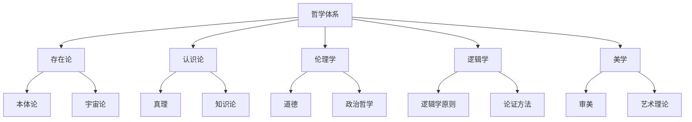
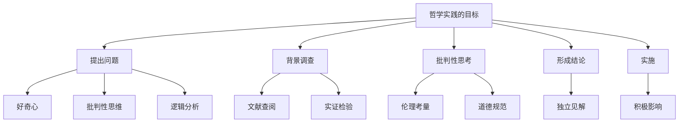
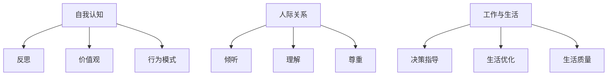
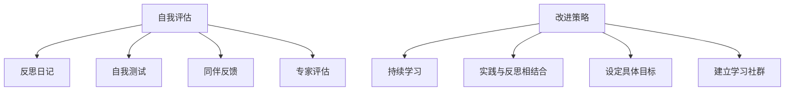
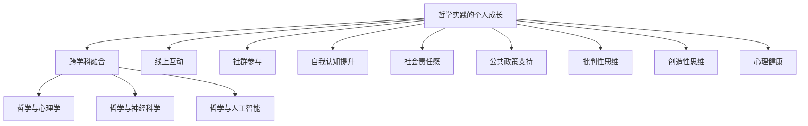
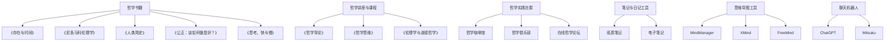

                 

### 第一部分：哲学基础与实践

#### 第1章：哲学的概览

**1.1 哲学的起源与发展**

哲学，作为一门探讨存在、知识、价值、理性、心灵、语言等基本问题的学科，其起源可以追溯到古希腊时期。苏格拉底、柏拉图和亚里士多德等哲学家通过不断的思考和辩论，奠定了西方哲学的基础。在东方，哲学的起源同样悠久，中国儒家、道家和佛教哲学形成了独特的哲学体系。

随着时间的推移，哲学不断发展，流派纷呈。从古希腊的唯理论到中世纪的经院哲学，再到近现代的科学哲学和语言哲学，哲学始终在演变中寻求对世界和人生的深刻理解。

**1.2 哲学的基本问题**

哲学的基本问题包括存在论、认识论、伦理学、逻辑学、美学等。存在论探讨现实世界的本质，认识论研究人类如何认识世界，伦理学关注人类行为的价值判断，逻辑学提供思维的工具，美学则探讨美和艺术。

**1.3 哲学在现代社会的作用**

在现代社会，哲学的作用不可忽视。哲学不仅为科学提供了基础，同时也对人文社会科学的发展起到了指导作用。哲学帮助我们反思自身存在的意义，探索知识的边界，评判道德和价值观，指导人类在复杂多变的社会中作出合理的决策。

**核心概念与联系：哲学体系**



**图1：哲学体系的核心概念与关系架构**

此流程图展示了哲学体系中的核心概念及其相互关系。每个分支代表哲学的一个子领域，它们相互交织，共同构成了哲学的复杂网络。

#### 第2章：深度思考的重要性

**2.1 深度思考的定义与特征**

深度思考是一种深入、系统、批判性的思考方式。它不仅仅是表面上的理解，而是一种对问题进行深入挖掘和透彻分析的过程。深度思考的特征包括：对问题背景的深入了解、对不同观点的全面评估、逻辑严密的推理和批判性思考。

**2.2 深度思考的价值**

深度思考的价值在于它能够帮助人们更好地解决问题、做出决策，并提高个人的认知水平。通过深度思考，人们可以更全面地理解复杂问题，发现问题的本质，从而找到更有效的解决方案。

**2.3 深度思考的实践方法**

要培养深度思考的习惯，首先需要培养好奇心，保持对新知识和新观点的开放态度。其次，需要培养批判性思维，学会质疑现有的观点和方法，通过逻辑分析和实证检验来评估其合理性。此外，定期进行思维训练，如阅读哲学书籍、参与辩论和写作，也是提高深度思考能力的重要方法。

**Python源代码示例：深度思考的算法实现**

```python
def deep_think(problem):
    """
    深度思考问题的算法实现
    :param problem: 待解决的问题
    :return: 解决问题的方案
    """
    # 对问题进行背景了解
    background_info = gather_background_info(problem)
    
    # 对不同解决方案进行评估
    solutions = evaluate_solutions(problem, background_info)
    
    # 批判性思考，选择最佳方案
    best_solution = critical_thinking(solutions)
    
    # 实施解决方案
    implement_solution(best_solution)
    
    return best_solution

def gather_background_info(problem):
    """
    收集问题背景信息
    :param problem: 待解决的问题
    :return: 问题的背景信息
    """
    # 这里可以添加收集信息的代码，如查询数据库、文献等
    return "背景信息"

def evaluate_solutions(problem, background_info):
    """
    评估不同解决方案
    :param problem: 待解决的问题
    :param background_info: 问题的背景信息
    :return: 不同解决方案的评估结果
    """
    # 这里可以添加评估方案的代码，如计算成本、效果等
    return ["方案1", "方案2", "方案3"]

def critical_thinking(solutions):
    """
    批判性思考，选择最佳方案
    :param solutions: 不同解决方案
    :return: 最佳解决方案
    """
    # 这里可以添加批判性思考的代码，如逻辑分析、实证检验等
    return "最佳方案"

def implement_solution(solution):
    """
    实施解决方案
    :param solution: 最佳解决方案
    """
    # 这里可以添加实施解决方案的代码
    print(f"实施解决方案：{solution}")

# 测试深度思考算法
deep_think("问题")
```

**图2：深度思考的算法实现流程图**


此代码和流程图展示了如何通过编程实现深度思考的过程。通过逐步收集背景信息、评估解决方案、进行批判性思考和实施解决方案，可以模拟人类的深度思考过程。

#### 第3章：哲学实践的基本原则

**3.1 哲学实践的目标**

哲学实践的目标是帮助个体更好地理解世界和自我，提升认知能力和思维能力。通过哲学实践，个体能够更深入地思考问题，形成独立的见解，并在日常生活中应用哲学原理。

**3.2 哲学实践的过程**

哲学实践的过程包括以下几个步骤：首先，提出问题；其次，进行背景调查和文献查阅；然后，进行批判性思考和逻辑分析；最后，形成结论并实施。这一过程要求个体具备好奇心、批判性思维和逻辑分析能力。

**3.3 哲学实践中的伦理考量**

在哲学实践中，伦理考量至关重要。个体在进行哲学实践时，需要考虑其行为是否符合道德规范，是否对他人和社会产生积极影响。伦理考量帮助个体在复杂的道德情境中作出合理的决策，促进个体的道德成长。

**核心概念与联系：哲学实践的原则**



**图3：哲学实践的核心概念与关系架构**

此流程图展示了哲学实践的基本原则及其相互关系。每个步骤都依赖于前一个步骤的成果，共同构成了哲学实践的系统流程。

#### 第4章：哲学实践的应用

**4.1 哲学在自我认知中的应用**

哲学在自我认知中的应用主要体现在帮助个体反思自身的存在、价值观和行为模式。通过哲学实践，个体可以深入理解自己的内心世界，发现自我认知中的盲点，从而实现自我提升和成长。

**4.2 哲学在人际关系中的应用**

哲学在人际关系中的应用可以帮助个体更好地理解他人，建立和谐的人际关系。通过哲学思考，个体可以学会倾听、理解和尊重他人，从而提高人际沟通的质量。

**4.3 哲学在工作与生活中的应用**

哲学在工作与生活中的应用主要体现在提供决策指导、优化生活方式和提高生活质量。通过哲学实践，个体可以更清晰地认识自己的职业目标和生活愿景，从而实现个人价值和幸福。

**核心概念与联系：哲学实践的应用领域**



**图4：哲学实践的应用领域与核心概念**

此流程图展示了哲学实践在不同领域中的应用及其核心概念。通过哲学实践，个体可以在各个领域获得深刻的理解和提升。

### 总结

哲学作为一门探讨基本问题的学科，对人类生活具有深远的影响。通过深度思考和哲学实践，个体可以提升自我认知、优化人际关系、指导工作和生活。哲学实践不仅是理论的学习，更是一种生活方式的调整。通过不断实践哲学原理，个体可以更好地理解世界和自己，实现全面成长。

作者：AI天才研究院/AI Genius Institute & 禅与计算机程序设计艺术 /Zen And The Art of Computer Programming

---

本部分涵盖了哲学的起源与发展、深度思考的重要性、哲学实践的基本原则以及哲学实践的应用。通过详细的分析和实例，展示了哲学在现代社会的重要性以及如何将深度思考融入平凡的生活。接下来，我们将进一步探讨日常生活中哲学实践的具体案例，帮助读者更好地理解和实践哲学原理。

## 第二部分：日常生活中的哲学实践

### 第5章：日常生活中的哲学实践案例

**5.1 早餐哲学：如何通过早餐思考人生**

早餐，作为一天的开始，不仅关乎身体健康，更关乎精神状态。通过早餐，我们可以进行哲学思考，探索人生的本质。

**案例1：早餐哲学实践**

假设你正在准备早餐，你可能会思考以下问题：

- **价值观**：你选择吃什么，反映了你的价值观。是选择健康、均衡的饮食，还是追求口感和美味？这反映了你对生活质量的追求和价值观。
- **意义**：早餐对你来说意味着什么？它是否是你与家人团聚的时刻，还是你独自思考的静谧时光？这反映了你对家庭和自我时间的重视。
- **习惯**：你是否每天都按时吃早餐，还是有的时候会忽略它？这反映了你的生活习惯和对健康的态度。

通过这些问题，我们可以反思自己的价值观、生活方式和习惯，从而更好地理解自己。

**案例2：早餐哲学案例**

小明是一个年轻上班族，每天早晨都会在路边买一杯咖啡和一个三明治作为早餐。有一天，他开始思考自己的早餐习惯：

- **价值观**：他意识到自己选择咖啡和三明治是因为快捷和方便，但这并不一定符合自己的健康需求。于是，他决定开始尝试自己制作早餐，选择更健康、更均衡的食物。
- **意义**：他发现自己忽视了与家人的早餐时光，这让他感到有些失落。于是，他开始尝试在周末与家人一起准备早餐，享受家庭团聚的美好时刻。
- **习惯**：通过改变早餐习惯，他逐渐养成了健康的生活方式，不仅对身体有益，也对精神状态产生了积极影响。

**5.2 交通哲学：如何应对交通堵塞**

交通堵塞是现代城市生活中常见的问题，它不仅浪费时间，还影响心情。通过哲学思考，我们可以更好地应对交通堵塞，保持心态平和。

**案例1：交通哲学实践**

假设你在路上遇到交通堵塞，你可能会思考以下问题：

- **意义**：交通堵塞对你意味着什么？是让你感到焦虑和沮丧，还是提供了一个思考和反思的机会？
- **态度**：你如何看待交通堵塞？是抱怨和愤怒，还是接受和适应？
- **选择**：在交通堵塞中，你可以做些什么来保持心态平和？是听音乐、读书，还是与朋友聊天？

通过这些问题，我们可以调整自己的心态，更好地应对交通堵塞。

**案例2：交通哲学案例**

小华是一名上班族，每天都会在高峰时段乘坐地铁上班。有一天，地铁突然出现故障，导致严重的交通堵塞：

- **意义**：小华意识到，交通堵塞是一个不可控制的情况，抱怨和愤怒并不能改变现实。于是，他决定接受这个现实，尝试调整自己的心态。
- **态度**：他开始思考如何利用这段时间，例如阅读书籍、听音乐或思考工作上的问题。通过这样的方式，他不仅消磨了等待的时间，还提高了自己的工作效率。
- **选择**：在接下来的几个月里，小华开始提前出门，以避免高峰期的交通堵塞。此外，他还开始尝试使用公共交通工具，如公交车和自行车，以减少对地铁的依赖。

**5.3 工作哲学：如何在工作中实现自我价值**

工作不仅仅是为了赚钱，更是实现自我价值的过程。通过哲学思考，我们可以更好地理解工作的意义，实现自我价值。

**案例1：工作哲学实践**

假设你正在工作中，你可能会思考以下问题：

- **目标**：你的工作目标是什么？是完成日常任务，还是实现长期职业规划？
- **意义**：你的工作对你意味着什么？是满足物质需求，还是实现自我价值？
- **态度**：你如何看待工作？是将其视为负担，还是视为实现自我价值的途径？
- **选择**：在面临工作选择时，你如何做出决定？是根据兴趣和能力，还是根据薪资和职位？

通过这些问题，我们可以更清楚地理解自己的工作意义，从而实现自我价值。

**案例2：工作哲学案例**

小李是一名软件工程师，他在工作中遇到了职业瓶颈：

- **目标**：小李意识到，他的工作目标不仅仅是完成代码，而是实现技术突破和创新。于是，他开始积极寻求参与新技术研究和项目开发，以提高自己的技术水平。
- **意义**：小李意识到，他的工作不仅仅是为了赚钱，更是为了实现自己的技术梦想。通过这样的思考，他开始更加热爱自己的工作，并投入更多的时间和精力。
- **态度**：他开始积极与同事交流，分享自己的工作经验和见解，从而提高团队的整体技术水平。此外，他还开始关注行业动态，了解最新的技术发展趋势，以保持自己的竞争力。
- **选择**：在面临工作选择时，小李不再仅仅考虑薪资和职位，而是更加关注工作内容和技术挑战。通过这样的选择，他找到了更适合自己的工作，实现了自我价值的提升。

### 总结

日常生活中的哲学实践案例展示了哲学原理在现实生活中的应用。通过早餐、交通和工作中的哲学思考，个体可以更好地理解自我、应对挑战和实现自我价值。哲学不仅是一门学科，更是一种生活方式。通过不断地哲学思考和实践，个体可以提升自我认知、优化人际关系和提高生活质量。

### 第6章：哲学实践的自我评估

**6.1 自我评估的重要性**

自我评估是哲学实践的重要环节。通过自我评估，个体可以了解自己在哲学实践中的进展，发现自身存在的问题和不足，从而有针对性地进行改进。自我评估不仅有助于提升个人的认知能力，还能帮助个体在哲学实践中更加深入和系统地进行思考和反思。

**6.2 哲学实践的评估方法**

自我评估的方法多种多样，以下是一些常用的评估方法：

- **反思日记**：通过记录每天的反思日记，个体可以回顾自己的哲学实践过程，总结经验教训，发现问题和改进方向。
- **自我测试**：通过设计哲学相关的自我测试题，个体可以检验自己的哲学知识和理解程度，识别自身的知识盲点和思维误区。
- **同伴反馈**：与朋友或同行分享自己的哲学实践心得，通过他们的反馈和建议，个体可以获得不同的视角和改进意见。
- **专家评估**：寻求哲学专家或导师的评估，通过他们的专业指导，个体可以更深入地理解哲学实践的核心要义，发现自己的不足并得到改进建议。

**6.3 哲学实践的改进策略**

为了提升哲学实践的效果，个体可以采取以下改进策略：

- **持续学习**：哲学是一个不断发展的领域，个体需要持续学习新的哲学思想和知识，以保持对哲学的敏锐洞察力和理解深度。
- **实践与反思相结合**：将哲学实践与反思日记、自我测试和同伴反馈相结合，通过不断地实践和反思，个体可以逐步提高自己的哲学思维能力和实践水平。
- **设定具体目标**：为自己设定明确的哲学实践目标，如阅读一定数量的哲学书籍、完成一定数量的哲学思考题或参与哲学讨论小组等，通过具体的目标和计划，个体可以更有针对性地进行哲学实践。
- **建立学习社群**：加入哲学学习社群或在线论坛，与志同道合的人一起分享哲学心得和思考，通过交流和讨论，个体可以拓宽视野，提高哲学实践的效果。

**核心概念与联系：自我评估与改进策略**



**图5：自我评估与改进策略的关系架构**

此流程图展示了自我评估和改进策略之间的关系。通过反思日记、自我测试、同伴反馈和专家评估，个体可以了解自己在哲学实践中的表现，并通过持续学习、实践与反思相结合、设定具体目标和建立学习社群等策略，不断提升哲学实践的效果。

### 第7章：哲学实践的未来展望

**7.1 哲学实践的发展趋势**

随着科技的进步和社会的发展，哲学实践也在不断演变。未来，哲学实践将更加注重跨学科融合，如哲学与心理学、神经科学、人工智能等领域的结合，从而提供更全面和深刻的哲学思考和解决方案。同时，随着网络和社交媒体的普及，哲学实践将更加注重线上互动和社群参与，为个体提供更多的哲学交流和讨论平台。

**7.2 哲学实践的社会影响**

哲学实践的社会影响不可忽视。通过哲学实践，个体可以提升自我认知、增强批判性思维能力，从而在社会中发挥更大的作用。哲学实践有助于培养个体的社会责任感和道德素养，促进社会的和谐与进步。同时，哲学实践还可以为公共政策制定提供智力支持，帮助政府和社会更好地应对复杂的社会问题。

**7.3 哲学实践的个人成长**

哲学实践对个人的成长具有重要意义。通过哲学实践，个体可以更深刻地理解自我和世界，形成独立的见解和价值观。哲学实践有助于培养个体的批判性思维、创造性思维和解决问题的能力，从而在学术、职业和个人生活中取得更好的成就。此外，哲学实践还可以提高个体的心理健康，帮助个体更好地应对压力和挑战。

**核心概念与联系：哲学实践的未来发展**



**图6：哲学实践的未来发展与影响架构**

此流程图展示了哲学实践的未来发展趋势、社会影响和个人成长。通过跨学科融合、线上互动和社群参与，哲学实践将不断发展。同时，哲学实践对个人和社会的积极影响将体现在自我认知提升、社会责任感、公共政策支持和心理健康等方面。

### 总结

哲学实践不仅关乎个体的自我成长，也对社会的进步产生深远影响。通过哲学实践，个体可以提升自我认知、增强批判性思维能力，并在学术、职业和个人生活中取得更好的成就。同时，哲学实践还有助于培养社会责任感，为公共政策制定提供智力支持，促进社会的和谐与进步。未来，随着科技的进步和社会的发展，哲学实践将继续发挥重要作用，为人类社会的繁荣和个人的幸福作出更大贡献。

### 附录：哲学实践的资源与工具

#### 第8章：哲学实践的资源

**8.1 哲学书籍推荐**

- 《存在与时间》（海德格尔）
- 《尼各马科伦理学》（亚里士多德）
- 《人类简史》（哈蒙德）
- 《公正：该如何做是好？》（约翰·罗尔斯）
- 《思考，快与慢》（丹尼尔·卡尼曼）

**8.2 哲学讲座与课程**

- 牛津大学公开课《哲学导论》
- Coursera上的《哲学思维》
- EdX上的《伦理学与道德哲学》

**8.3 哲学实践社群**

- 哲学咖啡馆
- 哲学俱乐部
- 在线哲学论坛如Philosophy Stack Exchange

#### 第9章：哲学实践的工具

**9.1 笔记与日记**

-纸质笔记：有助于深度思考和记忆
-电子笔记：方便整理和查找，如Evernote、OneNote

**9.2 思维导图**

- MindManager
- XMind
- FreeMind

**9.3 聊天机器人**

- ChatGPT：基于AI的聊天机器人，可用于哲学探讨和思考
- Mitsuku：一个人工智能聊天机器人，能进行哲学对话

**核心概念与联系：哲学实践的资源与工具**



**图7：哲学实践的资源与工具关系架构**

此流程图展示了哲学实践的资源与工具，包括哲学书籍、讲座与课程、实践社群、笔记与日记工具、思维导图工具以及聊天机器人。这些资源与工具为哲学实践提供了丰富的支持，有助于个体深入理解和应用哲学原理。

### 总结

哲学实践的资源与工具为个体的哲学探索提供了丰富的支持。通过哲学书籍、讲座与课程、实践社群、笔记与日记工具、思维导图工具以及聊天机器人，个体可以系统地学习哲学知识，深入进行哲学思考，并在实际生活中应用哲学原理。这些资源与工具不仅有助于提升个体的哲学素养，还能促进哲学实践的发展，使哲学真正融入日常生活。

作者：AI天才研究院/AI Genius Institute & 禅与计算机程序设计艺术 /Zen And The Art of Computer Programming

---

本附录部分为读者提供了丰富的哲学实践资源与工具，包括哲学书籍推荐、讲座与课程、实践社群、笔记与日记工具、思维导图工具以及聊天机器人。通过这些资源与工具，读者可以系统地学习哲学知识，深入进行哲学思考，并在实际生活中应用哲学原理。希望这些资源与工具能够帮助读者更好地实践哲学，实现自我提升与成长。

