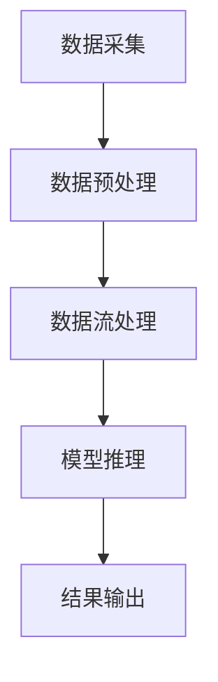

                 

### 书籍标题

## 《时序推理任务中的因果关系发现与验证机制》

### 关键词

- **时序推理**
- **因果关系**
- **数据验证**
- **机器学习**
- **图论**

### 摘要

本书全面深入探讨了时序推理任务中的因果关系发现与验证机制。首先，介绍了时序数据的定义、特征及其在现实世界中的应用场景。接着，重点阐述了基于统计学、机器学习和图论的各种因果关系发现方法，包括依赖性度量、Granger因果检验、序列分类模型、因果图模型等。随后，详细描述了因果关系验证机制，包括基于模型的验证方法和基于数据的验证方法，如交叉验证、模型泛化能力评估、实时验证等。最后，通过综合应用案例展示了因果关系发现与验证在实际项目中的价值，并对未来发展趋势进行了展望。本书适合数据科学家、机器学习工程师及相关专业的研究生和专业人士阅读。

## 引言

### 1.1 书籍背景与目标

时序数据（Time Series Data）是记录某一变量在时间上的变化情况的数据集。例如，股票价格、气温变化、销售数据等都属于时序数据。时序数据具有时间依赖性和动态变化性，因此在进行数据分析时，需要考虑时间因素，这便引出了时序推理（Time Series Inference）任务。时序推理任务的核心在于预测未来的趋势、发现潜在的模式和因果关系等。

因果关系（Causality）是科学研究中至关重要的概念，它指的是一个事件（因）导致另一个事件（果）发生的现象。在时序推理任务中，发现和验证因果关系对于理解数据背后的机制、做出合理的预测和决策具有重要意义。然而，因果关系的发现和验证面临诸多挑战，如数据噪声、伪相关性、模型偏差等。

本书的目标是系统地介绍时序推理任务中的因果关系发现与验证机制，帮助读者理解和掌握相关方法和技术。本书分为五个部分，内容结构如下：

1. **时序数据基础**：介绍时序数据的基本概念、特征、建模基础及数据预处理方法。
2. **因果关系发现方法**：介绍基于统计学、机器学习和图论的因果关系发现方法。
3. **因果关系验证机制**：介绍因果关系验证的方法和机制，包括基于模型和基于数据的方法。
4. **综合应用与案例**：通过实际案例展示因果关系发现与验证在实际项目中的应用。
5. **未来发展趋势与展望**：讨论因果关系发现与验证的未来发展趋势和研究方向。

本书旨在为研究人员、数据科学家和机器学习工程师提供一本全面、系统的参考书籍，帮助他们更好地理解和应用时序推理任务中的因果关系发现与验证机制。

### 1.2 本书阅读对象

本书适合以下读者群体：

1. **研究生及高年级本科生**：对时序数据和因果关系感兴趣的学术研究者，需要深入了解相关理论和方法。
2. **数据科学家**：从事数据分析、数据挖掘、预测建模等领域的工作者，希望通过本书提升时序数据处理和因果关系分析的能力。
3. **机器学习工程师**：在机器学习项目中需要应用时序数据的工程师，希望通过本书学习因果关系发现与验证的相关技术。

### 1.3 主要内容概述

本书的主要内容包括：

- **时序数据基础**：介绍时序数据的概念、特征和建模基础，包括时间序列模型和数据预处理方法。
- **因果关系发现方法**：介绍基于统计学、机器学习和图论的因果关系发现方法，包括依赖性度量、Granger因果检验、序列分类模型、因果图模型等。
- **因果关系验证机制**：介绍因果关系验证的方法和机制，包括基于模型的验证方法和基于数据的验证方法，如交叉验证、模型泛化能力评估、实时验证等。
- **综合应用与案例**：通过实际案例展示因果关系发现与验证在实际项目中的应用，如预测与优化、决策支持、风险评估等。
- **未来发展趋势与展望**：讨论因果关系发现与验证的未来发展趋势和研究方向，包括新方法、跨学科融合和社会经济影响等。

通过阅读本书，读者可以系统地了解时序推理任务中的因果关系发现与验证机制，掌握相关方法和技术，并在实际项目中应用这些知识。

### 1.4 研究现状与挑战

当前，时序推理任务中的因果关系发现与验证机制在学术界和工业界都得到了广泛的关注。研究者们提出了一系列方法，包括基于统计学的Granger因果检验、基于机器学习的序列分类模型和序列回归模型，以及基于图论的因果图模型和贝叶斯网络等。这些方法在理论和实践中都取得了一定的成果，但仍然面临一些挑战。

首先，数据噪声和伪相关性是因果关系发现中常见的问题。由于时序数据中存在大量的噪声和非线性关系，使得直接基于数据的方法难以准确识别因果关系。其次，模型选择和参数调优也是一大挑战。不同模型的假设和适用范围不同，如何选择合适的模型并调整参数以最大化模型的预测能力是一个复杂的问题。此外，因果关系的验证也是一个重要挑战。如何有效地验证发现的因果关系，避免伪因果现象，是当前研究中的一个热点问题。

本书旨在解决上述问题，通过系统地介绍各种因果关系发现与验证方法，并提供实际案例和代码实现，帮助读者深入理解和掌握时序推理任务中的因果关系发现与验证机制。同时，本书还将探讨未来发展趋势和研究方向，为读者提供更广阔的视野。

## 第二部分：时序数据基础

### 2.1 时序数据概述

时序数据（Time Series Data）是一种按照时间顺序记录的一系列数据点，通常用于描述某个变量随着时间的变化情况。时序数据在各个领域都有广泛的应用，如金融、气象、医疗、电子商务等。例如，股票价格、气温变化、医院就诊人数、商品销售额等都属于时序数据。

时序数据具有以下基本特征：

1. **时间依赖性**：时序数据中的每个数据点都与特定的时间点相关联，且后续数据点的取值受先前数据点的影响。这意味着时序数据中的数据点之间存在时间依赖性。
2. **动态变化性**：时序数据随着时间的推移而变化，其变化可能是线性的，也可能是非线性的。这种动态变化性使得时序数据与静态数据不同，后者不涉及时间因素。
3. **周期性**：某些时序数据具有周期性特征，即其变化在一定时间范围内重复出现。例如，季节性数据通常在一年中的某些时间段出现相似的波动模式。

时序数据的这些特性使得它们在数据分析、预测和决策支持中具有重要应用。通过分析时序数据，可以揭示数据背后的趋势、周期性模式、季节性波动等，从而为决策提供依据。例如，在金融领域，通过分析股票价格的时序数据，可以预测股票价格的未来走势，帮助投资者做出投资决策。在气象领域，通过分析气温的时序数据，可以预测未来几天的天气情况，为公众提供天气预报服务。

### 2.2 时序数据的分类

根据时序数据的特性，可以将时序数据分为以下几类：

1. **确定性时序数据**：确定性时序数据指的是其变化具有确定性规律的数据。这类数据通常可以用简单的数学模型来描述。例如，简单的线性时序数据可以表示为：
   $$
   X_t = \alpha_0 + \alpha_1 t + \epsilon_t
   $$
   其中，\(X_t\) 表示第 \(t\) 个时间点的数据值，\(\alpha_0\) 和 \(\alpha_1\) 是模型参数，\(\epsilon_t\) 是随机误差。

2. **随机时序数据**：随机时序数据指的是其变化受随机过程影响的数据。这类数据通常不能用简单的确定性模型来描述，而是通过统计模型来建模。常见的随机时序数据模型包括自回归模型（AR）、移动平均模型（MA）、自回归移动平均模型（ARMA）和集成自回归移动平均模型（ARIMA）等。

3. **非线性时序数据**：非线性时序数据指的是其变化不能用线性模型来描述的数据。这类数据通常具有复杂的动态变化特征，需要使用非线性模型来建模。常见的非线性时序数据模型包括时间序列平滑模型（TSAS）、灰色模型（GM）和神经网络模型（NN）等。

4. **周期性时序数据**：周期性时序数据指的是其变化具有周期性特征的数据。这类数据通常在一段时间内重复出现相似的波动模式。常见的周期性时序数据模型包括季节性分解模型（STL）和周期性波动模型（CTW）等。

根据不同的应用场景和数据分析需求，可以选择合适的时序数据模型来描述和预测数据。例如，在金融领域，通常使用ARIMA模型来预测股票价格；在气象领域，通常使用STL模型来分析气温的季节性波动。

### 2.3 时序数据的表示

时序数据的表示方法可以分为离散时序和连续时序两种类型。

1. **离散时序**：离散时序数据是指在离散的时间点上记录的数据，通常以时间序列的形式表示。例如，股票价格每天记录一次，医院就诊人数每周记录一次。离散时序数据可以用一个一维数组或列表来表示，其中每个元素表示一个时间点的数据值。例如：
   ```python
   data = [100, 102, 98, 105, 110, 108]
   ```
   在这个例子中，`data` 列表表示一周内每天的股票价格。

2. **连续时序**：连续时序数据是指在连续的时间区间上记录的数据，通常以时间序列的形式表示。例如，气温每小时记录一次，传感器数据每秒记录一次。连续时序数据可以用一个函数或时间序列图像来表示，其中自变量是时间，因变量是数据值。例如：
   ```python
   data = {
       "2023-01-01 00:00:00": 10,
       "2023-01-01 01:00:00": 12,
       "2023-01-01 02:00:00": 9
   }
   ```
   在这个例子中，`data` 字典表示一天内每小时记录的气温值。

无论是离散时序还是连续时序，都可以通过数值、图像或表格等多种方式进行表示。在数据分析过程中，选择合适的时序数据表示方法有助于更好地理解和分析数据。

### 2.4 数据预处理方法

在时序数据分析中，数据预处理是至关重要的一步。良好的数据预处理可以提高模型的性能和预测准确性，同时降低噪声和异常值对分析结果的影响。以下是几种常见的数据预处理方法：

1. **缺失值处理**：缺失值是时序数据中常见的问题，通常可以通过以下几种方法来处理：

   - **删除缺失值**：删除含有缺失值的观测值，适用于缺失值较少且对整体数据影响不大的情况。
   - **填充缺失值**：使用适当的统计方法填充缺失值，例如使用均值、中位数或插值法。对于时间序列数据，插值法（如线性插值、拉格朗日插值）常用于填充缺失值。
   - **多重插补**：生成多个完整的数据集，并对每个数据集进行建模和分析，然后综合各个数据集的结果来提高预测的鲁棒性。

2. **异常值检测**：异常值是指那些偏离整体数据分布的值，可能会对模型性能产生负面影响。以下是一些常见的异常值检测方法：

   - **基于阈值的异常值检测**：设定一个阈值，将距离阈值较远的值视为异常值。例如，可以使用标准差法、箱线图法等。
   - **基于统计方法的异常值检测**：使用统计方法（如Grubbs测试、DBScan聚类算法等）检测异常值。
   - **基于机器学习的异常值检测**：使用机器学习算法（如孤立森林、自编码器等）检测异常值。

3. **数据归一化与标准化**：归一化和标准化是常用的数据变换方法，用于将不同量纲的数据转换为具有相同量纲的数据，以便进行模型训练和预测。以下是一些常见的方法：

   - **归一化**：将数据缩放到一个固定区间，例如[0, 1]或[-1, 1]，公式如下：
     $$
     x_{\text{norm}} = \frac{x - \text{min}(x)}{\text{max}(x) - \text{min}(x)}
     $$
   - **标准化**：将数据转换为标准正态分布，公式如下：
     $$
     x_{\text{std}} = \frac{x - \text{mean}(x)}{\text{stddev}(x)}
     $$
   - **零均值标准化**：将数据转换为具有零均值的分布，公式如下：
     $$
     x_{\text{zero}} = x - \text{mean}(x)
     $$

4. **数据降维与特征提取**：对于高维时序数据，降维和特征提取是减少数据复杂度、提高模型性能的有效方法。以下是一些常见的方法：

   - **主成分分析（PCA）**：通过保留主要成分来减少数据维度，适用于线性关系。
   - **线性判别分析（LDA）**：通过保留能够最大程度分离不同类别的特征来减少数据维度，适用于分类问题。
   - **自编码器（Autoencoder）**：使用神经网络自动学习数据的低维表示，适用于非线性的特征提取。

通过这些数据预处理方法，可以有效地提高时序数据分析的质量和效率，为后续的因果关系发现和验证打下坚实基础。

### 2.5 时序数据的挑战

时序数据在分析和建模过程中面临许多挑战，这些挑战直接影响着因果关系发现和验证的准确性和有效性。以下是一些主要的挑战：

1. **数据噪声**：时序数据常常受到外部噪声和内部噪声的影响。外部噪声可能来源于环境因素、传感器误差等，而内部噪声则可能来源于数据采集、处理过程中的随机性。这些噪声会导致时序数据的实际变化与潜在趋势产生偏差，从而影响因果关系分析的结果。

2. **伪相关性**：伪相关性是指两个变量在时间序列上的相关性并非真实存在的因果关系，而是由于数据中的随机波动或时间依赖性导致的。例如，股票价格的波动可能与天气变化相关，但这种相关性并不是因果关系，而是偶然的关联。识别和去除伪相关性是时序分析中的一个重要问题。

3. **非线性关系**：许多时序数据呈现出复杂的非线性关系，而不是简单的线性关系。非线性关系使得传统的线性模型难以准确捕捉数据中的潜在模式。因此，需要使用能够处理非线性关系的复杂模型，如神经网络、支持向量机等。

4. **稀疏数据**：某些时序数据可能存在稀疏性，即数据点之间的时间间隔较大，导致数据集不够密集。稀疏数据会使得基于密集数据的模型难以拟合，从而影响模型的性能。

5. **多尺度分析**：时序数据可能涉及多个时间尺度，如年、季度、月、日等。不同时间尺度的数据往往具有不同的特征和变化规律，如何在不同的时间尺度上进行统一分析是一个挑战。

6. **实时处理与更新**：许多应用场景要求对实时数据进行分析和预测，例如金融市场、智能交通系统等。实时处理与更新时序数据，同时保持分析的一致性和准确性，是一个技术上的难题。

7. **模型选择与调优**：选择合适的模型和优化模型参数是时序分析中的关键步骤。不同的模型适用于不同类型的数据和问题，且模型参数的调优可能需要多次实验和验证。

面对这些挑战，研究人员提出了各种方法和策略，如降噪技术、非线性建模、多尺度分析、实时数据处理和自动化模型选择等，以提升时序数据分析的准确性和有效性。本书将在后续章节中详细介绍这些方法和技术。

## 第三部分：因果关系发现方法

### 3.1 基于统计学的因果关系发现

在时序推理任务中，基于统计学的因果关系发现方法是一种常用的技术手段。这些方法通过分析变量之间的相关性，从而推断出可能的因果关系。以下将介绍几种基于统计学的因果关系发现方法，包括依赖性度量、Granger因果检验和聚类分析。

#### 依赖性度量

依赖性度量是分析变量之间相关性的一种基本方法。它通过计算两个变量之间的相关系数，来量化它们之间的相关性。常用的相关系数包括皮尔逊相关系数、斯皮尔曼等级相关系数和肯德尔等级相关系数。

- **皮尔逊相关系数**：皮尔逊相关系数是衡量两个连续变量线性相关性的最常用指标。其计算公式为：
  $$
  r = \frac{\sum_{i=1}^{n}(x_i - \bar{x})(y_i - \bar{y})}{\sqrt{\sum_{i=1}^{n}(x_i - \bar{x})^2 \sum_{i=1}^{n}(y_i - \bar{y})^2}}
  $$
  其中，\(x_i\) 和 \(y_i\) 分别为第 \(i\) 个时间点的两个变量的观测值，\(\bar{x}\) 和 \(\bar{y}\) 分别为它们的均值。

- **斯皮尔曼等级相关系数**：当变量不是连续的，而是以等级形式给出时，可以使用斯皮尔曼等级相关系数。其计算公式为：
  $$
  \rho = 1 - \frac{6\sum d_i^2}{n(n^2 - 1)}
  $$
  其中，\(d_i\) 是第 \(i\) 对观测值的等级差异，\(n\) 是观测值的数量。

- **肯德尔等级相关系数**：当数据包括多个等级时，肯德尔等级相关系数用于衡量等级之间的相关性。其计算公式为：
  $$
  \tau = \frac{N - \frac{12\sum R_i^2}{n(n-1)}}{N - 1}
  $$
  其中，\(N\) 是等级对的数量，\(R_i\) 是第 \(i\) 个等级对中等级的个数。

依赖性度量方法简单直观，能够初步揭示变量之间的相关性，但需要注意的是，相关性并不等同于因果关系。

#### Granger因果检验

Granger因果检验是由英国统计学家克莱夫·格兰杰（Clive Granger）提出的，用于检验两个时间序列变量之间是否存在因果关系。其基本思想是通过比较加入滞后变量后的模型与仅包含当前变量的模型，来判断变量之间是否存在因果关系。

Granger因果检验的步骤如下：

1. **构建模型**：分别构建两个模型，一个是仅包含当前变量的模型，另一个是包含当前变量和滞后变量的模型。例如，对于两个时间序列 \(X_t\) 和 \(Y_t\)，模型可以表示为：
   $$
   Y_t = \alpha_0 + \alpha_1 Y_{t-1} + \alpha_2 X_{t-1} + \epsilon_t
   $$
   $$
   Y_t = \alpha_0 + \alpha_1 Y_{t-1} + \epsilon_t
   $$

2. **估计模型参数**：使用最小二乘法估计两个模型的参数。

3. **比较模型**：通过F检验比较两个模型的AIC（Akaike信息准则）或BIC（贝叶斯信息准则），判断是否加入滞后变量能显著提高模型的拟合度。

4. **结论**：如果包含滞后变量的模型拟合度显著优于仅包含当前变量的模型，则可以认为 \(X_t\) 对 \(Y_t\) 具有Granger因果关系。

Granger因果检验是一种广泛应用于时序数据因果关系分析的方法，但它也存在一些局限性。例如，它基于线性模型假设，无法捕捉非线性关系，并且可能受到数据噪声的影响。

#### 聚类分析

聚类分析是一种无监督学习方法，用于将数据分为若干个簇，使同一簇内的数据点之间相似度较高，而不同簇之间的数据点相似度较低。在因果关系发现中，聚类分析可以通过分析变量在不同簇中的分布情况，来探索潜在的因果关系。

常用的聚类算法包括K-均值聚类、层次聚类和密度聚类等。以下简要介绍K-均值聚类算法：

1. **初始化**：随机选择 \(k\) 个聚类中心点。

2. **分配数据点**：将每个数据点分配到最近的聚类中心点所在的簇。

3. **更新聚类中心**：计算每个簇的均值，作为新的聚类中心点。

4. **迭代**：重复步骤2和步骤3，直到聚类中心不再发生变化或满足收敛条件。

通过聚类分析，可以初步识别出可能存在因果关系的变量簇。例如，如果某些变量主要在一个簇中，而其他变量分布在不同的簇中，则可能表明这些变量之间存在因果关系。

总的来说，基于统计学的因果关系发现方法为时序数据分析提供了有力的工具。依赖性度量、Granger因果检验和聚类分析等方法相互补充，可以帮助我们从不同角度探索时序数据中的潜在因果关系。

### 3.2 基于机器学习的因果关系发现

基于机器学习的因果关系发现方法近年来在时序数据分析中得到了广泛关注。机器学习算法能够从大量数据中自动学习特征和模式，从而识别出潜在的因果关系。以下将介绍几种基于机器学习的因果关系发现方法，包括序列分类模型、序列标注模型和序列回归模型。

#### 序列分类模型

序列分类模型用于预测时序数据中某个变量在未来某个时间点的类别标签。在因果关系发现中，序列分类模型可以通过预测变量之间的转换关系来识别潜在的因果关系。常用的序列分类模型包括：

- **循环神经网络（RNN）**：RNN 是一种专门用于处理序列数据的人工神经网络。它通过在时间步之间传递信息，能够捕捉序列中的长期依赖关系。RNN 的一个变体是长短期记忆网络（LSTM），LSTM 能够避免传统 RNN 的梯度消失问题，更好地处理长序列数据。

- **卷积神经网络（CNN）**：虽然 CNN 原本主要用于图像处理，但它也可以应用于序列数据。通过将卷积操作应用于时间步，CNN 能够提取序列中的局部特征，并利用池化操作减少数据维度。

- **Transformer**：Transformer 是一种基于注意力机制的序列建模模型，特别适用于处理长序列数据。它通过多头自注意力机制，能够捕捉序列中的全局依赖关系，从而提高分类模型的性能。

以下是一个使用 Python 和 Keras 库实现 RNN 序列分类模型的简单示例：

```python
from tensorflow.keras.models import Sequential
from tensorflow.keras.layers import LSTM, Dense

# 假设我们有一个包含特征序列和标签的数据集
X_train, y_train = ...

# 构建 RNN 模型
model = Sequential()
model.add(LSTM(50, activation='relu', input_shape=(X_train.shape[1], X_train.shape[2])))
model.add(Dense(1, activation='sigmoid'))

# 编译模型
model.compile(optimizer='adam', loss='binary_crossentropy', metrics=['accuracy'])

# 训练模型
model.fit(X_train, y_train, epochs=10, batch_size=64)
```

#### 序列标注模型

序列标注模型用于预测时序数据中每个时间点的标签，如单词在句子中的词性标注或序列中的类别标签。在因果关系发现中，序列标注模型可以通过预测变量在不同时间点的变化模式，来揭示潜在的因果关系。

- **CRF（条件随机场）**：CRF 是一种概率图模型，专门用于序列标注任务。它能够通过建模序列中的依赖关系，提高标注的准确性。

- **BiLSTM-CRF**：BiLSTM-CRF 是一种结合了双向 LSTM 和 CRF 的序列标注模型。它通过双向 LSTM 捕获序列中的前向和后向依赖关系，再通过 CRF 模型进行序列标注。

以下是一个使用 Python 和 TensorFlow 库实现 BiLSTM-CRF 序列标注模型的简单示例：

```python
from tensorflow.keras.models import Model
from tensorflow.keras.layers import Input, LSTM, Dense, Embedding, TimeDistributed, Bidirectional, CRF

# 假设我们有一个包含单词序列、标签序列和词嵌入的数据集
input_sequences, true_labels = ...

# 定义模型输入
input_seq = Input(shape=(None, embedding_size))
lstm_out = Bidirectional(LSTM(128, activation='relu', return_sequences=True))(input_seq)

# 添加 CRF 层
crf_output = TimeDistributed(Dense(num_classes, activation='softmax'))(lstm_out)
crf = CRF(num_classes)
crf_output = crf(input_seq, mask_sequences=True)

# 定义模型结构
model = Model(inputs=input_seq, outputs=crf_output)

# 编译模型
model.compile(optimizer='adam', loss=crf.loss_function, metrics=[crf.accuracy])

# 训练模型
model.fit(input_sequences, true_labels, batch_size=64, epochs=10)
```

#### 序列回归模型

序列回归模型用于预测时序数据中某个变量在未来某个时间点的数值。在因果关系发现中，序列回归模型可以通过预测变量之间的数值关系，来揭示潜在的因果关系。

- **ARIMA（自回归积分滑动平均模型）**：ARIMA 是一种经典的时序建模方法，适用于线性时序数据。它通过建模滞后项、差分项和移动平均项，来预测时序数据的未来值。

- **LSTM-GRU**：LSTM-GRU 是一种结合了 LSTM 和门控循环单元（GRU）的序列回归模型。它通过引入门控机制，能够更好地捕捉序列中的短期和长期依赖关系。

以下是一个使用 Python 和 Keras 库实现 LSTM-GRU 序列回归模型的简单示例：

```python
from tensorflow.keras.models import Sequential
from tensorflow.keras.layers import LSTM, GRU, Dense

# 假设我们有一个包含特征序列和标签序列的数据集
X_train, y_train = ...

# 构建 LSTM-GRU 模型
model = Sequential()
model.add(LSTM(50, activation='relu', return_sequences=True, input_shape=(X_train.shape[1], X_train.shape[2])))
model.add(GRU(50, activation='relu'))
model.add(Dense(1))

# 编译模型
model.compile(optimizer='adam', loss='mse')

# 训练模型
model.fit(X_train, y_train, epochs=10, batch_size=64)
```

综上所述，基于机器学习的因果关系发现方法通过不同的序列模型，能够有效地从时序数据中识别潜在的因果关系。这些方法不仅能够处理线性关系，还能够捕捉非线性关系，为时序数据分析提供了强大的工具。

### 3.3 基于图论的因果关系发现

基于图论的因果关系发现方法在时序数据分析中具有重要应用。图论方法通过建立变量之间的依赖关系图，从而揭示潜在的因果关系。以下将介绍几种基于图论的因果关系发现方法，包括因果图模型、贝叶斯网络和网络嵌入。

#### 因果图模型

因果图模型（Causal Graph Model，CGM）是一种用于表示变量之间因果关系的有向无环图（DAG）。在因果图模型中，每个节点表示一个变量，每条边表示变量之间的因果关系。因果图模型通过学习变量之间的依赖关系，从而推断出潜在的因果关系。

因果图模型的构建通常包括以下步骤：

1. **结构学习**：结构学习是指通过分析数据来确定变量之间的依赖关系，从而构建因果图。常用的结构学习方法包括基于贝叶斯模型的算法（如贝叶斯评分算法）和基于统计学方法的算法（如条件独立性测试）。

2. **参数学习**：参数学习是指在确定因果图结构后，通过数据来估计模型中的参数值。参数学习通常使用最大似然估计（MLE）或贝叶斯估计。

以下是一个使用 Python 和 PyMC3 库实现因果图模型的结构学习和参数学习的简单示例：

```python
import pymc3 as pm
import numpy as np

# 假设我们有一个包含变量观测值的数据集
X = np.array([[0, 1], [1, 0], [1, 1], [0, 1]])

with pm.Model() as model:
    # 定义变量之间的依赖关系
    alpha = pm.Normal('alpha', mu=0, sigma=10)
    beta = pm.Normal('beta', mu=0, sigma=10)
    theta1 = pm.Normal('theta1', mu=alpha + beta * X[0, 0], sigma=1)
    theta2 = pm.Normal('theta2', mu=alpha + beta * X[0, 1], sigma=1)
    theta3 = pm.Normal('theta3', mu=alpha + beta * X[1, 0], sigma=1)
    theta4 = pm.Normal('theta4', mu=alpha + beta * X[1, 1], sigma=1)

    # 定义观测数据
    obs = pm.Deterministic('obs', [theta1, theta2, theta3, theta4])

    # 添加观测数据的先验分布
    obs_prior = pm.Deterministic('obs_prior', [0, 0, 0, 0])

    # 定义模型
    model = pm.Model([alpha, beta, theta1, theta2, theta3, theta4], obs, obs_prior)

    # 运行 MCMC 模拟
    trace = pm.sample(1000, tune=1000)

# 输出参数估计结果
pm.plot_trace(trace)
```

#### 贝叶斯网络

贝叶斯网络（Bayesian Network，BN）是一种基于概率论的图形模型，用于表示变量之间的条件依赖关系。在贝叶斯网络中，每个节点表示一个变量，节点之间的边表示变量之间的依赖关系。贝叶斯网络通过条件概率表（CPT）来描述变量之间的概率关系。

贝叶斯网络在因果关系发现中的应用主要包括：

1. **结构学习**：通过数据学习变量之间的依赖关系，构建贝叶斯网络结构。常用的结构学习方法包括基于最大似然估计的算法和基于信息准则的算法（如贝叶斯信息准则、最小描述长度准则）。

2. **参数学习**：在确定贝叶斯网络结构后，通过数据来估计模型中的参数值。常用的参数学习算法包括最大似然估计（MLE）和贝叶斯估计。

以下是一个使用 Python 和 PyBN 库实现贝叶斯网络结构学习和参数学习的简单示例：

```python
import pybn as pb
import numpy as np

# 假设我们有一个包含变量观测值的数据集
X = np.array([[0, 1], [1, 0], [1, 1], [0, 1]])

# 定义变量
A = pb.Variable('A', [0, 1])
B = pb.Variable('B', [0, 1])

# 构建贝叶斯网络结构
bn = pb.BayesNet()
bn.add_edge(A, B)

# 学习贝叶斯网络结构
bn.fit(X, method='score')

# 输出结构
print(bn)

# 学习贝叶斯网络参数
bn.fit(X, method='mle')

# 输出参数
print(bn.parameters)
```

#### 网络嵌入

网络嵌入（Network Embedding）是一种将网络中的节点映射到低维向量空间的方法，从而保持节点之间的依赖关系。在因果关系发现中，网络嵌入可以用于将变量映射到低维空间，从而简化模型并提高计算效率。

常见的网络嵌入算法包括：

- **DeepWalk**：DeepWalk 是一种基于随机游走的网络嵌入算法。它通过生成网络中的随机游走路径，然后使用循环神经网络（RNN）学习节点表示。

- **Node2Vec**：Node2Vec 是一种结合了随机游走和嵌入技术的算法。它通过调整游走的深度和多样性，生成不同类型的节点表示。

以下是一个使用 Python 和 Gensim 库实现 Node2Vec 网络嵌入的简单示例：

```python
from node2vec import Node2Vec
import networkx as nx

# 建立图
G = nx.Graph()
G.add_edges_from([(0, 1), (0, 2), (1, 2), (1, 3), (2, 3)])

# 使用 Node2Vec 训练嵌入模型
model = Node2Vec(G, dimensions=2, walk_length=10, num_walks=100)
model.train(window_size=5)

# 输出节点表示
print(model.nodes())
```

综上所述，基于图论的因果关系发现方法通过因果图模型、贝叶斯网络和网络嵌入等技术，为时序数据分析提供了强大的工具。这些方法能够有效地捕捉变量之间的依赖关系，从而揭示潜在的因果关系。

## 第四部分：因果关系验证机制

### 4.1 因果关系验证概述

因果关系验证是时序推理任务中至关重要的一环，其目的是验证通过因果关系发现方法得到的因果关系是否真实有效。因果关系验证不仅有助于提高分析结果的可靠性，还能减少伪因果关系带来的误导。因果关系验证主要包括以下几个方面：

1. **验证方法分类**：因果关系验证可以基于模型和数据两种不同的方法进行。基于模型的方法主要通过评估模型在不同数据集上的泛化能力，如交叉验证等。基于数据的方法则通过直接比较不同条件下的数据变化，如伪因果关系检测等。

2. **验证指标**：因果关系验证需要使用适当的指标来衡量验证效果。常见的验证指标包括模型的准确率、召回率、F1 分数等。此外，还可以使用模型的可解释性和透明度作为验证指标，确保因果关系发现的合理性和可接受性。

3. **验证过程**：因果关系验证通常包括数据集划分、模型训练与验证、验证指标计算和结果分析等步骤。在实际应用中，可能需要多次迭代验证过程，以优化模型和验证方法。

### 4.2 基于模型的验证方法

基于模型的因果关系验证方法主要通过评估模型在不同数据集上的泛化能力，来判断因果关系是否真实有效。以下将介绍几种常见的基于模型的验证方法，包括交叉验证、模型泛化能力评估和模型解释性分析。

#### 交叉验证

交叉验证（Cross-Validation）是一种常用的模型评估方法，通过将数据集划分为多个子集，轮流作为验证集和训练集，来评估模型的泛化能力。常见的交叉验证方法包括：

1. **K-折交叉验证**：将数据集划分为 \(K\) 个相等的子集，每次选择一个子集作为验证集，其余子集作为训练集，重复 \(K\) 次。最终，通过计算所有验证集上的模型性能指标的平均值，来评估模型的泛化能力。

2. **留一法交叉验证**：每次仅保留一个数据点作为验证集，其余数据点作为训练集，重复 \(N\) 次。这种方法虽然计算量大，但能够最大限度地减少数据选择偏差。

以下是一个使用 Python 和 Scikit-Learn 库实现 K-折交叉验证的简单示例：

```python
from sklearn.model_selection import KFold
from sklearn.linear_model import LinearRegression

# 假设我们有一个特征矩阵 X 和目标向量 y
X = np.array([[1, 2], [3, 4], [5, 6], [7, 8]])
y = np.array([1, 2, 3, 4])

# 使用 K-折交叉验证
kf = KFold(n_splits=3)
for train_index, test_index in kf.split(X):
    X_train, X_test = X[train_index], X[test_index]
    y_train, y_test = y[train_index], y[test_index]
    
    # 训练模型
    model = LinearRegression()
    model.fit(X_train, y_train)
    
    # 评估模型性能
    score = model.score(X_test, y_test)
    print("Validation score:", score)
```

#### 模型泛化能力评估

模型泛化能力评估是因果关系验证的关键步骤，通过评估模型在不同数据集上的表现，来判断其是否具有泛化能力。以下是一些常用的评估指标和方法：

1. **准确率**：准确率（Accuracy）是评估二分类模型性能的常用指标，定义为正确预测的样本数占总样本数的比例。

2. **召回率**：召回率（Recall）是评估模型对于正类样本的识别能力，定义为正确识别的正类样本数与实际正类样本数的比例。

3. **F1 分数**：F1 分数是准确率和召回率的调和平均值，用于综合评估模型的性能。

4. **ROC 曲线和 AUC 值**：ROC 曲线（Receiver Operating Characteristic Curve）是评估二分类模型性能的图形工具，AUC 值（Area Under Curve）是 ROC 曲线下方的面积，用于衡量模型的分类能力。

以下是一个使用 Python 和 Scikit-Learn 库实现模型泛化能力评估的简单示例：

```python
from sklearn.model_selection import train_test_split
from sklearn.metrics import accuracy_score, recall_score, f1_score, roc_auc_score
from sklearn.linear_model import LogisticRegression

# 假设我们有一个特征矩阵 X 和目标向量 y
X = np.array([[1, 2], [3, 4], [5, 6], [7, 8]])
y = np.array([1, 0, 1, 0])

# 划分训练集和测试集
X_train, X_test, y_train, y_test = train_test_split(X, y, test_size=0.2, random_state=42)

# 训练模型
model = LogisticRegression()
model.fit(X_train, y_train)

# 评估模型性能
y_pred = model.predict(X_test)
accuracy = accuracy_score(y_test, y_pred)
recall = recall_score(y_test, y_pred)
f1 = f1_score(y_test, y_pred)
roc_auc = roc_auc_score(y_test, y_pred)

print("Accuracy:", accuracy)
print("Recall:", recall)
print("F1 Score:", f1)
print("ROC AUC Score:", roc_auc)
```

#### 模型解释性分析

模型解释性分析是因果关系验证的重要环节，通过分析模型内部的决策过程和特征权重，来判断因果关系是否合理。以下是一些常用的模型解释性分析方法：

1. **特征重要性分析**：通过计算模型中各个特征的权重或重要性，来识别对因果关系贡献最大的特征。

2. **因果效应分析**：通过分析模型对特征变化的响应，来判断变量之间的因果关系是否具有实际意义。

3. **模型可解释性工具**：使用可视化工具或解释性库（如 LIME、SHAP 等）来分析模型内部的决策过程。

以下是一个使用 Python 和 Scikit-Learn 库实现特征重要性分析的简单示例：

```python
from sklearn.inspection import permutation_importance

# 假设我们有一个特征矩阵 X 和目标向量 y
X = np.array([[1, 2], [3, 4], [5, 6], [7, 8]])
y = np.array([1, 0, 1, 0])

# 训练模型
model = LogisticRegression()
model.fit(X, y)

# 计算特征重要性
result = permutation_importance(model, X, y, n_repeats=10, random_state=42)
importances = result.importances_mean

# 输出特征重要性
print("Feature importances:")
for i in range(X.shape[1]):
    print(f"Feature {i}: {importances[i]:.3f}")
```

综上所述，基于模型的因果关系验证方法通过交叉验证、模型泛化能力评估和模型解释性分析等多种手段，为时序推理任务中的因果关系发现提供了可靠的验证手段。

### 4.3 基于数据的验证方法

基于数据的因果关系验证方法主要通过分析不同条件下的数据变化，来判断因果关系是否真实有效。以下将介绍几种常见的基于数据的验证方法，包括数据集划分、伪因果关系检测和数据不平衡处理。

#### 数据集划分

数据集划分是因果关系验证的基础步骤，通过将数据集划分为不同的子集，可以评估模型在不同数据集上的表现，从而验证因果关系的稳定性。常见的数据集划分方法包括：

1. **训练集与验证集划分**：将数据集划分为训练集和验证集，用于模型的训练和验证。通常，训练集用于训练模型，验证集用于评估模型性能。

2. **时间序列交叉验证**：对于时序数据，可以使用时间序列交叉验证（Time Series Cross-Validation）方法，将数据集按时间顺序划分为多个子集，用于训练和验证模型的时序稳定性。

3. **重复抽样**：通过重复抽样方法（如 k-折交叉验证），多次划分训练集和验证集，以减少数据划分的随机性，提高验证结果的可靠性。

以下是一个使用 Python 和 Scikit-Learn 库实现时间序列交叉验证的简单示例：

```python
from sklearn.model_selection import TimeSeriesSplit
from sklearn.linear_model import LinearRegression

# 假设我们有一个特征矩阵 X 和目标向量 y
X = np.array([[1, 2], [3, 4], [5, 6], [7, 8]])
y = np.array([1, 2, 3, 4])

# 使用时间序列交叉验证
tscv = TimeSeriesSplit(n_splits=3)
for train_index, test_index in tscv.split(X):
    X_train, X_test = X[train_index], X[test_index]
    y_train, y_test = y[train_index], y[test_index]
    
    # 训练模型
    model = LinearRegression()
    model.fit(X_train, y_train)
    
    # 评估模型性能
    score = model.score(X_test, y_test)
    print("Validation score:", score)
```

#### 伪因果关系检测

伪因果关系是指由于数据中的随机波动或时间依赖性导致的表面上的因果关系，而不是真正的因果关系。为了验证真实有效的因果关系，需要检测和去除伪因果关系。以下是一些常见的伪因果关系检测方法：

1. **随机森林**：随机森林是一种集成学习方法，通过建立多个决策树并取平均，可以减少模型的过拟合。随机森林可以用于检测变量之间的伪因果关系。

2. **变量重要性排序**：通过计算变量在随机森林中的重要性，可以识别出对因果关系贡献最大的变量。如果某些变量的重要性较低，可能表明它们是伪因果关系。

3. **因果图模型**：因果图模型通过构建变量之间的依赖关系图，可以识别出潜在的因果关系。在因果图模型中，如果某些变量之间的边权重较低，可能表明它们是伪因果关系。

以下是一个使用 Python 和 Scikit-Learn 库实现随机森林伪因果关系检测的简单示例：

```python
from sklearn.ensemble import RandomForestRegressor
from sklearn.inspection import permutation_importance

# 假设我们有一个特征矩阵 X 和目标向量 y
X = np.array([[1, 2], [3, 4], [5, 6], [7, 8]])
y = np.array([1, 2, 3, 4])

# 训练模型
model = RandomForestRegressor()
model.fit(X, y)

# 计算变量重要性
result = permutation_importance(model, X, y, n_repeats=10, random_state=42)
importances = result.importances_mean

# 输出变量重要性
print("Variable importances:")
for i in range(X.shape[1]):
    print(f"Variable {i}: {importances[i]:.3f}")
```

#### 数据不平衡处理

在因果关系验证中，数据不平衡问题可能导致模型对某一类数据过度拟合，从而影响因果关系验证的准确性。以下是一些常见的数据不平衡处理方法：

1. **过采样**：通过增加少数类样本的数量，来平衡数据集。常见的方法包括随机过采样和平衡过采样。

2. **欠采样**：通过减少多数类样本的数量，来平衡数据集。常见的方法包括随机欠采样和基于模型的欠采样。

3. **合成样本生成**：通过生成新的样本来平衡数据集。常见的方法包括合成少数类过采样技术（SMOTE）和合成多数类过采样技术（ADASYN）。

以下是一个使用 Python 和 Scikit-Learn 库实现 SMOTE 过采样方法的简单示例：

```python
from sklearn.datasets import make_classification
from sklearn.model_selection import train_test_split
from imblearn.over_sampling import SMOTE

# 生成不平衡数据集
X, y = make_classification(n_samples=1000, n_features=20, n_informative=2, n_redundant=10, n_classes=2, weights=[0.9, 0.1], flip_y=0, random_state=1)

# 划分训练集和测试集
X_train, X_test, y_train, y_test = train_test_split(X, y, test_size=0.3, random_state=1)

# 使用 SMOTE 过采样
smote = SMOTE()
X_train_smote, y_train_smote = smote.fit_resample(X_train, y_train)

# 训练模型
model = LogisticRegression()
model.fit(X_train_smote, y_train_smote)

# 评估模型性能
score = model.score(X_test, y_test)
print("Validation score:", score)
```

综上所述，基于数据的因果关系验证方法通过数据集划分、伪因果关系检测和数据不平衡处理等多种手段，为时序推理任务中的因果关系发现提供了有效的验证手段。

### 4.4 实时因果关系验证

实时因果关系验证是指在动态变化的环境中，对因果关系进行实时监测和验证的过程。实时验证对于许多应用场景（如金融市场、智能交通系统、工业生产等）至关重要，因为它能够确保模型在变化的环境中保持一致性和准确性。以下将介绍实时因果关系验证的基本概念、数据处理框架、算法设计及实际应用案例。

#### 实时因果关系验证的基本概念

实时因果关系验证的基本目标是确保因果关系模型在动态环境中能够准确反映数据的变化。这包括以下几个方面：

1. **实时数据处理**：实时处理大量动态数据，确保数据流的及时性和完整性。
2. **实时模型更新**：根据新的数据进行模型更新，以保持模型对当前环境的适应性。
3. **实时验证指标**：计算实时验证指标，如准确率、召回率、F1 分数等，以评估模型的实时性能。
4. **异常检测与警报**：检测模型性能的异常，并触发警报机制，以应对潜在的异常情况。

#### 实时数据处理框架

实时数据处理框架通常包括以下几个核心组件：

1. **数据采集**：从传感器、数据库或其他数据源采集实时数据。
2. **数据预处理**：对实时数据进行清洗、去噪、归一化等预处理操作，确保数据质量。
3. **数据流处理**：使用流处理框架（如Apache Kafka、Apache Flink等）对实时数据进行处理，以实现高效的数据流处理能力。
4. **模型推理**：将预处理后的数据输入到因果关系模型中，进行实时推理和预测。

以下是一个简单的实时数据处理框架示例：



#### 实时验证算法设计

实时验证算法设计的关键在于如何高效地更新和验证模型，以下是一些常用的算法设计方法：

1. **增量学习**：通过增量学习算法（如在线学习、增量梯度下降等），逐步更新模型参数，以适应数据变化。
2. **滑动窗口**：使用滑动窗口技术，对一段时间范围内的数据进行聚合和分析，以保持模型的实时性。
3. **模型更新策略**：根据验证指标的变化，动态调整模型更新策略，如定期更新、实时更新等。

以下是一个使用 Python 和 Scikit-Learn 实现增量学习算法的简单示例：

```python
from sklearn.linear_model import SGDRegressor
from sklearn.metrics import mean_squared_error

# 假设我们有一个特征矩阵 X 和目标向量 y
X = np.array([[1, 2], [3, 4], [5, 6], [7, 8]])
y = np.array([1, 2, 3, 4])

# 初始化模型
model = SGDRegressor()

# 增量训练
for X_batch, y_batch in zip(X, y):
    model.partial_fit(X_batch.reshape(1, -1), y_batch)

# 计算预测误差
y_pred = model.predict(X)
mse = mean_squared_error(y, y_pred)
print("Mean Squared Error:", mse)
```

#### 实际应用案例

实时因果关系验证在许多实际应用中具有广泛的应用。以下是一个实际应用案例：

**案例：智能交通信号控制**

在智能交通系统中，实时因果关系验证用于优化交通信号灯的切换策略，以减少交通拥堵和提高道路通行效率。以下是一个简单的应用流程：

1. **数据采集**：通过交通摄像头、传感器等设备采集实时交通流量数据，如车辆数量、速度、位置等。
2. **数据预处理**：对采集到的交通数据进行清洗、去噪和特征提取，提取与交通信号灯切换相关的关键特征。
3. **模型训练**：基于历史交通数据，训练交通信号灯切换策略的因果关系模型，如基于序列分类的模型。
4. **实时推理与验证**：将实时交通数据输入到因果关系模型中，进行实时推理和预测。根据预测结果，调整交通信号灯的切换策略。
5. **性能评估与优化**：通过计算实时验证指标（如平均停车时间、通行效率等），评估交通信号灯切换策略的实时性能。根据评估结果，动态调整模型参数，以优化交通信号控制策略。

通过实时因果关系验证，智能交通系统能够根据实时交通状况动态调整交通信号灯的切换策略，从而提高交通流畅度和通行效率。

#### 结论

实时因果关系验证在动态环境中确保了模型的准确性和适应性。通过实时数据处理框架、增量学习算法和动态模型更新策略，实时因果关系验证能够为智能交通系统、金融市场、工业生产等领域的应用提供高效、可靠的解决方案。

## 第五部分：综合应用与案例

### 5.1 预测与优化

因果关系发现与验证在预测和优化领域有着广泛的应用。以下将介绍两个具体案例，展示如何在实际项目中应用因果关系发现与验证机制来提升预测准确性和优化决策。

#### 案例一：智能电网负荷预测与优化

智能电网通过实时监测和调控电力负荷，以提高电网的运行效率和可靠性。因果关系发现与验证在此场景中可以用于预测未来的电力负荷，并优化电力调度策略。

1. **数据采集**：从智能电网的传感器和数据采集系统中获取实时电力负荷数据，包括电压、电流、功率因数等。
2. **因果关系发现**：使用基于统计学的Granger因果检验和基于机器学习的LSTM模型，分析电力负荷之间的因果关系，构建负荷预测模型。
3. **因果关系验证**：通过交叉验证和实时验证方法，评估预测模型的准确性，确保模型的泛化能力和实时性能。
4. **预测与优化**：使用训练好的负荷预测模型，预测未来小时的电力负荷，并根据预测结果调整电力调度策略，以优化电网运行效率和减少能源浪费。

#### 案例二：供应链风险管理

在供应链管理中，因果关系发现与验证可以帮助企业识别潜在的风险因素，优化供应链决策，减少供应链中断的风险。

1. **数据采集**：收集供应链各环节的数据，包括供应商绩效、库存水平、物流运输时间等。
2. **因果关系发现**：通过聚类分析和因果图模型，分析供应链各环节之间的因果关系，识别关键风险因素。
3. **因果关系验证**：使用数据集划分和伪因果关系检测方法，验证识别出的因果关系是否真实有效，确保分析结果的可靠性。
4. **预测与优化**：基于因果关系模型，预测供应链中的潜在风险事件，并根据预测结果调整供应链策略，如增加库存、优化物流路径等，以减少供应链中断的风险。

### 5.2 决策支持

因果关系发现与验证在决策支持系统中具有重要作用，能够为决策者提供基于数据的科学依据。以下是一个具体案例：

**案例：金融风险评估与投资策略**

在金融领域，因果关系发现与验证可以用于评估金融市场的风险，并制定投资策略。

1. **数据采集**：收集股票价格、交易量、宏观经济指标等金融数据。
2. **因果关系发现**：使用机器学习的序列回归模型和图论的方法，分析股票价格之间的因果关系，识别市场风险因素。
3. **因果关系验证**：通过交叉验证和模型解释性分析，验证因果关系模型的准确性和可靠性。
4. **决策支持**：根据因果关系模型的结果，为投资者提供风险预警和投资建议，如股票买入、卖出、持有等策略。

### 5.3 风险评估

因果关系发现与验证在风险评估中同样具有重要应用。以下是一个具体案例：

**案例：自然灾害预警与应对**

在自然灾害预警系统中，因果关系发现与验证可以用于预测自然灾害的发生，并制定应对措施。

1. **数据采集**：收集气象数据、地质数据、水文数据等。
2. **因果关系发现**：使用统计方法和机器学习模型，分析自然灾害的成因和触发因素，建立因果模型。
3. **因果关系验证**：通过历史数据验证因果模型的准确性，确保预警系统的可靠性。
4. **风险评估**：根据因果关系模型的结果，评估自然灾害的风险等级，并为政府部门提供应对建议，如疏散民众、加固基础设施等。

### 5.4 未来发展趋势

因果关系发现与验证在时序推理任务中具有广阔的发展前景。以下是一些未来的发展趋势：

1. **跨学科融合**：结合物理学、生物学、经济学等领域的知识，发展更先进的因果关系发现方法。
2. **深度学习方法**：利用深度学习模型，如变分自编码器（VAE）、生成对抗网络（GAN）等，提高因果关系发现与验证的精度和效率。
3. **实时数据处理**：随着物联网和大数据技术的发展，实时因果关系发现与验证将在更多领域得到应用。
4. **因果推断与机器学习**：将因果推断方法与机器学习方法相结合，提高模型的可解释性和可靠性。

### 5.5 书籍总结

本书系统地介绍了时序推理任务中的因果关系发现与验证机制。首先，介绍了时序数据的基本概念、特征和分类，以及数据预处理方法。接着，详细阐述了基于统计学、机器学习和图论的因果关系发现方法，包括依赖性度量、Granger因果检验、序列分类模型、序列标注模型和因果图模型等。随后，介绍了因果关系验证机制，包括基于模型的验证方法和基于数据的验证方法。最后，通过实际案例展示了因果关系发现与验证在预测与优化、决策支持、风险评估等领域的应用。

通过阅读本书，读者可以全面了解时序推理任务中的因果关系发现与验证机制，掌握相关方法和技术，并在实际项目中应用这些知识。同时，本书还探讨了未来发展趋势和研究方向，为读者提供了更广阔的视野。

### 5.6 学习与参考建议

对于希望进一步学习和深入研究因果关系发现与验证机制的读者，以下是一些建议：

1. **深入学习相关理论**：了解因果推断、概率论、统计学和机器学习等基础理论，为深入理解因果关系发现与验证提供理论基础。

2. **实践项目**：参与实际项目，将所学知识应用于实际问题中，通过实践不断提高解决问题的能力。

3. **阅读最新研究论文**：关注顶级会议和期刊的最新研究论文，了解最新的研究成果和趋势。

4. **开源代码和工具**：学习使用开源代码和工具，如Python的Scikit-Learn、PyMC3、Gensim等，这些工具能够帮助读者快速实现因果关系发现与验证。

5. **参加学术会议**：参加学术会议，与领域内的专家和同行交流，拓宽视野，促进学术成长。

6. **书籍推荐**：推荐以下相关书籍，以供进一步学习：

   - **《因果推断：设计、分析与应用》**：介绍因果推断的理论和方法，适合深入理解因果关系。
   - **《时间序列分析：理论与实践》**：详细讲解时间序列分析的方法和技术，包括因果关系分析。
   - **《机器学习实战》**：提供丰富的机器学习案例和实践经验，包括因果关系发现与验证的实战应用。

通过以上建议，读者可以不断深化对因果关系发现与验证机制的理解，并在实际工作中应用这些知识，提高数据分析和决策能力。

### 附录：参考资料与进一步阅读

#### A.1 参考资料

- **《因果推断：设计、分析与应用》**：刘知远，韩强，刘挺。该书系统地介绍了因果推断的理论和方法。
- **《时间序列分析：理论与实践》**：Peter J. Diggle, Ken L. mice。详细讲解时间序列分析的方法和技术。
- **《机器学习实战》**：Peter Harrington。提供了丰富的机器学习案例和实践经验。

#### A.2 进一步阅读推荐

- **顶级会议与期刊**：
  - NIPS（神经信息处理系统会议）
  - ICML（国际机器学习会议）
  - JMLR（机器学习研究期刊）
  - AISTATS（人工智能统计会议）

- **相关研究趋势分析**：
  - **《因果推断在机器学习中的应用》**：探讨因果推断在机器学习中的最新研究进展和应用。
  - **《时序数据建模与预测》**：介绍时序数据建模的最新方法和技术。

- **开源代码与工具集**：
  - **Scikit-Learn**：Python的机器学习库，提供多种因果关系发现与验证的方法。
  - **PyMC3**：Python的概率编程库，用于构建和拟合概率模型。
  - **Gensim**：用于主题建模和相似性搜索的Python库。

通过阅读以上参考资料和进一步阅读推荐，读者可以深入了解因果关系发现与验证的相关知识，并掌握实际应用技能。不断学习和实践，将有助于提升数据分析和决策能力。

