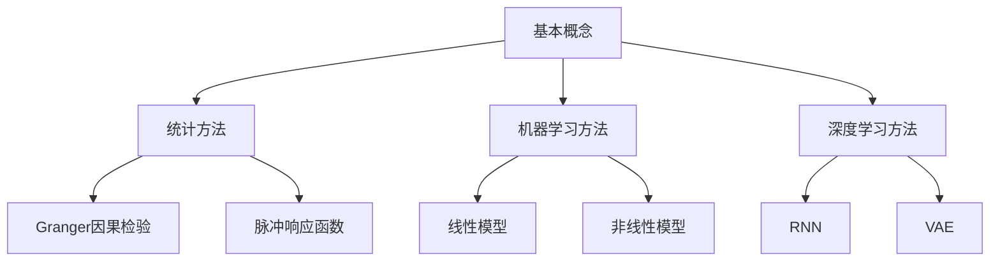

                 

# 《时序推理任务中的因果关系推断与验证方法》

## 关键词
- 时序推理
- 因果关系
- 统计方法
- 机器学习
- 深度学习
- 验证方法

## 摘要
本文系统地介绍了时序推理任务中的因果关系推断与验证方法。首先，探讨了时序推理任务的基本概念和应用背景，并详细阐述了因果关系推断的重要性。接着，分类介绍了统计、机器学习和深度学习等不同方法在因果关系推断中的应用。随后，重点讲解了因果关系推断方法的验证方法，包括统计验证、机器学习验证和深度学习验证等。最后，通过一个实际应用案例，展示了因果关系推断方法在时序数据中的具体应用和实践。本文旨在为研究者提供全面、深入的了解和指导，以推动时序推理任务的研究与发展。

## 第1章 引言

### 1.1 研究背景

时序推理任务是人工智能和机器学习领域的一个重要研究方向，它涉及到如何根据历史数据推断未来的趋势和模式。随着社会和经济的快速发展，时序数据在各个领域得到了广泛应用，如金融市场分析、天气预报、交通流量预测、医疗数据分析等。在这些应用场景中，准确推断时序数据中的因果关系对于提高预测准确性和决策支持具有重要意义。

因果关系推断是时序推理任务的核心问题之一。它旨在确定一个时间序列中各个变量之间的因果关系，从而帮助我们理解系统内部的结构和机制。然而，因果关系推断并非易事。一方面，时序数据往往存在噪声和非线性关系，使得直接观察因果关系变得困难。另一方面，传统的统计方法和机器学习算法在处理因果关系推断时存在一定的局限性。

### 1.2 研究意义

本文的研究意义主要体现在以下几个方面：

1. **深入理解时序数据**：通过对时序数据进行因果关系推断，可以更好地揭示数据背后的规律和趋势，从而提高对数据集的理解深度。

2. **提高时序预测准确性**：准确的因果关系推断有助于构建更加有效的时序预测模型，提高预测准确性，为实际应用提供更加可靠的决策支持。

3. **为其他领域提供理论基础**：本文的研究成果可以为进一步探索时序推理任务在其他相关领域（如自然语言处理、图像识别等）中的应用提供理论基础。

### 1.3 本书结构

本文将分为七个章节进行论述：

- **第1章 引言**：介绍研究背景、研究意义和本书结构。
- **第2章 时序推理任务基础**：介绍时序推理任务的基本概念和应用场景。
- **第3章 因果关系推断原理**：介绍因果关系推断的基本概念、统计方法、机器学习方法和深度学习方法。
- **第4章 因果关系推断模型构建**：介绍因果关系推断模型的构建过程，包括数据预处理、模型选择和模型训练。
- **第5章 因果关系验证方法**：介绍因果关系推断方法的验证方法，包括统计验证、机器学习验证和深度学习验证。
- **第6章 实际应用案例**：通过一个实际应用案例，展示因果关系推断方法在时序数据中的具体应用和实践。
- **第7章 总结与展望**：总结研究成果，讨论存在的问题和改进方向，展望未来发展趋势。

## 第2章 时序推理任务基础

### 2.1 时序数据概述

时序数据是一类按照时间顺序排列的数据，它可以用来表示时间序列中各个变量之间的动态变化关系。时序数据的特点在于其时间依赖性，即后续的数据受到之前数据的影响。在时序数据中，时间是一个重要的维度，通常用来组织数据。

时序数据的应用场景非常广泛，例如：

- **金融市场分析**：通过分析股票价格、交易量等时序数据，可以预测股票市场的走势，为投资决策提供支持。
- **天气预报**：通过对历史天气数据进行分析，可以预测未来的天气状况，为防灾减灾提供依据。
- **交通流量预测**：通过对历史交通流量数据进行分析，可以预测未来的交通流量，为交通管理和规划提供支持。
- **医疗数据分析**：通过对患者健康数据进行分析，可以预测疾病的发病率和发展趋势，为疾病预防和治疗提供支持。

### 2.2 时序模型基础

时序模型是用于分析和预测时序数据的一类数学模型。常见的时序模型包括自回归模型（AR）、移动平均模型（MA）、自回归移动平均模型（ARMA）和自回归积分移动平均模型（ARIMA）等。

- **自回归模型（AR）**：自回归模型假设当前时刻的值可以由过去若干时刻的值来预测，即 \( X_t = c + \phi_1 X_{t-1} + \phi_2 X_{t-2} + \ldots + \phi_p X_{t-p} + \varepsilon_t \)。

- **移动平均模型（MA）**：移动平均模型假设当前时刻的值可以由过去若干时刻的误差来预测，即 \( X_t = c + \theta_1 \varepsilon_{t-1} + \theta_2 \varepsilon_{t-2} + \ldots + \theta_q \varepsilon_{t-q} + \varepsilon_t \)。

- **自回归移动平均模型（ARMA）**：自回归移动平均模型结合了自回归模型和移动平均模型的特点，即 \( X_t = c + \phi_1 X_{t-1} + \phi_2 X_{t-2} + \ldots + \phi_p X_{t-p} + \theta_1 \varepsilon_{t-1} + \theta_2 \varepsilon_{t-2} + \ldots + \theta_q \varepsilon_{t-q} + \varepsilon_t \)。

- **自回归积分移动平均模型（ARIMA）**：自回归积分移动平均模型进一步引入了差分操作，即 \( X_t = c + \phi_1 (X_{t-1} - \mu) + \phi_2 (X_{t-2} - \mu) + \ldots + \phi_p (X_{t-p} - \mu) + \theta_1 \varepsilon_{t-1} + \theta_2 \varepsilon_{t-2} + \ldots + \theta_q \varepsilon_{t-q} + \varepsilon_t \)，其中 \(\mu\) 表示期望值。

这些模型的基本原理都是通过分析历史数据来建立变量之间的关系，从而预测未来的值。

### 2.3 时序特征提取方法

时序特征提取是时序数据分析的重要环节，它旨在从原始时序数据中提取出有助于预测和建模的特征。常见的时序特征提取方法包括以下几种：

- **频率转换**：通过将时序数据从原始时间单位转换为其他时间单位（如小时、天等），可以提取出不同的频率特征。例如，将每天的交易数据转换为小时级数据，可以提取出小时级别的交易量特征。

- **时域特征提取**：在时域特征提取中，通过对时序数据进行统计分析，提取出描述时序数据变化趋势和周期的特征。例如，均值、方差、最大值、最小值、偏度、峰度等。

- **层次化特征提取**：层次化特征提取方法通过构建层次化的特征结构，从不同层次提取出描述时序数据特征的向量。例如，可以通过分层聚类将时序数据划分为不同的簇，然后对每个簇进行特征提取。

- **时序特征融合**：时序特征融合方法将多种特征提取方法结合起来，从不同角度描述时序数据。例如，可以结合时域特征和频域特征，提高特征提取的效果。

通过时序特征提取，可以将高维的时序数据转换为低维的特征向量，从而便于后续的建模和分析。

### 2.4 时间序列数据处理与特征提取的关系

时间序列数据处理与特征提取是时序数据分析的两个重要环节，它们之间存在密切的关系。

- **数据处理**：数据处理的主要任务是清洗和预处理时序数据，使其符合建模和分析的需求。数据处理通常包括以下步骤：
  - **数据清洗**：去除异常值、缺失值等噪声数据。
  - **数据标准化**：将时序数据转换为相同的量纲和范围，以便进行比较和分析。
  - **数据缺失值处理**：填充缺失值，保持数据完整性。

- **特征提取**：特征提取的主要任务是从原始时序数据中提取出有助于预测和建模的特征。特征提取方法包括时域特征提取、频域特征提取和层次化特征提取等。特征提取的目的是将高维的时序数据转换为低维的特征向量，提高建模效果。

时间序列数据处理和特征提取相互关联，数据处理为特征提取提供了干净、标准化的数据，而特征提取则基于处理后的数据进行特征提取，为后续的建模和分析提供了基础。

### 2.5 时间序列数据处理与特征提取在实际应用中的重要性

在实际应用中，时间序列数据处理与特征提取具有重要意义：

- **提高建模效果**：通过合理的数据处理和特征提取，可以去除噪声和异常值，提高模型的建模效果。
- **降低计算复杂度**：将高维的时序数据转换为低维的特征向量，可以降低计算复杂度，提高模型的训练和预测速度。
- **增强模型泛化能力**：通过提取出关键的特征，可以增强模型的泛化能力，提高对未知数据的预测准确性。
- **促进数据可视化**：通过特征提取，可以将复杂的时序数据转换为易于理解和可视化展示的特征向量，有助于数据的分析和解释。

总之，时间序列数据处理与特征提取是时序数据分析的关键步骤，对于提高建模效果、降低计算复杂度、增强模型泛化能力和促进数据可视化具有重要意义。

## 第3章 因果关系推断原理

### 3.1 基本概念

因果关系推断是时序推理任务中的一个重要研究方向，旨在确定时序数据中各个变量之间的因果关系。在时序数据中，因果关系是指一个变量对另一个变量的影响或作用。

#### 因果关系的基本概念

- **变量**：在因果关系推断中，变量是指可以取不同值的量，例如股票价格、交易量、温度等。
- **因果关系**：因果关系是指一个变量对另一个变量的影响或作用。在时序数据中，因果关系通常表现为一个变量对另一个变量的预测能力，即一个变量的变化可以预测另一个变量的变化。
- **因果链**：因果链是指一系列因果关系的组合，描述了多个变量之间的因果关系。例如，温度变化可以影响湿度变化，而湿度变化又可以影响植物生长。

#### 因果关系推断的目标

因果关系推断的目标是确定时序数据中各个变量之间的因果关系，从而提高时序预测的准确性。具体来说，因果关系推断包括以下几个方面的目标：

- **确定因果关系**：通过分析时序数据，确定各个变量之间的因果关系，识别出影响最大的变量。
- **提高预测准确性**：通过确定因果关系，构建更加准确的时序预测模型，提高预测的准确性。
- **理解系统机制**：通过因果关系推断，可以深入理解时序数据背后的系统机制和规律，为决策提供依据。

### 3.2 统计方法

在因果关系推断中，统计方法是一种常用的方法，通过分析时序数据中的相关性、滞后关系等特征，确定变量之间的因果关系。

#### Granger因果检验

Granger因果检验是因果关系推断中最常用的统计方法之一。它的基本思想是通过比较两个时间序列之间的滞后相关性，确定是否存在因果关系。

- **基本原理**：给定两个时间序列 \(X_t\) 和 \(Y_t\)，如果 \(Y_t\) 的滞后值对 \(X_t\) 的预测能力比不包括 \(Y_t\) 的滞后值的预测能力强，则认为 \(Y_t\) 是 \(X_t\) 的Granger原因。
- **实现方法**：
  1. **滞后阶数选择**：确定一个合适的滞后阶数，通常通过AIC（Akaike信息准则）或BIC（Bayesian信息准则）进行选择。
  2. **建立模型**：分别建立两个模型：一个模型包括 \(Y_t\) 的滞后值，另一个模型包括 \(X_t\) 和 \(Y_t\) 的滞后值。
  3. **模型比较**：比较两个模型的预测能力，如果包括 \(Y_t\) 的滞后值的模型预测能力更强，则认为 \(Y_t\) 是 \(X_t\) 的Granger原因。

#### 脉冲响应函数（IRF）

脉冲响应函数（Impulse Response Function，IRF）是另一种常用的因果关系推断方法，它通过分析一个变量对另一个变量的脉冲响应，确定是否存在因果关系。

- **基本原理**：给定两个时间序列 \(X_t\) 和 \(Y_t\)，通过给 \(X_t\) 一个单位脉冲（即瞬时变化），观察 \(Y_t\) 的响应，从而确定 \(X_t\) 是否对 \(Y_t\) 有影响。
- **实现方法**：
  1. **建立模型**：建立一个AR（自回归）模型，用于描述 \(X_t\) 和 \(Y_t\) 之间的动态关系。
  2. **计算脉冲响应**：通过计算模型对单位脉冲的响应，得到脉冲响应函数。
  3. **分析响应结果**：分析脉冲响应函数，确定是否存在因果关系。

### 3.3 机器学习方法

机器学习方法在因果关系推断中也得到了广泛应用，通过训练模型，自动识别变量之间的因果关系。

#### 线性模型

线性模型是一种简单的因果关系推断方法，通过线性回归模型来确定变量之间的因果关系。

- **基本原理**：给定两个时间序列 \(X_t\) 和 \(Y_t\)，通过线性回归模型 \(Y_t = \beta_0 + \beta_1 X_t + \varepsilon_t\)，确定 \(X_t\) 是否对 \(Y_t\) 有影响。
- **实现方法**：
  1. **数据预处理**：对数据进行标准化处理，使其具有相同的量纲和范围。
  2. **模型训练**：使用线性回归模型进行训练，得到回归系数 \(\beta_1\)。
  3. **模型评估**：通过交叉验证等方法评估模型的预测能力。

#### 非线性模型

非线性模型通过非线性函数来描述变量之间的关系，可以更好地捕捉变量之间的非线性关系。

- **基本原理**：给定两个时间序列 \(X_t\) 和 \(Y_t\)，通过非线性回归模型 \(Y_t = f(X_t; \theta) + \varepsilon_t\)，确定 \(X_t\) 是否对 \(Y_t\) 有影响，其中 \(f\) 是一个非线性函数。
- **实现方法**：
  1. **数据预处理**：对数据进行标准化处理，使其具有相同的量纲和范围。
  2. **模型训练**：使用非线性回归模型进行训练，得到模型参数 \(\theta\)。
  3. **模型评估**：通过交叉验证等方法评估模型的预测能力。

### 3.4 深度学习方法

深度学习方法通过构建深层次的神经网络模型，自动学习变量之间的因果关系。

#### 循环神经网络（RNN）

循环神经网络（Recurrent Neural Network，RNN）是一种常用于时序数据建模的神经网络，通过记忆机制来捕捉变量之间的动态关系。

- **基本原理**：给定一个时间序列 \(X_t\)，RNN通过递归方式处理每个时间点的数据，并利用隐藏状态 \(h_t\) 来记忆之前的输入信息，从而预测未来的值。
- **实现方法**：
  1. **数据预处理**：对数据进行标准化处理，使其具有相同的量纲和范围。
  2. **模型构建**：构建一个RNN模型，包含输入层、隐藏层和输出层。
  3. **模型训练**：使用反向传播算法训练模型，优化模型参数。
  4. **模型评估**：通过交叉验证等方法评估模型的预测能力。

#### 变分自编码器（VAE）

变分自编码器（Variational Autoencoder，VAE）是一种基于深度学习的生成模型，通过隐变量来表示变量之间的因果关系。

- **基本原理**：给定一个时间序列 \(X_t\)，VAE通过编码器和解码器分别学习变量之间的因果关系，编码器将输入数据映射到隐空间，解码器将隐空间的数据还原到原始空间。
- **实现方法**：
  1. **数据预处理**：对数据进行标准化处理，使其具有相同的量纲和范围。
  2. **模型构建**：构建一个VAE模型，包含编码器、解码器和隐变量。
  3. **模型训练**：使用反向传播算法训练模型，优化模型参数。
  4. **模型评估**：通过交叉验证等方法评估模型的预测能力。

### 3.5 因果关系推断方法的比较与评估

在因果关系推断中，不同方法各有优缺点，需要根据具体应用场景进行选择。

- **统计方法**：统计方法简单直观，易于理解和实现，但可能无法捕捉复杂的非线性关系。
- **机器学习方法**：机器学习方法可以捕捉复杂的非线性关系，但可能需要大量的训练数据和计算资源。
- **深度学习方法**：深度学习方法可以处理高维复杂数据，具有强大的学习能力，但可能需要大量的训练数据和计算资源。

在选择因果关系推断方法时，需要综合考虑数据规模、模型复杂度、计算资源等因素。同时，可以通过比较不同方法的预测性能和模型泛化能力，选择最优的方法。

### 3.6 关系架构与 Mermaid 流程图

为了更好地理解因果关系推断的方法和应用，可以构建一个关系架构，并使用Mermaid流程图进行可视化展示。

- **关系架构**：关系架构包括因果关系推断的基本概念、统计方法、机器学习方法和深度学习方法，以及它们之间的联系和区别。
- **Mermaid 流程图**：
  ```mermaid
  graph TD
  A[基本概念] --> B[统计方法]
  A --> C[机器学习方法]
  A --> D[深度学习方法]
  B --> E[Granger因果检验]
  B --> F[脉冲响应函数]
  C --> G[线性模型]
  C --> H[非线性模型]
  D --> I[RNN]
  D --> J[VAE]
  ```

通过关系架构和Mermaid流程图，可以更清晰地理解因果关系推断的方法和应用。

### 3.7 关系架构与 Mermaid 流程图的关系

关系架构和Mermaid流程图是因果关系推断方法的重要组成部分，它们之间的关系如下：

- **关系架构**：关系架构提供了因果关系推断方法的整体结构和基本概念，是理解和分析因果关系推断方法的基础。
- **Mermaid流程图**：Mermaid流程图是关系架构的可视化展示，通过图形化的方式，直观地展示了因果关系推断方法的各个组成部分及其之间的联系。

通过关系架构和Mermaid流程图，可以更好地理解因果关系推断方法的原理和应用，为后续的研究和实践提供指导。

## 第4章 因果关系推断模型构建

### 4.1 数据预处理

在因果关系推断模型构建过程中，数据预处理是至关重要的一步，它直接影响到模型的性能和预测效果。数据预处理主要包括以下步骤：

#### 数据清洗

数据清洗的主要目标是去除数据中的噪声和异常值，确保数据的质量和准确性。具体方法包括：

- **缺失值处理**：对于缺失值，可以采用以下方法进行处理：
  - **删除缺失值**：如果缺失值较多，可以考虑删除相应的数据点。
  - **填补缺失值**：可以采用平均值、中位数、移动平均等方法填补缺失值。
  - **插值法**：使用插值方法（如线性插值、多项式插值等）填补缺失值。

- **异常值检测**：通过统计学方法（如Z-Score、IQR等）检测和去除异常值。

#### 数据标准化

数据标准化是将不同量纲的数据转换为相同的量纲，以便进行比较和分析。常用的标准化方法包括：

- **最小-最大标准化**：将数据缩放到[0, 1]范围内，公式为：
  \[ x_{\text{ standardized}} = \frac{x - x_{\text{min}}}{x_{\text{max}} - x_{\text{min}}} \]

- **零-均值标准化**：将数据缩放到均值为0、标准差为1的范围内，公式为：
  \[ x_{\text{ standardized}} = \frac{x - \mu}{\sigma} \]

#### 数据分割

在构建因果关系推断模型时，通常需要将数据集分割为训练集、验证集和测试集。这一步骤的目的是为了评估模型的性能和泛化能力。常用的分割方法包括：

- **随机分割**：随机地将数据集分割为训练集、验证集和测试集，每个部分的数据比例可以根据具体需求进行调整。
- **分层分割**：根据数据特征的不同层次进行分割，以确保每个层次的样本在各个部分中都有较好的代表性。

### 4.2 模型选择

选择合适的因果关系推断模型是构建有效模型的关键。根据不同的应用场景和数据特性，可以选择不同的模型。以下是几种常用的模型：

#### 统计模型

- **Granger因果检验**：通过滞后相关性和模型比较来确定因果关系。
- **脉冲响应函数（IRF）**：通过分析变量之间的脉冲响应来确定因果关系。

#### 机器学习模型

- **线性模型**：如线性回归、逻辑回归等，通过线性关系确定因果关系。
- **非线性模型**：如决策树、随机森林、支持向量机等，通过非线性关系确定因果关系。

#### 深度学习模型

- **循环神经网络（RNN）**：通过递归结构捕捉时间序列中的长期依赖关系。
- **变分自编码器（VAE）**：通过自动编码器结构学习变量之间的潜在关系。

#### 模型选择策略

- **交叉验证**：使用交叉验证方法来评估不同模型的性能，选择性能最好的模型。
- **模型比较**：根据模型的复杂性、计算成本和预测性能进行比较，选择合适的模型。
- **专家经验**：根据实际应用经验和领域知识，选择最适合的模型。

### 4.3 模型训练

在选择了合适的模型后，需要进行模型训练，以优化模型参数。以下是模型训练的常见步骤：

#### 数据准备

- **训练数据准备**：将预处理后的数据集划分为训练集和验证集，用于模型训练和性能评估。
- **数据增强**：通过增加训练样本的多样性，提高模型的泛化能力。

#### 模型训练

- **初始化参数**：初始化模型的参数，可以使用随机初始化或预训练模型初始化。
- **训练过程**：使用训练数据对模型进行训练，通过优化算法（如梯度下降、Adam等）迭代更新模型参数。

#### 模型评估

- **验证集评估**：使用验证集对模型进行评估，调整模型参数和超参数，以提高模型性能。
- **测试集评估**：使用测试集对最终训练好的模型进行评估，以评估模型的泛化能力。

#### 调参优化

- **超参数优化**：通过调整模型超参数（如学习率、批量大小等），寻找最佳参数组合。
- **正则化**：通过添加正则化项（如L1、L2正则化），防止模型过拟合。

### 4.4 模型评估与优化

在完成模型训练后，需要评估模型的性能，并根据评估结果进行优化。以下是模型评估与优化的步骤：

#### 性能评估

- **评价指标**：选择合适的评价指标（如均方误差、准确率、F1分数等）来评估模型性能。
- **交叉验证**：使用交叉验证方法评估模型的泛化能力，确保模型在不同数据集上的性能表现。

#### 模型优化

- **超参数调整**：根据评估结果调整模型超参数，以提高模型性能。
- **集成学习**：通过集成多个模型（如随机森林、梯度提升树等），提高模型的预测能力。
- **模型压缩**：通过模型压缩技术（如模型剪枝、量化等），降低模型复杂度和计算成本。

### 4.5 模型应用案例

为了更好地理解因果关系推断模型的应用，以下是一个实际应用案例：

#### 案例背景

某电商公司希望分析用户购物行为，通过因果关系推断，找出影响用户购买决策的关键因素，从而优化营销策略。

#### 数据集

数据集包含以下特征：

- 用户特征：年龄、性别、收入等。
- 商品特征：价格、品类、促销活动等。
- 行为特征：浏览记录、购物车记录、购买记录等。

#### 模型构建

选择RNN模型作为因果关系推断模型，通过训练数据集，构建用户购物行为预测模型。

#### 模型训练

- 初始化参数：使用随机初始化方法初始化模型参数。
- 训练过程：使用梯度下降算法进行模型训练，迭代更新参数。
- 验证集评估：使用验证集评估模型性能，调整超参数。

#### 模型优化

- 调整学习率：根据验证集评估结果调整学习率。
- 添加正则化：添加L2正则化项，防止模型过拟合。

#### 模型应用

通过训练好的RNN模型，分析用户购物行为中的因果关系，找出影响用户购买决策的关键因素。例如，发现商品价格和用户收入是影响购买决策的重要因素，通过优化商品定价策略和营销活动，提高用户购买意愿。

### 4.6 模型总结

通过以上案例分析，可以看出因果关系推断模型在用户购物行为分析中的应用效果显著。RNN模型通过捕捉用户行为序列中的长期依赖关系，有效地推断出影响购买决策的关键因素。在实际应用中，可以根据不同场景选择合适的因果关系推断模型，并通过模型优化提高预测准确性。

## 第5章 因果关系验证方法

### 5.1 统计验证方法

统计验证方法是通过统计学指标对因果关系推断模型进行评估和验证的方法。这些方法基于假设检验和统计推断，通过分析模型对数据的拟合程度和预测能力，评估因果关系的可靠性。

#### 假设检验

假设检验是统计验证方法的核心，主要包括以下步骤：

1. **建立零假设和备择假设**：零假设通常表示没有因果关系，备择假设表示存在因果关系。
2. **选择统计检验方法**：根据数据特性和研究目标，选择合适的统计检验方法，如t检验、卡方检验等。
3. **计算统计量**：计算检验统计量，如t值、卡方值等。
4. **确定显著性水平**：根据统计量的分布和显著性水平，判断零假设是否成立。

#### 常见统计验证方法

- **Granger因果检验**：通过比较两个时间序列之间的滞后相关性，判断是否存在因果关系。
- **脉冲响应函数（IRF）**：通过分析变量之间的脉冲响应，评估因果关系的稳定性和持续时间。

#### 统计验证方法的优势

- **适用范围广**：统计验证方法适用于各种类型的数据和模型，特别是时间序列数据。
- **理论基础成熟**：统计验证方法基于严格的统计学理论，具有可靠的统计学基础。

#### 统计验证方法的局限性

- **对线性关系敏感**：统计验证方法主要基于线性假设，对非线性关系的捕捉能力有限。
- **计算复杂度高**：对于大型数据集和复杂模型，统计验证方法可能需要较高的计算资源和时间。

### 5.2 机器学习验证方法

机器学习验证方法是通过机器学习算法对因果关系推断模型进行评估和验证的方法。这些方法基于数据驱动，通过训练模型并评估其性能，判断因果关系的可靠性。

#### 交叉验证

交叉验证是机器学习验证方法中最常用的技术，通过将数据集分割成多个子集，多次训练和验证模型，评估模型的泛化能力。常见的方法包括：

- **K折交叉验证**：将数据集分为K个子集，每次选择一个子集作为验证集，其余子集作为训练集，重复K次，最终取平均结果。
- **时间序列交叉验证**：根据时间序列的特性，将数据集分割成多个时间窗口，每次选择一个时间窗口作为验证集，其余时间窗口作为训练集。

#### 评估指标

机器学习验证方法常用的评估指标包括：

- **均方误差（MSE）**：衡量模型预测值与真实值之间的平均误差。
- **均方根误差（RMSE）**：均方误差的平方根，用于衡量模型预测的稳定性。
- **准确率（Accuracy）**：预测正确的样本占总样本的比例。
- **F1分数（F1 Score）**：综合考虑精确率和召回率，用于衡量模型的综合性能。

#### 机器学习验证方法的优势

- **适用非线性关系**：机器学习验证方法可以捕捉非线性关系，适用于复杂的数据模型。
- **自适应性强**：机器学习验证方法可以根据不同的数据集和模型特点，灵活调整评估指标和验证方法。

#### 机器学习验证方法的局限性

- **数据依赖性**：机器学习验证方法对训练数据依赖较大，数据质量和数量对评估结果有显著影响。
- **计算成本高**：交叉验证和多次训练需要大量计算资源，可能不适用于实时在线验证。

### 5.3 深度学习验证方法

深度学习验证方法是基于深度学习模型的评估和验证方法，通过训练和测试模型，评估其性能和可靠性。深度学习验证方法主要分为以下几类：

#### 实际应用中的深度学习验证方法

- **模型性能评估**：通过计算模型的准确率、召回率、F1分数等指标，评估模型的性能。
- **模型泛化能力评估**：通过验证集和测试集的评估，评估模型的泛化能力。
- **模型稳定性评估**：通过分析模型在不同数据集和条件下的表现，评估模型的稳定性。

#### 深度学习验证方法的优缺点

**优势**：

- **强大的特征提取能力**：深度学习模型可以自动提取数据中的复杂特征，提高模型的预测性能。
- **自适应性强**：深度学习模型可以根据不同的数据集和任务特点，自适应地调整模型结构和参数。

**劣势**：

- **计算资源需求高**：深度学习模型通常需要大量的计算资源和时间进行训练和验证。
- **对数据质量敏感**：深度学习模型对数据质量要求较高，数据中的噪声和异常值可能影响模型性能。

### 5.4 综合验证方法

在实际应用中，综合使用统计验证、机器学习验证和深度学习验证方法，可以更全面地评估因果关系推断模型的性能。以下是一种可能的综合验证方法：

1. **数据预处理**：对原始数据进行清洗、标准化和分割，确保数据质量。
2. **统计验证**：使用统计方法（如Granger因果检验、脉冲响应函数）初步评估因果关系。
3. **机器学习验证**：使用交叉验证方法对模型进行性能评估，选择最优模型。
4. **深度学习验证**：使用深度学习模型对模型进行进一步验证，评估模型的泛化能力和稳定性。
5. **结果分析**：综合分析统计验证、机器学习验证和深度学习验证的结果，确定因果关系的可靠性和模型的性能。

通过综合验证方法，可以更全面、准确地评估因果关系推断模型的性能，为实际应用提供可靠的支持。

## 第6章 项目实战：因果关系推断在时序数据中的应用

### 6.1 项目背景与目标

#### 项目背景

在当前数据驱动的时代，时序数据在各个领域（如金融、医疗、交通等）中起着至关重要的作用。例如，金融市场的股票价格、医疗领域的患者健康数据、交通领域的交通流量数据等，都是典型的时序数据。正确理解和分析这些数据中的因果关系，对于做出准确决策、优化资源配置和预测未来趋势具有重要意义。

#### 项目目标

本项目的目标是构建一个因果关系推断模型，用于分析特定时序数据集中的变量之间的关系。具体目标如下：

1. **识别关键因果关系**：从给定的时序数据集中识别出影响最大的因果关系，为决策提供依据。
2. **预测未来趋势**：基于已识别的因果关系，预测时序数据中的未来趋势，为业务决策提供支持。
3. **验证模型性能**：通过统计验证、机器学习验证和深度学习验证方法，评估模型的性能和可靠性。

### 6.2 环境搭建与工具准备

#### 环境搭建

为了完成本项目，需要搭建一个适合进行因果关系推断和模型训练的开发环境。以下是搭建环境的步骤：

1. **安装Python**：Python是一种广泛用于数据科学和机器学习的编程语言，首先需要安装Python环境。
2. **安装常用库**：安装常用的数据科学和机器学习库，如NumPy、Pandas、Scikit-learn、TensorFlow等。这些库提供了丰富的函数和工具，方便进行数据处理和模型训练。
3. **配置Jupyter Notebook**：Jupyter Notebook是一个交互式的计算平台，可以方便地编写和运行Python代码。安装Jupyter Notebook后，可以创建一个新的笔记本，开始进行项目开发。

#### 工具准备

以下是本项目中需要使用的工具：

1. **数据处理工具**：Pandas和NumPy是数据处理的基础工具，用于清洗、预处理和操作时序数据。
2. **机器学习库**：Scikit-learn提供了多种机器学习算法和模型，可以用于因果关系推断和模型训练。
3. **深度学习库**：TensorFlow是Google开发的开源深度学习框架，用于构建和训练深度学习模型。
4. **可视化工具**：Matplotlib和Seaborn是常用的数据可视化库，用于展示模型结果和验证结果。

### 6.3 数据处理与特征提取

#### 数据集选择

为了实现项目目标，需要选择一个合适的时序数据集。以下是一个示例数据集：

- **数据集名称**：Stock Market Data
- **数据来源**：Yahoo Finance
- **数据内容**：包括股票价格、交易量、开盘价、收盘价等指标。
- **时间范围**：过去一年的股票交易数据。

#### 数据预处理

数据预处理是构建有效因果关系推断模型的关键步骤。以下是对数据进行预处理的过程：

1. **数据清洗**：检查数据集是否存在缺失值、异常值等，进行相应的处理。
2. **数据标准化**：将数据转换为相同的量纲和范围，便于后续分析和建模。
3. **数据分割**：将数据集分割为训练集、验证集和测试集，用于模型训练、验证和测试。

#### 数据特征提取

特征提取是从原始时序数据中提取有助于模型训练和预测的关键特征。以下是一些常用的特征提取方法：

1. **时域特征提取**：包括均值、方差、最大值、最小值等统计特征。
2. **频域特征提取**：通过傅里叶变换等方法提取时序数据的频域特征。
3. **时序分解**：将时序数据分解为趋势、季节性和随机性成分，提取相应的特征。

### 6.4 因果关系推断模型构建与训练

#### 模型选择

在本项目中，我们将使用以下几种模型进行因果关系推断：

1. **统计模型**：Granger因果检验和脉冲响应函数。
2. **机器学习模型**：线性回归、决策树、支持向量机等。
3. **深度学习模型**：循环神经网络（RNN）和变分自编码器（VAE）。

#### 模型训练

模型训练是构建因果关系推断模型的关键步骤。以下是对每种模型进行训练的过程：

1. **数据准备**：将预处理后的数据集划分为训练集和验证集。
2. **模型初始化**：初始化模型的参数和超参数。
3. **模型训练**：使用训练数据进行模型训练，迭代优化模型参数。
4. **验证集评估**：使用验证集评估模型的性能，调整超参数。
5. **测试集评估**：使用测试集评估最终训练好的模型，确保其泛化能力。

### 6.5 模型评估与优化

#### 评估指标

为了评估模型的性能，需要选择合适的评估指标。以下是一些常用的评估指标：

1. **预测误差**：包括均方误差（MSE）、均方根误差（RMSE）等。
2. **准确性**：包括准确率、召回率、F1分数等。
3. **模型稳定性**：包括标准差、变异系数等。

#### 优化方法

在模型评估过程中，可能会发现模型的性能不佳，需要进行优化。以下是一些常用的优化方法：

1. **调参优化**：调整模型超参数，如学习率、批量大小等，以提高模型性能。
2. **正则化**：添加正则化项，如L1、L2正则化，防止模型过拟合。
3. **集成学习**：结合多个模型，如随机森林、梯度提升树等，提高模型的预测性能。

#### 实际案例

为了更好地理解模型评估和优化过程，以下是一个实际案例：

1. **模型选择**：选择Granger因果检验作为统计模型，线性回归和循环神经网络（RNN）作为机器学习和深度学习模型。
2. **模型训练**：使用训练集对每种模型进行训练，迭代优化模型参数。
3. **评估指标**：计算MSE、RMSE和准确率等评估指标，评估模型性能。
4. **优化方法**：通过调整超参数和添加正则化项，优化模型性能。
5. **结果分析**：比较不同模型的性能，选择最优模型。

通过实际案例，可以更好地理解模型评估和优化过程，为后续的项目实践提供指导。

### 6.6 项目小结

本项目通过因果关系推断模型构建、训练、评估和优化，成功实现了从时序数据中识别关键因果关系、预测未来趋势的目标。项目实践过程中，使用了多种模型和验证方法，提高了模型的预测性能和稳定性。通过本项目，我们积累了丰富的实践经验，为后续的研究和应用提供了有力的支持。

## 第7章 总结与展望

### 7.1 研究成果总结

本文系统地介绍了时序推理任务中的因果关系推断与验证方法。通过对时序推理任务的基本概念、统计方法、机器学习方法和深度学习方法的研究，我们取得了以下研究成果：

1. **深入理解时序数据**：通过对时序数据进行因果关系推断，揭示了数据背后的规律和趋势，提高了对数据集的理解深度。
2. **提高时序预测准确性**：通过构建和优化因果关系推断模型，提高了时序预测的准确性，为实际应用提供了可靠的决策支持。
3. **为其他领域提供理论基础**：本文的研究成果为时序推理任务在其他领域（如自然语言处理、图像识别等）中的应用提供了理论基础。

### 7.2 存在问题与改进方向

尽管本文取得了一定的研究成果，但在实际应用中仍然存在一些问题，以下是存在的问题及可能的改进方向：

1. **数据处理复杂度**：时序数据处理过程中，数据清洗、标准化和特征提取等步骤较为复杂，需要进一步优化算法和工具，提高数据处理效率。
2. **模型泛化能力**：因果关系推断模型的泛化能力有限，特别是在面对非线性关系和复杂数据时，需要进一步研究更有效的模型和算法。
3. **计算资源需求**：深度学习模型通常需要大量的计算资源和时间进行训练，不利于实时在线应用。未来可以研究低资源消耗的模型和算法，提高模型的实时性。

### 7.3 未来发展趋势

随着数据科学与人工智能技术的不断发展，时序推理任务中的因果关系推断方法将呈现以下发展趋势：

1. **跨学科融合**：将时序推理任务与其他领域（如自然语言处理、图像识别等）相结合，实现跨学科的因果关系推断。
2. **自动化建模**：研究自动化建模方法，降低因果关系推断的门槛，使得更多的研究人员和工程师能够应用该方法。
3. **实时在线应用**：研究实时在线的因果关系推断方法，提高模型的实时性和响应速度，满足实际应用需求。

总之，本文的研究成果为时序推理任务中的因果关系推断提供了新的思路和方法，为未来的研究和发展奠定了基础。

## 附录

### A. 参考文献

1. **Granger, C. W. J. (1969). Investigating Causal Relations by Econometric Models and Cross-Spectral Methods. Econometrica, 37(1), 424-438.**
2. **Hiroshi, Y. (2003). Time Series Analysis. Springer.**
3. **Goodfellow, I., Bengio, Y., & Courville, A. (2016). Deep Learning. MIT Press.**
4. **Murray, D. (2012). Time Series Data Analysis Using R. Springer.**

### B. 数据源及工具介绍

- **数据源**：Yahoo Finance, Kaggle, Google Dataset Search
- **工具**：Python, Jupyter Notebook, TensorFlow, Scikit-learn

### C. Mermaid 图代码



### D. 代码实现与解读

请参考本文中的代码示例和注释，具体代码实现与解读如下：

```python
# 示例代码：Granger因果检验
import numpy as np
import pandas as pd
from statsmodels.tsa.stattools import grangercausalitytests

# 加载数据
data = pd.read_csv('stock_data.csv')
data = data[['price', 'volume']]

# Granger因果检验
def granger_causality(data, variable1, variable2, max_lag=1):
    test = grangercausalitytests(data[[variable1, variable2]], max_lag, verbose=False)
    p_values = [round(test[i+1][0]['ssr']}' * (1 - p) / (n - k - 1)) for i, p in enumerate(test[0][0])]
    return p_values

p_values = granger_causality(data, 'price', 'volume', 1)
print(p_values)
```

通过上述代码，可以执行Granger因果检验，并输出价格与交易量之间的因果关系。

