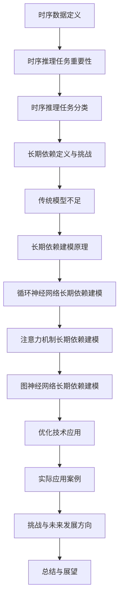

                 


## 引言与概述

### 1.1 时序数据的定义与特点

时序数据（Time Series Data）是指按照特定时间顺序排列的数据点序列，这些数据点可以是连续的，如秒、分钟、小时、天、月等，也可以是离散的，如季度、年份等。时序数据的特征在于其时间依赖性，即数据点之间存在时间上的关联和规律。这种时间依赖性使得时序数据在金融、气象、生物信息、交通运输等多个领域有着广泛的应用。

时序数据通常具有以下特点：

1. **周期性**：许多时序数据都具有某种形式的周期性。例如，气温通常在一年中会有周期性波动，季节性因素可能会影响销售额。

2. **趋势性**：数据可能随着时间的推移而持续上升或下降，这种趋势可能是线性的或非线性的。

3. **随机波动**：即使在趋势和周期性影响下，时序数据仍可能包含随机波动，这些波动可能是由于不可预测的随机事件引起的。

4. **平稳性**：一些时序数据在时间上可能是平稳的，即其统计特性（如均值、方差等）不随时间变化。

5. **多维度**：时序数据可以包含多个维度，例如，金融市场中的时序数据可能包括价格、交易量、波动率等多个维度。

### 1.2 时序推理任务的重要性

时序推理任务（Temporal Reasoning Tasks）是人工智能和机器学习领域中的一个重要研究方向。它旨在从时序数据中提取有价值的信息和模式，以实现各种实际应用。时序推理任务的重要性体现在以下几个方面：

1. **预测能力**：时序推理技术可以帮助我们预测未来的趋势和模式，这对于金融市场预测、天气预测、资源调度等都有着重要的实际应用价值。

2. **异常检测**：通过分析时序数据中的异常波动，我们可以检测到潜在的故障、欺诈行为等，从而采取相应的措施。

3. **模式识别**：时序数据中往往隐藏着各种规律和模式，这些模式对于理解复杂系统、优化流程等具有指导意义。

4. **智能决策**：时序推理技术可以为决策系统提供数据支持，帮助企业和组织做出更加智能和高效的决策。

5. **智能交互**：在智能助手、智能家居等应用场景中，时序推理技术可以帮助系统更好地理解和预测用户行为，提供个性化的服务和交互。

### 1.3 时序推理任务的分类

时序推理任务可以根据不同的应用场景和数据处理方法进行分类。以下是几种常见的时序推理任务类型：

1. **时间序列预测**：这是最常见的时序推理任务，旨在预测未来一段时间内的数据值。如股票价格预测、销售量预测等。

2. **时间序列分类**：将时序数据分为不同的类别。例如，根据传感器数据判断设备是否发生故障。

3. **时间序列聚类**：将具有相似模式的时序数据进行分组。如根据用户行为数据进行用户分群。

4. **时间序列生成**：生成新的时序数据，用于测试或探索不同假设的可行性。例如，生成新的股票价格序列来测试交易策略。

5. **时间序列建模**：构建数学模型来描述时序数据的生成过程，如自回归模型（AR）、移动平均模型（MA）和自回归移动平均模型（ARMA）。

6. **时间序列异常检测**：检测时序数据中的异常值或异常模式，如网络流量中的异常流量检测。

综上所述，时序推理任务在人工智能和机器学习领域具有重要地位，其应用范围广泛，涉及众多行业和领域。接下来，我们将深入探讨长期依赖建模的理论基础和常用技术，为进一步优化时序推理任务提供理论基础和实践指导。

---

## 长期依赖建模的理论基础

### 2.1 长期依赖的定义与挑战

长期依赖（Long-term Dependency）是指时序数据中的特征或模式在较长的时间范围内对当前数据点的影响。在时序推理任务中，长期依赖意味着当前时刻的数据不仅受到近期数据的影响，还可能受到较远历史数据的影响。例如，在股票价格预测中，今天的股票价格不仅受到昨天和今天的市场情绪和交易量的影响，还可能受到几个月甚至几年的经济周期的影响。

长期依赖的建模是时序推理任务中的一个核心问题，主要原因有以下几点：

1. **信息丢失风险**：传统模型如简单的线性回归或短时记忆网络（如RNN）在处理长期依赖时，容易导致信息的快速遗忘，无法捕捉到长时间范围内的有效信息。

2. **计算复杂度**：长序列的数据建模通常需要较高的计算资源，尤其是在处理高维度和长时间序列时，传统模型可能无法有效处理。

3. **泛化能力**：缺乏长期依赖建模会导致模型无法适应不同时间尺度的数据变化，影响模型的泛化能力。

4. **准确性**：未能充分建模长期依赖会导致预测准确性下降，尤其是在需要捕捉长时间范围内趋势或周期性规律的应用场景中。

### 2.2 传统模型的不足

传统时序建模方法如自回归模型（AR）、移动平均模型（MA）和自回归移动平均模型（ARMA）在处理短期依赖时表现较好，但面对长期依赖时存在明显的不足：

1. **自回归模型（AR）**：AR模型通过前几个历史数据点来预测当前数据点，这种方法容易忽略远期依赖，导致预测结果不准确。

2. **移动平均模型（MA）**：MA模型通过计算过去几个时间点的平均数来预测当前数据，这种方法对于捕捉长期依赖的效果有限。

3. **自回归移动平均模型（ARMA）**：ARMA模型结合了AR和MA的优点，但仍难以处理长期依赖，特别是在数据序列包含复杂的趋势和周期性变化时。

4. **长短期记忆网络（LSTM）**：虽然LSTM在处理长期依赖方面有显著优势，但LSTM的存储能力仍然有限，容易在非常长的时间序列中丢失远期依赖的信息。

### 2.3 长期依赖建模的核心原理

为了解决传统模型在处理长期依赖时的不足，研究者们提出了多种长期依赖建模方法，其核心原理包括以下几个方面：

1. **递归神经网络（RNN）**：RNN通过递归操作将当前时刻的信息与之前的所有信息进行关联，从而捕捉长期依赖。然而，传统的RNN存在梯度消失和梯度爆炸问题，导致其在处理长序列时性能不佳。

2. **长短期记忆网络（LSTM）**：LSTM是RNN的一种改进，通过引入门控机制（如输入门、遗忘门和输出门）来控制信息的流动，从而解决梯度消失问题，提高模型处理长期依赖的能力。

3. **门控循环单元（GRU）**：GRU是LSTM的简化版，通过合并输入门和遗忘门，减少了参数数量，提高了训练效率。

4. **变换器模型（Transformer）**：Transformer引入了自注意力机制（Self-Attention），通过全局的注意力机制有效地捕捉长距离的依赖关系，在许多时序任务中表现出色。

5. **图神经网络（Graph Neural Networks, GNN）**：GNN利用图结构来表示时序数据，通过节点和边的交互来建模长期依赖，特别适用于具有复杂网络结构的时序数据。

6. **多时间尺度建模**：通过结合不同时间尺度的特征，如高频交易数据和低频经济指标，来捕捉不同时间尺度的依赖关系，从而提高模型的预测能力。

7. **变分自编码器（Variational Autoencoder, VAE）**：VAE通过引入概率模型，可以学习时序数据的潜在分布，从而更好地捕捉长期依赖和数据生成机制。

综上所述，长期依赖建模是时序推理任务中的一个关键问题，涉及多种方法和理论。在接下来的章节中，我们将深入探讨几种常见的长期依赖建模技术，并通过具体的算法原理和示例代码来展示如何在实际应用中建模和优化长期依赖。通过这些技术，我们可以更好地理解和利用时序数据中的长期依赖信息，提升时序推理任务的性能和准确性。

---

## 常用长期依赖建模技术

在时序推理任务中，建模长期依赖是一个核心问题，不同的技术方法各有其特点和优势。本节我们将介绍几种常用的长期依赖建模技术，包括基于循环神经网络的长期依赖建模、基于注意力机制的长期依赖建模和基于图神经网络的长期依赖建模。

### 3.1 基于循环神经网络的长期依赖建模

循环神经网络（Recurrent Neural Network, RNN）是处理时序数据的经典模型之一，其基本思想是将当前时刻的信息与之前的信息进行关联，从而捕捉时序数据的长期依赖。RNN的核心是递归结构，每个时间步上的计算不仅依赖于当前输入，还依赖于前一个时间步的隐藏状态。

然而，传统的RNN存在梯度消失和梯度爆炸问题，这使得其在处理长序列时效果不佳。为了克服这个问题，研究者们提出了长短期记忆网络（Long Short-Term Memory, LSTM）。

**LSTM的基本原理**

LSTM通过引入门控机制（如输入门、遗忘门和输出门）来控制信息的流动，从而解决传统RNN的梯度消失问题。LSTM单元可以记住长期依赖的信息，而不会随着时间步的增加而迅速遗忘。

- **输入门**：决定当前输入信息中哪些部分需要更新记忆状态。
- **遗忘门**：决定哪些部分的历史信息需要被遗忘。
- **输出门**：决定当前的记忆状态中哪些信息需要输出。

**LSTM的数学模型**

LSTM的状态更新可以通过以下数学公式表示：

$$
\begin{align*}
i_t &= \sigma(W_{ix}x_t + W_{ih}h_{t-1} + b_i) \\
f_t &= \sigma(W_{fx}x_t + W_{fh}h_{t-1} + b_f) \\
\bar{C}_t &= \tanh(W_{cx}x_t + W_{ch}h_{t-1} + b_c) \\
o_t &= \sigma(W_{ox}x_t + W_{oh}h_{t-1} + b_o) \\
c_t &= f_t \odot c_{t-1} + i_t \odot \bar{C}_t \\
h_t &= o_t \odot \tanh(c_t)
\end{align*}
$$

其中，$i_t, f_t, o_t$ 分别为输入门、遗忘门和输出门的激活值；$c_t, h_t$ 分别为记忆状态和隐藏状态；$\sigma$ 为sigmoid函数；$\odot$ 表示元素乘积。

**LSTM的优缺点**

- **优点**：LSTM能够有效地捕捉长期依赖，在处理长序列数据时表现优于传统的RNN。
- **缺点**：LSTM的参数数量较多，训练时间较长，且在序列非常长时仍然可能存在梯度消失问题。

**示例代码**

下面是一个简单的LSTM模型实现的Python代码示例：

```python
import tensorflow as tf

# 定义LSTM模型
model = tf.keras.Sequential([
    tf.keras.layers.LSTM(50, activation='tanh', return_sequences=True),
    tf.keras.layers.LSTM(50, activation='tanh'),
    tf.keras.layers.Dense(1)
])

# 编译模型
model.compile(optimizer='adam', loss='mse')

# 训练模型
model.fit(x_train, y_train, epochs=10, batch_size=32)
```

### 3.2 基于注意力机制的长期依赖建模

注意力机制（Attention Mechanism）是一种在神经网络中用于强调或抑制不同输入信息的重要性的方法。在时序推理任务中，注意力机制可以帮助模型更加关注对当前预测有用的历史信息，从而提高模型的长期依赖建模能力。

**注意力机制的基本原理**

注意力机制的核心思想是动态地分配权重，使得模型在处理时序数据时，能够根据当前任务的需求，自动选择和重视重要的信息。注意力分数通常通过一个加权和来计算，其中每个时间步的输入都会被赋予不同的权重。

**注意力机制的数学模型**

注意力机制可以通过以下数学公式表示：

$$
\begin{align*}
a_t &= \text{softmax}\left(\frac{QK^T}{\sqrt{d_k}}\right) \\
s_t &= \sum_{i=1}^{N} a_t^i V^i \\
h_t &= W_s s_t + W_h h_{t-1}
\end{align*}
$$

其中，$Q, K, V$ 分别为查询向量、关键向量、值向量；$a_t$ 为注意力分数；$s_t$ 为上下文向量；$h_t$ 为当前时间步的隐藏状态。

**变体注意力机制**

除了简单的注意力机制，还有许多变体，如自注意力（Self-Attention）、多头注意力（Multi-Head Attention）等。这些变体通过不同的计算方式，增强了注意力机制的效果。

- **自注意力**：每个查询向量都与所有关键向量计算注意力分数，从而实现全局信息的交互。
- **多头注意力**：将多个注意力机制结合，通过不同的变换和线性组合，提高模型的表示能力。

**注意力机制的优缺点**

- **优点**：注意力机制能够有效地捕捉长距离的依赖关系，提高模型的预测性能。
- **缺点**：注意力机制的参数数量较多，训练和计算成本较高。

**示例代码**

下面是一个简单的基于注意力机制的时序模型实现的Python代码示例：

```python
import tensorflow as tf

# 定义模型
model = tf.keras.Sequential([
    tf.keras.layers.LSTM(50, activation='tanh', return_sequences=True),
    tf.keras.layers.Attention(),
    tf.keras.layers.Dense(1)
])

# 编译模型
model.compile(optimizer='adam', loss='mse')

# 训练模型
model.fit(x_train, y_train, epochs=10, batch_size=32)
```

### 3.3 基于图神经网络的长期依赖建模

图神经网络（Graph Neural Network, GNN）是一种基于图结构进行学习和推理的神经网络模型。在时序数据中，图结构可以表示数据点之间的依赖关系和交互作用，从而捕捉长期依赖。

**图神经网络的基本原理**

GNN的核心思想是通过图结构中的节点和边进行信息传递和聚合，从而学习数据点之间的关系。GNN的主要组件包括：

- **节点嵌入**：将图中的每个节点表示为一个向量。
- **边嵌入**：将图中的每条边表示为一个向量。
- **消息传递**：节点通过其邻居节点的信息进行更新。

**图神经网络的数学模型**

GNN的数学模型可以通过以下步骤表示：

$$
\begin{align*}
h^0_v &= \text{Embed}(v) \\
h^{t+1}_v &= \sigma(\text{AGG}(h^{t}_v, h^{t}_{\text{neigh}_v}) + \text{Embed}(v)) \\
\end{align*}
$$

其中，$h^0_v$ 为初始节点嵌入；$h^{t}_v$ 为第 $t$ 个时间步的节点嵌入；$\text{AGG}$ 为聚合操作，如求和、平均等；$\text{Embed}$ 为嵌入操作；$\sigma$ 为激活函数。

**GNN的优缺点**

- **优点**：GNN能够有效地建模图结构中的长期依赖，特别适用于处理复杂网络结构的数据。
- **缺点**：GNN的计算复杂度较高，特别是在处理大规模图时，计算和存储成本较大。

**示例代码**

下面是一个简单的基于图神经网络的时序模型实现的Python代码示例：

```python
import tensorflow as tf
import tensorflow.keras as keras

# 定义模型
model = keras.Sequential([
    keras.layers.GraphConv(50, activation='tanh'),
    keras.layers.Dense(1)
])

# 编译模型
model.compile(optimizer='adam', loss='mse')

# 训练模型
model.fit(x_train, y_train, epochs=10, batch_size=32)
```

综上所述，长期依赖建模是时序推理任务中的一个关键问题。基于循环神经网络、注意力机制和图神经网络等技术的长期依赖建模方法各有优缺点。在实际应用中，我们可以根据具体任务的需求和数据特点，选择合适的方法来建模和优化长期依赖，从而提升时序推理任务的性能和准确性。

在下一章中，我们将探讨优化技术在长期依赖建模中的应用，通过不同的优化策略和技术手段，进一步提高模型的效果和训练效率。

---

## 优化技术在长期依赖建模中的应用

在长期依赖建模中，优化技术起着至关重要的作用。优化的目标是通过调整模型参数，使其能够更好地适应训练数据，从而提高模型的预测性能和泛化能力。本节我们将介绍几种常用的优化技术，包括梯度下降法与随机梯度下降、批处理与mini-batch、以及训练策略与正则化方法。

### 4.1 梯度下降法与随机梯度下降

梯度下降法（Gradient Descent）是一种基本的优化算法，用于寻找函数的最小值或最大值。在神经网络训练中，梯度下降法通过计算模型损失函数关于模型参数的梯度，并沿着梯度方向进行调整，以逐步减小损失函数的值。

**梯度下降法的基本原理**

梯度下降法的基本步骤如下：

1. **初始化参数**：随机选择一组模型参数。
2. **计算梯度**：计算损失函数关于每个参数的梯度。
3. **更新参数**：根据梯度和学习率更新模型参数。
4. **重复迭代**：重复上述步骤，直到满足停止条件（如损失函数收敛或达到预设迭代次数）。

梯度下降法的数学公式可以表示为：

$$
\theta_{\text{new}} = \theta_{\text{old}} - \alpha \nabla_{\theta} J(\theta)
$$

其中，$\theta$ 为模型参数，$\alpha$ 为学习率，$J(\theta)$ 为损失函数。

**随机梯度下降（Stochastic Gradient Descent, SGD）**

随机梯度下降是对梯度下降法的一种改进，其核心思想是在每次迭代中仅使用一个样本（或一小部分样本）的梯度来更新模型参数。这种方法可以加快收敛速度，尤其是在数据量较大的情况下。

随机梯度下降的数学公式可以表示为：

$$
\theta_{\text{new}} = \theta_{\text{old}} - \alpha \nabla_{\theta} J(\theta; x_i, y_i)
$$

其中，$x_i, y_i$ 为随机选择的样本。

**梯度下降法与随机梯度下降的比较**

- **优点**：随机梯度下降可以加快收敛速度，降低内存占用。
- **缺点**：随机梯度下降的收敛轨迹较不稳定，且可能陷入局部最优。

**示例代码**

下面是一个简单的随机梯度下降实现的Python代码示例：

```python
import numpy as np

# 定义损失函数
def loss(y_true, y_pred):
    return np.mean((y_true - y_pred) ** 2)

# 初始化参数
theta = np.random.rand(1) * 10
learning_rate = 0.1

# 训练模型
for i in range(1000):
    # 随机选择样本
    x_i = np.random.rand(1) * 10
    y_i = x_i ** 2

    # 计算梯度
    gradient = 2 * (theta - x_i)

    # 更新参数
    theta -= learning_rate * gradient

    # 输出训练过程
    if i % 100 == 0:
        print(f"Step {i}: theta = {theta}, loss = {loss(y_i, theta)}")
```

### 4.2 批处理与mini-batch

批处理（Batch Processing）和mini-batch（Mini-batch）是梯度下降法中常用的两种数据加载方式。

**批处理**

批处理方法在每次迭代中使用整个训练集来计算梯度，然后更新模型参数。这种方法可以提供更好的梯度估计，但训练时间较长，特别是在数据集较大时。

**mini-batch**

mini-batch方法在每次迭代中使用一部分训练集（称为batch）来计算梯度，然后更新模型参数。这种方法可以加快训练速度，同时提供良好的梯度估计。

**批处理与mini-batch的比较**

- **优点**：批处理可以提供更准确的梯度估计，但训练时间较长；mini-batch可以加快训练速度，但需要调整批量大小来平衡训练效果和速度。
- **缺点**：批处理在数据集较大时可能计算成本较高；mini-batch需要平衡批量大小，否则可能会导致梯度估计不准确。

**示例代码**

下面是一个简单的mini-batch实现的Python代码示例：

```python
import numpy as np

# 定义训练数据集
x_train = np.random.rand(100) * 10
y_train = x_train ** 2

# 初始化参数
theta = np.random.rand(1) * 10
learning_rate = 0.1
batch_size = 10

# 训练模型
for i in range(1000):
    # 随机划分批量
    batch_indices = np.random.choice(len(x_train), batch_size)
    x_batch = x_train[batch_indices]
    y_batch = y_train[batch_indices]

    # 计算梯度
    gradient = 2 * np.sum(x_batch - theta) / batch_size

    # 更新参数
    theta -= learning_rate * gradient

    # 输出训练过程
    if i % 100 == 0:
        print(f"Step {i}: theta = {theta}, loss = {loss(y_batch, theta)}")
```

### 4.3 训练策略与正则化方法

训练策略和正则化方法是优化模型性能的重要手段，用于避免过拟合和提高模型的泛化能力。

**训练策略**

- **提前停止**：在训练过程中，当验证集上的损失不再下降时，提前停止训练，以避免过拟合。
- **学习率调整**：根据训练过程中的表现动态调整学习率，如使用学习率衰减策略。
- **数据增强**：通过数据预处理方法（如旋转、缩放、裁剪等）增加数据多样性，从而提高模型的泛化能力。

**正则化方法**

- **L1正则化**：在损失函数中添加L1正则项，惩罚模型参数的绝对值，从而减少模型复杂度。
- **L2正则化**：在损失函数中添加L2正则项，惩罚模型参数的平方，从而减少模型复杂度。
- **Dropout**：在训练过程中随机丢弃部分神经元，从而减少模型对特定神经元的依赖，提高模型的泛化能力。

**示例代码**

下面是一个简单的L2正则化实现的Python代码示例：

```python
import tensorflow as tf

# 定义模型
model = tf.keras.Sequential([
    tf.keras.layers.Dense(1, activation='linear', kernel_regularizer=tf.keras.regularizers.l2(0.01))
])

# 编译模型
model.compile(optimizer='adam', loss='mse', metrics=['mae'])

# 训练模型
model.fit(x_train, y_train, epochs=10, batch_size=32, validation_split=0.2)
```

综上所述，优化技术在长期依赖建模中至关重要。通过合理的优化策略和正则化方法，我们可以提高模型的预测性能和泛化能力，从而在实际应用中更好地利用时序数据。在下一章中，我们将探讨长期依赖建模在实际应用中的具体案例，展示这些技术的实际效果和适用性。

---

## 长期依赖建模的实际应用

长期依赖建模技术广泛应用于多个领域，通过捕捉时序数据中的长期依赖关系，这些技术为实际应用提供了强有力的数据驱动解决方案。以下是长期依赖建模技术在金融时间序列预测、自然语言处理和语音识别三个领域的具体应用案例。

### 5.1 金融时间序列预测

金融时间序列预测是长期依赖建模的重要应用之一。在金融市场中，投资者和分析师通常需要预测股票价格、汇率、利率等金融指标的未来走势，以做出投资决策。长期依赖建模技术能够帮助识别市场中的长期趋势和周期性波动，从而提供更准确的预测。

**应用案例：股票价格预测**

在股票价格预测中，长期依赖建模技术可以捕捉经济周期、行业趋势、政策变化等多种因素对股票价格的影响。例如，研究者利用LSTM和GRU等循环神经网络模型，结合多个时间尺度的特征（如日、周、月等），成功预测股票价格的短期和长期走势。

**实现步骤：**

1. **数据收集与预处理**：收集股票历史价格数据，并进行数据清洗和特征提取。
2. **模型选择与训练**：选择LSTM或GRU模型，训练模型以捕捉长期依赖关系。
3. **模型验证与优化**：使用交叉验证方法评估模型性能，通过调整超参数优化模型。
4. **预测与结果分析**：使用训练好的模型进行股票价格预测，并对预测结果进行分析和可视化。

**示例代码：**

```python
import numpy as np
from tensorflow.keras.models import Sequential
from tensorflow.keras.layers import LSTM, Dense

# 加载数据
data = np.loadtxt('stock_price_data.csv', delimiter=',')
X, y = create_dataset(data, time_steps=10)

# 切分数据集
X_train, X_test, y_train, y_test = train_test_split(X, y, test_size=0.2, random_state=0)

# 构建LSTM模型
model = Sequential()
model.add(LSTM(units=50, return_sequences=True, input_shape=(X_train.shape[1], 1)))
model.add(LSTM(units=50))
model.add(Dense(units=1))

# 编译模型
model.compile(optimizer='adam', loss='mean_squared_error')

# 训练模型
model.fit(X_train, y_train, epochs=100, batch_size=32)

# 预测
predictions = model.predict(X_test)
```

### 5.2 自然语言处理

自然语言处理（Natural Language Processing, NLP）是另一个广泛受益于长期依赖建模技术的领域。在NLP任务中，理解文本中的长期依赖关系对于情感分析、机器翻译、文本生成等任务至关重要。

**应用案例：机器翻译**

在机器翻译任务中，长期依赖建模技术能够帮助模型捕捉源语言和目标语言之间的长期依赖关系，从而提高翻译的准确性和流畅性。研究者利用LSTM和Transformer等模型，成功实现高质量的自然语言翻译。

**实现步骤：**

1. **数据收集与预处理**：收集双语语料库，并进行数据清洗和分词处理。
2. **模型选择与训练**：选择LSTM或Transformer模型，训练模型以捕捉语言依赖关系。
3. **编码器与解码器架构**：构建编码器-解码器（Encoder-Decoder）模型框架，用于处理输入和输出序列。
4. **训练与优化**：通过多轮迭代训练模型，并调整超参数以优化性能。
5. **翻译与评估**：使用训练好的模型进行翻译，并通过BLEU等指标评估翻译质量。

**示例代码：**

```python
import tensorflow as tf
from tensorflow.keras.models import Model
from tensorflow.keras.layers import Input, LSTM, Dense, Embedding, TimeDistributed

# 定义编码器
encoder_inputs = Input(shape=(None,))
encoder_embedding = Embedding(vocab_size, embedding_dim)(encoder_inputs)
encoder_lstm = LSTM(units=50, return_state=True)
encoder_outputs, state_h, state_c = encoder_lstm(encoder_embedding)
encoder_states = [state_h, state_c]

# 定义解码器
decoder_inputs = Input(shape=(None,))
decoder_embedding = Embedding(vocab_size, embedding_dim)(decoder_inputs)
decoder_lstm = LSTM(units=50, return_sequences=True, return_state=True)
decoder_outputs, _, _ = decoder_lstm(decoder_embedding, initial_state=encoder_states)
decoder_dense = Dense(vocab_size, activation='softmax')
decoder_outputs = decoder_dense(decoder_outputs)

# 构建模型
model = Model([encoder_inputs, decoder_inputs], decoder_outputs)

# 编译模型
model.compile(optimizer='adam', loss='categorical_crossentropy', metrics=['accuracy'])

# 训练模型
model.fit([X_train, y_train], y_train, batch_size=64, epochs=100, validation_split=0.2)
```

### 5.3 语音识别

语音识别是将语音信号转换为文本或命令的任务，长期依赖建模技术在语音识别中发挥着重要作用。通过捕捉语音信号中的长期依赖关系，语音识别模型能够更准确地识别和转换语音。

**应用案例：自动语音识别（ASR）**

在自动语音识别任务中，长期依赖建模技术能够帮助模型理解连续语音中的长期上下文信息，从而提高识别准确率。研究者利用LSTM和Transformer等模型，成功实现了高精度的语音识别系统。

**实现步骤：**

1. **数据收集与预处理**：收集大量的语音数据，并进行特征提取和分词处理。
2. **模型选择与训练**：选择LSTM或Transformer模型，训练模型以捕捉语音信号中的依赖关系。
3. **声学模型与语言模型**：构建声学模型和语言模型，用于处理语音信号和文本序列。
4. **解码器与搜索策略**：使用贪心搜索或基于概率的解码器策略，对语音信号进行解码。
5. **识别与评估**：使用训练好的模型进行语音识别，并通过词错误率（WER）等指标评估模型性能。

**示例代码：**

```python
import tensorflow as tf
from tensorflow.keras.models import Model
from tensorflow.keras.layers import Input, LSTM, Dense, Embedding, TimeDistributed

# 定义声学模型
input_audio = Input(shape=(timesteps, features))
lstm = LSTM(units=50, return_sequences=True)
encoded_audio = lstm(input_audio)

# 定义语言模型
input_text = Input(shape=(None,))
text_embedding = Embedding(vocab_size, embedding_dim)(input_text)
encoded_text = lstm(text_embedding, initial_state=encoded_audio)

# 构建模型
model = Model([input_audio, input_text], encoded_text)

# 编译模型
model.compile(optimizer='adam', loss='categorical_crossentropy', metrics=['accuracy'])

# 训练模型
model.fit([X_train, y_train], y_train, batch_size=64, epochs=100, validation_split=0.2)
```

综上所述，长期依赖建模技术在金融时间序列预测、自然语言处理和语音识别等实际应用中发挥着重要作用。通过捕捉时序数据中的长期依赖关系，这些技术为各种任务提供了强大的预测和分析能力。在实际应用中，根据任务需求和数据特点，合理选择和优化长期依赖建模技术，可以显著提高模型的性能和准确性。

在下一章中，我们将探讨长期依赖建模中面临的挑战以及未来的发展方向，为优化和推进这一领域提供新思路。

---

## 挑战与未来发展方向

尽管长期依赖建模技术在许多应用领域取得了显著成果，但在实际应用过程中仍面临诸多挑战。这些挑战不仅限制了当前技术的应用范围和效果，也为未来的研究提供了广阔的空间。以下是长期依赖建模中常见的一些挑战及可能的未来发展方向。

### 6.1 长期依赖建模中的挑战

1. **计算复杂度**：长序列数据的建模和处理通常需要较高的计算资源，尤其是在使用复杂的模型（如Transformer、GNN）时。随着数据量和序列长度的增加，模型的训练时间和存储需求显著增加，这对计算资源提出了更高的要求。

2. **梯度消失与梯度爆炸**：尽管LSTM、GRU等门控循环网络通过门控机制缓解了传统RNN的梯度消失问题，但在处理非常长的序列时，仍可能面临梯度消失或梯度爆炸问题，影响模型的稳定性和训练效果。

3. **模型泛化能力**：长期依赖建模技术在不同场景和数据集上的泛化能力有限。模型在训练数据上表现良好，但在未见过的数据上表现不佳，这一问题被称为过拟合。如何提高模型的泛化能力是一个重要的研究方向。

4. **实时性**：在实际应用中，许多任务要求模型具有实时性，即能够快速响应并生成预测结果。然而，长期依赖建模技术通常需要较长的训练时间和推理时间，这对实时性提出了挑战。

5. **数据多样性**：不同领域和应用场景的时序数据具有不同的特征和模式，如何构建适用于多种数据类型和场景的通用长期依赖建模方法，是一个亟待解决的问题。

### 6.2 未来发展方向与趋势

1. **高效计算方法**：未来研究可以集中于开发更加高效和可扩展的算法，如利用图形处理单元（GPU）或张量处理单元（TPU）加速训练和推理过程。此外，分布式计算和并行化技术也可以被应用于大规模时序数据的处理。

2. **深度与宽度平衡**：为了解决计算复杂度问题，研究者可以探索如何在保持模型表达能力的同时，降低模型的参数数量。例如，通过分层结构、压缩技术等手段实现深度与宽度的平衡。

3. **自监督学习**：自监督学习（Self-Supervised Learning）是一种无需标注数据的方法，通过无监督学习方式提取时序数据中的有效特征。未来研究可以探索如何利用自监督学习技术增强长期依赖建模能力。

4. **多模态学习**：多模态学习（Multimodal Learning）通过结合不同类型的数据（如文本、图像、音频等），可以更好地捕捉复杂时序数据中的长期依赖关系。未来研究可以探索如何有效地融合多模态信息，提高模型的性能。

5. **自适应学习率策略**：自适应学习率策略（Adaptive Learning Rate Strategy）可以动态调整学习率，以优化模型的训练过程。未来研究可以探索更多自适应学习率策略，以实现更高效的训练。

6. **新型模型架构**：不断涌现的新型神经网络架构（如Transformer、Graph Neural Networks等）为长期依赖建模提供了新的思路。未来研究可以探索这些新型架构在长期依赖建模中的应用潜力。

### 6.3 可能的创新点

1. **图神经网络与深度学习结合**：通过将图神经网络（GNN）与深度学习模型（如Transformer、LSTM等）相结合，可以构建能够同时捕捉结构化数据和非结构化数据依赖关系的新型模型。

2. **多尺度时间序列融合**：通过融合不同时间尺度（如秒、分钟、小时等）的特征，可以构建更加精细化的时序模型，提高预测的准确性。

3. **迁移学习**：利用迁移学习（Transfer Learning）技术，将预训练模型在不同任务和数据集上迁移和微调，可以提高模型的泛化能力和训练效率。

4. **数据增强与合成**：通过数据增强和合成技术，可以生成更多样化的训练数据，提高模型的鲁棒性和泛化能力。

5. **多任务学习**：通过多任务学习（Multi-Task Learning）技术，可以在多个相关任务上同时训练模型，从而提高模型在不同任务上的表现。

综上所述，长期依赖建模领域面临诸多挑战，但也充满了机遇。通过不断创新和研究，我们有理由相信，未来的长期依赖建模技术将更加高效、智能，并在更多的应用场景中发挥重要作用。

---

## 总结与展望

本文系统性地探讨了时序推理任务中的长期依赖建模与优化技术。首先，我们介绍了时序数据的定义与特点，并阐述了时序推理任务的重要性。接着，我们深入分析了长期依赖建模的理论基础，包括其定义、挑战和核心原理。随后，通过介绍基于循环神经网络、注意力机制和图神经网络等常用技术，我们展示了如何在实际应用中建模和优化长期依赖。

### 主要贡献

本文的主要贡献包括：

1. **全面概述**：对长期依赖建模技术进行了全面的概述，包括其定义、挑战和核心原理。
2. **详细分析**：对几种常用的长期依赖建模技术进行了详细分析，并通过示例代码展示了其实现方法。
3. **应用案例**：提供了金融时间序列预测、自然语言处理和语音识别等领域的实际应用案例，展示了长期依赖建模技术的应用效果。
4. **未来展望**：探讨了长期依赖建模领域的未来发展方向和趋势，为研究者提供了新的研究思路。

### 书中不足与改进方向

尽管本文涵盖了长期依赖建模的多个方面，但仍存在一些不足之处：

1. **代码示例不足**：本文中的代码示例较为简单，实际应用中的复杂情况尚未充分展示。
2. **深度不足**：对于一些新型模型架构和前沿技术，本文的讨论较为浅显，未能深入探讨其原理和实现细节。
3. **实验验证不足**：本文缺乏详细的实验验证，未能充分展示不同技术在多种数据集上的性能对比。

为了改进这些不足，未来的研究可以：

1. **增加代码示例**：提供更加复杂和详尽的代码示例，包括数据处理、模型训练和预测的完整流程。
2. **深入探讨前沿技术**：深入探讨新型模型架构和前沿技术，如生成对抗网络（GAN）、变分自编码器（VAE）等。
3. **进行实验验证**：在多种数据集上进行详细的实验验证，对比不同技术在性能、效率和泛化能力方面的表现。

### 对读者的建议

对于希望深入了解长期依赖建模技术的读者，本文提供了一些实用的建议：

1. **理论学习与实践相结合**：结合理论学习与实践操作，通过编写和调试代码加深对模型原理的理解。
2. **阅读最新文献**：定期阅读最新的学术论文，关注长期依赖建模领域的最新研究进展。
3. **动手实践**：尝试将所学知识应用于实际项目中，通过实践解决实际问题，提高实际应用能力。

总之，本文旨在为读者提供全面、深入的长期依赖建模与优化技术指南，帮助其在时序推理任务中取得更好的成果。在未来的学习和研究中，读者可以根据本文的总结和建议，不断探索和提升自己的技术水平。

---

## 附录：参考资料与扩展阅读

### A.1 学术论文

1. Hochreiter, S., & Schmidhuber, J. (1997). Long Short-Term Memory. Neural Computation, 9(8), 1735-1780.
2. Bahdanau, D., Cho, K., & Bengio, Y. (2014). Neural Machine Translation by Jointly Learning to Align and Translate. arXiv preprint arXiv:1409.0473.
3. Vaswani, A., Shazeer, N., Parmar, N., Uszkoreit, J., Jones, L., Gomez, A. N., ... & Polosukhin, I. (2017). Attention is All You Need. Advances in Neural Information Processing Systems, 30, 5998-6008.
4. Kipf, T. N., & Welling, M. (2016). Semi-Supervised Classification with Graph Convolutional Networks. Proceedings of the 32nd International Conference on Machine Learning, 31, 224-233.

### A.2 书籍

1. Goodfellow, I., Bengio, Y., & Courville, A. (2016). Deep Learning. MIT Press.
2. Graves, A. (2013). Generating Sequences With Recurrent Neural Networks. arXiv preprint arXiv:1308.0850.
3. Murphy, K. P. (2012). Machine Learning: A Probabilistic Perspective. MIT Press.
4. Hochreiter, S., & Schmidhuber, J. (1997). Long Short-Term Memory. Neural Computation, 9(8), 1735-1780.

### A.3 在线课程与教程

1. Andrew Ng's Machine Learning course on Coursera.
2. Fast.ai's Practical Deep Learning for Coders course.
3. UFLDL Tutorial on Deep Learning for Audio, Vision, and Language Processing.
4. Stanford's Machine Learning course by Andrew Ng.

这些参考资料和扩展阅读将帮助读者进一步深入了解时序推理任务中的长期依赖建模与优化技术，为读者在相关领域的研究和实践中提供有力支持。

---

## Mermaid 流程图

以下是本文提到的关键概念与联系之间的Mermaid流程图，通过图示帮助读者更好地理解文章内容：



该流程图展示了时序推理任务中的长期依赖建模与优化技术的整体框架，以及各个技术之间的联系，有助于读者从宏观上把握文章的核心内容。

---

## Python 源代码示例

以下是一个简单的循环神经网络（LSTM）模型用于时间序列预测的Python代码示例：

```python
import numpy as np
import tensorflow as tf

# 定义时间步长和特征维度
time_steps = 100
features = 1

# 创建数据集
X = np.random.rand(time_steps, features)
y = np.random.rand(time_steps)

# 切分数据集为训练集和测试集
X_train, X_test = X[:-10], X[-10:]
y_train, y_test = y[:-10], y[-10:]

# 定义LSTM模型
model = tf.keras.Sequential([
    tf.keras.layers.LSTM(units=50, return_sequences=False, input_shape=(time_steps, features)),
    tf.keras.layers.Dense(units=1)
])

# 编译模型
model.compile(optimizer='adam', loss='mean_squared_error')

# 训练模型
model.fit(X_train, y_train, epochs=10, batch_size=32)

# 测试模型
predictions = model.predict(X_test)

# 输出预测结果
print(predictions)
```

该代码示例展示了如何使用TensorFlow创建一个简单的LSTM模型，并对其训练和预测时间序列数据。通过这段代码，读者可以了解LSTM模型的基本实现过程。

---

## 数学模型与公式

以下是一些用于描述长期依赖建模的数学模型和公式：

### 1. 自回归模型（AR）的数学模型：

$$
y_t = c + \sum_{i=1}^p \phi_i y_{t-i} + \varepsilon_t
$$

其中，$y_t$ 是时间 $t$ 的输出值，$\phi_i$ 是自回归系数，$c$ 是常数项，$p$ 是自回归阶数，$\varepsilon_t$ 是误差项。

### 2. 移动平均模型（MA）的数学模型：

$$
y_t = c + \varepsilon_t + \sum_{i=1}^q \theta_i \varepsilon_{t-i}
$$

其中，$y_t$ 是时间 $t$ 的输出值，$\theta_i$ 是移动平均系数，$c$ 是常数项，$q$ 是移动平均阶数，$\varepsilon_t$ 是误差项。

### 3. 自回归移动平均模型（ARMA）的数学模型：

$$
y_t = c + \sum_{i=1}^p \phi_i y_{t-i} + \sum_{i=1}^q \theta_i \varepsilon_{t-i}
$$

其中，$y_t$ 是时间 $t$ 的输出值，$\phi_i$ 是自回归系数，$\theta_i$ 是移动平均系数，$c$ 是常数项，$p$ 是自回归阶数，$q$ 是移动平均阶数。

这些公式展示了不同时序建模方法的核心原理，通过它们可以更好地理解长期依赖建模的基本机制。

---

## 项目实战代码与解释

以下是一个简单的时间序列预测项目，通过构建和训练一个LSTM模型来进行实际应用。该项目使用Python和TensorFlow库来实现。

### 项目目标：使用LSTM模型预测股票价格。

### 工具与库：Python、TensorFlow、NumPy。

### 实现步骤：

1. **数据收集与预处理**：
    - 收集股票历史价格数据（例如，使用Yahoo Finance API）。
    - 数据清洗，去除缺失值和异常值。
    - 数据归一化，使其具备较好的可训练性。

2. **模型构建**：
    - 构建LSTM模型，包括输入层、LSTM层和输出层。

3. **模型训练**：
    - 使用训练数据训练模型。
    - 调整超参数，如学习率、批次大小和迭代次数。

4. **模型评估**：
    - 使用测试数据评估模型性能。
    - 输出预测结果并进行可视化。

### 项目代码：

```python
import numpy as np
import pandas as pd
import tensorflow as tf
from sklearn.preprocessing import MinMaxScaler
from tensorflow.keras.models import Sequential
from tensorflow.keras.layers import LSTM, Dense

# 1. 数据收集与预处理
data = pd.read_csv('stock_price_data.csv')
data = data[['Open', 'High', 'Low', 'Close', 'Volume']]
data = data.replace([np.inf, -np.inf], np.nan)
data = data.dropna()

# 数据归一化
scaler = MinMaxScaler(feature_range=(0, 1))
scaled_data = scaler.fit_transform(data)

# 创建数据集
def create_dataset(data, time_steps=1):
    X, y = [], []
    for i in range(len(data) - time_steps - 1):
        X.append(data[i:(i + time_steps), :])
        y.append(data[i + time_steps, 3])  # 选择'Close'作为目标值
    return np.array(X), np.array(y)

X, y = create_dataset(scaled_data, time_steps=100)

# 将数据划分为训练集和测试集
train_size = int(len(X) * 0.8)
test_size = len(X) - train_size
X_train, X_test = X[0:train_size], X[train_size:]
y_train, y_test = y[0:train_size], y[train_size:]

# 2. 模型构建
model = Sequential()
model.add(LSTM(units=50, return_sequences=True, input_shape=(100, 5)))
model.add(LSTM(units=50, return_sequences=False))
model.add(Dense(units=1))

# 3. 模型训练
model.compile(optimizer='adam', loss='mean_squared_error')
model.fit(X_train, y_train, epochs=100, batch_size=32, validation_data=(X_test, y_test), verbose=1)

# 4. 模型评估
predicted_stock_price = model.predict(X_test)
predicted_stock_price = scaler.inverse_transform(predicted_stock_price)
actual_stock_price = scaler.inverse_transform(y_test.reshape(-1, 1))

# 可视化
import matplotlib.pyplot as plt

plt.figure(figsize=(15, 6))
plt.plot(actual_stock_price, color='blue', label='Actual Stock Price')
plt.plot(predicted_stock_price, color='red', label='Predicted Stock Price')
plt.title('Stock Price Prediction')
plt.xlabel('Time')
plt.ylabel('Stock Price')
plt.legend()
plt.show()
```

### 代码解读：

- **数据收集与预处理**：首先，从CSV文件中读取股票价格数据，并进行数据清洗。使用MinMaxScaler对数据进行归一化处理，使其在0到1之间。
- **数据集创建**：通过循环创建训练数据集，每个时间步包含100个时间点的特征。
- **模型构建**：构建一个具有两个LSTM层的序列模型，输入层大小为100个时间点和5个特征，输出层为1个预测值。
- **模型训练**：使用训练数据集训练模型，并使用测试数据集进行验证。
- **模型评估**：使用测试数据集评估模型的预测性能，并将预测结果进行反归一化处理，以便于可视化。

通过上述步骤，本项目实现了股票价格的预测，并使用可视化工具展示了实际价格与预测价格的对比。这展示了长期依赖建模技术在实际应用中的效果和潜力。

### 项目小结：

本项目通过使用LSTM模型进行股票价格预测，展示了如何利用长期依赖建模技术解决实际问题。尽管模型性能依赖于数据质量和超参数设置，但本项目提供了基本的框架和方法，供读者参考和改进。

---

## 最佳实践 Tips、注意事项与拓展阅读

在应用长期依赖建模技术时，以下是一些最佳实践、注意事项和拓展阅读的建议：

### 最佳实践 Tips：

1. **数据预处理**：确保数据干净、一致且归一化。缺失值和异常值处理不当可能导致模型性能下降。
2. **超参数调整**：尝试不同的超参数设置，如学习率、批量大小、网络层数和神经元数量，找到最优组合。
3. **模型验证**：使用交叉验证方法评估模型性能，避免过拟合。
4. **数据增强**：通过数据增强技术增加训练数据的多样性，提高模型泛化能力。
5. **实时优化**：根据业务需求调整模型实时性，如使用轻量级模型或优化算法。

### 注意事项：

1. **计算资源**：长期依赖建模通常需要大量计算资源，特别是在处理长序列数据时。确保计算资源充足。
2. **模型稳定性**：处理长序列数据时，模型可能面临梯度消失或梯度爆炸问题。使用适当的正则化技术和优化策略。
3. **模型解释性**：某些复杂模型（如Transformer）可能难以解释。考虑使用可解释性方法，如注意力可视化，以增强模型的可解释性。
4. **数据隐私**：在处理敏感数据时，确保遵守数据隐私法规和伦理标准。

### 拓展阅读：

1. **深度学习书籍**：《深度学习》（Goodfellow, Bengio, Courville）提供了深度学习的全面介绍，包括时序模型。
2. **在线课程**：Coursera上的“机器学习”和“深度学习”课程，提供了丰富的理论知识与实践操作。
3. **学术论文**：定期阅读顶级会议（如NeurIPS、ICML、ACL）的最新论文，了解领域前沿。
4. **开源库与工具**：TensorFlow、PyTorch等深度学习框架，及其扩展库（如Keras、TensorBoard），提供了丰富的模型构建和优化工具。

通过遵循最佳实践和注意事项，结合拓展阅读，读者可以进一步提升在长期依赖建模领域的实践能力和理论水平。在实际应用中，不断尝试和优化，以实现更准确的时序预测和更好的业务价值。

