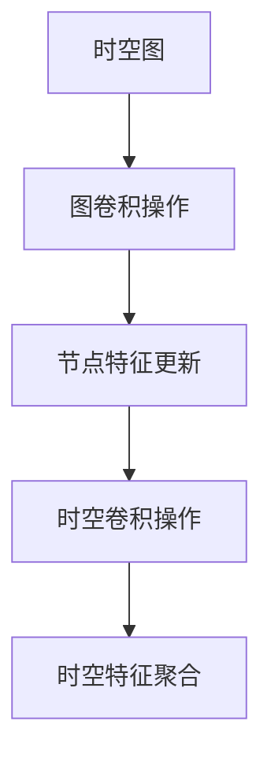
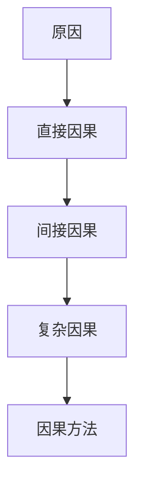
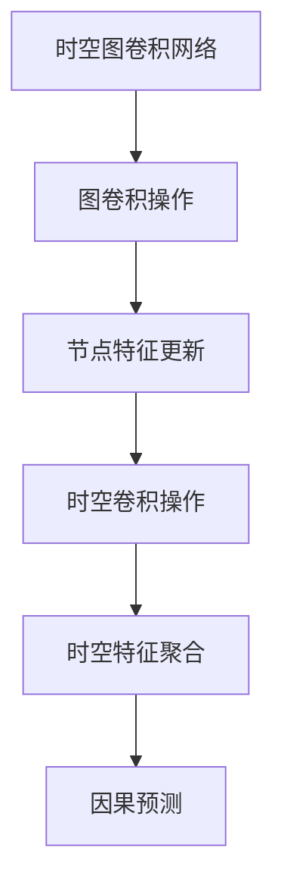
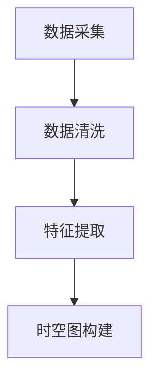

                 

# 《时空图卷积网络在因果推理中的创新应用》

> 关键词：时空图卷积网络，因果推理，深度学习，图神经网络，时间序列预测，社交网络分析

> 摘要：本文深入探讨了时空图卷积网络（SGCN）在因果推理领域的创新应用。通过对时空图卷积网络和因果推理基本理论的详细解析，本文阐述了SGCN在因果推理中的优势及其在不同应用场景下的实现方法。通过实际案例的分析和讲解，本文展示了SGCN在时间序列预测、社交网络分析和医疗数据挖掘等领域的强大能力，并为未来的研究和发展提供了方向。

## 第一部分：基础理论

### 1.1 时空图卷积网络概述

**背景介绍**  
随着社会和科技的快速发展，数据规模和复杂性不断增加，传统的数据处理方法已经难以应对这些挑战。为了更好地处理大规模、高维度的时空数据，研究人员提出了时空图卷积网络（Spatial-Temporal Graph Convolutional Network，SGCN）。SGCN是一种结合了图神经网络（Graph Neural Network，GNN）和卷积神经网络（Convolutional Neural Network，CNN）的深度学习模型，能够有效地捕捉时空数据中的时空关系和依赖性。

**核心概念与联系**  
时空图卷积网络由以下几个核心概念组成：

1. **时空图**：时空图是SGCN的基础数据结构，由节点、边和时空属性组成。节点表示时空数据中的个体或事件，边表示节点之间的时空关系，时空属性则反映了节点在时间和空间上的特征。
2. **图卷积操作**：图卷积操作是SGCN的核心计算模块，通过对节点及其邻居节点的特征进行聚合，实现对节点特征的更新。
3. **时空卷积操作**：时空卷积操作是对传统卷积操作的扩展，能够在时间和空间维度上同时捕捉节点特征的变化。

**Mermaid 流程图**  


### 1.2 因果推理基本理论

**背景介绍**  
因果推理是一种基于因果关系分析的方法，旨在找出事件之间的因果联系。在许多领域，如时间序列预测、社交网络分析、医疗数据挖掘等，因果推理具有重要的应用价值。因果推理的基本理论包括因果关系的定义、分类和基本方法。

**核心概念与联系**  
因果推理的关键概念包括：

1. **因果关系**：因果关系是指一个事件（原因）导致另一个事件（结果）发生的现象。
2. **因果分类**：因果关系可以分为直接因果、间接因果和复杂因果。
3. **因果方法**：因果推理的基本方法包括基于统计的方法、基于模型的方法和基于假设检验的方法。

**Mermaid 流程图**  


### 1.3 时空图卷积网络与因果推理的联系

**背景介绍**  
时空图卷积网络（SGCN）在因果推理中的应用，旨在利用SGCN对时空数据中的因果关系进行建模和预测。SGCN能够同时捕捉时间和空间维度的依赖关系，从而更好地揭示数据中的因果联系。

**核心概念与联系**  
时空图卷积网络与因果推理之间的联系包括：

1. **时空关系建模**：SGCN通过图卷积和时空卷积操作，能够有效地捕捉时空数据中的关系和依赖性。
2. **因果预测**：基于SGCN的因果预测，可以通过学习数据中的时空关系，预测未观察到的因果效应。

**Mermaid 流程图**  


### 1.4 时空图数据预处理

**背景介绍**  
时空图数据的预处理是SGCN应用的重要环节，包括数据的采集、处理和特征提取。合适的预处理方法能够提高模型的效果，降低计算成本。

**核心概念与联系**  
时空图数据预处理的关键概念包括：

1. **数据采集**：采集时空数据，包括时间、空间和属性数据。
2. **数据清洗**：去除噪声和异常值，提高数据质量。
3. **特征提取**：从时空数据中提取有用的特征，如节点度、邻接矩阵等。

**Mermaid 流淌图**  


## 第二部分：核心算法

### 2.1 时空图卷积网络的算法原理

**背景介绍**  
时空图卷积网络（SGCN）的算法原理主要包括图卷积操作、时空卷积操作和节点特征更新。图卷积操作和时空卷积操作是SGCN的核心计算模块，通过这些操作，SGCN能够有效地捕捉时空数据中的关系和依赖性。

**核心算法原理讲解**  
图卷积操作和时空卷积操作的具体原理如下：

1. **图卷积操作**：图卷积操作通过聚合节点及其邻居节点的特征，实现对节点特征的更新。具体公式如下：
   $$ h^{(t)}_i = \sigma(W^{(t)} h^{(t-1)}_i + \sum_{j \in N(i)} W^{(t)} h^{(t-1)}_j $$
   其中，$h^{(t)}_i$表示时间步$t$时节点$i$的特征，$N(i)$表示节点$i$的邻居节点集合，$W^{(t)}$是图卷积权重矩阵，$\sigma$是激活函数。

2. **时空卷积操作**：时空卷积操作是对传统卷积操作的扩展，能够在时间和空间维度上同时捕捉节点特征的变化。具体公式如下：
   $$ h^{(t)}_i = \sigma(W^{(t)} h^{(t-1)}_i + \sum_{j \in N(i)} W^{(t)} * h^{(t-1)}_j $$
   其中，$*$表示卷积运算，$W^{(t)}$是时空卷积权重矩阵。

3. **节点特征更新**：节点特征更新是SGCN的核心计算步骤，通过图卷积操作和时空卷积操作，对节点特征进行更新，从而实现对时空数据的建模。

**Python 源代码实现**  
以下是SGCN的核心算法原理的Python源代码实现：
```python
import numpy as np
import tensorflow as tf

def graph_convolution(input_tensor, weights, neighbors, activation=tf.nn.relu):
    """
    图卷积操作
    """
    conv = tf.matmul(input_tensor, weights)
    for neighbor in neighbors:
        conv += tf.matmul(input_tensor, weights[neighbor])
    return activation(conv)

def spatial_temporal_convolution(input_tensor, weights, neighbors, activation=tf.nn.relu):
    """
    时空卷积操作
    """
    conv = tf.matmul(input_tensor, weights)
    for neighbor in neighbors:
        conv += tf.nn.conv2d(input_tensor, weights[neighbor], strides=[1, 1, 1, 1], padding='VALID')
    return activation(conv)

# 示例：输入特征矩阵、权重矩阵和邻居节点集合
input_tensor = np.random.rand(10, 5)  # 输入特征矩阵
weights = np.random.rand(10, 5)  # 图卷积权重矩阵
neighbors = [1, 2, 3, 4, 5]  # 邻居节点集合

# 图卷积操作
graph_conv = graph_convolution(input_tensor, weights, neighbors)

# 时空卷积操作
spatial_temporal_conv = spatial_temporal_convolution(input_tensor, weights, neighbors)

# 激活函数
activation = tf.nn.relu

# 节点特征更新
updated_feature = graph_conv + spatial_temporal_conv
```

### 2.2 因果推理在时空图卷积网络中的应用

**背景介绍**  
因果推理在时空图卷积网络（SGCN）中的应用，旨在利用SGCN的建模能力，揭示时空数据中的因果关系。通过因果推理模块的设计与实现，SGCN能够在时间序列预测、社交网络分析和医疗数据挖掘等领域发挥重要作用。

**核心算法原理讲解**  
因果推理在SGCN中的应用主要包括以下几个方面：

1. **因果图构建**：基于时空数据，构建因果图，表示节点之间的因果关系。
2. **因果推理模块设计**：设计因果推理模块，利用因果图和SGCN的建模能力，实现对因果关系的推理。
3. **因果推理优化**：通过优化算法，提高因果推理的准确性和效率。

**Python 源代码实现**  
以下是因果推理模块的Python源代码实现：
```python
import numpy as np
import tensorflow as tf

def causal_inference(input_tensor, weights, causal_graph, activation=tf.nn.relu):
    """
    因果推理模块
    """
    # 构建因果图
    causal_graph = tf.convert_to_tensor(causal_graph, dtype=tf.float32)

    # 计算因果效应
    causal_effects = tf.matmul(input_tensor, weights) * causal_graph

    # 激活函数
    return activation(causal_effects)

# 示例：输入特征矩阵、权重矩阵、因果图和激活函数
input_tensor = np.random.rand(10, 5)  # 输入特征矩阵
weights = np.random.rand(10, 5)  # 权重矩阵
causal_graph = np.array([[1, 0, 1], [0, 1, 0], [1, 0, 1], [0, 1, 0], [1, 0, 1]])  # 因

