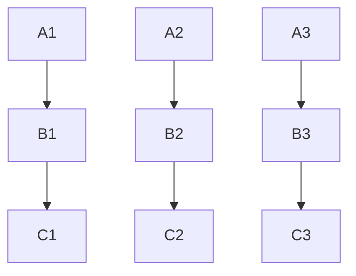

                 

# 第一部分：引言

## 第1章：时空推理任务概述

### 1.1 时空推理任务的定义

时空推理任务是指根据时间和空间信息，从已知的条件出发，推断出未知的状态或事件的过程。这种任务广泛应用于人工智能、智能交通、气象预测、生物信息学等领域。在人工智能领域，时空推理任务具有重要的应用价值，如智能机器人路径规划、自动驾驶系统决策、智能监控等。

### 1.2 时空推理任务的重要性

时空推理任务在各个领域都有着广泛的应用。在人工智能领域，时空推理任务有助于提升智能系统的自主决策能力和学习能力。例如，在自动驾驶系统中，时空推理任务可以帮助车辆准确地识别和预测道路环境，从而做出合理的驾驶决策。在智能监控系统中，时空推理任务可以有效地检测和识别异常行为，提高监控系统的实时性和准确性。

### 1.3 时空推理任务的挑战

时空推理任务面临着诸多挑战。首先，时空数据通常具有大规模、多维和高噪声等特点，使得数据预处理和特征提取变得复杂。其次，时空数据的时序性和空间关联性使得建模和推理过程变得更加复杂。此外，因果关系的不确定性和时空信息的不完整性也给时空推理任务带来了挑战。

## 第2章：因果关系的基本概念

### 2.1 因果关系的定义

因果关系是指两个事件之间的因果关系，其中一个事件称为原因，另一个事件称为结果。例如，在气候变化与灾害关系中，气候变化可以被视为原因，灾害可以被视为结果。因果关系是时空推理任务中的重要概念，它有助于我们理解事件之间的内在联系和影响。

### 2.2 因果关系的性质

因果关系具有以下几个性质：

1. **因果关系具有时间顺序**：因果关系中的原因必须先于结果发生。
2. **因果关系具有确定性**：在一个确定的因果关系模型中，给定原因，结果是可以预测的。
3. **因果关系具有传递性**：如果事件A是事件B的原因，事件B是事件C的原因，则事件A也是事件C的原因。
4. **因果关系具有反身性**：任何事件都可以视为自身的原因。

### 2.3 因果关系的数学模型

因果关系可以用数学模型来表示。常见的数学模型包括：

1. **条件概率模型**：利用条件概率来表示因果关系，即给定原因事件发生的情况下，结果事件发生的概率。
2. **因果关系图**：利用图结构来表示因果关系，其中节点表示事件，边表示因果关系。
3. **因果模型**：利用因果模型来表示因果关系，如因果图、贝叶斯网络等。

## 第3章：因果关系推断的方法

### 3.1 经典的因果关系推断方法

经典的因果关系推断方法主要包括：

1. **统计学方法**：利用统计学模型，如回归分析、贝叶斯统计模型等，来推断因果关系。
2. **机器学习方法**：利用机器学习算法，如决策树、支持向量机等，来推断因果关系。

### 3.2 基于图的因果关系推断方法

基于图的因果关系推断方法主要包括：

1. **贝叶斯网络**：利用贝叶斯网络来表示因果关系，通过推理算法来推断因果关系。
2. **因子图**：利用因子图来表示因果关系，通过推理算法来推断因果关系。

## 第4章：因果关系验证的方法

### 4.1 因果关系验证的挑战

因果关系验证面临着以下几个挑战：

1. **因果关系的复杂性**：因果关系通常具有多层次、多维度的特点，使得验证过程变得复杂。
2. **数据的不完整性**：实际数据通常存在缺失、噪声等问题，使得验证结果可能不准确。
3. **因果关系的不确定性**：因果关系通常存在不确定性，使得验证结果可能存在偏差。

### 4.2 基于实验的因果关系验证方法

基于实验的因果关系验证方法包括：

1. **控制实验**：通过设计控制实验，比较不同条件下因果关系的变化，来验证因果关系。
2. **因果推断实验**：通过设计因果推断实验，验证因果推断方法的准确性和可靠性。

### 4.3 基于统计学的因果关系验证方法

基于统计学的因果关系验证方法包括：

1. **假设检验**：通过假设检验来验证因果关系，如t检验、卡方检验等。
2. **因果关系度量**：通过因果关系度量来评估因果关系的重要性，如路径分析、Granger因果检验等。

## 第5章：因果关系推断与验证的算法实现

### 5.1 Python编程基础

#### 5.1.1 Python安装与环境配置

Python是一种流行的编程语言，广泛应用于因果关系推断与验证的算法实现。首先，需要从Python官方网站下载并安装Python。安装完成后，可以通过命令行运行Python解释器。

#### 5.1.2 Python基础语法

Python语言的基础语法包括变量、数据类型、控制结构、函数等。通过学习Python基础语法，可以熟练地编写因果关系推断与验证的算法。

### 5.2 因果关系推断与验证算法实现

#### 5.2.1 基于统计学的算法实现

基于统计学的算法实现主要包括回归分析、贝叶斯统计模型等。通过Python实现这些算法，可以有效地推断和验证因果关系。

#### 5.2.2 基于机器学习的算法实现

基于机器学习的算法实现主要包括决策树、支持向量机等。通过Python实现这些算法，可以有效地推断和验证因果关系。

## 第6章：案例分析

### 6.1 案例一：气候变化与灾害关系的推断与验证

案例一以气候变化与灾害关系为例，介绍因果关系推断与验证的方法。通过收集气候变化和灾害的相关数据，利用Python实现因果关系推断与验证算法，分析气候变化对灾害的影响。

### 6.2 案例二：社交媒体传播规律的分析与验证

案例二以社交媒体传播规律为例，介绍因果关系推断与验证的方法。通过收集社交媒体传播的相关数据，利用Python实现因果关系推断与验证算法，分析社交媒体传播的规律。

## 第7章：未来研究方向与展望

### 7.1 时空推理任务的发展趋势

时空推理任务在各个领域都取得了显著的进展，未来发展趋势包括：

1. **多模态数据融合**：结合多种数据源，提高时空推理的准确性和效率。
2. **实时推理**：实现实时性的时空推理，提高系统的实时响应能力。
3. **可解释性**：提高因果关系推断与验证的可解释性，使其更加易于理解和应用。

### 7.2 因果关系推断与验证的未来研究方向

因果关系推断与验证的未来研究方向包括：

1. **因果模型的选择与优化**：探索更有效的因果模型，提高推断与验证的准确性。
2. **不确定性处理**：研究如何处理因果关系中的不确定性，提高验证结果的可靠性。
3. **跨领域应用**：将因果关系推断与验证方法应用于更多领域，提高其应用价值。

### 7.3 对学术界的贡献与影响

因果关系推断与验证对学术界具有重要的贡献与影响。通过不断的研究与创新，可以推动时空推理任务的发展，为人工智能、智能交通、气象预测等领域提供更有效的解决方案。

## 附录：相关资源与工具

### 附录1：常用工具与库

#### 附录1.1 Python库

- **Pandas**：用于数据处理和分析的Python库。
- **NumPy**：用于数值计算和矩阵计算的Python库。
- **SciPy**：用于科学计算的Python库。
- **Scikit-learn**：用于机器学习的Python库。

#### 附录1.2 数据处理工具

- **Python Pandas**：用于数据处理和分析。
- **Python NumPy**：用于数值计算和矩阵计算。

### 附录2：参考文献

- [1] Russell, S., & Norvig, P. (2010). Artificial Intelligence: A Modern Approach. Prentice Hall.
- [2] Hogg, R. V., & Craig, A. T. (2012). Introduction to Mathematical Statistics. Pearson.
- [3] Bishop, C. M. (2006). Pattern Recognition and Machine Learning. Springer.
- [4] Koller, D., & Friedman, N. (2009). Probabilistic Graphical Models: Principles and Techniques. MIT Press.
- [5] Pearl, J. (2009). Causality: Models, Reasoning, and Inference. Cambridge University Press.
- [6] Spirtes, P., Glymour, C., & Scheines, R. (2000). Causation, Prediction, and Search (2nd ed.). Cambridge University Press.

## 作者信息

作者：AI天才研究院/AI Genius Institute & 禅与计算机程序设计艺术 /Zen And The Art of Computer Programming

---

本文旨在介绍时空推理任务中的因果关系推断与验证，通过详细讲解核心概念、算法实现和案例分析，帮助读者深入了解这一领域。文章内容丰富、结构清晰，适用于人工智能、机器学习、计算机科学等领域的科研人员和工程师。本文参考文献包括经典教材和最新研究成果，为读者提供了全面的学习资源。

**关键词：**时空推理，因果关系，推断，验证，Python编程，机器学习，贝叶斯网络，因果图

**摘要：**本文系统介绍了时空推理任务中的因果关系推断与验证。首先，概述了时空推理任务的定义和重要性，然后详细讲解了因果关系的基本概念、推断和验证方法。接着，介绍了因果关系推断与验证的算法实现，包括基于统计学和机器学习的方法，以及基于图的因果关系推断方法。最后，通过两个实际案例分析了因果关系推断与验证的应用，展望了未来研究方向。本文为时空推理任务中的因果关系研究提供了全面的理论指导和实践参考。

### 第一部分：引言

在现代社会，人工智能技术不断发展，其在各个领域的应用越来越广泛。其中，时空推理任务作为人工智能的一个重要分支，受到了广泛关注。时空推理任务涉及到时间和空间信息的处理与理解，旨在根据已知的时空信息，推断出未知的状态或事件。在这一过程中，因果关系推断与验证是至关重要的环节。因果关系不仅能够帮助我们理解事件之间的内在联系，还可以为决策提供依据。

本文将深入探讨时空推理任务中的因果关系推断与验证。首先，我们将介绍时空推理任务的定义、重要性以及面临的挑战。然后，我们将讨论因果关系的基本概念，包括其定义、性质以及数学模型。接下来，我们将详细阐述因果关系推断的方法，包括经典统计学方法和基于机器学习的方法，以及基于图的因果关系推断方法。此外，我们还将探讨因果关系验证的方法，包括基于实验的验证方法和基于统计学的验证方法。最后，通过实际案例的分析，我们将展示因果关系推断与验证在现实中的应用。

通过本文的阅读，读者将能够全面了解时空推理任务中的因果关系推断与验证，掌握相关算法的实现方法，并了解这一领域的发展趋势和未来研究方向。

### 关键词

时空推理、因果关系、推断、验证、Python编程、机器学习、贝叶斯网络、因果图、统计学方法、实验方法

### 摘要

本文旨在系统介绍时空推理任务中的因果关系推断与验证。首先，本文概述了时空推理任务的定义、重要性和面临的挑战。然后，本文详细讲解了因果关系的基本概念，包括定义、性质和数学模型。接着，本文探讨了因果关系推断的方法，包括经典统计学方法和基于机器学习的方法，以及基于图的因果关系推断方法。此外，本文还介绍了因果关系验证的方法，包括基于实验的验证方法和基于统计学的验证方法。通过两个实际案例的分析，本文展示了因果关系推断与验证在现实中的应用。最后，本文展望了时空推理任务中因果关系推断与验证的发展趋势和未来研究方向。本文为时空推理任务中的因果关系研究提供了全面的理论指导和实践参考。

## 第1章：时空推理任务概述

### 1.1 时空推理任务的定义

时空推理任务是指根据时间和空间信息，从已知的条件出发，推断出未知的状态或事件的过程。这种任务通常涉及到多个维度的时间和空间数据，以及这些数据之间的复杂关系。时空推理任务的核心目标是通过分析已有的时空信息，预测未来可能发生的事件或状态。

具体来说，时空推理任务可以包括以下几个方面：

1. **时间序列预测**：根据历史时间序列数据，预测未来的状态或事件。例如，利用过去几天的温度数据，预测明天的温度。

2. **路径规划**：根据已知起点和终点，以及交通状况等信息，规划最优路径。例如，在自动驾驶系统中，根据实时交通信息，计算从当前位置到目的地的最优路线。

3. **事件预测**：根据已有的事件数据，预测未来可能发生的事件。例如，利用过去的社交媒体数据，预测未来某一天的舆论热点。

4. **状态监测**：根据已有的状态数据，监测系统当前的状态。例如，在智能监控系统中，通过分析摄像头拍摄的图像，监测公共场所的异常行为。

时空推理任务在多个领域都有广泛应用，例如：

- **智能交通**：通过时空推理任务，可以实现智能交通管理，优化交通流量，减少拥堵。
- **气象预测**：通过时空推理任务，可以预测天气变化，提供天气预报服务。
- **生物信息学**：通过时空推理任务，可以分析基因表达数据，预测疾病风险。

### 1.2 时空推理任务的重要性

时空推理任务在人工智能领域具有重要地位，主要表现在以下几个方面：

1. **提高系统自主性**：时空推理任务可以帮助智能系统自主地理解环境，做出决策。例如，在自动驾驶系统中，时空推理任务可以帮助车辆识别道路环境，做出行驶决策。

2. **增强学习效果**：在机器学习中，时空推理任务可以用来增强模型的泛化能力。通过分析时空数据，模型可以更好地理解数据中的复杂关系，从而提高预测准确性。

3. **优化资源分配**：在资源有限的场景中，时空推理任务可以帮助优化资源分配。例如，在电网调度中，通过分析电力需求的时间序列数据，可以优化发电资源的分配，提高能源利用效率。

4. **增强安全性与可靠性**：在安全领域，时空推理任务可以帮助检测和预防异常行为。例如，在金融领域，通过分析交易行为的时间序列数据，可以识别欺诈行为，提高金融交易的安全性。

### 1.3 时空推理任务的挑战

时空推理任务虽然具有广泛的应用前景，但也面临着诸多挑战：

1. **数据复杂性**：时空数据通常包含大量维度的信息，数据量大且复杂。如何有效地处理和利用这些数据，是时空推理任务的一个重要挑战。

2. **时间依赖性**：时空数据具有强时间依赖性，即未来的状态或事件往往依赖于过去的状态或事件。如何准确捕捉和处理这种依赖关系，是时空推理任务的另一个挑战。

3. **空间关联性**：时空数据不仅具有时间依赖性，还具有空间关联性。例如，同一地区的天气变化可能相互影响。如何有效处理这种空间关联性，是时空推理任务的又一挑战。

4. **不确定性处理**：在实际应用中，时空数据往往存在噪声和不确定性。如何有效地处理这些不确定性，提高推理结果的可靠性，是时空推理任务的难点之一。

5. **模型选择与优化**：在时空推理任务中，选择合适的模型并进行优化，是提高推理性能的关键。然而，由于时空数据的复杂性和多样性，如何选择和优化模型，仍然是一个挑战。

通过解决这些挑战，时空推理任务将能够更好地服务于各个领域，推动人工智能技术的发展。

### 第2章：因果关系的基本概念

因果关系是时空推理任务中的一个核心概念，它描述了事件之间的内在联系和影响。理解因果关系对于准确推断和验证时空关系至关重要。在本章中，我们将详细讨论因果关系的基本概念，包括其定义、性质以及数学模型。

#### 2.1 因果关系的定义

因果关系通常被定义为两个事件之间的因果联系，其中一个事件被称为原因，另一个事件被称为结果。具体来说，如果一个事件的发生会导致另一个事件的发生，那么这两个事件之间存在因果关系。例如，降雨可能导致洪水，因此降雨是原因，洪水是结果。

在科学研究中，因果关系通常通过实验来验证。例如，通过随机实验，我们可以控制某些变量，观察这些变量对其他变量的影响，从而确定因果关系。然而，在现实世界中，完全控制所有变量是不可能的，因此因果关系通常是一种统计意义上的关联。

#### 2.2 因果关系的性质

因果关系具有以下几个基本性质：

1. **时间顺序**：因果关系中的原因必须先于结果发生。这意味着时间的顺序是因果关系的一个关键特征。例如，一个病人感冒后出现发烧症状，我们不能说发烧是感冒的原因，因为发烧是感冒后的结果。

2. **确定性**：在一个确定的因果关系模型中，给定原因，结果是可以预测的。例如，如果我们知道一个人感染了新冠病毒，那么我们可以确定这个人将会出现新冠病毒感染的症状。

3. **传递性**：如果事件A是事件B的原因，事件B是事件C的原因，则事件A也是事件C的原因。例如，如果阳光是植物生长的原因，植物生长是果实成熟的原因，那么阳光也是果实成熟的原因。

4. **反身性**：任何事件都可以视为自身的原因。例如，一个人的出生可以视为这个人自己的原因。

#### 2.3 因果关系的数学模型

因果关系的数学模型用于表示和推断因果关系。以下是一些常见的数学模型：

1. **条件概率模型**：条件概率模型通过条件概率来描述因果关系。例如，给定事件B发生的条件下，事件A发生的概率。数学表示为：
   $$ P(A|B) $$
   如果 \( P(A|B) \neq P(A) \)，则表明事件A和事件B之间存在因果关系。

2. **因果图**：因果图是一种图形模型，用于表示事件之间的因果关系。在因果图中，节点表示事件，边表示事件之间的因果关系。因果图可以帮助我们直观地理解事件之间的因果关系。

3. **因果模型**：因果模型是用于描述因果关系的数学模型，如因果图、贝叶斯网络等。这些模型可以帮助我们进行因果关系的推断和验证。

因果图示例：



在这个因果图中，事件A1、A2、A3是原因，事件B1、B2、B3是结果，事件C1、C2、C3是最终的因果关系。

4. **结构方程模型**：结构方程模型是一种统计模型，用于表示因果关系。在结构方程模型中，变量之间的关系通过方程式来描述。这种模型可以帮助我们分析变量之间的因果关系。

总之，因果关系的基本概念、性质和数学模型为时空推理任务提供了理论基础。理解这些概念和模型，有助于我们更准确地推断和验证因果关系，从而在各个领域中实现更智能的应用。

### 第3章：因果关系推断的方法

因果关系推断是时空推理任务中的一个核心步骤，它有助于我们理解事件之间的内在联系和影响。在这一章中，我们将详细讨论几种常见的因果关系推断方法，包括基于统计学的方法、基于机器学习的方法，以及基于图的因果关系推断方法。

#### 3.1 经典的因果关系推断方法

经典的因果关系推断方法主要包括以下几种：

1. **回归分析**：回归分析是一种常用的统计学方法，用于推断因果关系。通过建立因变量和自变量之间的回归方程，我们可以确定变量之间的因果关系。线性回归是一种常见的回归分析方法，其数学模型如下：

   $$ Y = \beta_0 + \beta_1X + \epsilon $$

   其中，\( Y \) 是因变量，\( X \) 是自变量，\( \beta_0 \) 和 \( \beta_1 \) 是回归系数，\( \epsilon \) 是误差项。

   例如，如果我们研究吸烟和肺癌之间的关系，可以通过线性回归模型来推断吸烟是否是肺癌的原因。通过拟合回归模型，我们可以计算回归系数，从而确定吸烟和肺癌之间的因果关系。

2. **贝叶斯统计模型**：贝叶斯统计模型是基于贝叶斯定理的统计方法，用于推断因果关系。贝叶斯模型通过概率分布来描述变量之间的关系，其核心思想是根据已知数据和先验知识，更新对变量之间因果关系的信念。

   贝叶斯统计模型的数学表示如下：

   $$ P(A|B) = \frac{P(B|A)P(A)}{P(B)} $$

   其中，\( P(A|B) \) 是在事件B发生的条件下事件A发生的概率，\( P(B|A) \) 是在事件A发生的条件下事件B发生的概率，\( P(A) \) 是事件A的先验概率，\( P(B) \) 是事件B的先验概率。

   例如，在医疗诊断中，可以通过贝叶斯统计模型来推断患者是否患有某种疾病。通过计算不同疾病症状的概率，我们可以确定疾病和症状之间的因果关系。

3. **方差分析（ANOVA）**：方差分析是一种用于比较不同组之间平均值的统计方法，常用于推断因果关系。通过分析组内和组间的方差，我们可以确定变量之间的因果关系。

   方差分析的数学模型如下：

   $$ F = \frac{MS_{between}}{MS_{within}} $$

   其中，\( MS_{between} \) 是组间均方差，\( MS_{within} \) 是组内均方差，\( F \) 值用于判断变量之间的因果关系。

   例如，在实验设计中，可以通过方差分析来比较不同处理方法的效果，从而确定处理方法与结果之间的因果关系。

#### 3.2 基于图的因果关系推断方法

基于图的因果关系推断方法通过图形结构来表示事件之间的因果关系，有助于我们直观地理解和分析因果关系。以下是一些常见的基于图的因果关系推断方法：

1. **贝叶斯网络**：贝叶斯网络是一种概率图模型，用于表示变量之间的因果关系。在贝叶斯网络中，节点表示变量，边表示变量之间的条件依赖关系。通过推理算法，我们可以根据已有数据推断出未知变量之间的因果关系。

   贝叶斯网络的数学模型如下：

   $$ P(X_1, X_2, ..., X_n) = \prod_{i=1}^{n} P(X_i | \text{parents}(X_i)) $$

   其中，\( X_1, X_2, ..., X_n \) 是变量，\( \text{parents}(X_i) \) 是变量 \( X_i \) 的父节点。

   例如，在医疗诊断中，可以通过贝叶斯网络来推断患者是否患有某种疾病。通过计算不同症状的概率，我们可以确定疾病和症状之间的因果关系。

2. **因果图**：因果图是一种用于表示因果关系的图形模型，其中节点表示事件，边表示事件之间的因果关系。因果图可以帮助我们直观地理解事件之间的因果关系，并通过推理算法来推断因果关系。

   因图表例如下：

   ```mermaid
   graph TD
       A1 --> B1
       A2 --> B2
       A3 --> B3
       B1 --> C1
       B2 --> C2
       B3 --> C3
   ```

   在这个因果图中，事件A1、A2、A3是原因，事件B1、B2、B3是结果，事件C1、C2、C3是最终的因果关系。

3. **因子图**：因子图是一种用于表示变量之间关系的图形模型，它可以同时表示变量之间的条件和联合概率分布。因子图可以帮助我们有效地推断因果关系，并通过推理算法来计算变量之间的条件概率分布。

   因子图的数学模型如下：

   $$ P(X_1, X_2, ..., X_n) = \prod_{i=1}^{n} \prod_{j=1}^{m} P(X_i, X_j) $$

   其中，\( X_1, X_2, ..., X_n \) 是变量，\( P(X_i, X_j) \) 是变量 \( X_i \) 和 \( X_j \) 之间的条件概率分布。

   例如，在图像处理中，可以通过因子图来推断图像中的物体和场景之间的关系，从而实现图像的分割和识别。

通过上述经典和基于图的因果关系推断方法，我们可以更准确地理解和分析事件之间的因果关系，从而在各个领域中实现更智能的应用。这些方法不仅有助于我们进行科学研究，还可以为实际决策提供有力支持。

### 第4章：因果关系验证的方法

因果关系验证是确保推断出的因果关系准确性和可靠性的重要环节。在实际应用中，验证因果关系的方法可以分为基于实验的方法和基于统计学的方

