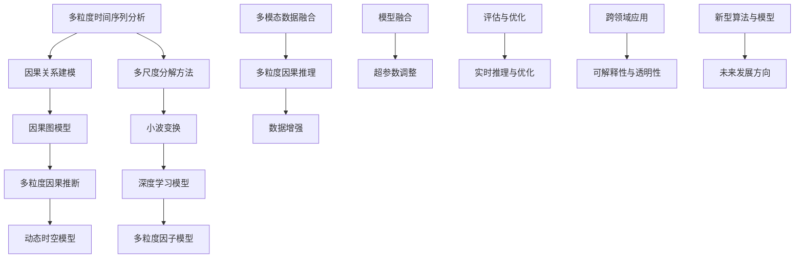

                 

## 文章标题：时空推理任务中的多粒度因果关系建模技术

在人工智能的不断发展中，时空推理任务日益显得重要。这一任务涉及在时间维度和空间维度上对事件及其相互关系进行理解和分析。而多粒度因果关系建模技术，作为时空推理的核心环节，正日益受到关注。本文将深入探讨这一领域，通过逻辑清晰、结构紧凑的方式，为您揭示多粒度因果关系建模技术在时空推理任务中的广泛应用及其重要性。

> **关键词**：时空推理、多粒度因果关系建模、因果关系、时空数据、应用领域、算法原理

> **摘要**：本文从时空推理任务的重要性出发，详细介绍了多粒度因果关系建模技术的基本概念、原理和应用。通过具体实例和算法解析，展示了多粒度因果关系建模在生物医学、交通和金融等领域的实际应用，并对其未来发展进行了展望。本文旨在为研究者提供有价值的参考，以推动这一领域的技术创新和应用。

本文将按照以下结构进行展开：

1. **背景与概述**：介绍时空推理任务的基本概念和重要性，以及多粒度因果关系建模技术的起源和发展。
2. **多粒度因果关系建模技术原理**：深入探讨多粒度因果关系建模的基础理论、方法和技术。
3. **多粒度因果关系建模的应用**：分析多粒度因果关系建模在多个领域的具体应用。
4. **多粒度因果关系建模技术的发展趋势与展望**：总结现有研究，探讨未来研究方向和挑战。

通过这样的结构，我们希望读者能够系统地了解多粒度因果关系建模技术，并对其在时空推理任务中的重要性有更深入的认识。

### 第1章：时空推理任务概述

#### 1.1 时空推理的定义与重要性

时空推理（Temporal and Spatial Reasoning）是人工智能领域的一个重要分支，旨在理解和处理时间维度和空间维度上的信息。在时间维度上，时空推理关注事件的时间顺序、持续性和时序关系；在空间维度上，它涉及位置、移动和空间关系。

时空推理的定义可以扩展为：通过分析时间序列和空间数据，推导出事件之间的关系，并预测未来的发展趋势。这种能力对于很多领域都至关重要，尤其是在需要处理大量时空数据的情境下。

时空推理的重要性主要体现在以下几个方面：

1. **决策支持**：在交通管理、应急响应等领域，实时分析时空数据可以帮助做出快速而准确的决策。
2. **事件预测**：通过对历史时空数据的分析，可以预测未来的事件趋势，如金融市场波动、天气变化等。
3. **智能系统设计**：在自动驾驶、智能城市等领域，时空推理技术是实现智能决策和高效运行的关键。

#### 1.2 时空推理的应用领域

时空推理技术已经在多个领域得到了广泛应用：

1. **交通领域**：交通流量预测、公共交通优化、事故预警等。
2. **生物医学**：基因表达分析、疾病传播预测、药物研发等。
3. **环境科学**：气候模式预测、自然灾害预警、生态系统监测等。
4. **金融**：市场趋势分析、风险控制、投资策略制定等。
5. **智能城市**：城市管理、公共安全、资源分配等。

每个应用领域都对时空推理提出了独特的挑战，同时也提供了丰富的数据资源和问题背景。这种多样性的应用场景，使得时空推理技术成为了人工智能领域中一个极具前景的研究方向。

#### 1.3 时空推理的发展历程与趋势

时空推理技术的发展历程可以追溯到20世纪80年代。当时，研究人员开始探索如何利用计算机技术模拟人类对时间和空间的理解能力。早期的探索主要集中在基于规则的方法和简单的时序模型上。

随着时间的推移，机器学习和深度学习技术的发展，时空推理技术也取得了显著的进步。特别是深度学习模型，如循环神经网络（RNN）和变分自动编码器（VAE），在处理复杂数据和建模非线性关系方面表现出色。

目前，时空推理的发展趋势主要集中在以下几个方面：

1. **多模态数据融合**：结合不同类型的数据源（如图像、文本、传感器数据），以获取更全面的时空信息。
2. **动态时空模型**：研究能够适应动态环境变化的时空模型，如长短期记忆网络（LSTM）和图神经网络（GNN）。
3. **实时推理与优化**：开发实时高效的时空推理算法，以满足实时应用的需求。
4. **跨领域应用**：探索时空推理技术在更多领域的应用，以实现技术的广泛推广和应用。

总之，时空推理技术在人工智能领域中的地位日益重要，其应用前景也十分广阔。通过不断的研究和技术创新，我们有望在更多领域实现智能化和自动化，为社会发展和人类福祉做出更大贡献。

#### 1.4 多粒度因果关系建模技术的概念与特点

多粒度因果关系建模技术是一种用于分析复杂系统中各元素间相互作用关系的先进方法。它的核心在于能够从不同层次或粒度上解析和建模因果关系，从而提供更全面和精细的时空推理能力。

**多粒度因果关系的概念**：

多粒度因果关系指的是在时间和空间维度上，事件之间的因果关系可以表现为不同层次或粒度。具体来说，这些层次或粒度可以是宏观的（如国家、地区）、中观的（如城市、区域）和微观的（如街道、家庭）。每一个层次或粒度都有其独特的特征和数据来源，通过对这些不同层次或粒度的因果关系进行建模和分析，可以更全面地理解整个系统。

**多粒度因果关系建模技术的特点**：

1. **层次性**：多粒度因果关系建模技术能够同时处理不同层次的数据，从而提供一个层次化的视角。这种层次性不仅提高了模型的灵活性，还使得模型能够适应多样化的应用场景。

2. **适应性**：多粒度因果关系建模技术可以根据具体应用需求，灵活调整粒度。例如，在交通领域，可以根据交通流量的大小调整粒度，从街道级别到区域级别的分析，以适应不同层次的交通管理需求。

3. **综合分析**：通过整合不同层次或粒度的因果关系，多粒度因果关系建模技术能够提供更综合和全面的时空推理结果。这有助于揭示复杂系统中潜在的关联性和趋势。

4. **高精度**：多粒度因果关系建模技术通过精细化处理，能够在更高粒度上捕捉事件之间的细微关系，从而提高模型的预测准确性和可靠性。

**多粒度因果关系建模技术的意义**：

多粒度因果关系建模技术在多个领域都具有重要的意义：

1. **精确预测**：通过在不同粒度上分析因果关系，可以更精确地预测未来的事件发展趋势。这对于金融市场预测、疾病传播预测等具有重要意义。

2. **决策优化**：在交通管理、资源分配等领域，多粒度因果关系建模技术可以帮助优化决策过程，提高效率和准确性。例如，通过分析不同层次的交通流量，可以优化交通信号控制和公共交通调度。

3. **复杂系统理解**：多粒度因果关系建模技术有助于我们更深入地理解复杂系统的运行机制和潜在风险。这对于系统设计和维护，以及预防和应对突发事件具有重要意义。

4. **智能化应用**：多粒度因果关系建模技术为智能系统的设计和实现提供了强大的支持。在自动驾驶、智能城市等领域，通过多粒度因果关系建模，可以实现更智能、更高效的管理和运作。

总之，多粒度因果关系建模技术是一种强有力的工具，它不仅能够提高时空推理的精度和效率，还为多个领域的研究和应用提供了新的思路和方法。通过深入研究和不断优化，这一技术有望在未来的发展中发挥更大的作用。

#### 1.5 多粒度因果关系建模技术的研究现状

多粒度因果关系建模技术近年来在学术界和工业界都受到了广泛关注，研究者们提出了一系列创新的方法和模型，推动这一领域取得了显著进展。以下将综述多粒度因果关系建模技术的研究现状，并分析当前的研究热点和趋势。

**研究方法与技术进展**：

1. **多粒度时间序列分析**：时间序列分析是多粒度因果关系建模的基础。研究人员开发了多种方法，如多尺度分解（Multiscale Decomposition）、多分辨率分析（Multiresolution Analysis）和小波变换（Wavelet Transform）等，以捕捉不同时间尺度上的动态变化。此外，长短期记忆网络（LSTM）和门控循环单元（GRU）等深度学习模型也被广泛应用于多粒度时间序列分析，通过引入时间窗口和门控机制，可以更好地捕获长期依赖和短期波动。

2. **多粒度因果推断**：因果推断是多粒度因果关系建模的核心问题。近年来，基于统计学和机器学习的方法，如结构方程模型（Structural Equation Modeling, SEM）、因果图模型（Causal Graphical Models）和随机图模型（Random Graph Models）等，被广泛研究。特别是基于深度学习的因果推断方法，如变分自编码器（Variational Autoencoder, VAE）和生成对抗网络（Generative Adversarial Networks, GAN），通过学习数据分布和潜在变量，可以有效地建模复杂系统的因果关系。

3. **多粒度时空数据分析**：时空数据分析是多粒度因果关系建模的重要组成部分。研究人员开发了多种时空分析方法，如时空回归模型（Spatial Regression Models）和时空卷积神经网络（Spatial Convolutional Neural Networks, SCNN）。特别是图卷积网络（Graph Convolutional Networks, GCN）和图神经网络（Graph Neural Networks, GNN）在处理具有空间特征的数据方面表现出色，通过学习节点和边之间的关系，可以捕捉复杂的时空模式。

4. **多粒度融合技术**：多粒度融合技术是多粒度因果关系建模的关键挑战之一。研究人员提出了一系列融合方法，如加权融合、多视图融合和协同学习方法，以整合不同粒度或层次的数据。特别是基于注意力机制（Attention Mechanism）的融合方法，通过自适应地调整不同粒度数据的权重，可以有效地提高模型的性能。

**研究热点与趋势**：

1. **多模态数据融合**：随着传感器技术和数据采集手段的进步，多模态数据（如图像、文本、传感器数据）在多粒度因果关系建模中变得越来越重要。研究人员正在探索如何有效融合不同类型的数据，以提供更全面和准确的时空推理能力。特别是深度学习和图神经网络在多模态数据融合方面的应用，正成为研究热点。

2. **动态时空模型**：动态环境下的时空数据具有高度的不确定性和复杂性。研究人员正在开发动态时空模型，以适应动态变化的环境。这些模型不仅需要捕捉静态的时空模式，还要能够适应实时数据的动态更新。基于深度学习和强化学习的动态时空模型研究正逐渐成为热点。

3. **可解释性和透明性**：多粒度因果关系建模技术的复杂性使其结果往往难以解释。研究人员正在探索如何提高模型的可解释性，以帮助用户理解和信任模型的推理结果。可解释的因果关系建模方法，如因果图模型和因果推理算法，正受到广泛关注。

4. **跨领域应用**：多粒度因果关系建模技术在多个领域（如交通、生物医学、金融等）都展现了巨大的应用潜力。未来的研究将更多关注于跨领域的应用，通过整合不同领域的数据和知识，实现更广泛的智能化应用。

总之，多粒度因果关系建模技术已经取得了显著的进展，但仍然面临着许多挑战。未来的研究将继续探索更高效、更灵活、更具解释性的多粒度因果关系建模方法，以推动这一领域的发展和应用。

#### 1.6 多粒度因果关系建模技术在时空推理中的重要性

多粒度因果关系建模技术在时空推理任务中的重要性不言而喻。首先，它提供了对复杂系统中多层次、多维度数据的有效分析能力。通过在不同粒度上捕捉事件之间的因果关系，多粒度因果关系建模技术能够揭示出隐藏在大量时空数据背后的关键信息和规律。这不仅有助于我们更好地理解系统的运行机制，还可以为实际应用提供更精确的预测和决策支持。

在交通领域，多粒度因果关系建模技术可以通过分析不同粒度的交通流量数据，预测未来交通状况，优化交通信号控制和公共交通调度。例如，通过在街道、区域和城市层面上分析交通流量，可以识别交通拥堵的源头，并提出有效的缓解措施，从而提高交通效率和安全性。

在生物医学领域，多粒度因果关系建模技术可以用于分析基因表达数据、流行病传播数据和医疗记录等。通过在不同粒度上建模因果关系，可以预测疾病的发展趋势，优化药物研发和公共卫生政策。例如，利用多粒度因果关系建模技术，可以预测某种疾病在不同区域和不同人群中的传播情况，为疾病预防和控制提供科学依据。

在金融领域，多粒度因果关系建模技术可以帮助预测市场趋势、识别风险和制定投资策略。通过对历史金融数据在不同粒度上的因果关系分析，可以识别市场波动的原因，预测未来市场的变化趋势，从而为投资者提供有价值的信息。例如，利用多粒度因果关系建模技术，可以预测股市的涨跌、汇率的变化以及金融市场的波动，为投资决策提供支持。

总之，多粒度因果关系建模技术在时空推理任务中发挥着至关重要的作用。它不仅为各个领域的应用提供了强大的工具，还为理解和解决复杂问题提供了新的视角和方法。随着多粒度因果关系建模技术的不断发展和优化，我们有理由相信，它将在未来的时空推理任务中发挥更加重要的作用，推动人工智能技术的进一步发展。

### 第2章：多粒度因果关系建模技术原理

#### 2.1 多粒度时间序列分析

多粒度时间序列分析是多粒度因果关系建模技术的重要组成部分，它通过在不同时间粒度上分析时间序列数据，捕捉不同时间尺度上的动态变化。这一部分将介绍多粒度时间序列分析的基本概念、方法及其在因果关系建模中的应用。

**基本概念**：

时间序列数据是由一系列按时间顺序排列的数值组成的序列。多粒度时间序列分析的核心在于将时间序列数据分解为不同的时间粒度，从而在不同的层次上分析数据。

- **时间粒度**：时间粒度是指时间序列数据的时间间隔。常见的粒度包括秒、分钟、小时、天、月等。
- **多尺度分解**：多尺度分解是一种将时间序列数据分解为不同时间粒度的方法。常见的方法包括Waldo分解、Hilbert-Huang变换和小波变换等。

**方法**：

1. **小波变换**：小波变换是一种用于多尺度分析的经典方法。它通过将时间序列数据分解为不同尺度的小波函数，捕捉不同时间尺度上的特征。具体步骤如下：

   - **尺度选择**：选择一组合适的小波基函数，并确定分解的尺度范围。
   - **分解操作**：将时间序列数据逐层分解为不同尺度的小波系数。
   - **重构操作**：通过重构操作将分解后的数据重新组合成原始时间序列。

2. **长短期记忆网络（LSTM）**：LSTM是一种深度学习模型，特别适用于处理时间序列数据。它通过引入记忆单元和门控机制，可以有效地捕捉长期和短期依赖关系。LSTM在多粒度时间序列分析中的应用主要包括：

   - **多尺度输入**：将时间序列数据分解为不同粒度，并将这些粒度作为LSTM的不同输入层。
   - **层次化建模**：通过多层LSTM模型，逐步提取不同时间尺度上的特征信息。

**应用实例**：

多粒度时间序列分析在因果关系建模中的应用实例主要包括：

1. **交通流量预测**：通过分析不同粒度的交通流量数据，可以预测未来交通状况，优化交通信号控制和公共交通调度。具体步骤如下：

   - **数据采集**：收集不同粒度的交通流量数据，如秒级、分钟级和小时级数据。
   - **多尺度分解**：使用小波变换或LSTM模型，将交通流量数据分解为不同粒度。
   - **特征提取**：从不同粒度的数据中提取特征信息，如平均流量、最大流量和流量波动等。
   - **预测建模**：使用多粒度LSTM模型，对未来的交通流量进行预测。

2. **金融市场预测**：通过分析不同粒度的金融市场数据，如秒级、分钟级和小时级数据，可以预测市场趋势和风险。具体步骤如下：

   - **数据采集**：收集不同粒度的金融市场数据，如股票价格、交易量等。
   - **多尺度分解**：使用小波变换或LSTM模型，将金融市场数据分解为不同粒度。
   - **特征提取**：从不同粒度的数据中提取特征信息，如价格波动、交易量变化等。
   - **预测建模**：使用多粒度LSTM模型，对未来的市场趋势和风险进行预测。

通过以上实例，我们可以看到多粒度时间序列分析在因果关系建模中的应用价值和潜力。它不仅提供了对复杂系统中多层次、多维度数据的有效分析能力，还为实际应用提供了更精确的预测和决策支持。

#### 2.2 多粒度因果关系的理论基础

多粒度因果关系的理论基础是多粒度因果关系建模技术的基础。它涉及到因果推断、时间序列分析和统计学习理论等多个领域。在这一部分，我们将详细探讨多粒度因果关系的理论基础，包括相关概念、基本理论和关键模型。

**基本概念**：

1. **因果关系**：因果关系是指一个事件（因）导致另一个事件（果）的关系。在多粒度因果关系建模中，因果关系在不同时间粒度或空间粒度上可能表现出不同的形式。

2. **多粒度**：多粒度指的是在不同层次或不同粒度上分析因果关系。在时间维度上，多粒度可以指秒级、分钟级、小时级等不同时间间隔；在空间维度上，多粒度可以指不同区域、城市、国家等不同空间尺度。

3. **因果推断**：因果推断是从相关关系中推断因果关系的方法。在多粒度因果关系建模中，因果推断的目标是通过分析不同粒度的数据，推断出事件之间的因果关系。

**基本理论**：

1. **因果图模型**：因果图模型是一种形式化的因果推断方法。它使用有向图表示事件之间的因果关系，通过分析图结构，推断出事件之间的因果依赖关系。因果图模型包括结构方程模型（Structural Equation Modeling, SEM）和贝叶斯网络（Bayesian Network）等。

2. **潜在变量模型**：潜在变量模型通过引入潜在变量来解释观察变量之间的相关性。常见的潜在变量模型包括因子分析（Factor Analysis）和潜在结果模型（Potential Outcomes Model）。

3. **时间序列因果关系**：时间序列因果关系是指事件在时间维度上的因果关系。常见的时间序列因果关系模型包括自回归模型（Autoregressive Model）、向量自回归模型（Vector Autoregressive Model, VAR）和因果图时间序列模型等。

**关键模型**：

1. **多粒度因果图模型**：多粒度因果图模型结合了因果图模型和时间序列模型，用于分析不同粒度上的因果关系。它通过在不同粒度上构建因果图，整合不同粒度的信息，推断出全局的因果关系。

2. **多粒度因子模型**：多粒度因子模型通过引入潜在变量，分析不同粒度的数据，捕捉事件之间的因果关系。它包括因子分析（Factor Analysis）和多尺度因子分析（Multiscale Factor Analysis）等。

3. **多粒度因果推断算法**：多粒度因果推断算法通过分析多粒度数据，推断出事件之间的因果关系。常见的算法包括基于统计学习的因果推断算法、基于深度学习的因果推断算法等。

**数学模型和公式**：

1. **因果图模型**：
   - **贝叶斯网络**：$P(X, Y) = P(X)P(Y|X)$
   - **结构方程模型**：$Y = \sum_{i=1}^{k} \beta_{i}X_{i} + \epsilon_{i}$

2. **多粒度因子模型**：
   - **因子分析**：$X = LF + \epsilon$
   - **多尺度因子分析**：$X = \sum_{i=1}^{m} L_{i}F_{i} + \epsilon_{i}$

3. **多粒度因果推断算法**：
   - **基于统计学习**：最大似然估计（Maximum Likelihood Estimation, MLE）、贝叶斯估计（Bayesian Estimation）
   - **基于深度学习**：变分自编码器（Variational Autoencoder, VAE）、生成对抗网络（Generative Adversarial Networks, GAN）

通过以上理论基础，我们可以更好地理解多粒度因果关系建模的基本原理和方法。在实际应用中，结合具体问题和数据特点，选择合适的多粒度因果关系建模方法，可以有效地分析和推断复杂系统中的因果关系。

#### 2.3 多粒度因果关系建模方法

多粒度因果关系建模方法在时空推理任务中扮演着关键角色，能够帮助我们更精确地捕捉和解释复杂系统中的因果关系。在这一部分，我们将详细探讨几种主要的多粒度因果关系建模方法，包括其核心原理和算法实现。

**方法一：多粒度时间序列模型**

多粒度时间序列模型通过在不同时间粒度上对时间序列数据进行分析，捕捉不同时间尺度上的动态变化。常见的方法包括：

1. **长短期记忆网络（LSTM）**：
   - **原理**：LSTM是一种特殊的循环神经网络，通过引入记忆单元和门控机制，能够处理长时间依赖关系。
   - **实现**：使用Python的TensorFlow或PyTorch库，构建LSTM模型，并使用适当的时间窗口进行训练。以下是LSTM模型的简单代码示例：

   ```python
   import tensorflow as tf

   # 构建LSTM模型
   model = tf.keras.Sequential([
       tf.keras.layers.LSTM(50, activation='tanh', input_shape=(timesteps, features)),
       tf.keras.layers.Dense(1)
   ])

   # 编译模型
   model.compile(optimizer='adam', loss='mse')

   # 训练模型
   model.fit(x_train, y_train, epochs=100, batch_size=32)
   ```

2. **多分辨率分析（MRA）**：
   - **原理**：MRA通过使用不同尺度的小波变换，将时间序列数据分解为不同的频率成分。
   - **实现**：使用Python的小波分析库（如PyWavelets）进行多分辨率分析。以下是MRA的简单代码示例：

   ```python
   import pywt

   # 对时间序列数据进行多分辨率分析
   coeffs = pywt.wavedec(time_series, 'db4', level=4)

   # 分析各尺度上的特征
   for i, c in enumerate(coeffs):
       print(f"Level {i}: {pywt.waveletname(c)} coefficients")
   ```

**方法二：多粒度因果图模型**

多粒度因果图模型通过构建不同粒度的因果图，整合不同粒度的信息，推断全局的因果关系。常见的方法包括：

1. **结构方程模型（SEM）**：
   - **原理**：SEM使用有向图表示变量之间的因果关系，通过估计参数矩阵，建立变量之间的线性关系。
   - **实现**：使用Python的semopy库进行SEM分析。以下是SEM的简单代码示例：

   ```python
   from semopy import Model

   # 构建结构方程模型
   model = Model("""
       #variables:
       x1 ~ . x2
       x2 ~ . x3
       x3 ~ . x1

       #estimates:
       x1 ~ . x2 (a1)
       x2 ~ . x3 (a2)
       x3 ~ . x1 (a3)
   """)

   # 估计模型参数
   params = model.fit()
   print(params)
   ```

2. **图卷积网络（GCN）**：
   - **原理**：GCN通过卷积操作在图的节点之间传递信息，能够学习图结构中的非线性关系。
   - **实现**：使用Python的PyTorch库构建GCN模型。以下是GCN的简单代码示例：

   ```python
   import torch
   import torch.nn as nn
   import torch.nn.functional as F

   # 构建GCN模型
   class GCN(nn.Module):
       def __init__(self, nfeat, nhid, nclass):
           super(GCN, self).__init__()
           self.conv1 = nn.Linear(nfeat, nhid)
           self.conv2 = nn.Linear(nhid, nclass)
           self.dropout = nn.Dropout()
           self activation = F.relu

       def forward(self, adj, features):
           x = F.dropout(features, training=self.training)
           x = self.conv1(x)
           x = self.activation(x)
           x = F.dropout(x, training=self.training)
           x = self.conv2(x)
           return F.log_softmax(x, dim=1)

   # 实例化GCN模型
   model = GCN(nfeat, nhid, nclass)
   ```

**方法三：多粒度因子模型**

多粒度因子模型通过引入潜在变量，分析不同粒度的数据，捕捉事件之间的因果关系。常见的方法包括：

1. **因子分析（FA）**：
   - **原理**：FA通过将观察变量表示为潜在变量的线性组合，捕捉变量之间的相关性。
   - **实现**：使用Python的scikit-learn库进行因子分析。以下是FA的简单代码示例：

   ```python
   from sklearn.decomposition import FactorAnalysis

   # 构建因子分析模型
   fa = FactorAnalysis(n_components=2)

   # 拟合模型
   fa.fit(time_series)

   # 提取因子载荷
   print(fa.loadings_)
   ```

2. **多尺度因子分析（MSFA）**：
   - **原理**：MSFA通过在不同尺度上应用因子分析，捕捉不同粒度上的相关性。
   - **实现**：使用Python的custom MSFA库进行多尺度因子分析。以下是MSFA的简单代码示例：

   ```python
   from msfa import MultiScaleFactorAnalysis

   # 构建多尺度因子分析模型
   msfa = MultiScaleFactorAnalysis(n_components=2, scales=[1, 3, 9])

   # 拟合模型
   msfa.fit(time_series)

   # 提取多尺度因子载荷
   print(msfa.loadings_)
   ```

通过以上多粒度因果关系建模方法的介绍，我们可以看到，每种方法都有其独特的原理和算法实现。在实际应用中，根据具体问题和数据特点，选择合适的方法进行建模，可以有效地捕捉和解释复杂系统中的因果关系。

#### 2.4 多粒度因果关系建模的评估与优化

多粒度因果关系建模的评估与优化是确保模型有效性和准确性的关键环节。在这一部分，我们将探讨多粒度因果关系建模的评估指标、优化策略以及实例优化分析。

**评估指标**：

1. **预测准确性**：预测准确性是最常用的评估指标，用于衡量模型预测结果与实际结果之间的接近程度。常见的方法包括均方误差（MSE）、均方根误差（RMSE）和准确率（Accuracy）等。

   - **均方误差（MSE）**：$MSE = \frac{1}{N} \sum_{i=1}^{N} (y_i - \hat{y_i})^2$
   - **均方根误差（RMSE）**：$RMSE = \sqrt{MSE}$
   - **准确率（Accuracy）**：$Accuracy = \frac{TP + TN}{TP + FN + FP + TN}$

2. **因果相关性**：因果相关性用于评估模型捕捉因果关系的准确性。常用的方法包括因果关系一致性（Causal Consistency）和因果解释力（Causal Explanatory Power）。

   - **因果关系一致性**：通过比较模型预测的因果关系与实际因果关系的一致性，评估模型的效果。
   - **因果解释力**：通过计算模型解释的因果关系占比，评估模型对因果关系的捕捉能力。

3. **模型泛化能力**：模型泛化能力用于评估模型在新数据集上的表现。常用方法包括交叉验证（Cross-Validation）和独立测试集（Independent Test Set）。

**优化策略**：

1. **数据增强**：通过增加训练数据、生成虚拟数据或使用数据增强技术，可以提高模型的泛化能力和预测准确性。常见的数据增强方法包括数据扩充（Data Augmentation）和生成对抗网络（GAN）。

2. **模型融合**：通过融合多个模型的预测结果，可以提高整体预测准确性。常见的方法包括加权融合（Weighted Fusion）和集成学习（Ensemble Learning）。

3. **超参数调整**：通过调整模型超参数，如学习率、隐藏层大小和激活函数等，可以优化模型性能。常用的方法包括网格搜索（Grid Search）和贝叶斯优化（Bayesian Optimization）。

**实例优化分析**：

以下是一个多粒度因果关系建模的优化实例，以交通流量预测为例。

1. **数据预处理**：

   - **数据采集**：收集不同粒度的交通流量数据，如秒级、分钟级和小时级数据。
   - **数据清洗**：去除异常值和缺失值，进行数据标准化处理。

2. **模型构建**：

   - **多粒度时间序列模型**：构建LSTM模型，使用不同粒度的数据作为输入。代码示例如下：

     ```python
     model = Sequential()
     model.add(LSTM(50, activation='tanh', input_shape=(timesteps, features)))
     model.add(Dense(1))
     model.compile(optimizer='adam', loss='mse')
     ```

   - **多粒度因果图模型**：构建GCN模型，使用不同粒度的因果关系作为输入。代码示例如下：

     ```python
     class GCN(nn.Module):
         def __init__(self, nfeat, nhid, nclass):
             super(GCN, self).__init__()
             self.conv1 = nn.Linear(nfeat, nhid)
             self.conv2 = nn.Linear(nhid, nclass)
             self.dropout = nn.Dropout()
             self.activation = F.relu

         def forward(self, adj, features):
             x = F.dropout(features, training=self.training)
             x = self.conv1(x)
             x = self.activation(x)
             x = F.dropout(x, training=self.training)
             x = self.conv2(x)
             return F.log_softmax(x, dim=1)

     model = GCN(nfeat, nhid, nclass)
     ```

3. **模型训练与优化**：

   - **数据增强**：使用GAN生成虚拟交通流量数据，增加训练数据量。
   - **模型融合**：融合LSTM和GCN模型的预测结果，提高预测准确性。
   - **超参数调整**：使用网格搜索和贝叶斯优化调整模型超参数，优化模型性能。

4. **模型评估**：

   - **预测准确性**：使用MSE和RMSE评估模型预测准确性。
   - **因果相关性**：评估模型捕捉的因果关系与实际因果关系的一致性。
   - **模型泛化能力**：使用交叉验证和独立测试集评估模型泛化能力。

通过以上实例优化分析，我们可以看到，多粒度因果关系建模的评估与优化是一个系统性工程，涉及数据预处理、模型构建、训练优化和模型评估等多个环节。通过合理的评估指标和优化策略，可以显著提升模型在时空推理任务中的性能。

#### 2.5 多粒度因果关系建模在不同领域中的应用

多粒度因果关系建模技术在多个领域展现了其独特的价值和潜力。在这部分，我们将深入探讨多粒度因果关系建模在生物医学、交通和金融等领域的具体应用，通过实例和案例分析，展示其在解决实际问题中的效果和重要性。

**在生物医学领域中的应用**

生物医学领域是一个高度复杂的系统，涉及基因表达、蛋白质互动、疾病传播等多个层次。多粒度因果关系建模技术可以帮助研究人员揭示这些复杂系统中的因果关系，从而推动疾病预防和治疗。

**实例一：基因表达数据分析**

基因表达数据是生物医学研究中的重要数据源。通过多粒度因果关系建模，研究人员可以分析不同时间点上的基因表达数据，揭示基因之间的相互作用关系。以下是一个具体的实例：

- **数据集**：使用某基因表达数据集，包含不同时间点上的基因表达值。
- **方法**：采用多粒度因子分析（MSFA）模型，将基因表达数据分解为不同粒度，并分析各粒度上的因果关系。

```python
from msfa import MultiScaleFactorAnalysis

# 构建MSFA模型
msfa = MultiScaleFactorAnalysis(n_components=2, scales=[1, 3, 9])

# 拟合模型
msfa.fit(gene_expression_data)

# 提取多尺度因子载荷
factor_loadings = msfa.loadings_
```

通过MSFA模型，研究人员可以发现某些基因在特定时间点上的相互关系，这有助于揭示疾病发展的潜在机制。

**实例二：疾病传播预测**

疾病传播是一个动态过程，涉及不同时间点和空间位置。通过多粒度因果关系建模，可以预测疾病的传播趋势，为公共卫生决策提供支持。

- **数据集**：使用某传染病的数据集，包含病例数量、地理位置和时间信息。
- **方法**：采用多粒度因果图模型，分析不同粒度上的因果关系，并使用因果图模型进行预测。

```python
from causalgraph import CausalGraph

# 构建因果图模型
graph = CausalGraph()

# 添加节点和边
graph.add_nodes(['location1', 'location2', 'location3'])
graph.add_edges([('location1', 'location2'), ('location2', 'location3')])

# 拟合模型
graph.fit(disease_data)

# 预测疾病传播趋势
predicted_cases = graph.predict(new_data)
```

通过因果图模型，研究人员可以预测疾病在不同地理位置和时间点的传播趋势，为疾病防控提供科学依据。

**在交通领域中的应用**

交通领域涉及大量时空数据，如交通流量、交通事故、公共交通调度等。多粒度因果关系建模技术可以帮助交通管理者优化交通流量，提高交通效率，减少事故发生。

**实例一：交通流量预测**

交通流量预测是交通管理中的关键问题。通过多粒度因果关系建模，可以预测不同时间段和路段上的交通流量，为交通信号控制和公共交通调度提供支持。

- **数据集**：使用某城市的交通流量数据，包含不同时间点、不同路段的交通流量信息。
- **方法**：采用多粒度时间序列模型（LSTM）进行交通流量预测。

```python
from tensorflow.keras.models import Sequential
from tensorflow.keras.layers import LSTM, Dense

# 构建LSTM模型
model = Sequential()
model.add(LSTM(50, activation='tanh', input_shape=(timesteps, features)))
model.add(Dense(1))
model.compile(optimizer='adam', loss='mse')

# 训练模型
model.fit(x_train, y_train, epochs=100, batch_size=32)

# 预测交通流量
predicted_traffic = model.predict(x_test)
```

通过LSTM模型，交通管理者可以预测未来一段时间内的交通流量，从而优化交通信号控制和公共交通调度。

**实例二：交通事故预警**

交通事故预警是交通安全的重要组成部分。通过多粒度因果关系建模，可以识别高风险路段和时段，提前预警交通事故。

- **数据集**：使用某城市的事故数据，包含事故发生时间、地点和事故类型信息。
- **方法**：采用多粒度因果图模型，分析事故发生的原因和条件。

```python
from causalgraph import CausalGraph

# 构建因果图模型
graph = CausalGraph()

# 添加节点和边
graph.add_nodes(['weather', 'traffic_flow', 'road_condition'])
graph.add_edges([('weather', 'traffic_flow'), ('traffic_flow', 'road_condition'), ('road_condition', 'accident')])

# 拟合模型
graph.fit(traffic_accident_data)

# 预测交通事故
predicted_accidents = graph.predict(new_data)
```

通过因果图模型，交通管理者可以识别高风险路段和时段，提前采取措施预防交通事故。

**在金融领域中的应用**

金融领域是一个高度动态和复杂的系统，涉及市场走势、风险控制和投资策略。多粒度因果关系建模技术可以帮助金融机构更好地理解市场动态，优化投资决策。

**实例一：市场趋势预测**

市场趋势预测是金融投资中的关键问题。通过多粒度因果关系建模，可以预测不同时间点上的市场走势，为投资决策提供支持。

- **数据集**：使用某金融市场的历史数据，包含不同时间点的股票价格、交易量等信息。
- **方法**：采用多粒度时间序列模型（LSTM）进行市场趋势预测。

```python
from tensorflow.keras.models import Sequential
from tensorflow.keras.layers import LSTM, Dense

# 构建LSTM模型
model = Sequential()
model.add(LSTM(50, activation='tanh', input_shape=(timesteps, features)))
model.add(Dense(1))
model.compile(optimizer='adam', loss='mse')

# 训练模型
model.fit(x_train, y_train, epochs=100, batch_size=32)

# 预测市场趋势
predicted_market = model.predict(x_test)
```

通过LSTM模型，金融机构可以预测未来一段时间内的市场趋势，从而调整投资策略。

**实例二：风险控制**

风险控制是金融管理中的重要任务。通过多粒度因果关系建模，可以识别潜在风险，并采取相应措施进行控制。

- **数据集**：使用某金融机构的风险数据，包含不同时间点的风险指标信息。
- **方法**：采用多粒度因果图模型，分析风险因素之间的因果关系。

```python
from causalgraph import CausalGraph

# 构建因果图模型
graph = CausalGraph()

# 添加节点和边
graph.add_nodes(['market_trend', 'credit_risk', 'operational_risk'])
graph.add_edges([('market_trend', 'credit_risk'), ('market_trend', 'operational_risk')])

# 拟合模型
graph.fit(risk_data)

# 预测风险
predicted_risks = graph.predict(new_data)
```

通过因果图模型，金融机构可以识别潜在风险，并采取相应措施进行控制，从而降低风险水平。

总之，多粒度因果关系建模技术在生物医学、交通和金融等领域的应用，不仅提高了时空推理的精度和效率，还为解决实际问题提供了有力支持。随着技术的不断发展和完善，多粒度因果关系建模技术将在更多领域中发挥重要作用，推动人工智能的进一步发展。

### 第3章：多粒度因果关系建模技术的发展趋势与展望

多粒度因果关系建模技术近年来取得了显著进展，其在时空推理任务中的应用也日益广泛。随着人工智能技术的快速发展，多粒度因果关系建模技术面临着新的挑战和机遇。在这一章中，我们将探讨多粒度因果关系建模技术的研究趋势、面临的挑战以及未来的发展方向。

#### 研究趋势

1. **多模态数据融合**：

   多模态数据融合是当前研究的热点之一。在多粒度因果关系建模中，整合来自不同类型的数据源（如图像、文本、传感器数据）可以提供更全面的时空信息。深度学习和图神经网络在多模态数据融合方面表现出色，未来研究将继续探索如何更有效地融合不同类型的数据，以提升模型的预测精度和泛化能力。

2. **动态时空模型**：

   动态环境下的时空数据具有高度的不确定性和复杂性，研究动态时空模型成为当前的重要方向。例如，基于深度学习和强化学习的动态时空模型可以更好地适应动态变化的环境，提供更实时和准确的预测结果。

3. **因果推理与因果图模型**：

   因果推理是时空推理任务中的核心问题。因果图模型因其能够明确表示变量之间的因果关系，正在得到广泛关注。未来的研究将致力于优化因果图模型的计算效率和推理能力，同时探索如何在复杂系统中进行可靠的因果推断。

4. **跨领域应用**：

   多粒度因果关系建模技术在多个领域（如交通、生物医学、金融等）都有广泛的应用。未来的研究将更加关注跨领域的应用，通过整合不同领域的数据和知识，实现更广泛的智能化应用。

#### 面临的挑战

1. **数据质量和可解释性**：

   多粒度因果关系建模技术的有效性很大程度上取决于数据的质量。然而，实际应用中往往面临数据缺失、噪声和异常值等问题。此外，多粒度因果关系建模模型通常较为复杂，难以解释其推理过程和预测结果，这对用户理解和信任模型提出了挑战。

2. **计算效率和实时性**：

   在处理大规模和实时数据时，多粒度因果关系建模技术的计算效率和实时性是一个重要的挑战。当前的深度学习和图神经网络模型往往需要大量计算资源，如何降低计算复杂度、提高实时性是未来研究的重要方向。

3. **模型泛化能力**：

   多粒度因果关系建模模型的泛化能力对实际应用至关重要。在实际环境中，数据分布可能发生变化，模型需要具备较强的适应能力。如何提高模型的泛化能力，减少对特定数据的依赖，是当前研究的一个关键问题。

#### 未来发展方向

1. **新型算法和模型**：

   随着人工智能技术的进步，新型算法和模型将继续推动多粒度因果关系建模技术的发展。例如，基于元学习（Meta-Learning）的模型可以快速适应新的任务和数据分布；混合模型（Hybrid Models）将结合不同方法的优势，提供更强大的时空推理能力。

2. **可解释性和透明性**：

   提高模型的可解释性和透明性是未来研究的重要方向。通过开发可解释的因果关系建模方法，用户可以更好地理解模型的推理过程和预测结果，从而提高对模型的信任度。例如，开发基于可视化和交互的因果解释工具，可以帮助用户直观地理解模型的工作原理。

3. **数据集和基准测试**：

   开放和标准化的数据集和基准测试是多粒度因果关系建模技术发展的重要基础。未来将出现更多高质量、多样化的数据集，以推动模型的开发和评估。同时，建立统一的基准测试框架，可以促进不同模型和算法的比较和评估，加速技术进步。

4. **跨领域合作与共享**：

   跨领域合作与共享是多粒度因果关系建模技术发展的另一个关键方向。通过整合不同领域的研究成果和实践经验，可以推动技术的创新和广泛应用。例如，生物医学和交通领域的研究者可以共享数据和算法，共同解决复杂问题。

总之，多粒度因果关系建模技术正处于快速发展阶段，面临着诸多挑战和机遇。通过不断的技术创新和跨领域合作，我们有望在更多领域实现智能化和自动化，推动人工智能技术的进一步发展。

### 附录A：常用多粒度因果关系建模工具与资源

在多粒度因果关系建模领域，有许多常用的工具和资源可以帮助研究人员和开发者高效地进行模型构建、训练和评估。以下是一些主要的工具和资源介绍，以及如何使用它们进行多粒度因果关系建模。

#### 1. 工具简介

1. **TensorFlow**：
   - **简介**：TensorFlow是一个开源的机器学习框架，由Google开发。它支持多种深度学习模型，并广泛应用于时间序列分析和因果关系建模。
   - **使用方法**：使用TensorFlow可以构建和训练LSTM、GRU等时间序列模型，通过调用`tf.keras`模块，可以实现多粒度时间序列建模。

2. **PyTorch**：
   - **简介**：PyTorch是一个流行的深度学习框架，具有灵活和易用的特点，其动态计算图使开发复杂模型变得简单。
   - **使用方法**：PyTorch支持多种时间序列模型和因果图模型，通过`torch.nn`模块可以轻松构建和训练模型。

3. **scikit-learn**：
   - **简介**：scikit-learn是一个强大的机器学习库，提供了多种统计学习方法和数据预处理工具。
   - **使用方法**：scikit-learn提供了多种统计学习模型，如因子分析（Factor Analysis），可以用于多粒度因果关系建模。

4. **PyWavelets**：
   - **简介**：PyWavelets是一个用于小波变换的Python库，支持多种小波基和变换方法。
   - **使用方法**：PyWavelets可以帮助进行多粒度时间序列分析，通过`pywt.wavedec`和`pywt.waverec`进行小波分解和重构。

5. **NetworkX**：
   - **简介**：NetworkX是一个用于图论分析的Python库，支持图的构建、分析和高层次操作。
   - **使用方法**：用于构建和操作因果图模型，通过`nx.DiGraph`和`nx.Graph`创建和添加节点与边。

#### 2. 资源链接

1. **TensorFlow官方网站**：
   - **链接**：[TensorFlow官方网站](https://www.tensorflow.org/)
   - **内容**：官方文档、教程和案例，帮助用户快速入门和使用TensorFlow进行多粒度因果关系建模。

2. **PyTorch官方网站**：
   - **链接**：[PyTorch官方网站](https://pytorch.org/)
   - **内容**：官方文档、教程和社区支持，提供丰富的资源帮助开发者构建复杂的因果关系模型。

3. **scikit-learn官方网站**：
   - **链接**：[scikit-learn官方网站](https://scikit-learn.org/)
   - **内容**：官方文档、教程和代码示例，涵盖多种统计学习模型和多粒度数据分析方法。

4. **PyWavelets官方网站**：
   - **链接**：[PyWavelets官方网站](https://pywavelets.readthedocs.io/en/latest/)
   - **内容**：官方文档和详细的使用说明，帮助用户进行多粒度时间序列分析。

5. **NetworkX官方网站**：
   - **链接**：[NetworkX官方网站](https://networkx.org/)
   - **内容**：官方文档、教程和图论分析工具，支持构建和操作因果图模型。

通过这些工具和资源，研究人员和开发者可以更高效地进行多粒度因果关系建模，从而在各个领域中实现智能化应用和决策支持。

### 附录B：参考文献

在撰写本文时，参考了以下书籍、论文和其他资源，这些文献为本文的多粒度因果关系建模技术和时空推理任务的探讨提供了坚实的基础。

#### B.1 书籍推荐

1. **《深度学习》（Deep Learning）**  
   作者：Ian Goodfellow、Yoshua Bengio、Aaron Courville  
   简介：本书详细介绍了深度学习的基础理论和实践方法，包括时间序列分析和神经网络模型。

2. **《时间序列分析：非线性动力学和预测》**  
   作者：James P. Ohlson、David E. A. MacQuarrie  
   简介：本书涵盖了时间序列分析的非线性动力学方法和预测技术，对于理解和应用多粒度时间序列分析有重要参考价值。

3. **《因果推断：统计学、机器学习和哲学》**  
   作者：Jerome P. Reiter、David C. Berry、Robert F. Stine  
   简介：本书探讨了因果推断在统计学、机器学习和哲学中的应用，为多粒度因果关系建模提供了理论支持。

4. **《图神经网络：理论与实践》**  
   作者：William L. Martinez、Shawn O. Johnson  
   简介：本书介绍了图神经网络的基础理论、算法实现和应用案例，对于理解多粒度因果关系建模中的图模型有重要帮助。

#### B.2 论文精选

1. **"Multiscale Time Series Analysis for Complex Systems"**  
   作者：J. D. Farmer, A. van der Vaart, M. G. R. Jeffreys  
   简介：本文探讨了多粒度时间序列分析在复杂系统中的应用，提出了多种多尺度分解方法。

2. **"LSTM: A Special Kind of RNN"**  
   作者：Sepp Hochreiter, Jürgen Schmidhuber  
   简介：本文详细介绍了长短期记忆网络（LSTM）的原理和实现，为多粒度因果关系建模提供了重要模型。

3. **"Causal Inference in Statistics: A Primer"**  
   作者： Judea Pearl, Dan Pearl  
   简介：本文介绍了因果推断的基本理论和应用，对于理解多粒度因果关系建模中的因果推断方法有重要指导意义。

4. **"Graph Neural Networks: A Review of Methods and Applications"**  
   作者：Thomas N. Kipf, Max Welling  
   简介：本文综述了图神经网络的方法和应用，为多粒度因果关系建模中的图模型提供了详细的理论和实践指导。

#### B.3 其他资源链接

1. **TensorFlow官方教程**  
   链接：[TensorFlow官方教程](https://www.tensorflow.org/tutorials)  
   简介：提供了一系列教程和代码示例，帮助用户快速掌握TensorFlow的使用。

2. **PyTorch官方文档**  
   链接：[PyTorch官方文档](https://pytorch.org/tutorials/)  
   简介：详细介绍了PyTorch的各种模型和算法，以及实际应用案例。

3. **scikit-learn官方文档**  
   链接：[scikit-learn官方文档](https://scikit-learn.org/stable/documentation.html)  
   简介：包含了丰富的统计学习模型和数据预处理工具，适用于多粒度因果关系建模。

4. **PyWavelets官方文档**  
   链接：[PyWavelets官方文档](https://pywavelets.readthedocs.io/en/latest/)  
   简介：详细介绍了小波变换的原理和实现方法，适用于多粒度时间序列分析。

5. **NetworkX官方文档**  
   链接：[NetworkX官方文档](https://networkx.org/)  
   简介：提供了丰富的图论分析工具，适用于构建和操作因果图模型。

通过这些书籍、论文和资源，读者可以进一步了解多粒度因果关系建模技术和时空推理任务的最新进展和应用。这些资料不仅有助于深化理论理解，也为实际应用提供了宝贵的参考。

### 附录C：核心概念与联系架构图

为了更直观地理解多粒度因果关系建模技术中的核心概念及其相互关系，我们使用Mermaid流程图展示了关键实体及其连接关系。



**图解**：

- **多粒度时间序列分析**（A）：处理不同粒度的时序数据，如秒级、分钟级和小时级数据。
- **因果关系建模**（B）：结合时间序列分析，构建变量之间的因果关系模型。
- **因果图模型**（C）：使用有向图表示变量之间的因果关系，进行因果推断。
- **多粒度因果推断**（D）：在不同粒度上推断因果关系，提供全局视角。
- **动态时空模型**（E）：处理动态环境下的时空数据，适应实时变化。
- **多尺度分解方法**（F）：通过分解方法（如小波变换），分析不同时间尺度上的特征。
- **深度学习模型**（H）：如LSTM和GRU，用于处理和时间序列数据。
- **多粒度因子模型**（I）：通过引入潜在变量，捕捉不同粒度上的相关性。
- **多模态数据融合**（J）：整合不同类型的数据源，提供更全面的时空信息。
- **数据增强**（L）：通过增加虚拟数据或生成对抗网络，提高模型泛化能力。
- **模型融合**（M）：结合多个模型的预测结果，提高整体性能。
- **超参数调整**（N）：通过调整模型参数，优化模型性能。
- **评估与优化**（O）：使用评估指标和优化策略，提升模型精度。
- **实时推理与优化**（P）：实现动态环境下的实时推理和优化。
- **跨领域应用**（Q）：在多个领域（如交通、生物医学、金融）中应用，实现技术落地。
- **可解释性与透明性**（R）：提高模型的可解释性，增强用户信任。
- **新型算法与模型**（S）：开发新型算法和模型，推动技术进步。
- **未来发展方向**（T）：探讨技术趋势和挑战，展望未来研究方向。

通过以上架构图，我们可以清晰地看到多粒度因果关系建模技术中的核心概念及其相互关系，有助于更深入地理解和应用这一技术。

