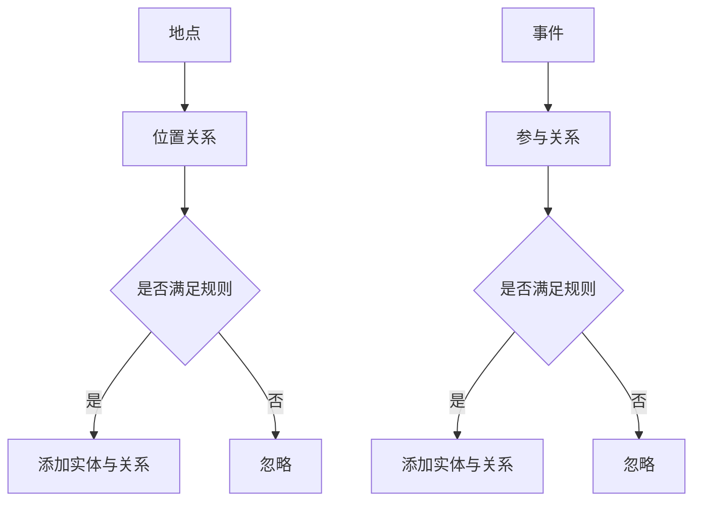
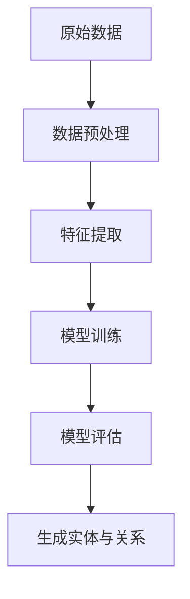
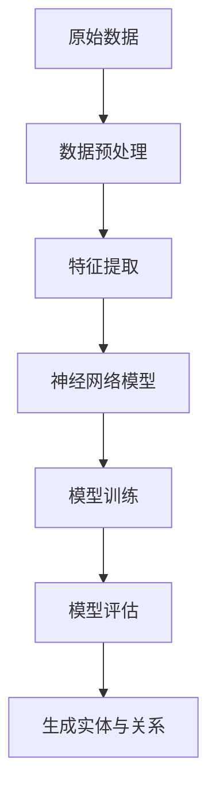
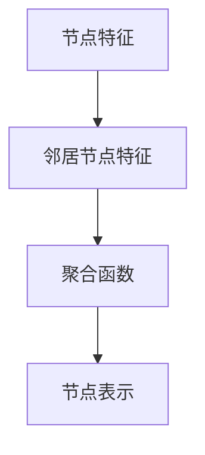
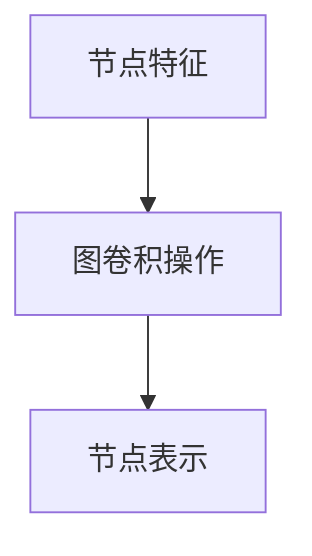
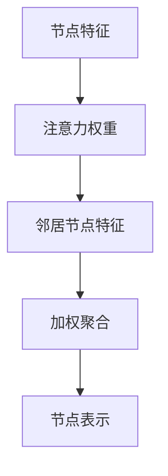
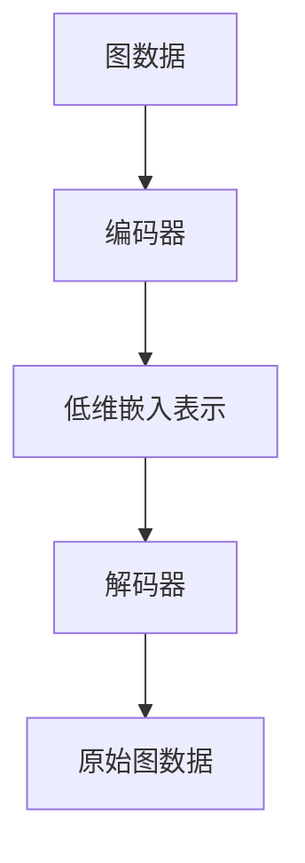
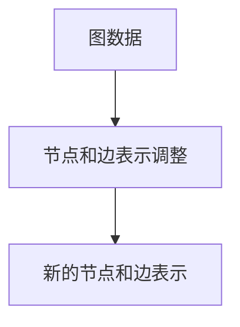
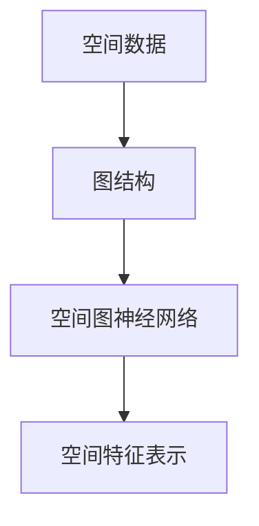

                 

# 时空知识图谱推理中图神经网络的前沿技术

## 关键词
- 时空知识图谱
- 图神经网络
- 时空事件检测
- 时空轨迹分析
- 时空预测
- 跨域知识融合
- 动态更新与演化
- 迁移学习

## 摘要
本文围绕时空知识图谱推理中的图神经网络前沿技术展开，系统性地介绍了时空知识图谱的概念、构建方法、质量评估以及图神经网络的基本原理和应用场景。随后，文章深入探讨了图神经网络在时空知识图谱推理中的应用，包括时空事件检测、时空轨迹分析和时空预测等。此外，文章还详细介绍了时空知识图谱推理中的挑战与优化方法，以及新型图神经网络架构和动态更新与演化、迁移学习等前沿技术。通过本文，读者将全面了解时空知识图谱推理中的图神经网络技术及其在实际应用中的价值。

## 第1章 引言

### 1.1 时空知识图谱的概念与重要性

#### 1.1.1 时空知识图谱的定义

时空知识图谱（Spatial and Temporal Knowledge Graph）是一种将时间和空间信息整合到知识图谱中的结构化数据表示。它通过实体、属性和关系的结构化链接，构建一个多维度的信息网络。这些实体可以是地理位置、事件、人、组织等，而属性则描述了实体的特征和状态，关系则表示了实体之间的关联和相互作用。

#### 1.1.2 时空知识图谱的应用场景

时空知识图谱在多个领域有着广泛的应用，如：

- **智能交通系统**：通过分析时空知识图谱，可以优化交通路线、预测交通流量、检测交通事故等。
- **地理信息系统**：时空知识图谱可以用于地理信息数据的可视化和分析，支持城市规划、环境监测等。
- **社会网络分析**：通过分析社交网络中的时空信息，可以揭示社交群体的动态变化、传播趋势等。
- **医疗健康**：利用时空知识图谱，可以辅助诊断疾病、分析流行病传播路径、优化医疗资源配置等。

#### 1.1.3 时空知识图谱的发展历程

时空知识图谱的发展可以追溯到知识图谱的早期研究。随着物联网、大数据和人工智能技术的迅猛发展，时空知识图谱得到了广泛关注和应用。从简单的地理信息数据整合到复杂的时空信息融合，时空知识图谱经历了从二维到三维，再到四维（加入时间维度）的演变过程。

### 1.2 图神经网络的基本原理

#### 1.2.1 图神经网络的概念

图神经网络（Graph Neural Network，GNN）是一种专门用于处理图结构数据的神经网络。与传统的卷积神经网络（CNN）和循环神经网络（RNN）不同，GNN可以自适应地处理图中的节点和边信息。

#### 1.2.2 图神经网络的核心思想

图神经网络的核心思想是通过节点和边之间的相互作用，来学习节点表示。具体来说，GNN通过以下步骤进行训练和推理：

1. **节点表示学习**：通过聚合相邻节点的特征，为每个节点生成一个低维表示。
2. **边表示学习**：边也可以通过节点表示来学习，从而表示节点之间的关系。
3. **图卷积操作**：图神经网络通过图卷积操作来实现节点和边的特征聚合。

#### 1.2.3 图神经网络的发展历程

图神经网络的研究始于2013年，由Scarselli等人提出。此后，GNN的研究和应用得到了广泛关注，出现了多种变种，如GraphSAGE、GCN和GAT等。随着深度学习技术的发展，图神经网络也在不断演进，应用于更多复杂数据处理任务。

### 1.3 时空知识图谱与图神经网络的关系

#### 1.3.1 时空知识图谱中的图结构

时空知识图谱本质上是一个图结构，由节点（实体）、边（关系）和属性构成。图结构使得时空知识图谱能够高效地表示和存储复杂的信息网络。

#### 1.3.2 图神经网络在时空知识图谱推理中的应用

图神经网络在时空知识图谱推理中具有重要作用，可以用于：

- **节点分类**：通过图神经网络为每个节点生成表示，用于分类任务。
- **链接预测**：预测未知节点之间的关系，用于知识图谱补全。
- **关系抽取**：从文本中提取实体关系，用于知识图谱构建。
- **时空事件检测**：识别时空知识图谱中的关键事件。
- **时空轨迹分析**：分析实体的时空行为模式。

#### 1.3.3 时空知识图谱与图神经网络的优势与挑战

时空知识图谱与图神经网络相结合具有以下优势：

- **高效的信息表示**：图神经网络可以高效地处理图结构数据，提取节点和边的重要信息。
- **丰富的交互作用**：图神经网络通过节点和边之间的相互作用，可以更好地捕捉实体之间的关系。

然而，时空知识图谱推理中也存在一些挑战，如：

- **数据质量与一致性**：时空数据来源多样，可能存在质量问题和一致性挑战。
- **计算复杂度**：图神经网络处理大规模图结构数据时，计算复杂度较高。
- **实时性要求**：在某些应用场景下，如智能交通系统，需要实时更新和推理。

### 1.4 本书内容概述

#### 1.4.1 书的结构安排

本书分为六个章节，结构如下：

1. 引言：介绍时空知识图谱和图神经网络的基本概念及其关系。
2. 时空知识图谱的构建：探讨时空数据的获取、处理、存储和索引，以及知识图谱的构建方法。
3. 图神经网络基础：详细讲解图神经网络的基本原理、变种和数学模型。
4. 时空知识图谱推理中的图神经网络应用：介绍图神经网络在时空知识图谱推理中的具体应用，包括时空事件检测、时空轨迹分析和时空预测。
5. 时空知识图谱推理中的挑战与优化：讨论时空知识图谱推理中的挑战和优化方法。
6. 时空知识图谱推理的前沿技术：探讨时空知识图谱推理中的新型图神经网络架构、动态更新与演化、迁移学习等前沿技术。

#### 1.4.2 阅读建议与目标读者

本书的目标读者是具备一定计算机科学和人工智能基础的专业人士。为了更好地理解本书内容，建议读者具备以下知识：

- **计算机科学**：熟悉数据结构和算法，具备编程能力。
- **人工智能**：了解机器学习和深度学习的基本概念和方法。
- **图论**：掌握图的基本概念和算法。

通过阅读本书，读者将能够深入理解时空知识图谱和图神经网络，掌握其基本原理和应用方法，并在实际项目中运用这些技术。

## 第2章 时空知识图谱的构建

### 2.1 时空数据的获取与处理

#### 2.1.1 时空数据的来源

时空数据可以从多个来源获取，包括：

- **传感器数据**：如GPS数据、移动通信数据、环境监测数据等。
- **社交媒体数据**：如地理位置信息、时间戳数据等。
- **政府机构数据**：如交通流量数据、气象数据等。
- **卫星遥感数据**：如地球观测数据、气候变化数据等。

#### 2.1.2 时空数据的预处理

时空数据预处理是构建时空知识图谱的重要步骤，主要包括以下内容：

- **数据清洗**：去除数据中的噪声和错误，如缺失值、异常值等。
- **数据转换**：将不同格式和单位的数据转换为统一格式和单位，以便于后续处理。
- **数据规范化**：将数据按照一定的标准进行规范化，如时间戳规范化、地理位置规范化等。

#### 2.1.3 时空数据的存储与索引

时空数据的存储和索引对于时空知识图谱的构建和应用至关重要。常用的存储和索引技术包括：

- **关系数据库**：如PostgreSQL、MySQL等，适合存储结构化数据。
- **图数据库**：如Neo4j、JanusGraph等，适合存储和查询图结构数据。
- **分布式文件系统**：如HDFS、Cassandra等，适合存储大规模非结构化数据。
- **索引技术**：如R-tree、K-d树等，用于高效地查询和访问时空数据。

### 2.2 时空知识图谱的构建方法

#### 2.2.1 基于规则的方法

基于规则的方法是构建时空知识图谱的传统方法，主要通过定义一系列规则来生成实体和关系。这种方法的优势在于规则明确、易于理解和实现。但缺点是规则难以覆盖所有可能的情境，可能导致知识图谱的完整性受限。

- **核心概念与联系**：实体（如地点、事件、人）→ 关系（如位置、参与、发生）→ 规则（如时间约束、空间约束）。



#### 2.2.2 基于机器学习的方法

基于机器学习的方法通过训练模型来自动生成实体和关系。这种方法的优势在于能够自动学习数据中的模式，提高知识图谱的覆盖率和准确性。常用的机器学习算法包括监督学习、无监督学习和迁移学习等。

- **核心概念与联系**：数据（如传感器数据、社交媒体数据）→ 模型（如分类器、聚类器）→ 实体与关系（如节点、边）。



#### 2.2.3 基于深度学习的方法

基于深度学习的方法利用神经网络模型来自动生成实体和关系。这种方法的优势在于能够学习复杂的数据模式和特征，提高知识图谱的智能化程度。常用的深度学习模型包括卷积神经网络（CNN）、循环神经网络（RNN）和图神经网络（GNN）等。

- **核心概念与联系**：数据（如图像、文本、图结构）→ 神经网络（如CNN、RNN、GNN）→ 实体与关系（如节点、边）。



### 2.3 时空知识图谱的实体关系建模

#### 2.3.1 实体的表示

在时空知识图谱中，实体的表示至关重要。常用的实体表示方法包括：

- **基于特征的表示**：将实体的属性转换为特征向量，如Word2Vec、BERT等。
- **基于嵌入的表示**：使用预训练的词向量或图嵌入模型，如Word2Vec、GloVe等。
- **基于图谱的表示**：利用图神经网络为每个实体生成图嵌入，如GCN、GAT等。

#### 2.3.2 关系的表示

关系的表示同样是时空知识图谱的重要部分。常用的关系表示方法包括：

- **基于路径的表示**：将关系表示为路径上的特征聚合，如Path2Vec、TransE等。
- **基于嵌入的表示**：使用预训练的词向量或图嵌入模型，如Word2Vec、GloVe等。
- **基于图谱的表示**：利用图神经网络为每条关系生成图嵌入，如GraphSAGE、GAT等。

#### 2.3.3 实体关系的推理

实体关系的推理是时空知识图谱的核心任务之一，旨在自动生成新的实体关系。常用的推理方法包括：

- **规则推理**：使用定义好的规则进行推理，如RDF规则推理、OWL规则推理等。
- **基于概率的推理**：使用概率模型进行推理，如Markov网络、贝叶斯网络等。
- **基于神经网络的推理**：使用图神经网络进行推理，如GraphSAGE、GCN等。

### 2.4 时空知识图谱的质量评估

#### 2.4.1 实体质量的评估

实体质量评估旨在评估时空知识图谱中实体的准确性、完整性和一致性。常用的评估指标包括：

- **准确性**：评估实体属性的准确性，如实体分类的准确率、属性值的准确率等。
- **完整性**：评估实体数量的完整性和属性信息的完整性，如实体缺失率、属性缺失率等。
- **一致性**：评估实体属性的一致性和关系的一致性，如属性冲突率、关系冲突率等。

#### 2.4.2 关系质量的评估

关系质量评估旨在评估时空知识图谱中关系的准确性、可靠性和相关性。常用的评估指标包括：

- **准确性**：评估关系描述的准确性，如关系分类的准确率、关系置信度等。
- **可靠性**：评估关系来源的可靠性，如关系证据的多样性、关系来源的权威性等。
- **相关性**：评估关系之间的相关性，如关系冗余度、关系关联度等。

#### 2.4.3 时空知识图谱的整体质量评估

整体质量评估旨在综合评估时空知识图谱的各个方面，如实体质量、关系质量、知识覆盖率等。常用的评估指标包括：

- **知识覆盖率**：评估知识图谱覆盖现实世界的知识比例，如实体覆盖率、关系覆盖率等。
- **知识一致性**：评估知识图谱中实体和关系的一致性，如实体冲突率、关系冲突率等。
- **知识扩展性**：评估知识图谱扩展新知识和新关系的难易程度，如实体扩展率、关系扩展率等。

## 第3章 图神经网络基础

### 3.1 图神经网络的基本原理

#### 3.1.1 图神经网络的基本结构

图神经网络（Graph Neural Network，GNN）是一种用于处理图结构数据的神经网络。GNN的基本结构包括以下几个部分：

1. **节点输入层**：每个节点输入其自身特征和相邻节点的特征。
2. **图卷积层**：通过图卷积操作对节点特征进行聚合，生成新的节点表示。
3. **节点输出层**：对节点特征进行进一步处理，生成节点的最终表示。
4. **边输入层**：每个边输入其两个端点节点的特征。
5. **图卷积层**：通过图卷积操作对边特征进行聚合，生成新的边表示。
6. **边输出层**：对边特征进行进一步处理，生成边的最终表示。
7. **全连接层**：对节点和边表示进行整合，输出最终的预测结果。

#### 3.1.2 图神经网络的训练过程

图神经网络的训练过程主要包括以下几个步骤：

1. **数据预处理**：对图数据进行预处理，包括节点特征提取、边特征提取、图划分等。
2. **初始化参数**：初始化图神经网络中的参数，如权重、偏置等。
3. **正向传播**：输入节点和边特征，通过图卷积层和全连接层，计算节点和边的表示。
4. **损失函数计算**：根据训练任务，计算损失函数，如分类交叉熵损失、回归均方误差损失等。
5. **反向传播**：根据损失函数，计算梯度，更新网络参数。
6. **迭代优化**：重复正向传播和反向传播，直到网络参数收敛。

#### 3.1.3 图神经网络的优化算法

图神经网络的优化算法主要用于更新网络参数，常用的优化算法包括：

1. **随机梯度下降（SGD）**：每次迭代计算全部样本的梯度，更新网络参数。
2. **Adam优化器**：结合SGD和动量项，自适应调整学习率。
3. **AdamW优化器**：在Adam优化器的基础上，考虑权重衰减的影响。
4. **Adagrad优化器**：对每个参数的梯度进行累加，自适应调整学习率。

### 3.2 图神经网络的变种

#### 3.2.1 GraphSAGE

GraphSAGE（Graph Sample and Aggregation）是一种基于节点的图神经网络模型，主要用于节点分类和链接预测任务。GraphSAGE的核心思想是聚合邻居节点的特征，为每个节点生成一个低维表示。

- **核心概念与联系**：节点特征 → 邻居节点特征聚合 → 节点表示。



#### 3.2.2 Graph Convolutional Networks (GCN)

Graph Convolutional Networks（GCN）是一种基于节点的图神经网络模型，主要用于节点分类和链接预测任务。GCN的核心思想是通过图卷积操作对节点特征进行聚合，生成新的节点表示。

- **核心概念与联系**：节点特征 → 图卷积操作 → 节点表示。



#### 3.2.3 Graph Attention Networks (GAT)

Graph Attention Networks（GAT）是一种基于节点的图神经网络模型，主要用于节点分类和链接预测任务。GAT的核心思想是通过注意力机制来聚合邻居节点的特征，生成新的节点表示。

- **核心概念与联系**：节点特征 → 注意力权重 → 邻居节点特征加权聚合 → 节点表示。



### 3.3 图神经网络的数学模型

#### 3.3.1 图拉普拉斯矩阵

图拉普拉斯矩阵（Laplacian Matrix）是图神经网络中的一个重要工具，用于描述图的性质。图拉普拉斯矩阵定义为：

$$
L = D - A
$$

其中，$D$ 是节点度矩阵，$A$ 是邻接矩阵。图拉普拉斯矩阵具有以下性质：

- **非负性**：$L$ 的所有元素都大于等于0。
- **零特征值**：$L$ 至少有一个零特征值，对应于图中的平凡解。
- **正定性**：如果图是无向且连通的，则$L$ 是正定的。

#### 3.3.2 图卷积操作

图卷积操作（Graph Convolution）是图神经网络中的一个核心操作，用于聚合节点特征。图卷积操作的数学表达式为：

$$
h^{\prime}_i = \sum_{j \in \mathcal{N}(i)} \alpha_{ij} h_j
$$

其中，$h^{\prime}_i$ 表示节点 $i$ 的卷积结果，$h_j$ 表示节点 $j$ 的特征，$\alpha_{ij}$ 表示节点 $i$ 和节点 $j$ 的权重。

#### 3.3.3 损失函数与优化算法

图神经网络的损失函数和优化算法与传统的神经网络类似，主要包括以下内容：

1. **损失函数**：常用的损失函数包括交叉熵损失、均方误差损失、对数损失等。
2. **优化算法**：常用的优化算法包括随机梯度下降（SGD）、Adam优化器、Adagrad优化器等。
3. **学习率调整**：常用的学习率调整策略包括恒定学习率、自适应学习率、学习率衰减等。

### 3.4 图神经网络的应用场景

#### 3.4.1 社交网络分析

社交网络分析是图神经网络的一个重要应用场景，主要用于分析社交网络中的用户行为、关系和趋势。图神经网络可以用于以下任务：

- **用户推荐**：根据用户的社交关系和兴趣，推荐新的朋友或内容。
- **社交圈识别**：识别社交网络中的社群、兴趣群体等。
- **影响力分析**：分析社交网络中用户的影响力、传播能力等。

#### 3.4.2 语音识别

语音识别是图神经网络在语音处理领域的重要应用，主要用于将语音信号转换为文本。图神经网络可以用于以下任务：

- **声学模型**：建立语音信号和声学特征之间的关系。
- **语言模型**：建立声学特征和文本之间的关系。
- **端到端模型**：直接将语音信号映射为文本，无需中间的声学特征和语言模型。

#### 3.4.3 自然语言处理

自然语言处理是图神经网络在文本处理领域的重要应用，主要用于处理文本中的实体、关系和语义。图神经网络可以用于以下任务：

- **实体识别**：识别文本中的实体，如人名、地点、组织等。
- **关系抽取**：抽取文本中的实体关系，如朋友、同事、合作等。
- **语义分析**：分析文本中的语义和逻辑关系，如推理、解释等。

#### 3.4.4 时空知识图谱推理

时空知识图谱推理是图神经网络在知识图谱领域的重要应用，主要用于推理时空知识图谱中的实体关系和时空模式。图神经网络可以用于以下任务：

- **时空事件检测**：检测时空知识图谱中的关键事件。
- **时空轨迹分析**：分析实体的时空行为模式。
- **时空预测**：预测实体的未来时空行为。

## 第4章 时空知识图谱推理中的图神经网络应用

### 4.1 时空知识图谱推理的基本流程

#### 4.1.1 数据预处理

数据预处理是时空知识图谱推理的第一步，主要包括以下内容：

- **数据清洗**：去除数据中的噪声和错误，如缺失值、异常值等。
- **数据转换**：将不同格式和单位的数据转换为统一格式和单位，以便于后续处理。
- **数据规范化**：将数据按照一定的标准进行规范化，如时间戳规范化、地理位置规范化等。

```python
# 示例：Python代码进行数据清洗、转换和规范化
import pandas as pd
import numpy as np

# 读取数据
data = pd.read_csv('data.csv')

# 数据清洗
data.dropna(inplace=True)
data.replace({'missing': np.nan}, inplace=True)

# 数据转换
data['timestamp'] = pd.to_datetime(data['timestamp'])
data['latitude'] = data['latitude'].astype(float)
data['longitude'] = data['longitude'].astype(float)

# 数据规范化
data['timestamp'] = data['timestamp'].dt.normalize()
data['latitude'] = data['latitude'] * 1.0e7
data['longitude'] = data['longitude'] * 1.0e7
```

#### 4.1.2 实体关系建模

实体关系建模是时空知识图谱推理的核心步骤，主要包括以下内容：

- **实体识别**：通过命名实体识别（NER）技术，从文本中提取出实体。
- **关系抽取**：从实体之间的关联中提取出关系。
- **实体关系表示**：将实体和关系表示为图结构，包括节点、边和属性。

```python
# 示例：Python代码进行实体关系建模
from nltk.tokenize import word_tokenize
from nltk.chunk import ne_chunk
from nltk.tag import pos_tag

# 读取文本
text = "张三于2021年1月1日在北京天安门广场参加了春节联欢晚会。"

# 命名实体识别
tokens = word_tokenize(text)
ne_tree = ne_chunk(tokens)

# 关系抽取
relations = []
for subtree in ne_tree:
    if isinstance(subtree, tuple):
        entity1 = subtree[0]
        entity2 = subtree[1]
        relation = (entity1, entity2)
        relations.append(relation)

# 实体关系表示
nodes = set()
edges = set()

for relation in relations:
    entity1, entity2 = relation
    nodes.add(entity1)
    nodes.add(entity2)
    edges.add((entity1, entity2))

# 输出结果
print("Nodes:", nodes)
print("Edges:", edges)
```

#### 4.1.3 图神经网络训练

图神经网络训练是时空知识图谱推理的关键步骤，主要包括以下内容：

- **模型选择**：选择合适的图神经网络模型，如GCN、GAT等。
- **参数初始化**：初始化模型的参数，如权重、偏置等。
- **数据加载**：将预处理后的数据加载到模型中。
- **模型训练**：通过正向传播和反向传播，训练模型参数。

```python
# 示例：Python代码进行图神经网络训练
import torch
import torch.nn as nn
import torch.optim as optim

# 初始化模型
model = GCNModel()
optimizer = optim.Adam(model.parameters(), lr=0.001)
criterion = nn.CrossEntropyLoss()

# 加载数据
train_loader = torch.utils.data.DataLoader(dataset, batch_size=64, shuffle=True)

# 模型训练
for epoch in range(num_epochs):
    for batch in train_loader:
        model.zero_grad()
        output = model(batch.x, batch.edge_index)
        loss = criterion(output, batch.y)
        loss.backward()
        optimizer.step()
        print(f"Epoch {epoch+1}/{num_epochs}, Loss: {loss.item()}")

# 保存模型
torch.save(model.state_dict(), 'model.pth')
```

#### 4.1.4 推理与预测

推理与预测是时空知识图谱推理的最后一步，主要包括以下内容：

- **模型加载**：加载训练好的模型。
- **特征提取**：提取新数据的特征。
- **推理过程**：通过模型对新数据进行推理，生成预测结果。
- **结果输出**：将预测结果输出，用于后续分析。

```python
# 示例：Python代码进行推理与预测
model = GCNModel()
model.load_state_dict(torch.load('model.pth'))

# 加载新数据
new_data = torch.tensor(new_data_array)

# 特征提取
output = model(new_data)

# 推理与预测
predictions = torch.argmax(output, dim=1)

# 输出结果
print(predictions)
```

### 4.2 基于图神经网络的时空事件检测

#### 4.2.1 时空事件的表示

时空事件检测是时空知识图谱推理中的重要任务，其核心在于从大量时空数据中识别出具有时间属性和空间属性的事件。为了有效地进行时空事件检测，需要对时空事件进行合适的表示。

- **时间表示**：可以使用时间戳来表示事件的时间属性，例如使用Unix时间戳或日期时间格式。
- **空间表示**：可以使用地理坐标（经纬度）来表示事件的空间属性，例如使用GPS数据。

```python
# 示例：Python代码进行时空事件的表示
import pandas as pd

# 读取时空事件数据
data = pd.read_csv('event_data.csv')

# 时间表示
data['timestamp'] = pd.to_datetime(data['timestamp'])

# 空间表示
data['latitude'] = data['latitude'].astype(float)
data['longitude'] = data['longitude'].astype(float)
```

#### 4.2.2 时空事件检测算法

基于图神经网络的时空事件检测算法通常包括以下几个步骤：

1. **数据预处理**：对时空事件数据进行清洗、转换和规范化。
2. **实体关系建模**：将时空事件表示为图结构，包括节点（事件、地点、时间）和边（事件与地点、事件与时间的关系）。
3. **模型训练**：使用图神经网络模型对时空事件图进行训练，学习事件的特征表示。
4. **事件检测**：对新的时空事件进行检测，根据模型预测结果判断是否为关键事件。

```python
# 示例：Python代码进行时空事件检测算法
class EventDetectionModel(nn.Module):
    def __init__(self):
        super(EventDetectionModel, self).__init__()
        self.gnn = GCNModel()
        self.classifier = nn.Linear(in_features, out_features)

    def forward(self, x, edge_index):
        x = self.gnn(x, edge_index)
        x = self.classifier(x)
        return x

# 初始化模型
model = EventDetectionModel()

# 加载训练数据
train_data = ...

# 训练模型
model.train()
...

# 检测新事件
model.eval()
new_data = ...
predictions = model(new_data)
```

#### 4.2.3 时空事件检测的性能评估

时空事件检测的性能评估是衡量算法有效性的重要手段。常用的评估指标包括：

- **准确率（Accuracy）**：正确检测到的事件占总事件的比例。
- **召回率（Recall）**：正确检测到的事件占实际事件的比例。
- **F1分数（F1 Score）**：准确率和召回率的调和平均值。

```python
# 示例：Python代码进行时空事件检测性能评估
from sklearn.metrics import accuracy_score, recall_score, f1_score

# 获取真实标签和预测结果
true_labels = ...
predictions = ...

# 计算评估指标
accuracy = accuracy_score(true_labels, predictions)
recall = recall_score(true_labels, predictions)
f1 = f1_score(true_labels, predictions)

print(f"Accuracy: {accuracy}")
print(f"Recall: {recall}")
print(f"F1 Score: {f1}")
```

### 4.3 基于图神经网络的时空轨迹分析

#### 4.3.1 时空轨迹的表示

时空轨迹分析是时空知识图谱推理中的另一个关键任务，其核心在于从时空数据中分析出实体的运动轨迹和行为模式。为了有效地进行时空轨迹分析，需要对时空轨迹进行合适的表示。

- **时间序列表示**：可以使用时间序列数据来表示实体的运动轨迹，例如使用时间戳序列。
- **空间轨迹表示**：可以使用地理坐标序列来表示实体的空间位置变化。

```python
# 示例：Python代码进行时空轨迹的表示
import pandas as pd

# 读取时空轨迹数据
data = pd.read_csv('trajectory_data.csv')

# 时间序列表示
data['timestamp'] = pd.to_datetime(data['timestamp'])

# 空间轨迹表示
data['latitude'] = data['latitude'].astype(float)
data['longitude'] = data['longitude'].astype(float)
```

#### 4.3.2 时空轨迹分析算法

基于图神经网络的时空轨迹分析算法通常包括以下几个步骤：

1. **数据预处理**：对时空轨迹数据进行清洗、转换和规范化。
2. **轨迹建模**：将时空轨迹表示为图结构，包括节点（轨迹点）和边（轨迹点之间的时空关系）。
3. **模型训练**：使用图神经网络模型对时空轨迹图进行训练，学习轨迹的特征表示。
4. **轨迹分析**：对新的时空轨迹进行分析，根据模型预测结果识别出实体的行为模式和轨迹特征。

```python
# 示例：Python代码进行时空轨迹分析算法
class TrajectoryAnalysisModel(nn.Module):
    def __init__(self):
        super(TrajectoryAnalysisModel, self).__init__()
        self.gnn = GCNModel()
        self.classifier = nn.Linear(in_features, out_features)

    def forward(self, x, edge_index):
        x = self.gnn(x, edge_index)
        x = self.classifier(x)
        return x

# 初始化模型
model = TrajectoryAnalysisModel()

# 加载训练数据
train_data = ...

# 训练模型
model.train()
...

# 轨迹分析
model.eval()
new_trajectory = ...
predictions = model(new_trajectory)
```

#### 4.3.3 时空轨迹分析的性能评估

时空轨迹分析的性能评估是衡量算法有效性的重要手段。常用的评估指标包括：

- **轨迹准确性（Trajectory Accuracy）**：正确分析出的轨迹占总轨迹的比例。
- **轨迹召回率（Trajectory Recall）**：正确分析出的轨迹占实际轨迹的比例。
- **轨迹F1分数（Trajectory F1 Score）**：轨迹准确性和轨迹召回率的调和平均值。

```python
# 示例：Python代码进行时空轨迹分析性能评估
from sklearn.metrics import accuracy_score, recall_score, f1_score

# 获取真实轨迹和预测结果
true_trajectories = ...
predictions = ...

# 计算评估指标
trajectory_accuracy = accuracy_score(true_trajectories, predictions)
trajectory_recall = recall_score(true_trajectories, predictions)
trajectory_f1 = f1_score(true_trajectories, predictions)

print(f"Trajectory Accuracy: {trajectory_accuracy}")
print(f"Trajectory Recall: {trajectory_recall}")
print(f"Trajectory F1 Score: {trajectory_f1}")
```

### 4.4 基于图神经网络的时空预测

#### 4.4.1 时空预测的基本方法

时空预测是时空知识图谱推理中的重要任务，其核心在于根据历史时空数据预测实体的未来行为。基于图神经网络的时空预测通常包括以下几个步骤：

1. **数据预处理**：对时空数据进行清洗、转换和规范化。
2. **特征提取**：从时空数据中提取与预测任务相关的特征，如时间特征、空间特征、历史行为特征等。
3. **模型训练**：使用图神经网络模型对时空特征进行训练，学习时空数据的特征表示。
4. **预测**：根据训练好的模型预测实体未来的时空行为。

```python
# 示例：Python代码进行时空预测的基本方法
class TemporalPredictionModel(nn.Module):
    def __init__(self):
        super(TemporalPredictionModel, self).__init__()
        self.gnn = GCNModel()
        self.predictor = nn.Linear(in_features, out_features)

    def forward(self, x, edge_index):
        x = self.gnn(x, edge_index)
        x = self.predictor(x)
        return x

# 初始化模型
model = TemporalPredictionModel()

# 加载训练数据
train_data = ...

# 训练模型
model.train()
...

# 预测
model.eval()
new_data = ...
predictions = model(new_data)
```

#### 4.4.2 时空预测的性能评估

时空预测的性能评估是衡量算法有效性的重要手段。常用的评估指标包括：

- **平均绝对误差（Mean Absolute Error，MAE）**：预测值与真实值之间的平均绝对误差。
- **均方根误差（Root Mean Square Error，RMSE）**：预测值与真实值之间的均方根误差。
- **平均绝对百分比误差（Mean Absolute Percentage Error，MAPE）**：预测值与真实值之间的平均绝对百分比误差。

```python
# 示例：Python代码进行时空预测性能评估
from sklearn.metrics import mean_absolute_error, mean_squared_error

# 获取真实值和预测结果
true_values = ...
predictions = ...

# 计算评估指标
mae = mean_absolute_error(true_values, predictions)
rmse = mean_squared_error(true_values, predictions, squared=False)
mape = mean_absolute_error(true_values, predictions) / np.mean(true_values)

print(f"MAE: {mae}")
print(f"RMSE: {rmse}")
print(f"MAPE: {mape}")
```

## 第5章 时空知识图谱推理中的挑战与优化

### 5.1 时空数据处理的挑战

#### 5.1.1 数据质量与一致性

在时空知识图谱推理中，数据质量直接影响推理结果。以下是一些数据质量问题及其解决方法：

- **数据噪声**：时空数据可能包含噪声，如GPS数据中的误差、传感器数据的异常值等。解决方法包括数据清洗、异常值检测和修正等。
- **数据缺失**：时空数据可能存在缺失值，导致知识图谱不完整。解决方法包括数据填充、缺失值估计和推理等。
- **数据不一致**：不同来源的时空数据可能存在格式、单位和语义上的不一致。解决方法包括数据转换、规范化和对齐等。

#### 5.1.2 数据缺失与噪声

数据缺失和噪声是时空数据处理中的常见问题，严重影响知识图谱的构建和推理效果。以下是一些解决方法：

- **数据填充**：使用插值、平均或其他方法填充缺失值。
- **异常值检测**：使用统计学方法、机器学习方法等检测并修正异常值。
- **噪声抑制**：使用滤波、平滑等技术抑制噪声。

#### 5.1.3 数据异构性问题

时空数据通常具有异构性，包括不同类型、来源和格式的数据。以下是一些解决方法：

- **数据集成**：使用数据转换、融合等技术将异构数据集成到统一格式。
- **数据对齐**：使用时空对齐方法将不同来源的数据对齐到同一时空框架。
- **模型自适应**：设计能够处理异构数据的模型，如多模态图神经网络。

### 5.2 图神经网络优化方法

#### 5.2.1 存储优化

在处理大规模时空知识图谱时，存储优化是一个关键问题。以下是一些存储优化方法：

- **数据压缩**：使用数据压缩算法减少存储空间，如HDF5、SPIFF等。
- **索引优化**：使用高效的索引结构提高数据查询速度，如B树、R树等。
- **分布式存储**：使用分布式存储系统，如HDFS、Cassandra等，提高数据存储和访问性能。

#### 5.2.2 计算优化

计算优化是提高图神经网络性能的关键。以下是一些计算优化方法：

- **并行计算**：使用并行计算技术，如GPU加速、多线程等，提高计算速度。
- **图分解**：将大规模图分解为子图，分别处理，然后合并结果。
- **稀疏存储**：使用稀疏存储技术，减少内存占用，提高计算效率。

#### 5.2.3 模型优化

模型优化是提高图神经网络性能的重要手段。以下是一些模型优化方法：

- **模型剪枝**：通过剪枝冗余参数，减少模型大小和计算复杂度。
- **量化**：使用量化技术降低模型参数的精度，减少存储和计算需求。
- **迁移学习**：利用预训练模型进行迁移学习，减少模型训练时间和资源需求。

### 5.3 跨域知识融合方法

#### 5.3.1 跨领域知识图谱构建

跨领域知识图谱构建是将不同领域的数据融合到一个知识图谱中。以下是一些构建方法：

- **知识映射**：将不同领域的实体和关系映射到统一的概念框架中。
- **知识融合**：将不同领域的知识进行融合，形成统一的实体和关系。
- **异构数据融合**：处理不同类型、格式和来源的数据，形成统一的知识图谱。

#### 5.3.2 跨域知识推理算法

跨域知识推理是将不同领域的知识进行推理，以发现新的知识。以下是一些推理算法：

- **规则推理**：使用定义好的规则进行跨领域推理。
- **概率推理**：使用概率模型进行跨领域推理。
- **图神经网络推理**：使用图神经网络进行跨领域推理。

#### 5.3.3 跨域知识融合的性能评估

跨域知识融合的性能评估是衡量融合效果的重要手段。以下是一些评估指标：

- **知识一致性**：评估融合后知识的一致性和连贯性。
- **知识覆盖度**：评估融合后知识覆盖不同领域的程度。
- **知识准确性**：评估融合后知识的准确性和可靠性。

## 第6章 时空知识图谱推理的前沿技术

### 6.1 新型图神经网络架构

#### 6.1.1 图自编码器

图自编码器（Graph Autoencoder）是一种基于图神经网络的深度学习模型，用于学习图数据的编码表示。图自编码器的基本架构包括编码器和解码器两部分，其中编码器负责将图数据压缩为一个低维嵌入表示，解码器则负责将低维嵌入表示还原为原始图数据。

- **核心概念与联系**：图数据 → 编码器 → 低维嵌入表示 → 解码器 → 原始图数据。



#### 6.1.2 自适应图神经网络

自适应图神经网络（Adaptive Graph Neural Network）是一种能够动态调整节点和边表示的图神经网络模型。自适应图神经网络通过学习节点和边之间的权重，自适应地调整模型对图数据的处理方式，从而提高模型的适应性和表现。

- **核心概念与联系**：图数据 → 节点和边表示调整 → 新的节点和边表示。



#### 6.1.3 空间图神经网络

空间图神经网络（Spatial Graph Neural Network）是一种专门用于处理空间数据的图神经网络模型。空间图神经网络通过将空间信息嵌入到图结构中，能够更好地处理和分析空间数据。

- **核心概念与联系**：空间数据 → 图结构 → 空间图神经网络处理 → 空间特征表示。



### 6.2 时空知识图谱的动态更新与演化

#### 6.2.1 实时更新策略

实时更新策略是保持时空知识图谱时效性和准确性的关键。实时更新策略主要包括以下几个方面：

- **数据流处理**：使用流处理框架，如Apache Flink、Apache Storm等，实时处理和分析时空数据。
- **增量更新**：仅更新发生变化的数据，减少计算和存储开销。
- **版本控制**：为每个版本的知识图谱创建副本，以便回溯和恢复。

#### 6.2.2 演化分析算法

演化分析算法是分析时空知识图谱演化规律的重要方法。演化分析算法主要包括以下几个方面：

- **时序分析**：分析实体和关系随时间的变化趋势。
- **模式识别**：识别时空知识图谱中的周期性、趋势性和突变性模式。
- **关联分析**：分析实体和关系之间的演化关系和关联性。

#### 6.2.3 动态图谱推理方法

动态图谱推理方法是在时空知识图谱动态更新和演化过程中进行推理的方法。动态图谱推理方法主要包括以下几个方面：

- **实时推理**：在数据流处理过程中实时进行推理，支持动态更新和实时响应。
- **历史推理**：根据历史数据进行分析和推理，提供历史视角和趋势预测。
- **动态融合**：将实时数据和历史数据融合，提高推理的准确性和全面性。

### 6.3 时空知识图谱的迁移学习

#### 6.3.1 迁移学习的基本概念

迁移学习（Transfer Learning）是一种利用已训练模型的知识和经验，在新任务上提高模型性能的方法。在时空知识图谱推理中，迁移学习可以通过以下几种方式实现：

- **模型迁移**：将已训练的模型直接应用于新任务，如将预训练的图神经网络模型应用于不同的时空知识图谱推理任务。
- **特征迁移**：将已训练模型的特征表示迁移到新任务，如将预训练的词向量或图嵌入应用于新的时空实体和关系表示。
- **元学习**：通过元学习（Meta-Learning）训练通用模型，提高模型对新任务的适应性和泛化能力。

#### 6.3.2 迁移学习在时空知识图谱推理中的应用

迁移学习在时空知识图谱推理中的应用主要包括以下几个方面：

- **跨领域迁移**：将一个领域已训练的知识图谱模型应用于其他领域，提高新领域的推理性能。
- **跨时间迁移**：利用历史数据训练的知识图谱模型，预测未来时空数据，提高预测的准确性和可靠性。
- **跨任务迁移**：将不同类型的时空知识图谱推理任务进行迁移学习，提高模型的适应性和泛化能力。

#### 6.3.3 迁移学习性能评估

迁移学习性能评估是衡量迁移学习效果的重要手段。以下是一些评估指标：

- **迁移学习效率**：评估迁移学习模型在减少训练时间和资源消耗的同时，是否提高推理性能。
- **泛化能力**：评估迁移学习模型在新任务上的适应性和泛化能力。
- **推理准确性**：评估迁移学习模型在新任务上的推理准确性和可靠性。

### 6.4 时空知识图谱的语义理解

#### 6.4.1 语义嵌入

语义嵌入（Semantic Embedding）是将语义信息转换为向量表示的方法，用于处理自然语言处理、知识图谱推理等任务。在时空知识图谱中，语义嵌入可以用于以下方面：

- **实体语义表示**：将时空实体（如地点、事件、人等）的语义信息转换为向量表示。
- **关系语义表示**：将时空关系（如位置、参与、发生等）的语义信息转换为向量表示。
- **语义相似性计算**：计算实体和关系之间的语义相似性，用于知识图谱补全和推理。

#### 6.4.2 语义关联分析

语义关联分析（Semantic Association Analysis）是分析时空知识图谱中实体和关系之间语义关联的方法。语义关联分析可以用于以下方面：

- **实体关联分析**：分析时空实体之间的语义关联，识别潜在的语义关系。
- **关系关联分析**：分析时空关系之间的语义关联，揭示时空数据中的复杂模式和趋势。
- **语义网络构建**：构建时空知识图谱的语义网络，支持语义搜索和推理。

#### 6.4.3 语义推理

语义推理（Semantic Reasoning）是基于语义嵌入和语义关联分析，从知识图谱中提取新知识的方法。语义推理可以用于以下方面：

- **知识图谱补全**：根据语义关联，推断未知实体和关系，补充知识图谱中的缺失信息。
- **语义搜索**：基于用户输入的语义查询，从知识图谱中检索相关实体和关系。
- **语义解释**：对知识图谱中的实体和关系进行语义解释，提供更直观的理解。

## 结语

随着人工智能技术的快速发展，时空知识图谱推理成为知识图谱领域的重要研究方向。本文系统地介绍了时空知识图谱的概念、构建方法、质量评估以及图神经网络的基本原理和应用场景。通过详细探讨图神经网络在时空知识图谱推理中的应用，如时空事件检测、时空轨迹分析和时空预测，本文展示了图神经网络在时空知识图谱推理中的重要作用。

未来，随着新型图神经网络架构、动态更新与演化、迁移学习等前沿技术的不断发展，时空知识图谱推理将迎来更多的挑战和机遇。通过结合多种技术手段，构建高效、准确和动态的时空知识图谱，将有助于推动人工智能在交通、医疗、安全等领域的应用，为人类带来更多的便利和创新。

### 作者信息

作者：AI天才研究院/AI Genius Institute & 禅与计算机程序设计艺术 /Zen And The Art of Computer Programming

