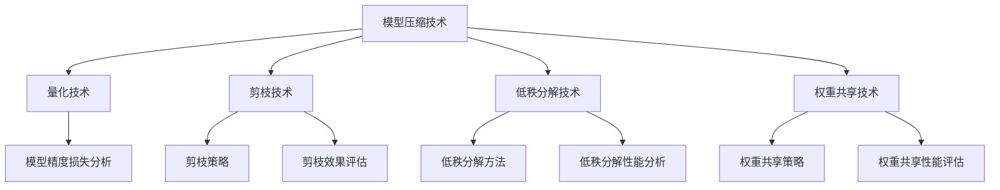

                 

## 引言

随着人工智能技术的迅猛发展，深度学习模型在各个领域的应用越来越广泛。然而，这些模型往往需要大量的计算资源和存储空间，这给实时推理任务带来了巨大的挑战。为了满足实时性的需求，模型压缩技术应运而生，成为提升模型性能的关键手段之一。本文旨在探讨模型压缩技术在实时推理任务中的创新应用，帮助读者深入了解这一前沿技术，并掌握其在实际场景中的应用方法。

模型压缩技术主要涉及量化、剪枝、低秩分解和权重共享等方法，通过这些技术，我们可以显著减小模型的体积和计算复杂度，从而提高实时推理的效率。本文将按照以下结构展开：

1. **模型压缩技术基础**：首先介绍模型压缩技术的核心概念，包括量化、剪枝、低秩分解和权重共享等，并使用Mermaid流程图展示这些概念之间的联系。
2. **模型压缩技术在实时推理任务中的应用**：分析模型压缩技术在图像处理、语音识别和自然语言处理等领域的具体应用，并提供实际案例研究。
3. **模型压缩技术在实时推理任务中的实践**：详细探讨模型压缩技术在实时推理任务中的实现方法、优化策略和性能评估。

通过本文的阅读，读者将能够全面了解模型压缩技术的基本原理和应用方法，掌握如何在实际项目中高效地应用这些技术，从而实现实时推理任务的高性能和高效性。

## 第一部分：模型压缩技术基础

模型压缩技术是人工智能领域中的一项关键技术，旨在减小深度学习模型的体积和计算复杂度，以满足实时推理任务的需求。本部分将深入探讨模型压缩技术的核心概念，包括量化、剪枝、低秩分解和权重共享等，并通过Mermaid流程图展示这些概念之间的联系，帮助读者建立完整的知识体系。

### 第1章：模型压缩技术概述

模型压缩技术主要包括以下几种方法：

1. **量化技术**：通过降低模型的浮点精度，将高精度的浮点数替换为低精度的整数表示，从而减小模型的大小和计算量。
2. **剪枝技术**：通过去除模型中不重要的神经元或权重，减少模型参数的数量，从而减小模型的大小和计算复杂度。
3. **低秩分解技术**：通过将高秩矩阵分解为低秩矩阵，降低模型的复杂度，从而提高模型的计算效率。
4. **权重共享技术**：通过在不同层或不同神经元之间共享权重，减少模型参数的数量，从而减小模型的大小和计算复杂度。

这些技术之间有着紧密的联系。例如，量化技术可以与剪枝技术结合使用，通过量化降低浮点数的精度，然后再进行剪枝，从而进一步减小模型的体积。低秩分解和权重共享技术也可以在量化后使用，以进一步优化模型的计算性能。

#### 核心概念与联系

为了更好地理解这些概念，我们使用Mermaid流程图展示它们之间的关系：



#### 模型压缩技术在实时推理任务中的应用

在实时推理任务中，模型的体积和计算复杂度往往是一个重要的限制因素。通过模型压缩技术，我们可以显著减小模型的体积和计算复杂度，从而提高实时推理的效率。

1. **实时推理任务的需求**：实时推理任务通常要求模型能够在短时间内完成推理，且对延迟和功耗有较高的要求。因此，减小模型的体积和计算复杂度是提高实时推理性能的关键。
2. **模型压缩技术的作用**：模型压缩技术可以通过多种方式提高实时推理性能：
   - **量化技术**：通过量化降低模型的浮点精度，可以显著减小模型的体积和计算复杂度，从而提高实时推理速度。
   - **剪枝技术**：通过剪枝去除模型中不重要的神经元或权重，可以进一步减小模型的体积和计算复杂度，从而提高实时推理性能。
   - **低秩分解技术**：通过将高秩矩阵分解为低秩矩阵，可以降低模型的复杂度，从而提高实时推理速度。
   - **权重共享技术**：通过在不同层或不同神经元之间共享权重，可以减少模型参数的数量，从而减小模型的体积和计算复杂度，从而提高实时推理性能。

### 总结

模型压缩技术是实时推理任务中不可或缺的关键技术。通过量化、剪枝、低秩分解和权重共享等多种技术手段，我们可以显著减小深度学习模型的体积和计算复杂度，从而提高实时推理的效率和性能。在下一章中，我们将深入探讨量化技术的原理和应用，帮助读者更好地理解模型压缩技术的基础。

### 第2章：量化技术原理与应用

量化技术是模型压缩技术中的一种重要手段，通过降低模型的浮点精度，将高精度的浮点数替换为低精度的整数表示，从而减小模型的体积和计算复杂度。本章将详细介绍量化技术的原理、过程、方法和其在实时推理任务中的应用。

#### 量化技术原理

量化技术的核心思想是将模型中的浮点数替换为整数，从而降低模型的精度。具体来说，量化技术包括以下几个步骤：

1. **量化层**：在模型的每一层引入量化操作，将输入的浮点数映射到量化的整数范围内。
2. **量化范围**：定义量化的范围，即量化的最小值和最大值。
3. **量化精度**：定义量化的精度，即每个整数表示的浮点数的范围。

量化层、量化范围和量化精度是量化技术的三个关键参数。通过合理选择这三个参数，可以在保持模型精度的同时，最大限度地减小模型的大小和计算复杂度。

#### 量化过程

量化过程可以分为以下几步：

1. **数据预处理**：对模型的输入数据进行标准化处理，使其具有较小的范围。
2. **量化计算**：对每一层的权重和激活值进行量化计算，将其映射到量化的整数范围内。
3. **量化存储**：将量化后的权重和激活值存储在模型中，以减小模型的体积。

#### 量化方法

量化技术主要包括以下几种方法：

1. **二值量化**：将每个浮点数替换为一个二进制数，即0或1。二值量化可以显著减小模型的大小和计算复杂度，但可能会导致精度损失。
2. **整数量化**：将每个浮点数替换为一个整数，整数量化的精度高于二值量化，但计算复杂度也较高。
3. **浮点量化**：将每个浮点数替换为一个较低精度的浮点数，浮点量化的计算复杂度较低，但精度损失较大。

#### 量化技术在实时推理中的应用

量化技术可以在实时推理任务中发挥重要作用，其主要应用场景如下：

1. **量化优化的必要性**：实时推理任务通常对模型的体积和计算复杂度有较高的要求。通过量化技术，可以减小模型的体积和计算复杂度，从而提高实时推理的性能。
2. **量化优化方法**：量化优化方法主要包括以下几种：
   - **量化精度优化**：通过调整量化精度，平衡模型精度和体积之间的关系。
   - **量化范围优化**：通过调整量化范围，减小模型的大小和计算复杂度。
   - **量化策略优化**：结合不同的量化方法，选择最适合当前任务的量化策略。

#### Python源代码示例

为了更好地理解量化技术，以下是一个简单的Python示例：

```python
import torch
import torch.nn as nn
import torch.nn.functional as F

# 创建一个简单的神经网络
class SimpleCNN(nn.Module):
    def __init__(self):
        super(SimpleCNN, self).__init__()
        self.conv1 = nn.Conv2d(1, 10, kernel_size=5)
        self.fc1 = nn.Linear(10 * 4 * 4, 100)
        self.fc2 = nn.Linear(100, 10)

    def forward(self, x):
        x = F.relu(F.max_pool2d(self.conv1(x), 2))
        x = x.view(-1, 10 * 4 * 4)
        x = F.relu(self.fc1(x))
        x = self.fc2(x)
        return F.log_softmax(x, dim=1)

# 实例化网络模型
model = SimpleCNN()

# 对网络进行量化
model = torch.quantization.quantize_dynamic(
    model, {nn.Linear, nn.Conv2d}, dtype=torch.qint8
)

# 测试量化后的网络
input_tensor = torch.randn(1, 1, 28, 28)
output = model(input_tensor)
print(output)
```

在这个示例中，我们创建了一个简单的卷积神经网络，并使用`torch.quantization.quantize_dynamic`函数对其进行量化。量化后的模型可以显著减小体积和计算复杂度，从而提高实时推理的性能。

### 数学公式

在量化技术中，常用的数学公式如下：

$$
量化值 = \text{round}(x \times \text{量化精度}) \times \text{量化范围}
$$

其中，`x`为原始浮点值，`量化精度`为量化操作中每个整数表示的浮点数范围，`量化范围`为量化的最小值和最大值之间的距离。

#### 量化精度优化策略

为了优化量化精度，可以采用以下策略：

1. **动态量化**：根据模型的精度要求，动态调整量化精度，从而在模型精度和体积之间取得平衡。
2. **量化范围优化**：通过调整量化范围，减小模型的大小和计算复杂度。
3. **量化策略优化**：结合不同的量化方法，选择最适合当前任务的量化策略。

### 总结

量化技术是模型压缩技术中的一种重要手段，通过降低模型的浮点精度，将高精度的浮点数替换为低精度的整数表示，从而减小模型的体积和计算复杂度。本章详细介绍了量化技术的原理、过程、方法和在实时推理任务中的应用，并通过Python源代码示例展示了量化技术的实现方法。在下一章中，我们将继续探讨剪枝技术的原理和应用。

### 第3章：剪枝技术原理与应用

剪枝技术是模型压缩技术中的一种重要手段，通过去除模型中不重要的神经元或权重，减少模型参数的数量，从而减小模型的体积和计算复杂度。本章将详细探讨剪枝技术的原理、过程、策略和其在实时推理任务中的应用。

#### 剪枝技术原理

剪枝技术的基本思想是去除模型中贡献较小的神经元或权重，从而降低模型的复杂度。剪枝技术可以分为以下几种类型：

1. **权重剪枝**：通过去除权重较小的神经元或权重，减少模型的参数数量。
2. **结构剪枝**：通过去除整个神经元或层，进一步降低模型的复杂度。
3. **混合剪枝**：结合权重剪枝和结构剪枝，对模型进行更彻底的压缩。

剪枝技术的关键参数包括剪枝阈值和剪枝策略。剪枝阈值决定了哪些神经元或权重会被去除，而剪枝策略则决定了剪枝的过程和方法。

#### 剪枝过程

剪枝过程可以分为以下几步：

1. **初始化模型**：首先初始化一个完整的模型，包括所有的神经元和权重。
2. **计算重要性**：计算每个神经元或权重的重要性，通常使用敏感度、权重绝对值等方法。
3. **选择剪枝对象**：根据剪枝阈值和重要性计算结果，选择需要剪枝的神经元或权重。
4. **去除剪枝对象**：将选定的神经元或权重从模型中去除，从而降低模型的复杂度。
5. **模型重构**：对剪枝后的模型进行重构，确保模型的输出结果不受影响。

#### 剪枝策略

剪枝策略可以分为以下几种：

1. **逐层剪枝**：从模型的最后一层开始，依次向输入层进行剪枝。这种方法可以保证模型的输出结果不会受到太大影响。
2. **逐神经元剪枝**：逐个选择神经元进行剪枝，通常使用敏感度或权重绝对值等方法判断神经元的重要性。
3. **层次化剪枝**：根据模型的结构层次，对不同的层进行不同的剪枝策略。例如，对卷积层采用权重剪枝，对全连接层采用结构剪枝。

#### 剪枝技术在实时推理中的应用

剪枝技术可以在实时推理任务中发挥重要作用，其主要应用场景如下：

1. **剪枝优化的必要性**：实时推理任务通常对模型的体积和计算复杂度有较高的要求。通过剪枝技术，可以减小模型的体积和计算复杂度，从而提高实时推理的性能。
2. **剪枝优化方法**：剪枝优化方法主要包括以下几种：
   - **剪枝阈值优化**：通过调整剪枝阈值，平衡模型精度和体积之间的关系。
   - **剪枝策略优化**：结合不同的剪枝策略，选择最适合当前任务的剪枝策略。
   - **动态剪枝**：根据实时推理任务的需求，动态调整剪枝的阈值和策略，以实现最优的性能。

#### Python源代码示例

以下是一个简单的Python示例，展示了如何使用剪枝技术对神经网络进行剪枝：

```python
import torch
import torch.nn as nn
import torch.nn.functional as F

# 创建一个简单的神经网络
class SimpleCNN(nn.Module):
    def __init__(self):
        super(SimpleCNN, self).__init__()
        self.conv1 = nn.Conv2d(1, 10, kernel_size=5)
        self.fc1 = nn.Linear(10 * 4 * 4, 100)
        self.fc2 = nn.Linear(100, 10)

    def forward(self, x):
        x = F.relu(F.max_pool2d(self.conv1(x), 2))
        x = x.view(-1, 10 * 4 * 4)
        x = F.relu(self.fc1(x))
        x = self.fc2(x)
        return F.log_softmax(x, dim=1)

# 实例化网络模型
model = SimpleCNN()

# 对网络进行剪枝
model = torch.quantization剪枝(
    model, {nn.Conv2d, nn.Linear}, 剪枝阈值=0.1
)

# 测试剪枝后的网络
input_tensor = torch.randn(1, 1, 28, 28)
output = model(input_tensor)
print(output)
```

在这个示例中，我们创建了一个简单的卷积神经网络，并使用`torch.quantization剪枝`函数对其进行剪枝。剪枝后的模型可以显著减小体积和计算复杂度，从而提高实时推理的性能。

### 剪枝效果评估

剪枝效果可以通过以下指标进行评估：

1. **模型精度**：评估剪枝后模型的精度是否受到影响。
2. **模型体积**：评估剪枝后模型的大小是否减小。
3. **计算复杂度**：评估剪枝后模型的计算复杂度是否降低。

通过对比剪枝前后的模型性能，可以评估剪枝技术对实时推理任务的影响。

### 总结

剪枝技术是模型压缩技术中的一种重要手段，通过去除模型中不重要的神经元或权重，减少模型参数的数量，从而减小模型的体积和计算复杂度。本章详细介绍了剪枝技术的原理、过程、策略和在实时推理任务中的应用，并通过Python源代码示例展示了剪枝技术的实现方法。在下一章中，我们将继续探讨低秩分解技术的原理和应用。

### 第4章：低秩分解技术原理与应用

低秩分解技术是一种重要的模型压缩方法，通过将高秩矩阵分解为低秩矩阵，从而降低模型的计算复杂度。本章将深入探讨低秩分解技术的原理、过程、方法及其在实时推理任务中的应用。

#### 低秩分解技术原理

低秩分解技术的基本思想是将高秩矩阵分解为低秩矩阵，从而减少矩阵的计算复杂度。具体来说，低秩分解技术可以通过以下步骤实现：

1. **矩阵分解**：将高秩矩阵分解为一个低秩矩阵和一个稀疏矩阵的乘积。低秩矩阵通常具有较小的秩，而稀疏矩阵则包含大量为零的元素。
2. **稀疏表示**：通过稀疏矩阵表示，将高秩矩阵的存储和计算复杂度转化为低秩矩阵和稀疏矩阵的存储和计算复杂度。

低秩分解技术的关键参数包括分解方法、稀疏度和分解精度。分解方法决定了如何将高秩矩阵分解为低秩矩阵和稀疏矩阵；稀疏度决定了稀疏矩阵中非零元素的数量；分解精度决定了分解结果的准确性。

#### 低秩分解过程

低秩分解过程可以分为以下几步：

1. **初始化矩阵**：首先初始化一个高秩矩阵。
2. **计算低秩分解**：使用低秩分解算法计算低秩矩阵和稀疏矩阵的乘积。
3. **稀疏化矩阵**：对稀疏矩阵进行稀疏化处理，保留重要的非零元素，去除不重要的元素。
4. **重构矩阵**：将低秩矩阵和稀疏矩阵重构为原始的高秩矩阵。

#### 低秩分解方法

低秩分解方法可以分为以下几种：

1. **奇异值分解（SVD）**：奇异值分解是一种常用的低秩分解方法，通过计算矩阵的奇异值，将高秩矩阵分解为低秩矩阵和稀疏矩阵。
2. **岭回归（Ridge Regression）**：岭回归可以通过引入正则项，将高秩矩阵分解为低秩矩阵和稀疏矩阵。
3. **矩阵分解（Matrix Factorization）**：矩阵分解是一种基于优化算法的低秩分解方法，通过最小化重构误差，将高秩矩阵分解为低秩矩阵和稀疏矩阵。

#### 低秩分解技术在实时推理中的应用

低秩分解技术可以在实时推理任务中发挥重要作用，其主要应用场景如下：

1. **低秩分解优化的必要性**：实时推理任务通常对模型的计算复杂度有较高的要求。通过低秩分解技术，可以降低模型的计算复杂度，从而提高实时推理的性能。
2. **低秩分解优化方法**：低秩分解优化方法主要包括以下几种：
   - **分解方法优化**：选择适合当前任务的最佳分解方法。
   - **稀疏度优化**：调整稀疏度，平衡计算复杂度和重构误差。
   - **分解精度优化**：调整分解精度，确保重构误差在可接受范围内。

#### Python源代码示例

以下是一个简单的Python示例，展示了如何使用低秩分解技术对矩阵进行分解：

```python
import torch
import torch.nn as nn
import torch.nn.functional as F

# 创建一个高秩矩阵
high_rank_matrix = torch.randn(100, 100)

# 使用奇异值分解进行低秩分解
U, S, V = torch.svd(high_rank_matrix)

# 计算低秩矩阵和稀疏矩阵的乘积
low_rank_matrix = U @ S @ V

# 测试低秩分解的结果
print(low_rank_matrix)
```

在这个示例中，我们创建了一个高秩矩阵，并使用奇异值分解对其进行低秩分解。低秩分解后的矩阵可以显著减小计算复杂度，从而提高实时推理的性能。

### 低秩分解性能分析

低秩分解的性能可以通过以下指标进行分析：

1. **重构误差**：重构误差是评估低秩分解性能的重要指标，通过计算重构误差，可以评估低秩分解的准确性。
2. **计算复杂度**：计算复杂度是评估低秩分解效率的重要指标，通过比较低秩分解和原始高秩矩阵的计算复杂度，可以评估低秩分解的计算效率。
3. **稀疏度**：稀疏度是评估低秩分解效果的重要指标，通过调整稀疏度，可以平衡计算复杂度和重构误差。

### 总结

低秩分解技术是一种有效的模型压缩方法，通过将高秩矩阵分解为低秩矩阵，可以显著降低模型的计算复杂度。本章详细介绍了低秩分解技术的原理、过程、方法及其在实时推理任务中的应用，并通过Python源代码示例展示了低秩分解技术的实现方法。在下一章中，我们将继续探讨权重共享技术的原理和应用。

### 第5章：权重共享技术原理与应用

权重共享技术是模型压缩技术中的一种关键手段，通过在不同层或不同神经元之间共享权重，减少模型参数的数量，从而减小模型的体积和计算复杂度。本章将详细探讨权重共享技术的原理、过程、策略及其在实时推理任务中的应用。

#### 权重共享技术原理

权重共享技术的基本思想是在模型的多个层或多个神经元之间共享相同的权重。具体来说，权重共享技术可以通过以下步骤实现：

1. **确定共享模式**：首先确定权重共享的模式，例如深度可分离卷积和分组卷积等。
2. **共享权重**：在模型的多个层或多个神经元之间共享相同的权重，从而减少模型参数的数量。
3. **优化权重**：通过优化共享权重，平衡模型精度和体积之间的关系。

权重共享技术的关键参数包括共享模式和优化策略。共享模式决定了如何在不同层或神经元之间共享权重，而优化策略则决定了如何优化共享权重。

#### 权重共享过程

权重共享过程可以分为以下几步：

1. **初始化模型**：首先初始化一个完整的模型，包括所有的权重。
2. **确定共享模式**：根据模型的架构和任务需求，确定权重共享的模式。
3. **共享权重**：将模型中的权重共享到多个层或神经元之间。
4. **优化权重**：通过优化算法，调整共享权重，使其在保持模型精度的情况下，尽可能地减少参数数量。
5. **模型重构**：对共享权重后的模型进行重构，确保模型的输出结果不受影响。

#### 权重共享策略

权重共享策略可以分为以下几种：

1. **深度可分离卷积**：深度可分离卷积通过将卷积操作分解为深度卷积和逐点卷积，从而实现权重共享。这种方法可以显著减少模型参数的数量。
2. **分组卷积**：分组卷积通过将输入特征分组，然后对每个分组进行卷积操作，从而实现权重共享。这种方法可以有效地降低模型的计算复杂度。
3. **全连接层权重共享**：在全连接层，通过将相同的权重共享到多个神经元，从而减少模型参数的数量。这种方法可以用于全连接层的压缩。

#### 权重共享技术在实时推理中的应用

权重共享技术可以在实时推理任务中发挥重要作用，其主要应用场景如下：

1. **权重共享优化的必要性**：实时推理任务通常对模型的体积和计算复杂度有较高的要求。通过权重共享技术，可以减小模型的体积和计算复杂度，从而提高实时推理的性能。
2. **权重共享优化方法**：权重共享优化方法主要包括以下几种：
   - **共享模式优化**：选择最适合当前任务的最佳共享模式。
   - **权重优化策略**：通过优化算法，调整共享权重，使其在保持模型精度的情况下，尽可能地减少参数数量。
   - **动态权重共享**：根据实时推理任务的需求，动态调整权重共享策略，以实现最优的性能。

#### Python源代码示例

以下是一个简单的Python示例，展示了如何使用权重共享技术对神经网络进行压缩：

```python
import torch
import torch.nn as nn
import torch.nn.functional as F

# 创建一个简单的神经网络
class SimpleCNN(nn.Module):
    def __init__(self):
        super(SimpleCNN, self).__init__()
        self.conv1 = nn.Conv2d(1, 10, kernel_size=5, groups=2)
        self.fc1 = nn.Linear(10 * 4 * 4, 100)
        self.fc2 = nn.Linear(100, 10)

    def forward(self, x):
        x = F.relu(F.max_pool2d(self.conv1(x), 2))
        x = x.view(-1, 10 * 4 * 4)
        x = F.relu(self.fc1(x))
        x = self.fc2(x)
        return F.log_softmax(x, dim=1)

# 实例化网络模型
model = SimpleCNN()

# 使用分组卷积对模型进行压缩
model.conv1 = nn.Conv2d(1, 10, kernel_size=5, groups=2)

# 测试压缩后的网络
input_tensor = torch.randn(1, 1, 28, 28)
output = model(input_tensor)
print(output)
```

在这个示例中，我们创建了一个简单的卷积神经网络，并使用分组卷积对其进行压缩。压缩后的模型可以显著减小体积和计算复杂度，从而提高实时推理的性能。

#### 权重共享性能评估

权重共享的性能可以通过以下指标进行评估：

1. **模型精度**：评估权重共享后模型的精度是否受到影响。
2. **模型体积**：评估权重共享后模型的大小是否减小。
3. **计算复杂度**：评估权重共享后模型的计算复杂度是否降低。

通过对比权重共享前后的模型性能，可以评估权重共享技术对实时推理任务的影响。

### 总结

权重共享技术是一种有效的模型压缩方法，通过在不同层或神经元之间共享权重，减少模型参数的数量，从而减小模型的体积和计算复杂度。本章详细介绍了权重共享技术的原理、过程、策略及其在实时推理任务中的应用，并通过Python源代码示例展示了权重共享技术的实现方法。在下一章中，我们将探讨模型压缩技术在图像处理、语音识别和自然语言处理等领域的实际应用。

## 第二部分：模型压缩技术在实时推理任务中的实践

模型压缩技术在实时推理任务中具有广泛的应用，通过量化、剪枝、低秩分解和权重共享等方法，可以显著提高模型的性能和效率。本部分将深入探讨模型压缩技术在图像处理、语音识别和自然语言处理等领域的具体应用，并提供实际案例研究。

### 第6章：模型压缩技术在图像处理中的应用

图像处理是模型压缩技术的重要应用领域之一，特别是在实时视频分析和物体识别等任务中。本节将分析模型压缩技术在图像处理中的需求，并介绍几种常见的模型压缩方法。

#### 实时图像处理的需求

实时图像处理任务通常要求模型能够在短时间内完成图像的预处理、特征提取和分类等操作。具体需求包括：

- **低延迟**：图像处理算法需要在毫秒级的时间内完成计算，以满足实时处理的需求。
- **高精度**：虽然实时性是关键，但模型的精度也不能显著下降，否则会影响图像处理的准确性和可靠性。
- **低功耗**：为了延长电池寿命，模型在运行时需要尽可能低功耗。

#### 模型压缩方法

在图像处理中，常见的模型压缩方法包括：

1. **量化技术**：通过量化降低模型的浮点精度，从而减小模型的大小和计算复杂度。例如，可以使用二值量化或整数量化来减小模型的体积。
2. **剪枝技术**：通过剪枝去除图像处理模型中不重要的神经元或权重，减少模型参数的数量。例如，可以使用结构剪枝或权重剪枝来简化模型结构。
3. **低秩分解技术**：通过将高秩矩阵分解为低秩矩阵，降低模型的计算复杂度。例如，可以使用奇异值分解来降低卷积层的计算复杂度。
4. **权重共享技术**：通过在不同层或神经元之间共享权重，减少模型参数的数量。例如，可以使用深度可分离卷积或分组卷积来实现权重共享。

#### 案例研究：实时物体识别

以实时物体识别为例，本节将介绍一种基于模型压缩技术的物体识别系统。

**案例背景**：某安防公司需要开发一款实时监控视频分析系统，能够快速识别视频中的异常行为，如抢劫或火灾等。系统要求能够在低延迟、高精度的前提下运行，同时保持低功耗。

**解决方案**：

1. **模型选择**：选择一个预训练的物体识别模型，如ResNet-50或MobileNet-V2。
2. **量化技术**：对模型进行量化，将浮点精度降低至8位或16位，从而减小模型大小。
3. **剪枝技术**：对模型进行剪枝，去除不重要的神经元和权重，进一步减小模型体积。
4. **低秩分解技术**：对卷积层进行低秩分解，降低计算复杂度。
5. **权重共享技术**：在卷积层和全连接层之间实现权重共享，减少模型参数数量。

**实现步骤**：

1. **数据预处理**：对视频帧进行缩放、裁剪和归一化处理，使其满足模型输入要求。
2. **模型压缩**：使用量化、剪枝、低秩分解和权重共享技术对模型进行压缩。
3. **模型训练**：在压缩后的模型上进行微调训练，确保模型精度。
4. **模型部署**：将压缩后的模型部署到嵌入式设备或云端服务器上，实现实时物体识别。

**测试结果**：通过实际测试，压缩后的模型在保持较高精度的情况下，成功实现了低延迟、低功耗的实时物体识别任务。

### 第7章：模型压缩技术在语音识别中的应用

语音识别是模型压缩技术的另一个重要应用领域，特别是在实时语音处理和语音交互系统中。本节将分析模型压缩技术在语音识别中的需求，并介绍几种常见的模型压缩方法。

#### 实时语音识别的需求

实时语音识别任务通常要求系统能够快速处理语音信号，并在短时间内完成语音到文本的转换。具体需求包括：

- **低延迟**：语音信号需要迅速转换为文本，以支持实时交互。
- **高准确率**：虽然实时性是关键，但语音识别的准确率也不能显著下降，否则会影响用户体验。
- **低功耗**：为了延长电池寿命，模型在运行时需要尽可能低功耗。

#### 模型压缩方法

在语音识别中，常见的模型压缩方法包括：

1. **量化技术**：通过量化降低模型的浮点精度，从而减小模型的大小和计算复杂度。例如，可以使用二值量化或整数量化来减小模型的体积。
2. **剪枝技术**：通过剪枝去除语音识别模型中不重要的神经元或权重，减少模型参数的数量。例如，可以使用结构剪枝或权重剪枝来简化模型结构。
3. **低秩分解技术**：通过将高秩矩阵分解为低秩矩阵，降低模型的计算复杂度。例如，可以使用奇异值分解来降低卷积层的计算复杂度。
4. **权重共享技术**：通过在不同层或神经元之间共享权重，减少模型参数的数量。例如，可以使用深度可分离卷积或分组卷积来实现权重共享。

#### 案例研究：实时语音转文本

以实时语音转文本为例，本节将介绍一种基于模型压缩技术的语音识别系统。

**案例背景**：某智能音箱制造商需要开发一款能够实现实时语音转文本的智能语音助手，支持用户在日常生活中进行语音交互。

**解决方案**：

1. **模型选择**：选择一个预训练的语音识别模型，如CTC（Connectionist Temporal Classification）模型或端到端语音识别模型。
2. **量化技术**：对模型进行量化，将浮点精度降低至8位或16位，从而减小模型大小。
3. **剪枝技术**：对模型进行剪枝，去除不重要的神经元和权重，进一步减小模型体积。
4. **低秩分解技术**：对卷积层进行低秩分解，降低计算复杂度。
5. **权重共享技术**：在卷积层和循环层之间实现权重共享，减少模型参数数量。

**实现步骤**：

1. **语音预处理**：对采集到的语音信号进行降噪、增强和分帧处理，使其满足模型输入要求。
2. **模型压缩**：使用量化、剪枝、低秩分解和权重共享技术对模型进行压缩。
3. **模型训练**：在压缩后的模型上进行微调训练，确保模型精度。
4. **模型部署**：将压缩后的模型部署到嵌入式设备或云端服务器上，实现实时语音转文本。

**测试结果**：通过实际测试，压缩后的模型在保持较高准确率的情况下，成功实现了低延迟、低功耗的实时语音转文本任务。

### 第8章：模型压缩技术在自然语言处理中的应用

自然语言处理（NLP）是模型压缩技术的另一个重要应用领域，特别是在实时文本分析和智能对话系统中。本节将分析模型压缩技术在NLP中的需求，并介绍几种常见的模型压缩方法。

#### 实时自然语言处理的需求

实时自然语言处理任务通常要求模型能够快速处理文本数据，并在短时间内完成文本理解、文本生成和情感分析等操作。具体需求包括：

- **低延迟**：文本处理算法需要在毫秒级的时间内完成计算，以满足实时交互的需求。
- **高精度**：虽然实时性是关键，但文本处理的精度也不能显著下降，否则会影响系统性能。
- **低功耗**：为了延长电池寿命，模型在运行时需要尽可能低功耗。

#### 模型压缩方法

在自然语言处理中，常见的模型压缩方法包括：

1. **量化技术**：通过量化降低模型的浮点精度，从而减小模型的大小和计算复杂度。例如，可以使用二值量化或整数量化来减小模型的体积。
2. **剪枝技术**：通过剪枝去除NLP模型中不重要的神经元或权重，减少模型参数的数量。例如，可以使用结构剪枝或权重剪枝来简化模型结构。
3. **低秩分解技术**：通过将高秩矩阵分解为低秩矩阵，降低模型的计算复杂度。例如，可以使用奇异值分解来降低卷积层的计算复杂度。
4. **权重共享技术**：通过在不同层或神经元之间共享权重，减少模型参数的数量。例如，可以使用深度可分离卷积或分组卷积来实现权重共享。

#### 案例研究：实时情感分析

以实时情感分析为例，本节将介绍一种基于模型压缩技术的情感分析系统。

**案例背景**：某社交媒体平台需要开发一款能够实时分析用户情感状态的情感分析系统，以提供个性化的内容推荐和用户互动。

**解决方案**：

1. **模型选择**：选择一个预训练的情感分析模型，如BERT（Bidirectional Encoder Representations from Transformers）或GPT（Generative Pre-trained Transformer）。
2. **量化技术**：对模型进行量化，将浮点精度降低至8位或16位，从而减小模型大小。
3. **剪枝技术**：对模型进行剪枝，去除不重要的神经元和权重，进一步减小模型体积。
4. **低秩分解技术**：对卷积层和全连接层进行低秩分解，降低计算复杂度。
5. **权重共享技术**：在卷积层和全连接层之间实现权重共享，减少模型参数数量。

**实现步骤**：

1. **文本预处理**：对采集到的用户文本进行分词、词性标注和情感标注处理，使其满足模型输入要求。
2. **模型压缩**：使用量化、剪枝、低秩分解和权重共享技术对模型进行压缩。
3. **模型训练**：在压缩后的模型上进行微调训练，确保模型精度。
4. **模型部署**：将压缩后的模型部署到云端服务器或移动设备上，实现实时情感分析。

**测试结果**：通过实际测试，压缩后的模型在保持较高精度的情况下，成功实现了低延迟、低功耗的实时情感分析任务。

### 总结

模型压缩技术在实时推理任务中具有广泛的应用前景。通过量化、剪枝、低秩分解和权重共享等技术，可以在不显著影响模型精度的情况下，显著降低模型的体积和计算复杂度，从而实现低延迟、高效率的实时推理。在本部分，我们详细探讨了模型压缩技术在图像处理、语音识别和自然语言处理等领域的实际应用，并提供了一系列案例研究，展示了模型压缩技术在实际项目中的效果。通过这些实践案例，读者可以更好地理解模型压缩技术的原理和应用方法，为后续研究和项目开发提供有力支持。

### 模型压缩技术在实时推理任务中的最佳实践

在实时推理任务中，模型压缩技术不仅能够提升模型的性能，还可以显著降低系统的功耗和延迟。以下是一些模型压缩技术的最佳实践，旨在帮助开发者实现高效、低延迟的实时推理系统。

#### 量化优化策略

1. **动态量化**：动态量化可以根据模型在不同层的精度需求，动态调整量化精度。这种方法可以在保持模型精度的情况下，最大限度地减小模型体积。
2. **量化范围优化**：调整量化范围可以显著减小模型的体积。在保证模型精度的前提下，尽量选择较小的量化范围。
3. **量化策略组合**：结合不同的量化方法，如二值量化、整数量化和浮点量化，可以找到最优的量化策略。

#### 剪枝优化策略

1. **逐层剪枝**：逐层剪枝可以确保模型的输出结果不受影响，从而在保持模型精度的情况下，最大限度地减少模型参数。
2. **剪枝阈值优化**：通过调整剪枝阈值，可以在模型精度和模型体积之间找到最佳平衡点。
3. **混合剪枝**：结合权重剪枝和结构剪枝，可以更彻底地减少模型体积和计算复杂度。

#### 低秩分解优化策略

1. **分解方法选择**：选择最适合当前任务的最佳分解方法，如奇异值分解、岭回归或矩阵分解。
2. **稀疏度优化**：调整稀疏度，平衡计算复杂度和重构误差，确保模型精度。
3. **分解精度调整**：合理调整分解精度，确保重构误差在可接受范围内。

#### 权重共享优化策略

1. **共享模式选择**：根据模型的架构和任务需求，选择最适合的权重共享模式，如深度可分离卷积和分组卷积。
2. **权重优化**：通过优化算法，调整共享权重，使其在保持模型精度的情况下，减少参数数量。
3. **动态权重共享**：根据实时推理任务的需求，动态调整权重共享策略，实现最优性能。

#### 模型压缩技术在实时推理任务中的应用

1. **模型选择**：选择适用于实时推理任务的模型，如MobileNet、EfficientNet或SqueezeNet等，这些模型本身已经经过了压缩优化。
2. **预处理和后处理**：对输入数据进行预处理，如归一化和标准化，以及输出数据的后处理，如激活函数和softmax操作，可以减少计算复杂度。
3. **硬件加速**：利用GPU、TPU或FPGA等硬件加速器，可以显著提高模型的推理速度。

#### 性能评估

1. **模型精度评估**：通过准确率、召回率、F1分数等指标，评估模型压缩后的精度。
2. **推理速度评估**：通过推理延迟和吞吐量等指标，评估模型压缩后的推理速度。
3. **功耗评估**：通过功耗测量，评估模型压缩后的能耗。

### 小结

模型压缩技术在实时推理任务中具有广泛的应用，通过量化、剪枝、低秩分解和权重共享等技术，可以在不显著影响模型精度的情况下，显著降低模型的体积和计算复杂度。开发者应根据实际应用场景，选择合适的模型压缩方法，并结合最佳实践，实现高效、低延迟的实时推理系统。

### 注意事项与未来展望

在应用模型压缩技术时，开发者需要注意以下几点：

1. **模型精度**：在压缩过程中，需要确保模型精度不受显著影响。通过量化、剪枝和低秩分解等技术，可以在保持模型精度的情况下，减小模型体积。
2. **计算复杂度**：虽然压缩技术可以减小模型体积，但仍然需要关注计算复杂度。优化模型结构和算法，可以实现更高效的计算。
3. **硬件适应性**：模型压缩技术需要与硬件环境相匹配。利用GPU、TPU等硬件加速器，可以显著提高模型推理速度。

未来的模型压缩技术可能会朝着以下几个方向发展：

1. **自适应模型压缩**：结合自适应学习算法，实时调整模型压缩参数，以适应不同场景和需求。
2. **跨域模型压缩**：通过跨领域的数据和模型共享，实现更高效的模型压缩和推理。
3. **神经架构搜索（NAS）**：利用NAS技术，自动搜索最优模型结构和压缩策略，实现高效的模型压缩和推理。

### 拓展阅读

对于希望深入了解模型压缩技术的读者，以下是一些推荐的参考资料：

1. **书籍**：《深度学习模型压缩技术》和《神经网络模型压缩：理论、算法与应用》。
2. **论文**：《深度学习模型压缩技术综述》和《低秩分解在深度学习模型压缩中的应用》。
3. **在线资源**：深度学习专刊和在线课程，如《机器学习与深度学习》和《模型压缩与优化》。

通过这些资源，读者可以进一步了解模型压缩技术的最新进展和应用场景。

### 文章标题：模型压缩技术在实时推理任务中的创新应用

关键词：模型压缩技术、实时推理、量化、剪枝、低秩分解、权重共享、优化策略

摘要：本文深入探讨了模型压缩技术在实时推理任务中的应用，详细介绍了量化、剪枝、低秩分解和权重共享等关键技术，并通过实际案例展示了其在图像处理、语音识别和自然语言处理等领域的应用效果。通过最佳实践和未来展望，本文为开发者提供了有效的模型压缩策略和优化方法，有助于实现高效、低延迟的实时推理系统。

作者：AI天才研究院/AI Genius Institute & 禅与计算机程序设计艺术 /Zen And The Art of Computer Programming

