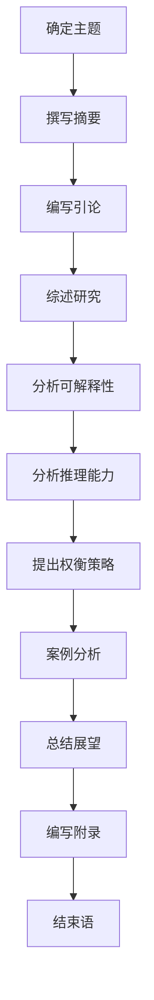

                 

### 逻辑清晰、结构紧凑、简单易懂的技术博客撰写示例

为了撰写一篇逻辑清晰、结构紧凑、简单易懂的技术博客文章，我们将遵循以下步骤：

#### 第一步：确定文章主题和目标受众
- **主题**：模型可解释性与推理能力的权衡研究
- **目标受众**：数据科学家、机器学习工程师、研究学者等对AI领域感兴趣的读者

#### 第二步：撰写摘要和关键词
- **摘要**：本文深入探讨了模型可解释性与推理能力的权衡问题，分析了相关理论、方法及实际应用，为AI模型设计提供了实用指导。
- **关键词**：模型可解释性、推理能力、权衡、AI模型、实际应用

#### 第三步：编写引论与背景
- **1.1 模型可解释性**：介绍可解释性的定义及其在AI领域的意义，阐述不可解释模型带来的挑战。
- **1.2 推理能力**：解释推理能力的重要性，讨论当前推理技术的局限。
- **1.3 权衡背景**：讨论模型可解释性与推理能力之间的矛盾，引入权衡研究的重要性。
- **1.4 本书结构概述**：概述文章的组织结构和各部分内容。

#### 第四步：编写相关研究综述
- **2.1 模型可解释性研究进展**：分类介绍当前的可解释性方法，分析成功案例和挑战。
- **2.2 推理能力研究进展**：介绍推理算法与模型，探讨推理能力的提升与应用。
- **2.3 权衡研究的现状与趋势**：分析权衡研究的现状和未来趋势。
- **2.4 研究意义与目标**：阐述研究的意义和目标。

#### 第五步：深入分析模型可解释性
- **3.1 可解释性理论基础**：定义可解释性度量，介绍量化方法。
- **3.2 可解释性模型分类**：分类介绍不同类型的可解释性模型。
- **3.3 可解释性案例分析**：结合自然语言处理、计算机视觉和推荐系统，分析可解释性应用。

#### 第六步：深入分析推理能力
- **5.1 推理能力理论基础**：介绍推理过程与算法。
- **5.2 推理能力评估**：定义评估指标和方法。
- **5.3 推理能力的限制与挑战**：讨论推理能力的限制和挑战。

#### 第七步：提出权衡策略和方法
- **7.1 贸易空间方法**：解释贸易空间的概念和建模方法。
- **7.2 优化策略**：介绍智能优化算法和多目标优化。
- **7.3 实时调整策略**：探讨实时调整策略的可行性和应用。

#### 第八步：进行权衡案例分析
- **8.1 医疗诊断系统**：设计系统，分析可解释性与推理能力的权衡。
- **8.2 自动驾驶系统**：构建系统架构，探讨权衡问题。
- **8.3 金融风险评估**：构建风险评估模型，分析权衡策略。

#### 第九步：总结与展望
- **9.1 权衡研究的发展方向**：预测权衡研究的未来趋势。
- **9.2 新技术的影响**：分析新技术对权衡研究的影响。
- **9.3 研究与实际应用结合**：讨论研究如何转化为实际应用。

#### 第十步：编写附录与资源
- **附录A**：列出常用工具与技术。
- **附录B**：提供参考资料与推荐阅读。

#### 第十一步：编写结束语
- **结束语**：总结全文，强调模型可解释性与推理能力权衡的重要性，鼓励读者进一步探索。

#### 完整的Mermaid流程图示例：

#### 最后一步：校对和优化
- **校对**：检查文章的逻辑性、连贯性、语法错误和错别字。
- **优化**：优化段落结构，确保语言简洁明了，增强文章的可读性。

遵循以上步骤，我们可以撰写出一篇结构严谨、内容丰富、逻辑清晰的专业技术博客。每一部分都要确保详细讲解，并用实际案例和代码示例来加强理解和实践。通过这样的方式，读者可以系统地了解模型可解释性与推理能力的权衡问题，并从中获得实用价值。

