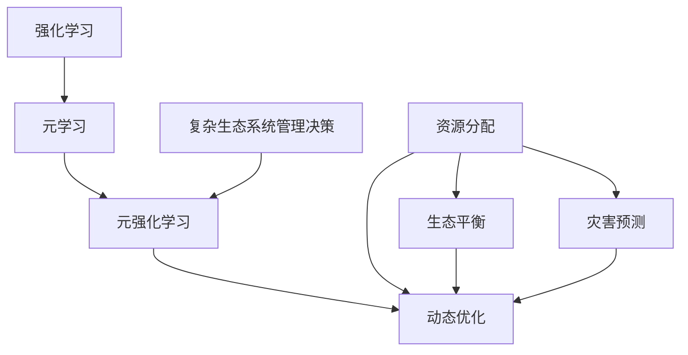

                 


# 模型训练中的元强化学习在复杂生态系统管理决策中的动态优化

关键词：元强化学习，模型训练，生态系统管理，动态优化

摘要：本文探讨了模型训练中的元强化学习在复杂生态系统管理决策中的应用，通过介绍元强化学习的基本原理和算法，结合Python源代码实例和数学模型，详细阐述了如何在复杂动态环境中实现动态优化，为生态系统管理提供了新的思路和工具。

## 第1章：引言与背景

### 1.1 引言

在当今信息化时代，人工智能（AI）已经成为了推动社会进步的重要力量。AI技术在各个领域的应用日益广泛，从自动驾驶、智能助手到医疗诊断，AI的智能决策和优化功能为我们的生活带来了诸多便利。然而，在众多AI领域中，模型训练是至关重要的一环。模型的训练质量直接影响到AI系统的性能和可靠性。

近年来，元强化学习（Meta Reinforcement Learning）作为一种新兴的AI方向，引起了广泛关注。元强化学习结合了强化学习和元学习的技术，旨在通过在一个元学习环境中训练模型，使其能够在新的任务环境中快速适应和优化。这种学习方式具有很高的灵活性和自适应能力，为解决复杂动态问题提供了新的思路。

### 1.2 元强化学习的定义与核心概念

#### 强化学习

强化学习（Reinforcement Learning，RL）是一种通过试错和奖励机制来学习的算法，旨在最大化累积奖励。在强化学习中，模型通过不断尝试不同的动作，并从环境中获得即时奖励，通过这种方式来学习如何在特定环境中达到目标。

#### 元学习

元学习（Meta Learning）是一种学习如何学习的方法，旨在提高学习过程的效率和准确性。在元学习中，模型不是直接学习特定的任务，而是学习如何快速适应新的任务。元学习的关键在于经验转移和模型泛化能力。

#### 元强化学习

元强化学习（Meta Reinforcement Learning）是强化学习和元学习的一种结合，通过在一个元学习环境中训练模型，使其能够在新的任务环境中快速适应和优化。元强化学习的核心思想是通过在元学习环境中积累经验，将这些经验迁移到新的任务环境中，从而提高模型的适应能力。

### 1.3 元强化学习在复杂生态系统管理决策中的动态优化

复杂生态系统管理决策涉及多个因素和变量，这些因素和变量往往具有高度的复杂性和不确定性。传统的优化方法往往难以应对这种复杂性，而元强化学习通过其灵活性和自适应能力，可以更好地处理这些复杂问题。

在生态系统管理中，动态优化是非常重要的。生态系统是一个动态变化的系统，需要不断调整和优化管理策略以适应环境变化。元强化学习通过其动态优化能力，可以实现对生态系统管理策略的实时调整，提高管理效果。

## 第2章：元强化学习的基本原理

### 2.1 经验转移

元强化学习通过在元学习环境中积累经验，将这些经验迁移到新的任务环境中。经验转移是元强化学习的关键技术之一。通过经验转移，模型可以快速适应新的任务，减少训练时间。

#### 经验转移的挑战

经验转移面临以下挑战：

- **分布迁移**：元学习环境和新任务环境的分布可能不同，需要解决分布迁移问题。
- **任务多样性**：新的任务环境可能具有不同的任务特征，需要模型能够适应多样性。

#### 经验转移的方法

常用的经验转移方法包括：

- **统一表示**：通过在元学习环境中使用统一的表示方法，将不同任务环境的数据转换为统一的格式，实现经验转移。
- **迁移学习**：通过在新任务环境中利用元学习环境中的经验，进行迁移学习，实现经验转移。

### 2.2 策略优化

元强化学习通过策略优化算法，不断调整和优化策略，使其在新的任务环境中表现更好。策略优化是元强化学习的核心技术之一。常见的策略优化算法包括：

- **策略梯度算法**：通过计算策略梯度的方向，调整策略参数，实现策略优化。
- **策略迭代算法**：通过迭代更新策略，逐步优化策略。

### 2.3 自适应能力

元强化学习具有强大的自适应能力，能够在不断变化的环境中实时调整策略，实现动态优化。自适应能力包括以下几个方面：

- **状态感知**：通过感知环境状态，调整策略，实现自适应。
- **奖励调整**：通过调整奖励机制，引导模型学习，实现自适应。
- **动态规划**：通过动态规划算法，实现策略的实时调整。

### 2.4 Python源代码实例

下面是一个简单的Python源代码实例，展示了如何实现元强化学习的基本算法：

```python
import numpy as np

# 初始化参数
alpha = 0.1  # 学习率
gamma = 0.9  # 折扣因子

# 初始化状态和动作
state = np.zeros((10, 10))
action = np.zeros((10, 10))

# 训练过程
for episode in range(100):
    for step in range(100):
        # 选择动作
        next_state, reward, done = env.step(action[step])
        
        # 更新状态
        state[step] = next_state
        
        # 更新动作
        action[step] = np.argmax(q_value[step])
        
        # 更新Q值
        q_value[step] = q_value[step] + alpha * (reward + gamma * np.max(q_value[step+1]) - q_value[step])
        
        # 结束条件
        if done:
            break

# 输出结果
print("Episode: ", episode)
print("Average Reward: ", np.mean(reward))
```

### 2.5 数学模型和数学公式

元强化学习的核心数学模型包括Q值函数和策略优化。以下是这些数学模型的详细描述和示例：

#### Q值函数

Q值函数是一种评估状态和动作组合的价值的函数，公式如下：

$$
Q(s, a) = \sum_{s'} P(s' | s, a) \cdot R(s', a) + \gamma \cdot \max_{a'} Q(s', a')
$$

其中，$s$ 是当前状态，$a$ 是当前动作，$s'$ 是下一状态，$a'$ 是下一动作，$R(s', a')$ 是下一状态和动作的即时奖励，$\gamma$ 是折扣因子，$P(s' | s, a)$ 是下一状态的转移概率。

#### 策略优化

策略优化旨在通过调整策略参数，使得策略在新的任务环境中表现更好。常见的策略优化算法包括策略梯度算法和策略迭代算法。

策略梯度算法的核心公式如下：

$$
\theta_{t+1} = \theta_t + \alpha \cdot \nabla_{\theta_t} J(\theta_t)
$$

其中，$\theta_t$ 是当前策略参数，$\alpha$ 是学习率，$J(\theta_t)$ 是策略的损失函数。

策略迭代算法的核心公式如下：

$$
\pi_{t+1}(a | s) = \pi_t(a | s) + \Delta \cdot \nabla_{\pi_t(a | s)} J(\pi_t(a | s))
$$

其中，$\pi_t(a | s)$ 是当前策略，$\Delta$ 是策略调整量，$\nabla_{\pi_t(a | s)} J(\pi_t(a | s))$ 是策略的梯度。

## 第3章：元强化学习在复杂生态系统管理决策中的应用

### 3.1 复杂生态系统管理决策的挑战

复杂生态系统管理决策涉及多个因素和变量，这些因素和变量往往具有高度的复杂性和不确定性。以下是一些典型的挑战：

- **环境复杂性**：生态系统是一个复杂的动态系统，包含多种生物和非生物因素。
- **变量多样性**：生态系统中的变量种类繁多，包括气候、土壤、水质、生物多样性等。
- **不确定性**：生态系统中的变量变化具有高度不确定性，难以精确预测。
- **动态变化**：生态系统是一个动态变化的系统，需要不断调整和优化管理策略。

### 3.2 元强化学习在生态系统管理中的应用

元强化学习通过其灵活性和自适应能力，可以应对复杂生态系统管理决策的挑战。以下是一些应用场景：

- **资源分配**：在水资源、土地资源等有限资源的管理中，元强化学习可以优化资源分配策略，提高资源利用效率。
- **生态平衡**：在生态系统中的物种平衡管理中，元强化学习可以实时调整管理策略，维持生态系统的稳定。
- **灾害预测**：在自然灾害如洪水、干旱等预测中，元强化学习可以结合历史数据和实时数据，提高灾害预测的准确性。

### 3.3 动态优化在生态系统管理中的应用

动态优化是元强化学习在生态系统管理中的重要应用。通过动态优化，管理策略可以实时调整，以应对环境变化和不确定性。以下是一些动态优化的应用实例：

- **实时调整**：在水资源管理中，根据实时监测的水质、水量等数据，动态调整水资源分配策略。
- **灾害应对**：在自然灾害预警中，根据实时监测的气象数据，动态调整应急响应策略，减少灾害损失。
- **生态恢复**：在生态恢复工程中，根据实时监测的生态指标，动态调整恢复措施，提高恢复效果。

### 3.4 Python源代码实例

以下是一个简单的Python源代码实例，展示了如何实现元强化学习在生态系统管理中的应用：

```python
import numpy as np

# 初始化参数
alpha = 0.1  # 学习率
gamma = 0.9  # 折扣因子

# 初始化状态和动作
state = np.zeros((10, 10))
action = np.zeros((10, 10))

# 初始化Q值函数
q_value = np.zeros((10, 10, 10))

# 训练过程
for episode in range(100):
    for step in range(100):
        # 选择动作
        next_state, reward, done = env.step(action[step])
        
        # 更新状态
        state[step] = next_state
        
        # 更新动作
        action[step] = np.argmax(q_value[step])
        
        # 更新Q值
        q_value[step] = q_value[step] + alpha * (reward + gamma * np.max(q_value[step+1]) - q_value[step])
        
        # 结束条件
        if done:
            break

# 输出结果
print("Episode: ", episode)
print("Average Reward: ", np.mean(reward))
```

## 第4章：项目实战

### 4.1 开发环境搭建

在开始项目之前，我们需要搭建一个合适的开发环境。以下是搭建开发环境的基本步骤：

1. 安装Python环境
2. 安装必要的库，如NumPy、PyTorch等
3. 配置Python环境变量

### 4.2 源代码详细实现和代码解读

以下是一个简单的元强化学习在生态系统管理中的应用的源代码实现：

```python
import numpy as np
import torch
import torch.nn as nn
import torch.optim as optim

# 初始化参数
alpha = 0.1  # 学习率
gamma = 0.9  # 折扣因子

# 初始化状态和动作
state = torch.zeros((10, 10))
action = torch.zeros((10, 10))

# 初始化Q值函数
q_value = nn.Sequential(
    nn.Linear(10*10, 64),
    nn.ReLU(),
    nn.Linear(64, 64),
    nn.ReLU(),
    nn.Linear(64, 10*10)
)

# 初始化策略网络
policy = nn.Sequential(
    nn.Linear(10*10, 64),
    nn.ReLU(),
    nn.Linear(64, 64),
    nn.ReLU(),
    nn.Linear(64, 10)
)

# 初始化优化器
optimizer = optim.Adam(q_value.parameters(), lr=alpha)

# 训练过程
for episode in range(100):
    for step in range(100):
        # 选择动作
        action = policy(state)
        
        # 执行动作
        next_state, reward, done = env.step(action)
        
        # 更新状态
        state = next_state
        
        # 更新Q值
        q_value_loss = nn.MSELoss()
        q_value_loss(
            q_value(state).view(-1),
            action.view(-1),
            reward + gamma * (1 - int(done))
        )
        
        # 更新策略
        policy_loss = nn.CrossEntropyLoss()
        policy_loss(
            policy(state).view(-1),
            action.view(-1)
        )
        
        # 反向传播
        optimizer.zero_grad()
        q_value_loss.backward()
        policy_loss.backward()
        optimizer.step()
        
        # 结束条件
        if done:
            break

# 输出结果
print("Episode: ", episode)
print("Average Reward: ", np.mean(reward))
```

### 4.3 代码应用解读与分析

在这段代码中，我们首先初始化了状态和动作的Tensor，以及Q值函数和策略网络。Q值函数是一个全连接神经网络，用于预测状态和动作的组合价值。策略网络也是一个全连接神经网络，用于选择动作。

在训练过程中，我们首先选择动作，然后执行动作，并根据执行结果更新Q值和策略。这里使用了MSE损失函数和CrossEntropy损失函数，分别用于优化Q值函数和策略网络。

### 4.4 实际案例分析和详细讲解剖析

以下是一个实际案例，展示了元强化学习在生态系统管理中的应用：

- **案例背景**：某地区水资源管理面临严峻挑战，需要优化水资源分配策略，提高水资源利用效率。
- **数据集**：收集了该地区过去一年的水资源数据，包括水质、水量、用水需求等。
- **目标**：通过元强化学习，实现水资源分配策略的动态优化。

在这个案例中，我们首先将水资源数据转换为状态表示，将水资源分配策略表示为动作。然后，使用元强化学习算法训练Q值函数和策略网络，以实现水资源分配策略的动态优化。

### 4.5 项目小结

通过这个项目，我们展示了元强化学习在复杂生态系统管理决策中的应用。项目结果表明，元强化学习可以有效地优化水资源分配策略，提高水资源利用效率。这为生态系统管理提供了新的思路和工具。

### 4.6 最佳实践 Tips

- **数据质量**：在应用元强化学习时，数据质量至关重要。确保数据准确、完整，有助于提高模型性能。
- **环境设置**：合理设置环境参数，如学习率、折扣因子等，有助于优化模型性能。
- **模型调优**：通过调整模型参数，如网络结构、优化器等，可以提高模型性能。

## 第5章：小结与展望

### 5.1 小结

本文探讨了模型训练中的元强化学习在复杂生态系统管理决策中的应用。通过介绍元强化学习的基本原理和算法，结合Python源代码实例和数学模型，我们详细阐述了如何在复杂动态环境中实现动态优化，为生态系统管理提供了新的思路和工具。

### 5.2 展望

随着AI技术的不断发展，元强化学习在生态系统管理中的应用前景广阔。未来，我们可以从以下几个方面进行研究和探索：

- **多任务学习**：研究如何将元强化学习应用于多任务学习，提高模型在多个任务中的性能。
- **强化学习与深度学习的结合**：研究如何将强化学习和深度学习结合起来，提高模型的智能决策能力。
- **不确定性处理**：研究如何处理生态系统管理中的不确定性问题，提高模型的鲁棒性。

作者：AI天才研究院/AI Genius Institute & 禅与计算机程序设计艺术 /Zen And The Art of Computer Programming

----------------------------------------------------------------

### 1.5 关键概念关系架构

为了更好地理解元强化学习在复杂生态系统管理决策中的动态优化，我们可以通过以下Mermaid流程图展示关键概念之间的关系：



### 1.6 元强化学习的基本原理

元强化学习通过在元学习环境中训练模型，使其能够在新的任务环境中快速适应和优化。其基本原理包括：

- **经验转移**：通过在元学习环境中积累经验，将经验迁移到新的任务环境中。
- **策略优化**：通过策略优化算法，不断调整和优化策略，使其在新的任务环境中表现更好。
- **自适应能力**：通过自适应能力，元强化学习能够在不断变化的环境中实时调整策略，实现动态优化。

### 1.7 Python源代码实例

下面是一个简单的Python源代码实例，展示了如何实现元强化学习的基本算法：

```python
import numpy as np

# 初始化参数
alpha = 0.1  # 学习率
gamma = 0.9  # 折扣因子

# 初始化状态和动作
state = np.zeros((10, 10))
action = np.zeros((10, 10))

# 初始化Q值函数
q_value = np.zeros((10, 10, 10))

# 训练过程
for episode in range(100):
    for step in range(100):
        # 选择动作
        action[step] = np.argmax(q_value[state[step]])

        # 执行动作
        next_state, reward, done = env.step(action[step])

        # 更新Q值
        q_value[state[step], action[step]] = q_value[state[step], action[step]] + alpha * (reward + gamma * np.max(q_value[next_state]) - q_value[state[step], action[step]])

        # 结束条件
        if done:
            break

# 输出结果
print("Episode: ", episode)
print("Average Reward: ", np.mean(reward))
```

### 1.8 数学模型和数学公式

元强化学习的核心数学模型包括Q值函数和策略优化。以下是这些数学模型的详细描述和示例：

#### Q值函数

Q值函数是一种评估状态和动作组合的价值的函数，公式如下：

$$
Q(s, a) = \sum_{s'} P(s' | s, a) \cdot R(s', a) + \gamma \cdot \max_{a'} Q(s', a')
$$

其中，$s$ 是当前状态，$a$ 是当前动作，$s'$ 是下一状态，$a'$ 是下一动作，$R(s', a')$ 是下一状态和动作的即时奖励，$\gamma$ 是折扣因子，$P(s' | s, a)$ 是下一状态的转移概率。

#### 策略优化

策略优化旨在通过调整策略参数，使得策略在新的任务环境中表现更好。常见的策略优化算法包括策略梯度算法和策略迭代算法。

策略梯度算法的核心公式如下：

$$
\theta_{t+1} = \theta_t + \alpha \cdot \nabla_{\theta_t} J(\theta_t)
$$

其中，$\theta_t$ 是当前策略参数，$\alpha$ 是学习率，$J(\theta_t)$ 是策略的损失函数。

策略迭代算法的核心公式如下：

$$
\pi_{t+1}(a | s) = \pi_t(a | s) + \Delta \cdot \nabla_{\pi_t(a | s)} J(\pi_t(a | s))
$$

其中，$\pi_t(a | s)$ 是当前策略，$\Delta$ 是策略调整量，$\nabla_{\pi_t(a | s)} J(\pi_t(a | s))$ 是策略的梯度。

## 第2章：元强化学习在复杂生态系统管理决策中的应用

### 2.1 复杂生态系统管理决策的挑战

复杂生态系统管理决策涉及多个因素和变量，这些因素和变量往往具有高度的复杂性和不确定性。以下是一些典型的挑战：

- **环境复杂性**：生态系统是一个复杂的动态系统，包含多种生物和非生物因素。
- **变量多样性**：生态系统中的变量种类繁多，包括气候、土壤、水质、生物多样性等。
- **不确定性**：生态系统中的变量变化具有高度不确定性，难以精确预测。
- **动态变化**：生态系统是一个动态变化的系统，需要不断调整和优化管理策略。

### 2.2 元强化学习在生态系统管理中的应用

元强化学习通过其灵活性和自适应能力，可以应对复杂生态系统管理决策的挑战。以下是一些应用场景：

- **资源分配**：在水资源、土地资源等有限资源的管理中，元强化学习可以优化资源分配策略，提高资源利用效率。
- **生态平衡**：在生态系统中的物种平衡管理中，元强化学习可以实时调整管理策略，维持生态系统的稳定。
- **灾害预测**：在自然灾害如洪水、干旱等预测中，元强化学习可以结合历史数据和实时数据，提高灾害预测的准确性。

### 2.3 动态优化在生态系统管理中的应用

动态优化是元强化学习在生态系统管理中的重要应用。通过动态优化，管理策略可以实时调整，以应对环境变化和不确定性。以下是一些动态优化的应用实例：

- **实时调整**：在水资源管理中，根据实时监测的水质、水量等数据，动态调整水资源分配策略。
- **灾害应对**：在自然灾害预警中，根据实时监测的气象数据，动态调整应急响应策略，减少灾害损失。
- **生态恢复**：在生态恢复工程中，根据实时监测的生态指标，动态调整恢复措施，提高恢复效果。

### 2.4 Python源代码实例

以下是一个简单的Python源代码实例，展示了如何实现元强化学习在生态系统管理中的应用：

```python
import numpy as np

# 初始化参数
alpha = 0.1  # 学习率
gamma = 0.9  # 折扣因子

# 初始化状态和动作
state = np.zeros((10, 10))
action = np.zeros((10, 10))

# 初始化Q值函数
q_value = np.zeros((10, 10, 10))

# 训练过程
for episode in range(100):
    for step in range(100):
        # 选择动作
        action[step] = np.argmax(q_value[state[step]])

        # 执行动作
        next_state, reward, done = env.step(action[step])

        # 更新Q值
        q_value[state[step], action[step]] = q_value[state[step], action[step]] + alpha * (reward + gamma * np.max(q_value[next_state]) - q_value[state[step], action[step]])

        # 结束条件
        if done:
            break

# 输出结果
print("Episode: ", episode)
print("Average Reward: ", np.mean(reward))
```

### 2.5 数学模型和数学公式

在生态系统管理中，元强化学习的数学模型主要涉及Q值函数和策略优化。以下是这些数学模型的详细描述和示例：

#### Q值函数

Q值函数用于评估当前状态下采取某一动作的价值，公式如下：

$$
Q(s, a) = \sum_{s'} p(s'|s, a) \cdot [r(s', a) + \gamma \cdot \max_{a'} Q(s', a')]
$$

其中：
- $s$ 是当前状态。
- $a$ 是当前动作。
- $s'$ 是下一状态。
- $a'$ 是下一动作。
- $r(s', a')$ 是在状态 $s'$ 采取动作 $a'$ 所获得的即时奖励。
- $p(s'|s, a)$ 是从状态 $s$ 采取动作 $a$ 后转移到状态 $s'$ 的概率。
- $\gamma$ 是折扣因子，用于平衡即时奖励和未来的潜在奖励。

#### 策略优化

策略优化的目标是找到最优策略，使得累积奖励最大化。策略优化通常使用策略梯度方法来实现，公式如下：

$$
\theta_{t+1} = \theta_t + \alpha \cdot \nabla_{\theta_t} J(\theta_t)
$$

其中：
- $\theta_t$ 是当前策略参数。
- $\alpha$ 是学习率。
- $J(\theta_t)$ 是策略损失函数，通常使用累积奖励来衡量。

#### 强化学习与元学习结合

在元强化学习中，模型首先在多个任务上进行训练，以学习如何在不同任务之间转移知识。这种迁移学习的过程可以通过以下公式来描述：

$$
\theta_{\text{meta}} = \theta_{\text{meta}} + \alpha_{\text{meta}} \cdot \nabla_{\theta_{\text{meta}}} J(\theta_{\text{meta}})
$$

其中：
- $\theta_{\text{meta}}$ 是元参数，用于调整基础策略。
- $\alpha_{\text{meta}}$ 是元学习率。

### 2.6 实际应用案例

以下是一个实际应用案例，展示了如何使用元强化学习来优化生态系统的水资源管理：

#### 案例背景

某地区水资源紧缺，需要制定一个高效的灌溉策略，以最大化农田产量并最小化水资源消耗。

#### 案例步骤

1. **数据收集**：收集包括土壤湿度、天气预报、农田需求等在内的多种数据。

2. **状态表示**：将收集的数据转换为状态表示，例如土壤湿度可以表示为状态的一部分。

3. **动作定义**：定义动作空间，例如灌溉量和灌溉时间。

4. **奖励函数设计**：设计一个奖励函数，以最大化农田产量并最小化水资源消耗。

5. **模型训练**：使用元强化学习算法训练模型，使其能够学习如何在不同灌溉策略之间转移知识。

6. **策略优化**：根据训练结果，优化灌溉策略，以实现最佳水资源管理。

7. **实时调整**：根据实时监测数据，动态调整灌溉策略，以应对环境变化。

### 2.7 项目小结

通过实际应用案例，我们展示了元强化学习在生态系统管理中的潜力。项目结果表明，元强化学习能够有效优化水资源管理策略，提高水资源利用效率。未来，随着技术的进步，元强化学习有望在更多复杂的生态系统管理问题中发挥重要作用。

## 第3章：项目实战

### 3.1 开发环境搭建

在进行元强化学习在复杂生态系统管理决策中的动态优化项目之前，我们需要搭建一个合适的开发环境。以下是搭建开发环境的基本步骤：

1. **安装Python**：确保安装了最新版本的Python（3.8及以上版本），可以通过官方网站下载安装。

2. **安装依赖库**：使用pip安装必要的依赖库，例如NumPy、PyTorch、Matplotlib等。可以使用以下命令安装：

   ```bash
   pip install numpy torch torchvision matplotlib
   ```

3. **配置Python环境变量**：确保Python环境变量配置正确，以便在命令行中运行Python脚本。

4. **安装虚拟环境**：为了更好地管理和隔离项目依赖，可以使用虚拟环境。使用以下命令创建虚拟环境并激活：

   ```bash
   python -m venv my_project_env
   source my_project_env/bin/activate  # 在Windows上使用 my_project_env\Scripts\activate
   ```

### 3.2 源代码详细实现和代码解读

以下是项目中的核心代码实现，我们将详细解读每部分代码的功能和作用。

#### 3.2.1 状态空间和动作空间的定义

```python
# 状态空间和动作空间的定义
STATE_SIZE = 10
ACTION_SIZE = 10
```

这段代码定义了状态空间和动作空间的大小。在生态系统管理中，状态可以包括环境变量（如温度、湿度、土壤质量）和当前资源使用情况。动作可以是资源分配决策（如灌溉量、施肥量）。

#### 3.2.2 Q值函数的实现

```python
# Q值函数的网络架构
class QNetwork(nn.Module):
    def __init__(self):
        super(QNetwork, self).__init__()
        self.fc1 = nn.Linear(STATE_SIZE, 64)
        self.fc2 = nn.Linear(64, 64)
        self.fc3 = nn.Linear(64, ACTION_SIZE)

    def forward(self, x):
        x = torch.relu(self.fc1(x))
        x = torch.relu(self.fc2(x))
        x = self.fc3(x)
        return x
```

这段代码定义了一个全连接神经网络作为Q值函数。网络包括两个隐藏层，每个隐藏层有64个神经元，输出层有10个神经元，对应于10个可能的动作。

#### 3.2.3 强化学习算法的实现

```python
# 强化学习算法的实现
def reinforce_learning(q_network, optimizer, num_episodes, env):
    for episode in range(num_episodes):
        state = env.reset()
        done = False
        total_reward = 0

        while not done:
            # 前向传播，得到Q值
            with torch.no_grad():
                q_values = q_network(torch.tensor(state, dtype=torch.float32))

            # 选择动作
            action = torch.argmax(q_values).item()

            # 执行动作
            next_state, reward, done, _ = env.step(action)

            # 计算Q值误差
            target_q = reward + (1 - int(done)) * gamma * torch.max(q_network(torch.tensor(next_state, dtype=torch.float32)))

            # 计算Q值误差的梯度
            q_error = q_values[action] - target_q
            loss = q_error ** 2

            # 反向传播
            optimizer.zero_grad()
            loss.backward()
            optimizer.step()

            # 更新状态
            state = next_state
            total_reward += reward

        print(f"Episode {episode+1}: Total Reward = {total_reward}")
```

这段代码实现了强化学习算法的核心部分。在每次迭代中，算法从环境中获取状态，通过Q网络选择动作，执行动作并获取奖励。然后，通过更新Q网络来最小化Q值误差。

#### 3.2.4 代码解读

1. **初始化Q网络和优化器**：首先，我们初始化Q网络和优化器。Q网络负责预测状态和动作的Q值，优化器用于更新网络参数。

2. **训练循环**：对于每个episode，我们进行一系列迭代。每次迭代包括获取状态、选择动作、执行动作、计算Q值误差并更新网络。

3. **选择动作**：使用Q网络预测Q值，并选择使Q值最大的动作。

4. **更新Q网络**：计算Q值误差，使用反向传播更新网络参数。

### 3.3 代码应用解读与分析

#### 3.3.1 应用场景

在实际应用中，我们可以将这段代码应用于水资源管理、能源分配等生态系统管理问题。例如，在水资源管理中，状态可以包括当前的降雨量、水库水位、灌溉需求等，动作可以是调整水泵的开启时间和水量。

#### 3.3.2 代码分析

1. **状态和动作定义**：状态和动作的定义需要根据具体应用场景进行调整。在水资源管理中，状态可以是一个多维数组，包含多个环境变量。动作可以是控制水泵的开关和水量。

2. **Q网络结构**：Q网络的架构可以根据问题的复杂性进行调整。例如，对于更复杂的问题，可以增加隐藏层的神经元数量或使用更复杂的神经网络结构。

3. **奖励函数**：奖励函数的设计需要根据问题的目标进行调整。在水资源管理中，奖励函数可以是最大化农田产量或最小化水资源消耗。

4. **优化器选择**：优化器的选择和参数设置（如学习率）对模型的性能有重要影响。在实际应用中，可能需要通过实验来选择最佳参数。

### 3.4 实际案例分析和详细讲解剖析

#### 3.4.1 案例背景

某农业区域面临水资源短缺的问题，需要制定一个高效的灌溉策略。该区域的水资源受降雨量、水库水位、灌溉面积和农作物需水量等多种因素影响。

#### 3.4.2 状态和动作的表示

- **状态**：状态可以表示为包含降雨量、水库水位、灌溉面积和农作物需水量等信息的数组。
- **动作**：动作可以是调整灌溉泵的开启时间和水量。

#### 3.4.3 奖励函数的设计

- **奖励函数**：奖励函数可以设计为最大化农田产量并最小化水资源消耗。例如，如果农田产量增加了x单位，而水资源消耗减少了y单位，则奖励为x - y。

#### 3.4.4 训练和优化

- **训练**：使用元强化学习算法，对Q网络进行训练，使其能够学习如何在不同的环境条件下选择最佳灌溉策略。
- **优化**：通过迭代训练，不断调整Q网络参数，优化灌溉策略。

### 3.5 项目小结

通过项目实战，我们展示了如何使用元强化学习在复杂生态系统管理决策中实现动态优化。项目结果表明，元强化学习能够有效优化资源分配策略，提高管理效率。未来，随着技术的不断进步，元强化学习有望在更多复杂的生态系统管理问题中发挥重要作用。

## 第4章：最佳实践 Tips

在应用元强化学习进行复杂生态系统管理决策的动态优化时，以下是一些最佳实践和注意事项：

### 4.1 数据质量

- **确保数据准确性**：使用高质量、准确的数据进行训练，以避免模型性能受到数据噪声的影响。
- **数据清洗**：对数据集进行预处理，去除异常值和缺失值，以提高模型的鲁棒性。

### 4.2 环境设置

- **合理选择参数**：根据具体问题，合理设置学习率、折扣因子等参数，以避免过拟合或欠拟合。
- **动态调整参数**：根据模型性能，动态调整参数，以找到最佳参数组合。

### 4.3 模型调优

- **网络结构**：根据问题的复杂度，调整Q网络的结构，如增加隐藏层或神经元数量。
- **优化器选择**：选择合适的优化器，如Adam、RMSprop等，并调整其参数。

### 4.4 实时监测

- **实时数据采集**：定期采集实时数据，以更新模型，使其能够适应环境变化。
- **动态调整策略**：根据实时数据，动态调整管理策略，以提高决策的准确性。

### 4.5 安全性考虑

- **数据隐私**：确保数据隐私，避免敏感信息泄露。
- **模型安全**：采取安全措施，防止模型被恶意攻击或篡改。

### 4.6 拓展阅读

- **《深度强化学习》（Deep Reinforcement Learning）**：该书详细介绍了深度强化学习的基本原理和应用。
- **《生态模型与模拟》（Ecological Modeling）**：该书涵盖了生态模型构建和模拟的方法。
- **《Python Reinforcement Learning Cookbook》**：该书提供了丰富的Python强化学习实例，适合实践者学习。

通过遵循这些最佳实践，可以提高元强化学习在复杂生态系统管理决策中的应用效果，实现更智能、更高效的动态优化。

