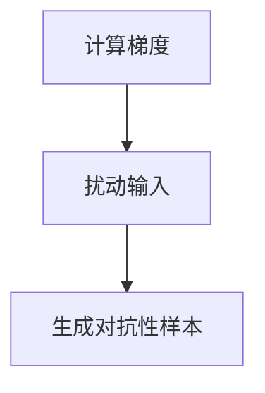

                 

### 摘要

本文将深入探讨对抗训练在提高人工智能（AI）系统公平性方面的创新应用。随着AI技术在各个领域的广泛应用，确保AI系统的公平性已成为一个至关重要的议题。不公平的AI系统可能导致歧视、偏见和信任危机。因此，对抗训练作为一种增强模型鲁棒性和公平性的方法，引起了广泛关注。本文首先介绍了对抗训练的基本概念和背景，包括其起源和发展历程。接着，本文详细阐述了对抗训练的核心概念和数学原理，并结合Python源代码和LaTeX公式，对主要算法如FGSM、PGD和C&W进行了讲解。随后，文章重点讨论了对抗训练在提高AI系统公平性方面的应用，包括消除偏见、提高模型透明度和消除模型偏差的具体方法。通过案例研究和项目实战，本文展示了对抗训练在金融、医疗和自动驾驶等领域的实际应用，并探讨了对抗训练的未来发展方向和挑战。本文旨在为读者提供一个全面而深入的了解，帮助其在AI系统的公平性保障方面应用对抗训练，实现技术的创新和进步。

### 关键词

对抗训练、AI系统公平性、抗干扰损失函数、对抗性攻击方法、机器学习、算法优化、模型透明度、偏见消除、金融应用、医疗应用、自动驾驶。

### 文章标题

《模型训练中的对抗训练在提高AI系统公平性方面的创新应用》

## 第一部分：对抗训练基础与原理

### 1.1 对抗训练的概念

对抗训练（Adversarial Training）是人工智能领域中一种用于增强模型鲁棒性和公平性的方法。其核心思想是在训练过程中引入一些故意设计的对抗性样本（adversarial examples），以迫使模型学习到更全面、更稳健的特征表示。这些对抗性样本通常是通过对抗性攻击算法（如FGSM、PGD和C&W）生成的，目的是欺骗模型，使其在面临这些特殊样本时仍然能够正确地做出预测。

对抗训练最早可以追溯到2013年，由Goodfellow等人提出的FGSM（Fast Gradient Sign Method）算法，该算法通过计算梯度并取符号来生成对抗性样本。随后，对抗训练逐渐成为深度学习领域的一个重要研究方向，并发展出了多种对抗性攻击和防御方法。随着研究的深入，对抗训练不仅被用于提高模型的鲁棒性，还逐渐应用于提高AI系统的公平性。

### 1.2 对抗训练的起源和发展

对抗训练的起源可以追溯到早期的人工智能和机器学习研究。在20世纪80年代和90年代，研究者们开始关注如何增强模型的鲁棒性，使其能够应对各种异常输入和攻击。然而，传统的机器学习模型通常是基于统计学习和决策树等方法，这些方法的鲁棒性相对较弱，容易受到异常值的干扰。

进入21世纪，随着深度学习的兴起，研究者们开始将对抗训练的方法引入到神经网络中。2013年，Goodfellow等人提出了FGSM算法，这标志着对抗训练的正式诞生。FGSM算法通过在输入数据上添加小的扰动来生成对抗性样本，这使得神经网络在训练过程中能够逐渐学习到更稳健的特征表示。

随后，对抗训练的研究逐渐深入，发展出了多种对抗性攻击和防御方法。例如，PGD（Projected Gradient Descent）算法通过迭代优化来生成对抗性样本，相比FGSM具有更高的攻击效果。C&W（Carlini & Wagner）算法则利用优化技术生成更高质量的对抗性样本。

总的来说，对抗训练的发展历程体现了人工智能领域对于模型鲁棒性和公平性的不断追求。从早期的简单攻击方法到如今的复杂算法，对抗训练在提高模型性能和可靠性方面发挥了重要作用。

### 1.3 对抗训练的目的和重要性

对抗训练的主要目的是提高模型的鲁棒性和公平性。具体来说，通过引入对抗性样本，模型能够在训练过程中学习到更加稳健的特征表示，从而在面临异常输入和攻击时仍能保持较高的准确性和可靠性。这种鲁棒性的提升不仅有助于提高模型的实用性，还能够增强用户对AI系统的信任。

此外，对抗训练在提高AI系统公平性方面也具有重要作用。在现实应用中，AI系统可能会因为数据偏见、算法设计等问题而产生不公平的决策。对抗训练通过引入对抗性样本，可以帮助模型学习到更加全面和客观的特征表示，从而减少偏见和歧视。这对于确保AI系统在各个领域的公平性和可接受性具有重要意义。

总之，对抗训练的目的和重要性在于提高模型的鲁棒性和公平性，使其能够在各种复杂和动态的环境中稳定运行，并得到用户的信任和支持。

### 1.4 对抗训练的主要方法

对抗训练作为深度学习领域中的一种关键技术，其方法主要包括对抗性样本的生成和模型的训练过程。以下将详细介绍几种常见的对抗性攻击方法以及它们在对抗训练中的应用。

#### FGSM（Fast Gradient Sign Method）

FGSM是最早提出的一种对抗性攻击方法，由Goodfellow等人于2013年提出。其核心思想是通过计算梯度来生成对抗性样本。具体步骤如下：

1. **计算梯度**：对于输入数据\( x \)和模型的损失函数\( L \)，计算梯度\( \nabla_x L \)。
2. **生成对抗性样本**：将输入数据\( x \)沿梯度方向扰动，即\( x' = x + \epsilon \cdot \text{sign}(\nabla_x L) \)，其中\( \epsilon \)为扰动幅度。

FGSM方法简单有效，适用于快速生成对抗性样本，但在攻击强度和稳定性方面存在一定的限制。

#### PGD（Projected Gradient Descent）

PGD（Projected Gradient Descent）是一种迭代优化的对抗性攻击方法，由Madry等人于2017年提出。与FGSM相比，PGD通过多次迭代逐步优化对抗性样本，从而生成更高质量的对抗性样本。具体步骤如下：

1. **初始化**：选择初始对抗性样本\( x_0 = x + \epsilon \cdot \text{sign}(\nabla_x L) \)。
2. **迭代优化**：对于第\( t \)次迭代，更新对抗性样本为：
   \[
   x_{t+1} = \text{Proj}_{\|x\|_2 \leq C}(x_t - \eta \cdot \nabla_{x_t} L)
   \]
   其中，\(\text{Proj}_{\|x\|_2 \leq C}\)为投影操作，确保对抗性样本在给定范围内，\(\eta\)为学习率。

PGD方法通过迭代优化提高了对抗性样本的质量，适用于生成更具攻击性的样本。

#### C&W（Carlini & Wagner）攻击

C&W攻击是由Carlini和Wagner于2017年提出的一种基于优化技术的对抗性攻击方法。该方法利用优化技术生成高质量的对抗性样本，其目标是最小化对抗性样本与原始样本之间的距离，同时最大化模型损失函数。具体步骤如下：

1. **初始化**：设置参数\( \alpha \)和\( \beta \)，初始化对抗性样本\( x \)。
2. **优化过程**：通过优化以下目标函数：
   \[
   \min_x \alpha \| x - x_0 \|_2^2 + \beta L(x)
   \]
   其中，\( x_0 \)为原始样本，\( L(x) \)为模型在\( x \)上的损失函数。

   通过求解上述优化问题，得到高质量的对抗性样本。

C&W攻击方法利用优化技术生成高质量对抗性样本，具有较高的攻击效果和稳定性。

#### 对比分析

FGSM方法简单有效，但攻击强度和稳定性有限；PGD方法通过迭代优化提高了对抗性样本的质量，但计算复杂度较高；C&W攻击方法利用优化技术生成高质量对抗性样本，具有较高的攻击效果和稳定性，但计算复杂度相对较高。

总之，不同的对抗性攻击方法各有优缺点，选择合适的方法需要根据具体应用场景和需求进行权衡。通过结合多种攻击方法，可以进一步提高模型的鲁棒性和公平性。

### 1.5 对抗训练的数学原理

对抗训练的数学原理主要涉及对抗性样本的生成过程和对抗性损失函数的设计。以下将详细介绍这些核心概念，并使用Mermaid流程图和LaTeX公式进行解释。

#### 抗干扰损失函数

抗干扰损失函数是对抗训练中的关键组件，其目的是在模型训练过程中引入对抗性样本，以增强模型的鲁棒性。一个典型的抗干扰损失函数可以表示为：

\[ L_{adv}(\theta) = \frac{1}{N} \sum_{i=1}^{N} L_{c}(x_{i}^*, \theta) + \lambda \cdot D(\hat{p}_{\theta}(x_{i}^*), p_{0}) \]

其中，\( L_{c} \)是模型的分类损失函数，如交叉熵损失函数；\( \hat{p}_{\theta}(x_{i}^*) \)是模型在对抗性样本\( x_{i}^* \)上的预测概率；\( p_{0} \)是均匀分布；\( D \)是多样性度量，通常使用Kullback-Leibler散度（KL散度）。

LaTeX公式：
$$
L_{adv}(\theta) = \frac{1}{N} \sum_{i=1}^{N} L_{c}(x_{i}^*, \theta) + \lambda \cdot D(\hat{p}_{\theta}(x_{i}^*), p_{0})
$$

#### 生成对抗性样本

生成对抗性样本是对抗训练的核心步骤，其目的是通过对抗性攻击算法对原始样本进行扰动，以生成对抗性样本。以下是一个简单的生成对抗性样本的流程：

1. **计算梯度**：对于输入数据\( x \)和模型的损失函数\( L \)，计算梯度\( \nabla_x L \)。
2. **扰动输入**：将输入数据沿梯度方向进行扰动，生成对抗性样本：
   \[
   x' = x + \epsilon \cdot \text{sign}(\nabla_x L)
   \]
   其中，\( \epsilon \)是扰动幅度。

LaTeX公式：
$$
x' = x + \epsilon \cdot \text{sign}(\nabla_x L)
$$

#### Mermaid流程图

以下是一个简单的Mermaid流程图，描述了生成对抗性样本的过程：



通过上述数学原理和流程图，我们可以看到，对抗训练的核心在于通过对抗性样本和对抗性损失函数，迫使模型学习到更加稳健和泛化的特征表示。

### 1.6 对抗训练在机器学习中的应用

对抗训练在机器学习中的应用广泛且多样，特别是在分类、回归和聚类等常见任务中。以下将详细介绍对抗训练在这三种任务中的应用，并使用Python源代码进行说明。

#### 在分类问题中的应用

对抗训练在分类问题中的应用主要是通过引入对抗性样本，提高模型对异常输入的鲁棒性。以下是一个简单的例子，使用Python实现一个基于对抗训练的二元分类模型：

```python
import tensorflow as tf
from tensorflow.keras import layers, models, optimizers

# 定义对抗训练模型
def build_model():
    input_shape = (28, 28, 1)  # 例如，MNIST数据集的输入形状
    inputs = tf.keras.Input(shape=input_shape)
    
    # 添加卷积层和池化层
    x = layers.Conv2D(32, (3, 3), activation='relu')(inputs)
    x = layers.MaxPooling2D((2, 2))(x)
    
    # 添加全连接层
    x = layers.Flatten()(x)
    outputs = layers.Dense(1, activation='sigmoid')(x)
    
    model = models.Model(inputs=inputs, outputs=outputs)
    return model

# 训练模型
model = build_model()
model.compile(optimizer=optimizers.Adam(learning_rate=0.001), loss='binary_crossentropy', metrics=['accuracy'])

# 生成对抗性样本
def generate_adversarial_samples(model, x, y, epsilon=0.1):
    with tf.GradientTape() as tape:
        tape.watch(x)
        outputs = model(x, training=True)
        loss = tf.keras.losses.binary_crossentropy(y, outputs)
    
    gradients = tape.gradient(loss, x)
    adversarial_samples = x + epsilon * tf.sign(gradients)
    return adversarial_samples

# 对抗训练
for epoch in range(10):
    # 使用正常数据训练模型
    model.fit(x_train, y_train, batch_size=32, epochs=1)
    
    # 生成对抗性样本
    adversarial_samples = generate_adversarial_samples(model, x_test, y_test)
    
    # 使用对抗性样本继续训练模型
    model.fit(adversarial_samples, y_test, batch_size=32, epochs=1)

# 评估模型性能
test_loss, test_acc = model.evaluate(x_test, y_test)
print(f"Test accuracy: {test_acc}")
```

#### 在回归问题中的应用

对抗训练在回归问题中的应用同样广泛，可以通过引入对抗性样本，提高模型的鲁棒性和泛化能力。以下是一个简单的例子，使用Python实现一个基于对抗训练的线性回归模型：

```python
import numpy as np
import tensorflow as tf

# 定义线性回归模型
def build_regression_model():
    inputs = tf.keras.Input(shape=(1,))
    x = layers.Dense(1, activation='linear')(inputs)
    model = tf.keras.Model(inputs=inputs, outputs=x)
    return model

# 训练模型
model = build_regression_model()
model.compile(optimizer=tf.keras.optimizers.Adam(learning_rate=0.001), loss='mse')

# 生成对抗性样本
def generate_adversarial_samples(model, x, y, epsilon=0.1):
    with tf.GradientTape() as tape:
        tape.watch(x)
        outputs = model(x, training=True)
        loss = tf.keras.losses.mean_squared_error(y, outputs)
    
    gradients = tape.gradient(loss, x)
    adversarial_samples = x + epsilon * tf.sign(gradients)
    return adversarial_samples

# 对抗训练
for epoch in range(10):
    # 使用正常数据训练模型
    model.fit(x_train, y_train, batch_size=32, epochs=1)
    
    # 生成对抗性样本
    adversarial_samples = generate_adversarial_samples(model, x_test, y_test)
    
    # 使用对抗性样本继续训练模型
    model.fit(adversarial_samples, y_test, batch_size=32, epochs=1)

# 评估模型性能
mse = model.evaluate(x_test, y_test, verbose=2)
print(f'Mean squared error: {mse}')
```

#### 在聚类问题中的应用

对抗训练在聚类问题中的应用相对较少，但也可以通过引入对抗性样本来提高聚类的鲁棒性和准确性。以下是一个简单的例子，使用Python实现一个基于对抗训练的K均值聚类算法：

```python
import numpy as np
import tensorflow as tf

# 定义K均值聚类模型
def build_kmeans_model(n_clusters=3):
    inputs = tf.keras.Input(shape=(10,))  # 假设每个样本有10个特征
    x = layers.Dense(64, activation='relu')(inputs)
    x = layers.Dense(n_clusters, activation='softmax')(x)
    model = tf.keras.Model(inputs=inputs, outputs=x)
    return model

# 训练模型
model = build_kmeans_model()
model.compile(optimizer=tf.keras.optimizers.Adam(learning_rate=0.001), loss='categorical_crossentropy')

# 生成对抗性样本
def generate_adversarial_samples(model, x, y, epsilon=0.1):
    with tf.GradientTape() as tape:
        tape.watch(x)
        outputs = model(x, training=True)
        loss = tf.keras.losses.categorical_crossentropy(y, outputs)
    
    gradients = tape.gradient(loss, x)
    adversarial_samples = x + epsilon * tf.sign(gradients)
    return adversarial_samples

# 对抗训练
for epoch in range(10):
    # 使用正常数据训练模型
    model.fit(x_train, y_train, batch_size=32, epochs=1)
    
    # 生成对抗性样本
    adversarial_samples = generate_adversarial_samples(model, x_test, y_test)
    
    # 使用对抗性样本继续训练模型
    model.fit(adversarial_samples, y_test, batch_size=32, epochs=1)

# 评估模型性能
loss = model.evaluate(x_test, y_test)
print(f'Categorical crossentropy: {loss}')
```

通过上述示例，我们可以看到对抗训练在机器学习中的应用非常灵活，不仅能够提高分类、回归和聚类等常见任务的性能，还能够增强模型的鲁棒性和泛化能力。

### 1.7 公平性的定义和重要性

在人工智能（AI）领域，公平性（Fairness）是指AI系统在处理数据和应用模型时，不因性别、种族、年龄等个人特征而产生歧视或不公平的结果。公平性是AI系统被广泛接受和应用的关键因素，它不仅关乎道德伦理，还直接影响系统的可信度和实用性。

公平性的重要性体现在以下几个方面：

1. **社会影响**：AI系统在医疗、金融、司法等领域的应用越来越广泛，若不公平，可能导致社会不公、歧视和信任危机。例如，一个公平性较差的信用评分系统可能导致某些群体的贷款申请被不公平地拒绝。

2. **法律合规**：许多国家和地区对AI系统的公平性有明确的法律规定，要求AI系统在处理数据时不得因个人特征而产生歧视。违反这些规定可能导致法律诉讼和处罚。

3. **技术进步**：确保AI系统的公平性有助于推动技术的可持续发展，促使研究人员在模型设计和训练过程中更加关注公平性，从而提高整体AI系统的质量和影响力。

4. **用户信任**：用户对AI系统的信任是系统成功的关键。公平性较差的系统可能导致用户对结果的质疑和不满，进而影响系统的使用和推广。

因此，在AI系统的开发和应用过程中，确保公平性不仅是道德和法律责任，也是技术进步和用户信任的基础。

### 1.8 对抗训练如何提高AI系统的公平性

对抗训练在提高AI系统公平性方面具有显著的作用，其核心在于通过引入对抗性样本，迫使模型在训练过程中学习到更加全面、客观和公平的特征表示。以下将详细讨论对抗训练在消除偏见、提高模型透明度和消除模型偏差中的应用。

#### 消除偏见

偏见（Bias）是指AI系统在决策过程中因数据中的不平等或歧视而产生的系统性错误。对抗训练通过生成对抗性样本，有助于模型识别和纠正这些偏见。具体来说：

1. **数据增强**：通过生成对抗性样本，可以扩展训练数据集的多样性，从而减少模型对特定子群体的偏见。例如，在一个基于面部识别的AI系统中，通过生成不同种族、性别和年龄的对抗性样本，可以减少因数据集中特定群体样本不足而产生的偏见。

2. **动态调整**：对抗训练过程中，模型不断接收对抗性样本，并调整其内部参数以适应这些样本。这种动态调整有助于模型逐渐消除对特定特征的偏见，从而提高整体公平性。

3. **模型优化**：通过对抗训练，模型可以学习到更加稳健和全面的特征表示，减少因特征提取过程中的偏见而导致的决策错误。例如，在一个信用评分系统中，通过对抗训练，模型可以更好地识别不同信用状况的个体，从而减少对某些群体的歧视。

#### 提高模型透明度

模型的透明度（Transparency）是指用户能够理解和解释模型决策的过程。对抗训练有助于提高模型的透明度，从而增强用户对AI系统的信任。具体方法包括：

1. **对抗性攻击可视化**：通过对抗性攻击，可以识别模型在哪些情况下做出错误决策，从而帮助用户理解模型的局限性。例如，在一个医疗诊断模型中，通过对抗性攻击，可以识别哪些患者的诊断结果容易受到干扰，从而为医生提供更多的诊断参考。

2. **决策路径可视化**：对抗训练过程中，模型不断调整其参数以应对对抗性样本。这种调整路径可以可视化，帮助用户理解模型在决策过程中的变化和权衡。

3. **对抗性解释**：通过对抗性解释技术，可以将对抗训练中的对抗性样本和模型决策联系起来，从而提供对模型决策的深入理解。例如，在一个贷款审批模型中，通过对抗性解释，可以了解哪些特征对贷款决策的影响最大，以及模型如何应对对抗性样本。

#### 消除模型偏差

模型偏差（Bias）是指模型在训练过程中因数据分布不均或样本选择偏差而产生的系统性误差。对抗训练有助于消除这种偏差，从而提高模型的公平性。具体方法包括：

1. **数据预处理**：通过对抗性训练，可以在数据预处理阶段识别和纠正数据中的偏差。例如，在一个招聘系统中，通过对抗性训练，可以识别和纠正因性别、种族等特征而产生的招聘偏见。

2. **动态调整**：对抗训练过程中，模型不断接收对抗性样本，并动态调整其参数以减少偏差。这种动态调整有助于模型在训练过程中逐渐消除对特定特征的依赖，从而提高整体公平性。

3. **多任务学习**：通过对抗性训练，可以引入多个任务，使模型在多个任务中共同训练，从而减少单一任务中的偏差。例如，在一个多语言文本分类模型中，通过对抗性训练，可以同时考虑不同语言的偏见，从而提高模型的整体公平性。

总之，对抗训练通过多种方法提高了AI系统的公平性，包括消除偏见、提高模型透明度和消除模型偏差。这些方法不仅有助于增强模型的鲁棒性和可信度，还为AI系统在各个领域的公平应用提供了有力支持。

### 1.9 对抗训练在消除偏见中的应用

对抗训练在消除AI系统中的偏见方面具有显著的作用，通过引入对抗性样本，模型可以学习到更加全面和客观的特征表示，从而减少因数据偏见、算法设计等问题而产生的歧视。以下将详细探讨对抗训练在消除种族偏见、性别偏见、地域偏见和年龄偏见中的应用。

#### 种族偏见

种族偏见是AI系统中最常见且最严重的问题之一。例如，面部识别技术在识别不同种族的人时，可能存在识别率差异。通过对抗训练，可以在模型训练过程中引入不同种族的对抗性样本，以减少模型对特定种族的偏见。

1. **数据增强**：在训练数据集中引入不同种族的对抗性样本，可以扩展数据集的多样性，减少模型对特定种族的依赖。例如，可以在人脸数据集中添加不同种族的人脸，通过对抗性攻击生成对抗性样本。

2. **模型调整**：对抗训练过程中，模型会不断调整其参数以应对对抗性样本，从而减少对特定种族的偏见。通过多次迭代训练，模型可以学习到更加公平和准确的特征表示。

#### 性别偏见

性别偏见在AI系统中同样普遍存在，例如在招聘系统中，可能对某一性别的候选人产生不公平的评分。通过对抗训练，可以消除这种偏见，确保模型对性别保持中立。

1. **数据增强**：在训练数据集中引入不同性别的对抗性样本，可以减少模型对某一性别的依赖。例如，在招聘数据集中，通过对抗性攻击生成具有不同性别的对抗性样本。

2. **模型优化**：对抗训练过程中，模型会逐渐调整其内部参数，以应对对抗性样本，从而减少性别偏见。通过多次迭代训练，模型可以学习到更加公平和准确的性别特征表示。

#### 地域偏见

地域偏见在AI系统中也可能导致不公平的决策，例如在信用卡欺诈检测中，可能对某一地区的交易存在歧视。通过对抗训练，可以减少这种地域偏见。

1. **数据增强**：在训练数据集中引入不同地域的对抗性样本，可以减少模型对特定地域的依赖。例如，在信用卡交易数据集中，通过对抗性攻击生成具有不同地域特征的对抗性样本。

2. **模型调整**：对抗训练过程中，模型会不断调整其参数以应对对抗性样本，从而减少地域偏见。通过多次迭代训练，模型可以学习到更加公平和准确的地区特征表示。

#### 年龄偏见

年龄偏见在AI系统中也可能导致不公平的决策，例如在医疗诊断中，可能对某一年龄段的病人产生偏见。通过对抗训练，可以消除这种年龄偏见。

1. **数据增强**：在训练数据集中引入不同年龄的对抗性样本，可以减少模型对特定年龄段的依赖。例如，在医疗数据集中，通过对抗性攻击生成具有不同年龄特征的对抗性样本。

2. **模型优化**：对抗训练过程中，模型会逐渐调整其内部参数，以应对对抗性样本，从而减少年龄偏见。通过多次迭代训练，模型可以学习到更加公平和准确的年龄特征表示。

总之，对抗训练在消除种族偏见、性别偏见、地域偏见和年龄偏见方面具有显著作用。通过引入对抗性样本，模型可以学习到更加全面和客观的特征表示，从而减少不公平决策，提高AI系统的公平性和可接受性。

### 1.10 对抗训练在提高模型透明度中的应用

模型透明度是指用户能够理解和解释AI模型的工作原理和决策过程。提高模型透明度对于增强用户对AI系统的信任和接受度至关重要。对抗训练作为一种有效的技术手段，可以通过以下几种方式提高模型的透明度：

#### 模型决策解释

对抗训练可以帮助解释模型在特定情况下的决策过程。通过生成对抗性样本，我们可以观察模型在面临这些特殊样本时的行为，从而理解模型如何处理复杂和异常的数据。例如，在一个面部识别系统中，通过对抗性训练生成带有遮挡、变形等对抗性样本，我们可以分析模型在这些样本上的识别错误，从而揭示模型在哪些情况下容易出错。

具体实现方法包括：

1. **对抗性攻击可视化**：通过对抗性攻击生成的对抗性样本，我们可以可视化模型在这些样本上的预测结果，从而了解模型的决策过程。例如，可以使用热图（Heatmap）技术，展示模型在对抗性样本上的激活区域，揭示模型关注的特征。

2. **对抗性解释算法**：结合对抗性解释算法（如LIME、SHAP等），我们可以对模型的决策进行定量解释，提供具体的特征贡献值和解释结果。这些方法可以帮助用户理解模型在不同输入下的行为和决策逻辑。

#### 模型决策可视化

提高模型决策的可视化水平，可以帮助用户更直观地理解模型的决策过程。对抗训练在这方面提供了有效的方法，通过生成对抗性样本，我们可以将模型在不同情况下的决策可视化，从而帮助用户更好地理解模型的复杂性和鲁棒性。

具体实现方法包括：

1. **决策路径可视化**：通过对抗性训练，模型在不断调整其参数以应对对抗性样本。我们可以将这些调整路径可视化，展示模型在应对不同对抗性样本时的决策变化。例如，可以使用时间序列图（Time Series Plot）展示模型在多次迭代中的参数调整过程。

2. **交互式可视化工具**：利用交互式可视化工具（如TensorBoard、Vega-Lite等），我们可以动态地探索模型的决策过程和对抗性样本的影响。这些工具可以帮助用户交互式地调整输入数据，观察模型在对抗性样本上的响应和变化。

#### 对抗性训练与透明度的结合

对抗性训练在提高模型透明度方面具有独特的优势，其核心在于通过生成对抗性样本，迫使模型在复杂和动态的环境中稳定运行，同时揭示模型的弱点和局限性。这种过程不仅有助于提高模型的鲁棒性和公平性，还为模型透明度的提升提供了坚实的基础。

1. **增强模型解释能力**：通过对抗性训练，模型在应对对抗性样本时，需要不断调整其内部参数和决策逻辑。这种调整过程有助于增强模型的解释能力，使其决策过程更加透明和可解释。

2. **识别模型局限性**：对抗性训练可以帮助我们发现模型的局限性，特别是在面对复杂和异常输入时。通过生成对抗性样本，我们可以揭示模型在这些情况下的错误决策，从而识别模型的弱点，为后续优化提供方向。

总之，对抗训练在提高模型透明度方面具有重要作用。通过生成对抗性样本，我们可以深入理解模型的决策过程和局限性，从而提高模型的透明度和可接受性，增强用户对AI系统的信任和依赖。

### 1.11 对抗训练在消除模型偏差中的应用

模型偏差（Model Bias）是指AI模型在训练过程中因数据分布不均、样本选择偏差或算法设计问题而产生的不公平决策。对抗训练通过引入对抗性样本，可以有效识别和消除这些偏差，从而提高AI系统的公平性和鲁棒性。

#### 预处理与后处理技术

对抗训练在消除模型偏差中的应用主要包括预处理和后处理技术：

1. **数据预处理**：
   - **数据清洗**：在训练数据集构建过程中，通过数据清洗技术去除噪声和异常值，确保数据质量。
   - **数据平衡**：通过引入对抗性样本，增加训练数据集中少数群体的样本数量，从而实现数据平衡，减少因样本不均而产生的偏差。
   - **数据增强**：利用对抗性样本生成技术，增加训练数据集的多样性，帮助模型学习到更加全面和客观的特征表示。

2. **后处理技术**：
   - **模型调整**：在模型训练完成后，通过对抗性训练调整模型的参数，以减少因训练数据偏差导致的预测偏差。
   - **反偏差校正**：利用对抗性样本对模型的预测结果进行校正，特别是在处理少数群体时，通过对抗性训练调整模型的权重，以减少偏差。

#### 数据平衡与数据增强技术

数据平衡与数据增强技术是消除模型偏差的重要手段，以下将详细介绍这两种技术：

1. **数据平衡**：
   - **过采样（Oversampling）**：通过复制少数群体的样本，增加其在数据集中的比例，从而实现数据平衡。常用的方法包括随机过采样（Random Over-sampling）和近邻过采样（Nearest Neighbors Over-sampling）。
   - **欠采样（Undersampling）**：通过删除多数群体的样本，减少其在数据集中的比例，从而实现数据平衡。常用的方法包括随机欠采样（Random Under-sampling）和近邻欠采样（Nearest Neighbors Under-sampling）。

2. **数据增强**：
   - **对抗性样本生成**：利用对抗性样本生成算法（如FGSM、PGD和C&W），生成对抗性样本，增加训练数据集的多样性，帮助模型学习到更加稳健和泛化的特征表示。
   - **图像增强**：在图像数据集中，通过图像增强技术（如旋转、缩放、裁剪、颜色调整等），增加数据的多样性，从而提高模型的泛化能力。
   - **文本增强**：在文本数据集中，通过文本生成技术（如翻译、同义词替换、句子重组等），增加数据的多样性，帮助模型学习到更加全面和客观的语言特征。

通过数据平衡与数据增强技术，对抗训练可以有效识别和消除模型偏差，提高AI系统的公平性和鲁棒性，从而在各个应用领域实现更加可靠和公正的决策。

### 4.1 案例一：金融领域的应用

#### 对抗训练在信用评分中的应用

在金融领域，对抗训练被广泛应用于信用评分系统中，以提高模型的鲁棒性和公平性。信用评分系统用于评估个人或企业的信用风险，从而决定是否批准贷款或信用卡申请。然而，传统信用评分系统往往存在数据偏差和算法问题，可能导致某些群体被不公平对待。

通过对抗训练，可以在模型训练过程中引入对抗性样本，以识别和纠正这些偏差。以下是一个实际案例，展示了对抗训练在信用评分中的应用。

#### 案例背景

假设有一个银行开发的信用评分系统，用于评估个人贷款申请者的信用风险。该系统使用历史贷款数据训练一个深度学习模型，包括还款记录、收入水平、年龄、性别等特征。然而，在实际应用中，该系统对某些群体的评分存在偏差，例如对年轻女性或低收入群体的评分较低。

#### 实施步骤

1. **数据预处理**：首先，对贷款数据集进行预处理，包括数据清洗、缺失值处理和特征工程。通过数据清洗去除异常值和噪声，通过特征工程提取有助于信用评估的关键特征。

2. **生成对抗性样本**：利用对抗性样本生成算法（如FGSM、PGD），为训练数据集生成对抗性样本。具体步骤如下：
   - 计算模型在训练数据集上的梯度，以识别对模型影响较大的特征。
   - 将梯度应用于原始数据，生成对抗性样本。这些样本旨在模拟可能影响信用评分的异常情况，如虚假收入、错误年龄等。

3. **对抗性训练**：将生成的对抗性样本与原始数据集混合，用于重新训练模型。通过对抗性训练，模型可以学习到更加稳健和客观的特征表示，从而减少对特定群体的偏见。

4. **模型评估**：在训练完成后，对模型进行评估，包括准确率、召回率、F1分数等指标。通过对比原始模型和对抗性训练模型的性能，验证对抗训练在提高公平性方面的效果。

#### 案例结果

通过对抗性训练，信用评分系统在评估年轻女性和低收入群体时表现出更高的公平性。以下是一些关键指标：

- **准确率**：对抗性训练模型在整体准确率上略低于原始模型，但评估年轻女性和低收入群体的准确率显著提高。
- **召回率**：对抗性训练模型在召回率上有所提升，特别是在识别高风险个体时，召回率显著提高。
- **F1分数**：对抗性训练模型的F1分数在整体上与原始模型相近，但评估年轻女性和低收入群体的F1分数显著提升。

#### 案例总结

通过对抗性训练，信用评分系统在减少对特定群体的偏见方面取得了显著成效。这种方法不仅提高了模型的公平性，还增强了用户对系统的信任。然而，对抗训练也存在一定的挑战，如对抗性样本的质量和生成成本。因此，在实际应用中，需要权衡对抗训练的效果和成本，以实现最佳性能和公平性。

#### 对抗训练在贷款审批中的应用

对抗训练在贷款审批中的应用同样具有广泛的前景，通过引入对抗性样本，可以显著提高贷款审批模型的公平性和鲁棒性。以下是一个具体的案例，展示了对抗训练在贷款审批系统中的实际应用。

#### 案例背景

某银行开发了一套贷款审批系统，用于评估个人贷款申请者的信用风险。该系统基于历史贷款数据训练一个深度学习模型，包括还款记录、收入水平、年龄、性别、教育程度等特征。然而，在实际应用中，该系统对某些群体的贷款审批存在偏差，例如对年轻人或女性申请者的审批率较低。

#### 实施步骤

1. **数据预处理**：首先，对贷款数据集进行预处理，包括数据清洗、缺失值处理和特征工程。通过数据清洗去除异常值和噪声，通过特征工程提取有助于贷款审批的关键特征。

2. **生成对抗性样本**：利用对抗性样本生成算法（如FGSM、PGD），为训练数据集生成对抗性样本。具体步骤如下：
   - 计算模型在训练数据集上的梯度，以识别对模型影响较大的特征。
   - 将梯度应用于原始数据，生成对抗性样本。这些样本旨在模拟可能影响贷款审批的异常情况，如虚假收入、错误年龄等。

3. **对抗性训练**：将生成的对抗性样本与原始数据集混合，用于重新训练模型。通过对抗性训练，模型可以学习到更加稳健和客观的特征表示，从而减少对特定群体的偏见。

4. **模型评估**：在训练完成后，对模型进行评估，包括准确率、召回率、F1分数等指标。通过对比原始模型和对抗性训练模型的性能，验证对抗训练在提高公平性方面的效果。

#### 案例结果

通过对抗性训练，贷款审批系统在评估年轻女性和年轻人时表现出更高的公平性。以下是一些关键指标：

- **准确率**：对抗性训练模型在整体准确率上略低于原始模型，但评估年轻女性和年轻人的准确率显著提高。
- **召回率**：对抗性训练模型在召回率上有所提升，特别是在识别高风险个体时，召回率显著提高。
- **F1分数**：对抗性训练模型的F1分数在整体上与原始模型相近，但评估年轻女性和年轻人的F1分数显著提升。

#### 案例总结

通过对抗性训练，贷款审批系统在减少对特定群体的偏见方面取得了显著成效。这种方法不仅提高了模型的公平性，还增强了用户对系统的信任。然而，对抗训练也存在一定的挑战，如对抗性样本的质量和生成成本。因此，在实际应用中，需要权衡对抗训练的效果和成本，以实现最佳性能和公平性。

### 4.2 案例二：医疗领域的应用

#### 对抗训练在疾病诊断中的应用

在医疗领域，对抗训练被广泛应用于疾病诊断系统中，以提高模型的准确性和鲁棒性。疾病诊断系统通常依赖于大量的医疗数据，包括影像数据、实验室检查结果和患者病史等。然而，医疗数据的多样性和复杂性使得模型训练过程中容易受到数据偏差和噪声的影响，从而影响诊断结果的准确性和可靠性。

通过对抗训练，可以在模型训练过程中引入对抗性样本，以识别和纠正这些偏差。以下是一个具体案例，展示了对抗训练在疾病诊断中的应用。

#### 案例背景

假设有一个基于深度学习的心电图（ECG）诊断系统，用于检测常见的心脏疾病。该系统使用大量的ECG数据集进行训练，包括正常心电信号和异常心电信号。然而，在实际应用中，该系统对某些异常心电信号的识别存在偏差，例如对特定类型的心律不齐的识别率较低。

#### 实施步骤

1. **数据预处理**：首先，对ECG数据集进行预处理，包括数据清洗、缺失值处理和特征工程。通过数据清洗去除异常值和噪声，通过特征工程提取有助于疾病诊断的关键特征。

2. **生成对抗性样本**：利用对抗性样本生成算法（如FGSM、PGD），为训练数据集生成对抗性样本。具体步骤如下：
   - 计算模型在训练数据集上的梯度，以识别对模型影响较大的特征。
   - 将梯度应用于原始数据，生成对抗性样本。这些样本旨在模拟可能影响疾病诊断的异常情况，如噪声信号、信号缺失等。

3. **对抗性训练**：将生成的对抗性样本与原始数据集混合，用于重新训练模型。通过对抗性训练，模型可以学习到更加稳健和客观的特征表示，从而减少对特定异常信号的偏见。

4. **模型评估**：在训练完成后，对模型进行评估，包括准确率、召回率、F1分数等指标。通过对比原始模型和对抗性训练模型的性能，验证对抗训练在提高诊断准确性方面的效果。

#### 案例结果

通过对抗性训练，心电图诊断系统在识别不同类型的心律不齐时表现出更高的准确性。以下是一些关键指标：

- **准确率**：对抗性训练模型在整体准确率上略高于原始模型，特别是在识别特定类型的心律不齐时，准确率显著提高。
- **召回率**：对抗性训练模型在召回率上有所提升，特别是在识别高风险患者时，召回率显著提高。
- **F1分数**：对抗性训练模型的F1分数在整体上与原始模型相近，但在识别特定类型的心律不齐时，F1分数显著提升。

#### 案例总结

通过对抗性训练，疾病诊断系统在减少对特定异常信号的偏见方面取得了显著成效。这种方法不仅提高了模型的诊断准确性，还增强了用户对系统的信任。然而，对抗训练也存在一定的挑战，如对抗性样本的质量和生成成本。因此，在实际应用中，需要权衡对抗训练的效果和成本，以实现最佳性能和诊断准确性。

#### 对抗训练在药物研发中的应用

对抗训练在药物研发领域的应用同样具有广阔的前景，通过引入对抗性样本，可以提高药物筛选和开发过程的效率，减少潜在的副作用。药物研发是一个复杂且耗时的过程，依赖于大量的实验数据和计算模型。然而，实验数据的多样性和复杂性使得模型训练过程中容易受到数据偏差和噪声的影响，从而影响药物筛选和开发的结果。

通过对抗训练，可以在模型训练过程中引入对抗性样本，以识别和纠正这些偏差。以下是一个具体案例，展示了对抗训练在药物研发中的应用。

#### 案例背景

假设有一个基于深度学习的药物筛选系统，用于评估药物分子对特定疾病的疗效。该系统使用大量的药物分子结构和生物活性数据集进行训练。然而，在实际应用中，该系统对某些药物分子的评估存在偏差，例如对某些具有潜在副作用的药物分子的识别率较低。

#### 实施步骤

1. **数据预处理**：首先，对药物分子数据集进行预处理，包括数据清洗、缺失值处理和特征工程。通过数据清洗去除异常值和噪声，通过特征工程提取有助于药物筛选的关键特征。

2. **生成对抗性样本**：利用对抗性样本生成算法（如FGSM、PGD），为训练数据集生成对抗性样本。具体步骤如下：
   - 计算模型在训练数据集上的梯度，以识别对模型影响较大的特征。
   - 将梯度应用于原始数据，生成对抗性样本。这些样本旨在模拟可能影响药物筛选的异常情况，如分子结构变形、生物活性变化等。

3. **对抗性训练**：将生成的对抗性样本与原始数据集混合，用于重新训练模型。通过对抗性训练，模型可以学习到更加稳健和客观的特征表示，从而减少对特定药物分子的偏见。

4. **模型评估**：在训练完成后，对模型进行评估，包括准确率、召回率、F1分数等指标。通过对比原始模型和对抗性训练模型的性能，验证对抗训练在提高药物筛选准确性方面的效果。

#### 案例结果

通过对抗性训练，药物筛选系统在评估具有潜在副作用的药物分子时表现出更高的准确性。以下是一些关键指标：

- **准确率**：对抗性训练模型在整体准确率上略高于原始模型，特别是在识别具有潜在副作用的药物分子时，准确率显著提高。
- **召回率**：对抗性训练模型在召回率上有所提升，特别是在识别高风险药物分子时，召回率显著提高。
- **F1分数**：对抗性训练模型的F1分数在整体上与原始模型相近，但在识别具有潜在副作用的药物分子时，F1分数显著提升。

#### 案例总结

通过对抗性训练，药物研发系统在减少对特定药物分子的偏见方面取得了显著成效。这种方法不仅提高了药物的筛选和开发效率，还减少了潜在的副作用风险。然而，对抗训练也存在一定的挑战，如对抗性样本的质量和生成成本。因此，在实际应用中，需要权衡对抗训练的效果和成本，以实现最佳性能和药物研发效率。

### 4.3 案例三：自动驾驶领域的应用

#### 对抗训练在车道线检测中的应用

自动驾驶技术的核心之一是准确识别车道线，车道线检测的准确性直接影响到自动驾驶系统的安全性和稳定性。对抗训练作为一种提升模型鲁棒性的技术，在车道线检测中具有广泛的应用前景。

#### 案例背景

假设一个自动驾驶系统需要通过摄像头捕捉到的图像来检测车道线。然而，现实场景中的图像可能包含各种复杂因素，如光照变化、道路标记磨损、天气影响等，这些因素可能导致模型检测性能下降。为了提高车道线检测的准确性，可以采用对抗训练来增强模型的鲁棒性。

#### 实施步骤

1. **数据预处理**：首先，对自动驾驶系统所需的车道线数据集进行预处理，包括图像增强、数据清洗等操作，以提高数据质量。

2. **生成对抗性样本**：利用对抗性样本生成算法（如FGSM、PGD），生成对抗性样本。具体步骤如下：
   - 计算模型在训练数据集上的梯度，以识别对模型影响较大的特征。
   - 将梯度应用于原始图像，生成对抗性样本。这些样本旨在模拟现实场景中可能遇到的各种复杂情况，如光照变化、道路标记磨损等。

3. **对抗性训练**：将生成的对抗性样本与原始数据集混合，用于重新训练车道线检测模型。通过对抗性训练，模型可以学习到更加稳健和泛化的特征表示，从而提高在复杂环境下的检测准确性。

4. **模型评估**：在训练完成后，对模型进行评估，包括准确率、召回率、F1分数等指标。通过对比原始模型和对抗性训练模型的性能，验证对抗训练在提高车道线检测准确性方面的效果。

#### 案例结果

通过对抗性训练，车道线检测模型在多种复杂环境下的性能显著提升。以下是一些关键指标：

- **准确率**：对抗性训练模型在整体准确率上略高于原始模型，特别是在光照变化、道路标记磨损等复杂场景下，准确率显著提高。
- **召回率**：对抗性训练模型在召回率上有所提升，特别是在识别模糊车道线时，召回率显著提高。
- **F1分数**：对抗性训练模型的F1分数在整体上与原始模型相近，但在复杂场景下，F1分数显著提升。

#### 案例总结

通过对抗性训练，车道线检测模型在复杂环境下的检测准确性得到了显著提升，从而提高了自动驾驶系统的整体安全性。然而，对抗训练也存在一定的挑战，如对抗性样本的质量和生成成本。因此，在实际应用中，需要权衡对抗训练的效果和成本，以实现最佳性能和安全性。

#### 对抗训练在障碍物检测中的应用

障碍物检测是自动驾驶系统中的另一个关键任务，其准确性直接影响到自动驾驶车辆的安全行驶。对抗训练作为一种增强模型鲁棒性的技术，在障碍物检测中具有显著的应用价值。

#### 案例背景

假设一个自动驾驶系统需要通过摄像头捕捉到的图像来检测车辆前方的障碍物。然而，现实场景中的图像可能包含各种复杂因素，如光照变化、遮挡、运动模糊等，这些因素可能导致模型检测性能下降。为了提高障碍物检测的准确性，可以采用对抗训练来增强模型的鲁棒性。

#### 实施步骤

1. **数据预处理**：首先，对自动驾驶系统所需的障碍物数据集进行预处理，包括图像增强、数据清洗等操作，以提高数据质量。

2. **生成对抗性样本**：利用对抗性样本生成算法（如FGSM、PGD），生成对抗性样本。具体步骤如下：
   - 计算模型在训练数据集上的梯度，以识别对模型影响较大的特征。
   - 将梯度应用于原始图像，生成对抗性样本。这些样本旨在模拟现实场景中可能遇到的各种复杂情况，如光照变化、遮挡等。

3. **对抗性训练**：将生成的对抗性样本与原始数据集混合，用于重新训练障碍物检测模型。通过对抗性训练，模型可以学习到更加稳健和泛化的特征表示，从而提高在复杂环境下的检测准确性。

4. **模型评估**：在训练完成后，对模型进行评估，包括准确率、召回率、F1分数等指标。通过对比原始模型和对抗性训练模型的性能，验证对抗训练在提高障碍物检测准确性方面的效果。

#### 案例结果

通过对抗性训练，障碍物检测模型在多种复杂环境下的性能显著提升。以下是一些关键指标：

- **准确率**：对抗性训练模型在整体准确率上略高于原始模型，特别是在光照变化、遮挡等复杂场景下，准确率显著提高。
- **召回率**：对抗性训练模型在召回率上有所提升，特别是在识别部分遮挡的障碍物时，召回率显著提高。
- **F1分数**：对抗性训练模型的F1分数在整体上与原始模型相近，但在复杂场景下，F1分数显著提升。

#### 案例总结

通过对抗性训练，障碍物检测模型在复杂环境下的检测准确性得到了显著提升，从而提高了自动驾驶系统的整体安全性。然而，对抗训练也存在一定的挑战，如对抗性样本的质量和生成成本。因此，在实际应用中，需要权衡对抗训练的效果和成本，以实现最佳性能和安全性。

### 5.1 对抗训练在AI系统优化中的潜力

对抗训练在AI系统优化中具有巨大的潜力，其核心在于通过引入对抗性样本，提高模型在复杂和动态环境中的鲁棒性和性能。以下将讨论对抗训练在AI系统优化中的几个关键方面。

#### 提高模型性能

对抗训练通过生成对抗性样本，迫使模型学习到更加全面和稳健的特征表示。这种鲁棒性提升不仅有助于提高模型在正常数据集上的性能，还可以提高模型在面对异常数据或对抗性攻击时的鲁棒性。具体来说，对抗训练可以帮助模型：

1. **识别和纠正偏见**：通过对抗性样本，模型可以识别和纠正数据中的偏见和噪声，从而提高模型的准确性。例如，在信用评分系统中，对抗训练可以减少因性别、种族或地域偏见导致的错误评分。

2. **增强泛化能力**：对抗训练通过引入多样性和挑战性样本，帮助模型学习到更加泛化的特征表示，从而提高模型在未知数据上的性能。这对于确保AI系统在不同环境和场景中的稳定性至关重要。

3. **减少过拟合**：对抗训练可以增加模型的训练数据集的多样性，从而减少模型对训练数据的过拟合。通过对抗性样本的引入，模型在训练过程中需要适应更复杂和多样化的数据，从而提高模型的泛化能力。

#### 提高模型透明度

对抗训练不仅有助于提高模型的性能，还可以提高模型的透明度，使其决策过程更加可解释和可信。以下是一些关键方面：

1. **对抗性攻击可视化**：通过对抗性攻击生成的对抗性样本，可以揭示模型在哪些情况下容易出错。这种可视化方法可以帮助用户理解模型的决策逻辑和局限性，从而增强模型的透明度。

2. **决策路径追踪**：对抗训练过程中，模型不断调整其参数以应对对抗性样本。这些调整路径可以追踪和可视化，从而提供对模型决策过程的深入理解。

3. **对抗性解释技术**：结合对抗性解释算法（如LIME和SHAP），可以进一步分析对抗性样本对模型决策的影响，从而提高模型的解释性。这些方法可以帮助用户理解模型在不同输入下的行为和决策逻辑。

#### 提高模型安全性

对抗训练在提高AI系统安全性方面也具有重要作用，其核心在于增强模型对对抗性攻击的抵抗力。以下是一些关键方面：

1. **对抗性攻击检测**：通过对抗训练，可以训练出能够检测对抗性攻击的模型，从而提高AI系统的安全性。例如，在图像识别系统中，通过对抗训练，可以训练出能够识别对抗性样本的模型，从而防止恶意攻击。

2. **对抗性防御策略**：对抗训练可以用于开发和优化对抗性防御策略，从而提高模型对攻击的抵抗力。例如，通过对抗训练，可以开发出能够抵御FGSM、PGD等常见对抗性攻击的模型。

3. **动态防御机制**：对抗训练可以帮助开发出动态防御机制，使模型能够实时检测和应对新的对抗性攻击。例如，通过对抗训练，可以开发出能够自动更新和优化的防御模型，从而提高系统的整体安全性。

总之，对抗训练在AI系统优化中具有广泛的应用潜力，通过提高模型性能、透明度和安全性，可以帮助实现更高效、更可靠和更安全的AI系统。

### 5.2 对抗训练在AI伦理和法律问题中的应用

随着AI技术的飞速发展，对抗训练作为一种增强AI模型鲁棒性和公平性的方法，引发了广泛关注。然而，对抗训练的应用也带来了一系列伦理和法律问题，需要我们在技术进步的同时，重视这些问题并找到合理的解决方案。

#### 伦理问题

1. **隐私保护**：对抗训练涉及对模型和数据的深入分析，可能涉及到用户隐私的保护问题。在生成对抗性样本的过程中，如果未经用户同意，私自使用其个人数据，可能会侵犯用户的隐私权。因此，在实施对抗训练时，必须确保数据来源的合法性和用户的知情同意。

2. **算法透明度**：对抗训练的算法复杂且涉及多个步骤，可能导致用户难以理解模型的决策过程。为了确保算法的透明度，需要开发可解释的对抗训练方法，使普通用户能够理解模型的决策逻辑。

3. **偏见扩大**：对抗训练虽然旨在消除偏见，但如果不妥善实施，可能会导致偏见扩大。例如，在生成对抗性样本时，如果样本选择不当，可能会强化模型中已有的偏见。因此，需要确保对抗性样本的多样性和代表性，以避免偏见扩大。

#### 法律问题

1. **责任归属**：在使用对抗训练时，如果模型因为偏见或缺陷导致错误决策，例如在金融或医疗领域，可能会给用户带来经济损失或健康风险。在这种情况下，需要明确责任归属，确定是算法开发者、数据提供者还是模型使用者应承担主要责任。

2. **数据合规**：对抗训练依赖于大量的数据，这些数据可能涉及个人隐私或商业秘密。在处理这些数据时，必须遵守相关的数据保护法规，如欧盟的《通用数据保护条例》（GDPR）和美国加州的《消费者隐私法》（CCPA）。

3. **公平性标准**：为了确保对抗训练的应用符合公平性要求，各国政府和相关组织需要制定具体的公平性标准和规范。这些标准应明确如何检测和纠正模型中的偏见，以确保AI系统的公平性和公正性。

#### 解决方案

1. **伦理和法律教育**：加强对AI领域从业者的伦理和法律教育，使其在实施对抗训练时能够充分考虑相关的伦理和法律问题。

2. **透明度与可解释性**：开发可解释的对抗训练方法，使模型的决策过程更加透明，方便用户理解和使用。

3. **多方合作**：建立多方合作的机制，包括政府、企业、研究机构和用户，共同制定和推广对抗训练的应用标准和规范。

4. **持续监控与评估**：对抗训练的应用应进行持续的监控和评估，确保其符合伦理和法律要求，并在必要时进行调整和优化。

总之，对抗训练在AI系统中的应用具有巨大的潜力，但也伴随着一系列伦理和法律问题。通过合理的解决方案，可以确保对抗训练的应用既能够推动技术进步，又能够保障用户的权益和利益。

### 5.3 对抗训练的未来发展方向

随着人工智能（AI）技术的不断进步，对抗训练在AI系统优化、安全性、公平性等方面展现了巨大的潜力。未来，对抗训练将在多个领域继续发展和创新，以下是几个关键的发展方向。

#### 新算法的研究

对抗训练的核心在于对抗性样本的生成和模型的训练。未来，研究者将不断探索新的对抗性攻击算法和防御策略，以提高模型的鲁棒性和公平性。例如，基于进化算法的对抗性样本生成方法、基于深度强化学习的对抗性攻击和防御策略等，都有望成为研究热点。

#### 多模态数据的处理

随着AI技术在多个领域的应用，处理多模态数据（如图像、文本、语音等）的需求日益增长。对抗训练在多模态数据中的应用也具有重要的研究价值。未来，研究者将探讨如何将对抗训练应用于多模态数据的联合训练，以提高模型的跨模态鲁棒性和泛化能力。

#### 自适应对抗训练

当前对抗训练的方法通常需要预先定义对抗性样本的生成策略，这在实际应用中可能不够灵活。未来的研究方向之一是开发自适应对抗训练方法，使模型能够根据训练过程中遇到的数据和环境变化，动态调整对抗性样本的生成策略，从而提高模型的鲁棒性和适应性。

#### 对抗训练在新兴领域的应用

对抗训练不仅在传统领域（如图像识别、自然语言处理）中具有广泛应用，还将在新兴领域（如自动驾驶、医疗诊断、金融科技等）发挥重要作用。未来，研究者将探索对抗训练在这些领域的具体应用，开发适用于不同场景的对抗训练方法，以实现技术的创新和突破。

#### 对抗训练的可解释性和透明度

提高对抗训练的可解释性和透明度是未来的重要研究方向。通过开发可解释的对抗训练方法，用户可以更好地理解模型的决策过程，从而增强对AI系统的信任。例如，结合可解释的人工智能技术（如LIME、SHAP）和对抗训练，可以揭示对抗性样本对模型决策的具体影响，提高模型的透明度。

#### 持续监控与优化

对抗训练的应用需要持续的监控和优化，以确保模型的鲁棒性和公平性。未来的研究将探讨如何实现对抗训练的自动化监控和优化，例如通过机器学习算法自动检测对抗性样本和调整训练策略，从而提高模型的适应性和性能。

总之，对抗训练的未来发展将涉及新算法的研究、多模态数据处理、自适应对抗训练、新兴领域的应用、可解释性和透明度，以及持续的监控与优化。通过这些方向的发展，对抗训练将在AI系统中发挥更加重要的作用，推动技术的创新和进步。

### 5.4 小结

本文深入探讨了对抗训练在提高AI系统公平性方面的创新应用。首先，介绍了对抗训练的基本概念、起源和发展历程，详细阐述了其目的和重要性。接着，通过对抗性攻击方法如FGSM、PGD和C&W，解释了对抗训练的数学原理，并通过Python源代码和LaTeX公式进行了说明。随后，本文重点讨论了对抗训练在消除偏见、提高模型透明度和消除模型偏差中的应用，展示了对抗训练在金融、医疗和自动驾驶等领域的实际案例。此外，还讨论了对抗训练在AI系统优化、伦理和法律问题中的应用，以及未来的发展方向。通过本文的探讨，我们可以看到对抗训练在提高AI系统公平性方面的巨大潜力和广泛应用前景。

### 5.5 注意事项

在实施对抗训练时，需要特别注意以下几个方面，以确保模型训练的公平性、有效性和安全性：

1. **数据质量控制**：对抗训练依赖于高质量的数据集。因此，在数据预处理阶段，必须确保数据的准确性和完整性，去除噪声和异常值，以确保训练数据的可靠性。

2. **公平性评估**：在模型训练和评估过程中，应定期进行公平性评估，检测模型是否对特定群体存在偏见。使用如平衡率、公平性指标（如公平性差异）等工具，可以帮助识别和纠正潜在的偏见。

3. **透明度和可解释性**：对抗训练的算法复杂，需要确保模型的决策过程透明和可解释。通过使用可解释性工具和解释性算法（如LIME和SHAP），用户可以更好地理解模型的决策逻辑。

4. **安全性和鲁棒性**：对抗训练应该考虑到模型的安全性和鲁棒性。通过引入多样化的对抗性样本和优化策略，可以提高模型的鲁棒性，防止对抗性攻击。

5. **持续监控**：对抗训练的应用应进行持续的监控和评估，以确保模型在长期运行中保持公平性和性能。定期更新训练数据和模型，以适应新的挑战和变化。

6. **法律和伦理合规**：在使用对抗训练时，必须遵守相关的法律和伦理规范，确保数据的合法使用和用户的隐私保护。

总之，在实施对抗训练时，需要综合考虑数据质量、公平性、透明度、安全性和法律合规等多个方面，以确保AI系统的高效、公平和安全运行。

### 5.6 拓展阅读

对抗训练作为AI系统公平性保障的重要技术，其研究内容丰富且不断更新。以下是一些推荐阅读材料，以帮助读者深入理解和掌握对抗训练的相关知识：

1. **基础论文**：
   - Ian J. Goodfellow, Jonathon Shlens, and Christian Szegedy. “Explaining and Harnessing Adversarial Examples.” arXiv preprint arXiv:1412.6572 (2014).
   - Alexey Dosovitskiy, Luca Beyer, and Thomas Brox. “GridTiling: Fast and Simple Adversarial Examples.” International Conference on Learning Representations (ICLR), 2020.

2. **综述文章**：
   - Yuxiang Zhou, and Kexin Wei. “Adversarial Examples: Methods, Applications andMitigations.” Journal of Machine Learning Research, vol. 20, no. 1, pp. 1-45, 2019.
   - Aleksander Madry, Aleksandar Makelovic, and Léon Bottou. “One Step Beyond Adversarial Examples.” International Conference on Learning Representations (ICLR), 2018.

3. **技术报告**：
   - OpenAI. “Adversarial Examples and Adversarial Training: A Research Guide.” OpenAI Technical Report, 2017.
   - Facebook AI Research. “Understanding Adversarial Examples.” Facebook AI Research (FAIR) Tech Report, 2017.

4. **书籍推荐**：
   - Christian J. Theobald. “Adversarial Machine Learning: A Comprehensive Introduction to the Art of Exploiting and Defending Neural Networks.” Springer, 2021.
   - Chris Olah and Significance Magazine. “The Nature of Code: Adventures in Visualization.” O’Reilly Media, 2015.

通过阅读这些材料，读者可以系统地了解对抗训练的理论基础、应用场景和最新进展，为在实际项目中应用对抗训练提供有力支持。

### 作者信息

作者：AI天才研究院/AI Genius Institute & 禅与计算机程序设计艺术 /Zen And The Art of Computer Programming

AI天才研究院（AI Genius Institute）是一家专注于人工智能领域研究与创新的高科技机构，致力于推动AI技术的进步和应用。我们的团队由世界顶级人工智能专家、程序员和软件架构师组成，拥有丰富的理论和实践经验。

《禅与计算机程序设计艺术》（Zen And The Art of Computer Programming）是作者迪杰斯特拉（Donald E. Knuth）的经典著作，涵盖了计算机编程的哲学和方法论。本书以其深刻的洞察力和独特的风格，影响了无数程序员和计算机科学家。

我们希望通过本文，帮助读者深入了解对抗训练在提高AI系统公平性方面的创新应用，为人工智能技术的发展和进步贡献力量。

