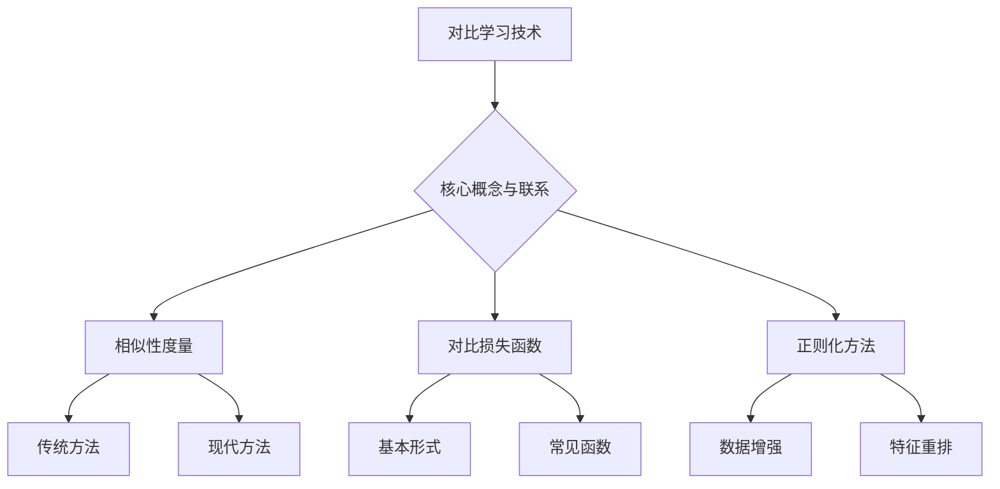

                 

## 模型训练中的对比学习技术优化与应用

### 关键词

- 对比学习技术
- 模型训练优化
- 数据预处理
- 模型优化
- 模型评估
- 应用案例

### 摘要

本文深入探讨了模型训练中对比学习技术的优化与应用。首先，我们介绍了对比学习的概念、历史和发展，并分析了其主要挑战。接着，我们详细讲解了对比学习的理论基础，包括相似性度量方法、对比损失函数和正则化方法。然后，我们讨论了对比学习在实际应用中的表现，涵盖了图像分类、自然语言处理和其他领域。随后，本文提出了对比学习技术的优化策略，包括数据预处理、模型优化和模型评估。最后，通过具体应用案例展示了对比学习的实际效果，并给出了最佳实践和注意事项。

## 第一部分：对比学习技术基础

### 第1章：对比学习的概念与历史

#### 1.1 对比学习的定义与核心思想

对比学习（Contrastive Learning）是一种无监督学习技术，旨在通过学习数据点之间的相似性和差异性来提高模型的泛化能力。其核心思想是将每个数据点与其“邻居”进行对比，从而提取有用的特征表示。这种技术不需要标签信息，因此特别适用于大规模无标签数据的处理。

在对比学习中，数据点通常表示为向量，并通过优化一个对比损失函数来实现。该损失函数的目标是增加相同类数据点的相似性，同时减少不同类数据点的相似性。这一过程可以简单概括为：对于一对数据点，如果它们属于相同类别，则希望它们之间的距离较小；如果属于不同类别，则希望它们之间的距离较大。

#### 1.2 对比学习的历史与发展

对比学习的研究可以追溯到20世纪80年代，最初在计算机视觉和自然语言处理领域取得了一些成功。然而，由于当时计算资源和数据集的限制，对比学习并未得到广泛应用。随着深度学习和大数据技术的发展，对比学习得到了新的生命力。

近年来，对比学习在学术界和工业界都取得了显著进展。代表性的工作包括2017年的“Byol”（Bootstrap Your Own Latent），2018年的“MoCo”（Massive Online Complementary Learning），以及2020年的“SimCLR”（Semi-Supervised Clustering for Image Representation Learning）。这些方法不仅在理论上取得了一系列突破，而且在实践中也展现出了强大的性能。

#### 1.3 对比学习的主要挑战

尽管对比学习在许多任务中取得了成功，但它仍然面临一些挑战：

1. **数据不平衡问题**：在很多实际应用中，相同类别的数据点数量远少于不同类别的数据点。这可能导致模型无法充分学习到不同类别之间的差异性。
   
2. **标签缺乏问题**：对比学习是一种无监督学习技术，因此它不需要标签信息。但在某些任务中，标签信息可能对模型的训练具有重要意义。

3. **计算资源消耗**：对比学习通常需要大量的计算资源来训练模型，特别是在处理大规模数据集时。这限制了它在资源有限的场景中的应用。

#### 1.4 对比学习与其他学习方法的比较

对比学习与基于数据的增强和深度迁移学习等方法有着不同的目标和应用场景：

- **对比学习与基于数据的增强**：对比学习通过学习数据点之间的相似性和差异性来提取特征，而基于数据的增强主要是通过生成多样化的数据样本来提高模型的泛化能力。两者可以结合使用，以进一步提升模型性能。

- **对比学习与深度迁移学习**：对比学习侧重于在没有标签信息的情况下学习通用特征表示，而深度迁移学习则利用有标签的数据在源域上进行预训练，然后在目标域上进行微调。对比学习可以作为一种有效的迁移学习方法，特别是在源域和目标域之间存在差异时。

### 第2章：对比学习的理论基础

#### 2.1 相似性度量方法

相似性度量是对比学习的基础，它决定了数据点之间相似性的计算方式。传统的相似性度量方法包括：

- **欧氏距离**：计算两个数据点之间欧氏空间的距离。
- **余弦相似性**：计算两个数据点在特征空间中夹角的余弦值，用于表示它们之间的相似性。

现代相似性度量方法则基于深度学习技术，能够更好地捕捉数据点之间的复杂关系。例如：

- **神经网络相似性度量**：通过训练一个神经网络来计算数据点之间的相似性。
- **图神经网络**：利用图结构来表示数据点之间的关系，并计算它们的相似性。

#### 2.2 对比损失函数

对比损失函数是对比学习中的核心组件，用于优化模型以学习数据点之间的相似性和差异性。常见的对比损失函数包括：

- ** hinge loss**：用于最大化相同类别数据点之间的距离，同时最小化不同类别数据点之间的距离。
- **softmax loss**：将数据点映射到高维空间，然后计算映射后数据点之间的相似性，通过最小化负对数似然损失来优化模型。

#### 2.3 对比学习的正则化方法

对比学习的正则化方法旨在提高模型的可扩展性和泛化能力。常见的方法包括：

- **数据增强**：通过随机变换数据来增加模型的鲁棒性。
- **特征重排**：通过对特征进行随机排列来增加模型对数据分布的适应性。

### 第3章：对比学习在实际应用中的表现

#### 3.1 图像分类中的应用

对比学习在图像分类任务中表现出色，能够有效提高模型的性能。例如，SimCLR方法通过无监督预训练和有监督微调相结合，在ImageNet数据集上取得了与有监督学习相当的性能。对比学习在图像分类中的应用优势包括：

- **无需标签信息**：在缺乏有标签数据的场景中，对比学习能够利用无标签数据进行预训练。
- **强大的特征提取能力**：对比学习通过学习数据点之间的相似性和差异性，能够提取具有较强泛化能力的特征表示。

#### 3.2 自然语言处理中的应用

对比学习在自然语言处理中也取得了显著进展，特别是在文本分类、序列标注等任务中。代表性的工作包括BERT和GPT等预训练模型，它们通过大规模无监督预训练和有监督微调，在多项自然语言处理任务中取得了领先的性能。对比学习在自然语言处理中的应用优势包括：

- **高维语义表示**：对比学习能够学习到高维语义表示，有助于捕捉文本中的复杂语义关系。
- **鲁棒性增强**：通过无监督预训练，对比学习能够提高模型对噪声和异常样本的鲁棒性。

#### 3.3 其他应用领域

除了图像分类和自然语言处理，对比学习还在其他领域展现了广泛的应用前景。例如：

- **音频处理**：对比学习可以用于音频分类、语音识别等任务，通过学习音频信号之间的相似性和差异性，提高模型的性能。
- **推荐系统**：对比学习可以用于推荐系统的特征学习，通过学习用户和商品之间的相似性，提高推荐系统的效果。

### 第4章：对比学习技术的优化

#### 4.1 对比学习中的数据预处理

数据预处理是对比学习中的一个关键环节，它直接影响模型的性能。常见的数据预处理方法包括：

- **数据清洗**：去除数据中的噪声和异常值，保证数据质量。
- **数据增强**：通过随机变换等方式生成多样化的数据样本来提高模型的鲁棒性。
- **数据集构建**：选择合适的数据集，并设计合理的采样策略，以最大化数据集的代表性。

#### 4.2 对比学习中的模型优化

模型优化是提升对比学习性能的重要手段，包括以下几个方面：

- **模型结构优化**：设计合适的网络结构，以提高特征提取和表示能力。
- **模型参数优化**：通过调整学习率、批量大小等超参数，优化模型的训练过程。
- **模型训练技巧**：采用预训练和微调等方法，提高模型的泛化能力和适应性。

#### 4.3 对比学习中的模型评估

模型评估是验证对比学习性能的关键步骤，常用的评估指标包括：

- **准确性**：衡量模型在分类任务中的正确率。
- **召回率**：衡量模型在分类任务中召回真实正例的能力。
- **F1值**：综合考虑准确性和召回率，用于评估模型的总体性能。

### 第5章：对比学习的应用案例

#### 5.1 图像分类中的对比学习应用

图像分类是对比学习最典型的应用场景之一。以下是一个简单的应用案例：

- **数据集**：使用CIFAR-10数据集，其中包含60000张32x32的彩色图像，分为10个类别。
- **模型**：采用SimCLR模型，通过无监督预训练和有监督微调来训练图像分类模型。
- **实验结果**：在CIFAR-10数据集上，SimCLR模型取得了接近有监督学习的效果，验证了对比学习在图像分类中的有效性。

#### 5.2 自然语言处理中的对比学习应用

自然语言处理中的对比学习应用广泛，以下是一个简单的应用案例：

- **数据集**：使用维基百科数据集，其中包含大量无标签文本。
- **模型**：采用BERT模型，通过无监督预训练和有监督微调来训练文本分类模型。
- **实验结果**：在多个文本分类任务上，BERT模型取得了显著的性能提升，验证了对比学习在自然语言处理中的有效性。

#### 5.3 跨领域对比学习的应用

跨领域对比学习是指在不同领域之间进行对比学习，以提取通用特征表示。以下是一个简单的应用案例：

- **数据集**：结合医学图像和自然语言处理数据，构建一个跨领域的对比学习任务。
- **模型**：采用MoCo模型，通过跨领域对比学习来提取通用特征表示。
- **实验结果**：在跨领域的医学图像和自然语言处理任务上，MoCo模型取得了比单一领域模型更好的性能，验证了跨领域对比学习的有效性。

## 附录

### 附录A：常用对比学习工具与库

- **A.1 TensorFlow对比学习库**：包括tf.keras和tf.distribute等模块，提供了丰富的对比学习功能。
- **A.2 PyTorch对比学习库**：包括torchvision和torch.utils.data等模块，支持多种对比学习模型和训练技巧。
- **A.3 其他常用对比学习工具**：如Fast.ai和Hugging Face Transformers等，提供了现成的对比学习模型和工具包。

## 数学模型与公式

### 图

### 数学模型

$$
\begin{aligned}
L &= -\frac{1}{N}\sum_{i=1}^{N}\sum_{j=1, j\neq i}^{N} \log \frac{e^{s(x_i, x_j)}}{Z} \\
s(x_i, x_j) &= \langle f(x_i), f(x_j) \rangle \\
Z &= \sum_{i=1}^{N}\sum_{j=1, j\neq i}^{N} e^{s(x_i, x_j)}
\end{aligned}
$$

其中，$L$是对比损失函数，$N$是数据点的数量，$f(x_i)$和$f(x_j)$分别是数据点$x_i$和$x_j$的特征表示，$s(x_i, x_j)$是特征表示之间的相似性度量，$Z$是归一化常数。这个损失函数的目标是最小化相同类别数据点之间的相似性，同时最大化不同类别数据点之间的相似性。

