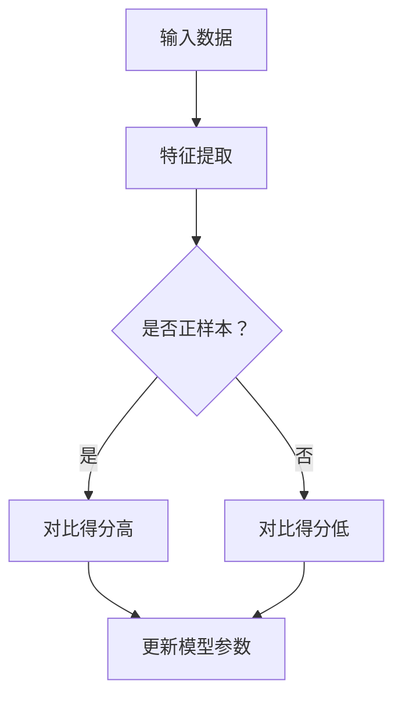

                 

# 模型训练中的对比学习技术创新与应用

## 关键词

- 对比学习
- 自监督学习
- 模型训练
- 特征提取
- 深度学习
- 自动化
- 泛化能力
- 应用场景

## 摘要

本文详细探讨了对比学习在模型训练中的应用及其技术创新。对比学习作为一种自监督学习方法，能够从无标签数据中自动提取有效特征，减少对大量标注数据的依赖。本文首先介绍了对比学习的背景和意义，然后深入分析了对比学习的基本原理和核心算法，随后展示了对比学习在多个应用场景中的具体应用，包括图像分类、自然语言处理、推荐系统和计算机视觉。最后，本文讨论了对比学习的前沿研究方向和发展趋势，并提出了未来可能的研究方向和应用前景。

---

## 目录

### 第1章 绪论
#### 1.1 对比学习的背景和意义
#### 1.2 对比学习的定义与基本原理
#### 1.3 对比学习的研究现状

### 第2章 对比学习基础
#### 2.1 特征表示学习
##### 2.1.1 自动特征提取方法
##### 2.1.2 对比损失函数

### 第3章 对比学习应用场景
#### 3.1 图像分类
##### 3.1.1 图像特征提取与分类
##### 3.1.2 在 ImageNet 数据集上的应用

#### 3.2 自然语言处理
##### 3.2.1 语言模型与文本分类
##### 3.2.2 BERT 模型
##### 3.2.3 GPT 模型

### 第4章 对比学习的算法优化
#### 4.1 算法改进
##### 4.1.1 对比损失函数的改进
##### 4.1.2 模型架构优化

### 第5章 对比学习在推荐系统中的应用
#### 5.1 用户兴趣建模
##### 5.1.1 用户行为数据的处理
##### 5.1.2 用户兴趣建模方法

#### 5.2 个性化推荐
##### 5.2.1 推荐算法实现
##### 5.2.2 个性化推荐案例分析

### 第6章 对比学习在计算机视觉中的应用
#### 6.1 视觉检测与识别
##### 6.1.1 目标检测算法
##### 6.1.2 图像识别算法

### 第7章 对比学习在自然语言处理中的应用
#### 7.1 文本分类与情感分析
##### 7.1.1 BERT 模型在文本分类中的应用
##### 7.1.2 实际应用案例分析

#### 7.2 语言生成与翻译
##### 7.2.1 GPT 模型在语言生成中的应用
##### 7.2.2 实际应用案例分析

#### 7.3 情感识别与对话系统
##### 7.3.1 对话系统的构建
##### 7.3.2 情感识别模块

### 第8章 对比学习的前沿研究方向与发展趋势
#### 8.1 对比学习的挑战与机遇
##### 8.1.1 数据集与标注问题
##### 8.1.2 模型泛化能力
##### 8.1.3 算法复杂度

#### 8.2 未来研究方向
##### 8.2.1 新的对比学习算法
##### 8.2.2 跨模态对比学习
##### 8.2.3 对比学习与其他技术的融合

### 结论
## 对比学习的技术创新与应用总结
## 对比学习的未来展望

---

## 第1章 绪论

### 1.1 对比学习的背景和意义

随着人工智能技术的快速发展，深度学习模型在图像分类、自然语言处理、推荐系统等领域取得了显著的成果。然而，这些模型通常需要大量的标注数据进行训练，这不仅增加了训练成本，也限制了模型的应用范围。特别是在数据获取困难或数据隐私保护的领域，标注数据的获取变得尤为困难。

对比学习（Contrastive Learning）作为一种自监督学习方法，提供了一种无需依赖大量标注数据的模型训练方式。其核心思想是利用模型自身的对比能力，从大量无标签数据中自动提取有效特征，从而提高模型的泛化能力和表现效果。

对比学习的背景可以追溯到深度学习的早期研究。传统的深度学习模型（如卷积神经网络）在训练时需要大量的有标签数据，这限制了模型的泛化能力。而对比学习通过设计合适的对比损失函数，使得模型在训练过程中能够自动区分样本的相似性和差异性，从而在一定程度上解决了有标签数据依赖的问题。

对比学习的意义主要体现在以下几个方面：

1. **减少对大量标注数据的依赖**：对比学习可以从无标签数据中自动提取特征，从而减少对大量标注数据的依赖，降低了模型训练成本。
2. **提高模型的泛化能力**：通过对样本的对比训练，模型能够更好地学习到数据的潜在特征，从而提高模型的泛化能力。
3. **扩展模型应用范围**：由于对比学习不依赖大量标注数据，它可以在数据获取困难或数据隐私保护的领域中得到广泛应用。
4. **提高训练效率**：对比学习模型在训练时不需要进行样本标注，从而减少了训练时间，提高了训练效率。

总之，对比学习作为一种自监督学习方法，在深度学习领域具有重要的研究和应用价值。它不仅为模型训练提供了一种新的思路，也为解决数据稀缺问题提供了有效的方法。

### 1.2 对比学习的定义与基本原理

对比学习（Contrastive Learning）是一种自监督学习方法，其核心思想是通过对比正样本和负样本来训练模型，从而提取出有效特征。对比学习的基本原理可以概括为以下几个步骤：

1. **特征提取**：首先，模型从输入数据中提取特征表示。这些特征表示可以是图像的像素值、文本的词向量，或者是任意形式的数据表示。

2. **样本对比**：然后，模型将提取到的特征表示进行对比，区分正样本和负样本。正样本通常是指具有相似性的样本，如同一类别的图像或相同主题的文本；负样本则是指具有差异性的样本，如不同类别的图像或不同主题的文本。

3. **对比损失函数**：为了衡量样本的对比效果，对比学习引入了对比损失函数。对比损失函数的目标是使得正样本的对比得分高于负样本的对比得分。常见的对比损失函数包括信息熵损失、余弦相似度损失等。

4. **模型训练**：最后，通过对比损失函数来训练模型。模型在训练过程中不断调整参数，以使得对比损失函数的值最小化，从而提高模型的对比能力。

对比学习的基本原理可以通过以下 Mermaid 流程图进行描述：



在上述流程中，A 表示输入数据，B 表示特征提取，C 表示判断是否为正样本，D 和 E 分别表示对比得分高和低，F 表示更新模型参数。

对比学习的核心概念包括：

1. **特征表示**：特征表示是对比学习的基础，它决定了模型能够从数据中提取到多少有效信息。不同的特征表示方法（如图像的卷积神经网络、文本的词向量等）会影响模型的对比效果。

2. **对比损失函数**：对比损失函数是对比学习的关键组成部分，它决定了模型在训练过程中如何调整参数以优化对比效果。不同的对比损失函数（如信息熵损失、余弦相似度损失等）有不同的优缺点，需要根据具体应用场景进行选择。

3. **正样本和负样本**：正样本和负样本的对比是对比学习的核心思想。正样本的对比得分应该高于负样本的对比得分，这样模型才能更好地学习到数据的潜在特征。

### 1.3 对比学习的研究现状

对比学习作为深度学习领域的一个重要研究方向，近年来得到了广泛关注和研究。目前，对比学习已经在多个应用场景中取得了显著的成果，包括图像分类、自然语言处理、推荐系统和计算机视觉等。

在图像分类领域，对比学习通过自动提取图像特征，大大提高了模型的泛化能力和表现效果。例如，在 ImageNet 数据集上，基于对比学习的模型已经达到了与有监督学习模型相近的分类效果。

在自然语言处理领域，对比学习通过自动提取文本特征，为语言模型的训练提供了新的思路。例如，BERT 模型和 GPT 模型等基于对比学习的语言模型，在文本分类、语言生成和翻译等任务中表现出了优异的性能。

在推荐系统领域，对比学习通过自动提取用户兴趣特征，提高了个性化推荐的准确性。例如，基于对比学习的推荐算法已经在电商、新闻推荐等领域得到了广泛应用。

在计算机视觉领域，对比学习为视觉检测、识别和分割等任务提供了新的方法。例如，基于对比学习的目标检测算法和图像识别算法在多个数据集上取得了显著的效果。

总体来说，对比学习在模型训练中的应用已经取得了显著的研究成果，并在多个领域展现了良好的应用前景。然而，对比学习仍然面临一些挑战，如数据集与标注问题、模型泛化能力、算法复杂度等。未来，对比学习的研究将更加深入，探索新的算法和优化方法，以进一步推动深度学习技术的发展。

---

## 第2章 对比学习基础

### 2.1 特征表示学习

特征表示学习是对比学习的基础，它决定了模型能否从数据中提取到有效的特征。特征表示学习可以分为自动特征提取方法和对比损失函数两部分进行探讨。

#### 2.1.1 自动特征提取方法

自动特征提取方法是指通过神经网络等机器学习模型，从原始数据中自动提取出具有区分性的特征表示。常见的自动特征提取方法包括卷积神经网络（CNN）、循环神经网络（RNN）和图卷积网络（GCN）。

##### 2.1.1.1 卷积神经网络（CNN）

卷积神经网络（CNN）是一种专门用于处理图像数据的神经网络结构，它通过卷积层和池化层等操作，自动提取图像的局部特征和全局特征。CNN 在图像分类、目标检测和图像分割等领域取得了显著的应用成果。

以下是一个简单的 CNN 模型的 Python 代码实现：

```python
import tensorflow as tf
from tensorflow.keras.models import Sequential
from tensorflow.keras.layers import Conv2D, MaxPooling2D, Flatten, Dense

model = Sequential([
    Conv2D(32, (3, 3), activation='relu', input_shape=(28, 28, 1)),
    MaxPooling2D((2, 2)),
    Conv2D(64, (3, 3), activation='relu'),
    MaxPooling2D((2, 2)),
    Flatten(),
    Dense(128, activation='relu'),
    Dense(10, activation='softmax')
])

model.compile(optimizer='adam', loss='categorical_crossentropy', metrics=['accuracy'])
model.fit(x_train, y_train, epochs=10, batch_size=32)
```

在这个例子中，我们使用 TensorFlow 库构建了一个简单的 CNN 模型，用于对手写数字（MNIST）数据集进行分类。模型包含两个卷积层、两个池化层和一个全连接层，最终输出一个 10 维的 Softmax 层，用于对数字进行分类。

##### 2.1.1.2 循环神经网络（RNN）

循环神经网络（RNN）是一种适用于处理序列数据的神经网络结构，它通过重复利用隐状态，实现了对序列数据的处理和记忆能力。RNN 在自然语言处理、语音识别和时间序列分析等领域取得了显著的应用成果。

以下是一个简单的 RNN 模型的 Python 代码实现：

```python
import tensorflow as tf
from tensorflow.keras.models import Sequential
from tensorflow.keras.layers import LSTM, Dense

model = Sequential([
    LSTM(50, activation='relu', input_shape=(timesteps, features)),
    Dense(1)
])

model.compile(optimizer='adam', loss='mse')
model.fit(x_train, y_train, epochs=100, batch_size=32)
```

在这个例子中，我们使用 TensorFlow 库构建了一个简单的 RNN 模型，用于对时间序列数据进行回归分析。模型包含一个 LSTM 层和一个全连接层，用于对时间序列数据进行建模和预测。

##### 2.1.1.3 图卷积网络（GCN）

图卷积网络（GCN）是一种适用于处理图结构数据的神经网络结构，它通过图卷积操作，实现了对图结构数据的特征提取和表示学习。GCN 在社交网络分析、推荐系统和知识图谱等领域取得了显著的应用成果。

以下是一个简单的 GCN 模型的 Python 代码实现：

```python
import tensorflow as tf
from tensorflow.keras.layers import Input, Embedding, Dot, Dropout, Flatten, Dense
from tensorflow.keras.models import Model

input_node = Input(shape=(num_nodes,))
embed = Embedding(num_nodes, embedding_size)(input_node)
embed = Dropout(dropout_rate)(embed)
h = Dot(axes=1)([embed, embed])
h = Flatten()(h)
output_node = Dense(num_classes, activation='softmax')(h)

model = Model(inputs=input_node, outputs=output_node)
model.compile(optimizer='adam', loss='categorical_crossentropy', metrics=['accuracy'])
model.fit(x_train, y_train, epochs=10, batch_size=32)
```

在这个例子中，我们使用 TensorFlow 库构建了一个简单的 GCN 模型，用于对图结构数据进行分类。模型包含一个嵌入层、一个图卷积层、一个dropout 层和一个全连接层，用于对图结构数据进行建模和分类。

#### 2.1.2 对比损失函数

对比损失函数是对比学习的关键组成部分，它决定了模型在训练过程中如何优化对比效果。常见的对比损失函数包括特征匹配损失和负采样损失。

##### 2.1.2.1 特征匹配损失

特征匹配损失是一种基于特征相似度的损失函数，它通过最大化正样本的特征相似度和最小化负样本的特征相似度来训练模型。常见的特征匹配损失函数包括信息熵损失和余弦相似度损失。

以下是一个简单的特征匹配损失函数的 Python 代码实现：

```python
import tensorflow as tf

def contrastive_loss(y_true, y_pred):
    pos_loss = tf.reduce_mean(tf.nn.softmax_cross_entropy_with_logits(logits=y_pred[:, 0], labels=tf.ones_like(y_pred[:, 0]))
    neg_loss = tf.reduce_mean(tf.nn.softmax_cross_entropy_with_logits(logits=y_pred[:, 1:], labels=tf.zeros_like(y_pred[:, 1:])))
    return pos_loss + neg_loss

model.compile(optimizer='adam', loss=contrastive_loss, metrics=['accuracy'])
model.fit(x_train, y_train, epochs=10, batch_size=32)
```

在这个例子中，我们使用 TensorFlow 库构建了一个简单的特征匹配损失函数，用于对比学习模型的训练。模型在训练过程中通过计算正样本和负样本的特征相似度，优化模型参数，提高对比效果。

##### 2.1.2.2 负采样损失

负采样损失是一种简化特征匹配损失的损失函数，它通过随机选择负样本，优化模型参数，提高对比效果。常见的负采样损失函数包括 Hinge 损失和 Softmax 损失。

以下是一个简单的负采样损失函数的 Python 代码实现：

```python
import tensorflow as tf

def negative_sampling_loss(y_true, y_pred):
    pos_loss = tf.reduce_mean(tf.nn.sigmoid_cross_entropy_with_logits(logits=y_pred[:, 0], labels=tf.ones_like(y_pred[:, 0])))
    neg_loss = tf.reduce_mean(tf.nn.sigmoid_cross_entropy_with_logits(logits=y_pred[:, 1:], labels=tf.zeros_like(y_pred[:, 1:])))
    return pos_loss + neg_loss

model.compile(optimizer='adam', loss=negative_sampling_loss, metrics=['accuracy'])
model.fit(x_train, y_train, epochs=10, batch_size=32)
```

在这个例子中，我们使用 TensorFlow 库构建了一个简单的负采样损失函数，用于对比学习模型的训练。模型在训练过程中通过随机选择负样本，优化模型参数，提高对比效果。

### 2.2 对比学习的基础原理

对比学习（Contrastive Learning）是一种自监督学习方法，通过对比正样本和负样本来训练模型，从而提取出有效特征。对比学习的基本原理可以概括为以下几个步骤：

1. **特征提取**：首先，模型从输入数据中提取特征表示。这些特征表示可以是图像的像素值、文本的词向量，或者是任意形式的数据表示。

2. **样本对比**：然后，模型将提取到的特征表示进行对比，区分正样本和负样本。正样本通常是指具有相似性的样本，如同一类别的图像或相同主题的文本；负样本则是指具有差异性的样本，如不同类别的图像或不同主题的文本。

3. **对比损失函数**：为了衡量样本的对比效果，对比学习引入了对比损失函数。对比损失函数的目标是使得正样本的对比得分高于负样本的对比得分。常见的对比损失函数包括信息熵损失、余弦相似度损失等。

4. **模型训练**：最后，通过对比损失函数来训练模型。模型在训练过程中不断调整参数，以使得对比损失函数的值最小化，从而提高模型的对比能力。

#### 对比学习的核心概念

1. **特征表示**：特征表示是对比学习的基础，它决定了模型能否从数据中提取到多少有效信息。不同的特征表示方法（如图像的卷积神经网络、文本的词向量等）会影响模型的对比效果。

2. **对比损失函数**：对比损失函数是对比学习的关键组成部分，它决定了模型在训练过程中如何调整参数以优化对比效果。不同的对比损失函数（如信息熵损失、余弦相似度损失等）有不同的优缺点，需要根据具体应用场景进行选择。

3. **正样本和负样本**：正样本和负样本的对比是对比学习的核心思想。正样本的对比得分应该高于负样本的对比得分，这样模型才能更好地学习到数据的潜在特征。

#### 对比学习的工作流程

1. **数据预处理**：首先，对输入数据进行预处理，如图像的归一化、文本的编码等，以便模型能够更好地进行特征提取。

2. **特征提取**：使用自动特征提取方法（如卷积神经网络、循环神经网络等）对预处理后的数据进行特征提取，得到特征表示。

3. **样本对比**：将提取到的特征表示进行对比，区分正样本和负样本。可以使用对比损失函数（如信息熵损失、余弦相似度损失等）来衡量对比效果。

4. **模型训练**：通过对比损失函数来训练模型。模型在训练过程中不断调整参数，以使得对比损失函数的值最小化，从而提高模型的对比能力。

5. **模型评估**：使用测试数据集对训练好的模型进行评估，以验证模型的泛化能力和表现效果。

通过上述工作流程，对比学习可以从无标签数据中自动提取有效特征，从而提高模型的泛化能力和表现效果。在接下来的章节中，我们将进一步探讨对比学习在不同应用场景中的具体应用。

### 2.3 对比学习算法的改进

在对比学习的研究过程中，为了提高模型的性能和泛化能力，研究者们提出了多种算法改进方法。这些改进方法主要包括对比损失函数的改进、模型架构的优化以及训练过程的优化。以下将详细介绍几种常见的改进方法。

#### 2.3.1 对比损失函数的改进

对比损失函数是对比学习的核心组成部分，其性能直接影响到模型的训练效果。以下介绍几种改进的对比损失函数：

1. **温

