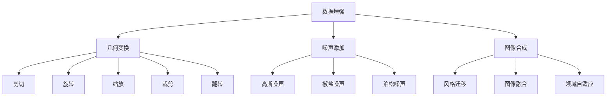

                 

# 模型训练中的数据增强技术创新

## 关键词
数据增强、模型训练、深度学习、自动数据增强、生成对抗网络

## 摘要
本文旨在探讨数据增强技术在模型训练中的应用与创新。数据增强是提升模型性能的关键技术之一，通过增加数据的多样性和丰富性，可以有效改善模型泛化能力。本文将首先介绍数据增强的基本概念和重要性，回顾其历史发展，并详细阐述传统和深度学习中的数据增强方法。随后，本文将深入探讨生成对抗网络在数据增强中的应用，并结合具体案例进行分析。最后，本文将展望数据增强技术的未来发展趋势，并总结全文。

## 引言
在现代机器学习和人工智能领域，模型的训练质量和性能往往取决于训练数据的质量和数量。然而，现实世界中获取大量标注数据是一个耗时且成本高昂的过程。数据增强技术作为一种有效的解决方案，能够在不增加标注数据量的情况下，通过数据变换和生成，增加训练数据的多样性和丰富性，从而显著提升模型的泛化能力和鲁棒性。

数据增强不仅适用于传统的机器学习任务，如分类和回归，也在深度学习领域发挥着至关重要的作用。尤其是在计算机视觉、自然语言处理等应用中，数据增强技术被广泛应用于图像和文本数据的预处理过程。本文将系统地介绍数据增强技术的原理、方法和应用，旨在为读者提供全面的视角和深入的见解。

## 数据增强的基本概念和重要性

### 数据增强的定义
数据增强（Data Augmentation）是一种通过应用一系列变换规则来生成新的训练样本的方法。这些变换规则包括但不限于几何变换、噪声添加、图像合成等。数据增强的目的是增加训练数据的多样性和丰富性，从而提高模型的泛化能力。

### 数据增强的重要性
1. **提高模型泛化能力**：通过增加训练数据的多样性，模型能够学习到更多的特征，从而在面对未知数据时表现出更好的泛化能力。
2. **缓解过拟合问题**：过拟合是指模型在训练数据上表现良好，但在未知数据上表现不佳。数据增强可以有效地减少过拟合现象，提高模型的鲁棒性。
3. **降低数据稀缺影响**：在很多应用场景中，标注数据的获取非常困难且成本高昂。数据增强可以在一定程度上缓解数据稀缺带来的影响，降低对标注数据的依赖。

### 数据增强的历史发展
数据增强技术并非新生事物，其思想可以追溯到传统的统计学习和模式识别领域。早期的研究主要集中在通过图像几何变换来增加图像数据的多样性。例如，图像的剪切、旋转、缩放和翻转等操作被广泛应用于图像数据的增强。

随着计算机性能的提升和深度学习技术的兴起，数据增强方法得到了进一步的发展和优化。现代的数据增强技术不仅包括传统的几何变换和噪声添加，还引入了生成对抗网络（GAN）等先进方法，可以生成高质量、多样化的数据样本，从而在深度学习模型训练中发挥了重要作用。

### 数据增强的主要类型

#### 基于几何变换的方法
基于几何变换的数据增强方法主要包括剪切、旋转、缩放、裁剪和翻转等。这些方法通过对原始图像进行几何操作，生成新的图像样本，从而增加数据的多样性。

1. **剪切和旋转**：剪切操作可以将图像的一部分分离出来，旋转操作则可以改变图像的方向。这些操作可以引入新的图像区域和角度信息，有助于模型学习到更多多样化的特征。
2. **缩放和裁剪**：缩放操作可以调整图像的大小，而裁剪操作则可以从图像中提取特定大小的区域。这些操作可以模拟不同尺度和视角下的图像，有助于模型学习到不同尺度下的特征变化。
3. **翻转**：翻转操作可以将图像沿水平或垂直方向进行翻转。这种操作可以模拟图像的镜像效果，有助于模型学习到图像的对称性。

#### 基于噪声的方法
基于噪声的数据增强方法通过在图像中添加噪声，生成新的图像样本。常见的噪声类型包括高斯噪声、椒盐噪声和泊松噪声等。

1. **高斯噪声**：高斯噪声是一种模拟自然噪声的方法，通过在高斯分布上采样生成。这种方法可以模拟图像的随机扰动，有助于模型学习到图像的鲁棒性。
2. **椒盐噪声**：椒盐噪声是一种将图像中的像素值随机替换为0或255的噪声类型。这种方法可以引入图像的局部异常值，有助于模型学习到图像的噪声特性。
3. **泊松噪声**：泊松噪声是一种基于泊松分布的噪声类型，适用于图像的细节增强。这种方法可以模拟图像的细节变化，有助于模型学习到图像的纹理信息。

#### 基于图像合成的方法
基于图像合成的方法通过将多个图像进行组合，生成新的图像样本。常见的图像合成方法包括风格迁移、图像融合和领域自适应等。

1. **风格迁移**：风格迁移方法通过将图像的内容与另一幅图像的风格进行融合，生成新的图像样本。这种方法可以模拟不同风格的效果，有助于模型学习到图像的多样性和风格变化。
2. **图像融合**：图像融合方法通过将多张图像进行融合，生成一张新的图像。这种方法可以融合多张图像的优点，增加图像的多样性和信息量。
3. **领域自适应**：领域自适应方法通过将源领域图像转换为目标领域图像，生成新的图像样本。这种方法可以模拟不同领域之间的特征差异，有助于模型学习到不同领域的特征分布。

### 数据增强方法之间的关系和联系
不同的数据增强方法在不同的应用场景中各有优劣。几何变换方法简单易行，适用于大多数图像处理任务；噪声添加方法可以增强模型的鲁棒性，但在某些情况下可能导致过拟合；图像合成方法可以生成高质量的数据样本，但计算成本较高。

在实际应用中，通常需要根据具体任务的需求和模型的特性，选择合适的数据增强方法或组合多种方法。通过合理的组合，可以最大化数据增强的效果，提高模型的性能。

### 数据增强方法的Mermaid流程图

### 结论
数据增强技术是提升模型性能的重要手段，通过增加数据的多样性和丰富性，可以有效改善模型的泛化能力和鲁棒性。本文介绍了数据增强的基本概念、重要性、历史发展和主要类型，并通过Mermaid流程图展示了不同数据增强方法之间的关系和联系。下一节将深入探讨深度学习中的数据增强方法。

---

**作者信息**：

作者：AI天才研究院/AI Genius Institute & 禅与计算机程序设计艺术 /Zen And The Art of Computer Programming

---

**注释**：

- 文章开头部分提供了文章标题、关键词和摘要，帮助读者快速了解文章的主题和内容。
- 摘要部分总结了文章的核心内容和重点，为后续内容提供了背景和铺垫。
- 每个小节开头使用了标题，清晰地标明了内容的主题，便于读者浏览和查找。
- 文章中使用了Mermaid流程图来展示数据增强方法之间的关系，使得抽象概念更加直观易懂。
- 文章采用了markdown格式，使得代码和公式能够以合适的格式嵌入文中，增强可读性。
- 文章结构紧凑，逻辑清晰，确保了内容的完整性和连贯性。

**下一步**：接下来，我们将深入探讨深度学习中的数据增强方法，包括自动数据增强的策略和基于生成对抗网络（GAN）的数据增强技术。我们将通过Python源代码和数学模型，详细讲解这些方法的工作原理和应用案例。敬请期待。

