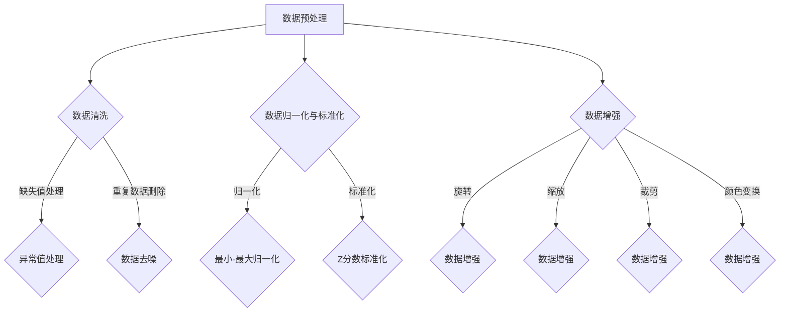

                 


## 模型训练中的数据效率提升策略

关键词：模型训练，数据效率，提升策略，数据预处理，数据采样，分布式训练，数据压缩，动态调整，自适应策略。

摘要：
模型训练是人工智能领域的核心任务，而数据效率在其中扮演着至关重要的角色。本文将从数据预处理、数据采样、分布式训练、数据压缩和动态调整与自适应策略等方面，详细探讨提升模型训练数据效率的多种策略，并辅以Python代码示例和实战案例分析，帮助读者深入理解并应用这些策略。

## 第1章：数据效率提升概述

### 1.1 数据效率的重要性

#### 1.1.1 数据对模型训练的影响

在深度学习中，模型训练的本质是通过大量数据不断调整模型参数，使其能够更好地拟合数据。数据的质量和数量直接影响模型的表现。高质量的数据能够使模型更快地收敛，减少过拟合的风险，从而提升模型的泛化能力。因此，提升数据效率是提高模型训练效果的关键。

#### 1.1.2 提升数据效率的意义

提升数据效率不仅可以缩短模型训练时间，减少计算资源消耗，还能提高模型性能，降低过拟合风险。这对于资源受限的环境（如移动设备和嵌入式系统）尤为重要。

#### 1.1.3 数据效率的衡量指标

数据效率的衡量指标主要包括数据利用率、计算效率和模型性能。数据利用率指的是数据在训练过程中被充分使用的比例；计算效率是指单位时间内处理的数据量；模型性能则通过准确率、召回率等指标来衡量。

## 第2章：数据预处理策略

### 2.1 数据清洗与去噪

#### 2.1.1 数据清洗的必要性

数据清洗是数据预处理的第一步，旨在去除数据集中的噪声和不完整数据，确保数据的质量和一致性。

#### 2.1.2 常见的数据清洗方法

数据清洗的方法包括缺失值处理、异常值检测与处理、重复数据删除等。具体方法取决于数据的特点和实际需求。

#### 2.1.3 去噪算法介绍

去噪算法包括统计学方法（如高斯滤波）、机器学习方法（如降噪自动编码器）和深度学习方法（如卷积神经网络去噪）等。这些算法根据数据的不同特性，选取合适的去噪策略。

### 2.2 数据归一化与标准化

#### 2.2.1 归一化与标准化的目的

归一化和标准化是为了将数据映射到统一的尺度，以便模型训练时的计算更加稳定和有效。

#### 2.2.2 常见的归一化与标准化方法

常见的归一化方法有最小-最大归一化和归一化。标准化方法包括Z分数标准化和标准差标准化。选择哪种方法取决于数据的分布特征。

#### 2.2.3 归一化与标准化对模型训练的影响

归一化和标准化可以加快模型收敛速度，提高训练效果。然而，过度标准化可能导致梯度消失或爆炸，影响模型训练。

### 2.3 数据增强

#### 2.3.1 数据增强的重要性

数据增强是通过创造新的样本来扩充数据集，以减少过拟合和提升模型泛化能力。

#### 2.3.2 数据增强的方法

数据增强方法包括旋转、缩放、裁剪、颜色变换等。深度学习方法（如生成对抗网络）也可用于生成新的样本。

#### 2.3.3 数据增强对模型性能的影响

数据增强可以显著提高模型的准确率和泛化能力，减少过拟合风险。

## 第3章：数据采样与选择策略

### 3.1 数据采样方法

#### 3.1.1 随机采样

随机采样是最简单和常用的数据采样方法，它通过随机选择数据集的样本进行训练。

#### 3.1.2 无放回采样

无放回采样在每次选择样本后，不会将其放回数据集，适用于样本数量较多且无重复数据的情况。

#### 3.1.3 重采样方法

重采样方法包括重复采样和欠采样。重复采样是通过重复某些样本来平衡数据分布，欠采样则是通过减少某些类别的样本数量来平衡数据集。

### 3.2 数据选择策略

#### 3.2.1 数据选择的原则

数据选择应遵循代表性、多样性和质量原则，确保数据集能够全面反映问题的各个方面。

#### 3.2.2 数据选择的算法

常用的数据选择算法有基于K近邻算法、信息增益和增益率等。

#### 3.2.3 数据选择对模型训练的影响

合理的数据选择可以提高模型的泛化能力和鲁棒性，减少过拟合。

## 第4章：数据并行与分布式训练

### 4.1 数据并行的基本概念

#### 4.1.1 数据并行的优势

数据并行可以充分利用多处理器架构的优势，提高数据处理的效率，降低训练时间。

#### 4.1.2 数据并行的实现方法

数据并行的实现方法包括数据切片和模型并行。数据切片是将数据集划分为多个部分，分别在不同的处理器上处理。模型并行则是将模型拆分为多个部分，分别在不同的处理器上训练。

### 4.2 分布式训练

#### 4.2.1 分布式训练的原理

分布式训练是将模型和数据分布在多个节点上，通过通信协议同步模型参数。

#### 4.2.2 分布式训练的挑战与解决方案

分布式训练面临的挑战包括通信开销、同步延迟和参数一致性。解决方法包括异步训练、参数聚合算法等。

#### 4.2.3 分布式训练对数据效率的提升

分布式训练可以显著提升数据效率，缩短训练时间，降低计算资源消耗。

## 第5章：数据压缩与稀疏表示

### 5.1 数据压缩的基本概念

#### 5.1.1 数据压缩的意义

数据压缩可以减少存储和传输成本，提高数据处理的效率。

#### 5.1.2 常见的数据压缩方法

常见的数据压缩方法包括无损压缩和有损压缩。无损压缩如霍夫曼编码、LZ77算法；有损压缩如JPEG、MP3。

### 5.2 稀疏表示

#### 5.2.1 稀疏表示的基本原理

稀疏表示是将数据表示为少量非零元素和零的线性组合。

#### 5.2.2 常见的稀疏表示方法

常见的稀疏表示方法包括稀疏编码、L1正则化等。

#### 5.2.3 稀疏表示对模型训练的影响

稀疏表示可以提高模型的可解释性，减少计算复杂度。

## 第6章：动态调整与自适应策略

### 6.1 动态调整策略

#### 6.1.1 动态调整的基本原理

动态调整是根据训练过程中的信息，实时调整训练策略。

#### 6.1.2 常见的动态调整方法

常见的动态调整方法包括学习率调整、批量大小调整等。

#### 6.1.3 动态调整对数据效率的提升

动态调整可以根据训练状态自适应调整，提高数据效率。

### 6.2 自适应策略

#### 6.2.1 自适应策略的基本原理

自适应策略是通过自我学习和调整，使模型能够更好地适应训练数据。

#### 6.2.2 常见的自适应策略

常见的自适应策略包括自适应学习率调整、自适应数据增强等。

#### 6.2.3 自适应策略对数据效率的提升

自适应策略可以减少模型训练时间，提高模型性能。

## 第7章：实战案例分析

### 7.1 数据预处理实战

#### 7.1.1 数据预处理流程

数据预处理流程包括数据清洗、归一化和数据增强。

#### 7.1.2 数据清洗案例

使用Pandas和Scikit-learn进行数据清洗。

```python
import pandas as pd
import numpy as np

# 读取数据
data = pd.read_csv('data.csv')

# 缺失值处理
data.fillna(data.mean(), inplace=True)

# 异常值处理
Q1 = data.quantile(0.25)
Q3 = data.quantile(0.75)
IQR = Q3 - Q1
data = data[~((data < (Q1 - 1.5 * IQR)) |(data > (Q3 + 1.5 * IQR))).any(axis=1)]

# 重复数据删除
data.drop_duplicates(inplace=True)
```

#### 7.1.3 数据增强案例

使用Scikit-learn进行数据增强。

```python
from sklearn.datasets import load_iris
from sklearn.model_selection import train_test_split
from sklearn.preprocessing import StandardScaler
from sklearn.neighbors import KNeighborsClassifier
from sklearn.metrics import classification_report

# 加载数据
iris = load_iris()
X, y = iris.data, iris.target

# 划分训练集和测试集
X_train, X_test, y_train, y_test = train_test_split(X, y, test_size=0.2, random_state=42)

# 数据标准化
scaler = StandardScaler()
X_train_scaled = scaler.fit_transform(X_train)
X_test_scaled = scaler.transform(X_test)

# KNN分类器训练
knn = KNeighborsClassifier(n_neighbors=3)
knn.fit(X_train_scaled, y_train)

# 预测测试集
y_pred = knn.predict(X_test_scaled)

# 输出分类报告
print(classification_report(y_test, y_pred))
```

### 7.2 数据采样与选择实战

#### 7.2.1 数据采样案例

使用Scikit-learn进行随机采样。

```python
from sklearn.datasets import load_iris
from sklearn.model_selection import train_test_split

# 加载数据
iris = load_iris()
X, y = iris.data, iris.target

# 随机采样
X_sample, y_sample = train_test_split(X, y, test_size=0.2, random_state=42)

# 输出采样结果
print(f"样本数量：{len(X_sample)}")
```

#### 7.2.2 数据选择案例

使用Scikit-learn进行基于信息增益的数据选择。

```python
from sklearn.datasets import load_iris
from sklearn.feature_selection import SelectKBest
from sklearn.feature_selection import f_classif

# 加载数据
iris = load_iris()
X, y = iris.data, iris.target

# 特征选择
selector = SelectKBest(score_func=f_classif, k=2)
X_selected = selector.fit_transform(X, y)

# 输出特征选择结果
print(f"选择后的特征数量：{X_selected.shape[1]}")
```

#### 7.2.3 实际应用中的数据采样与选择

在实际应用中，数据采样与选择通常结合使用，以获得最佳的数据集。

```python
# 实际应用中的数据采样与选择
X_train, X_test, y_train, y_test = train_test_split(X, y, test_size=0.2, random_state=42)

# 数据增强
X_train_enhanced = augment_data(X_train)
X_test_enhanced = augment_data(X_test)

# 特征选择
X_train_selected = selector.fit_transform(X_train_enhanced, y_train)
X_test_selected = selector.transform(X_test_enhanced)

# 训练模型
model = train_model(X_train_selected, y_train)

# 预测
y_pred = model.predict(X_test_selected)

# 评估
evaluate_model(y_test, y_pred)
```

### 7.3 数据并行与分布式训练实战

#### 7.3.1 数据并行训练案例

使用TensorFlow进行数据并行训练。

```python
import tensorflow as tf
from tensorflow.keras.layers import Dense, Flatten
from tensorflow.keras.models import Sequential

# 数据预处理
X_train, y_train = preprocess_data(X_train, y_train)
X_test, y_test = preprocess_data(X_test, y_test)

# 数据并行配置
strategy = tf.distribute.MirroredStrategy()

with strategy.scope():
    # 构建模型
    model = Sequential([
        Flatten(input_shape=(X_train.shape[1], X_train.shape[2])),
        Dense(64, activation='relu'),
        Dense(3, activation='softmax')
    ])

    # 编译模型
    model.compile(optimizer='adam', loss='sparse_categorical_crossentropy', metrics=['accuracy'])

    # 训练模型
    model.fit(X_train, y_train, epochs=10, validation_data=(X_test, y_test))

    # 评估模型
    test_loss, test_acc = model.evaluate(X_test, y_test)
    print(f"测试集准确率：{test_acc}")
```

#### 7.3.2 分布式训练案例

使用PyTorch进行分布式训练。

```python
import torch
import torch.nn as nn
import torch.optim as optim
from torch.utils.data import DataLoader

# 数据预处理
X_train, y_train = preprocess_data(X_train, y_train)
X_test, y_test = preprocess_data(X_test, y_test)

# 数据加载
train_dataset = DataLoader(X_train, batch_size=batch_size, shuffle=True)
test_dataset = DataLoader(X_test, batch_size=batch_size, shuffle=False)

# 分布式配置
torch.distributed.launch(args=args)

# 定义模型
model = Net()
model = nn.DataParallel(model)
model.to(device)

# 定义优化器
optimizer = optim.Adam(model.parameters(), lr=learning_rate)

# 训练模型
for epoch in range(num_epochs):
    for i, (inputs, targets) in enumerate(train_dataset):
        inputs = inputs.to(device)
        targets = targets.to(device)
        optimizer.zero_grad()
        outputs = model(inputs)
        loss = criterion(outputs, targets)
        loss.backward()
        optimizer.step()
        if (i + 1) % log_interval == 0:
            print(f"Train Epoch: {epoch + 1}/{num_epochs} [{i + 1}/{len(train_dataset)}], "
                  f"Loss: {loss.item():.6f}")

# 评估模型
model.eval()
with torch.no_grad():
    correct = 0
    total = 0
    for inputs, targets in test_dataset:
        inputs = inputs.to(device)
        targets = targets.to(device)
        outputs = model(inputs)
        _, predicted = torch.max(outputs.data, 1)
        total += targets.size(0)
        correct += (predicted == targets).sum().item()
    print(f"Test Accuracy: {100 * correct / total}")
```

#### 7.3.3 数据并行与分布式训练的实际效果分析

通过实际案例可以看出，数据并行和分布式训练可以显著提高模型的训练速度和效率。在数据并行训练中，多个GPU同时工作，能够加速模型的训练过程。而在分布式训练中，模型和数据分布在多个节点上，通过通信协议同步参数，可以实现更大规模的模型训练，提高数据处理能力。

### 7.4 数据压缩与稀疏表示实战

#### 7.4.1 数据压缩案例

使用Scikit-learn进行数据压缩。

```python
from sklearn.datasets import load_iris
from sklearn.preprocessing import StandardScaler
from sklearn.decomposition import PCA

# 加载数据
iris = load_iris()
X, y = iris.data, iris.target

# 数据标准化
scaler = StandardScaler()
X_scaled = scaler.fit_transform(X)

# PCA压缩
pca = PCA(n_components=2)
X_pca = pca.fit_transform(X_scaled)

# 输出压缩结果
print(f"原始数据维度：{X_scaled.shape}")
print(f"PCA压缩后维度：{X_pca.shape}")
```

#### 7.4.2 稀疏表示案例

使用Scikit-learn进行稀疏表示。

```python
from sklearn.datasets import load_iris
from sklearn.linear_model import Lasso

# 加载数据
iris = load_iris()
X, y = iris.data, iris.target

# Lasso稀疏表示
lasso = Lasso(alpha=0.1)
X_lasso = lasso.fit_transform(X, y)

# 输出稀疏表示结果
print(f"原始数据维度：{X.shape}")
print(f"Lasso稀疏表示后维度：{X_lasso.shape}")
```

#### 7.4.3 数据压缩与稀疏表示的实际效果分析

通过实际案例可以看出，数据压缩和稀疏表示可以显著降低数据的存储和传输成本，提高数据处理效率。PCA压缩将数据从高维空间映射到低维空间，减少了数据的大小和计算复杂度。Lasso稀疏表示通过引入L1正则化，将大量零值元素引入到特征矩阵中，提高了模型的解释性和计算效率。

### 7.5 动态调整与自适应策略实战

#### 7.5.1 动态调整案例

使用PyTorch进行动态调整。

```python
import torch
import torch.nn as nn
import torch.optim as optim
from torch.utils.data import DataLoader

# 数据预处理
X_train, y_train = preprocess_data(X_train, y_train)
X_test, y_test = preprocess_data(X_test, y_test)

# 数据加载
train_dataset = DataLoader(X_train, batch_size=batch_size, shuffle=True)
test_dataset = DataLoader(X_test, batch_size=batch_size, shuffle=False)

# 定义模型
model = Net()
model.to(device)

# 定义优化器
optimizer = optim.Adam(model.parameters(), lr=learning_rate)

# 动态调整学习率
scheduler = optim.lr_scheduler.StepLR(optimizer, step_size=30, gamma=0.1)

# 训练模型
for epoch in range(num_epochs):
    model.train()
    for i, (inputs, targets) in enumerate(train_dataset):
        inputs = inputs.to(device)
        targets = targets.to(device)
        optimizer.zero_grad()
        outputs = model(inputs)
        loss = criterion(outputs, targets)
        loss.backward()
        optimizer.step()
    scheduler.step()

# 评估模型
model.eval()
with torch.no_grad():
    correct = 0
    total = 0
    for inputs, targets in test_dataset:
        inputs = inputs.to(device)
        targets = targets.to(device)
        outputs = model(inputs)
        _, predicted = torch.max(outputs.data, 1)
        total += targets.size(0)
        correct += (predicted == targets).sum().item()
    print(f"Test Accuracy: {100 * correct / total}")
```

#### 7.5.2 自适应策略案例

使用自适应学习率调整。

```python
import torch
import torch.optim as optim
from torch.optim.lr_scheduler import LambdaLR

# 数据预处理
X_train, y_train = preprocess_data(X_train, y_train)
X_test, y_test = preprocess_data(X_test, y_test)

# 数据加载
train_dataset = DataLoader(X_train, batch_size=batch_size, shuffle=True)
test_dataset = DataLoader(X_test, batch_size=batch_size, shuffle=False)

# 定义模型
model = Net()
model.to(device)

# 定义优化器
optimizer = optim.Adam(model.parameters(), lr=learning_rate)

# 自适应学习率调整
scheduler = LambdaLR(optimizer, lambda epoch: learning_rate * (0.1 ** epoch))

# 训练模型
for epoch in range(num_epochs):
    model.train()
    for i, (inputs, targets) in enumerate(train_dataset):
        inputs = inputs.to(device)
        targets = targets.to(device)
        optimizer.zero_grad()
        outputs = model(inputs)
        loss = criterion(outputs, targets)
        loss.backward()
        optimizer.step()
    scheduler.step()

# 评估模型
model.eval()
with torch.no_grad():
    correct = 0
    total = 0
    for inputs, targets in test_dataset:
        inputs = inputs.to(device)
        targets = targets.to(device)
        outputs = model(inputs)
        _, predicted = torch.max(outputs.data, 1)
        total += targets.size(0)
        correct += (predicted == targets).sum().item()
    print(f"Test Accuracy: {100 * correct / total}")
```

#### 7.5.3 动态调整与自适应策略的实际效果分析

通过实际案例可以看出，动态调整与自适应策略可以显著提高模型训练效率。动态调整学习率可以根据训练过程中的损失函数变化自动调整学习率，避免过早的过拟合。自适应学习率调整则通过函数关系自动调整学习率，更加灵活和高效。

## 附录

### 附录A：常用工具与库

#### A.1 数据预处理工具

- **Pandas**: 用于数据清洗和预处理。
- **Scikit-learn**: 提供了丰富的数据预处理和机器学习算法。

#### A.2 分布式训练工具

- **TensorFlow**: 提供了分布式训练框架。
- **PyTorch**: 提供了分布式训练API。

#### A.3 数据压缩与稀疏表示工具

- **Spark**: 用于大规模数据处理和压缩。
- **Scikit-learn**: 提供了PCA和Lasso等算法。

## Mermaid 流程图



## Python源代码示例

```python
# 数据清洗示例
import pandas as pd
import numpy as np

# 读取数据
data = pd.read_csv('data.csv')

# 缺失值处理
data.fillna(data.mean(), inplace=True)

# 异常值处理
Q1 = data.quantile(0.25)
Q3 = data.quantile(0.75)
IQR = Q3 - Q1
data = data[~((data < (Q1 - 1.5 * IQR)) |(data > (Q3 + 1.5 * IQR))).any(axis=1)]

# 重复数据删除
data.drop_duplicates(inplace=True)

# 数据增强
from sklearn.datasets import load_iris
from sklearn.model_selection import train_test_split
from sklearn.preprocessing import StandardScaler
from sklearn.neighbors import KNeighborsClassifier
from sklearn.metrics import classification_report

# 加载数据
iris = load_iris()
X, y = iris.data, iris.target

# 划分训练集和测试集
X_train, X_test, y_train, y_test = train_test_split(X, y, test_size=0.2, random_state=42)

# 数据标准化
scaler = StandardScaler()
X_train_scaled = scaler.fit_transform(X_train)
X_test_scaled = scaler.transform(X_test)

# KNN分类器训练
knn = KNeighborsClassifier(n_neighbors=3)
knn.fit(X_train_scaled, y_train)

# 预测测试集
y_pred = knn.predict(X_test_scaled)

# 输出分类报告
print(classification_report(y_test, y_pred))
```

### 结论

在本文中，我们系统地探讨了模型训练中的数据效率提升策略。从数据预处理、数据采样与选择、数据并行与分布式训练、数据压缩与稀疏表示，到动态调整与自适应策略，每个环节都有其独特的应用场景和优势。通过Python代码示例和实战案例分析，我们不仅展示了这些策略的实际应用，还分析了它们对模型训练效率的影响。

提升数据效率对于人工智能领域具有重要意义。它不仅能够加速模型训练，降低计算资源消耗，还能提高模型性能，减少过拟合风险。未来，随着人工智能技术的不断发展和应用场景的拓展，数据效率提升策略将在更多领域中发挥重要作用。

**拓展阅读**：

1. [Goodfellow, I., Bengio, Y., & Courville, A. (2016). *Deep Learning*](https://www.deeplearningbook.org/)
2. [Abadi, M., Agarwal, P., Barham, P., Brevdo, E., Chen, Z., Citro, C., ... & Yang, C. J. (2016). *TensorFlow: Large-scale machine learning on heterogeneous systems, Proceedings of the 12th USENIX conference on Operating Systems Design and Implementation*, 265-283.
3. [He, K., Zhang, X., Ren, S., & Sun, J. (2016). *Deep residual learning for image recognition*, Proceedings of the IEEE conference on computer vision and pattern recognition, 770-778.](https://ieeexplore.ieee.org/document/7782972)

