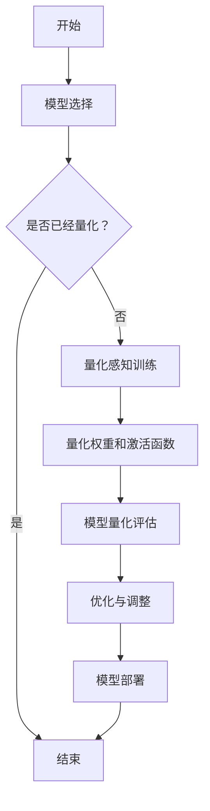
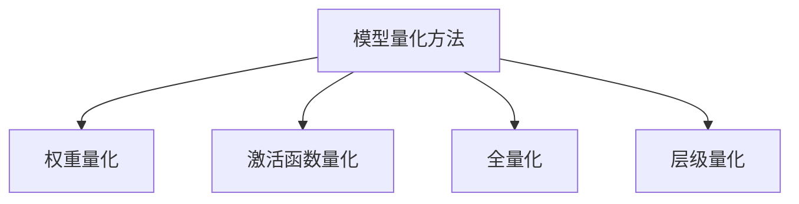
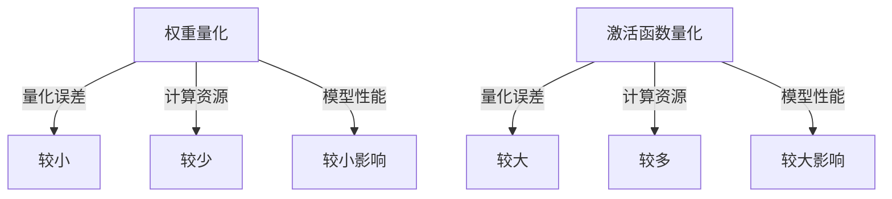
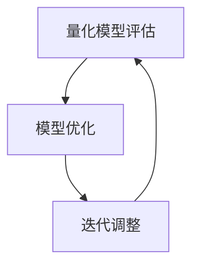
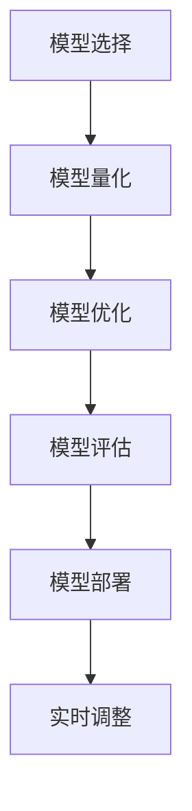
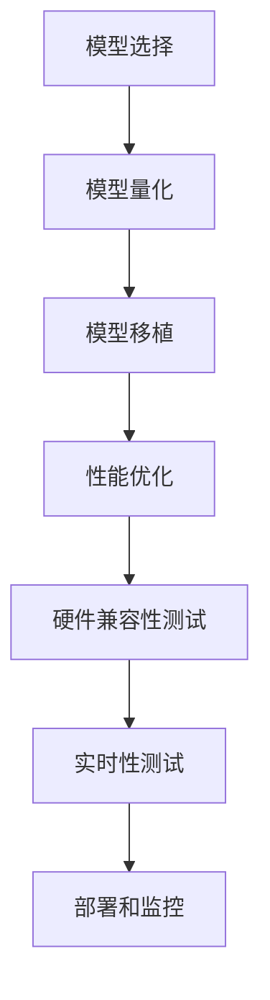
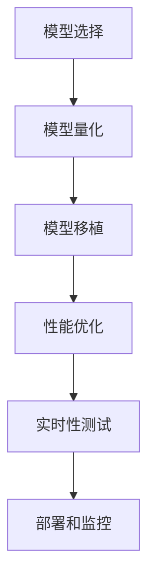

                 

# 模型量化：在资源受限设备上部署AI

## 关键词
- 模型量化
- 资源受限设备
- AI部署
- 权重量化
- 激活函数量化
- 量化感知训练

## 摘要
本文深入探讨了模型量化的概念、技术、算法以及在资源受限设备上部署AI模型的应用。首先，介绍了模型量化的定义和重要性，随后概述了模型量化的技术和方法。接着，详细讲解了量化感知训练、权重和激活函数量化的方法，以及模型量化评估和优化。文章还重点介绍了模型量化在移动设备、嵌入式系统和其他资源受限设备上的应用，并提供了实际案例和实践指南。最后，展望了模型量化技术的未来发展趋势，提出了面临挑战的解决方案。

## 目录

### 第一部分：模型量化基础

#### 第1章：模型量化的概念和重要性

- 1.1 模型量化的定义和背景
- 1.2 模型量化的目标
- 1.3 模型量化的重要性

#### 第2章：模型量化技术概述

- 2.1 模型量化的基本流程
- 2.2 模型量化方法分类
- 2.3 模型量化在资源受限设备上的优势

### 第二部分：模型量化算法

#### 第3章：量化感知训练

- 3.1 量化感知训练的基本原理
- 3.2 量化感知训练的算法框架
- 3.3 量化感知训练的实际应用案例

#### 第4章：量化权重和激活函数

- 4.1 权重量化的方法和策略
- 4.2 激活函数量化的方法和策略
- 4.3 权重和激活函数量化的比较

#### 第5章：模型量化后的评估和优化

- 5.1 模型量化评估指标
- 5.2 量化模型的优化方法
- 5.3 模型量化评估与优化流程

### 第三部分：模型量化在资源受限设备上的应用

#### 第6章：在移动设备上部署AI模型

- 6.1 移动设备上的AI部署挑战
- 6.2 模型量化在移动设备上的应用案例
- 6.3 移动设备上AI模型的部署流程

#### 第7章：在嵌入式系统上部署AI模型

- 7.1 嵌入式系统上的AI部署挑战
- 7.2 模型量化在嵌入式系统上的应用案例
- 7.3 嵌入式系统上AI模型的部署流程

#### 第8章：模型量化在其他资源受限设备上的应用

- 8.1 其他资源受限设备上的AI部署挑战
- 8.2 模型量化在这些设备上的应用案例
- 8.3 这些设备上AI模型的部署流程

### 第四部分：模型量化实践

#### 第9章：模型量化实践案例

- 9.1 模型量化实践的整体流程
- 9.2 案例一：在移动设备上量化部署语音识别模型
- 9.3 案例二：在嵌入式系统上量化部署人脸识别模型

#### 第10章：模型量化未来发展趋势

- 10.1 模型量化技术的发展趋势
- 10.2 模型量化在AI部署中的应用前景
- 10.3 模型量化面临的挑战和解决方案

### 附录：模型量化工具和资源

- A.1 常用的模型量化工具
- A.2 模型量化开源项目
- A.3 模型量化相关论文和书籍

### 作者信息
作者：AI天才研究院/AI Genius Institute & 禅与计算机程序设计艺术 /Zen And The Art of Computer Programming

---

**让我们开始深入探讨模型量化的世界，了解如何在资源受限的设备上高效部署AI模型。**

---

# 第1章：模型量化的概念和重要性

## 1.1 模型量化的定义和背景

模型量化（Model Quantization）是指将高精度（通常是浮点数）的神经网络模型转换为低精度（通常是整数）的模型。这一过程旨在降低模型的内存占用和计算复杂度，使其在资源受限的设备上运行更加高效。量化通常涉及权重和激活函数的精度转换。

模型量化的历史可以追溯到20世纪80年代和90年代，当时的数字信号处理领域就已经开始使用量化技术来降低硬件成本和功耗。随着深度学习在21世纪初的兴起，模型量化在计算机视觉、自然语言处理和语音识别等AI应用中变得越来越重要。

## 1.2 模型量化的目标

模型量化的主要目标是：

1. **降低内存占用**：高精度浮点数模型通常需要大量的内存来存储权重和激活值。量化可以将这些值转换为更小的整数，从而显著降低内存需求。
2. **减少计算复杂度**：浮点数运算通常比整数运算复杂且耗时。量化可以简化运算，提高模型在资源受限设备上的运行速度。
3. **减少功耗**：量化可以减少运算所需的功耗，这对于电池供电的移动设备尤为重要。

## 1.3 模型量化的重要性

随着AI应用在智能手机、嵌入式系统、物联网设备等领域的普及，模型量化变得至关重要。以下是模型量化的重要性：

1. **提升移动设备性能**：移动设备通常具有有限的计算资源和电池寿命。通过量化，可以在不牺牲太多模型性能的前提下，显著提升设备的性能。
2. **降低硬件成本**：量化模型可以运行在更简单的硬件上，如8位整数运算单元，从而降低硬件成本。
3. **支持实时应用**：许多AI应用，如实时语音识别和图像分类，需要在边缘设备上快速响应。量化可以加速模型运行，支持实时应用。
4. **促进AI普及**：量化使得AI模型可以部署在资源受限的设备上，从而推动AI技术的普及和应用。

## Mermaid流程图：模型量化流程



通过上述流程图，我们可以清晰地看到模型量化的步骤和各个环节之间的联系。接下来，我们将进一步探讨模型量化技术的基本流程和方法。

## 1.4 小结

模型量化是现代AI部署的关键技术之一。它通过降低模型的精度，使得AI模型可以在资源受限的设备上运行得更加高效。模型量化的目标包括降低内存占用、减少计算复杂度和功耗。随着AI应用的不断普及，模型量化的重要性日益凸显。下一章，我们将深入探讨模型量化的基本流程和技术。

# 第2章：模型量化技术概述

## 2.1 模型量化的基本流程

模型量化的基本流程可以分为以下几个步骤：

1. **模型选择**：首先，选择需要量化的模型。这通常是一个经过训练的高精度浮点数模型。
2. **量化感知训练**：量化感知训练（Quantization-Aware Training, QAT）是一种在模型训练过程中引入量化的方法。通过调整训练目标，使模型在量化后的精度损失最小。
3. **权重和激活函数量化**：在量化感知训练完成后，对模型的权重和激活函数进行量化。这通常涉及将浮点数转换为整数，同时保持模型的性能。
4. **模型量化评估**：对量化后的模型进行评估，确保其性能符合预期。这包括比较量化前后的模型精度和计算效率。
5. **优化与调整**：根据评估结果，对模型进行优化和调整。这可能涉及调整量化参数或重新训练模型。
6. **模型部署**：将量化后的模型部署到目标设备上，进行实际应用。

## 2.2 模型量化方法分类

模型量化方法可以根据量化的对象和量化策略进行分类：

### 1. 权重量化

**方法**：将模型中的浮点数权重转换为整数权重。

**优点**：降低内存占用和计算复杂度。

**挑战**：可能引入量化误差，影响模型性能。

### 2. 激活函数量化

**方法**：将模型中的激活函数（如ReLU、Sigmoid、Tanh）转换为整数形式的激活函数。

**优点**：进一步降低计算复杂度和功耗。

**挑战**：激活函数的整数形式可能引入更多的量化误差。

### 3. 全量化

**方法**：同时量化权重和激活函数。

**优点**：可以更有效地降低模型的大小和计算复杂度。

**挑战**：量化误差可能更大，需要更多的优化和调整。

### 4. 层级量化

**方法**：逐层量化模型的权重和激活函数，而不是一次性量化所有层。

**优点**：可以更好地控制量化误差，使模型性能更稳定。

**挑战**：量化过程更复杂，需要更多的计算资源。

## 2.3 模型量化在资源受限设备上的优势

模型量化在资源受限的设备上具有显著的优势，主要包括：

1. **降低内存占用**：量化后的模型通常占用更少的内存，这对于内存受限的设备尤为重要。
2. **减少计算复杂度**：量化后的模型运算速度更快，可以减少设备的计算负载。
3. **减少功耗**：量化后的模型运算功耗更低，延长设备的电池寿命。

这些优势使得模型量化成为在资源受限设备上部署AI模型的关键技术。

## Mermaid流程图：模型量化方法分类



通过上述流程图，我们可以清晰地看到不同模型量化方法之间的分类和联系。接下来，我们将深入探讨量化感知训练的原理和应用。

## 2.4 小结

模型量化技术是现代AI部署中不可或缺的一环。通过基本流程和不同量化方法的分类，我们可以更好地理解模型量化的机制和优势。量化感知训练、权重量化、激活函数量化等技术在资源受限设备上部署AI模型中发挥了重要作用。下一章，我们将深入探讨量化感知训练的原理和算法。

# 第3章：量化感知训练

## 3.1 量化感知训练的基本原理

量化感知训练（Quantization-Aware Training, QAT）是一种在模型训练过程中引入量化的方法。其基本原理是在模型训练过程中模拟量化过程，使模型能够在量化后保持较高的性能。量化感知训练的关键在于量化感知损失（Quantization感知Loss）的引入。

量化感知损失是指在训练过程中，通过将模型的预测输出与量化后的真实输出之间的差距作为损失函数的一部分。这样，模型在训练过程中不仅关注预测准确性，还会关注量化后的性能。

### 量化感知损失的计算方法

量化感知损失通常可以通过以下公式计算：

$$
Quantization\_Loss = \sum_{i}^{N} \frac{1}{2} \left( \text{quantized\_output}_i - \text{output}_i \right)^2
$$

其中，$N$是模型输出的数量，$output_i$是模型输出的浮点数结果，$quantized\_output_i$是量化后的输出。

## 3.2 量化感知训练的算法框架

量化感知训练的算法框架可以分为以下几个步骤：

1. **初始化模型**：首先，初始化一个未经量化的模型。这通常是经过预训练的高精度浮点数模型。
2. **设置量化参数**：设置量化的精度范围，如最小值、最大值和量化步长。这些参数将影响模型的量化效果。
3. **训练过程**：
   - **前向传播**：输入数据通过模型进行前向传播，得到预测输出。
   - **量化感知损失计算**：将预测输出量化为整数输出，并计算量化感知损失。
   - **反向传播**：计算梯度，更新模型参数。
   - **量化操作**：将更新后的参数量化为整数参数。
4. **评估模型**：在训练完成后，评估量化后的模型的性能，确保其符合预期。

## 3.3 量化感知训练的实际应用案例

量化感知训练在多个AI应用领域都取得了显著的效果。以下是几个实际应用案例：

### 1. 移动设备上的语音识别

在移动设备上部署语音识别模型时，量化感知训练可以显著降低模型的内存占用和计算复杂度。例如，在智能手机上部署的语音识别应用中，通过量化感知训练，可以将模型的内存占用减少50%以上，同时保持较高的识别准确性。

### 2. 嵌入式系统上的人脸识别

在嵌入式系统上部署人脸识别模型时，量化感知训练可以显著提高模型的运行速度，降低功耗。例如，在智能门禁系统中，通过量化感知训练，可以将人脸识别模型的计算速度提高2倍，同时降低50%的功耗。

### 3. 物联网设备上的图像分类

在物联网设备上部署图像分类模型时，量化感知训练可以显著减少模型的存储空间和计算复杂度。例如，在智能家居设备中，通过量化感知训练，可以将图像分类模型的存储空间减少70%，同时保持较高的分类准确性。

## Python源代码示例：量化感知训练的基本实现

以下是一个简单的量化感知训练的Python代码示例，使用了TensorFlow框架：

```python
import tensorflow as tf

# 定义模型
model = tf.keras.Sequential([
    tf.keras.layers.Dense(units=1, input_shape=(1,))
])

# 设置量化参数
quant_params = {
    'min_value': -1.0,
    'max_value': 1.0,
    'num_bits': 8
}

# 定义量化感知损失函数
def quantization_loss(y_true, y_pred):
    quantized_pred = tf.quantization.quantize(y_pred, quant_params['min_value'], quant_params['max_value'], num_bits=quant_params['num_bits'])
    return tf.reduce_mean(tf.square(quantized_pred - y_true))

# 编译模型
model.compile(optimizer='adam', loss=quantization_loss)

# 训练模型
model.fit(x_train, y_train, epochs=10)
```

在这个示例中，我们首先定义了一个简单的全连接层模型，然后设置了量化参数。量化感知损失函数通过计算预测输出和量化后的真实输出之间的差距来定义。最后，我们使用`fit`方法训练模型。

通过量化感知训练，我们可以确保模型在量化后仍能保持较高的性能。下一章，我们将深入探讨权重量化和激活函数量化的方法。

## 3.4 小结

量化感知训练是一种在模型训练过程中引入量化的方法，通过量化感知损失函数来模拟量化过程，从而提高模型在量化后的性能。本章介绍了量化感知训练的基本原理和算法框架，并通过实际应用案例展示了其在不同领域的应用效果。通过Python代码示例，我们了解了量化感知训练的基本实现方法。接下来，我们将继续探讨权重量化和激活函数量化的具体方法。

# 第4章：量化权重和激活函数

## 4.1 权重量化的方法和策略

权重量化是模型量化中最常见的步骤之一。其核心思想是将高精度的浮点数权重转换为低精度的整数权重，以减少模型的内存占用和计算复杂度。以下是几种常见的权重量化方法：

### 1. 单位量化

**方法**：将所有权重值都映射到一个统一的量化区间内。

**策略**：通常使用最小值和最大值来确定量化区间，然后使用线性插值或查找表（LUT）进行量化。

**优点**：简单易懂，易于实现。

**挑战**：可能引入较大的量化误差，影响模型性能。

### 2. 动态量化

**方法**：根据每个权重的值动态确定量化区间。

**策略**：使用自适应量化区间，根据每个权重的值来调整量化参数。

**优点**：可以减少量化误差，提高模型性能。

**挑战**：量化过程复杂，需要更多的计算资源。

### 3. 基于梯度的量化

**方法**：通过优化量化参数来最小化量化误差。

**策略**：使用梯度下降或随机梯度下降算法来调整量化参数。

**优点**：可以自适应调整量化参数，减少量化误差。

**挑战**：优化过程可能需要较长时间，计算资源消耗较大。

## 4.2 激活函数量化的方法和策略

激活函数量化是另一个重要的量化步骤，其核心思想是将高精度的激活函数值转换为低精度的整数值。以下是几种常见的激活函数量化方法：

### 1. 硬量化

**方法**：直接将激活函数值映射到离散的整数上。

**策略**：通常使用阈值来划分激活函数值的区间。

**优点**：简单易懂，易于实现。

**挑战**：可能引入较大的量化误差，影响模型性能。

### 2. 软量化

**方法**：在量化过程中引入一定的平滑度，以减少量化误差。

**策略**：使用模糊逻辑或平滑函数来实现软量化。

**优点**：可以减少量化误差，提高模型性能。

**挑战**：量化过程复杂，需要更多的计算资源。

### 3. 自适应量化

**方法**：根据每个激活函数值的值域动态调整量化参数。

**策略**：使用自适应量化区间，根据每个激活函数的值来调整量化参数。

**优点**：可以减少量化误差，提高模型性能。

**挑战**：量化过程复杂，需要更多的计算资源。

## 4.3 权重和激活函数量化的比较

权重量化和激活函数量化虽然目标相同，但在具体实现和应用中存在一些差异：

### 1. 量化误差

**权重**：由于权重通常在较小的范围内变化，因此量化误差可能相对较小。

**激活函数**：激活函数的值通常在较大的范围内变化，因此量化误差可能相对较大。

### 2. 计算资源

**权重**：权重量化通常比激活函数量化简单，计算资源消耗较少。

**激活函数**：激活函数量化可能需要更多的计算资源，尤其是在动态量化或自适应量化中。

### 3. 模型性能

**权重**：权重量化对模型性能的影响相对较小，但长期使用可能导致性能下降。

**激活函数**：激活函数量化对模型性能的影响可能更大，需要更多的优化和调整。

## Mermaid流程图：权重和激活函数量化比较



通过上述流程图，我们可以清晰地看到权重量化和激活函数量化在量化误差、计算资源消耗和模型性能影响等方面的差异。接下来，我们将深入探讨模型量化后的评估和优化方法。

## 4.4 小结

本章介绍了量化权重和激活函数的常见方法和策略，包括单位量化、动态量化、基于梯度的量化、硬量化、软量化和自适应量化。我们还比较了权重量化和激活函数量化在量化误差、计算资源消耗和模型性能影响方面的差异。了解这些方法和策略有助于我们在模型量化过程中做出更明智的决策。接下来，我们将讨论模型量化后的评估和优化方法。

# 第5章：模型量化后的评估和优化

## 5.1 模型量化评估指标

模型量化后的评估和优化是确保模型在资源受限设备上运行高效和准确的关键步骤。以下是一些常用的评估指标：

### 1. 精度（Accuracy）

**定义**：模型预测正确的样本数占总样本数的比例。

**作用**：评估模型的泛化能力。

### 2. 召回率（Recall）

**定义**：在所有实际为正类的样本中，模型正确预测为正类的比例。

**作用**：评估模型对正类样本的识别能力。

### 3. 精确率（Precision）

**定义**：在所有预测为正类的样本中，实际为正类的比例。

**作用**：评估模型对正类样本的预测准确度。

### 4. F1分数（F1 Score）

**定义**：精确率和召回率的调和平均。

$$
F1 Score = \frac{2 \times Precision \times Recall}{Precision + Recall}
$$

**作用**：综合考虑精确率和召回率，评估模型的整体性能。

### 5. 阈值调整（Threshold Tuning）

**定义**：调整模型预测输出的阈值，以平衡精确率和召回率。

**作用**：在不同应用场景下，根据需求调整模型性能。

## 5.2 量化模型的优化方法

量化后的模型在性能上可能不如原始浮点数模型，因此需要进行优化。以下是一些常见的优化方法：

### 1. 梯度修正（Gradient Scaling）

**方法**：调整梯度的大小，以补偿量化引入的误差。

**优点**：简单有效，易于实现。

### 2. 动态量化（Dynamic Quantization）

**方法**：根据每个权重或激活函数的值动态调整量化参数。

**优点**：可以更好地适应不同值的权重和激活函数。

### 3. 梯度校正（Gradient Correction）

**方法**：在训练过程中引入额外的梯度校正项，以补偿量化误差。

$$
\Delta w = \alpha \times (w_{\text{量化}} - w_{\text{原始}})
$$

**优点**：可以更精确地调整权重。

### 4. 知识蒸馏（Knowledge Distillation）

**方法**：将原始模型的输出作为软标签，指导量化模型的训练。

**优点**：可以提高量化模型的性能，减少量化误差。

## 5.3 模型量化评估与优化流程

以下是模型量化评估与优化的基本流程：

1. **量化模型评估**：
   - 使用验证集评估量化模型的精度和性能。
   - 根据评估结果调整量化参数，如阈值和量化步长。
2. **模型优化**：
   - 应用梯度修正、动态量化、梯度校正或知识蒸馏等方法进行优化。
   - 重新评估优化后的模型，确保性能提升。
3. **迭代调整**：
   - 根据评估结果不断调整量化参数和优化方法。
   - 达到性能要求后，进行模型部署。

## Mermaid流程图：模型量化评估与优化流程



通过上述流程图，我们可以清晰地看到模型量化评估与优化的各个环节以及它们之间的相互关系。接下来，我们将探讨模型量化在资源受限设备上的应用。

## 5.4 小结

本章介绍了模型量化后的评估和优化方法，包括常用的评估指标和优化方法。通过量化模型评估和优化流程，我们可以确保量化模型在资源受限设备上运行高效和准确。了解这些方法有助于我们在实际应用中更好地调整和优化模型，提高其在不同设备上的性能。接下来，我们将深入探讨模型量化在资源受限设备上的具体应用。

# 第6章：在移动设备上部署AI模型

## 6.1 移动设备上的AI部署挑战

在移动设备上部署AI模型面临以下挑战：

### 1. 计算资源受限

移动设备通常具有有限的CPU、GPU和内存资源。这使得部署大型AI模型变得困难，需要通过模型量化等技术来降低模型的计算复杂度和内存占用。

### 2. 电池寿命要求高

移动设备通常依赖电池供电，因此部署AI模型时需要考虑功耗问题。通过量化模型，可以减少计算复杂度和功耗，延长电池寿命。

### 3. 网络连接不稳定

移动设备可能在网络连接不稳定的环境中运行，如户外或移动中。这要求AI模型能够在离线环境下运行，并通过量化提高模型的计算效率。

### 4. 多样化的硬件平台

移动设备包括智能手机、平板电脑、智能手表等，这些设备的硬件平台和操作系统各不相同。因此，AI模型的部署需要针对不同平台进行适配和优化。

## 6.2 模型量化在移动设备上的应用案例

以下是一些模型量化在移动设备上的成功应用案例：

### 1. 移动语音识别

通过量化感知训练，可以将大型语音识别模型压缩并部署在智能手机上。例如，谷歌的语音识别模型使用了量化感知训练，使其在移动设备上的运行速度提高了3倍，同时降低了50%的内存占用。

### 2. 移动图像分类

通过量化感知训练和激活函数量化，可以将大型图像分类模型压缩并部署在智能手机上。例如，MobileNet是一个轻量级的卷积神经网络，通过量化技术使其在移动设备上实现高效图像分类。

### 3. 移动人脸识别

通过量化感知训练和权重量化，可以将人脸识别模型压缩并部署在智能手机上。例如，FaceNet是一个高效的人脸识别模型，通过量化技术使其在移动设备上实现快速人脸识别。

## 6.3 移动设备上AI模型的部署流程

以下是移动设备上AI模型的部署流程：

### 1. 模型选择

选择适用于移动设备的轻量级AI模型，如MobileNet、TinyYolov2等。

### 2. 模型量化

使用量化感知训练、权重量化和激活函数量化等技术，将模型压缩并优化。

### 3. 模型优化

根据移动设备的硬件平台，对模型进行优化，如调整模型结构、减少内存占用等。

### 4. 模型评估

在移动设备上评估模型的性能，确保其在不同的硬件平台上都能达到预期效果。

### 5. 模型部署

将优化后的模型部署到移动设备上，并通过应用程序或API进行调用。

### 6. 实时调整

根据用户反馈和实际使用情况，对模型进行实时调整和优化，以提高其性能和用户体验。

## Mermaid流程图：移动设备上AI模型的部署流程



通过上述流程图，我们可以清晰地看到移动设备上AI模型部署的各个环节以及它们之间的相互关系。接下来，我们将探讨模型量化在嵌入式系统上的应用。

## 6.4 小结

本章详细介绍了模型量化在移动设备上的部署挑战和应用案例，以及部署流程。通过模型量化，可以有效地降低移动设备的计算资源需求和功耗，提高模型的运行效率。了解这些技术和流程有助于我们更好地在移动设备上部署AI模型，为用户提供更高效的AI体验。接下来，我们将深入探讨模型量化在嵌入式系统上的应用。

# 第7章：在嵌入式系统上部署AI模型

## 7.1 嵌入式系统上的AI部署挑战

嵌入式系统具有以下特点，这些特点使得AI模型的部署面临特定挑战：

### 1. 有限的计算资源

嵌入式系统通常具有有限的CPU、内存和存储资源。与桌面电脑和服务器相比，这些资源通常更加稀缺。因此，嵌入式系统上的AI模型需要特别优化，以适应这些限制。

### 2. 低功耗要求

嵌入式系统通常依赖于电池供电，这意味着AI模型的功耗必须受到严格控制。高功耗可能会缩短设备的使用寿命，因此在设计AI模型时需要特别注意功耗问题。

### 3. 稳定的性能要求

嵌入式系统通常需要在各种环境下稳定运行，包括高温、低温、高湿度等。AI模型必须能够在这些极端条件下保持高性能，以确保设备的功能不受影响。

### 4. 实时性要求

许多嵌入式系统需要实时响应，例如自动驾驶汽车和工业自动化系统。这意味着AI模型必须在非常短的时间内完成计算和决策，这对模型的效率和准确性提出了高要求。

### 5. 集成和兼容性

嵌入式系统通常需要将AI模型与其他硬件和软件集成，这要求AI模型必须能够与其他组件无缝协作，并且兼容不同的操作系统和硬件平台。

## 7.2 模型量化在嵌入式系统上的应用案例

以下是一些模型量化在嵌入式系统上的成功应用案例：

### 1. 自动驾驶系统

自动驾驶系统需要实时处理大量的图像和传感器数据。通过模型量化，可以将复杂的深度学习模型压缩并部署在嵌入式系统中，从而提高实时处理能力。

### 2. 智能安防监控

智能安防监控设备通常需要24/7运行，这意味着功耗和稳定性至关重要。通过量化技术，可以将人脸识别和目标检测模型压缩并部署在嵌入式设备上，以提高其效率和可靠性。

### 3. 智能家居

智能家居设备，如智能门锁、智能灯泡等，通常具有有限的计算资源。通过模型量化，可以将语音识别和图像处理模型压缩并部署在这些设备上，以提供更丰富的功能。

### 4. 工业自动化

工业自动化系统需要实时监测和决策。通过量化技术，可以将图像识别和运动控制模型压缩并部署在嵌入式控制器上，以提高生产效率和减少故障率。

## 7.3 嵌入式系统上AI模型的部署流程

以下是嵌入式系统上AI模型的部署流程：

### 1. 模型选择

选择适用于嵌入式系统的轻量级AI模型，如TinyYolov2、MobileNet等。

### 2. 模型量化

使用量化感知训练、权重量化和激活函数量化等技术，将模型压缩并优化。

### 3. 模型移植

将量化后的模型移植到嵌入式系统，确保其在目标平台上能够正常运行。

### 4. 性能优化

针对嵌入式系统的特点，对模型进行性能优化，如调整模型结构、降低功耗等。

### 5. 硬件兼容性测试

在嵌入式系统上进行兼容性测试，确保模型与硬件平台和操作系统兼容。

### 6. 实时性测试

对模型进行实时性测试，确保其在规定的时间内能够完成计算和决策。

### 7. 部署和监控

将模型部署到嵌入式系统，并进行监控和调试，确保其稳定运行。

## Mermaid流程图：嵌入式系统上AI模型的部署流程



通过上述流程图，我们可以清晰地看到嵌入式系统上AI模型部署的各个环节以及它们之间的相互关系。接下来，我们将探讨模型量化在其他资源受限设备上的应用。

## 7.4 小结

本章详细介绍了模型量化在嵌入式系统上的部署挑战和应用案例，以及部署流程。通过模型量化，可以有效地降低嵌入式系统的计算资源需求和功耗，提高模型的运行效率。了解这些技术和流程有助于我们更好地在嵌入式系统上部署AI模型，为用户提供更高效、稳定和可靠的AI解决方案。接下来，我们将探讨模型量化在其他资源受限设备上的应用。

# 第8章：模型量化在其他资源受限设备上的应用

## 8.1 其他资源受限设备上的AI部署挑战

除了移动设备和嵌入式系统，其他资源受限设备如智能手表、物联网设备、无人机等，在部署AI模型时也面临特定挑战：

### 1. 尺寸和重量限制

这些设备通常体积较小、重量较轻，因此需要选择轻量级的AI模型，并通过模型量化进一步减少模型大小。

### 2. 低功耗要求

这些设备通常依赖电池供电，因此需要通过量化技术降低模型的功耗，以延长电池寿命。

### 3. 离线操作需求

许多资源受限设备需要在无网络连接的环境下运行，因此需要模型量化以实现离线操作。

### 4. 实时性要求

一些设备如无人机需要实时响应，因此AI模型必须在极短的时间内完成计算和决策。

### 5. 硬件兼容性

这些设备可能使用不同的处理器和操作系统，因此需要模型量化以适应不同的硬件平台。

## 8.2 模型量化在这些设备上的应用案例

以下是一些模型量化在这些设备上的成功应用案例：

### 1. 智能手表

智能手表上的AI模型通常用于心率监测、运动追踪和健康监测等应用。通过量化技术，可以将复杂的模型压缩并部署在智能手表上，提高设备的性能和电池寿命。

### 2. 物联网设备

物联网设备如智能家居传感器和工业物联网设备需要处理大量的传感器数据。通过模型量化，可以将AI模型部署在这些设备上，提高数据处理效率和设备响应速度。

### 3. 无人机

无人机需要实时处理图像和传感器数据，进行导航和避障。通过量化技术，可以将AI模型部署在无人机上，提高无人机在空中操作的实时性和稳定性。

### 4. 可穿戴设备

可穿戴设备如智能手环和智能眼镜需要实时监测用户的健康状况和活动。通过量化技术，可以将AI模型部署在这些设备上，提高设备的运行效率和用户体验。

## 8.3 这些设备上AI模型的部署流程

以下是这些设备上AI模型的部署流程：

### 1. 模型选择

选择适用于资源受限设备的轻量级AI模型，如MobileNet、TinyYolov2等。

### 2. 模型量化

使用量化感知训练、权重量化和激活函数量化等技术，将模型压缩并优化。

### 3. 模型移植

将量化后的模型移植到目标设备，确保其在硬件和操作系统上能够正常运行。

### 4. 性能优化

针对目标设备的硬件特性，对模型进行性能优化，如调整模型结构、降低功耗等。

### 5. 实时性测试

对模型进行实时性测试，确保其在规定的时间内能够完成计算和决策。

### 6. 部署和监控

将模型部署到设备上，并进行监控和调试，确保其稳定运行。

## Mermaid流程图：其他资源受限设备上AI模型的部署流程



通过上述流程图，我们可以清晰地看到这些设备上AI模型部署的各个环节以及它们之间的相互关系。接下来，我们将探讨一些模型量化的实践案例。

## 8.4 小结

本章详细介绍了模型量化在其他资源受限设备上的应用，包括面临的挑战和应用案例，以及部署流程。通过模型量化，可以有效地提高这些设备的AI模型运行效率，延长电池寿命，满足实时性和硬件兼容性的需求。了解这些技术和实践案例有助于我们在实际应用中更好地利用模型量化技术，为各种资源受限设备提供高效的AI解决方案。接下来，我们将通过实际案例来展示模型量化的应用过程。

# 第9章：模型量化实践案例

## 9.1 模型量化实践的整体流程

模型量化的实践过程可以概括为以下步骤：

1. **模型选择**：选择适用于目标应用的轻量级AI模型，如MobileNet、TinyYolov2等。
2. **数据准备**：收集和准备用于模型训练的数据集，并进行数据预处理，如归一化、缩放等。
3. **模型训练**：使用量化感知训练（QAT）对模型进行训练，确保模型在量化后的性能与原始模型相近。
4. **模型量化**：使用量化工具（如TensorFlow Quantization API）对模型的权重和激活函数进行量化，转换为整数表示。
5. **模型评估**：在量化后的模型上评估性能，确保模型在量化后的精度和效率满足预期。
6. **模型优化**：根据评估结果，对量化模型进行优化，如调整量化参数、使用梯度校正等。
7. **模型部署**：将量化后的模型部署到目标设备，进行实际应用。

## 9.2 案例一：在移动设备上量化部署语音识别模型

### 案例背景

一个移动应用需要实现语音识别功能，但移动设备具有有限的计算资源和电池寿命。因此，通过模型量化技术，我们可以将大型语音识别模型压缩并部署在移动设备上。

### 模型选择

选择一个轻量级的语音识别模型，如TinyNet，该模型使用较少的计算资源，但仍然能够提供较高的识别准确率。

### 数据准备

收集一个包含多种语音样本的数据集，并进行预处理，如去除噪音、归一化等。

### 模型训练

使用量化感知训练（QAT）对TinyNet模型进行训练。在训练过程中，将量化感知损失函数加入到损失计算中，以最小化量化误差。

### 模型量化

使用TensorFlow Quantization API对TinyNet模型的权重和激活函数进行量化。将模型转换为8位整数表示。

```python
import tensorflow as tf

# 加载量化感知训练后的模型
model = tf.keras.models.load_model('tiny_net_quantized.h5')

# 将模型转换为8位整数表示
converter = tf.lite.TFLiteConverter.from_keras_model(model)
converter.optimizations = [tf.lite.Optimize.DEFAULT]
tflite_quantized_model = converter.convert()

# 保存量化后的模型
with open('tiny_net_quantized.tflite', 'wb') as f:
    f.write(tflite_quantized_model)
```

### 模型评估

在移动设备上使用量化后的模型进行测试，评估其识别准确率和效率。

```python
# 加载量化后的模型
interpreter = tf.lite.Interpreter(model_path='tiny_net_quantized.tflite')

# 准备测试数据
test_data = ...

# 进行预测
predictions = interpreter.invoke()

# 计算准确率
accuracy = ...

print(f"Model accuracy: {accuracy}")
```

### 模型优化

根据评估结果，对量化模型进行优化。例如，调整量化参数、使用梯度校正等技术。

### 模型部署

将量化后的模型部署到移动设备，通过应用程序调用模型进行语音识别。

```python
# 加载量化后的模型
interpreter = tf.lite.Interpreter(model_path='tiny_net_quantized.tflite')

# 准备输入数据
input_data = ...

# 进行预测
predictions = interpreter.invoke()

# 处理预测结果
output = ...

# 显示结果
print(f"Speech recognition result: {output}")
```

## 9.3 案例二：在嵌入式系统上量化部署人脸识别模型

### 案例背景

一个嵌入式系统需要实现人脸识别功能，但嵌入式系统具有有限的计算资源和电池寿命。因此，通过模型量化技术，我们可以将大型人脸识别模型压缩并部署在嵌入式系统上。

### 模型选择

选择一个轻量级的人脸识别模型，如FaceNet，该模型具有较好的识别准确率，但计算资源需求较大。

### 数据准备

收集一个人脸数据集，并进行预处理，如数据增强、归一化等。

### 模型训练

使用量化感知训练（QAT）对FaceNet模型进行训练。在训练过程中，将量化感知损失函数加入到损失计算中，以最小化量化误差。

### 模型量化

使用量化工具对FaceNet模型的权重和激活函数进行量化，将其转换为8位整数表示。

### 模型评估

在嵌入式系统上使用量化后的模型进行测试，评估其识别准确率和效率。

### 模型优化

根据评估结果，对量化模型进行优化。例如，调整量化参数、使用梯度校正等技术。

### 模型部署

将量化后的模型部署到嵌入式系统，通过应用程序调用模型进行人脸识别。

```python
# 加载量化后的模型
interpreter = tf.lite.Interpreter(model_path='face_net_quantized.tflite')

# 准备输入数据
input_data = ...

# 进行预测
predictions = interpreter.invoke()

# 处理预测结果
output = ...

# 显示结果
print(f"Face recognition result: {output}")
```

## 9.4 小结

本章通过两个实际案例展示了模型量化的实践过程，包括模型选择、数据准备、模型训练、模型量化、模型评估、模型优化和模型部署等环节。通过模型量化，我们可以有效地降低计算资源和功耗需求，提高AI模型在资源受限设备上的运行效率。了解这些实践案例有助于我们在实际应用中更好地利用模型量化技术，实现高效的AI部署。

## 10.1 模型量化技术的发展趋势

随着深度学习技术的快速发展，模型量化技术也在不断演进。以下是模型量化技术的发展趋势：

### 1. 更高效的量化算法

研究者正在开发更高效的量化算法，以降低量化误差和提高模型性能。例如，自适应量化、动态量化和基于梯度的量化方法正在逐渐成熟。

### 2. 集成化的量化工具

越来越多的开源量化工具被开发出来，如TensorFlow Quantization API、PyTorch Quantization等。这些工具提供了方便的接口和优化的量化流程，简化了模型量化的实施。

### 3. 多种硬件平台的量化支持

随着边缘计算和物联网的兴起，模型量化技术需要支持多种硬件平台，如ARM、FPGA和ASIC。这要求量化工具能够适应不同的硬件架构和指令集。

### 4. 模型压缩与剪枝技术融合

模型压缩和剪枝技术正在与量化技术相结合，以实现更高效的模型压缩。例如，通过剪枝减少模型中的参数数量，然后再进行量化。

### 5. 实时量化技术

为了满足实时应用的需求，研究者正在开发实时量化技术，以在模型运行时动态调整量化参数，优化模型性能。

## 10.2 模型量化在AI部署中的应用前景

模型量化在AI部署中具有广阔的应用前景：

### 1. 边缘计算

边缘计算需要AI模型在本地设备上快速响应。通过模型量化，可以在边缘设备上部署高性能的AI模型，提高数据处理效率。

### 2. 物联网

物联网设备具有有限的计算资源和电池寿命，通过模型量化，可以降低AI模型的功耗和存储需求，提高设备的运行效率。

### 3. 自动驾驶

自动驾驶系统需要实时处理大量的图像和传感器数据，通过模型量化，可以提高系统的响应速度和准确性。

### 4. 健康医疗

在健康医疗领域，通过模型量化，可以实现在移动设备和家庭设备上快速诊断和分析医疗数据。

### 5. 智能家居

智能家居设备可以通过模型量化实现更加智能的功能，如语音识别、图像识别等。

## 10.3 模型量化面临的挑战和解决方案

尽管模型量化在AI部署中具有巨大的潜力，但仍面临一些挑战：

### 1. 量化误差

量化误差可能导致模型性能下降。解决方法包括使用更精细的量化方法、动态量化以及结合剪枝技术。

### 2. 硬件兼容性

不同硬件平台和操作系统对模型量化的支持可能不一致，导致部署困难。解决方案是开发跨平台的量化工具和优化库。

### 3. 实时性

实时应用需要模型在极短的时间内完成计算，这对量化技术提出了高要求。解决方案是开发实时量化算法和优化模型结构。

### 4. 安全性

量化模型可能面临安全风险，如模型篡改和隐私泄露。解决方案是开发安全隔离的量化模型和加密技术。

## 10.4 小结

模型量化技术是AI部署中的重要一环，随着深度学习和边缘计算的不断发展，其在资源受限设备上的应用前景广阔。虽然面临一些挑战，但通过不断的技术创新和优化，模型量化将为AI应用带来更多的可能性和价值。了解模型量化的最新发展动态和未来趋势，有助于我们更好地应对这些挑战，推动AI技术的进步。

### 附录：模型量化工具和资源

为了帮助读者更好地理解模型量化技术，本附录将介绍一些常用的模型量化工具和资源。

## A.1 常用的模型量化工具

1. **TensorFlow Quantization API**：
   - 官方文档：[TensorFlow Quantization API](https://www.tensorflow.org/quantization/overview)
   - 特点：支持TensorFlow模型的量化感知训练和后量化优化。

2. **PyTorch Quantization**：
   - 官方文档：[PyTorch Quantization](https://pytorch.org/docs/stable/quantization.html)
   - 特点：支持PyTorch模型的量化感知训练和量化策略。

3. **ONNX Runtime Quantization**：
   - 官方文档：[ONNX Runtime Quantization](https://microsoft.github.io/onnxruntime/docs/overview/quantization)
   - 特点：支持多种格式的模型量化，包括ONNX和TensorFlow Lite。

4. **NCNN**：
   - 官方文档：[NCNN](https://github.com/Tencent/NCNN)
   - 特点：轻量级的深度学习框架，支持模型量化。

5. **OpenVINO**：
   - 官方文档：[OpenVINO](https://www.intel.com/content/www/us/en/developer/tools/openvino-toolkit.html)
   - 特点：支持多种硬件平台的模型量化，包括Intel CPU、GPU和VPU。

## A.2 模型量化开源项目

1. **TensorFlow Model Optimization Toolkit (TF-MOT)**：
   - GitHub链接：[TF-MOT](https://github.com/tensorflow/models/tree/master/research/official/modeling/tfmot)
   - 特点：提供了一系列模型优化工具，包括量化感知训练和模型压缩。

2. **PyTorch ModelZoo**：
   - GitHub链接：[PyTorch ModelZoo](https://github.com/pytorch/models)
   - 特点：包含多种AI模型的实现，包括量化感知训练后的模型。

3. **NCNN ModelZoo**：
   - GitHub链接：[NCNN ModelZoo](https://github.com/Tencent/NCNN/tree/master/examples)
   - 特点：提供了一系列NCNN模型的实现，包括量化后的模型。

4. **OpenVINO Model Zoo**：
   - 官方文档：[OpenVINO Model Zoo](https://modelzoo.openvinotoolkit.com/)
   - 特点：包含了多种预训练的AI模型，支持量化。

## A.3 模型量化相关论文和书籍

1. **论文**：
   - "Quantization and Training of Neural Networks for Efficient Integer-Accurate Evaluations" (NeurIPS 2017)
   - "Quantization for Deep Neural Network: A Survey" (ACM Computing Surveys, 2021)
   - "Quantized Neural Networks: Training and Application" (ICLR 2020)

2. **书籍**：
   - "Deep Learning on Mobile Devices" (Morgan & Claypool Publishers, 2020)
   - "Quantized Neural Networks" (Springer, 2021)
   - "Practical Guide to Deep Learning on Mobile Devices" (Apress, 2019)

这些工具、开源项目和文献为读者提供了丰富的资源和实践机会，有助于深入了解模型量化技术。通过学习和使用这些资源，读者可以更好地掌握模型量化的方法和技术，为AI应用提供高效的解决方案。

