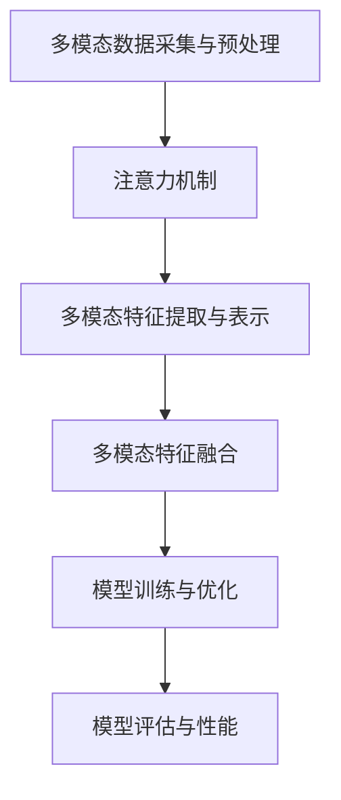

                 

### 引言

#### 1.1 本书的核心概念

《注意力机制在多模态融合中的创新》旨在深入探讨注意力机制在多模态融合中的重要性以及其应用的创新性。本文将围绕以下几个核心概念展开：

1. **多模态融合**：涉及将不同类型的数据（如文本、图像、音频）结合起来进行更有效的处理和理解。
2. **注意力机制**：一种在人工智能领域中广泛使用的机制，能够帮助模型专注于最相关的信息，从而提高任务性能。
3. **核心算法原理**：注意力机制如何工作，其在多模态融合中的应用原理。
4. **数学模型**：用于描述注意力机制和多模态融合的数学公式。
5. **项目实战**：通过实际项目展示如何实现和应用这些概念。

#### 1.2 多模态融合的背景

在当今社会，数据形式日益多样，单一模态的数据处理已经无法满足复杂任务的需求。多模态融合通过整合多种数据来源，能够提供更丰富、更全面的信息，从而提高模型在图像识别、语音识别、自然语言处理等领域的表现。

随着人工智能技术的不断发展，多模态融合的应用场景不断扩大，从医疗诊断、智能交互到自动驾驶，都离不开多模态数据的有效处理。因此，研究多模态融合技术具有重要意义。

#### 1.3 注意力机制的基本原理

注意力机制源于人类认知过程中的选择性注意力，其核心思想是让模型在处理信息时，能够自动识别并关注最重要的部分。在神经网络中，注意力机制通过动态调整权重，使得模型在处理不同输入时，能够自适应地关注不同的重要信息。

注意力机制的优势在于能够显著提高模型的性能，降低计算复杂度，并使模型更加灵活。在多模态融合中，注意力机制可以帮助模型更好地理解和整合不同模态的数据，从而实现更准确、更有效的信息融合。

#### 1.4 多模态融合与注意力机制的关系架构

为了更好地理解多模态融合与注意力机制的关系，我们可以通过以下Mermaid流程图来展示其架构：

- **A**：多模态数据采集与预处理，是融合过程的起点。
- **B**：注意力机制，用于动态调整数据的权重，提高融合效果。
- **C**：多模态特征提取与表示，将不同模态的数据转换为适合融合的格式。
- **D**：多模态特征融合，结合注意力机制，整合不同模态的数据特征。
- **E**：模型训练与优化，通过不断调整模型参数，提高融合模型的性能。
- **F**：模型评估与性能，对融合模型进行评估，确保其能够满足实际应用需求。

通过以上分析，我们可以看到注意力机制在多模态融合中起着至关重要的作用。接下来，本文将深入探讨注意力机制的基本原理、核心算法原理，以及如何在多模态融合中应用和优化。同时，还将通过实际项目案例，展示这些概念的具体实现和应用。

---

关键词：多模态融合，注意力机制，核心算法，数学模型，项目实战

摘要：本文系统地介绍了多模态融合与注意力机制的核心概念、基本原理及其在人工智能领域的应用。通过详细的理论讲解和实际项目案例，展示了注意力机制在提高多模态融合效果中的关键作用，并探讨了其优化方法和未来研究方向。本文旨在为研究人员和开发者提供全面的技术指导，以推动多模态融合技术的进步和应用。

---

本文的目录结构如下：

### 目录大纲

## 第一部分: 核心概念与联系

### 第1章: 引言

### 第二部分: 核心算法原理讲解

### 第2章: 注意力机制原理

### 第3章: 多模态融合算法

### 第4章: 注意力机制在多模态融合中的创新

### 第三部分: 数学模型和数学公式

### 第6章: 数学模型基础

### 第7章: 数学模型的应用

### 第四部分: 项目实战

### 第8章: 项目实战一：文本与图像的融合

### 第9章: 项目实战二：音频与文本的融合

### 第五部分: 代码解读与分析

### 第10章: 代码解读与实现

### 第11章: 代码优化与性能分析

### 附录

### 附录A: 代码实现

通过以上结构，本文将系统地引导读者深入了解多模态融合与注意力机制的技术细节，并为其提供实际应用场景中的指导。接下来，我们将进一步探讨注意力机制的多层次原理，为后续内容奠定基础。

