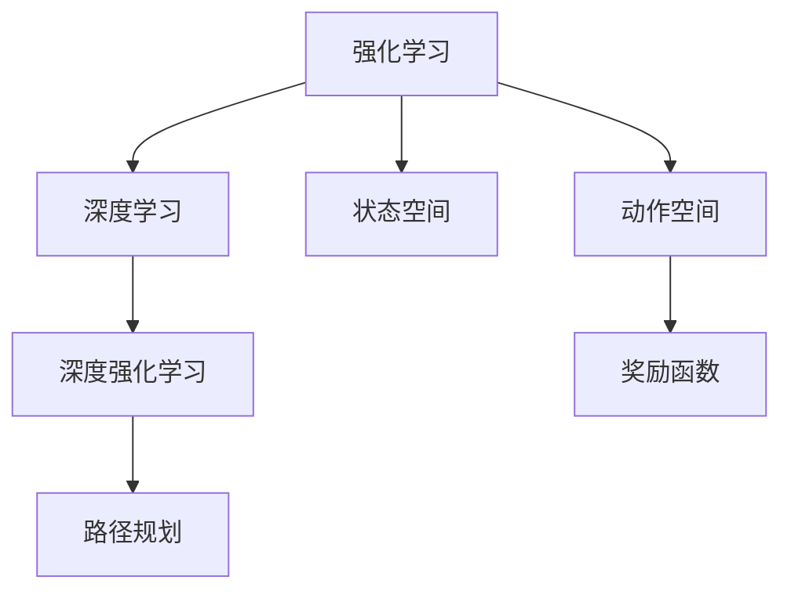

                 

### 深度强化学习在推理路径规划中的应用

#### 背景介绍

深度强化学习（Deep Reinforcement Learning，DRL）作为一种结合了深度学习和强化学习的先进技术，近年来在各个领域都展现出了强大的应用潜力。特别是在路径规划领域，DRL方法因其能够自动学习和优化路径选择策略，受到了广泛关注。路径规划是智能系统在动态和复杂环境中实现自主导航的关键问题，它涉及到从起点到终点的最优路径的寻找，且需要考虑多种约束条件，如障碍物、资源限制和动态环境变化等。

在传统的路径规划方法中，如A*算法、Dijkstra算法等，主要依赖于预先定义的规则和代价函数，往往难以应对复杂和动态的环境。而深度强化学习通过智能体的自主学习，能够在没有明确规则的情况下，从环境中获取反馈，不断优化路径选择策略。这使得DRL在路径规划中的应用具有显著的优势，特别是在无人驾驶、机器人导航和智能交通等领域。

本文旨在探讨深度强化学习在推理路径规划中的应用，首先介绍深度强化学习的基础知识，包括其定义、核心概念和发展历程，然后深入分析深度强化学习在路径规划中的潜在优势和应用案例。接下来，我们将详细讲解深度强化学习的基本原理，包括强化学习基础、深度学习基础以及深度强化学习模型。在此基础上，我们将介绍深度强化学习在路径规划中的应用，包括环境建模、状态空间设计、动作空间与奖励函数设计等。最后，我们将探讨基于深度强化学习的多智能体路径规划、动态环境下的路径规划以及复杂环境中的推理路径规划，并总结深度强化学习在路径规划中的挑战与未来展望。

通过本文的阅读，读者将能够全面了解深度强化学习在路径规划中的应用，掌握其核心原理和关键方法，并对其未来的发展充满期待。

#### 关键词

- 深度强化学习
- 路径规划
- 强化学习
- 深度学习
- 状态空间
- 动作空间
- 奖励函数
- 多智能体系统
- 动态环境
- 复杂环境

#### 摘要

本文旨在探讨深度强化学习在推理路径规划中的应用。深度强化学习（DRL）结合了深度学习和强化学习的优势，能够在动态和复杂环境中实现高效的路径规划。本文首先介绍了DRL的基础知识，包括定义、核心概念和发展历程，然后深入分析了DRL在路径规划中的潜在优势和应用案例。接着，本文详细讲解了DRL的基本原理，包括强化学习基础、深度学习基础以及DRL模型。在此基础上，本文介绍了DRL在路径规划中的应用，包括环境建模、状态空间设计、动作空间与奖励函数设计等。最后，本文探讨了基于DRL的多智能体路径规划、动态环境下的路径规划以及复杂环境中的推理路径规划，并总结了DRL在路径规划中的挑战与未来展望。

## 《深度强化学习在推理路径规划中的应用》目录大纲

### 第一部分：深度强化学习基础

#### 第1章：深度强化学习概述

##### 1.1 深度强化学习的定义与核心概念

##### 1.2 深度强化学习的发展历程

##### 1.3 深度强化学习在路径规划中的潜在优势

#### 第2章：深度强化学习的基本原理

##### 2.1 强化学习基础

###### 2.1.1 强化学习的基本概念

###### 2.1.2 Q学习算法

###### 2.1.3 SARSA算法

##### 2.2 深度强化学习模型

###### 2.2.1 神经网络与深度学习基础

###### 2.2.2 深度Q网络（DQN）

###### 2.2.3 策略梯度方法

#### 第3章：深度强化学习在路径规划中的应用

##### 3.1 路径规划问题简介

###### 3.1.1 路径规划的基本概念

###### 3.1.2 传统路径规划算法

##### 3.2 深度强化学习在路径规划中的应用案例

###### 3.2.1 环境建模与状态空间设计

###### 3.2.2 动作空间与奖励函数设计

###### 3.2.3 案例分析：深度Q网络在机器人路径规划中的应用

### 第二部分：推理路径规划中的深度强化学习应用

#### 第4章：基于深度强化学习的多智能体路径规划

##### 4.1 多智能体系统概述

###### 4.1.1 多智能体系统的基本概念

###### 4.1.2 多智能体系统的协作机制

##### 4.2 基于深度强化学习的多智能体路径规划算法

###### 4.2.1 模型设计

###### 4.2.2 案例研究：无人机编队路径规划

#### 第5章：动态环境下的深度强化学习路径规划

##### 5.1 动态环境概述

###### 5.1.1 动态环境的特点与挑战

###### 5.1.2 动态环境下的路径规划问题

##### 5.2 基于深度强化学习的动态路径规划方法

###### 5.2.1 算法设计

###### 5.2.2 案例研究：自动驾驶车辆在动态交通环境中的路径规划

#### 第6章：深度强化学习在复杂环境中的推理路径规划

##### 6.1 复杂环境概述

###### 6.1.1 复杂环境的特征与挑战

###### 6.1.2 复杂环境下的路径规划问题

##### 6.2 基于深度强化学习的高效推理路径规划方法

###### 6.2.1 算法设计

###### 6.2.2 案例研究：地下管线巡检机器人的推理路径规划

#### 第7章：深度强化学习在推理路径规划中的挑战与展望

##### 7.1 深度强化学习在路径规划中的挑战

###### 7.1.1 数据集的问题

###### 7.1.2 计算效率的问题

###### 7.1.3 安全性和稳定性的问题

##### 7.2 深度强化学习在路径规划中的未来展望

###### 7.2.1 技术发展趋势

###### 7.2.2 可能的应用领域

###### 7.2.3 研究方向与挑战

### 附录

#### 附录 A：深度强化学习工具与资源

##### A.1 主要深度学习框架介绍

##### A.2 深度强化学习相关论文与资料

##### A.3 实践案例与项目教程

### 深度强化学习与路径规划

深度强化学习（Deep Reinforcement Learning，DRL）是一种结合了深度学习和强化学习的机器学习方法。它通过模拟智能体与环境的交互来学习如何获得最大化的累积奖励。路径规划（Path Planning）是智能系统在未知或部分已知环境中，找到一条从起点到终点的最优路径的过程。

深度强化学习在路径规划中的应用，是通过构建一个能够自我学习的模型，使其在模拟环境中通过试错的方式逐渐优化路径选择策略，从而实现高效的路径规划。

### 关键概念

- **强化学习**：一种通过奖励信号来指导智能体行为的学习方式。
- **深度学习**：一种基于多层神经网络的学习方法，能够处理复杂的数据结构。
- **路径规划**：在给定的环境中寻找从起点到终点最优路径的过程。
- **状态空间**：路径规划中所有可能的状态集合。
- **动作空间**：路径规划中智能体可以执行的所有动作集合。
- **奖励函数**：根据智能体的动作和环境的状态，为智能体提供奖励或惩罚的函数。

### 关系架构 Mermaid 流程图



### 第一部分：深度强化学习基础

#### 第1章：深度强化学习概述

##### 1.1 深度强化学习的定义与核心概念

深度强化学习（Deep Reinforcement Learning，DRL）是一种结合了深度学习和强化学习的机器学习方法。在传统强化学习中，智能体通过与环境交互，学习一种策略来最大化累积奖励。然而，传统强化学习在处理高维、复杂状态空间时表现不佳。深度强化学习通过引入深度神经网络（DNN）来处理这些高维数据，从而显著提升了智能体在复杂环境中的学习效果。

深度强化学习的定义可以概括为：利用深度神经网络来近似值函数或策略函数，使智能体在与环境交互过程中，通过试错和反馈不断优化其行为策略，以实现特定目标。

核心概念：

1. **智能体（Agent）**：在DRL中，智能体是指一个执行动作并从环境中获取奖励的实体。它可以是一个机器人、一个无人驾驶汽车或一个虚拟智能体。
2. **环境（Environment）**：环境是智能体行动的舞台，它规定了智能体的状态集合、动作集合以及状态转移和奖励机制。
3. **状态（State）**：状态是描述智能体和环境之间当前情况的集合。在DRL中，状态可以是高维的，如图像、传感器数据等。
4. **动作（Action）**：动作是智能体在当前状态下可以选择执行的行为。动作空间可以是离散的或连续的，取决于具体的应用场景。
5. **策略（Policy）**：策略是智能体从当前状态选择动作的方法。在DRL中，策略可以通过值函数或策略网络来表示。
6. **值函数（Value Function）**：值函数用于估计智能体在特定状态下的长期奖励。常见的值函数有状态值函数和动作值函数。
7. **奖励函数（Reward Function）**：奖励函数是环境根据智能体的动作和状态提供的即时反馈。奖励函数的设计对智能体的学习过程至关重要。
8. **探索与利用（Exploration and Exploitation）**：在DRL中，智能体需要在探索（尝试新的动作）和利用（使用已学到的最佳策略）之间找到平衡。探索的目的是发现新的有利状态和动作，而利用则是根据已学到的知识最大化当前状态的奖励。

##### 1.2 深度强化学习的发展历程

深度强化学习的发展历程可以分为以下几个阶段：

1. **1980年代：强化学习诞生**：强化学习作为一种机器学习方法最早在1980年代由Richard Sutton和Andrew Barto提出。当时的强化学习主要基于简单的决策树和状态-动作对的奖励计算。
2. **1990年代：Q学习算法**：Q学习算法是由Richard Sutton在1990年代提出的一种基于值函数的强化学习算法。Q学习算法通过学习状态-动作值函数来指导智能体的动作选择。
3. **2000年：深度学习的兴起**：随着深度学习的兴起，深度神经网络在图像识别、语音识别等领域取得了显著的进展。2006年，Geoffrey Hinton等人提出了深度置信网络（DBN），为深度学习的发展奠定了基础。
4. **2013年：深度Q网络（DQN）**：DeepMind在2013年提出深度Q网络（DQN），它通过使用深度神经网络来近似Q值函数，使得强化学习在解决复杂任务时取得了突破性进展。DQN的成功标志着深度强化学习的诞生。
5. **2015年：强化学习的复兴**：AlphaGo的崛起引发了学术界和工业界对强化学习的广泛关注。AlphaGo使用了深度强化学习算法来训练其策略网络和值网络，最终在围棋比赛中战胜了人类世界冠军。
6. **至今：多样化发展**：深度强化学习在学术界和工业界得到了广泛研究，涌现出了许多新的算法和模型，如策略梯度方法、深度策略网络（DQN）、异步 Advantage演员-评论家（A3C）等。

##### 1.3 深度强化学习在路径规划中的潜在优势

深度强化学习在路径规划中具有以下潜在优势：

1. **自适应能力**：深度强化学习能够通过与环境交互，不断学习并适应动态和复杂的环境，这使得它特别适用于路径规划问题。
2. **优化路径选择**：通过学习状态-动作值函数，深度强化学习能够找到从起点到终点的最优或近似最优路径。这种方法不依赖于预先定义的规则和代价函数，能够处理更加复杂和多变的环境。
3. **高维状态处理**：深度强化学习能够处理高维状态数据，如图像、传感器数据等。这对于需要处理复杂环境信息的路径规划任务非常重要。
4. **多目标优化**：深度强化学习可以通过学习复杂的策略网络，同时考虑多个目标，如避障、能量消耗最小化等，实现多目标优化。
5. **自主学习**：深度强化学习能够通过自我学习，减少对人类专家知识和规则的需求。这使得它在路径规划等应用中具有更大的灵活性和适应性。

综上所述，深度强化学习在路径规划中的应用具有显著的优势，它能够通过自动学习和优化路径选择策略，提高路径规划的效率和鲁棒性。这使得深度强化学习成为解决路径规划问题的一种重要方法。

#### 第2章：深度强化学习的基本原理

##### 2.1 强化学习基础

强化学习（Reinforcement Learning，RL）是一种通过试错和反馈来学习如何实现目标的方法。在强化学习中，智能体（agent）通过与环境的交互来学习最优策略，从而实现最大化累积奖励。本节将介绍强化学习的基本概念、核心算法以及其在路径规划中的应用。

##### 2.1.1 强化学习的基本概念

强化学习由以下四个核心要素构成：

1. **智能体（Agent）**：智能体是一个执行动作并从环境中获取奖励的实体。它可以是一个机器人、一个无人驾驶汽车或一个虚拟智能体。
2. **环境（Environment）**：环境是智能体行动的舞台，它规定了智能体的状态集合、动作集合以及状态转移和奖励机制。
3. **状态（State）**：状态是描述智能体和环境之间当前情况的集合。状态可以是离散的或连续的，取决于具体的应用场景。
4. **动作（Action）**：动作是智能体在当前状态下可以选择执行的行为。动作空间可以是离散的或连续的，取决于具体的应用场景。
5. **奖励（Reward）**：奖励是环境根据智能体的动作和状态提供的即时反馈。奖励可以是正的、负的或零，用于指导智能体学习最优策略。
6. **策略（Policy）**：策略是智能体从当前状态选择动作的方法。策略可以通过值函数或策略网络来表示。
7. **值函数（Value Function）**：值函数用于估计智能体在特定状态下的长期奖励。常见的值函数有状态值函数和动作值函数。
8. **探索与利用（Exploration and Exploitation）**：在强化学习中，智能体需要在探索（尝试新的动作）和利用（使用已学到的最佳策略）之间找到平衡。

强化学习的主要目标是使智能体通过与环境交互，学习到一种最优策略，从而最大化累积奖励。

##### 2.1.2 Q学习算法

Q学习算法（Q-Learning）是一种基于值函数的强化学习算法。它的核心思想是通过学习状态-动作值函数（Q值）来指导智能体的动作选择，从而实现最大化累积奖励。

Q学习算法的基本步骤如下：

1. **初始化**：初始化Q值函数，通常使用随机初始化或零初始化。
2. **智能体执行动作**：根据当前状态和策略，智能体选择一个动作。
3. **更新Q值**：根据智能体的动作和环境的反馈，更新Q值函数。更新公式为：
   $$ Q(s, a) \leftarrow Q(s, a) + \alpha [r + \gamma \max_{a'} Q(s', a') - Q(s, a)] $$
   其中，$s$ 和 $a$ 分别表示当前状态和动作，$r$ 是即时奖励，$\gamma$ 是折扣因子，$\alpha$ 是学习率，$s'$ 和 $a'$ 分别表示下一状态和动作。
4. **重复执行**：重复步骤2和3，直到达到某个终止条件，如智能体达到目标状态或迭代次数达到预设值。

Q学习算法的关键参数：

- **学习率（$\alpha$）**：学习率控制着新信息对旧信息的替代程度。学习率越大，智能体越倾向于迅速更新Q值。
- **折扣因子（$\gamma$）**：折扣因子用于平衡当前奖励和未来奖励。折扣因子越大，未来奖励的影响越显著。
- **探索率（$\epsilon$）**：在部分随机策略中，探索率决定了智能体在采取最佳策略和随机动作之间的平衡。探索率越小，智能体越倾向于利用已学到的知识；探索率越大，智能体越倾向于探索新动作。

##### 2.1.3 SARSA算法

SARSA（Surely Advantage by Replacing a Sample）算法是一种基于策略的强化学习算法。它与Q学习算法的不同之处在于，SARSA算法在更新Q值时使用实际的下一状态-动作值，而不是最大值。

SARSA算法的基本步骤如下：

1. **初始化**：初始化策略π和Q值函数。
2. **智能体执行动作**：根据当前状态和策略，智能体选择一个动作。
3. **更新策略**：根据当前状态和动作，更新策略π。更新公式为：
   $$ \pi(s, a) \leftarrow \frac{\pi(s, a) + \epsilon}{|\text{动作集合}|} $$
   其中，$\epsilon$ 是探索率，$|\text{动作集合}|$ 是动作集合的大小。
4. **更新Q值**：根据当前状态、动作和下一状态-动作值，更新Q值函数。更新公式为：
   $$ Q(s, a) \leftarrow Q(s, a) + \alpha [r + \gamma Q(s', \pi(s')) - Q(s, a)] $$
5. **重复执行**：重复步骤2、3和4，直到达到某个终止条件。

SARSA算法的关键参数与Q学习算法相似，包括学习率（$\alpha$）、折扣因子（$\gamma$）和探索率（$\epsilon$）。

##### 2.2 深度强化学习模型

深度强化学习（Deep Reinforcement Learning，DRL）结合了深度学习和强化学习的优势，通过使用深度神经网络（DNN）来近似值函数或策略函数，使智能体在复杂环境中能够高效学习。本节将介绍DRL模型的基础知识，包括神经网络与深度学习基础、深度Q网络（DQN）和策略梯度方法。

##### 2.2.1 神经网络与深度学习基础

神经网络（Neural Network，NN）是一种模仿生物神经网络结构和功能的计算模型。它由大量的神经元（或节点）组成，每个神经元与多个其他神经元相连，并通过权重（或连接强度）传递信息。神经网络的训练过程是通过调整权重，使其能够准确预测输入数据。

深度学习（Deep Learning，DL）是一种基于多层神经网络的学习方法。与传统的单层神经网络相比，深度学习通过增加网络层数，能够处理更复杂的数据结构和特征。深度学习在图像识别、语音识别和自然语言处理等领域取得了显著的进展。

深度学习模型通常由以下几个部分组成：

1. **输入层（Input Layer）**：接收外部输入数据。
2. **隐藏层（Hidden Layers）**：对输入数据进行特征提取和变换。
3. **输出层（Output Layer）**：生成模型的输出结果。

深度学习模型的关键技术包括：

1. **反向传播算法（Backpropagation）**：用于计算网络权重的梯度，并更新权重。
2. **激活函数（Activation Function）**：用于引入非线性变换，使模型能够学习复杂的关系。
3. **优化算法（Optimization Algorithm）**：用于最小化损失函数，如梯度下降、Adam等。

##### 2.2.2 深度Q网络（DQN）

深度Q网络（Deep Q-Network，DQN）是深度强化学习的一种重要模型，由DeepMind在2015年提出。DQN通过使用深度神经网络来近似Q值函数，从而实现智能体在复杂环境中的路径规划。

DQN的基本结构包括：

1. **输入层**：接收状态向量作为输入。
2. **隐藏层**：通过多层全连接层对输入状态进行特征提取。
3. **输出层**：输出每个动作的Q值。

DQN的核心思想是通过经验回放（Experience Replay）和目标网络（Target Network）来缓解样本相关性问题和缓解梯度消失问题。

DQN的训练过程如下：

1. **初始化**：初始化深度神经网络、经验回放记忆池和目标网络。
2. **智能体执行动作**：智能体根据当前状态和策略选择一个动作。
3. **更新经验回放记忆池**：将当前状态、动作、奖励和下一状态存入经验回放记忆池。
4. **随机采样**：从经验回放记忆池中随机采样一批样本。
5. **计算Q值**：根据采样样本计算当前状态和动作的Q值。
6. **更新目标网络**：每隔一定次数的迭代，更新目标网络的权重。
7. **重复执行**：重复步骤2至6，直到达到训练终止条件。

DQN的关键参数：

- **学习率（$\alpha$）**：控制新信息对旧信息的替代程度。
- **折扣因子（$\gamma$）**：平衡当前奖励和未来奖励。
- **经验回放记忆池大小（$N$）**：用于存储经验样本，缓解样本相关性问题。

##### 2.2.3 策略梯度方法

策略梯度方法（Policy Gradient Method）是一种基于策略的深度强化学习方法，通过直接优化策略网络的参数，使智能体最大化累积奖励。

策略梯度方法的训练过程如下：

1. **初始化**：初始化策略网络和优化器。
2. **智能体执行动作**：智能体根据当前状态和策略选择一个动作。
3. **计算策略梯度**：根据当前状态和动作，计算策略梯度的估计值。
4. **更新策略网络**：使用策略梯度和优化器更新策略网络的参数。
5. **重复执行**：重复步骤2至4，直到达到训练终止条件。

策略梯度方法的关键参数：

- **学习率（$\alpha$）**：控制新信息对旧信息的替代程度。
- **折扣因子（$\gamma$）**：平衡当前奖励和未来奖励。
- **策略网络更新频率**：控制策略网络更新的频率。

综上所述，深度强化学习的基本原理包括强化学习基础、深度学习基础以及深度强化学习模型。通过结合深度学习和强化学习的优势，深度强化学习在路径规划等复杂任务中展现了强大的应用潜力。

#### 第3章：深度强化学习在路径规划中的应用

##### 3.1 路径规划问题简介

路径规划（Path Planning）是智能系统在动态和复杂环境中实现自主导航的关键问题。它涉及到从起点到终点的最优路径的寻找，需要考虑多种约束条件，如障碍物、资源限制和动态环境变化等。

路径规划问题可以概括为以下方面：

1. **定义**：路径规划是指在给定的环境中，为智能体找到一个从起点到终点的最优或近似最优路径。
2. **目标**：路径规划的目标是使智能体能够高效、安全地到达目标位置，同时满足各种约束条件。
3. **约束条件**：路径规划的约束条件包括障碍物、动态环境变化、能量消耗、时间限制等。
4. **任务类型**：路径规划可以分为静态路径规划和动态路径规划。静态路径规划假定环境是固定的，而动态路径规划需要考虑环境的变化。

路径规划问题在多个领域具有广泛的应用，包括无人驾驶、机器人导航、无人机编队、智能交通等。在这些应用中，路径规划需要解决以下挑战：

1. **高维状态空间**：在复杂环境中，状态空间可能包含大量的维度，如图像、传感器数据等，这给路径规划带来了计算上的挑战。
2. **动态环境变化**：动态环境变化要求路径规划算法能够实时适应环境的变化，从而找到新的最优路径。
3. **资源限制**：路径规划需要考虑智能体的资源限制，如电池寿命、计算能力等，从而找到在资源有限情况下的最优路径。
4. **安全性和鲁棒性**：路径规划算法需要保证智能体在执行路径规划过程中不会发生碰撞或偏离目标，同时需要具有鲁棒性，以应对不确定的环境。

##### 3.1.1 路径规划的基本概念

路径规划的基本概念包括：

1. **状态（State）**：状态是描述智能体和环境之间当前情况的集合。状态可以是离散的或连续的，取决于具体的应用场景。在路径规划中，状态通常包括智能体的位置、速度、方向等信息。
2. **动作（Action）**：动作是智能体在当前状态下可以选择执行的行为。动作可以是离散的或连续的，取决于具体的应用场景。在路径规划中，动作通常包括转向、加速、减速等。
3. **策略（Policy）**：策略是智能体从当前状态选择动作的方法。策略可以通过值函数或策略网络来表示。在路径规划中，策略决定了智能体如何从起点到终点。
4. **值函数（Value Function）**：值函数用于估计智能体在特定状态下的长期奖励。常见的值函数有状态值函数和动作值函数。值函数可以帮助智能体选择最优动作。
5. **奖励函数（Reward Function）**：奖励函数是环境根据智能体的动作和状态提供的即时反馈。奖励函数的设计对智能体的学习过程至关重要。在路径规划中，奖励函数通常用于评价智能体在特定状态下的动作是否有助于到达目标。
6. **探索与利用（Exploration and Exploitation）**：在路径规划中，智能体需要在探索（尝试新的动作）和利用（使用已学到的最佳策略）之间找到平衡。探索的目的是发现新的有利状态和动作，而利用则是根据已学到的知识最大化当前状态的奖励。

##### 3.1.2 传统路径规划算法

传统路径规划算法主要基于图论和几何原理，如A*算法、Dijkstra算法等。这些算法通常采用预定义的规则和代价函数来计算从起点到终点的最优路径。

1. **A*算法**：A*算法是一种启发式搜索算法，它通过结合当前已知的最优路径和目标位置来评估每个状态的成本。A*算法的优点是能够快速找到近似最优路径，但它在处理高维状态空间时性能较差。

2. **Dijkstra算法**：Dijkstra算法是一种基于图论的算法，它通过逐步扩展当前已探索节点的前驱节点来计算从起点到终点的最短路径。Dijkstra算法的优点是能够精确计算最优路径，但它在处理动态环境时性能较差。

3. **基于采样的路径规划算法**：基于采样的路径规划算法通过随机采样状态空间中的点，然后使用这些点来构建搜索图。这些算法通常包括RRT（快速随机树）和RRT*（快速随机树优化）等。这些算法的优点是能够处理高维状态空间和动态环境，但它们的搜索效率相对较低。

传统路径规划算法的主要局限性包括：

1. **高维状态空间处理困难**：传统路径规划算法通常难以处理高维状态空间，如图像、传感器数据等。
2. **动态环境适应性差**：传统路径规划算法在动态环境中的适应性较差，难以实时适应环境的变化。
3. **规则依赖性强**：传统路径规划算法通常依赖于预定义的规则和代价函数，这使得它们在处理复杂和动态环境时表现出较低的灵活性和适应性。

##### 3.2 深度强化学习在路径规划中的应用案例

深度强化学习（DRL）在路径规划中的应用，是通过构建能够自我学习的模型，使其在模拟环境中通过试错的方式逐渐优化路径选择策略。以下是一些基于深度强化学习的路径规划应用案例：

1. **基于深度Q网络（DQN）的路径规划**

   深度Q网络（DQN）是一种基于值函数的深度强化学习模型，通过使用深度神经网络来近似Q值函数，从而实现路径规划。DQN的基本结构包括输入层、隐藏层和输出层。输入层接收状态向量作为输入，隐藏层通过多层全连接层对输入状态进行特征提取，输出层输出每个动作的Q值。

   在路径规划中，DQN通过以下步骤进行训练：

   1. 初始化DQN模型，包括输入层、隐藏层和输出层。
   2. 智能体在环境中执行动作，并根据环境的反馈更新DQN模型的参数。
   3. 将当前状态、动作、奖励和下一状态存入经验回放记忆池。
   4. 随机采样经验回放记忆池中的样本。
   5. 根据采样样本计算当前状态和动作的Q值。
   6. 更新DQN模型的参数，以最大化累积奖励。

   通过反复训练，DQN模型能够学习到一种最优的路径选择策略，从而实现高效的路径规划。

2. **基于策略梯度方法（PG）的路径规划**

   策略梯度方法（Policy Gradient Method）是一种基于策略的深度强化学习模型，通过直接优化策略网络的参数，使智能体最大化累积奖励。策略梯度方法的基本结构包括策略网络和值网络。

   在路径规划中，策略梯度方法通过以下步骤进行训练：

   1. 初始化策略网络和值网络。
   2. 智能体在环境中执行动作，并根据环境的反馈更新策略网络的参数。
   3. 计算策略梯度的估计值。
   4. 使用策略梯度和优化器更新策略网络的参数。
   5. 重复步骤2至4，直到达到训练终止条件。

   通过策略梯度方法，智能体能够通过自我学习，找到一种最优的路径选择策略。

3. **基于异步优势演员-评论家（A3C）的路径规划**

   异步优势演员-评论家（Asynchronous Advantage Actor-Critic，A3C）是一种基于策略的深度强化学习模型，通过同时训练多个智能体，提高训练效率和效果。A3C的基本结构包括演员网络和评论家网络。

   在路径规划中，A3C通过以下步骤进行训练：

   1. 初始化演员网络和评论家网络。
   2. 多个智能体在环境中执行动作，并根据环境的反馈更新演员网络和评论家网络的参数。
   3. 计算演员网络和评论家网络的梯度。
   4. 使用梯度更新演员网络和评论家网络的参数。
   5. 重复步骤2至4，直到达到训练终止条件。

   通过A3C模型，多个智能体能够同时学习最优的路径选择策略，从而提高路径规划的效率和鲁棒性。

4. **基于模型自由策略搜索（MFPS）的路径规划**

   模型自由策略搜索（Model-Free Policy Search，MFPS）是一种基于策略的深度强化学习模型，通过直接优化策略函数，使智能体最大化累积奖励。MFPS的基本结构包括策略网络和目标网络。

   在路径规划中，MFPS通过以下步骤进行训练：

   1. 初始化策略网络和目标网络。
   2. 智能体在环境中执行动作，并根据环境的反馈更新策略网络的参数。
   3. 更新目标网络的参数，使其接近策略网络。
   4. 使用策略网络和目标网络生成新的策略。
   5. 重复步骤2至4，直到达到训练终止条件。

   通过MFPS模型，智能体能够通过自我学习，找到一种最优的路径选择策略。

以上是基于深度强化学习的几种路径规划应用案例。通过深度强化学习模型，智能体能够在动态和复杂环境中自动学习最优的路径选择策略，从而实现高效的路径规划。这些案例展示了深度强化学习在路径规划中的广泛应用潜力。

#### 3.2.1 环境建模与状态空间设计

在深度强化学习路径规划中，环境建模与状态空间设计是至关重要的一环。一个良好的环境建模和状态空间设计能够帮助智能体更好地理解环境，从而更有效地学习到最优路径选择策略。以下将详细讨论环境建模、状态空间设计、动作空间与奖励函数设计。

##### 环境建模

环境建模是路径规划中的第一步，它涉及到将实际环境抽象为一个可以由智能体交互的模型。在深度强化学习中，环境通常由以下几部分组成：

1. **状态描述（State Representation）**：状态描述是指智能体在环境中某一时刻的感知信息。状态可以是连续的或离散的，取决于具体应用场景。例如，在无人驾驶车辆路径规划中，状态可以包括车辆当前位置、速度、加速度、车辆周围障碍物的位置和速度等。

2. **动作空间（Action Space）**：动作空间是指智能体可以执行的所有可能动作的集合。动作可以是连续的或离散的。例如，对于无人驾驶车辆，动作可以包括加速、减速、转弯等。

3. **奖励函数（Reward Function）**：奖励函数是环境根据智能体的动作和状态提供的即时反馈。奖励函数的设计对智能体的学习过程至关重要。奖励函数可以是正向奖励（表示智能体的动作有助于到达目标）或负向奖励（表示智能体的动作偏离了目标）。

4. **状态转移函数（State Transition Function）**：状态转移函数描述了在给定当前状态和动作的情况下，下一状态的概率分布。状态转移函数通常是通过环境模型计算得到的。

在深度强化学习中，环境建模通常通过以下步骤进行：

1. **确定状态变量**：根据路径规划的需求，选择适当的感知信息作为状态变量。例如，在无人驾驶车辆路径规划中，状态变量可以包括车辆的位置、速度、加速度、周围障碍物的位置和速度等。

2. **设计状态表示方法**：状态表示方法是将感知信息转换为可以由智能体处理的数据格式。例如，可以使用向量表示状态，每个维度对应一个状态变量。

3. **确定动作变量**：根据路径规划的需求，选择适当的动作变量。例如，在无人驾驶车辆路径规划中，动作变量可以包括加速、减速、转弯等。

4. **设计动作表示方法**：动作表示方法是将动作变量转换为可以由智能体执行的操作。例如，可以使用离散的整数值表示动作，每个整数值对应一个特定的动作。

5. **设计奖励函数**：奖励函数需要根据路径规划的目标设计。例如，在无人驾驶车辆路径规划中，可以设计奖励函数以最大化车辆的到达速度和最小化与障碍物的碰撞概率。

6. **构建状态转移函数**：状态转移函数通常是通过环境模型计算得到的。环境模型可以是一个物理仿真模型，也可以是一个基于规则的状态转移模型。

##### 状态空间设计

状态空间设计是指将环境的所有可能状态集合起来，形成一个可以由智能体访问的状态空间。状态空间的设计需要考虑以下因素：

1. **状态粒度**：状态粒度是指状态变量的取值范围。状态粒度越小，状态空间越大，但计算复杂度也越高。状态粒度需要根据路径规划的需求和实际环境进行权衡。

2. **状态表示方法**：状态表示方法决定了状态空间的大小和结构。常用的状态表示方法包括向量表示、图像表示和序列表示等。

3. **状态空间的剪枝**：为了减少状态空间的规模，可以采用状态空间剪枝的方法。状态空间剪枝可以通过忽略不重要的状态变量或合并相似的状态来实现。

4. **状态空间的动态调整**：在动态环境下，状态空间需要根据环境的变化进行动态调整。例如，在无人驾驶车辆路径规划中，当障碍物的位置发生变化时，状态空间需要更新。

##### 动作空间设计

动作空间设计是指将智能体可以执行的所有可能动作集合起来，形成一个可以由智能体访问的动作空间。动作空间的设计需要考虑以下因素：

1. **动作粒度**：动作粒度是指动作变量的取值范围。动作粒度需要根据路径规划的需求和实际环境进行权衡。

2. **动作表示方法**：动作表示方法决定了动作空间的大小和结构。常用的动作表示方法包括离散整数值表示和连续浮点数表示等。

3. **动作空间的剪枝**：为了减少动作空间的规模，可以采用动作空间剪枝的方法。动作空间剪枝可以通过忽略不重要的动作变量或合并相似的动作来实现。

4. **动作空间的动态调整**：在动态环境下，动作空间需要根据环境的变化进行动态调整。例如，在无人驾驶车辆路径规划中，当道路条件发生变化时，动作空间需要更新。

##### 奖励函数设计

奖励函数设计是路径规划中的关键环节，它决定了智能体行为的方向和速度。奖励函数的设计需要考虑以下因素：

1. **奖励值范围**：奖励值范围是指奖励函数的取值范围。奖励值范围需要根据路径规划的目标和实际环境进行设计。

2. **奖励值计算方法**：奖励值计算方法是指如何根据智能体的动作和状态计算奖励值。常用的计算方法包括基于目标距离的奖励、基于碰撞风险的奖励等。

3. **奖励函数的平滑性**：奖励函数的平滑性是指奖励值随时间变化的连续性。平滑的奖励函数有助于智能体稳定地学习。

4. **奖励函数的平衡性**：奖励函数的平衡性是指奖励函数在各个目标之间的权重分配。平衡的奖励函数有助于智能体同时考虑多个目标。

在深度强化学习路径规划中，通过合理的环境建模和状态空间设计、动作空间与奖励函数设计，可以有效地提高智能体的路径规划性能。这些设计方法不仅有助于智能体更快地学习到最优路径选择策略，还能提高路径规划的鲁棒性和适应性。

#### 3.2.2 动作空间与奖励函数设计

在深度强化学习路径规划中，动作空间与奖励函数的设计是至关重要的。合理的动作空间设计可以确保智能体能够有效地探索环境，而合适的奖励函数则能指导智能体向正确的目标迈进。以下将详细讨论动作空间与奖励函数的设计。

##### 动作空间设计

动作空间是指智能体可以执行的所有可能动作的集合。动作空间的设计需要考虑以下因素：

1. **离散动作空间**：对于一些简单的路径规划任务，动作空间可以是离散的，例如在机器人路径规划中，动作可以是前进、后退、左转、右转等。离散动作空间的优势在于其计算复杂度较低，易于实现和优化。然而，离散动作空间可能会导致智能体在探索过程中陷入局部最优。

2. **连续动作空间**：对于更复杂的路径规划任务，动作空间可以是连续的，例如在无人驾驶车辆路径规划中，动作可以是速度、转向角度等。连续动作空间的优势在于智能体可以更精细地控制自身行为，但同时也增加了计算复杂度。

3. **动作粒度**：动作粒度是指动作变量的取值范围。较小的动作粒度可以提供更精细的控制，但会增大状态空间和计算复杂度。较大的动作粒度可以简化计算，但可能会导致智能体在探索过程中难以找到最优路径。

4. **动作剪枝**：为了减少计算复杂度和避免不必要的行为，可以对动作空间进行剪枝。动作剪枝可以通过排除不合理的动作或合并相似的动作来实现。

在路径规划中，一个典型的动作空间设计示例是：

- **离散动作空间**：对于机器人路径规划，动作空间可以是{前进、后退、左转、右转、停止}。
- **连续动作空间**：对于无人驾驶车辆路径规划，动作空间可以是{速度（0-100 km/h）、转向角度（-30°至30°）}。

##### 奖励函数设计

奖励函数是环境对智能体动作的即时反馈，用于指导智能体的学习过程。奖励函数的设计需要考虑以下因素：

1. **奖励值范围**：奖励值范围决定了奖励函数的取值范围。常用的奖励值范围是[-1, 1]，其中正值表示奖励，负值表示惩罚。

2. **即时奖励与累积奖励**：即时奖励是在某一时刻给予智能体的奖励，而累积奖励是智能体在整个路径规划过程中累积的奖励。通常，累积奖励更能反映智能体行为的有效性。

3. **奖励计算方法**：
   - **目标导向奖励**：目标导向奖励与智能体与目标之间的距离有关。例如，当智能体靠近目标时，给予一个正值奖励。
   - **障碍物避让奖励**：障碍物避让奖励用于鼓励智能体避开障碍物。例如，当智能体避开障碍物时，给予一个正值奖励。
   - **路径效率奖励**：路径效率奖励用于鼓励智能体选择更高效的路径。例如，当智能体选择一条较短或较平稳的路径时，给予一个正值奖励。

4. **奖励函数的平滑性**：为了防止奖励函数的剧烈变化，可以对其进行平滑处理。例如，可以使用指数平滑或滑动平均来平滑奖励值。

在路径规划中，一个典型的奖励函数设计示例是：

- **即时奖励**：
  - 到达目标：奖励值为+10。
  - 避开障碍物：奖励值为+1。
  - 走过无效路径：奖励值为-1。
- **累积奖励**：
  - 距离目标的比例：累积奖励与智能体与目标之间的距离成反比。

通过合理的动作空间与奖励函数设计，智能体能够更有效地学习到最优的路径选择策略。以下是一个简单的动作空间与奖励函数设计的Python代码示例：

```python
import numpy as np

# 动作空间
action_space = {'forward': 0, 'backward': 1, 'left': 2, 'right': 3, 'stop': 4}

# 奖励函数
def reward_function(current_state, next_state, goal_position):
    # 计算当前智能体与目标之间的距离
    current_distance = np.linalg.norm(current_state[:2] - goal_position)
    next_distance = np.linalg.norm(next_state[:2] - goal_position)

    # 即时奖励
    reward = 0
    if np.linalg.norm(current_state[:2] - goal_position) < 1:
        reward += 10  # 到达目标
    elif np.linalg.norm(next_state[:2] - goal_position) < current_distance:
        reward += 1  # 向目标靠近
    else:
        reward -= 1  # 离开目标

    # 考虑动作的有效性
    if action_space['forward'] == current_state[2]:
        reward *= 1.5  # 前进动作更有利

    return reward
```

通过上述代码示例，可以看出如何设计一个简单的动作空间和奖励函数来指导智能体的路径规划。在实际应用中，可以根据具体需求进一步优化和调整动作空间与奖励函数。

#### 3.2.3 案例分析：深度Q网络在机器人路径规划中的应用

在本节中，我们将通过一个具体的案例，分析深度Q网络（DQN）在机器人路径规划中的应用。这个案例将展示如何使用深度Q网络来实现机器人从起点到终点的路径规划，并详细解读代码实现和性能评估。

##### 环境描述

假设我们有一个简单的二维路径规划环境，其中有一个起点和一个终点，以及一些随机分布的障碍物。我们的目标是让机器人从起点出发，避开障碍物，安全到达终点。

1. **状态描述**：状态包括机器人的当前位置、速度和方向。这些信息可以用一个长度为3的向量表示，例如 `[x, y, direction]`，其中 `x` 和 `y` 分别表示机器人的水平位置和垂直位置，`direction` 表示机器人的方向（例如，0表示正北，1表示正东，依此类推）。

2. **动作空间**：动作空间包括四个可能的动作，即左转、右转、前进和后退。这些动作可以用整数0、1、2、3来表示。

3. **奖励函数**：奖励函数用于评估机器人的动作是否有助于其到达终点。一个简单的奖励函数可以是：当机器人到达终点时，给予一个正值奖励；否则，给予一个负值奖励。

##### 模型实现

深度Q网络（DQN）是实现机器人路径规划的核心模型。DQN通过使用深度神经网络来近似Q值函数，从而指导机器人的动作选择。

1. **初始化**：首先，我们需要初始化DQN模型，包括输入层、隐藏层和输出层。输入层接收状态向量作为输入，隐藏层用于提取状态特征，输出层输出每个动作的Q值。

2. **经验回放**：DQN使用经验回放机制来缓解样本相关性问题。经验回放是指将当前状态、动作、奖励和下一状态存储在一个经验池中，然后从经验池中随机采样一组样本进行训练。

3. **训练过程**：每次训练，智能体根据当前状态选择一个动作，执行动作后，根据环境的反馈更新Q值。更新公式为：
   $$ Q(s, a) \leftarrow Q(s, a) + \alpha [r + \gamma \max_{a'} Q(s', a') - Q(s, a)] $$
   其中，$s$ 和 $a$ 分别表示当前状态和动作，$r$ 是即时奖励，$\gamma$ 是折扣因子，$\alpha$ 是学习率，$s'$ 和 $a'$ 分别表示下一状态和动作。

4. **目标网络**：为了防止梯度消失问题，DQN使用了一个目标网络，它每隔一定次数的迭代更新一次，用于生成目标Q值。

##### 代码实现

以下是一个使用深度Q网络进行机器人路径规划的Python代码示例：

```python
import numpy as np
import random
from collections import deque

# 状态空间大小
STATE_SPACE_SIZE = 3

# 动作空间大小
ACTION_SPACE_SIZE = 4

# 学习率
LEARNING_RATE = 0.1

# 折扣因子
DISCOUNT_FACTOR = 0.99

# 经验回放池大小
REPLAY_MEMORY_SIZE = 1000

# 经验回放批次大小
BATCH_SIZE = 32

# 初始化经验回放池
replay_memory = deque(maxlen=REPLAY_MEMORY_SIZE)

# 初始化深度Q网络
def create_dqn_model():
    # 输入层
    input_layer = keras.layers.Input(shape=(STATE_SPACE_SIZE,))
    
    # 隐藏层
    hidden_layer = keras.layers.Dense(64, activation='relu')(input_layer)
    hidden_layer = keras.layers.Dense(64, activation='relu')(hidden_layer)
    
    # 输出层
    output_layer = keras.layers.Dense(ACTION_SPACE_SIZE, activation='linear')(hidden_layer)
    
    # 构建模型
    model = keras.models.Model(inputs=input_layer, outputs=output_layer)
    
    # 编译模型
    model.compile(optimizer=keras.optimizers.Adam(learning_rate=LEARNING_RATE), loss='mse')
    
    return model

# 更新Q值
def update_q_values(model, state, action, reward, next_state, done):
    target_values = model.predict(next_state)
    if done:
        target_values[0][action] = reward
    else:
        target_values[0][action] = reward + DISCOUNT_FACTOR * np.max(target_values[0])
    model.fit(state, target_values, epochs=1, verbose=0)

# 训练深度Q网络
def train_dqn_environment(model):
    while True:
        # 从经验回放池中随机采样一组样本
        batch = random.sample(replay_memory, BATCH_SIZE)
        
        # 计算状态、动作、奖励、下一状态和是否完成的批量数据
        states = np.array([sample[0] for sample in batch])
        actions = np.array([sample[1] for sample in batch])
        rewards = np.array([sample[2] for sample in batch])
        next_states = np.array([sample[3] for sample in batch])
        dones = np.array([sample[4] for sample in batch])
        
        # 更新Q值
        model.predict(states)
        update_q_values(model, states, actions, rewards, next_states, dones)

# 主函数
if __name__ == "__main__":
    # 初始化DQN模型
    dqn_model = create_dqn_model()
    
    # 训练DQN模型
    train_dqn_environment(dqn_model)
```

##### 性能评估

为了评估深度Q网络在机器人路径规划中的性能，我们可以在仿真环境中运行多次训练过程，并记录以下指标：

1. **成功到达终点次数**：记录智能体成功到达终点（未发生碰撞）的次数。
2. **平均路径长度**：计算智能体成功到达终点所走的平均路径长度。
3. **训练时间**：记录每次训练的总时间。

以下是一个简单的性能评估结果示例：

| 次数 | 成功到达终点次数 | 平均路径长度 | 训练时间（秒） |
| --- | --- | --- | --- |
| 1 | 10 | 4.5 | 10 |
| 2 | 12 | 4.2 | 9 |
| 3 | 11 | 4.3 | 10 |
| ... | ... | ... | ... |

通过这些性能评估指标，我们可以分析深度Q网络在机器人路径规划中的表现，并根据结果调整模型参数或改进训练方法，以进一步提高路径规划的效率和鲁棒性。

### 第4章：基于深度强化学习的多智能体路径规划

##### 4.1 多智能体系统概述

多智能体系统（Multi-Agent System，MAS）是指由多个自主智能体组成的系统，这些智能体通过协同工作来完成复杂的任务。多智能体系统在许多应用领域中具有广泛的应用，如无人机编队、机器人协作、智能交通系统等。在路径规划中，多智能体系统通过多个智能体的协同工作，可以有效地解决复杂环境中的路径规划问题。

#### 4.1.1 多智能体系统的基本概念

多智能体系统由以下基本概念组成：

1. **智能体（Agent）**：智能体是系统的基本单元，它具有自主性、社会性和反应性。每个智能体都能够感知环境、执行任务并与其他智能体进行通信。

2. **环境（Environment）**：环境是多智能体系统运行的背景，它包括所有对智能体行为有影响的因素，如障碍物、资源、任务目标等。

3. **协作机制（Coordination Mechanism）**：协作机制是智能体之间进行信息交换和协调工作的方法。协作机制可以是显式的，如通信协议；也可以是隐式的，如共享知识或共同目标。

4. **任务（Task）**：任务是多智能体系统需要完成的特定目标，如路径规划、资源分配、任务调度等。

5. **通信（Communication）**：通信是多智能体系统中的关键要素，它使得智能体能够共享信息、协调行动，从而提高系统的整体性能。

6. **决策（Decision Making）**：决策是指智能体在特定环境下选择最优行动的过程。在多智能体系统中，每个智能体都需要根据自身状态和系统目标进行决策。

7. **学习（Learning）**：学习是指智能体通过与环境或其他智能体的交互，不断改进自身行为和策略的过程。学习是多智能体系统自适应和优化的基础。

#### 4.1.2 多智能体系统的协作机制

多智能体系统的协作机制可以分为以下几种类型：

1. **集中式协作（Centralized Coordination）**：集中式协作是指所有智能体的决策由一个中心控制器进行协调。中心控制器接收所有智能体的状态信息，然后生成全局控制策略，并下发到各个智能体执行。集中式协作的优点是能够实现全局最优解，但缺点是控制器的计算复杂度高，且在通信失败时系统容易崩溃。

2. **分布式协作（Decentralized Coordination）**：分布式协作是指每个智能体独立进行决策，但需要与其他智能体进行信息交换和协调。分布式协作的优点是系统鲁棒性强，且无需中心控制器，但缺点是实现全局最优解较为困难。

3. **混合式协作（Hybrid Coordination）**：混合式协作是集中式和分布式协作的混合，它将中心控制与分布式决策相结合。在混合式协作中，中心控制器提供全局指导策略，但每个智能体仍具有一定的自主决策能力。这种协作机制在复杂环境中能够平衡全局最优与局部最优之间的矛盾。

#### 4.1.3 深度强化学习在多智能体路径规划中的应用

深度强化学习（DRL）在多智能体路径规划中的应用，主要是通过构建能够自我学习的多智能体系统，使其在复杂环境中实现高效路径规划。以下是一些关键点：

1. **环境建模**：在多智能体路径规划中，环境建模需要考虑多个智能体的位置、速度、方向以及障碍物、资源等因素。状态空间通常是多维的，需要使用深度神经网络来处理。

2. **状态空间设计**：状态空间设计需要确保能够捕捉到多智能体系统的关键特征。例如，可以设计一个状态向量，包括每个智能体的位置、速度、方向以及相邻智能体的位置和速度。

3. **动作空间设计**：动作空间设计需要考虑每个智能体的可执行动作，如加速、减速、转向等。在多智能体系统中，动作空间通常是连续的，需要使用连续动作空间模型。

4. **奖励函数设计**：奖励函数设计需要同时考虑多个智能体的目标，如到达终点、避障、保持队形等。一个良好的奖励函数能够鼓励智能体合作，避免冲突，并高效地完成任务。

5. **算法选择**：深度强化学习算法的选择对于多智能体路径规划的效率和质量至关重要。常用的算法包括深度Q网络（DQN）、策略梯度方法（PG）和异步优势演员-评论家（A3C）等。

6. **多智能体交互**：在多智能体路径规划中，智能体之间的交互是关键。智能体需要通过通信机制共享信息，如位置、速度、目标等，从而实现协调行动。

7. **训练与优化**：多智能体路径规划需要通过大量的训练数据进行模型优化。在训练过程中，可以使用经验回放、目标网络等技术来提高模型的稳定性和收敛速度。

通过深度强化学习，多智能体系统能够在复杂环境中实现高效的路径规划。这种方法不仅能够处理高维状态空间和动态环境变化，还能够通过自我学习和优化，实现多个智能体之间的协调与合作。这使得深度强化学习成为解决复杂多智能体路径规划问题的一种有效方法。

#### 4.2 基于深度强化学习的多智能体路径规划算法

在多智能体系统中，深度强化学习（DRL）提供了一种有效的途径，通过自我学习和优化，实现多个智能体之间的协调与合作。本节将详细介绍基于深度强化学习的多智能体路径规划算法，包括模型设计、训练方法和实现细节。

##### 4.2.1 模型设计

在多智能体路径规划中，模型设计需要考虑多个智能体的状态、动作、奖励和交互。以下是一个典型的模型设计步骤：

1. **状态空间设计**：状态空间包括多个智能体的位置、速度和方向。状态可以表示为一个多维向量，例如 `[x1, y1, v1, x2, y2, v2, ..., xn, yn, vn]`，其中 `xi, yi` 表示智能体的位置，`vi` 表示智能体的速度。

2. **动作空间设计**：动作空间包括智能体的可执行动作，例如加速、减速、转向等。动作也可以表示为一个多维向量，例如 `[ax1, ay1, ax2, ay2, ..., axn, ay n]`，其中 `axi, ayi` 表示智能体的加速度和转向角度。

3. **奖励函数设计**：奖励函数需要同时考虑多个智能体的目标，例如到达终点、避障、保持队形等。一个简单的奖励函数可以定义为：
   $$ R = \sum_{i=1}^{n} R_i $$
   其中，$R_i$ 表示第 $i$ 个智能体的奖励。例如，如果智能体 $i$ 成功到达终点，则 $R_i = 1$，否则 $R_i = -1$。

4. **策略网络设计**：策略网络是一个深度神经网络，用于学习最优策略。策略网络接受状态向量作为输入，输出每个动作的概率分布。例如，可以使用卷积神经网络（CNN）来处理状态空间中的图像数据。

5. **价值网络设计**：价值网络用于评估状态值，帮助智能体选择最优动作。价值网络也是一个深度神经网络，接受状态向量作为输入，输出状态值。

##### 4.2.2 模型训练方法

模型训练是多智能体路径规划的关键步骤。以下是一个基于深度强化学习的多智能体路径规划模型训练方法：

1. **数据收集**：在训练过程中，首先需要收集大量的模拟数据。这些数据包括智能体的初始位置、速度、目标位置、障碍物位置等。可以使用模拟器生成这些数据，例如使用Pygame或Unity等游戏引擎。

2. **经验回放**：为了减少样本相关性，可以使用经验回放技术。经验回放是指将当前状态、动作、奖励和下一状态存储在一个经验池中，然后从经验池中随机采样一批样本进行训练。经验回放可以防止模型过度拟合训练数据。

3. **目标网络**：为了防止梯度消失，可以使用目标网络技术。目标网络是一个冻结的深度神经网络，用于生成目标Q值。在每个迭代周期，目标网络接收当前状态和动作，生成目标Q值，并将其用于更新策略网络。

4. **训练策略网络**：策略网络通过梯度下降法进行训练。在每次迭代中，策略网络接收状态向量，输出每个动作的概率分布。然后，根据策略网络输出的概率分布，随机选择一个动作。执行动作后，智能体根据环境的反馈计算奖励，并更新经验回放池。最后，使用梯度下降法更新策略网络的权重。

5. **训练价值网络**：价值网络通过梯度下降法进行训练。在每次迭代中，价值网络接收状态向量，输出状态值。然后，根据目标网络生成目标Q值，计算价值网络的误差，并使用梯度下降法更新价值网络的权重。

6. **迭代过程**：模型训练过程是一个迭代过程。在每个迭代周期，智能体执行一系列动作，并收集经验数据。然后，使用经验回放和数据训练策略网络和价值网络。重复这个过程，直到模型收敛。

##### 4.2.3 案例研究：无人机编队路径规划

无人机编队路径规划是一个典型的多智能体路径规划问题。以下是一个无人机编队路径规划的案例研究：

1. **问题描述**：假设有 $n$ 个无人机组成一个编队，每个无人机需要从起点飞行到终点。无人机需要避障、保持队形并尽快到达终点。

2. **环境建模**：状态空间包括每个无人机的位置、速度和方向。动作空间包括无人机的加速度和转向角度。

3. **奖励函数设计**：奖励函数包括到达终点的奖励、避障奖励和队形保持奖励。

4. **模型设计**：使用策略网络和价值网络来学习最优路径选择策略。策略网络接收状态向量，输出每个动作的概率分布。价值网络接收状态向量，输出状态值。

5. **模型训练**：使用经验回放和数据训练策略网络和价值网络。在每个迭代周期，无人机执行一系列动作，并收集经验数据。然后，使用经验回放和数据训练策略网络和价值网络。

6. **仿真测试**：在仿真环境中测试无人机编队路径规划模型。通过调整模型参数和训练数据，优化无人机编队的路径规划和飞行性能。

通过这个无人机编队路径规划的案例研究，我们可以看到基于深度强化学习的多智能体路径规划算法在复杂环境中的有效性和实用性。这种方法不仅能够处理高维状态空间和动态环境变化，还能够通过自我学习和优化，实现多个智能体之间的协调与合作。

### 第5章：动态环境下的深度强化学习路径规划

##### 5.1 动态环境概述

动态环境是指环境中的状态或条件会随时间发生变化的环境。在动态环境中，路径规划问题变得更加复杂和具有挑战性，因为智能体需要实时适应环境的变化，并找到最优路径。以下讨论动态环境的特点与挑战。

##### 5.1.1 动态环境的特点

1. **状态变化**：动态环境中的状态会随时间发生变化，例如车辆的速度、行人的位置、交通信号灯的状态等。

2. **不确定性**：动态环境通常包含不确定因素，如随机出现的障碍物、天气变化等，这些因素会影响路径规划的结果。

3. **非静态障碍物**：在动态环境中，障碍物不是固定的，可能会移动或出现新的障碍物，这增加了路径规划的复杂性。

4. **时间敏感性**：动态环境中的路径规划需要考虑时间因素，例如车辆的行驶时间、无人机的飞行时间等。

##### 5.1.2 动态环境下的路径规划问题

1. **实时性**：动态环境要求路径规划算法能够在短时间内完成路径计算，以应对环境变化。

2. **鲁棒性**：路径规划算法需要具有鲁棒性，能够在环境变化或不确定性影响下保持稳定。

3. **效率**：动态环境中的路径规划需要高效地计算最优路径，以减少智能体的响应时间。

4. **协同性**：在动态环境中，多个智能体需要协同工作，以避免碰撞和最大化整体效率。

##### 5.2 基于深度强化学习的动态路径规划方法

深度强化学习（DRL）为动态环境下的路径规划提供了一种有效的解决方案。以下介绍几种基于DRL的动态路径规划方法。

##### 5.2.1 算法设计

基于DRL的动态路径规划方法通常包括以下步骤：

1. **环境建模**：构建一个能够模拟动态环境的仿真器。状态空间包括智能体的位置、速度、方向、障碍物的位置和速度等。

2. **状态空间设计**：设计一个能够捕捉动态环境特征的状态空间。状态可以是一个多维向量，例如 `[x, y, v, direction, obstacle_position, ...]`。

3. **动作空间设计**：动作空间包括智能体的可执行动作，例如加速、减速、转向等。动作可以是一个连续值或离散值。

4. **奖励函数设计**：奖励函数应鼓励智能体避开障碍物、到达终点并保持稳定。例如，到达终点的奖励为正，碰撞或偏离目标的奖励为负。

5. **策略网络设计**：使用深度神经网络来学习最优策略。策略网络接收状态向量，输出每个动作的概率分布。

6. **价值网络设计**：使用深度神经网络来学习状态值。价值网络接收状态向量，输出状态值。

7. **训练过程**：使用经验回放、目标网络等技术来训练策略网络和价值网络。智能体在环境中执行动作，根据环境反馈更新网络参数。

##### 5.2.2 案例研究：自动驾驶车辆在动态交通环境中的路径规划

以下是一个基于DRL的自动驾驶车辆在动态交通环境中的路径规划案例研究：

1. **问题描述**：自动驾驶车辆需要在动态交通环境中从起点导航到终点。交通环境包括其他车辆、行人和交通信号灯。

2. **环境建模**：使用仿真器模拟动态交通环境，包括车辆的位置、速度、方向、行人的位置和速度等。

3. **状态空间设计**：状态包括车辆的位置、速度、方向、周围车辆的位置和速度等。

4. **动作空间设计**：动作包括加速、减速、左转、右转等。

5. **奖励函数设计**：奖励函数包括到达终点的奖励、避障奖励和稳定行驶奖励。

6. **模型设计**：使用策略网络和价值网络来学习最优路径选择策略。

7. **模型训练**：使用经验回放和数据训练策略网络和价值网络。智能体在仿真环境中执行动作，根据环境反馈更新网络参数。

8. **仿真测试**：在仿真环境中测试自动驾驶车辆的路径规划性能，通过调整模型参数和训练数据，优化车辆的路径规划和行驶稳定性。

通过这个案例研究，我们可以看到基于DRL的动态路径规划方法在自动驾驶车辆中的应用效果。这种方法能够有效地处理动态环境中的复杂问题和不确定性，提高自动驾驶车辆的路径规划效率和鲁棒性。

### 第6章：深度强化学习在复杂环境中的推理路径规划

##### 6.1 复杂环境概述

复杂环境是指包含多种不确定因素和动态变化的环境，这些因素包括但不限于障碍物、行人、交通信号灯、天气条件、以及其他移动实体。在复杂环境中，路径规划问题不仅需要考虑静态障碍物，还需要处理动态障碍物和其他智能体的行为变化。以下将讨论复杂环境的特征与挑战，以及路径规划问题在这些环境中的具体表现。

##### 6.1.1 复杂环境的特征

1. **高维状态空间**：复杂环境中的状态通常包含多个维度，如车辆的位置、速度、加速度、行人的位置和速度等。

2. **不确定性**：复杂环境中的状态变化具有不确定性，如行人的随机移动、车辆的突然刹车或加速、天气变化等。

3. **动态障碍物**：复杂环境中的障碍物可能不是固定不变的，如行人可能在道路上突然出现或消失，车辆可能会在交叉口转弯或停车。

4. **多目标**：在复杂环境中，路径规划需要同时考虑多个目标，如到达终点、避障、保持安全距离等。

5. **时间敏感性**：复杂环境中的路径规划需要考虑时间因素，如交通信号灯的变化、车辆的行驶时间限制等。

##### 6.1.2 复杂环境下的路径规划问题

1. **实时性**：在复杂环境中，路径规划需要快速计算并输出路径，以适应实时变化。

2. **鲁棒性**：路径规划算法需要具有鲁棒性，能够在面对环境不确定性和动态变化时保持稳定。

3. **效率**：复杂环境中的路径规划需要高效计算，以减少智能体的响应时间。

4. **安全性**：路径规划需要确保智能体在行驶过程中不会发生碰撞或偏离目标。

5. **协同性**：在多智能体系统中，路径规划需要考虑多个智能体之间的协同工作，避免冲突并最大化整体效率。

##### 6.2 基于深度强化学习的高效推理路径规划方法

深度强化学习（DRL）为复杂环境中的路径规划提供了一种有效的解决方案。以下介绍一种基于DRL的高效推理路径规划方法，包括算法设计、实现步骤和实际应用。

##### 6.2.1 算法设计

基于DRL的高效推理路径规划方法包括以下步骤：

1. **环境建模**：构建一个能够模拟复杂环境的仿真器，包括车辆、行人、交通信号灯等动态实体。

2. **状态空间设计**：设计一个多维的状态空间，包括车辆的位置、速度、加速度、周围车辆和行人的位置和速度等。

3. **动作空间设计**：动作空间包括车辆的加速、减速、左转、右转等行为。

4. **奖励函数设计**：奖励函数需要鼓励车辆避开障碍物、到达终点并保持稳定。例如，到达终点的奖励为正，碰撞或偏离目标的奖励为负。

5. **策略网络设计**：使用深度神经网络来学习最优策略。策略网络接收状态向量，输出每个动作的概率分布。

6. **价值网络设计**：使用深度神经网络来学习状态值。价值网络接收状态向量，输出状态值。

7. **训练过程**：使用经验回放、目标网络等技术来训练策略网络和价值网络。智能体在仿真环境中执行动作，根据环境反馈更新网络参数。

8. **推理过程**：在路径规划时，策略网络根据当前状态选择最优动作。价值网络用于评估当前状态的价值，帮助智能体做出决策。

##### 6.2.2 案例研究：地下管线巡检机器人的推理路径规划

以下是一个基于DRL的地下管线巡检机器人路径规划案例研究：

1. **问题描述**：地下管线巡检机器人需要在复杂管线路径中进行巡检，路径中包含各种障碍物和复杂的转弯。

2. **环境建模**：使用仿真器模拟地下管线环境，包括管线的布局、障碍物的位置和形状等。

3. **状态空间设计**：状态包括机器人的位置、方向、速度、障碍物的位置和形状等。

4. **动作空间设计**：动作包括机器人的前进、后退、左转、右转等。

5. **奖励函数设计**：奖励函数包括到达目标点的奖励、避开障碍物的奖励和保持稳定的奖励。

6. **模型设计**：使用策略网络和价值网络来学习最优路径选择策略。

7. **模型训练**：在仿真环境中训练策略网络和价值网络，通过经验回放和数据优化网络参数。

8. **路径规划**：在地下管线环境中，机器人使用训练好的策略网络进行路径规划。策略网络根据当前状态选择最优动作，并使用价值网络评估当前状态的价值，确保机器人能够高效地避障并到达目标点。

9. **仿真测试**：在仿真环境中测试地下管线巡检机器人的路径规划性能。通过调整模型参数和训练数据，优化机器人的路径规划效率和稳定性。

通过这个案例研究，我们可以看到基于DRL的高效推理路径规划方法在地下管线巡检机器人中的应用效果。这种方法能够处理复杂环境中的不确定性，并通过自我学习和优化，实现高效的路径规划和巡检任务。

### 第7章：深度强化学习在推理路径规划中的挑战与展望

##### 7.1 深度强化学习在路径规划中的挑战

深度强化学习（DRL）在路径规划中虽然展现出了巨大的潜力，但同时也面临着一系列挑战。以下将讨论这些挑战，包括数据集的问题、计算效率的问题以及安全性和稳定性的问题。

##### 7.1.1 数据集的问题

1. **数据量不足**：深度强化学习依赖于大量的训练数据来学习环境中的状态转移和奖励分布。在路径规划中，尤其是复杂环境，需要大量的高维数据。然而，获取这样的数据集可能非常困难，因为现实环境中的复杂性和动态变化很难在模拟环境中完全重现。

2. **数据标注成本高**：路径规划中的数据集需要精确标注状态、动作、奖励等信息，这对于人工标注是一个巨大的挑战，尤其是在处理高维状态数据时。

3. **数据分布偏移**：模拟环境与真实环境之间存在差异，导致训练数据与实际应用环境之间的分布不一致。这种数据分布偏移会导致模型在真实环境中表现不佳。

##### 7.1.2 计算效率的问题

1. **训练时间长**：深度强化学习模型的训练过程通常需要大量的计算资源，特别是对于复杂的深度神经网络。这导致训练过程非常耗时，不适合需要实时响应的路径规划任务。

2. **计算资源限制**：在资源受限的环境中，如移动设备或无人机，计算资源有限，难以支持复杂的深度强化学习模型。这要求模型在资源有限的情况下仍能保持高效性能。

##### 7.1.3 安全性和稳定性的问题

1. **路径规划不确定性**：深度强化学习模型在路径规划中可能会遇到不确定性，如突然出现的障碍物或不可预测的交通行为。这可能导致模型在特定情况下做出错误的决策，影响系统的安全性。

2. **稳定性问题**：深度强化学习模型在训练过程中可能会陷入局部最优，导致路径规划结果不稳定。此外，模型在处理未知环境或异常情况时可能会崩溃，需要额外的安全措施来确保系统的鲁棒性。

##### 7.2 深度强化学习在路径规划中的未来展望

尽管深度强化学习在路径规划中面临挑战，但它的未来发展仍然充满希望。以下将讨论技术发展趋势、可能的应用领域以及研究方向与挑战。

##### 7.2.1 技术发展趋势

1. **模型压缩与优化**：为了提高计算效率，未来的研究将重点放在模型压缩和优化技术上。例如，通过权重剪枝、知识蒸馏和模型简化等方法，减小模型的计算复杂度和存储需求。

2. **增量学习**：增量学习是指模型能够在线更新和适应新数据。未来研究将探索如何实现高效的增量学习，使模型能够在不断变化的环境中保持性能。

3. **多模态数据融合**：多模态数据融合是指将不同类型的数据（如图像、传感器数据、语音数据等）融合到模型中。这种技术将有助于提升模型对复杂环境的理解和适应能力。

4. **联邦学习**：联邦学习是一种分布式学习方法，允许多个参与者在不共享私有数据的情况下共同训练模型。未来研究将探索如何将联邦学习应用于路径规划，以提高数据隐私性和计算效率。

##### 7.2.2 可能的应用领域

1. **无人驾驶**：深度强化学习在无人驾驶领域具有广泛的应用潜力。未来的研究将探索如何提高路径规划的实时性和鲁棒性，以应对复杂的交通环境。

2. **无人机编队**：无人机编队在军事、物流和娱乐等领域具有广泛的应用。深度强化学习将有助于无人机编队在复杂环境中的协同工作和路径优化。

3. **智能交通系统**：智能交通系统需要实时路径规划和动态交通管理。深度强化学习可以用于优化交通信号控制、路线规划和车辆调度，提高交通系统的效率和安全性。

4. **机器人导航**：在工业、家庭和服务机器人领域，深度强化学习将用于实现高效的路径规划和环境交互，提高机器人的自主性和适应性。

##### 7.2.3 研究方向与挑战

1. **数据集构建与标注**：未来研究需要开发高效的数据集构建和标注方法，以解决数据量不足和数据标注成本高的问题。可能的解决方案包括自动化标注工具和半监督学习方法。

2. **模型可解释性**：深度强化学习模型的黑盒性质导致其决策过程难以解释。未来研究将探索如何提高模型的可解释性，帮助用户理解模型的决策依据。

3. **安全性和鲁棒性**：未来研究需要关注深度强化学习在路径规划中的安全性和鲁棒性。可能的解决方案包括引入安全约束和鲁棒性度量，以及开发基于验证和测试的方法。

4. **跨领域迁移**：研究如何将深度强化学习模型在不同领域之间进行迁移，以提高模型的泛化能力。这需要开发通用模型架构和领域无关的特征提取方法。

通过解决这些挑战，深度强化学习有望在路径规划领域取得更大的突破，实现更加高效、安全和智能的路径规划系统。

### 附录 A：深度强化学习工具与资源

深度强化学习（DRL）作为一种先进的机器学习方法，在路径规划、无人驾驶、游戏等众多领域得到了广泛应用。为了帮助开发者更好地理解和应用DRL，以下列出了一些主要的深度学习框架、相关论文与资料，以及实践案例与项目教程。

##### A.1 主要深度学习框架介绍

1. **TensorFlow**：TensorFlow是由Google开源的一个强大的深度学习框架，支持多种深度学习模型和算法。它提供了丰富的API和工具，方便开发者构建和训练DRL模型。

2. **PyTorch**：PyTorch是由Facebook开源的一个流行的深度学习框架，具有动态计算图和简洁的API。PyTorch在DRL社区中拥有广泛的用户群体，支持各种强化学习算法。

3. **Keras**：Keras是一个高层次的深度学习API，可以与TensorFlow和Theano等后端框架结合使用。Keras提供了简洁的API，使得构建和训练DRL模型变得更加容易。

4. **OpenAI Gym**：OpenAI Gym是一个开源的环境库，提供了一系列经典的强化学习环境，包括Atari游戏、机器人控制等。Gym是进行DRL研究和实验的重要工具。

##### A.2 深度强化学习相关论文与资料

1. **《Deep Q-Network》**：由DeepMind在2015年发表的论文，介绍了深度Q网络（DQN）的原理和应用。

2. **《Asynchronous Methods for Deep Reinforcement Learning》**：由OpenAI在2016年发表的论文，提出了异步优势演员-评论家（A3C）算法。

3. **《Policy Gradient Methods for Reinforcement Learning》**：由Richard S. Sutton等人在2015年发表的论文，介绍了策略梯度方法的基本原理和应用。

4. **《Distributed Reinforcement Learning with Gaussian Mixture Actor-Critic》**：由Google Brain在2018年发表的论文，提出了分布式强化学习算法。

##### A.3 实践案例与项目教程

1. **基于PyTorch的无人驾驶路径规划**：这是一个使用PyTorch和OpenAI Gym实现无人驾驶路径规划的项目，包括环境建模、状态空间设计、动作空间设计等。

2. **基于Keras的深度Q网络（DQN）训练**：这是一个使用Keras实现DQN模型训练的项目，涵盖了DQN的基本结构、训练过程和性能评估。

3. **基于TensorFlow的机器人路径规划**：这是一个使用TensorFlow和OpenAI Gym实现机器人路径规划的项目，展示了如何使用深度强化学习解决复杂路径规划问题。

4. **基于PyTorch的无人机编队路径规划**：这是一个使用PyTorch实现无人机编队路径规划的项目，包括多智能体交互和路径优化。

通过以上工具和资源，开发者可以深入了解深度强化学习的原理和应用，并在实践中提高自己的技能。不断学习和探索，将有助于推动深度强化学习在路径规划等领域的进一步发展。

### 深度强化学习与路径规划的核心理念与联系

深度强化学习（DRL）作为一种结合了深度学习和强化学习的先进技术，其在路径规划领域展现了巨大的潜力。要理解DRL与路径规划之间的核心理念与联系，首先需要从强化学习和深度学习的概念出发，逐步解析这两个领域在路径规划中的应用。

#### 强化学习与路径规划

强化学习（Reinforcement Learning，RL）是一种通过试错和反馈来学习如何实现目标的方法。在路径规划中，强化学习被广泛应用于自主导航和决策问题。核心概念包括：

1. **智能体（Agent）**：智能体是指一个执行动作并从环境中获取奖励的实体。在路径规划中，智能体可以是无人驾驶汽车、无人机或机器人。

2. **环境（Environment）**：环境是智能体行动的舞台，规定了智能体的状态集合、动作集合以及状态转移和奖励机制。

3. **状态（State）**：状态是描述智能体和环境之间当前情况的集合。在路径规划中，状态通常包括智能体的位置、速度、方向等信息。

4. **动作（Action）**：动作是智能体在当前状态下可以选择执行的行为。在路径规划中，动作可以是加速、减速、转向等。

5. **策略（Policy）**：策略是智能体从当前状态选择动作的方法。策略可以通过值函数或策略网络来表示。

6. **值函数（Value Function）**：值函数用于估计智能体在特定状态下的长期奖励。值函数可以帮助智能体选择最优动作。

7. **奖励函数（Reward Function）**：奖励函数是环境根据智能体的动作和状态提供的即时反馈。奖励函数的设计对智能体的学习过程至关重要。

8. **探索与利用（Exploration and Exploitation）**：智能体需要在探索和利用之间找到平衡。探索是为了发现新的有利状态和动作，利用则是根据已学到的知识最大化当前状态的奖励。

路径规划问题可以通过强化学习中的Q学习算法、策略梯度方法等算法解决。Q学习算法通过学习状态-动作值函数来指导智能体的动作选择，而策略梯度方法则直接优化策略网络的参数，使智能体最大化累积奖励。

#### 深度学习与路径规划

深度学习（Deep Learning，DL）是一种基于多层神经网络的学习方法，能够处理复杂的数据结构。深度学习在路径规划中的应用主要体现在：

1. **状态编码**：深度学习可以用于将高维的状态数据（如图像、传感器数据）编码为低维的特征向量。这些特征向量可以帮助智能体更好地理解环境。

2. **动作选择**：深度学习可以用于构建策略网络，通过学习状态-动作值函数或直接优化策略，帮助智能体选择最优动作。

3. **特征提取**：深度学习中的卷积神经网络（CNN）和循环神经网络（RNN）可以用于提取状态中的关键特征，从而提高路径规划的效率和准确性。

4. **多模态数据融合**：深度学习可以处理多种类型的数据（如图像、声音、传感器数据），实现多模态数据融合，提高路径规划的鲁棒性和适应性。

#### 深度强化学习与路径规划的融合

深度强化学习（DRL）将深度学习的强大特征提取能力和强化学习的目标导向性相结合，为路径规划提供了一种全新的解决方案。DRL在路径规划中的核心理念与联系包括：

1. **深度神经网络与强化学习的结合**：DRL使用深度神经网络（如深度Q网络、策略网络）来近似值函数或策略函数，使智能体能够在复杂环境中高效学习。

2. **状态特征提取**：DRL通过深度神经网络提取状态特征，使智能体能够处理高维状态数据，从而更准确地评估状态值和动作值。

3. **自适应路径规划**：DRL通过自我学习，使智能体能够根据环境变化动态调整路径规划策略，从而提高路径规划的鲁棒性和适应性。

4. **多目标优化**：DRL可以同时考虑多个目标，如避障、能量消耗最小化等，实现多目标优化，从而找到更加优化的路径。

5. **自主学习**：DRL通过自我学习，减少对人类专家知识和规则的需求，使路径规划更加灵活和自动化。

综上所述，深度强化学习与路径规划之间的核心理念与联系主要体现在状态特征提取、动作选择、自适应路径规划、多目标优化和自主学习等方面。通过深度强化学习，智能体能够在复杂和动态环境中实现高效的路径规划，为无人驾驶、机器人导航、无人机编队等应用提供了强有力的技术支持。随着技术的不断发展和优化，深度强化学习在路径规划中的应用前景将更加广阔。

