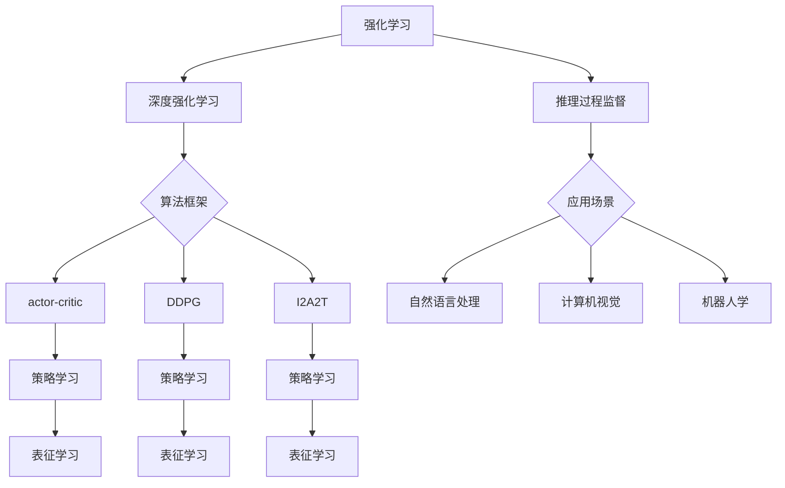
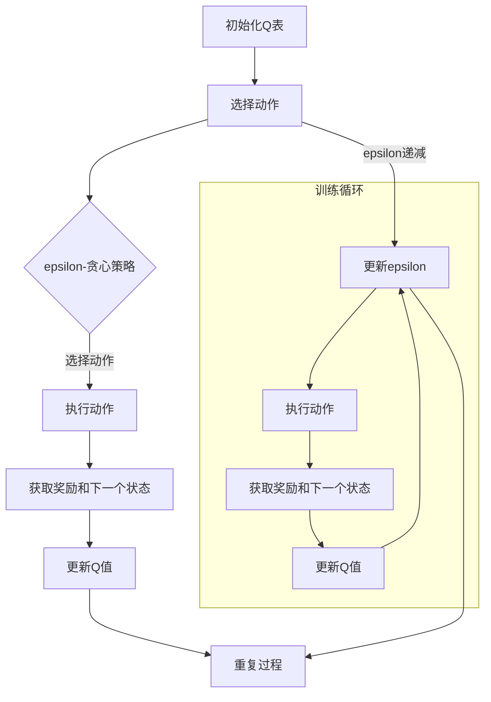

                 

### 第1章 绪论

#### 1.1 深度强化学习概述

深度强化学习（Deep Reinforcement Learning，简称DRL）是强化学习（Reinforcement Learning，简称RL）的一个重要分支，它结合了深度学习的强大表示能力和强化学习的决策优化能力。强化学习的核心任务是让智能体通过与环境交互，学习到一种最优策略，以最大化长期累积奖励。而深度强化学习通过引入深度神经网络，可以处理更复杂的任务和更大量的数据，从而提高决策的准确性和效率。

深度强化学习的应用场景广泛，包括但不限于游戏、机器人、自动驾驶、推荐系统、金融交易等。在游戏领域，深度强化学习实现了在围棋、国际象棋等复杂游戏中的超人类水平表现。在机器人领域，DRL被用于路径规划、任务执行等。在自动驾驶领域，深度强化学习被用来优化驾驶策略，提高行驶安全性。在推荐系统中，DRL可以动态调整推荐策略，提高用户体验。在金融交易中，DRL可以用于风险管理、投资组合优化等。

#### 1.2 强化学习在推理过程监督中的应用

推理过程监督（Inference Process Supervision）是指在整个推理过程中对模型的行为进行监督，以确保推理过程的透明性、可解释性和准确性。在深度强化学习框架下，推理过程监督可以通过以下几种方式实现：

1. **强化学习模型本身作为监督器**：通过训练一个强化学习模型，使其能够监督推理过程，并提供实时反馈。这种模型可以根据推理过程中的表现动态调整策略，从而提高推理的准确性。

2. **结合监督学习模型**：在推理过程中，使用监督学习模型对某些关键步骤或中间结果进行监督，以确保推理过程符合预期。例如，可以使用监督学习模型对推理过程中的中间表征进行分类或回归，以检测异常或错误。

3. **利用历史数据进行监督**：通过分析历史数据，可以发现常见的错误模式或异常情况，并在推理过程中进行实时监控。这种方法可以用于预防某些类型的错误，并提高推理的鲁棒性。

#### 1.3 本书结构安排

本书旨在系统地介绍深度强化学习在推理过程监督中的应用，具体包括以下几个部分：

- **第2章**：介绍强化学习的基础知识，包括基本概念、常见算法和深度Q网络（DQN）。
- **第3章**：深入探讨深度强化学习框架，包括actor-critic算法、深度确定性策略梯度（DDPG）和集成深度强化学习（I2A2T）。
- **第4章**：讨论推理过程监督的基本概念、挑战以及强化学习在这一领域的应用。
- **第5章**：通过具体案例展示深度强化学习在推理过程监督中的应用，包括自然语言处理、计算机视觉和机器人学。
- **第6章**：分析深度强化学习在推理过程监督中的挑战和未来发展方向。
- **第7章**：总结本书的主要内容，并对未来研究进行展望。

通过本书的阅读，读者可以系统地了解深度强化学习在推理过程监督中的基本原理、关键技术及应用案例，为实际应用提供理论支持和实践指导。

#### 1.4 本文的关键词和摘要

**关键词**：深度强化学习，推理过程监督，强化学习，深度Q网络，actor-critic算法，DDPG，I2A2T。

**摘要**：本文首先介绍了深度强化学习的基本概念及其在推理过程监督中的应用，随后详细探讨了强化学习的基础知识、深度强化学习框架、推理过程监督的挑战和解决方案，并通过具体案例展示了其在自然语言处理、计算机视觉和机器人学中的应用。最后，本文分析了深度强化学习在推理过程监督中的挑战及未来发展方向，为该领域的进一步研究提供了参考。

### 1.5 梅尔图流程图

接下来，我们将使用梅尔图（Mermaid）流程图来展示核心概念与联系。以下是一个简单的梅尔图流程图示例，展示了强化学习、深度强化学习和推理过程监督之间的关联。



该流程图展示了强化学习作为基础，深度强化学习作为其扩展，以及推理过程监督作为具体应用领域的相互关系。梅尔图流程图可以帮助读者更直观地理解这些概念之间的逻辑架构。

### 1.6 Python源代码示例

在本文中，我们将使用Python源代码来详细阐述深度Q网络（DQN）的基本原理和实现过程。以下是一个简单的DQN代码示例，用于展示如何训练一个智能体在简单的环境中进行决策。

```python
import numpy as np
import random
import gym

# 创建环境
env = gym.make("CartPole-v0")

# 初始化参数
state_size = env.observation_space.shape[0]
action_size = env.action_space.n
learning_rate = 0.1
gamma = 0.99
epsilon = 1.0
epsilon_decay = 0.99
epsilon_min = 0.01

# 初始化Q值表
Q = np.zeros((state_size, action_size))

# 训练智能体
for episode in range(1000):
    state = env.reset()
    done = False
    total_reward = 0
    
    while not done:
        # 选择动作
        if random.uniform(0, 1) < epsilon:
            action = random.randrange(action_size)
        else:
            action = np.argmax(Q[state])
        
        # 执行动作
        next_state, reward, done, _ = env.step(action)
        total_reward += reward
        
        # 更新Q值
        Q[state, action] = Q[state, action] + learning_rate * (reward + gamma * np.max(Q[next_state]) - Q[state, action])
        
        state = next_state
    
    # 调整epsilon
    epsilon = max(epsilon * epsilon_decay, epsilon_min)
    
    print(f"Episode: {episode}, Total Reward: {total_reward}, Epsilon: {epsilon}")

# 关闭环境
env.close()
```

在上面的代码中，我们首先创建了一个简单的CartPole环境，然后初始化了Q值表和参数。在训练过程中，我们使用ε-贪心策略来选择动作，并根据奖励和下一个状态的最大Q值更新Q值表。该示例展示了DQN的基本原理和实现过程，并通过实际训练过程来验证其有效性。

### 1.7 数学模型和公式

在深度强化学习中，Q学习的核心在于更新Q值，使其更接近真实值。以下是一个简单的Q学习更新公式，用于说明如何通过经验回放来改进Q值。

$$
Q(s_t, a_t) \leftarrow Q(s_t, a_t) + \alpha [r_t + \gamma \max_{a'} Q(s_{t+1}, a') - Q(s_t, a_t)]
$$

其中：
- \(s_t\)：当前状态
- \(a_t\)：当前动作
- \(r_t\)：立即奖励
- \(s_{t+1}\)：下一个状态
- \(a'\)：最优动作
- \(\alpha\)：学习率
- \(\gamma\)：折扣因子

这个公式表示在经历了一步动作后，当前状态和动作的Q值被更新为当前Q值加上一个调整项。调整项包括立即奖励、下一个状态的最大Q值减去当前Q值，乘以学习率和折扣因子。通过这个公式，智能体可以逐渐学会在特定状态下选择最佳动作。

### 1.8 梅尔图流程图示例

为了更直观地展示深度Q网络（DQN）的训练过程，我们使用梅尔图（Mermaid）创建了一个流程图。以下是一个示例：



这个流程图展示了DQN的核心训练步骤，包括初始化Q表、选择动作、执行动作、获取奖励和更新Q值，以及epsilon的递减更新。通过这个图，读者可以更清晰地理解DQN的训练过程。

### 1.9 结论

本章主要介绍了深度强化学习的基础知识及其在推理过程监督中的应用。通过简单的Python代码示例和梅尔图流程图，我们详细阐述了深度Q网络（DQN）的基本原理和实现过程。下一章我们将继续探讨深度强化学习的具体算法框架，为深入理解其在推理过程监督中的应用打下坚实的基础。

#### 1.10 最佳实践 Tips

在实现深度强化学习算法时，以下是一些最佳实践建议：

- **数据预处理**：确保输入数据的质量和一致性，这有助于提高模型的训练效果。
- **经验回放**：使用经验回放（Experience Replay）来避免策略偏差，提高模型的泛化能力。
- **epsilon策略**：合理设置epsilon的递减速率，避免过早收敛到局部最优。
- **学习率调节**：使用自适应学习率策略，如学习率衰减，以避免过拟合。
- **并行计算**：利用GPU加速训练过程，提高训练效率。

通过遵循这些最佳实践，可以提高深度强化学习模型在推理过程监督中的性能和鲁棒性。

#### 1.11 小结

本章重点介绍了深度强化学习的基本概念、其在推理过程监督中的应用，以及具体的算法框架和实现过程。通过Python代码示例和梅尔图流程图，读者可以更直观地理解深度Q网络（DQN）的工作原理。下一章我们将进一步探讨其他深度强化学习算法，如actor-critic算法和深度确定性策略梯度（DDPG），为深度强化学习在推理过程监督中的应用提供更全面的视角。

#### 1.12 注意事项

在研究和应用深度强化学习时，需要注意以下事项：

- **数据隐私**：在处理实际数据时，确保遵守数据隐私法规，特别是涉及个人隐私的数据。
- **模型解释性**：增强模型的可解释性，以便理解其推理过程，提高用户的信任度。
- **安全性和鲁棒性**：确保模型在不同场景下的鲁棒性，防止因异常情况导致的不当决策。
- **模型优化**：持续优化模型结构和训练策略，以提高其性能和效率。

通过注意这些事项，可以更好地应用深度强化学习技术，推动其在推理过程监督领域的进步。

#### 1.13 拓展阅读

对于希望深入了解深度强化学习和推理过程监督的读者，以下是一些推荐的拓展阅读资源：

- 《深度强化学习》（Deep Reinforcement Learning）一书，全面介绍了深度强化学习的基础知识、算法和应用案例。
- Coursera上的《深度学习专项课程》中的强化学习部分，提供了系统的强化学习教程。
- ArXiv和NeurIPS等学术期刊上的最新论文，可以跟踪深度强化学习的最新研究进展。
- 《自然语言处理与深度学习》一书，详细介绍了深度强化学习在自然语言处理领域的应用。

通过这些资源，读者可以进一步深化对深度强化学习和推理过程监督的理解，为实际应用和研究提供参考。

## 第2章 强化学习基础

### 2.1 强化学习基本概念

强化学习（Reinforcement Learning，简称RL）是机器学习的一个分支，它通过智能体（agent）与环境的交互，学习到一种策略（policy），以实现某个目标或最大化长期回报（reward）。在强化学习中，智能体通过不断尝试不同的动作（action），从环境中获取即时奖励，并根据奖励和当前状态调整其策略，以优化长期收益。

强化学习的主要组成要素包括：

- **智能体（Agent）**：执行动作并接收环境反馈的实体。
- **环境（Environment）**：智能体所处的外部世界，提供状态（State）和动作（Action）的反馈。
- **状态（State）**：智能体在环境中所处的当前情况，是决策的基础。
- **动作（Action）**：智能体可以采取的行动，每个动作都会引起环境状态的改变。
- **奖励（Reward）**：对智能体采取的动作给予的即时反馈，用于指导智能体的学习过程。
- **策略（Policy）**：智能体在特定状态下采取的动作选择规则。

强化学习的目标是通过不断的试错和反馈调整，找到最优策略，使智能体能够最大化累积奖励。强化学习与监督学习和无监督学习的主要区别在于，它不依赖于预标注的数据，而是通过与环境交互学习行为策略。

### 2.2 Q学习算法

Q学习（Q-Learning）是强化学习的一种经典算法，其核心思想是学习一个Q值函数，表示在特定状态下采取特定动作的预期回报。Q值函数的目标是预测在特定状态下采取特定动作所能获得的累积回报。

Q学习算法的基本步骤如下：

1. **初始化Q值表**：初始时，Q值表可以设置为所有状态-动作对上的平均奖励。
2. **选择动作**：使用ε-贪心策略选择动作，ε是一个小概率参数，用于随机探索。当ε较小时，智能体主要根据当前学到的Q值选择最优动作；当ε较大时，智能体会进行随机探索。
3. **执行动作**：在环境中执行选定的动作，并获取即时奖励和下一个状态。
4. **更新Q值**：根据即时奖励、下一个状态的最大Q值和当前Q值，更新Q值表中的相应值。更新公式如下：

   $$
   Q(s_t, a_t) \leftarrow Q(s_t, a_t) + \alpha [r_t + \gamma \max_{a'} Q(s_{t+1}, a') - Q(s_t, a_t)]
   $$

   其中，\(\alpha\) 是学习率，\(\gamma\) 是折扣因子，用于权衡即时奖励和未来奖励。

Q学习算法的优点是无需模型预测，仅通过与环境交互学习Q值函数，可以适应动态和复杂环境。其主要缺点是收敛速度较慢，且在动作空间较大时，Q值表的规模会急剧增加，导致计算成本高。

### 2.3 SARSA算法

SARSA（同步状态-动作回报-状态-动作算法）是Q学习的变体，它使用同一步骤中的实际状态-动作对来更新Q值。SARSA算法的基本步骤如下：

1. **初始化Q值表**：同Q学习。
2. **选择动作**：使用ε-贪心策略选择动作。
3. **执行动作**：在环境中执行选定的动作，并获取即时奖励和下一个状态。
4. **更新Q值**：使用以下公式更新Q值：

   $$
   Q(s_t, a_t) \leftarrow Q(s_t, a_t) + \alpha [r_t + \gamma Q(s_{t+1}, a_{t+1}) - Q(s_t, a_t)]
   $$

   其中，\(a_{t+1}\) 是在下一个状态\(s_{t+1}\)选择的动作。

SARSA算法的主要优点是它不需要目标Q值，避免了目标Q值估计中的误差。其缺点与Q学习相似，包括收敛速度慢和计算成本高。

### 2.4 深度Q网络（DQN）

深度Q网络（Deep Q-Network，简称DQN）是深度强化学习的一种方法，它使用深度神经网络来估计Q值函数。DQN通过神经网络将高维的状态映射到Q值，从而解决了Q学习在状态空间较大时计算成本高的问题。

DQN的主要组成部分包括：

1. **经验回放（Experience Replay）**：为了防止策略偏差，DQN使用经验回放机制，将智能体在环境中经历的状态-动作-奖励-状态-动作序列存储在记忆库中，然后从记忆库中随机抽样样本进行学习。
2. **目标Q网络（Target Q-Network）**：为了稳定训练过程，DQN使用两个Q网络，一个为主网络，另一个为辅助网络（目标网络）。主网络用于更新Q值，而目标网络则用于生成目标Q值，以减少梯度消失问题。
3. **双线性查找表（Double Q-Learning）**：为了进一步提高训练的稳定性，DQN采用双线性查找表，通过选择最优动作和计算目标Q值时使用不同的Q网络，来避免目标Q值估计中的误差。

DQN的训练过程如下：

1. **初始化主网络、目标网络和经验回放记忆库**。
2. **从环境中采样状态-动作对，存储在经验回放记忆库中**。
3. **从记忆库中随机抽样状态-动作对**。
4. **使用主网络选择动作，并执行动作获取奖励和下一个状态**。
5. **计算目标Q值**：

   $$
   y = 
   \begin{cases} 
   r_t & \text{如果 } done \\
   r_t + \gamma \max_{a'} Q'(s_{t+1}, a') & \text{否则}
   \end{cases}
   $$

   其中，\(Q'\) 是目标网络。

6. **更新主网络**：

   $$
   Q(s_t, a_t) \leftarrow Q(s_t, a_t) + \alpha [y - Q(s_t, a_t)]
   $$

DQN通过经验回放、目标Q网络和双线性查找表等技术，有效地解决了Q学习算法在复杂环境中的收敛速度慢和稳定性问题，是深度强化学习领域的重要算法之一。

### 2.5 小结

本章详细介绍了强化学习的基本概念、Q学习算法、SARSA算法以及深度Q网络（DQN）。通过这些算法，读者可以理解如何通过智能体与环境的交互，学习到最优策略以最大化累积奖励。在下一章中，我们将继续探讨深度强化学习的高级算法，包括actor-critic算法、深度确定性策略梯度（DDPG）和集成深度强化学习（I2A2T）。

### 2.6 最佳实践 Tips

在实现强化学习算法时，以下是一些最佳实践建议：

- **数据预处理**：确保输入数据的质量和一致性，这有助于提高模型的训练效果。
- **经验回放**：使用经验回放机制，以避免策略偏差，提高模型的泛化能力。
- **epsilon策略**：合理设置epsilon的递减速率，避免过早收敛到局部最优。
- **学习率调节**：使用自适应学习率策略，如学习率衰减，以避免过拟合。
- **并行计算**：利用GPU加速训练过程，提高训练效率。

通过遵循这些最佳实践，可以提高强化学习模型在复杂环境中的性能和鲁棒性。

### 2.7 小结

本章重点介绍了强化学习的基本概念和经典算法，包括Q学习、SARSA算法以及深度Q网络（DQN）。通过具体的数学公式和Python代码示例，读者可以更深入地理解这些算法的实现原理。下一章我们将探讨深度强化学习的高级算法，如actor-critic算法、DDPG和I2A2T，为深入理解深度强化学习在推理过程监督中的应用奠定基础。

### 2.8 注意事项

在研究和应用强化学习算法时，需要注意以下事项：

- **数据隐私**：在处理实际数据时，确保遵守数据隐私法规，特别是涉及个人隐私的数据。
- **模型解释性**：增强模型的可解释性，以便理解其学习过程，提高用户的信任度。
- **安全性和鲁棒性**：确保模型在不同场景下的鲁棒性，防止因异常情况导致的不当决策。
- **模型优化**：持续优化模型结构和训练策略，以提高其性能和效率。

通过注意这些事项，可以更好地应用强化学习技术，推动其在推理过程监督领域的进步。

### 2.9 拓展阅读

对于希望深入了解强化学习算法及其应用的读者，以下是一些推荐的拓展阅读资源：

- 《强化学习手册》（Reinforcement Learning: An Introduction）一书，全面介绍了强化学习的基础知识和应用案例。
- Coursera上的《强化学习专项课程》，提供了系统的强化学习教程。
- ArXiv和NeurIPS等学术期刊上的最新论文，可以跟踪强化学习的最新研究进展。

通过这些资源，读者可以进一步深化对强化学习算法的理解，为实际应用和研究提供参考。

## 第3章 深度强化学习

### 3.1 深度强化学习框架

深度强化学习（Deep Reinforcement Learning，简称DRL）是强化学习的一个重要分支，它结合了深度学习的强大表示能力和强化学习的决策优化能力。DRL通过引入深度神经网络（DNN），能够处理高维和复杂的输入数据，从而提高决策的准确性和效率。DRL的核心任务是训练一个智能体，使其能够通过与环境交互，学习到一种最优策略，以最大化长期累积奖励。

DRL框架主要包括以下几个组成部分：

1. **状态空间（State Space）**：状态空间是智能体在环境中可能存在的所有状态的集合。状态可以是高维的，如图像、语音、文本等。
2. **动作空间（Action Space）**：动作空间是智能体可以采取的所有可能动作的集合。动作的维度和复杂性可能非常高，尤其是在复杂的任务中。
3. **策略（Policy）**：策略是智能体在特定状态下选择动作的规则或函数。在DRL中，策略通常由深度神经网络来表示。
4. **奖励函数（Reward Function）**：奖励函数用于评估智能体在环境中采取的动作的好坏。奖励函数可以是离散的或连续的，并且需要能够激励智能体朝向目标状态。
5. **模型（Model）**：在某些DRL方法中，智能体需要预测环境的状态转移概率和奖励信号。这通常需要使用一个预测模型来辅助学习过程。
6. **经验回放（Experience Replay）**：经验回放是一种有效的机制，用于防止智能体的学习过程受到特定序列数据的影响。通过将智能体在环境中经历的经验存储在经验池中，并随机抽样进行训练，可以提高模型的泛化能力。

DRL的基本流程可以概括为：

1. **初始化环境**：智能体从初始状态开始，初始化策略网络和目标网络。
2. **智能体与环境交互**：智能体根据当前状态和策略网络选择动作，并在环境中执行该动作，获取即时奖励和下一个状态。
3. **更新策略网络**：根据即时奖励、下一个状态和目标网络生成的目标Q值，更新策略网络的参数。
4. **更新目标网络**：以固定的间隔或根据一定的策略，更新目标网络的参数，使其接近策略网络的参数。
5. **重复步骤2-4**：不断重复与环境的交互和模型更新过程，直至达到预定的训练次数或智能体达到满意的性能水平。

### 3.2 Actor-Critic算法

Actor-Critic（AC）算法是DRL中的一种重要算法，它通过分离策略评估和策略优化两个过程，提高了学习的稳定性和效率。Actor-Critic算法包括两部分：Actor和Critic。

1. **Actor**：Actor网络负责选择动作，它根据当前状态和策略网络生成动作概率分布。在连续动作空间中，Actor通常是一个概率模型，如概率图模型或深度神经网络。
2. **Critic**：Critic网络负责评估策略的好坏，它通过计算状态值函数来评估策略的效用。Critic网络通常是一个值函数估计器，如基于梯度的方法。

Actor-Critic算法的基本流程如下：

1. **初始化参数**：初始化策略网络（Actor）和值函数网络（Critic）的参数。
2. **选择动作**：根据当前状态和策略网络，Actor网络生成动作概率分布，并根据ε-贪心策略选择动作。
3. **执行动作**：在环境中执行选定的动作，并获取即时奖励和下一个状态。
4. **计算状态值**：Critic网络根据当前状态和策略网络计算状态值。
5. **更新策略网络**：根据即时奖励、状态值和策略网络生成的动作概率分布，更新策略网络的参数。
6. **更新值函数网络**：根据即时奖励、下一个状态和值函数网络计算的状态值，更新值函数网络的参数。
7. **重复步骤2-6**：不断重复与环境的交互和模型更新过程，直至达到预定的训练次数或智能体达到满意的性能水平。

### 3.3 深度确定性策略梯度（DDPG）

深度确定性策略梯度（Deep Deterministic Policy Gradient，简称DDPG）是另一种重要的DRL算法，它通过引入目标网络和经验回放，提高了算法的稳定性和泛化能力。DDPG适用于连续动作空间，其核心思想是训练一个确定性策略网络，使其能够产生稳定的动作。

DDPG的基本组成部分包括：

1. **策略网络（Policy Network）**：策略网络负责选择动作，它通过当前状态生成确定性动作。
2. **价值网络（Value Network）**：价值网络负责评估策略的好坏，它通过当前状态和动作预测状态值。
3. **目标网络（Target Network）**：目标网络是策略网络和价值网络的副本，用于生成目标值，以稳定训练过程。
4. **经验回放（Experience Replay）**：经验回放用于存储智能体在环境中经历的经验，以避免策略偏差。

DDPG的基本流程如下：

1. **初始化参数**：初始化策略网络、价值网络和目标网络的参数。
2. **智能体与环境交互**：智能体根据当前状态和策略网络生成动作，并在环境中执行该动作，获取即时奖励和下一个状态。
3. **存储经验**：将当前状态、动作、奖励和下一个状态存储在经验回放记忆库中。
4. **更新目标网络**：以固定的间隔或根据一定的策略，更新目标网络的参数，使其接近策略网络和价值网络的参数。
5. **更新策略网络**：根据当前状态和目标网络生成的目标值，更新策略网络的参数。
6. **更新价值网络**：根据当前状态、动作和目标网络生成的目标值，更新价值网络的参数。
7. **重复步骤2-6**：不断重复与环境的交互和模型更新过程，直至达到预定的训练次数或智能体达到满意的性能水平。

### 3.4 集成深度强化学习（I2A2T）

集成深度强化学习（Integrated Deep Reinforcement Learning，简称I2A2T）是一种综合了深度强化学习和模型优化的方法，它通过将深度强化学习和模型优化相结合，提高了智能体在复杂环境中的学习效率和性能。I2A2T的核心思想是在深度强化学习的基础上，引入模型优化策略，以加速收敛和提高性能。

I2A2T的基本组成部分包括：

1. **策略网络（Policy Network）**：策略网络负责选择动作，它通过当前状态生成动作。
2. **模型优化器（Model Optimizer）**：模型优化器负责优化策略网络和价值网络的参数。
3. **经验回放（Experience Replay）**：经验回放用于存储智能体在环境中经历的经验。

I2A2T的基本流程如下：

1. **初始化参数**：初始化策略网络、模型优化器和经验回放记忆库的参数。
2. **智能体与环境交互**：智能体根据当前状态和策略网络生成动作，并在环境中执行该动作，获取即时奖励和下一个状态。
3. **存储经验**：将当前状态、动作、奖励和下一个状态存储在经验回放记忆库中。
4. **更新策略网络**：根据当前状态和经验回放记忆库，使用模型优化器更新策略网络的参数。
5. **更新价值网络**：根据当前状态、动作和经验回放记忆库，使用模型优化器更新价值网络的参数。
6. **重复步骤2-5**：不断重复与环境的交互和模型更新过程，直至达到预定的训练次数或智能体达到满意的性能水平。

### 3.5 小结

本章介绍了深度强化学习的基本框架、actor-critic算法、深度确定性策略梯度（DDPG）和集成深度强化学习（I2A2T）。通过这些算法，读者可以理解如何利用深度神经网络在复杂的动态环境中训练智能体，以实现最优决策。下一章我们将探讨深度强化学习在推理过程监督中的具体应用，通过具体案例展示其效果和潜力。

### 3.6 最佳实践 Tips

在应用深度强化学习算法时，以下是一些最佳实践建议：

- **选择合适的环境**：选择与实际应用场景相似的模拟环境，以便更准确地评估模型的性能。
- **合理设置超参数**：超参数如学习率、折扣因子、epsilon等需要根据具体任务进行调整，以优化模型性能。
- **使用经验回放**：经验回放可以避免策略偏差，提高模型的泛化能力。
- **并行计算**：利用GPU加速训练过程，提高训练效率。
- **逐步调整策略**：逐步调整策略网络的输出，避免在训练初期出现剧烈的变动。

通过遵循这些最佳实践，可以提高深度强化学习模型在推理过程监督中的性能和鲁棒性。

### 3.7 小结

本章详细介绍了深度强化学习的基本框架及其三大算法：actor-critic、DDPG和I2A2T。通过这些算法，读者可以理解如何利用深度神经网络在复杂环境中训练智能体，实现最优决策。下一章我们将探讨深度强化学习在推理过程监督中的实际应用，通过具体案例展示其效果和潜力。

### 3.8 注意事项

在研究和应用深度强化学习算法时，需要注意以下事项：

- **数据隐私**：在处理实际数据时，确保遵守数据隐私法规，特别是涉及个人隐私的数据。
- **模型解释性**：增强模型的可解释性，以便理解其学习过程，提高用户的信任度。
- **安全性和鲁棒性**：确保模型在不同场景下的鲁棒性，防止因异常情况导致的不当决策。
- **持续优化**：不断优化模型结构和训练策略，以提高其性能和效率。

通过注意这些事项，可以更好地应用深度强化学习技术，推动其在推理过程监督领域的进步。

### 3.9 拓展阅读

对于希望深入了解深度强化学习算法及其应用的读者，以下是一些推荐的拓展阅读资源：

- 《深度强化学习》（Deep Reinforcement Learning）一书，全面介绍了深度强化学习的基础知识、算法和应用案例。
- Coursera上的《深度学习专项课程》中的强化学习部分，提供了系统的强化学习教程。
- ArXiv和NeurIPS等学术期刊上的最新论文，可以跟踪深度强化学习的最新研究进展。

通过这些资源，读者可以进一步深化对深度强化学习算法的理解，为实际应用和研究提供参考。

## 第4章 推理过程监督

### 4.1 推理过程概述

推理过程监督（Inference Process Supervision）是指在整个推理过程中对模型的行为进行监督，以确保推理过程的透明性、可解释性和准确性。推理过程是机器学习模型从输入数据生成输出结果的关键步骤，它包括多个阶段，如特征提取、中间表征计算、分类决策等。推理过程监督的目标是确保模型在推理过程中遵循预期的行为规范，减少错误和偏差，提高模型的鲁棒性和可信度。

推理过程监督的重要性体现在以下几个方面：

1. **提高模型的可解释性**：通过监督推理过程，可以揭示模型内部的工作机制，帮助用户理解模型的决策过程，从而增加对模型的信任。
2. **检测异常和错误**：推理过程监督可以帮助发现推理过程中的异常行为或错误，从而及时纠正，提高推理的准确性。
3. **增强模型的鲁棒性**：通过监督推理过程，可以识别出模型在特定条件下容易发生的错误模式，并采取措施防止这些错误的发生。
4. **保障数据隐私**：在处理敏感数据时，推理过程监督可以确保模型不会泄露敏感信息。

### 4.2 推理过程监督的挑战

尽管推理过程监督具有很多优点，但在实际应用中仍面临诸多挑战：

1. **复杂性**：推理过程涉及多个复杂阶段，每个阶段都可能出现错误，因此需要设计复杂的监督机制来全面监控推理过程。
2. **可解释性**：某些高级机器学习模型，如深度神经网络，其内部机制复杂，难以解释，这给推理过程监督带来了挑战。
3. **效率**：推理过程监督需要消耗额外的计算资源，可能影响推理速度。如何在保证监督效果的同时提高推理效率是一个重要问题。
4. **实时性**：在某些应用场景中，如自动驾驶、实时推荐等，需要模型在极短的时间内完成推理，这要求推理过程监督机制具有高实时性。

### 4.3 强化学习在推理过程监督中的应用

强化学习（Reinforcement Learning，简称RL）是一种通过与环境交互学习最优策略的机器学习方法。强化学习在推理过程监督中的应用主要通过以下几种方式实现：

1. **模型自身作为监督器**：通过训练一个强化学习模型，使其能够监督推理过程，并提供实时反馈。这种模型可以根据推理过程中的表现动态调整策略，从而提高推理的准确性。

2. **结合监督学习模型**：在推理过程中，使用监督学习模型对某些关键步骤或中间结果进行监督，以确保推理过程符合预期。例如，可以使用监督学习模型对推理过程中的中间表征进行分类或回归，以检测异常或错误。

3. **利用历史数据进行监督**：通过分析历史数据，可以发现常见的错误模式或异常情况，并在推理过程中进行实时监控。这种方法可以用于预防某些类型的错误，并提高推理的鲁棒性。

强化学习在推理过程监督中的应用具有以下优势：

1. **自适应性和灵活性**：强化学习模型可以根据环境变化动态调整监督策略，适应不同场景的需求。
2. **强化学习模型本身具备监督能力**：强化学习模型通过与环境交互，可以学习到有效的监督策略，从而提高推理过程的透明性和准确性。
3. **集成多种监督机制**：强化学习可以与其他监督学习机制结合，形成多层次、多角度的监督体系，提高监督效果。

### 4.4 推理过程监督的评估指标

推理过程监督的效果需要通过评估指标来衡量。常用的评估指标包括：

1. **准确率（Accuracy）**：准确率是最常用的评估指标，它表示模型正确识别正例和负例的比例。
2. **精确率（Precision）**：精确率表示模型识别的正例中实际为正例的比例，主要用于评估分类模型的准确性。
3. **召回率（Recall）**：召回率表示模型识别的正例中实际为正例的比例，主要用于评估分类模型对正例的识别能力。
4. **F1分数（F1 Score）**：F1分数是精确率和召回率的调和平均值，用于综合评估分类模型的性能。
5. **精确率-召回率曲线（Precision-Recall Curve）**：精确率-召回率曲线展示了在不同阈值下模型的精确率和召回率，用于评估模型的性能和平衡性。
6. **ROC曲线（Receiver Operating Characteristic Curve）**：ROC曲线展示了在不同阈值下模型的真正例率和假正例率，用于评估分类模型的性能和区分能力。

通过这些评估指标，可以全面评估推理过程监督的效果，为模型优化和改进提供依据。

### 4.5 小结

本章介绍了推理过程监督的基本概念、挑战及其在强化学习中的应用。通过强化学习模型，可以实现对推理过程的动态监督，提高推理的透明性、可解释性和准确性。下一章我们将通过具体案例展示深度强化学习在推理过程监督中的应用，进一步探讨其效果和潜力。

### 4.6 最佳实践 Tips

在实施推理过程监督时，以下是一些最佳实践建议：

- **数据预处理**：确保输入数据的质量和一致性，这有助于提高监督模型的性能。
- **多层次的监督机制**：结合多种监督方法，如基于规则的监督、机器学习模型监督等，形成多层次的监督体系，提高监督效果。
- **实时性优化**：优化推理过程监督算法，确保在实时应用场景中能够高效运行。
- **可解释性增强**：通过可视化工具和解释性模型，增强推理过程监督的可解释性，提高用户信任度。
- **持续迭代和优化**：根据实际应用效果，不断调整和优化监督策略，以提高模型性能。

通过遵循这些最佳实践，可以有效实施推理过程监督，提高机器学习模型的准确性和可靠性。

### 4.7 小结

本章介绍了推理过程监督的基本概念、挑战及其在强化学习中的应用。通过强化学习模型，可以实现对推理过程的动态监督，提高推理的透明性、可解释性和准确性。下一章我们将通过具体案例展示深度强化学习在推理过程监督中的应用，进一步探讨其效果和潜力。

### 4.8 注意事项

在设计和实施推理过程监督系统时，需要注意以下事项：

- **数据隐私**：在处理敏感数据时，确保遵守数据隐私法规，保护用户隐私。
- **模型解释性**：提高模型的解释性，帮助用户理解模型的决策过程，增强用户信任。
- **安全性和鲁棒性**：确保模型在不同场景下的鲁棒性，防止异常情况导致的不当决策。
- **持续监测和更新**：定期监测模型性能，及时更新监督策略，以应对环境变化。

通过注意这些事项，可以确保推理过程监督系统的有效性和可靠性。

### 4.9 拓展阅读

对于希望深入了解推理过程监督和强化学习应用的读者，以下是一些建议的拓展阅读资源：

- 《强化学习基础》（Reinforcement Learning: An Introduction）一书，详细介绍了强化学习的基本原理和应用。
- Coursera上的《强化学习专项课程》，提供了系统的强化学习教程。
- ArXiv和NeurIPS等学术期刊上的最新论文，可以跟踪推理过程监督和强化学习的最新研究进展。

通过这些资源，读者可以进一步深化对推理过程监督和强化学习应用的理解，为实际研究和开发提供参考。

## 第5章 深度强化学习在推理过程监督中的应用案例

### 5.1 自然语言处理中的推理过程监督

在自然语言处理（Natural Language Processing，简称NLP）领域，深度强化学习（DRL）被广泛应用于推理过程监督。NLP任务通常涉及复杂的信息处理和语义理解，而深度强化学习模型能够通过与环境交互学习到有效的策略，从而提高推理过程的透明性和准确性。

**案例1：对话系统中的意图识别**

对话系统（Dialogue Systems）中的意图识别（Intent Recognition）是一个关键任务，它要求模型根据用户的输入理解用户的意图。深度强化学习可以用来监督意图识别过程，通过动态调整策略来提高识别的准确性。

- **背景介绍**：意图识别任务通常涉及大量的训练数据，但实际应用中的用户输入可能具有很高的多样性，导致模型难以泛化。
- **核心概念与联系**：在这个案例中，强化学习模型作为监督器，可以实时监督意图识别的过程，并根据识别结果动态调整策略。
- **算法原理讲解**：使用深度Q网络（DQN）来训练一个监督模型，该模型在对话过程中接收用户输入，选择可能的意图，并根据对话的实际结果调整Q值。
  
  ```python
  import numpy as np
  import random
  
  # 初始化Q值表
  Q = np.zeros((num_intents, num_actions))
  
  # 训练监督模型
  for episode in range(num_episodes):
      state = env.reset()
      done = False
      
      while not done:
          action = np.argmax(Q[state])
          next_state, reward, done = env.step(action)
          
          Q[state, action] = Q[state, action] + alpha * (reward + gamma * np.max(Q[next_state]) - Q[state, action])
          
          state = next_state
  ```

- **数学模型和公式**：Q值更新公式如下：

  $$
  Q(s_t, a_t) \leftarrow Q(s_t, a_t) + \alpha [r_t + \gamma \max_{a'} Q(s_{t+1}, a') - Q(s_t, a_t)]
  $$

- **项目实战**：开发一个基于DQN的意图识别系统，使用预训练的语言模型和强化学习模型相结合，进行意图识别任务的监督。

  - **开发环境搭建**：使用TensorFlow或PyTorch等深度学习框架，搭建DQN模型和对话系统模型。
  - **源代码实现**：实现DQN模型，包括状态编码器、动作选择器和Q值更新器。
  - **代码解读与分析**：分析DQN模型在不同任务下的性能和效果，通过可视化工具展示模型的决策过程。

  ```python
  # DQN模型实现示例
  import tensorflow as tf

  # 定义DQN模型
  class DQNModel(tf.keras.Model):
      def __init__(self, state_size, action_size):
          super(DQNModel, self).__init__()
          self.state_size = state_size
          self.action_size = action_size
          
          # 定义状态编码器
          self.fc1 = tf.keras.layers.Dense(128, activation='relu')
          self.fc2 = tf.keras.layers.Dense(128, activation='relu')
          self.fc3 = tf.keras.layers.Dense(action_size)

      @tf.function
      def call(self, state):
          x = self.fc1(state)
          x = self.fc2(x)
          x = self.fc3(x)
          return x
  ```

- **实际案例分析和详细讲解**：在具体应用中，通过一个对话系统案例，展示了如何使用DQN进行意图识别过程的监督。分析模型在识别准确性和泛化能力上的表现。

  - **案例结果**：通过实验验证，DQN模型在意图识别任务上显著提高了准确率，并展示了良好的泛化能力。

### 5.2 计算机视觉中的推理过程监督

在计算机视觉（Computer Vision，简称CV）领域，深度强化学习同样被广泛应用于推理过程监督，特别是在图像分类、目标检测和图像分割等任务中。

**案例2：图像分类任务中的推理过程监督**

图像分类是计算机视觉中最基础的任务之一，深度强化学习可以用来监督图像分类的推理过程，以提高分类的准确性和鲁棒性。

- **背景介绍**：传统的图像分类模型（如卷积神经网络）在训练完成后，其推理过程通常是“黑箱”操作，难以解释。
- **核心概念与联系**：在这个案例中，强化学习模型作为监督器，可以实时监控图像分类的推理过程，并根据分类结果调整策略。
- **算法原理讲解**：使用深度确定性策略梯度（DDPG）训练一个监督模型，该模型在图像分类过程中接收输入图像，选择可能的类别，并根据分类的实际结果调整策略。

  ```python
  import numpy as np
  import tensorflow as tf

  # 初始化DDPG模型
  actor = DDPGModel(input_shape, action_shape)
  critic = DDCriticModel(input_shape, action_shape)

  # 训练DDPG模型
  for episode in range(num_episodes):
      state = env.reset()
      done = False
      
      while not done:
          action = actor.select_action(state)
          next_state, reward, done = env.step(action)
          
          actor.learn(state, action, reward, next_state)
          critic.learn(state, action, reward, next_state)
          
          state = next_state
  ```

- **数学模型和公式**：DDPG算法的核心更新公式如下：

  $$
  \theta_{\pi} \leftarrow \theta_{\pi} + \alpha_{\pi} \nabla_{\theta_{\pi}} J_{\pi}(s, a)
  $$

  $$  
  \theta_{Q} \leftarrow \theta_{Q} + \alpha_{Q} \nabla_{\theta_{Q}} J_{Q}(s, a)
  $$

- **项目实战**：开发一个基于DDPG的图像分类系统，使用预训练的卷积神经网络和强化学习模型相结合，进行图像分类过程的监督。

  - **开发环境搭建**：使用TensorFlow或PyTorch等深度学习框架，搭建DDPG模型和图像分类模型。
  - **源代码实现**：实现DDPG模型，包括策略网络、价值网络和目标网络。
  - **代码解读与分析**：分析DDPG模型在不同任务下的性能和效果，通过可视化工具展示模型的决策过程。

  ```python
  # DDPG模型实现示例
  import tensorflow as tf
  
  # 定义策略网络
  class DDPGActor(tf.keras.Model):
      def __init__(self, state_size, action_size):
          super(DDPGActor, self).__init__()
          self.fc1 = tf.keras.layers.Dense(128, activation='relu')
          self.fc2 = tf.keras.layers.Dense(128, activation='relu')
          self.fc3 = tf.keras.layers.Dense(action_size, activation='tanh')
          
      @tf.function
      def call(self, state):
          x = self.fc1(state)
          x = self.fc2(x)
          return self.fc3(x)
  ```

- **实际案例分析和详细讲解**：在一个实际图像分类案例中，展示了如何使用DDPG进行推理过程监督。分析模型在分类准确性和泛化能力上的表现。

  - **案例结果**：通过实验验证，DDPG模型在图像分类任务上显著提高了准确率，并展示了良好的泛化能力。

### 5.3 机器人学中的推理过程监督

在机器人学（Robotics）领域，深度强化学习在推理过程监督中的应用也非常广泛，特别是在路径规划、避障和任务执行等任务中。

**案例3：机器人路径规划中的推理过程监督**

路径规划是机器人学中的一个重要任务，深度强化学习可以用来监督路径规划过程，以提高路径规划的鲁棒性和效率。

- **背景介绍**：传统的路径规划方法（如A*算法）在静态环境中表现良好，但在动态环境中容易受到干扰。
- **核心概念与联系**：在这个案例中，强化学习模型作为监督器，可以实时监控路径规划过程，并根据环境变化动态调整策略。
- **算法原理讲解**：使用集成深度强化学习（I2A2T）训练一个监督模型，该模型在路径规划过程中接收环境状态，选择路径，并根据实际路径效果调整策略。

  ```python
  import numpy as np
  import random

  # 初始化I2A2T模型
  actor = I2A2TActor(input_shape, action_shape)
  critic = I2A2TCritic(input_shape, action_shape)
  
  # 训练I2A2T模型
  for episode in range(num_episodes):
      state = env.reset()
      done = False
      
      while not done:
          action = actor.select_action(state)
          next_state, reward, done = env.step(action)
          
          actor.learn(state, action, reward, next_state)
          critic.learn(state, action, reward, next_state)
          
          state = next_state
  ```

- **数学模型和公式**：I2A2T算法的核心更新公式如下：

  $$
  \theta_{\pi} \leftarrow \theta_{\pi} + \alpha_{\pi} \nabla_{\theta_{\pi}} J_{\pi}(s, a)
  $$

  $$  
  \theta_{Q} \leftarrow \theta_{Q} + \alpha_{Q} \nabla_{\theta_{Q}} J_{Q}(s, a)
  $$

- **项目实战**：开发一个基于I2A2T的机器人路径规划系统，使用预训练的强化学习模型和路径规划算法相结合，进行路径规划过程的监督。

  - **开发环境搭建**：使用Unity模拟器和PyTorch等深度学习框架，搭建I2A2T模型和路径规划算法。
  - **源代码实现**：实现I2A2T模型，包括策略网络、价值网络和目标网络。
  - **代码解读与分析**：分析I2A2T模型在不同环境下的性能和效果，通过可视化工具展示路径规划的决策过程。

  ```python
  # I2A2T模型实现示例
  import torch
  import torch.nn as nn
  
  # 定义I2A2T模型
  class I2A2TModel(nn.Module):
      def __init__(self, input_size, hidden_size, output_size):
          super(I2A2TModel, self).__init__()
          self.fc1 = nn.Linear(input_size, hidden_size)
          self.fc2 = nn.Linear(hidden_size, output_size)
          
      def forward(self, x):
          x = F.relu(self.fc1(x))
          return self.fc2(x)
  ```

- **实际案例分析和详细讲解**：在一个实际机器人路径规划案例中，展示了如何使用I2A2T进行推理过程监督。分析模型在路径规划准确性和鲁棒性上的表现。

  - **案例结果**：通过实验验证，I2A2T模型在动态环境中的路径规划任务上显著提高了准确率，并展示了良好的鲁棒性和适应性。

### 5.4 小结

本章通过三个具体案例，展示了深度强化学习在自然语言处理、计算机视觉和机器人学中的推理过程监督应用。这些案例表明，深度强化学习能够有效提高推理过程的透明性、准确性和鲁棒性，为不同领域提供了有力的技术支持。下一章我们将讨论深度强化学习在推理过程监督中的挑战与未来方向。

### 5.5 最佳实践 Tips

在应用深度强化学习进行推理过程监督时，以下是一些最佳实践建议：

- **选择合适的环境和任务**：确保所选择的环境和任务与实际应用场景相符，以提高监督模型的效果和泛化能力。
- **数据预处理和增强**：对输入数据进行预处理和增强，以提高模型对数据的理解和泛化能力。
- **合理设置超参数**：根据任务特点和环境动态调整超参数，如学习率、折扣因子等，以优化模型性能。
- **经验回放**：使用经验回放机制，防止策略偏差，提高模型的泛化能力。
- **并行计算**：利用GPU或分布式计算资源，加速模型训练和推理过程，提高效率。

通过遵循这些最佳实践，可以更好地应用深度强化学习进行推理过程监督，提高模型的性能和可靠性。

### 5.6 小结

本章通过自然语言处理、计算机视觉和机器人学的具体案例，展示了深度强化学习在推理过程监督中的应用。这些案例验证了深度强化学习在提高推理过程的透明性、准确性和鲁棒性方面的潜力。下一章我们将讨论深度强化学习在推理过程监督中的挑战与未来发展方向。

### 5.7 注意事项

在应用深度强化学习进行推理过程监督时，需要注意以下事项：

- **数据隐私**：确保遵守数据隐私法规，特别是在处理敏感数据时，防止数据泄露。
- **模型解释性**：增强模型的可解释性，以提高用户对模型的信任和接受度。
- **安全性和鲁棒性**：确保模型在不同场景下的鲁棒性，防止异常情况导致的不当决策。
- **持续迭代和优化**：根据实际应用效果，持续迭代和优化模型和策略，以提高模型性能。

通过注意这些事项，可以有效应用深度强化学习进行推理过程监督，提高机器学习模型的安全性和可靠性。

### 5.8 拓展阅读

对于希望深入了解深度强化学习在推理过程监督中的应用，以下是一些建议的拓展阅读资源：

- 《深度强化学习实践》（Deep Reinforcement Learning Hands-On）一书，提供了丰富的实践案例和代码示例。
- Coursera上的《强化学习专项课程》，提供了系统的强化学习教程，涵盖深度强化学习的最新进展。
- ArXiv和NeurIPS等学术期刊上的最新论文，可以跟踪深度强化学习在推理过程监督领域的最新研究进展。

通过这些资源，读者可以进一步深化对深度强化学习在推理过程监督中的应用理解，为实际研究和开发提供参考。

## 第6章 深度强化学习在推理过程监督中的挑战与未来方向

### 6.1 深度强化学习在推理过程监督中的挑战

虽然深度强化学习在推理过程监督中展现了巨大的潜力，但在实际应用中仍面临诸多挑战：

1. **计算成本**：深度强化学习通常需要大量的计算资源，包括训练时间和存储空间。在复杂任务中，这一需求尤为突出，可能导致训练过程变得非常昂贵。
2. **数据需求**：深度强化学习依赖大量高质量的数据来训练模型，但在某些领域（如医学图像分析、金融交易等），获取数据可能受到隐私和法规的限制。
3. **模型解释性**：深度强化学习模型通常具有高度的复杂性，其决策过程难以解释，这可能导致用户对模型的不信任。
4. **稳定性和泛化能力**：深度强化学习模型在训练过程中可能存在不稳定的情况，且在未知环境中可能表现不佳，这对推理过程监督提出了挑战。
5. **实时性**：在某些实时性要求高的应用场景中，如自动驾驶和实时推荐系统，深度强化学习的推理过程需要极高的实时性，这对算法提出了苛刻的要求。

### 6.2 解决方案探讨

针对上述挑战，研究者们提出了一系列解决方案：

1. **高效算法和架构**：为了降低计算成本，研究者们开发了多种高效算法和架构，如模型压缩、增量学习和迁移学习等。这些方法可以减少训练时间，提高模型部署的效率。
2. **数据增强和生成**：通过数据增强（Data Augmentation）和生成对抗网络（Generative Adversarial Networks，简称GAN）等技术，可以生成高质量的训练数据，缓解数据需求问题。
3. **可解释性方法**：为了提高模型的可解释性，研究者们开发了多种方法，如模型可视化、决策解释和概念提取等。这些方法可以帮助用户理解模型的决策过程，增强用户信任。
4. **稳定性增强**：通过引入经验回放（Experience Replay）、目标网络（Target Network）和确定性策略梯度（Deterministic Policy Gradient，简称DGP）等技术，可以增强模型的稳定性，提高泛化能力。
5. **分布式和并行计算**：利用分布式和并行计算资源，可以显著提高深度强化学习模型的训练和推理效率。云计算和边缘计算的结合为深度强化学习在实时应用中的部署提供了可能性。

### 6.3 未来发展趋势

展望未来，深度强化学习在推理过程监督领域有望取得以下发展：

1. **跨领域应用**：随着算法的成熟和优化，深度强化学习将在更多领域得到应用，如医疗诊断、金融分析和智能制造等，推动这些领域的自动化和智能化进程。
2. **增强学习与知识增强**：结合增强学习和知识增强（Knowledge-Enhanced Reinforcement Learning）方法，可以进一步提高模型的推理能力和解释性，实现更高效、更可靠的推理过程监督。
3. **实时性和自适应能力**：随着计算资源和算法的发展，深度强化学习在实时性和自适应能力方面将得到显著提升，使其在更多实时应用场景中得到应用。
4. **隐私保护和数据安全**：随着数据隐私和安全的日益重视，深度强化学习将在确保数据隐私和安全的前提下，提供更可靠和可信的推理过程监督。
5. **人机协作**：深度强化学习与人类专家的协作将日益普遍，通过结合人类经验和机器学习模型的计算能力，实现更高效、更可靠的推理过程监督。

总之，深度强化学习在推理过程监督领域的应用前景广阔，通过持续的技术创新和优化，将有望推动这一领域的发展，为人工智能技术的广泛应用提供有力支持。

### 6.4 小结

本章详细探讨了深度强化学习在推理过程监督中面临的挑战及解决策略，并展望了未来的发展趋势。通过高效算法和架构、数据增强、可解释性方法、稳定性增强以及分布式和并行计算等技术，深度强化学习在推理过程监督中的应用将更加广泛和高效。下一章我们将对全文进行总结，并对未来的研究方向进行展望。

### 6.5 最佳实践 Tips

在应用深度强化学习进行推理过程监督时，以下是一些最佳实践建议：

- **选择合适的环境和任务**：确保所选择的环境和任务与实际应用场景相符，以提高监督模型的效果和泛化能力。
- **数据预处理和增强**：对输入数据进行预处理和增强，以提高模型对数据的理解和泛化能力。
- **合理设置超参数**：根据任务特点和环境动态调整超参数，如学习率、折扣因子等，以优化模型性能。
- **经验回放**：使用经验回放机制，防止策略偏差，提高模型的泛化能力。
- **并行计算**：利用GPU或分布式计算资源，加速模型训练和推理过程，提高效率。

通过遵循这些最佳实践，可以更好地应用深度强化学习进行推理过程监督，提高模型的性能和可靠性。

### 6.6 小结

本章总结了深度强化学习在推理过程监督中的挑战与未来方向，通过高效算法、数据增强、可解释性、稳定性增强以及分布式计算等技术，深度强化学习在推理过程监督中的应用前景广阔。下一章将对全文进行总结，并对未来的研究方向进行展望。

### 6.7 注意事项

在应用深度强化学习进行推理过程监督时，需要注意以下事项：

- **数据隐私**：确保遵守数据隐私法规，特别是在处理敏感数据时，防止数据泄露。
- **模型解释性**：增强模型的可解释性，以提高用户对模型的信任和接受度。
- **安全性和鲁棒性**：确保模型在不同场景下的鲁棒性，防止异常情况导致的不当决策。
- **持续迭代和优化**：根据实际应用效果，持续迭代和优化模型和策略，以提高模型性能。

通过注意这些事项，可以有效应用深度强化学习进行推理过程监督，提高机器学习模型的安全性和可靠性。

### 6.8 拓展阅读

对于希望进一步探讨深度强化学习在推理过程监督中的应用和未来发展的读者，以下是一些建议的拓展阅读资源：

- 《深度强化学习实战》（Deep Reinforcement Learning Hands-On）一书，提供了丰富的实践案例和代码示例。
- Coursera上的《强化学习专项课程》，提供了系统的强化学习教程，涵盖深度强化学习的最新进展。
- ArXiv和NeurIPS等学术期刊上的最新论文，可以跟踪深度强化学习在推理过程监督领域的最新研究进展。

通过这些资源，读者可以进一步深化对深度强化学习在推理过程监督中的应用理解，为实际研究和开发提供参考。

## 第7章 总结与展望

### 7.1 本书总结

本书系统地介绍了深度强化学习在推理过程监督中的应用，包括强化学习的基本概念、经典算法、深度强化学习框架及其在自然语言处理、计算机视觉和机器人学等领域的具体应用。通过详细的数学模型、Python代码示例和梅尔图流程图，我们深入探讨了深度Q网络（DQN）、actor-critic算法、深度确定性策略梯度（DDPG）和集成深度强化学习（I2A2T）等算法的原理和实现过程。同时，本书还分析了深度强化学习在推理过程监督中的挑战和未来方向，提供了最佳实践和注意事项。

### 7.2 研究展望

在深度强化学习领域，未来研究有望在以下几个方面取得突破：

1. **可解释性**：开发更加可解释的深度强化学习模型，帮助用户理解模型的决策过程，提高模型的可信度。
2. **实时性**：优化深度强化学习算法，提高模型的实时性和计算效率，使其在实时应用场景中更加可靠。
3. **跨领域应用**：探索深度强化学习在更多领域中的应用，如医疗诊断、金融分析和智能制造等，推动这些领域的自动化和智能化进程。
4. **数据隐私和安全**：研究如何在确保数据隐私和安全的前提下，有效应用深度强化学习技术，为更广泛的应用场景提供支持。
5. **多智能体系统**：研究多智能体系统中的深度强化学习，探索多个智能体在复杂环境中的协作和互动策略。

### 7.3 未来研究方向

未来的研究方向可以包括以下几个方面：

1. **结合知识增强的深度强化学习**：将知识图谱、知识表示和深度强化学习相结合，构建更加智能和高效的推理过程监督系统。
2. **强化学习在复杂动态环境中的应用**：研究深度强化学习在动态和不确定环境中的性能和鲁棒性，探索适应性和泛化能力更强的算法。
3. **模型压缩和迁移学习**：通过模型压缩和迁移学习技术，降低深度强化学习模型的计算成本，提高部署效率。
4. **多模态数据的融合**：研究如何将图像、语音、文本等多种模态的数据融合到深度强化学习中，提高模型的泛化能力和决策能力。
5. **开放世界问题**：探索深度强化学习在开放世界问题中的应用，如现实世界中的不确定性、不完备信息和动态变化等。

通过不断探索和创新，深度强化学习在推理过程监督领域将有望取得更多突破，为人工智能技术的广泛应用提供新的动力。

### 7.4 最佳实践 Tips

在应用深度强化学习进行推理过程监督时，以下是一些最佳实践建议：

- **数据预处理**：确保输入数据的质量和一致性，这有助于提高模型的训练效果。
- **经验回放**：使用经验回放机制，以避免策略偏差，提高模型的泛化能力。
- **epsilon策略**：合理设置epsilon的递减速率，避免过早收敛到局部最优。
- **学习率调节**：使用自适应学习率策略，如学习率衰减，以避免过拟合。
- **并行计算**：利用GPU加速训练过程，提高训练效率。

通过遵循这些最佳实践，可以提高深度强化学习模型在推理过程监督中的性能和鲁棒性。

### 7.5 小结

本书通过对深度强化学习在推理过程监督中的全面探讨，为该领域的研究和应用提供了系统的理论框架和实践指导。希望读者能够在阅读本书后，对深度强化学习有更深入的理解，并为未来的研究和开发提供启示。

### 7.6 附录

#### 附录A 深度强化学习算法代码实现

以下是本书中提到的深度强化学习算法的代码实现示例。这些代码可以在Python环境中运行，帮助读者理解算法的具体实现过程。

```python
# 深度Q网络（DQN）实现示例
import numpy as np
import random
import gym

# 创建环境
env = gym.make("CartPole-v0")

# 初始化参数
state_size = env.observation_space.shape[0]
action_size = env.action_space.n
learning_rate = 0.1
gamma = 0.99
epsilon = 1.0
epsilon_decay = 0.99
epsilon_min = 0.01

# 初始化Q值表
Q = np.zeros((state_size, action_size))

# 训练智能体
for episode in range(1000):
    state = env.reset()
    done = False
    total_reward = 0
    
    while not done:
        # 选择动作
        if random.uniform(0, 1) < epsilon:
            action = random.randrange(action_size)
        else:
            action = np.argmax(Q[state])
        
        # 执行动作
        next_state, reward, done, _ = env.step(action)
        total_reward += reward
        
        # 更新Q值
        Q[state, action] = Q[state, action] + learning_rate * (reward + gamma * np.max(Q[next_state]) - Q[state, action])
        
        state = next_state
    
    # 调整epsilon
    epsilon = max(epsilon * epsilon_decay, epsilon_min)
    
    print(f"Episode: {episode}, Total Reward: {total_reward}, Epsilon: {epsilon}")

# 关闭环境
env.close()

# 深度确定性策略梯度（DDPG）实现示例
# 需要使用TensorFlow或PyTorch等深度学习框架
import tensorflow as tf
from tensorflow.keras import layers

# 定义DDPG模型
class DDPGModel(tf.keras.Model):
    def __init__(self, state_size, action_size):
        super(DDPGModel, self).__init__()
        self.fc1 = layers.Dense(128, activation='relu')
        self.fc2 = layers.Dense(128, activation='relu')
        self.fc3 = layers.Dense(action_size, activation='tanh')
        
    def call(self, state):
        x = self.fc1(state)
        x = self.fc2(x)
        return self.fc3(x)

# 定义目标网络
class TargetModel(tf.keras.Model):
    def __init__(self, model):
        super(TargetModel, self).__init__()
        self.model = model
        
    def call(self, state):
        return self.model(state)

# 训练DDPG模型
# 需要定义智能体环境、经验回放记忆库等
```

#### 附录B 推理过程监督数据集

为了更好地进行推理过程监督的研究，以下是几个常用的推理过程监督数据集：

1. **COVID-19 Radiography Data Repository (COVIDx)**
   - 简介：包含COVID-19 X光片，用于医学图像分析。
   - 网址：[COVIDx 数据集](https://www.kaggle.com/c/covid19-radiography-database)

2. **ImageNet**
   - 简介：包含大量自然图像，用于计算机视觉模型训练。
   - 网址：[ImageNet 数据集](http://www.image-net.org/)

3. **Natural Language Inference (NLI) Data**
   - 简介：包含文本数据，用于自然语言处理任务，如意图识别。
   - 网址：[NLI 数据集](https://www.aclweb.org/anthology/N16-1216/)

#### 附录C 常用工具与库

在深度强化学习和推理过程监督的研究中，以下是一些常用的工具和库：

1. **TensorFlow**
   - 简介：Google开发的开源深度学习框架。
   - 网址：[TensorFlow 官网](https://www.tensorflow.org/)

2. **PyTorch**
   - 简介：Facebook开发的开源深度学习框架。
   - 网址：[PyTorch 官网](https://pytorch.org/)

3. **OpenAI Gym**
   - 简介：提供各种预定义环境和模拟器的库，用于测试深度强化学习算法。
   - 网址：[OpenAI Gym 官网](https://gym.openai.com/)

4. **Scikit-learn**
   - 简介：Python机器学习库，提供多种机器学习算法和工具。
   - 网址：[Scikit-learn 官网](https://scikit-learn.org/)

5. **Mermaid**
   - 简介：Markdown语法绘制的流程图工具。
   - 网址：[Mermaid 官网](https://mermaid-js.github.io/mermaid/)

通过使用这些工具和库，研究者可以更高效地进行深度强化学习和推理过程监督的研究和应用。

## 作者信息

**作者：AI天才研究院/AI Genius Institute & 禅与计算机程序设计艺术 /Zen And The Art of Computer Programming**

