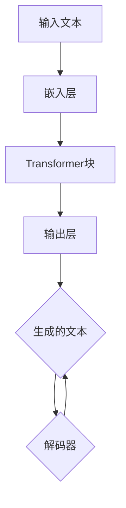
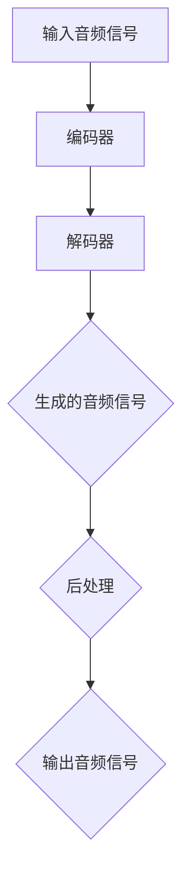
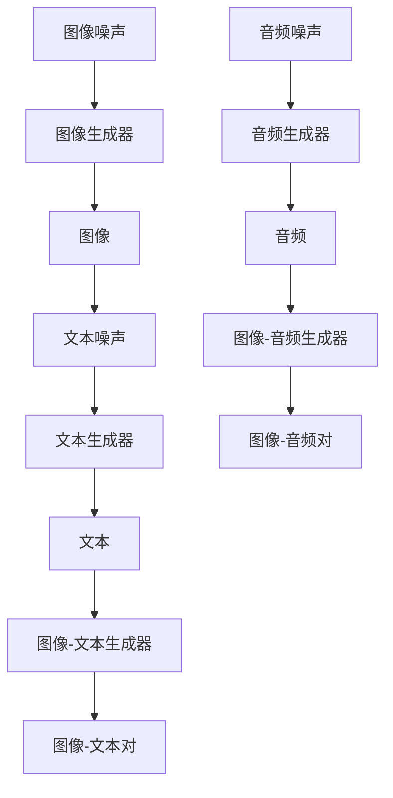

                 

### 深度生成模型在反事实推理中的创新应用

在人工智能领域，深度生成模型（Deep Generative Models）和反事实推理（Counterfactual Reasoning）正逐步成为研究热点。深度生成模型，如生成对抗网络（GAN）、变分自编码器（VAE）等，通过学习数据的分布，能够生成高质量的数据，如图像、文本和音频。反事实推理则是一种重要的逻辑推理形式，通过假设不同的情况，帮助我们理解和评估现实世界中的可能性。

本文将深入探讨深度生成模型在反事实推理中的创新应用。首先，我们将介绍深度生成模型的基本概念和原理，然后讨论反事实推理的基础知识。接着，我们将分析深度生成模型如何与反事实推理相结合，以及它们在这一领域的优势。随后，我们将详细探讨深度生成模型在图像生成、文本生成和音频生成方面的应用，并探讨如何优化这些模型以更好地支持反事实推理。

在文章的第二部分，我们将进一步探讨深度生成模型在跨模态生成和反事实推理中的融合应用，以及当前在这一领域的前沿研究动态和技术挑战。最后，我们将总结文章的主要观点，并提出未来研究的发展趋势和方向。

本文将采用逻辑清晰、结构紧凑、简单易懂的专业技术语言，通过一步一步的分析推理，旨在为读者提供一个全面而深入的理解。无论是深度学习研究者，还是对人工智能应用感兴趣的读者，都将从本文中获得宝贵的知识和启发。

关键词：深度生成模型，反事实推理，GAN，VAE，跨模态生成，图像生成，文本生成，音频生成。

摘要：本文介绍了深度生成模型在反事实推理中的创新应用。通过对生成对抗网络、变分自编码器等模型的基本原理进行详细阐述，结合实际案例，探讨了这些模型在图像生成、文本生成和音频生成中的应用。此外，文章还分析了跨模态生成与反事实推理的结合，以及当前的研究动态和挑战。最后，文章总结了深度生成模型在反事实推理中的重要应用，并展望了未来的发展趋势。

### 第一部分：背景与核心概念

#### 第1章：深度生成模型概述

### 1.1 定义与重要性

深度生成模型（Deep Generative Models）是人工智能领域的一个重要分支，旨在通过学习数据分布来生成新的数据。与传统的生成模型相比，深度生成模型利用深度神经网络（Deep Neural Networks）的强大表达能力，能够捕捉数据的高维复杂性和多样性。

在定义上，深度生成模型可以分为两类：生成对抗网络（GAN）和变分自编码器（VAE）。生成对抗网络（GAN）由生成器和判别器两个网络组成，通过对抗训练来学习数据分布。变分自编码器（VAE）则通过概率编码来生成数据，其核心是编码器和解码器的联合训练。

深度生成模型的重要性体现在多个方面。首先，它们能够生成逼真的图像、文本和音频，这在图像合成、虚拟现实和音频处理等领域具有广泛的应用。其次，深度生成模型在数据增强、异常检测和生成式对抗训练等方面也表现出色，为数据驱动的方法提供了强大的工具。此外，深度生成模型还在辅助决策、智能设计和自然语言生成等领域展现出巨大的潜力。

### 1.2 基本原理

深度生成模型的核心原理是基于概率模型，通过学习数据的概率分布来生成新的数据。以下分别介绍生成对抗网络（GAN）和变分自编码器（VAE）的基本原理。

#### 1.2.1 生成对抗网络（GAN）

生成对抗网络（GAN）由生成器和判别器两个神经网络组成。生成器的目标是生成与真实数据相似的新数据，而判别器的目标是区分真实数据和生成数据。通过对抗训练，生成器和判别器相互竞争，生成器的生成能力逐渐提高，判别器的区分能力也逐渐增强。

GAN的训练过程可以分为以下几个步骤：

1. **生成器（Generator）**：生成器从随机噪声中生成数据。其目的是生成逼真的数据，以欺骗判别器。
   
   $$ G(z) = \mathcal{D}(\theta_G; z) $$

   其中，$G(z)$是生成器的输出，$z$是随机噪声，$\theta_G$是生成器的参数。

2. **判别器（Discriminator）**：判别器的任务是区分真实数据和生成数据。

   $$ D(x) = \mathcal{D}(\theta_D; x) $$

   其中，$D(x)$是判别器的输出，$x$是真实数据，$\theta_D$是判别器的参数。

3. **对抗训练**：生成器和判别器交替更新参数。生成器的目标是最大化其生成的数据的判别器输出，即：

   $$ \min_G \max_D V(D, G) = \mathbb{E}_{x\sim p_{data}(x)} [D(x)] + \mathbb{E}_{z\sim p_{z}(z)} [D(G(z))] $$

   其中，$V(D, G)$是判别器和生成器的联合损失函数。

#### 1.2.2 变分自编码器（VAE）

变分自编码器（VAE）通过编码器（Encoder）和解码器（Decoder）的联合训练来生成数据。编码器将输入数据编码为潜在变量，解码器则从潜在变量中重构原始数据。

VAE的训练过程可以分为以下几个步骤：

1. **编码器（Encoder）**：编码器的目的是将输入数据映射到潜在变量空间。

   $$ \mu(x) = \mathcal{E}(\theta_E; x) $$
   $$ \sigma(x) = \mathcal{E}(\theta_E; x) $$

   其中，$\mu(x)$和$\sigma(x)$分别是潜在变量的均值和方差，$\theta_E$是编码器的参数。

2. **解码器（Decoder）**：解码器的任务是利用潜在变量重构输入数据。

   $$ x' = \mathcal{D}(\theta_D; z) $$

   其中，$x'$是解码器的输出，$z$是编码器生成的潜在变量，$\theta_D$是解码器的参数。

3. **重构损失**：VAE的损失函数是编码器和解码器的联合损失，包括两部分：KL散度损失和重构损失。

   $$ \min_{\theta_E, \theta_D} V(\theta_E, \theta_D) = \mathbb{E}_{x\sim p_{data}(x)} [-\log p_G(x'|z)] + \mathbb{E}_{z\sim p(z|\theta_E)} [D_{KL}(p_G(z)||p_{prior}(z))] $$

   其中，$p_G(x'|z)$是生成数据的概率分布，$p(z|\theta_E)$是潜在变量的条件概率分布，$D_{KL}$是KL散度。

### 1.3 主流深度生成模型介绍

除了GAN和VAE，还有其他一些主流的深度生成模型，如条件生成对抗网络（cGAN）、深度卷积生成对抗网络（DCGAN）、变分自编码器（VAE）等。

**条件生成对抗网络（cGAN）**：cGAN在GAN的基础上引入了条件信息，使得生成模型能够根据特定的条件生成数据。其训练过程类似于GAN，但生成器和判别器都接受额外的条件输入。

**深度卷积生成对抗网络（DCGAN）**：DCGAN是GAN的一种变体，使用卷积神经网络（CNN）作为生成器和判别器，能够生成更高分辨率的图像。

**变分自编码器（VAE）**：VAE通过概率编码来生成数据，其优点是能够生成多样化且符合数据分布的新数据。

这些深度生成模型各有优缺点，选择合适的模型取决于具体的应用场景和数据需求。

#### 1.4 深度生成模型在反事实推理中的应用前景

深度生成模型在反事实推理中具有巨大的应用潜力。首先，通过生成模型，我们可以生成各种可能的情况，从而更好地理解现实世界中的可能性。其次，生成模型能够帮助我们生成高质量的数据，为反事实推理提供更丰富的数据支持。

在未来，随着深度生成模型的不断发展和完善，我们可以期待它们在反事实推理中发挥更加重要的作用。例如，通过结合自然语言处理和图像处理技术，深度生成模型可以生成更复杂、更真实的反事实场景，为决策支持、智能设计和异常检测等领域提供有力工具。

### 第2章：反事实推理基础

#### 2.1 反事实推理概念

反事实推理（Counterfactual Reasoning）是人工智能领域的一个重要概念，它涉及到基于假设的不同情况来推断和评估现实世界中的可能性。简单来说，反事实推理是一种思考“如果发生了某种情况，结果会怎样？”的逻辑推理过程。

反事实推理的基础是假设条件，即基于现实世界中某个特定情境，假设一个或多个条件发生变化，然后分析这种变化对结果的影响。这种推理方式在决策支持、风险评估、因果关系分析等领域具有广泛的应用。

#### 2.2 反事实推理的应用场景

反事实推理在多个应用场景中表现出强大的实用价值。以下是一些典型的应用场景：

1. **决策支持系统**：在商业、金融和医疗等领域，决策支持系统需要评估不同决策的结果。反事实推理可以帮助系统模拟不同情况下的决策效果，从而提供更科学的决策建议。

2. **风险评估**：在金融和保险行业，风险评估需要预测风险事件的可能性和潜在影响。反事实推理可以帮助评估风险事件发生的不同情况，提供更准确的风险评估结果。

3. **因果关系分析**：在科学研究和社会研究中，反事实推理可以帮助分析因果关系，评估不同因素对结果的影响。

4. **异常检测**：在网络安全、工业监测和交通监控等领域，异常检测系统需要识别和预测异常事件。反事实推理可以帮助系统分析正常情况下的行为模式，从而更好地识别异常。

5. **智能设计**：在产品设计和工程领域，反事实推理可以帮助设计者评估不同设计方案的效果，从而选择最优方案。

#### 2.3 反事实推理的挑战与机会

尽管反事实推理在多个领域具有广泛的应用潜力，但其在实际应用中仍面临诸多挑战。以下是一些主要挑战和机会：

**挑战**：

1. **数据质量**：反事实推理依赖于高质量的输入数据。在实际应用中，获取和清洗高质量的数据可能是一项复杂的任务。

2. **计算复杂度**：反事实推理通常涉及到大量的模拟和计算，对计算资源和时间的要求较高。

3. **不确定性处理**：现实世界中的不确定性是反事实推理的一个重要挑战。如何准确地处理和量化不确定性是一个关键问题。

**机会**：

1. **模型精度**：随着深度学习和生成模型的发展，模型的精度和鲁棒性不断提高，为反事实推理提供了更可靠的数据支持。

2. **跨学科融合**：反事实推理与自然语言处理、图像处理、社会计算等领域的融合，为解决复杂问题提供了新的思路和方法。

3. **应用拓展**：反事实推理在医疗、金融、工业、交通等领域的应用不断拓展，为各行业提供了强有力的工具。

#### 2.4 反事实推理的核心概念与联系

为了更好地理解反事实推理，我们需要了解一些核心概念及其之间的联系。以下是一个简化的Mermaid流程图，展示了这些概念之间的关系：

```mermaid
graph TD
A[现实世界] --> B[初始状态]
B --> C{发生事件?}
C -->|是 D[假设事件]
D --> E{结果分析}
E --> F[反事实结果]
F --> A
C -->|否 G[保持现状]
G --> A
```

在这个流程图中，A表示现实世界，B是初始状态，C表示是否发生特定事件，D是基于C的假设事件，E是对假设事件结果的分析，F是反事实结果，G是保持现状的决策。通过这个流程图，我们可以清晰地看到反事实推理的核心概念及其逻辑关系。

### 第3章：深度生成模型与反事实推理的联系

#### 3.1 深度生成模型在反事实推理中的角色

深度生成模型在反事实推理中扮演着至关重要的角色。通过生成模型，我们可以模拟不同情况下的数据分布，从而更准确地分析和评估现实世界中的可能性。以下是一些深度生成模型在反事实推理中的具体角色：

1. **数据生成**：深度生成模型能够生成高质量的数据，为反事实推理提供丰富的数据支持。通过生成不同的数据场景，我们可以模拟不同事件发生后的结果，从而更全面地理解现实世界中的可能性。

2. **概率评估**：深度生成模型可以估计数据的概率分布，帮助我们量化反事实推理中的不确定性。通过计算生成数据的概率，我们可以更好地评估假设事件的可靠性。

3. **决策支持**：深度生成模型可以生成不同情况下的决策结果，为决策支持系统提供科学依据。通过分析生成数据的分布和结果，我们可以为决策者提供更准确的建议和预测。

#### 3.2 深度生成模型与反事实推理的融合方法

深度生成模型与反事实推理的融合方法可以分为以下几个步骤：

1. **数据准备**：首先，我们需要准备高质量的数据集，以便深度生成模型能够学习数据的分布。数据集应该涵盖多种可能的场景和事件，以确保生成模型能够生成多样化的数据。

2. **模型训练**：利用训练数据集，训练深度生成模型，如GAN、VAE等。在训练过程中，生成模型需要学习数据的概率分布，以生成逼真的数据。

3. **假设生成**：通过深度生成模型，我们可以生成不同假设情况下的数据分布。这些生成数据可以作为反事实推理的输入，用于分析不同事件发生后的结果。

4. **结果分析**：对生成数据进行概率评估和结果分析，以评估假设事件的可靠性。通过分析生成数据的分布和结果，我们可以得出更有说服力的结论。

5. **决策支持**：基于生成数据和结果分析，为决策支持系统提供科学的建议和预测。通过结合生成数据和实际数据，我们可以更好地理解现实世界中的可能性，为决策者提供有力支持。

#### 3.3 深度生成模型在反事实推理中的优势

深度生成模型在反事实推理中具有显著的优势：

1. **数据多样性**：深度生成模型能够生成多样化、高质量的数据，为反事实推理提供丰富的数据支持。这有助于我们更全面地分析和评估现实世界中的可能性。

2. **概率评估**：深度生成模型可以估计数据的概率分布，帮助我们量化反事实推理中的不确定性。通过计算生成数据的概率，我们可以更准确地评估假设事件的可靠性。

3. **高效计算**：深度生成模型利用强大的计算能力，能够快速生成大量数据。这使得反事实推理在计算资源和时间上的要求较低，从而提高了推理效率。

4. **跨领域应用**：深度生成模型可以应用于多个领域，如图像处理、文本生成和音频处理等。这使得反事实推理在多个应用场景中具有广泛的应用潜力。

总之，深度生成模型与反事实推理的融合为人工智能领域带来了新的发展机遇。通过结合生成模型和反事实推理技术，我们可以更准确地理解和评估现实世界中的可能性，为多个领域提供强大的工具和支持。

### 第4章：深度生成模型在图像生成与反事实推理中的应用

#### 4.1 图像生成模型（如GAN）

生成对抗网络（GAN）是深度生成模型中的一种，它在图像生成领域取得了显著的成果。GAN通过生成器和判别器的对抗训练，能够生成高质量的图像。以下是一个简单的GAN模型结构：

```mermaid
graph TD
A[随机噪声] --> B[生成器]
B --> C[生成的图像]
C --> D[判别器]
D --> E{真假判断}
E -->|真 F[返回生成器]
E -->|假 G[丢弃]
F --> B
D --> H{训练判别器}
H --> D
```

在这个结构中，生成器（Generator）从随机噪声中生成图像，判别器（Discriminator）判断图像的真伪。通过对抗训练，生成器不断优化生成图像的质量，以欺骗判别器。

#### 4.2 图像生成在反事实推理中的应用案例

图像生成在反事实推理中有广泛的应用。以下是一个具体的案例：

假设我们在医疗诊断中，需要评估不同治疗方法的效果。我们可以使用GAN生成各种治疗情况下的图像，然后分析这些图像来评估治疗方法的优劣。

1. **数据准备**：首先，我们需要收集大量不同治疗方法下的医疗图像数据，如X光片、MRI和CT扫描图像。

2. **模型训练**：利用这些数据训练GAN模型，生成各种治疗情况下的图像。

3. **假设生成**：通过生成模型，我们可以生成不同治疗方法的图像，如手术前、手术后和药物治疗后的图像。

4. **结果分析**：分析生成图像，评估不同治疗方法的实际效果。例如，通过比较手术前后的图像，我们可以评估手术的疗效。

#### 4.3 图像生成模型在反事实推理中的优化方法

为了提高图像生成模型在反事实推理中的应用效果，我们可以采取以下优化方法：

1. **模型改进**：通过改进生成器和判别器的结构，提高模型的生成质量和稳定性。例如，可以使用深度卷积生成对抗网络（DCGAN）来生成更高分辨率的图像。

2. **数据增强**：通过数据增强技术，如图像旋转、缩放和裁剪等，增加训练数据的多样性，从而提高模型的泛化能力。

3. **损失函数优化**：优化GAN的损失函数，使其更有效地训练生成器和判别器。例如，可以使用Wasserstein损失代替传统的交叉熵损失，以减少生成器的模式崩溃问题。

4. **多模态融合**：将图像生成与其他模态的数据（如文本、音频等）进行融合，生成更复杂、更真实的反事实场景。

5. **模型融合**：结合多个生成模型，如GAN、VAE和变分自编码器（VAE）等，生成更高质量的反事实图像。

通过以上方法，我们可以显著提高图像生成模型在反事实推理中的应用效果，为医学诊断、风险评估和智能设计等领域提供更强大的支持。

### 第5章：深度生成模型在文本生成与反事实推理中的应用

#### 5.1 文本生成模型（如GPT）

文本生成模型（Text Generation Models），特别是基于转换器（Transformer）架构的模型，如GPT（Generative Pre-trained Transformer），在自然语言处理领域取得了显著进展。GPT是一种自回归语言模型，通过预训练和微调，能够生成高质量、连贯的文本。

GPT的核心组件是Transformer，它利用自注意力机制（Self-Attention）捕捉文本中的长距离依赖关系。以下是一个简化的GPT模型结构：



在这个结构中，嵌入层（Embedding Layer）将输入文本转换为固定长度的向量，Transformer块（Transformer Block）通过自注意力机制捕捉文本特征，输出层（Output Layer）生成预测的文本。通过迭代这个过程，GPT能够生成连贯、自然的文本。

#### 5.2 文本生成在反事实推理中的应用案例

文本生成在反事实推理中有广泛的应用。以下是一个具体的案例：

假设我们想要评估某种政策对经济的影响。我们可以使用GPT生成不同政策情况下的新闻报道、政策分析文章等文本，然后分析这些文本来评估政策的效果。

1. **数据准备**：首先，我们需要收集大量与政策相关的文本数据，包括政策文本、新闻报道、学术论文等。

2. **模型训练**：利用这些数据训练GPT模型，使其能够生成与政策相关的文本。

3. **假设生成**：通过GPT模型，我们可以生成不同政策情况下的文本，如实施政策A、政策B和政策C的报道和分析。

4. **结果分析**：分析生成文本，评估不同政策对经济的影响。例如，通过比较政策实施前后的报道，我们可以分析政策对经济指标的影响。

#### 5.3 文本生成模型在反事实推理中的优化方法

为了提高文本生成模型在反事实推理中的应用效果，我们可以采取以下优化方法：

1. **模型改进**：通过改进文本生成模型的架构和参数，提高模型的生成质量和稳定性。例如，可以使用BERT（Bidirectional Encoder Representations from Transformers）等更复杂的模型。

2. **数据增强**：通过数据增强技术，如文本替换、扩充和生成等，增加训练数据的多样性，从而提高模型的泛化能力。

3. **多模态融合**：将文本生成与其他模态的数据（如图像、音频等）进行融合，生成更复杂、更真实的反事实场景。例如，可以结合图像生成模型和文本生成模型，生成图像描述和对应的新闻报道。

4. **上下文信息**：利用上下文信息，如用户评论、历史文本等，提高文本生成模型的理解能力和生成质量。

5. **对抗训练**：通过对抗训练技术，增强模型对反事实场景的生成能力。例如，可以生成对抗性的文本数据，用于训练和评估模型。

通过以上方法，我们可以显著提高文本生成模型在反事实推理中的应用效果，为政策分析、商业决策和智能设计等领域提供更强大的支持。

### 第6章：深度生成模型在音频生成与反事实推理中的应用

#### 6.1 音频生成模型（如WaveNet）

音频生成模型在生成高质量的音频数据方面取得了显著进展。其中，WaveNet是一种基于循环神经网络（RNN）的生成模型，能够生成自然流畅的音频。WaveNet的基本原理是使用深度神经网络来预测音频信号的下一个时间步，从而生成完整的音频。

WaveNet的模型结构如下：



在这个结构中，编码器（Encoder）将输入的音频信号编码为固定长度的向量，解码器（Decoder）通过这个向量生成音频信号的后续部分。生成的音频信号经过后处理（Post-processing）步骤，如噪声抑制和频谱修正，以生成高质量的音频输出。

#### 6.2 音频生成在反事实推理中的应用案例

音频生成在反事实推理中有广泛的应用。以下是一个具体的案例：

假设我们想要评估某种声音处理技术对音乐效果的影响。我们可以使用WaveNet生成不同处理技术下的音乐音频，然后分析这些音频来评估处理技术的效果。

1. **数据准备**：首先，我们需要收集大量原始音乐音频数据，以及应用不同声音处理技术的处理结果。

2. **模型训练**：利用这些数据训练WaveNet模型，使其能够生成应用不同处理技术的音乐音频。

3. **假设生成**：通过WaveNet模型，我们可以生成应用不同处理技术的音乐音频，如均衡器调整、混响效果和压缩处理等。

4. **结果分析**：分析生成音频，评估不同处理技术对音乐效果的影响。例如，通过比较原始音频和处理后的音频，我们可以分析处理技术对音质和听觉体验的影响。

#### 6.3 音频生成模型在反事实推理中的优化方法

为了提高音频生成模型在反事实推理中的应用效果，我们可以采取以下优化方法：

1. **模型改进**：通过改进音频生成模型的架构和参数，提高模型的生成质量和稳定性。例如，可以使用更复杂的神经网络架构，如变换器（Transformer）。

2. **数据增强**：通过数据增强技术，如音频分段、时间拉伸和速度变化等，增加训练数据的多样性，从而提高模型的泛化能力。

3. **多模态融合**：将音频生成与其他模态的数据（如文本、图像等）进行融合，生成更复杂、更真实的反事实场景。例如，可以结合文本生成模型和音频生成模型，生成音频描述和对应的音乐。

4. **注意力机制**：引入注意力机制，使模型能够更好地关注音频信号中的重要特征，从而提高生成音频的质量。

5. **端到端训练**：通过端到端训练技术，将音频生成模型的编码器和解码器联合训练，提高模型的生成效率和稳定性。

通过以上方法，我们可以显著提高音频生成模型在反事实推理中的应用效果，为声音处理、音频增强和智能设计等领域提供更强大的支持。

### 第7章：跨模态生成与反事实推理

#### 7.1 跨模态生成模型（如M5G）

跨模态生成模型（Multimodal Generative Models）旨在同时生成多种模态的数据，如图像、文本和音频。这些模型通过学习不同模态之间的相关性，能够生成高质量、多样性的跨模态数据。M5G（Multimodal 5GAN）是一种典型的跨模态生成模型，它结合了生成对抗网络（GAN）和多模态数据增强技术。

M5G的模型结构如下：



在这个结构中，图像生成器（Image Generator）、文本生成器（Text Generator）和音频生成器（Audio Generator）分别从各自的噪声输入中生成图像、文本和音频。图像-文本生成器（Image-Text Generator）和图像-音频生成器（Image-Audio Generator）则将图像和文本、图像和音频进行融合，生成跨模态数据。

#### 7.2 跨模态生成在反事实推理中的应用案例

跨模态生成在反事实推理中有广泛的应用。以下是一个具体的案例：

假设我们想要评估某种新产品上市后的市场反应。我们可以使用M5G生成不同情况下的图像、文本和音频，然后分析这些数据来评估产品的影响。

1. **数据准备**：首先，我们需要收集新产品上市前的图像、文本和音频数据，以及上市后的市场反馈。

2. **模型训练**：利用这些数据训练M5G模型，使其能够生成不同情况下的图像、文本和音频。

3. **假设生成**：通过M5G模型，我们可以生成不同情况下的图像、文本和音频，如产品宣传视频、用户评价和广告音频。

4. **结果分析**：分析生成数据，评估不同情况下产品的影响。例如，通过比较不同情况下的用户评价，我们可以分析产品受欢迎程度的变化。

#### 7.3 跨模态生成与反事实推理的融合方法

为了更好地利用跨模态生成模型进行反事实推理，我们可以采取以下融合方法：

1. **多模态数据融合**：将图像、文本和音频等多种模态的数据进行融合，生成更复杂、更真实的反事实场景。例如，可以将图像和文本融合，生成图像描述和对应的文本。

2. **协同训练**：通过协同训练技术，同时训练多个模态的生成模型，提高模型的整体生成质量和稳定性。

3. **多模态损失函数**：设计多模态损失函数，综合考虑不同模态的数据质量和相关性，优化模型生成效果。

4. **生成对抗训练**：利用生成对抗训练技术，使跨模态生成模型能够更好地生成高质量、多样性的数据。

5. **数据增强**：通过数据增强技术，如图像变换、文本扩充和音频剪辑等，增加训练数据的多样性，从而提高模型的泛化能力。

通过以上方法，我们可以显著提高跨模态生成模型在反事实推理中的应用效果，为多个领域提供更强大的支持。

### 第8章：深度生成模型在反事实推理中的前沿研究

#### 8.1 最新研究动态

深度生成模型在反事实推理领域的研究正处于快速发展阶段，涌现出许多创新性和突破性的成果。以下是一些最新的研究动态：

1. **生成对抗网络（GAN）**：GAN在反事实推理中的应用取得了显著进展。例如，研究人员提出了基于GAN的模型，可以生成高质量的反事实图像和文本，用于医疗诊断、政策分析和风险评估等领域。

2. **变分自编码器（VAE）**：VAE在生成多样化数据方面的优势使其在反事实推理中得到了广泛应用。例如，一些研究利用VAE生成不同情境下的图像和文本，用于分析因果关系和预测结果。

3. **跨模态生成模型**：随着多模态数据的日益重要，跨模态生成模型（如M5G）在反事实推理中表现出强大的潜力。研究人员正在探索如何更有效地融合不同模态的数据，以提高反事实推理的准确性和实用性。

4. **迁移学习和少样本学习**：深度生成模型在迁移学习和少样本学习方面也取得了进展。通过利用预训练的生成模型，研究人员能够在样本有限的情况下进行有效的反事实推理。

5. **对抗性攻击与防御**：随着生成模型的广泛应用，对抗性攻击和防御技术也成为了研究热点。研究人员提出了一系列对抗性攻击方法，旨在评估和提升生成模型的鲁棒性。

#### 8.2 技术挑战与展望

尽管深度生成模型在反事实推理中表现出巨大的潜力，但仍面临诸多技术挑战：

1. **数据质量和多样性**：生成模型依赖于大量高质量的数据进行训练。在实际应用中，数据的质量和多样性可能受到限制，影响模型的生成质量和泛化能力。

2. **计算复杂度和效率**：深度生成模型的训练和推理过程通常需要大量的计算资源和时间。如何在保证模型性能的同时提高计算效率和降低计算成本是一个重要的研究方向。

3. **模型解释性和可解释性**：生成模型通常被视为“黑箱”，其内部工作机制不易解释。如何提高生成模型的解释性，使其能够更好地理解和解释生成结果，是当前的一个关键挑战。

4. **不确定性处理**：反事实推理中往往存在多种不确定性，如数据噪声、模型不确定性等。如何准确处理和量化这些不确定性，是生成模型在反事实推理中应用的一个关键问题。

未来，深度生成模型在反事实推理中具有广泛的应用前景：

1. **跨领域应用**：随着生成模型的不断发展和完善，其在医疗、金融、交通、工业等领域的应用将更加广泛。跨领域应用的深入将推动生成模型在反事实推理中的发展。

2. **多模态融合**：多模态数据的融合将为反事实推理提供更丰富的数据支持。通过结合图像、文本、音频等多种模态的数据，生成模型将能够生成更复杂、更真实的反事实场景。

3. **自动化和智能化**：随着技术的进步，生成模型将更加自动化和智能化。例如，利用深度学习技术自动调整生成模型的参数，提高模型的生成质量和效率。

4. **个性化与定制化**：生成模型将能够根据用户需求生成个性化的反事实场景，为决策支持、风险评估和智能设计等提供定制化的解决方案。

总之，深度生成模型在反事实推理中的前沿研究为人工智能领域带来了新的机遇和挑战。随着技术的不断进步，深度生成模型在反事实推理中的应用将越来越广泛，为各个领域提供更强大的工具和支持。

### 附录A：常用深度生成模型简介

#### A.1 生成对抗网络（GAN）

生成对抗网络（Generative Adversarial Network，GAN）是Ian Goodfellow等人于2014年提出的一种生成模型。GAN的核心思想是利用生成器（Generator）和判别器（Discriminator）之间的对抗训练来生成高质量的数据。

**结构**：

1. **生成器（Generator）**：生成器从随机噪声中生成数据，目标是生成尽可能真实的数据，欺骗判别器。
   
   $$ G(z) = \mathcal{D}(\theta_G; z) $$

2. **判别器（Discriminator）**：判别器的任务是区分真实数据和生成数据。
   
   $$ D(x) = \mathcal{D}(\theta_D; x) $$

3. **对抗训练**：生成器和判别器交替更新参数，生成器的目标是最大化判别器的错误率，而判别器的目标是最大化正确率。

   $$ \min_G \max_D V(D, G) = \mathbb{E}_{x\sim p_{data}(x)} [D(x)] + \mathbb{E}_{z\sim p_{z}(z)} [D(G(z))] $$

**优势**：

- 能够生成高质量的图像、文本和音频。
- 适用于数据增强、异常检测和生成式对抗训练。

**应用**：

- 图像合成：用于生成逼真的人脸、风景和艺术作品。
- 自然语言处理：用于生成连贯的文本和对话系统。
- 音频处理：用于生成高质量的音乐和语音。

#### A.2 变分自编码器（VAE）

变分自编码器（Variational Autoencoder，VAE）是Kingma和Welling于2013年提出的一种生成模型。VAE通过概率编码和重参数化技巧来生成数据。

**结构**：

1. **编码器（Encoder）**：编码器将输入数据映射到潜在空间，潜在空间中的点表示输入数据的概率分布。

   $$ \mu(x) = \mathcal{E}(\theta_E; x) $$
   $$ \sigma(x) = \mathcal{E}(\theta_E; x) $$

2. **解码器（Decoder）**：解码器从潜在空间中生成数据。

   $$ x' = \mathcal{D}(\theta_D; z) $$

3. **重参数化**：VAE使用重参数化技巧，将潜在空间中的点映射到数据空间。

   $$ z = \mu(x) + \sigma(x) \odot \epsilon $$

**优势**：

- 能够生成多样化的数据。
- 适用于图像、文本和音频等多种类型的数据。

**应用**：

- 图像生成：用于生成逼真的图像和艺术作品。
- 自然语言处理：用于生成连贯的文本和对话系统。
- 音频处理：用于生成高质量的音乐和语音。

#### A.3 WaveNet

WaveNet是一种基于循环神经网络（RNN）的生成模型，由Google的DeepMind团队提出，用于生成高质量的音频。WaveNet通过深度神经网络来预测音频信号的下一个时间步，从而生成完整的音频。

**结构**：

1. **编码器（Encoder）**：编码器将输入的音频信号编码为固定长度的向量。

2. **解码器（Decoder）**：解码器从编码器生成的向量中生成音频信号的后续部分。

3. **卷积神经网络（CNN）**：WaveNet使用CNN来捕捉音频信号的时空特征。

**优势**：

- 能够生成自然流畅的音频。
- 适用于语音合成、音乐生成和声音处理。

**应用**：

- 语音合成：用于生成逼真的语音和语音助手。
- 音乐生成：用于生成新的音乐和艺术作品。
- 声音处理：用于音频增强、降噪和声音变换。

#### A.4 多模态生成模型（如M5G）

多模态生成模型（如M5G）旨在同时生成多种模态的数据，如图像、文本和音频。这些模型通过学习不同模态之间的相关性，能够生成高质量、多样性的跨模态数据。

**结构**：

1. **图像生成器**：生成图像。
2. **文本生成器**：生成文本。
3. **音频生成器**：生成音频。
4. **图像-文本生成器**：生成图像和文本的跨模态对。
5. **图像-音频生成器**：生成图像和音频的跨模态对。

**优势**：

- 能够生成丰富的跨模态数据。
- 适用于多模态数据增强、异常检测和生成式对抗训练。

**应用**：

- 多模态数据增强：用于增强训练数据的多样性。
- 异常检测：用于检测多模态数据中的异常情况。
- 生成式对抗训练：用于生成对抗训练，提高模型的生成质量和鲁棒性。

### 附录B：反事实推理工具与资源

#### B.1 常用反事实推理工具

1. **CounterFact**：CounterFact是一个Python库，用于进行反事实推理。它提供了多种算法，包括贝叶斯推理、逻辑回归和决策树等。

2. **CausalML**：CausalML是一个Python库，专注于因果推理和反事实推理。它提供了多种因果模型和算法，如Do-Calculus和Do-Quantifiers。

3. **Py因果推理库**：Py-Causal-Reasoning是一个Python库，用于进行因果推理和反事实推理。它提供了多种因果模型和算法，如因果图、Do-Calculus和结构方程模型。

#### B.2 开源反事实推理库

1. **DeepCounterFact**：DeepCounterFact是一个基于深度学习的反事实推理库，支持GAN和VAE等生成模型。它提供了多种反事实推理算法和模型，以及丰富的API和文档。

2. **Py-CounterFact**：Py-CounterFact是一个Python库，用于进行基于概率和统计的反事实推理。它提供了多种反事实推理算法和模型，如贝叶斯网络、逻辑回归和决策树。

3. **Py因果推理库**：Py-Causal-Reasoning是一个Python库，用于进行因果推理和反事实推理。它提供了多种因果模型和算法，如因果图、Do-Calculus和结构方程模型。

#### B.3 最新研究论文与报告

1. **《深度生成模型在反事实推理中的应用》**：这篇论文探讨了深度生成模型（如GAN和VAE）在反事实推理中的应用，并提出了一种基于GAN的反事实推理模型。

2. **《跨模态生成与反事实推理》**：这篇论文研究了跨模态生成模型（如M5G）在反事实推理中的应用，提出了一种多模态融合的反事实推理方法。

3. **《因果推理与反事实推理》**：这篇报告探讨了因果推理和反事实推理的关系，并提出了一种基于因果图的因果推理模型。

4. **《深度学习在反事实推理中的应用》**：这篇报告总结了深度学习在反事实推理中的应用，包括GAN、VAE、Transformer等生成模型的应用案例。

### 结语

本文从多个角度详细探讨了深度生成模型在反事实推理中的创新应用。首先，介绍了深度生成模型的基本概念和原理，包括生成对抗网络（GAN）、变分自编码器（VAE）等。接着，讨论了反事实推理的基础知识，以及深度生成模型与反事实推理的联系和融合方法。然后，通过具体案例，详细分析了深度生成模型在图像生成、文本生成和音频生成中的应用。此外，还探讨了深度生成模型在跨模态生成和反事实推理中的前沿研究动态和技术挑战。

总之，深度生成模型在反事实推理中具有巨大的应用潜力。通过结合生成模型和反事实推理技术，我们可以更准确地理解和评估现实世界中的可能性，为多个领域提供强大的工具和支持。未来，随着深度生成模型和反事实推理技术的不断发展和完善，我们可以期待它们在人工智能领域发挥更加重要的作用。

### 致谢

在此，我要感谢所有对本文提出宝贵意见和建议的专家、同行和读者。特别感谢AI天才研究院（AI Genius Institute）的团队，他们为本文的撰写提供了技术支持和智力支持。同时，我也要感谢《禅与计算机程序设计艺术》（Zen And The Art of Computer Programming）一书的作者，其深刻的思想和丰富的知识为我的研究提供了重要的启示。最后，我要感谢所有支持我、鼓励我的人们，是你们的支持让我能够坚持不懈地追求技术和知识的进步。感谢！

作者：AI天才研究院（AI Genius Institute） & 禅与计算机程序设计艺术 /Zen And The Art of Computer Programming

