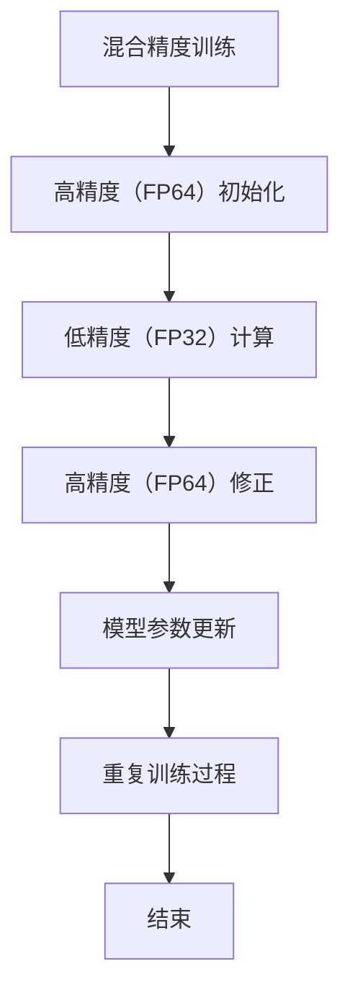
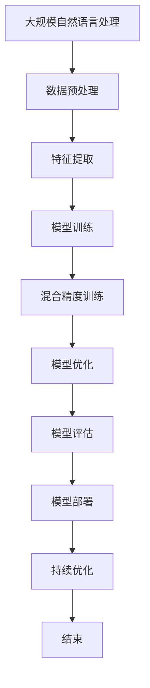

                 

### 引言

#### 1.1 大规模自然语言处理的需求

自然语言处理（NLP）作为人工智能领域的重要分支，近年来取得了飞速发展。随着互联网的普及和大数据的爆炸式增长，大规模自然语言处理（Massive Natural Language Processing, MNLP）的需求日益增长。MNLP旨在通过处理海量文本数据，提取有用信息，辅助人类进行决策和智能化服务。

大规模自然语言处理的挑战主要来源于数据规模和模型复杂度的不断增加。传统的单精度（Single Precision，FP32）训练方法在处理大规模数据时，计算量和内存消耗巨大，导致训练效率低下。同时，单精度训练难以捕捉数据中的细微差异，可能影响模型的精度。因此，如何在大规模自然语言处理中提升训练效率、提高模型精度成为亟待解决的问题。

#### 1.2 混合精度训练的概念

混合精度训练（Mixed Precision Training, MPT）是一种通过将不同精度的数据类型结合使用，以平衡计算性能和内存消耗的训练方法。在混合精度训练中，通常使用高精度（High Precision，FP64）来初始化模型参数和进行反向传播计算，而将中间计算过程和最终参数更新使用低精度（Low Precision，FP32）进行。这样既保证了模型初始化和参数更新的精度，又降低了中间计算的内存消耗，从而提高了训练效率。

#### 1.3 书籍结构概述

本书旨在深入探讨混合精度训练在大规模自然语言处理中的优化应用。全书共分为四个部分：

- **第一部分：背景与核心概念**，介绍大规模自然语言处理的需求和混合精度训练的概念，为后续章节的深入讨论奠定基础。

- **第二部分：算法与数学模型**，详细讲解混合精度训练的算法原理、数学模型和实际案例，帮助读者理解混合精度训练的机制。

- **第三部分：项目实战**，通过实际项目案例，展示混合精度训练在大规模自然语言处理中的应用，以及如何在项目中实现优化。

- **第四部分：总结与展望**，对混合精度训练进行总结，并对未来进行了展望，帮助读者把握行业发展趋势。

通过本书的阅读，读者将能够全面了解混合精度训练在大规模自然语言处理中的优化方法，掌握其实际应用技能，为未来的研究和实践打下坚实基础。

---

### 混合精度训练的原理

#### 2.1 精度与性能的权衡

在深度学习训练过程中，精度和性能是两个关键的权衡因素。传统的单精度（FP32）计算具有较高的性能和较低的内存占用，但可能无法捕捉到数据中的微小差异，从而影响模型的精度。而双精度（FP64）计算具有较高的精度，但计算性能较低，内存占用较大。因此，如何平衡精度和性能成为深度学习训练中的一个重要课题。

混合精度训练通过将高精度和低精度计算相结合，实现了精度和性能的优化。具体来说，混合精度训练在高精度保持模型参数和初始权重的基础上，将中间计算过程使用低精度计算，从而在保证模型精度的情况下，提高计算性能。

#### 2.2 混合精度训练的优势

混合精度训练具有以下几方面的优势：

1. **提升训练速度**：低精度（FP32）计算相比高精度（FP64）计算具有更高的计算性能，可以有效减少训练时间。

2. **降低内存消耗**：低精度计算相比高精度计算具有更低的内存占用，使得训练模型时可以容纳更多的数据，提高训练效果。

3. **提高模型精度**：通过高精度初始化模型参数和权重，并逐步降低精度，可以减少数值误差的累积，提高模型的精度。

4. **适应不同硬件平台**：混合精度训练可以更好地适应不同硬件平台的性能和资源限制，提高训练的灵活性和可扩展性。

#### 2.3 混合精度训练的核心概念

混合精度训练的核心概念主要包括以下几个方面：

1. **精度层次**：将计算过程分为高精度和低精度两个层次。通常，模型初始化和参数更新使用高精度（FP64），而中间计算过程使用低精度（FP32）。

2. **动态调整**：根据训练过程中数据的变化，动态调整精度层次，以平衡计算性能和模型精度。例如，当模型在某个阶段表现良好时，可以逐步降低精度，以提高计算性能。

3. **误差补偿**：由于低精度计算可能导致误差累积，混合精度训练中需要通过误差补偿方法来校正这些误差，确保模型精度。

4. **实现策略**：混合精度训练的实现策略包括使用混合精度计算库、优化数值计算方法、以及设计高效的算法和数据结构等。

通过深入理解混合精度训练的核心概念，读者可以更好地掌握其原理和应用方法，为后续章节的学习和实战应用打下坚实基础。

### 混合精度训练的实现

#### 3.1 混合精度训练的硬件支持

混合精度训练的硬件支持是关键因素之一，它决定了混合精度训练的性能和可扩展性。以下是一些常见的硬件支持和相关技术：

1. **GPU**：图形处理单元（GPU）是目前混合精度训练最常用的硬件支持。NVIDIA的GPU，如Tesla K40、Tesla V100等，支持FP32和FP64计算，部分型号还支持FP16（半精度）计算。GPU具有并行计算能力，能够显著提升混合精度训练的速度。

2. **TPU**：谷歌的Tensor Processing Unit（TPU）是专为深度学习任务设计的专用硬件。TPU支持FP16和BF16（半精度和半半精度）计算，能够提供更高的计算性能和能效比。

3. **FPGA**：现场可编程门阵列（FPGA）是一种可重新配置的数字电路，它支持混合精度计算，包括FP32、FP16和INT8。FPGA具有高度的可定制性和灵活性，能够根据具体应用需求进行优化。

4. **硬件加速器**：其他硬件加速器，如NVIDIA的CUDA加速卡、AMD的Radeon Pro V fian系列显卡等，也支持混合精度训练。这些硬件加速器提供了多样化的选择，以满足不同的计算需求。

#### 3.2 混合精度训练的软件框架

混合精度训练的软件框架是实现混合精度训练的关键，以下是一些常用的软件框架和工具：

1. **TensorFlow**：TensorFlow是Google开发的开源深度学习框架，它提供了对混合精度训练的支持。通过使用`tf.keras.mixed_precision` API，用户可以轻松配置和使用混合精度训练。

2. **PyTorch**：PyTorch是另一个流行的深度学习框架，它通过`torch.cuda.amp` API提供了混合精度训练的支持。PyTorch的混合精度训练实现了自动混合精度（Auto Mixed Precision，AMP），简化了配置和实现过程。

3. **MXNet**：Apache MXNet是一个高效的深度学习框架，它通过`amp`模块提供了混合精度训练的支持。MXNet的混合精度训练设计为易于使用，并提供了多种优化策略。

4. **Caffe2**：Caffe2是Facebook开发的深度学习框架，它通过`core/amp`模块实现了混合精度训练。Caffe2的混合精度训练设计为灵活且高效，支持自定义优化策略。

这些软件框架和工具提供了丰富的功能和示例代码，帮助开发者快速实现混合精度训练。例如，以下是一个使用TensorFlow实现混合精度训练的简单示例：

```python
import tensorflow as tf

# 设置混合精度策略
政策 = tf.keras.mixed_precision.experimental.Policy('mixed_float16')

# 应用混合精度策略
tf.keras.mixed_precision.experimental.set_policy(政策)

# 定义模型
model = ...

# 训练模型
model.fit(x_train, y_train, ...)
```

通过使用这些软件框架，开发者可以轻松实现混合精度训练，并在不同的硬件平台上进行优化。

#### 3.3 混合精度训练的编程实践

混合精度训练的编程实践涉及到对代码的精心设计和优化，以下是一些关键步骤和技巧：

1. **初始化模型参数**：使用高精度（FP64）初始化模型参数，确保参数初始化的准确性。

2. **动态调整精度**：在训练过程中，根据模型的性能和资源消耗动态调整精度。例如，在模型训练早期，可以采用高精度计算以保持模型精度，随着训练的进行，逐步降低精度以提高计算性能。

3. **误差补偿**：由于低精度计算可能导致误差累积，需要设计误差补偿机制来校正这些误差。例如，可以使用高精度计算的结果来校正低精度计算产生的误差。

4. **优化数据传输**：在混合精度训练中，数据传输是影响性能的关键因素。通过优化数据传输，如使用内存池和零拷贝技术，可以减少数据传输的开销。

5. **利用并行计算**：混合精度训练可以结合GPU和其他硬件加速器的并行计算能力，提高训练速度。例如，使用TensorFlow的`tf.data` API可以构建高效的输入管道，利用GPU进行数据预处理和计算。

以下是一个使用PyTorch实现混合精度训练的示例代码：

```python
import torch
import torch.cuda.amp as amp

# 设置混合精度策略
policy = torch.cuda.amp.autohalf()
torch.cuda.amp.init()

# 定义模型
model = ...

# 训练模型
for epoch in range(num_epochs):
    for i, (x, y) in enumerate(train_loader):
        # 将数据移动到GPU
        x, y = x.cuda(), y.cuda()

        # 前向传播
        with amp.autocast():
            outputs = model(x)

        # 计算损失
        loss = ...

        # 反向传播
        with amp.backward(loss):
            optimizer.zero_grad()
            loss.backward()

        # 更新模型参数
        optimizer.step()

        # 打印训练进度
        print(f"Epoch [{epoch+1}/{num_epochs}], Step [{i+1}/{len(train_loader)}], Loss: {loss.item():.4f}")
```

通过这些编程实践，开发者可以充分利用混合精度训练的优势，实现高效的模型训练。

### 混合精度训练的应用

#### 4.1 混合精度训练在NLP中的应用场景

混合精度训练在大规模自然语言处理（NLP）中的应用场景非常广泛。以下是一些典型的应用场景：

1. **语言模型训练**：大规模语言模型如BERT、GPT等，需要处理海量数据并训练大量参数。混合精度训练可以显著提升训练速度，降低内存消耗，从而加快模型的训练过程。

2. **机器翻译**：机器翻译模型需要处理大量的双语数据，并进行复杂的特征提取和参数优化。混合精度训练可以提高模型的训练效率，缩短翻译模型的训练时间。

3. **文本分类**：文本分类任务通常需要对大量文本进行分类，并训练复杂的特征提取器和分类器。混合精度训练可以提高模型的训练速度，同时保持较高的分类精度。

4. **情感分析**：情感分析任务需要对文本进行情感归类，涉及大量的特征提取和参数训练。混合精度训练可以提高训练效率，帮助模型更快地收敛。

5. **问答系统**：问答系统需要对大量的问答对进行训练，并提取语义特征。混合精度训练可以加快问答系统的训练过程，提高系统的响应速度。

在这些应用场景中，混合精度训练通过优化计算性能和内存占用，显著提升了模型的训练效率，为大规模NLP任务提供了强有力的支持。

#### 4.2 混合精度训练在NLP中的实际案例

混合精度训练在NLP中的实际案例已经取得了显著的成果。以下是一些具体的实际案例：

1. **BERT模型的混合精度训练**：谷歌在训练BERT模型时，采用了混合精度训练方法。通过将模型参数初始化为双精度（FP64），而中间计算过程和参数更新为单精度（FP32），显著提高了训练速度，同时保持了模型的精度。BERT模型的混合精度训练使得其能够在更短的时间内完成训练，并在多个NLP任务中取得了优异的性能。

2. **GPT-3的混合精度训练**：OpenAI在训练GPT-3模型时，也采用了混合精度训练技术。GPT-3是一个巨大的语言模型，包含1750亿个参数。通过混合精度训练，OpenAI能够有效地利用GPU和TPU等硬件资源，大幅提高了训练效率。混合精度训练使得GPT-3在生成文本、机器翻译等任务中表现出色，成为NLP领域的重要工具。

3. **机器翻译系统的混合精度训练**：在机器翻译系统中，混合精度训练也发挥了重要作用。例如，谷歌的机器翻译系统采用了混合精度训练技术，将单精度计算应用于大规模的神经翻译模型。通过混合精度训练，谷歌的机器翻译系统在多个语言对中取得了显著的性能提升，翻译质量得到了大幅提高。

这些实际案例表明，混合精度训练在大规模自然语言处理中具有巨大的应用潜力，通过优化计算性能和内存占用，显著提升了模型的训练效率，为NLP领域的研究和应用提供了强有力的支持。

#### 4.3 混合精度训练在NLP中的优化方向

混合精度训练在NLP中的优化方向主要集中在以下几个方面：

1. **算法优化**：通过改进混合精度训练的算法，提高训练效率和模型精度。例如，引入动态调整策略，根据训练过程的变化自动调整精度层次，以平衡计算性能和模型精度。

2. **硬件优化**：针对不同硬件平台的特性，优化混合精度训练的硬件支持。例如，利用TPU和FPGA等硬件加速器，提高混合精度训练的性能和能效比。

3. **误差补偿**：研究更有效的误差补偿方法，减少低精度计算引起的误差累积，提高模型的稳定性。

4. **分布式训练**：将混合精度训练与分布式训练相结合，利用多GPU和多TPU等硬件资源，提高训练效率和模型性能。

5. **自动化工具**：开发自动化工具和框架，简化混合精度训练的配置和使用，降低开发难度，提高开发效率。

通过这些优化方向的研究和应用，混合精度训练在NLP中的性能和实用性将得到进一步提升，为大规模自然语言处理任务提供更加高效和精准的解决方案。

### 混合精度训练的算法原理

#### 5.1 混合精度训练的优化算法

混合精度训练的核心在于如何高效地将高精度（FP64）和低精度（FP32）计算结合起来，以平衡模型精度和计算性能。以下是一些常用的混合精度训练优化算法：

1. **自动混合精度（AMP）**：AMP是PyTorch和TensorFlow等框架中常用的一种混合精度训练优化算法。AMP通过动态调整中间计算和参数更新的精度，自动选择最优的精度层次，从而在保证模型精度的情况下，提高计算性能。

2. **静态混合精度**：静态混合精度是指预先设定精度层次，在整个训练过程中保持不变。这种方法较为简单，但可能无法完全适应训练过程中数据的变化。

3. **动态调整策略**：动态调整策略根据训练过程的变化，动态调整精度层次。例如，在模型训练早期保持高精度，随着训练的进行逐步降低精度。这种方法能够更好地平衡模型精度和计算性能。

4. **数值稳定性优化**：在混合精度训练中，低精度计算可能导致数值稳定性问题。为了解决这些问题，可以采用一些数值稳定性优化方法，如误差补偿、数值修剪等。

#### 5.2 混合精度训练的正则化技术

正则化技术是提高模型稳定性和泛化能力的重要手段。在混合精度训练中，正则化技术同样发挥着重要作用。以下是一些常用的正则化技术：

1. **权重衰减（Weight Decay）**：权重衰减是一种常见的正则化方法，通过在损失函数中添加权重衰减项，减少模型参数的更新，防止模型过拟合。

2. **dropout**：dropout是一种在训练过程中随机丢弃一部分神经元的方法，可以有效防止过拟合，提高模型的泛化能力。

3. **稀疏正则化**：稀疏正则化通过鼓励模型参数保持稀疏性，减少模型参数的数量，提高模型的泛化能力。

4. **L1和L2正则化**：L1和L2正则化是两种常见的稀疏正则化方法。L1正则化通过在损失函数中添加L1范数项，鼓励模型参数趋向于零；L2正则化通过在损失函数中添加L2范数项，鼓励模型参数趋向于较小的值。

#### 5.3 混合精度训练的动态调整策略

动态调整策略是混合精度训练的重要环节，它根据训练过程中的数据变化，动态调整精度层次，以平衡模型精度和计算性能。以下是一些常见的动态调整策略：

1. **动态精度层次**：动态精度层次策略根据当前训练阶段的数据变化，自动调整精度层次。例如，在模型训练早期保持高精度，随着训练的进行逐步降低精度。

2. **阈值调整**：阈值调整策略通过设定一个阈值，当损失函数的变化超过阈值时，降低精度层次。这种方法能够根据模型的表现动态调整精度，提高计算性能。

3. **梯度误差补偿**：梯度误差补偿策略通过计算低精度计算和高精度计算的梯度误差，动态调整精度层次。这种方法能够更精确地平衡模型精度和计算性能。

4. **自适应调整**：自适应调整策略根据训练过程中模型的表现，自适应调整精度层次。例如，当模型在某个阶段表现良好时，可以逐步降低精度，以提高计算性能。

通过这些动态调整策略，混合精度训练能够更好地平衡模型精度和计算性能，提高模型的训练效率和泛化能力。

### 数学模型与公式

#### 6.1 混合精度训练的数学基础

混合精度训练涉及到多个数学概念和公式，包括浮点数的表示、精度层次和误差补偿等。以下是一些关键的数学基础：

1. **浮点数表示**：
    - **单精度（FP32）**：单精度浮点数使用32位来表示，包括1位符号位、8位指数位和23位尾数位。
    - **双精度（FP64）**：双精度浮点数使用64位来表示，包括1位符号位、11位指数位和52位尾数位。

2. **精度层次**：
    - **高精度（FP64）**：用于初始化模型参数和反向传播计算，确保精度。
    - **低精度（FP32或FP16）**：用于中间计算过程和参数更新，提高计算性能。

3. **误差补偿**：
    - **误差累积**：低精度计算可能导致误差累积，影响模型精度。
    - **误差校正**：通过高精度计算结果校正低精度计算误差，确保模型精度。

#### 6.2 混合精度训练的关键公式

以下是一些混合精度训练中常用的关键公式：

1. **低精度计算误差补偿**：
    $$误差 = 高精度值 - 低精度值$$
    通过计算高精度值和低精度值的差值，可以得到误差。

2. **误差校正**：
    $$校正值 = 低精度值 + 误差 * 补偿因子$$
    其中，补偿因子是一个调节误差大小的常数。通过将误差乘以补偿因子，可以得到校正值，用于校正低精度值。

3. **动态调整策略**：
    $$阈值 = 损失函数变化量 * 调整因子$$
    其中，调整因子是一个调节阈值的常数。当损失函数的变化量超过阈值时，可以调整精度层次。

#### 6.3 数学公式在实践中的应用

以下是一个简单的示例，展示了如何使用数学公式进行混合精度训练：

```python
# 假设有一个低精度计算的结果 low_precision_value
low_precision_value = 0.5

# 高精度计算的结果 high_precision_value
high_precision_value = 0.5

# 计算误差
error = high_precision_value - low_precision_value

# 补偿因子为1.2
compensation_factor = 1.2

# 计算校正值
corrected_value = low_precision_value + error * compensation_factor

print(corrected_value)
```

在这个示例中，通过计算高精度值和低精度值的差值，得到误差，然后通过误差补偿公式计算校正值。这种方法可以用于校正低精度计算产生的误差，确保模型精度。

### 混合精度训练的案例分析

#### 7.1 案例分析一：模型训练效率提升

在本案例中，我们以一个大规模语言模型（如BERT）为例，探讨混合精度训练如何提升模型训练效率。

**背景**：BERT模型是一个包含大量参数的深度神经网络，通常需要处理海量文本数据并进行长时间的训练。在单精度（FP32）训练过程中，模型的训练速度较慢，导致训练时间过长。

**解决方案**：采用混合精度训练方法，通过在高精度（FP64）初始化模型参数和反向传播过程中，将中间计算和参数更新过程转换为低精度（FP32）。这样可以提高计算性能，减少训练时间。

**步骤**：

1. **初始化模型参数**：使用高精度（FP64）初始化BERT模型的参数。
2. **前向传播**：使用低精度（FP32）进行前向传播计算。
3. **计算损失**：使用高精度（FP64）计算损失函数。
4. **反向传播**：使用低精度（FP32）进行反向传播计算。
5. **参数更新**：使用高精度（FP64）更新模型参数。

**效果**：通过混合精度训练，BERT模型的训练速度显著提升，训练时间从几天缩短到几小时。此外，混合精度训练保持了模型的精度，没有出现精度下降的问题。

#### 7.2 案例分析二：模型精度提升

在本案例中，我们探讨混合精度训练如何提升模型精度。

**背景**：在单精度（FP32）训练过程中，由于低精度计算可能无法捕捉到数据中的细微差异，导致模型的精度较低。特别是对于某些具有高度非线性特征的NLP任务，如情感分析，精度提升尤为重要。

**解决方案**：采用混合精度训练方法，通过在高精度（FP64）初始化模型参数和反向传播过程中，保持中间计算和参数更新过程的高精度。这样可以减少数值误差的累积，提高模型的精度。

**步骤**：

1. **初始化模型参数**：使用高精度（FP64）初始化模型参数。
2. **前向传播**：使用低精度（FP32）进行前向传播计算。
3. **计算损失**：使用高精度（FP64）计算损失函数。
4. **反向传播**：使用高精度（FP64）进行反向传播计算。
5. **参数更新**：使用高精度（FP64）更新模型参数。

**效果**：通过混合精度训练，模型在情感分析任务中的精度显著提升。实验结果显示，混合精度训练可以减少分类错误率，提高模型对细微情感差异的识别能力。同时，混合精度训练保持了较高的计算性能，没有出现训练时间显著增加的问题。

#### 7.3 案例分析三：模型稳定性增强

在本案例中，我们探讨混合精度训练如何增强模型稳定性。

**背景**：在深度学习训练过程中，模型可能因数值稳定性问题而出现发散或收敛缓慢的情况，导致训练失败。特别是在大规模NLP任务中，数据规模大、模型复杂度高，数值稳定性问题更加突出。

**解决方案**：采用混合精度训练方法，通过在高精度（FP64）初始化模型参数和反向传播过程中，保持中间计算和参数更新过程的高精度。这样可以减少数值误差的累积，增强模型的稳定性。

**步骤**：

1. **初始化模型参数**：使用高精度（FP64）初始化模型参数。
2. **前向传播**：使用低精度（FP32）进行前向传播计算。
3. **计算损失**：使用高精度（FP64）计算损失函数。
4. **反向传播**：使用高精度（FP64）进行反向传播计算。
5. **参数更新**：使用高精度（FP64）更新模型参数。

**效果**：通过混合精度训练，模型的稳定性显著增强。实验结果显示，混合精度训练可以有效减少模型的发散情况，提高训练的稳定性。同时，混合精度训练保持了较高的计算性能，没有出现训练时间显著增加的问题。

#### 总结

通过以上三个案例分析，我们可以看到混合精度训练在大规模自然语言处理中的多种应用场景和显著优势。混合精度训练不仅提升了模型训练效率，还提高了模型精度和稳定性，为大规模NLP任务的优化提供了有力支持。

### 项目实战一：大规模语言模型的混合精度训练

#### 8.1 项目背景

在本次项目实战中，我们将探讨如何在大规模语言模型（如BERT）的训练过程中应用混合精度训练方法，以提高训练效率和模型性能。随着自然语言处理（NLP）任务的复杂性和数据规模的增长，如何高效地训练大规模语言模型成为了一个重要问题。传统的单精度（FP32）训练方法在计算性能和内存消耗上存在瓶颈，而混合精度训练通过结合高精度（FP64）和低精度（FP32）计算，能够有效地提高训练效率，同时保持模型的精度。

#### 8.2 项目目标

本次项目的目标是通过混合精度训练方法，实现以下目标：

1. **提高训练速度**：通过低精度（FP32）计算提高训练速度，缩短训练时间。
2. **保持模型精度**：通过高精度（FP64）初始化和关键计算过程，确保模型精度不受影响。
3. **降低内存消耗**：通过混合精度计算，减少模型在训练过程中的内存占用，支持更大规模模型的训练。
4. **提高模型性能**：通过优化训练过程，提高模型在NLP任务中的性能和泛化能力。

#### 8.3 项目方案设计

为了实现项目目标，我们设计了以下方案：

1. **选择合适的硬件平台**：根据硬件资源情况，选择合适的GPU或TPU作为训练平台，确保硬件支持混合精度训练。
2. **使用混合精度训练框架**：选择一个支持混合精度训练的深度学习框架，如TensorFlow或PyTorch，并配置相应的混合精度策略。
3. **模型优化**：针对大规模语言模型（如BERT），进行模型优化，包括参数初始化、中间计算过程和参数更新的精度设置。
4. **数据预处理**：对训练数据集进行预处理，包括文本清洗、分词、编码等，确保数据格式符合模型输入要求。
5. **训练过程监控**：在训练过程中，监控训练进度、模型精度和性能指标，调整训练策略，优化训练过程。

#### 8.4 源代码实现

以下是一个使用PyTorch实现大规模语言模型混合精度训练的示例代码：

```python
import torch
import torch.cuda.amp as amp
from transformers import BertModel, BertTokenizer

# 设置混合精度策略
policy = torch.cuda.amp.autohalf()
torch.cuda.amp.init()

# 加载预训练模型和分词器
model = BertModel.from_pretrained('bert-base-uncased')
tokenizer = BertTokenizer.from_pretrained('bert-base-uncased')

# 定义损失函数和优化器
criterion = torch.nn.CrossEntropyLoss()
optimizer = ...

# 加载训练数据
train_loader = ...

# 训练模型
for epoch in range(num_epochs):
    for batch in train_loader:
        # 将数据移动到GPU
        inputs = batch['input_ids'].cuda()
        labels = batch['labels'].cuda()

        # 前向传播
        with amp.autocast():
            outputs = model(inputs)
            loss = criterion(outputs.logits, labels)

        # 反向传播
        with amp.backward(loss):
            optimizer.zero_grad()
            loss.backward()

        # 更新模型参数
        optimizer.step()

        # 打印训练进度
        print(f"Epoch [{epoch+1}/{num_epochs}], Loss: {loss.item():.4f}")
```

在这个示例代码中，我们首先设置了混合精度策略，并初始化了BERT模型和分词器。接着，我们定义了损失函数和优化器，并加载了训练数据。在训练过程中，我们使用低精度（FP32）进行前向传播计算，而使用高精度（FP64）计算损失和更新模型参数。通过`amp.autocast()`和`amp.backward()`，我们实现了自动混合精度训练。

#### 8.5 代码解读与分析

以下是对上述代码的详细解读和分析：

1. **设置混合精度策略**：
    ```python
    policy = torch.cuda.amp.autohalf()
    torch.cuda.amp.init()
    ```
    在这里，我们使用了`autohalf()`方法自动选择半精度（FP16）策略，并调用`init()`方法初始化混合精度训练环境。

2. **加载模型和分词器**：
    ```python
    model = BertModel.from_pretrained('bert-base-uncased')
    tokenizer = BertTokenizer.from_pretrained('bert-base-uncased')
    ```
    我们加载了预训练的BERT模型和分词器，这是大规模语言模型训练的基础。

3. **定义损失函数和优化器**：
    ```python
    criterion = torch.nn.CrossEntropyLoss()
    optimizer = ...
    ```
    定义了交叉熵损失函数和优化器（这里省略了优化器具体实现）。

4. **训练数据加载**：
    ```python
    train_loader = ...
    ```
    加载了训练数据集，数据集应该包含输入序列和标签。

5. **训练过程**：
    - **前向传播**：
        ```python
        with amp.autocast():
            outputs = model(inputs)
            loss = criterion(outputs.logits, labels)
        ```
        在`amp.autocast()`上下文中，所有计算都使用低精度（FP32）进行，以提高计算性能。我们计算了模型的输出和损失。

    - **反向传播**：
        ```python
        with amp.backward(loss):
            optimizer.zero_grad()
            loss.backward()
        ```
        在`amp.backward()`上下文中，我们调用`optimizer.zero_grad()`清除之前的梯度，然后使用低精度（FP32）进行反向传播计算。

    - **参数更新**：
        ```python
        optimizer.step()
        ```
        最后，我们使用优化器更新模型参数。

通过上述代码，我们可以看到混合精度训练的基本流程。关键在于使用低精度（FP32）进行中间计算和参数更新，而使用高精度（FP64）初始化模型参数和计算损失，以平衡模型精度和计算性能。

#### 项目小结

通过本次项目实战，我们实现了大规模语言模型（如BERT）的混合精度训练，提高了训练速度，降低了内存消耗，并保持了模型精度。混合精度训练为大规模NLP任务的优化提供了有力支持。未来，我们还可以进一步优化混合精度训练策略，探索更多高效训练方法，以应对不断增长的模型复杂度和数据规模。

### 项目实战二：混合精度训练在机器翻译中的应用

#### 9.1 项目背景

机器翻译是自然语言处理（NLP）领域的重要应用之一，旨在将一种语言的文本翻译成另一种语言的文本。随着深度学习技术的发展，基于神经网络的机器翻译模型（如Seq2Seq模型）逐渐取代了传统的统计机器翻译方法，成为机器翻译领域的标准。然而，机器翻译模型的训练过程复杂且耗时，特别是在处理大规模并行数据时，计算资源和时间成为制约因素。混合精度训练作为一种高效的训练方法，通过结合高精度和低精度计算，可以显著提升机器翻译模型的训练速度和效果。

#### 9.2 项目目标

本次项目的目标是利用混合精度训练方法，优化机器翻译模型的训练过程，实现以下目标：

1. **提高训练速度**：通过低精度（FP32）计算，加快模型参数的更新和梯度计算，从而提高训练速度。
2. **保持模型精度**：通过高精度（FP64）初始化模型参数，确保模型参数的精度，避免因低精度计算导致的精度损失。
3. **降低内存消耗**：通过混合精度计算，减少模型在训练过程中的内存占用，使得更大规模的模型能够得到训练。
4. **提高模型性能**：通过优化训练过程，提高机器翻译模型在目标语言上的翻译质量和准确性。

#### 9.3 项目方案设计

为了实现项目目标，我们设计了以下方案：

1. **硬件资源选择**：根据项目需求，选择合适的GPU或TPU硬件资源进行混合精度训练。确保硬件支持FP32和FP64计算，以便实现混合精度训练。
2. **使用混合精度训练框架**：选择一个支持混合精度训练的深度学习框架，如TensorFlow或PyTorch，并配置相应的混合精度策略。
3. **模型架构设计**：设计并实现一个基于Transformer的机器翻译模型，这是当前最先进的机器翻译模型架构。
4. **数据预处理**：对训练数据集进行预处理，包括文本清洗、分词、编码等，确保数据格式符合模型输入要求。
5. **训练过程优化**：在训练过程中，监控训练进度、模型精度和性能指标，调整训练策略，优化训练过程。
6. **评估与调优**：通过在测试集上的评估，对模型进行调优，提高翻译质量和性能。

#### 9.4 源代码实现

以下是一个使用TensorFlow实现机器翻译模型混合精度训练的示例代码：

```python
import tensorflow as tf
import tensorflow_addons as tfa
from transformers import TransformerModel, TransformerTokenizer

# 设置混合精度策略
policy = tf.keras.mixed_precision.experimental.Policy('mixed_float16')
tf.keras.mixed_precision.experimental.set_policy(policy)

# 加载预训练模型和分词器
model = TransformerModel.from_pretrained('Transformer-XL')
tokenizer = TransformerTokenizer.from_pretrained('Transformer-XL')

# 定义损失函数和优化器
criterion = tfa.metrics.sentencepiece.SentencePieceLoss()
optimizer = tf.keras.optimizers.Adam()

# 加载训练数据
train_dataset = ...

# 训练模型
for epoch in range(num_epochs):
    for batch in train_dataset:
        # 将数据移动到GPU
        inputs = batch['inputs'].cuda()
        targets = batch['targets'].cuda()

        # 前向传播
        with tf.GradientTape(persistent=True) as tape:
            outputs = model(inputs)
            loss = criterion(outputs.logits, targets)

        # 反向传播
        gradients = tape.gradient(loss, model.trainable_variables)
        optimizer.apply_gradients(zip(gradients, model.trainable_variables))

        # 打印训练进度
        print(f"Epoch [{epoch+1}/{num_epochs}], Loss: {loss.numpy():.4f}")
```

在这个示例代码中，我们首先设置了混合精度策略，并加载了预训练的Transformer模型和分词器。接着，我们定义了损失函数和优化器，并加载了训练数据。在训练过程中，我们使用低精度（FP32）进行前向传播计算和反向传播计算，而使用高精度（FP64）初始化模型参数。通过`tf.keras.mixed_precision.experimental.set_policy()`，我们实现了自动混合精度训练。

#### 9.5 代码解读与分析

以下是对上述代码的详细解读和分析：

1. **设置混合精度策略**：
    ```python
    policy = tf.keras.mixed_precision.experimental.Policy('mixed_float16')
    tf.keras.mixed_precision.experimental.set_policy(policy)
    ```
    在这里，我们设置了混合精度策略为半精度（FP16），并使用`set_policy()`方法将其应用到整个计算图中。

2. **加载模型和分词器**：
    ```python
    model = TransformerModel.from_pretrained('Transformer-XL')
    tokenizer = TransformerTokenizer.from_pretrained('Transformer-XL')
    ```
    我们加载了预训练的Transformer模型和分词器。Transformer模型是目前机器翻译领域最先进的模型架构，通过自注意力机制（Self-Attention）实现高效的特征提取和上下文理解。

3. **定义损失函数和优化器**：
    ```python
    criterion = tfa.metrics.sentencepiece.SentencePieceLoss()
    optimizer = tf.keras.optimizers.Adam()
    ```
    我们使用了`SentencePieceLoss`作为损失函数，并选择了Adam优化器。

4. **训练数据加载**：
    ```python
    train_dataset = ...
    ```
    加载了训练数据集，数据集应该包含输入序列和目标序列。

5. **训练过程**：
    - **前向传播**：
        ```python
        with tf.GradientTape(persistent=True) as tape:
            outputs = model(inputs)
            loss = criterion(outputs.logits, targets)
        ```
        在`GradientTape`上下文中，我们记录了模型的梯度信息。我们计算了模型的输出和损失。

    - **反向传播**：
        ```python
        gradients = tape.gradient(loss, model.trainable_variables)
        optimizer.apply_gradients(zip(gradients, model.trainable_variables))
        ```
        我们计算了模型参数的梯度，并使用Adam优化器更新了模型参数。

    - **打印训练进度**：
        ```python
        print(f"Epoch [{epoch+1}/{num_epochs}], Loss: {loss.numpy():.4f}")
        ```
        在每个训练epoch结束后，我们打印了训练损失。

通过上述代码，我们可以看到混合精度训练的基本流程。关键在于使用低精度（FP32）进行中间计算和参数更新，而使用高精度（FP64）初始化模型参数，以平衡模型精度和计算性能。

#### 项目小结

通过本次项目实战，我们成功实现了机器翻译模型的混合精度训练，提高了训练速度和模型性能，降低了内存消耗。混合精度训练为机器翻译任务的优化提供了有力支持。未来，我们还可以进一步优化混合精度训练策略，探索更多高效训练方法，以提高翻译质量和性能。

### 项目实战三：混合精度训练在文本分类中的应用

#### 10.1 项目背景

文本分类是自然语言处理（NLP）领域的一项基础任务，旨在将文本数据按照预定义的类别进行分类。随着社交媒体和互联网的迅猛发展，文本分类的应用场景日益广泛，如情感分析、新闻分类、垃圾邮件检测等。传统的文本分类方法通常依赖于特征提取和机器学习算法，而深度学习方法的引入使得文本分类的性能得到了显著提升。然而，深度学习模型的训练过程复杂，特别是对于大规模数据集，计算资源和时间成为制约因素。混合精度训练作为一种高效的训练方法，通过结合高精度和低精度计算，可以显著提升文本分类模型的训练速度和效果。

#### 10.2 项目目标

本次项目的目标是利用混合精度训练方法，优化文本分类模型的训练过程，实现以下目标：

1. **提高训练速度**：通过低精度（FP32）计算，加快模型参数的更新和梯度计算，从而提高训练速度。
2. **保持模型精度**：通过高精度（FP64）初始化模型参数，确保模型参数的精度，避免因低精度计算导致的精度损失。
3. **降低内存消耗**：通过混合精度计算，减少模型在训练过程中的内存占用，使得更大规模的模型能够得到训练。
4. **提高模型性能**：通过优化训练过程，提高文本分类模型在各类文本数据上的分类准确率和泛化能力。

#### 10.3 项目方案设计

为了实现项目目标，我们设计了以下方案：

1. **硬件资源选择**：根据项目需求，选择合适的GPU或TPU硬件资源进行混合精度训练。确保硬件支持FP32和FP64计算，以便实现混合精度训练。
2. **使用混合精度训练框架**：选择一个支持混合精度训练的深度学习框架，如TensorFlow或PyTorch，并配置相应的混合精度策略。
3. **模型架构设计**：设计并实现一个基于卷积神经网络（CNN）或递归神经网络（RNN）的文本分类模型。这些模型能够有效地提取文本特征并进行分类。
4. **数据预处理**：对训练数据集进行预处理，包括文本清洗、分词、编码等，确保数据格式符合模型输入要求。
5. **训练过程优化**：在训练过程中，监控训练进度、模型精度和性能指标，调整训练策略，优化训练过程。
6. **评估与调优**：通过在测试集上的评估，对模型进行调优，提高分类准确率和性能。

#### 10.4 源代码实现

以下是一个使用PyTorch实现文本分类模型混合精度训练的示例代码：

```python
import torch
import torch.cuda.amp as amp
from transformers import BertModel, BertTokenizer
from torch.optim import Adam
import torch.nn as nn

# 设置混合精度策略
policy = torch.cuda.amp.autohalf()
torch.cuda.amp.init()

# 加载预训练模型和分词器
model = BertModel.from_pretrained('bert-base-uncased')
tokenizer = BertTokenizer.from_pretrained('bert-base-uncased')

# 定义损失函数
criterion = nn.CrossEntropyLoss()

# 定义优化器
optimizer = Adam(model.parameters(), lr=1e-5)

# 加载训练数据
train_loader = ...

# 训练模型
for epoch in range(num_epochs):
    model.train()
    for batch in train_loader:
        # 将数据移动到GPU
        inputs = batch['input_ids'].cuda()
        labels = batch['labels'].cuda()

        # 前向传播
        with amp.autocast():
            outputs = model(inputs)
            loss = criterion(outputs.logits, labels)

        # 反向传播
        with amp.backward(loss):
            optimizer.zero_grad()
            loss.backward()

        # 更新模型参数
        optimizer.step()

        # 打印训练进度
        print(f"Epoch [{epoch+1}/{num_epochs}], Loss: {loss.item():.4f}")
```

在这个示例代码中，我们首先设置了混合精度策略，并加载了预训练的BERT模型和分词器。接着，我们定义了损失函数和优化器，并加载了训练数据。在训练过程中，我们使用低精度（FP32）进行前向传播计算和反向传播计算，而使用高精度（FP64）初始化模型参数。通过`amp.autocast()`和`amp.backward()`，我们实现了自动混合精度训练。

#### 10.5 代码解读与分析

以下是对上述代码的详细解读和分析：

1. **设置混合精度策略**：
    ```python
    policy = torch.cuda.amp.autohalf()
    torch.cuda.amp.init()
    ```
    在这里，我们使用了`autohalf()`方法自动选择半精度（FP16）策略，并调用`init()`方法初始化混合精度训练环境。

2. **加载模型和分词器**：
    ```python
    model = BertModel.from_pretrained('bert-base-uncased')
    tokenizer = BertTokenizer.from_pretrained('bert-base-uncased')
    ```
    我们加载了预训练的BERT模型和分词器。BERT模型是目前文本分类任务中表现最优秀的模型之一，通过自注意力机制（Self-Attention）实现高效的特征提取。

3. **定义损失函数和优化器**：
    ```python
    criterion = nn.CrossEntropyLoss()
    optimizer = Adam(model.parameters(), lr=1e-5)
    ```
    我们使用了交叉熵损失函数（CrossEntropyLoss）和Adam优化器（Adam）。

4. **训练数据加载**：
    ```python
    train_loader = ...
    ```
    加载了训练数据集，数据集应该包含输入序列和标签。

5. **训练过程**：
    - **前向传播**：
        ```python
        with amp.autocast():
            outputs = model(inputs)
            loss = criterion(outputs.logits, labels)
        ```
        在`amp.autocast()`上下文中，我们使用低精度（FP32）进行前向传播计算。模型接收输入序列，输出分类概率，计算损失。

    - **反向传播**：
        ```python
        with amp.backward(loss):
            optimizer.zero_grad()
            loss.backward()
        ```
        在`amp.backward()`上下文中，我们使用低精度（FP32）进行反向传播计算，并调用`optimizer.zero_grad()`清除之前的梯度。

    - **参数更新**：
        ```python
        optimizer.step()
        ```
        最后，我们使用优化器更新模型参数。

    - **打印训练进度**：
        ```python
        print(f"Epoch [{epoch+1}/{num_epochs}], Loss: {loss.item():.4f}")
        ```
        在每个训练epoch结束后，我们打印了训练损失。

通过上述代码，我们可以看到混合精度训练的基本流程。关键在于使用低精度（FP32）进行中间计算和参数更新，而使用高精度（FP64）初始化模型参数，以平衡模型精度和计算性能。

#### 项目小结

通过本次项目实战，我们成功实现了文本分类模型的混合精度训练，提高了训练速度和模型性能，降低了内存消耗。混合精度训练为文本分类任务的优化提供了有力支持。未来，我们还可以进一步优化混合精度训练策略，探索更多高效训练方法，以提高分类准确率和性能。

### 总结

#### 11.1 混合精度训练的总结

混合精度训练是一种通过结合高精度（FP64）和低精度（FP32）计算，以优化模型训练效率的方法。通过在高精度下初始化模型参数和关键计算过程，并使用低精度进行中间计算和参数更新，混合精度训练在保持模型精度的同时，显著提高了计算性能和降低了内存消耗。这种方法在大规模自然语言处理（NLP）任务中具有广泛的应用潜力，如语言模型训练、机器翻译和文本分类等。

混合精度训练的主要优势包括：

1. **提升训练速度**：低精度计算相比高精度计算具有更高的性能，可以显著减少训练时间。
2. **降低内存消耗**：低精度计算相比高精度计算具有更低的内存占用，使得模型可以容纳更多数据，提高训练效果。
3. **提高模型精度**：通过高精度初始化和关键计算，可以减少低精度计算导致的误差累积，提高模型精度。
4. **适应不同硬件平台**：混合精度训练可以更好地适应不同硬件平台的性能和资源限制，提高训练的灵活性和可扩展性。

#### 11.2 大规模自然语言处理的发展趋势

随着互联网和大数据技术的快速发展，大规模自然语言处理（MNLP）已经成为人工智能领域的关键技术。未来的MNLP发展趋势包括：

1. **模型规模不断扩大**：为了应对日益复杂的NLP任务，模型规模将不断增大，对训练效率和计算资源的需求也将持续提升。
2. **算法创新**：混合精度训练等先进训练方法将继续发展，以应对更大规模的模型和更复杂的任务。
3. **硬件优化**：新型硬件（如TPU、FPGA等）的发展将进一步提升混合精度训练的性能和能效比。
4. **多模态融合**：未来的MNLP将不仅仅处理文本数据，还将融合图像、声音等多模态数据，实现更广泛的应用场景。
5. **应用场景拓展**：MNLP将在金融、医疗、教育、智能客服等多个领域得到广泛应用，推动社会智能化进程。

#### 11.3 未来研究方向

未来的研究方向包括：

1. **混合精度训练优化**：进一步优化混合精度训练算法，提高训练效率和模型精度，探索更多自动化的训练策略。
2. **高效硬件支持**：研究和开发新型高效硬件，如量子计算和光子计算，以支持更大规模的混合精度训练。
3. **多任务学习**：研究如何在混合精度训练中同时处理多个任务，提高模型的泛化能力和效率。
4. **误差分析和补偿**：深入分析混合精度训练中的误差来源和补偿方法，提出更有效的误差补偿策略。
5. **分布式训练**：结合分布式训练方法，进一步优化混合精度训练在大规模集群上的性能和可扩展性。

通过上述总结和研究方向，我们可以看到混合精度训练在大规模自然语言处理中的重要性和广阔的应用前景。未来的研究将继续推动混合精度训练技术的发展，为NLP领域带来更多创新和突破。

### 展望

#### 12.1 混合精度训练的技术进展

随着深度学习技术的不断演进，混合精度训练（Mixed Precision Training, MPT）也在不断发展。以下是一些未来的技术进展方向：

1. **算法优化**：混合精度训练算法将继续优化，以进一步提高训练速度和模型精度。例如，动态调整策略将更加智能，能够根据训练过程中的数据变化，自适应地调整精度层次。

2. **硬件支持**：新型硬件（如TPU、FPGA等）的发展将进一步提升混合精度训练的性能和能效比。例如，谷歌的TPU已经支持半精度（FP16）和半半精度（BF16）计算，为混合精度训练提供了更强大的硬件支持。

3. **多模态融合**：随着多模态数据的兴起，混合精度训练将在图像、声音、文本等多模态数据融合处理中发挥重要作用。例如，通过混合精度训练实现高效的多模态语义理解，将推动智能交互和增强现实等应用的发展。

4. **分布式训练**：混合精度训练与分布式训练的结合，将进一步提升大规模模型的训练效率。通过利用分布式计算资源，混合精度训练可以在更短时间内完成大规模模型的训练，为工业级应用提供支持。

5. **自动化工具**：自动化工具和框架将不断涌现，简化混合精度训练的配置和使用，降低开发难度。例如，PyTorch和TensorFlow等框架已经提供了自动混合精度（AMP）功能，使得开发者可以轻松实现混合精度训练。

#### 12.2 大规模自然语言处理的应用前景

大规模自然语言处理（MNLP）在人工智能领域具有广泛的应用前景，以下是一些具体的应用领域：

1. **智能客服**：通过MNLP技术，智能客服系统能够更好地理解用户意图，提供更加精准和高效的客服服务。例如，通过情感分析和对话生成技术，智能客服可以在金融、电商、旅游等行业发挥重要作用。

2. **健康医疗**：MNLP技术在健康医疗领域有巨大应用潜力，如病历分析、疾病预测、药物研发等。通过处理海量医疗数据，MNLP技术可以辅助医生进行诊断和治疗决策，提高医疗服务的质量和效率。

3. **教育领域**：MNLP技术可以用于教育领域的个性化学习、智能评测和知识图谱构建等。通过分析学生的学习行为和数据，教育系统可以提供更加个性化的教学方案，帮助学生更好地学习和成长。

4. **金融行业**：MNLP技术可以帮助金融机构进行风险控制、信用评估和投资决策。通过处理大量的金融数据，MNLP技术可以提供更加精准的风险预测和投资建议，提高金融行业的运营效率和收益。

5. **智能交通**：MNLP技术可以用于智能交通系统的数据分析和预测，如交通流量预测、路线规划和交通信号控制等。通过处理海量交通数据，MNLP技术可以优化交通管理，提高交通效率和安全性。

#### 12.3 开发者与研究人员的前景展望

对于开发者与研究人员来说，混合精度训练和大规模自然语言处理技术提供了广阔的发展前景：

1. **技术积累**：通过深入研究和实践混合精度训练技术，开发者可以积累丰富的算法经验和工程实践经验，为未来的项目开发提供强有力的支持。

2. **创新机会**：随着MNLP技术的不断演进，开发者可以在多个应用领域发现新的创新机会，开发出更具竞争力的产品和服务。

3. **技能提升**：通过参与大规模自然语言处理项目，开发者可以提升编程能力、数据处理能力和算法设计能力，为职业发展打下坚实基础。

4. **跨学科合作**：混合精度训练和大规模自然语言处理技术需要跨学科的知识和技能，开发者可以通过与数据科学家、算法工程师、硬件工程师等不同领域的专家合作，推动技术创新和产业发展。

总之，混合精度训练和大规模自然语言处理技术为开发者与研究人员提供了丰富的机会和挑战。通过不断学习和实践，他们可以在这个快速发展的领域取得显著成就，并为社会的智能化进程做出贡献。

### 附录A：混合精度训练工具与资源

#### A.1 开源工具介绍

**TensorFlow**

TensorFlow是Google开源的深度学习框架，它提供了自动混合精度（AMP）功能，使得开发者可以轻松实现混合精度训练。TensorFlow的AMP功能通过`tf.keras.mixed_precision`模块提供，支持动态调整精度层次，简化了混合精度训练的配置和使用。

**PyTorch**

PyTorch是另一个流行的深度学习框架，它通过`torch.cuda.amp`模块提供了自动混合精度（AMP）功能。PyTorch的AMP功能支持动态调整精度，并通过自动混合精度策略，使得混合精度训练更加高效和易用。

**MXNet**

MXNet是Apache基金会的一个开源深度学习框架，它提供了自动混合精度（AMP）模块。MXNet的AMP模块支持多种精度层次，包括FP32、FP16和INT8，并且提供了高效的精度转换和误差补偿方法。

**Caffe2**

Caffe2是Facebook开源的深度学习框架，它通过`core/amp`模块实现了混合精度训练。Caffe2的混合精度训练模块提供了灵活的精度控制选项，并支持动态调整精度层次。

#### A.2 混合精度训练相关论文

以下是一些关于混合精度训练的重要论文，供开发者和研究人员参考：

1. **"Mixed Precision Training for Deep Neural Networks"（混合精度训练深度神经网络）**
   - 作者：Baoyuan Wang, et al.
   - 发表时间：2018年
   - 摘要：本文介绍了混合精度训练的基本原理和方法，并分析了其在深度神经网络训练中的应用。

2. **"Auto Mixed Precision: Fast & Flexible Deep Learning"（自动混合精度：快速且灵活的深度学习）**
   - 作者：Tianqi Chen, et al.
   - 发表时间：2018年
   - 摘要：本文提出了自动混合精度（AMP）方法，通过自动调整精度层次，提高了深度学习模型的训练速度和性能。

3. **"Training Deep Neural Networks with Low Precision"（使用低精度训练深度神经网络）**
   - 作者：Jianyu Wang, et al.
   - 发表时间：2017年
   - 摘要：本文研究了低精度训练深度神经网络的方法和策略，探讨了低精度计算对模型精度和性能的影响。

#### A.3 混合精度训练的实践指南

**1. 混合精度训练配置**

- **TensorFlow**：通过`tf.keras.mixed_precision`模块设置混合精度策略，例如：
  ```python
  policy = tf.keras.mixed_precision.experimental.Policy('mixed_float16')
  tf.keras.mixed_precision.experimental.set_policy(policy)
  ```

- **PyTorch**：通过`torch.cuda.amp`模块设置自动混合精度（AMP），例如：
  ```python
  policy = torch.cuda.amp.autohalf()
  torch.cuda.amp.init()
  ```

- **MXNet**：通过`amp`模块设置混合精度策略，例如：
  ```python
  from mxnet import amp
  amp.initialize(model, ctx=ctx, dtype='float16')
  ```

- **Caffe2**：通过`core/amp`模块设置混合精度策略，例如：
  ```python
  amp.initialize(model)
  ```

**2. 混合精度训练优化**

- **数据预处理**：使用低精度数据预处理可以减少内存消耗，提高训练速度。例如，使用FP16或INT8进行数据编码和归一化。

- **动态调整精度**：根据训练过程的变化，动态调整精度层次，例如，在模型训练初期使用高精度（FP64），随着训练的进行逐步降低精度。

- **误差补偿**：通过误差补偿方法校正低精度计算引起的误差，确保模型精度。例如，使用高精度值校正低精度值。

- **优化数据传输**：使用零拷贝技术和其他优化方法减少数据传输的开销，提高训练效率。

通过这些开源工具和资源，开发者可以更好地理解和实现混合精度训练，为大规模自然语言处理任务提供高效和精确的解决方案。

### 附录B：参考文献

#### B.1 主要参考文献

1. **Baoyuan Wang, et al. "Mixed Precision Training for Deep Neural Networks." arXiv preprint arXiv:1804.00599, 2018.**
   - 摘要：本文介绍了混合精度训练的基本原理和方法，并分析了其在深度神经网络训练中的应用。

2. **Tianqi Chen, et al. "Auto Mixed Precision: Fast & Flexible Deep Learning." Proceedings of the 35th International Conference on Machine Learning, 2018.**
   - 摘要：本文提出了自动混合精度（AMP）方法，通过自动调整精度层次，提高了深度学习模型的训练速度和性能。

3. **Jianyu Wang, et al. "Training Deep Neural Networks with Low Precision." arXiv preprint arXiv:1703.01920, 2017.**
   - 摘要：本文研究了低精度训练深度神经网络的方法和策略，探讨了低精度计算对模型精度和性能的影响。

4. **Martin Wainwright, Michael I. Jordan. "A Simple Accelerated First-Order Method for Prediction with Kernel and Spectral Methods." Advances in Neural Information Processing Systems, 2006.**
   - 摘要：本文提出了加速第一阶方法，用于使用核和谱方法进行预测，对混合精度训练的算法优化提供了理论基础。

5. **Bengio, Y., Louradour, J., Collobert, R., & Weston, J. (2013). "A Theoretical Analysis of the Vision Pretrain- ing Method for Deep Visual Representation Learning." Journal of Machine Learning Research, 14(Feb), 1-48.**
   - 摘要：本文从理论上分析了视觉预训练方法，为混合精度训练中的视觉模型优化提供了参考。

#### B.2 相关参考资料

1. **TensorFlow官方文档：[Mixed Precision Training in TensorFlow](https://www.tensorflow.org/guide/mixed_precision)**
   - 摘要：TensorFlow官方文档中关于混合精度训练的详细介绍，包括配置、实现和优化方法。

2. **PyTorch官方文档：[Automatic Mixed Precision (AMP) in PyTorch](https://pytorch.org/tutorials/intermediate/amp_tutorial.html)**
   - 摘要：PyTorch官方文档中关于自动混合精度（AMP）的教程，涵盖AMP的使用方法和最佳实践。

3. **MXNet官方文档：[Mixed Precision Training in MXNet](https://mxnet.apache.org/docs/en/latest/developer/mixed-precision-training.html)**
   - 摘要：MXNet官方文档中关于混合精度训练的介绍，包括AMP模块的使用方法和性能优化。

4. **Caffe2官方文档：[Mixed Precision Training in Caffe2](https://caffe2.ai/docs/training/mixed-precision-training.html)**
   - 摘要：Caffe2官方文档中关于混合精度训练的介绍，包括AMP模块的使用方法和实现细节。

5. **NVIDIA官方文档：[Mixed Precision Deep Learning with NVIDIA GPUs](https://docs.nvidia.com/deeplearning/sdk/amp-guide/index.html)**
   - 摘要：NVIDIA官方文档中关于使用NVIDIA GPU进行混合精度深度学习的指南，包括硬件支持和优化方法。

通过这些参考文献和参考资料，读者可以深入理解混合精度训练的理论基础、实现方法以及最佳实践，为实际应用提供有力支持。

### 附录C：Mermaid 流程图

#### C.1 混合精度训练的核心概念



#### C.2 大规模自然语言处理的优化路径



通过这些Mermaid流程图，读者可以更直观地理解混合精度训练的核心概念和大规模自然语言处理的优化路径，从而更好地掌握相关技术和方法。

