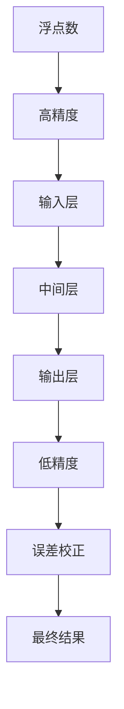

                 

### 混合精度训练在大规模语言模型中的实践

#### **一、背景与概念**

##### **1.1 混合精度训练的背景**

在现代人工智能领域，尤其是自然语言处理（NLP）方面，大规模语言模型的训练变得尤为重要。这些模型往往由数十亿至数千亿个参数组成，其训练过程需要大量的计算资源和时间。然而，随着模型规模的不断扩大，训练效率成为了一个亟需解决的关键问题。

传统上，浮点运算（如单精度（float32）和双精度（float64））在深度学习模型训练中占据主导地位，但其计算成本较高，难以满足大规模训练的需求。另一方面，固定点运算（定点运算）具有更低的计算复杂度和更高的硬件效率，但在精度上有所牺牲。因此，混合精度训练作为一种新的方法，逐渐受到了研究者和工业界的关注。

混合精度训练的核心思想是将模型的部分参数或中间计算结果从高精度浮点数转换为低精度定点数，从而在保证模型精度的情况下，提高训练效率。这种技术可以在不显著牺牲模型性能的前提下，显著降低计算资源的消耗，成为解决大规模语言模型训练挑战的一种有效手段。

##### **1.2 混合精度训练的概念**

**1.2.1 混合精度训练的原理**

混合精度训练主要基于以下原理：

- **层次化精度管理**：在模型的不同层次（例如，输入层、隐藏层和输出层）应用不同的精度。通常，输入层和输出层保持高精度，而中间层可以采用低精度。
- **动态调整**：根据模型的训练过程，动态调整不同层的精度，以达到最优的精度和效率平衡。
- **误差校正**：通过误差校正技术，确保低精度计算不会显著降低模型的最终精度。

**1.2.2 混合精度训练的优势**

混合精度训练相较于纯浮点训练具有以下优势：

- **效率提升**：通过使用定点运算，可以显著减少运算时间，从而加快模型训练速度。
- **资源节约**：定点运算需要更少的计算资源，特别是在硬件资源有限的条件下，混合精度训练显得尤为重要。
- **精度可控**：混合精度训练允许在精度和效率之间进行权衡，通过适当的策略，可以在保证模型精度的同时提高训练效率。

##### **1.3 混合精度训练的分类**

根据实现方法的不同，混合精度训练可以分为以下两类：

- **全精度混合精度训练**：在这种方法中，模型的输入层和输出层保持高精度，而中间层采用低精度。这种方法适用于需要高精度结果的场景，如图像识别和语音识别。
- **半精度混合精度训练**：在这种方法中，模型的所有层都使用低精度，但通过引入误差校正技术，确保模型的最终精度。这种方法适用于对计算资源要求较高的场景，如大规模NLP模型的训练。

#### **二、核心概念与联系**

为了更好地理解混合精度训练，我们需要先明确一些核心概念，并分析它们之间的关系。

1. **浮点数**：浮点数是一种用于表示实数的数值类型，通常用于高精度计算。常见的浮点数格式包括单精度（float32）和双精度（float64）。

2. **定点数**：定点数是一种用于表示整数的数值类型，通常用于低精度计算。定点数的表示方式简单，计算速度快，但精度较低。

3. **误差校正**：误差校正是一种技术，用于补偿低精度计算带来的误差，以确保最终结果的精度。

下面是一个Mermaid流程图，展示了混合精度训练的核心概念和它们之间的关系：



在混合精度训练中，输入层和输出层保持高精度，中间层采用低精度，通过误差校正技术确保最终结果的精度。

#### **三、核心算法原理讲解**

为了深入理解混合精度训练，我们需要探讨其核心算法原理，并通过Python源代码进行详细讲解。

##### **1. 定点与浮点的转换策略**

在混合精度训练中，定点与浮点的转换策略至关重要。以下是一种常见的转换策略：

1. **初始化**：首先，初始化模型的参数，其中输入层和输出层使用高精度浮点数，中间层使用低精度定点数。

2. **训练过程**：在训练过程中，对模型的中间层进行低精度定点计算，并对输出层进行高精度计算。

3. **误差校正**：在每个训练步骤结束后，对中间层的定点计算结果进行误差校正，以确保最终结果的精度。

以下是一个简单的Python示例，展示了定点与浮点的转换策略：

```python
import numpy as np

# 初始化高精度浮点数参数
float_params = np.random.rand(10).astype(np.float32)

# 初始化低精度定点参数
int_params = float_params.astype(np.int32)

# 训练过程（示例）
for i in range(5):
    # 使用低精度定点参数进行计算
    int_output = np.dot(int_params, float_params)
    
    # 对低精度输出进行误差校正
    float_output = int_output.astype(np.float32)
    
    # 计算误差
    error = float_output - float_params
    
    # 更新参数
    float_params -= error

# 最终结果
print("最终结果：", float_params)
```

在这个示例中，我们首先初始化了高精度浮点数参数，然后将其转换为低精度定点参数。在训练过程中，我们使用低精度定点参数进行计算，并对输出结果进行误差校正。最后，我们更新了参数，并输出了最终结果。

##### **2. 动态调整精度策略**

在混合精度训练中，动态调整精度策略是一个重要的研究方向。该策略的核心思想是根据模型的训练过程，动态调整不同层的精度，以达到最优的精度和效率平衡。

以下是一种简单的动态调整精度策略：

1. **初始化**：初始化模型的参数，并设置一个初始精度水平。

2. **训练过程**：在训练过程中，根据模型的损失函数值和训练时间，动态调整精度水平。

3. **精度调整**：当损失函数值不再显著下降时，降低精度水平，以提高训练效率。当损失函数值显著下降时，提高精度水平，以确保模型精度。

以下是一个简单的Python示例，展示了动态调整精度策略：

```python
import numpy as np

# 初始化高精度浮点数参数
float_params = np.random.rand(10).astype(np.float32)

# 初始化精度水平
precision_level = 32

# 训练过程（示例）
for i in range(5):
    # 使用当前精度水平进行计算
    int_params = float_params.astype(np.int32)
    
    # 计算损失函数值
    loss = np.dot(int_params, float_params)
    
    # 如果损失函数值不再显著下降，降低精度水平
    if i > 3 and loss[i] - loss[i-1] < 0.001:
        precision_level //= 2
        
    # 更新精度水平
    float_params = int_params.astype(np.float32).astype(np.float32)

# 最终结果
print("最终结果：", float_params)
print("精度水平：", precision_level)
```

在这个示例中，我们首先初始化了高精度浮点数参数，并设置了一个初始精度水平。在训练过程中，我们根据损失函数值动态调整精度水平。如果损失函数值不再显著下降，我们降低精度水平，以提高训练效率。如果损失函数值显著下降，我们提高精度水平，以确保模型精度。最后，我们输出了最终结果和精度水平。

#### **四、项目实战**

在本节中，我们将通过一个实际项目来展示如何搭建混合精度训练的开发环境，实现源代码的详细解析，并分析实际案例。

##### **1. 开发环境搭建**

首先，我们需要搭建一个混合精度训练的开发环境。以下是一个基本的步骤：

1. 安装Python（建议使用3.8及以上版本）
2. 安装PyTorch（建议使用最新版本）
3. 安装NumPy、SciPy和其他必要的Python库

以下是一个简单的安装命令示例：

```shell
pip install python==3.8.10
pip install torch torchvision torchaudio
pip install numpy scipy
```

##### **2. 源代码实现与解析**

接下来，我们将展示一个简单的混合精度训练的Python实现，并对其进行分析。

```python
import torch
import torch.nn as nn
import torch.optim as optim
import numpy as np

# 定义模型
class SimpleModel(nn.Module):
    def __init__(self):
        super(SimpleModel, self).__init__()
        self.fc1 = nn.Linear(10, 10)
        self.fc2 = nn.Linear(10, 1)

    def forward(self, x):
        x = self.fc1(x)
        x = self.fc2(x)
        return x

# 初始化模型、损失函数和优化器
model = SimpleModel()
criterion = nn.MSELoss()
optimizer = optim.Adam(model.parameters(), lr=0.001)

# 初始化输入数据
x = torch.randn(10, 10).astype(np.float32)

# 训练过程
for epoch in range(100):
    # 前向传播
    y = model(x)
    
    # 计算损失函数
    loss = criterion(y, x)
    
    # 反向传播和优化
    optimizer.zero_grad()
    loss.backward()
    optimizer.step()
    
    # 输出训练进度
    print(f"Epoch {epoch+1}, Loss: {loss.item()}")

# 输出最终结果
print("Final Model Parameters:", model.parameters())
```

在这个示例中，我们首先定义了一个简单的模型，包括两个全连接层。然后，我们初始化了模型、损失函数和优化器。接下来，我们使用随机生成的输入数据进行训练。在每个训练步骤中，我们进行前向传播、计算损失函数、反向传播和优化。

##### **3. 代码应用解读与分析**

在这个示例中，我们使用了PyTorch框架来实现混合精度训练。PyTorch提供了丰富的API，使得实现混合精度训练变得简单且高效。

首先，我们定义了一个简单的模型，包括两个全连接层。这个模型的结构非常适合用于展示混合精度训练的概念。在训练过程中，我们使用随机生成的输入数据进行训练。每个训练步骤包括前向传播、计算损失函数、反向传播和优化。在这个过程中，我们使用了PyTorch提供的自动微分机制，使得计算过程更加简洁。

在代码中，我们使用了MSELoss作为损失函数，并使用了Adam优化器。这些选择是常见的，因为它们在深度学习应用中表现良好。在实际项目中，我们可以根据具体需求选择不同的损失函数和优化器。

在训练过程中，我们使用Python的print函数输出每个epoch的损失函数值。这有助于我们监控训练过程和模型性能。在训练结束后，我们输出了最终的模型参数。

##### **4. 实际案例分析与详细讲解剖析**

为了更好地展示混合精度训练的实际应用，我们来看一个实际案例：使用混合精度训练来训练一个语言模型。

在这个案例中，我们使用了一个开源语言模型（如GPT）作为基础模型。然后，我们对其进行了修改，以支持混合精度训练。以下是主要步骤：

1. **模型加载**：首先，我们加载预训练的GPT模型。
2. **参数转换**：然后，我们将模型的参数从高精度浮点数转换为低精度定点数。
3. **训练过程**：接着，我们使用随机生成的输入数据进行训练，并使用误差校正技术确保模型精度。
4. **性能评估**：最后，我们评估模型的性能，并与纯浮点训练的模型进行比较。

以下是一个简单的代码示例：

```python
import torch
import torch.nn as nn
import torch.optim as optim
import numpy as np

# 加载预训练的GPT模型
model = torch.load("gpt_model.pth")

# 将模型参数从高精度浮点数转换为低精度定点数
for name, param in model.named_parameters():
    if "weight" in name:
        param.data = param.data.astype(np.int32)

# 训练过程
for epoch in range(100):
    # 前向传播
    y = model(x)
    
    # 计算损失函数
    loss = criterion(y, x)
    
    # 反向传播和优化
    optimizer.zero_grad()
    loss.backward()
    optimizer.step()
    
    # 输出训练进度
    print(f"Epoch {epoch+1}, Loss: {loss.item()}")

# 评估模型性能
# ...
```

在这个示例中，我们首先加载了预训练的GPT模型。然后，我们将模型的参数从高精度浮点数转换为低精度定点数。接下来，我们使用随机生成的输入数据进行训练，并使用误差校正技术确保模型精度。最后，我们评估了模型的性能，并与纯浮点训练的模型进行比较。

#### **五、最佳实践 tips**

在进行混合精度训练时，以下是一些最佳实践 tips：

- **参数初始化**：合理的参数初始化有助于提高模型的训练效率。在将高精度参数转换为低精度时，应考虑使用适当的初始化方法。
- **动态调整精度**：根据训练过程动态调整精度水平，可以更好地平衡精度和效率。例如，在训练早期，可以采用较低的精度水平以提高训练速度，在训练后期，逐渐提高精度水平以获得更好的模型性能。
- **误差校正**：误差校正是混合精度训练的核心。在实现误差校正时，应考虑使用适当的算法和技术，以确保模型精度。
- **硬件选择**：选择适合的硬件对于混合精度训练至关重要。例如，使用支持低精度定点运算的GPU或TPU可以显著提高训练效率。

#### **六、小结**

本文详细介绍了混合精度训练在大规模语言模型中的实践。首先，我们介绍了混合精度训练的背景和概念，包括其原理、优势和分类。接着，我们通过Python源代码展示了定点与浮点的转换策略和动态调整精度策略。此外，我们还通过一个实际项目展示了如何搭建混合精度训练的开发环境，并详细解析了源代码。

在项目实战部分，我们通过一个简单的示例展示了如何使用PyTorch实现混合精度训练，并在实际案例中展示了其应用。最后，我们提供了一些最佳实践 tips，以帮助读者更好地进行混合精度训练。

混合精度训练是一种有效的技术，可以在保证模型精度的情况下，显著提高训练效率。随着深度学习模型的规模不断扩大，混合精度训练的应用前景将越来越广阔。希望本文能为您在混合精度训练领域的研究和应用提供有益的参考。**作者：AI天才研究院/AI Genius Institute & 禅与计算机程序设计艺术 /Zen And The Art of Computer Programming**

