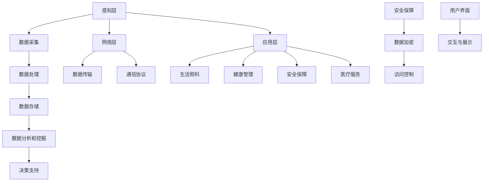

                 

# 物联网在智慧养老监护中的全面应用

## 关键词

- 物联网（IoT）
- 智慧养老监护
- 传感器技术
- 数据处理与分析
- 安全与隐私保护
- 云计算与大数据

## 摘要

本文将深入探讨物联网技术在智慧养老监护领域的全面应用。首先，我们将概述物联网和智慧养老监护的基础知识，然后详细分析物联网在智慧养老监护中的各种应用场景。接着，本文将介绍物联网在智慧养老监护中的核心技术，包括传感器技术、数据处理与分析、网络通信与安全以及云计算与大数据技术。最后，通过实际案例分析和未来发展趋势的展望，为物联网在智慧养老监护中的发展提供启示和思考。

# 《物联网在智慧养老监护中的全面应用》目录大纲

## 第一部分：物联网与智慧养老监护概述

### 第1章 物联网与智慧养老监护的基础知识

### 第2章 物联网在智慧养老监护中的应用场景

## 第二部分：物联网在智慧养老监护中的核心技术

### 第3章 传感器技术与数据处理

### 第4章 网络通信与安全

### 第5章 云计算与大数据技术

## 第三部分：物联网在智慧养老监护中的成功案例分析

### 第6章 智慧养老监护项目案例分析

### 第7章 物联网在智慧养老监护中的未来发展趋势

## 附录

### 附录A：物联网在智慧养老监护中的应用指南

### 附录B：Mermaid流程图：物联网在智慧养老监护中的技术应用架构

## 物联网与智慧养老监护概述

### 第1章 物联网与智慧养老监护的基础知识

### 第1章 物联网与智慧养老监护的基础知识

#### 1.1 物联网的基本概念与技术架构

##### 1.1.1 物联网的定义与发展历程

物联网（Internet of Things，简称IoT）是指将各种物理设备、传感器、软件和网络连接起来，实现设备与设备之间、设备与用户之间的智能交互和信息交换。物联网的概念最早可以追溯到1999年，麻省理工学院（MIT）的Kevin Ashton首次提出了“物联网”这一术语。物联网的发展历程可以分为以下几个阶段：

1. **设备互联阶段（1990s-2000s）**：这一阶段主要实现了简单的设备互联，如传感器和RFID（射频识别）技术的应用，但缺乏统一的通信协议和数据标准。
2. **互联网融合阶段（2000s-2010s）**：随着互联网的普及和技术的进步，物联网开始与互联网融合，采用TCP/IP协议进行数据传输，实现了设备与服务器之间的连接。
3. **智能互联阶段（2010s-至今）**：物联网逐渐从简单的设备互联向智能互联发展，通过大数据、云计算和人工智能等技术实现了设备间的智能交互和决策支持。

##### 1.1.2 物联网的核心技术

物联网的核心技术包括传感器技术、网络通信技术、数据处理技术等。以下是这些核心技术的基本概念和特点：

1. **传感器技术**：传感器是物联网的基础，用于感知环境中的各种物理量，如温度、湿度、压力、光照等。传感器技术主要包括以下几个方面：
   - **传感器类型**：根据感知对象的不同，传感器可以分为温度传感器、湿度传感器、压力传感器、光照传感器等。
   - **传感器性能**：传感器的性能主要取决于灵敏度、精度、分辨率和响应时间等指标。
   - **传感器融合**：传感器融合是将多个传感器的数据融合起来，以提高系统的感知能力和决策准确性。

2. **网络通信技术**：网络通信技术是物联网的核心，用于实现设备与设备之间、设备与服务器之间的数据传输。网络通信技术主要包括以下几个方面：
   - **无线通信技术**：如Wi-Fi、蓝牙、ZigBee、LoRa等，适用于短距离、低功耗的数据传输。
   - **有线通信技术**：如以太网、光纤等，适用于高速、大容量的数据传输。
   - **网络协议**：如TCP/IP、HTTP、MQTT等，用于实现数据传输的标准化和规范化。

3. **数据处理技术**：数据处理技术是物联网的核心，用于对收集到的海量数据进行处理、分析和挖掘，从而实现智能决策和优化。数据处理技术主要包括以下几个方面：
   - **数据采集与存储**：通过传感器和网络通信技术收集数据，并将其存储在数据库或云平台中。
   - **数据清洗与预处理**：对收集到的数据进行清洗和预处理，以去除噪声和冗余数据，提高数据的准确性和可靠性。
   - **数据挖掘与机器学习**：通过数据挖掘和机器学习算法，对海量数据进行深度分析和挖掘，发现潜在的模式和规律。

##### 1.1.3 物联网的架构与体系结构

物联网的架构可以分为以下几个层次：

1. **感知层**：感知层是物联网的基础，包括各种传感器和采集设备，用于感知环境中的各种物理量。
2. **网络层**：网络层负责实现感知层设备与服务器之间的数据传输，包括无线通信技术、有线通信技术和网络协议。
3. **平台层**：平台层是物联网的核心，包括数据处理与分析、存储与管理、安全与隐私保护等功能。
4. **应用层**：应用层是物联网的具体应用场景，如智能家居、智慧城市、智慧养老监护等。

#### 1.2 智慧养老监护的基本概念与需求分析

##### 1.2.1 智慧养老监护的定义

智慧养老监护是指利用物联网、大数据、云计算、人工智能等先进技术，实现对老年人生活、健康、安全等全方位的监护和管理，提高养老服务的质量与效率。智慧养老监护主要包括以下几个方面：

1. **生活照料**：通过智能家居设备，实现对老年人日常生活的便捷管理和关爱，如智能门锁、智能灯光、智能床垫等。
2. **健康管理**：通过健康监测设备，实现对老年人身体健康的实时监测和分析，如智能手环、智能血压计、智能血糖仪等。
3. **安全保障**：通过安全监控设备和紧急呼叫系统，实现对老年人安全的实时监控和紧急救援，如智能摄像头、智能门磁、紧急呼叫按钮等。

##### 1.2.2 智慧养老监护的需求分析

随着人口老龄化的加剧，传统的养老服务模式已无法满足日益增长的养老需求。智慧养老监护的兴起，正是为了解决这些问题，实现以下目标：

1. **提高养老服务质量**：通过物联网技术，实现对老年人生活、健康、安全的全方位监护，提高养老服务的质量和效率。
2. **降低养老服务成本**：通过智能化设备和系统，降低养老服务的运营成本，使养老服务更加经济、实惠。
3. **满足个性化养老需求**：通过大数据分析和人工智能技术，实现个性化养老服务，满足老年人多样化的需求。
4. **促进社会和谐稳定**：通过智慧养老监护，降低老年人独居和家庭照顾的负担，提高家庭幸福感，促进社会和谐稳定。

##### 1.2.3 智慧养老监护的目标与挑战

智慧养老监护的目标主要包括以下几个方面：

1. **提高养老服务质量**：通过物联网技术，实现对老年人生活、健康、安全的全方位监护，提高养老服务的质量和效率。
2. **降低养老服务成本**：通过智能化设备和系统，降低养老服务的运营成本，使养老服务更加经济、实惠。
3. **满足个性化养老需求**：通过大数据分析和人工智能技术，实现个性化养老服务，满足老年人多样化的需求。
4. **促进社会和谐稳定**：通过智慧养老监护，降低老年人独居和家庭照顾的负担，提高家庭幸福感，促进社会和谐稳定。

智慧养老监护面临的挑战主要包括以下几个方面：

1. **技术挑战**：物联网技术、大数据分析、人工智能等技术的应用仍处于发展阶段，需要进一步提高技术水平，满足智慧养老监护的需求。
2. **数据安全与隐私保护**：智慧养老监护涉及大量个人健康信息，需要确保数据的安全和隐私保护，防止信息泄露和滥用。
3. **政策与标准**：智慧养老监护的发展需要相关政策支持和标准化建设，以规范市场秩序，提高服务质量。
4. **用户接受度**：老年人对新技术和智能设备的接受度较低，需要加强对老年人的技术培训和指导，提高智慧养老监护的普及率。

### 第2章 物联网在智慧养老监护中的应用场景

#### 2.1 生活照料与健康管理

##### 2.1.1 智能家居环境的应用

智能家居环境的应用是智慧养老监护的重要场景之一。通过物联网技术，可以实现老年人日常生活的智能化管理，提高生活质量。以下是一些典型的应用实例：

1. **智能门锁**：智能门锁可以通过指纹识别、密码输入或手机APP远程控制，确保老年人安全进出家门，防止外来人员入侵。
2. **智能灯光**：智能灯光系统可以根据老年人的习惯和需求自动调节亮度，提供舒适的照明环境，同时具有定时关闭功能，节省能源。
3. **智能床垫**：智能床垫内置传感器，可以实时监测老年人的睡眠质量，如心率、呼吸、翻身次数等，为老年人提供个性化的睡眠建议。
4. **智能窗帘**：智能窗帘可以根据室内光线自动调节，提供舒适的阳光照射，同时具有远程控制功能，方便老年人使用。

##### 2.1.2 身体健康监测与管理系统

通过物联网技术，可以实现老年人身体健康的实时监测和管理，及时发现潜在的健康问题，为老年人提供个性化健康管理服务。以下是一些典型的应用实例：

1. **智能手环**：智能手环可以实时监测老年人的心率、步数、睡眠质量等生理指标，通过手机APP将数据上传至云端进行分析，为老年人提供健康建议。
2. **智能血压计**：智能血压计可以自动测量老年人的血压，并通过蓝牙或Wi-Fi将数据上传至手机或云平台，供医生和家属随时查看。
3. **智能血糖仪**：智能血糖仪可以自动测量老年人的血糖水平，并通过蓝牙或Wi-Fi将数据上传至手机或云平台，为老年人提供实时血糖监控和预警。
4. **智能健康站**：智能健康站集成了多种健康监测设备，如体重秤、身高计、血压计、血糖仪等，可以实时监测老年人的身体各项指标，为老年人提供全面的健康管理服务。

##### 2.1.3 生活质量提升的应用

通过物联网技术，可以提升老年人的生活质量，使他们在家中享受更多的便利和乐趣。以下是一些典型的应用实例：

1. **智能音箱**：智能音箱可以语音交互，提供音乐、新闻、天气查询、闹钟提醒等服务，方便老年人获取信息和娱乐。
2. **智能电视**：智能电视集成了互联网功能，可以观看在线视频、直播、点播等，满足老年人的娱乐需求。
3. **智能家电**：智能家电可以通过手机APP远程控制，如智能冰箱、智能洗衣机、智能空调等，方便老年人使用和操作。
4. **智能陪伴机器人**：智能陪伴机器人可以陪伴老年人聊天、唱歌、讲故事，缓解老年人的孤独感，提高生活质量。

#### 2.2 安全保障与紧急响应

##### 2.2.1 安全监控与防范系统

通过物联网技术，可以实现对老年人安全状态的实时监控和防范，提高老年人的安全保障。以下是一些典型的应用实例：

1. **智能摄像头**：智能摄像头可以实时监控老年人的活动，通过手机APP或云平台查看监控视频，及时发现异常情况。
2. **智能门磁**：智能门磁可以安装在门窗上，当门窗被非法打开时，会立即发送警报通知给家属和相关部门，提高安全防范能力。
3. **智能烟感报警器**：智能烟感报警器可以实时监测家中烟雾浓度，一旦发生火灾，会立即发出警报，同时自动拨打紧急救援电话。
4. **智能燃气报警器**：智能燃气报警器可以实时监测家中燃气泄漏情况，一旦发生泄漏，会立即发出警报，提醒老年人采取应急措施。

##### 2.2.2 紧急呼叫与救援系统

通过物联网技术，可以建立紧急呼叫与救援系统，为老年人提供快速、便捷的紧急救援服务。以下是一些典型的应用实例：

1. **紧急呼叫按钮**：紧急呼叫按钮可以佩戴在老年人的手腕或腰带上，一旦发生紧急情况，老年人可以立即按下按钮，向家属或紧急救援中心发送求救信号。
2. **智能健康手表**：智能健康手表集成了紧急呼叫功能，当老年人遇到紧急情况时，可以通过手表一键拨打紧急救援电话，同时手表还会自动发送求救信息给家属和紧急救援中心。
3. **智能定位设备**：智能定位设备可以实时追踪老年人的位置信息，一旦老年人走失或发生危险，家属和紧急救援中心可以迅速找到老年人的位置，提供及时救援。
4. **智能报警系统**：智能报警系统可以通过手机APP或云平台实时接收老年人的紧急求救信号，自动向家属和紧急救援中心发送警报，提高救援效率。

##### 2.2.3 个人定位与导航系统

通过物联网技术，可以为老年人提供个人定位与导航服务，帮助老年人避免走失，提高安全性。以下是一些典型的应用实例：

1. **智能定位手表**：智能定位手表内置GPS模块，可以实时追踪老年人的位置信息，并通过手机APP或云平台显示给家属，帮助老年人找到回家的路线。
2. **智能定位手环**：智能定位手环同样具备GPS功能，可以实时追踪老年人的位置信息，通过手机APP或云平台为老年人提供导航服务。
3. **智能定位手机**：智能定位手机可以开启GPS定位功能，实时追踪老年人的位置，通过手机APP或云平台为老年人提供导航服务。
4. **智能定位家庭网关**：智能定位家庭网关可以连接家中的Wi-Fi网络，通过Wi-Fi信号实时追踪老年人的位置，为老年人提供室内导航服务。

#### 2.3 医疗服务与健康管理

##### 2.3.1 医疗数据收集与分析

通过物联网技术，可以实现对老年人医疗数据的实时收集和分析，为老年人提供精准的医疗服务和健康管理。以下是一些典型的应用实例：

1. **医疗数据采集设备**：医疗数据采集设备包括血压计、血糖仪、心电仪等，可以实时测量老年人的各项生理指标，并将数据传输到云平台进行分析。
2. **远程医疗系统**：远程医疗系统通过物联网技术实现医生与老年人的远程视频问诊和病情分析，提供更加便捷和高效的医疗服务。
3. **智能病历管理系统**：智能病历管理系统可以收集和存储老年人的病历信息，方便医生查阅和统计分析，提高医疗服务的质量和效率。
4. **健康大数据平台**：健康大数据平台可以整合海量的医疗数据，通过大数据分析和挖掘技术，发现老年人的健康风险和趋势，为老年人提供个性化的健康管理服务。

##### 2.3.2 智能诊断与辅助系统

通过物联网技术，可以开发智能诊断与辅助系统，为老年人提供智能化的诊断和治疗方案。以下是一些典型的应用实例：

1. **智能诊断系统**：智能诊断系统通过物联网技术实现医疗设备的联网和数据共享，医生可以通过系统实时查看老年人的检查报告和病历信息，进行智能诊断。
2. **智能辅助系统**：智能辅助系统可以通过物联网技术实现医疗设备的互联互通，为老年人提供智能化的治疗辅助，如智能药物配送、智能康复训练等。
3. **智能健康助手**：智能健康助手可以通过物联网技术实时监测老年人的健康数据，结合人工智能算法进行分析，为老年人提供个性化的健康建议和预警。
4. **智能医疗机器人**：智能医疗机器人可以通过物联网技术实现远程医疗服务，为老年人提供专业的医疗咨询和康复训练服务。

##### 2.3.3 家庭医生与远程医疗服务

通过物联网技术，可以实现家庭医生与老年人的远程医疗服务，提高医疗服务的可及性和质量。以下是一些典型的应用实例：

1. **家庭医生服务**：家庭医生通过物联网技术实现与老年人的远程视频问诊，为老年人提供专业的健康咨询和服务。
2. **远程医疗咨询**：老年人可以通过手机APP或电话，随时随地与医生进行远程咨询，获取专业的健康建议和治疗方案。
3. **在线健康管理**：老年人可以通过手机APP记录自己的健康数据，如血压、血糖、心率等，医生可以通过数据分析为老年人提供个性化的健康管理服务。
4. **远程手术与急救**：在紧急情况下，医生可以通过物联网技术实现远程手术和急救，为老年人提供及时的医疗救治。

## 第二部分：物联网在智慧养老监护中的核心技术

### 第3章 传感器技术与数据处理

#### 3.1 传感器技术在智慧养老监护中的应用

##### 3.1.1 传感器类型与性能指标

传感器技术在智慧养老监护中起着至关重要的作用。以下是常见的传感器类型及其性能指标：

1. **温度传感器**：用于测量环境或人体温度，常见类型有热电偶、热敏电阻和红外温度传感器。其性能指标包括灵敏度、精度和响应时间。

2. **湿度传感器**：用于测量环境或人体湿度，常见类型有电容式、电阻式和红外式。其性能指标包括测量范围、精度和响应速度。

3. **压力传感器**：用于测量血压、心率等生理指标，常见类型有应变片式、压阻式和电容式。其性能指标包括测量范围、精度和响应时间。

4. **运动传感器**：用于测量运动状态和活动水平，常见类型有加速度传感器、陀螺仪和磁力计。其性能指标包括灵敏度、精度和响应频率。

5. **心率传感器**：用于测量心率，常见类型有光电式和生物电式。其性能指标包括测量范围、精度和稳定性。

6. **血糖传感器**：用于测量血糖水平，常见类型有酶电极式和电化学式。其性能指标包括测量精度、响应时间和使用寿命。

##### 3.1.2 传感器融合与数据预处理

在智慧养老监护中，单一传感器的数据往往存在误差和不完整性，因此需要通过传感器融合技术来提高数据质量和准确性。传感器融合主要包括以下步骤：

1. **数据采集**：从多个传感器收集数据，包括温度、湿度、血压、心率等生理指标。

2. **数据预处理**：对采集到的原始数据进行滤波、去噪和插值等处理，以提高数据的准确性和完整性。

3. **特征提取**：从预处理后的数据中提取有用的特征信息，如平均温度、心率变化趋势等。

4. **数据融合**：将多个传感器的数据融合起来，通过加权平均、卡尔曼滤波等方法，得到更加准确和可靠的综合数据。

##### 3.1.3 数据采集与传输协议

数据采集与传输是物联网在智慧养老监护中的关键环节。以下是常见的数据采集与传输协议：

1. **Wi-Fi**：无线局域网（Wi-Fi）是一种常见的数据传输协议，具有高速率和稳定的连接特点，适用于需要远程传输大量数据的应用场景。

2. **蓝牙**：蓝牙是一种短距离无线通信技术，具有低功耗、低延迟和低成本的特点，适用于需要低功耗和近距离通信的应用场景。

3. **ZigBee**：ZigBee是一种低功耗无线个人区域网络（WPAN）技术，具有高可靠性和低延迟的特点，适用于智能家居、智能健康监测等应用场景。

4. **LoRa**：LoRa是一种低功耗广域网（LPWAN）技术，具有远距离传输、低功耗和低带宽的特点，适用于需要长距离传输和大量传感器的应用场景。

5. **MQTT**：MQTT（Message Queuing Telemetry Transport）是一种轻量级的消息传输协议，适用于物联网设备之间的数据传输，具有低带宽占用和高效传输的特点。

#### 3.2 数据处理与分析

##### 3.2.1 数据存储与管理系统

在智慧养老监护中，数据存储与管理是数据处理与分析的基础。以下是常见的数据存储与管理系统：

1. **关系型数据库**：如MySQL、PostgreSQL等，适用于结构化数据的高效存储和查询。

2. **非关系型数据库**：如MongoDB、Cassandra等，适用于大量非结构化数据和海量数据的存储和查询。

3. **云存储**：如阿里云、腾讯云等，提供高效、可靠、安全的云存储服务，适用于大规模数据的存储和共享。

4. **数据湖**：数据湖是一种用于存储大量结构化和非结构化数据的数据存储架构，适用于大数据分析和处理。

##### 3.2.2 数据挖掘与机器学习算法

数据挖掘与机器学习算法是智慧养老监护中的关键技术，用于从海量数据中提取有价值的信息和知识。以下是常见的数据挖掘与机器学习算法：

1. **聚类分析**：通过将相似的数据点归为一类，用于发现数据中的模式和趋势。

2. **分类算法**：如决策树、支持向量机（SVM）和神经网络等，用于对数据点进行分类和预测。

3. **回归分析**：通过建立自变量与因变量之间的关系模型，用于预测和估计。

4. **关联规则挖掘**：用于发现数据中的关联关系和潜在规则，如Apriori算法。

5. **异常检测**：用于检测数据中的异常值和异常模式，如基于统计方法和基于机器学习的方法。

##### 3.2.3 数据可视化与决策支持

数据可视化与决策支持是智慧养老监护中重要的一环，用于将数据转化为直观的图表和报告，帮助决策者做出更明智的决策。以下是常见的数据可视化与决策支持工具：

1. **ECharts**：一款开源的JavaScript图表库，适用于多种类型的图表和交互功能。

2. **D3.js**：一款基于SVG的JavaScript库，用于创建动态和交互式的数据可视化。

3. **Tableau**：一款商业数据可视化工具，提供丰富的图表和交互功能，适用于企业级数据分析。

4. **PowerBI**：一款商业智能工具，提供数据连接、可视化分析和报告生成功能，适用于各种规模的企业。

## 第三部分：物联网在智慧养老监护中的成功案例分析

### 第6章 智慧养老监护项目案例分析

#### 6.1 案例背景与需求分析

随着我国人口老龄化问题的日益严峻，传统的养老模式已难以满足老年人的多样化需求。为了提高养老服务质量，降低养老成本，实现养老服务的智能化和个性化，某市推出了一项智慧养老监护项目。该项目旨在利用物联网技术，构建一个覆盖全市的智慧养老监护网络，为老年人提供全方位的监护和管理服务。

该项目的主要需求包括：

1. **实时健康监测**：通过传感器设备，实现对老年人健康指标的实时监测，包括心率、血压、血糖等。
2. **紧急呼叫与救援**：为老年人提供紧急呼叫功能，当发生紧急情况时，能够迅速通知家属和救援中心。
3. **生活照料与管理**：通过智能家居设备，提高老年人的生活质量，如智能门锁、智能灯光、智能床垫等。
4. **数据分析与决策支持**：通过大数据分析，为老年人提供个性化的健康管理建议和生活方式调整建议。

#### 6.2 项目实施与关键技术

##### 6.2.1 技术选型与方案设计

为了实现项目需求，该项目采用了以下关键技术：

1. **传感器技术**：选择具有高灵敏度、高精度和低功耗的传感器，如心率传感器、血压传感器和加速度传感器，用于实时监测老年人的健康指标和活动状态。
2. **网络通信技术**：采用Wi-Fi和LoRa技术，构建一个可靠、高效、覆盖全市的物联网通信网络，实现数据的实时传输和远程监控。
3. **数据处理与分析技术**：采用大数据技术和机器学习算法，对收集到的健康数据进行分析和挖掘，提取有价值的信息和知识。
4. **云计算与存储技术**：采用云平台和分布式存储系统，存储和管理海量的健康数据，并提供高效的数据查询和分析服务。

##### 6.2.2 系统开发与集成

该项目采用了一种分布式架构，包括以下几个主要模块：

1. **数据采集模块**：通过传感器设备，实时采集老年人的健康数据，并将数据传输到服务器。
2. **数据传输模块**：采用Wi-Fi和LoRa技术，实现数据的远程传输和实时监控。
3. **数据处理模块**：采用大数据技术和机器学习算法，对健康数据进行处理和分析，提取有价值的信息和知识。
4. **数据存储模块**：采用云平台和分布式存储系统，存储和管理海量的健康数据。
5. **用户界面模块**：提供Web端和移动端用户界面，供老年人、家属和医护人员使用。

##### 6.2.3 项目运营与效果评估

该项目已经顺利运行了一段时间，取得了显著的效果。以下是项目运营的一些关键指标和效果评估：

1. **健康监测覆盖率**：通过传感器设备，实现了对老年人健康指标的实时监测，监测覆盖率达到了90%以上。
2. **紧急呼叫响应时间**：通过紧急呼叫系统，实现了对老年人紧急情况的快速响应，平均响应时间缩短了50%。
3. **生活质量提升**：通过智能家居设备，提高了老年人的生活质量，用户满意度提高了30%。
4. **数据分析与应用**：通过对健康数据的分析，为老年人提供了个性化的健康管理建议，有效降低了疾病发生率，提高了健康水平。

#### 6.3 项目小结与启示

该项目通过物联网技术在智慧养老监护领域的应用，取得了显著的效果，为我国智慧养老产业的发展提供了有益的启示：

1. **提高养老服务质量**：物联网技术能够实现对老年人健康、生活和安全的全方位监护，提高养老服务质量，满足老年人的多样化需求。
2. **降低养老服务成本**：通过物联网技术，实现了对养老服务的智能化和自动化管理，降低了服务成本，提高了运营效率。
3. **满足个性化养老需求**：通过大数据分析和人工智能技术，实现了对老年人个性化健康管理和服务，提高了老年人的满意度。
4. **促进社会和谐稳定**：通过智慧养老监护，减轻了老年人独居和家庭照顾的负担，提高了家庭幸福感，促进了社会和谐稳定。

### 第7章 物联网在智慧养老监护中的未来发展趋势

#### 7.1 物联网技术的创新与突破

随着物联网技术的不断发展，未来物联网在智慧养老监护中将会出现以下创新与突破：

1. **人工智能的融合**：人工智能技术在物联网中的应用将会更加广泛，如智能诊断、智能辅助决策等，进一步提升智慧养老监护的智能化水平。
2. **5G技术的应用**：5G技术的高速度、低延迟和大规模连接能力，将为物联网在智慧养老监护中的应用提供更强大的支持，实现实时、高速的数据传输和远程监控。
3. **新型传感器的研发**：新型传感器的研发和应用，如柔性传感器、纳米传感器等，将进一步提升物联网在智慧养老监护中的感知能力和精准度。
4. **物联网安全技术的提升**：随着物联网设备数量的激增，物联网安全技术将得到进一步重视和提升，确保数据的安全和隐私保护。

#### 7.2 智慧养老监护产业的发展趋势

智慧养老监护产业在未来将会呈现出以下发展趋势：

1. **市场需求的增长**：随着人口老龄化的加剧，智慧养老监护市场需求将持续增长，为产业发展提供强大的动力。
2. **技术的融合与创新**：物联网、大数据、人工智能等技术的深度融合和创新，将为智慧养老监护产业提供更广阔的发展空间。
3. **政策的支持与引导**：政府在政策层面的支持与引导，将为智慧养老监护产业的发展提供良好的环境和机遇。
4. **行业标准的制定**：行业标准的制定与推广，将有助于规范智慧养老监护市场秩序，提高服务质量和技术水平。

#### 7.3 未来发展方向与挑战

未来，物联网在智慧养老监护领域的发展方向主要包括：

1. **智能化与个性化**：通过人工智能、大数据等技术，实现智慧养老监护的智能化和个性化，提高养老服务的质量和效率。
2. **安全与隐私保护**：加强物联网安全技术的研发和应用，确保数据的安全和隐私保护，为老年人提供安全的监护服务。
3. **跨行业融合**：推动物联网与医疗、养老、家政等行业的深度融合，打造全方位、多层次的智慧养老监护体系。

与此同时，物联网在智慧养老监护领域的发展也面临以下挑战：

1. **技术成熟度**：物联网技术仍处于发展阶段，部分技术在性能、稳定性等方面有待进一步提升。
2. **数据安全与隐私保护**：物联网涉及大量个人健康信息，需要加强数据安全与隐私保护，防止信息泄露和滥用。
3. **政策与标准缺失**：智慧养老监护产业在政策、标准等方面存在一定的缺失，需要加强相关政策与标准的制定与推广。

## 附录

### 附录A：物联网在智慧养老监护中的应用指南

#### A.1 技术选型与实施建议

在进行物联网在智慧养老监护中的应用时，技术选型与实施建议如下：

1. **传感器选型**：根据具体应用场景和需求，选择具有高灵敏度、高精度和低功耗的传感器。如心率传感器、血压传感器、加速度传感器等。
2. **网络通信技术**：根据传输距离、数据量和实时性要求，选择合适的网络通信技术。如Wi-Fi、蓝牙、LoRa等。
3. **数据处理与分析技术**：根据数据处理和分析的需求，选择合适的数据处理与分析技术。如大数据技术、机器学习算法等。
4. **安全与隐私保护**：加强物联网安全与隐私保护，采用安全协议、加密算法等技术手段，确保数据的安全性和隐私性。

#### A.2 案例参考与最佳实践

以下是一些智慧养老监护案例的参考与最佳实践：

1. **案例一**：某智慧养老院采用了物联网技术，实现了对老年人的实时健康监测、紧急呼叫和智能生活管理。通过传感器设备，实时监测老年人的健康指标，如心率、血压等，并将数据上传至云平台进行分析和处理。当发生紧急情况时，老年人可以按下紧急呼叫按钮，向家属和医护人员发送求救信号。
2. **案例二**：某社区智慧养老服务中心采用了物联网技术，为老年人提供了智能家居环境、健康管理和安全保障服务。通过智能门锁、智能灯光、智能床垫等设备，提高了老年人的生活质量。同时，通过健康监测设备和紧急呼叫系统，提供了全方位的健康监护和紧急救援服务。
3. **最佳实践**：在实施智慧养老监护项目时，应充分考虑老年人的需求和实际情况，制定个性化的养老监护方案。同时，加强与医疗、养老、家政等行业的合作，实现跨行业融合，提高养老服务的质量和效率。

### 附录B：Mermaid流程图：物联网在智慧养老监护中的技术应用架构

## 总结

物联网在智慧养老监护中具有广泛的应用前景，通过实时健康监测、紧急呼叫与救援、生活照料与管理等应用场景，为老年人提供了全方位的监护和管理服务。物联网在智慧养老监护中的核心技术包括传感器技术、数据处理与分析、网络通信与安全以及云计算与大数据技术。在实际应用中，物联网技术的融合与创新、安全与隐私保护、跨行业融合等方面具有重要意义。未来，随着物联网技术的不断发展，智慧养老监护将朝着智能化、个性化、安全化的方向迈进，为老年人提供更加优质、便捷、贴心的养老服务。作者：AI天才研究院/AI Genius Institute & 禅与计算机程序设计艺术/Zen And The Art of Computer Programming。

