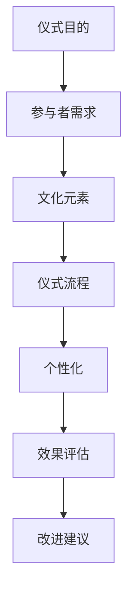

                 

# 生命仪式策划师培训：设计现代人生命阶段仪式

## 关键词
- 生命仪式策划
- 生命阶段划分
- 仪式设计原则
- 数字化生命仪式
- 新型生命仪式

## 摘要
本文深入探讨了生命仪式策划师这一新兴职业，从职业概述、生命阶段划分、仪式设计原则、实践案例分析以及未来发展趋势等多个维度，全面解析了如何设计现代人生命阶段仪式。文章旨在为生命仪式策划师提供专业的理论指导和实践参考，以帮助他们在职业生涯中不断提升专业能力。

## 第1章 生命仪式策划师职业概述

### 1.1 生命仪式策划师的角色与职责

生命仪式策划师是专门从事生命仪式设计、策划与执行的专业人员。他们的核心职责包括：

1. **理解与规划**：与客户沟通，了解客户的期望、需求和预算，制定详细的仪式策划方案。
2. **仪式设计**：根据客户的需求，设计符合生命阶段特点的仪式流程、环节、活动内容和形式。
3. **仪式执行**：监督并参与仪式的执行过程，确保仪式的顺利进行。
4. **效果评估**：仪式结束后，收集反馈，评估仪式的成功程度，为后续改进提供依据。

### 1.2 生命仪式策划师的职业要求与素质

成为一名优秀的生命仪式策划师，需要具备以下职业要求与素质：

1. **专业知识**：了解不同文化背景下的生命仪式，熟悉各种仪式的习俗和传统。
2. **沟通能力**：具备良好的沟通技巧，能够有效地与客户沟通，了解其需求。
3. **创新能力**：能够不断创新，设计出具有创意的仪式方案。
4. **组织协调**：具备良好的组织协调能力，能够确保仪式的顺利进行。
5. **抗压能力**：能够应对仪式策划过程中的各种挑战和压力。

### 1.3 生命仪式策划师的就业前景与挑战

随着社会对生命仪式重视程度的提高，生命仪式策划师的就业前景十分广阔。他们可以在以下领域找到就业机会：

1. **婚礼策划公司**：为新人提供婚礼策划服务。
2. **庆典公司**：为各种庆典活动提供策划服务。
3. **文化机构**：参与文化活动的策划与执行。
4. **独立策划师**：为个人或小型团体提供定制化的仪式策划服务。

然而，生命仪式策划师也面临以下挑战：

1. **市场需求变化**：随着社会变迁，人们对生命仪式的需求也在不断变化，策划师需要不断更新知识和技能。
2. **竞争压力**：生命仪式策划行业竞争激烈，策划师需要不断提升自身专业水平，以保持竞争优势。
3. **客户满意度**：客户满意度是衡量策划师工作成果的重要指标，需要不断优化服务，提高客户满意度。

## 第2章 人生命阶段的划分与仪式设计

### 2.1 生命阶段的划分

人的生命阶段可以大致分为早期生命阶段、中期生命阶段和晚期生命阶段。

#### 2.1.1 早期生命阶段

早期生命阶段包括从出生到青少年期的各个阶段，如：

- **婴儿期**：从出生到一岁。
- **幼儿期**：一岁到三岁。
- **童年期**：三岁到六岁。
- **少年期**：六岁到十二岁。

#### 2.1.2 中期生命阶段

中期生命阶段包括从青少年期到老年期的各个阶段，如：

- **青少年期**：十二岁到十八岁。
- **青年期**：十八岁到四十岁。
- **中年期**：四十岁到六十岁。
- **老年期**：六十岁以上。

### 2.2 中期生命阶段

中期生命阶段的仪式设计主要包括青春期仪式和成年礼。

#### 2.2.1 青春期仪式

青春期仪式是标志青少年从童年向成年过渡的重要仪式。其设计原则包括：

1. **尊重个体**：尊重青少年的个性和选择，使其在仪式中感受到尊重和认可。
2. **寓意深刻**：仪式内容应寓意深刻，能够引导青少年正确面对成长中的挑战。
3. **形式多样**：可以根据不同的文化背景和青少年群体的特点，设计多样化的仪式形式。

#### 2.2.2 成年礼

成年礼是标志青年正式成年的重要仪式。其设计原则包括：

1. **庄重正式**：仪式应庄重正式，体现出成年的严肃和责任。
2. **文化传承**：成年礼应融入传统文化元素，传承文化精神。
3. **个性体现**：可以根据个人的兴趣和特长，设计个性化的成年礼环节。

### 2.3 晚期生命阶段

晚期生命阶段的仪式设计主要包括职业成功庆典、家庭建立庆典和长者仪式。

#### 2.3.1 职业成功庆典

职业成功庆典是庆祝中年人在职业生涯中取得重要成就的重要仪式。其设计原则包括：

1. **表彰成就**：仪式应突出表彰中年人在职业生涯中的成就和贡献。
2. **感恩回馈**：可以邀请中年人的同事、朋友和家庭成员参加，共同分享成功的喜悦。
3. **激励未来**：仪式内容应激励中年人继续追求职业成功，实现更大的成就。

#### 2.3.2 家庭建立庆典

家庭建立庆典是庆祝中年人建立家庭的重要仪式。其设计原则包括：

1. **温馨感人**：仪式应营造出温馨感人的氛围，表达对家庭的祝福和期望。
2. **家庭特色**：可以根据家庭的特色和喜好，设计个性化的仪式环节。
3. **互动参与**：可以设计互动环节，让家庭成员共同参与，增进家庭感情。

#### 2.3.3 长者仪式

长者仪式是庆祝老年人进入长寿阶段的仪式。其设计原则包括：

1. **尊重长者**：仪式应体现出对长者的尊重和敬意。
2. **庆祝长寿**：仪式内容应庆祝老年人的长寿和健康。
3. **传承智慧**：可以邀请长者分享智慧和经验，传承给年轻一代。

## 第3章 生命仪式策划的基本原则与方法

### 3.1 仪式策划的原则

生命仪式策划应遵循以下基本原则：

1. **尊重个性化**：仪式应尊重个人的需求和偏好，体现个性化的特色。
2. **注重文化传承**：仪式应融入传统文化的元素，传承文化精神。
3. **寓意深刻**：仪式内容应寓意深刻，具有教育意义和启示作用。
4. **形式多样**：可以根据不同的生命阶段和个人的特点，设计多样化的仪式形式。
5. **实用性强**：仪式应具有实用性，能够帮助参与者更好地面对生命中的挑战。

### 3.2 仪式策划的方法

生命仪式策划的方法包括以下步骤：

1. **需求分析**：与客户沟通，了解客户的期望、需求和预算，确定仪式的目的和核心内容。
2. **创意构思**：根据需求分析，设计出符合主题的仪式流程、环节和活动内容。
3. **流程设计**：将创意构思转化为具体的仪式流程，确保仪式的顺利进行。
4. **预算规划**：根据仪式的规模和内容，制定合理的预算，确保仪式的财务可行性。
5. **执行监督**：在仪式执行过程中，监督各个环节的顺利进行，确保仪式的完美呈现。
6. **效果评估**：仪式结束后，收集反馈，评估仪式的成功程度，为后续改进提供依据。

### 3.3 仪式策划的核心概念与联系

在生命仪式策划中，有几个核心概念需要理解和联系：

1. **仪式目的**：仪式的目的决定了仪式的核心内容和形式，是仪式策划的基础。
2. **参与者**：参与者的需求和期待直接影响仪式的设计和执行，需要给予充分的关注。
3. **仪式流程**：仪式流程是仪式的核心，决定了仪式的顺利进行和效果。
4. **文化元素**：文化元素是仪式的特色和灵魂，体现了仪式的文化内涵和传承。
5. **个性化**：个性化是仪式的亮点，体现了仪式的独特性和参与者的个性。

下面是一个Mermaid流程图，展示了这些概念之间的关系：



### 3.4 核心算法原理讲解

在生命仪式策划中，有几个核心算法原理需要理解和应用：

1. **需求分析算法**：通过数据分析和客户沟通，确定仪式的目的和核心内容。
2. **创意构思算法**：根据需求分析，设计出具有创意的仪式流程和活动内容。
3. **流程设计算法**：将创意构思转化为具体的仪式流程，确保仪式的顺利进行。
4. **预算规划算法**：根据仪式的规模和内容，制定合理的预算，确保仪式的财务可行性。
5. **效果评估算法**：通过收集反馈和数据分析，评估仪式的成功程度，为后续改进提供依据。

下面是一个Python源代码示例，展示了如何使用需求分析算法：

```python
# 需求分析算法示例

def analyze_demand(client_data):
    """
    分析客户需求，确定仪式目的和核心内容。
    
    参数：
    client_data (dict): 客户需求数据，包括预算、期望和需求等。
    
    返回：
    result (dict): 仪式策划结果，包括仪式目的和核心内容。
    """
    
    # 分析客户预算
    budget = client_data['budget']
    if budget < 10000:
        capacity = '低'
    elif budget < 50000:
        capacity = '中'
    else:
        capacity = '高'
    
    # 分析客户期望
    expectations = client_data['expectations']
    if '文化传承' in expectations:
        theme = '文化传承'
    elif '个性体现' in expectations:
        theme = '个性体现'
    else:
        theme = '传统'
    
    # 确定仪式目的和核心内容
    purpose = '庆祝生命的某个重要阶段'
    core_content = {
        '主题': theme,
        '预算': capacity
    }
    
    result = {
        '仪式目的': purpose,
        '核心内容': core_content
    }
    
    return result

# 示例数据
client_data = {
    'budget': 20000,
    'expectations': ['文化传承', '个性体现']
}

# 调用需求分析算法
result = analyze_demand(client_data)

# 输出结果
print(result)
```

该示例使用Python定义了一个需求分析算法，通过分析客户的数据（包括预算和期望），确定了仪式的目的和核心内容。在实际应用中，可以根据具体情况进行扩展和优化。

### 3.5 数学模型和公式

在生命仪式策划中，一些数学模型和公式可以帮助我们更好地理解和设计仪式。以下是一个简单的数学模型和公式示例：

1. **预算分配模型**：
   预算 = 固定费用 + 变动费用
   
   其中，固定费用包括场地租赁、音响设备等，变动费用包括餐饮、装饰等。

2. **效果评估模型**：
   效果得分 = (满意度 + 参与度 + 印象分) / 3
   
   其中，满意度、参与度和印象分分别表示参与者对仪式的满意程度、参与积极性和仪式的印象。

3. **流程设计公式**：
   流程时间 = 环节时间 × 环节数量
   
   其中，环节时间是指每个环节的持续时间，环节数量是指仪式中包含的环节数量。

通过这些数学模型和公式，我们可以更科学地设计仪式，确保预算合理、效果显著。

### 3.6 生命仪式策划的注意事项

在生命仪式策划过程中，以下注意事项可以帮助策划师更好地完成任务：

1. **充分沟通**：与客户进行充分的沟通，了解其需求和期望，确保仪式符合客户的期望。
2. **细节把控**：注意仪式的每一个细节，从场地布置、音响效果到活动流程，都要做到精益求精。
3. **预算控制**：合理安排预算，避免超支，确保仪式的财务可行性。
4. **风险预判**：提前预判可能出现的风险和问题，制定应对措施，确保仪式的顺利进行。
5. **及时反馈**：仪式结束后，及时收集参与者的反馈，评估仪式的成功程度，为后续改进提供依据。

### 3.7 拓展阅读

- 《人生礼仪策划与执行》
- 《文化传承与仪式设计》
- 《仪式策划师手册》

## 第4章 生命仪式策划实践

### 4.1 早期生命阶段仪式策划

#### 4.1.1 出生庆典策划

出生庆典是庆祝新生儿降临的重要仪式，其策划要点包括：

1. **主题选择**：根据新生儿的性别和家庭喜好，选择适合的主题，如“欢乐宝宝”、“温馨之家”等。
2. **场地布置**：布置温馨的场地，可以添加彩带、气球等装饰，营造出喜庆的氛围。
3. **活动安排**：可以安排一些互动环节，如亲子游戏、歌唱表演等，让参与者在欢乐中庆祝新生儿的诞生。
4. **餐饮安排**：准备适合宾客的餐饮，如蛋糕、水果等，确保宾客在庆典中享受到美食。

#### 4.1.2 成长庆典策划

成长庆典是庆祝儿童成长的重要仪式，其策划要点包括：

1. **成长里程碑**：根据儿童的年龄和成长阶段，设定成长里程碑，如生日庆典、入学庆典等。
2. **主题设计**：设计符合成长里程碑主题的庆典，如“智慧成长”、“勇敢成长”等。
3. **活动安排**：安排一些寓意深刻的游戏和活动，如智力问答、勇气挑战等，鼓励儿童在成长过程中积极面对挑战。
4. **礼品赠送**：为儿童准备适合的礼品，如书籍、玩具等，激励他们在成长过程中不断进步。

### 4.2 中期生命阶段仪式策划

#### 4.2.1 青年期仪式策划

青年期仪式是庆祝青少年成长的重要仪式，其策划要点包括：

1. **仪式形式**：可以设计传统仪式，如成人礼、毕业典礼等，也可以设计现代仪式，如主题派对、户外探险等。
2. **主题选择**：选择符合青少年特点和需求的主题，如“青春飞扬”、“梦想起航”等。
3. **活动安排**：安排一些互动性强、寓教于乐的活动，如才艺展示、团队合作游戏等，让青少年在活动中体验成长的快乐。
4. **心理辅导**：为青少年提供心理辅导，帮助他们正确面对成长中的困惑和挑战。

#### 4.2.2 成年礼仪式策划

成年礼仪式是庆祝青年正式成年的重要仪式，其策划要点包括：

1. **仪式流程**：设计庄重而正式的仪式流程，包括入场、宣誓、颁奖等环节。
2. **文化元素**：融入传统文化元素，如汉服、古典音乐等，展现成年的严肃和责任。
3. **个性化**：可以根据个人的兴趣和特长，设计个性化的成年礼环节，如才艺表演、演讲等。
4. **家庭参与**：邀请家庭成员参与仪式，共同见证青年成年的重要时刻。

### 4.3 晚期生命阶段仪式策划

#### 4.3.1 职业成功庆典策划

职业成功庆典是庆祝中年人在职业生涯中取得重要成就的仪式，其策划要点包括：

1. **表彰成就**：设计表彰环节，展示中年人的成就和贡献，表达对他们的敬意和祝贺。
2. **嘉宾邀请**：邀请中年人的同事、朋友和家庭成员参加庆典，共同分享成功的喜悦。
3. **互动环节**：安排互动环节，如问答环节、抽奖环节等，增加庆典的趣味性。
4. **礼品赠送**：为中年人准备适合的礼品，如书籍、工艺品等，表达对他们的祝福和感激。

#### 4.3.2 家庭建立庆典策划

家庭建立庆典是庆祝中年人建立家庭的重要仪式，其策划要点包括：

1. **主题选择**：选择温馨、感人的主题，如“幸福之家”、“爱在心中”等。
2. **活动安排**：安排一些家庭互动活动，如亲子游戏、家庭舞蹈等，增进家庭成员间的感情。
3. **餐饮安排**：准备适合家庭的餐饮，如家常菜、甜品等，营造温馨的家庭氛围。
4. **家庭礼物**：为家庭成员准备特别的礼物，如家庭相册、家庭饰品等，纪念家庭的重要时刻。

#### 4.3.3 长者仪式策划

长者仪式是庆祝老年人进入长寿阶段的重要仪式，其策划要点包括：

1. **尊重长者**：设计庄重、尊重长者的仪式流程，如敬茶、敬香等。
2. **庆祝长寿**：安排庆祝长寿的环节，如寿宴、生日歌等，表达对长者的祝福和感激。
3. **家庭参与**：邀请家庭成员参与仪式，共同庆祝长者的长寿和健康。
4. **智慧传承**：安排长者分享智慧和经验，传承给年轻一代，弘扬尊老爱幼的传统美德。

## 第5章 生命仪式策划的案例分析

### 5.1 案例分析一：出生庆典

#### 5.1.1 案例背景

这是一个为新生儿举办出生庆典的案例。客户是一对年轻夫妇，他们的孩子刚出生不久，希望举办一个温馨、喜庆的出生庆典，邀请亲朋好友一起分享这份喜悦。

#### 5.1.2 客户需求

- 主题：温馨、喜庆的出生庆典
- 场地：室内场地，可以容纳30-40人
- 餐饮：简单、可口的点心和饮料
- 装饰：彩带、气球、花束等，营造出喜庆的氛围
- 活动：亲子游戏、歌唱表演等

#### 5.1.3 仪式流程设计

1. **开场**：主持人介绍庆典的主题和意义，宾客入场，音乐播放。
2. **敬酒环节**：主人在宾客入座后，敬上一杯酒，祝福新生儿的健康成长。
3. **感恩环节**：主人在宾客面前感谢亲朋好友的到场和支持。
4. **亲子游戏**：安排一些适合家庭的亲子游戏，如“抓迷藏”、“投球比赛”等，让宾客们在欢乐中互动。
5. **歌唱表演**：邀请宾客或专业歌唱家演唱祝福的歌曲，为新生儿送上美好的祝福。
6. **甜品环节**：提供各种精美的甜品，如蛋糕、水果等，供宾客享用。
7. **结束语**：主持人对庆典进行总结，感谢宾客的参与，祝福新生儿健康成长。

#### 5.1.4 仪式效果评估

- **宾客满意度**：宾客对庆典的氛围、活动安排和餐饮表示满意，认为这是一个温馨、愉快的庆典。
- **仪式效果**：新生儿和他的父母在庆典中感受到了亲朋好友的关爱和祝福，对孩子未来的成长充满期待。

### 5.2 案例分析二：成年礼

#### 5.2.1 案例背景

这是一个为高中生举办成年礼的案例。学校希望举办一个庄重、有意义的成年礼，让毕业生在步入社会之前，感受到成年人的责任和使命。

#### 5.2.2 学生需求

- 主题：庄重、有意义的成年礼
- 仪式流程：包括入场、宣誓、颁奖、发言等环节
- 文化元素：希望融入一些传统文化元素，如汉服、古典音乐等
- 个性化：希望每个毕业生都能在仪式中展现自己的特长和风采

#### 5.2.3 仪式流程设计

1. **开场**：主持人介绍成年礼的主题和意义，毕业生入场，音乐播放。
2. **宣誓环节**：毕业生在庄严的国歌声中宣誓，表达对未来的承诺和决心。
3. **颁奖环节**：学校领导为优秀毕业生颁发奖状和奖品，表彰他们在学业和品德方面的优秀表现。
4. **发言环节**：毕业生代表发言，分享自己的成长经历和感悟，表达对未来的期许。
5. **传统文化展示**：展示汉服、古典音乐等传统文化元素，让毕业生感受到传统文化的魅力。
6. **合影留念**：毕业生与学校领导合影，留下美好的回忆。
7. **结束语**：主持人对成年礼进行总结，祝福毕业生在未来的人生道路上勇敢前行。

#### 5.2.4 仪式效果评估

- **学生满意度**：毕业生对成年礼的流程、内容和文化元素表示满意，认为这是一个庄重、有意义的仪式。
- **仪式效果**：成年礼让毕业生深刻体会到了成年的责任和使命，为他们步入社会奠定了良好的基础。

### 5.3 案例分析三：长者仪式

#### 5.3.1 案例背景

这是一个为老年人举办的长者仪式的案例。客户的母亲即将迎来八十寿辰，希望举办一个温馨、感人的长者仪式，庆祝母亲的生日，表达对母亲的敬意和祝福。

#### 5.3.2 客户需求

- 主题：温馨、感人的长者仪式
- 场地：室内场地，可以容纳50-60人
- 餐饮：中式寿宴，包括鱼、寿桃等长寿食品
- 装饰：红色为主色调，营造喜庆的氛围
- 活动：庆祝母亲的生日，表达对母亲的敬意和祝福

#### 5.3.3 仪式流程设计

1. **开场**：主持人介绍长者仪式的主题和意义，宾客入场，音乐播放。
2. **敬酒环节**：子女为母亲敬酒，祝福母亲健康长寿。
3. **感恩环节**：子女发表感恩演讲，表达对母亲的敬意和感激。
4. **祝寿环节**：宾客为母亲送上祝福，祝愿母亲生日快乐、健康长寿。
5. **生日歌环节**：全场高唱生日歌，为母亲庆祝生日。
6. **祝福环节**：子女为母亲送上祝福，表达对母亲的感激和祝福。
7. **合影留念**：家庭成员与宾客合影，留下美好的回忆。
8. **结束语**：主持人对长者仪式进行总结，感谢宾客的到场和支持。

#### 5.3.4 仪式效果评估

- **宾客满意度**：宾客对长者仪式的氛围、活动安排和餐饮表示满意，认为这是一个温馨、感人的仪式。
- **仪式效果**：长者仪式让母亲感受到了家人的关爱和祝福，为她带来了欢乐和感动。

## 第6章 生命仪式策划的未来发展趋势

### 6.1 数字化与生命仪式策划

随着科技的不断发展，数字化技术在生命仪式策划中的应用越来越广泛。以下是一些数字化技术在生命仪式策划中的应用：

1. **虚拟现实（VR）技术**：通过VR技术，参与者可以在虚拟环境中体验生命仪式，增强仪式的互动性和沉浸感。
2. **增强现实（AR）技术**：AR技术可以将虚拟元素叠加在现实世界中，为生命仪式增添更多的创意和趣味。
3. **社交媒体平台**：利用社交媒体平台，可以实时传播生命仪式的盛况，让更多的人参与其中。
4. **在线互动**：通过在线互动平台，参与者可以在仪式现场之外参与仪式，分享感受和祝福。

### 6.2 新型生命仪式的设计与推广

随着社会的发展和文化的多元化，新型生命仪式的设计与推广成为了一个热点话题。以下是一些新型生命仪式的设计原则：

1. **创新性**：结合现代科技和文化元素，设计出具有创新性的生命仪式，满足现代人的需求。
2. **传承性**：在新型生命仪式中，融入传统文化的元素，传承文化精神，弘扬传统美德。
3. **个性化**：根据参与者的个性和需求，设计个性化的生命仪式，体现独特的个性和价值。
4. **互动性**：通过互动环节，增强参与者的参与感和体验感，让生命仪式更加生动和有趣。

### 6.3 生命仪式策划的未来发展趋势

生命仪式策划的未来发展趋势主要包括：

1. **数字化与智能化的融合**：数字化和智能化技术的应用将使生命仪式更加便捷、高效和个性化。
2. **文化传承与创新**：在生命仪式中融入更多的文化元素，传承传统文化，同时创新仪式形式和内容。
3. **个性化与定制化**：根据参与者的个性和需求，提供更加个性化的生命仪式策划服务。
4. **社交互动与共享**：利用社交媒体平台，增强生命仪式的社交互动性，实现更广泛的共享和传播。

### 6.4 生命仪式策划师的职业发展

随着生命仪式策划行业的发展，生命仪式策划师的职业发展前景也十分广阔。以下是一些职业发展建议：

1. **不断学习和提升**：随着社会和科技的不断发展，生命仪式策划师需要不断学习和提升自己的知识和技能。
2. **创新和创意**：在生命仪式策划中，不断创新和创意，设计出独特和有价值的仪式方案。
3. **专业化和多元化**：在专业领域内不断深耕，同时开拓多元化的发展方向，提高自身的竞争力。
4. **建立品牌**：通过专业的服务质量和独特的创意，建立自己的品牌形象，提升在行业中的影响力。

### 6.5 生命仪式策划的社会意义

生命仪式策划不仅仅是一个职业，更是一种社会文化现象。它承载着人们对生命、对文化、对传统的尊重和传承。以下是一些生命仪式策划的社会意义：

1. **传承文化**：生命仪式策划有助于传承和弘扬传统文化，让更多的人了解和认同自己的文化传统。
2. **增强社会凝聚力**：通过举办各种生命仪式，增强社会的凝聚力，促进社会的和谐与稳定。
3. **提升生活质量**：生命仪式策划为人们提供了丰富的文化体验和情感交流，提升了人们的生活质量。
4. **促进社会进步**：生命仪式策划作为一种文化现象，反映了社会的进步和发展，为社会的未来发展提供了启示。

### 6.6 拓展阅读

- 《数字化时代下的生命仪式策划》
- 《新型生命仪式的设计与创新》
- 《生命仪式策划师的职业发展与挑战》

## 结束语

生命仪式策划是一个充满挑战和机遇的领域。随着社会的发展和科技的进步，生命仪式策划将不断创新和演变，为人们的生活带来更多的美好和意义。希望本文能为生命仪式策划师提供一些启示和参考，助力他们在职业生涯中取得更好的成就。

作者：AI天才研究院/AI Genius Institute & 禅与计算机程序设计艺术 /Zen And The Art of Computer Programming

