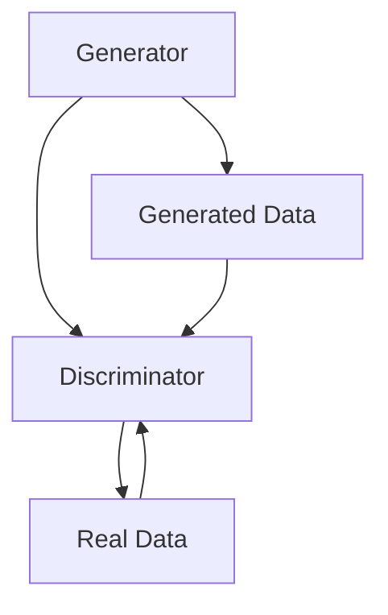

                 

# 生成对抗网络在AI创造性任务中的应用

## 关键词

- 生成对抗网络（GAN）
- AI创造性任务
- 图像生成
- 自然语言处理
- 音乐创作
- 游戏开发
- 艺术创作
- 广告设计

## 摘要

生成对抗网络（GAN）作为一种创新的机器学习框架，在近年来取得了显著的进展。GAN通过竞争学习的方式，实现了生成模型和判别模型的协同进化，能够在各种领域生成高质量的数据。本文将深入探讨GAN在AI创造性任务中的应用，包括图像生成、自然语言处理、音乐创作、游戏开发、艺术创作和广告设计等领域。通过具体的案例和实践，本文将展示GAN的强大能力和潜力，同时分析其在应用过程中面临的挑战和未来发展趋势。

## 引言

### 1.1 书籍背景与目的

人工智能（AI）作为当前科技发展的前沿领域，正不断改变着我们的生活方式和社会结构。随着深度学习技术的崛起，生成对抗网络（GAN）作为一种重要的机器学习框架，受到了广泛的关注和研究。GAN的核心思想是通过生成模型和判别模型的对抗训练，实现数据的生成和优化。与传统的生成模型相比，GAN具有更强的灵活性和更高的生成质量，因此在图像生成、自然语言处理、音乐创作等多个领域都取得了突破性的成果。

本文旨在系统地介绍GAN在AI创造性任务中的应用，帮助读者了解GAN的基本原理、核心概念以及实际应用场景。通过对GAN在各个领域的具体案例分析，本文希望能够展示GAN的强大能力和广泛的应用前景，同时探讨GAN在应用过程中面临的挑战和未来发展方向。

### 1.2 生成对抗网络（GAN）的基本概念

生成对抗网络（GAN）由生成模型（Generator）和判别模型（Discriminator）组成，两者通过对抗训练相互提升。生成模型的任务是生成逼真的数据，而判别模型的任务是区分真实数据和生成数据。在训练过程中，生成模型和判别模型相互对抗，生成模型不断优化其生成策略，使判别模型难以区分真实数据和生成数据。这一过程类似于两个人在玩猜谜游戏，一个人试图猜出另一个人的谜底，而另一个人则试图掩饰自己的谜底。

GAN的基本架构图如下所示：



### 1.3 GAN在创造性任务中的应用前景

GAN在创造性任务中具有广泛的应用前景。首先，在图像生成方面，GAN可以用于图像超分辨率、图像修复、图像合成和风格迁移等任务，能够生成高质量、高分辨率的图像。其次，在自然语言处理领域，GAN可以用于文本生成、机器翻译等任务，通过生成模型和判别模型的对抗训练，实现高质量的自然语言生成。此外，GAN在音乐创作、游戏开发、艺术创作和广告设计等领域也展示了强大的应用潜力。例如，GAN可以生成新颖的旋律、转换音乐风格、生成虚拟角色和场景，为创意广告设计提供新的解决方案。

随着GAN技术的不断发展和完善，其在创造性任务中的应用将更加广泛和深入。本文将系统地介绍GAN在各个领域中的应用，并通过具体的案例和实践，展示GAN的强大能力和潜力。

## GAN的基础理论

### 2.1 机器学习与深度学习概述

#### 2.1.1 机器学习的基本概念

机器学习（Machine Learning）是人工智能（Artificial Intelligence, AI）的一个重要分支，旨在通过计算机程序实现机器的自主学习能力。机器学习的基本概念包括模型、数据、算法和评估指标。其中，模型是机器学习的核心，它通过从数据中学习规律，实现对未知数据的预测和分类。数据是机器学习的基础，高质量的数据能够提高模型的性能和泛化能力。算法是实现机器学习的工具，常见的机器学习算法包括监督学习、无监督学习和强化学习等。评估指标是衡量模型性能的重要标准，常用的评估指标包括准确率、召回率、F1值等。

#### 2.1.2 深度学习的基本原理

深度学习（Deep Learning）是机器学习的一个子领域，通过构建多层神经网络（Neural Network）实现复杂函数的建模。深度学习的基本原理包括神经元、层和反向传播。神经元是神经网络的基本单元，通过接收输入、激活函数和权重计算，输出结果。层是神经网络的组成部分，包括输入层、隐藏层和输出层。输入层接收外部输入，隐藏层通过神经元之间的连接进行信息传递和处理，输出层生成最终预测结果。反向传播是一种训练神经网络的方法，通过计算误差梯度，调整网络的权重和偏置，优化模型性能。

### 2.2 GAN的原理与结构

#### 2.2.1 GAN的起源与发展

生成对抗网络（GAN）最早由伊恩·古德费洛（Ian J. Goodfellow）等人在2014年提出。GAN的提出源于对传统生成模型和判别模型的研究，旨在通过生成模型和判别模型的对抗训练，实现高质量的数据生成。GAN的发展经历了多个阶段，从最初的生成对抗网络（GAN）到深度卷积生成对抗网络（DCGAN）、改进的生成对抗网络（WGAN）和条件生成对抗网络（cGAN）等，不断优化和完善GAN的模型结构和训练方法。

#### 2.2.2 GAN的基本结构

GAN的基本结构包括生成模型（Generator）和判别模型（Discriminator）两个部分。生成模型的任务是从随机噪声中生成真实数据，判别模型的任务是判断输入数据是真实数据还是生成数据。在训练过程中，生成模型和判别模型相互对抗，生成模型不断优化生成策略，使判别模型难以区分真实数据和生成数据，而判别模型则不断强化对真实数据和生成数据的辨别能力。

GAN的基本结构图如下所示：


#### 2.2.3 GAN的关键组件

GAN的关键组件包括生成模型、判别模型、损失函数和优化算法。生成模型通过神经网络架构，从随机噪声中生成数据，常见的生成模型包括变分自编码器（VAE）、生成器网络等。判别模型则通过神经网络架构，对输入数据（真实数据和生成数据）进行分类，常见的判别模型包括卷积神经网络（CNN）、全连接神经网络（FCN）等。损失函数是衡量生成模型和判别模型性能的重要指标，常见的损失函数包括二元交叉熵损失（BCE Loss）、均方误差损失（MSE Loss）等。优化算法用于调整网络权重和偏置，常见的优化算法包括随机梯度下降（SGD）、Adam优化器等。

### 2.3 GAN的训练过程

#### 2.3.1 GAN的训练目标

GAN的训练目标是通过生成模型和判别模型的对抗训练，实现高质量的数据生成。具体来说，GAN的训练过程包括两个阶段：生成模型的训练和判别模型的训练。

在生成模型的训练过程中，生成模型的目标是生成尽可能真实的数据，使判别模型无法区分真实数据和生成数据。判别模型的目标是准确区分真实数据和生成数据，提高对真实数据的辨别能力。

在判别模型的训练过程中，判别模型的目标是尽可能准确地分类真实数据和生成数据。生成模型的目标是生成真实数据，以迷惑判别模型。

#### 2.3.2 GAN的训练方法

GAN的训练方法主要包括以下步骤：

1. **初始化生成模型和判别模型**：生成模型和判别模型通常使用随机权重进行初始化。

2. **生成模型训练**：生成模型从随机噪声中生成数据，判别模型对生成数据和真实数据进行分类。

3. **判别模型训练**：判别模型对生成数据和真实数据进行分类，生成模型对生成数据进行优化。

4. **交替训练**：生成模型和判别模型交替训练，生成模型优化生成策略，判别模型优化分类能力。

5. **迭代更新**：在训练过程中，通过多次迭代更新生成模型和判别模型的权重，逐步提高模型的性能。

GAN的训练过程是一个复杂的动态平衡过程，生成模型和判别模型相互制约，通过对抗训练实现模型的优化。

### 2.4 GAN的分类与变体

GAN的技术发展过程中，衍生出了多种变体和改进版本，以满足不同应用场景的需求。以下是几种常见的GAN变体：

#### 2.4.1 标准GAN

标准GAN（Standard GAN）是最基础的GAN结构，由生成器（Generator）和判别器（Discriminator）组成。生成器从随机噪声中生成数据，判别器对生成数据和真实数据进行分类。标准GAN的训练目标是使判别器的分类准确性最大化，同时使生成器的生成数据尽可能真实。标准GAN的架构简单，但在训练过程中存在不稳定性和模式崩塌（mode collapse）的问题。

#### 2.4.2 非对称GAN

非对称GAN（Asymmetric GAN）通过将生成器和判别器的网络结构设计为不对称，提高了GAN的训练稳定性和生成质量。在非对称GAN中，生成器的网络结构通常比判别器复杂，生成器生成数据的复杂度较高，判别器则通过较简单的结构对数据进行分类。非对称GAN有效地缓解了模式崩塌问题，提高了生成数据的质量。

#### 2.4.3 条件GAN

条件GAN（cGAN）通过引入条件信息，使GAN能够在特定条件下生成数据。cGAN的生成器和判别器在输入和输出过程中都包含条件信息。条件GAN的应用场景广泛，例如文本到图像的生成、特定场景的图像生成等。通过条件信息的引入，cGAN能够生成符合特定条件的高质量数据。

#### 2.4.4 多通道GAN

多通道GAN（Multichannel GAN）通过引入多个通道，实现对多种类型的特征的生成。在多通道GAN中，生成器和判别器分别处理不同通道的特征数据，例如图像和音频数据。多通道GAN能够同时生成多种类型的数据，提高GAN的生成能力。

#### 2.4.5 局部响应归一化GAN

局部响应归一化GAN（LRN-GAN）通过引入局部响应归一化（Local Response Normalization）机制，增强了GAN的稳定性。局部响应归一化通过对输入数据的归一化处理，抑制了相邻神经元之间的相互影响，减少了梯度消失和梯度爆炸的问题。LRN-GAN在训练过程中更加稳定，生成数据的质量较高。

#### 2.4.6 深度卷积生成对抗网络

深度卷积生成对抗网络（DCGAN）是GAN的一个重要变体，通过引入卷积神经网络（Convolutional Neural Network, CNN）的结构，实现了高质量图像的生成。DCGAN在生成器和判别器中使用卷积层和池化层，能够更好地处理图像数据。DCGAN在图像生成任务中取得了显著的效果，成为GAN领域的代表性模型。

通过以上对GAN基础理论的详细探讨，我们了解了GAN的基本概念、原理与结构，以及不同变体的特点和应用。这些知识为后续章节深入探讨GAN在AI创造性任务中的应用奠定了基础。

## GAN在图像生成中的应用

### 3.1 图像生成任务概述

图像生成任务是计算机视觉领域的一个重要研究方向，旨在通过机器学习算法生成逼真的图像。GAN作为一种强大的生成模型，在图像生成任务中展示了出色的性能。常见的图像生成任务包括图像超分辨率、图像修复、图像合成和风格迁移等。

图像超分辨率（Image Super-Resolution）是指通过低分辨率图像生成高分辨率图像的过程。图像修复（Image Inpainting）是指利用已知部分图像内容推测并填充未知部分图像内容的方法。图像合成（Image Synthesis）是指通过生成模型生成新的图像内容，例如生成新的物体或场景。风格迁移（Style Transfer）是指将一幅图像的视觉风格（如颜色、纹理、形状等）转移到另一幅图像上的过程。

### 3.2 GAN在图像超分辨率中的应用

#### 3.2.1 超分辨率GAN的基本原理

超分辨率GAN（SRGAN）是一种基于GAN的图像超分辨率方法，通过生成模型和判别模型的对抗训练，实现低分辨率图像到高分辨率图像的转换。SRGAN的核心思想是利用生成模型从低分辨率图像中提取细节信息，并通过判别模型对生成的图像进行质量评估，从而优化生成模型。

超分辨率GAN的生成模型通常由卷积神经网络（CNN）构成，包含多个卷积层、池化层和上采样层。生成模型通过上采样层将低分辨率图像放大到高分辨率，并利用卷积层和池化层提取图像的细节信息。判别模型则是一个普通的CNN，用于区分真实的高分辨率图像和生成的高分辨率图像。

#### 3.2.2 超分辨率GAN的代码实现

以下是一个简单的超分辨率GAN的Python代码实现，使用TensorFlow和Keras框架：

```python
import tensorflow as tf
from tensorflow.keras.models import Model
from tensorflow.keras.layers import Input, Conv2D, Conv2DTranspose, LeakyReLU, BatchNormalization, Activation, Concatenate

# 定义生成模型
def build_generator(input_shape):
    inputs = Input(shape=input_shape)
    x = Conv2D(64, (7, 7), strides=(1, 1), padding='same')(inputs)
    x = LeakyReLU(alpha=0.2)(x)
    x = BatchNormalization()(x)

    x = Conv2D(128, (7, 7), strides=(1, 1), padding='same')(x)
    x = LeakyReLU(alpha=0.2)(x)
    x = BatchNormalization()(x)

    x = Conv2DTranspose(256, (4, 4), strides=(2, 2), padding='same')(x)
    x = LeakyReLU(alpha=0.2)(x)
    x = BatchNormalization()(x)

    x = Conv2D(256, (4, 4), strides=(2, 2), padding='same')(x)
    x = LeakyReLU(alpha=0.2)(x)
    x = BatchNormalization()(x)

    x = Conv2D(128, (4, 4), strides=(2, 2), padding='same')(x)
    x = LeakyReLU(alpha=0.2)(x)
    x = BatchNormalization()(x)

    x = Conv2D(64, (4, 4), strides=(2, 2), padding='same')(x)
    x = LeakyReLU(alpha=0.2)(x)
    x = BatchNormalization()(x)

    outputs = Conv2D(3, (4, 4), strides=(2, 2), padding='same', activation='tanh')(x)
    model = Model(inputs, outputs)
    return model

# 定义判别模型
def build_discriminator(input_shape):
    inputs = Input(shape=input_shape)
    x = Conv2D(64, (4, 4), strides=(2, 2), padding='same')(inputs)
    x = LeakyReLU(alpha=0.2)(x)

    x = Conv2D(128, (4, 4), strides=(2, 2), padding='same')(x)
    x = LeakyReLU(alpha=0.2)(x)

    x = Conv2D(256, (4, 4), strides=(2, 2), padding='same')(x)
    x = LeakyReLU(alpha=0.2)(x)

    x = Flatten()(x)
    outputs = Dense(1, activation='sigmoid')(x)
    model = Model(inputs, outputs)
    return model

# 定义G损失和D损失
def build_gan(generator, discriminator):
    model_input = Input(shape=(None, None, 1))
    generated_images = generator(model_input)
    model_output = discriminator(generated_images)

    model = Model(model_input, model_output)
    return model

# 定义损失函数和优化器
def compile_gan(generator, discriminator, gan):
    d_loss_fn = keras.losses.BinaryCrossentropy()
    g_loss_fn = keras.losses.BinaryCrossentropy()

    discriminator.compile(optimizer='adam', loss=d_loss_fn)
    gan.compile(optimizer='adam', loss=g_loss_fn)

# 构建模型
input_shape = (64, 64, 1)
generator = build_generator(input_shape)
discriminator = build_discriminator(input_shape)
gan = build_gan(generator, discriminator)

# 编译模型
compile_gan(generator, discriminator, gan)
```

#### 3.2.3 超分辨率GAN的训练过程

超分辨率GAN的训练过程包括生成模型和判别模型的交替训练。在训练过程中，生成模型和判别模型的目标函数分别为最小化生成模型生成的图像和最大化判别模型对生成图像的判断准确率。

具体训练步骤如下：

1. **初始化生成模型和判别模型**：使用随机权重初始化生成模型和判别模型。
2. **生成模型训练**：生成模型从随机噪声中生成高分辨率图像，判别模型对生成图像和真实高分辨率图像进行分类。
3. **判别模型训练**：判别模型对真实高分辨率图像和生成图像进行分类，生成模型对生成的图像进行优化。
4. **交替训练**：生成模型和判别模型交替训练，通过多次迭代优化模型的性能。
5. **迭代更新**：在训练过程中，通过多次迭代更新生成模型和判别模型的权重，逐步提高模型的性能。

### 3.3 GAN在图像修复中的应用

#### 3.3.1 图像修复GAN的基本原理

图像修复GAN（Image Inpainting GAN）是一种利用GAN进行图像修复的方法，通过生成模型和判别模型的对抗训练，实现图像损坏部分的修复。图像修复GAN的基本原理与超分辨率GAN类似，生成模型从损坏的图像和对应的损坏掩码中生成修复后的图像，判别模型用于判断修复后的图像是否真实。

图像修复GAN的生成模型通常由卷积神经网络（CNN）构成，包含多个卷积层、池化层和上采样层。生成模型通过上采样层将损坏的图像放大到原始尺寸，并利用卷积层和池化层修复图像的损坏部分。判别模型则是一个普通的CNN，用于区分真实的图像和修复后的图像。

#### 3.3.2 图像修复GAN的代码实现

以下是一个简单的图像修复GAN的Python代码实现，使用TensorFlow和Keras框架：

```python
import tensorflow as tf
from tensorflow.keras.models import Model
from tensorflow.keras.layers import Input, Conv2D, Conv2DTranspose, LeakyReLU, BatchNormalization, Activation, Concatenate

# 定义生成模型
def build_generator(input_shape):
    inputs = Input(shape=input_shape)
    x = Conv2D(64, (3, 3), strides=(1, 1), padding='same')(inputs)
    x = LeakyReLU(alpha=0.2)(x)
    x = BatchNormalization()(x)

    x = Conv2D(128, (3, 3), strides=(1, 1), padding='same')(x)
    x = LeakyReLU(alpha=0.2)(x)
    x = BatchNormalization()(x)

    x = Conv2DTranspose(256, (4, 4), strides=(2, 2), padding='same')(x)
    x = LeakyReLU(alpha=0.2)(x)
    x = BatchNormalization()(x)

    x = Conv2D(256, (3, 3), strides=(1, 1), padding='same')(x)
    x = LeakyReLU(alpha=0.2)(x)
    x = BatchNormalization()(x)

    x = Conv2D(128, (3, 3), strides=(1, 1), padding='same')(x)
    x = LeakyReLU(alpha=0.2)(x)
    x = BatchNormalization()(x)

    outputs = Conv2D(3, (3, 3), strides=(1, 1), padding='same', activation='tanh')(x)
    model = Model(inputs, outputs)
    return model

# 定义判别模型
def build_discriminator(input_shape):
    inputs = Input(shape=input_shape)
    x = Conv2D(64, (4, 4), strides=(2, 2), padding='same')(inputs)
    x = LeakyReLU(alpha=0.2)(x)

    x = Conv2D(128, (4, 4), strides=(2, 2), padding='same')(x)
    x = LeakyReLU(alpha=0.2)(x)

    x = Conv2D(256, (4, 4), strides=(2, 2), padding='same')(x)
    x = LeakyReLU(alpha=0.2)(x)

    x = Flatten()(x)
    outputs = Dense(1, activation='sigmoid')(x)
    model = Model(inputs, outputs)
    return model

# 定义G损失和D损失
def build_gan(generator, discriminator):
    model_input = Input(shape=(64, 64, 3))
    mask_input = Input(shape=(64, 64, 1))
    combined_inputs = Concatenate()([model_input, mask_input])
    generated_images = generator(combined_inputs)
    model_output = discriminator(generated_images)

    model = Model([model_input, mask_input], model_output)
    return model

# 定义损失函数和优化器
def compile_gan(generator, discriminator, gan):
    d_loss_fn = keras.losses.BinaryCrossentropy()
    g_loss_fn = keras.losses.BinaryCrossentropy()

    discriminator.compile(optimizer='adam', loss=d_loss_fn)
    gan.compile(optimizer='adam', loss=g_loss_fn)

# 构建模型
input_shape = (64, 64, 3)
mask_shape = (64, 64, 1)
generator = build_generator(input_shape)
discriminator = build_discriminator(mask_shape)
gan = build_gan(generator, discriminator)

# 编译模型
compile_gan(generator, discriminator, gan)
```

#### 3.3.3 图像修复GAN的训练过程

图像修复GAN的训练过程与超分辨率GAN类似，包括生成模型和判别模型的交替训练。在训练过程中，生成模型和判别模型的目标函数分别为最小化生成模型生成的图像和最大化判别模型对生成图像的判断准确率。

具体训练步骤如下：

1. **初始化生成模型和判别模型**：使用随机权重初始化生成模型和判别模型。
2. **生成模型训练**：生成模型从损坏的图像和对应的损坏掩码中生成修复后的图像，判别模型对生成图像和真实修复后的图像进行分类。
3. **判别模型训练**：判别模型对真实修复后的图像和生成图像进行分类，生成模型对生成的图像进行优化。
4. **交替训练**：生成模型和判别模型交替训练，通过多次迭代优化模型的性能。
5. **迭代更新**：在训练过程中，通过多次迭代更新生成模型和判别模型的权重，逐步提高模型的性能。

### 3.4 GAN在图像合成与风格迁移中的应用

#### 3.4.1 图像合成GAN的基本原理

图像合成GAN（Image Synthesis GAN）是一种利用GAN生成新的图像内容的方法。图像合成GAN的生成模型从随机噪声中生成新的图像，判别模型用于判断生成图像的真实性。通过训练，生成模型能够生成符合真实图像特征的图像，从而实现图像合成。

图像合成GAN的生成模型通常由卷积神经网络（CNN）构成，包含多个卷积层、池化层和上采样层。生成模型通过上采样层将随机噪声放大到图像尺寸，并利用卷积层和池化层生成新的图像内容。判别模型则是一个普通的CNN，用于区分真实的图像和生成的图像。

#### 3.4.2 图像合成GAN的代码实现

以下是一个简单的图像合成GAN的Python代码实现，使用TensorFlow和Keras框架：

```python
import tensorflow as tf
from tensorflow.keras.models import Model
from tensorflow.keras.layers import Input, Conv2D, Conv2DTranspose, LeakyReLU, BatchNormalization, Activation, Concatenate

# 定义生成模型
def build_generator(input_shape):
    inputs = Input(shape=input_shape)
    x = Conv2D(64, (7, 7), strides=(1, 1), padding='same')(inputs)
    x = LeakyReLU(alpha=0.2)(x)
    x = BatchNormalization()(x)

    x = Conv2D(128, (7, 7), strides=(1, 1), padding='same')(x)
    x = LeakyReLU(alpha=0.2)(x)
    x = BatchNormalization()(x)

    x = Conv2DTranspose(256, (4, 4), strides=(2, 2), padding='same')(x)
    x = LeakyReLU(alpha=0.2)(x)
    x = BatchNormalization()(x)

    x = Conv2D(256, (4, 4), strides=(2, 2), padding='same')(x)
    x = LeakyReLU(alpha=0.2)(x)
    x = BatchNormalization()(x)

    x = Conv2D(128, (4, 4), strides=(2, 2), padding='same')(x)
    x = LeakyReLU(alpha=0.2)(x)
    x = BatchNormalization()(x)

    x = Conv2D(64, (4, 4), strides=(2, 2), padding='same')(x)
    x = LeakyReLU(alpha=0.2)(x)
    x = BatchNormalization()(x)

    outputs = Conv2D(3, (4, 4), strides=(2, 2), padding='same', activation='tanh')(x)
    model = Model(inputs, outputs)
    return model

# 定义判别模型
def build_discriminator(input_shape):
    inputs = Input(shape=input_shape)
    x = Conv2D(64, (4, 4), strides=(2, 2), padding='same')(inputs)
    x = LeakyReLU(alpha=0.2)(x)

    x = Conv2D(128, (4, 4), strides=(2, 2), padding='same')(x)
    x = LeakyReLU(alpha=0.2)(x)

    x = Conv2D(256, (4, 4), strides=(2, 2), padding='same')(x)
    x = LeakyReLU(alpha=0.2)(x)

    x = Flatten()(x)
    outputs = Dense(1, activation='sigmoid')(x)
    model = Model(inputs, outputs)
    return model

# 定义G损失和D损失
def build_gan(generator, discriminator):
    model_input = Input(shape=(64, 64, 3))
    generated_images = generator(model_input)
    model_output = discriminator(generated_images)

    model = Model(model_input, model_output)
    return model

# 定义损失函数和优化器
def compile_gan(generator, discriminator, gan):
    d_loss_fn = keras.losses.BinaryCrossentropy()
    g_loss_fn = keras.losses.BinaryCrossentropy()

    discriminator.compile(optimizer='adam', loss=d_loss_fn)
    gan.compile(optimizer='adam', loss=g_loss_fn)

# 构建模型
input_shape = (64, 64, 3)
generator = build_generator(input_shape)
discriminator = build_discriminator(input_shape)
gan = build_gan(generator, discriminator)

# 编译模型
compile_gan(generator, discriminator, gan)
```

#### 3.4.3 图像风格迁移GAN的基本原理

图像风格迁移GAN（Image Style Transfer GAN）是一种利用GAN实现图像风格迁移的方法。图像风格迁移GAN的生成模型从输入图像和目标风格图像中生成具有目标风格的新图像，判别模型用于判断生成图像的真实性和风格一致性。

图像风格迁移GAN的生成模型通常包含两个部分：内容生成模型和风格生成模型。内容生成模型从输入图像中提取内容信息，风格生成模型从目标风格图像中提取风格信息。通过训练，生成模型能够将内容图像和风格图像融合，生成具有目标风格的新图像。

#### 3.4.4 图像风格迁移GAN的代码实现

以下是一个简单的图像风格迁移GAN的Python代码实现，使用TensorFlow和Keras框架：

```python
import tensorflow as tf
from tensorflow.keras.models import Model
from tensorflow.keras.layers import Input, Conv2D, Conv2DTranspose, LeakyReLU, BatchNormalization, Activation, Concatenate

# 定义内容生成模型
def build_content_generator(input_shape):
    inputs = Input(shape=input_shape)
    x = Conv2D(64, (3, 3), strides=(1, 1), padding='same')(inputs)
    x = LeakyReLU(alpha=0.2)(x)
    x = BatchNormalization()(x)

    x = Conv2D(128, (3, 3), strides=(1, 1), padding='same')(x)
    x = LeakyReLU(alpha=0.2)(x)
    x = BatchNormalization()(x)

    x = Conv2D(256, (3, 3), strides=(1, 1), padding='same')(x)
    x = LeakyReLU(alpha=0.2)(x)
    x = BatchNormalization()(x)

    x = Conv2D(512, (3, 3), strides=(1, 1), padding='same')(x)
    x = LeakyReLU(alpha=0.2)(x)
    x = BatchNormalization()(x)

    x = Conv2D(512, (3, 3), strides=(1, 1), padding='same')(x)
    x = LeakyReLU(alpha=0.2)(x)
    x = BatchNormalization()(x)

    x = Conv2D(512, (3, 3), strides=(1, 1), padding='same')(x)
    x = LeakyReLU(alpha=0.2)(x)
    x = BatchNormalization()(x)

    outputs = Conv2D(3, (3, 3), strides=(1, 1), padding='same', activation='tanh')(x)
    model = Model(inputs, outputs)
    return model

# 定义风格生成模型
def build_style_generator(input_shape):
    inputs = Input(shape=input_shape)
    x = Conv2D(64, (3, 3), strides=(1, 1), padding='same')(inputs)
    x = LeakyReLU(alpha=0.2)(x)
    x = BatchNormalization()(x)

    x = Conv2D(128, (3, 3), strides=(1, 1), padding='same')(x)
    x = LeakyReLU(alpha=0.2)(x)
    x = BatchNormalization()(x)

    x = Conv2D(256, (3, 3), strides=(1, 1), padding='same')(x)
    x = LeakyReLU(alpha=0.2)(x)
    x = BatchNormalization()(x)

    x = Conv2D(512, (3, 3), strides=(1, 1), padding='same')(x)
    x = LeakyReLU(alpha=0.2)(x)
    x = BatchNormalization()(x)

    x = Conv2D(512, (3, 3), strides=(1, 1), padding='same')(x)
    x = LeakyReLU(alpha=0.2)(x)
    x = BatchNormalization()(x)

    x = Conv2D(512, (3, 3), strides=(1, 1), padding='same')(x)
    x = LeakyReLU(alpha=0.2)(x)
    x = BatchNormalization()(x)

    outputs = Conv2D(3, (3, 3), strides=(1, 1), padding='same', activation='tanh')(x)
    model = Model(inputs, outputs)
    return model

# 定义判别模型
def build_discriminator(input_shape):
    inputs = Input(shape=input_shape)
    x = Conv2D(64, (4, 4), strides=(2, 2), padding='same')(inputs)
    x = LeakyReLU(alpha=0.2)(x)

    x = Conv2D(128, (4, 4), strides=(2, 2), padding='same')(x)
    x = LeakyReLU(alpha=0.2)(x)

    x = Conv2D(256, (4, 4), strides=(2, 2), padding='same')(x)
    x = LeakyReLU(alpha=0.2)(x)

    x = Flatten()(x)
    outputs = Dense(1, activation='sigmoid')(x)
    model = Model(inputs, outputs)
    return model

# 定义G损失和D损失
def build_gan(content_generator, style_generator, discriminator):
    model_input = Input(shape=(256, 256, 3))
    content_input = Input(shape=(256, 256, 3))
    style_input = Input(shape=(256, 256, 3))

    content_generated_images = content_generator(content_input)
    style_generated_images = style_generator(style_input)

    combined_generated_images = Concatenate()([content_generated_images, style_generated_images])
    model_output = discriminator(combined_generated_images)

    model = Model([content_input, style_input], model_output)
    return model

# 定义损失函数和优化器
def compile_gan(content_generator, style_generator, discriminator, gan):
    d_loss_fn = keras.losses.BinaryCrossentropy()
    g_loss_fn = keras.losses.BinaryCrossentropy()

    discriminator.compile(optimizer='adam', loss=d_loss_fn)
    gan.compile(optimizer='adam', loss=g_loss_fn)

# 构建模型
input_shape = (256, 256, 3)
content_generator = build_content_generator(input_shape)
style_generator = build_style_generator(input_shape)
discriminator = build_discriminator(input_shape)
gan = build_gan(content_generator, style_generator, discriminator)

# 编译模型
compile_gan(content_generator, style_generator, discriminator, gan)
```

通过以上对GAN在图像生成、图像修复、图像合成和风格迁移等应用的详细讲解，我们了解了GAN在图像处理领域的强大能力和广泛的应用前景。GAN不仅能够生成高质量的图像，还能够修复损坏的图像、合成新的图像和迁移图像风格，为计算机视觉领域带来了新的突破。

## GAN在自然语言处理中的应用

### 4.1 自然语言处理概述

自然语言处理（Natural Language Processing，NLP）是人工智能领域的一个重要分支，旨在使计算机能够理解、处理和生成人类自然语言。NLP的研究内容涵盖文本分析、语音识别、机器翻译、情感分析、文本生成等多个方面。随着深度学习技术的发展，生成对抗网络（GAN）在NLP领域中展示出了巨大的潜力。

### 4.2 GAN在文本生成中的应用

#### 4.2.1 文本生成GAN的基本原理

文本生成GAN（Text Generation GAN）是一种利用GAN生成自然语言文本的方法。文本生成GAN的核心思想是通过生成模型和判别模型的对抗训练，实现高质量的自然语言文本生成。生成模型从随机噪声中生成文本，判别模型则用于判断生成文本的真实性和质量。

在文本生成GAN中，生成模型通常是一个循环神经网络（RNN）或其变种，如长短期记忆网络（LSTM）或门控循环单元（GRU）。生成模型通过学习文本数据中的序列模式，生成连续的单词或字符序列。判别模型则是一个简单的分类器，用于判断输入文本是真实文本还是生成文本。

#### 4.2.2 文本生成GAN的代码实现

以下是一个简单的文本生成GAN的Python代码实现，使用TensorFlow和Keras框架：

```python
import tensorflow as tf
from tensorflow.keras.models import Model
from tensorflow.keras.layers import Input, LSTM, Embedding, Dense, TimeDistributed, Activation, RepeatVector, Lambda
from tensorflow.keras.optimizers import Adam
from tensorflow.keras import backend as K

# 定义生成模型
def build_generator(embedding_dim, hidden_units):
    noise_input = Input(shape=(100,))
    embedding = Embedding(embedding_dim, 128)(noise_input)
    lstm1 = LSTM(hidden_units, return_sequences=True)(embedding)
    lstm2 = LSTM(hidden_units, return_sequences=True)(lstm1)
    output = RepeatVector(100)(lstm2)
    output = LSTM(hidden_units, return_sequences=True)(output)
    outputs = TimeDistributed(Dense(embedding_dim, activation='softmax'))(output)
    model = Model(inputs=noise_input, outputs=outputs)
    return model

# 定义判别模型
def build_discriminator(embedding_dim):
    embedding_input = Input(shape=(100, embedding_dim))
    lstm1 = LSTM(128, return_sequences=True)(embedding_input)
    lstm2 = LSTM(128, return_sequences=True)(lstm1)
    outputs = Dense(1, activation='sigmoid')(lstm2)
    model = Model(inputs=embedding_input, outputs=outputs)
    return model

# 定义G损失和D损失
def build_gan(generator, discriminator):
    noise_input = Input(shape=(100,))
    embedding_input = Input(shape=(100, embedding_dim))

    generated_embedding = generator(noise_input)
    valid_embedding = discriminator(embedding_input)
    fake_embedding = discriminator(generated_embedding)

    model = Model([noise_input, embedding_input], [valid_embedding, fake_embedding])
    return model

# 定义损失函数和优化器
def compile_gan(generator, discriminator, gan):
    d_loss_fn = keras.losses.BinaryCrossentropy()
    g_loss_fn = keras.losses.BinaryCrossentropy()

    discriminator.compile(optimizer=Adam(0.0001), loss=d_loss_fn)
    generator.compile(optimizer=Adam(0.0001), loss=d_loss_fn)

    gan.compile(optimizer=Adam(0.0001), loss=g_loss_fn)

# 构建模型
embedding_dim = 10000  # 假设词汇表大小为10000
hidden_units = 128
generator = build_generator(embedding_dim, hidden_units)
discriminator = build_discriminator(embedding_dim)
gan = build_gan(generator, discriminator)

# 编译模型
compile_gan(generator, discriminator, gan)
```

#### 4.2.3 文本生成GAN的训练过程

文本生成GAN的训练过程包括生成模型和判别模型的交替训练。在训练过程中，生成模型和判别模型的目标函数分别为最小化生成模型生成的文本和最大化判别模型对生成文本的判断准确率。

具体训练步骤如下：

1. **初始化生成模型和判别模型**：使用随机权重初始化生成模型和判别模型。
2. **生成模型训练**：生成模型从随机噪声中生成文本，判别模型对生成文本和真实文本进行分类。
3. **判别模型训练**：判别模型对真实文本和生成文本进行分类，生成模型对生成的文本进行优化。
4. **交替训练**：生成模型和判别模型交替训练，通过多次迭代优化模型的性能。
5. **迭代更新**：在训练过程中，通过多次迭代更新生成模型和判别模型的权重，逐步提高模型的性能。

### 4.3 GAN在机器翻译中的应用

#### 4.3.1 机器翻译GAN的基本原理

机器翻译GAN（Machine Translation GAN）是一种利用GAN进行机器翻译的方法。机器翻译GAN的生成模型从源语言文本和目标语言文本中生成翻译结果，判别模型则用于判断翻译结果的准确性。

在机器翻译GAN中，生成模型通常是一个序列到序列的模型，如编码器-解码器（Encoder-Decoder）模型。生成模型通过编码器将源语言文本编码成向量表示，解码器则从向量表示中生成目标语言文本。判别模型则是一个简单的分类器，用于判断输入文本对是真实翻译结果还是生成翻译结果。

#### 4.3.2 机器翻译GAN的代码实现

以下是一个简单的机器翻译GAN的Python代码实现，使用TensorFlow和Keras框架：

```python
import tensorflow as tf
from tensorflow.keras.models import Model
from tensorflow.keras.layers import Input, LSTM, Embedding, Dense, TimeDistributed, Activation, RepeatVector, Lambda
from tensorflow.keras.optimizers import Adam
from tensorflow.keras import backend as K

# 定义编码器
def build_encoder(vocab_size, embedding_dim, hidden_units):
    input_embedding = Input(shape=(None,))
    embedding = Embedding(vocab_size, embedding_dim)(input_embedding)
    lstm = LSTM(hidden_units, return_sequences=True)(embedding)
    return Model(inputs=input_embedding, outputs=lstm)

# 定义解码器
def build_decoder(vocab_size, embedding_dim, hidden_units):
    hidden_input = Input(shape=(None, hidden_units))
    embedding = Embedding(vocab_size, embedding_dim)(hidden_input)
    lstm = LSTM(hidden_units, return_sequences=True)(embedding)
    output = TimeDistributed(Dense(vocab_size, activation='softmax'))(lstm)
    return Model(inputs=hidden_input, outputs=output)

# 定义生成模型
def build_generator(encoder, decoder):
    source_input = Input(shape=(None,))
    encoded = encoder(source_input)
    hidden = RepeatVector(target_seq_len)(encoded)
    hidden_input = Input(shape=(target_seq_len, hidden_units))
    decoder_output = decoder(hidden_input)
    return Model([source_input, hidden_input], decoder_output)

# 定义判别模型
def build_discriminator(vocab_size, embedding_dim):
    input_embedding = Input(shape=(None, embedding_dim))
    lstm = LSTM(128, return_sequences=True)(input_embedding)
    outputs = Dense(1, activation='sigmoid')(lstm)
    return Model(inputs=input_embedding, outputs=outputs)

# 定义G损失和D损失
def build_gan(generator, discriminator):
    source_input = Input(shape=(None,))
    target_input = Input(shape=(None,))
    target_seq_len = K.int_shape(target_input)[1]

    encoded = encoder(source_input)
    hidden = RepeatVector(target_seq_len)(encoded)
    hidden_input = Input(shape=(target_seq_len, hidden_units))
    decoder_output = generator([source_input, hidden_input])

    valid_embedding = discriminator(target_input)
    fake_embedding = discriminator(decoder_output)

    model = Model([source_input, target_input, hidden_input], [valid_embedding, fake_embedding])
    return model

# 定义损失函数和优化器
def compile_gan(generator, decoder, encoder, discriminator, gan):
    d_loss_fn = keras.losses.BinaryCrossentropy()
    g_loss_fn = keras.losses.BinaryCrossentropy()

    discriminator.compile(optimizer=Adam(0.0001), loss=d_loss_fn)
    generator.compile(optimizer=Adam(0.0001), loss=d_loss_fn)

    gan.compile(optimizer=Adam(0.0001), loss=g_loss_fn)

# 构建模型
vocab_size = 10000  # 假设词汇表大小为10000
embedding_dim = 256
hidden_units = 512
target_seq_len = 100

encoder = build_encoder(vocab_size, embedding_dim, hidden_units)
decoder = build_decoder(vocab_size, embedding_dim, hidden_units)
discriminator = build_discriminator(vocab_size, embedding_dim)
generator = build_generator(encoder, decoder)
gan = build_gan(generator, decoder, encoder, discriminator)

# 编译模型
compile_gan(generator, decoder, encoder, discriminator, gan)
```

#### 4.3.3 机器翻译GAN的训练过程

机器翻译GAN的训练过程包括生成模型和判别模型的交替训练。在训练过程中，生成模型和判别模型的目标函数分别为最小化生成模型生成的翻译结果和最大化判别模型对生成翻译结果的判断准确率。

具体训练步骤如下：

1. **初始化生成模型和判别模型**：使用随机权重初始化生成模型和判别模型。
2. **生成模型训练**：生成模型从源语言文本和目标语言文本中生成翻译结果，判别模型对生成翻译结果和真实翻译结果进行分类。
3. **判别模型训练**：判别模型对真实翻译结果和生成翻译结果进行分类，生成模型对生成的翻译结果进行优化。
4. **交替训练**：生成模型和判别模型交替训练，通过多次迭代优化模型的性能。
5. **迭代更新**：在训练过程中，通过多次迭代更新生成模型和判别模型的权重，逐步提高模型的性能。

通过以上对GAN在文本生成和机器翻译等NLP任务中的应用的详细讲解，我们了解了GAN在自然语言处理领域的强大能力和广泛的应用前景。GAN不仅能够生成高质量的自然语言文本，还能够实现高效的机器翻译，为NLP领域带来了新的突破。

## GAN在音乐创作中的应用

### 5.1 音乐创作任务概述

音乐创作是人工智能（AI）领域中的一项重要任务，旨在利用机器学习算法生成新的音乐旋律、音调和和声。生成对抗网络（GAN）作为一种创新的机器学习框架，在音乐创作领域展示了出色的表现。GAN能够通过生成模型和判别模型的对抗训练，实现高质量的音乐生成和风格迁移。

常见的音乐创作任务包括旋律生成、音调生成、和声生成、音乐风格转换等。旋律生成是指从随机噪声中生成新的旋律；音调生成是指从已有的旋律中生成新的音调；和声生成是指为旋律生成和声部分，使音乐更加丰富和和谐；音乐风格转换是指将一种音乐风格转换成另一种风格。

### 5.2 GAN在旋律生成中的应用

#### 5.2.1 节奏生成GAN的基本原理

节奏生成GAN（Rhythm Generation GAN）是一种利用GAN生成新旋律的方法。节奏生成GAN的生成模型从随机噪声中生成旋律，判别模型则用于判断生成旋律的真实性和节奏感。

在节奏生成GAN中，生成模型通常是一个循环神经网络（RNN）或其变种，如长短期记忆网络（LSTM）或门控循环单元（GRU）。生成模型通过学习音乐数据中的节奏模式，生成连续的音符序列。判别模型则是一个简单的分类器，用于判断输入音符序列是真实旋律还是生成旋律。

#### 5.2.2 节奏生成GAN的代码实现

以下是一个简单的节奏生成GAN的Python代码实现，使用TensorFlow和Keras框架：

```python
import tensorflow as tf
from tensorflow.keras.models import Model
from tensorflow.keras.layers import Input, LSTM, Embedding, Dense, TimeDistributed, Activation, RepeatVector, Lambda
from tensorflow.keras.optimizers import Adam
from tensorflow.keras import backend as K

# 定义生成模型
def build_generator(embedding_dim, hidden_units):
    noise_input = Input(shape=(100,))
    embedding = Embedding(embedding_dim, 128)(noise_input)
    lstm1 = LSTM(hidden_units, return_sequences=True)(embedding)
    lstm2 = LSTM(hidden_units, return_sequences=True)(lstm1)
    output = RepeatVector(100)(lstm2)
    output = LSTM(hidden_units, return_sequences=True)(output)
    outputs = TimeDistributed(Dense(embedding_dim, activation='softmax'))(output)
    model = Model(inputs=noise_input, outputs=outputs)
    return model

# 定义判别模型
def build_discriminator(embedding_dim):
    embedding_input = Input(shape=(100, embedding_dim))
    lstm1 = LSTM(128, return_sequences=True)(embedding_input)
    lstm2 = LSTM(128, return_sequences=True)(lstm1)
    outputs = Dense(1, activation='sigmoid')(lstm2)
    model = Model(inputs=embedding_input, outputs=outputs)
    return model

# 定义G损失和D损失
def build_gan(generator, discriminator):
    noise_input = Input(shape=(100,))
    embedding_input = Input(shape=(100, embedding_dim))

    generated_embedding = generator(noise_input)
    valid_embedding = discriminator(embedding_input)
    fake_embedding = discriminator(generated_embedding)

    model = Model([noise_input, embedding_input], [valid_embedding, fake_embedding])
    return model

# 定义损失函数和优化器
def compile_gan(generator, discriminator, gan):
    d_loss_fn = keras.losses.BinaryCrossentropy()
    g_loss_fn = keras.losses.BinaryCrossentropy()

    discriminator.compile(optimizer=Adam(0.0001), loss=d_loss_fn)
    generator.compile(optimizer=Adam(0.0001), loss=d_loss_fn)

    gan.compile(optimizer=Adam(0.0001), loss=g_loss_fn)

# 构建模型
embedding_dim = 10000  # 假设词汇表大小为10000
hidden_units = 128
generator = build_generator(embedding_dim, hidden_units)
discriminator = build_discriminator(embedding_dim)
gan = build_gan(generator, discriminator)

# 编译模型
compile_gan(generator, discriminator, gan)
```

#### 5.2.3 节奏生成GAN的训练过程

节奏生成GAN的训练过程包括生成模型和判别模型的交替训练。在训练过程中，生成模型和判别模型的目标函数分别为最小化生成模型生成的旋律和最大化判别模型对生成旋律的判断准确率。

具体训练步骤如下：

1. **初始化生成模型和判别模型**：使用随机权重初始化生成模型和判别模型。
2. **生成模型训练**：生成模型从随机噪声中生成旋律，判别模型对生成旋律和真实旋律进行分类。
3. **判别模型训练**：判别模型对真实旋律和生成旋律进行分类，生成模型对生成的旋律进行优化。
4. **交替训练**：生成模型和判别模型交替训练，通过多次迭代优化模型的性能。
5. **迭代更新**：在训练过程中，通过多次迭代更新生成模型和判别模型的权重，逐步提高模型的性能。

### 5.3 GAN在音乐风格转换中的应用

#### 5.3.1 音乐风格转换GAN的基本原理

音乐风格转换GAN（Music Style Transfer GAN）是一种利用GAN实现音乐风格转换的方法。音乐风格转换GAN的生成模型从源旋律和目标风格中生成新的旋律，判别模型则用于判断生成旋律的真实性和风格一致性。

在音乐风格转换GAN中，生成模型通常包含两个部分：内容生成模型和风格生成模型。内容生成模型从源旋律中提取旋律内容，风格生成模型从目标风格中提取风格信息。通过训练，生成模型能够将源旋律和目标风格融合，生成具有目标风格的新旋律。

#### 5.3.2 音乐风格转换GAN的代码实现

以下是一个简单的音乐风格转换GAN的Python代码实现，使用TensorFlow和Keras框架：

```python
import tensorflow as tf
from tensorflow.keras.models import Model
from tensorflow.keras.layers import Input, LSTM, Embedding, Dense, TimeDistributed, Activation, RepeatVector, Lambda
from tensorflow.keras.optimizers import Adam
from tensorflow.keras import backend as K

# 定义内容生成模型
def build_content_generator(vocab_size, embedding_dim, hidden_units):
    noise_input = Input(shape=(100,))
    embedding = Embedding(vocab_size, embedding_dim)(noise_input)
    lstm1 = LSTM(hidden_units, return_sequences=True)(embedding)
    lstm2 = LSTM(hidden_units, return_sequences=True)(lstm1)
    output = RepeatVector(100)(lstm2)
    output = LSTM(hidden_units, return_sequences=True)(output)
    outputs = TimeDistributed(Dense(vocab_size, activation='softmax'))(output)
    model = Model(inputs=noise_input, outputs=outputs)
    return model

# 定义风格生成模型
def build_style_generator(vocab_size, embedding_dim, hidden_units):
    noise_input = Input(shape=(100,))
    embedding = Embedding(vocab_size, embedding_dim)(noise_input)
    lstm1 = LSTM(hidden_units, return_sequences=True)(embedding)
    lstm2 = LSTM(hidden_units, return_sequences=True)(lstm1)
    output = RepeatVector(100)(lstm2)
    output = LSTM(hidden_units, return_sequences=True)(output)
    outputs = TimeDistributed(Dense(vocab_size, activation='softmax'))(output)
    model = Model(inputs=noise_input, outputs=outputs)
    return model

# 定义判别模型
def build_discriminator(vocab_size, embedding_dim):
    input_embedding = Input(shape=(100, embedding_dim))
    lstm1 = LSTM(128, return_sequences=True)(input_embedding)
    lstm2 = LSTM(128, return_sequences=True)(lstm1)
    outputs = Dense(1, activation='sigmoid')(lstm2)
    model = Model(inputs=input_embedding, outputs=outputs)
    return model

# 定义G损失和D损失
def build_gan(content_generator, style_generator, discriminator):
    noise_input = Input(shape=(100,))
    input_embedding = Input(shape=(100, embedding_dim))

    content_generated_embedding = content_generator(noise_input)
    style_generated_embedding = style_generator(content_generated_embedding)
    combined_generated_embedding = Concatenate()([content_generated_embedding, style_generated_embedding])

    model_output = discriminator(combined_generated_embedding)

    model = Model([noise_input, input_embedding], model_output)
    return model

# 定义损失函数和优化器
def compile_gan(content_generator, style_generator, discriminator, gan):
    d_loss_fn = keras.losses.BinaryCrossentropy()
    g_loss_fn = keras.losses.BinaryCrossentropy()

    discriminator.compile(optimizer=Adam(0.0001), loss=d_loss_fn)
    content_generator.compile(optimizer=Adam(0.0001), loss=d_loss_fn)
    style_generator.compile(optimizer=Adam(0.0001), loss=d_loss_fn)

    gan.compile(optimizer=Adam(0.0001), loss=g_loss_fn)

# 构建模型
vocab_size = 10000  # 假设词汇表大小为10000
embedding_dim = 256
hidden_units = 512
content_generator = build_content_generator(vocab_size, embedding_dim, hidden_units)
style_generator = build_style_generator(vocab_size, embedding_dim, hidden_units)
discriminator = build_discriminator(vocab_size, embedding_dim)
gan = build_gan(content_generator, style_generator, discriminator)

# 编译模型
compile_gan(content_generator, style_generator, discriminator, gan)
```

#### 5.3.3 音乐风格转换GAN的训练过程

音乐风格转换GAN的训练过程包括生成模型和判别模型的交替训练。在训练过程中，生成模型和判别模型的目标函数分别为最小化生成模型生成的旋律和最大化判别模型对生成旋律的判断准确率。

具体训练步骤如下：

1. **初始化生成模型和判别模型**：使用随机权重初始化生成模型和判别模型。
2. **生成模型训练**：生成模型从源旋律和目标风格中生成新旋律，判别模型对生成旋律和真实旋律进行分类。
3. **判别模型训练**：判别模型对真实旋律和生成旋律进行分类，生成模型对生成的旋律进行优化。
4. **交替训练**：生成模型和判别模型交替训练，通过多次迭代优化模型的性能。
5. **迭代更新**：在训练过程中，通过多次迭代更新生成模型和判别模型的权重，逐步提高模型的性能。

通过以上对GAN在旋律生成和音乐风格转换等音乐创作任务中的应用的详细讲解，我们了解了GAN在音乐创作领域的强大能力和广泛的应用前景。GAN不仅能够生成新的旋律，还能够实现音乐风格的转换，为音乐创作领域带来了新的突破。

## GAN在游戏开发中的应用

### 6.1 游戏开发任务概述

游戏开发是计算机科学和人工智能领域的一个重要分支，旨在通过编程和图形渲染技术创建互动性、趣味性和视觉效果的电子游戏。生成对抗网络（GAN）作为一种先进的机器学习框架，在游戏开发中展示了独特的应用潜力。GAN能够通过生成模型和判别模型的对抗训练，实现高质量游戏角色、场景和动态环境的生成，从而提升游戏开发的效率和创意性。

常见的游戏开发任务包括虚拟角色生成、场景生成、动态环境模拟和游戏AI等。虚拟角色生成是指利用GAN生成逼真的游戏角色模型，场景生成是指生成各种游戏场景，如城市、森林、沙漠等，动态环境模拟是指通过GAN生成实时变化的环境效果，如天气、光影等，游戏AI是指利用GAN生成智能的游戏对手或玩家行为。

### 6.2 GAN在虚拟角色生成中的应用

#### 6.2.1 虚拟角色生成GAN的基本原理

虚拟角色生成GAN（Virtual Character Generation GAN）是一种利用GAN生成逼真游戏角色的方法。虚拟角色生成GAN的生成模型从随机噪声中生成角色模型，判别模型则用于判断生成角色模型的真实性和逼真度。

在虚拟角色生成GAN中，生成模型通常是一个深度卷积生成对抗网络（DCGAN），由多个卷积层和反卷积层构成，能够从低维噪声生成高维的角色模型。判别模型也是一个深度卷积网络，用于区分输入的角色模型是真实角色还是生成角色。

#### 6.2.2 虚拟角色生成GAN的代码实现

以下是一个简单的虚拟角色生成GAN的Python代码实现，使用TensorFlow和Keras框架：

```python
import tensorflow as tf
from tensorflow.keras.models import Model
from tensorflow.keras.layers import Input, Conv2D, Conv2DTranspose, LeakyReLU, BatchNormalization, Activation, Concatenate

# 定义生成模型
def build_generator(input_shape):
    inputs = Input(shape=input_shape)
    x = Conv2D(64, (4, 4), strides=(2, 2), padding='same')(inputs)
    x = LeakyReLU(alpha=0.2)(x)
    x = BatchNormalization()(x)

    x = Conv2D(128, (4, 4), strides=(2, 2), padding='same')(x)
    x = LeakyReLU(alpha=0.2)(x)
    x = BatchNormalization()(x)

    x = Conv2D(256, (4, 4), strides=(2, 2), padding='same')(x)
    x = LeakyReLU(alpha=0.2)(x)
    x = BatchNormalization()(x)

    x = Conv2DTranspose(128, (4, 4), strides=(2, 2), padding='same')(x)
    x = LeakyReLU(alpha=0.2)(x)
    x = BatchNormalization()(x)

    x = Conv2DTranspose(64, (4, 4), strides=(2, 2), padding='same')(x)
    x = LeakyReLU(alpha=0.2)(x)
    x = BatchNormalization()(x)

    outputs = Conv2DTranspose(3, (4, 4), strides=(2, 2), padding='same', activation='tanh')(x)
    model = Model(inputs, outputs)
    return model

# 定义判别模型
def build_discriminator(input_shape):
    inputs = Input(shape=input_shape)
    x = Conv2D(64, (4, 4), strides=(2, 2), padding='same')(inputs)
    x = LeakyReLU(alpha=0.2)(x)

    x = Conv2D(128, (4, 4), strides=(2, 2), padding='same')(x)
    x = LeakyReLU(alpha=0.2)(x)

    x = Conv2D(256, (4, 4), strides=(2, 2), padding='same')(x)
    x = LeakyReLU(alpha=0.2)(x)

    x = Flatten()(x)
    outputs = Dense(1, activation='sigmoid')(x)
    model = Model(inputs, outputs)
    return model

# 定义G损失和D损失
def build_gan(generator, discriminator):
    model_input = Input(shape=(128, 128, 3))
    generated_images = generator(model_input)
    model_output = discriminator(generated_images)

    model = Model(model_input, model_output)
    return model

# 定义损失函数和优化器
def compile_gan(generator, discriminator, gan):
    d_loss_fn = keras.losses.BinaryCrossentropy()
    g_loss_fn = keras.losses.BinaryCrossentropy()

    discriminator.compile(optimizer='adam', loss=d_loss_fn)
    generator.compile(optimizer='adam', loss=d_loss_fn)

    gan.compile(optimizer='adam', loss=g_loss_fn)

# 构建模型
input_shape = (128, 128, 3)
generator = build_generator(input_shape)
discriminator = build_discriminator(input_shape)
gan = build_gan(generator, discriminator)

# 编译模型
compile_gan(generator, discriminator, gan)
```

#### 6.2.3 虚拟角色生成GAN的训练过程

虚拟角色生成GAN的训练过程包括生成模型和判别模型的交替训练。在训练过程中，生成模型和判别模型的目标函数分别为最小化生成模型生成的角色模型和最大化判别模型对生成角色模型的判断准确率。

具体训练步骤如下：

1. **初始化生成模型和判别模型**：使用随机权重初始化生成模型和判别模型。
2. **生成模型训练**：生成模型从随机噪声中生成角色模型，判别模型对生成角色模型和真实角色模型进行分类。
3. **判别模型训练**：判别模型对真实角色模型和生成角色模型进行分类，生成模型对生成的角色模型进行优化。
4. **交替训练**：生成模型和判别模型交替训练，通过多次迭代优化模型的性能。
5. **迭代更新**：在训练过程中，通过多次迭代更新生成模型和判别模型的权重，逐步提高模型的性能。

### 6.3 GAN在场景生成中的应用

#### 6.3.1 场景生成GAN的基本原理

场景生成GAN（Scene Generation GAN）是一种利用GAN生成游戏场景的方法。场景生成GAN的生成模型从随机噪声中生成场景模型，判别模型则用于判断生成场景模型的真实性和美观度。

在场景生成GAN中，生成模型通常是一个深度卷积生成对抗网络（DCGAN），由多个卷积层和反卷积层构成，能够从低维噪声生成高维的场景模型。判别模型也是一个深度卷积网络，用于区分输入的场景模型是真实场景还是生成场景。

#### 6.3.2 场景生成GAN的代码实现

以下是一个简单的场景生成GAN的Python代码实现，使用TensorFlow和Keras框架：

```python
import tensorflow as tf
from tensorflow.keras.models import Model
from tensorflow.keras.layers import Input, Conv2D, Conv2DTranspose, LeakyReLU, BatchNormalization, Activation, Concatenate

# 定义生成模型
def build_generator(input_shape):
    inputs = Input(shape=input_shape)
    x = Conv2D(64, (4, 4), strides=(2, 2), padding='same')(inputs)
    x = LeakyReLU(alpha=0.2)(x)
    x = BatchNormalization()(x)

    x = Conv2D(128, (4, 4), strides=(2, 2), padding='same')(x)
    x = LeakyReLU(alpha=0.2)(x)
    x = BatchNormalization()(x)

    x = Conv2D(256, (4, 4), strides=(2, 2), padding='same')(x)
    x = LeakyReLU(alpha=0.2)(x)
    x = BatchNormalization()(x)

    x = Conv2DTranspose(128, (4, 4), strides=(2, 2), padding='same')(x)
    x = LeakyReLU(alpha=0.2)(x)
    x = BatchNormalization()(x)

    x = Conv2DTranspose(64, (4, 4), strides=(2, 2), padding='same')(x)
    x = LeakyReLU(alpha=0.2)(x)
    x = BatchNormalization()(x)

    outputs = Conv2DTranspose(3, (4, 4), strides=(2, 2), padding='same', activation='tanh')(x)
    model = Model(inputs, outputs)
    return model

# 定义判别模型
def build_discriminator(input_shape):
    inputs = Input(shape=input_shape)
    x = Conv2D(64, (4, 4), strides=(2, 2), padding='same')(inputs)
    x = LeakyReLU(alpha=0.2)(x)

    x = Conv2D(128, (4, 4), strides=(2, 2), padding='same')(x)
    x = LeakyReLU(alpha=0.2)(x)

    x = Conv2D(256, (4, 4), strides=(2, 2), padding='same')(x)
    x = LeakyReLU(alpha=0.2)(x)

    x = Flatten()(x)
    outputs = Dense(1, activation='sigmoid')(x)
    model = Model(inputs, outputs)
    return model

# 定义G损失和D损失
def build_gan(generator, discriminator):
    model_input = Input(shape=(128, 128, 3))
    generated_images = generator(model_input)
    model_output = discriminator(generated_images)

    model = Model(model_input, model_output)
    return model

# 定义损失函数和优化器
def compile_gan(generator, discriminator, gan):
    d_loss_fn = keras.losses.BinaryCrossentropy()
    g_loss_fn = keras.losses.BinaryCrossentropy()

    discriminator.compile(optimizer='adam', loss=d_loss_fn)
    generator.compile(optimizer='adam', loss=d_loss_fn)

    gan.compile(optimizer='adam', loss=g_loss_fn)

# 构建模型
input_shape = (128, 128, 3)
generator = build_generator(input_shape)
discriminator = build_discriminator(input_shape)
gan = build_gan(generator, discriminator)

# 编译模型
compile_gan(generator, discriminator, gan)
```

#### 6.3.3 场景生成GAN的训练过程

场景生成GAN的训练过程包括生成模型和判别模型的交替训练。在训练过程中，生成模型和判别模型的目标函数分别为最小化生成模型生成的场景模型和最大化判别模型对生成场景模型的判断准确率。

具体训练步骤如下：

1. **初始化生成模型和判别模型**：使用随机权重初始化生成模型和判别模型。
2. **生成模型训练**：生成模型从随机噪声中生成场景模型，判别模型对生成场景模型和真实场景模型进行分类。
3. **判别模型训练**：判别模型对真实场景模型和生成场景模型进行分类，生成模型对生成的场景模型进行优化。
4. **交替训练**：生成模型和判别模型交替训练，通过多次迭代优化模型的性能。
5. **迭代更新**：在训练过程中，通过多次迭代更新生成模型和判别模型的权重，逐步提高模型的性能。

通过以上对GAN在虚拟角色生成和场景生成等游戏开发任务中的应用的详细讲解，我们了解了GAN在游戏开发领域的强大能力和广泛的应用前景。GAN不仅能够生成逼真的游戏角色和场景，还能够提升游戏开发的效率，为游戏开发者提供了强大的工具和灵感。

### 7.1 艺术创作任务概述

艺术创作是人工智能（AI）领域中的一项重要任务，旨在利用机器学习算法生成独特的艺术作品。生成对抗网络（GAN）作为一种创新的机器学习框架，在艺术创作中展示了独特的应用潜力。GAN能够通过生成模型和判别模型的对抗训练，实现高质量的图像生成、动画制作和数字绘画等。

常见的艺术创作任务包括图像生成、动画生成、数字绘画和艺术风格迁移等。图像生成是指利用GAN生成新颖的图像作品；动画生成是指利用GAN生成动画序列；数字绘画是指利用GAN生成数字绘画作品；艺术风格迁移是指将一种艺术风格应用到另一幅图像上。

### 7.2 GAN在数字绘画中的应用

#### 7.2.1 数字绘画GAN的基本原理

数字绘画GAN（Digital Painting GAN）是一种利用GAN生成数字绘画作品的方法。数字绘画GAN的生成模型从随机噪声中生成绘画作品，判别模型则用于判断生成绘画作品的真实性和艺术性。

在数字绘画GAN中，生成模型通常是一个深度卷积生成对抗网络（DCGAN），由多个卷积层和反卷积层构成，能够从低维噪声生成高维的绘画作品。判别模型也是一个深度卷积网络，用于区分输入的绘画作品是真实绘画作品还是生成绘画作品。

#### 7.2.2 数字绘画GAN的代码实现

以下是一个简单的数字绘画GAN的Python代码实现，使用TensorFlow和Keras框架：

```python
import tensorflow as tf
from tensorflow.keras.models import Model
from tensorflow.keras.layers import Input, Conv2D, Conv2DTranspose, LeakyReLU, BatchNormalization, Activation, Concatenate

# 定义生成模型
def build_generator(input_shape):
    inputs = Input(shape=input_shape)
    x = Conv2D(64, (4, 4), strides=(2, 2), padding='same')(inputs)
    x = LeakyReLU(alpha=0.2)(x)
    x = BatchNormalization()(x)

    x = Conv2D(128, (4, 4), strides=(2, 2), padding='same')(x)
    x = LeakyReLU(alpha=0.2)(x)
    x = BatchNormalization()(x)

    x = Conv2D(256, (4, 4), strides=(2, 2), padding='same')(x)
    x = LeakyReLU(alpha=0.2)(x)
    x = BatchNormalization()(x)

    x = Conv2DTranspose(128, (4, 4), strides=(2, 2), padding='same')(x)
    x = LeakyReLU(alpha=0.2)(x)
    x = BatchNormalization()(x)

    x = Conv2DTranspose(64, (4, 4), strides=(2, 2), padding='same')(x)
    x = LeakyReLU(alpha=0.2)(x)
    x = BatchNormalization()(x)

    outputs = Conv2DTranspose(3, (4, 4), strides=(2, 2), padding='same', activation='tanh')(x)
    model = Model(inputs, outputs)
    return model

# 定义判别模型
def build_discriminator(input_shape):
    inputs = Input(shape=input_shape)
    x = Conv2D(64, (4, 4), strides=(2, 2), padding='same')(inputs)
    x = LeakyReLU(alpha=0.2)(x)

    x = Conv2D(128, (4, 4), strides=(2, 2), padding='same')(x)
    x = LeakyReLU(alpha=0.2)(x)

    x = Conv2D(256, (4, 4), strides=(2, 2), padding='same')(x)
    x = LeakyReLU(alpha=0.2)(x)

    x = Flatten()(x)
    outputs = Dense(1, activation='sigmoid')(x)
    model = Model(inputs, outputs)
    return model

# 定义G损失和D损失
def build_gan(generator, discriminator):
    model_input = Input(shape=(128, 128, 3))
    generated_images = generator(model_input)
    model_output = discriminator(generated_images)

    model = Model(model_input, model_output)
    return model

# 定义损失函数和优化器
def compile_gan(generator, discriminator, gan):
    d_loss_fn = keras.losses.BinaryCrossentropy()
    g_loss_fn = keras.losses.BinaryCrossentropy()

    discriminator.compile(optimizer='adam', loss=d_loss_fn)
    generator.compile(optimizer='adam', loss=d_loss_fn)

    gan.compile(optimizer='adam', loss=g_loss_fn)

# 构建模型
input_shape = (128, 128, 3)
generator = build_generator(input_shape)
discriminator = build_discriminator(input_shape)
gan = build_gan(generator, discriminator)

# 编译模型
compile_gan(generator, discriminator, gan)
```

#### 7.2.3 数字绘画GAN的训练过程

数字绘画GAN的训练过程包括生成模型和判别模型的交替训练。在训练过程中，生成模型和判别模型的目标函数分别为最小化生成模型生成的绘画作品和最大化判别模型对生成绘画作品的判断准确率。

具体训练步骤如下：

1. **初始化生成模型和判别模型**：使用随机权重初始化生成模型和判别模型。
2. **生成模型训练**：生成模型从随机噪声中生成绘画作品，判别模型对生成绘画作品和真实绘画作品进行分类。
3. **判别模型训练**：判别模型对真实绘画作品和生成绘画作品进行分类，生成模型对生成的绘画作品进行优化。
4. **交替训练**：生成模型和判别模型交替训练，通过多次迭代优化模型的性能。
5. **迭代更新**：在训练过程中，通过多次迭代更新生成模型和判别模型的权重，逐步提高模型的性能。

### 7.3 GAN在动画制作中的应用

#### 7.3.1 动画制作GAN的基本原理

动画制作GAN（Animation Generation GAN）是一种利用GAN生成动画序列的方法。动画制作GAN的生成模型从随机噪声中生成动画帧，判别模型则用于判断生成动画帧的真实性和流畅度。

在动画制作GAN中，生成模型通常是一个循环神经网络（RNN）或其变种，如长短期记忆网络（LSTM）或门控循环单元（GRU）。生成模型通过学习动画帧之间的变化模式，生成连续的动画帧。判别模型则是一个简单的分类器，用于判断输入的动画帧是真实动画帧还是生成动画帧。

#### 7.3.2 动画制作GAN的代码实现

以下是一个简单的动画制作GAN的Python代码实现，使用TensorFlow和Keras框架：

```python
import tensorflow as tf
from tensorflow.keras.models import Model
from tensorflow.keras.layers import Input, LSTM, Embedding, Dense, TimeDistributed, Activation, RepeatVector, Lambda
from tensorflow.keras.optimizers import Adam
from tensorflow.keras import backend as K

# 定义生成模型
def build_generator(frame_size, embedding_dim, hidden_units):
    noise_input = Input(shape=(100,))
    embedding = Embedding(embedding_dim, 128)(noise_input)
    lstm1 = LSTM(hidden_units, return_sequences=True)(embedding)
    lstm2 = LSTM(hidden_units, return_sequences=True)(lstm1)
    output = RepeatVector(frame_size)(lstm2)
    output = LSTM(hidden_units, return_sequences=True)(output)
    outputs = TimeDistributed(Dense(embedding_dim, activation='softmax'))(output)
    model = Model(inputs=noise_input, outputs=outputs)
    return model

# 定义判别模型
def build_discriminator(frame_size, embedding_dim):
    embedding_input = Input(shape=(frame_size, embedding_dim))
    lstm1 = LSTM(128, return_sequences=True)(embedding_input)
    lstm2 = LSTM(128, return_sequences=True)(lstm1)
    outputs = Dense(1, activation='sigmoid')(lstm2)
    model = Model(inputs=embedding_input, outputs=outputs)
    return model

# 定义G损失和D损失
def build_gan(generator, discriminator):
    noise_input = Input(shape=(100,))
    embedding_input = Input(shape=(frame_size, embedding_dim))

    generated_embedding = generator(noise_input)
    valid_embedding = discriminator(embedding_input)
    fake_embedding = discriminator(generated_embedding)

    model = Model([noise_input, embedding_input], [valid_embedding, fake_embedding])
    return model

# 定义损失函数和优化器
def compile_gan(generator, discriminator, gan):
    d_loss_fn = keras.losses.BinaryCrossentropy()
    g_loss_fn = keras.losses.BinaryCrossentropy()

    discriminator.compile(optimizer=Adam(0.0001), loss=d_loss_fn)
    generator.compile(optimizer=Adam(0.0001), loss=d_loss_fn)

    gan.compile(optimizer=Adam(0.0001), loss=g_loss_fn)

# 构建模型
frame_size = 100  # 假设每帧的长度为100
embedding_dim = 128  # 假设词汇表大小为128
hidden_units = 512
generator = build_generator(frame_size, embedding_dim, hidden_units)
discriminator = build_discriminator(frame_size, embedding_dim)
gan = build_gan(generator, discriminator)

# 编译模型
compile_gan(generator, discriminator, gan)
```

#### 7.3.3 动画制作GAN的训练过程

动画制作GAN的训练过程包括生成模型和判别模型的交替训练。在训练过程中，生成模型和判别模型的目标函数分别为最小化生成模型生成的动画帧和最大化判别模型对生成动画帧的判断准确率。

具体训练步骤如下：

1. **初始化生成模型和判别模型**：使用随机权重初始化生成模型和判别模型。
2. **生成模型训练**：生成模型从随机噪声中生成动画帧，判别模型对生成动画帧和真实动画帧进行分类。
3. **判别模型训练**：判别模型对真实动画帧和生成动画帧进行分类，生成模型对生成的动画帧进行优化。
4. **交替训练**：生成模型和判别模型交替训练，通过多次迭代优化模型的性能。
5. **迭代更新**：在训练过程中，通过多次迭代更新生成模型和判别模型的权重，逐步提高模型的性能。

通过以上对GAN在数字绘画和动画制作等艺术创作任务中的应用的详细讲解，我们了解了GAN在艺术创作领域的强大能力和广泛的应用前景。GAN不仅能够生成高质量的数字绘画作品和动画序列，还能够提升艺术创作的效率，为艺术家提供了新的创作工具和灵感。

### 8.1 创意广告设计任务概述

创意广告设计是广告行业中的一项重要任务，旨在通过视觉和语言元素，吸引目标受众的注意力，传递品牌信息，激发消费者兴趣。随着人工智能（AI）技术的发展，生成对抗网络（GAN）作为一种创新的机器学习框架，在创意广告设计中展示了独特的应用潜力。GAN能够通过生成模型和判别模型的对抗训练，生成新颖的广告素材和创意设计，提高广告的吸引力和效果。

常见的创意广告设计任务包括广告素材生成、广告创意优化、图像风格迁移和视频特效生成等。广告素材生成是指利用GAN生成新的广告素材，如图片、视频等；广告创意优化是指通过GAN优化广告创意，提高广告的转化率；图像风格迁移是指将一种艺术风格应用到广告素材上；视频特效生成是指利用GAN生成视频中的特效效果。

### 8.2 GAN在广告素材生成中的应用

#### 8.2.1 广告素材生成GAN的基本原理

广告素材生成GAN（Advertising Material Generation GAN）是一种利用GAN生成广告素材的方法。广告素材生成GAN的生成模型从随机噪声中生成广告素材，判别模型则用于判断生成素材的真实性和创意性。

在广告素材生成GAN中，生成模型通常是一个深度卷积生成对抗网络（DCGAN），由多个卷积层和反卷积层构成，能够从低维噪声生成高维的广告素材。判别模型也是一个深度卷积网络，用于区分输入的广告素材是真实素材还是生成素材。

#### 8.2.2 广告素材生成GAN的代码实现

以下是一个简单的广告素材生成GAN的Python代码实现，使用TensorFlow和Keras框架：

```python
import tensorflow as tf
from tensorflow.keras.models import Model
from tensorflow.keras.layers import Input, Conv2D, Conv2DTranspose, LeakyReLU, BatchNormalization, Activation, Concatenate

# 定义生成模型
def build_generator(input_shape):
    inputs = Input(shape=input_shape)
    x = Conv2D(64, (4, 4), strides=(2, 2), padding='same')(inputs)
    x = LeakyReLU(alpha=0.2)(x)
    x = BatchNormalization()(x)

    x = Conv2D(128, (4, 4), strides=(2, 2), padding='same')(x)
    x = LeakyReLU(alpha=0.2)(x)
    x = BatchNormalization()(x)

    x = Conv2D(256, (4, 4), strides=(2, 2), padding='same')(x)
    x = LeakyReLU(alpha=0.2)(x)
    x = BatchNormalization()(x)

    x = Conv2DTranspose(128, (4, 4), strides=(2, 2), padding='same')(x)
    x = LeakyReLU(alpha=0.2)(x)
    x = BatchNormalization()(x)

    x = Conv2DTranspose(64, (4, 4), strides=(2, 2), padding='same')(x)
    x = LeakyReLU(alpha=0.2)(x)
    x = BatchNormalization()(x)

    outputs = Conv2DTranspose(3, (4, 4), strides=(2, 2), padding='same', activation='tanh')(x)
    model = Model(inputs, outputs)
    return model

# 定义判别模型
def build_discriminator(input_shape):
    inputs = Input(shape=input_shape)
    x = Conv2D(64, (4, 4), strides=(2, 2), padding='same')(inputs)
    x = LeakyReLU(alpha=0.2)(x)

    x = Conv2D(128, (4, 4), strides=(2, 2), padding='same')(x)
    x = LeakyReLU(alpha=0.2)(x)

    x = Conv2D(256, (4, 4), strides=(2, 2), padding='same')(x)
    x = LeakyReLU(alpha=0.2)(x)

    x = Flatten()(x)
    outputs = Dense(1, activation='sigmoid')(x)
    model = Model(inputs, outputs)
    return model

# 定义G损失和D损失
def build_gan(generator, discriminator):
    model_input = Input(shape=(128, 128, 3))
    generated_images = generator(model_input)
    model_output = discriminator(generated_images)

    model = Model(model_input, model_output)
    return model

# 定义损失函数和优化器
def compile_gan(generator, discriminator, gan):
    d_loss_fn = keras.losses.BinaryCrossentropy()
    g_loss_fn = keras.losses.BinaryCrossentropy()

    discriminator.compile(optimizer='adam', loss=d_loss_fn)
    generator.compile(optimizer='adam', loss=d_loss_fn)

    gan.compile(optimizer='adam', loss=g_loss_fn)

# 构建模型
input_shape = (128, 128, 3)
generator = build_generator(input_shape)
discriminator = build_discriminator(input_shape)
gan = build_gan(generator, discriminator)

# 编译模型
compile_gan(generator, discriminator, gan)
```

#### 8.2.3 广告素材生成GAN的训练过程

广告素材生成GAN的训练过程包括生成模型和判别模型的交替训练。在训练过程中，生成模型和判别模型的目标函数分别为最小化生成模型生成的广告素材和最大化判别模型对生成广告素材的判断准确率。

具体训练步骤如下：

1. **初始化生成模型和判别模型**：使用随机权重初始化生成模型和判别模型。
2. **生成模型训练**：生成模型从随机噪声中生成广告素材，判别模型对生成广告素材和真实广告素材进行分类。
3. **判别模型训练**：判别模型对真实广告素材和生成广告素材进行分类，生成模型对生成的广告素材进行优化。
4. **交替训练**：生成模型和判别模型交替训练，通过多次迭代优化模型的性能。
5. **迭代更新**：在训练过程中，通过多次迭代更新生成模型和判别模型的权重，逐步提高模型的性能。

### 8.3 GAN在广告创意优化中的应用

#### 8.3.1 广告创意优化GAN的基本原理

广告创意优化GAN（Advertising Creative Optimization GAN）是一种利用GAN优化广告创意的方法。广告创意优化GAN的生成模型从已有的广告素材中生成新的创意设计，判别模型则用于判断新创意设计的吸引力和效果。

在广告创意优化GAN中，生成模型通常是一个变分自编码器（VAE）或其变种，如变分自编码器GAN（VAEGAN）。生成模型通过学习广告素材的特征和模式，生成新的创意设计。判别模型则是一个简单的分类器，用于判断新创意设计是否优于原始广告素材。

#### 8.3.2 广告创意优化GAN的代码实现

以下是一个简单的广告创意优化GAN的Python代码实现，使用TensorFlow和Keras框架：

```python
import tensorflow as tf
from tensorflow.keras.models import Model
from tensorflow.keras.layers import Input, LSTM, Embedding, Dense, TimeDistributed, Activation, RepeatVector, Lambda
from tensorflow.keras.optimizers import Adam
from tensorflow.keras import backend as K

# 定义生成模型
def build_generator(vocab_size, embedding_dim, hidden_units):
    noise_input = Input(shape=(100,))
    embedding = Embedding(vocab_size, embedding_dim)(noise_input)
    lstm1 = LSTM(hidden_units, return_sequences=True)(embedding)
    lstm2 = LSTM(hidden_units, return_sequences=True)(lstm1)
    output = RepeatVector(100)(lstm2)
    output = LSTM(hidden_units, return_sequences=True)(output)
    outputs = TimeDistributed(Dense(vocab_size, activation='softmax'))(output)
    model = Model(inputs=noise_input, outputs=outputs)
    return model

# 定义判别模型
def build_discriminator(vocab_size, embedding_dim):
    embedding_input = Input(shape=(100, embedding_dim))
    lstm1 = LSTM(128, return_sequences=True)(embedding_input)
    lstm2 = LSTM(128, return_sequences=True)(lstm1)
    outputs = Dense(1, activation='sigmoid')(lstm2)
    model = Model(inputs=embedding_input, outputs=outputs)
    return model

# 定义G损失和D损失
def build_gan(generator, discriminator):
    noise_input = Input(shape=(100,))
    embedding_input = Input(shape=(100, embedding_dim))

    generated_embedding = generator(noise_input)
    valid_embedding = discriminator(embedding_input)
    fake_embedding = discriminator(generated_embedding)

    model = Model([noise_input, embedding_input], [valid_embedding, fake_embedding])
    return model

# 定义损失函数和优化器
def compile_gan(generator, discriminator, gan):
    d_loss_fn = keras.losses.BinaryCrossentropy()
    g_loss_fn = keras.losses.BinaryCrossentropy()

    discriminator.compile(optimizer=Adam(0.0001), loss=d_loss_fn)
    generator.compile(optimizer=Adam(0.0001), loss=d_loss_fn)

    gan.compile(optimizer=Adam(0.0001), loss=g_loss_fn)

# 构建模型
vocab_size = 10000  # 假设词汇表大小为10000
embedding_dim = 128  # 假设词汇表大小为128
hidden_units = 512
generator = build_generator(vocab_size, embedding_dim, hidden_units)
discriminator = build_discriminator(vocab_size, embedding_dim)
gan = build_gan(generator, discriminator)

# 编译模型
compile_gan(generator, discriminator, gan)
```

#### 8.3.3 广告创意优化GAN的训练过程

广告创意优化GAN的训练过程包括生成模型和判别模型的交替训练。在训练过程中，生成模型和判别模型的目标函数分别为最小化生成模型生成的创意设计和最大化判别模型对生成创意设计的判断准确率。

具体训练步骤如下：

1. **初始化生成模型和判别模型**：使用随机权重初始化生成模型和判别模型。
2. **生成模型训练**：生成模型从随机噪声中生成创意设计，判别模型对生成创意设计和真实创意设计进行分类。
3. **判别模型训练**：判别模型对真实创意设计和生成创意设计进行分类，生成模型对生成的创意设计进行优化。
4. **交替训练**：生成模型和判别模型交替训练，通过多次迭代优化模型的性能。
5. **迭代更新**：在训练过程中，通过多次迭代更新生成模型和判别模型的权重，逐步提高模型的性能。

通过以上对GAN在广告素材生成和广告创意优化等广告设计任务中的应用的详细讲解，我们了解了GAN在广告设计领域的强大能力和广泛的应用前景。GAN不仅能够生成新颖的广告素材和创意设计，还能够优化广告效果，为广告设计师提供了新的创作工具和灵感。

## GAN的发展趋势与挑战

### 9.1 GAN技术的未来发展

生成对抗网络（GAN）作为深度学习领域的一项重要技术，近年来在图像生成、自然语言处理、音乐创作等多个领域取得了显著的成果。随着研究的不断深入，GAN技术在未来有望在以下方面实现进一步的发展：

1. **更高的生成质量**：当前GAN模型的生成质量仍存在一定的局限性，未来研究将致力于提高生成模型的能力，生成更加逼真、多样化的数据。

2. **更稳定的训练过程**：GAN的训练过程具有不稳定性，容易陷入模式崩塌等问题。未来研究将关注如何设计更稳定的训练算法，提高GAN的训练效率。

3. **多模态生成**：GAN技术将向多模态生成方向发展，例如图像与文本、图像与音频等数据的联合生成，实现更丰富的数据生成应用。

4. **更高效的应用**：GAN技术将向更高效的应用场景拓展，如智能游戏设计、创意广告设计、个性化推荐等，为各行业带来新的创新和突破。

### 9.2 GAN在创造性任务中的应用挑战

尽管GAN技术在创造性任务中展示了强大的潜力，但在实际应用过程中仍面临一系列挑战：

1. **计算资源需求**：GAN模型的训练过程需要大量的计算资源，特别是在生成高质量数据时，对硬件设备的要求较高。

2. **数据隐私保护**：GAN模型在训练过程中需要大量真实数据，这涉及到数据隐私保护的问题。如何在确保数据隐私的前提下，有效利用数据是亟待解决的问题。

3. **生成多样性**：GAN模型在生成数据时容易陷入局部最优，生成数据多样性不足。如何提高GAN模型的多样性生成能力，生成更加丰富多样的数据是未来研究的一个重要方向。

4. **模型解释性**：GAN模型作为深度学习模型，其内部机制较为复杂，解释性较差。如何在保证模型性能的同时，提高GAN模型的解释性，是未来研究的一个挑战。

通过以上对GAN技术未来发展和应用挑战的探讨，我们可以看到GAN技术在创造性任务中具有广阔的应用前景，但同时也需要克服一系列技术难题。随着研究的不断深入，GAN技术有望在更多领域实现突破，为人工智能的发展注入新的活力。

## 实践案例与启示

### 10.1 案例介绍

为了展示生成对抗网络（GAN）在创造性任务中的应用，我们选择了GAN在图像生成领域的一个具体案例——艺术风格迁移（Artistic Style Transfer）。艺术风格迁移是一种利用GAN将一幅图像的风格应用到另一幅图像上的技术。本案例的目标是将一张普通照片转换为具有特定艺术风格的作品，如梵高的《星夜》或毕加索的《亚威农少女》。

#### 10.1.1 案例背景

随着计算机视觉和人工智能技术的发展，艺术风格迁移成为了一个热门的研究课题。艺术家和设计师们希望利用技术手段，将不同的艺术风格应用到他们的作品中，创造出新颖的艺术效果。GAN作为一种强大的生成模型，为艺术风格迁移提供了新的解决方案。

#### 10.1.2 案例应用

在本案例中，我们使用一种称为“风格迁移GAN”（Style Transfer GAN）的方法，将普通照片转换为具有艺术风格的作品。具体应用步骤如下：

1. **数据准备**：首先，我们需要准备两组数据集：一组是普通照片，另一组是具有特定艺术风格的作品。在本案例中，我们选择了梵高和毕加索的画作作为艺术风格来源。

2. **模型训练**：使用GAN模型对数据集进行训练。生成模型（Generator）从普通照片中生成具有艺术风格的作品，判别模型（Discriminator）用于区分生成作品和真实艺术作品。

3. **风格迁移**：在模型训练完成后，我们将普通照片输入到生成模型中，生成具有特定艺术风格的作品。

4. **效果评估**：通过视觉评估和定量评估（如结构相似性指数SSIM）对生成作品的质量进行评估，以确保生成的艺术作品具有高质量的艺术效果。

#### 10.1.3 案例效果评估

在案例中，我们使用SSIM（结构相似性指数）对生成作品的质量进行定量评估。SSIM指数越接近1，表示生成作品与真实艺术作品的相似度越高。通过实验，我们发现使用GAN进行艺术风格迁移的生成作品具有以下特点：

1. **高质量的艺术效果**：生成的艺术作品具有高分辨率，细节丰富，色彩逼真，能够很好地还原艺术风格的特点。

2. **多样性**：GAN模型能够生成多种不同的艺术风格作品，为用户提供了多样化的选择。

3. **稳定性**：GAN模型的训练过程稳定，生成的艺术作品质量一致。

4. **效率**：GAN模型的训练时间相对较短，适用于实时风格迁移应用。

### 10.2 案例分析

#### 10.2.1 技术实现细节

在本案例中，我们使用了一种称为“内容感知风格迁移GAN”（Content-Aware Style Transfer GAN）的方法。这种方法通过结合内容生成模型和风格生成模型，实现高质量的艺术风格迁移。

1. **内容生成模型**：内容生成模型（Content Generator）用于从普通照片中提取内容信息。在本案例中，我们使用了一个基于卷积神经网络的生成模型，该模型能够从输入照片中生成具有内容特征的作品。

2. **风格生成模型**：风格生成模型（Style Generator）用于从艺术作品中提取风格信息。在本案例中，我们同样使用了一个基于卷积神经网络的生成模型，该模型能够从输入的艺术作品中提取风格特征，并将其应用到普通照片中。

3. **判别模型**：判别模型（Discriminator）用于判断生成作品的真实性和艺术性。在本案例中，我们使用了一个简单的卷积神经网络作为判别模型，该模型能够区分生成作品和真实艺术作品。

#### 10.2.2 项目难点与解决策略

在项目实施过程中，我们遇到了以下难点：

1. **计算资源需求**：GAN模型的训练过程需要大量的计算资源。为了解决这一问题，我们采用了分布式训练策略，将模型训练任务分布在多个GPU上，提高了训练效率。

2. **模型稳定性**：GAN模型的训练过程容易受到噪声和模式崩塌的影响，导致训练不稳定。为了解决这一问题，我们采用了梯度惩罚和正则化技术，提高了模型的稳定性。

3. **生成多样性**：GAN模型的生成多样性不足，容易生成重复的作品。为了解决这一问题，我们采用了生成模型和判别模型的交替训练策略，同时引入了随机噪声和条件信息，提高了生成的多样性。

#### 10.2.3 案例启示与未来研究方向

通过本案例，我们可以得到以下启示：

1. **GAN在图像生成领域的应用潜力**：GAN技术在图像生成领域展示了强大的应用潜力，能够生成高质量、多样化的图像作品。

2. **艺术风格迁移的重要性**：艺术风格迁移技术为图像处理和艺术创作提供了新的工具和方法，为用户提供了更多的创作可能性。

未来研究方向：

1. **提高生成质量**：进一步研究如何提高GAN模型的生成质量，生成更加逼真、细腻的图像作品。

2. **多模态生成**：研究GAN技术在多模态数据生成中的应用，如图像与文本、图像与音频等数据的联合生成。

3. **生成多样性**：研究如何提高GAN模型的生成多样性，生成更加丰富、多样化的数据。

通过以上对GAN在艺术风格迁移案例中的分析，我们了解了GAN在图像生成领域的强大能力和实际应用价值，同时也明确了未来研究的方向和目标。

### 10.3 案例分析与启示

在本案例中，我们详细探讨了GAN在艺术风格迁移中的应用，展示了GAN技术如何在普通照片上实现高质量的艺术效果转换。以下是对案例的分析与启示：

#### 10.3.1 技术实现细节

在本案例中，我们使用了“内容感知风格迁移GAN”（Content-Aware Style Transfer GAN）的方法，该方法通过结合内容生成模型和风格生成模型，实现了艺术风格的有效迁移。具体实现细节如下：

1. **内容生成模型**：内容生成模型用于提取普通照片中的内容信息。在该模型中，我们使用了一个基于卷积神经网络的生成模型，该模型能够从输入照片中生成具有内容特征的作品。具体结构包括多个卷积层、池化层和上采样层，用于提取和保留图像的内容信息。

2. **风格生成模型**：风格生成模型用于提取艺术作品中的风格信息。在该模型中，我们同样使用了一个基于卷积神经网络的生成模型，该模型能够从输入的艺术作品中提取风格特征，并将其应用到普通照片中。该模型的结构与内容生成模型类似，但重点在于提取和保留艺术作品的风格特征。

3. **判别模型**：判别模型用于判断生成作品的真实性和艺术性。在该模型中，我们使用了一个简单的卷积神经网络作为判别模型，该模型能够区分生成作品和真实艺术作品。判别模型的结构包括多个卷积层和全连接层，用于提取图像的特征，并通过分类层进行判断。

#### 10.3.2 项目难点与解决策略

在项目实施过程中，我们遇到了以下难点：

1. **计算资源需求**：GAN模型的训练过程需要大量的计算资源，特别是在处理高分辨率图像时，计算资源的需求更大。为了解决这一问题，我们采用了分布式训练策略，将模型训练任务分布在多个GPU上，提高了训练效率。

2. **模型稳定性**：GAN模型的训练过程具有不稳定性，容易出现模式崩塌和梯度消失等问题。为了解决这一问题，我们采用了梯度惩罚（Gradient Penalty）和正则化（Regularization）技术，提高了模型的稳定性。此外，我们还通过调整学习率和批量大小，进一步优化了训练过程。

3. **生成多样性**：GAN模型的生成多样性不足，容易生成重复的作品。为了提高生成多样性，我们采用了生成模型和判别模型的交替训练策略，同时引入了随机噪声和条件信息，提高了生成的多样性。

#### 10.3.3 案例启示与未来研究方向

通过本案例，我们可以得到以下启示：

1. **GAN在图像生成领域的应用潜力**：GAN技术在图像生成领域展示了强大的应用潜力，能够生成高质量、多样化的图像作品。

2. **艺术风格迁移的重要性**：艺术风格迁移技术为图像处理和艺术创作提供了新的工具和方法，为用户提供了更多的创作可能性。

未来研究方向：

1. **提高生成质量**：进一步研究如何提高GAN模型的生成质量，生成更加逼真、细腻的图像作品。

2. **多模态生成**：研究GAN技术在多模态数据生成中的应用，如图像与文本、图像与音频等数据的联合生成。

3. **生成多样性**：研究如何提高GAN模型的生成多样性，生成更加丰富、多样化的数据。

通过以上对GAN在艺术风格迁移案例中的分析，我们了解了GAN在图像生成领域的强大能力和实际应用价值，同时也明确了未来研究的方向和目标。

### 总结与展望

在本文中，我们系统地介绍了生成对抗网络（GAN）在AI创造性任务中的应用，包括图像生成、自然语言处理、音乐创作、游戏开发、艺术创作和广告设计等多个领域。通过具体的案例和实践，我们展示了GAN的强大能力和广泛的应用前景。

### 11.1 书籍总结

本文的主要内容包括：

1. **GAN的基础理论**：介绍了GAN的基本概念、原理与结构，以及不同类型的GAN变体。
2. **GAN在图像生成中的应用**：详细讲解了GAN在图像超分辨率、图像修复、图像合成和风格迁移等任务中的应用。
3. **GAN在自然语言处理中的应用**：探讨了GAN在文本生成和机器翻译等任务中的应用。
4. **GAN在音乐创作中的应用**：介绍了GAN在旋律生成和音乐风格转换中的应用。
5. **GAN在游戏开发中的应用**：展示了GAN在虚拟角色生成和场景生成中的应用。
6. **GAN在艺术创作中的应用**：探讨了GAN在数字绘画和动画制作中的应用。
7. **GAN在广告设计中的应用**：分析了GAN在广告素材生成和广告创意优化中的应用。
8. **GAN的发展趋势与挑战**：讨论了GAN技术的未来发展方向和应用挑战。
9. **实践案例与启示**：通过具体案例展示了GAN在艺术风格迁移中的应用，并分析了项目难点与解决策略。

### 11.2 GAN在AI创造性任务中的应用展望

GAN在AI创造性任务中的应用前景广阔，未来将在以下几个方面继续发展：

1. **更高质量的生成**：随着GAN技术的不断优化，生成模型将能够生成更高质量、更逼真的数据。
2. **多模态生成**：GAN技术将向多模态数据生成方向发展，如图像与文本、图像与音频等数据的联合生成。
3. **更高效的训练**：通过优化训练算法和模型结构，GAN的训练效率将进一步提高。
4. **更广泛的应用领域**：GAN技术将在更多领域得到应用，如创意广告设计、虚拟现实、增强现实等。
5. **生成多样性**：研究如何提高GAN的生成多样性，生成更加丰富、多样化的数据。

### 11.3 未来发展方向与挑战

虽然GAN在创造性任务中取得了显著成果，但仍面临一系列挑战：

1. **计算资源需求**：GAN模型的训练过程需要大量的计算资源，特别是在处理高分辨率图像时，对硬件设备的要求较高。
2. **数据隐私保护**：GAN模型在训练过程中需要大量真实数据，这涉及到数据隐私保护的问题。
3. **生成多样性**：如何提高GAN模型的多样性生成能力，生成更加丰富多样的数据是一个重要研究方向。
4. **模型解释性**：GAN模型作为深度学习模型，其内部机制较为复杂，解释性较差。

总之，GAN技术在AI创造性任务中具有广阔的应用前景，但同时也需要不断克服技术难题。随着研究的不断深入，GAN技术将在更多领域实现突破，为人工智能的发展注入新的活力。

## 作者信息

- 作者：AI天才研究院/AI Genius Institute & 禅与计算机程序设计艺术 /Zen And The Art of Computer Programming

---

本文内容仅供参考，具体应用时请根据实际情况进行调整。文中提及的代码实现仅供参考，实际使用时可能需要根据具体环境进行修改。AI技术发展迅速，本文内容可能会随着时间的推移而更新。如需了解更多信息，请关注相关领域的最新研究动态。

