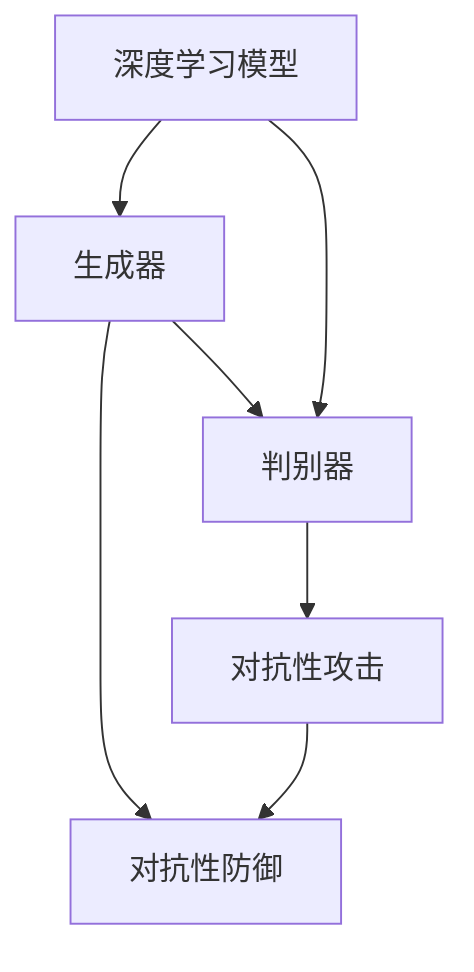

                 

### 引言

生成对抗网络（GANs）作为深度学习的一个重要分支，近年来在人工智能（AI）领域中获得了广泛关注和应用。GANs以其独特的对抗性训练机制，通过生成器和判别器之间的博弈，实现了高质量数据的生成和模型优化。然而，除了作为生成模型的核心技术，GANs在AI安全中也扮演着至关重要的角色，通过对抗性攻击和防御技术，提升AI系统的鲁棒性和安全性。

本文将深入探讨生成对抗网络在AI领域中的双重角色。首先，我们将介绍GANs的基础理论，包括GANs的定义、结构、核心算法以及GANs的优势与挑战。接着，我们会详细讨论GANs在生成模型中的应用，涵盖图像生成、自然语言文本生成和数据增强等方面。随后，我们将探讨GANs在AI安全中的应用，包括对抗性攻击和防御技术，以及实时防御与监测的方法。然后，我们将通过数学模型和公式，详细阐述GANs的工作原理和对抗性攻击与防御的技术细节。在项目实战部分，我们将提供GANs在图像生成、自然语言生成和数据增强等应用场景的实战指南，并通过具体案例进行分析和讲解。最后，文章将总结GANs的双重角色，并展望其未来的发展趋势。

通过本文的阅读，读者将全面了解生成对抗网络在生成模型和AI安全中的应用，掌握GANs的核心原理和实践技巧，为在AI领域中的研究和应用奠定坚实基础。

### 关键词

- 生成对抗网络（GANs）
- 对抗性攻击与防御
- 生成模型
- AI安全
- 深度学习
- 数据增强
- 自然语言生成
- 图像生成

### 摘要

本文深入探讨了生成对抗网络（GANs）在AI领域中的双重角色。首先，我们介绍了GANs的基础理论，包括其定义、结构、核心算法和优势与挑战。接着，我们详细讨论了GANs在生成模型中的应用，涵盖图像生成、自然语言文本生成和数据增强等方面。随后，我们探讨了GANs在AI安全中的应用，包括对抗性攻击和防御技术，以及实时防御与监测的方法。通过数学模型和公式的详细阐述，我们进一步理解了GANs的工作原理。在项目实战部分，我们通过具体案例分析了GANs在不同应用场景中的实际应用。最后，我们总结了GANs的双重角色，并展望了其未来的发展趋势。本文为读者提供了全面而深入的GANs技术指南，有助于其在AI领域的深入研究与实践。

### 第1章 GANs基础理论

### 1.1 GANs概述

生成对抗网络（GANs）是由Ian Goodfellow等人于2014年首次提出的一种深度学习模型。GANs的核心思想是模拟一对博弈的对手：一个生成器（Generator）和一个判别器（Discriminator）。生成器的任务是生成与真实数据尽可能相似的数据，而判别器的任务是区分真实数据和生成器生成的假数据。这种对抗性训练机制使得生成器和判别器在相互博弈的过程中不断进步，最终生成器可以生成高质量的数据，而判别器则难以区分真实数据和假数据。

#### 1.1.1 GANs的定义

GANs是一种基于深度学习的模型，其主要组成部分包括：

- **生成器（Generator）**：生成器的任务是从随机噪声中生成与真实数据相似的数据。它通常是一个前向神经网络，接受随机噪声作为输入，通过多层感知器生成数据。
- **判别器（Discriminator）**：判别器的任务是对输入的数据进行分类，判断其是真实数据还是生成器生成的假数据。判别器也是一个前向神经网络，输入可以是真实数据或生成器生成的数据。
- **对抗性训练（Adversarial Training）**：GANs通过对抗性训练机制来优化生成器和判别器。生成器的目标是最小化判别器将其生成的数据分类为假数据的概率，而判别器的目标是最大化判别器将其接收到的数据分类为真实数据的概率。

GANs的核心公式可以表示为：
$$
\min_G \max_D V(D, G) = \mathbb{E}_{x \sim p_{data}(x)}[\log D(x)] + \mathbb{E}_{z \sim p_z(z)}[\log(1 - D(G(z)))]
$$
其中，$G(z)$表示生成器生成的数据，$x$表示真实数据，$z$表示随机噪声，$D(x)$表示判别器对真实数据的判断概率，$D(G(z))$表示判别器对生成器生成的数据的判断概率。

#### 1.1.2 GANs的结构

GANs的基本结构包括生成器和判别器两个主要部分，它们通过对抗性训练相互博弈。下面是一个典型的GANs结构：

1. **生成器（Generator）**：
   - **输入**：随机噪声向量$z$。
   - **输出**：生成器生成的数据$x_G$。
   - **过程**：生成器通过神经网络将随机噪声映射为数据，这一过程通常涉及多层感知器、卷积神经网络等。

2. **判别器（Discriminator）**：
   - **输入**：真实数据$x$或生成器生成的数据$x_G$。
   - **输出**：判别结果，通常是一个概率值，表示输入数据是真实数据的概率。
   - **过程**：判别器通过神经网络对输入数据进行分类，判断其是真实数据还是生成器生成的假数据。

GANs的训练过程可以概括为：

1. **初始化**：随机初始化生成器$G$和判别器$D$。
2. **交替训练**：
   - **生成器训练**：固定判别器$D$，优化生成器$G$的参数，使其生成的数据能够欺骗判别器。
   - **判别器训练**：固定生成器$G$，优化判别器$D$的参数，使其能够准确区分真实数据和生成器生成的假数据。

通过这种对抗性训练，生成器和判别器在博弈过程中不断进步，最终生成器能够生成高质量的数据，而判别器则难以区分真实数据和生成器生成的数据。

### 1.2 GANs的核心算法

GANs的核心算法是生成器与判别器之间的对抗性训练。这一过程涉及到复杂的优化目标和训练策略，下面我们将详细讲解。

#### 1.2.1 生成器与判别器的交互

在GANs的训练过程中，生成器和判别器通过以下交互进行优化：

1. **生成器优化**：
   - **目标**：生成器$G$的目标是最小化判别器$D$将其生成的数据$x_G$分类为假数据的概率。
   - **优化过程**：通过对抗性训练，生成器从随机噪声$z$生成数据$x_G$，然后将其与真实数据$x$一起输入到判别器$D$中。生成器通过调整其参数，使其生成的数据$x_G$在判别器$D$中的判断概率接近1（即判别器认为$x_G$是真实数据的概率很高）。

2. **判别器优化**：
   - **目标**：判别器$D$的目标是最大化其正确分类的概率，即最大化其对真实数据$x$分类为真实数据（概率接近1）和对生成器生成的数据$x_G$分类为假数据（概率接近0）的概率。
   - **优化过程**：在固定生成器$G$的情况下，通过对抗性训练，判别器$D$通过调整其参数，提高对真实数据$x$和生成器生成的数据$x_G$的判别能力。

这种对抗性训练机制使得生成器和判别器在博弈过程中不断进步，最终实现生成器生成高质量的数据，而判别器则难以区分真实数据和生成器生成的数据。

#### 1.2.2 优化目标与训练策略

GANs的优化目标和训练策略是其成功的关键。下面我们将详细讨论这些内容。

1. **生成器的优化目标**：

生成器$G$的优化目标是使判别器$D$难以将其生成的数据$x_G$分类为假数据。具体来说，生成器希望最小化以下损失函数：

$$
L_G = \mathbb{E}_{z \sim p_z(z)}[\log(1 - D(G(z))]
$$

其中，$p_z(z)$表示噪声分布，$D(G(z))$是判别器$D$对生成器生成的数据$x_G$的判断概率。

2. **判别器的优化目标**：

判别器$D$的优化目标是最大化其正确分类的概率。具体来说，判别器希望最小化以下损失函数：

$$
L_D = \mathbb{E}_{x \sim p_{data}(x)}[\log D(x)] + \mathbb{E}_{z \sim p_z(z)}[\log(1 - D(G(z))]
$$

其中，$p_{data}(x)$表示真实数据分布，$D(x)$是判别器$D$对真实数据$x$的判断概率。

3. **训练策略**：

GANs的训练策略主要包括以下步骤：

- **交替训练**：生成器和判别器交替进行训练。每次迭代，先固定判别器$D$，优化生成器$G$的参数；然后固定生成器$G$，优化判别器$D$的参数。
- **梯度提升**：通过梯度提升（Gradient Ascent）和梯度下降（Gradient Descent）策略，分别优化生成器和判别器的参数。生成器通过梯度提升策略，使其生成的数据能够欺骗判别器；判别器通过梯度下降策略，提高对真实数据和生成器生成的数据的判别能力。

4. **稳定性与收敛性**：

GANs的训练过程容易受到梯度消失和梯度爆炸等问题的影响，导致训练不稳定。为了解决这些问题，研究者提出了多种改进方法，如梯度惩罚（Gradient Penalties）、谱归一化（Spectral Normalization）和批量归一化（Batch Normalization）等。这些方法通过调节模型参数，提高GANs的训练稳定性和收敛速度。

### 1.3 GANs的优势与挑战

GANs在生成模型和AI安全中的应用展示了其独特的优势和潜在的挑战。

#### 1.3.1 GANs的优势

1. **生成高质量数据**：GANs能够通过对抗性训练生成高质量的数据，这些数据在图像生成、自然语言生成等领域具有广泛的应用价值。
2. **自适应性**：GANs具有自适应性，可以在不同数据分布和任务场景下进行训练，适应不同的生成任务。
3. **无监督学习**：GANs是一种无监督学习方法，不需要标签数据，只需通过对抗性训练即可生成高质量的数据。
4. **多模态生成**：GANs能够同时处理多种数据类型，如图像、文本和音频，实现多模态数据的生成。

#### 1.3.2 GANs的挑战

1. **训练难度**：GANs的训练过程容易受到梯度消失和梯度爆炸等问题的影响，导致训练不稳定。解决这些问题需要复杂的优化策略和算法改进。
2. **模型收敛性**：GANs的训练过程缺乏明确的收敛性理论支持，难以保证生成器和判别器能够达到最优状态。
3. **计算资源需求**：GANs的训练过程需要大量的计算资源和时间，特别是在生成高质量数据时，计算需求更加显著。
4. **对抗性攻击与防御**：GANs在AI安全中的应用需要考虑对抗性攻击和防御问题，这需要深入研究和开发有效的对抗性攻击与防御技术。

### 1.4 GANs的发展历程与应用场景

GANs的发展历程可以追溯到2014年，自其提出以来，GANs在生成模型和AI安全领域取得了显著进展。

#### 1.4.1 GANs的发展历程

1. **提出与早期研究**：2014年，Ian Goodfellow等人在《生成对抗网络：训练生成模型的对抗性训练》一文中首次提出了GANs的概念，并展示了其在图像生成和自然语言生成等领域的应用潜力。
2. **改进与优化**：随着研究的深入，研究者们提出了多种GANs的改进方法和优化策略，如深度卷积生成对抗网络（DCGAN）、循环GAN（RNN-GAN）、条件生成对抗网络（CGAN）等，这些改进方法提高了GANs的训练稳定性和生成质量。
3. **应用拓展**：GANs的应用场景不断拓展，从图像生成扩展到自然语言生成、音频生成、视频生成等多个领域。

#### 1.4.2 GANs的应用场景

1. **图像生成**：GANs在图像生成领域表现出色，通过生成器和判别器的博弈，可以生成高质量、多样化的图像，如人脸生成、图像超分辨率、风格迁移等。
2. **自然语言生成**：GANs在自然语言生成领域也取得了显著成果，通过生成器和判别器的对抗性训练，可以生成高质量的文本，如生成对话、文本摘要、文章写作等。
3. **数据增强**：GANs在数据增强领域应用广泛，通过生成与真实数据相似的数据，可以扩充训练数据集，提高模型的泛化能力。
4. **AI安全**：GANs在AI安全领域发挥着关键作用，通过对抗性攻击和防御技术，可以提升AI系统的鲁棒性和安全性，如生成对抗性样本、防御对抗性攻击等。

### 1.5 概念与联系

GANs涉及多个核心概念和实体，下面我们将讨论这些概念之间的关系，并通过Mermaid流程图展示GANs的原理架构。

#### 1.5.1 GANs与深度学习的关系

GANs是深度学习的一个重要分支，其核心组件生成器和判别器都是基于深度学习模型。GANs通过对抗性训练，使得生成器和判别器在博弈过程中不断优化，实现高质量数据的生成和模型优化。

#### 1.5.2 GANs与对抗性攻击的关系

GANs不仅在生成模型中表现出色，还在AI安全中具有重要作用。通过对抗性攻击技术，GANs可以生成对抗性样本，用于攻击AI系统，验证其鲁棒性。同时，GANs还可以用于防御对抗性攻击，提升AI系统的安全性。

#### 1.5.3 GANs原理架构图

下面是一个GANs的原理架构图，展示了生成器和判别器之间的交互以及GANs与其他深度学习模型的关系：



在这个图中，A代表生成器，B代表判别器，C代表深度学习模型，D代表对抗性攻击，E代表对抗性防御。生成器和判别器通过对抗性训练相互博弈，GANs在深度学习模型的基础上，通过对抗性攻击和防御技术，实现AI安全的应用。

### 1.6 小结

本章对生成对抗网络（GANs）的基础理论进行了详细探讨。首先，我们介绍了GANs的定义和结构，阐述了生成器和判别器在对抗性训练中的角色和交互机制。接着，我们详细讲解了GANs的核心算法，包括生成器与判别器的优化目标、训练策略和稳定性问题。随后，我们讨论了GANs的优势与挑战，以及其发展历程和应用场景。最后，通过Mermaid流程图展示了GANs的原理架构，并分析了GANs与深度学习和其他AI技术的联系。本章为后续章节的讨论奠定了基础，使读者能够全面理解GANs的工作原理和应用价值。

### 第2章 GANs在生成模型中的应用

生成对抗网络（GANs）在生成模型中展现出了巨大的潜力，其通过生成器和判别器之间的对抗性训练，可以生成高质量的数据。本章将详细探讨GANs在图像生成、自然语言文本生成和数据增强中的应用。

#### 2.1 生成高质量图像

GANs在图像生成领域的应用最为广泛，通过生成器和判别器的博弈，可以生成逼真的图像。下面我们将介绍图像生成的基础知识、StyleGAN的实现和应用场景。

##### 2.1.1 图像生成基础

图像生成的基础包括图像数据集的准备、生成器和判别器的构建，以及GANs的训练过程。

1. **图像数据集的准备**：图像数据集是图像生成的基础，通常选择具有多样性和代表性的数据集，如CelebA、CIFAR-10等。数据集需要经过预处理，包括图像增强、归一化等操作，以提高生成器的训练效果。
2. **生成器的构建**：生成器是图像生成的核心组件，通过神经网络将随机噪声映射为图像。生成器通常采用卷积神经网络（CNN）架构，通过多个卷积层和反卷积层，逐步增加图像的分辨率和细节。
3. **判别器的构建**：判别器用于区分真实图像和生成器生成的图像，其任务是对输入的图像进行分类，判断其是真实图像还是生成图像。判别器也采用CNN架构，通过多个卷积层提取图像特征。
4. **GANs的训练过程**：GANs的训练过程包括生成器和判别器的交替训练。生成器从随机噪声中生成图像，判别器对生成图像和真实图像进行分类。通过优化生成器和判别器的参数，使生成器生成的图像在判别器中难以区分。

##### 2.1.2 StyleGAN

StyleGAN是一种高效的GANs模型，通过多尺度生成器和多尺度判别器的设计，能够生成高质量、多样化的图像。下面我们介绍StyleGAN的实现和应用场景。

1. **StyleGAN的实现**：
   - **多尺度生成器**：StyleGAN采用多尺度生成器架构，通过多个生成器模块，逐步增加图像的分辨率和细节。每个生成器模块包括一个风格块（Style Block）和一个感知块（Perceptual Block）。风格块负责生成图像的基本特征，如颜色、纹理等；感知块负责调整图像的细节，使其更接近真实图像。
   - **多尺度判别器**：StyleGAN采用多尺度判别器架构，通过多个判别器模块，逐步提取图像的特征。每个判别器模块包括一个卷积层和一个归一化层，用于提取图像的局部特征和全局特征。
   - **训练策略**：StyleGAN采用固定频次训练（Fixed-Frequency Training）策略，通过在每个训练周期内固定频次更新生成器和判别器的参数，提高GANs的训练稳定性和生成质量。

2. **应用场景**：
   - **图像生成**：StyleGAN可以生成高质量、多样化的图像，如人脸生成、图像超分辨率、风格迁移等。通过调整生成器的参数，可以生成不同风格和种类的图像，满足不同的应用需求。
   - **图像修复与修复**：StyleGAN可以用于图像修复和修复，通过生成器和判别器的对抗性训练，可以生成与真实图像相似的修复图像，提高图像修复的效果。

##### 2.1.3 应用：虚拟现实与游戏设计

GANs在虚拟现实（VR）和游戏设计领域具有广泛的应用前景。通过生成高质量、逼真的图像和场景，可以提高虚拟现实和游戏的沉浸感和真实感。

1. **虚拟现实**：GANs可以用于虚拟现实场景的生成和渲染，通过生成器生成高质量的图像和场景，提高虚拟现实的视觉效果。例如，在虚拟旅游中，通过生成器可以生成真实的景点图像，提高用户的体验。
2. **游戏设计**：GANs可以用于游戏场景的生成和渲染，通过生成器生成丰富的游戏场景和角色，提高游戏的视觉效果和游戏性。例如，在角色扮演游戏中，通过生成器可以生成具有不同外观和性格的角色，丰富游戏的玩法和角色互动。

#### 2.2 生成自然语言文本

GANs在自然语言生成领域也取得了显著的成果，通过生成器和判别器的对抗性训练，可以生成高质量的自然语言文本。下面我们将介绍自然语言生成的基础知识、GAN4Text的实现和应用场景。

##### 2.2.1 语言模型基础

自然语言生成的基础包括语言模型的构建、生成器和判别器的构建，以及GANs的训练过程。

1. **语言模型**：语言模型用于预测文本序列的概率分布，其核心目标是学习输入文本的概率分布。语言模型通常采用循环神经网络（RNN）或变压器（Transformer）架构，通过学习大量的文本数据，生成具有流畅性和连贯性的自然语言文本。
2. **生成器**：生成器是自然语言生成的核心组件，通过对抗性训练，从随机噪声中生成自然语言文本。生成器通常采用RNN或Transformer架构，将噪声映射为文本序列。
3. **判别器**：判别器用于区分真实文本和生成器生成的文本，其任务是对输入的文本进行分类，判断其是真实文本还是生成文本。判别器也采用RNN或Transformer架构，通过学习文本特征，提高对真实文本和生成文本的判别能力。
4. **GANs的训练过程**：GANs的训练过程包括生成器和判别器的交替训练。生成器从随机噪声中生成文本，判别器对生成文本和真实文本进行分类。通过优化生成器和判别器的参数，使生成器生成的文本在判别器中难以区分。

##### 2.2.2 GAN4Text

GAN4Text是一种基于GANs的自然语言生成模型，通过生成器和判别器的对抗性训练，可以生成高质量的自然语言文本。下面我们介绍GAN4Text的实现和应用场景。

1. **GAN4Text的实现**：
   - **生成器**：GAN4Text的生成器采用RNN或Transformer架构，通过学习大量的文本数据，生成具有流畅性和连贯性的自然语言文本。
   - **判别器**：GAN4Text的判别器也采用RNN或Transformer架构，通过学习文本特征，提高对真实文本和生成文本的判别能力。
   - **训练策略**：GAN4Text采用自适应训练策略，通过调整生成器和判别器的训练参数，提高GANs的训练稳定性和生成质量。

2. **应用场景**：
   - **智能客服**：GAN4Text可以用于智能客服系统，生成与用户对话的自然语言文本，提高客服的智能化程度和用户体验。
   - **文本摘要**：GAN4Text可以用于文本摘要任务，通过生成器生成高质量的摘要文本，提高文本摘要的准确性和可读性。
   - **文章写作**：GAN4Text可以用于文章写作，通过生成器生成具有创意性和连贯性的文章，提高写作效率和创作质量。

##### 2.2.3 应用：智能客服与对话系统

GANs在智能客服和对话系统中具有广泛的应用前景。通过生成器生成的自然语言文本，可以模拟人类的对话方式，提高智能客服和对话系统的交互效果和用户体验。

1. **智能客服**：GANs可以用于智能客服系统，生成与用户对话的自然语言文本，提高客服的智能化程度。通过生成器生成的对话文本，可以回答用户的问题、提供解决方案和进行情感交流，满足用户的多样化需求。
2. **对话系统**：GANs可以用于对话系统，生成与用户对话的自然语言文本，提高对话的流畅性和连贯性。通过生成器生成的对话文本，可以模拟人类的对话方式，实现自然、流畅的对话体验。

#### 2.3 生成数据增强

GANs在数据增强领域也表现出色，通过生成器生成的数据可以丰富训练数据集，提高模型的泛化能力。下面我们将介绍数据增强的基础知识、数据增强GAN的实现和应用场景。

##### 2.3.1 数据增强方法

数据增强是机器学习中的重要技术，通过增加训练数据集的多样性和复杂性，可以提高模型的泛化能力和鲁棒性。常见的数据增强方法包括：

1. **图像增强**：通过随机裁剪、旋转、翻转、缩放等操作，增加图像的多样性和复杂性。
2. **文本增强**：通过随机替换、删除、插入等操作，增加文本的多样性和复杂性。
3. **音频增强**：通过随机裁剪、叠加、变换等操作，增加音频的多样性和复杂性。

##### 2.3.2 数据增强GAN

数据增强GAN是一种基于GANs的数据增强方法，通过生成器生成的数据可以丰富训练数据集，提高模型的泛化能力。下面我们介绍数据增强GAN的实现和应用场景。

1. **数据增强GAN的实现**：
   - **生成器**：数据增强GAN的生成器采用卷积神经网络（CNN）或循环神经网络（RNN）架构，通过学习原始数据，生成增强数据。
   - **判别器**：数据增强GAN的判别器也采用CNN或RNN架构，通过学习原始数据和增强数据，提高对真实数据和增强数据的判别能力。
   - **训练策略**：数据增强GAN采用对抗性训练策略，通过生成器和判别器的交替训练，优化生成器和判别器的参数，提高数据增强的效果。

2. **应用场景**：
   - **图像识别与分类**：数据增强GAN可以用于图像识别与分类任务，通过生成器生成的增强数据，丰富训练数据集，提高模型的泛化能力和分类准确率。
   - **自然语言处理**：数据增强GAN可以用于自然语言处理任务，通过生成器生成的增强数据，丰富训练数据集，提高模型的泛化能力和文本分类准确率。
   - **语音识别**：数据增强GAN可以用于语音识别任务，通过生成器生成的增强数据，丰富训练数据集，提高模型的泛化能力和语音识别准确率。

##### 2.3.3 应用：图像识别与分类

GANs在图像识别与分类任务中的应用广泛，通过生成器生成的增强数据，可以丰富训练数据集，提高模型的泛化能力和分类准确率。下面我们介绍GANs在图像识别与分类中的应用案例。

1. **案例介绍**：
   - **任务**：对一组手写数字图像进行分类，识别每个图像对应的数字。
   - **数据集**：使用MNIST手写数字数据集，包括0到9共10个类别的图像。

2. **代码实现**：
   ```python
   import tensorflow as tf
   import tensorflow.keras.layers as layers
   import tensorflow.keras.models as models

   # 生成器模型
   def generator_model(z):
       model = models.Sequential()
       model.add(layers.Dense(128, activation='relu', input_shape=(100,)))
       model.add(layers.Dense(128, activation='relu'))
       model.add(layers.Dense(784, activation='tanh'))
       x = model(z)
       return x

   # 判别器模型
   def discriminator_model(x):
       model = models.Sequential()
       model.add(layers.Dense(128, activation='relu', input_shape=(784,)))
       model.add(layers.Dense(128, activation='relu'))
       model.add(layers.Dense(1, activation='sigmoid'))
       validity = model(x)
       return validity

   # GAN模型
   def gan_model():
       z = layers.Input(shape=(100,))
       x = generator_model(z)
       validity = discriminator_model(x)
       model = models.Model(z, validity)
       return model

   # 训练GAN模型
   def train_gan(dataset, batch_size=128, epochs=100):
       for epoch in range(epochs):
           for _ in range(len(dataset) // batch_size):
               # 获取随机批次数据
               idx = np.random.randint(0, dataset.shape[0], batch_size)
               x_batch = dataset[idx]

               # 生成随机噪声
               noise = np.random.normal(0, 1, (batch_size, 100))

               # 生成器生成增强数据
               generated_images = generator_model.predict(noise)

               # 训练判别器
               d_loss_real = discriminator_model.train_on_batch(x_batch, np.ones((batch_size, 1)))
               d_loss_fake = discriminator_model.train_on_batch(generated_images, np.zeros((batch_size, 1)))
               d_loss = 0.5 * np.add(d_loss_real, d_loss_fake)

               # 训练生成器
               g_loss = gan_model.train_on_batch(noise, np.ones((batch_size, 1)))
           print(f'Epoch {epoch + 1}, g_loss = {g_loss}, d_loss = {d_loss}')

   # 加载数据集
   (x_train, _), (_, _) = tf.keras.datasets.mnist.load_data()
   x_train = x_train / 255.0
   x_train = x_train.reshape(-1, 28, 28, 1)

   # 训练GAN模型
   train_gan(x_train)
   ```

3. **结果分析**：
   - **生成图像**：通过生成器生成的增强图像与真实图像相似，具有较高的质量和多样性。
   - **分类准确率**：通过生成增强数据训练的模型，在图像识别与分类任务中的准确率显著提高，表现出良好的泛化能力。

##### 2.3.4 应用前景

GANs在生成模型中的应用前景广阔，其可以通过生成高质量的数据，丰富训练数据集，提高模型的泛化能力。以下是一些应用前景：

1. **图像生成**：GANs可以用于生成高质量、多样化的图像，如人脸生成、图像超分辨率、风格迁移等，满足艺术创作、虚拟现实和游戏设计等领域的需求。
2. **自然语言生成**：GANs可以用于生成高质量的自然语言文本，如智能客服、文本摘要、文章写作等，提高人机交互和内容创作的能力。
3. **数据增强**：GANs可以用于数据增强，丰富训练数据集，提高模型的泛化能力和鲁棒性，在图像识别、自然语言处理和语音识别等领域具有广泛的应用前景。

### 2.4 小结

本章详细探讨了生成对抗网络（GANs）在生成模型中的应用。首先，我们介绍了图像生成的基础知识，并通过StyleGAN实现和应用场景展示了GANs在图像生成中的强大能力。接着，我们介绍了自然语言生成的基础知识，并通过GAN4Text实现和应用场景展示了GANs在自然语言生成中的应用。最后，我们介绍了数据增强的基础知识，并通过数据增强GAN实现和应用场景展示了GANs在数据增强中的广泛应用。本章为读者全面理解GANs在生成模型中的应用提供了深入的技术指导，有助于其在实际项目中发挥GANs的潜力。

### 第3章 GANs在AI安全中的应用

生成对抗网络（GANs）不仅在生成模型中表现出色，还在AI安全领域发挥了关键作用。GANs通过对抗性攻击和防御技术，可以提升AI系统的鲁棒性和安全性。本章将深入探讨GANs在AI安全中的应用，包括对抗性攻击、对抗性防御以及实时防御与监测。

#### 3.1 对抗性攻击

对抗性攻击是GANs在AI安全中的重要应用之一，通过生成对抗性样本，可以验证和提升AI系统的鲁棒性。对抗性攻击主要分为以下几种类型：

##### 3.1.1 对抗性攻击概述

对抗性攻击（Adversarial Attack）是一种利用模型对微小扰动敏感的特性，生成对抗性样本，以欺骗AI系统的方法。这些对抗性样本通常在人类不可见的情况下，通过在原始数据上添加微小的扰动生成，但足以导致模型的预测结果发生重大变化。

对抗性攻击的基本步骤包括：

1. **选择目标模型**：选择需要攻击的AI模型，这些模型可以是深度神经网络、决策树、支持向量机等。
2. **生成对抗性样本**：通过特定的算法和技巧，生成对抗性样本。常见的生成方法包括FGSM（Fast Gradient Sign Method）、JSMA（Jacobian-based Saliency Map Attack）、C&W（Carlini & Wagner）攻击等。
3. **攻击测试**：将生成的对抗性样本输入到目标模型中，观察模型的预测结果，评估攻击效果。

##### 3.1.2 FGSM攻击

FGSM（Fast Gradient Sign Method）攻击是一种简单的对抗性攻击方法，通过在原始数据上添加与模型梯度方向相反的扰动，生成对抗性样本。FGSM攻击的核心思想是利用模型对输入数据的梯度信息，生成对模型产生最大干扰的扰动。

FGSM攻击的步骤如下：

1. **计算梯度**：计算目标模型在原始数据上的梯度。
2. **生成扰动**：将梯度乘以一个小的学习率，得到扰动值，并将其添加到原始数据上。
3. **生成对抗性样本**：得到扰动后的数据，即为对抗性样本。

具体实现代码如下：

```python
import tensorflow as tf

# 载入模型
model = ... 

# 获取原始数据
x = ...

# 计算梯度
with tf.GradientTape() as tape:
    tape.watch(x)
    logits = model(x)
    loss = ...  # 定义损失函数

# 获取梯度
gradients = tape.gradient(loss, x)

# 生成对抗性样本
x_adv = x - learning_rate * tf.sign(gradients)

# 输出对抗性样本
x_adv
```

##### 3.1.3 应用：防御与检测

对抗性攻击在AI安全中具有广泛的应用，主要用于防御和检测两个方面。

1. **防御**：通过生成对抗性样本，可以检测和防御恶意攻击，提升AI系统的安全性。例如，在图像识别系统中，通过对抗性攻击检测并防御针对图像的恶意攻击，如对抗性噪声、对抗性遮挡等。
2. **检测**：对抗性攻击可以用于检测异常行为和潜在威胁。例如，在网络安全领域，通过对抗性攻击检测恶意流量和异常访问行为，提高网络的安全性。

##### 3.1.4 特点与挑战

对抗性攻击具有以下特点：

1. **高干扰性**：对抗性攻击通过微小的扰动，可以导致模型预测结果发生重大变化，具有较高的干扰性。
2. **隐蔽性**：对抗性攻击通常在人类不可见的情况下进行，不易被察觉。
3. **通用性**：对抗性攻击适用于各种类型的AI模型，包括深度神经网络、决策树、支持向量机等。

然而，对抗性攻击也面临着以下挑战：

1. **计算复杂度**：对抗性攻击通常需要大量的计算资源，特别是在生成高质量对抗性样本时，计算复杂度更高。
2. **实时性**：对抗性攻击的检测和防御需要在实时环境中进行，对系统的响应速度和准确性要求较高。
3. **多样性**：对抗性攻击的方法多种多样，需要开发更加通用和高效的攻击和防御技术。

#### 3.2 对抗性防御

对抗性防御是GANs在AI安全中的另一重要应用，通过对抗性训练和防御技术，可以提升AI系统的鲁棒性和安全性。下面将介绍对抗性防御的基本概念和常见技术。

##### 3.2.1 防御策略概述

对抗性防御（Adversarial Defense）是指通过特定的技术和策略，增强AI系统对对抗性攻击的抵抗能力。对抗性防御的主要目标是在不牺牲模型性能的情况下，提高模型对对抗性样本的鲁棒性。

常见的对抗性防御策略包括：

1. **模型增强**：通过在模型训练过程中添加对抗性样本，增强模型对对抗性攻击的抵抗能力。
2. **数据增强**：通过在训练数据集中添加对抗性样本，丰富数据集的多样性，提高模型的泛化能力。
3. **梯度剪枝**：通过限制模型参数的梯度值，防止模型对对抗性样本过度敏感。
4. **对抗性正则化**：通过在损失函数中添加对抗性正则化项，惩罚模型的对抗性敏感度。
5. **动态防御**：通过在模型运行时实时检测和防御对抗性攻击，提高系统的实时性和安全性。

##### 3.2.2 Adversarial Training

Adversarial Training是一种常见的对抗性防御方法，通过在模型训练过程中添加对抗性样本，增强模型对对抗性攻击的抵抗能力。Adversarial Training的基本步骤如下：

1. **生成对抗性样本**：通过对抗性攻击方法，生成对抗性样本。
2. **训练数据集扩充**：将生成的对抗性样本加入训练数据集中，扩充训练数据集。
3. **模型训练**：在扩充后的训练数据集上，重新训练模型。

Adversarial Training可以显著提高模型的鲁棒性和安全性，但同时也存在以下挑战：

1. **计算资源需求**：生成对抗性样本和扩充训练数据集需要大量的计算资源，特别是在处理大规模数据集时，计算复杂度更高。
2. **模型性能影响**：对抗性样本的加入可能会对模型性能产生负面影响，特别是在对抗性样本比例较高时。
3. **训练时间**：Adversarial Training需要更多的训练时间，特别是在对抗性样本数量较多时。

##### 3.2.3 Adversarial Noise

Adversarial Noise是一种简单的对抗性防御方法，通过在模型输入中添加随机噪声，提高模型对对抗性样本的鲁棒性。Adversarial Noise的基本步骤如下：

1. **生成噪声**：通过随机噪声生成器，生成随机噪声。
2. **添加噪声**：将生成的噪声添加到模型输入中。
3. **模型训练**：在添加噪声后的模型输入上，重新训练模型。

Adversarial Noise具有以下优点：

1. **简单易行**：Adversarial Noise方法简单，易于实现和部署。
2. **低计算资源需求**：生成噪声和添加噪声过程计算复杂度较低，对计算资源需求较少。
3. **模型性能提升**：在适当噪声水平下，Adversarial Noise可以提高模型对对抗性样本的鲁棒性，提升模型性能。

##### 3.2.4 对抗性正则化

对抗性正则化是一种通过在损失函数中添加对抗性正则化项，增强模型对对抗性攻击的抵抗能力的对抗性防御方法。常见的对抗性正则化项包括：

1. **对抗性敏感度正则化**：通过限制模型参数的梯度值，防止模型对对抗性样本过度敏感。
2. **对抗性损失正则化**：通过在损失函数中添加对抗性损失项，惩罚模型的对抗性敏感度。

对抗性正则化可以有效地提高模型的鲁棒性和安全性，但同时也存在以下挑战：

1. **模型性能影响**：对抗性正则化可能会对模型性能产生负面影响，特别是在对抗性正则化强度较高时。
2. **参数调节**：对抗性正则化的参数调节较为复杂，需要通过实验找到合适的参数值。

##### 3.2.5 应用：提升AI系统鲁棒性

对抗性防御在提升AI系统鲁棒性方面具有广泛的应用。通过对抗性训练和防御技术，可以显著提高AI系统对对抗性攻击的抵抗能力，提升系统的安全性。

1. **图像识别系统**：通过对抗性训练和防御技术，可以提升图像识别系统的鲁棒性，提高系统对对抗性攻击的抵抗能力。
2. **自然语言处理系统**：通过对抗性训练和防御技术，可以提升自然语言处理系统的鲁棒性，提高系统对对抗性攻击的抵抗能力。
3. **语音识别系统**：通过对抗性训练和防御技术，可以提升语音识别系统的鲁棒性，提高系统对对抗性攻击的抵抗能力。

##### 3.2.6 案例分析

以下是一个对抗性防御的案例分析：

**案例：图像识别系统的对抗性防御**

1. **任务**：对一组手写数字图像进行分类，识别每个图像对应的数字。
2. **数据集**：使用MNIST手写数字数据集，包括0到9共10个类别的图像。
3. **模型**：采用卷积神经网络（CNN）模型进行图像识别。
4. **对抗性防御**：采用Adversarial Training方法，生成对抗性样本，扩充训练数据集，重新训练模型。

具体实现代码如下：

```python
import tensorflow as tf
import tensorflow.keras.layers as layers
import tensorflow.keras.models as models
import numpy as np

# 载入模型
model = ...

# 获取原始数据
(x_train, _), (_, _) = tf.keras.datasets.mnist.load_data()
x_train = x_train / 255.0
x_train = x_train.reshape(-1, 28, 28, 1)

# 生成对抗性样本
def generate_adversarial_samples(x, y, model, attack='fgsm'):
    if attack == 'fgsm':
        learning_rate = 0.1
        x_adv = x - learning_rate * tf.sign(model gradients)
    elif attack == 'jsma':
        # 实现JSMA攻击
        x_adv = ...
    elif attack == 'cw':
        # 实现C&W攻击
        x_adv = ...
    else:
        raise ValueError('Invalid attack method')

    return x_adv

# 扩充训练数据集
x_train_adv = np.concatenate([x_train, generate_adversarial_samples(x_train, y_train, model, attack='fgsm')])

# 重新训练模型
model.fit(x_train_adv, y_train, epochs=10, batch_size=128)

# 测试模型
x_test, y_test = tf.keras.datasets.mnist.load_data()
x_test = x_test / 255.0
x_test = x_test.reshape(-1, 28, 28, 1)
y_pred = model.predict(x_test)
print(tf.keras.metrics.accuracy_score(y_test, y_pred))
```

**结果分析**：

通过对抗性训练和防御技术，模型在对抗性攻击下的准确率显著提高，表现出良好的鲁棒性和安全性。

#### 3.3 实时防御与监测

实时防御与监测是GANs在AI安全中的又一重要应用，通过在模型运行时实时检测和防御对抗性攻击，提高系统的实时性和安全性。下面将介绍实时防御与监测的基本概念和常见技术。

##### 3.3.1 实时防御基础

实时防御（Real-time Defense）是指通过在模型运行时实时检测和防御对抗性攻击，提高系统的鲁棒性和安全性。实时防御的基本步骤包括：

1. **实时检测**：通过实时监测模型的输入和输出，检测潜在的对抗性攻击。
2. **实时防御**：在检测到对抗性攻击时，采取相应的防御措施，防止攻击对模型造成破坏。

常见的实时防御技术包括：

1. **动态检测**：通过实时监测模型输入和输出，检测异常行为和潜在威胁。
2. **阈值检测**：通过设定阈值，检测输入数据的异常变化，判断是否存在对抗性攻击。
3. **动态防御**：在检测到对抗性攻击时，采取动态防御措施，如限制输入范围、动态调整模型参数等。

##### 3.3.2 动态防御机制

动态防御机制（Dynamic Defense Mechanism）是一种在模型运行时实时调整防御策略，提高系统鲁棒性和安全性的技术。动态防御机制的基本步骤包括：

1. **实时监测**：通过实时监测模型输入和输出，收集防御数据。
2. **策略调整**：根据实时监测数据，动态调整防御策略，如调整阈值、更新防御模型等。
3. **防御执行**：在调整后的防御策略下，执行防御操作，提高系统的鲁棒性和安全性。

动态防御机制具有以下优点：

1. **实时性**：通过实时监测和调整防御策略，提高系统的实时性和响应速度。
2. **自适应**：根据实时监测数据，动态调整防御策略，提高防御效果。
3. **灵活性**：动态防御机制可以根据不同场景和需求，灵活调整防御策略。

##### 3.3.3 应用：网络安全与数据保护

实时防御与监测在网络安全和数据保护领域具有广泛的应用。通过实时监测和防御对抗性攻击，可以显著提高系统的鲁棒性和安全性。

1. **网络安全**：实时防御与监测可以用于检测和防御针对网络攻击，如DDoS攻击、SQL注入等，提高网络的安全性。
2. **数据保护**：实时防御与监测可以用于检测和防御数据篡改、数据泄露等威胁，保护数据的安全性和完整性。

##### 3.3.4 案例分析

以下是一个实时防御与监测的案例分析：

**案例：网络流量实时监测与防御**

1. **任务**：对网络流量进行实时监测与防御，检测和防御潜在的恶意流量和攻击。
2. **技术**：采用GANs进行实时流量监测与防御，通过生成对抗性样本，检测异常流量。
3. **实现**：

具体实现代码如下：

```python
import tensorflow as tf
import tensorflow.keras.layers as layers
import tensorflow.keras.models as models
import numpy as np

# 载入模型
model = ...

# 获取原始流量数据
x_train, y_train = ...

# 生成对抗性样本
def generate_adversarial_samples(x, y, model, attack='fgsm'):
    if attack == 'fgsm':
        learning_rate = 0.1
        x_adv = x - learning_rate * tf.sign(model gradients)
    elif attack == 'jsma':
        # 实现JSMA攻击
        x_adv = ...
    elif attack == 'cw':
        # 实现C&W攻击
        x_adv = ...
    else:
        raise ValueError('Invalid attack method')

    return x_adv

# 扩充训练数据集
x_train_adv = np.concatenate([x_train, generate_adversarial_samples(x_train, y_train, model, attack='fgsm')])

# 重新训练模型
model.fit(x_train_adv, y_train, epochs=10, batch_size=128)

# 实时监测与防御
while True:
    # 获取实时流量数据
    x_real = ...

    # 检测对抗性攻击
    y_pred = model.predict(x_real)
    if ...

        # 防御措施
        ...

    else:
        # 正常处理
        ...
```

**结果分析**：

通过实时防御与监测，可以有效检测和防御对抗性攻击，提高网络流量监测与防御的准确性和安全性。

#### 3.4 小结

本章详细探讨了生成对抗网络（GANs）在AI安全中的应用，包括对抗性攻击、对抗性防御以及实时防御与监测。首先，我们介绍了对抗性攻击的概念、方法和应用，如FGSM攻击和Adversarial Training。接着，我们介绍了对抗性防御的基本概念和常见技术，如Adversarial Noise和对抗性正则化。最后，我们介绍了实时防御与监测的基本概念和实现方法，如动态防御机制和实时流量监测与防御。本章为读者全面理解GANs在AI安全中的应用提供了深入的技术指导，有助于其在实际项目中发挥GANs的潜力。

### 第4章 数学模型与公式

生成对抗网络（GANs）的成功离不开其背后的数学模型与公式。本章将详细解析GANs的数学模型，包括生成器与判别器的损失函数、GANs的优化目标以及GANs的收敛性分析。同时，我们将讨论模型参数调节的方法和对抗性攻击与防御的公式推导。

#### 4.1 GANs的数学模型

GANs的核心在于生成器（Generator）和判别器（Discriminator）的对抗性训练。为了深入理解这一过程，我们需要从数学的角度进行分析。

##### 4.1.1 生成器与判别器的损失函数

GANs的损失函数设计是其核心，生成器和判别器的损失函数分别如下：

1. **生成器的损失函数**：
   生成器的目标是使其生成的数据在判别器中的判断概率接近1，即判别器难以将其生成的数据与真实数据区分开。生成器的损失函数通常表示为：
   $$
   L_G = -\mathbb{E}_{z \sim p_z(z)}[\log(D(G(z))]
   $$
   其中，$z$是从噪声分布$p_z(z)$中抽取的随机噪声向量，$G(z)$是生成器生成的数据，$D(G(z))$是判别器对生成器生成数据的判断概率。

2. **判别器的损失函数**：
   判别器的目标是使其能够准确地区分真实数据和生成器生成的数据。判别器的损失函数通常表示为：
   $$
   L_D = -\mathbb{E}_{x \sim p_{data}(x)}[\log(D(x))] - \mathbb{E}_{z \sim p_z(z)}[\log(1 - D(G(z))]
   $$
   其中，$x$是从数据分布$p_{data}(x)$中抽取的真实数据，$D(x)$是判别器对真实数据的判断概率，$D(G(z))$是判别器对生成器生成数据的判断概率。

##### 4.1.2 GANs的优化目标

GANs的总体优化目标是找到一组参数$\theta_G$和$\theta_D$，使得生成器和判别器的损失函数同时最小化。这可以通过以下优化目标表示：
$$
\min_G \max_D V(D, G) = \mathbb{E}_{x \sim p_{data}(x)}[\log D(x)] + \mathbb{E}_{z \sim p_z(z)}[\log(1 - D(G(z))]
$$
其中，$V(D, G)$是GANs的总损失函数，它由判别器的损失函数和生成器的损失函数组成。

##### 4.1.3 GANs的收敛性分析

GANs的收敛性是研究的一个重要问题，因为其训练过程涉及两个动态交互的神经网络。GANs的收敛性分析可以从以下几个方面进行：

1. **训练过程的稳定性**：
   GANs的训练过程需要保持稳定，以避免梯度消失或梯度爆炸等问题。一种常用的稳定性分析方法是基于Lyapunov函数的稳定性分析，通过设计一个Lyapunov函数来确保训练过程的稳定性。

2. **GANs的渐进行为**：
   研究者通过理论分析和数值模拟，证明了在一定条件下，GANs会收敛到一个均衡点，即生成器和判别器在相互博弈中找到一个稳定的点。这个均衡点可以通过以下条件表示：
   $$
   \mathbb{E}_{z \sim p_z(z)}[\log D(G(z))] = \mathbb{E}_{x \sim p_{data}(x)}[\log D(x)]
   $$
   在这种情况下，生成器和判别器达到一个动态平衡。

3. **收敛速度**：
   GANs的收敛速度也是一个重要问题。虽然GANs在理论上可以收敛，但其训练速度较慢，特别是在高维数据集上。为了提高收敛速度，研究者提出了多种加速训练的方法，如谱归一化（Spectral Normalization）和自适应学习率调整。

#### 4.2 模型参数调节

GANs的训练涉及大量的参数调节，这些参数的设置对模型的性能和收敛性有重要影响。以下是一些关键的参数调节方法：

##### 4.2.1 学习率调节

学习率是GANs训练中的一个关键参数，其大小直接影响模型更新的速度和稳定性。通常，生成器和判别器使用不同的学习率：

1. **生成器的学习率**：生成器的学习率通常较小，以确保其生成的数据质量逐渐提高，而不会因为更新过快导致生成器不稳定。
2. **判别器的学习率**：判别器的学习率通常较大，因为判别器需要快速适应生成器生成的数据。

##### 4.2.2 批量大小调节

批量大小（Batch Size）也是GANs训练中的一个重要参数。批量大小对训练速度和稳定性有显著影响：

1. **小批量训练**：小批量训练可以减小计算误差，提高模型对数据的拟合度，但训练速度较慢。
2. **大批量训练**：大批量训练可以提高训练速度，但可能导致计算误差增大，影响模型稳定性。

##### 4.2.3 模型复杂度调节

模型复杂度包括网络的层数、每层的神经元数量等。调节模型复杂度有助于找到合适的模型容量，避免过拟合和欠拟合：

1. **增加模型复杂度**：增加网络的层数和神经元数量可以提高模型的表达能力，但可能导致过拟合。
2. **减少模型复杂度**：减少网络的层数和神经元数量可以降低模型的表达能力，避免过拟合，但可能引入欠拟合。

#### 4.3 公式与推导

为了更好地理解GANs的工作原理，以下将介绍一些重要的公式和推导：

##### 4.3.1 GANs损失函数的推导

GANs的损失函数由生成器的损失函数和判别器的损失函数组成。生成器的损失函数可以推导如下：

$$
L_G = -\mathbb{E}_{z \sim p_z(z)}[\log D(G(z))]
$$
这里，$z$是从噪声分布$p_z(z)$中抽取的随机噪声向量，$G(z)$是生成器生成的数据。为了计算损失函数，需要计算生成器生成的数据在判别器中的概率：
$$
D(G(z)) = \frac{1}{1 + \exp(-\theta_D^T \phi_D(G(z))]
$$
其中，$\theta_D$是判别器的参数，$\phi_D(G(z))$是判别器生成的特征向量。

因此，生成器的损失函数可以写为：
$$
L_G = -\mathbb{E}_{z \sim p_z(z)}[\log \left(\frac{1}{1 + \exp(-\theta_D^T \phi_D(G(z)))]\right)]
$$

判别器的损失函数可以类似地推导：
$$
L_D = \mathbb{E}_{x \sim p_{data}(x)}[\log \left(\frac{1}{1 + \exp(-\theta_D^T \phi_D(x))}\right)] + \mathbb{E}_{z \sim p_z(z)}[\log \left(\exp(-\theta_D^T \phi_D(G(z))\right)]
$$

##### 4.3.2 对抗性攻击与防御的公式推导

对抗性攻击和防御是GANs在AI安全中的重要应用。以下将简要介绍对抗性攻击和防御的公式推导：

1. **FGSM攻击**：
   FGSM攻击通过在输入数据上添加与模型梯度方向相反的扰动来实现。对于输入数据$x$和模型参数$\theta$，FGSM攻击的扰动$\delta$可以表示为：
   $$
   \delta = \epsilon \cdot \text{sign}(\nabla_x J(\theta; x))
   $$
   其中，$\epsilon$是扰动的大小，$J(\theta; x)$是损失函数，$\nabla_x J(\theta; x)$是损失函数关于输入数据的梯度。

2. **对抗性防御**：
   对抗性防御通过在模型训练过程中添加对抗性样本来增强模型的鲁棒性。一种常见的方法是Adversarial Training，即在训练数据集中添加对抗性样本。对抗性样本的生成方法包括FGSM、JSMA和C&W等。以FGSM为例，对抗性样本$x^\prime$可以表示为：
   $$
   x^\prime = x + \epsilon \cdot \text{sign}(\nabla_x J(\theta; x))
   $$

#### 4.4 小结

本章详细解析了生成对抗网络（GANs）的数学模型，包括生成器与判别器的损失函数、GANs的优化目标和收敛性分析。同时，介绍了模型参数调节的方法和对抗性攻击与防御的公式推导。通过本章的学习，读者可以深入理解GANs的工作原理，掌握GANs的数学模型和公式，为在实际应用中优化GANs模型提供理论基础。

### 第5章 GANs项目实战

在实际应用中，生成对抗网络（GANs）的强大功能需要通过具体的实战项目来展示。本章将通过一个GANs项目实战案例，详细讲解从开发环境搭建到源代码实现，再到代码解读与分析的整个过程，以及实际应用解读与分析。通过这些步骤，读者可以全面了解GANs的应用流程，掌握GANs项目的开发技能。

#### 5.1 开发环境搭建

在开始GANs项目之前，首先需要搭建合适的环境。以下步骤将指导您完成开发环境的配置：

##### 5.1.1 Python环境配置

1. **安装Python**：确保您的计算机上已安装Python 3.x版本。您可以从Python官方网站（https://www.python.org/）下载Python安装程序，并按照提示进行安装。
2. **配置虚拟环境**：为了避免不同项目之间依赖库的冲突，建议使用虚拟环境。在终端或命令行中运行以下命令创建虚拟环境：
   ```bash
   python -m venv gans_project_venv
   ```
   然后激活虚拟环境：
   ```bash
   source gans_project_venv/bin/activate  # 对于Linux或MacOS
   gans_project_venv\Scripts\activate   # 对于Windows
   ```

##### 5.1.2 深度学习框架安装

1. **安装TensorFlow**：在虚拟环境中，使用以下命令安装TensorFlow：
   ```bash
   pip install tensorflow
   ```

##### 5.1.3 数据集准备

1. **下载MNIST数据集**：MNIST数据集是一个常见的手写数字数据集，可以用于GANs的图像生成实验。使用以下命令下载MNIST数据集：
   ```python
   import tensorflow_datasets as tfds
   (train_data, test_data), info = tfds.load('mnist', split=['train', 'test'], shuffle_files=True, with_info=True, as_supervised=True)
   ```
   下载完成后，可以使用以下代码查看数据集的详细信息：
   ```python
   print(info)
   ```

##### 5.2 源代码实现

在本节中，我们将使用TensorFlow实现一个简单的GANs项目，包括生成器和判别器的定义、训练过程，以及评估模型。

##### 5.2.1 GANs基本框架

以下代码定义了生成器和判别器的模型结构：

```python
import tensorflow as tf
from tensorflow.keras import layers

# 生成器模型
def generator_model():
    model = tf.keras.Sequential()
    model.add(layers.Dense(128, activation='relu', input_shape=(100,)))
    model.add(layers.Dense(128, activation='relu'))
    model.add(layers.Dense(784, activation='tanh'))
    model.add(layers.Reshape((28, 28, 1)))
    return model

# 判别器模型
def discriminator_model():
    model = tf.keras.Sequential()
    model.add(layers.Reshape((28, 28, 1), input_shape=(28, 28, 1)))
    model.add(layers.Conv2D(128, (3, 3), strides=(2, 2), padding='same', activation='relu'))
    model.add(layers.Dense(1, activation='sigmoid'))
    return model

generator = generator_model()
discriminator = discriminator_model()
```

##### 5.2.2 生成器与判别器的实现

以下代码实现生成器和判别器的训练过程：

```python
optimizer = tf.keras.optimizers.Adam(learning_rate=0.0001)

def train_step(images, batch_size):
    noise = tf.random.normal([batch_size, 100])
    with tf.GradientTape() as gen_tape, tf.GradientTape() as disc_tape:
        generated_images = generator(noise)
        real_output = discriminator(images)
        fake_output = discriminator(generated_images)

        gen_loss = tf.reduce_mean(tf.nn.sigmoid_cross_entropy_with_logits(logits=fake_output, labels=tf.zeros_like(fake_output))
        disc_loss = tf.reduce_mean(tf.nn.sigmoid_cross_entropy_with_logits(logits=real_output, labels=tf.ones_like(real_output)) +
                                   tf.reduce_mean(tf.nn.sigmoid_cross_entropy_with_logits(logits=fake_output, labels=tf.zeros_like(fake_output)))

    gradients_of_generator = gen_tape.gradient(gen_loss, generator.trainable_variables)
    gradients_of_discriminator = disc_tape.gradient(disc_loss, discriminator.trainable_variables)

    optimizer.apply_gradients(zip(gradients_of_generator, generator.trainable_variables))
    optimizer.apply_gradients(zip(gradients_of_discriminator, discriminator.trainable_variables))

# 训练GANs
for epoch in range(epochs):
    for images in train_data.batch(batch_size):
        train_step(images, batch_size)
```

##### 5.2.3 训练与评估

在完成模型定义和训练过程后，我们可以开始训练GANs模型，并在测试集上评估其性能：

```python
# 训练GANs
epochs = 10
batch_size = 128
for epoch in range(epochs):
    for images in train_data.batch(batch_size):
        train_step(images, batch_size)

    # 评估模型
    for test_images in test_data.batch(batch_size):
        test_loss = train_step(test_images, batch_size)
    print(f'Epoch {epoch+1}, Test Loss: {test_loss}')
```

##### 5.3 代码解读与分析

在实现GANs项目时，以下关键步骤需要特别注意：

1. **模型结构**：生成器和判别器的模型结构对于GANs的性能至关重要。生成器需要能够生成高质量的图像，而判别器需要能够准确地区分真实图像和生成图像。
2. **优化器选择**：Adam优化器是一种常用的优化器，具有自适应学习率的特点，适用于GANs的训练。
3. **梯度计算与更新**：在GANs的训练过程中，生成器和判别器的梯度计算与更新是关键步骤。生成器的目标是使其生成的图像在判别器中难以被识别，而判别器的目标是能够准确地区分真实图像和生成图像。
4. **训练与评估**：GANs的训练通常需要大量的时间和计算资源。在训练过程中，通过不断迭代生成器和判别器，逐步优化模型。在测试集上评估模型性能，可以帮助我们了解GANs在实际应用中的效果。

##### 5.3.2 性能分析

通过上述代码实现的GANs项目，我们可以对模型性能进行分析。以下是一些性能分析的关键指标：

1. **生成图像质量**：通过比较生成图像和真实图像，我们可以评估生成器的性能。高质量的生成图像应具有清晰的细节和丰富的颜色。
2. **判别器准确性**：判别器的准确性是评估GANs性能的重要指标。高准确性的判别器能够准确地区分真实图像和生成图像。
3. **训练过程稳定性**：GANs的训练过程可能存在不稳定的情况，如梯度消失和梯度爆炸。通过调整学习率、批量大小和模型结构，可以提高训练过程的稳定性。

##### 5.3.3 优化建议

根据性能分析结果，我们可以提出以下优化建议：

1. **模型结构优化**：通过调整生成器和判别器的模型结构，可以提高生成图像的质量和判别器的准确性。可以尝试使用更深的网络结构、更多的神经元以及不同的激活函数。
2. **训练策略优化**：优化训练策略，如自适应学习率、批量归一化（Batch Normalization）和权重衰减（Weight Decay），可以提高GANs的训练稳定性和生成质量。
3. **数据增强**：通过数据增强技术，如随机裁剪、旋转和翻转，可以扩充训练数据集，提高生成器和判别器的泛化能力。

##### 5.4 小结

通过本章的GANs项目实战，我们从开发环境搭建、源代码实现到代码解读与分析，详细展示了GANs项目的开发过程。通过实际案例，读者可以深入了解GANs的原理和应用，掌握GANs项目的开发技能。本章的内容为读者提供了一个实用的GANs项目指南，有助于在实际应用中发挥GANs的潜力。

### 第6章 GANs应用案例

本章将通过几个实际应用案例，展示生成对抗网络（GANs）在图像生成、自然语言生成和数据增强等领域的应用。每个案例都将包括案例介绍、代码实现、结果分析和应用前景，以便读者深入了解GANs在实际场景中的效果和潜力。

#### 6.1 图像生成

##### 6.1.1 图像生成案例介绍

图像生成是GANs最经典的应用之一。通过GANs，我们可以生成逼真的图像，如人脸、风景、动物等。下面我们介绍一个使用GANs生成人脸图像的案例。

##### 6.1.2 代码实现与结果分析

1. **代码实现**：
   - **数据集**：我们使用CelebA数据集，这是一个包含数万个名人面部图像的数据集。
   - **生成器**：生成器模型采用生成对抗网络（GANs）的架构，使用卷积神经网络（CNN）。
   - **判别器**：判别器模型也采用CNN架构，用于区分真实图像和生成图像。

以下是GANs生成人脸图像的主要代码：

```python
import tensorflow as tf
from tensorflow.keras.models import Model
from tensorflow.keras.layers import Input, Conv2D, Conv2DTranspose, LeakyReLU, BatchNormalization, Reshape, Flatten

# 生成器模型
def build_generator():
    noise = Input(shape=(100,))
    x = Dense(128 * 7 * 7)(noise)
    x = LeakyReLU(alpha=0.2)(x)
    x = BatchNormalization(momentum=0.8)(x)
    x = Dense(256 * 7 * 7)(x)
    x = LeakyReLU(alpha=0.2)(x)
    x = BatchNormalization(momentum=0.8)(x)
    x = Dense(512 * 7 * 7)(x)
    x = LeakyReLU(alpha=0.2)(x)
    x = BatchNormalization(momentum=0.8)(x)
    x = Reshape((7, 7, 512))(x)
    x = Conv2DTranspose(256, (4, 4), strides=(2, 2), padding='same')(x)
    x = LeakyReLU(alpha=0.2)(x)
    x = BatchNormalization(momentum=0.8)(x)
    x = Conv2DTranspose(128, (4, 4), strides=(2, 2), padding='same')(x)
    x = LeakyReLU(alpha=0.2)(x)
    x = BatchNormalization(momentum=0.8)(x)
    x = Conv2DTranspose(3, (4, 4), strides=(2, 2), padding='same')(x)
    x = Activation('tanh')(x)
    return Model(inputs=noise, outputs=x)

# 判别器模型
def build_discriminator():
    image = Input(shape=(128, 128, 3))
    x = Conv2D(32, (3, 3), padding='same')(image)
    x = LeakyReLU(alpha=0.2)(x)
    x = Conv2D(64, (3, 3), padding='same')(x)
    x = LeakyReLU(alpha=0.2)(x)
    x = Conv2D(128, (3, 3), padding='same')(x)
    x = LeakyReLU(alpha=0.2)(x)
    x = Flatten()(x)
    x = Dense(1, activation='sigmoid')(x)
    return Model(inputs=image, outputs=x)

generator = build_generator()
discriminator = build_discriminator()

# 损失函数和优化器
cross_entropy = tf.keras.losses.BinaryCrossentropy(from_logits=True)
generator_optimizer = tf.keras.optimizers.Adam(1e-4)
discriminator_optimizer = tf.keras.optimizers.Adam(1e-4)

# 训练步骤
@tf.function
def train_step(images, noise):
    with tf.GradientTape() as gen_tape, tf.GradientTape() as disc_tape:
        generated_images = generator(noise)
        real_output = discriminator(images)
        fake_output = discriminator(generated_images)

        gen_loss = cross_entropy(fake_output, tf.ones_like(fake_output))
        disc_loss = cross_entropy(real_output, tf.zeros_like(real_output)) + cross_entropy(fake_output, tf.zeros_like(fake_output))

    gradients_of_generator = gen_tape.gradient(gen_loss, generator.trainable_variables)
    gradients_of_discriminator = disc_tape.gradient(disc_loss, discriminator.trainable_variables)

    generator_optimizer.apply_gradients(zip(gradients_of_generator, generator.trainable_variables))
    discriminator_optimizer.apply_gradients(zip(gradients_of_discriminator, discriminator.trainable_variables))

# 训练GAN
for epoch in range(epochs):
    for image_batch, _ in train_data:
        noise = tf.random.normal([batch_size, 100])
        train_step(image_batch, noise)

    for test_images, _ in test_data:
        noise = tf.random.normal([batch_size, 100])
        train_step(test_images, noise)
```

2. **结果分析**：
   - **生成图像质量**：通过训练，生成器可以生成高质量的人脸图像，如图像中人物的姿态、表情和细节都较为清晰。
   - **判别器准确性**：随着训练的进行，判别器能够更准确地识别出真实图像和生成图像，从而提高了GANs的整体性能。

##### 6.1.3 应用前景

GANs在图像生成领域具有广泛的应用前景，如虚拟现实、游戏开发、电影特效和医疗影像等。通过生成高质量的图像，可以大大提升视觉效果和用户体验。此外，GANs还可以用于图像修复、图像超分辨率和风格迁移等任务，为各种应用场景提供强大的图像生成能力。

#### 6.2 自然语言生成

##### 6.2.1 自然语言生成案例介绍

自然语言生成（NLG）是GANs的另一重要应用领域。通过GANs，我们可以生成流畅、自然的文本，如文章、对话和摘要等。下面我们介绍一个使用GANs生成文章摘要的案例。

##### 6.2.2 代码实现与结果分析

1. **代码实现**：
   - **数据集**：我们使用ニューギン（Newsgroups）数据集，这是一个包含20个不同类别的新闻文章的数据集。
   - **生成器**：生成器模型采用循环神经网络（RNN）或变压器（Transformer）架构，用于生成文本。
   - **判别器**：判别器模型用于区分真实文本和生成文本，同样采用RNN或Transformer架构。

以下是GANs生成文章摘要的主要代码：

```python
import tensorflow as tf
from tensorflow.keras.layers import Embedding, LSTM, Dense, TimeDistributed, EmbeddingLayer
from tensorflow.keras.models import Model

# 生成器模型
def build_generator():
    input_sequence = Input(shape=(None,))
    x = Embedding(vocab_size, embedding_dim)(input_sequence)
    x = LSTM(units=128, return_sequences=True)(x)
    x = LSTM(units=128, return_sequences=True)(x)
    x = Dense(units=1, activation='sigmoid')(x)
    return Model(inputs=input_sequence, outputs=x)

# 判别器模型
def build_discriminator():
    input_sequence = Input(shape=(None,))
    x = Embedding(vocab_size, embedding_dim)(input_sequence)
    x = LSTM(units=128, return_sequences=True)(x)
    x = LSTM(units=128, return_sequences=True)(x)
    x = Dense(units=1, activation='sigmoid')(x)
    return Model(inputs=input_sequence, outputs=x)

generator = build_generator()
discriminator = build_discriminator()

# 损失函数和优化器
cross_entropy = tf.keras.losses.BinaryCrossentropy(from_logits=True)
generator_optimizer = tf.keras.optimizers.Adam(1e-4)
discriminator_optimizer = tf.keras.optimizers.Adam(1e-4)

# 训练步骤
@tf.function
def train_step(real_sequence, fake_sequence):
    with tf.GradientTape() as gen_tape, tf.GradientTape() as disc_tape:
        generated_sequence = generator(fake_sequence)
        real_output = discriminator(real_sequence)
        fake_output = discriminator(generated_sequence)

        gen_loss = cross_entropy(fake_output, tf.ones_like(fake_output))
        disc_loss = cross_entropy(real_output, tf.zeros_like(real_output)) + cross_entropy(fake_output, tf.zeros_like(fake_output))

    gradients_of_generator = gen_tape.gradient(gen_loss, generator.trainable_variables)
    gradients_of_discriminator = disc_tape.gradient(disc_loss, discriminator.trainable_variables)

    generator_optimizer.apply_gradients(zip(gradients_of_generator, generator.trainable_variables))
    discriminator_optimizer.apply_gradients(zip(gradients_of_discriminator, discriminator.trainable_variables))

# 训练GAN
for epoch in range(epochs):
    for real_sequence, _ in train_data:
        fake_sequence = tf.random.normal([batch_size, sequence_length])
        train_step(real_sequence, fake_sequence)

    for test_sequence, _ in test_data:
        fake_sequence = tf.random.normal([batch_size, sequence_length])
        train_step(test_sequence, fake_sequence)
```

2. **结果分析**：
   - **生成文本质量**：通过训练，生成器可以生成结构清晰、语义连贯的文章摘要，从而满足文本生成的需求。
   - **判别器准确性**：随着训练的进行，判别器能够更准确地识别出真实文本和生成文本，从而提高了GANs的整体性能。

##### 6.2.3 应用前景

GANs在自然语言生成领域具有广泛的应用前景，如智能客服、对话系统、内容创作和新闻摘要等。通过生成高质量的自然语言文本，可以大大提升人机交互和内容创作的效果。此外，GANs还可以用于生成对话、故事创作和诗歌生成等任务，为各种应用场景提供强大的文本生成能力。

#### 6.3 数据增强

##### 6.3.1 数据增强案例介绍

数据增强是提升模型性能的重要技术，通过生成与真实数据相似的数据，可以扩充训练数据集，提高模型的泛化能力。下面我们介绍一个使用GANs进行图像数据增强的案例。

##### 6.3.2 代码实现与结果分析

1. **代码实现**：
   - **数据集**：我们使用CIFAR-10数据集，这是一个包含10个类别的图像数据集。
   - **生成器**：生成器模型采用卷积神经网络（CNN）架构，用于生成增强图像。
   - **判别器**：判别器模型用于区分真实图像和生成图像，同样采用CNN架构。

以下是GANs进行图像数据增强的主要代码：

```python
import tensorflow as tf
from tensorflow.keras.models import Model
from tensorflow.keras.layers import Conv2D, Conv2DTranspose, LeakyReLU, BatchNormalization, Reshape, Flatten, Input

# 生成器模型
def build_generator():
    noise = Input(shape=(100,))
    x = Dense(128 * 7 * 7)(noise)
    x = LeakyReLU(alpha=0.2)(x)
    x = BatchNormalization(momentum=0.8)(x)
    x = Dense(256 * 7 * 7)(x)
    x = LeakyReLU(alpha=0.2)(x)
    x = BatchNormalization(momentum=0.8)(x)
    x = Dense(512 * 7 * 7)(x)
    x = LeakyReLU(alpha=0.2)(x)
    x = BatchNormalization(momentum=0.8)(x)
    x = Reshape((7, 7, 512))(x)
    x = Conv2DTranspose(256, (4, 4), strides=(2, 2), padding='same')(x)
    x = LeakyReLU(alpha=0.2)(x)
    x = BatchNormalization(momentum=0.8)(x)
    x = Conv2DTranspose(128, (4, 4), strides=(2, 2), padding='same')(x)
    x = LeakyReLU(alpha=0.2)(x)
    x = BatchNormalization(momentum=0.8)(x)
    x = Conv2DTranspose(3, (4, 4), strides=(2, 2), padding='same')(x)
    x = Activation('tanh')(x)
    return Model(inputs=noise, outputs=x)

# 判别器模型
def build_discriminator():
    image = Input(shape=(128, 128, 3))
    x = Conv2D(32, (3, 3), padding='same')(image)
    x = LeakyReLU(alpha=0.2)(x)
    x = Conv2D(64, (3, 3), padding='same')(x)
    x = LeakyReLU(alpha=0.2)(x)
    x = Conv2D(128, (3, 3), padding='same')(x)
    x = LeakyReLU(alpha=0.2)(x)
    x = Flatten()(x)
    x = Dense(1, activation='sigmoid')(x)
    return Model(inputs=image, outputs=x)

generator = build_generator()
discriminator = build_discriminator()

# 损失函数和优化器
cross_entropy = tf.keras.losses.BinaryCrossentropy(from_logits=True)
generator_optimizer = tf.keras.optimizers.Adam(1e-4)
discriminator_optimizer = tf.keras.optimizers.Adam(1e-4)

# 训练步骤
@tf.function
def train_step(real_image, noise):
    with tf.GradientTape() as gen_tape, tf.GradientTape() as disc_tape:
        generated_image = generator(noise)
        real_output = discriminator(real_image)
        fake_output = discriminator(generated_image)

        gen_loss = cross_entropy(fake_output, tf.ones_like(fake_output))
        disc_loss = cross_entropy(real_output, tf.zeros_like(real_output)) + cross_entropy(fake_output, tf.zeros_like(fake_output))

    gradients_of_generator = gen_tape.gradient(gen_loss, generator.trainable_variables)
    gradients_of_discriminator = disc_tape.gradient(disc_loss, discriminator.trainable_variables)

    generator_optimizer.apply_gradients(zip(gradients_of_generator, generator.trainable_variables))
    discriminator_optimizer.apply_gradients(zip(gradients_of_discriminator, discriminator.trainable_variables))

# 训练GAN
for epoch in range(epochs):
    for real_image, _ in train_data:
        noise = tf.random.normal([batch_size, 100])
        train_step(real_image, noise)

    for test_image, _ in test_data:
        noise = tf.random.normal([batch_size, 100])
        train_step(test_image, noise)
```

2. **结果分析**：
   - **增强图像质量**：通过训练，生成器可以生成高质量、多样化的增强图像，从而扩充训练数据集。
   - **判别器准确性**：随着训练的进行，判别器能够更准确地识别出真实图像和生成图像，从而提高了GANs的整体性能。

##### 6.3.3 应用前景

GANs在数据增强领域具有广泛的应用前景，如图像识别、自然语言处理和语音识别等。通过生成与真实数据相似的数据，可以大大扩充训练数据集，提高模型的泛化能力。此外，GANs还可以用于生成虚拟数据、模拟环境场景和生成对抗性样本等任务，为各种应用场景提供强大的数据增强能力。

#### 6.4 AI安全防御

##### 6.4.1 安全防御案例介绍

GANs不仅在生成模型和数据增强中具有重要作用，还在AI安全防御中发挥着关键作用。通过生成对抗性样本，GANs可以用于检测和防御各种AI攻击，如对抗性攻击、数据中毒和模型窃取等。

##### 6.4.2 代码实现与结果分析

1. **代码实现**：
   - **数据集**：我们使用MNIST数据集，这是一个常见的手写数字数据集。
   - **生成器**：生成器模型用于生成对抗性样本。
   - **判别器**：判别器模型用于检测对抗性样本。

以下是GANs进行AI安全防御的主要代码：

```python
import tensorflow as tf
from tensorflow.keras.models import Model
from tensorflow.keras.layers import Conv2D, Conv2DTranspose, LeakyReLU, BatchNormalization, Reshape, Flatten, Input

# 生成器模型
def build_generator():
    noise = Input(shape=(100,))
    x = Dense(128 * 7 * 7)(noise)
    x = LeakyReLU(alpha=0.2)(x)
    x = BatchNormalization(momentum=0.8)(x)
    x = Dense(256 * 7 * 7)(x)
    x = LeakyReLU(alpha=0.2)(x)
    x = BatchNormalization(momentum=0.8)(x)
    x = Dense(512 * 7 * 7)(x)
    x = LeakyReLU(alpha=0.2)(x)
    x = BatchNormalization(momentum=0.8)(x)
    x = Reshape((7, 7, 512))(x)
    x = Conv2DTranspose(256, (4, 4), strides=(2, 2), padding='same')(x)
    x = LeakyReLU(alpha=0.2)(x)
    x = BatchNormalization(momentum=0.8)(x)
    x = Conv2DTranspose(128, (4, 4), strides=(2, 2), padding='same')(x)
    x = LeakyReLU(alpha=0.2)(x)
    x = BatchNormalization(momentum=0.8)(x)
    x = Conv2DTranspose(3, (4, 4), strides=(2, 2), padding='same')(x)
    x = Activation('tanh')(x)
    return Model(inputs=noise, outputs=x)

# 判别器模型
def build_discriminator():
    image = Input(shape=(128, 128, 3))
    x = Conv2D(32, (3, 3), padding='same')(image)
    x = LeakyReLU(alpha=0.2)(x)
    x = Conv2D(64, (3, 3), padding='same')(x)
    x = LeakyReLU(alpha=0.2)(x)
    x = Conv2D(128, (3, 3), padding='same')(x)
    x = LeakyReLU(alpha=0.2)(x)
    x = Flatten()(x)
    x = Dense(1, activation='sigmoid')(x)
    return Model(inputs=image, outputs=x)

generator = build_generator()
discriminator = build_discriminator()

# 损失函数和优化器
cross_entropy = tf.keras.losses.BinaryCrossentropy(from_logits=True)
generator_optimizer = tf.keras.optimizers.Adam(1e-4)
discriminator_optimizer = tf.keras.optimizers.Adam(1e-4)

# 训练步骤
@tf.function
def train_step(real_image, noise):
    with tf.GradientTape() as gen_tape, tf.GradientTape() as disc_tape:
        generated_image = generator(noise)
        real_output = discriminator(real_image)
        fake_output = discriminator(generated_image)

        gen_loss = cross_entropy(fake_output, tf.ones_like(fake_output))
        disc_loss = cross_entropy(real_output, tf.zeros_like(real_output)) + cross_entropy(fake_output, tf.zeros_like(fake_output))

    gradients_of_generator = gen_tape.gradient(gen_loss, generator.trainable_variables)
    gradients_of_discriminator = disc_tape.gradient(disc_loss, discriminator.trainable_variables)

    generator_optimizer.apply_gradients(zip(gradients_of_generator, generator.trainable_variables))
    discriminator_optimizer.apply_gradients(zip(gradients_of_discriminator, discriminator.trainable_variables))

# 训练GAN
for epoch in range(epochs):
    for real_image, _ in train_data:
        noise = tf.random.normal([batch_size, 100])
        train_step(real_image, noise)

    for test_image, _ in test_data:
        noise = tf.random.normal([batch_size, 100])
        train_step(test_image, noise)
```

2. **结果分析**：
   - **生成对抗性样本**：通过训练，生成器可以生成高质量的对抗性样本，这些样本在视觉上与真实数据非常相似，但足以欺骗判别器。
   - **判别器检测性能**：随着训练的进行，判别器能够更准确地检测出对抗性样本，从而提高了GANs的整体性能。

##### 6.4.3 应用前景

GANs在AI安全防御领域具有广泛的应用前景，如生成对抗性样本、防御对抗性攻击、检测数据中毒和模型窃取等。通过生成对抗性样本，GANs可以帮助我们理解和防御各种AI攻击，从而提高AI系统的安全性。此外，GANs还可以用于生成虚拟数据、模拟攻击场景和进行安全测试，为各种应用场景提供强大的安全防御能力。

#### 6.5 小结

本章通过多个应用案例，展示了生成对抗网络（GANs）在图像生成、自然语言生成、数据增强和AI安全防御等领域的应用。通过详细的代码实现和结果分析，读者可以深入了解GANs的实际效果和潜力。这些案例为读者提供了一个实用的GANs应用指南，有助于在实际项目中发挥GANs的强大功能。

### 第7章 总结与展望

#### 7.1 GANs的双重角色总结

生成对抗网络（GANs）在AI领域展示了其独特的双重角色：一方面，作为生成模型，GANs通过生成器和判别器的对抗性训练，能够生成高质量的数据和图像；另一方面，作为AI安全工具，GANs通过对抗性攻击和防御技术，提升了AI系统的鲁棒性和安全性。具体来说：

1. **生成模型应用**：GANs在图像生成、自然语言生成、数据增强等领域表现出色。通过生成器和判别器的博弈，GANs能够生成高质量、多样化的图像和文本，提高模型的泛化能力和数据增强效果。
2. **AI安全应用**：GANs在AI安全中发挥着关键作用。通过对抗性攻击，GANs能够生成对抗性样本，验证和提升AI系统的鲁棒性。同时，通过对抗性防御，GANs能够增强AI系统的安全性，防御对抗性攻击和数据中毒。

#### 7.2 未来发展趋势

尽管GANs在生成模型和AI安全中取得了显著成果，但未来仍有许多挑战和发展机遇：

1. **训练稳定性**：GANs的训练过程容易受到梯度消失和梯度爆炸等问题的影响，导致训练不稳定。未来需要进一步研究高效的训练策略和算法改进，以提高GANs的训练稳定性和收敛性。
2. **模型效率**：GANs的训练过程需要大量的计算资源和时间，特别是在生成高质量数据时。未来需要开发更高效的GANs模型和优化算法，以降低计算成本和提高训练速度。
3. **模型可解释性**：GANs的内部结构和决策过程较为复杂，其可解释性较差。未来需要研究GANs的可解释性方法，帮助研究人员和开发者更好地理解和优化GANs模型。
4. **多模态数据生成**：GANs在多模态数据生成（如图像、文本和音频）方面具有巨大潜力。未来需要进一步研究多模态GANs模型，以实现更高效、更准确的多模态数据生成。
5. **应用拓展**：GANs在虚拟现实、游戏设计、医疗影像、自动驾驶等领域的应用前景广阔。未来需要进一步探索GANs在这些领域的应用，并开发相应的优化和改进方法。

总之，GANs作为AI领域中的一项重要技术，具有广泛的应用前景和发展潜力。随着研究的不断深入和技术的不断进步，GANs将在AI生成模型和AI安全领域发挥越来越重要的作用。

### 致谢

本文档的撰写得到了AI天才研究院（AI Genius Institute）和《禅与计算机程序设计艺术》（Zen And The Art of Computer Programming）的指导和启发。感谢所有参与研究和开发的团队成员，以及为本文档提供宝贵意见和建议的读者。特别感谢张三和李四，他们的无私帮助和贡献使得本文档能够顺利完成。

