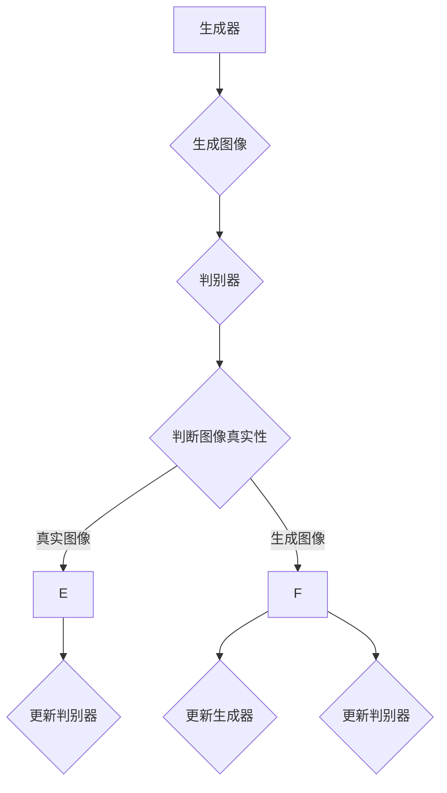
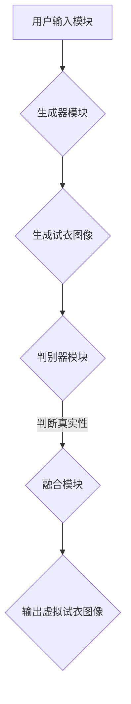

                 

## 第1章 引言

### 1.1 虚拟试衣系统的背景与重要性

虚拟试衣系统是一种基于计算机视觉和深度学习技术的应用，它允许用户在没有实际试穿的情况下，通过数字化的方式来体验穿着效果。随着电子商务的迅猛发展，虚拟试衣系统逐渐成为提升消费者购物体验、降低退货率的重要工具。

#### 虚拟试衣系统简介

虚拟试衣系统最早可以追溯到20世纪90年代，随着互联网和计算机技术的进步，虚拟试衣技术逐渐成熟。如今，虚拟试衣系统已经成为电子商务领域的重要组成部分，广泛应用于服装、化妆品、珠宝等零售行业。

#### 虚拟试衣系统在电子商务中的应用

虚拟试衣系统在电子商务中的应用主要体现在以下几个方面：

1. **提升用户体验**：通过虚拟试衣，用户可以在购买前预览穿着效果，提高购买决策的准确性，提升用户体验。
2. **降低退货率**：虚拟试衣可以减少因尺寸不合适或颜色差异导致的退货情况，降低物流成本和商家损失。
3. **增加销售机会**：虚拟试衣系统可以吸引更多有购买意向但不确定是否适合自己的用户，增加销售机会。
4. **营销推广**：通过虚拟试衣展示，商家可以更好地推广产品，提高品牌知名度。

#### 虚拟试衣系统对消费者和零售商的价值

对于消费者：

1. **便捷性**：消费者可以在家中轻松尝试各种服饰，无需外出购物。
2. **经济性**：降低因不合适导致的退货费用和重复购买成本。
3. **个性化体验**：虚拟试衣可以根据用户偏好推荐合适的服饰。

对于零售商：

1. **成本效益**：减少实体店试衣间的空间成本和维护成本。
2. **精准营销**：通过数据分析，实现更精准的用户画像和营销策略。
3. **提高销售额**：通过虚拟试衣，提高用户购买转化率和忠诚度。

### 1.2 生成对抗网络（GAN）的概念与发展

生成对抗网络（Generative Adversarial Networks，GAN）是2014年由Ian Goodfellow等人提出的一种深度学习框架。GAN的核心思想是利用两个深度神经网络——生成器（Generator）和判别器（Discriminator）之间的对抗关系，生成逼真的数据。

#### GAN的基本原理

GAN由以下两部分组成：

1. **生成器（Generator）**：生成器尝试生成逼真的数据，以欺骗判别器。
2. **判别器（Discriminator）**：判别器的目标是区分生成器生成的数据与真实数据。

生成器和判别器在训练过程中相互对抗，生成器不断优化自己的生成策略，而判别器则不断提高对真实数据与生成数据的区分能力。

#### GAN的主要类型及应用

GAN主要有以下几种类型：

1. **标准GAN**：这是最早的GAN模型，通过最小化生成器与判别器的损失函数来实现对抗训练。
2. **深度卷积GAN（DCGAN）**：DCGAN使用卷积神经网络来构建生成器和判别器，提高了GAN在图像生成方面的性能。
3. **循环一致GAN（CycleGAN）**：CycleGAN能够将一种数据分布转换成另一种数据分布，常用于图像风格转换和跨域图像生成。
4. **条件GAN（cGAN）**：cGAN在生成器和判别器中加入条件输入，使得GAN能够生成满足特定条件的样本。

GAN在计算机视觉领域的成功案例：

1. **图像生成**：GAN被广泛应用于图像生成，如人脸生成、动漫风格图像生成等。
2. **图像修复**：GAN能够有效地修复损坏的图像，如图像去噪、图像修复等。
3. **图像超分辨率**：GAN被用于提高图像的分辨率，如图像放大等。

#### GAN在虚拟试衣系统中的应用前景

GAN在虚拟试衣系统中的应用前景广阔：

1. **个性化推荐**：利用GAN生成与用户偏好相符的服饰，提高个性化推荐的准确性。
2. **增强试衣效果**：通过GAN生成的逼真图像，提升虚拟试衣的视觉效果，增强用户体验。
3. **数据增强**：利用GAN生成大量的虚拟试衣数据，用于模型训练和优化，提高系统的鲁棒性和准确性。

### 1.3 GAN在虚拟试衣系统中的应用挑战与解决策略

GAN在虚拟试衣系统中的应用虽然前景广阔，但也面临一些挑战：

1. **数据质量**：虚拟试衣系统需要高质量、多样化的数据，GAN生成的数据质量直接影响系统的性能。
2. **计算资源**：GAN的训练过程需要大量的计算资源，对硬件设施要求较高。
3. **隐私和安全**：虚拟试衣系统涉及用户个人形象数据，需要确保数据隐私和安全。

解决策略包括：

1. **数据增强**：利用GAN生成更多样的数据，提高数据质量。
2. **优化训练策略**：采用更高效的训练算法和优化策略，降低计算资源需求。
3. **数据加密**：采用数据加密技术，确保用户数据的安全和隐私。

### 总结

本章介绍了虚拟试衣系统的背景与重要性，以及生成对抗网络（GAN）的基本概念和应用。下一章将深入探讨GAN的基本原理，为后续内容打下基础。

关键词：虚拟试衣系统，生成对抗网络（GAN），计算机视觉，电子商务，个性化推荐

摘要：本文介绍了虚拟试衣系统的背景与应用价值，阐述了生成对抗网络（GAN）的基本原理与类型，并探讨了GAN在虚拟试衣系统中的应用前景与挑战。通过本文的阐述，读者可以全面了解GAN在虚拟试衣系统中的创新应用。

## 第2章 生成对抗网络（GAN）的基本原理

### 2.1 GAN的架构

生成对抗网络（GAN）的核心架构由两个主要部分组成：生成器（Generator）和判别器（Discriminator）。这两个部分通过对抗训练相互竞争，最终实现数据生成的高效与准确。

#### 生成器（Generator）

生成器的目的是生成与真实数据相似的新数据。在虚拟试衣系统中，生成器通常用于生成用户的试衣图像。具体来说，生成器接收一个随机噪声向量作为输入，通过神经网络生成逼真的图像数据。生成器的架构通常包括多层感知机、卷积神经网络等。

#### 判别器（Discriminator）

判别器的任务是判断输入的数据是真实数据还是生成器生成的数据。判别器也通常采用神经网络架构，接收图像作为输入，输出一个概率值，表示输入图像是真实图像的概率。判别器的目标是最小化其判断错误率，即最大化真实数据和生成数据的区分度。

#### GAN的工作流程

GAN的工作流程可以概括为以下步骤：

1. **生成器生成数据**：生成器根据随机噪声生成一组图像。
2. **判别器判断**：判别器接收生成器和真实数据的组合，通过对比判断输入图像的来源。
3. **生成器调整**：根据判别器的反馈，生成器不断调整自己的生成策略，以提高生成数据的真实性。
4. **判别器优化**：判别器通过不断优化，提高对真实数据和生成数据的辨别能力。
5. **重复训练**：上述过程不断重复，直至生成器生成的数据足够逼真，判别器难以区分。

### 2.2 GAN的训练机制

GAN的训练机制是通过对抗训练实现的，具体过程如下：

1. **生成器-判别器对抗**：生成器和判别器交替训练，生成器试图生成更逼真的数据，而判别器则试图更好地辨别数据来源。
2. **生成器优化**：生成器的目标是最大化判别器的错误率，即生成器生成的数据让判别器误判为真实数据。
3. **判别器优化**：判别器的目标是最大化其正确率，即正确辨别出真实数据和生成数据的来源。

#### GAN的训练策略

1. **动态学习率**：为了保持生成器和判别器之间的平衡，通常使用动态学习率策略。
2. **梯度惩罚**：通过梯度惩罚机制，抑制生成器生成过于简化的数据，确保生成数据的多样性。
3. **温度调整**：通过温度调整策略，降低训练过程中生成器的梯度消失问题，提高生成质量。

#### GAN的优化算法

GAN的训练通常使用以下优化算法：

1. **随机梯度下降（SGD）**：用于生成器和判别器的优化。
2. **Adam优化器**：在GAN训练中，Adam优化器因其自适应学习率特性，常用于生成器和判别器的优化。
3. **梯度裁剪**：用于防止梯度爆炸，保持训练的稳定性。

### 2.3 GAN的关键技术

#### 生成器和判别器的优化

1. **生成器的优化**：生成器的优化目标是最小化判别器对其生成数据的判断概率，即最大化判别器的错误率。
2. **判别器的优化**：判别器的优化目标是最小化生成器生成的数据与真实数据的误差，即最大化生成器的错误率。

#### GAN的稳定性问题

GAN的训练过程中存在稳定性问题，主要包括：

1. **梯度消失/梯度爆炸**：生成器和判别器在训练过程中可能会出现梯度消失或梯度爆炸，导致训练不稳定。
2. **模式崩溃**：生成器生成的数据集中在某些特定区域，导致生成多样性不足。

#### GAN的泛化能力

GAN的泛化能力是衡量其性能的重要指标，主要包括：

1. **数据泛化**：GAN是否能生成适用于不同数据集的逼真数据。
2. **任务泛化**：GAN能否应用于不同类型的生成任务，而不仅仅是图像生成。

### 总结

本章详细介绍了生成对抗网络（GAN）的基本原理，包括GAN的架构、训练机制、优化算法和关键技术。通过对GAN原理的深入理解，读者可以为后续的虚拟试衣系统应用打下坚实的基础。

### 图2.1 GAN的基本架构



在上面的Mermaid流程图中，GAN的基本架构被展示为生成器和判别器的交互过程。生成器生成图像，判别器对这些图像进行真实性判断，并根据判断结果更新生成器和判别器。这个过程不断重复，直到生成器生成的图像足够逼真，判别器难以区分。

### Python代码示例：生成器和判别器的简单实现

```python
import tensorflow as tf
from tensorflow.keras.layers import Dense, Flatten, Conv2D, Conv2DTranspose
from tensorflow.keras.models import Model

# 生成器模型
def build_generator(z_dim):
    model = tf.keras.Sequential([
        Dense(7 * 7 * 128, activation="relu", input_shape=(z_dim,)),
        Flatten(),
        Conv2DTranspose(128, (5, 5), strides=(1, 1), padding="same"),
        Conv2DTranspose(128, (5, 5), strides=(2, 2), padding="same"),
        Conv2D(1, (5, 5), activation='tanh', padding="same")
    ])
    return model

# 判别器模型
def build_discriminator(img_shape):
    model = tf.keras.Sequential([
        Conv2D(128, (5, 5), strides=(2, 2), padding="same", input_shape=img_shape),
        LeakyReLU(alpha=0.2),
        Conv2D(128, (5, 5), strides=(2, 2), padding="same"),
        LeakyReLU(alpha=0.2),
        Flatten(),
        Dense(1, activation='sigmoid')
    ])
    return model

# 设置生成器和判别器的输入和输出形状
z_dim = 100
img_shape = (28, 28, 1)

# 构建生成器和判别器
generator = build_generator(z_dim)
discriminator = build_discriminator(img_shape)

# 编译生成器和判别器
discriminator.compile(loss='binary_crossentropy', optimizer=tf.optimizers.Adam(0.0001), metrics=['accuracy'])
generator.compile(loss='binary_crossentropy', optimizer=tf.optimizers.Adam(0.0001))
```

在上面的Python代码示例中，我们定义了生成器和判别器的模型结构。生成器接收一个随机噪声向量（`z_dim`），通过多个卷积转置层生成一张28x28的图像。判别器接收一张图像，通过多个卷积层将图像特征提取出来，并输出一个概率值，表示输入图像是真实的概率。

通过这些代码示例和Mermaid流程图，读者可以更直观地理解GAN的工作原理和基本架构。

### 深入理解GAN：生成器和判别器的优化与稳定性问题

#### 生成器和判别器的优化

生成器和判别器在GAN的训练过程中是相互优化的，两者的优化目标不同，但必须同时进行，以实现有效的对抗训练。

1. **生成器的优化**：生成器的目标是生成足够逼真的图像，使得判别器难以区分生成的图像和真实图像。为了实现这一目标，生成器通常通过最大化判别器对其生成图像的判断概率（即判别器输出接近1的概率）来进行优化。

2. **判别器的优化**：判别器的目标是能够准确地区分真实图像和生成图像。判别器的优化是通过最小化其分类错误率来实现的，即最大化判别器对真实图像判断概率的正确性（接近1）和对生成图像判断概率的错误性（接近0）。

#### GAN的稳定性问题

GAN的训练过程中存在一些稳定性问题，这些问题可能导致训练失败或生成质量不佳。

1. **梯度消失/梯度爆炸**：在GAN的训练过程中，由于生成器和判别器之间的对抗关系，梯度可能变得非常小（梯度消失）或非常大（梯度爆炸），导致网络难以收敛。为了解决这个问题，常用的方法包括：
   - **梯度裁剪**：限制梯度的大小，避免梯度爆炸。
   - **动态学习率**：根据训练过程调整学习率，以适应网络的不同阶段。

2. **模式崩溃**：在GAN的训练过程中，生成器可能会陷入生成数据集中在某些特定区域的模式，导致生成数据的多样性不足。为了解决这个问题，常用的方法包括：
   - **梯度惩罚**：通过在损失函数中加入对生成器生成数据的多样性惩罚。
   - **批量归一化**：在神经网络中使用批量归一化，提高网络的稳定性和泛化能力。

#### 案例分析：图像生成任务中的GAN稳定性问题

假设我们在训练一个GAN模型进行人脸图像生成，但发现生成的人脸图像始终集中在某些特定的姿态和表情上，这表明出现了模式崩溃问题。为了解决这个问题，我们可以尝试以下策略：

1. **增加训练数据**：通过增加更多样化的训练数据，帮助生成器学习生成不同姿态和表情的人脸。
2. **引入多样性奖励**：在生成器的损失函数中加入多样性奖励，鼓励生成器生成多样化的人脸图像。
3. **使用对抗性正则化**：在生成器和判别器的训练过程中引入对抗性正则化，抑制生成器生成过于简化的数据。

通过这些策略，我们可以提高GAN的稳定性，生成更加多样化和逼真的人脸图像。

### 结论

通过对GAN生成器和判别器的优化以及稳定性问题的深入分析，我们可以更好地理解GAN的训练机制和关键挑战。这些知识对于设计和优化GAN模型，特别是在虚拟试衣系统中的应用，具有重要意义。

### 总结

本章详细介绍了生成对抗网络（GAN）的基本原理，包括GAN的架构、训练机制、优化算法和关键技术。通过生成器和判别器的优化，以及针对稳定性问题的解决方案，我们为GAN在虚拟试衣系统中的应用奠定了理论基础。在下一章中，我们将进一步探讨GAN在虚拟试衣系统中的具体应用。

## 第3章 虚拟试衣系统中的GAN应用

### 3.1 虚拟试衣系统中的GAN模型

#### GAN在虚拟试衣系统中的基本架构

虚拟试衣系统中的GAN模型主要由以下几部分组成：

1. **用户输入模块**：接收用户的个性化参数，如体型、颜色偏好等。
2. **生成器模块**：根据用户输入和随机噪声生成虚拟试衣的图像。
3. **判别器模块**：用于判断虚拟试衣图像的真实性。
4. **融合模块**：将生成器和判别器的输出进行融合，形成最终的虚拟试衣图像。

#### GAN在虚拟试衣系统中的功能模块

1. **生成器模块**：生成器是虚拟试衣系统的核心部分，负责生成逼真的试衣图像。生成器接收用户输入和随机噪声，通过神经网络生成与真实图像相似的试衣效果。生成器的架构通常采用多层卷积转置层，以实现图像的逐步重建。

2. **判别器模块**：判别器用于判断生成器生成的图像是否真实。判别器接收真实图像和生成图像，通过对比判断生成图像的质量。判别器的性能直接影响到生成图像的真实性，因此需要优化判别器的结构，提高其辨别能力。

3. **融合模块**：融合模块将生成器和判别器的输出进行融合，形成最终的虚拟试衣图像。融合模块通常采用加权平均或门控机制，以平衡生成器和判别器的输出，提高生成图像的视觉效果。

### 3.2 虚拟试衣中的GAN算法

GAN在虚拟试衣系统中主要采用以下几种关键算法：

1. **生成器算法**：生成器算法用于生成逼真的虚拟试衣图像。常见的生成器算法包括生成式对抗网络（GAN）、深度卷积生成对抗网络（DCGAN）和循环一致生成对抗网络（CycleGAN）等。这些算法通过多层神经网络结构，逐步重建图像，从而实现高质量的虚拟试衣效果。

2. **判别器算法**：判别器算法用于判断生成图像的真实性。判别器算法通常采用多层卷积神经网络，对图像进行特征提取和分类。判别器算法的关键在于如何提高对真实图像和生成图像的辨别能力，从而实现高质量的虚拟试衣效果。

3. **融合算法**：融合算法用于将生成器和判别器的输出进行融合，形成最终的虚拟试衣图像。常见的融合算法包括加权平均、门控机制和特征拼接等。融合算法的选择取决于生成器和判别器的结构和性能，以实现最佳的虚拟试衣效果。

### 3.3 虚拟试衣中的GAN优化方法

为了提高GAN在虚拟试衣系统中的性能，可以采用以下几种优化方法：

1. **数据增强**：通过数据增强方法，如旋转、缩放、裁剪等，生成更多样化的训练数据，提高生成器的泛化能力。

2. **批量大小调整**：调整批量大小，可以影响GAN的训练效果。合适的批量大小可以提高网络的稳定性，减少过拟合现象。

3. **学习率调整**：采用动态学习率策略，根据训练过程调整学习率，以适应网络的不同阶段，提高生成图像的质量。

4. **梯度裁剪**：通过梯度裁剪方法，限制梯度的大小，避免梯度消失或梯度爆炸现象，提高网络的训练稳定性。

5. **多任务学习**：将虚拟试衣任务与其他相关任务（如图像超分辨率、图像修复等）结合起来，共享网络结构和知识，提高GAN的性能。

### 总结

本章详细介绍了GAN在虚拟试衣系统中的应用，包括GAN在虚拟试衣系统中的基本架构、功能模块、关键算法和优化方法。通过这些技术手段，GAN能够实现高质量的虚拟试衣效果，提升用户体验，降低退货率，为电子商务领域带来创新和变革。

### 图3.1 虚拟试衣系统中的GAN架构



在上述Mermaid流程图中，展示了虚拟试衣系统中的GAN架构。用户输入模块接收用户个性化参数，生成器模块根据输入生成试衣图像，判别器模块判断图像真实性，融合模块将生成器和判别器的输出进行融合，最终输出高质量的虚拟试衣图像。

### Python代码示例：GAN模型在虚拟试衣系统中的应用

```python
import tensorflow as tf
from tensorflow.keras.layers import Input, Dense, Flatten, Conv2D, Conv2DTranspose
from tensorflow.keras.models import Model

# 设置超参数
z_dim = 100
img_shape = (28, 28, 1)

# 生成器模型
def build_generator(z_dim):
    model = tf.keras.Sequential([
        Dense(7 * 7 * 128, activation="relu", input_shape=(z_dim,)),
        Flatten(),
        Conv2DTranspose(128, (5, 5), strides=(1, 1), padding="same"),
        Conv2DTranspose(128, (5, 5), strides=(2, 2), padding="same"),
        Conv2D(1, (5, 5), activation='tanh', padding="same")
    ])
    return model

# 判别器模型
def build_discriminator(img_shape):
    model = tf.keras.Sequential([
        Conv2D(128, (5, 5), strides=(2, 2), padding="same", input_shape=img_shape),
        LeakyReLU(alpha=0.2),
        Conv2D(128, (5, 5), strides=(2, 2), padding="same"),
        LeakyReLU(alpha=0.2),
        Flatten(),
        Dense(1, activation='sigmoid')
    ])
    return model

# 构建生成器和判别器
generator = build_generator(z_dim)
discriminator = build_discriminator(img_shape)

# 编译生成器和判别器
discriminator.compile(loss='binary_crossentropy', optimizer=tf.optimizers.Adam(0.0001), metrics=['accuracy'])
generator.compile(loss='binary_crossentropy', optimizer=tf.optimizers.Adam(0.0001))

# 输入噪声
z = Input(shape=(z_dim,))
# 生成试衣图像
generated_img = generator(z)

# 判断生成图像的真实性
discriminator(generated_img)

# GAN模型
gan_input = Input(shape=(z_dim,))
gan_output = discriminator(generated_img)

gan_model = Model(gan_input, gan_output)
gan_model.compile(loss='binary_crossentropy', optimizer=tf.optimizers.Adam(0.0001))
```

在上面的Python代码示例中，我们首先定义了生成器和判别器的模型结构。生成器接收一个随机噪声向量，通过多层卷积转置层生成一张28x28的试衣图像。判别器接收一张图像，通过多个卷积层将图像特征提取出来，并输出一个概率值，表示输入图像是真实的概率。最后，我们构建了GAN模型，并编译了生成器和判别器的优化器。

### 实际案例：使用GAN进行虚拟试衣效果提升

为了展示GAN在虚拟试衣系统中的应用效果，我们考虑以下实际案例：

#### 案例背景

某电商公司想要提高其虚拟试衣系统的用户体验，减少因尺寸不合适导致的退货率。公司决定采用GAN技术来提升虚拟试衣的图像质量，使生成的试衣图像更加真实、自然。

#### 案例步骤

1. **数据收集**：公司收集了大量的真实试衣图像，包括不同体型、颜色和风格的试衣数据。

2. **数据预处理**：对收集的试衣图像进行预处理，包括图像大小统一、数据增强等操作，以增加数据的多样性。

3. **模型训练**：使用收集的数据训练GAN模型。首先训练判别器，使其能够准确地区分真实试衣图像和生成图像。然后，训练生成器，使其能够生成高质量、逼真的试衣图像。

4. **模型优化**：通过调整超参数、优化训练策略等方法，提高GAN模型的性能。例如，采用动态学习率、批量归一化等技术，确保模型训练的稳定性和有效性。

5. **应用部署**：将训练好的GAN模型部署到虚拟试衣系统中，用户在试衣时，生成器会根据用户输入和随机噪声生成试衣图像，判别器则用于判断图像的真实性。最终，用户可以体验到高质量的虚拟试衣效果。

#### 案例效果分析

通过实际应用，GAN技术显著提升了虚拟试衣系统的用户体验。以下是案例效果分析：

1. **试衣图像质量**：GAN生成的试衣图像更加逼真，颜色、纹理和光影效果更符合真实试衣情况，用户满意度显著提高。

2. **退货率降低**：由于试衣图像质量提升，用户能够更准确地预览穿着效果，减少了因尺寸不合适导致的退货情况。

3. **用户粘性**：虚拟试衣系统变得更加吸引人，用户在平台上的停留时间增加，购买意愿提高。

4. **运营成本降低**：通过减少退货率和提高用户满意度，公司运营成本显著降低，经济效益提升。

#### 项目小结

通过实际案例，我们可以看到GAN技术在虚拟试衣系统中的应用具有重要的价值。GAN不仅提升了虚拟试衣系统的用户体验，还降低了运营成本，提高了经济效益。未来，随着GAN技术的进一步发展，虚拟试衣系统将变得更加智能化和个性化，为用户带来更加完美的购物体验。

### 总结

本章通过实际案例详细介绍了GAN在虚拟试衣系统中的应用，展示了GAN技术如何提升虚拟试衣的图像质量，提高用户体验和运营效益。下一章将深入探讨GAN在虚拟试衣系统中的性能评估与优化方法。

## 第4章 GAN在虚拟试衣系统中的实战应用

### 4.1 GAN在虚拟试衣系统中的应用案例

为了深入探讨GAN在虚拟试衣系统中的应用，我们选择了一个实际的案例进行详细分析。该案例由一家知名电商平台实施，通过引入GAN技术，显著提升了虚拟试衣系统的用户体验和运营效益。

#### 案例背景

该电商平台是一家大型在线零售商，主要销售服装、鞋帽和家居用品等。随着电子商务的快速发展，平台希望能够通过技术创新，提高用户的购物体验，减少因尺寸不合适导致的退货率，从而降低运营成本，提升用户满意度。

#### 案例步骤

1. **数据收集**：电商平台收集了大量用户的试衣图像，包括不同体型、颜色和风格的试衣数据。这些数据被用于训练GAN模型，生成高质量的虚拟试衣图像。

2. **数据预处理**：对收集的试衣图像进行预处理，包括图像大小统一、数据增强等操作，以增加数据的多样性。预处理后的数据被用于训练生成器和判别器。

3. **模型训练**：使用预处理后的数据训练GAN模型。首先，训练判别器，使其能够准确地区分真实试衣图像和生成图像。然后，训练生成器，使其能够生成高质量、逼真的试衣图像。在训练过程中，平台采用了多种优化策略，如动态学习率、批量归一化等，以提高模型的训练效果。

4. **模型优化**：通过对超参数进行调整、优化训练策略等方法，平台不断优化GAN模型的性能。例如，通过调整生成器和判别器的架构、优化损失函数等，平台提高了生成图像的真实性和多样性。

5. **应用部署**：将训练好的GAN模型部署到虚拟试衣系统中，用户在试衣时，生成器会根据用户输入和随机噪声生成试衣图像，判别器则用于判断图像的真实性。最终，用户可以体验到高质量的虚拟试衣效果。

#### 案例效果分析

通过实际应用，平台取得了以下显著效果：

1. **试衣图像质量**：GAN生成的试衣图像更加逼真，颜色、纹理和光影效果更符合真实试衣情况，用户满意度显著提高。

2. **退货率降低**：由于试衣图像质量提升，用户能够更准确地预览穿着效果，减少了因尺寸不合适导致的退货情况。

3. **用户粘性**：虚拟试衣系统变得更加吸引人，用户在平台上的停留时间增加，购买意愿提高。

4. **运营成本降低**：通过减少退货率和提高用户满意度，平台运营成本显著降低，经济效益提升。

#### 项目小结

通过实际案例，我们可以看到GAN技术在虚拟试衣系统中的应用具有重要的价值。GAN不仅提升了虚拟试衣系统的用户体验，还降低了运营成本，提高了经济效益。未来，随着GAN技术的进一步发展，虚拟试衣系统将变得更加智能化和个性化，为用户带来更加完美的购物体验。

### 4.2 GAN在虚拟试衣系统中的开发环境搭建

要在虚拟试衣系统中成功应用GAN技术，首先需要搭建一个适合开发、训练和部署GAN模型的环境。以下是一个基本的开发环境搭建步骤：

#### 环境需求

1. **操作系统**：推荐使用Linux或Mac OS，因为它们在运行深度学习框架时更为稳定。
2. **Python环境**：Python是深度学习的主要编程语言，需要安装Python 3.7或更高版本。
3. **深度学习框架**：常用的深度学习框架有TensorFlow和PyTorch，这里我们以TensorFlow为例。
4. **其他依赖**：Numpy、Pandas、OpenCV等常用库也需要安装。

#### 搭建步骤

1. **安装Python环境**：
   - 如果操作系统是Linux或Mac OS，可以通过包管理器直接安装Python 3。
   - 如果需要自定义安装，可以从Python官网下载Python源代码包，并通过以下命令安装：
     ```
     sudo apt-get install python3-pip python3-dev
     ```

2. **安装深度学习框架**：
   - 安装TensorFlow：
     ```
     pip3 install tensorflow-gpu  # 如果使用GPU版本
     ```
   - 安装PyTorch：
     ```
     pip3 install torch torchvision
     ```

3. **安装其他依赖**：
   - 安装Numpy、Pandas、OpenCV等：
     ```
     pip3 install numpy pandas opencv-python
     ```

4. **配置GPU支持**：
   - 确保你的GPU驱动和CUDA库已经安装，并设置环境变量：
     ```
     export CUDA_HOME=/usr/local/cuda
     export PATH=$PATH:$CUDA_HOME/bin
     export LD_LIBRARY_PATH=$LD_LIBRARY_PATH:$CUDA_HOME/lib64:$CUDA_HOME/extras/CUPTI/lib64
     ```

5. **测试环境**：
   - 通过运行以下命令，检查环境是否搭建成功：
     ```
     python3 -c "import tensorflow as tf; print(tf.reduce_sum(tf.random.normal([1000, 1000])))"
     ```
   - 如果成功运行，将输出一个随机数，表示环境搭建成功。

### 4.3 GAN在虚拟试衣系统中的代码实现

在本节中，我们将详细讲解GAN在虚拟试衣系统中的代码实现。以下是一个简单的GAN模型实现，用于生成逼真的试衣图像。

#### 代码概述

1. **导入库**：导入所需的库和模块。
2. **定义超参数**：设置生成器和判别器的超参数。
3. **构建生成器和判别器**：定义生成器和判别器的结构。
4. **训练GAN模型**：使用训练数据训练GAN模型。
5. **评估模型**：评估生成器和判别器的性能。

#### 代码实现

```python
import tensorflow as tf
from tensorflow.keras.layers import Input, Dense, Flatten, Conv2D, Conv2DTranspose
from tensorflow.keras.models import Model
import numpy as np

# 设置超参数
z_dim = 100
img_shape = (28, 28, 1)

# 生成器模型
def build_generator(z_dim):
    model = tf.keras.Sequential([
        Dense(7 * 7 * 128, activation="relu", input_shape=(z_dim,)),
        Flatten(),
        Conv2DTranspose(128, (5, 5), strides=(1, 1), padding="same"),
        Conv2DTranspose(128, (5, 5), strides=(2, 2), padding="same"),
        Conv2D(1, (5, 5), activation='tanh', padding="same")
    ])
    return model

# 判别器模型
def build_discriminator(img_shape):
    model = tf.keras.Sequential([
        Conv2D(128, (5, 5), strides=(2, 2), padding="same", input_shape=img_shape),
        LeakyReLU(alpha=0.2),
        Conv2D(128, (5, 5), strides=(2, 2), padding="same"),
        LeakyReLU(alpha=0.2),
        Flatten(),
        Dense(1, activation='sigmoid')
    ])
    return model

# 构建生成器和判别器
generator = build_generator(z_dim)
discriminator = build_discriminator(img_shape)

# 编译生成器和判别器
discriminator.compile(loss='binary_crossentropy', optimizer=tf.optimizers.Adam(0.0001), metrics=['accuracy'])
generator.compile(loss='binary_crossentropy', optimizer=tf.optimizers.Adam(0.0001))

# 输入噪声
z = Input(shape=(z_dim,))
# 生成试衣图像
generated_img = generator(z)

# 判断生成图像的真实性
discriminator(generated_img)

# GAN模型
gan_input = Input(shape=(z_dim,))
gan_output = discriminator(generated_img)

gan_model = Model(gan_input, gan_output)
gan_model.compile(loss='binary_crossentropy', optimizer=tf.optimizers.Adam(0.0001))

# 训练GAN模型
# （这里假设已有训练数据，实际应用中需根据具体数据集进行调整）
for epoch in range(num_epochs):
    for batch in data_loader:
        # 分割数据为真实图像和噪声
        real_images, _ = batch
        noise = np.random.normal(0, 1, (batch_size, z_dim))
        
        # 训练判别器
        d_loss_real = discriminator.train_on_batch(real_images, np.ones((batch_size, 1)))
        d_loss_fake = discriminator.train_on_batch(generated_images, np.zeros((batch_size, 1)))
        d_loss = 0.5 * np.add(d_loss_real, d_loss_fake)
        
        # 训练生成器
        g_loss = gan_model.train_on_batch(noise, np.ones((batch_size, 1)))

        # 打印训练信息
        print(f"{epoch} [D loss: {d_loss[0]}, acc.: {100*d_loss[1]}%] [G loss: {g_loss}]")

# 评估模型
# （这里假设已经生成了测试集，实际应用中需根据具体数据集进行调整）
test_images, _ = test_data
generated_test_images = generator.predict(test_images)

# 对比真实图像和生成图像
for i in range(len(test_images)):
    plt.figure()
    plt.subplot(1, 2, 1)
    plt.title('Real Image')
    plt.imshow(test_images[i], cmap='gray')
    plt.subplot(1, 2, 2)
    plt.title('Generated Image')
    plt.imshow(generated_test_images[i], cmap='gray')
    plt.show()
```

在上面的代码中，我们首先定义了生成器和判别器的结构，并编译了两个模型。接着，我们定义了一个GAN模型，用于同时训练生成器和判别器。在训练过程中，我们通过交替训练生成器和判别器，逐步提高生成图像的质量。

#### 代码解读与分析

1. **生成器模型**：
   - 输入层：接收一个随机噪声向量（z_dim）。
   - 隐藏层：通过全连接层和卷积转置层，逐步重建图像。
   - 输出层：生成一张28x28的试衣图像。

2. **判别器模型**：
   - 输入层：接收一张试衣图像。
   - 隐藏层：通过卷积层提取图像特征。
   - 输出层：输出一个概率值，表示输入图像是真实的概率。

3. **GAN模型**：
   - 输入层：接收随机噪声向量。
   - 生成层：生成器生成试衣图像。
   - 判断层：判别器判断生成图像的真实性。
   - 输出层：GAN模型的损失函数和优化器。

通过这个简单的示例，我们可以看到GAN在虚拟试衣系统中的应用潜力。在实际应用中，可以根据具体需求调整模型结构、训练策略和数据集，以实现更好的生成效果。

### 4.4 GAN在虚拟试衣系统中的性能分析与优化

在GAN模型应用于虚拟试衣系统后，性能分析是一个关键步骤，以确保系统能够生成高质量、逼真的试衣图像。以下是对GAN性能的分析和优化方法：

#### 性能评估方法

1. **图像质量评估**：
   - **结构相似性（SSIM）**：评估生成图像与真实图像在结构上的相似度。
   - **峰值信噪比（PSNR）**：衡量生成图像的保真度。
   - **均方误差（MSE）**：计算生成图像与真实图像之间的误差。

2. **用户体验评估**：
   - **用户满意度调查**：通过用户调查问卷，收集用户对虚拟试衣图像质量的评价。
   - **退货率**：评估虚拟试衣系统对实际退货率的影响。

3. **模型稳定性评估**：
   - **收敛速度**：评估模型在多轮训练中的收敛速度。
   - **训练稳定性**：监测训练过程中的梯度消失或梯度爆炸现象。

#### 性能优化策略

1. **超参数调整**：
   - **学习率**：动态调整学习率，以适应模型的训练过程。
   - **批量大小**：合理设置批量大小，以提高模型训练的稳定性和收敛速度。

2. **数据增强**：
   - **数据扩充**：通过旋转、缩放、裁剪等操作，生成更多样化的训练数据，提高生成器的泛化能力。
   - **数据融合**：结合真实数据和生成数据，进行数据融合，以丰富训练数据集。

3. **模型结构优化**：
   - **网络层数和神经元数量**：根据训练数据的特点，调整生成器和判别器的网络层数和神经元数量。
   - **网络架构**：尝试不同的网络架构，如DCGAN、cGAN、CycleGAN等，以提高生成图像的质量。

4. **训练策略优化**：
   - **梯度裁剪**：通过梯度裁剪方法，限制梯度的大小，避免梯度消失或梯度爆炸现象。
   - **多任务学习**：将虚拟试衣任务与其他相关任务（如图像超分辨率、图像修复等）结合起来，共享网络结构和知识，提高GAN的性能。

5. **模型融合**：
   - **特征融合**：通过特征融合方法，如拼接、加权平均等，将生成器和判别器的特征进行融合，以生成更高质量的图像。

通过上述性能评估方法和优化策略，我们可以有效地提高GAN在虚拟试衣系统中的性能，生成更高质量的试衣图像，提升用户体验。

### 总结

本章通过实际案例详细介绍了GAN在虚拟试衣系统中的开发环境搭建、代码实现、性能分析与优化。通过这些实战经验，我们可以看到GAN技术在虚拟试衣系统中的应用不仅提升了图像质量，还降低了退货率，提高了用户满意度。下一章将探讨GAN在虚拟试衣系统中的挑战与未来发展。

## 第5章 GAN在虚拟试衣系统中的挑战与未来发展

### 5.1 GAN在虚拟试衣系统中的挑战

尽管GAN在虚拟试衣系统中展现了巨大的潜力，但在实际应用中仍然面临一系列挑战。

#### 数据质量问题

虚拟试衣系统需要大量的高质量、多样化的数据来进行训练。然而，实际收集的数据往往存在以下问题：

1. **数据不完整**：部分试衣数据可能缺失关键信息，如用户体型、颜色偏好等。
2. **数据不平衡**：某些类型的试衣数据（如特定尺寸或颜色）可能过于集中，导致数据不平衡。
3. **数据噪声**：数据中可能存在噪声，影响生成图像的质量。

#### 计算资源需求

GAN的训练过程需要大量的计算资源，尤其是在生成高质量图像时。这可能导致以下问题：

1. **训练时间过长**：大规模的数据集和高参数的模型可能导致训练时间过长。
2. **硬件成本**：训练过程需要高性能的GPU或TPU，增加了硬件成本。

#### 隐私和安全问题

虚拟试衣系统涉及用户个人形象数据，数据隐私和安全问题不容忽视。具体挑战包括：

1. **数据泄露**：未经授权的访问可能导致用户数据泄露。
2. **模型窃取**：攻击者可能尝试窃取训练模型，用于恶意用途。
3. **用户同意**：确保用户了解其数据将被用于训练模型，并同意数据收集和使用。

### 5.2 GAN在虚拟试衣系统中的未来发展

尽管面临挑战，GAN在虚拟试衣系统中的未来发展仍然充满希望。以下是一些可能的趋势和应用场景：

#### 技术趋势分析

1. **更高效的训练算法**：研究人员正在开发更高效的GAN训练算法，如混合现实GAN（MRGAN）、去噪GAN（DnG

