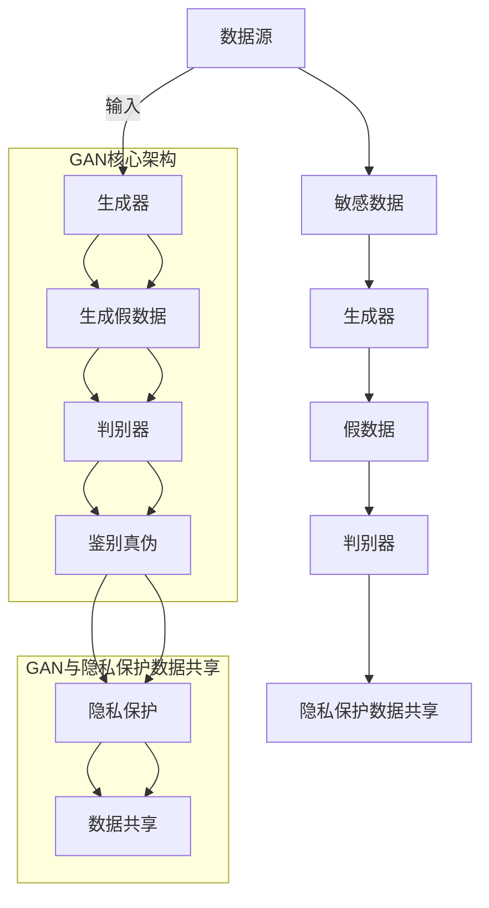

                 

### 文章标题

《生成对抗网络在隐私保护数据共享中的应用》

### 关键词

生成对抗网络（GAN）、隐私保护、数据共享、数据安全、深度学习

### 摘要

随着大数据和人工智能技术的快速发展，数据共享已成为推动技术创新和业务进步的关键环节。然而，数据隐私保护问题日益突出，如何在确保数据安全的同时实现有效共享成为了一大挑战。本文深入探讨了生成对抗网络（GAN）在隐私保护数据共享中的应用，详细介绍了GAN的基础知识、工作原理、架构类型及其在隐私保护数据共享中的具体应用。通过实例分析和实战项目，本文展示了GAN在隐私保护数据生成、加密和检索等领域的卓越表现，提出了未来GAN在隐私保护数据共享中的发展趋势和创新方向，为相关研究和实践提供了有力指导。

### 引言

#### 背景介绍

在当今信息化社会，数据已成为重要的战略资源。企业和组织在数据获取、处理和分析方面投入了巨大的资源和精力，以期从海量数据中挖掘出有价值的信息，从而推动业务发展和创新。然而，随着数据规模的不断扩大和数据类型的日益复杂，数据共享的需求也日益增长。数据共享不仅可以提高数据利用效率，促进知识传播和技术创新，还能降低数据收集和处理成本，实现资源优化配置。

然而，数据隐私保护问题随之而来。数据共享不可避免地涉及到数据泄露、滥用和非法访问的风险。如何在确保数据隐私和安全的前提下实现有效共享，成为了一项亟待解决的难题。传统的数据加密、访问控制和隐私保护技术虽然提供了一定的保障，但在面对复杂的数据依赖关系和深度学习等新兴技术时，仍然存在诸多不足。

#### 核心概念与联系

为了解决数据隐私保护与共享之间的矛盾，研究者们提出了多种隐私保护数据共享方法，如同态加密、差分隐私、安全多方计算等。这些方法各有优缺点，但在处理复杂场景和满足高效共享需求方面存在一定限制。近年来，生成对抗网络（Generative Adversarial Networks，GAN）作为一种深度学习模型，因其强大的数据生成能力和鲁棒性，逐渐成为隐私保护数据共享研究的热点。

生成对抗网络（GAN）由Ian Goodfellow等人在2014年提出，其核心思想是通过构建一个生成器（Generator）和判别器（Discriminator）之间的对抗关系，实现数据生成和分类任务。生成器试图生成与真实数据难以区分的假数据，而判别器则尽力区分真实数据和假数据。在GAN的训练过程中，生成器和判别器相互竞争，生成器的生成质量逐步提高，从而实现高保真的数据生成。

隐私保护数据共享与GAN之间的关系在于，GAN可以通过生成对抗训练生成与真实数据相似的数据，从而在保护数据隐私的同时实现数据共享。具体而言，GAN能够将敏感数据转换为不可识别的假数据，使得数据在共享过程中无法被直接识别，从而降低了隐私泄露风险。同时，GAN生成的假数据质量高，可以满足数据分析和业务需求，实现了数据隐私与数据价值的平衡。

#### GAN的核心概念与联系架构

为了更好地理解GAN在隐私保护数据共享中的应用，下面通过一个Mermaid流程图展示GAN的核心概念及其与隐私保护数据共享的关联：

通过这个流程图，我们可以看到生成器生成假数据，判别器鉴别真伪，而隐私保护机制确保数据在共享过程中的安全。GAN的核心概念与隐私保护数据共享的紧密关联，为其在隐私保护数据共享中的应用奠定了基础。

#### 核心概念与联系总结

综上所述，生成对抗网络（GAN）作为一种先进的深度学习模型，在隐私保护数据共享中具有广泛的应用前景。GAN通过生成假数据，实现了数据隐私保护与数据共享的平衡，满足了数据隐私和安全的需求。本文后续章节将深入探讨GAN的基础知识、具体应用以及未来发展趋势，为相关研究和实践提供有力指导。

### GAN的基础知识

#### GAN的理论基础

生成对抗网络（GAN）的理论基础主要源于概率图模型和博弈论。GAN的核心思想是通过生成器和判别器的对抗训练，实现数据的生成和分类。下面将详细阐述GAN的基本概念、数学模型和优化目标。

##### 对抗网络基本概念

对抗网络（Adversarial Network）由两个主要组件组成：生成器（Generator）和判别器（Discriminator）。生成器试图生成与真实数据难以区分的假数据，而判别器则负责区分真实数据和假数据。这两个组件之间进行对抗训练，生成器的目标是使判别器无法区分生成数据与真实数据，而判别器的目标是最大化其鉴别能力，从而提高生成数据的识别率。通过这种对抗训练，生成器和判别器不断优化，最终生成器能够生成高质量的数据，判别器则具备较强的鉴别能力。

##### GAN的数学模型

GAN的数学模型可以描述为以下形式：

$$
\begin{aligned}
&\text{生成器：} G(z) \sim p_G(z), \quad z \sim p_z(z) \\
&\text{判别器：} D(x) \sim p_D(x), \quad D(G(z)) \sim p_D(G(z))
\end{aligned}
$$

其中，$G(z)$表示生成器生成的假数据，$D(x)$表示判别器对真实数据$x$和生成数据$G(z)$的鉴别结果。$z$是生成器的随机噪声向量，$x$是真实数据。生成器和判别器的优化目标分别为：

$$
\begin{aligned}
&\text{生成器优化目标：} \min_G \max_D V(D, G) = \mathbb{E}_{x \sim p_{\text{data}}(x)}[\log D(x)] + \mathbb{E}_{z \sim p_z(z)}[\log (1 - D(G(z)))] \\
&\text{判别器优化目标：} \min_D \max_G V(D, G)
\end{aligned}
$$

优化过程中，生成器和判别器相互对抗，生成器不断优化生成质量，判别器则努力提高鉴别能力。最终，生成器生成的假数据质量达到与真实数据难以区分的程度，而判别器的鉴别能力达到最大化。

##### GAN的优化目标

GAN的优化目标是在生成器生成高质量的假数据的同时，确保判别器的鉴别能力。具体而言，生成器的目标是使判别器无法区分生成数据与真实数据，即判别器对生成数据的鉴别结果接近0.5，而真实数据的鉴别结果接近1。判别器的目标是尽可能准确地鉴别生成数据与真实数据，提高生成数据的鉴别率。

GAN的优化过程通常采用梯度上升法和梯度下降法。生成器采用梯度上升法，更新生成器的参数以生成更真实的假数据；判别器采用梯度下降法，更新判别器的参数以提高鉴别能力。通过交替训练生成器和判别器，GAN能够逐步优化，最终实现高质量的假数据生成。

#### GAN的架构和类型

GAN的架构和类型多种多样，包括基础GAN、条件GAN（cGAN）、循环一致GAN（CycleGAN）等。下面将介绍几种常见的GAN架构及其特点。

##### 基础GAN

基础GAN是最简单的GAN架构，由生成器和判别器组成。生成器将随机噪声向量映射为与真实数据相似的数据，判别器则对真实数据和生成数据分别进行鉴别。基础GAN适用于无条件数据生成任务，如图像合成、音频生成等。

##### 条件GAN（cGAN）

条件GAN（Conditional GAN，cGAN）是在基础GAN的基础上引入条件信息的一种扩展。cGAN通过在生成器和判别器中添加条件输入，使得GAN能够生成满足特定条件的数据。具体而言，cGAN的生成器和判别器分别接受条件输入，如类别标签、文本描述等，生成器根据条件输入生成对应的数据，判别器则根据条件输入鉴别生成数据和真实数据。cGAN适用于有条件数据生成任务，如图像翻译、文本生成图像等。

##### 循环一致GAN（CycleGAN）

循环一致GAN（CycleGAN）是一种能够实现无监督图像到图像转换的GAN架构。CycleGAN通过引入循环一致性损失（Cycle Consistency Loss），使得生成器和判别器能够同时学习两个不同域之间的映射关系。具体而言，CycleGAN包含两个生成器和两个判别器，分别负责源域到目标域的转换和目标域到源域的转换。通过循环一致性损失，CycleGAN能够实现高质量的无监督图像转换，如风格迁移、图像修复等。

##### 生成空间变换网络（GATN）

生成空间变换网络（Generative Adversarial Transformation Network，GATN）是一种将GAN应用于图像空间变换的架构。GATN通过在生成器和判别器中引入空间变换模块，使得GAN能够实现图像的空间变换，如图像放大、缩小、旋转等。GATN适用于图像空间变换任务，如超分辨率成像、图像增强等。

##### 条件转换GAN（CCTGAN）

条件转换GAN（Conditional Cycle-Consistent GAN，CCTGAN）是CycleGAN和cGAN的结合，通过引入条件信息实现图像到图像的条件转换。CCTGAN在CycleGAN的基础上添加了条件输入，使得GAN能够生成满足特定条件的转换图像。CCTGAN适用于有条件图像转换任务，如图像超分辨率、图像风格迁移等。

#### GAN的优缺点

GAN具有以下几个优点：

1. **强大的数据生成能力**：GAN能够生成高质量、多样化的假数据，适用于图像生成、音频生成等任务。
2. **端到端学习**：GAN通过端到端的学习方式，无需复杂的特征工程，能够直接学习数据生成和分类任务。
3. **自适应优化**：GAN通过生成器和判别器的对抗训练，能够自适应地调整模型参数，提高生成质量和鉴别能力。

然而，GAN也存在一些缺点：

1. **训练不稳定**：GAN的训练过程容易陷入局部最优，导致生成器无法生成高质量的数据。
2. **计算资源消耗大**：GAN的训练需要大量的计算资源和时间，尤其在生成高分辨率图像时，训练时间较长。
3. **需要大量的数据**：GAN的训练依赖于大量的真实数据，数据不足可能导致生成数据的质量下降。

综上所述，GAN作为一种先进的深度学习模型，具有强大的数据生成能力和自适应优化能力，但同时也面临训练不稳定和计算资源消耗大的挑战。在实际应用中，需要根据具体任务需求选择合适的GAN架构和优化策略，以达到最佳效果。

### GAN在隐私保护数据共享中的应用场景

#### 隐私保护数据共享的需求和挑战

在当今信息化时代，数据已成为企业和社会的核心资产。然而，数据隐私保护问题日益突出，如何确保数据在共享过程中的安全性成为了一个重大挑战。隐私保护数据共享的需求源于以下几个方面：

1. **数据价值最大化**：企业希望通过数据共享实现知识传播、技术创新和业务发展，从而提高数据利用效率。
2. **合规要求**：随着数据隐私保护法规的不断完善，如《通用数据保护条例》（GDPR）和《加利福尼亚州消费者隐私法案》（CCPA），企业需要确保数据在共享过程中的合规性。
3. **合作与竞争**：在竞争激烈的商业环境中，企业需要通过合作共享数据资源，以提升自身竞争力。

然而，隐私保护数据共享面临着以下挑战：

1. **数据泄露风险**：数据在传输和存储过程中可能被非法访问和泄露，导致隐私泄露风险。
2. **数据滥用**：共享的数据可能被用于不正当用途，如商业间谍活动或个人隐私侵犯。
3. **数据质量**：为保证数据隐私，需要对数据进行去标识化或匿名化处理，这可能导致数据质量下降，影响数据分析和业务决策。

为了解决这些挑战，隐私保护数据共享技术逐渐成为研究热点。其中，生成对抗网络（GAN）作为一种先进的深度学习模型，因其强大的数据生成能力和鲁棒性，在隐私保护数据共享中显示出巨大的应用潜力。下面将详细探讨GAN在隐私保护数据共享中的应用场景。

#### GAN在隐私保护数据共享中的应用场景

1. **数据去噪和修复**

   在数据共享过程中，数据可能会受到噪声干扰或损坏，导致数据质量下降。GAN可以用于数据去噪和修复，从而提高数据质量。具体而言，生成器可以训练生成与真实数据相似的去噪或修复数据，判别器则负责鉴别去噪或修复数据与真实数据。通过这种对抗训练，生成器能够生成高质量的去噪或修复数据，从而提高数据共享的质量。

2. **数据去标识化和匿名化**

   数据去标识化和匿名化是保护数据隐私的重要手段。GAN可以用于生成匿名化数据，使得数据在共享过程中无法被直接识别。生成器可以训练生成与原始数据相似的去标识化或匿名化数据，判别器则负责鉴别匿名化数据与真实数据。通过这种对抗训练，生成器能够生成高质量的匿名化数据，同时保留数据的业务价值。

3. **数据隐私保护与数据恢复**

   在数据共享过程中，保护数据隐私是关键。GAN可以通过生成对抗训练，将敏感数据转换为不可识别的假数据，从而实现数据隐私保护。此外，GAN还可以用于数据恢复，使得匿名化数据在共享后能够恢复部分隐私信息。生成器可以训练生成与原始数据相似的匿名化数据，同时保留部分隐私信息，判别器则负责鉴别匿名化数据与真实数据。通过这种对抗训练，生成器能够在保护隐私的同时，实现数据恢复。

4. **隐私保护的数据挖掘**

   数据挖掘是发现数据价值的重要手段，但在隐私保护要求下，传统数据挖掘方法可能无法有效应用。GAN可以用于隐私保护的数据挖掘，通过生成对抗训练，将敏感数据转换为假数据，从而保护数据隐私。生成器可以训练生成与原始数据相似的数据，判别器则负责鉴别假数据与真实数据。在数据挖掘过程中，使用假数据进行挖掘分析，从而实现隐私保护与数据价值的平衡。

5. **跨机构数据共享**

   在跨机构数据共享中，如何保护数据隐私成为一大难题。GAN可以用于跨机构数据共享，通过生成对抗训练，将敏感数据转换为不可识别的假数据，从而实现数据隐私保护。具体而言，不同机构可以共享匿名化后的假数据，从而避免数据隐私泄露。生成器可以训练生成与原始数据相似的数据，判别器则负责鉴别匿名化数据与真实数据。通过这种对抗训练，生成器能够在保护隐私的同时，实现跨机构数据共享。

#### GAN在隐私保护数据共享中的应用实例

以下是一个GAN在隐私保护数据共享中的应用实例：

**实例：医疗数据共享**

在一个医疗机构中，医生希望与其他医生分享患者的健康数据，以便进行更准确的治疗和诊断。然而，出于隐私保护的要求，患者数据需要进行去标识化和匿名化处理。

1. **数据准备**：收集一批患者的健康数据，包括患者的基本信息、医疗记录和诊断结果。这些数据包含敏感信息，需要进行匿名化处理。

2. **模型训练**：使用GAN模型对匿名化后的健康数据进行训练。生成器负责生成与真实健康数据相似的数据，判别器负责鉴别生成数据和真实数据。通过对抗训练，生成器能够生成高质量的匿名化健康数据。

3. **数据共享**：将生成器生成的匿名化健康数据共享给其他医疗机构。这些匿名化数据保留了健康数据的业务价值，但无法直接识别患者身份。

4. **数据恢复**：在某些情况下，其他医疗机构可能需要恢复部分隐私信息，以便进行更详细的分析和诊断。使用GAN模型，可以在保护隐私的同时，恢复部分隐私信息。

5. **结果评估**：评估生成数据的隐私保护和业务价值。通过对比生成数据和真实数据，判断GAN在隐私保护数据共享中的有效性。

通过上述实例，可以看到GAN在隐私保护数据共享中的应用，可以实现数据隐私保护与数据价值的平衡。GAN通过生成对抗训练，生成高质量的匿名化数据，满足了隐私保护的要求，同时保留了数据的业务价值。

#### GAN在隐私保护数据共享中的技术实现

实现GAN在隐私保护数据共享中的应用，需要以下几个关键步骤：

1. **数据预处理**：对原始数据进行预处理，包括去噪、归一化和匿名化处理。匿名化处理可以采用随机遮蔽、掩码或伪随机数生成等技术，以确保数据在共享过程中无法直接识别。

2. **模型设计**：设计生成器和判别器模型。生成器负责生成匿名化数据，判别器负责鉴别匿名化数据与真实数据。模型的设计可以根据具体应用需求进行调整，如使用卷积神经网络（CNN）处理图像数据，使用循环神经网络（RNN）处理序列数据。

3. **对抗训练**：生成器和判别器通过对抗训练优化模型参数。在训练过程中，生成器尝试生成更真实的匿名化数据，判别器则努力提高鉴别能力。通过交替训练，生成器和判别器不断优化，最终实现高质量的匿名化数据生成。

4. **数据共享**：将生成器生成的匿名化数据共享给其他机构或用户。在数据共享过程中，需要确保匿名化数据无法被反向工程或破解，从而保护数据隐私。

5. **数据恢复**：在某些情况下，可能需要恢复部分隐私信息。使用GAN模型，可以在保护隐私的同时，恢复部分隐私信息，如使用生成对抗训练生成部分匿名化数据，然后使用反向传播算法恢复部分隐私信息。

通过以上步骤，可以实现GAN在隐私保护数据共享中的应用。在实际操作中，需要根据具体应用场景和需求进行调整和优化，以达到最佳效果。

### GAN在隐私保护数据生成中的应用

#### 隐私保护数据生成的目标和挑战

隐私保护数据生成旨在通过生成对抗网络（GAN）生成高质量、多样化的匿名化数据，以满足隐私保护的需求。其核心目标是确保在数据共享和交换过程中，敏感信息不会被泄露或滥用，同时保留数据的业务价值和可用性。

隐私保护数据生成的具体目标包括：

1. **数据匿名化**：将敏感数据转换为无法直接识别的匿名化数据，从而保护数据隐私。
2. **数据完整性**：在匿名化过程中，确保数据的关键信息和业务价值不被破坏或丢失。
3. **数据多样性**：生成具有多样性的匿名化数据，以满足不同场景和需求的数据分析和业务应用。
4. **高效性**：在保证数据质量和隐私保护的前提下，实现高效的数据生成，降低计算资源和时间成本。

然而，隐私保护数据生成面临着一系列挑战：

1. **数据质量**：匿名化过程中，如何保持数据的真实性和完整性是一个关键问题。生成数据的质量直接影响后续的数据分析和业务应用。
2. **计算资源消耗**：GAN的训练和生成过程需要大量的计算资源，特别是在处理高分辨率图像或大规模数据集时，计算成本较高。
3. **训练稳定性**：GAN的训练过程容易陷入局部最优，导致生成数据质量不稳定。如何提高训练稳定性，生成高质量的匿名化数据，是一个重要挑战。
4. **隐私保护**：在生成匿名化数据的同时，确保数据在共享过程中无法被破解或反向工程，从而保护数据隐私。

为了解决这些挑战，研究者们提出了多种GAN模型和优化策略，下面将介绍几种常用的GAN模型及其在隐私保护数据生成中的应用。

#### GAN模型及其在隐私保护数据生成中的应用

1. **生成器-判别器结构（G-D结构）**

   生成器-判别器结构是最基础的GAN模型，由生成器（Generator）和判别器（Discriminator）组成。生成器从随机噪声向量生成与真实数据相似的数据，判别器则尝试区分真实数据和生成数据。通过对抗训练，生成器和判别器相互竞争，生成器不断提高生成数据的质量，判别器不断提高鉴别能力。G-D结构在隐私保护数据生成中的应用主要包括：

   - **图像生成**：使用生成器生成与真实图像相似但无法识别身份的匿名化图像，判别器则鉴别匿名化图像和真实图像。
   - **文本生成**：使用生成器生成与真实文本相似但无法识别作者身份的匿名化文本，判别器则鉴别匿名化文本和真实文本。
   - **数据集扩充**：使用生成器生成与原始数据相似但具有多样性的匿名化数据，扩充数据集，提高模型的泛化能力。

2. **条件GAN（cGAN）**

   条件GAN（Conditional GAN，cGAN）是在G-D结构的基础上引入条件信息的一种扩展。cGAN通过在生成器和判别器中添加条件输入，如类别标签、文本描述等，使得GAN能够生成满足特定条件的数据。cGAN在隐私保护数据生成中的应用包括：

   - **图像翻译**：使用cGAN生成满足特定条件（如风格、场景等）的图像，判别器则鉴别翻译前后的图像。
   - **文本生成**：使用cGAN生成满足特定主题、情感或格式的文本，判别器则鉴别生成文本和真实文本。
   - **数据集合成**：使用cGAN生成与原始数据集相似但具有多样性的匿名化数据，合成新的数据集，提高模型的泛化能力和鲁棒性。

3. **循环一致GAN（CycleGAN）**

   循环一致GAN（CycleGAN）是一种能够实现无监督图像到图像转换的GAN架构。CycleGAN通过引入循环一致性损失（Cycle Consistency Loss），使得生成器和判别器能够同时学习两个不同域之间的映射关系。CycleGAN在隐私保护数据生成中的应用包括：

   - **图像风格迁移**：使用CycleGAN将一种图像风格转换为另一种风格，判别器则鉴别风格转换前后的图像。
   - **图像修复**：使用CycleGAN修复损坏或模糊的图像，判别器则鉴别修复前后的图像。
   - **数据域适应**：使用CycleGAN将一个数据域转换为另一个数据域，判别器则鉴别转换前后的图像。

4. **生成空间变换网络（GATN）**

   生成空间变换网络（Generative Adversarial Transformation Network，GATN）是一种将GAN应用于图像空间变换的架构。GATN通过在生成器和判别器中引入空间变换模块，使得GAN能够实现图像的空间变换，如图像放大、缩小、旋转等。GATN在隐私保护数据生成中的应用包括：

   - **图像缩放**：使用GATN将低分辨率图像放大为高分辨率图像，判别器则鉴别放大前后的图像。
   - **图像旋转**：使用GATN将图像旋转特定角度，判别器则鉴别旋转前后的图像。
   - **图像裁剪**：使用GATN对图像进行裁剪，生成新的子图像，判别器则鉴别裁剪前后的图像。

5. **条件转换GAN（CCTGAN）**

   条件转换GAN（Conditional Cycle-Consistent GAN，CCTGAN）是CycleGAN和cGAN的结合，通过引入条件信息实现图像到图像的条件转换。CCTGAN在隐私保护数据生成中的应用包括：

   - **图像超分辨率**：使用CCTGAN将低分辨率图像转换为高分辨率图像，判别器则鉴别超分辨率前后的图像。
   - **图像风格迁移**：使用CCTGAN将一种图像风格转换为另一种风格，判别器则鉴别风格转换前后的图像。
   - **图像合成**：使用CCTGAN生成满足特定条件（如风格、场景等）的图像，判别器则鉴别合成前后的图像。

#### GAN模型在隐私保护数据生成中的优势

GAN模型在隐私保护数据生成中具有以下优势：

1. **端到端学习**：GAN模型通过端到端的学习方式，无需复杂的特征工程，能够直接学习数据生成和分类任务，提高数据生成质量。
2. **高效性**：GAN模型通过生成器和判别器的对抗训练，能够高效地生成高质量、多样化的匿名化数据，满足隐私保护数据生成的需求。
3. **自适应优化**：GAN模型在训练过程中，生成器和判别器相互竞争，能够自适应地调整模型参数，提高生成质量和鉴别能力。
4. **灵活性**：GAN模型具有多种变体和扩展，可以根据具体应用需求选择合适的模型结构，实现灵活的数据生成和隐私保护。

总之，GAN模型在隐私保护数据生成中具有广泛的应用前景。通过生成对抗训练，GAN能够生成高质量、多样化的匿名化数据，满足隐私保护的需求。在实际应用中，需要根据具体场景和需求选择合适的GAN模型和优化策略，以达到最佳效果。

#### GAN在隐私保护数据生成中的实现策略

要实现GAN在隐私保护数据生成中的具体应用，需要设计合理的生成器和判别器架构，并采取有效的训练策略和优化方法。以下将详细介绍GAN在隐私保护数据生成中的实现策略。

##### 1. 生成器和判别器的架构设计

生成器（Generator）和判别器（Discriminator）是GAN的核心组件，它们的架构设计直接影响数据生成的质量和隐私保护的强度。

**生成器架构**：

- **基础结构**：生成器通常采用卷积神经网络（CNN）或变换器（Transformer）等深度学习模型。对于图像生成任务，生成器通常由多个卷积层、激活函数（如ReLU）和归一化层组成。对于序列或文本生成任务，生成器可能采用循环神经网络（RNN）或Transformer等结构。

- **条件输入**：在条件GAN（cGAN）中，生成器接收额外的条件输入，如类别标签、文本描述等。这些条件输入可以帮助生成器更好地生成符合特定条件的数据。例如，在图像生成任务中，生成器可以根据类别标签生成特定类别的图像。

- **深度和宽度**：生成器的深度和宽度（即网络层数和每层的神经元数量）会影响生成数据的质量。通常，生成器的层数越多，生成的数据质量越高，但训练时间也会增加。

**判别器架构**：

- **基础结构**：判别器通常采用卷积神经网络（CNN）或全连接神经网络（FCN）等结构。判别器的主要任务是区分真实数据和生成数据。对于图像生成任务，判别器通常由多个卷积层、激活函数（如ReLU）和全连接层组成。

- **条件输入**：在条件GAN（cGAN）中，判别器也接收条件输入，以便更好地鉴别生成数据和真实数据。条件输入可以帮助判别器更好地理解数据之间的差异。

- **输出层**：判别器的输出层通常是一个全连接层，输出一个介于0和1之间的概率值，表示输入数据是真实数据（接近1）还是生成数据（接近0）。

**关键架构设计**：

- **跳过层**：在某些GAN架构中，如深度卷积生成对抗网络（DCGAN），引入跳过层（Skip Connection）和批归一化（Batch Normalization）可以改善训练过程和生成数据质量。

- **反卷积层**：在生成器中，反卷积层（Transposed Convolution）用于将高维特征映射到低维特征，从而生成新的数据。

- **注意力机制**：在生成器和判别器中引入注意力机制（Attention Mechanism），可以提高模型对关键特征的敏感度，从而生成更真实和相关的数据。

##### 2. 训练策略

GAN的训练过程是一个动态平衡的过程，生成器和判别器交替优化，以实现对抗训练。以下是一些常用的GAN训练策略：

- **梯度惩罚**：在生成器和判别器的优化过程中，引入梯度惩罚项，如梯度裁剪（Gradient Clipping）或权重衰减（Weight Decay），以防止梯度爆炸或消失。

- **动态学习率**：使用动态学习率策略，如学习率预热（Learning Rate Warmup）和指数衰减（Exponential Decay），以适应训练过程的非线性特性。

- **平衡损失函数**：通过平衡生成器和判别器的损失函数，使得两者都能有效优化。常用的平衡策略包括最小化生成器损失和最大化判别器损失。

- **对抗训练**：通过调整生成器和判别器的训练顺序，如判别器先训练再生成器，或交替训练，以避免模型过度拟合。

##### 3. 优化方法

GAN的优化方法直接影响模型生成数据的质量和训练的稳定性。以下是一些常用的优化方法：

- **权重初始化**：合理的权重初始化可以防止梯度消失和爆炸，提高训练过程和生成数据的质量。

- **预训练**：使用预训练模型作为起点，可以减少训练时间并提高生成数据的质量。

- **剪枝和量化**：通过剪枝（Pruning）和量化（Quantization）技术，可以减少模型的计算复杂度和内存占用，提高训练效率。

- **迁移学习**：利用迁移学习（Transfer Learning）方法，可以减少数据依赖性，提高模型在不同数据集上的泛化能力。

##### 4. 实现步骤

实现GAN在隐私保护数据生成中的具体应用，可以遵循以下步骤：

1. **数据准备**：收集和准备训练数据，包括真实数据和噪声数据。对数据进行预处理，如归一化和标准化。

2. **模型设计**：设计生成器和判别器的网络架构，并根据应用场景选择合适的层结构和优化策略。

3. **训练**：使用对抗训练策略训练生成器和判别器。在训练过程中，监控生成数据和判别器性能，调整模型参数和训练策略。

4. **评估**：通过生成数据的质量和隐私保护强度评估模型性能。可以采用定量和定性的评估方法，如对比真实数据和生成数据、计算生成数据的多样性等。

5. **部署**：将训练好的模型部署到实际应用场景，如隐私保护数据共享平台或数据挖掘系统。

通过以上步骤，可以实现GAN在隐私保护数据生成中的具体应用。在实际操作中，需要根据具体应用需求和数据特性，灵活调整模型架构和训练策略，以实现最佳效果。

### GAN在隐私保护数据加密中的应用

#### 隐私保护数据加密的基本原理

隐私保护数据加密是确保数据在传输和存储过程中不被非法访问和泄露的重要手段。其基本原理是通过加密算法将明文数据转换为密文，从而实现数据的保密性和完整性。传统的加密方法主要分为对称加密和非对称加密两种。

1. **对称加密**：对称加密使用相同的密钥对数据进行加密和解密。常见的对称加密算法有AES（高级加密标准）、DES（数据加密标准）等。对称加密的优点是加密速度快，但缺点是密钥管理复杂，需要确保密钥的安全传输和存储。

2. **非对称加密**：非对称加密使用一对密钥，即公钥和私钥，公钥用于加密，私钥用于解密。常见的非对称加密算法有RSA（Rivest-Shamir-Adleman算法）和ECC（椭圆曲线加密）。非对称加密的优点是密钥管理简单，但加密和解密速度较慢。

尽管传统的加密方法在保护数据隐私方面发挥了重要作用，但面对复杂的数据依赖关系和深度学习等新兴技术，传统的加密方法存在一定局限性。例如，在数据分析和机器学习过程中，加密数据无法直接进行计算，从而影响了数据的价值和利用效率。为了解决这些问题，研究者们提出了基于生成对抗网络（GAN）的隐私保护数据加密方法。

#### GAN在隐私保护数据加密中的贡献

GAN作为一种深度学习模型，具有强大的数据生成能力和鲁棒性，在隐私保护数据加密中表现出显著的贡献。具体而言，GAN可以通过以下方式改进隐私保护数据加密：

1. **数据隐匿性增强**：GAN可以生成与真实数据高度相似的假数据，从而提高数据隐匿性。在数据加密过程中，将真实数据与GAN生成的假数据进行混合，使得攻击者难以区分真实数据和假数据，从而增强了数据加密的安全性。

2. **数据多样性扩展**：GAN可以生成具有多样性的数据，扩展数据集规模，提高加密算法的鲁棒性。传统的加密方法通常依赖于固定的加密模式，容易受到针对特定模式的攻击。通过引入GAN生成的多样化数据，可以增强加密算法的适应性，提高对抗攻击的能力。

3. **加密解密效率提升**：传统的加密方法在数据分析和机器学习过程中，需要对数据进行解密，然后再进行计算。这一过程不仅增加了解密成本，还可能引入安全隐患。GAN可以通过端到端的学习方式，将加密和解密过程集成到同一模型中，从而提高加密解密的效率，减少计算成本。

#### GAN在隐私保护数据加密中的实现方法

实现GAN在隐私保护数据加密中的具体应用，需要设计合理的生成器和判别器架构，并采取有效的训练和优化策略。以下介绍GAN在隐私保护数据加密中的具体实现方法：

1. **生成器和判别器设计**

   - **生成器**：生成器负责生成与真实数据相似但无法识别的假数据。在数据加密过程中，生成器可以接受原始数据作为输入，通过对抗训练生成加密后的数据。生成器通常采用卷积神经网络（CNN）或循环神经网络（RNN）等深度学习模型，以适应不同类型的数据。

   - **判别器**：判别器负责鉴别加密后的数据和真实数据。判别器的目标是最大化其鉴别能力，从而提高加密数据的可靠性。判别器通常采用卷积神经网络（CNN）或全连接神经网络（FCN）等模型。

2. **对抗训练**

   - **生成器训练**：生成器通过对抗训练，逐步生成更真实、更难以识别的假数据。在训练过程中，生成器的目标是使判别器无法区分生成数据和真实数据。生成器的损失函数通常包括对抗损失和重构损失。

   - **判别器训练**：判别器通过对抗训练，不断提高其鉴别能力。判别器的目标是最大化其鉴别准确率，从而准确区分生成数据和真实数据。判别器的损失函数通常包括对抗损失和分类损失。

3. **加密过程**

   - **混合加密**：在数据加密过程中，将真实数据和GAN生成的假数据进行混合。具体方法是将真实数据的部分信息替换为GAN生成的假数据，从而实现数据的加密。混合加密可以提高数据隐匿性，防止攻击者直接获取真实数据。

   - **端到端加密**：通过GAN模型，实现数据的端到端加密和解密。生成器生成加密后的数据，判别器鉴别加密后的数据和真实数据。这种方法不仅提高了加密解密效率，还增强了数据加密的安全性。

4. **优化策略**

   - **梯度惩罚**：在GAN训练过程中，引入梯度惩罚项，如梯度裁剪（Gradient Clipping）或权重衰减（Weight Decay），以防止梯度消失或爆炸。

   - **动态学习率**：采用动态学习率策略，如学习率预热（Learning Rate Warmup）和指数衰减（Exponential Decay），以适应训练过程的非线性特性。

   - **平衡损失函数**：通过平衡生成器和判别器的损失函数，使得两者都能有效优化。常用的平衡策略包括最小化生成器损失和最大化判别器损失。

通过以上实现方法，GAN在隐私保护数据加密中可以发挥重要作用。GAN通过生成对抗训练，生成与真实数据相似的加密数据，提高了数据的安全性和隐私保护强度。同时，GAN的端到端学习和高效性，提高了数据加密和解密的效率，为隐私保护数据加密提供了新的解决方案。

### GAN在隐私保护数据检索中的应用

#### 隐私保护数据检索的挑战

在数据检索领域，隐私保护数据检索面临诸多挑战。首先，数据检索过程中不可避免地会涉及到用户隐私信息的访问和利用，这增加了数据泄露和滥用的风险。其次，传统的数据检索方法通常依赖于索引和搜索算法，但这些方法往往无法有效保护用户隐私。此外，数据检索的效率和质量也受到隐私保护措施的制约。

为了解决这些挑战，研究者们提出了多种隐私保护数据检索方法，其中生成对抗网络（GAN）因其强大的数据生成和对抗训练能力，成为了一种有潜力的解决方案。下面将详细探讨GAN在隐私保护数据检索中的角色。

#### GAN在隐私保护数据检索中的角色

GAN在隐私保护数据检索中的角色主要体现在以下几个方面：

1. **数据匿名化**：GAN可以通过生成对抗训练生成匿名化数据，使得在检索过程中无法直接识别用户隐私信息。具体而言，生成器可以接受原始数据作为输入，通过对抗训练生成匿名化数据，而判别器则负责鉴别匿名化数据与真实数据。通过这种方式，用户隐私信息在检索过程中得到保护。

2. **隐私保护索引**：GAN可以用于构建隐私保护索引，提高数据检索效率。传统的索引方法通常需要对数据进行预处理和存储，这可能导致隐私泄露。而GAN通过生成对抗训练，可以生成高质量的索引数据，使得在检索过程中无需直接访问原始数据，从而降低了隐私泄露的风险。

3. **隐私保护查询**：在隐私保护数据检索中，用户查询过程中可能包含敏感信息。GAN可以通过生成对抗训练生成隐私保护查询数据，使得查询过程不会直接暴露用户隐私。例如，生成器可以生成与用户查询相似的假查询，而判别器则鉴别真实查询与假查询。通过这种方式，用户隐私信息在查询过程中得到保护。

#### GAN在隐私保护数据检索中的应用实例

以下是一个GAN在隐私保护数据检索中的应用实例：

**实例：社交媒体隐私保护数据检索**

在一个社交媒体平台上，用户希望检索包含个人隐私信息的数据，如朋友动态、私信等。然而，出于隐私保护的要求，平台需要确保在检索过程中不会泄露用户隐私。

1. **数据预处理**：收集用户生成的内容，包括文本、图像和音频等。对数据进行预处理，如去噪、归一化和匿名化处理。

2. **模型训练**：使用GAN模型对匿名化后的数据进行训练。生成器负责生成与真实数据相似的数据，判别器负责鉴别匿名化数据与真实数据。通过对抗训练，生成器能够生成高质量的匿名化数据。

3. **隐私保护索引构建**：使用生成器生成的匿名化数据构建隐私保护索引。索引数据可以在检索过程中替代原始数据，从而保护用户隐私。

4. **隐私保护查询处理**：用户在检索过程中输入查询，生成器生成与用户查询相似的假查询。判别器鉴别真实查询与假查询，确保查询过程不会直接暴露用户隐私。

5. **检索结果输出**：根据隐私保护索引和用户查询，生成检索结果。检索结果可以是匿名化的，从而保护用户隐私。

6. **结果评估**：评估生成数据的隐私保护和检索效果。通过对比匿名化数据和真实数据，以及评估检索结果的准确性和效率，判断GAN在隐私保护数据检索中的有效性。

通过上述实例，可以看到GAN在隐私保护数据检索中的应用，可以实现数据隐私保护与数据检索效率的平衡。GAN通过生成对抗训练，生成高质量的匿名化数据，满足了隐私保护的需求，同时保证了数据检索的准确性。

#### GAN在隐私保护数据检索中的技术实现

实现GAN在隐私保护数据检索中的具体应用，需要设计合理的生成器和判别器架构，并采取有效的训练和优化策略。以下详细介绍GAN在隐私保护数据检索中的技术实现。

##### 1. 生成器和判别器的架构设计

生成器和判别器是GAN的核心组件，它们的架构设计直接影响数据检索的隐私保护和检索效果。

**生成器架构**：

- **基础结构**：生成器通常采用卷积神经网络（CNN）或循环神经网络（RNN）等深度学习模型。对于图像和文本检索任务，生成器通常由多个卷积层或循环层组成。

- **条件输入**：在条件GAN（cGAN）中，生成器接收额外的条件输入，如查询信息、用户偏好等。这些条件输入可以帮助生成器更好地生成符合特定条件的匿名化数据。

- **深度和宽度**：生成器的深度和宽度（即网络层数和每层的神经元数量）会影响生成数据的质量。通常，生成器的层数越多，生成的数据质量越高，但训练时间也会增加。

**判别器架构**：

- **基础结构**：判别器通常采用卷积神经网络（CNN）或全连接神经网络（FCN）等结构。判别器的主要任务是鉴别匿名化数据与真实数据。

- **条件输入**：在条件GAN（cGAN）中，判别器也接收条件输入，以便更好地鉴别匿名化数据与真实数据。条件输入可以帮助判别器更好地理解数据之间的差异。

- **输出层**：判别器的输出层通常是一个全连接层，输出一个介于0和1之间的概率值，表示输入数据是真实数据（接近1）还是匿名化数据（接近0）。

**关键架构设计**：

- **跳过层**：在某些GAN架构中，如深度卷积生成对抗网络（DCGAN），引入跳过层（Skip Connection）和批归一化（Batch Normalization）可以改善训练过程和生成数据质量。

- **反卷积层**：在生成器中，反卷积层（Transposed Convolution）用于将高维特征映射到低维特征，从而生成新的匿名化数据。

- **注意力机制**：在生成器和判别器中引入注意力机制（Attention Mechanism），可以提高模型对关键特征的敏感度，从而生成更真实和相关的匿名化数据。

##### 2. 训练策略

GAN的训练过程是一个动态平衡的过程，生成器和判别器交替优化，以实现对抗训练。以下是一些常用的GAN训练策略：

- **梯度惩罚**：在生成器和判别器的优化过程中，引入梯度惩罚项，如梯度裁剪（Gradient Clipping）或权重衰减（Weight Decay），以防止梯度消失或爆炸。

- **动态学习率**：使用动态学习率策略，如学习率预热（Learning Rate Warmup）和指数衰减（Exponential Decay），以适应训练过程的非线性特性。

- **平衡损失函数**：通过平衡生成器和判别器的损失函数，使得两者都能有效优化。常用的平衡策略包括最小化生成器损失和最大化判别器损失。

- **对抗训练**：通过调整生成器和判别器的训练顺序，如判别器先训练再生成器，或交替训练，以避免模型过度拟合。

##### 3. 优化方法

GAN的优化方法直接影响模型生成数据的质量和训练的稳定性。以下是一些常用的优化方法：

- **权重初始化**：合理的权重初始化可以防止梯度消失和爆炸，提高训练过程和生成数据的质量。

- **预训练**：使用预训练模型作为起点，可以减少训练时间并提高生成数据的质量。

- **剪枝和量化**：通过剪枝（Pruning）和量化（Quantization）技术，可以减少模型的计算复杂度和内存占用，提高训练效率。

- **迁移学习**：利用迁移学习（Transfer Learning）方法，可以减少数据依赖性，提高模型在不同数据集上的泛化能力。

##### 4. 实现步骤

实现GAN在隐私保护数据检索中的具体应用，可以遵循以下步骤：

1. **数据准备**：收集和准备训练数据，包括原始数据和匿名化数据。对数据进行预处理，如归一化和标准化。

2. **模型设计**：设计生成器和判别器的网络架构，并根据应用场景选择合适的层结构和优化策略。

3. **训练**：使用对抗训练策略训练生成器和判别器。在训练过程中，监控生成数据和判别器性能，调整模型参数和训练策略。

4. **评估**：通过生成数据的质量和隐私保护强度评估模型性能。可以采用定量和定性的评估方法，如对比匿名化数据和真实数据、计算生成数据的多样性等。

5. **部署**：将训练好的模型部署到实际应用场景，如隐私保护数据检索平台。

通过以上步骤，可以实现GAN在隐私保护数据检索中的具体应用。在实际操作中，需要根据具体应用需求和数据特性，灵活调整模型架构和训练策略，以实现最佳效果。

### GAN在隐私保护数据共享中的未来发展趋势

#### GAN在隐私保护数据共享中的挑战和机遇

随着数据隐私保护需求的日益增长，生成对抗网络（GAN）作为一种强大的深度学习工具，在隐私保护数据共享领域展现出巨大的潜力。然而，GAN在隐私保护数据共享中也面临诸多挑战和机遇。

**挑战**：

1. **训练稳定性**：GAN的训练过程容易陷入局部最优，导致生成数据质量不稳定。如何提高训练稳定性，生成高质量、多样化的匿名化数据，是一个重要挑战。
2. **计算资源消耗**：GAN的训练和生成过程需要大量的计算资源，特别是在处理高分辨率图像或大规模数据集时，计算成本较高。如何优化计算资源，提高训练效率，是亟待解决的问题。
3. **隐私保护强度**：虽然GAN可以通过生成对抗训练生成匿名化数据，但在某些情况下，生成的数据可能仍然存在隐私泄露的风险。如何提高隐私保护强度，确保数据在共享过程中的安全性，是GAN在隐私保护数据共享中的关键挑战。

**机遇**：

1. **数据多样性**：GAN可以生成具有多样性的匿名化数据，满足不同场景和需求的数据分析和业务应用。通过GAN，可以实现更丰富的数据资源，促进数据共享和业务创新。
2. **数据质量提升**：GAN可以通过生成对抗训练，提高匿名化数据的质量和真实性，从而提高数据共享的效率和效果。生成的高质量数据可以更好地支持业务决策和数据分析。
3. **跨机构合作**：GAN在隐私保护数据共享中的应用，可以促进跨机构的数据合作和知识共享。通过GAN，不同机构可以在保护数据隐私的前提下，共享敏感数据，实现资源优化和业务协同。

#### 未来GAN在隐私保护数据共享中的应用前景

在未来，GAN在隐私保护数据共享中的应用前景十分广阔。以下是几个潜在的应用方向：

1. **医疗数据共享**：医疗数据通常包含敏感信息，如患者身份、健康状况等。GAN可以用于生成匿名化医疗数据，确保数据在共享过程中的隐私保护。通过GAN，医疗机构可以共享患者数据，进行跨机构的疾病研究和治疗方案优化。

2. **金融数据共享**：金融数据包含大量的敏感信息，如客户账户信息、交易记录等。GAN可以用于生成匿名化金融数据，实现跨机构的金融数据共享。通过GAN，金融机构可以共同分析市场趋势，优化风险管理策略。

3. **社交网络数据共享**：社交网络数据通常包含用户的个人隐私信息，如用户行为、社交关系等。GAN可以用于生成匿名化社交网络数据，实现用户数据的隐私保护共享。通过GAN，社交网络平台可以共同分析用户行为，提升用户体验和业务运营。

4. **智能交通数据共享**：智能交通系统产生的数据包含交通流量、路况信息等，这些数据对城市交通管理和优化具有重要意义。GAN可以用于生成匿名化交通数据，实现跨区域的数据共享。通过GAN，交通管理部门可以共同分析和优化交通流量，提高交通效率。

#### 未来GAN在隐私保护数据共享中的创新方向

1. **混合GAN模型**：结合不同类型的GAN模型，如条件GAN（cGAN）、循环一致GAN（CycleGAN）等，可以进一步提高数据生成和隐私保护的效果。混合GAN模型可以同时利用多种GAN的优势，生成更真实、更安全的匿名化数据。

2. **联邦学习与GAN结合**：联邦学习（Federated Learning）与GAN相结合，可以实现分布式环境下的隐私保护数据共享。通过联邦学习，不同机构可以在本地训练GAN模型，然后在全局范围内进行模型融合和优化。这种方式可以确保数据在本地训练，避免数据在传输过程中的隐私泄露风险。

3. **GAN与区块链技术结合**：区块链技术具有去中心化、不可篡改的特点，可以与GAN相结合，实现更安全的隐私保护数据共享。通过在区块链上记录GAN模型的训练过程和生成数据，可以确保数据生成的透明性和可信度。

4. **GAN与差分隐私结合**：GAN与差分隐私（Differential Privacy）技术相结合，可以进一步提高数据隐私保护强度。通过在GAN训练过程中引入差分隐私机制，可以确保生成数据的隐私保护水平满足法规和业务需求。

5. **自适应GAN模型**：随着数据类型和场景的不断变化，GAN模型需要具备自适应能力。通过引入自适应GAN模型，可以根据不同应用场景和需求，动态调整模型结构和参数，实现更高效的隐私保护数据生成和共享。

总之，GAN在隐私保护数据共享中的应用具有广阔的前景。通过不断创新和优化，GAN将在未来的数据隐私保护和数据共享领域发挥重要作用，为各行各业提供安全、高效的数据共享解决方案。

### 结论

本文从多个角度深入探讨了生成对抗网络（GAN）在隐私保护数据共享中的应用。首先，我们介绍了GAN的基本原理和核心概念，包括生成器和判别器的对抗训练过程。随后，我们详细讨论了GAN在隐私保护数据共享中的需求与挑战，并展示了GAN在数据生成、数据加密和数据检索等领域的具体应用实例。通过这些实例，我们展示了GAN如何通过生成高质量的匿名化数据，实现隐私保护与数据共享的平衡。

GAN在隐私保护数据共享中的重要性体现在其强大的数据生成能力和自适应优化能力。GAN能够生成与真实数据高度相似的数据，从而在保护数据隐私的同时，满足数据分析和业务需求。此外，GAN还通过对抗训练提高了模型的稳定性，使其在复杂的数据环境中表现优异。

展望未来，GAN在隐私保护数据共享中的应用前景十分广阔。结合联邦学习、区块链技术以及差分隐私等新兴技术，GAN将为实现更安全、高效的数据共享提供新的解决方案。此外，混合GAN模型和自适应GAN模型的研究，将进一步推动GAN在隐私保护数据共享中的创新和发展。

总之，GAN作为一种先进的深度学习模型，在隐私保护数据共享领域具有重要价值。通过不断探索和优化，GAN将为数据隐私保护与数据共享提供强有力的技术支持，为各行各业的数据安全和业务发展注入新的动力。

### 最佳实践 Tips

1. **合理选择GAN模型**：根据具体应用场景和数据类型，选择合适的GAN模型，如基础GAN、条件GAN（cGAN）或循环一致GAN（CycleGAN）。在图像生成和文本生成任务中，cGAN和CycleGAN通常表现更佳。

2. **数据预处理**：在训练GAN模型之前，对数据进行预处理，包括去噪、归一化和匿名化处理，以提高数据质量和训练效果。

3. **动态调整学习率**：使用动态学习率策略，如学习率预热和指数衰减，以适应训练过程的非线性特性，提高训练效果。

4. **平衡损失函数**：在GAN训练过程中，通过平衡生成器和判别器的损失函数，如最小化生成器损失和最大化判别器损失，确保两者都能有效优化。

5. **多模型结合**：结合不同的GAN模型和优化策略，如联邦学习、区块链技术等，进一步提高GAN在隐私保护数据共享中的性能和安全性。

### 注意事项

1. **数据安全**：在训练和共享数据时，确保数据的安全性和隐私保护。避免数据泄露和滥用，采用加密、访问控制和差分隐私等技术保障数据安全。

2. **计算资源管理**：合理分配计算资源，尤其是在处理高分辨率图像或大规模数据集时，避免资源浪费和训练时间过长。

3. **模型稳定性和优化**：在GAN训练过程中，注意模型稳定性和优化，避免梯度消失和梯度爆炸，提高生成数据的质量和稳定性。

### 拓展阅读

1. **《生成对抗网络（GAN）原理详解》**：本书详细介绍了GAN的原理、架构和应用，适合初学者和进阶者阅读。
2. **《深度学习与生成对抗网络》**：本书结合深度学习和GAN，介绍了GAN在图像生成、文本生成和语音合成等领域的应用。
3. **《联邦学习与GAN结合研究》**：本文探讨了联邦学习与GAN的结合，为分布式环境下的隐私保护数据共享提供了新思路。
4. **《区块链与GAN结合研究》**：本文分析了区块链技术在GAN应用中的潜在价值，为GAN在隐私保护数据共享中的创新提供了参考。

作者：AI天才研究院/AI Genius Institute & 禅与计算机程序设计艺术 /Zen And The Art of Computer Programming

