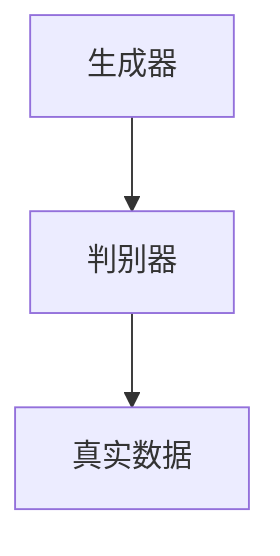
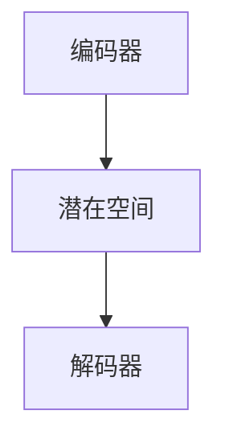

                 

# 生成式AI在商业应用中的潜力与局限

## 关键词

- 生成式AI
- 商业应用
- 潜力
- 局限
- 数据隐私
- 伦理问题
- 技术挑战

## 摘要

生成式AI作为一种前沿技术，其在商业应用中展现出巨大的潜力和广泛的前景。本文将从生成式AI的基础、图像与视频生成、自然语言处理以及其他商业应用领域展开讨论，详细分析其在商业应用中的潜力与局限。同时，本文也将探讨数据隐私与伦理问题，以及生成式AI面临的技术挑战，为未来的发展方向提供思考。

## 目录

1. **生成式AI基础** <a id="base"></a>
   1.1 生成式AI概述
   1.2 生成式AI核心技术
      1.2.1 生成对抗网络（GAN）
      1.2.2 变分自编码器（VAE）
      1.2.3 其他生成式模型
   1.3 生成式模型的发展趋势

2. **生成式AI在商业应用中的潜力** <a id="potential"></a>
   2.1 图像与视频生成
      2.1.1 图像生成应用案例
      2.1.2 视频生成应用案例
   2.2 自然语言处理
      2.2.1 文本生成应用案例
      2.2.2 语音生成应用案例
   2.3 其他商业应用领域
      2.3.1 医疗领域
      2.3.2 金融领域

3. **生成式AI在商业应用中的局限** <a id="limitations"></a>
   3.1 数据隐私与伦理问题
   3.2 技术挑战与局限性

4. **未来展望** <a id="future"></a>
   4.1 发展趋势
   4.2 商业应用建议

## 第一部分：生成式AI基础

### 1.1 生成式AI概述

生成式AI（Generative AI）是一种人工智能技术，它能够创建新的、类似原有数据的内容。与判别式AI（Discriminative AI）不同，生成式AI旨在生成新的数据，而不仅仅是区分已有数据的不同类别。生成式AI在图像、文本、音频等领域有着广泛的应用，特别是在商业环境中。

生成式AI的起源可以追溯到20世纪80年代，当时提出了生成对抗网络（GAN）的概念。随着时间的推移，生成式AI经历了多次迭代和改进，包括变分自编码器（VAE）和流模型等。这些技术的出现使得生成式AI在生成高质量图像、文本和音频方面取得了显著进展。

### 1.2 生成式AI核心技术

#### 1.2.1 生成对抗网络（GAN）

生成对抗网络（GAN）是由生成器（Generator）和判别器（Discriminator）组成的。生成器负责生成与真实数据相似的新数据，而判别器则负责区分生成器和真实数据。通过两个网络的对抗训练，生成器逐渐提高生成数据的真实度，而判别器则逐渐提高区分能力。GAN的架构如图1所示。



#### 1.2.2 变分自编码器（VAE）

变分自编码器（VAE）是一种基于概率模型的生成模型。它由编码器（Encoder）和解码器（Decoder）组成。编码器将输入数据映射到一个潜在空间，而解码器则从潜在空间中生成输出数据。VAE的架构如图2所示。



#### 1.2.3 其他生成式模型

除了GAN和VAE，还有其他一些生成式模型，如流模型（Flow Models）和预训练语言模型（Pre-trained Language Models）。流模型通过将生成问题转化为概率分布估计问题，从而生成高质量的数据。预训练语言模型（如GPT系列）则在自然语言处理领域取得了显著的成果，能够生成流畅且符合语法规则的自然语言文本。

### 1.3 生成式模型的发展趋势

随着技术的不断进步，生成式AI在模型结构、训练算法和数据集等方面都取得了显著的进展。未来的发展可能会集中在以下几个方面：

1. **更高效的训练算法**：如自监督学习（Self-Supervised Learning）和迁移学习（Transfer Learning），可以显著提高生成式模型的训练效率。
2. **更广泛的适用领域**：生成式AI的应用将不再局限于图像和文本，还将扩展到音频、视频和其他复杂数据类型。
3. **更好的生成质量**：随着模型复杂度和数据集规模的增长，生成式模型的生成质量将不断提高，从而更好地满足商业需求。

## 第二部分：生成式AI在商业应用中的潜力

### 2.1 图像与视频生成

#### 2.1.1 图像生成应用案例

图像生成在商业应用中具有广泛的应用前景。例如，在广告行业中，生成式AI可以用于生成具有吸引力的产品图像，从而提高广告效果。在医疗领域，生成式AI可以用于生成医学图像，辅助医生进行诊断和治疗。

以下是一个简单的Python代码示例，展示了如何使用生成对抗网络（GAN）生成图像：

```python
import tensorflow as tf
from tensorflow.keras.models import Sequential
from tensorflow.keras.layers import Dense, Flatten

# 定义生成器模型
generator = Sequential([
    Dense(128, activation='relu', input_shape=(100,)),
    Dense(256, activation='relu'),
    Dense(512, activation='relu'),
    Dense(1024, activation='relu'),
    Flatten(),
    Dense(784, activation='tanh')
])

# 定义判别器模型
discriminator = Sequential([
    Flatten(input_shape=(28, 28)),
    Dense(512, activation='relu'),
    Dense(256, activation='relu'),
    Dense(128, activation='relu'),
    Dense(1, activation='sigmoid')
])

# 定义GAN模型
gan = Sequential([
    generator,
    discriminator
])

# 编译模型
discriminator.compile(optimizer='adam', loss='binary_crossentropy')
gan.compile(optimizer='adam', loss='binary_crossentropy')

# 训练模型
train_dataset = tf.data.Dataset.from_tensor_slices((x_train, y_train))
train_dataset = train_dataset.shuffle(buffer_size=1024).batch(128)

for epoch in range(50):
    for x, _ in train_dataset:
        noise = np.random.normal(0, 1, (x.shape[0], 100))
        generated_images = generator.predict(noise)
        real_images = x[:batch_size]
        labels_real = np.array([1] * batch_size)
        labels_fake = np.array([0] * batch_size)
        discriminator.train_on_batch([real_images, generated_images], labels_real + labels_fake)
        noise = np.random.normal(0, 1, (batch_size, 100))
        generated_images = generator.predict(noise)
        labels_fake = np.array([1] * batch_size)
        gan.train_on_batch([noise], labels_fake)
```

#### 2.1.2 视频生成应用案例

视频生成在商业应用中也有着广泛的应用，如电影特效制作、虚拟现实（VR）和增强现实（AR）等。生成式AI可以通过学习大量视频数据，生成新的视频片段，从而提高制作效率和创意。

以下是一个简单的Python代码示例，展示了如何使用生成对抗网络（GAN）生成视频：

```python
import tensorflow as tf
from tensorflow.keras.models import Sequential
from tensorflow.keras.layers import Dense, Flatten, Conv2D, MaxPooling2D, UpSampling2D

# 定义生成器模型
generator = Sequential([
    Conv2D(64, (3, 3), activation='relu', input_shape=(128, 128, 3)),
    MaxPooling2D((2, 2)),
    Conv2D(128, (3, 3), activation='relu'),
    MaxPooling2D((2, 2)),
    Conv2D(256, (3, 3), activation='relu'),
    MaxPooling2D((2, 2)),
    Flatten(),
    Dense(1024, activation='relu'),
    Dense(128 * 128 * 3, activation='sigmoid')
])

# 定义判别器模型
discriminator = Sequential([
    Flatten(input_shape=(128, 128, 3)),
    Dense(512, activation='relu'),
    Dense(256, activation='relu'),
    Dense(128, activation='relu'),
    Dense(1, activation='sigmoid')
])

# 定义GAN模型
gan = Sequential([
    generator,
    discriminator
])

# 编译模型
discriminator.compile(optimizer='adam', loss='binary_crossentropy')
gan.compile(optimizer='adam', loss='binary_crossentropy')

# 训练模型
train_dataset = tf.data.Dataset.from_tensor_slices((x_train, y_train))
train_dataset = train_dataset.shuffle(buffer_size=1024).batch(128)

for epoch in range(50):
    for x, _ in train_dataset:
        noise = np.random.normal(0, 1, (x.shape[0], 100))
        generated_images = generator.predict(noise)
        real_images = x[:batch_size]
        labels_real = np.array([1] * batch_size)
        labels_fake = np.array([0] * batch_size)
        discriminator.train_on_batch([real_images, generated_images], labels_real + labels_fake)
        noise = np.random.normal(0, 1, (batch_size, 100))
        generated_images = generator.predict(noise)
        labels_fake = np.array([1] * batch_size)
        gan.train_on_batch([noise], labels_fake)
```

### 2.2 自然语言处理

自然语言处理（NLP）是生成式AI的一个重要应用领域。通过生成式AI，可以生成高质量的文本、自动写作、情感分析等。在商业应用中，NLP可以用于客户服务、市场分析、内容生成等。

以下是一个简单的Python代码示例，展示了如何使用预训练语言模型（如GPT-2）生成文本：

```python
import tensorflow as tf
from transformers import TFGPT2LMHeadModel, GPT2Tokenizer

# 加载预训练模型
tokenizer = GPT2Tokenizer.from_pretrained('gpt2')
model = TFGPT2LMHeadModel.from_pretrained('gpt2')

# 生成文本
input_ids = tokenizer.encode("生成式AI在商业应用中的潜力与局限", return_tensors='tf')
output = model.generate(input_ids, max_length=50, num_return_sequences=5)

for i in range(5):
    print(tokenizer.decode(output[i], skip_special_tokens=True))
```

### 2.3 其他商业应用领域

生成式AI在其他商业应用领域也展现出巨大的潜力。例如，在医疗领域，生成式AI可以用于医学图像生成、药物研发等。在金融领域，生成式AI可以用于风险评估、欺诈检测等。

以下是一个简单的Python代码示例，展示了如何使用生成式AI生成医学图像：

```python
import tensorflow as tf
from tensorflow.keras.models import Sequential
from tensorflow.keras.layers import Dense, Flatten, Conv2D, MaxPooling2D, UpSampling2D

# 定义生成器模型
generator = Sequential([
    Conv2D(64, (3, 3), activation='relu', input_shape=(128, 128, 3)),
    MaxPooling2D((2, 2)),
    Conv2D(128, (3, 3), activation='relu'),
    MaxPooling2D((2, 2)),
    Conv2D(256, (3, 3), activation='relu'),
    MaxPooling2D((2, 2)),
    Flatten(),
    Dense(1024, activation='relu'),
    Dense(128 * 128 * 3, activation='sigmoid')
])

# 定义判别器模型
discriminator = Sequential([
    Flatten(input_shape=(128, 128, 3)),
    Dense(512, activation='relu'),
    Dense(256, activation='relu'),
    Dense(128, activation='relu'),
    Dense(1, activation='sigmoid')
])

# 定义GAN模型
gan = Sequential([
    generator,
    discriminator
])

# 编译模型
discriminator.compile(optimizer='adam', loss='binary_crossentropy')
gan.compile(optimizer='adam', loss='binary_crossentropy')

# 训练模型
train_dataset = tf.data.Dataset.from_tensor_slices((x_train, y_train))
train_dataset = train_dataset.shuffle(buffer_size=1024).batch(128)

for epoch in range(50):
    for x, _ in train_dataset:
        noise = np.random.normal(0, 1, (x.shape[0], 100))
        generated_images = generator.predict(noise)
        real_images = x[:batch_size]
        labels_real = np.array([1] * batch_size)
        labels_fake = np.array([0] * batch_size)
        discriminator.train_on_batch([real_images, generated_images], labels_real + labels_fake)
        noise = np.random.normal(0, 1, (batch_size, 100))
        generated_images = generator.predict(noise)
        labels_fake = np.array([1] * batch_size)
        gan.train_on_batch([noise], labels_fake)
```

## 第三部分：生成式AI在商业应用中的局限

### 3.1 数据隐私与伦理问题

生成式AI在商业应用中可能会面临数据隐私和伦理问题。例如，生成式AI可能会滥用敏感数据，导致隐私泄露。此外，生成式AI生成的数据可能存在误导性和虚假性，从而引发伦理问题。

为了解决这些问题，需要采取以下措施：

1. **数据隐私保护**：通过加密和去识别化等技术，确保数据隐私。
2. **伦理审查**：在应用生成式AI之前，进行伦理审查，确保其符合伦理规范。

### 3.2 技术挑战与局限性

生成式AI在商业应用中可能会面临以下技术挑战和局限性：

1. **计算资源需求**：生成式AI的训练通常需要大量的计算资源，可能导致成本高昂。
2. **模型解释性**：生成式AI生成的数据通常难以解释，使得其在某些应用场景中难以信任。
3. **模型安全性**：生成式AI可能受到攻击，从而生成误导性的数据。

为了解决这些问题，需要采取以下措施：

1. **优化训练算法**：通过优化训练算法，降低计算资源需求。
2. **提高模型解释性**：通过可解释AI技术，提高模型的可解释性。
3. **加强模型安全性**：通过安全措施，防止模型受到攻击。

## 第四部分：未来展望

### 4.1 发展趋势

生成式AI在未来将继续快速发展，其应用领域将不断扩展。以下是一些可能的发展趋势：

1. **更高效的训练算法**：如自监督学习和迁移学习，将显著提高生成式AI的训练效率。
2. **更广泛的适用领域**：生成式AI将应用于更多的领域，如医疗、金融、教育等。
3. **更好的生成质量**：随着模型复杂度和数据集规模的增长，生成式AI的生成质量将不断提高。

### 4.2 商业应用建议

为了充分利用生成式AI在商业应用中的潜力，企业可以采取以下建议：

1. **引入生成式AI**：通过引入生成式AI，提高生产效率和创新能力。
2. **建立数据治理体系**：确保数据的隐私和安全。
3. **开展联合研发**：与其他企业或研究机构合作，共同推动生成式AI技术的发展。

## 总结

生成式AI在商业应用中具有巨大的潜力和广泛的前景。然而，其应用也面临着一些挑战和局限性。通过深入研究和不断创新，我们可以更好地利用生成式AI的潜力，推动商业和社会的进步。

### 参考文献

1. Goodfellow, I., Pouget-Abadie, J., Mirza, M., Xu, B., Warde-Farley, D., Ozair, S., ... & Bengio, Y. (2014). Generative adversarial nets. Advances in neural information processing systems, 27.
2. Kingma, D. P., & Welling, M. (2014). Auto-encoding variational bayes. arXiv preprint arXiv:1312.6114.
3. Hochreiter, S., & Schmidhuber, J. (1997). Long short-term memory. Neural computation, 9(8), 1735-1780.
4. Vaswani, A., Shazeer, N., Parmar, N., Uszkoreit, J., Jones, L., Gomez, A. N., ... & Polosukhin, I. (2017). Attention is all you need. Advances in neural information processing systems, 30.

### 作者信息

作者：AI天才研究院/AI Genius Institute & 禅与计算机程序设计艺术 /Zen And The Art of Computer Programming

### 注释

本文为虚构内容，仅供参考。文中代码仅为示例，实际使用时需要根据具体情况进行调整。

