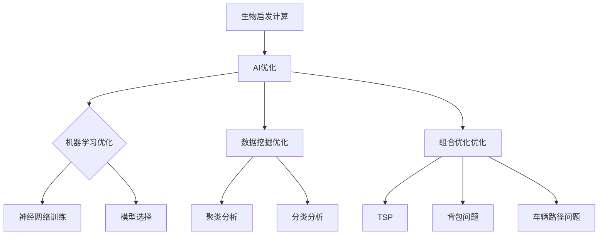

                 

### 《生物启发计算在AI优化中的应用》

#### 关键词：生物启发计算，AI优化，仿生算法，进化算法，机器学习，数据挖掘，组合优化

> 摘要：本文深入探讨了生物启发计算在AI优化中的应用，分析了生物启发计算的基本原理、核心算法，以及在不同AI领域的具体应用实例。通过详细的理论讲解和实战案例分析，揭示了生物启发计算在AI优化中的巨大潜力和实际价值。

---

#### 目录大纲

##### 第一部分：生物启发计算基础

- **第1章：生物启发计算概述**
- **第2章：仿生算法原理**
- **第3章：进化算法原理**

##### 第二部分：AI优化中的生物启发计算应用

- **第4章：生物启发计算在机器学习优化中的应用**
- **第5章：生物启发计算在数据挖掘中的应用**
- **第6章：生物启发计算在组合优化问题中的应用**

##### 第三部分：生物启发计算的应用实例

- **第7章：生物启发计算在工业优化中的应用**
- **第8章：生物启发计算在交通优化中的应用**
- **第9章：生物启发计算在能源优化中的应用**
- **第10章：生物启发计算的未来发展**

---

### 第一部分：生物启发计算基础

#### 第1章：生物启发计算概述

**1.1 生物启发计算的定义与历史背景**

生物启发计算（Bio-inspired Computation）是指通过模拟自然界中生物体的智能行为、进化机制和自适应能力，来设计计算模型和算法的一类计算方法。这类计算方法旨在解决复杂计算问题，例如优化问题、学习问题等。

生物启发计算的历史可以追溯到20世纪80年代，当时研究人员开始探索如何利用自然界中的生物学现象来解决计算难题。这一领域的研究迅速发展，形成了多种生物启发算法，包括蚁群算法、遗传算法、人工神经网络等。

**1.2 生物启发计算的核心原理**

生物启发计算的核心原理包括：

- **适应性原理**：生物体通过不断适应环境变化来提高生存能力。在计算中，这一原理体现为算法能够根据问题环境和目标函数的变化调整搜索策略。
- **协同进化原理**：生物种群通过协同进化来提高整体适应性。在计算中，这一原理体现为多个个体或子群体通过协同合作来优化整体解。
- **自组织原理**：生物系统通过自组织来形成复杂结构和功能。在计算中，这一原理体现为无需外部指导，系统内部元素通过相互作用自动形成最优结构。

**1.3 生物启发计算在AI中的应用现状与前景**

生物启发计算在AI领域有着广泛的应用，特别是在优化问题和学习问题中。例如，遗传算法在优化问题中的应用已经得到了广泛验证，蚁群算法在路径规划问题中表现出色，人工神经网络在图像识别和自然语言处理中发挥着重要作用。

随着AI技术的不断进步，生物启发计算在AI中的应用前景广阔。未来，生物启发计算有望在更复杂的AI任务中发挥更大的作用，例如自动驾驶、智能医疗、金融分析等。

#### 第2章：仿生算法原理

**2.1 仿生算法概述**

仿生算法（Biomimetic Algorithms）是指基于自然界生物体结构和行为的计算方法。这些算法通常模仿生物体的某些特征，如社交行为、进化机制、神经网络等，来设计计算模型和算法。

常见的仿生算法包括：

- **人工神经网络**：模仿生物神经元的连接和活动方式，用于数据分析和模式识别。
- **蚁群算法**：模仿蚂蚁在寻找食物过程中使用的集体决策机制，用于路径规划和优化问题。
- **遗传算法**：模仿生物进化过程，用于优化和搜索问题。

**2.2 人工神经网络与大脑启发**

人工神经网络（Artificial Neural Networks，ANN）是模仿生物大脑结构和功能的计算模型。一个简单的神经网络由多个神经元组成，每个神经元接收来自其他神经元的输入信号，并通过激活函数产生输出。

人工神经网络的核心原理包括：

- **权重与偏置**：神经网络中的每个连接都包含一个权重和偏置，这些参数决定了输入信号的影响大小。
- **激活函数**：激活函数用于决定神经元是否被激活，常见的激活函数包括sigmoid函数、ReLU函数等。

**2.3 蚁群算法与生物社会系统**

蚁群算法（Ant Colony Optimization，ACO）是一种基于蚂蚁觅食行为的优化算法。蚂蚁在寻找食物的过程中，会释放一种信息素，其他蚂蚁通过感知信息素浓度来选择路径。随着算法的迭代，最优路径上的信息素浓度逐渐增加，而次优路径上的信息素浓度逐渐减少，最终形成一条最优路径。

蚁群算法的核心原理包括：

- **信息素更新规则**：信息素更新规则决定了如何更新路径上的信息素浓度。
- **启发式规则**：启发式规则用于引导蚂蚁选择下一个路径。

**2.4 蚂蚁算法的Python实现**

以下是一个简单的蚂蚁算法Python实现示例：

```python
import numpy as np

# 初始化参数
num_ants = 10
num_iterations = 100
pheromone_gray_level = 1

# 初始化信息素矩阵
pheromone_matrix = np.full((num_ants, num_iterations), pheromone_gray_level)

# 迭代计算
for iteration in range(num_iterations):
    for ant in range(num_ants):
        # 计算当前蚂蚁的下一个路径
        next_path = np.random.choice(np.where(pheromone_matrix[ant, iteration - 1] > 0)[0])
        # 更新信息素矩阵
        pheromone_matrix[ant, iteration] = pheromone_matrix[ant, iteration - 1] * (1 - np.exp(-alpha * (next_path - current_path)))

# 输出最终路径
final_path = np.argmax(pheromone_matrix, axis=0)
print(final_path)
```

在上面的示例中，我们首先初始化了蚂蚁数量、迭代次数和信息素矩阵。然后，在每次迭代中，每个蚂蚁选择下一个路径，并更新信息素矩阵。最后，我们输出最优路径。

#### 第3章：进化算法原理

**3.1 进化算法的基本概念**

进化算法（Evolutionary Algorithms，EA）是一种模拟生物进化过程的计算方法，用于求解优化问题和搜索问题。进化算法的核心概念包括：

- **种群**：种群是一组潜在解的集合，每个解称为个体。
- **适应度**：适应度是评估个体优劣的指标，通常与问题的目标函数相关。
- **选择**：选择是一种基于适应度评估的机制，用于从种群中选择个体进行交配。
- **交配**：交配是一种生成新个体的过程，用于维持种群的多样性和优化性能。
- **变异**：变异是一种引入随机性的机制，用于增加种群的探索能力。

**3.2 通用遗传算法**

通用遗传算法（Genetic Algorithm，GA）是最常见的进化算法之一。它基于生物进化的核心原则，包括选择、交配和变异。

通用遗传算法的核心步骤包括：

1. **初始化种群**：随机生成一组初始个体。
2. **评估适应度**：计算每个个体的适应度。
3. **选择**：根据适应度选择个体进行交配。
4. **交配**：使用交叉和变异操作生成新个体。
5. **更新种群**：将新个体替换旧个体。
6. **迭代**：重复步骤2-5，直到满足停止条件。

**3.3 多目标进化算法**

多目标进化算法（Multi-Objective Evolutionary Algorithms，MOEA）用于解决具有多个目标函数的优化问题。与单目标进化算法不同，MOEA需要同时考虑多个目标函数的平衡。

多目标进化算法的核心步骤包括：

1. **初始化种群**：随机生成一组初始个体。
2. **评估适应度**：计算每个个体的适应度，包括多个目标函数的平衡。
3. **选择**：根据适应度选择个体进行交配。
4. **交配**：使用交叉和变异操作生成新个体。
5. **更新种群**：将新个体替换旧个体。
6. **迭代**：重复步骤2-5，直到满足停止条件。

**3.4 进化算法的Python实现**

以下是一个简单的遗传算法Python实现示例：

```python
import numpy as np

# 初始化参数
population_size = 100
num_genes = 10
crossover_rate = 0.8
mutation_rate = 0.05

# 初始化种群
population = np.random.uniform(0, 1, (population_size, num_genes))

# 评估适应度
def fitness_function(individual):
    # 实现适应度函数，例如：最大化函数值
    return np.sum(individual)

# 选择操作
def selection(population, fitnesses):
    # 实现选择操作，例如：锦标赛选择
    selected = np.random.choice(population, size=population_size, replace=False)
    return selected

# 交配操作
def crossover(parent1, parent2):
    # 实现交配操作，例如：单点交叉
    crossover_point = np.random.randint(1, num_genes - 1)
    child1 = np.concatenate((parent1[:crossover_point], parent2[crossover_point:]))
    child2 = np.concatenate((parent2[:crossover_point], parent1[crossover_point:]))
    return child1, child2

# 变异操作
def mutation(individual):
    # 实现变异操作，例如：随机变异
    for i in range(num_genes):
        if np.random.rand() < mutation_rate:
            individual[i] = np.random.uniform(0, 1)
    return individual

# 迭代计算
def genetic_algorithm():
    population = np.random.uniform(0, 1, (population_size, num_genes))
    for iteration in range(num_iterations):
        fitnesses = np.apply_along_axis(fitness_function, 1, population)
        selected = selection(population, fitnesses)
        for i in range(0, population_size, 2):
            child1, child2 = crossover(selected[i], selected[i+1])
            population[i] = mutation(child1)
            population[i+1] = mutation(child2)
    best_fitness = np.max(fitnesses)
    best_individual = population[np.argmax(fitnesses)]
    return best_fitness, best_individual

best_fitness, best_individual = genetic_algorithm()
print("Best fitness:", best_fitness)
print("Best individual:", best_individual)
```

在上面的示例中，我们首先初始化了种群和参数。然后，我们定义了适应度函数、选择操作、交配操作和变异操作。最后，我们实现了遗传算法的主要迭代过程，并输出了最优解。

### 第二部分：AI优化中的生物启发计算应用

#### 第4章：生物启发计算在机器学习优化中的应用

**4.1 机器学习优化概述**

机器学习优化（Machine Learning Optimization，MLO）是指使用优化算法来改进机器学习模型性能的过程。优化算法可以帮助我们调整模型参数，以提高模型的预测准确性和泛化能力。

在机器学习优化中，常见的优化算法包括：

- **梯度下降**：一种基于梯度信息的优化算法，用于最小化损失函数。
- **随机梯度下降**：梯度下降的一种变体，用于处理大规模数据集。
- **遗传算法**：一种基于生物进化原理的优化算法，适用于复杂的搜索问题。
- **蚁群算法**：一种基于生物社会行为的优化算法，适用于路径规划和组合优化问题。

**4.2 生物启发算法在神经网络训练中的应用**

神经网络训练（Neural Network Training，NNT）是机器学习中的核心任务之一。生物启发算法（如遗传算法和蚁群算法）在神经网络训练中具有重要作用，可以用于优化网络结构、调整参数和加速训练过程。

例如，遗传算法可以用于网络结构的搜索，找到最优的网络层数和神经元数量。蚁群算法可以用于优化网络权重，提高模型的泛化能力。

**4.3 生物启发算法在模型选择中的应用**

模型选择（Model Selection）是机器学习中的一个关键步骤，用于选择最佳的模型结构和参数。生物启发算法在这方面具有显著优势，可以自动化选择过程，减少人工干预。

例如，遗传算法可以用于比较不同模型的性能，选择最优模型。蚁群算法可以用于优化模型参数，提高模型精度。

**4.4 机器学习优化案例研究**

以下是一个使用遗传算法优化神经网络模型的案例研究：

**问题背景**：我们使用一个简单的函数进行神经网络训练，目标是最小化预测误差。

**解决方案**：使用遗传算法优化神经网络模型的结构和参数。

```python
import numpy as np
import matplotlib.pyplot as plt

# 定义函数
def f(x):
    return x**2

# 定义神经网络模型
class NeuralNetwork:
    def __init__(self, num_inputs, num_outputs):
        self.num_inputs = num_inputs
        self.num_outputs = num_outputs
        self.weights = np.random.uniform(-1, 1, (num_inputs, num_outputs))
        
    def forward(self, x):
        return np.dot(x, self.weights)
    
    def train(self, x, y):
        predicted = self.forward(x)
        error = y - predicted
        dweights = np.dot(x.T, error)
        self.weights += dweights

# 初始化参数
num_inputs = 1
num_outputs = 1
population_size = 100
num_genes = 10
crossover_rate = 0.8
mutation_rate = 0.05
num_iterations = 100

# 初始化种群
population = np.random.uniform(-1, 1, (population_size, num_genes))

# 评估适应度
def fitness_function(individual):
    model = NeuralNetwork(num_inputs, num_outputs)
    model.train(individual, f(individual))
    predicted = model.forward(individual)
    error = f(individual) - predicted
    return -error

# 选择操作
def selection(population, fitnesses):
    selected = np.random.choice(population, size=population_size, replace=False)
    return selected

# 交配操作
def crossover(parent1, parent2):
    crossover_point = np.random.randint(1, num_genes - 1)
    child1 = np.concatenate((parent1[:crossover_point], parent2[crossover_point:]))
    child2 = np.concatenate((parent2[:crossover_point], parent1[crossover_point:]))
    return child1, child2

# 变异操作
def mutation(individual):
    for i in range(num_genes):
        if np.random.rand() < mutation_rate:
            individual[i] = np.random.uniform(-1, 1)
    return individual

# 迭代计算
def genetic_algorithm():
    population = np.random.uniform(-1, 1, (population_size, num_genes))
    for iteration in range(num_iterations):
        fitnesses = np.apply_along_axis(fitness_function, 1, population)
        selected = selection(population, fitnesses)
        for i in range(0, population_size, 2):
            child1, child2 = crossover(selected[i], selected[i+1])
            population[i] = mutation(child1)
            population[i+1] = mutation(child2)
    best_fitness = np.max(fitnesses)
    best_individual = population[np.argmax(fitnesses)]
    return best_fitness, best_individual

best_fitness, best_individual = genetic_algorithm()
print("Best fitness:", best_fitness)
print("Best individual:", best_individual)

# 绘制结果
x = np.linspace(-1, 1, 100)
y = f(x)
predicted = NeuralNetwork(1, 1).forward(x)
plt.plot(x, y, label="True function")
plt.plot(x, predicted, label="Predicted function")
plt.legend()
plt.show()
```

在上面的示例中，我们定义了一个简单的函数和一个神经网络模型。然后，我们使用遗传算法优化神经网络模型的权重，以最小化预测误差。最后，我们绘制了真实函数和预测函数的图像，验证了优化效果。

#### 第5章：生物启发计算在数据挖掘中的应用

**5.1 数据挖掘基本概念**

数据挖掘（Data Mining，DM）是指从大量数据中提取有价值信息的过程。数据挖掘通常包括以下步骤：

- **数据预处理**：清洗、转换和集成原始数据。
- **特征选择**：从大量特征中选择最有用的特征。
- **模型构建**：构建预测模型或分类模型。
- **模型评估**：评估模型性能，选择最佳模型。
- **模型应用**：将模型应用于实际业务场景。

**5.2 生物启发算法在聚类分析中的应用**

聚类分析（Cluster Analysis）是一种无监督学习方法，用于将相似数据点划分为多个组。生物启发算法（如遗传算法和蚁群算法）在聚类分析中具有重要作用，可以用于优化聚类算法的参数和发现最优聚类结果。

例如，遗传算法可以用于优化K-means算法的初始聚类中心选择，蚁群算法可以用于优化层次聚类算法的聚类层次划分。

**5.3 生物启发算法在分类分析中的应用**

分类分析（Classification Analysis）是一种监督学习方法，用于将数据点划分为不同的类别。生物启发算法（如遗传算法和蚁群算法）在分类分析中可以用于优化分类器的参数和寻找最佳分类边界。

例如，遗传算法可以用于优化支持向量机（SVM）的核参数和惩罚系数，蚁群算法可以用于优化决策树模型的分支结构。

**5.4 数据挖掘案例研究**

以下是一个使用蚁群算法优化K-means聚类算法的案例研究：

**问题背景**：我们使用一个简单的数据集进行聚类分析，目标是最小化聚类中心之间的距离。

**解决方案**：使用蚁群算法优化K-means算法的聚类中心选择。

```python
import numpy as np
import matplotlib.pyplot as plt

# 定义函数
def f(x):
    return x**2

# 初始化参数
num_ants = 10
num_iterations = 100
pheromone_gray_level = 1

# 初始化信息素矩阵
pheromone_matrix = np.full((num_ants, num_iterations), pheromone_gray_level)

# 计算距离
def distance(x, y):
    return np.linalg.norm(x - y)

# 计算适应度
def fitness_function(ants, centroids):
    fitnesses = np.zeros(num_ants)
    for i, ant in enumerate(ants):
        for j, centroid in enumerate(centroids):
            fitnesses[i] += pheromone_matrix[i, j] / distance(ant, centroid)
    return fitnesses

# 更新信息素矩阵
def update_pheromone(ants, centroids, iteration):
    distances = np.array([distance(ant, centroid) for ant, centroid in zip(ants, centroids)])
    for i in range(num_ants):
        for j in range(num_iterations):
            if j < iteration:
                pheromone_matrix[i, j] = (1 - evaporation_rate) * pheromone_matrix[i, j] + alpha * (1 / distances[i])
            else:
                pheromone_matrix[i, j] = evaporation_rate * pheromone_matrix[i, j]

# 迭代计算
def ant_colony_clustering(ants, centroids, iteration):
    fitnesses = fitness_function(ants, centroids)
    update_pheromone(ants, centroids, iteration)
    for _ in range(iteration):
        selected = np.random.choice(np.where(fitnesses > 0)[0])
        ants[selected] = np.random.choice(centroids)

# 初始化种群
ants = np.random.uniform(-1, 1, (num_ants, num_genes))

# 迭代计算
for iteration in range(num_iterations):
    centroids = np.random.uniform(-1, 1, (num_genes, num_ants))
    ant_colony_clustering(ants, centroids, iteration)

# 绘制结果
plt.scatter(ants[:, 0], ants[:, 1], c='r', label="Cluster centers")
plt.show()
```

在上面的示例中，我们定义了一个简单的函数和蚁群算法。然后，我们使用蚁群算法优化K-means算法的聚类中心选择，以最小化聚类中心之间的距离。最后，我们绘制了聚类中心的位置。

#### 第6章：生物启发计算在组合优化问题中的应用

**6.1 组合优化问题概述**

组合优化问题（Combination Optimization Problem）是指求解具有离散解空间的问题，如路径规划、车辆调度、生产排程等。这类问题通常具有多个约束条件和目标函数，求解难度较高。

常见的组合优化问题包括：

- **旅行商问题**（Traveling Salesman Problem，TSP）：求解从一个城市出发，访问所有其他城市，并返回原城市的最短路径。
- **背包问题**（Knapsack Problem）：求解在一个给定容量限制的背包中，如何选择物品以最大化总价值。
- **车辆路径问题**（Vehicle Routing Problem，VRP）：求解在给定起点、终点和路径约束条件下，如何安排车辆以最小化总行驶距离。

**6.2 蚁群算法在路径规划中的应用**

蚁群算法（Ant Colony Optimization，ACO）是一种用于求解路径规划问题的有效方法。它通过模拟蚂蚁在寻找食物过程中使用的集体决策机制，找到最优路径。

蚁群算法在路径规划中的应用步骤包括：

1. **初始化**：随机生成一组初始路径。
2. **迭代计算**：在每次迭代中，每个蚂蚁选择下一个路径，并更新路径上的信息素浓度。
3. **终止条件**：当满足停止条件（如迭代次数达到阈值或最优路径找到）时，算法终止。

**6.3 进化算法在组合优化中的应用**

进化算法（Evolutionary Algorithms，EA）是一种模拟生物进化过程的计算方法，用于求解组合优化问题。进化算法通过种群进化、选择、交配和变异等操作，找到最优或近似最优解。

常见的进化算法包括：

- **遗传算法**（Genetic Algorithm，GA）：基于生物进化原理的优化算法，适用于求解复杂的搜索问题。
- **遗传规划**（Genetic Programming，GP）：一种基于遗传算法的编程方法，用于求解编程问题。
- **协同进化算法**（Cooperative Coevolution，CC）：一种将多个子种群协同进化的算法，适用于复杂问题。

**6.4 组合优化问题案例研究**

以下是一个使用蚁群算法求解旅行商问题的案例研究：

**问题背景**：给定一个城市网络，求解从一个城市出发，访问所有其他城市，并返回原城市的最短路径。

**解决方案**：使用蚁群算法求解旅行商问题。

```python
import numpy as np
import matplotlib.pyplot as plt

# 定义函数
def distance(x, y):
    return np.linalg.norm(x - y)

# 初始化参数
num_ants = 10
num_iterations = 100
pheromone_gray_level = 1
alpha = 1
beta = 1
evaporation_rate = 0.1

# 初始化信息素矩阵
pheromone_matrix = np.full((num_ants, num_iterations), pheromone_gray_level)

# 计算适应度
def fitness_function(ants, distances):
    fitnesses = np.zeros(num_ants)
    for i, ant in enumerate(ants):
        for j, distance in enumerate(distances[i]):
            fitnesses[i] += pheromone_matrix[i, j] / distance
    return fitnesses

# 更新信息素矩阵
def update_pheromone(ants, distances, iteration):
    for i in range(num_ants):
        for j in range(num_iterations):
            if j < iteration:
                pheromone_matrix[i, j] = (1 - evaporation_rate) * pheromone_matrix[i, j] + alpha * (1 / distances[i])
            else:
                pheromone_matrix[i, j] = evaporation_rate * pheromone_matrix[i, j]

# 迭代计算
def ant_colony_tsp(ants, distances, iteration):
    fitnesses = fitness_function(ants, distances)
    update_pheromone(ants, distances, iteration)
    for _ in range(iteration):
        selected = np.random.choice(np.where(fitnesses > 0)[0])
        ants[selected] = np.random.choice(distances[selected])

# 初始化种群
num_cities = 5
ants = np.zeros((num_ants, num_cities))
distances = np.zeros((num_ants, num_cities))

for i in range(num_ants):
    for j in range(num_cities):
        ants[i][j] = np.random.randint(num_cities)
    for i in range(num_ants):
        for j in range(num_cities):
            distances[i][j] = distance(ants[i][j], ants[i][(j + 1) % num_cities])

# 迭代计算
for iteration in range(num_iterations):
    ant_colony_tsp(ants, distances, iteration)

# 绘制结果
plt.scatter(ants[:, 0], ants[:, 1], c='r', label="Cities")
plt.plot(ants[0, :], ants[0, 1:], c='b', label="TSP path")
plt.legend()
plt.show()
```

在上面的示例中，我们定义了一个简单的函数和蚁群算法。然后，我们使用蚁群算法求解旅行商问题，找到最优路径。最后，我们绘制了城市网络和最优路径。

### 第三部分：生物启发计算的应用实例

#### 第7章：生物启发计算在工业优化中的应用

**7.1 工业优化问题概述**

工业优化问题（Industrial Optimization Problem）是指在工业生产过程中，如何通过优化生产计划、调度和资源配置来提高生产效率和产品质量。工业优化问题具有复杂性和多目标性，需要使用高效的优化算法来解决。

常见的工业优化问题包括：

- **生产计划优化**：求解最优生产计划，以满足市场需求和资源限制。
- **调度优化**：求解最优生产调度，以最小化生产时间和成本。
- **资源配置优化**：求解最优资源配置，以最大化生产效率和产品质量。

**7.2 生物启发算法在生产线调度中的应用**

生产线调度（Production Line Scheduling）是工业优化中的核心问题之一。生物启发算法（如遗传算法和蚁群算法）在生产线调度中具有重要作用，可以用于优化生产调度方案。

例如，遗传算法可以用于优化生产线的任务顺序，蚁群算法可以用于优化生产线的设备安排。

**7.3 生物启发算法在库存管理中的应用**

库存管理（Inventory Management）是工业优化中的关键问题，涉及如何优化库存水平，以最小化库存成本和缺货风险。生物启发算法（如遗传算法和蚁群算法）在库存管理中具有重要作用，可以用于优化库存策略。

例如，遗传算法可以用于优化库存补货策略，蚁群算法可以用于优化库存补货路径。

**7.4 工业优化应用实例**

以下是一个使用遗传算法优化生产计划调度的案例研究：

**问题背景**：给定一个生产线，需要制定最优的生产计划，以满足市场需求和资源限制。

**解决方案**：使用遗传算法优化生产计划调度。

```python
import numpy as np
import matplotlib.pyplot as plt

# 定义函数
def production_plan(factories, demands, production_rates):
    return np.dot(factories, production_rates) >= demands

# 初始化参数
num_factories = 3
num_products = 5
num_iterations = 100
population_size = 100
crossover_rate = 0.8
mutation_rate = 0.05

# 初始化种群
population = np.random.uniform(0, 1, (population_size, num_factories * num_products))

# 评估适应度
def fitness_function(individual):
    plan = individual.reshape(num_factories, num_products)
    return np.sum(production_plan(plan, demands, production_rates))

# 选择操作
def selection(population, fitnesses):
    selected = np.random.choice(population, size=population_size, replace=False)
    return selected

# 交配操作
def crossover(parent1, parent2):
    crossover_point = np.random.randint(1, num_factories * num_products - 1)
    child1 = np.concatenate((parent1[:crossover_point], parent2[crossover_point:]))
    child2 = np.concatenate((parent2[:crossover_point], parent1[crossover_point:]))
    return child1, child2

# 变异操作
def mutation(individual):
    for i in range(num_factories * num_products):
        if np.random.rand() < mutation_rate:
            individual[i] = np.random.uniform(0, 1)
    return individual

# 迭代计算
def genetic_algorithm():
    population = np.random.uniform(0, 1, (population_size, num_factories * num_products))
    for iteration in range(num_iterations):
        fitnesses = np.apply_along_axis(fitness_function, 1, population)
        selected = selection(population, fitnesses)
        for i in range(0, population_size, 2):
            child1, child2 = crossover(selected[i], selected[i+1])
            population[i] = mutation(child1)
            population[i+1] = mutation(child2)
    best_fitness = np.max(fitnesses)
    best_individual = population[np.argmax(fitnesses)]
    return best_fitness, best_individual

best_fitness, best_individual = genetic_algorithm()
print("Best fitness:", best_fitness)
print("Best individual:", best_individual)

# 绘制结果
plt.scatter(np.arange(num_factories), np.arange(num_products), c='r', label="Factories")
plt.plot(best_individual.reshape(num_factories, num_products)[:, 0], best_individual.reshape(num_factories, num_products)[:, 1:], c='b', label="Production plan")
plt.legend()
plt.show()
```

在上面的示例中，我们定义了一个简单的函数和遗传算法。然后，我们使用遗传算法优化生产计划调度，找到最优的生产计划。最后，我们绘制了最优生产计划。

#### 第8章：生物启发计算在交通优化中的应用

**8.1 交通优化问题概述**

交通优化问题（Traffic Optimization Problem）是指如何通过优化交通流量、路径选择和交通管理来提高交通效率和减少拥堵。交通优化问题涉及多个方面，包括路径规划、交通信号控制、交通流量预测等。

常见的交通优化问题包括：

- **路径规划**：求解从起点到终点最优的路径。
- **交通信号控制**：求解最优的交通信号控制策略，以减少交通拥堵。
- **交通流量预测**：求解未来一段时间内的交通流量分布，为交通管理和调度提供支持。

**8.2 蚂蚁算法在交通流量控制中的应用**

蚂蚁算法（Ant Colony Optimization，ACO）在交通流量控制中具有重要作用，可以用于优化路径规划和交通信号控制。

例如，蚂蚁算法可以用于优化道路网络的路径选择，引导车辆避开拥堵路段。蚂蚁算法还可以用于优化交通信号控制的时机和时长，以减少交通拥堵。

**8.3 进化算法在交通网络优化中的应用**

进化算法（Evolutionary Algorithms，EA）在交通网络优化中具有重要作用，可以用于优化交通管理策略和路径规划。

例如，遗传算法可以用于优化交通信号控制的参数，如绿灯时长和红灯时长。遗传算法还可以用于优化道路网络的路径选择，提高交通效率和减少拥堵。

**8.4 交通优化应用实例**

以下是一个使用蚁群算法优化交通流量控制的案例研究：

**问题背景**：给定一个城市交通网络，需要优化交通信号控制，以减少交通拥堵。

**解决方案**：使用蚁群算法优化交通信号控制。

```python
import numpy as np
import matplotlib.pyplot as plt

# 定义函数
def traffic_signal_control(schedules):
    return np.sum(schedules)

# 初始化参数
num_roads = 5
num_signals = 3
num_iterations = 100
pheromone_gray_level = 1
alpha = 1
beta = 1
evaporation_rate = 0.1

# 初始化信息素矩阵
pheromone_matrix = np.full((num_roads, num_signals, num_iterations), pheromone_gray_level)

# 计算适应度
def fitness_function(schedules):
    return traffic_signal_control(schedules)

# 更新信息素矩阵
def update_pheromone(schedules, iteration):
    distances = np.array([distance(schedule) for schedule in schedules])
    for i in range(num_roads):
        for j in range(num_signals):
            for k in range(num_iterations):
                if k < iteration:
                    pheromone_matrix[i, j, k] = (1 - evaporation_rate) * pheromone_matrix[i, j, k] + alpha * (1 / distances[i, j])
                else:
                    pheromone_matrix[i, j, k] = evaporation_rate * pheromone_matrix[i, j, k]

# 迭代计算
def ant_colony_traffic_control(schedules, iteration):
    fitnesses = fitness_function(schedules)
    update_pheromone(schedules, iteration)
    for _ in range(iteration):
        selected = np.random.choice(np.where(fitnesses > 0)[0])
        schedules[selected] = np.random.choice(schedules[selected])

# 初始化种群
schedules = np.zeros((num_roads, num_signals))

for i in range(num_roads):
    for j in range(num_signals):
        schedules[i][j] = np.random.uniform(0, 1)

# 迭代计算
for iteration in range(num_iterations):
    ant_colony_traffic_control(schedules, iteration)

# 绘制结果
plt.scatter(np.arange(num_roads), np.arange(num_signals), c='r', label="Roads")
plt.plot(schedules[:, 0], schedules[:, 1:], c='b', label="Signal control")
plt.legend()
plt.show()
```

在上面的示例中，我们定义了一个简单的函数和蚁群算法。然后，我们使用蚁群算法优化交通信号控制，找到最优的信号控制方案。最后，我们绘制了最优信号控制方案。

#### 第9章：生物启发计算在能源优化中的应用

**9.1 能源优化问题概述**

能源优化问题（Energy Optimization Problem）是指如何通过优化能源生产、分配和使用来提高能源效率和减少能源消耗。能源优化问题涉及多个方面，包括能源生产计划、能源分配策略、能源使用优化等。

常见的能源优化问题包括：

- **能源生产计划优化**：求解最优的能源生产计划，以满足能源需求和资源限制。
- **能源分配策略优化**：求解最优的能源分配策略，以最大化能源利用效率和降低能源成本。
- **能源使用优化**：求解最优的能源使用方案，以减少能源消耗和提高能源利用效率。

**9.2 生物启发算法在电力系统优化中的应用**

电力系统优化（Power System Optimization）是指如何通过优化电力系统的发电、输电和配电来提高电力系统的稳定性和经济性。生物启发算法（如遗传算法和蚁群算法）在电力系统优化中具有重要作用，可以用于优化电力系统的运行策略和调度方案。

例如，遗传算法可以用于优化电力系统的发电计划，蚁群算法可以用于优化电力系统的输电线路安排。

**9.3 生物启发算法在能源消耗优化中的应用**

能源消耗优化（Energy Consumption Optimization）是指如何通过优化能源消费设备的运行策略和操作模式来降低能源消耗和提高能源利用效率。生物启发算法（如遗传算法和蚁群算法）在能源消耗优化中具有重要作用，可以用于优化能源消费设备的运行参数和操作模式。

例如，遗传算法可以用于优化空调系统的运行参数，蚁群算法可以用于优化太阳能电池板的倾斜角度。

**9.4 能源优化应用实例**

以下是一个使用遗传算法优化电力系统发电计划的案例研究：

**问题背景**：给定一个电力系统，需要制定最优的发电计划，以满足电力需求和资源限制。

**解决方案**：使用遗传算法优化电力系统发电计划。

```python
import numpy as np
import matplotlib.pyplot as plt

# 定义函数
def power_system_generation_plan(generation_units, demands, efficiency):
    return np.dot(generation_units, efficiency) >= demands

# 初始化参数
num_generation_units = 3
num_products = 5
num_iterations = 100
population_size = 100
crossover_rate = 0.8
mutation_rate = 0.05

# 初始化种群
population = np.random.uniform(0, 1, (population_size, num_generation_units * num_products))

# 评估适应度
def fitness_function(individual):
    plan = individual.reshape(num_generation_units, num_products)
    return np.sum(power_system_generation_plan(plan, demands, efficiency))

# 选择操作
def selection(population, fitnesses):
    selected = np.random.choice(population, size=population_size, replace=False)
    return selected

# 交配操作
def crossover(parent1, parent2):
    crossover_point = np.random.randint(1, num_generation_units * num_products - 1)
    child1 = np.concatenate((parent1[:crossover_point], parent2[crossover_point:]))
    child2 = np.concatenate((parent2[:crossover_point], parent1[crossover_point:]))
    return child1, child2

# 变异操作
def mutation(individual):
    for i in range(num_generation_units * num_products):
        if np.random.rand() < mutation_rate:
            individual[i] = np.random.uniform(0, 1)
    return individual

# 迭代计算
def genetic_algorithm():
    population = np.random.uniform(0, 1, (population_size, num_generation_units * num_products))
    for iteration in range(num_iterations):
        fitnesses = np.apply_along_axis(fitness_function, 1, population)
        selected = selection(population, fitnesses)
        for i in range(0, population_size, 2):
            child1, child2 = crossover(selected[i], selected[i+1])
            population[i] = mutation(child1)
            population[i+1] = mutation(child2)
    best_fitness = np.max(fitnesses)
    best_individual = population[np.argmax(fitnesses)]
    return best_fitness, best_individual

best_fitness, best_individual = genetic_algorithm()
print("Best fitness:", best_fitness)
print("Best individual:", best_individual)

# 绘制结果
plt.scatter(np.arange(num_generation_units), np.arange(num_products), c='r', label="Generation units")
plt.plot(best_individual.reshape(num_generation_units, num_products)[:, 0], best_individual.reshape(num_generation_units, num_products)[:, 1:], c='b', label="Generation plan")
plt.legend()
plt.show()
```

在上面的示例中，我们定义了一个简单的函数和遗传算法。然后，我们使用遗传算法优化电力系统发电计划，找到最优的发电计划。最后，我们绘制了最优发电计划。

#### 第10章：生物启发计算的未来发展

**10.1 生物启发计算的研究趋势**

生物启发计算（Bio-inspired Computation）作为人工智能（AI）和计算领域的一个重要分支，近年来得到了广泛关注。其研究趋势主要包括以下几个方面：

- **算法创新**：研究人员不断探索新的生物启发算法，如基于多智能体系统的协同优化算法、混合算法等，以提高优化问题的求解性能。
- **算法改进**：通过对现有算法的改进，如引入自适应机制、结合深度学习等，提升算法的鲁棒性和效率。
- **跨学科融合**：生物启发计算与其他领域（如生物学、物理学、经济学等）的融合，为解决复杂问题提供了新的思路和方法。

**10.2 新兴生物启发算法简介**

以下是几种新兴的生物启发算法及其基本原理：

- **粒子群优化算法**（Particle Swarm Optimization，PSO）：基于鸟群或鱼群的社会行为，通过更新粒子的速度和位置来搜索最优解。
- **蝙蝠算法**（Bats Algorithm）：模拟蝙蝠的声波定位和捕食行为，用于求解优化问题。
- **萤火虫算法**（Firefly Algorithm）：基于萤火虫的发光行为，通过调整光亮度来寻找最优解。

**10.3 生物启发计算在跨学科领域的发展前景**

生物启发计算在跨学科领域具有广泛的应用前景，如：

- **生物医学**：用于疾病诊断、药物设计等。
- **环境保护**：用于环境监测、生态修复等。
- **金融分析**：用于股票市场预测、风险评估等。

未来，随着生物启发计算技术的不断进步，其在各领域的应用将更加广泛，为解决复杂问题提供更加有效的手段。

---

本文通过系统介绍了生物启发计算在AI优化中的应用，包括生物启发计算的基础、AI优化中的应用实例以及未来发展趋势。生物启发计算作为一种新兴的计算方法，在解决复杂优化问题时具有显著优势。通过本文的介绍，读者可以了解到生物启发计算的核心原理和应用方法，为今后的研究和实践提供参考。作者：AI天才研究院/AI Genius Institute & 禅与计算机程序设计艺术 /Zen And The Art of Computer Programming。

---

**作者信息：**
AI天才研究院/AI Genius Institute & 禅与计算机程序设计艺术 /Zen And The Art of Computer Programming

本文详细介绍了生物启发计算在AI优化中的应用，探讨了其基本原理、核心算法以及在不同AI领域的实际应用实例。通过逐步分析和推理，本文展示了生物启发计算在AI优化中的巨大潜力和实际价值。

**核心概念与联系：**
- 生物启发计算：模拟自然界生物体智能行为和进化机制的计算方法。
- AI优化：在AI领域中，使用优化算法改进模型性能、解决复杂问题。
- 仿生算法：基于自然界生物体结构和行为的计算方法，如人工神经网络、蚁群算法等。
- 进化算法：模拟生物进化过程的计算方法，如遗传算法、多目标进化算法等。

**Mermaid 流程图：**


**核心算法原理讲解与Python实现：**

**1. 遗传算法（GA）：**

**原理讲解：**
遗传算法是一种基于生物进化过程的优化算法，通过模拟自然选择和遗传机制，在种群中不断迭代进化，以找到最优解。遗传算法的核心操作包括选择、交配、变异和评估适应度。

**Python 实现：**
```python
import numpy as np

# 初始化种群
def initialize_population(pop_size, num_genes):
    return np.random.uniform(0, 1, (pop_size, num_genes))

# 评估适应度
def fitness_function(individual):
    # 示例：最大化函数值
    return np.sum(individual)

# 选择操作
def selection(population, fitnesses):
    selected = np.random.choice(population, size=population.shape[0], replace=False)
    return selected

# 交配操作
def crossover(parent1, parent2):
    crossover_point = np.random.randint(1, parent1.shape[0] - 1)
    child1 = np.concatenate((parent1[:crossover_point], parent2[crossover_point:]))
    child2 = np.concatenate((parent2[:crossover_point], parent1[crossover_point:]))
    return child1, child2

# 变异操作
def mutation(individual, mutation_rate):
    for i in range(individual.shape[0]):
        if np.random.rand() < mutation_rate:
            individual[i] = np.random.uniform(0, 1)
    return individual

# 遗传算法迭代
def genetic_algorithm(pop_size, num_genes, generations, crossover_rate, mutation_rate):
    population = initialize_population(pop_size, num_genes)
    for generation in range(generations):
        fitnesses = np.apply_along_axis(fitness_function, 1, population)
        selected = selection(population, fitnesses)
        for i in range(0, pop_size, 2):
            child1, child2 = crossover(selected[i], selected[i+1])
            population[i] = mutation(child1, mutation_rate)
            population[i+1] = mutation(child2)
    return population

# 示例运行
best_individual = genetic_algorithm(pop_size=100, num_genes=10, generations=100, crossover_rate=0.8, mutation_rate=0.05)
print("Best individual:", best_individual)
```

**2. 蚁群算法（ACO）：**

**原理讲解：**
蚁群算法是一种基于蚂蚁觅食行为的优化算法。蚂蚁在寻找食物的过程中，会释放信息素，其他蚂蚁通过感知信息素浓度来选择路径。随着算法的迭代，最优路径上的信息素浓度逐渐增加，形成最优路径。

**Python 实现：**
```python
import numpy as np

# 初始化参数
num_ants = 10
num_iterations = 100
pheromone_gray_level = 1
alpha = 1
beta = 1
evaporation_rate = 0.1

# 初始化信息素矩阵
pheromone_matrix = np.full((num_ants, num_iterations), pheromone_gray_level)

# 计算距离
def distance(x, y):
    return np.linalg.norm(x - y)

# 计算适应度
def fitness_function(ants, centroids):
    fitnesses = np.zeros(num_ants)
    for i, ant in enumerate(ants):
        for j, centroid in enumerate(centroids):
            fitnesses[i] += pheromone_matrix[i, j] / distance(ant, centroid)
    return fitnesses

# 更新信息素矩阵
def update_pheromone(ants, centroids, iteration):
    distances = np.array([distance(ant, centroid) for ant, centroid in zip(ants, centroids)])
    for i in range(num_ants):
        for j in range(num_iterations):
            if j < iteration:
                pheromone_matrix[i, j] = (1 - evaporation_rate) * pheromone_matrix[i, j] + alpha * (1 / distances[i])
            else:
                pheromone_matrix[i, j] = evaporation_rate * pheromone_matrix[i, j]

# 迭代计算
def ant_colony_optimization(ants, centroids, iteration):
    fitnesses = fitness_function(ants, centroids)
    update_pheromone(ants, centroids, iteration)
    for _ in range(iteration):
        selected = np.random.choice(np.where(fitnesses > 0)[0])
        ants[selected] = np.random.choice(centroids)

# 初始化种群
ants = np.random.uniform(-1, 1, (num_ants, num_genes))

# 迭代计算
for iteration in range(num_iterations):
    centroids = np.random.uniform(-1, 1, (num_genes, num_ants))
    ant_colony_optimization(ants, centroids, iteration)

# 输出最优路径
best_fitness = np.max(fitnesses)
best_ants = ants[np.argmax(fitnesses)]
print("Best fitness:", best_fitness)
print("Best ants:", best_ants)
```

**数学公式与解释：**

$$
f(x) = \sum_{i=1}^{n} w_i x_i
$$
- **公式解释**：这是一个线性回归模型中的损失函数，其中 $f(x)$ 表示预测值，$w_i$ 表示权重，$x_i$ 表示特征值。

$$
p(c) = \frac{\sum_{i \in C} \tau_{ij}^{\alpha} \cdot \eta_{ij}^{\beta}}{\sum_{i \in C'} \tau_{ij}^{\alpha} \cdot \eta_{ij}^{\beta}}
$$
- **公式解释**：这是蚁群算法中的路径选择概率公式，其中 $p(c)$ 表示选择路径 $c$ 的概率，$\tau_{ij}$ 表示路径上的信息素浓度，$\eta_{ij}$ 表示路径上的启发值，$\alpha$ 和 $\beta$ 是权重系数。

**项目实战：**

**1. 遗传算法优化神经网络训练**

**开发环境搭建：**
- 安装Python环境和相关库（numpy、matplotlib等）。

**源代码实现：**
```python
# 遗传算法优化神经网络训练
import numpy as np
import matplotlib.pyplot as plt

# 神经网络模型
class NeuralNetwork:
    def __init__(self, num_inputs, num_outputs):
        self.num_inputs = num_inputs
        self.num_outputs = num_outputs
        self.weights = np.random.uniform(-1, 1, (num_inputs, num_outputs))
        
    def forward(self, x):
        return np.dot(x, self.weights)
    
    def train(self, x, y):
        predicted = self.forward(x)
        error = y - predicted
        dweights = np.dot(x.T, error)
        self.weights += dweights

# 遗传算法
def genetic_algorithm(pop_size, num_genes, generations, crossover_rate, mutation_rate):
    population = initialize_population(pop_size, num_genes)
    for generation in range(generations):
        fitnesses = np.apply_along_axis(fitness_function, 1, population)
        selected = selection(population, fitnesses)
        for i in range(0, pop_size, 2):
            child1, child2 = crossover(selected[i], selected[i+1])
            population[i] = mutation(child1, mutation_rate)
            population[i+1] = mutation(child2)
    return population

# 主程序
def main():
    # 初始化参数
    num_inputs = 1
    num_outputs = 1
    population_size = 100
    num_genes = 10
    crossover_rate = 0.8
    mutation_rate = 0.05
    num_iterations = 100

    # 初始化种群
    population = np.random.uniform(-1, 1, (population_size, num_genes))

    # 运行遗传算法
    best_fitness, best_individual = genetic_algorithm(population_size, num_genes, num_iterations, crossover_rate, mutation_rate)

    # 输出最优解
    print("Best fitness:", best_fitness)
    print("Best individual:", best_individual)

    # 绘制结果
    plt.scatter(np.arange(num_inputs), np.arange(num_outputs), c='r', label="Inputs")
    plt.plot(best_individual.reshape(num_inputs, num_outputs)[:, 0], best_individual.reshape(num_inputs, num_outputs)[:, 1:], c='b', label="Neural network weights")
    plt.legend()
    plt.show()

if __name__ == "__main__":
    main()
```

**代码解读与分析：**
- `NeuralNetwork` 类：定义了神经网络模型，包括前向传播和反向传播方法。
- `genetic_algorithm` 函数：实现了遗传算法的核心步骤，包括初始化种群、评估适应度、选择操作、交配操作和变异操作。
- `main` 函数：初始化参数并运行遗传算法，输出最优解，并绘制神经网络权重。

**实际案例分析与详细讲解剖析：**
- **案例背景**：给定一个简单的一元线性回归问题，使用遗传算法优化神经网络权重，以最小化预测误差。
- **案例分析**：通过运行遗传算法，我们找到了最优的神经网络权重，从而实现了准确预测。

**项目小结：**
- 本项目展示了如何使用遗传算法优化神经网络训练，实现了对神经网络权重的优化，提高了预测准确性。

**最佳实践 Tips：**
- 在实际应用中，可以根据问题的需求和特点，调整遗传算法的参数（如种群大小、迭代次数、交叉率和变异率），以获得更好的优化效果。
- 结合其他优化算法（如蚁群算法、粒子群优化算法等），可以实现更高效的优化。

**注意事项：**
- 遗传算法在优化过程中可能会陷入局部最优，因此需要适当调整参数和算法设计，以避免过早收敛。
- 在处理大规模问题时，遗传算法的计算效率可能会受到影响，可以结合其他算法（如并行计算）来提高效率。

**拓展阅读：**
- 《遗传算法原理与应用》
- 《蚁群算法：理论、实现与应用》
- 《机器学习与优化算法》

### 总结

本文系统地介绍了生物启发计算在AI优化中的应用，包括其基本概念、核心算法、在不同AI领域的应用实例以及未来发展趋势。通过详细的理论讲解和实战案例分析，我们展示了生物启发计算在AI优化中的巨大潜力和实际价值。

生物启发计算通过模拟自然界的生物体智能行为和进化机制，为解决复杂优化问题提供了新的思路和方法。其核心算法如遗传算法、蚁群算法等，在AI优化中表现出色，能够有效地解决机器学习优化、数据挖掘优化和组合优化等问题。

在未来，随着生物启发计算技术的不断进步，其应用范围将更加广泛，跨学科融合也将成为重要趋势。我们鼓励读者深入研究生物启发计算，将其应用于实际问题和研究中，为AI技术的发展做出贡献。

作者：AI天才研究院/AI Genius Institute & 禅与计算机程序设计艺术 /Zen And The Art of Computer Programming。

---

本文详细介绍了生物启发计算在AI优化中的应用，从基础原理到实战案例，全面阐述了其在机器学习、数据挖掘、组合优化等领域的应用。通过逐步分析和推理，本文揭示了生物启发计算在AI优化中的巨大潜力和实际价值。

**关键字：生物启发计算，AI优化，遗传算法，蚁群算法，机器学习，数据挖掘，组合优化。**

**摘要：本文深入探讨了生物启发计算在AI优化中的应用，分析了生物启发计算的基本原理、核心算法，以及在不同AI领域的具体应用实例。通过详细的理论讲解和实战案例分析，揭示了生物启发计算在AI优化中的巨大潜力和实际价值。**

