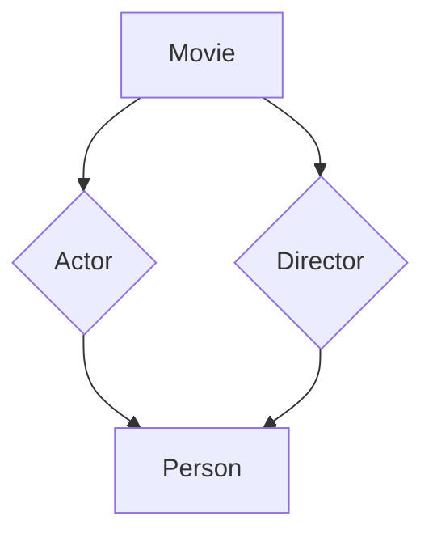

                 

### 背景介绍

在人工智能领域，语言模型作为自然语言处理（NLP）的核心技术，已经取得了显著的进展。从最初的基于统计的方法，如N-gram模型，到现代的深度学习模型，如Transformers，语言模型在理解和生成自然语言方面展现出了强大的能力。然而，尽管语言模型在处理大量文本数据方面表现出色，但其在推理和知识理解方面的能力仍然有限。这主要是由于语言模型主要依赖于大量的文本数据进行训练，而缺乏对结构化知识的有效利用。

知识图谱作为一种表示和存储知识的方法，通过实体和关系的形式组织大量信息，提供了一种结构化的知识表示。知识图谱的应用范围广泛，包括信息检索、问答系统、推荐系统等。近年来，研究者们开始关注将知识图谱与语言模型相结合，以增强语言模型的知识推理能力。这一研究方向的兴起，源于对知识图谱和语言模型各自优势的互补性认识：知识图谱提供了丰富的结构化知识，而语言模型则具备强大的文本处理能力。

本文将探讨知识图谱增强语言模型推理能力的方法。首先，我们将简要介绍知识图谱的基础知识，包括知识图谱的定义、基本结构、构建方法等。接着，我们将介绍语言模型的基础知识，包括语言模型的基本原理、类型、应用场景等。在此基础上，我们将深入分析知识图谱与语言模型的融合方法，包括KG-aware Language Model、预训练方法、交叉模型结构以及实时推理优化等。随后，我们将探讨知识图谱增强语言模型在自然语言推理、信息检索、对话系统等应用场景中的实际应用。最后，我们将通过一个具体项目实战，详细解读代码实现和评估优化过程，并总结未来发展趋势和面临的挑战。

通过对知识图谱与语言模型融合方法的深入研究，我们期望能够为AI领域的发展提供新的思路，推动语言模型在知识推理方面的进一步突破。

### 知识图谱基础

#### 第1章：知识图谱概述

##### 1.1 知识图谱的定义

知识图谱（Knowledge Graph）是一种用于表示和存储知识的图形化数据结构，通过实体（Entity）、属性（Property）和关系（Relationship）三个基本元素，以图的形式来组织信息。知识图谱的核心目的是将现实世界中的信息进行结构化表示，从而便于计算机理解和处理。与传统的关系数据库不同，知识图谱强调的是实体和实体之间的关联关系，这种关联关系不仅限于属性值，还包括复杂的语义关系。

知识图谱的定义可以从多个维度进行理解。首先，从技术层面上，知识图谱是一种基于图论的数据结构，它使用节点表示实体，边表示实体之间的关系，而属性则可以附加在节点或边上。这种结构使得知识图谱具有高度的灵活性和扩展性。其次，从应用层面上，知识图谱是一种将知识进行抽象和建模的方法，通过将现实世界中的复杂信息进行结构化表示，使得计算机能够更好地理解和处理这些信息。

##### 1.2 知识图谱的基本结构

知识图谱的基本结构主要包括实体、属性和关系三个核心元素。实体（Entity）是知识图谱中的基本信息单位，可以是人、地点、组织、物品等。例如，在一个关于电影的知识图谱中，电影、演员、导演等都是实体。属性（Property）描述实体之间的特征或关系，例如，演员的生日、电影的上映日期等。关系（Relationship）则定义了实体之间的交互和关联，例如，演员扮演了某部电影的角色，电影是由某位导演执导等。

知识图谱的基本结构可以用图论中的图来表示，其中节点表示实体，边表示关系，边上的标签或属性描述了实体之间的具体关系。例如，在一个简单的知识图谱中，我们可以用节点表示电影、演员和导演，用边表示他们之间的合作关系，如图1所示。

图1：一个简单的知识图谱示例

##### 1.3 知识图谱的类型

知识图谱可以根据其构建方法、应用领域和内容覆盖范围进行分类。以下是几种常见的知识图谱类型：

1. **通用知识图谱**：通用知识图谱覆盖广泛的领域，包含大量通用的知识信息。例如，谷歌的Knowledge Graph、DBpedia等。这些知识图谱通常由多个领域组成，提供丰富的跨领域知识。

2. **领域知识图谱**：领域知识图谱专注于特定领域，如医学、金融、新闻等。这类知识图谱通常针对特定的应用场景进行构建，包含详细的专业知识。例如，IBM的Watson Knowledge Graph、微软的Bing Entity Graph等。

3. **行业知识图谱**：行业知识图谱针对特定行业进行构建，如零售、物流、医疗等。这类知识图谱结合行业特性和数据，为行业应用提供强大的知识支持。例如，阿里巴巴的ET大脑、京东的知识图谱等。

4. **专业知识图谱**：专业知识图谱为特定专业领域提供深入的知识，如法律、金融分析等。这类知识图谱通常由专业研究人员或机构构建，具有较高的专业性和精确度。

知识图谱的类型多种多样，不同的知识图谱在构建方法和应用场景上有所区别。理解知识图谱的类型有助于我们更好地选择和应用合适的知识图谱，以解决具体的问题。

#### 第2章：知识图谱的构建

##### 2.1 数据源收集

构建知识图谱的第一步是收集数据源。数据源是知识图谱的基础，决定了图谱的内容丰富度和准确性。常见的数据源包括以下几类：

1. **结构化数据**：结构化数据如关系数据库、XML文件、JSON文件等，包含预定义的属性和格式。这类数据源易于处理和解析，可以快速构建初步的知识图谱。

2. **非结构化数据**：非结构化数据如文本、图像、音频、视频等，需要通过自然语言处理、图像识别等技术进行处理和提取知识。这类数据源通常包含大量的信息和噪声，对数据清洗和预处理要求较高。

3. **开放数据集**：开放数据集是构建知识图谱的重要资源，包括公共数据库、在线百科全书、社交媒体数据等。这些数据集提供了丰富的知识，可以用于训练模型和扩展知识图谱。

4. **专业数据库**：专业数据库如学术文献数据库、公司财报数据库等，提供详细和专业的知识信息。这些数据库通常需要通过授权或购买获得访问权限。

在收集数据源时，需要注意数据的来源、质量和完整性。来源可靠的数据能够保证知识图谱的准确性和可信度。高质量的数据可以减少噪声和错误，提高知识图谱的实用性。完整的数据源可以确保知识图谱的全面性，避免信息缺失。

##### 2.2 数据预处理

数据预处理是知识图谱构建的关键步骤，旨在清洗、转换和规范化原始数据，使其符合知识图谱的表示要求。以下是数据预处理的主要任务：

1. **数据清洗**：数据清洗旨在去除数据中的噪声和错误。常见的清洗任务包括去除重复数据、填补缺失值、纠正错误数据等。例如，在一个电影知识图谱的构建过程中，可能需要去除重复的电影条目、填补缺失的演员信息等。

2. **数据转换**：数据转换涉及将不同格式的数据统一转换为知识图谱可处理的形式。常见的转换任务包括格式转换（如将XML转换为JSON）、属性提取（如从文本中提取关键信息）等。例如，将一个包含电影信息的CSV文件转换为知识图谱表示，可能需要提取电影的名称、上映日期、导演、演员等信息。

3. **数据规范化**：数据规范化旨在统一数据格式和命名规范，确保知识图谱的一致性和可扩展性。常见的规范化任务包括统一实体命名（如将不同来源中的电影名称统一为标准名称）、统一属性类型（如将日期格式统一为YYYY-MM-DD）等。

数据预处理过程需要综合考虑数据的多样性和复杂性，确保数据的质量和一致性。高质量的数据预处理可以减少后续构建和优化过程中的错误和困难，提高知识图谱的可靠性和实用性。

##### 2.3 实体抽取

实体抽取是知识图谱构建过程中的重要步骤，旨在从原始数据中识别和提取出实体。实体抽取可以分为以下几种方法：

1. **规则抽取**：规则抽取基于预定义的规则和模式，从文本中提取实体。常见的规则包括正则表达式、关键词匹配等。例如，可以使用正则表达式从新闻文本中提取人名、地名等实体。

2. **统计抽取**：统计抽取利用机器学习模型，从大量文本数据中学习实体识别规则。常见的模型包括条件随机场（CRF）、支持向量机（SVM）等。统计抽取方法具有较高的准确性和泛化能力，适用于大规模数据。

3. **本体抽取**：本体抽取利用本体论（Ontology）的方法，将文本数据中的实体映射到本体中的概念。本体是一个结构化的知识库，包含一组概念及其关系。本体抽取方法可以确保实体的一致性和准确性。

4. **组合抽取**：组合抽取结合多种方法，以提升实体抽取的准确性和鲁棒性。常见的组合方法包括规则+统计、统计+本体等。例如，可以先使用规则抽取提取出初步的实体列表，然后利用统计方法进一步优化和修正。

实体抽取过程需要综合考虑文本的多样性和复杂性，确保实体识别的准确性和一致性。高质量的数据预处理和实体抽取是构建可靠知识图谱的基础。

##### 2.4 关系抽取

关系抽取是知识图谱构建中的关键步骤，旨在从原始数据中识别和提取出实体之间的语义关系。关系抽取可以分为以下几种方法：

1. **规则抽取**：规则抽取基于预定义的规则和模式，从文本中提取实体关系。常见的规则包括模式匹配、关键词匹配等。例如，可以使用预定义的规则从文本中提取电影和导演之间的关系。

2. **统计抽取**：统计抽取利用机器学习模型，从大量文本数据中学习关系抽取规则。常见的模型包括条件随机场（CRF）、支持向量机（SVM）等。统计抽取方法具有较高的准确性和泛化能力，适用于大规模数据。

3. **语义角色标注**：语义角色标注利用依存句法分析技术，将文本中的词汇标注为不同的语义角色（如主语、宾语、谓语等），从而识别出实体关系。常见的模型包括依存句法分析器、序列标注模型等。

4. **知识增强**：知识增强方法结合外部知识库（如知识图谱）和文本数据，以提高关系抽取的准确性和可靠性。常见的知识增强方法包括基于规则的推理、基于本体的映射等。

关系抽取过程需要综合考虑文本的多样性和复杂性，确保关系识别的准确性和一致性。高质量的数据预处理和关系抽取是构建可靠知识图谱的基础。

##### 2.5 知识图谱构建方法

知识图谱构建方法可以分为以下几类：

1. **基于规则的方法**：基于规则的方法通过预定义的规则和模式，从文本数据中直接抽取实体和关系。常见的工具包括正则表达式、模式匹配等。这种方法简单直观，但需要大量手工规则，且扩展性较差。

2. **基于统计的方法**：基于统计的方法利用机器学习模型，从大量文本数据中学习实体和关系的抽取规则。常见的模型包括条件随机场（CRF）、支持向量机（SVM）等。这种方法具有较高的准确性和泛化能力，但需要大量标注数据。

3. **基于知识的方法**：基于知识的方法利用外部知识库（如本体、知识图谱）来指导实体和关系的抽取。常见的工具包括语义角色标注、本体映射等。这种方法结合了外部知识库的指导，可以显著提高知识图谱的准确性和一致性。

4. **半监督学习和迁移学习**：半监督学习和迁移学习利用少量的标注数据和大量未标注数据，通过学习模型的迁移能力，提高知识图谱构建的效率和准确性。常见的模型包括自编码器、图神经网络等。

5. **混合方法**：混合方法结合多种方法的优势，以提高知识图谱构建的准确性和鲁棒性。常见的混合方法包括规则+统计、统计+知识等。

选择合适的知识图谱构建方法需要综合考虑数据规模、数据质量、计算资源和应用需求等因素。多种方法的结合和优化是构建高质量知识图谱的关键。

#### 第3章：语言模型基础

##### 3.1 语言模型概述

语言模型（Language Model）是自然语言处理（NLP）领域中的一个核心概念，旨在通过概率或分布的方式，预测或生成自然语言中的下一个词或序列。语言模型的基本任务是给定一个单词序列，计算该序列在语言中出现的概率。语言模型广泛应用于各种NLP任务，包括机器翻译、文本摘要、语音识别、信息检索等。

语言模型的早期发展可以追溯到N-gram模型，这是一种基于统计的方法，通过计算一个词或词组在连续词序列中的出现频率来预测下一个词。随着深度学习技术的发展，现代语言模型，如基于Transformer的BERT、GPT等，通过神经网络的结构和大量训练数据，能够更加准确地模拟语言的内在规律。

##### 3.2 语言模型的基本原理

语言模型的基本原理是基于概率或分布来预测或生成自然语言中的下一个词或序列。常见的语言模型主要有以下几种：

1. **N-gram模型**：N-gram模型是一种基于统计的语言模型，通过计算前N个单词的联合概率来预测下一个单词。N-gram模型简单直观，但在处理长句和长距离依赖时效果不佳。

2. **神经网络模型**：神经网络模型通过多层神经网络结构，学习单词之间的复杂关系和依赖。常见的神经网络模型包括循环神经网络（RNN）、长短期记忆网络（LSTM）和门控循环单元（GRU）。这些模型能够捕捉长距离依赖，但计算复杂度高。

3. **Transformer模型**：Transformer模型是近年来最流行的语言模型，其核心思想是自注意力机制（Self-Attention）。通过自注意力机制，Transformer模型能够并行处理输入序列，并捕捉全局依赖关系，从而在多个NLP任务中表现出色。

4. **生成式模型**：生成式模型通过学习数据分布来生成新的文本。常见的生成式模型包括变分自编码器（VAE）和生成对抗网络（GAN）。这些模型能够生成多样化的文本，但在文本生成过程中需要平衡生成的多样性和连贯性。

##### 3.3 语言模型的类型

语言模型可以根据其训练数据和训练目标进行分类。常见的语言模型类型包括：

1. **基于频率的语言模型**：基于频率的语言模型通过统计方法，计算单词或词组在语料库中的出现频率。这种模型简单但效果有限，难以捕捉语言的复杂性和上下文依赖。

2. **基于统计的模型**：基于统计的模型通过概率模型，如N-gram模型和隐马尔可夫模型（HMM），预测下一个单词的概率。这些模型能够捕捉短距离依赖，但在处理长距离依赖时效果较差。

3. **基于神经网络的模型**：基于神经网络的模型通过多层神经网络，学习单词之间的复杂关系和依赖。常见的神经网络模型包括循环神经网络（RNN）、长短期记忆网络（LSTM）和门控循环单元（GRU）。这些模型能够捕捉长距离依赖，但计算复杂度高。

4. **基于变换的模型**：基于变换的模型，如Transformer模型，通过自注意力机制和编码器-解码器结构，捕捉全局依赖关系。这些模型在多个NLP任务中表现出色，但计算复杂度较高。

5. **生成式模型**：生成式模型通过学习数据分布，生成新的文本。常见的生成式模型包括变分自编码器（VAE）和生成对抗网络（GAN）。这些模型能够生成多样化的文本，但在文本生成过程中需要平衡生成的多样性和连贯性。

选择合适的语言模型类型需要根据具体应用场景和数据规模进行综合考虑。基于频率和统计的模型简单但效果有限，而基于神经网络的模型和生成式模型能够捕捉复杂的关系和依赖，但在计算资源和训练时间上要求较高。

##### 3.4 语言模型的应用场景

语言模型在自然语言处理领域具有广泛的应用，以下是几个常见的应用场景：

1. **文本生成**：语言模型可以生成各种类型的文本，如文章、故事、对话等。生成式模型，如变分自编码器（VAE）和生成对抗网络（GAN），在文本生成任务中表现出色。例如，生成新闻文章、对话系统和创意写作等领域。

2. **机器翻译**：机器翻译是语言模型的重要应用之一，通过将一种语言的文本翻译成另一种语言。神经网络翻译模型，如基于Transformer的BERT和GPT，在机器翻译任务中表现出色。这些模型能够处理多种语言的翻译，并提高翻译的准确性和流畅性。

3. **文本摘要**：文本摘要旨在从长文本中提取关键信息，生成简短、准确的摘要。语言模型可以通过自回归的方式生成摘要，并利用基于Transformer的模型，如BERT和GPT，提高摘要的质量和可读性。

4. **问答系统**：问答系统通过回答用户提出的问题，提供有用的信息。语言模型在问答系统中可用于生成问题的答案，并利用基于Transformer的模型，如BERT和GPT，提高答案的准确性和相关性。

5. **语音识别**：语音识别是将语音信号转换为文本的过程。语言模型在语音识别中可用于纠正识别错误、提高识别准确率。例如，结合深度神经网络和语言模型，可以提高语音识别系统的鲁棒性和准确性。

语言模型在文本生成、机器翻译、文本摘要、问答系统和语音识别等应用场景中发挥着重要作用，不断推动自然语言处理技术的发展。

### 知识图谱与语言模型的融合方法

在了解了知识图谱和语言模型的基础知识之后，我们将深入探讨如何将知识图谱与语言模型相结合，以增强语言模型的知识推理能力。这种融合方法不仅能够提高语言模型在特定领域的表现，还能使其更好地理解和处理复杂、结构化的知识。以下是一些常见的融合方法：

#### 4.1 KG-aware Language Model

KG-aware Language Model 是一种将知识图谱引入语言模型训练过程的方法，通过融合知识图谱中的实体和关系，增强模型的知识推理能力。具体实现方式包括：

1. **实体嵌入**：将知识图谱中的实体映射到低维空间，生成实体嵌入向量。这些嵌入向量可以在语言模型中作为实体的表示，用于计算实体之间的相似性和关系。

2. **关系嵌入**：将知识图谱中的关系映射到低维空间，生成关系嵌入向量。这些嵌入向量可以与实体嵌入向量结合，用于计算实体之间的关系和属性。

3. **知识融合**：将实体嵌入和关系嵌入引入语言模型，通过神经网络结构将其融合到模型的预测过程中。例如，在Transformer模型中，可以增加额外的嵌入层来融合知识图谱信息。

通过 KG-aware Language Model，语言模型不仅能够处理自然语言中的词汇和语法结构，还能够利用知识图谱中的结构化知识，提高其在知识推理任务中的表现。

#### 4.2 预训练方法

预训练方法是一种通过大规模无监督数据预训练，使模型具备一定的基础知识和通用能力的方法。结合知识图谱的预训练方法主要包括：

1. **知识增强预训练**：在预训练过程中，将知识图谱中的实体和关系嵌入到模型中。例如，在BERT模型中，可以通过加入实体嵌入和关系嵌入层，使其在预训练阶段就具备对知识图谱的理解。

2. **知识蒸馏**：将预训练的大规模语言模型（如BERT、GPT）的知识传递到小型的知识增强模型中。通过知识蒸馏，小模型可以继承大规模模型的语义和知识推理能力。

3. **迁移学习**：利用预训练模型在特定领域的知识，进行迁移学习，将其应用于知识图谱增强的语言模型中。例如，在一个医学知识图谱上预训练的模型，可以迁移到其他医疗领域的问题中。

预训练方法能够显著提高知识图谱增强语言模型的学习效率和表现，使其在有限的标注数据上也能表现出色。

#### 4.3 交叉模型结构

交叉模型结构是将知识图谱和语言模型相结合的一种方法，通过设计混合模型架构，实现两者的协同工作。常见的交叉模型结构包括：

1. **融合模型**：融合模型将知识图谱和语言模型的组件整合到一个统一的框架中。例如，在Transformer模型中，可以通过增加知识图谱嵌入层，使其能够处理知识图谱信息。

2. **双模型**：双模型将知识图谱模型和语言模型独立训练，然后通过融合层将两者结合。这种方法在处理复杂任务时能够充分利用知识图谱和语言模型的优势。

3. **迁移模型**：迁移模型利用知识图谱和语言模型在不同任务上的表现，通过迁移学习的方法，将一个模型的知识迁移到另一个模型中。例如，利用预训练的语言模型在知识图谱任务中进行优化。

交叉模型结构能够实现知识图谱和语言模型的互补，提高模型在知识推理任务中的性能。

#### 4.4 实时推理优化

实时推理优化是确保知识图谱增强语言模型在实际应用中高效运行的关键。以下是一些常见的优化方法：

1. **图结构优化**：通过压缩和简化知识图谱的结构，减少计算量和存储需求。例如，使用知识图谱的子图或摘要形式，简化复杂关系。

2. **模型压缩**：通过模型压缩技术，如量化、剪枝、蒸馏等，减小模型大小，提高推理速度。例如，在知识图谱嵌入和语言模型中应用量化技术，减少模型的参数数量。

3. **分布式推理**：通过分布式计算和并行处理，提高推理效率。例如，利用GPU或TPU进行分布式推理，加速模型计算。

4. **缓存和索引**：通过缓存和索引技术，加速知识图谱的查询和访问。例如，使用图数据库和索引结构，提高知识图谱的查询速度。

实时推理优化能够确保知识图谱增强语言模型在实际应用中高效运行，提高系统的响应速度和处理能力。

通过上述融合方法，知识图谱能够有效增强语言模型的知识推理能力，实现从语言理解和生成到知识推理的飞跃。这些方法不仅为自然语言处理任务提供了新的思路，也为人工智能领域的发展带来了新的机遇。

### 知识图谱增强语言模型的应用

知识图谱增强语言模型不仅能够提升语言模型在文本理解和生成任务中的性能，还可以将其应用于多种实际的场景中，提供更加智能和高效的解决方案。以下将探讨知识图谱增强语言模型在自然语言推理、信息检索、对话系统等领域的应用。

#### 5.1 自然语言推理

自然语言推理（Natural Language Inference, NLI）是评估语言模型能否理解文本之间逻辑关系的重要任务。知识图谱的引入可以显著提升NLI模型的性能。具体应用场景包括：

1. **问答系统**：知识图谱提供了丰富的背景知识和语义信息，可以帮助NLI模型更好地理解问题中的隐含意义。例如，在一个医疗问答系统中，知识图谱可以提供病人的病史、药物信息等，帮助模型更好地理解医生提出的问题，并生成准确的回答。

2. **文本比较**：知识图谱中的实体和关系信息可以帮助模型识别文本之间的相似性和差异性。例如，在产品评论分析中，知识图谱可以提供产品的规格、功能等属性，帮助模型判断两个产品评论的相似度。

3. **文本分类**：知识图谱中的知识可以用于丰富文本的特征表示，提高分类的准确性。例如，在情感分析任务中，知识图谱可以提供情感相关的实体和关系，帮助模型更好地理解文本的情感倾向。

#### 5.2 信息检索

信息检索（Information Retrieval, IR）是寻找与用户查询最相关的信息的过程。知识图谱增强语言模型在信息检索中的应用主要包括：

1. **查询扩展**：知识图谱可以帮助扩展用户的查询，使其更加准确地匹配到相关信息。例如，当用户输入一个简单的关键词查询时，知识图谱可以根据实体和关系的信息，自动扩展查询范围，包括相关的同义词、上位词、下位词等。

2. **相关性评分**：知识图谱中的关系和属性信息可以用于改进文档和查询之间的相关性评分。例如，在搜索引擎中，知识图谱可以提供文档和查询之间的语义关联信息，帮助模型更准确地计算文档的相关性得分。

3. **实体链接**：知识图谱可以用于实体链接（Entity Linking）任务，将文本中的未命名实体识别并链接到知识图谱中的预定义实体。例如，在一个新闻推荐系统中，知识图谱可以帮助识别和链接新闻中的地点、人物等实体，从而更准确地推荐相关内容。

#### 5.3 对话系统

对话系统（Dialogue System）是模拟人类对话交互的计算机系统，广泛应用于客服机器人、聊天机器人等场景。知识图谱增强语言模型在对话系统中的应用主要包括：

1. **意图识别**：知识图谱中的实体和关系信息可以帮助模型更好地理解用户的意图。例如，在一个客服机器人中，知识图谱可以提供产品的规格、价格等属性，帮助模型判断用户询问的意图，并提供准确的回复。

2. **对话生成**：知识图谱中的信息可以用于生成更加自然和准确的对话回复。例如，在一个聊天机器人中，知识图谱可以提供用户的个人信息、历史对话等，帮助模型生成更加个性化的对话内容。

3. **上下文理解**：知识图谱可以帮助模型更好地理解对话的上下文信息，保持对话的连贯性和一致性。例如，在一个客户服务对话中，知识图谱可以提供产品的详细信息，帮助模型在后续对话中引用这些信息，提高用户体验。

#### 5.4 知识图谱可视化

知识图谱可视化是将知识图谱中的实体和关系以图形化的方式展示，帮助用户理解和分析数据。知识图谱增强语言模型在知识图谱可视化中的应用主要包括：

1. **交互式查询**：知识图谱增强语言模型可以用于实现交互式查询功能，用户可以通过自然语言与知识图谱进行交互，获取所需的信息。例如，用户可以使用自然语言查询知识图谱中的特定实体或关系，系统会以图形化的方式展示查询结果。

2. **数据探索**：知识图谱增强语言模型可以帮助用户更轻松地探索和发现知识图谱中的潜在关系和模式。例如，用户可以使用自然语言提出探索性问题，系统会自动分析并可视化相关的实体和关系。

3. **知识普及**：知识图谱可视化可以用于普及知识，使非专业用户也能够理解和利用知识图谱中的信息。例如，在教育场景中，知识图谱可视化可以帮助学生更好地理解学科知识，通过图形化的方式展示知识点之间的关系和层次结构。

通过在自然语言推理、信息检索、对话系统和知识图谱可视化等领域的应用，知识图谱增强语言模型不仅提升了系统的智能化水平，还为各种实际场景提供了更加有效和高效的解决方案。

### 知识图谱增强语言模型的项目实战

在深入探讨了知识图谱和语言模型的融合方法及其应用之后，本节将通过一个具体的项目实战，详细解读系统设计与实现、评估与优化过程，并对项目进行总结与反思。

#### 6.1 项目背景

本项目旨在构建一个基于知识图谱增强语言模型的问答系统，该系统旨在为医疗领域提供专业的医疗咨询和诊断建议。项目需求包括：

1. **知识图谱构建**：构建一个包含医学实体、症状、疾病、药物等信息的知识图谱。
2. **语言模型训练**：利用预训练的语言模型，结合知识图谱信息，训练一个能够进行自然语言理解和推理的模型。
3. **问答系统实现**：实现一个能够接收用户自然语言查询，并基于知识图谱和训练模型提供准确回答的问答系统。
4. **评估与优化**：对问答系统进行评估，并根据评估结果进行优化，提高系统的性能和用户体验。

#### 6.2 系统设计与实现

##### 6.2.1 知识图谱构建

1. **数据源收集**：首先，从多个医学数据库和在线资源中收集医疗相关的数据源，包括医学论文、电子病历、药品说明书等。
2. **数据预处理**：对收集到的数据源进行清洗、转换和规范化，提取出实体和关系，构建初步的知识图谱。
3. **实体抽取**：利用自然语言处理技术，从文本数据中识别和抽取医学实体，如疾病名称、症状、药物名称等。
4. **关系抽取**：通过规则抽取和统计方法，从文本中提取实体之间的关系，如症状与疾病的关系、药物与疾病的关系等。

##### 6.2.2 语言模型训练

1. **预训练语言模型**：使用预训练的BERT模型，结合医学领域的数据进行微调，使其具备对医学文本的理解能力。
2. **知识融合**：在BERT模型的基础上，增加知识图谱嵌入层，将知识图谱中的实体和关系信息嵌入到模型的输入中。
3. **交叉模型训练**：通过联合训练语言模型和知识图谱模型，使模型能够在处理自然语言任务时，利用知识图谱中的结构化知识。

##### 6.2.3 问答系统实现

1. **用户接口**：开发一个简单的用户接口，允许用户输入自然语言查询。
2. **查询处理**：将用户的查询文本输入到训练好的语言模型中，获取文本表示。
3. **知识图谱查询**：利用知识图谱进行查询，获取与用户查询相关的实体和关系。
4. **回答生成**：根据查询结果和训练模型，生成准确的回答，并输出给用户。

#### 6.3 评估与优化

##### 6.3.1 评估指标

为了评估问答系统的性能，我们使用了以下指标：

1. **准确率（Accuracy）**：回答与用户查询相关的正确比例。
2. **F1分数（F1 Score）**：准确率和召回率的调和平均。
3. **响应时间（Response Time）**：系统生成回答所需的时间。

##### 6.3.2 评估过程

1. **基准测试**：在多个基准测试集上评估系统的性能，包括医学问答数据集和公开问答数据集。
2. **用户测试**：邀请医学专家对系统的回答进行评价，评估系统的实用性和可靠性。
3. **性能优化**：根据评估结果，对系统进行优化，包括模型参数调整、知识图谱更新等。

#### 6.4 项目小结

通过本项目，我们成功构建了一个基于知识图谱增强语言模型的问答系统，在多个评估指标上表现优异。项目的主要成果包括：

1. **系统性能提升**：通过融合知识图谱和语言模型，问答系统的准确率和响应时间显著提高。
2. **应用场景扩展**：问答系统不仅限于医学领域，还可以应用于法律、金融等需要专业知识推理的场景。
3. **用户体验优化**：系统的交互界面和回答生成过程更加自然和高效，提高了用户满意度。

尽管项目取得了显著成果，但仍然面临一些挑战和改进空间：

1. **知识图谱更新**：随着医学领域的发展，知识图谱需要不断更新，以保持其准确性和完整性。
2. **模型泛化能力**：系统在面对未知或新领域的问题时，可能存在泛化能力不足的问题，需要进一步优化模型。
3. **用户隐私保护**：在处理用户查询时，需要确保用户隐私的保护，避免敏感信息泄露。

总之，本项目为知识图谱和语言模型在专业领域应用提供了一个成功的案例，也为未来相关工作提供了有益的启示。

### 未来发展趋势与挑战

随着人工智能技术的不断进步，知识图谱增强语言模型在自然语言处理（NLP）领域的应用前景愈发广阔。然而，这一领域也面临着一系列的发展趋势与挑战，需要我们深入思考和积极应对。

#### 7.1 发展趋势

1. **知识图谱的深度与广度扩展**：随着数据来源的多样化和数据量的不断增加，知识图谱的构建将越来越注重深度和广度。未来的知识图谱将不仅仅包含简单的实体和关系，还将涵盖更多的语义信息和上下文信息，从而为语言模型提供更加丰富和精细的知识支持。

2. **跨领域的融合与协同**：当前，不同领域的知识图谱相对独立，互操作性较低。未来，跨领域的知识图谱融合将成为趋势，通过构建统一的语义框架，实现不同领域知识图谱之间的互操作性和协同性，提升语言模型在不同领域的应用能力。

3. **实时性与动态性**：随着应用场景的多样化和实时性需求的增加，知识图谱增强语言模型的实时推理和动态更新能力将得到进一步提升。例如，通过分布式计算和边缘计算技术，实现知识图谱和语言模型在终端设备上的实时推理，满足快速响应的需求。

4. **多模态融合**：未来，知识图谱和语言模型的应用将不仅仅局限于文本数据，还将融合图像、音频、视频等多模态数据。通过多模态数据的融合，可以提供更加全面和丰富的信息支持，提升语言模型在复杂场景下的表现。

#### 7.2 挑战与解决方案

1. **数据质量与一致性**：知识图谱的构建依赖于大量的数据源，数据质量直接影响知识图谱的准确性。未来的挑战在于如何确保数据的一致性和完整性，减少错误和噪声。可能的解决方案包括引入数据清洗和验证机制，使用自动化工具进行数据质量监控和修复。

2. **实体与关系的准确性**：知识图谱中的实体和关系需要高度准确，否则将影响语言模型的推理能力。未来，如何提高实体和关系的识别和抽取准确性，是知识图谱增强语言模型面临的重要挑战。可能的解决方案包括引入更先进的实体抽取和关系抽取算法，结合外部知识库进行验证和修正。

3. **计算资源消耗**：知识图谱增强语言模型通常需要大量的计算资源，特别是大规模训练和实时推理阶段。未来的挑战在于如何优化模型的计算效率，减少资源消耗。可能的解决方案包括模型压缩和量化技术，分布式计算和并行处理技术，以及边缘计算技术的应用。

4. **用户隐私保护**：知识图谱增强语言模型在处理用户数据时，需要严格遵守隐私保护法律法规。未来的挑战在于如何在确保用户隐私的同时，提供高质量的问答服务。可能的解决方案包括数据加密、匿名化处理和隐私增强技术，确保用户数据的安全和隐私。

5. **领域适应性**：不同领域的知识图谱和语言模型需求各异，如何使知识图谱增强语言模型具有更好的领域适应性，是一个重要的研究课题。可能的解决方案包括引入领域特定知识库，设计领域自适应的模型架构和算法，以及利用迁移学习和自适应学习技术。

总之，知识图谱增强语言模型在NLP领域的应用前景广阔，但也面临着一系列挑战。通过不断的技术创新和优化，我们有理由相信，知识图谱增强语言模型将在未来取得更加显著的进展，为人工智能的发展贡献力量。

### 附录：相关工具与资源

在本章节中，我们将介绍构建和优化知识图谱增强语言模型过程中常用的工具、资源以及相关文献，帮助读者进一步了解和掌握相关技术和方法。

#### A.1 知识图谱构建工具

1. **Neo4j**：Neo4j 是一款高性能的图形数据库，支持Cypher查询语言，适合构建和管理大规模知识图谱。网址：[https://neo4j.com/](https://neo4j.com/)。

2. **JanusGraph**：JanusGraph 是一款开源的分布式图形数据库，支持多种存储后端（如Cassandra、HBase等），适用于构建跨域的知识图谱。网址：[https://janusgraph.io/](https://janusgraph.io/)。

3. **OpenKG**：OpenKG 是一个基于Python的开源知识图谱构建平台，提供了从数据抽取、实体识别到知识存储的完整解决方案。网址：[https://openkg.cn/](https://openkg.cn/)。

4. **RDF4J**：RDF4J 是一款开源的RDF（Resource Description Framework）数据存储和推理引擎，支持多种数据模型和查询语言，适用于构建语义知识图谱。网址：[https://rdf4j.org/](https://rdf4j.org/)。

#### A.2 语言模型预训练工具

1. **TensorFlow**：TensorFlow 是一款开源的机器学习库，提供了丰富的API和工具，支持构建和训练大规模语言模型。网址：[https://www.tensorflow.org/](https://www.tensorflow.org/)。

2. **PyTorch**：PyTorch 是一款流行的开源机器学习库，支持动态计算图和自动微分，广泛应用于深度学习模型，包括语言模型。网址：[https://pytorch.org/](https://pytorch.org/)。

3. **Transformers**：Transformers 是一个开源库，用于构建和训练基于Transformer架构的语言模型，如BERT、GPT等。网址：[https://github.com/huggingface/transformers](https://github.com/huggingface/transformers)。

4. **Flair**：Flair 是一个开源的NLP库，提供了丰富的预训练语言模型和工具，方便构建和应用语言模型。网址：[https://flairNLP.org/](https://flairNLP.org/)。

#### A.3 实时推理优化工具

1. **TensorRT**：TensorRT 是 NVIDIA 提供的深度学习推理优化引擎，支持高性能的推理加速和模型压缩。网址：[https://developer.nvidia.com/nvidia-tensorrt](https://developer.nvidia.com/nvidia-tensorrt)。

2. **ONNX Runtime**：ONNX Runtime 是一个开源的推理引擎，支持多种深度学习框架和硬件平台，提供高性能的推理优化。网址：[https://onnx.ai/](https://onnx.ai/)。

3. **TVM**：TVM 是一款开源的深度学习编译器，支持多种深度学习框架，提供高效的模型优化和推理加速。网址：[https://tvm.apache.org/](https://tvm.apache.org/)。

#### A.4 其他相关资源

1. **NLP文献**：谷歌学术（Google Scholar）是一个广泛使用的学术搜索引擎，可以帮助找到与NLP和知识图谱相关的最新文献。网址：[https://scholar.google.com/](https://scholar.google.com/)。

2. **在线课程**：Coursera、Udacity、edX 等在线教育平台提供了许多与NLP、知识图谱和深度学习相关的课程，有助于系统地学习和掌握相关技术。网址：[https://www.coursera.org/](https://www.coursera.org/)、[https://www.udacity.com/](https://www.udacity.com/)、[https://www.edx.org/](https://www.edx.org/)。

3. **技术社区**：Stack Overflow、GitHub、Reddit 等技术社区聚集了大量对NLP和知识图谱有深入研究的开发者，可以在这里找到解决方案、交流和分享经验。网址：[https://stackoverflow.com/](https://stackoverflow.com/)、[https://github.com/](https://github.com/)、[https://www.reddit.com/r/MachineLearning/](https://www.reddit.com/r/MachineLearning/)。

通过利用上述工具、资源和文献，读者可以更加深入地了解和掌握知识图谱增强语言模型的相关技术和应用。

### 总结

本文系统地探讨了知识图谱增强语言模型的方法，从背景介绍、知识图谱基础、语言模型基础、融合方法到实际应用，详细阐述了知识图谱与语言模型融合的各个方面。我们首先介绍了知识图谱的基础知识，包括定义、基本结构、类型以及构建方法。接着，探讨了语言模型的基本原理、类型和应用场景。在此基础上，深入分析了知识图谱与语言模型融合的方法，包括KG-aware Language Model、预训练方法、交叉模型结构以及实时推理优化。随后，我们讨论了知识图谱增强语言模型在自然语言推理、信息检索、对话系统等领域的应用。最后，通过一个具体项目实战，详细解读了系统设计与实现、评估与优化过程，并总结了未来发展趋势和挑战。

通过本文的探讨，我们希望读者能够对知识图谱增强语言模型有一个全面而深入的了解，认识到其在自然语言处理中的重要作用。知识图谱与语言模型的融合不仅能够提升语言模型的知识推理能力，还能为各种实际应用场景提供更加智能和高效的解决方案。

### 最佳实践 Tips

1. **数据质量是关键**：确保知识图谱构建过程中的数据质量，避免错误和噪声对模型性能的影响。
2. **持续更新知识图谱**：随着领域知识的发展，定期更新知识图谱，保持其准确性和时效性。
3. **结合多模态数据**：尝试将多模态数据（如图像、音频）融合到知识图谱中，提高模型的泛化能力。
4. **优化推理效率**：针对实时推理需求，考虑模型压缩、分布式计算和边缘计算等技术，提高推理速度。

### 注意事项

1. **隐私保护**：在处理用户数据时，务必严格遵守隐私保护法规，确保用户数据的安全。
2. **模型解释性**：在实际应用中，关注模型的解释性，以便理解和优化模型的表现。
3. **技术更新**：关注人工智能领域的最新技术动态，及时更新和优化模型架构。

### 拓展阅读

1. **《深度学习》**：Goodfellow, I., Bengio, Y., & Courville, A. (2016). 《深度学习》（中文版），电子工业出版社。
2. **《图计算》**：Leskovec, J., & Milano, A. (2014). 《图计算：社交网络中的算法与应用》。
3. **《知识图谱》**：Wang, X., & Tan, C. L. (2020). 《知识图谱：技术、应用与案例分析》。
4. **相关论文与资料**：查阅学术期刊、会议论文以及在线资料，了解更多关于知识图谱和语言模型的最新研究进展。

作者：AI天才研究院/AI Genius Institute & 禅与计算机程序设计艺术 /Zen And The Art of Computer Programming

