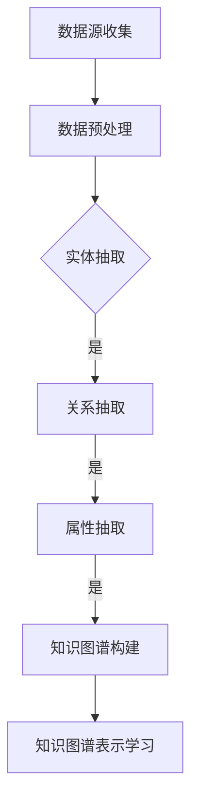

                 


### 知识图谱构建方法

#### 3.1 数据源收集

数据是知识图谱构建的基础，其质量直接影响到知识图谱的准确性和实用性。数据源可以包括结构化数据和非结构化数据。

- **结构化数据**：通常来自数据库，如关系数据库或NoSQL数据库。这类数据有明确的表结构，数据易于解析和抽取。常见的结构化数据源包括企业数据库、社交媒体数据库等。
- **非结构化数据**：包括文本、图像、音频和视频等形式。这类数据没有固定的结构，需要通过自然语言处理、图像识别等技术进行解析和抽取。非结构化数据源如新闻文章、论坛帖子、百度百科等。

#### 3.2 数据预处理

数据预处理是知识图谱构建的关键步骤，目的是将原始数据转化为适合构建知识图谱的形式。

- **数据清洗**：去除数据中的噪声和错误，如缺失值、重复值、不一致的格式等。
- **数据标准化**：统一数据格式，如统一日期格式、统一实体命名等。
- **数据融合**：将来自不同数据源的数据进行整合，消除数据之间的不一致性，如实体识别、关系抽取等。

#### 3.3 知识图谱构建流程

知识图谱构建通常包括以下步骤：

- **实体抽取**：从原始数据中识别出实体，如人名、地名、机构名等。
- **关系抽取**：从实体之间识别出关系，如“工作于”、“出生地”等。
- **属性抽取**：从实体或关系中提取属性信息，如“年龄”、“职位”等。
- **知识图谱构建**：将抽取出的实体、关系和属性组织成知识图谱。知识图谱通常采用图数据库进行存储和管理。

#### 3.4 知识图谱表示学习

知识图谱的表示学习是将图谱中的实体和关系转化为低维向量表示的过程，以便于在机器学习模型中进行处理。

- **实体表示学习**：通过机器学习算法（如神经网络）将实体转化为向量表示，使得相似实体在向量空间中靠近。
- **关系表示学习**：通过学习实体之间的交互模式，将关系转化为向量表示，使得具有相似关系的实体在向量空间中靠近。

### Mermaid 图示例

以下是一个简单的 Mermaid 流程图示例，展示了知识图谱构建的基本流程：



---

**核心概念与联系**

知识图谱构建中的核心概念包括实体、关系和属性。实体是知识图谱中的基本元素，关系描述了实体之间的关联，属性提供了实体或关系的额外信息。

- **实体**：是知识图谱中的基本对象，如人、地点、组织等。
- **关系**：是实体之间的关联，如“工作于”、“属于”等。
- **属性**：是实体或关系的额外信息，如“出生地”、“年龄”等。

这三个概念相互联系，共同构成了知识图谱的结构。通过实体抽取可以从数据中识别出实体；关系抽取和属性抽取可以从实体中提取出关系和属性信息，最终构建出完整的知识图谱。

**核心算法原理讲解**

知识图谱构建中的核心算法包括实体抽取、关系抽取、属性抽取和知识图谱表示学习。

- **实体抽取**：常用的算法有命名实体识别（NER）和关键词提取。NER是利用自然语言处理技术识别文本中的实体，如人名、地名等。关键词提取则是从文本中提取出具有代表性的词语，作为实体的候选。
- **关系抽取**：常用的算法有基于规则的方法和基于机器学习的方法。基于规则的方法通过预定义的规则来识别实体之间的关系，如正则表达式匹配。基于机器学习的方法则通过训练模型来识别实体之间的关系。
- **属性抽取**：常用的算法有基于规则的方法和基于统计的方法。基于规则的方法通过预定义的规则来提取实体或关系的属性，如命名实体识别中的时间属性提取。基于统计的方法则通过分析文本中的模式来提取属性。
- **知识图谱表示学习**：常用的算法有基于深度学习的表示学习方法，如图神经网络（GNN）。GNN通过学习实体和关系之间的交互模式，将实体和关系转化为向量表示，以便于在机器学习模型中进行处理。

**数学模型和公式**

在知识图谱构建中，一些数学模型和公式是必不可少的。

- **图神经网络（GNN）**：GNN的核心公式是节点表示的更新公式：
  $$ h_v^{(t+1)} = \sigma(\sum_{u \in N(v)} W^{(t)} h_u^{(t)}) $$
  其中，$h_v^{(t)}$ 是节点 $v$ 在第 $t$ 次迭代后的表示，$N(v)$ 是节点 $v$ 的邻居节点集合，$W^{(t)}$ 是权重矩阵，$\sigma$ 是激活函数。

- **损失函数**：在知识图谱表示学习中，常用的损失函数是均方误差（MSE）：
  $$ L = \frac{1}{n} \sum_{(v, u, r) \in D} (f(r) - g(h_v, h_u))^2 $$
  其中，$D$ 是训练数据集，$f(r)$ 是关系 $r$ 的预定义函数，$g(h_v, h_u)$ 是实体 $v$ 和 $u$ 的表示。

**代码示例**

以下是一个简单的 Python 代码示例，展示了如何使用图神经网络（GNN）进行知识图谱表示学习：

```python
import tensorflow as tf
from tensorflow.keras.layers import Input, Dense
from tensorflow.keras.models import Model

# 定义 GNN 模型
input_entity = Input(shape=( Embedding_dim,))
input_relation = Input(shape=( Relation_dim,))
hidden = Dense(64, activation='relu')(input_entity)
hidden = Dense(64, activation='relu')(input_relation)
output = Dense(1, activation='sigmoid')(hidden)

model = Model(inputs=[input_entity, input_relation], outputs=output)
model.compile(optimizer='adam', loss='binary_crossentropy')

# 训练模型
model.fit([entity_data, relation_data], labels, epochs=10, batch_size=32)
```

**实际案例分析和详细讲解剖析**

知识图谱构建在实际应用中具有广泛的应用，例如：

- **搜索引擎**：知识图谱可以用于构建搜索引擎的索引，提高搜索的准确性和效率。通过知识图谱中的关系和属性信息，搜索引擎可以更好地理解用户查询，提供更相关的搜索结果。
- **问答系统**：知识图谱可以用于构建问答系统，通过将用户的问题与知识图谱中的实体和关系进行匹配，提供准确的答案。
- **推荐系统**：知识图谱可以用于构建推荐系统，通过分析知识图谱中的关系和属性，提供个性化的推荐结果。

**项目实战**

在项目实战中，我们需要进行以下步骤：

- **开发环境搭建**：安装必要的软件和工具，如 TensorFlow、PyTorch、Neo4j 等。
- **源代码详细实现和代码解读**：编写代码实现知识图谱构建的各个步骤，并对关键代码进行解读。
- **代码应用解读与分析**：将知识图谱应用于实际场景，如搜索引擎、问答系统等，分析其效果和性能。
- **实际案例分析和详细讲解剖析**：选择典型的应用案例，进行详细的分析和讲解，展示知识图谱在具体场景中的应用效果。

**最佳实践 tips**

- **数据质量**：确保数据质量是构建高质量知识图谱的关键。进行充分的数据清洗和预处理，以消除数据中的噪声和错误。
- **模型选择**：根据具体的应用场景和需求，选择合适的模型和算法。例如，对于实体抽取，可以选择基于规则的方法或基于机器学习的方法。
- **模型优化**：通过调整模型的参数和架构，优化模型的性能和效果。例如，可以尝试不同的激活函数、优化器等。

**小结**

知识图谱构建是自然语言处理和人工智能领域的重要研究方向。通过构建高质量的知识图谱，可以提升语言模型的推理能力，为各种应用提供强有力的支持。

**注意事项**

- **隐私保护**：在构建知识图谱时，需要特别注意保护用户隐私，避免泄露敏感信息。
- **数据更新**：知识图谱需要定期更新，以适应不断变化的数据和需求。

**拓展阅读**

- [《知识图谱技术综述》](https://www.kdnuggets.com/2017/04/knowledge-graph-technology.html)
- [《图神经网络（GNN）详解》](https://towardsdatascience.com/an-introduction-to-graph-neural-networks-56e6a48a7c02)
- [《知识图谱在搜索引擎中的应用》](https://www.semanticmodels.com/knowledge-graphs-in-search-engines/)

