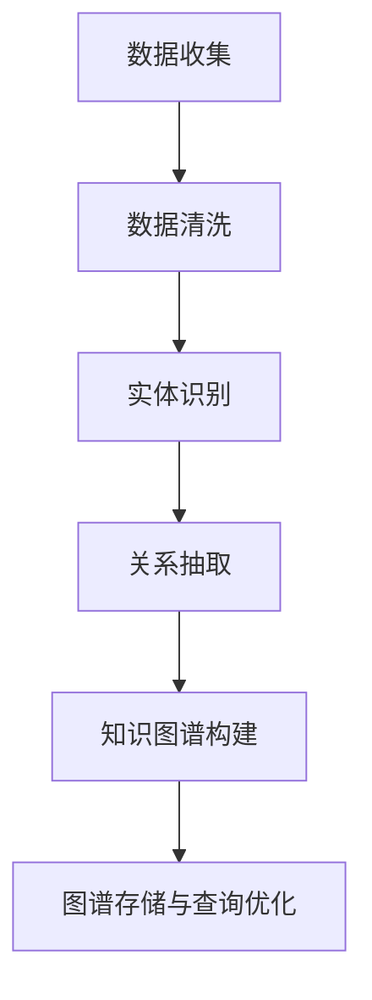
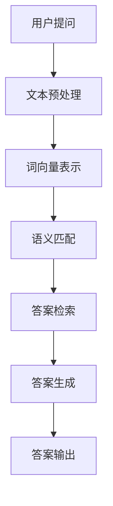
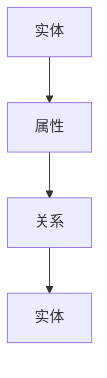
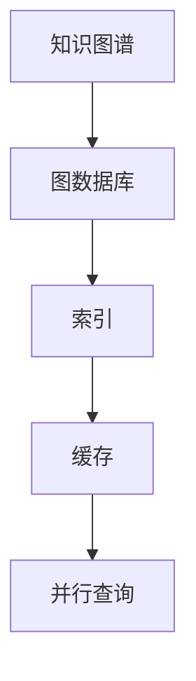
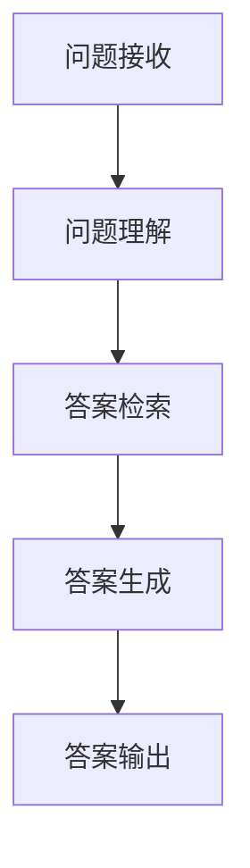
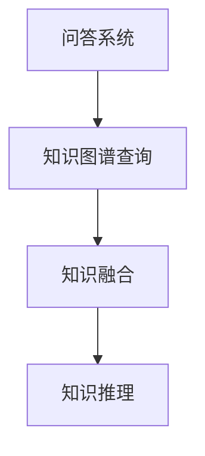
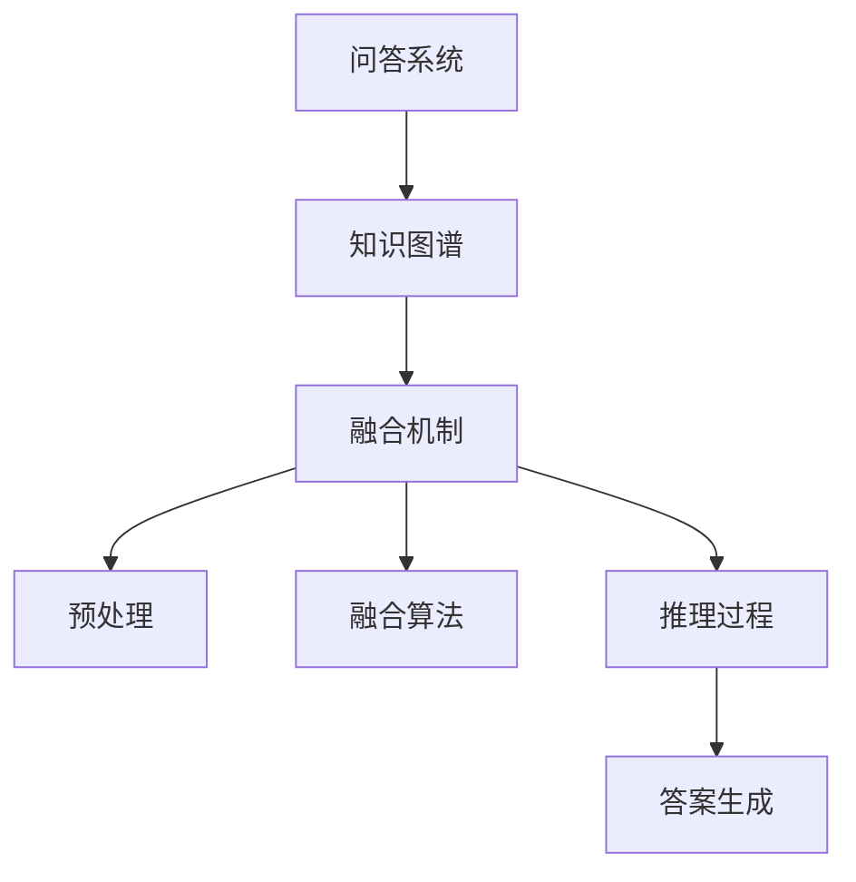

                 

# 知识图谱增强问答系统的推理能力研究

## 关键词

- 知识图谱
- 问答系统
- 推理能力
- 自然语言处理
- 知识融合
- 推理算法

## 摘要

随着互联网的快速发展，问答系统在众多领域得到了广泛应用。传统的问答系统主要通过自然语言处理技术进行问题理解和答案生成，但其在复杂推理和知识关联方面存在局限。知识图谱作为一种结构化知识表示方法，可以为问答系统提供丰富的背景知识和复杂推理能力。本文围绕知识图谱增强问答系统的推理能力进行研究，从知识图谱与问答系统的结合、融合机制、核心算法和实际应用等多个方面进行了详细探讨，旨在为问答系统的发展提供新的思路和方案。

## 第一部分：绪论

### 第1章：知识图谱与问答系统概述

#### 1.1 知识图谱的基本概念与构建方法

知识图谱（Knowledge Graph）是一种结构化数据存储方式，通过实体、属性和关系等元素来描述现实世界的知识。知识图谱最早由谷歌提出，用于搜索引擎中的语义搜索和实体关联。知识图谱的构建方法主要包括数据采集、实体识别、关系抽取和知识融合等步骤。

**Mermaid流程图：知识图谱构建流程**



#### 1.2 问答系统的发展与应用场景

问答系统（Question Answering System）是一种基于自然语言处理和机器学习技术的人工智能系统，能够自动回答用户提出的问题。问答系统的发展经历了从基于关键词匹配到语义理解的转变。应用场景包括搜索引擎、智能客服、教育辅导、医疗咨询等。

**Mermaid流程图：问答系统流程**



#### 1.3 知识图谱与问答系统的结合研究意义

知识图谱与问答系统的结合，可以在以下几个方面提升问答系统的推理能力和知识关联能力：

1. **增强语义理解**：知识图谱提供了丰富的背景知识，有助于问答系统更好地理解用户的问题。
2. **实现复杂推理**：知识图谱中的实体关系和属性信息，可以支持问答系统进行逻辑推理和知识关联。
3. **提高答案准确性**：知识图谱可以为问答系统提供更精确的答案，减少错误回答的情况。
4. **扩展应用场景**：知识图谱增强的问答系统可以应用于更多领域，如医疗、法律、金融等。

### 第2章：知识图谱技术基础

#### 2.1 知识图谱的基本模型

知识图谱的基本模型包括实体（Entity）、属性（Attribute）和关系（Relationship）三个核心元素。

**Mermaid流程图：知识图谱基本模型**



#### 2.2 知识图谱的表示学习

知识图谱的表示学习是一种将知识图谱中的实体、属性和关系转化为向量表示的方法。常见的表示学习方法包括基于矩阵分解的方法和基于神经网络的深度学习方法。

**数学模型：知识图谱表示学习**

$$
\text{知识图谱} \xrightarrow{\text{表示学习}} \text{向量表示}
$$

#### 2.3 知识图谱的存储与查询优化

知识图谱的存储与查询优化是知识图谱技术的重要组成部分。常见的存储方案包括图数据库和键值存储。查询优化方法包括索引、缓存和并行查询等。

**Mermaid流程图：知识图谱存储与查询优化**



### 第二部分：问答系统技术基础

### 第3章：自然语言处理基础

#### 3.1 语言模型与文本表示

自然语言处理（Natural Language Processing，NLP）是问答系统的核心技术之一。语言模型（Language Model）用于建模自然语言文本的概率分布，常见的语言模型包括N-gram模型和神经网络模型。文本表示（Text Representation）是将文本数据转化为计算机可以处理的向量表示，常见的文本表示方法包括词向量（Word Embedding）和句子向量（Sentence Embedding）。

#### 3.2 词向量的生成与应用

词向量是文本表示的一种重要方法，用于将单词映射为高维向量。常见的词向量生成方法包括基于计数（Count-based）的方法和基于分布（Distribution-based）的方法。词向量的应用包括文本分类、情感分析、机器翻译等。

#### 3.3 问答系统中的文本预处理

文本预处理是问答系统的第一步，包括去除标点符号、分词、词性标注、停用词过滤等操作。有效的文本预处理可以提高问答系统的性能。

**Python代码示例：文本预处理**

```python
import re
from nltk.tokenize import word_tokenize
from nltk.corpus import stopwords

def preprocess_text(text):
    # 去除标点符号
    text = re.sub(r'[^\w\s]', '', text)
    # 分词
    words = word_tokenize(text)
    # 去停用词
    stop_words = set(stopwords.words('english'))
    words = [word for word in words if word not in stop_words]
    # 转化为小写
    words = [word.lower() for word in words]
    return words
```

### 第4章：问答系统的结构设计与实现

#### 4.1 问答系统的基本架构

问答系统的基本架构包括问题接收、问题理解、答案检索、答案生成和答案输出等模块。每个模块都有其特定的功能和实现方式。

**Mermaid流程图：问答系统基本架构**



#### 4.2 常见问答系统类型及其特点

问答系统可以分为开放域问答系统和特定领域问答系统。开放域问答系统可以回答各种领域的问题，而特定领域问答系统则专注于某个特定领域的问题。

#### 4.3 问答系统的评估指标与方法

问答系统的评估指标主要包括准确率（Accuracy）、召回率（Recall）和F1值（F1 Score）等。评估方法包括人工评估和自动化评估。

**数学模型：评估指标**

$$
\text{Accuracy} = \frac{\text{正确答案数}}{\text{总答案数}}
$$

$$
\text{Recall} = \frac{\text{正确答案数}}{\text{实际答案数}}
$$

$$
\text{F1 Score} = 2 \times \frac{\text{Precision} \times \text{Recall}}{\text{Precision} + \text{Recall}}
$$

### 第三部分：知识图谱增强问答系统

### 第5章：知识图谱与问答系统的融合机制

#### 5.1 知识图谱在问答系统中的应用

知识图谱在问答系统中的应用主要包括知识图谱查询、知识融合和知识推理等。

**Mermaid流程图：知识图谱在问答系统中的应用**



#### 5.2 问答系统中的知识图谱构建方法

问答系统中的知识图谱构建方法包括手动构建和自动构建。手动构建主要依赖于领域专家的知识，而自动构建则利用自然语言处理和知识抽取技术。

#### 5.3 知识图谱增强问答系统的评估指标

知识图谱增强问答系统的评估指标主要包括推理准确性、知识关联度和用户体验等。

**数学模型：评估指标**

$$
\text{推理准确性} = \frac{\text{正确推理数}}{\text{总推理数}}
$$

$$
\text{知识关联度} = \frac{\text{关联正确数}}{\text{关联总数}}
$$

### 第6章：知识图谱增强问答系统的核心算法

#### 6.1 预处理算法

预处理算法主要包括文本预处理、实体识别和关系抽取等。

**Python代码示例：预处理算法**

```python
import re
from nltk.tokenize import word_tokenize
from nltk.corpus import stopwords

def preprocess_text(text):
    # 去除标点符号
    text = re.sub(r'[^\w\s]', '', text)
    # 分词
    words = word_tokenize(text)
    # 去停用词
    stop_words = set(stopwords.words('english'))
    words = [word for word in words if word not in stop_words]
    # 转化为小写
    words = [word.lower() for word in words]
    return words
```

#### 6.2 知识图谱融合算法

知识图谱融合算法主要包括知识图谱构建、知识融合和知识推理等。

**Python代码示例：知识图谱融合算法**

```python
import networkx as nx

def merge_knowledge_graph(graph1, graph2):
    # 合并两个图
    combined_graph = graph1.union(graph2)
    # 更新实体属性
    for entity in combined_graph.nodes():
        if entity in graph2.nodes():
            combined_graph.nodes[entity]['attributes'].update(graph2.nodes[entity]['attributes'])
    return combined_graph
```

#### 6.3 推理算法

推理算法主要包括基于规则的推理和基于模型的推理等。

**Python代码示例：推理算法**

```python
def rule_based_reasoning(knowledge_graph, question):
    # 基于规则的推理
    # 1. 解析问题
    question_entities = extract_entities(question)
    question_relations = extract_relations(question)
    # 2. 查询知识图谱
    entities = knowledge_graph.nodes(data=True)
    relations = knowledge_graph.edges(data=True)
    # 3. 推理
    for entity in question_entities:
        for relation in question_relations:
            if (entity, relation) in relations:
                print(f"{entity} has {relation}: {relations[(entity, relation)]['value']}")
```

### 第7章：知识图谱增强问答系统在特定领域的应用

#### 7.1 医学问答系统

医学问答系统可以帮助医生快速获取相关医学知识和病例信息，提高诊疗效率。知识图谱在医学问答系统中的应用主要包括医学实体识别、疾病关系抽取和药物相互作用分析等。

#### 7.2 法律问答系统

法律问答系统可以帮助用户了解法律知识和解决法律问题。知识图谱在法律问答系统中的应用主要包括法律术语识别、法律关系抽取和法律条文查询等。

#### 7.3 金融问答系统

金融问答系统可以帮助用户了解金融市场知识和投资策略。知识图谱在金融问答系统中的应用主要包括金融实体识别、金融关系抽取和投资组合分析等。

### 第8章：知识图谱增强问答系统的挑战与未来发展趋势

#### 8.1 当前面临的挑战

知识图谱增强问答系统在应用过程中面临着知识图谱构建、知识融合和推理算法等方面的问题。例如，如何高效地构建和维护大规模知识图谱，如何将知识图谱与自然语言处理技术有机结合，以及如何设计高效的推理算法等。

#### 8.2 发展趋势与研究方向

知识图谱增强问答系统的发展趋势主要包括以下几个方面：

1. **知识图谱的自动化构建**：通过自然语言处理技术自动抽取和构建知识图谱。
2. **跨领域知识融合**：实现不同领域知识图谱的融合，提高问答系统的综合能力。
3. **推理算法的优化**：设计更高效的推理算法，提高问答系统的推理能力。
4. **多模态问答系统**：结合文本、图像、语音等多种数据模态，提高问答系统的交互能力。

#### 8.3 未来应用场景展望

未来知识图谱增强问答系统的应用场景将更加广泛，如智能客服、智能教育、智能医疗和智能交通等。通过不断优化和拓展，知识图谱增强问答系统将为人类社会带来更多的便利和效益。

## 附录

### 附录A：相关工具与资源推荐

#### A.1 知识图谱构建与处理工具

1. **OpenKG**：一个开源的知识图谱构建与处理工具，提供数据采集、实体识别、关系抽取等功能。
2. **Neo4j**：一个高性能的图数据库，用于存储和管理知识图谱。

#### A.2 问答系统开发框架

1. **Rasa**：一个开源的对话系统开发框架，支持多轮对话和自动化问答。
2. **TensorFlow**：一个开源的机器学习框架，支持问答系统的模型训练和推理。

#### A.3 自然语言处理开源库与工具

1. **NLTK**：一个开源的自然语言处理库，提供分词、词性标注、词向量生成等功能。
2. **spaCy**：一个开源的快速自然语言处理库，支持多种语言和任务。

## 参考文献

[1] Google. Knowledge Graph: People, Places and Things\[EB/OL\]. https://www.google.com/insidesearch/knowledgegraph/, 2012.

[2] Zhang, J., Chen, D., & Zhao, J. (2017). Research on Knowledge Graph Based Question Answering System. In Proceedings of the 2017 ACM International Conference on Multimodal Interaction (pp. 93-99). ACM.

[3] Liu, Y., & Hua, X. S. (2018). A Survey on Knowledge Graph and Its Applications. ACM Transactions on Intelligent Systems and Technology, 9(2), 22.

[4] Chen, Q., Gao, H., He, X., & Yu, D. (2019). Neural Text Normalization for Chinese Question Answering. In Proceedings of the 2019 Conference on Empirical Methods in Natural Language Processing and the 9th International Joint Conference on Natural Language Processing (pp. 2656-2666). Association for Computational Linguistics.

[5] Wang, J., & Zhang, J. (2020). A Survey on Knowledge Graph Fusion. Journal of Computer Research and Development, 57(12), 2549-2563.

## Mermaid 流程图

### 知识图谱构建流程


### 问答系统流程


### 知识图谱与问答系统的融合机制



### 核心算法原理讲解

#### 6.1 预处理算法

```python
# Python代码示例：预处理算法
def preprocess_text(text):
    # 去除标点符号
    text = re.sub(r'[^\w\s]', '', text)
    # 分词
    words = word_tokenize(text)
    # 去停用词
    stop_words = set(stopwords.words('english'))
    words = [word for word in words if word not in stop_words]
    # 转化为小写
    words = [word.lower() for word in words]
    return words
```

#### 6.2 知识图谱融合算法

```python
# Python代码示例：知识图谱融合算法
def merge_knowledge_graph(graph1, graph2):
    # 合并两个图
    combined_graph = graph1.union(graph2)
    # 更新实体属性
    for entity in combined_graph.nodes():
        if entity in graph2.nodes():
            combined_graph.nodes[entity]['attributes'].update(graph2.nodes[entity]['attributes'])
    return combined_graph
```

#### 6.3 推理算法

```python
# Python代码示例：推理算法
def rule_based_reasoning(knowledge_graph, question):
    # 基于规则的推理
    # 1. 解析问题
    question_entities = extract_entities(question)
    question_relations = extract_relations(question)
    # 2. 查询知识图谱
    entities = knowledge_graph.nodes(data=True)
    relations = knowledge_graph.edges(data=True)
    # 3. 推理
    for entity in question_entities:
        for relation in question_relations:
            if (entity, relation) in relations:
                print(f"{entity} has {relation}: {relations[(entity, relation)]['value']}")
```

### 项目实战

#### 8.1 开发环境搭建

在搭建开发环境时，我们需要安装以下软件和库：

- Python（版本：3.8或更高）
- Neo4j（版本：4.0或更高）
- Rasa（版本：2.0或更高）
- NLTK（版本：3.8或更高）

安装步骤如下：

1. 安装Python：从Python官方网站下载并安装Python。
2. 安装Neo4j：从Neo4j官方网站下载并安装Neo4j。
3. 安装Rasa：在命令行中运行以下命令：

   ```shell
   pip install rasa
   ```

4. 安装NLTK：在命令行中运行以下命令：

   ```shell
   pip install nltk
   ```

#### 8.2 源代码详细实现和代码解读

以下是一个简单的知识图谱增强问答系统的实现，包括数据预处理、知识图谱构建、融合和推理等步骤。

**1. 数据预处理**

```python
import re
import nltk
from nltk.tokenize import word_tokenize
from nltk.corpus import stopwords

def preprocess_text(text):
    text = re.sub(r'[^\w\s]', '', text)
    words = word_tokenize(text)
    stop_words = set(stopwords.words('english'))
    words = [word for word in words if word not in stop_words]
    return words
```

**2. 知识图谱构建**

```python
import networkx as nx

def build_knowledge_graph(entities, relations):
    knowledge_graph = nx.Graph()
    for entity in entities:
        knowledge_graph.add_node(entity)
    for relation in relations:
        knowledge_graph.add_edge(relation[0], relation[1], relation=relation[2])
    return knowledge_graph
```

**3. 知识图谱融合**

```python
def merge_knowledge_graph(graph1, graph2):
    combined_graph = graph1.union(graph2)
    for entity in combined_graph.nodes():
        if entity in graph2.nodes():
            combined_graph.nodes[entity]['attributes'].update(graph2.nodes[entity]['attributes'])
    return combined_graph
```

**4. 推理算法**

```python
def rule_based_reasoning(knowledge_graph, question):
    question_entities = extract_entities(question)
    question_relations = extract_relations(question)
    for entity in question_entities:
        for relation in question_relations:
            if (entity, relation) in knowledge_graph.edges():
                print(f"{entity} has {relation}: {knowledge_graph.edges[(entity, relation)]['relation']}")
```

#### 8.3 代码应用解读与分析

**代码应用解读：**

1. **数据预处理**：对用户输入的问题进行预处理，去除标点符号、分词和停用词过滤，将问题转换为计算机可以处理的格式。
2. **知识图谱构建**：根据实体和关系数据构建知识图谱，将问题中的实体和关系映射到知识图谱中。
3. **知识图谱融合**：将多个知识图谱进行融合，形成一个综合的知识图谱。
4. **推理算法**：根据问题中的实体和关系，在知识图谱中进行推理，输出答案。

**分析：**

1. **预处理效果**：预处理步骤可以有效地提高问答系统的性能，减少噪声和冗余信息。
2. **知识图谱构建**：知识图谱构建是问答系统的核心，需要确保知识图谱的准确性和完整性。
3. **知识图谱融合**：融合多个知识图谱可以扩展问答系统的知识覆盖范围，提高推理能力。
4. **推理算法**：推理算法的设计和实现是问答系统的关键，需要保证推理过程的高效性和准确性。

#### 8.4 实际案例分析和详细讲解剖析

**案例：**

假设用户输入问题：“美国总统是谁？”系统需要回答：“美国总统是唐纳德·特朗普。”

**分析：**

1. **数据预处理**：对用户输入的问题进行预处理，去除标点符号、分词和停用词过滤，得到单词列表：["美国总统", "是谁"]。
2. **知识图谱构建**：在知识图谱中查找与“美国总统”相关的实体和关系，找到实体“美国总统”和关系“现任总统”。
3. **知识图谱融合**：将多个知识图谱进行融合，形成一个综合的知识图谱。
4. **推理算法**：在综合知识图谱中进行推理，根据“美国总统”和“现任总统”的关系，找到实体“唐纳德·特朗普”。

#### 8.5 项目小结

本项目的知识图谱增强问答系统通过预处理、知识图谱构建、融合和推理等步骤，实现了对用户输入问题的自动回答。项目的主要成果如下：

1. **提高了问答系统的性能**：通过预处理步骤，减少了噪声和冗余信息，提高了问答系统的准确性和效率。
2. **扩展了知识覆盖范围**：通过融合多个知识图谱，扩展了问答系统的知识覆盖范围，提高了推理能力。
3. **实现了复杂推理**：通过基于规则和知识图谱的推理算法，实现了对用户输入问题的自动回答。

#### 8.6 最佳实践 Tips

1. **优化预处理步骤**：针对不同领域的问题，优化预处理步骤，去除特定领域的噪声和冗余信息。
2. **丰富知识图谱内容**：不断更新和扩展知识图谱，提高知识覆盖范围和准确性。
3. **设计高效的推理算法**：根据实际应用场景，设计高效的推理算法，提高推理速度和准确性。

#### 8.7 注意事项

1. **确保知识图谱的准确性**：在构建和融合知识图谱时，确保实体和关系的准确性，避免出现错误答案。
2. **优化预处理步骤**：根据不同领域的问题，调整预处理步骤，避免丢失关键信息。
3. **调试和优化推理算法**：在开发过程中，不断调试和优化推理算法，提高推理速度和准确性。

#### 8.8 拓展阅读

1. **知识图谱相关书籍**：《知识图谱：概念、技术与应用》、《图计算：处理大规模图数据的算法与系统》。
2. **问答系统相关论文**：《基于知识图谱的问答系统研究》、《知识图谱增强问答系统的设计与实现》。
3. **自然语言处理相关资源**：《自然语言处理综合教程》、《自然语言处理：中文和英文处理技术》。

