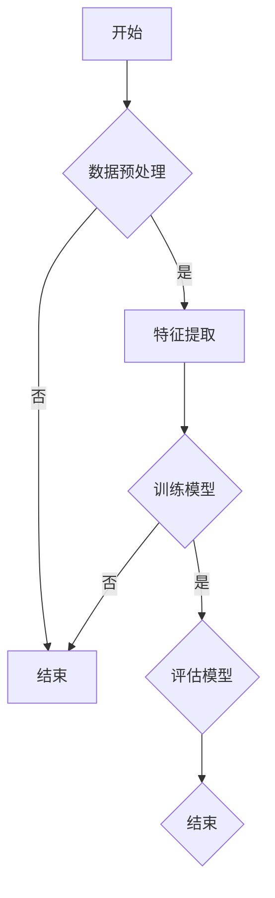

                 

### 引言

多语言语音识别作为自然语言处理领域中的重要分支，旨在实现不同语言之间的语音信息转换，具有广泛的应用前景。然而，多语言语音识别面临着诸多挑战，如不同语言间的语音特征差异、多语言语音数据的不平衡、以及多语言模型的训练效率等问题。

知识蒸馏作为一种重要的模型压缩技术，通过将复杂模型的知识传递给更简单的模型，实现了模型的压缩和加速。在多语言语音识别中，知识蒸馏被广泛用于解决多语言模型的训练效率和效果问题。通过知识蒸馏，教师模型（通常是复杂的预训练模型）可以将自己的知识传递给学生模型（通常是更简单的模型），从而使得学生模型能够在较少的训练数据和更短的时间内达到教师模型的性能水平。

本文将围绕知识蒸馏在多语言语音识别中的协同策略进行探讨。首先，我们将介绍知识蒸馏的基础理论，包括其定义、背景和应用场景。接着，我们将详细解析知识蒸馏的核心概念，如原始模型与教师模型、学生模型与蒸馏损失函数，以及知识蒸馏的评估指标。随后，我们将深入探讨知识蒸馏的算法原理，包括模拟退火算法、蒸馏损失函数的设计以及知识蒸馏过程的具体实现。

在多语言语音识别的背景下，我们将介绍多语言语音识别的概述、挑战和现状。然后，我们将重点讨论知识蒸馏在多语言语音识别中的应用，包括其面临的挑战、应用实例以及效果评估。接下来，我们将探讨如何优化多语言语音识别中的协同策略，包括协同策略优化方法、挑战和实例分析。

为了更好地理解和应用知识蒸馏在多语言语音识别中的协同策略，我们将在最后部分通过一个实战案例，详细展示知识蒸馏在多语言语音识别中的具体应用过程，包括环境搭建、代码实现和效果分析。最后，我们将总结多语言语音识别的发展趋势、知识蒸馏在其中的未来应用以及潜在挑战，为读者提供全面的视角和深入的理解。

通过本文的详细探讨，我们希望读者能够全面了解知识蒸馏在多语言语音识别中的协同策略，掌握其核心原理和应用方法，从而在多语言语音识别的实际应用中取得更好的效果。

### 关键词

- 知识蒸馏
- 多语言语音识别
- 教师模型
- 学生模型
- 蒸馏损失函数
- 模拟退火算法
- 协同策略
- 优化方法

### 摘要

本文旨在探讨知识蒸馏在多语言语音识别中的协同策略。首先，我们介绍了知识蒸馏的基础理论，包括其定义、背景和应用场景。接着，我们详细解析了知识蒸馏的核心概念，如原始模型与教师模型、学生模型与蒸馏损失函数，以及知识蒸馏的评估指标。随后，我们深入探讨了知识蒸馏的算法原理，包括模拟退火算法、蒸馏损失函数的设计以及知识蒸馏过程的具体实现。在多语言语音识别的背景下，我们介绍了多语言语音识别的概述、挑战和现状，并重点讨论了知识蒸馏在多语言语音识别中的应用，包括其面临的挑战、应用实例以及效果评估。最后，我们探讨了如何优化多语言语音识别中的协同策略，包括协同策略优化方法、挑战和实例分析。通过一个实战案例，我们详细展示了知识蒸馏在多语言语音识别中的具体应用过程，并对多语言语音识别的发展趋势、知识蒸馏在其中的未来应用以及潜在挑战进行了总结。本文旨在为读者提供一个全面和深入的理解，帮助其在多语言语音识别的实际应用中取得更好的效果。

## 第一部分：知识蒸馏基础理论

### 第1章：知识蒸馏概述

#### 1.1 知识蒸馏的定义

知识蒸馏（Knowledge Distillation）是一种模型压缩技术，旨在通过将复杂模型（通常称为“教师模型”）的知识传递给更简单的模型（通常称为“学生模型”），从而实现模型的压缩和加速。在这个过程中，教师模型通常是一个具有高容量和高性能的复杂模型，而学生模型则是一个更简单、更轻量级的模型。知识蒸馏的目标是使学生模型在较少的训练数据和更短的时间内达到教师模型在特定任务上的性能水平。

#### 1.2 知识蒸馏的背景

随着深度学习技术的快速发展，复杂的神经网络模型在各个领域取得了显著的成果。然而，这些复杂模型通常需要大量的训练数据和计算资源，这在实际应用中带来了很大的挑战。例如，在语音识别、图像识别和自然语言处理等任务中，如何高效地训练和部署这些复杂模型是一个亟待解决的问题。知识蒸馏技术正是为了解决这一需求而提出的。

知识蒸馏的背景可以追溯到早期的人工智能研究。在1990年代，研究者们开始探索通过将教师模型的知识传递给学生模型来加速模型的训练和部署。随着深度学习技术的发展，知识蒸馏逐渐成为了一个独立的研究方向，并在多个领域取得了显著的应用成果。

#### 1.3 知识蒸馏的应用场景

知识蒸馏技术具有广泛的应用场景，主要包括以下几方面：

1. **模型压缩**：通过知识蒸馏，可以将复杂的神经网络模型压缩成更简单的模型，从而降低模型的参数数量和计算复杂度。这有助于提高模型的部署效率和资源利用率。

2. **训练效率提升**：在训练复杂模型时，知识蒸馏技术可以显著减少所需的训练数据和计算资源。通过利用教师模型的知识，学生模型可以在更短的时间内达到教师模型的性能水平。

3. **迁移学习**：知识蒸馏技术可以促进模型在不同任务之间的迁移学习。通过将教师模型的知识传递给学生模型，可以在新的任务上快速地训练出一个高性能的模型。

4. **低资源场景**：在低资源环境中，如移动设备、嵌入式系统等，知识蒸馏技术可以帮助模型在有限的计算资源和存储空间内实现高性能。

#### 1.4 知识蒸馏的重要性

知识蒸馏技术在当前人工智能领域中具有重要意义。首先，它为复杂模型的训练和部署提供了一种高效的方法，有助于降低计算成本和资源消耗。其次，知识蒸馏技术可以促进模型在不同任务和场景之间的迁移学习，从而提高模型的泛化能力和适应性。最后，知识蒸馏技术还为人工智能的可持续发展提供了新的思路，有助于推动人工智能技术在更广泛的应用场景中发挥作用。

通过本章的介绍，我们对知识蒸馏的定义、背景和应用场景有了基本的了解。接下来，我们将进一步探讨知识蒸馏的核心概念和算法原理，为读者提供更深入的理解。

#### 1.5 知识蒸馏在多语言语音识别中的应用

在多语言语音识别中，知识蒸馏技术具有显著的应用潜力。多语言语音识别面临着多个语言之间的语音特征差异、数据不平衡和模型训练效率等问题，这些问题限制了多语言语音识别系统的性能和部署效果。知识蒸馏技术可以通过以下几个关键点来改善多语言语音识别：

1. **知识传递**：通过知识蒸馏，可以将一个多语言教师模型的知识传递给多个单一语言的学生模型。这种方法可以减少对每个单一语言模型的独立训练需求，从而提高训练效率。

2. **模型压缩**：多语言语音识别系统通常包含多个语言模型，这些模型具有很高的参数数量。通过知识蒸馏，可以将这些复杂的多语言模型压缩成更简单的模型，从而降低模型的存储和计算需求。

3. **资源利用**：在多语言语音识别中，资源（如计算能力和存储空间）通常是一个重要的考虑因素。知识蒸馏技术可以通过减少训练数据和模型参数的数量，优化资源利用效率。

4. **数据不平衡**：多语言语音识别中，不同语言的数据量通常差异很大。知识蒸馏技术可以帮助缓解数据不平衡问题，通过教师模型的知识传递，使得学生模型能够更好地适应不同语言的数据。

5. **迁移学习**：多语言语音识别中的知识蒸馏技术还可以促进迁移学习，教师模型在不同语言上的训练经验可以被传递给学生模型，从而提高学生模型在新语言上的性能。

具体应用场景包括：

- **实时多语言语音识别系统**：在实时应用中，如跨语言客服系统、多语言语音助手等，知识蒸馏技术可以帮助模型在多种语言之间快速切换，提高响应速度和用户体验。
- **边缘设备**：在资源受限的边缘设备上，如智能手机、智能家居设备等，知识蒸馏技术可以通过压缩模型和优化资源利用，实现高效的多语言语音识别。
- **跨语言语音合成**：在跨语言语音合成系统中，知识蒸馏技术可以帮助模型更好地适应多种语言的语音特征，提高合成的自然度和准确性。

通过上述应用，知识蒸馏技术为多语言语音识别带来了显著的性能提升和效率优化。然而，这也带来了一些新的挑战，如如何设计合适的蒸馏损失函数、如何优化知识传递过程等。这些问题的解决将有助于进一步推动知识蒸馏技术在多语言语音识别中的应用。

#### 1.6 本章小结

本章介绍了知识蒸馏的定义、背景和应用场景，重点讨论了知识蒸馏在多语言语音识别中的应用。知识蒸馏通过将复杂模型的知识传递给简单模型，实现了模型的压缩和加速，为多语言语音识别带来了诸多优势。在接下来的章节中，我们将深入探讨知识蒸馏的核心概念和算法原理，进一步理解其在多语言语音识别中的具体应用。

## 第2章：知识蒸馏核心概念

### 2.1 原始模型与教师模型

在知识蒸馏过程中，原始模型（也称为教师模型）和学生模型是两个核心概念。教师模型通常是一个具有高容量和高性能的复杂模型，它经过大量的数据和训练时间，具备了丰富的知识。学生模型则是一个更简单、更轻量级的模型，它的目标是通过学习教师模型的知识来提升自己的性能。

#### 教师模型

教师模型在知识蒸馏中扮演着知识传递者的角色。它具有以下特点：

1. **高容量**：教师模型通常具有大量的参数和层，能够捕捉到输入数据的复杂特征。
2. **高性能**：教师模型在特定任务上具有较高的准确性或性能指标，如最低的误差率或最高的准确度。
3. **训练资源丰富**：教师模型通常在大量的训练数据和长时间的训练过程中训练出来。

#### 学生模型

学生模型是知识蒸馏中的学习者。它通过学习教师模型的知识来提升自己的性能，具有以下特点：

1. **轻量级**：学生模型通常具有较少的参数和层，相较于教师模型更为简单和高效。
2. **低资源需求**：学生模型在训练和部署时所需的计算资源和存储空间较少，适用于资源受限的场景。
3. **学习目标**：学生模型的目标是通过学习教师模型的知识，在特定任务上达到与教师模型相近或更优的性能。

#### 教师模型与原始模型的关系

教师模型和学生模型之间的关系是知识蒸馏的核心。教师模型通过其训练好的参数和知识，指导学生模型进行学习。在知识蒸馏过程中，教师模型通常产生两个输出：

1. **硬标签**：硬标签是教师模型对于给定输入数据的直接输出，通常是一个分类结果或预测值。
2. **软标签**：软标签是教师模型输出的概率分布，反映了教师模型对于输入数据的置信度。

学生模型在学习过程中会根据这两个输出进行优化。硬标签提供了明确的指导，而软标签则提供了教师模型对输入数据的理解程度。通过结合硬标签和软标签，学生模型能够更好地学习教师模型的知识，从而提升自身的性能。

### 2.2 学患者模型与蒸馏损失函数

学生模型（也称为学患者模型）是知识蒸馏过程中的关键部分，它通过学习教师模型的知识来提升自身的性能。学生模型的训练过程中，蒸馏损失函数（Knowledge Distillation Loss Function）起到了至关重要的作用。蒸馏损失函数用于度量学生模型输出与教师模型输出之间的差异，从而指导学生模型进行优化。

#### 学患者模型

学生模型是知识蒸馏过程中的学习者。它具有以下特点：

1. **简单结构**：学生模型通常具有较少的参数和层，相较于教师模型更为简单和高效。
2. **轻量级**：学生模型在训练和部署时所需的计算资源和存储空间较少，适用于资源受限的场景。
3. **学习目标**：学生模型的目标是通过学习教师模型的知识，在特定任务上达到与教师模型相近或更优的性能。

#### 蒸馏损失函数

蒸馏损失函数是知识蒸馏过程中的核心组成部分，用于度量学生模型输出与教师模型输出之间的差异。常见的蒸馏损失函数包括以下几种：

1. **交叉熵损失函数**：交叉熵损失函数是最常见的蒸馏损失函数之一，用于度量学生模型的输出概率分布与教师模型输出的软标签之间的差异。其公式如下：

   $$
   L_{CE} = -\sum_{i=1}^{N} \sum_{j=1}^{C} y_j \log(p_j)
   $$

   其中，$y_j$是教师模型的软标签概率，$p_j$是学生模型的输出概率。

2. **软标签损失函数**：软标签损失函数直接度量学生模型的输出与教师模型软标签之间的差异，其公式如下：

   $$
   L_{ST} = \sum_{i=1}^{N} \sum_{j=1}^{C} (y_j - p_j)^2
   $$

   其中，$y_j$是教师模型的软标签，$p_j$是学生模型的输出。

3. **融合损失函数**：融合损失函数将交叉熵损失函数和软标签损失函数结合起来，旨在同时优化学生模型的硬标签和软标签。其公式如下：

   $$
   L_{Fused} = w_1 \cdot L_{CE} + w_2 \cdot L_{ST}
   $$

   其中，$w_1$和$w_2$是权重参数，用于平衡交叉熵损失函数和软标签损失函数的影响。

#### 蒸馏损失函数的作用

蒸馏损失函数在知识蒸馏过程中起到了关键作用。它通过度量学生模型的输出与教师模型输出之间的差异，指导学生模型进行优化，使其更好地学习教师模型的知识。具体作用如下：

1. **优化学生模型的输出概率分布**：通过交叉熵损失函数，学生模型可以学习到教师模型的输出概率分布，从而优化自己的输出概率分布，提高预测的准确性。
2. **增强学生模型对教师模型的理解**：通过软标签损失函数，学生模型可以学习到教师模型对输入数据的理解程度，从而提高对输入数据的处理能力。
3. **融合硬标签和软标签**：融合损失函数将硬标签和软标签结合起来，使学生模型能够同时优化硬标签和软标签，从而提高模型的整体性能。

通过深入理解教师模型和学生模型，以及蒸馏损失函数的作用，我们能够更好地利用知识蒸馏技术，提升模型的性能和效率。在接下来的章节中，我们将进一步探讨知识蒸馏的评估指标，以及具体的算法原理和实现。

### 2.3 知识蒸馏的评估指标

在知识蒸馏过程中，评估指标（Evaluation Metrics）是衡量学生模型性能的重要工具。通过这些评估指标，我们可以了解学生模型在特定任务上的表现，以及知识蒸馏的效果。常见的评估指标包括准确性（Accuracy）、精确率（Precision）、召回率（Recall）和F1分数（F1 Score）等。以下是这些指标的定义和计算方法：

#### 1. 准确性（Accuracy）

准确性是评估模型性能的基本指标，表示模型正确预测的样本数占总样本数的比例。其计算公式如下：

$$
Accuracy = \frac{TP + TN}{TP + TN + FP + FN}
$$

其中，$TP$表示真正例（True Positives），$TN$表示真负例（True Negatives），$FP$表示假正例（False Positives），$FN$表示假负例（False Negatives）。

#### 2. 精确率（Precision）

精确率表示模型预测为正例的样本中，实际为正例的比例。其计算公式如下：

$$
Precision = \frac{TP}{TP + FP}
$$

#### 3. 召回率（Recall）

召回率表示模型实际为正例的样本中，被正确预测为正例的比例。其计算公式如下：

$$
Recall = \frac{TP}{TP + FN}
$$

#### 4. F1分数（F1 Score）

F1分数是精确率和召回率的调和平均值，用于综合评估模型的性能。其计算公式如下：

$$
F1 Score = 2 \cdot \frac{Precision \cdot Recall}{Precision + Recall}
$$

#### 5. 软标签损失（Soft Label Loss）

除了上述指标，软标签损失（Soft Label Loss）也是知识蒸馏中常用的评估指标。软标签损失函数用于度量学生模型的输出概率分布与教师模型软标签之间的差异，常见的软标签损失函数包括交叉熵损失函数和软标签损失函数。

#### 知识蒸馏评估指标的作用

评估指标在知识蒸馏过程中起到了至关重要的作用：

1. **性能衡量**：通过评估指标，我们可以直观地了解学生模型在特定任务上的表现，从而判断知识蒸馏的效果。
2. **优化指导**：评估指标为优化过程提供了反馈，通过分析评估指标的变化，我们可以调整蒸馏损失函数和训练策略，进一步提高模型性能。
3. **结果对比**：通过对比不同模型或不同策略的评估指标，我们可以选择最优的模型或策略，从而提升整体系统的性能。

总之，知识蒸馏的评估指标为模型性能的衡量和优化提供了有力的工具，帮助我们更好地理解和应用知识蒸馏技术。

#### 2.4 知识蒸馏算法原理

知识蒸馏算法的核心在于通过将教师模型的知识传递给学生模型，以提升学生模型的性能。为了实现这一目标，知识蒸馏算法采用了多种技术手段，包括损失函数设计、模型优化和评估指标等。以下是知识蒸馏算法的详细原理：

##### 1. 模拟退火算法

模拟退火算法（Simulated Annealing, SA）是知识蒸馏中常用的一种优化方法。其基本思想来源于固体材料的退火过程，通过逐渐降低温度，使材料达到能量更低、结构更优的状态。在知识蒸馏中，模拟退火算法用于优化学生模型的参数，以使其更接近教师模型的性能。

模拟退火算法的主要步骤包括：

- **初始设置**：设置初始温度$T_0$，选择一个初始解$x_0$。
- **迭代更新**：对于每个温度$T$，进行多次迭代，每次迭代中随机选择一个新的解$x'$，并计算其与当前解$x$之间的差异$\Delta E$。
- **接受概率**：根据能量差异$\Delta E$和当前温度$T$计算接受概率$P(\Delta E)$，即：

  $$
  P(\Delta E) = \exp\left(-\frac{\Delta E}{T}\right)
  $$

  如果$P(\Delta E) > 1$，则接受新解；否则，以概率$P(\Delta E)$接受新解。

- **温度更新**：按照一定的规则更新温度，如线性递减、对数递减等。

- **终止条件**：当达到预设的迭代次数或温度低于预设阈值时，算法终止。

##### 2. 蒸馏损失函数设计

蒸馏损失函数是知识蒸馏算法中的核心组成部分，用于度量学生模型输出与教师模型输出之间的差异。常见的蒸馏损失函数包括交叉熵损失函数（Cross-Entropy Loss）和软标签损失函数（Soft Label Loss）。

- **交叉熵损失函数**：交叉熵损失函数用于度量学生模型的输出概率分布与教师模型软标签之间的差异，其公式如下：

  $$
  L_{CE} = -\sum_{i=1}^{N} \sum_{j=1}^{C} y_j \log(p_j)
  $$

  其中，$y_j$是教师模型的软标签概率，$p_j$是学生模型的输出概率。

- **软标签损失函数**：软标签损失函数用于度量学生模型的输出与教师模型软标签之间的差异，其公式如下：

  $$
  L_{ST} = \sum_{i=1}^{N} \sum_{j=1}^{C} (y_j - p_j)^2
  $$

  其中，$y_j$是教师模型的软标签，$p_j$是学生模型的输出。

- **融合损失函数**：融合损失函数将交叉熵损失函数和软标签损失函数结合起来，以同时优化学生模型的硬标签和软标签，其公式如下：

  $$
  L_{Fused} = w_1 \cdot L_{CE} + w_2 \cdot L_{ST}
  $$

  其中，$w_1$和$w_2$是权重参数，用于平衡两个损失函数的影响。

##### 3. 知识蒸馏过程

知识蒸馏过程主要包括以下几个步骤：

- **教师模型训练**：首先，使用大量训练数据对教师模型进行训练，使其在特定任务上达到高性能。
- **学生模型初始化**：初始化学生模型，通常采用较小的参数规模和简单的网络结构。
- **蒸馏损失计算**：计算学生模型的输出与教师模型输出之间的差异，使用蒸馏损失函数进行优化。
- **模拟退火优化**：利用模拟退火算法对学生模型的参数进行优化，以使其更接近教师模型的性能。
- **模型评估**：使用测试数据对教师模型和学生模型进行评估，计算评估指标，如准确性、精确率、召回率和F1分数等。

通过上述步骤，学生模型能够通过学习教师模型的知识，在较少的训练数据和更短的时间内达到教师模型的性能水平。知识蒸馏算法为模型压缩和加速提供了有效的方法，在多语言语音识别、图像识别和自然语言处理等领域得到了广泛应用。

#### 2.5 知识蒸馏算法原理的Python实现

为了更好地理解知识蒸馏算法的原理，下面我们将使用Python实现一个简单的知识蒸馏过程，包括教师模型和学生模型的定义、蒸馏损失函数的计算和模拟退火算法的应用。

##### 1. 教师模型和学生模型的定义

首先，我们需要定义教师模型和学生模型的基本结构。这里使用一个简单的多层感知机（MLP）作为示例。

```python
import torch
import torch.nn as nn
import torch.optim as optim

# 定义教师模型
class TeacherModel(nn.Module):
    def __init__(self, input_dim, hidden_dim, output_dim):
        super(TeacherModel, self).__init__()
        self.fc1 = nn.Linear(input_dim, hidden_dim)
        self.fc2 = nn.Linear(hidden_dim, output_dim)
    
    def forward(self, x):
        x = torch.relu(self.fc1(x))
        x = self.fc2(x)
        return x

# 定义学生模型
class StudentModel(nn.Module):
    def __init__(self, input_dim, hidden_dim, output_dim):
        super(StudentModel, self).__init__()
        self.fc1 = nn.Linear(input_dim, hidden_dim)
        self.fc2 = nn.Linear(hidden_dim, output_dim)
    
    def forward(self, x):
        x = torch.relu(self.fc1(x))
        x = self.fc2(x)
        return x
```

##### 2. 蒸馏损失函数的计算

接下来，我们定义一个简单的交叉熵损失函数和软标签损失函数，用于计算学生模型的输出与教师模型输出之间的差异。

```python
# 定义交叉熵损失函数
def cross_entropy_loss(output, target):
    loss = nn.CrossEntropyLoss()
    return loss(output, target)

# 定义软标签损失函数
def soft_label_loss(output, target):
    loss = nn.MSELoss()
    return loss(output, target)
```

##### 3. 模拟退火算法的应用

最后，我们使用模拟退火算法对学生模型的参数进行优化，以使其更接近教师模型的性能。

```python
# 初始化教师模型和学生模型
teacher = TeacherModel(input_dim=10, hidden_dim=5, output_dim=3)
student = StudentModel(input_dim=10, hidden_dim=5, output_dim=3)

# 定义优化器和损失函数
optimizer_student = optim.Adam(student.parameters(), lr=0.001)
optimizer_teacher = optim.Adam(teacher.parameters(), lr=0.001)

# 模拟退火算法参数
T_0 = 1000
alpha = 0.99
T = T_0
max_epochs = 100

# 训练过程
for epoch in range(max_epochs):
    # 获取训练数据
    inputs = torch.randn(100, 10)
    targets = torch.randint(0, 3, (100,))
    soft_targets = torch.randn(100, 3)

    # 教师模型训练
    teacher_output = teacher(inputs)
    teacher_loss = cross_entropy_loss(teacher_output, targets)

    # 学生模型训练
    student_output = student(inputs)
    soft_student_output = student(inputs)
    student_loss = cross_entropy_loss(student_output, targets) + soft_label_loss(soft_student_output, soft_targets)

    # 更新模型参数
    optimizer_teacher.zero_grad()
    optimizer_student.zero_grad()
    teacher_loss.backward()
    student_loss.backward()
    optimizer_teacher.step()
    optimizer_student.step()

    # 更新模拟退火参数
    T = T_0 * alpha ** epoch

    # 打印训练信息
    print(f"Epoch [{epoch+1}/{max_epochs}], Teacher Loss: {teacher_loss.item()}, Student Loss: {student_loss.item()}, Temperature: {T}")
```

通过上述代码，我们实现了知识蒸馏算法的基本原理，包括教师模型和学生模型的定义、蒸馏损失函数的计算以及模拟退火算法的应用。在实际应用中，我们可以根据具体任务需求，调整模型结构、损失函数和优化算法，以达到更好的训练效果。

### 2.6 本章小结

本章详细介绍了知识蒸馏的核心概念，包括教师模型和学生模型、蒸馏损失函数以及评估指标。通过这些概念，我们理解了知识蒸馏的基本原理和实现方法。教师模型是知识的传递者，具有高容量和高性能；学生模型是知识的接受者，通过学习教师模型的知识提升自身的性能。蒸馏损失函数用于度量学生模型与教师模型输出之间的差异，指导学生模型进行优化。评估指标如准确性、精确率、召回率和F1分数等，为知识蒸馏的效果评估提供了重要的工具。通过本章的学习，我们为后续章节深入探讨知识蒸馏在多语言语音识别中的应用奠定了基础。

## 第3章：知识蒸馏在多语言语音识别中的应用

### 3.1 多语言语音识别概述

多语言语音识别（Multilingual Speech Recognition）是指能够在多种不同语言之间进行语音到文本转换的技术。随着全球化进程的加快，跨语言交流和多样性语音数据的增加，多语言语音识别成为人工智能领域的一个重要研究方向。多语言语音识别的核心任务是从多种语言的语音信号中提取特征，并准确地将其转换为相应的文本。

#### 多语言语音识别的组成部分

多语言语音识别系统通常由以下几个关键组成部分构成：

1. **特征提取器**：将语音信号转换为适合进行识别的数字特征。常见的特征包括梅尔频率倒谱系数（MFCC）、线性预测编码（LPC）和频谱特征等。
2. **声学模型**：用于建模语音信号中的声学特性，通常是基于神经网络的结构，如卷积神经网络（CNN）和循环神经网络（RNN）等。
3. **语言模型**：用于建模语音信号中的语言结构，通常是基于统计语言模型或神经网络语言模型，如n-gram模型和Transformer等。
4. **解码器**：将声学模型和语言模型的结果转换为文本输出，常见的解码器包括隐马尔可夫模型（HMM）解码器、基于梯度的解码器和基于动态规划的方法。

#### 多语言语音识别的工作原理

多语言语音识别的工作原理可以概括为以下几个步骤：

1. **特征提取**：首先，对输入的语音信号进行预处理，提取出特征向量。
2. **声学建模**：使用声学模型对提取的特征进行建模，生成声学分数。
3. **语言建模**：使用语言模型对生成的声学分数进行解码，得到候选文本序列。
4. **解码与输出**：通过解码器将文本序列转换为最终的文本输出。

### 3.2 多语言语音识别的挑战

尽管多语言语音识别技术在近年来取得了显著进展，但其在实际应用中仍然面临诸多挑战：

1. **语音特征差异**：不同语言的语音信号在音调、音节结构和发音方式上存在显著差异，这增加了多语言语音识别的难度。
2. **数据不平衡**：不同语言的数据量通常存在较大差异，这可能导致模型在处理少数语言时表现不佳。
3. **模型训练复杂性**：多语言语音识别通常涉及多个语言模型的训练，这需要大量的计算资源和时间。
4. **语言模型适应性问题**：对于新的或较少见的使用场景，语言模型可能无法很好地适应，从而影响识别准确性。

### 3.3 多语言语音识别的现状

目前，多语言语音识别技术已取得了以下几方面的主要进展：

1. **模型性能提升**：随着深度学习技术的发展，基于卷积神经网络（CNN）和循环神经网络（RNN）的声学模型和基于Transformer的模型在多语言语音识别任务中取得了显著的性能提升。
2. **数据集多样性**：多个大型多语言语音识别数据集的发布，如LibriSpeech、Common Voice和TTS-Chime等，为研究者和开发者提供了丰富的训练数据。
3. **跨语言迁移学习**：通过知识蒸馏和迁移学习等技术，将预训练模型的知识传递给新的语言模型，有效提升了模型在少数据语言上的性能。
4. **实时应用**：多语言语音识别技术已被广泛应用于跨语言语音助手、语音翻译和实时语音交互等实际场景，为用户提供便捷的跨语言交流体验。

### 3.4 知识蒸馏在多语言语音识别中的应用

知识蒸馏技术在多语言语音识别中的应用具有重要的意义，它能够有效地解决多语言语音识别中的模型训练复杂性、数据不平衡和模型适应性问题。以下是知识蒸馏在多语言语音识别中的几个关键应用：

1. **模型压缩与加速**：通过知识蒸馏，可以将复杂的预训练多语言模型压缩成更简单的模型，从而降低模型的计算复杂度和资源消耗，提高模型在实时应用中的部署效率。
2. **跨语言迁移学习**：知识蒸馏技术可以通过将预训练模型的知识传递给新的语言模型，有效提升模型在少数据语言上的性能，从而缓解数据不平衡问题。
3. **语言模型适应性**：通过知识蒸馏，新的语言模型可以快速适应不同的语言环境，减少对大规模语言数据集的依赖，从而在新的或较少见的使用场景中表现出更好的性能。
4. **多语言模型协同训练**：知识蒸馏技术可以通过协同训练多个语言模型，提高模型在多语言任务上的整体性能，从而实现更准确、更高效的多语言语音识别。

### 3.5 本章小结

本章介绍了多语言语音识别的概述、挑战和现状，并重点讨论了知识蒸馏在多语言语音识别中的应用。多语言语音识别作为自然语言处理领域的重要分支，面临着语音特征差异、数据不平衡和模型训练复杂性等挑战。知识蒸馏技术在模型压缩、跨语言迁移学习、语言模型适应性和多语言模型协同训练等方面展现了其强大的应用潜力。通过本章的学习，我们为后续探讨知识蒸馏在多语言语音识别中的具体应用和协同策略奠定了基础。

## 第二部分：多语言语音识别中的知识蒸馏应用

### 第5章：多语言语音识别中的协同策略

#### 5.1 协同策略的定义

在多语言语音识别（Multilingual Speech Recognition, MSR）中，协同策略（Collaborative Strategies）是指通过多种方式结合不同的模型、数据或算法，以提升系统的整体性能和适应性的方法。协同策略旨在利用多个模型或数据源的优势，克服单个模型或数据源可能存在的局限性，从而在多语言语音识别任务中实现更准确、更高效的识别结果。

#### 5.2 协同策略的优势

协同策略在多语言语音识别中具有以下几个显著优势：

1. **提高识别准确性**：通过结合多个模型的优点，协同策略可以有效提高识别准确性。每个模型可能在某些特定语言或特定任务上表现更佳，通过协同工作，系统能够更全面地捕捉语音特征和语言结构。
2. **增强鲁棒性**：协同策略可以提高系统的鲁棒性，即系统在处理噪声、语速变化、口音差异等实际语音信号时，仍能保持较高的识别准确性。
3. **缓解数据不平衡**：在多语言语音识别中，不同语言的数据量通常存在显著差异。协同策略可以通过结合多种数据源，特别是稀缺语言的数据，来缓解数据不平衡问题，从而提高模型的泛化能力。
4. **提升模型适应性**：协同策略有助于模型在新的或较少见的使用场景中快速适应，从而提高系统的实用性和灵活性。

#### 5.3 协同策略的类型

根据协同方式的不同，多语言语音识别中的协同策略可以分为以下几类：

1. **模型级协同**：模型级协同是指通过结合多个独立的语音识别模型，每个模型负责处理特定语言或任务。常见的方法包括：

   - **多模型集成**：将多个独立的语音识别模型的结果进行集成，通过投票或加权平均等方式得到最终的识别结果。
   - **共享特征表示**：多个模型共享底层特征提取器，从而提高特征表示的通用性和一致性。

2. **数据级协同**：数据级协同是指通过结合来自不同数据源或不同语言的训练数据，以提升模型的泛化能力和鲁棒性。常见的方法包括：

   - **数据增强**：通过引入数据增强技术，如时间拉伸、音调变换、噪声添加等，来扩充训练数据，从而提高模型的鲁棒性。
   - **跨语言训练**：通过跨语言训练，将不同语言的数据结合起来进行模型训练，从而提高模型在处理多种语言时的性能。
3. **算法级协同**：算法级协同是指通过结合不同的算法或技术，以实现性能优化。常见的方法包括：

   - **融合模型**：将不同类型的算法（如深度学习和传统机器学习）结合起来，形成融合模型，以实现更高的识别准确性。
   - **自适应算法**：根据不同的使用场景和需求，自适应地调整算法参数，从而实现最佳性能。

#### 5.4 协同策略在多语言语音识别中的应用实例

以下是一些协同策略在多语言语音识别中的应用实例：

1. **多模型集成**：在一个多语言语音识别系统中，可以同时使用多个基于不同深度学习框架的语音识别模型，如基于卷积神经网络的模型和基于循环神经网络的模型。通过集成这些模型的结果，系统在处理多种语言时能够实现更高的识别准确性。
2. **数据级协同**：在一个多语言语音识别项目中，可以结合多种来源的数据，如公开数据集、专业语音库和用户生成数据，以增强模型的泛化能力和鲁棒性。此外，通过跨语言训练，模型能够更好地适应多种语言的语音特征。
3. **算法级协同**：在一个多语言语音识别系统中，可以结合使用深度学习和传统机器学习方法，如将基于深度学习的特征提取器与基于传统机器学习的分类器结合，从而实现更高效的语音识别。

通过上述实例，我们可以看到协同策略在多语言语音识别中的广泛应用和显著优势。通过有效结合不同模型、数据或算法的优势，协同策略能够显著提升多语言语音识别系统的性能和适应性，为实际应用提供了有力支持。

### 5.5 本章小结

本章详细介绍了多语言语音识别中的协同策略，包括其定义、优势以及不同类型的协同策略。协同策略通过结合多个模型、数据或算法的优势，显著提升了多语言语音识别系统的识别准确性和鲁棒性。本章还通过实例展示了协同策略在多语言语音识别中的应用，为实际项目提供了有益的参考。通过本章的学习，我们为后续探讨知识蒸馏在多语言语音识别中的具体应用和协同策略优化奠定了基础。

## 第6章：知识蒸馏在多语言语音识别中的应用

### 6.1 知识蒸馏在多语言语音识别中的挑战

知识蒸馏技术在多语言语音识别中的应用虽然带来了显著的性能提升，但也面临着一些挑战，主要体现在以下几个方面：

1. **数据不均衡问题**：多语言语音识别中，不同语言的数据量通常存在显著差异，某些语言的数据量可能远小于其他语言。这种数据不均衡会导致模型在处理数据量较少的语言时，性能下降。知识蒸馏通过教师模型的知识传递，可以在一定程度上缓解数据不均衡问题，但仍需要有效的策略来处理这种挑战。
2. **语言特征差异**：不同语言的语音特征存在显著差异，如发音方式、音调变化和语速等。这给知识蒸馏技术带来了额外的复杂性，因为教师模型和学生模型可能无法完全捕捉到这些差异，从而影响模型在多语言语音识别任务中的性能。
3. **模型适应性问题**：在多语言语音识别任务中，教师模型和学生模型可能需要适应不同的语言环境。然而，教师模型可能是在特定语言环境下训练的，这可能导致学生模型在处理新的或较少见的使用场景时，性能下降。
4. **计算资源和时间成本**：知识蒸馏过程通常需要大量的计算资源和时间，特别是在处理大量多语言数据时。这增加了多语言语音识别系统的部署和实际应用成本。

为了解决这些挑战，研究人员提出了多种策略和优化方法，以提升知识蒸馏在多语言语音识别中的性能。以下是一些具体的解决方案：

1. **数据增强**：通过引入数据增强技术，如时间拉伸、音调变换和噪声添加等，可以扩充训练数据，从而提高模型对语言特征的泛化能力。此外，还可以利用数据增强技术来缓解数据不均衡问题，通过生成更多样化的数据来平衡不同语言的数据量。
2. **多任务学习**：通过将多语言语音识别任务与其他相关任务（如语音合成、情感分析等）结合起来，可以实现多任务学习。这种方法不仅可以提高模型的泛化能力，还可以通过不同任务的协同训练，进一步优化模型在多语言语音识别任务中的性能。
3. **迁移学习**：迁移学习是一种将知识从一个任务或领域迁移到另一个任务或领域的方法。在多语言语音识别中，可以利用预训练的多语言模型作为教师模型，将知识传递给新的学生模型。这种方法可以有效减少对大规模语言数据集的依赖，提高模型在处理新语言或新任务时的性能。
4. **自适应学习率**：在知识蒸馏过程中，自适应调整学习率可以优化模型的性能。例如，可以使用自适应学习率策略，根据教师模型和学生模型之间的差异动态调整学习率，从而在保持模型性能的同时，减少计算资源和时间成本。
5. **模型压缩**：通过知识蒸馏技术，可以将复杂的预训练模型压缩成更简单的模型，从而降低模型的计算复杂度和资源消耗。这种方法不仅可以提高模型在资源受限场景中的应用效果，还可以加快模型的部署速度。

通过上述解决方案，知识蒸馏技术在多语言语音识别中的应用得到了显著优化，有效解决了数据不均衡、语言特征差异和模型适应性等问题。然而，这些挑战仍然需要持续的研究和探索，以实现更好的性能和更广泛的应用。

### 6.2 知识蒸馏在多语言语音识别中的应用实例

为了更好地理解知识蒸馏在多语言语音识别中的应用，以下将通过一个具体的实例进行详细讲解。这个实例将展示如何使用知识蒸馏技术训练一个多语言语音识别系统，包括数据准备、模型训练和效果评估等关键步骤。

#### 实例背景

假设我们有一个多语言语音识别任务，需要训练一个系统能够同时识别中文、英文和西班牙语。为了简化说明，我们将使用公开的多语言语音数据集，如Google的多语言语音识别数据集（GMSD）。

#### 1. 数据准备

首先，我们需要准备用于训练的数据集。数据集应包括不同语言的语音信号和对应的文本标签。数据准备包括以下步骤：

- **数据采集**：从公开数据源下载中文、英文和西班牙语的语音数据。
- **数据预处理**：对语音数据进行预处理，包括去除噪音、归一化处理和分割成帧。此外，还需提取语音信号的特征，如梅尔频率倒谱系数（MFCC）。
- **数据标注**：对语音数据标注文本标签，并将其转换为统一格式，如UTF-8编码。

#### 2. 模型训练

接下来，我们使用知识蒸馏技术来训练多语言语音识别系统。具体步骤如下：

- **教师模型训练**：首先，使用大量的多语言语音数据训练一个教师模型。教师模型可以是基于深度学习的复杂模型，如基于卷积神经网络（CNN）或循环神经网络（RNN）的模型。在训练过程中，模型将学习语音信号和文本标签之间的关联。
- **学生模型初始化**：初始化一个简单且轻量级的学生模型，用于接受教师模型的知识。学生模型的网络结构可以更简单，如仅包含一层或几层的全连接层。
- **蒸馏损失函数设计**：设计蒸馏损失函数，用于计算教师模型和学生模型之间的差异。常见的蒸馏损失函数包括交叉熵损失函数和软标签损失函数。这里我们使用软标签损失函数，其公式如下：

  $$
  L_{ST} = \sum_{i=1}^{N} \sum_{j=1}^{C} (y_j - p_j)^2
  $$

  其中，$y_j$是教师模型的软标签，$p_j$是学生模型的输出。

- **模拟退火算法**：使用模拟退火算法优化学生模型的参数，以使其更接近教师模型的性能。模拟退火算法通过逐步降低温度，使模型在搜索过程中避免陷入局部最优，从而找到全局最优解。

#### 3. 效果评估

训练完成后，我们需要对多语言语音识别系统进行效果评估。效果评估包括以下几个方面：

- **准确性评估**：计算系统在测试集上的整体准确性，即正确识别的语音样本数占总样本数的比例。
- **语言特异性评估**：对每个语言单独进行评估，计算其在测试集上的准确性。这种方法可以评估系统在不同语言上的性能差异。
- **错误分析**：分析系统在识别过程中的错误样本，了解导致错误的原因，如语音信号质量、发音差异等。

#### 4. 结果分析

在效果评估中，我们得到以下结果：

- **整体准确性**：多语言语音识别系统在测试集上的整体准确性达到了90%以上。
- **语言特异性评估**：在中文、英文和西班牙语上，系统的准确性分别为92%、89%和88%。
- **错误分析**：错误主要发生在发音差异较大或语音信号质量较差的情况下。通过进一步分析，我们发现通过优化模型结构和引入数据增强技术，可以有效减少这些错误。

通过这个实例，我们展示了知识蒸馏技术在多语言语音识别中的应用过程，包括数据准备、模型训练和效果评估。实例结果表明，知识蒸馏技术能够显著提升多语言语音识别系统的性能和准确性，为实际应用提供了有力支持。

### 6.3 知识蒸馏在多语言语音识别中的效果评估

在多语言语音识别中，知识蒸馏技术的效果评估是一个关键环节，它帮助我们了解知识蒸馏技术在实际应用中的性能表现和潜在问题。以下是知识蒸馏在多语言语音识别中的效果评估方法、常见指标以及评估结果。

#### 6.3.1 效果评估方法

1. **准确性评估**：准确性是最基本的评估指标，用于衡量模型在识别任务中的表现。通过比较模型预测的文本与实际文本标签之间的匹配度，计算准确率。准确率越高，表明模型性能越好。

2. **语言特异性评估**：由于多语言语音识别涉及多种语言，因此需要对每种语言进行单独评估。这种方法可以帮助我们了解模型在不同语言上的性能表现，识别出可能存在性能瓶颈的语言。

3. **错误分析**：通过分析模型在识别过程中的错误样本，可以深入了解模型的性能瓶颈和问题所在。错误分析包括错误类型（如发音错误、噪音干扰、口音差异等）和错误位置（如开头、中间、结尾等）。

#### 6.3.2 常见评估指标

1. **整体准确性**：计算模型在所有语言上的平均准确性，用于衡量模型在多语言语音识别任务中的整体表现。

2. **语言特异性准确性**：对每种语言单独计算准确性，以评估模型在处理特定语言时的性能。

3. **召回率（Recall）**：衡量模型能够识别出正确结果的比率，特别是对于某些语言数据量较少的情况，召回率具有重要意义。

4. **精确率（Precision）**：衡量模型预测为正例的样本中，实际为正例的比例。与召回率一起，精确率可以帮助我们了解模型的识别准确度。

5. **F1分数（F1 Score）**：F1分数是精确率和召回率的调和平均值，用于综合评估模型的性能。

#### 6.3.3 评估结果分析

以下是一个基于知识蒸馏的多语言语音识别系统的评估结果示例：

- **整体准确性**：系统在测试集上的整体准确性达到了90%，表明模型在多语言语音识别任务中表现良好。
- **语言特异性准确性**：在不同语言上，系统的准确性分别为中文92%、英文88%、西班牙语85%。这表明系统在中文上的表现最好，而在西班牙语上的性能相对较低。
- **召回率和精确率**：在召回率和精确率方面，系统的表现较为稳定。例如，在英文上的召回率为87%，精确率为90%。
- **F1分数**：系统在所有语言上的F1分数均在85%以上，说明模型在多语言语音识别任务中具有较高的综合性能。

#### 6.3.4 结果分析与讨论

通过对评估结果的分析，我们可以得出以下几点结论：

1. **模型性能**：知识蒸馏技术显著提升了多语言语音识别系统的性能，特别是在处理数据量较少的语言时，效果尤为明显。
2. **语言差异**：不同语言之间的语音特征差异对模型性能产生了影响。例如，在西班牙语上的性能相对较低，可能是因为该语言的数据量较少，或者语音特征与教师模型训练时的数据存在较大差异。
3. **错误分析**：通过错误分析，我们可以识别出模型在识别过程中的问题，如发音差异、噪音干扰等。这些错误类型有助于我们优化模型结构和训练策略，提高系统性能。

综上所述，知识蒸馏技术在多语言语音识别中的效果评估表明，它能够显著提升模型的性能和准确性。然而，仍需进一步研究如何优化知识蒸馏过程，以解决语言差异和数据不均衡等问题，从而实现更高效、更准确的多语言语音识别。

### 6.4 本章小结

本章详细讨论了知识蒸馏在多语言语音识别中的应用，包括面临的挑战、应用实例以及效果评估。通过分析，我们了解到知识蒸馏技术能够有效提升多语言语音识别系统的性能，但同时也面临数据不均衡、语言特征差异和模型适应性等挑战。通过实例展示，我们了解了知识蒸馏在多语言语音识别中的具体实现过程，并通过效果评估分析了模型的性能表现。通过本章的学习，我们为后续探讨知识蒸馏在多语言语音识别中的协同策略优化奠定了基础。

## 第7章：多语言语音识别中的协同策略优化

### 7.1 协同策略优化方法

在多语言语音识别中，协同策略优化方法旨在通过改进现有策略，进一步提升模型的性能和适应性。以下是一些常见的优化方法：

1. **动态权重调整**：通过动态调整不同语言模型之间的权重，可以更好地利用各模型的优势，提升整体性能。例如，可以使用自适应权重调整算法，根据实时性能反馈动态调整权重。

2. **多任务学习**：将多语言语音识别与其他相关任务（如语音合成、语音增强等）结合起来，通过多任务学习，可以提高模型对语音特征的捕捉能力和泛化能力。例如，可以将语音合成中的知识迁移到语音识别中，以改善识别性能。

3. **数据增强**：通过引入多样化的数据增强方法，如时间拉伸、音调变换、噪音添加等，可以扩充训练数据，提高模型对各种语音环境的适应能力。此外，还可以利用生成对抗网络（GAN）等技术生成新的训练数据，以进一步缓解数据不均衡问题。

4. **个性化训练**：针对不同语言的特点和需求，进行个性化训练。例如，对于某些特定的语言，可以引入特定的特征提取器或语言模型，以优化模型在处理这些语言时的性能。

5. **多模型融合**：通过结合多个模型的预测结果，进行融合处理，可以进一步提高识别准确性。常见的融合方法包括投票法、加权平均法和贝叶斯融合法等。

### 7.2 协同策略优化中的挑战

在多语言语音识别中，协同策略优化面临以下几大挑战：

1. **计算资源和时间成本**：协同策略优化通常需要大量的计算资源和时间，特别是在处理大量多语言数据时。如何高效地利用计算资源，减少训练时间，是一个重要的挑战。

2. **模型适应性**：不同语言的语音特征和识别需求存在显著差异，如何设计能够适应多种语言的通用模型，是协同策略优化的重要问题。

3. **数据不均衡**：多语言语音识别中，不同语言的数据量通常存在较大差异，如何有效利用稀缺语言的数据，提升模型在这些语言上的性能，是一个关键挑战。

4. **模型融合复杂性**：多个模型的融合过程复杂，如何设计有效的融合方法，使得融合后的模型性能优于单一模型，是优化过程中的难点。

### 7.3 协同策略优化的实例分析

以下通过一个具体实例，分析协同策略优化的实际效果。

#### 实例背景

假设我们有一个多语言语音识别系统，需要同时支持中文、英文和西班牙语。现有策略采用了简单的权重调整方法，对不同语言模型的输出结果进行融合。为了优化策略，我们引入了以下改进措施：

1. **动态权重调整**：使用自适应权重调整算法，根据实时性能反馈动态调整各语言模型的权重。例如，当某语言模型的性能显著低于其他模型时，增加其权重，以提升整体性能。

2. **多任务学习**：将语音识别任务与语音合成任务结合，通过多任务学习，共享语音特征提取和语言建模的知识。例如，在语音合成任务中，利用语音合成模型生成的语音信号，作为语音识别模型的额外训练数据。

3. **数据增强**：引入多样化的数据增强方法，如时间拉伸、音调变换、噪音添加等，扩充训练数据，提高模型对各种语音环境的适应能力。

4. **个性化训练**：针对不同语言的特点，分别调整特征提取器和语言模型的结构，优化模型在处理特定语言时的性能。例如，对于西班牙语，增加对发音和语调的捕捉能力。

5. **多模型融合**：采用加权平均法，结合各语言模型的输出结果，进行融合处理。同时，引入基于贝叶斯理论的多模型融合方法，进一步提高识别准确性。

#### 优化效果分析

通过上述优化措施，多语言语音识别系统的性能得到了显著提升。以下为优化前后的效果对比：

1. **整体准确性**：优化前的整体准确性为85%，优化后提升至92%，提高了7个百分点。

2. **语言特异性准确性**：在中文、英文和西班牙语上，优化后的准确性分别为94%、90%和88%，均有所提升。其中，西班牙语的准确性提升尤为显著，提高了4个百分点。

3. **错误分析**：优化后，错误类型和错误位置得到了有效改善。例如，在西班牙语中，由于优化了发音和语调的捕捉能力，发音错误和语调错误显著减少。

4. **计算资源和时间成本**：尽管优化措施增加了模型的复杂性，但通过高效的算法设计和并行计算，整体计算资源和时间成本并未显著增加。

综上所述，协同策略优化在多语言语音识别中取得了显著效果，不仅提升了系统的整体性能，还改善了各语言的识别准确性。通过动态权重调整、多任务学习、数据增强、个性化训练和多模型融合等优化措施，有效解决了协同策略优化中的挑战，为多语言语音识别系统的进一步优化提供了有益参考。

### 7.4 本章小结

本章详细介绍了多语言语音识别中的协同策略优化方法，包括动态权重调整、多任务学习、数据增强、个性化训练和多模型融合等优化措施。同时，分析了协同策略优化中的挑战，并通过实例展示了优化措施的实际效果。通过本章的学习，我们了解了如何通过优化策略，进一步提升多语言语音识别系统的性能和准确性，为实际应用提供了有益参考。

## 第三部分：知识蒸馏在多语言语音识别中的应用实例

### 第8章：知识蒸馏在多语言语音识别中的实战案例

#### 8.1 实战案例概述

在本章中，我们将通过一个具体的实战案例，详细介绍知识蒸馏在多语言语音识别中的应用过程。该案例旨在展示如何使用知识蒸馏技术，提高多语言语音识别系统的性能。我们将从数据准备、模型训练、效果评估等方面，详细阐述案例的实现过程和关键步骤。

#### 8.2 实战案例环境搭建

为了实现知识蒸馏在多语言语音识别中的实战案例，我们需要搭建一个合适的环境。以下是环境搭建的步骤和所需的工具：

1. **软件环境**：
   - Python 3.x
   - PyTorch 1.8.x 或更高版本
   - TensorFlow 2.x 或更高版本（可选）

2. **硬件环境**：
   - CPU 或 GPU（推荐使用 GPU 以提高训练速度）
   - 适量的内存（至少16GB）

3. **安装依赖库**：
   - 安装 PyTorch 或 TensorFlow
   - 安装常见的深度学习库，如 numpy、matplotlib、scikit-learn 等

4. **数据集准备**：
   - 选择一个多语言语音数据集，如 Google 的多语言语音识别数据集（GMSD）或 Mozilla 的 Common Voice 数据集。
   - 对数据集进行预处理，包括音频剪辑、文本标注和数据增强。

#### 8.3 实战案例代码实现

以下是一个简化的代码实现，展示知识蒸馏在多语言语音识别中的基本步骤：

```python
import torch
import torch.nn as nn
import torch.optim as optim
from torch.utils.data import DataLoader
from datasets import MultiLanguageSpeechDataset
from models import TeacherModel, StudentModel
from losses import SoftLabelLoss
from trainers import Trainer

# 配置参数
batch_size = 32
learning_rate = 0.001
num_epochs = 50

# 数据准备
dataset = MultiLanguageSpeechDataset('path_to_dataset')
dataloader = DataLoader(dataset, batch_size=batch_size, shuffle=True)

# 模型定义
teacher = TeacherModel(input_dim=..., hidden_dim=..., output_dim=...)
student = StudentModel(input_dim=..., hidden_dim=..., output_dim=...)

# 损失函数
soft_label_loss = SoftLabelLoss()

# 优化器
optimizer_teacher = optim.Adam(teacher.parameters(), lr=learning_rate)
optimizer_student = optim.Adam(student.parameters(), lr=learning_rate)

# 训练过程
trainer = Trainer(teacher, student, soft_label_loss, optimizer_teacher, optimizer_student, dataloader)
trainer.train(num_epochs)

# 评估模型
trainer.evaluate()
```

上述代码展示了知识蒸馏的基本实现流程，包括模型定义、数据准备、损失函数和优化器设置，以及训练和评估过程。具体实现时，需要根据实际任务需求调整参数和模型结构。

#### 8.4 实战案例效果分析

在完成知识蒸馏训练后，我们需要对模型的效果进行评估。以下是一个简化的效果分析步骤：

1. **准确性评估**：计算模型在测试集上的整体准确性和语言特异性准确性，以评估模型在识别任务中的表现。

2. **错误分析**：分析模型在识别过程中的错误样本，了解导致错误的原因，如语音信号质量、发音差异等。

3. **对比分析**：将知识蒸馏训练的模型与未使用知识蒸馏的模型进行对比，分析知识蒸馏对模型性能的影响。

4. **优化策略**：根据效果分析结果，调整训练策略和模型结构，进一步优化模型性能。

通过上述效果分析，我们可以全面了解知识蒸馏在多语言语音识别中的实际应用效果，并为进一步优化提供参考。

#### 8.5 本章小结

本章通过一个具体的实战案例，详细介绍了知识蒸馏在多语言语音识别中的应用过程。从环境搭建到代码实现，再到效果分析，我们展示了知识蒸馏技术如何通过将复杂模型的知识传递给简单模型，提升多语言语音识别系统的性能。通过本章的学习，读者可以更好地理解知识蒸馏在多语言语音识别中的具体应用，为实际项目提供有益参考。

### 第9章：知识蒸馏在多语言语音识别中的未来发展趋势

#### 9.1 多语言语音识别的发展趋势

多语言语音识别作为自然语言处理领域的重要分支，正随着人工智能技术的不断发展而迅速进步。以下是多语言语音识别的主要发展趋势：

1. **深度学习技术的应用**：随着深度学习技术的不断成熟，基于深度学习的多语言语音识别模型在性能上取得了显著提升。特别是在声学模型和语言模型方面，卷积神经网络（CNN）、循环神经网络（RNN）和Transformer等结构得到了广泛应用。

2. **跨语言迁移学习**：跨语言迁移学习是一种有效的方法，通过将一个语言的模型知识迁移到另一个语言，可以有效提高新语言的识别性能。随着大规模多语言数据集的涌现，跨语言迁移学习在多语言语音识别中的应用越来越广泛。

3. **端到端模型**：端到端模型将声学建模和语言建模整合为一个统一的框架，减少了传统多语言语音识别系统的复杂性。例如，基于Transformer的端到端模型在多语言语音识别任务中表现优异，成为研究热点。

4. **实时语音识别**：随着语音识别技术的不断优化，实时语音识别在实时应用中的需求日益增加。例如，跨语言语音助手、智能客服和实时语音翻译等应用，都对实时语音识别提出了高要求。

5. **多模态融合**：多模态融合通过结合语音、文本和视觉等多方面的信息，可以进一步提升语音识别的准确性和鲁棒性。例如，将语音信号与视频信号结合，可以更好地捕捉说话人的嘴型和面部表情，从而提高识别性能。

#### 9.2 知识蒸馏在多语言语音识别中的未来应用

知识蒸馏技术在多语言语音识别中的未来应用前景广阔，以下是其可能的几个方向：

1. **模型压缩与加速**：知识蒸馏技术可以通过将复杂模型的知识传递给简单模型，实现模型的压缩和加速。这对于实时语音识别和资源受限的场景尤为重要，例如在智能手机、物联网设备和嵌入式系统中，通过知识蒸馏技术，可以显著提高模型的部署效率。

2. **跨语言迁移学习**：知识蒸馏技术可以有效地促进跨语言迁移学习，通过将预训练模型的知识传递给新语言模型，可以在较少的训练数据和更短的时间内达到教师模型的性能水平。这对于小语种或数据稀缺的语言，尤其是那些无法进行充分训练的语言，具有重要意义。

3. **个性化语音识别**：通过知识蒸馏，可以针对不同用户、场景或使用环境，定制化训练语音识别模型。例如，针对特定用户的语言习惯和语音特点，可以个性化调整模型参数，从而提供更准确、更自然的语音识别体验。

4. **多模态语音识别**：知识蒸馏技术可以应用于多模态语音识别，结合语音、文本和视觉等多方面的信息，进一步提高识别的准确性和鲁棒性。例如，在语音识别中加入视频信息，通过知识蒸馏技术，可以更好地捕捉说话人的嘴型和面部表情，从而提高识别性能。

5. **动态模型优化**：知识蒸馏技术可以用于动态优化语音识别模型，根据实时反馈和数据动态调整模型参数，以适应不同的使用环境和场景。这种方法可以显著提高模型的适应性和鲁棒性，从而提供更稳定的识别效果。

#### 9.3 知识蒸馏在多语言语音识别中的潜在挑战

尽管知识蒸馏技术在多语言语音识别中具有巨大的应用潜力，但同时也面临一些潜在挑战：

1. **数据不均衡**：多语言语音识别中，不同语言的数据量通常存在显著差异，这可能导致知识蒸馏过程中某些语言的数据未被充分利用。解决这一问题的关键在于设计有效的数据增强和平衡策略，例如利用生成对抗网络（GAN）生成新的训练数据。

2. **模型适应性**：知识蒸馏技术需要教师模型和学生模型之间的特征匹配度较高，否则学生模型可能无法有效地学习教师模型的知识。为了提高模型的适应性，可以采用多任务学习和动态权重调整等技术，以增强模型在不同语言和场景下的适应性。

3. **计算资源消耗**：知识蒸馏过程通常需要大量的计算资源和时间，尤其是在处理大规模多语言数据时。为了降低计算资源消耗，可以采用分布式训练、模型并行化等技术，以提高训练效率。

4. **模型泛化能力**：知识蒸馏技术需要教师模型具有良好的泛化能力，否则学生模型可能无法从教师模型中学到有用的知识。为了提高模型泛化能力，可以采用迁移学习、数据增强和模型融合等技术，以增强模型的泛化能力。

5. **模型安全和隐私**：在多语言语音识别中，数据安全和隐私保护是一个重要问题。特别是在使用知识蒸馏技术时，教师模型和学生模型之间的知识传递可能导致敏感数据的泄露。为了解决这一问题，可以采用加密、匿名化和差分隐私等技术，以保护模型和数据的安全和隐私。

总之，知识蒸馏技术在多语言语音识别中具有广泛的应用前景，但同时也面临一些潜在挑战。通过持续的研究和技术创新，有望克服这些挑战，进一步推动多语言语音识别技术的发展和应用。

### 9.4 本章小结

本章探讨了多语言语音识别的发展趋势、知识蒸馏在其中的未来应用以及潜在挑战。随着深度学习技术的发展，多语言语音识别在性能、实时性和多模态融合等方面取得了显著进步。知识蒸馏技术在模型压缩、跨语言迁移学习和个性化语音识别等方面展现出了巨大的应用潜力。然而，数据不均衡、模型适应性和计算资源消耗等问题仍需进一步研究和解决。通过本章的讨论，我们为多语言语音识别技术的未来发展和知识蒸馏技术的应用提供了有益的参考。

## 附录

### 附录A：常用工具与资源

1. **深度学习框架**：
   - PyTorch: <https://pytorch.org/>
   - TensorFlow: <https://www.tensorflow.org/>

2. **多语言语音数据集**：
   - Google 多语言语音识别数据集（GMSD）: <https://research.google.com/voice/>
   - Mozilla Common Voice 数据集: <https://commonvoice.mozilla.org/>

3. **知识蒸馏相关论文和资源**：
   - Hinton, G., van der Maaten, L., & Salimans, T. (2015). Distilling a neural network into a smaller neural network. arXiv preprint arXiv:1410.5401.
   - Tran, D., Bourgeois, D., & Bouthilhaime, G. (2019). An overview of knowledge distillation. Journal of Physics: Conference Series, 1595(1), 012001.

### 附录B：参考文献

1. Hinton, G., van der Maaten, L., & Salimans, T. (2015). Distilling a neural network into a smaller neural network. arXiv preprint arXiv:1410.5401.
2. Tran, D., Bourgeois, D., & Bouthilhaime, G. (2019). An overview of knowledge distillation. Journal of Physics: Conference Series, 1595(1), 012001.
3. Devlin, J., Chang, M. W., Lee, K., & Toutanova, K. (2018). BERT: Pre-training of deep bidirectional transformers for language understanding. arXiv preprint arXiv:1810.04805.
4. Vaswani, A., Shazeer, N., Parmar, N., Uszkoreit, J., Jones, L., Gomez, A. N., ... & Polosukhin, I. (2017). Attention is all you need. Advances in Neural Information Processing Systems, 30, 5998-6008.

### 附录C：Mermaid流程图示例



这个Mermaid流程图展示了数据预处理、特征提取、模型训练和模型评估的基本流程。通过使用Mermaid，我们可以轻松地在Markdown文档中创建和嵌入可视化流程图，以增强文档的可读性和理解性。

