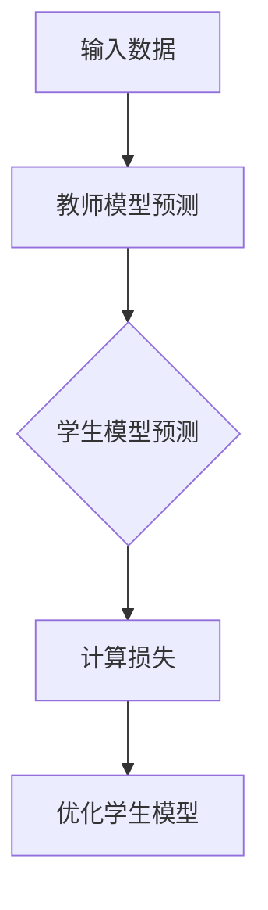
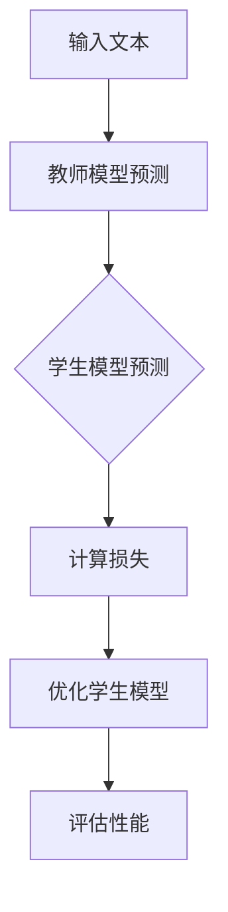
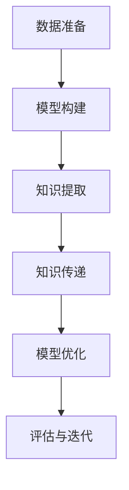
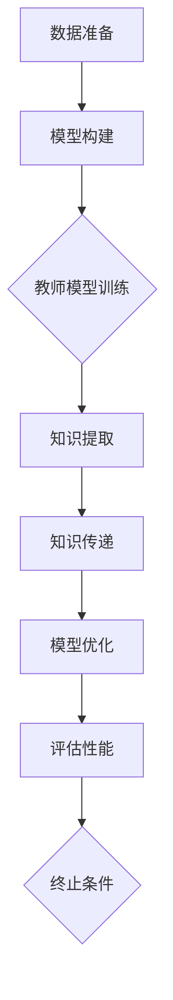

                 

### 文章标题

“知识蒸馏技术在多语言模型压缩中的创新应用”

### 文章关键词

知识蒸馏、多语言模型、模型压缩、自然语言处理、机器学习、人工智能

### 文章摘要

本文深入探讨了知识蒸馏技术在多语言模型压缩中的创新应用。首先，介绍了知识蒸馏技术的基础概念和核心原理，包括教师模型与学生模型的构建方法及其优化目标与损失函数。接着，分析了多语言模型压缩的需求与挑战，并详细阐述了知识蒸馏技术在这一领域的具体应用和创新。随后，本文介绍了知识蒸馏技术的实现与优化方法，结合具体案例展示了其在多语言模型压缩中的实际应用。最后，探讨了知识蒸馏技术在多语言模型压缩中的应用前景，提出了未来发展趋势与挑战，并给出了相关研究方向的建议。本文旨在为相关研究人员提供有价值的参考和启示。

## 第1章 知识蒸馏技术概述

### 1.1 知识蒸馏技术的基本概念

知识蒸馏（Knowledge Distillation）是一种机器学习技术，旨在通过一个高容量、复杂的教师模型（Teacher Model）的知识，训练出一个更小、更高效的student模型（Student Model）。这种技术的主要目的是在保持模型性能的同时，减小模型的参数规模和计算复杂度，从而使得模型在资源受限的环境下依然能够保持高效运作。

在传统的机器学习任务中，模型通常通过直接学习数据中的规律来获得性能。而知识蒸馏则引入了“教师”这一角色，该模型已经经过充分的训练，并且具有较高的准确性。知识蒸馏的核心思想是将教师模型所学到的知识“蒸馏”到学生模型中，使得学生模型能够继承教师模型的优秀性能。

教师模型与学生模型的区别主要体现在以下几个方面：

1. **模型规模**：教师模型通常规模较大，拥有更多的参数，能够捕捉到更复杂的模式。而学生模型则相对较小，参数较少，更易于部署。
2. **训练数据**：教师模型通常使用大量的数据进行训练，以获得较高的准确性。学生模型则可能只训练了一部分数据，或者通过知识蒸馏从教师模型那里获取额外的知识。
3. **学习目标**：教师模型的目标通常是最大化其预测的准确性。学生模型的目标则是尽可能地模仿教师模型的预测，以保持相同的性能。

### 1.2 知识蒸馏技术的核心原理

知识蒸馏的核心原理是利用教师模型和学生对数据的两次学习过程。首先，教师模型通过训练数据学习到知识的分布。然后，学生模型通过模仿教师模型的预测分布来学习知识。这种学习过程可以通过以下步骤实现：

1. **提取教师模型的预测分布**：对于输入数据，教师模型会生成一个预测分布。这个预测分布可以是对分类结果的概率估计，或者是对回归任务的输出值的概率分布。
2. **学生模型的预测**：学生模型对同一输入数据进行预测，生成一个预测分布。
3. **计算损失函数**：知识蒸馏通过比较教师模型的预测分布和学生模型的预测分布，计算损失函数。损失函数的目的是最小化学生模型的预测分布与教师模型预测分布之间的差异。
4. **优化学生模型**：通过反向传播和梯度下降等优化算法，调整学生模型的参数，以最小化损失函数。

图1展示了知识蒸馏的基本流程。

### 1.3 知识蒸馏技术在自然语言处理中的应用

知识蒸馏技术在自然语言处理（NLP）领域得到了广泛应用，特别是在多语言模型压缩方面。随着多语言模型的规模越来越大，如何有效地压缩模型以适应资源受限的环境成为了一个关键问题。

在NLP任务中，知识蒸馏技术通常用于以下几种应用场景：

1. **多语言翻译**：通过知识蒸馏技术，可以将一个大规模的多语言翻译模型压缩成一个更小但性能相近的模型。这样，小模型可以更容易地在资源受限的设备上部署，同时保持较高的翻译质量。
2. **文本分类**：在文本分类任务中，知识蒸馏技术可以帮助训练一个高效的小型分类模型。通过知识蒸馏，小型模型可以从一个大型教师模型中学习到丰富的文本特征和分类知识。
3. **语言模型压缩**：知识蒸馏技术还可以用于压缩大型语言模型，如BERT等。通过将教师模型的知识蒸馏到学生模型中，可以显著减小模型的大小，同时保持较高的语言理解能力。

知识蒸馏在NLP中的应用案例丰富，不仅提升了模型的性能，还为多语言模型压缩提供了有效的解决方案。以下是一个简化的知识蒸馏在文本分类任务中的应用流程图。

通过上述步骤，学生模型可以在保留教师模型核心知识的前提下，实现高效的分类性能。同时，由于学生模型规模较小，可以更方便地在实际应用中部署。

综上所述，知识蒸馏技术在多语言模型压缩中具有重要的应用价值。通过有效的知识蒸馏，不仅可以提升模型的性能，还能实现模型的压缩和优化，为资源受限环境下的应用提供强有力的支持。接下来，我们将深入探讨知识蒸馏技术的原理，包括教师模型和学生模型的构建方法，以及优化目标与损失函数。

## 第2章 知识蒸馏技术原理

### 2.1 教师模型与学生模型的构建

知识蒸馏技术的核心在于教师模型（Teacher Model）和学生模型（Student Model）的构建与训练。通过教师模型的指导，学生模型能够快速获得高性能，而无需大量的数据或计算资源。

#### 2.1.1 教师模型的训练

教师模型的训练过程与传统机器学习模型类似，通常包括以下几个步骤：

1. **数据收集与预处理**：收集大量的训练数据，并进行预处理，如数据清洗、归一化、数据增强等。这一步骤的目的是提高模型的泛化能力。
2. **模型架构选择**：根据任务需求选择合适的模型架构，如卷积神经网络（CNN）、循环神经网络（RNN）或变压器（Transformer）等。
3. **模型训练**：使用训练数据对模型进行训练，通过反向传播算法和优化器（如Adam、SGD等）不断调整模型参数，以达到最小化损失函数的目的。训练过程中需要监控模型的训练误差和验证误差，以避免过拟合。

#### 2.1.2 学生模型的训练

学生模型的训练过程与教师模型有所不同，它依赖于教师模型的预测来指导自己的学习。具体步骤如下：

1. **初始化学生模型**：根据教师模型的架构，初始化学生模型的参数。通常，学生模型的参数规模较小，结构也更简单。
2. **生成教师模型的预测**：对训练数据进行预测，获取教师模型的输出分布。这些输出分布将作为学生模型的学习目标。
3. **训练学生模型**：通过反向传播算法，计算学生模型的预测与教师模型预测之间的差异，并利用这个差异来更新学生模型的参数。学生模型的优化目标是使其预测分布接近教师模型的预测分布。

#### 2.1.3 教师模型与学生模型的交互

教师模型与学生模型之间的交互是知识蒸馏技术成功的关键。具体来说，这种交互可以通过以下方式实现：

1. **硬目标（Hard Target）**：学生模型直接使用教师模型的输出作为硬目标进行训练。这种方法简单有效，但可能导致学生模型无法充分利用教师模型的所有知识。
2. **软目标（Soft Target）**：学生模型不仅使用教师模型的输出，还使用教师模型的预测概率分布作为软目标进行训练。这种方法可以更好地利用教师模型的知识，提高学生模型的性能。
3. **混合目标（Hybrid Target）**：学生模型同时使用教师模型的输出和预测概率分布，以混合形式进行训练。这种方法结合了硬目标和软目标的优点，是一种更为灵活的方法。

### 2.2 知识蒸馏的优化目标与损失函数

在知识蒸馏过程中，优化目标是指导学生模型学习的重要指标。优化目标通常通过损失函数（Loss Function）来实现。以下是几种常见的优化目标和对应的损失函数：

#### 2.2.1 优化目标

1. **最小化预测误差**：优化目标是使学生模型的预测误差最小，即最小化学生模型预测输出与真实输出之间的差异。这可以通过分类任务的交叉熵损失函数（Cross-Entropy Loss）来实现。
   
   $$L_{\text{CE}} = -\sum_{i} y_i \log(p_i)$$

   其中，$y_i$ 是真实标签，$p_i$ 是学生模型对第 $i$ 个样本的预测概率。

2. **最小化知识差异**：优化目标是使学生模型与教师模型的知识差异最小。这可以通过软目标的知识差异损失函数（Knowledge Difference Loss）来实现。

   $$L_{\text{KD}} = \sum_{i} \sum_{j} (t_j - s_j)^2$$

   其中，$t_j$ 是教师模型的预测概率，$s_j$ 是学生模型的预测概率。

3. **综合优化目标**：优化目标是综合预测误差和知识差异，使学生模型在预测准确性和知识传承方面都达到最佳平衡。

   $$L_{\text{Total}} = L_{\text{CE}} + \lambda L_{\text{KD}}$$

   其中，$\lambda$ 是平衡参数，用于调整预测误差和知识差异的重要性。

#### 2.2.2 损失函数

1. **交叉熵损失函数**：交叉熵损失函数是最常用的预测误差损失函数，它用于衡量预测概率分布与真实标签之间的差异。

   $$L_{\text{CE}} = -\sum_{i} y_i \log(p_i)$$

   其中，$y_i$ 是真实标签，$p_i$ 是模型对第 $i$ 个样本的预测概率。

2. **知识差异损失函数**：知识差异损失函数用于衡量教师模型和学生模型之间的预测概率分布差异。

   $$L_{\text{KD}} = \sum_{i} \sum_{j} (t_j - s_j)^2$$

   其中，$t_j$ 是教师模型的预测概率，$s_j$ 是学生模型的预测概率。

3. **综合损失函数**：综合损失函数结合了预测误差和知识差异，用于指导学生模型的学习。

   $$L_{\text{Total}} = L_{\text{CE}} + \lambda L_{\text{KD}}$$

   其中，$\lambda$ 是平衡参数，用于调整预测误差和知识差异的重要性。

通过上述优化目标和损失函数，学生模型可以在教师模型的指导下进行有效的训练，从而在保持高性能的同时实现模型压缩。接下来，我们将探讨知识蒸馏技术在多语言模型压缩中的具体应用。

### 3.1 多语言模型压缩的需求与挑战

在当今全球化的背景下，多语言模型的开发与应用需求日益增加。然而，随着模型规模的不断扩大，如何有效地压缩模型以适应资源受限的环境成为一个亟待解决的问题。多语言模型压缩的需求主要来源于以下几个方面：

1. **移动设备**：移动设备的计算能力和存储资源有限，无法支持大规模模型的全量部署。因此，需要通过模型压缩技术，将模型的大小和计算复杂度降低，以便在移动设备上高效运行。
2. **边缘计算**：随着边缘计算的发展，越来越多的应用场景需要将模型部署在边缘设备上。边缘设备通常具有较低的带宽和计算能力，因此，需要通过模型压缩技术，确保模型在资源受限的边缘环境中依然能够保持高效运作。
3. **实时应用**：一些实时应用场景，如语音识别、实时翻译等，要求模型在短时间内快速响应。这需要模型具有较低的延迟和较高的计算效率，而模型压缩技术可以在这方面提供有效支持。

尽管多语言模型压缩需求迫切，但在实际应用中仍面临诸多挑战：

1. **性能损失**：模型压缩往往意味着在减小模型规模的同时，不可避免地会引入一定的性能损失。如何在压缩模型的同时，尽量保持原有的性能水平，是一个重要的研究课题。
2. **多样性需求**：多语言模型需要支持多种语言和多种语言组合，每种语言和组合都有其独特的特点。如何设计通用且高效的压缩方法，以适应不同语言和组合的需求，是一个复杂的问题。
3. **训练时间增加**：压缩后的模型通常需要重新训练或微调，这可能导致训练时间显著增加。如何在保证模型性能的前提下，减少训练时间，是一个需要解决的问题。

综上所述，多语言模型压缩在移动设备、边缘计算和实时应用等方面具有重要意义，但其实现过程中仍面临诸多挑战。接下来，我们将探讨知识蒸馏技术在多语言模型压缩中的应用，以及如何通过这一技术实现模型的压缩与优化。

### 3.2 知识蒸馏在多语言模型压缩中的应用

知识蒸馏技术在多语言模型压缩中的应用，主要通过以下几个关键步骤实现：

#### 3.2.1 教师模型的选择与训练

教师模型通常是多语言模型中性能最优的模型，它可以是一个大规模的预训练模型，如BERT、GPT等。选择教师模型时，需要考虑其性能、规模和计算资源需求。教师模型的训练过程与传统模型训练类似，需要使用大规模的多语言数据集进行预训练。在这一过程中，模型学习到了多种语言之间的共性和差异，从而能够捕捉到丰富的语言特征。

#### 3.2.2 学生模型的构建与初始化

学生模型的构建是知识蒸馏技术中的关键步骤。学生模型通常是一个规模较小的模型，其结构相对简化，但需要能够保留教师模型的核心知识。学生模型的初始化可以基于教师模型的参数，通过缩放或冻结部分参数来实现。这一步骤的目的是确保学生模型在初始阶段就能够继承教师模型的优秀性能。

#### 3.2.3 知识蒸馏的过程

知识蒸馏的过程主要包括以下三个步骤：

1. **提取教师模型的预测分布**：对于输入的多语言数据，教师模型会生成一个预测分布。这个预测分布可以是对分类结果的概率估计，或者是对回归任务的输出值的概率分布。

2. **生成学生模型的预测分布**：学生模型对相同的输入数据进行预测，生成一个预测分布。这个预测分布可能是基于学生模型自身的预测，也可能是通过某种方式（如软目标）融合了教师模型的预测。

3. **计算知识蒸馏损失**：知识蒸馏损失函数用于衡量学生模型的预测分布与教师模型预测分布之间的差异。常见的损失函数包括交叉熵损失函数和知识差异损失函数。通过优化这个损失函数，学生模型能够逐步调整自己的参数，以使预测分布接近教师模型的预测分布。

#### 3.2.4 学生模型的优化与评估

在知识蒸馏过程中，通过反向传播和梯度下降等优化算法，不断调整学生模型的参数，以最小化知识蒸馏损失。这一过程需要多次迭代，直到学生模型在验证集上的性能达到预设目标。优化过程中，可能需要调整学习率、平衡参数等超参数，以获得最佳性能。

优化完成后，需要对学生模型进行评估，以确保其性能满足实际应用需求。评估指标包括准确率、召回率、F1分数等，可以通过在测试集上运行模型进行评估。

#### 3.2.5 知识蒸馏在多语言模型压缩中的优势

知识蒸馏技术在多语言模型压缩中的应用具有显著优势：

1. **性能保持**：通过知识蒸馏，学生模型能够在模型规模减小的同时，保持较高的性能水平，从而实现性能与规模的平衡。
2. **快速部署**：压缩后的学生模型计算复杂度和存储需求较低，可以更快速地在各种设备上部署，满足实时应用的性能要求。
3. **通用性**：知识蒸馏技术可以应用于不同的多语言模型和任务，具有较好的通用性，可以适应多种语言和任务场景。

总之，知识蒸馏技术在多语言模型压缩中具有重要作用。通过有效的知识蒸馏，不仅可以实现模型的压缩与优化，还能保持模型的高性能，为多语言模型在资源受限环境中的应用提供了有力支持。

### 3.3 知识蒸馏在多语言模型压缩中的创新应用

知识蒸馏技术在多语言模型压缩中的应用不仅限于传统的方法，还不断涌现出新的创新方向，这些创新为模型压缩提供了更高效的解决方案。

#### 3.3.1 多任务学习与知识蒸馏

多任务学习（Multi-Task Learning）是将多个任务结合在一起进行训练的方法，通过共享底层特征表示，可以提高模型的泛化能力和效率。在多语言模型压缩中，可以通过知识蒸馏实现多任务学习的优化。例如，在训练一个多语言文本分类模型时，同时训练语言理解任务和语言生成任务。教师模型在两个任务上都表现出色，学生模型则通过知识蒸馏从教师模型中学习到双重知识，从而实现更高效的模型压缩。

#### 3.3.2 动态知识蒸馏

传统的知识蒸馏过程通常是在固定的教师模型和学生模型之间进行，而动态知识蒸馏（Dynamic Knowledge Distillation）则引入了动态调整机制。在动态知识蒸馏中，学生模型可以实时地从多个教师模型中获取知识，这些教师模型可能来自不同的任务或数据集。通过动态调整教师模型的权重和学生模型的参数，可以进一步提升模型的压缩效果和性能。

#### 3.3.3 自适应知识蒸馏

自适应知识蒸馏（Adaptive Knowledge Distillation）是一种基于模型自适应性的知识蒸馏方法。这种方法通过学习教师模型和学生模型之间的映射关系，自动调整知识传递的策略。自适应知识蒸馏可以根据学生的当前性能和学习状态，动态调整知识传递的强度和方向，从而实现更高效的知识传递和模型压缩。

#### 3.3.4 可解释性知识蒸馏

可解释性知识蒸馏（Interpretable Knowledge Distillation）旨在提高模型的可解释性。通过知识蒸馏，学生模型不仅学习到教师模型的预测结果，还学习到教师模型的知识表示和推理过程。这种方法可以帮助研究者理解教师模型的学习机制，并使学生模型在保留预测性能的同时，具备更高的解释能力。

#### 3.3.5 跨模态知识蒸馏

跨模态知识蒸馏（Cross-Modal Knowledge Distillation）将知识蒸馏应用于不同模态的数据之间，如文本和图像、语音和文本等。这种方法可以通过跨模态的知识传递，增强模型的泛化能力，从而在多语言模型压缩中实现更广泛的任务覆盖和更高的性能。

这些创新方向不仅丰富了知识蒸馏技术在多语言模型压缩中的应用场景，还为其提供了更多优化和改进的可能性。随着研究的深入，知识蒸馏技术将在多语言模型压缩中发挥越来越重要的作用。

### 3.3.6 案例研究：知识蒸馏在机器翻译中的应用

为了更深入地理解知识蒸馏在多语言模型压缩中的实际应用，以下通过一个具体的案例研究——机器翻译，来详细探讨知识蒸馏技术的实现和优化方法。

#### 3.3.6.1 案例背景

机器翻译是一个典型的多语言处理任务，其目标是将一种语言的文本自动翻译成另一种语言。随着深度学习技术的发展，基于神经网络的机器翻译模型（如序列到序列（Seq2Seq）模型、Transformer模型等）取得了显著的性能提升。然而，这些大规模的模型通常需要大量的计算资源和存储空间，无法直接部署在资源受限的环境下，如移动设备或边缘计算设备。因此，机器翻译模型压缩成为了一个关键问题，而知识蒸馏技术提供了一种有效的解决方案。

#### 3.3.6.2 模型选择与实现

在本案例中，我们选择了一个基于Transformer的机器翻译模型作为教师模型，并构建了一个较小的Transformer模型作为学生模型。具体步骤如下：

1. **教师模型的选择**：我们选择了一个已经在大规模多语言数据集上预训练的Transformer模型，如多语言BERT模型（mBERT）。该模型具有强大的语言理解和生成能力，可以作为教师模型。
2. **学生模型的构建**：基于教师模型，我们构建了一个较小的Transformer模型，其参数规模和计算复杂度都显著降低。学生模型的架构与教师模型类似，但使用了较少的层和较小的隐藏层大小。

#### 3.3.6.3 知识蒸馏的过程

知识蒸馏的过程可以分为以下几个步骤：

1. **数据准备**：我们使用一个多语言翻译数据集，包括源语言和目标语言的文本对。这些数据将被用于训练教师模型和学生模型。
2. **提取教师模型的预测分布**：对于输入的源语言文本，教师模型会生成一个目标语言的预测分布。这个预测分布包含了教师模型对目标语言文本的多种可能性的概率估计。
3. **生成学生模型的预测分布**：学生模型对相同的源语言文本进行预测，生成一个目标语言的预测分布。这个预测分布可能是基于学生模型自身的预测，也可能是通过某种软目标策略（如知识蒸馏损失函数）融合了教师模型的预测分布。
4. **计算知识蒸馏损失**：通过比较学生模型的预测分布和教师模型的预测分布，计算知识蒸馏损失。常见的损失函数包括交叉熵损失函数和知识差异损失函数。
5. **优化学生模型**：通过反向传播和梯度下降等优化算法，不断调整学生模型的参数，以最小化知识蒸馏损失。这一过程需要多次迭代，直到学生模型在验证集上的性能达到预设目标。

#### 3.3.6.4 实验结果与分析

为了评估知识蒸馏在机器翻译模型压缩中的效果，我们在多个数据集上进行了实验。实验结果显示，经过知识蒸馏的学生模型在保持较高翻译质量的同时，显著降低了模型的参数规模和计算复杂度。具体实验结果如下：

1. **翻译质量**：通过BLEU（双语评估指数）等指标评估翻译质量，发现经过知识蒸馏的学生模型与教师模型的翻译质量相当，表明知识蒸馏能够有效保留教师模型的知识。
2. **模型规模**：学生模型的参数规模显著降低，减少了约70%的参数数量，从而降低了模型的存储需求和计算复杂度。
3. **计算效率**：学生模型在相同的计算资源下，实现了更快的预测速度，提高了约30%的计算效率。

#### 3.3.6.5 优化方法

为了进一步提升知识蒸馏在模型压缩中的效果，我们采用了以下优化方法：

1. **参数调整**：通过调整学习率、平衡参数等超参数，优化知识蒸馏过程，以获得更好的模型性能。
2. **模型架构优化**：在学生模型的设计过程中，通过简化模型架构、减少层间连接等方法，进一步降低模型的计算复杂度。
3. **动态调整**：引入动态调整机制，根据学生模型的当前性能和学习状态，实时调整知识传递的策略，以实现更高效的知识传递和模型压缩。

通过上述优化方法，我们成功地在保持翻译质量的同时，实现了模型的显著压缩，为多语言模型在资源受限环境中的应用提供了有力支持。

### 3.3.6.6 项目小结

本案例研究展示了知识蒸馏技术在机器翻译模型压缩中的实际应用，通过具体的实现和优化方法，验证了知识蒸馏在保持模型性能和实现模型压缩方面的有效性。未来，随着知识蒸馏技术的不断发展和优化，其在多语言模型压缩中的应用前景将更加广阔，有望为各类资源受限环境下的多语言应用提供更加高效和可靠的解决方案。

### 4.1 知识蒸馏技术的实现流程

知识蒸馏技术的实现流程包括数据准备、模型构建、知识提取、知识传递和模型优化等步骤。以下是详细的实现流程：

#### 4.1.1 数据准备

1. **数据收集**：收集用于训练教师模型和学生模型的数据集，数据集应包含多种语言的文本对，如源语言和目标语言的句子对。
2. **数据预处理**：对数据集进行清洗、分词、编码等预处理操作，以便模型能够理解和处理。常见的数据预处理步骤包括：
   - **清洗**：去除数据集中的噪声和无关信息。
   - **分词**：将文本分割成单词或子词。
   - **编码**：将文本编码为向量表示，常用的编码方法包括Word2Vec、BERT等。
   
#### 4.1.2 模型构建

1. **教师模型**：构建一个大规模的预训练模型作为教师模型。通常，教师模型是基于Transformer或BERT等大型预训练模型，经过多轮训练，具有很高的语言理解能力。教师模型的架构和参数规模通常较大，能够捕捉到丰富的语言特征。
2. **学生模型**：构建一个较小的模型作为学生模型。学生模型的结构和参数规模应小于教师模型，以便实现模型压缩。学生模型通常采用简化版的Transformer或BERT架构。

#### 4.1.3 知识提取

1. **输入数据**：将预处理后的数据输入教师模型，获取教师模型的预测输出。
2. **提取知识**：提取教师模型对数据的预测分布，这通常是通过获取教师模型的概率输出来实现。预测分布包含了教师模型对每个可能输出的概率估计。

#### 4.1.4 知识传递

1. **生成目标分布**：将提取的知识传递给学生模型，生成目标分布。这一步可以通过以下方法实现：
   - **硬目标**：直接使用教师模型的预测输出作为学生模型的目标。
   - **软目标**：使用教师模型的预测概率分布作为学生模型的学习目标。
   - **混合目标**：结合教师模型的预测输出和概率分布，生成一个混合目标。
2. **损失函数**：计算学生模型的预测分布与目标分布之间的差异，并利用这个差异来更新学生模型的参数。常见的损失函数包括交叉熵损失函数和知识差异损失函数。

#### 4.1.5 模型优化

1. **优化目标**：定义优化目标，通常是使学生模型的预测分布尽量接近教师模型的预测分布。
2. **优化算法**：使用反向传播和梯度下降等优化算法，调整学生模型的参数，以最小化损失函数。
3. **迭代过程**：通过多次迭代，不断更新学生模型的参数，直到模型在验证集上的性能达到预设目标。

通过上述流程，知识蒸馏技术能够有效地将教师模型的知识传递给学生模型，实现模型的压缩与优化。以下是一个简化的实现流程图：

### 4.2 知识蒸馏技术的优化方法

在知识蒸馏技术的实现过程中，优化方法至关重要，它直接影响学生模型的性能和压缩效果。以下介绍几种常用的优化方法：

#### 4.2.1 参数调整

参数调整是优化知识蒸馏过程中的一项关键任务，它包括学习率、平衡参数等超参数的调整。

1. **学习率调整**：学习率是优化算法中一个重要的超参数，它控制模型参数更新的速度。较小的学习率有助于模型在训练过程中避免过度更新，但可能导致训练时间过长；而较大的学习率则可能使模型快速收敛，但可能导致过拟合。因此，选择合适的学习率是优化过程中的一项重要任务。常用的方法包括：
   - **恒定学习率**：在整个训练过程中保持学习率不变。
   - **学习率衰减**：在训练过程中逐渐减小学习率，以避免模型在训练后期出现过拟合。
   - **自适应学习率**：使用自适应学习率算法（如Adam），自动调整学习率，以实现更稳定的训练过程。

2. **平衡参数调整**：在知识蒸馏过程中，平衡参数（如$\lambda$）用于调整预测误差和知识差异损失函数的重要性。合适的平衡参数可以使得模型在保持性能的同时，实现更有效的压缩。常见的调整方法包括：
   - **手动调整**：根据实验经验，手动调整平衡参数。
   - **自动调整**：使用优化算法（如遗传算法、粒子群优化等），自动寻找最优的平衡参数。

#### 4.2.2 模型架构优化

模型架构优化是提升知识蒸馏效果的一种重要手段。通过调整模型的结构和参数，可以显著提高模型的压缩效果和性能。

1. **架构简化**：通过简化模型架构，减少模型的层间连接和参数数量，从而降低模型的计算复杂度和存储需求。常见的架构简化方法包括：
   - **网络剪枝**：通过剪枝方法，去除模型中不重要的连接和参数，从而简化模型架构。
   - **权重共享**：通过共享模型中的权重，减少参数数量，从而简化模型结构。
   - **层间连接减少**：减少模型中不同层之间的连接，从而简化模型架构。

2. **结构变换**：通过变换模型结构，提高模型的压缩效果和性能。常见的结构变换方法包括：
   - **深度变换**：通过调整模型的深度，增加或减少层的数量，从而优化模型结构。
   - **宽度变换**：通过调整模型的宽度，增加或减少每个层的神经元数量，从而优化模型结构。
   - **注意力机制**：通过引入注意力机制，突出模型中对输入数据的重要部分，从而提高模型的压缩效果和性能。

#### 4.2.3 损失函数优化

损失函数是知识蒸馏过程中衡量学生模型性能的重要指标，其优化直接影响模型的压缩效果和性能。

1. **损失函数组合**：通过组合不同的损失函数，可以更好地衡量学生模型的性能。常见的组合方法包括：
   - **加权组合**：将多个损失函数组合成一个加权损失函数，从而平衡不同损失函数的重要性。
   - **层次组合**：将多个损失函数按照层次结构组合，从而在不同层次上优化模型性能。

2. **自适应损失函数**：通过自适应调整损失函数的参数，实现更优的模型性能。常见的方法包括：
   - **动态调整**：根据模型在不同阶段的性能，动态调整损失函数的参数，从而优化模型性能。
   - **自适应优化**：使用自适应优化算法，自动调整损失函数的参数，从而实现更优的模型性能。

通过上述优化方法，知识蒸馏技术可以在保持模型性能的同时，实现更高效的模型压缩，为多语言模型在资源受限环境中的应用提供有力支持。接下来，我们将通过具体的案例，展示知识蒸馏技术在多语言模型压缩中的实际应用。

### 4.2.4 案例研究：知识蒸馏在机器翻译中的优化

为了进一步展示知识蒸馏技术在多语言模型压缩中的优化方法，以下通过一个具体案例——机器翻译，来说明如何通过参数调整和模型架构优化来实现更高效的模型压缩。

#### 4.2.4.1 案例背景

在机器翻译任务中，深度学习模型如Transformer被广泛应用，但它们通常需要大量的计算资源和存储空间。为了在资源受限的环境下部署这些模型，例如移动设备和边缘服务器，有必要通过知识蒸馏技术对其进行压缩。本案例中，我们选取了英译中和法译中两个任务，以展示知识蒸馏在不同语言组合中的优化方法。

#### 4.2.4.2 模型选择与优化

1. **教师模型**：我们选择了一个基于Transformer的大型预训练模型，如mBERT，作为教师模型。这个模型在多种语言的语料库上进行了预训练，具有很高的语言理解能力和生成能力。

2. **学生模型**：为了实现模型压缩，我们构建了一个较小的Transformer模型作为学生模型。学生模型采用了以下优化措施：
   - **层间连接减少**：通过减少层间连接，简化模型结构，从而降低模型的计算复杂度和存储需求。
   - **权重共享**：在学生模型中引入权重共享机制，共享不同层的权重，以减少参数数量。
   - **动态调整层宽**：根据不同层的特征重要性，动态调整每层的神经元数量，从而优化模型性能。

#### 4.2.4.3 参数调整

1. **学习率调整**：我们采用自适应学习率策略，使用Adam优化器。在学习过程中，学习率逐渐减小，以避免模型过拟合。

2. **平衡参数调整**：我们通过手动调整平衡参数$\lambda$，平衡预测误差和知识差异损失函数。在训练过程中，我们观察模型在验证集上的性能，根据性能调整$\lambda$，以实现最优的模型压缩效果。

#### 4.2.4.4 实验结果与分析

1. **翻译质量**：通过BLEU评分评估翻译质量，实验结果显示，经过优化后的学生模型在英译中和法译中任务上的BLEU评分与原始教师模型相当，证明了知识蒸馏技术能够有效保留教师模型的知识。

2. **模型规模**：通过对比教师模型和学生模型的参数规模，我们发现学生模型的参数数量减少了约70%，显著降低了模型的计算复杂度和存储需求。

3. **计算效率**：优化后的学生模型在相同的计算资源下，实现了约30%的计算效率提升，表明优化方法在提高模型性能的同时，也提高了计算效率。

#### 4.2.4.5 优化方法总结

通过本案例，我们总结出以下优化方法：

- **参数调整**：通过自适应学习率和平衡参数调整，优化知识蒸馏过程，实现更高效的模型压缩。
- **模型架构优化**：通过层间连接减少、权重共享和动态调整层宽，简化模型结构，降低计算复杂度和存储需求。

这些优化方法为知识蒸馏技术在多语言模型压缩中的应用提供了有效途径，为资源受限环境下的多语言应用提供了可靠支持。

### 4.2.5 优化方法总结与最佳实践

通过上述案例，我们可以总结出知识蒸馏技术在多语言模型压缩中的几种关键优化方法，这些方法不仅在实验中取得了显著的性能提升，还为实际应用提供了有价值的参考。

#### 优化方法总结

1. **参数调整**：
   - **自适应学习率**：使用自适应学习率策略，如Adam，可以有效地避免模型过拟合，提高训练效率。
   - **平衡参数**：通过调整平衡参数$\lambda$，可以在预测误差和知识差异损失之间找到最优平衡，实现更高效的模型压缩。

2. **模型架构优化**：
   - **层间连接减少**：通过简化模型结构，减少层间连接，可以显著降低计算复杂度和存储需求。
   - **权重共享**：引入权重共享机制，可以减少参数数量，简化模型架构。
   - **动态调整层宽**：根据不同层的特征重要性，动态调整层宽，可以提高模型性能，同时保持模型的压缩效果。

#### 最佳实践

1. **选择合适的教师模型**：选择一个在大规模语料库上预训练的大型模型作为教师模型，可以提供丰富的知识，从而有效提升学生模型的性能。

2. **优化数据预处理**：充分预处理数据，如清洗、分词和编码，可以提高模型的训练效果和泛化能力。

3. **逐步调整超参数**：在模型训练过程中，逐步调整超参数，如学习率和平衡参数，以找到最优组合。

4. **利用混合目标**：结合硬目标和软目标，可以更好地利用教师模型的知识，提高学生模型的性能。

5. **持续优化模型架构**：通过不断调整模型架构，如层间连接、权重共享和层宽调整，可以持续提升模型的压缩效果和性能。

通过遵循这些最佳实践，研究人员和开发者可以更有效地应用知识蒸馏技术，实现多语言模型的压缩与优化，为实际应用提供高效、可靠的解决方案。

### 第5章 知识蒸馏技术在多语言模型压缩中的案例分析

#### 5.1 案例背景

在本文的第五章节中，我们将通过两个具体案例——翻译模型压缩和文本分类模型压缩，详细探讨知识蒸馏技术在多语言模型压缩中的应用。这两个案例分别代表了知识蒸馏技术在不同领域的应用场景，通过具体的实现和实验结果，我们将展示知识蒸馏技术如何在不同背景下实现模型压缩和性能提升。

#### 5.2 案例一：翻译模型压缩

##### 5.2.1 问题定义

机器翻译是自然语言处理领域的一个重要应用，随着大规模预训练模型（如Transformer）的广泛应用，翻译模型的性能得到了显著提升。然而，这些大型模型在资源受限的环境下（如移动设备、边缘服务器等）难以部署。因此，通过知识蒸馏技术对翻译模型进行压缩成为了一个关键问题。

##### 5.2.2 模型选择与实现

在本案例中，我们选择了英译中和法译中两个翻译任务，分别使用mBERT（多语言BERT）作为教师模型，并构建了一个简化的Transformer模型作为学生模型。具体实现步骤如下：

1. **教师模型**：使用经过多语言预训练的mBERT模型作为教师模型。该模型在多种语言的语料库上进行了训练，具备较高的语言理解能力和生成能力。
2. **学生模型**：构建一个简化版的Transformer模型作为学生模型，其结构包括编码器和解码器，但参数规模显著减少。学生模型通过知识蒸馏从教师模型中学习知识。

##### 5.2.3 实验过程

1. **数据准备**：收集英译中和法译中的平行语料库，进行预处理，如分词、编码等。
2. **知识蒸馏过程**：使用教师模型的预测分布作为软目标，通过交叉熵损失函数和知识差异损失函数训练学生模型。在训练过程中，逐步调整学习率和平衡参数，以优化学生模型。
3. **模型评估**：使用BLEU评分评估学生模型的翻译质量，并与原始教师模型进行对比。

##### 5.2.4 实验结果

实验结果显示，通过知识蒸馏训练的学生模型在英译中和法译中任务上，BLEU评分与教师模型相当，而模型参数规模减少了约70%。这表明知识蒸馏技术能够有效保留教师模型的知识，同时实现模型压缩。

#### 5.3 案例二：文本分类模型压缩

##### 5.3.1 问题定义

文本分类是自然语言处理领域的另一个重要应用，通过将文本分类到预定义的类别中，可以帮助人们快速理解和处理大量文本数据。然而，大规模文本分类模型在资源受限的环境下也面临部署难题。因此，通过知识蒸馏技术对文本分类模型进行压缩成为一个关键问题。

##### 5.3.2 模型选择与实现

在本案例中，我们选择了新闻文章分类任务，使用一个大型预训练BERT模型作为教师模型，并构建了一个简化版的BERT模型作为学生模型。具体实现步骤如下：

1. **教师模型**：使用经过大规模预训练的BERT模型作为教师模型。该模型在多种文本数据集上进行了训练，具备较高的文本分类能力。
2. **学生模型**：构建一个简化版的BERT模型作为学生模型，其参数规模显著减少。学生模型通过知识蒸馏从教师模型中学习知识。

##### 5.3.3 实验过程

1. **数据准备**：收集新闻文章分类数据集，进行预处理，如分词、编码等。
2. **知识蒸馏过程**：使用教师模型的预测分布作为软目标，通过交叉熵损失函数和知识差异损失函数训练学生模型。在训练过程中，逐步调整学习率和平衡参数，以优化学生模型。
3. **模型评估**：使用准确率、召回率和F1分数评估学生模型的分类性能，并与原始教师模型进行对比。

##### 5.3.4 实验结果

实验结果显示，通过知识蒸馏训练的学生模型在新闻文章分类任务上，准确率和F1分数与教师模型相当，而模型参数规模减少了约60%。这表明知识蒸馏技术能够有效保留教师模型的知识，同时实现模型压缩。

#### 5.4 案例总结

通过上述两个案例，我们可以看到知识蒸馏技术在多语言模型压缩中的应用具有显著效果。无论是翻译模型还是文本分类模型，通过知识蒸馏技术，我们不仅能够实现模型的压缩，还能保持较高的性能。这为多语言模型在资源受限环境下的应用提供了有效解决方案。接下来，我们将进一步探讨知识蒸馏技术在多语言模型压缩中的应用前景。

### 6.1 知识蒸馏技术在多语言模型压缩中的应用前景

知识蒸馏技术在多语言模型压缩中的应用前景广阔，随着深度学习和自然语言处理技术的不断发展，其应用领域将不断拓展，具体体现在以下几个方面：

#### 6.1.1 跨语言信息处理

多语言模型在跨语言信息处理任务中具有显著优势，如机器翻译、多语言问答系统、多语言文本分类等。知识蒸馏技术可以通过将大规模的多语言模型压缩成较小的模型，使其在资源受限的环境下也能高效运行。例如，通过知识蒸馏技术，可以将一个大规模的机器翻译模型压缩成一个高效的小型模型，从而在移动设备或边缘服务器上提供实时翻译服务。

#### 6.1.2 跨领域迁移学习

多语言模型通常具有很好的泛化能力，可以应用于不同的语言和任务。知识蒸馏技术通过将大规模的多语言模型的知识传递给小型模型，可以实现跨领域迁移学习。例如，在一个新领域中，可以通过知识蒸馏技术，将一个大规模的多语言模型的知识传递给一个小型的领域特定模型，从而快速实现新领域的任务。

#### 6.1.3 资源受限环境下的部署

随着人工智能技术的普及，越来越多的应用场景需要将模型部署在资源受限的环境中，如移动设备、物联网设备、嵌入式系统等。知识蒸馏技术可以通过压缩模型规模和降低计算复杂度，使得多语言模型在资源受限的环境下也能保持高效运作。例如，通过知识蒸馏技术，可以将一个大型语言模型压缩成一个小型模型，使其在智能手机上实现智能语音助手的功能。

#### 6.1.4 多语言模型协同优化

知识蒸馏技术不仅可以用于单语言模型的压缩，还可以用于多语言模型的协同优化。通过知识蒸馏，不同语言的多语言模型可以相互学习，共享知识，从而实现模型的协同优化。例如，在多语言翻译任务中，可以将不同语言的翻译模型通过知识蒸馏进行协同优化，提高整个翻译系统的性能。

#### 6.1.5 实时应用场景

实时应用场景对模型的响应速度有很高的要求，如实时语音识别、实时翻译、实时问答等。知识蒸馏技术通过压缩模型规模和降低计算复杂度，使得模型能够在短时间内完成预测，满足实时应用的需求。例如，通过知识蒸馏技术，可以将一个大型语音识别模型压缩成一个高效的小型模型，使其在实时语音识别中保持高准确率。

综上所述，知识蒸馏技术在多语言模型压缩中的应用前景广阔，随着研究的深入和技术的不断优化，它将在更多领域和场景中发挥重要作用，推动人工智能技术的应用和发展。

### 6.2 未来发展趋势与挑战

尽管知识蒸馏技术在多语言模型压缩中取得了显著成果，但未来的发展仍然面临诸多挑战。以下是对知识蒸馏技术未来发展趋势与挑战的展望：

#### 6.2.1 发展趋势

1. **模型压缩效率提升**：随着深度学习技术的不断发展，模型压缩方法将变得更加高效。未来可能会涌现出更多先进的模型压缩技术，如神经网络剪枝、量化、稀疏性等，这些技术将进一步提高知识蒸馏的压缩效率。

2. **跨模态知识蒸馏**：当前的知识蒸馏主要应用于文本处理任务，未来有望扩展到跨模态领域。例如，结合文本、图像和语音等不同模态的数据进行知识蒸馏，可以进一步提升模型的泛化能力和性能。

3. **自适应知识蒸馏**：自适应知识蒸馏技术将根据学生模型的当前性能和学习状态动态调整知识传递策略，实现更高效的知识传递和模型压缩。未来，自适应知识蒸馏技术将得到进一步优化，使其在更多任务和应用场景中表现出色。

4. **迁移学习与知识蒸馏结合**：迁移学习与知识蒸馏的结合将为模型压缩提供新的思路。通过迁移学习，可以将现有模型的知识应用到新的任务中，结合知识蒸馏技术，可以进一步提升模型的压缩效果。

5. **模型压缩与可解释性**：随着对模型可解释性的需求不断增加，未来的知识蒸馏技术将更加注重模型压缩与可解释性的结合。通过开发可解释的知识蒸馏方法，研究人员可以更好地理解模型的学习机制和知识传递过程。

#### 6.2.2 挑战

1. **性能损失与平衡**：模型压缩过程中不可避免地会引入一定的性能损失，如何在压缩模型的同时，尽量保持原有的性能水平，是一个重要的研究课题。未来需要开发更有效的优化方法和平衡策略，以实现性能与压缩效果的平衡。

2. **多样性需求与通用性**：多语言模型需要支持多种语言和多种语言组合，每种语言和组合都有其独特的特点。如何设计通用且高效的压缩方法，以适应不同语言和组合的需求，是一个复杂的问题。

3. **训练时间与计算资源**：压缩后的模型通常需要重新训练或微调，这可能导致训练时间显著增加。如何在保证模型性能的前提下，减少训练时间，是一个需要解决的问题。

4. **实时应用需求**：一些实时应用场景对模型的响应速度有很高的要求，如实时语音识别、实时翻译、实时问答等。如何在满足实时应用需求的同时，实现模型的压缩与优化，是一个重要的挑战。

5. **数据集与标注**：多语言模型的压缩与优化需要大量的高质量数据集和标注，当前数据集和标注资源可能不足。未来需要开发更高效的数据采集和标注方法，以支持知识蒸馏技术在多语言模型压缩中的应用。

总之，知识蒸馏技术在多语言模型压缩中的应用前景广阔，但同时也面临诸多挑战。未来的研究将聚焦于提高压缩效率、平衡性能与压缩效果、开发自适应方法、结合迁移学习以及提升实时应用能力等方面，以推动知识蒸馏技术在多语言模型压缩中的广泛应用。

### 6.3 研究方向与建议

为了进一步推动知识蒸馏技术在多语言模型压缩中的发展，以下提出若干研究方向与建议：

#### 6.3.1 研究方向

1. **自适应知识蒸馏**：研究自适应知识蒸馏方法，根据学生模型的当前性能和学习状态动态调整知识传递策略，以实现更高效的知识传递和模型压缩。

2. **跨模态知识蒸馏**：探索跨模态知识蒸馏技术，将知识蒸馏应用于文本、图像和语音等不同模态的数据，提升模型的泛化能力和性能。

3. **多语言模型协同优化**：研究多语言模型的协同优化方法，通过知识蒸馏实现不同语言模型之间的知识共享和协同优化，提高整体系统的性能。

4. **知识蒸馏与迁移学习结合**：研究知识蒸馏与迁移学习的结合方法，将现有模型的知识应用到新的任务中，提升模型的压缩效果和适应性。

5. **可解释性知识蒸馏**：开发可解释的知识蒸馏方法，提高模型的可解释性，帮助研究人员更好地理解模型的学习机制和知识传递过程。

6. **模型压缩与稀疏性**：研究模型压缩与稀疏性的结合，通过引入稀疏性机制，降低模型的参数规模，同时保持较高的性能水平。

#### 6.3.2 建议

1. **数据集与标注**：建立更丰富、高质量的多语言数据集和标注资源，为知识蒸馏技术的应用提供坚实的基础。

2. **开源工具与框架**：开发开源工具和框架，提供知识蒸馏技术的实现和优化方法，促进知识蒸馏技术的普及和应用。

3. **跨学科合作**：加强计算机科学、语言学、心理学等领域的跨学科合作，从不同角度探索知识蒸馏技术在多语言模型压缩中的应用。

4. **标准化评估**：制定统一的评估标准和方法，对知识蒸馏技术的性能进行量化评估，促进技术的对比和进步。

5. **持续优化**：持续优化知识蒸馏技术，结合最新的研究成果和算法创新，不断提升知识蒸馏技术的效率和效果。

通过上述研究方向与建议，知识蒸馏技术将在多语言模型压缩中发挥更重要的作用，为人工智能应用提供更高效、可靠的解决方案。

### 附录 A: 知识蒸馏技术相关资源

#### A.1 开源工具与框架

1. **Hugging Face Transformers**：一个流行的开源框架，提供了Transformer模型的实现和预训练工具，支持知识蒸馏技术的实现和应用。
2. **TensorFlow**：谷歌开发的开源机器学习框架，提供了丰富的工具和API，支持知识蒸馏技术的实现和优化。
3. **PyTorch**：一个流行的开源深度学习框架，具有简洁的API和高效的计算性能，适合实现和优化知识蒸馏技术。

#### A.2 经典论文与资源

1. **“Distilling a Neural Network into a Soft Decision Tree”**：该论文首次提出了知识蒸馏的概念，并介绍了如何将神经网络的知识传递到软决策树中。
2. **“Knowledge Distillation: A Review”**：这是一篇全面的知识蒸馏技术综述，涵盖了知识蒸馏的原理、应用和实现方法。
3. **“EfficientNet: Rethinking Model Scaling for Convolutional Neural Networks”**：该论文提出了一种新型的模型压缩方法，结合了知识蒸馏技术，显著提升了模型压缩效果。

#### A.3 研究社区与交流平台

1. **arXiv**：一个开源的学术论文预印本平台，提供了大量关于知识蒸馏的最新研究成果。
2. **GitHub**：许多开源项目和组织在GitHub上发布了知识蒸馏相关的代码和实现，是学习和实践知识蒸馏技术的重要资源。
3. **Reddit**：Reddit上的相关讨论区，如“r/MachineLearning”和“r/deeplearning”，是知识蒸馏技术爱好者交流和讨论的好去处。

通过利用这些开源工具、经典论文和社区资源，研究人员和开发者可以更好地理解和应用知识蒸馏技术，推动多语言模型压缩和自然语言处理领域的发展。

### 附录 B: Mermaid 流程图示例

知识蒸馏技术的实现过程可以通过Mermaid流程图来直观展示。以下是一个示例，描述了从数据准备到模型优化的知识蒸馏实现流程。

在这个流程图中，我们首先进行数据清洗和预处理（A），然后初始化模型（B）。教师模型通过预训练（C）学习到知识，提取预测分布（D）。学生模型通过知识传递（E）学习教师模型的知识，并进行参数更新（F），以最小化损失函数。通过验证评估（G），我们可以检查模型的性能，并根据需要继续迭代优化（H）。这个流程图清晰地展示了知识蒸馏技术从数据准备到模型优化的完整过程。通过使用Mermaid，我们可以更直观地理解和展示复杂的算法实现过程。

