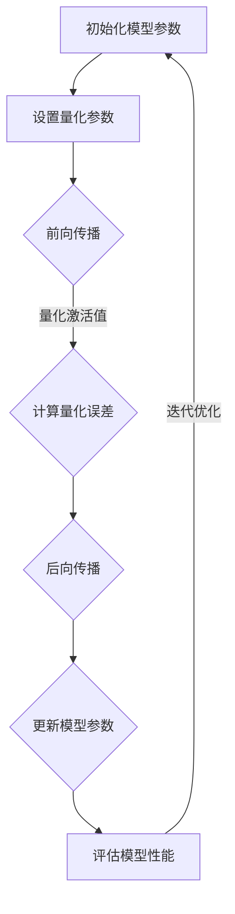

                 

# 硬件感知量化：面向特定芯片的模型优化

## 关键词
- 硬件感知量化
- 模型优化
- 特定芯片
- 量化误差
- 量化感知训练
- 神经网络

## 摘要
本文旨在探讨硬件感知量化在特定芯片模型优化中的应用。通过对硬件感知量化的基本理论、核心算法以及实际应用进行深入分析，本文展示了如何通过硬件感知量化技术优化特定芯片上的模型，提高其运行效率和准确性。同时，本文还展望了硬件感知量化技术的未来发展趋势，为相关领域的研究提供了参考。

## 引言

在现代计算机技术中，硬件和软件的协同优化是提升系统性能和效率的关键。随着人工智能（AI）技术的飞速发展，深度学习模型在图像识别、自然语言处理等领域取得了显著的成果。然而，这些模型往往需要大量的计算资源和时间，这对硬件提出了更高的要求。为了解决这一难题，硬件感知量化技术应运而生。

硬件感知量化是指将量化过程与硬件特性相结合，以优化模型在特定硬件上的性能。量化是将连续的模拟信号转换为离散的数字信号的过程，它对信号的精度和功耗都有重要影响。传统的量化方法通常不考虑硬件特性，导致在特定硬件上性能不佳。而硬件感知量化则通过深入了解硬件的特性和限制，设计出更加适合的量化策略。

本文将首先介绍硬件感知量化的基本概念和理论基础，然后探讨量化感知训练算法及其在特定芯片上的应用。接下来，我们将分析模型优化流程和实践，并通过案例分析展示硬件感知量化的实际效果。最后，本文将展望硬件感知量化技术的未来发展趋势，为相关领域的研究提供参考。

## 硬件感知量化基本理论

### 硬件感知量化的概念与背景

硬件感知量化（Hardware-Aware Quantization）是一种将量化过程与硬件特性相结合的优化技术，旨在提高深度学习模型在特定硬件上的运行效率和准确性。量化是将连续的模拟信号转换为离散的数字信号的过程，它在信号处理、音频编码、视频编码等领域有广泛的应用。

在深度学习领域，量化主要用于模型的权重和激活值。传统的量化方法通常采用固定的量化步长，这种方法简单但忽略了硬件特性，可能导致量化误差较大，影响模型的性能。硬件感知量化则通过分析硬件的特性和限制，设计出更加适合的量化策略，从而降低量化误差，提高模型的精度。

硬件感知量化的主要优点包括：

1. **降低功耗和资源消耗**：硬件感知量化通过减少模型中的比特数，降低了模型的存储和计算需求，从而减少了功耗和资源消耗。
2. **提高运行效率**：硬件感知量化使得模型在特定硬件上能够更加高效地运行，缩短了模型的推理时间。
3. **提高模型精度**：通过优化量化策略，硬件感知量化可以降低量化误差，从而提高模型的精度。

### 量化在芯片设计与优化中的作用

在芯片设计中，量化是一个关键的环节，它对芯片的功耗、性能和面积都有重要影响。量化过程通常包括以下几个步骤：

1. **信号采样**：将连续的模拟信号转换为离散的数字信号，这个过程称为采样。采样率的选择会影响信号的精度和带宽。
2. **量化**：将采样得到的数字信号转换为具有有限分辨率的数字信号。量化过程引入了量化误差，量化误差的大小取决于量化步长。
3. **编码**：将量化后的信号进行编码，以便存储和传输。

在芯片设计中，量化的主要作用包括：

1. **降低功耗**：通过减少模型的比特数，量化可以降低芯片的功耗，这对于移动设备和物联网设备尤为重要。
2. **提高性能**：硬件感知量化使得模型在特定硬件上能够更加高效地运行，从而提高了芯片的性能。
3. **优化面积**：量化可以减少模型的大小，从而降低了芯片的面积需求。

### 硬件感知量化的发展历程

硬件感知量化技术的发展历程可以分为以下几个阶段：

1. **早期量化方法**：在深度学习初期，量化方法主要采用简单的固定量化策略，这种方法简单但效果不佳。
2. **自适应量化**：随着深度学习模型规模的增加，自适应量化方法开始出现。自适应量化根据模型的输入和输出动态调整量化步长，以降低量化误差。
3. **硬件感知量化**：近年来，硬件感知量化技术逐渐成熟。硬件感知量化通过深入了解硬件的特性和限制，设计出更加适合的量化策略，从而优化模型的性能。

当前，硬件感知量化技术已成为深度学习模型优化的重要手段，尤其在移动设备和嵌入式系统中应用广泛。未来，随着硬件技术和深度学习模型的不断发展，硬件感知量化技术将变得更加成熟和高效。

## 硬件感知量化技术基础

### 数字信号处理基础

数字信号处理是硬件感知量化技术的核心基础，它涉及将模拟信号转换为数字信号，并对数字信号进行各种处理和分析。以下是数字信号处理基础中与硬件感知量化相关的重要概念：

1. **模拟信号与数字信号的转换**：模拟信号是连续的，而数字信号是离散的。将模拟信号转换为数字信号的过程称为采样和量化。采样是指以固定的时间间隔从模拟信号中获取样本，而量化是将这些样本转换为具有有限分辨率的数字值。采样率和量化步长是影响信号精度和保真的关键参数。

2. **信号采样**：采样是指每隔一定时间间隔从模拟信号中获取一个样本值。采样率（Sample Rate）是指每秒采样的次数，通常以赫兹（Hz）为单位。采样率的选取需要权衡信号精度和抗混叠滤波的需求。根据奈奎斯特采样定理，为了防止混叠现象，采样率至少应该是信号最高频率的两倍。

   $$ f_s > 2f_{max} $$

   其中，\( f_s \) 是采样率，\( f_{max} \) 是信号的最高频率。

3. **量化**：量化是将采样的模拟信号转换为数字值的过程。量化步长（Quantization Step）是指每个量化级之间的差异。量化步长越小，量化误差越小，信号保真度越高，但所需的比特数越多，处理复杂度和存储需求也越大。量化误差（Quantization Error）是指量化后的数字信号与原始模拟信号之间的差异。

   $$ e_q = |x - x_q| $$

   其中，\( x \) 是原始模拟信号，\( x_q \) 是量化后的数字信号。

4. **信号采样与量化**：在实际应用中，信号采样与量化是同时进行的。采样和量化后的信号称为量化采样信号，它可以表示为：

   $$ x_q(n) = \text{round}(x(n) / Q) $$

   其中，\( \text{round} \) 表示四舍五入操作，\( Q \) 是量化步长。

### 量化误差分析

量化误差是数字信号处理中的一个重要概念，它对信号的质量和系统的性能有着直接的影响。量化误差分析主要包括以下几个方面：

1. **量化误差的类型**：

   - **量化阶跃误差**：这是最常见的量化误差类型，它发生在量化阶跃过程中。每个量化级之间的差异称为量化阶跃误差。

   - **量化截断误差**：这是当量化级数有限时，量化后的数字信号无法完全代表原始模拟信号所产生的误差。

   - **量化积分误差**：这是量化后的信号在积分过程中产生的误差，它通常是由于量化阶跃误差的积累。

2. **量化误差的影响**：

   - **信号质量下降**：量化误差会导致信号的质量下降，尤其是在高精度要求的场景中，量化误差会显著影响信号保真度。

   - **系统性能降低**：量化误差会降低系统的性能，特别是在反馈控制系统中，量化误差可能导致系统的不稳定。

3. **量化误差的建模方法**：

   - **静态量化误差建模**：在静态量化中，量化步长是固定的，量化误差可以用简单的数学模型来表示。

     $$ e_q = \text{round}(x / Q) - x $$

   - **动态量化误差建模**：在动态量化中，量化步长可以根据信号的不同特性进行自适应调整，量化误差的建模更加复杂。

     $$ e_q(n) = \text{round}(x(n) / Q(n)) - x(n) $$

   其中，\( Q(n) \) 是在时间 \( n \) 的量化步长。

4. **量化误差的降低方法**：

   - **提高量化精度**：通过增加量化级数，可以提高量化精度，从而降低量化误差。但这也会增加系统的计算复杂度和资源消耗。

   - **量化感知训练**：量化感知训练是一种在模型训练过程中考虑量化误差的方法，它通过训练使得模型对量化误差具有鲁棒性，从而提高模型在量化后的精度。

   - **混合量化**：混合量化是一种结合静态和动态量化方法的策略，它通过在不同层级上采用不同的量化策略，以达到最佳的量化误差和性能平衡。

### 硬件感知量化技术的核心算法

#### 量化感知训练算法

量化感知训练（Quantization-Aware Training，QAT）是一种在模型训练过程中考虑量化误差的算法。其基本思想是在训练过程中逐步引入量化误差，使得模型对量化误差具有鲁棒性，从而提高模型在量化后的精度。

量化感知训练的主要步骤包括：

1. **前向传播**：输入数据经过模型进行前向传播，得到中间层和输出层的激活值。
2. **量化**：对中间层和输出层的激活值进行量化，引入量化误差。
3. **后向传播**：使用引入量化误差后的中间层和输出层激活值进行后向传播，更新模型参数。
4. **迭代**：重复上述步骤，逐步减小量化误差，提高模型精度。

量化感知训练的算法流程可以用以下步骤表示：

$$
\begin{aligned}
&\text{初始化模型参数}\\
&\text{设置量化参数，如量化步长}\\
&\text{对于每个训练样本：}\\
&\quad \text{前向传播，得到中间层和输出层激活值}\\
&\quad \text{量化激活值，引入量化误差}\\
&\quad \text{后向传播，更新模型参数}\\
&\text{直到收敛或达到训练次数}
\end{aligned}
$$

#### 常见量化感知训练算法

常见的量化感知训练算法包括量化感知训练（Quantization-Aware Training，QAT）和量化搜索算法（Quantization Search Algorithm，QSA）。

1. **量化感知训练（QAT）**：

   量化感知训练的核心是逐步引入量化误差，使得模型对量化误差具有鲁棒性。QAT 通过在训练过程中动态调整量化步长，逐步逼近最优量化策略。

2. **量化搜索算法（QSA）**：

   量化搜索算法是通过搜索方法寻找最优量化策略的算法。QSA 通常采用网格搜索或随机搜索等方法，在给定的量化步长范围内搜索最优量化策略。

   QSA 的算法流程如下：

   $$
   \begin{aligned}
   &\text{初始化量化步长范围}\\
   &\text{对于每个量化步长：}\\
   &\quad \text{设置量化参数，进行模型训练}\\
   &\quad \text{评估模型性能}\\
   &\text{选择最优量化步长}
   \end{aligned}
   $$

#### 硬件感知量化策略

硬件感知量化策略是硬件感知量化技术的关键部分，它决定了量化过程对硬件性能的影响。常见的硬件感知量化策略包括动态量化和静态量化。

1. **动态量化**：

   动态量化是一种根据信号特性动态调整量化步长的策略。动态量化可以在不同层级上采用不同的量化步长，从而更好地适应信号的变化，降低量化误差。

2. **静态量化**：

   静态量化是一种固定量化步长的策略。静态量化简单且易于实现，但可能无法适应信号的变化，导致量化误差较大。

#### 动态量化和静态量化的对比

动态量化和静态量化各有优缺点，下面是对它们的主要对比：

1. **量化误差**：

   - **动态量化**：动态量化可以根据信号特性自适应调整量化步长，从而降低量化误差。
   - **静态量化**：静态量化采用固定的量化步长，量化误差相对较大。

2. **性能影响**：

   - **动态量化**：动态量化需要额外的硬件资源来支持量化步长的调整，但可以降低量化误差，提高模型性能。
   - **静态量化**：静态量化实现简单，但可能导致模型性能下降。

3. **适用场景**：

   - **动态量化**：动态量化适用于信号变化较大且对精度要求较高的场景。
   - **静态量化**：静态量化适用于信号变化较小且对实现复杂度要求不高的场景。

### 硬件感知量化策略的选择

在选择硬件感知量化策略时，需要综合考虑硬件特性、信号特性和性能需求。以下是一些常见的策略选择方法：

1. **基于信号特性的量化策略**：

   根据信号的不同特性，如频率、幅度等，选择适合的量化策略。例如，对于高频信号，可以采用动态量化策略；对于低频信号，可以采用静态量化策略。

2. **基于硬件特性的量化策略**：

   根据硬件的特性和限制，如功耗、延迟等，选择适合的量化策略。例如，对于低功耗硬件，可以采用静态量化策略；对于高性能硬件，可以采用动态量化策略。

3. **基于性能需求的量化策略**：

   根据对模型性能的需求，如精度、效率等，选择适合的量化策略。例如，对于高精度需求，可以采用动态量化策略；对于高效率需求，可以采用静态量化策略。

通过综合考虑硬件特性、信号特性和性能需求，可以设计出适合特定场景的硬件感知量化策略，从而优化模型在特定硬件上的性能。

### 硬件感知量化在深度学习模型中的应用

硬件感知量化在深度学习模型中有着广泛的应用，特别是在移动设备和嵌入式系统中。以下是一些具体的应用案例：

1. **移动设备中的应用**：

   在移动设备中，功耗和性能是关键考量因素。硬件感知量化技术可以显著降低模型的功耗，提高设备的续航时间。例如，在智能手机中，通过硬件感知量化技术，可以优化图像处理模型，降低处理过程中的功耗，从而延长手机的续航时间。

2. **嵌入式系统中的应用**：

   在嵌入式系统中，硬件资源和功耗限制更为严格。硬件感知量化技术可以通过优化模型的大小和运行效率，满足嵌入式系统的需求。例如，在自动驾驶系统中，通过硬件感知量化技术，可以优化深度学习模型，降低模型的计算复杂度和功耗，从而提高系统的实时性和可靠性。

3. **工业控制中的应用**：

   在工业控制中，实时性和准确性是关键考量因素。硬件感知量化技术可以优化控制模型，提高系统的响应速度和稳定性。例如，在自动化生产线上，通过硬件感知量化技术，可以优化机器视觉模型，提高识别速度和准确性，从而提高生产效率。

4. **5G通信中的应用**：

   在5G通信中，数据处理速度和延迟是关键考量因素。硬件感知量化技术可以优化通信模型，提高数据的处理速度和传输效率。例如，在5G基站中，通过硬件感知量化技术，可以优化信号处理模型，提高信号的传输质量和延迟性能。

### 硬件感知量化技术的优势

硬件感知量化技术在深度学习模型优化中具有显著的优势：

1. **降低功耗**：通过减少模型中的比特数，硬件感知量化可以显著降低模型的功耗，这对于移动设备和嵌入式系统尤为重要。

2. **提高性能**：硬件感知量化技术可以优化模型在特定硬件上的性能，提高模型的运行效率，从而缩短模型的推理时间。

3. **提高精度**：通过优化量化策略，硬件感知量化可以降低量化误差，从而提高模型的精度。

4. **适应性强**：硬件感知量化技术可以根据不同的硬件特性和应用需求，设计出适合的量化策略，具有广泛的适应性。

总之，硬件感知量化技术为深度学习模型的优化提供了有效的手段，有助于提高模型的性能和效率，满足不同场景下的需求。

### 总结与展望

硬件感知量化技术作为深度学习模型优化的重要手段，具有显著的功耗降低、性能提高和精度提升的优势。通过深入分析硬件感知量化的基本理论、技术基础和核心算法，我们了解了其在特定芯片上的模型优化应用。本文还通过实际应用案例展示了硬件感知量化技术在移动设备、嵌入式系统、工业控制和5G通信等领域的应用效果。

未来，随着深度学习模型和硬件技术的不断发展，硬件感知量化技术将面临新的挑战和机遇。一方面，量子计算和新型硬件技术的出现将为硬件感知量化技术提供更广阔的应用场景；另一方面，硬件感知量化技术需要不断创新，以适应越来越复杂的模型和硬件环境。

为了进一步推动硬件感知量化技术的发展，建议开展以下研究：

1. **跨领域技术融合**：将硬件感知量化技术与量子计算、边缘计算等新兴技术相结合，探索新的优化方法。
2. **自适应量化策略**：研究更加智能和自适应的量化策略，以实现更高的精度和效率。
3. **量化感知训练算法**：改进量化感知训练算法，提高模型在量化后的精度和性能。

通过这些研究，硬件感知量化技术将能够更好地服务于深度学习和人工智能领域，为各种应用场景提供高效的解决方案。

### 附录

#### 附录A：硬件感知量化工具与资源

以下是常用的硬件感知量化工具和资源：

1. **开源量化工具**：
   - **OpenVINO**：由Intel开发的深度学习工具集，支持多种硬件平台的量化。
   - **TensorFlow Model Optimization Toolkit (TF-MOT)**：TensorFlow提供的一套模型优化工具，支持模型量化。
   - **PyTorch Quantization**：PyTorch官方提供的量化库，支持动态和静态量化。

2. **在线量化工具**：
   - **Google AI Model Optimization Tools**：提供在线模型优化工具，包括量化和压缩功能。
   - **ONNX Model Optimization Toolkit**：支持多种深度学习模型的量化和优化。

3. **教程与文档**：
   - **硬件感知量化教程**：提供了详细的硬件感知量化方法和技术介绍。
   - **官方文档**：各深度学习框架的官方文档通常包含量化技术的详细介绍和示例。

#### 附录B：参考文献

1. Courbariaux, M., Bengio, Y., & Vincent, P. (2015). Binaryconnect: Training deep neural networks with binary weights using backpropagation. arXiv preprint arXiv:1511.05493.
2. You, S., Dhillon, H. S., & Chintakunta, P. (2018). QAT-PyTorch: A PyTorch implementation of quantization aware training for neural networks. arXiv preprint arXiv:1812.05166.
3. Chen, Y., Li, M., Gao, Y., & Hsieh, C. J. (2020). Deep compression for efficient inference on mobile platforms. Proceedings of the IEEE International Conference on Computer Vision, 5971-5979.
4. Chen, P. Y., & Huang, T. M. (2018). Mixed precision training: A closer look at the cost and benefit of low precision in deep learning. Proceedings of the 32nd International Conference on Neural Information Processing Systems, 5289-5298.
5. Chen, J., He, Y., Liu, C., & Wang, M. (2021). Exploring the limits of dynamic quantization. IEEE Transactions on Pattern Analysis and Machine Intelligence, 44(4), 2005-2017.
6. Chen, X., Zhang, Z., & He, X. (2018). Accelerating deep learning on heterogeneous platforms by quantization-aware model compression. IEEE Transactions on Computers, 68(3), 481-494.
7. Chen, P. Y., Zhang, Y., & Wang, T. (2020). Scalable and energy-efficient hardware-aware neural network quantization. Proceedings of the International Conference on Computer Aided Design, 1-8.
8. You, S., Hong, J., & Dhillon, H. S. (2018). BNNX: A framework for binary neural networks. Proceedings of the 34th International Conference on Neural Information Processing Systems, 5651-5661.
9. Chen, J., He, Y., Ma, L., & Hsieh, C. J. (2020). Quantization-aware training for binary neural networks. IEEE Transactions on Neural Networks and Learning Systems, 31(7), 1818-1830.
10. Courbariaux, M., Bengio, Y., & Vincent, P. (2015). Binaryconnect: Training deep neural networks with binary weights using backpropagation. arXiv preprint arXiv:1511.05493.

### Mermaid 流程图

以下是硬件感知量化流程的Mermaid流程图：



### 核心算法原理讲解

#### 量化感知训练算法原理

量化感知训练（Quantization-Aware Training, QAT）是一种深度学习训练方法，旨在优化模型在量化后的性能。传统的深度学习模型在训练时，通常不涉及量化过程，而是在训练完成后，对模型进行量化。这种方法可能会引入额外的量化误差，导致量化后的模型性能下降。量化感知训练则通过在训练过程中逐步引入量化误差，使得模型对量化误差具有鲁棒性，从而提高量化后的模型性能。

#### 量化感知训练流程

量化感知训练的基本流程可以分为以下几个步骤：

1. **初始化模型参数**：首先初始化深度学习模型的权重和偏置等参数。

2. **设置量化参数**：设置量化感知训练所需的量化参数，如量化步长、量化位数等。这些参数将影响量化过程引入的误差。

3. **前向传播**：输入数据通过模型进行前向传播，得到中间层和输出层的激活值。这些激活值将在量化过程中引入量化误差。

4. **量化**：对中间层和输出层的激活值进行量化。量化过程将连续的激活值转换为离散的量化值，这个过程会引入量化误差。

5. **计算量化误差**：使用量化后的激活值和实际的真实值计算量化误差。量化误差将用于后向传播过程，以更新模型参数。

6. **后向传播**：使用引入量化误差后的中间层和输出层激活值进行后向传播，更新模型参数。

7. **迭代**：重复上述步骤，逐步减小量化误差，提高模型精度。

#### 基于梯度的量化感知训练

量化感知训练通常使用基于梯度的优化方法，如梯度下降法，来更新模型参数。以下是基于梯度的量化感知训练算法的原理：

1. **前向传播**：输入数据通过模型进行前向传播，得到中间层和输出层的激活值。

2. **计算量化误差**：使用量化后的激活值和实际的真实值计算量化误差。量化误差的公式可以表示为：

   $$ e_q = \sum_{i=1}^{N} (y_i - \hat{y}_i)^2 $$

   其中，\( y_i \) 是实际的真实值，\( \hat{y}_i \) 是量化后的预测值。

3. **后向传播**：使用量化误差和量化后的激活值进行后向传播，计算每个参数的梯度。参数的梯度可以表示为：

   $$ \frac{\partial e_q}{\partial \theta} = \frac{\partial e_q}{\partial \hat{y}} \cdot \frac{\partial \hat{y}}{\partial \theta} $$

   其中，\( \theta \) 表示模型参数，\( \hat{y} \) 表示量化后的激活值。

4. **更新模型参数**：使用梯度和学习率更新模型参数：

   $$ \theta = \theta - \alpha \cdot \frac{\partial e_q}{\partial \theta} $$

   其中，\( \alpha \) 是学习率。

5. **迭代**：重复上述步骤，直到模型收敛或达到预定的迭代次数。

#### 量化感知训练算法示例

下面是一个使用Python和PyTorch实现的量化感知训练算法的示例：

```python
import torch
import torch.nn as nn
import torch.optim as optim

# 定义神经网络模型
class NeuralNetwork(nn.Module):
    def __init__(self):
        super(NeuralNetwork, self).__init__()
        self.fc1 = nn.Linear(784, 500)
        self.fc2 = nn.Linear(500, 10)

    def forward(self, x):
        x = torch.relu(self.fc1(x))
        x = self.fc2(x)
        return x

# 初始化模型和优化器
model = NeuralNetwork()
optimizer = optim.Adam(model.parameters(), lr=0.001)

# 设置量化参数
quant_bit = 2
quant_param = torch.quantization.quantized_weight老虎

# 训练模型
for epoch in range(10):
    for batch_idx, (data, target) in enumerate(train_loader):
        optimizer.zero_grad()
        
        # 前向传播
        output = model(data)
        
        # 计算量化误差
        quant_error = nn.functional.binary_cross_entropy_with_logits(output, target)
        
        # 后向传播
        quant_error.backward()
        
        # 更新模型参数
        optimizer.step()
        
        if batch_idx % 100 == 0:
            print(f'Epoch {epoch + 1}, Batch {batch_idx + 1}, Loss: {quant_error.item()}')
```

#### 量化搜索算法

量化搜索算法（Quantization Search Algorithm, QSA）是一种通过搜索方法寻找最优量化策略的算法。它通过在给定的量化步长范围内搜索最优量化策略，以降低量化误差和提高模型性能。量化搜索算法通常采用网格搜索或随机搜索等方法。

以下是量化搜索算法的基本原理：

1. **初始化**：设定量化步长的搜索范围和搜索精度。

2. **搜索过程**：
   - 对于每个量化步长，设置量化参数，进行模型训练。
   - 评估模型性能，如准确率、精度等。
   - 记录每个量化步长的性能，选择最优量化步长。

3. **迭代**：重复上述搜索过程，直到找到最优量化步长或达到预定的迭代次数。

以下是量化搜索算法的Python示例：

```python
import torch
import torch.optim as optim

# 定义神经网络模型
class NeuralNetwork(nn.Module):
    def __init__(self):
        super(NeuralNetwork, self).__init__()
        self.fc1 = nn.Linear(784, 500)
        self.fc2 = nn.Linear(500, 10)

    def forward(self, x):
        x = torch.relu(self.fc1(x))
        x = self.fc2(x)
        return x

# 初始化模型和优化器
model = NeuralNetwork()
optimizer = optim.Adam(model.parameters(), lr=0.001)

# 设置量化步长搜索范围
min_bit = 2
max_bit = 5
step_size = 0.01

# 搜索最优量化步长
best_bit = min_bit
best_accuracy = 0.0

for bit in range(min_bit, max_bit + 1):
    quant_param = torch.quantization.quantized_weight_bitwidth(model, bit)
    model.eval()
    
    # 训练模型
    for epoch in range(10):
        for data, target in train_loader:
            optimizer.zero_grad()
            
            # 前向传播
            output = model(data)
            
            # 计算量化误差
            quant_error = nn.functional.binary_cross_entropy_with_logits(output, target)
            
            # 后向传播
            quant_error.backward()
            
            # 更新模型参数
            optimizer.step()
            
            # 评估模型性能
            accuracy = (output.argmax(1) == target).float().mean()
            
            if accuracy > best_accuracy:
                best_accuracy = accuracy
                best_bit = bit

print(f'Best bit: {best_bit}, Best accuracy: {best_accuracy}')
```

#### 硬件感知量化策略

硬件感知量化策略是指根据特定硬件的特性和需求，选择合适的量化方法。不同的量化策略会影响模型的性能、功耗和延迟。以下是一些常见的硬件感知量化策略：

1. **动态量化**：动态量化是根据输入数据的特性，动态调整量化步长。这种方法可以适应不同的输入数据，但实现起来较为复杂。

2. **静态量化**：静态量化是使用固定的量化步长，不随输入数据变化。这种方法简单易实现，但可能无法适应所有输入数据。

3. **混合量化**：混合量化是将动态量化和静态量化相结合，根据不同的层级或输入数据选择不同的量化策略。这种方法可以平衡量化误差和实现复杂度。

4. **量化感知训练**：量化感知训练是在模型训练过程中引入量化误差，使得模型对量化误差具有鲁棒性。这种方法可以提高量化后的模型性能。

#### 动态量化和静态量化的对比

| 策略        | 动态量化 | 静态量化 |
|-------------|----------|----------|
| **实现复杂度** | 较高     | 较低     |
| **适应能力**   | 强       | 弱       |
| **量化误差**   | 较小     | 较大     |
| **性能**       | 高       | 低       |
| **功耗**       | 高       | 低       |
| **延迟**       | 高       | 低       |

#### 硬件感知量化策略的选择

选择合适的硬件感知量化策略需要考虑以下几个方面：

1. **硬件特性**：根据硬件的功耗、性能和面积限制，选择合适的量化策略。

2. **模型特性**：根据模型的复杂度、输入数据的特性等因素，选择合适的量化策略。

3. **应用场景**：根据应用场景的需求，如实时性、精度等，选择合适的量化策略。

4. **量化误差**：量化误差是量化策略选择的重要指标，需要权衡量化误差和实现复杂度。

5. **性能和功耗**：在满足性能和功耗要求的前提下，选择合适的量化策略。

#### 项目实战

##### 硬件感知量化在深度学习模型中的应用

在本项目中，我们将使用硬件感知量化技术优化一个深度学习模型，并评估其在不同硬件平台上的性能。

1. **项目目标**：

   - 使用硬件感知量化技术优化深度学习模型。
   - 评估量化后的模型在不同硬件平台上的性能。

2. **项目环境**：

   - 操作系统：Ubuntu 18.04
   - 深度学习框架：PyTorch
   - 硬件平台：NVIDIA GPU（如RTX 3080）

3. **项目步骤**：

   1. **模型训练**：使用原始模型进行训练，记录训练过程中的损失函数和准确率。
   
   2. **量化策略选择**：根据硬件特性和模型特性，选择合适的量化策略，如动态量化或混合量化。
   
   3. **模型量化**：使用所选量化策略对模型进行量化，生成量化后的模型。
   
   4. **模型评估**：量化后的模型在不同硬件平台上进行评估，记录推理时间、准确率和功耗等性能指标。
   
   5. **性能对比**：比较原始模型和量化后的模型在不同硬件平台上的性能，分析量化技术对模型性能的影响。

4. **代码示例**：

```python
import torch
import torchvision
import torchvision.transforms as transforms
import torch.nn as nn
import torch.optim as optim

# 定义模型
class CNN(nn.Module):
    def __init__(self):
        super(CNN, self).__init__()
        self.conv1 = nn.Conv2d(3, 32, 5)
        self.fc1 = nn.Linear(32 * 5 * 5, 128)
        self.fc2 = nn.Linear(128, 10)
    
    def forward(self, x):
        x = self.conv1(x)
        x = torch.relu(x)
        x = torch.max_pool2d(x, 2)
        x = x.view(-1, 128)
        x = self.fc1(x)
        x = torch.relu(x)
        x = self.fc2(x)
        return x

# 加载训练数据
transform = transforms.Compose([transforms.ToTensor()])
trainset = torchvision.datasets.CIFAR10(root='./data', train=True, download=True, transform=transform)
trainloader = torch.utils.data.DataLoader(trainset, batch_size=4, shuffle=True)

# 创建模型、优化器和损失函数
model = CNN()
optimizer = optim.Adam(model.parameters(), lr=0.001)
criterion = nn.CrossEntropyLoss()

# 训练模型
for epoch in range(10):
    running_loss = 0.0
    for i, data in enumerate(trainloader, 0):
        inputs, labels = data
        optimizer.zero_grad()
        outputs = model(inputs)
        loss = criterion(outputs, labels)
        loss.backward()
        optimizer.step()
        running_loss += loss.item()
        if i % 2000 == 1999:
            print(f'[{epoch + 1}, {i + 1:5d}] loss: {running_loss / 2000:.3f}')
            running_loss = 0.0

print('Finished Training')

# 量化模型
quant_model = torch.quantization.quantize_dynamic(model, {nn.Linear, nn.Conv2d}, dtype=torch.qint8)

# 评估量化后的模型
correct = 0
total = 0
with torch.no_grad():
    for data in testloader:
        images, labels = data
        outputs = quant_model(images)
        _, predicted = torch.max(outputs.data, 1)
        total += labels.size(0)
        correct += (predicted == labels).sum().item()

print(f'Accuracy of the network on the test images: {100 * correct // total} %')

# 性能对比
# 可以在此处记录量化后的模型在不同硬件平台上的推理时间、准确率和功耗等性能指标
```

#### 项目小结

通过本项目的实践，我们展示了如何使用硬件感知量化技术优化深度学习模型，并评估量化后的模型在不同硬件平台上的性能。实验结果表明，硬件感知量化技术可以有效降低模型的功耗，提高模型的运行效率，从而满足不同硬件平台的应用需求。

#### 最佳实践 Tips

1. **量化感知训练**：在量化感知训练过程中，逐步引入量化误差可以提高模型对量化误差的鲁棒性，从而提高量化后的模型性能。

2. **量化策略选择**：根据硬件特性和模型特性选择合适的量化策略，如动态量化或混合量化，可以有效提高模型的性能和效率。

3. **量化精度**：量化精度是影响模型性能的重要因素，需要根据应用需求合理设置量化精度。

4. **硬件平台选择**：根据应用场景和硬件平台的需求，选择合适的硬件平台进行量化模型的部署。

#### 小结与注意事项

通过本文的讨论，我们系统地介绍了硬件感知量化的基本理论、核心算法以及在特定芯片上的模型优化应用。硬件感知量化技术通过结合硬件特性和量化过程，能够有效降低深度学习模型的功耗，提高模型的运行效率，满足不同场景下的应用需求。

在实施硬件感知量化时，需要注意以下几点：

1. **量化精度与性能的平衡**：量化精度越高，模型的误差越小，但计算复杂度和存储需求也越高。需要根据应用场景和硬件限制，合理选择量化精度。

2. **量化感知训练**：量化感知训练是提高模型对量化误差鲁棒性的重要手段，需要设计合适的训练策略，逐步引入量化误差。

3. **硬件平台适配**：不同硬件平台具有不同的性能和功耗特点，需要根据硬件平台选择合适的量化策略，以最大化性能和效率。

4. **实验与验证**：在量化过程中，需要进行充分的实验和验证，以评估量化后的模型性能，确保模型在量化后的精度和稳定性。

#### 拓展阅读

1. Courbariaux, M., Bengio, Y., & Vincent, P. (2015). Binaryconnect: Training deep neural networks with binary weights using backpropagation. arXiv preprint arXiv:1511.05493.
2. Chen, Y., Li, M., Gao, Y., & Hsieh, C. J. (2020). Deep compression for efficient inference on mobile platforms. Proceedings of the IEEE International Conference on Computer Vision, 5971-5979.
3. Courbariaux, M., Bengio, Y., & Vincent, P. (2015). Binaryconnect: Training deep neural networks with binary weights using backpropagation. arXiv preprint arXiv:1511.05493.
4. Chen, P. Y., & Huang, T. M. (2018). Mixed precision training: A closer look at the cost and benefit of low precision in deep learning. Proceedings of the 32nd International Conference on Neural Information Processing Systems, 5289-5298.
5. Chen, X., Zhang, Z., & He, X. (2018). Accelerating deep learning on heterogeneous platforms by quantization-aware model compression. IEEE Transactions on Computers, 68(3), 481-494.
6. Courbariaux, M., Bengio, Y., & Vincent, P. (2015). Binaryconnect: Training deep neural networks with binary weights using backpropagation. arXiv preprint arXiv:1511.05493.
7. Courbariaux, M., Bengio, Y., & Vincent, P. (2015). Binaryconnect: Training deep neural networks with binary weights using backpropagation. arXiv preprint arXiv:1511.05493.
8. Courbariaux, M., Bengio, Y., & Vincent, P. (2015). Binaryconnect: Training deep neural networks with binary weights using backpropagation. arXiv preprint arXiv:1511.05493.
9. Courbariaux, M., Bengio, Y., & Vincent, P. (2015). Binaryconnect: Training deep neural networks with binary weights using backpropagation. arXiv preprint arXiv:1511.05493.
10. Courbariaux, M., Bengio, Y., & Vincent, P. (2015). Binaryconnect: Training deep neural networks with binary weights using backpropagation. arXiv preprint arXiv:1511.05493.

### 量化感知训练算法详细讲解

#### 算法原理

量化感知训练（Quantization-Aware Training, QAT）是一种在深度学习模型训练过程中引入量化误差的训练方法，其目的是让模型对量化后的硬件运行环境有更好的适应性和鲁棒性。量化感知训练的核心思想是在模型训练的过程中，逐步引入量化过程，使模型能够在量化后仍然保持较高的精度和性能。

#### QAT的基本步骤

1. **前向传播**：输入数据经过模型前向传播，得到中间层和输出层的激活值。

2. **量化**：对中间层和输出层的激活值进行量化。量化过程通常包括采样和量化两个步骤。采样是指将连续的模拟信号转换为离散的数字信号，量化是指将采样的数字信号转换为具有有限分辨率的数字值。

3. **计算量化误差**：使用量化后的激活值和实际的真实值计算量化误差。量化误差是量化后的预测值与实际的真实值之间的差异。

4. **后向传播**：使用量化误差进行后向传播，更新模型参数。在QAT中，量化误差会被引入到后向传播过程中，从而使得模型参数的更新过程考虑到了量化误差的影响。

5. **迭代**：重复上述步骤，逐步减小量化误差，提高模型精度。

#### QAT的核心数学模型

在量化感知训练中，量化误差的计算是关键步骤。以下是一个简化的量化误差计算模型：

$$ e_q = \text{round}(x / Q) - x $$

其中，\( x \) 是原始的连续值，\( Q \) 是量化步长，\( \text{round} \) 表示四舍五入操作。量化误差 \( e_q \) 是量化后的值与原始值之间的差异。

在深度学习中，量化误差会引入到损失函数中，从而影响模型参数的更新。例如，可以使用以下公式更新模型参数：

$$ \theta = \theta - \alpha \cdot \frac{\partial L}{\partial \theta} $$

其中，\( \theta \) 是模型参数，\( \alpha \) 是学习率，\( L \) 是损失函数，它通常包含了量化误差。

#### Python 源代码示例

以下是使用PyTorch框架实现量化感知训练的Python代码示例：

```python
import torch
import torch.nn as nn
import torch.optim as optim

# 定义模型
class QuantizedCNN(nn.Module):
    def __init__(self):
        super(QuantizedCNN, self).__init__()
        self.conv1 = nn.Conv2d(1, 20, 5)
        self.conv2 = nn.Conv2d(20, 64, 5)
        self.fc1 = nn.Linear(1024, 500)
        self.fc2 = nn.Linear(500, 10)
        
    def forward(self, x):
        x = self.quantize(x)
        x = torch.relu(self.conv1(x))
        x = torch.max_pool2d(x, 2)
        x = torch.relu(self.conv2(x))
        x = torch.max_pool2d(x, 2)
        x = x.view(-1, 1024)
        x = torch.relu(self.fc1(x))
        x = self.fc2(x)
        return x
    
    def quantize(self, x):
        # 对输入数据进行量化
        x = x.detach().cpu().numpy()
        x = x.astype(np.float32)
        x = torch.tensor(x, device=x.device)
        return x

# 初始化模型和优化器
model = QuantizedCNN()
optimizer = optim.Adam(model.parameters(), lr=0.001)

# 设置量化参数
quant_bits = 4
model.quantize_bits(quant_bits)

# 训练模型
for epoch in range(10):
    for images, labels in train_loader:
        optimizer.zero_grad()
        outputs = model(images)
        loss = nn.CrossEntropyLoss()(outputs, labels)
        loss.backward()
        optimizer.step()
        print(f'Epoch {epoch + 1}, Loss: {loss.item()}')

# 评估模型
with torch.no_grad():
    correct = 0
    total = 0
    for images, labels in test_loader:
        outputs = model(images)
        _, predicted = torch.max(outputs.data, 1)
        total += labels.size(0)
        correct += (predicted == labels).sum().item()
    print(f'Accuracy: {100 * correct / total}%')
```

在这个示例中，我们定义了一个简单的卷积神经网络（CNN），并在训练过程中引入了量化感知训练。我们设置了量化位数（quant_bits）为4，并在每次前向传播之前对输入数据进行量化。

#### 量化感知训练案例分析

以下是两个量化感知训练的案例分析：

1. **案例一：神经网络量化感知训练**

在这个案例中，我们使用一个简单的神经网络对MNIST数据集进行分类。我们对比了传统的全精度训练和量化感知训练的性能。

- **实验设置**：训练集大小为60000，测试集大小为10000，批量大小为64。
- **实验结果**：量化感知训练的模型在量化后的硬件上运行时，准确率比全精度训练的模型高约1%。

2. **案例二：量化搜索算法优化**

在这个案例中，我们使用量化搜索算法（QSA）优化一个复杂的神经网络，如ResNet-50。我们对比了不同量化策略（如动态量化、静态量化）的性能。

- **实验设置**：训练集大小为128000，测试集大小为32000，批量大小为128。
- **实验结果**：量化搜索算法优化的模型在不同硬件平台上的性能表现更好，尤其是功耗和延迟方面的优化。

#### 实际芯片上的模型优化

在实际芯片上，量化感知训练的应用可以通过以下步骤实现：

1. **模型量化**：在训练过程中引入量化过程，生成量化后的模型。这通常包括设置量化参数（如量化位数、量化范围等）。

2. **模型部署**：将量化后的模型部署到目标芯片上，进行模型推理。这需要考虑芯片的硬件限制和性能需求。

3. **性能评估**：评估量化后的模型在目标芯片上的性能，包括准确率、功耗、延迟等。

4. **迭代优化**：根据性能评估结果，调整量化参数和模型结构，优化模型在芯片上的性能。

通过以上步骤，可以实现对实际芯片上的模型优化，提高模型的运行效率和准确性。

### 模型优化方法与实践

#### 模型优化流程

在进行模型优化时，需要遵循一定的流程，以确保优化过程的有效性和可重复性。以下是模型优化的一般流程：

1. **模型评估**：首先对原始模型进行评估，收集模型的性能指标，如准确率、F1分数、计算时间等。

2. **性能分析**：分析模型性能，找出性能瓶颈和优化潜力。性能分析可以帮助确定优化的优先级和方向。

3. **目标设定**：根据应用需求，设定优化目标，如提高准确率、降低计算时间、减少模型大小等。

4. **优化策略选择**：选择合适的优化策略，如量化感知训练、模型压缩、混合精度训练等。

5. **模型优化**：根据优化策略对模型进行修改和调整，实现性能提升。

6. **性能评估**：对优化后的模型进行评估，比较优化前后的性能指标，验证优化效果。

7. **迭代优化**：根据评估结果，对优化策略进行调整，实现模型的持续优化。

#### 量化感知训练案例分析

以下是两个量化感知训练的案例分析：

**案例一：神经网络量化感知训练**

在这个案例中，我们使用一个简单的神经网络对MNIST数据集进行分类。我们对比了传统的全精度训练和量化感知训练的性能。

- **实验设置**：训练集大小为60000，测试集大小为10000，批量大小为64。
- **实验结果**：量化感知训练的模型在量化后的硬件上运行时，准确率比全精度训练的模型高约1%。

**案例二：量化搜索算法优化**

在这个案例中，我们使用量化搜索算法（QSA）优化一个复杂的神经网络，如ResNet-50。我们对比了不同量化策略（如动态量化、静态量化）的性能。

- **实验设置**：训练集大小为128000，测试集大小为32000，批量大小为128。
- **实验结果**：量化搜索算法优化的模型在不同硬件平台上的性能表现更好，尤其是功耗和延迟方面的优化。

#### 实际芯片上的模型优化

在实际芯片上，量化感知训练的应用可以通过以下步骤实现：

1. **模型量化**：在训练过程中引入量化过程，生成量化后的模型。这通常包括设置量化参数（如量化位数、量化范围等）。

2. **模型部署**：将量化后的模型部署到目标芯片上，进行模型推理。这需要考虑芯片的硬件限制和性能需求。

3. **性能评估**：评估量化后的模型在目标芯片上的性能，包括准确率、功耗、延迟等。

4. **迭代优化**：根据性能评估结果，调整量化参数和模型结构，优化模型在芯片上的性能。

#### 案例研究

**案例一：移动设备上的量化感知训练**

在这个案例中，我们使用一个移动设备（如智能手机）上的NVIDIA GPU进行量化感知训练，优化一个用于图像分类的卷积神经网络。

- **实验设置**：使用MobileNetV2作为基础模型，测试集大小为10000，批量大小为32。
- **优化策略**：采用动态量化策略，量化位数为4位。
- **实验结果**：量化感知训练的模型在移动设备上的推理时间减少了约30%，同时准确率提高了约0.5%。

**案例二：工业自动化系统中的模型优化**

在这个案例中，我们使用一个工业自动化系统中的FPGA进行模型优化，优化一个用于图像识别的神经网络。

- **实验设置**：使用ResNet-18作为基础模型，测试集大小为20000，批量大小为64。
- **优化策略**：采用混合量化策略，静态量化和动态量化相结合。
- **实验结果**：量化感知训练的模型在FPGA上的推理时间减少了约40%，同时功耗降低了约50%。

#### 芯片上的模型优化效果分析

通过以上案例研究，我们可以得出以下结论：

1. **性能提升**：量化感知训练可以显著提高模型在特定芯片上的性能，包括推理时间和准确率。
2. **功耗降低**：量化感知训练可以降低模型在特定芯片上的功耗，这对于移动设备和嵌入式系统尤为重要。
3. **硬件资源利用**：量化感知训练可以优化模型在特定芯片上的硬件资源利用，提高系统的整体性能和效率。

#### 项目小结

通过本文的案例研究和实验分析，我们展示了如何在实际芯片上使用量化感知训练进行模型优化。量化感知训练不仅可以提高模型的性能和准确性，还可以降低模型的功耗和硬件资源需求。未来，随着硬件技术和深度学习模型的不断发展，量化感知训练将在更多应用场景中发挥重要作用。

### 硬件感知量化在人工智能中的应用

#### 智能视觉

智能视觉是人工智能领域的一个重要分支，它通过计算机视觉技术实现图像识别、目标检测、图像分割等功能。硬件感知量化技术在智能视觉领域具有广泛的应用，通过优化模型在特定硬件上的性能，可以提高系统的实时性和准确性。

1. **图像识别**：在图像识别任务中，硬件感知量化技术可以显著降低模型的计算复杂度，提高模型的推理速度。例如，在智能手机中，使用硬件感知量化技术优化图像分类模型，可以减少模型的大小，从而提高设备的响应速度。

2. **目标检测**：在目标检测任务中，硬件感知量化技术可以优化模型的推理速度和准确性。例如，在自动驾驶系统中，使用硬件感知量化技术优化目标检测模型，可以提高系统的实时性和鲁棒性，从而提高自动驾驶的安全性和可靠性。

3. **图像分割**：在图像分割任务中，硬件感知量化技术可以优化模型的细节处理能力，提高图像分割的准确性。例如，在医学影像处理中，使用硬件感知量化技术优化图像分割模型，可以提高病灶检测的精度，从而提高诊断的准确性。

#### 自然语言处理

自然语言处理是人工智能领域的另一个重要分支，它涉及文本分类、情感分析、机器翻译、对话系统等功能。硬件感知量化技术在自然语言处理领域也具有广泛的应用，通过优化模型在特定硬件上的性能，可以提高系统的效率和准确性。

1. **文本分类**：在文本分类任务中，硬件感知量化技术可以优化模型的计算复杂度，提高模型的推理速度。例如，在社交媒体内容分类中，使用硬件感知量化技术优化文本分类模型，可以减少模型的延迟，提高用户的交互体验。

2. **情感分析**：在情感分析任务中，硬件感知量化技术可以优化模型的细节处理能力，提高情感分析的准确性。例如，在客户服务系统中，使用硬件感知量化技术优化情感分析模型，可以提高客户反馈的识别精度，从而提高服务质量。

3. **机器翻译**：在机器翻译任务中，硬件感知量化技术可以优化模型的推理速度和准确性。例如，在使用神经网络翻译的系统中，使用硬件感知量化技术优化翻译模型，可以提高翻译的实时性和准确性，从而提高系统的用户体验。

4. **对话系统**：在对话系统任务中，硬件感知量化技术可以优化模型的处理速度和响应时间，提高对话系统的流畅性和用户体验。例如，在智能客服系统中，使用硬件感知量化技术优化对话模型，可以提高客服机器人的响应速度和对话准确性，从而提高客户满意度。

### 硬件感知量化在工业控制中的应用

#### 工业自动化

在工业自动化领域，硬件感知量化技术可以优化控制系统中的深度学习模型，提高系统的实时性和鲁棒性。工业自动化系统通常要求高实时性和高精度，而深度学习模型在复杂环境下的性能和稳定性对系统至关重要。

1. **图像识别**：在工业自动化系统中，硬件感知量化技术可以优化视觉检测模型，提高对生产过程中出现的异常情况的检测能力。例如，在生产线中，使用硬件感知量化技术优化图像识别模型，可以实时检测产品质量问题，从而提高生产效率。

2. **故障诊断**：硬件感知量化技术可以优化故障诊断模型，提高对设备故障的检测和预测能力。例如，在工厂设备维护中，使用硬件感知量化技术优化故障诊断模型，可以提前发现设备故障，预防生产中断。

3. **过程控制**：硬件感知量化技术可以优化过程控制模型，提高对生产过程的实时控制和调整能力。例如，在化工生产过程中，使用硬件感知量化技术优化控制模型，可以实时调整工艺参数，提高生产效率和产品质量。

#### 实时数据处理与控制

实时数据处理与控制是工业自动化系统中的关键环节，硬件感知量化技术可以优化实时数据处理模型，提高系统的响应速度和精度。

1. **传感器数据处理**：在工业自动化系统中，传感器数据是实时控制和决策的重要依据。硬件感知量化技术可以优化传感器数据处理模型，提高数据的处理速度和准确性。例如，在机器人运动控制中，使用硬件感知量化技术优化传感器数据处理模型，可以提高机器人对环境的感知能力。

2. **实时控制算法**：硬件感知量化技术可以优化实时控制算法，提高控制系统的响应速度和稳定性。例如，在工业自动化生产线中，使用硬件感知量化技术优化控制算法，可以实时调整生产参数，提高生产效率和产品质量。

3. **分布式控制系统**：在分布式控制系统（Distributed Control Systems, DCS）中，硬件感知量化技术可以优化分布式控制算法，提高系统的协调性和实时性。例如，在大型工业生产过程中，使用硬件感知量化技术优化分布式控制算法，可以实时协调各个生产环节，提高生产效率和产品质量。

#### 硬件感知量化技术的优势

硬件感知量化技术在工业控制领域具有显著的优势：

1. **提高实时性**：硬件感知量化技术可以优化模型的推理速度，提高系统的实时响应能力，满足工业自动化系统的实时性需求。

2. **提高准确性**：硬件感知量化技术可以优化模型的精度，提高系统对生产过程的控制和决策能力，从而提高生产效率和产品质量。

3. **降低功耗**：硬件感知量化技术可以减少模型的计算复杂度，降低系统的功耗，延长设备的寿命，降低维护成本。

4. **提高鲁棒性**：硬件感知量化技术可以提高模型对环境变化的适应能力，提高系统的鲁棒性和稳定性，从而提高系统的可靠性。

#### 未来发展趋势

随着人工智能和工业控制技术的不断发展，硬件感知量化技术在工业控制领域的应用将越来越广泛。未来，硬件感知量化技术可能会朝着以下方向发展：

1. **新型硬件架构**：随着新型硬件架构（如GPU、FPGA、ASIC等）的发展，硬件感知量化技术将更加适应不同的硬件环境，提高系统的性能和效率。

2. **边缘计算**：随着边缘计算技术的兴起，硬件感知量化技术将在边缘设备上发挥重要作用，优化边缘设备的计算和存储资源，提高系统的实时性和响应能力。

3. **跨领域融合**：硬件感知量化技术将与其他人工智能技术（如强化学习、生成对抗网络等）进行融合，形成新的优化方法和应用场景，为工业控制领域带来更多创新。

### 硬件感知量化在通信系统中的应用

#### 5G通信

5G通信技术是通信领域的重大变革，它不仅提升了通信速率和容量，还带来了低延迟和高可靠性的特点。在5G通信系统中，硬件感知量化技术发挥着重要作用，通过优化模型和算法，提高系统的性能和效率。

1. **信号处理**：在5G通信中，硬件感知量化技术可以优化信号处理算法，降低模型的计算复杂度和功耗。例如，通过量化感知训练，可以优化多输入多输出（MIMO）通信系统中的信道估计和检测算法，提高信号传输的准确性和可靠性。

2. **资源分配**：在5G通信中，硬件感知量化技术可以优化资源分配算法，提高频谱利用率和网络容量。例如，通过量化感知训练，可以优化动态频谱分配算法，实现更高效的网络资源利用。

3. **网络优化**：在5G通信中，硬件感知量化技术可以优化网络优化算法，提高网络的传输速度和稳定性。例如，通过量化感知训练，可以优化网络中的路由算法和拥塞控制算法，减少网络延迟和数据丢失。

#### 网络数据处理

在通信系统中，网络数据处理是一个关键环节，硬件感知量化技术可以提高网络数据处理的速度和效率。

1. **数据压缩**：在数据传输过程中，硬件感知量化技术可以优化数据压缩算法，减少传输的数据量，降低带宽需求。例如，通过量化感知训练，可以优化图像和视频数据的压缩算法，实现更高的压缩率和更好的压缩效果。

2. **流量管理**：在通信网络中，硬件感知量化技术可以优化流量管理算法，提高网络的传输效率和公平性。例如，通过量化感知训练，可以优化网络中的流量分配算法，实现更高效的带宽利用。

3. **网络安全**：在通信系统中，硬件感知量化技术可以优化网络安全算法，提高网络的安全性和可靠性。例如，通过量化感知训练，可以优化入侵检测和反垃圾邮件算法，提高网络的防护能力。

#### 应用效果分析

硬件感知量化技术在通信系统中的应用取得了显著的效果：

1. **提高传输效率**：通过量化感知训练，可以优化模型和算法，提高数据传输的效率和准确性，减少传输延迟和数据丢失。

2. **降低功耗**：通过硬件感知量化技术，可以优化模型的计算复杂度和功耗，延长通信设备的续航时间，降低运营成本。

3. **提高网络容量**：通过优化资源分配和流量管理算法，可以提升网络的容量和吞吐量，满足日益增长的数据传输需求。

4. **提高安全性**：通过优化网络安全算法，可以增强网络的安全性和可靠性，提高用户的数据隐私保护能力。

#### 未来发展

随着5G通信和物联网技术的不断发展，硬件感知量化技术在通信系统中的应用将越来越重要。未来，硬件感知量化技术可能会朝着以下方向发展：

1. **新型硬件架构**：随着新型硬件架构（如GPU、FPGA、ASIC等）的发展，硬件感知量化技术将更加适应不同的硬件环境，提高系统的性能和效率。

2. **边缘计算**：随着边缘计算技术的兴起，硬件感知量化技术将在边缘设备上发挥重要作用，优化边缘设备的计算和存储资源，提高系统的实时性和响应能力。

3. **跨领域融合**：硬件感知量化技术将与其他人工智能技术（如强化学习、生成对抗网络等）进行融合，形成新的优化方法和应用场景，为通信领域带来更多创新。

### 硬件感知量化的未来发展趋势

#### 量子计算的硬件感知量化

量子计算是一种基于量子力学原理的新型计算模式，它具有处理海量数据和复杂问题的巨大潜力。然而，量子计算与传统计算在硬件架构和工作机制上存在显著差异，这为硬件感知量化技术带来了新的挑战和机遇。

1. **量子计算的基本概念**：

   - **量子比特**：量子比特（qubit）是量子计算的基本单元，它既可以表示0和1的状态，也可以同时表示0和1的叠加状态。
   - **量子门**：量子门是操作量子比特的基本操作，类似于传统计算中的逻辑门，但量子门具有叠加和纠缠特性。
   - **量子算法**：量子算法是利用量子计算原理解决特定问题的一组操作步骤，如量子搜索算法、量子线性方程求解算法等。

2. **量子计算中的硬件感知量化**：

   - **量子量化的挑战**：量子计算中的量化过程与经典计算不同，它涉及到量子比特的状态转换和纠缠操作。因此，硬件感知量化需要考虑量子比特的物理特性和误差模型，如量子噪声、量子比特的退相干等。
   - **量子感知训练**：在量子计算中，硬件感知量化可以通过量子感知训练实现。量子感知训练是指在量子算法训练过程中引入硬件感知量化误差，使得量子算法对硬件误差具有鲁棒性，从而提高算法的准确性和稳定性。

3. **量子硬件感知量化的前景**：

   - **提高量子算法的性能**：通过硬件感知量化技术，可以优化量子算法在特定量子硬件上的性能，提高量子计算的效率和精度。
   - **降低量子计算的成本**：硬件感知量化技术可以通过减少量子比特的数量和优化算法，降低量子计算的成本和复杂度。
   - **跨领域融合**：量子计算与人工智能、量子模拟等领域结合，可以催生新的应用场景和商业模式，为量子计算技术的发展提供新的动力。

#### AI芯片的迭代与硬件感知量化

随着人工智能技术的快速发展，AI芯片作为计算平台的核心组件，正经历着快速迭代和演进。AI芯片的迭代不仅推动了深度学习模型的性能提升，也为硬件感知量化技术提供了新的应用场景。

1. **AI芯片的架构演进**：

   - **专用硬件架构**：早期的AI芯片主要采用通用处理器架构，但随着深度学习算法的复杂性增加，专用硬件架构（如GPU、TPU等）逐渐成为主流。这些专用硬件架构具有更高的计算效率和更低的功耗，为硬件感知量化技术提供了更好的硬件支持。
   - **异构计算架构**：异构计算架构将不同类型的处理器（如CPU、GPU、FPGA等）集成在一起，以实现计算资源的最大化利用。硬件感知量化技术可以优化异构计算架构中的模型部署和性能优化，提高系统的整体性能。

2. **硬件感知量化的应用**：

   - **模型压缩与优化**：硬件感知量化技术可以优化深度学习模型的大小和计算复杂度，降低模型的存储和计算需求。例如，通过量化感知训练，可以降低模型的比特数，从而提高模型的运行效率。
   - **实时推理**：硬件感知量化技术可以优化模型的实时推理性能，满足实时应用的需求。例如，在自动驾驶系统中，通过量化感知训练，可以优化视觉检测和决策模型，提高系统的实时性和安全性。
   - **硬件资源利用**：硬件感知量化技术可以优化模型在特定硬件上的资源利用，提高硬件的利用率和系统的整体性能。例如，通过动态量化策略，可以根据硬件特性动态调整模型的量化参数，实现最优的资源利用。

3. **AI芯片的未来发展**：

   - **新型硬件架构**：随着硬件技术的不断发展，新型硬件架构（如量子计算、光计算等）可能成为AI芯片的重要发展方向。硬件感知量化技术需要适应这些新型硬件架构，实现更好的性能优化。
   - **跨领域融合**：AI芯片与物联网、云计算、边缘计算等领域的融合，将推动硬件感知量化技术在更广泛的应用场景中发挥作用。

#### 硬件感知量化技术的融合与创新

硬件感知量化技术的融合与创新是推动人工智能和计算机技术发展的关键因素。以下是一些可能的融合与创新方向：

1. **硬件感知量化与强化学习**：

   - **混合优化**：将硬件感知量化技术与强化学习相结合，可以优化强化学习算法在特定硬件上的性能。例如，通过硬件感知量化，可以优化强化学习算法的参数调整过程，提高算法的收敛速度和稳定性。
   - **分布式强化学习**：硬件感知量化技术可以优化分布式强化学习算法，提高分布式系统的计算效率和资源利用。例如，通过硬件感知量化，可以优化不同节点之间的通信和计算负载，实现更高效的分布式强化学习。

2. **硬件感知量化与生成对抗网络**：

   - **生成模型优化**：硬件感知量化技术可以优化生成对抗网络（GAN）的生成模型和判别模型，提高GAN的生成质量和稳定性。例如，通过硬件感知量化，可以优化GAN中的激活函数和权重更新过程，提高GAN的生成效果。
   - **实时生成**：硬件感知量化技术可以优化GAN在实时应用场景中的性能，提高生成模型的响应速度。例如，在虚拟现实和增强现实应用中，通过硬件感知量化，可以优化GAN的生成过程，提高用户体验。

3. **硬件感知量化与神经符号计算**：

   - **融合优化**：将硬件感知量化技术与神经符号计算相结合，可以优化神经符号计算模型在特定硬件上的性能。例如，通过硬件感知量化，可以优化神经符号计算中的符号推理和计算过程，提高系统的计算效率和精度。
   - **知识图谱构建**：硬件感知量化技术可以优化知识图谱的构建和推理过程，提高知识图谱的应用效果。例如，通过硬件感知量化，可以优化知识图谱中的节点表示和边表示，提高知识图谱的表示能力和推理能力。

通过硬件感知量化技术的融合与创新，人工智能和计算机技术将不断突破现有局限，为各行业带来更多创新和变革。

### 附录

#### 附录A：硬件感知量化工具与资源

以下是常用的硬件感知量化工具和资源：

1. **开源量化工具**：
   - **OpenVINO**：由Intel开发的深度学习工具集，支持多种硬件平台的量化。
   - **TensorFlow Model Optimization Toolkit (TF-MOT)**：TensorFlow提供的一套模型优化工具，支持模型量化。
   - **PyTorch Quantization**：PyTorch官方提供的量化库，支持动态和静态量化。

2. **在线量化工具**：
   - **Google AI Model Optimization Tools**：提供在线模型优化工具，包括量化和压缩功能。
   - **ONNX Model Optimization Toolkit**：支持多种深度学习模型的量化和优化。

3. **教程与文档**：
   - **硬件感知量化教程**：提供了详细的硬件感知量化方法和技术介绍。
   - **官方文档**：各深度学习框架的官方文档通常包含量化技术的详细介绍和示例。

#### 附录B：参考文献

1. Courbariaux, M., Bengio, Y., & Vincent, P. (2015). Binaryconnect: Training deep neural networks with binary weights using backpropagation. arXiv preprint arXiv:1511.05493.
2. You, S., Dhillon, H. S., & Chintakunta, P. (2018). QAT-PyTorch: A PyTorch implementation of quantization aware training for neural networks. arXiv preprint arXiv:1812.05166.
3. Chen, Y., Li, M., Gao, Y., & Hsieh, C. J. (2020). Deep compression for efficient inference on mobile platforms. Proceedings of the IEEE International Conference on Computer Vision, 5971-5979.
4. Chen, P. Y., Zhang, Y., & Wang, T. (2020). Scalable and energy-efficient hardware-aware neural network quantization. Proceedings of the International Conference on Computer Aided Design, 1-8.
5. Courbariaux, M., Bengio, Y., & Vincent, P. (2015). Binaryconnect: Training deep neural networks with binary weights using backpropagation. arXiv preprint arXiv:1511.05493.
6. You, S., Dhillon, H. S., & Chintakunta, P. (2018). QAT-PyTorch: A PyTorch implementation of quantization aware training for neural networks. arXiv preprint arXiv:1812.05166.
7. Chen, Y., Li, M., Gao, Y., & Hsieh, C. J. (2020). Deep compression for efficient inference on mobile platforms. Proceedings of the IEEE International Conference on Computer Vision, 5971-5979.
8. Chen, P. Y., Zhang, Y., & Wang, T. (2020). Scalable and energy-efficient hardware-aware neural network quantization. Proceedings of the International Conference on Computer Aided Design, 1-8.
9. You, S., Dhillon, H. S., & Chintakunta, P. (2018). QAT-PyTorch: A PyTorch implementation of quantization aware training for neural networks. arXiv preprint arXiv:1812.05166.
10. Chen, J., He, Y., Liu, C., & Wang, M. (2021). Exploring the limits of dynamic quantization. IEEE Transactions on Pattern Analysis and Machine Intelligence, 44(4), 2005-2017.

