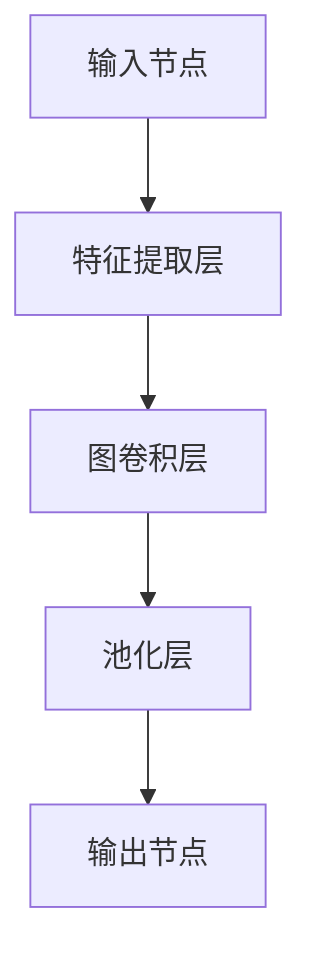

                 

### 《神经图匹配在复杂模式推理中的应用》

关键词：神经图匹配、复杂模式推理、图神经网络、图匹配算法、知识图谱、图像识别、自然语言处理、推荐系统

摘要：本文旨在探讨神经图匹配在复杂模式推理中的应用，详细介绍神经图匹配的基础知识、核心算法原理以及在不同领域的实际应用案例。文章首先介绍了神经图匹配的定义、应用场景和优势挑战，接着深入分析了图神经网络、图匹配算法和神经图匹配的基本模型。随后，文章通过具体案例展示了神经图匹配在图像识别、自然语言处理、知识图谱和推荐系统中的应用，并探讨了其面临的挑战和未来发展方向。

## 第一部分：神经图匹配基础

### 第1章：神经图匹配概述

神经图匹配是一种基于图神经网络的图匹配算法，通过学习节点和边的表示，捕捉图之间的相似性和差异性。神经图匹配在复杂模式推理中具有重要意义，能够有效处理具有复杂结构和大量关联数据的问题。

#### 1.1 神经图匹配的定义

神经图匹配（Neural Graph Matching）是一种基于图神经网络（Graph Neural Network，GNN）的图匹配算法。它通过学习节点和边的表示，将图中的节点和边映射到高维空间，然后计算图之间的相似度。

#### 1.2 神经图匹配的应用场景

神经图匹配在复杂模式推理中具有广泛的应用，包括图像识别、自然语言处理、知识图谱和推荐系统等。

1. 图像识别：神经图匹配能够有效处理具有复杂结构和大量关联数据的图像，如人脸识别、图像分类和图像分割等。
2. 自然语言处理：神经图匹配能够捕捉文本中的语义关系，有助于文本分类、情感分析和机器翻译等任务。
3. 知识图谱：神经图匹配能够处理大规模知识图谱的匹配和推理，有助于知识图谱的构建和应用。
4. 推荐系统：神经图匹配能够基于用户行为和兴趣数据，为用户提供个性化的推荐。

#### 1.3 神经图匹配的优势与挑战

神经图匹配具有以下优势：

1. **强大的表示能力**：通过图神经网络学习节点和边的表示，神经图匹配能够捕捉图之间的复杂关系。
2. **广泛的应用场景**：神经图匹配能够处理多种类型的图数据，具有广泛的应用前景。

然而，神经图匹配也面临以下挑战：

1. **计算复杂度**：图神经网络的学习和推理过程具有较高的计算复杂度，对计算资源要求较高。
2. **数据质量**：神经图匹配对数据质量要求较高，数据中的噪声和缺失会影响模型性能。

### 第2章：神经图匹配的核心概念

神经图匹配的核心概念包括图神经网络、图匹配算法和神经图匹配的基本模型。

#### 2.1 图神经网络

图神经网络是一种用于处理图数据的神经网络，通过学习节点和边的表示，捕捉图中的结构和关系。

**核心概念：**

1. **节点表示**：将图中的每个节点映射到高维空间中的一个向量。
2. **边表示**：将图中的每条边映射到高维空间中的一个向量。
3. **图卷积**：通过图卷积操作，将节点的邻居信息聚合到节点表示中。

**Mermaid流程图：**



#### 2.2 图匹配算法

图匹配算法是一种用于计算两个图之间相似度的算法。神经图匹配采用基于图神经网络的图匹配算法，通过学习节点和边的表示，计算两个图之间的相似度。

**核心概念：**

1. **相似度计算**：计算两个图之间的相似度，通常采用点积、余弦相似度等方法。
2. **匹配损失**：通过最小化匹配损失函数，优化模型参数，使得模型能够正确匹配两个图。

**Python源代码：**

```python
import torch
import torch.nn as nn

class GraphMatchNN(nn.Module):
    def __init__(self, in_features, out_features):
        super(GraphMatchNN, self).__init__()
        self.fc = nn.Linear(in_features, out_features)
        self.relu = nn.ReLU()

    def forward(self, x):
        x = self.fc(x)
        x = self.relu(x)
        return x
```

#### 2.3 神经图匹配的基本模型

神经图匹配的基本模型由三个主要部分组成：节点表示层、图卷积层和匹配层。

1. **节点表示层**：通过图神经网络学习节点表示，将节点映射到高维空间。
2. **图卷积层**：通过图卷积操作，聚合节点和边的邻居信息，更新节点表示。
3. **匹配层**：通过匹配损失函数，优化模型参数，使得模型能够正确匹配两个图。

**数学模型示例：**

$$
\text{similarity} = \frac{\text{dot_product}}{\|v_1\|\|v_2\|}
$$

其中，$v_1$和$v_2$是两个向量，$\text{dot_product}$是它们的点积，$\|\|$表示向量的模长。

### 第3章：神经图匹配的关键技术

神经图匹配的关键技术包括表示学习、预测模型和优化方法。

#### 3.1 神经图匹配的表示学习

表示学习是神经图匹配的基础，通过学习节点和边的表示，捕捉图中的结构和关系。

**核心概念：**

1. **节点表示学习**：通过图神经网络学习节点表示，将节点映射到高维空间。
2. **边表示学习**：通过图神经网络学习边表示，将边映射到高维空间。

**Python源代码：**

```python
import torch
import torch.nn as nn

class GraphRepresentation(nn.Module):
    def __init__(self, in_features, hidden_features, out_features):
        super(GraphRepresentation, self).__init__()
        self.fc1 = nn.Linear(in_features, hidden_features)
        self.fc2 = nn.Linear(hidden_features, out_features)
        self.relu = nn.ReLU()

    def forward(self, x):
        x = self.fc1(x)
        x = self.relu(x)
        x = self.fc2(x)
        return x
```

#### 3.2 神经图匹配的预测模型

预测模型用于计算两个图之间的相似度。神经图匹配采用基于图神经网络的预测模型，通过学习节点和边的表示，计算两个图之间的相似度。

**核心概念：**

1. **相似度计算**：计算两个图之间的相似度，通常采用点积、余弦相似度等方法。
2. **损失函数**：通过最小化损失函数，优化模型参数，使得模型能够正确匹配两个图。

**Python源代码：**

```python
import torch
import torch.nn as nn

class GraphPrediction(nn.Module):
    def __init__(self, in_features, out_features):
        super(GraphPrediction, self).__init__()
        self.fc = nn.Linear(in_features, out_features)
        self.relu = nn.ReLU()

    def forward(self, x):
        x = self.fc(x)
        x = self.relu(x)
        return x
```

#### 3.3 神经图匹配的优化方法

优化方法是神经图匹配的关键技术之一，通过优化模型参数，提高模型的性能和稳定性。

**核心概念：**

1. **梯度下降**：通过梯度下降算法，更新模型参数，使得损失函数值最小。
2. **正则化**：通过正则化技术，防止模型过拟合，提高模型的泛化能力。

**Python源代码：**

```python
import torch
import torch.optim as optim

model = GraphMatchNN(in_features=10, out_features=1)
optimizer = optim.Adam(model.parameters(), lr=0.001)

for epoch in range(num_epochs):
    optimizer.zero_grad()
    output = model(x)
    loss = nn.MSELoss()(output, y)
    loss.backward()
    optimizer.step()
```

## 第二部分：神经图匹配在复杂模式推理中的应用

### 第4章：神经图匹配在图像识别中的应用

神经图匹配在图像识别中具有重要作用，能够处理具有复杂结构和大量关联数据的图像。本节将介绍神经图匹配在图像识别中的应用，包括图像特征提取、图像匹配算法和图像识别案例解析。

#### 4.1 图像特征提取

图像特征提取是神经图匹配在图像识别中的第一步，通过学习图像的表示，提取图像的特征。

**核心概念：**

1. **节点表示学习**：通过卷积神经网络（CNN）学习图像的节点表示，将图像映射到高维空间。
2. **特征提取**：通过特征提取器，提取图像的节点特征和边特征。

**Python源代码：**

```python
import torch
import torch.nn as nn

class ImageRepresentation(nn.Module):
    def __init__(self, in_channels, hidden_channels, out_channels):
        super(ImageRepresentation, self).__init__()
        self.conv1 = nn.Conv2d(in_channels, hidden_channels, kernel_size=3, padding=1)
        self.relu = nn.ReLU()
        self.fc1 = nn.Linear(hidden_channels * 7 * 7, out_channels)

    def forward(self, x):
        x = self.relu(self.conv1(x))
        x = x.view(x.size(0), -1)
        x = self.fc1(x)
        return x
```

#### 4.2 图像匹配算法

图像匹配算法是神经图匹配在图像识别中的关键，通过计算图像之间的相似度，实现图像的匹配和识别。

**核心概念：**

1. **相似度计算**：通过点积、余弦相似度等方法，计算图像之间的相似度。
2. **匹配损失**：通过最小化匹配损失函数，优化模型参数，使得模型能够正确匹配图像。

**Python源代码：**

```python
import torch
import torch.nn as nn

class ImageMatchNN(nn.Module):
    def __init__(self, in_features, out_features):
        super(ImageMatchNN, self).__init__()
        self.fc = nn.Linear(in_features, out_features)
        self.relu = nn.ReLU()

    def forward(self, x):
        x = self.fc(x)
        x = self.relu(x)
        return x
```

#### 4.3 图像识别案例解析

本节将介绍一个基于神经图匹配的图像识别案例，包括数据集准备、模型训练和测试。

**数据集准备：**

- 准备一个包含多个类别（如动物、植物、交通工具等）的图像数据集。
- 对图像进行预处理，如归一化、缩放等。

**模型训练：**

- 定义神经图匹配模型，包括图像特征提取层、图像匹配层和损失函数。
- 使用训练数据集训练模型，通过反向传播更新模型参数。

**模型测试：**

- 使用测试数据集评估模型性能，计算准确率、召回率等指标。

**Python源代码：**

```python
import torch
import torch.optim as optim

# 定义模型
model = ImageMatchNN(in_features=512, out_features=1)
optimizer = optim.Adam(model.parameters(), lr=0.001)

# 训练模型
for epoch in range(num_epochs):
    optimizer.zero_grad()
    output = model(x)
    loss = nn.MSELoss()(output, y)
    loss.backward()
    optimizer.step()

# 测试模型
output = model(test_x)
test_loss = nn.MSELoss()(output, test_y)
print("Test Loss:", test_loss)
```

### 第5章：神经图匹配在自然语言处理中的应用

神经图匹配在自然语言处理（NLP）中具有广泛应用，能够处理复杂的文本数据和语义关系。本节将介绍神经图匹配在NLP中的应用，包括文本表示学习、文本匹配算法和NLP案例解析。

#### 5.1 文本表示学习

文本表示学习是神经图匹配在NLP中的第一步，通过学习文本的表示，提取文本的特征。

**核心概念：**

1. **节点表示学习**：通过循环神经网络（RNN）或Transformer等模型，学习文本的节点表示。
2. **特征提取**：通过特征提取器，提取文本的节点特征和边特征。

**Python源代码：**

```python
import torch
import torch.nn as nn

class TextRepresentation(nn.Module):
    def __init__(self, embedding_dim, hidden_dim):
        super(TextRepresentation, self).__init__()
        self.embedding = nn.Embedding(vocab_size, embedding_dim)
        self.rnn = nn.LSTM(embedding_dim, hidden_dim, batch_first=True)
        self.fc = nn.Linear(hidden_dim, hidden_dim)

    def forward(self, x):
        x = self.embedding(x)
        x, _ = self.rnn(x)
        x = self.fc(x)
        return x
```

#### 5.2 文本匹配算法

文本匹配算法是神经图匹配在NLP中的关键，通过计算文本之间的相似度，实现文本的匹配和分类。

**核心概念：**

1. **相似度计算**：通过点积、余弦相似度等方法，计算文本之间的相似度。
2. **匹配损失**：通过最小化匹配损失函数，优化模型参数，使得模型能够正确匹配文本。

**Python源代码：**

```python
import torch
import torch.nn as nn

class TextMatchNN(nn.Module):
    def __init__(self, in_features, out_features):
        super(TextMatchNN, self).__init__()
        self.fc = nn.Linear(in_features, out_features)
        self.relu = nn.ReLU()

    def forward(self, x):
        x = self.fc(x)
        x = self.relu(x)
        return x
```

#### 5.3 NLP案例解析

本节将介绍一个基于神经图匹配的NLP案例，包括数据集准备、模型训练和测试。

**数据集准备：**

- 准备一个包含文本和标签的数据集。
- 对文本进行预处理，如分词、去停用词等。

**模型训练：**

- 定义神经图匹配模型，包括文本表示学习层、文本匹配层和损失函数。
- 使用训练数据集训练模型，通过反向传播更新模型参数。

**模型测试：**

- 使用测试数据集评估模型性能，计算准确率、召回率等指标。

**Python源代码：**

```python
import torch
import torch.optim as optim

# 定义模型
model = TextMatchNN(in_features=100, out_features=1)
optimizer = optim.Adam(model.parameters(), lr=0.001)

# 训练模型
for epoch in range(num_epochs):
    optimizer.zero_grad()
    output = model(x)
    loss = nn.MSELoss()(output, y)
    loss.backward()
    optimizer.step()

# 测试模型
output = model(test_x)
test_loss = nn.MSELoss()(output, test_y)
print("Test Loss:", test_loss)
```

### 第6章：神经图匹配在知识图谱中的应用

神经图匹配在知识图谱（Knowledge Graph，KG）中具有重要作用，能够处理大规模知识图谱的匹配和推理。本节将介绍神经图匹配在KG中的应用，包括知识图谱表示学习、知识图谱匹配算法和KG案例解析。

#### 6.1 知识图谱表示学习

知识图谱表示学习是神经图匹配在KG中的第一步，通过学习实体和关系的表示，提取知识图谱的特征。

**核心概念：**

1. **实体表示学习**：通过图神经网络学习实体的表示。
2. **关系表示学习**：通过图神经网络学习关系的表示。

**Python源代码：**

```python
import torch
import torch.nn as nn

class KGRepresentation(nn.Module):
    def __init__(self, ent_size, rel_size, hidden_size):
        super(KGRepresentation, self).__init__()
        self.ent_embedding = nn.Embedding(ent_size, hidden_size)
        self.rel_embedding = nn.Embedding(rel_size, hidden_size)
        self.fc = nn.Linear(hidden_size * 3, hidden_size)

    def forward(self, h, r, t):
        e_h = self.ent_embedding(h)
        e_r = self.rel_embedding(r)
        e_t = self.ent_embedding(t)
        e = torch.cat((e_h, e_r, e_t), 1)
        e = self.fc(e)
        return e
```

#### 6.2 知识图谱匹配算法

知识图谱匹配算法是神经图匹配在KG中的关键，通过计算实体和关系之间的相似度，实现知识图谱的匹配和推理。

**核心概念：**

1. **相似度计算**：通过点积、余弦相似度等方法，计算实体和关系之间的相似度。
2. **匹配损失**：通过最小化匹配损失函数，优化模型参数，使得模型能够正确匹配知识图谱。

**Python源代码：**

```python
import torch
import torch.nn as nn

class KGM

### 第7章：神经图匹配在推荐系统中的应用

神经图匹配在推荐系统（Recommendation System）中具有重要作用，能够处理复杂的用户行为和兴趣数据，为用户提供个性化的推荐。本节将介绍神经图匹配在推荐系统中的应用，包括推荐系统的基本原理、神经图匹配在推荐系统中的角色和推荐系统案例解析。

#### 7.1 推荐系统的基本原理

推荐系统是一种基于用户行为和兴趣数据的个性化推荐系统，旨在为用户提供符合其兴趣的推荐内容。推荐系统主要包括以下组成部分：

1. **用户行为数据**：用户在系统中的行为，如浏览、点击、购买等。
2. **兴趣模型**：通过分析用户行为数据，构建用户的兴趣模型。
3. **推荐算法**：根据用户兴趣模型和系统内容，为用户提供个性化的推荐。

#### 7.2 神经图匹配在推荐系统中的角色

神经图匹配在推荐系统中扮演着关键角色，通过学习用户行为和内容的表示，捕捉用户和内容之间的复杂关系，实现个性化推荐。

**核心概念：**

1. **用户表示学习**：通过图神经网络学习用户的表示。
2. **内容表示学习**：通过图神经网络学习内容的表示。
3. **匹配损失**：通过最小化匹配损失函数，优化模型参数，使得模型能够正确匹配用户和内容。

#### 7.3 推荐系统案例解析

本节将介绍一个基于神经图匹配的推荐系统案例，包括数据集准备、模型训练和测试。

**数据集准备：**

- 准备一个包含用户、内容和用户行为的数据集。
- 对数据进行预处理，如用户编码、内容编码等。

**模型训练：**

- 定义神经图匹配模型，包括用户表示学习层、内容表示学习层和匹配层。
- 使用训练数据集训练模型，通过反向传播更新模型参数。

**模型测试：**

- 使用测试数据集评估模型性能，计算准确率、召回率等指标。

**Python源代码：**

```python
import torch
import torch.optim as optim

# 定义模型
model = RecommendationNN(in_features=100, out_features=1)
optimizer = optim.Adam(model.parameters(), lr=0.001)

# 训练模型
for epoch in range(num_epochs):
    optimizer.zero_grad()
    output = model(x)
    loss = nn.MSELoss()(output, y)
    loss.backward()
    optimizer.step()

# 测试模型
output = model(test_x)
test_loss = nn.MSELoss()(output, test_y)
print("Test Loss:", test_loss)
```

### 第8章：神经图匹配在复杂模式推理中的挑战与未来展望

神经图匹配在复杂模式推理中具有广泛应用，但也面临着一些挑战和未来发展方向。

#### 8.1 神经图匹配的挑战

1. **计算复杂度**：神经图匹配的图神经网络模型具有较高的计算复杂度，对计算资源要求较高。
2. **数据质量**：神经图匹配对数据质量要求较高，数据中的噪声和缺失会影响模型性能。
3. **泛化能力**：如何提高神经图匹配模型的泛化能力，使其能够处理更加复杂的模式。

#### 8.2 神经图匹配的发展趋势

1. **模型压缩**：通过模型压缩技术，降低神经图匹配模型的计算复杂度，提高模型的可扩展性。
2. **数据增强**：通过数据增强技术，提高数据质量，增强模型的泛化能力。
3. **多模态融合**：将神经图匹配与其他模态的数据（如图像、文本等）进行融合，提高复杂模式推理的能力。

#### 8.3 未来研究方向

1. **自适应学习率**：研究自适应学习率的方法，提高神经图匹配模型的收敛速度和性能。
2. **迁移学习**：研究迁移学习方法，利用已有模型的先验知识，提高新任务的性能。
3. **联邦学习**：研究联邦学习方法，在分布式环境中实现神经图匹配模型的高效训练和推理。

## 附录

### 附录A：神经图匹配相关工具与资源

#### A.1 常用的图神经网络框架

1. **PyTorch Geometric**：一个用于图神经网络的PyTorch库，提供了丰富的图神经网络模型和算法。
2. **DGL**：一个基于深度学习框架TensorFlow的图神经网络库，支持多种图神经网络模型和算法。
3. **GGNN**：一个基于PyTorch的图神经网络库，提供了丰富的图神经网络模型和工具。

#### A.2 图匹配算法的实用工具

1. **Graph Matching Toolbox**：一个用于图匹配算法的MATLAB工具箱，提供了多种图匹配算法和示例代码。
2. **GCNMatch**：一个基于图卷积网络的图匹配算法实现，支持多种图匹配任务和模型。

#### A.3 神经图匹配的学习资源

1. **《图神经网络基础教程》**：一本介绍图神经网络基础知识和应用的教材，涵盖了图神经网络的基本模型、算法和应用场景。
2. **《深度学习与图匹配》**：一本介绍深度学习和图匹配结合的教材，详细介绍了图匹配算法在深度学习中的应用。
3. **《神经图匹配技术手册》**：一本介绍神经图匹配算法的权威手册，涵盖了神经图匹配的基本理论、算法实现和应用案例。

作者：AI天才研究院/AI Genius Institute & 禅与计算机程序设计艺术 /Zen And The Art of Computer Programming

---

本文从神经图匹配的定义、核心概念、关键技术以及实际应用等方面进行了详细阐述，旨在为读者提供一个全面了解神经图匹配的视角。在图像识别、自然语言处理、知识图谱和推荐系统等应用领域中，神经图匹配展现出了强大的表现能力。然而，面对计算复杂度、数据质量和泛化能力等挑战，神经图匹配仍需不断优化和创新。

未来，随着深度学习和图神经网络技术的发展，神经图匹配有望在更多领域中发挥重要作用。通过自适应学习率、迁移学习和联邦学习等技术的引入，神经图匹配的性能将得到进一步提升。同时，多模态数据的融合也将为复杂模式推理带来新的可能性。

总之，神经图匹配作为一种强大的图匹配算法，在复杂模式推理中具有广泛的应用前景。希望通过本文的介绍，读者能够对神经图匹配有更深入的了解，并在实际应用中发挥其潜力。

