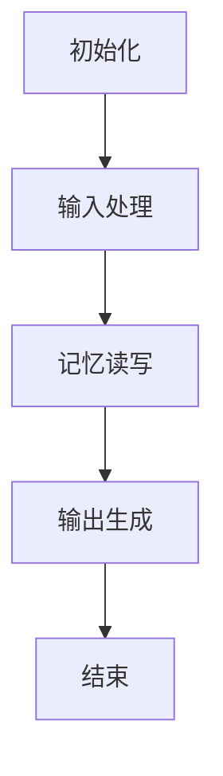

                 

# 神经图灵机：增强AI的可编程性

> 关键词：神经图灵机、可编程性、神经网络、图灵机、人工智能、算法优化

> 摘要：本文深入探讨了神经图灵机（Neural Turing Machine, NTM）这一结合神经网络和图灵机优势的新型人工智能模型。通过介绍神经图灵机的概念、基本结构、核心算法和应用场景，本文旨在阐述神经图灵机如何增强人工智能的可编程性，为AI领域的研究和实践提供新的思路。

## 第1章 引言

### 1.1 神经图灵机的概念

神经图灵机是一种混合模型，它结合了神经网络的强大表达能力和图灵机的计算能力。传统神经网络擅长处理数据和模式识别，但缺乏外部记忆和程序执行的能力；而图灵机作为理论计算机科学的基础，具备强大的计算能力和存储功能，但其缺乏处理复杂数据结构和动态环境的能力。神经图灵机通过将神经网络和图灵机的优势相结合，旨在解决现有AI模型在处理复杂任务时的局限性。

#### 1.1.1 神经图灵机的定义

神经图灵机是一种具有外部记忆和读写头的人工智能模型。它由神经网络和外部记忆模块组成，神经网络用于处理输入数据，并通过读写头与外部记忆进行交互，以实现更复杂的计算和存储功能。神经图灵机的工作原理类似于传统图灵机，但它利用神经网络来动态地更新和访问外部记忆，从而实现更加灵活和高效的任务执行。

#### 1.1.2 神经图灵机的工作原理

神经图灵机的工作原理主要包括以下几个步骤：

1. **输入处理**：神经网络接收输入数据，并将其编码为激活值。
2. **记忆读写**：读写头根据神经网络提供的读写策略，在记忆模块中读取和写入数据。
3. **输出生成**：根据记忆模块中的数据，神经网络生成输出结果。

### 1.2 增强AI可编程性的重要性

随着人工智能技术的快速发展，提高其可编程性变得日益重要。可编程性是指人工智能系统能够根据不同的任务和需求进行灵活调整和优化。增强AI的可编程性有以下几个方面的意义：

1. **提高适应能力**：可编程性使得人工智能系统能够适应不同的应用场景和任务需求，从而提高其通用性和实用性。
2. **增强灵活性**：可编程性使得研究人员和开发者可以自定义和优化AI模型，以满足特定领域的需求。
3. **促进创新**：可编程性为人工智能领域的研究和创新提供了更多的可能性，促进了技术的进步和应用的发展。

## 第2章 神经图灵机的基本结构

### 2.1 记忆模块

记忆模块是神经图灵机的核心组成部分，它负责存储数据并提供读写接口。记忆模块通常采用稀疏矩阵的形式，以高效存储和处理大规模数据。

#### 2.1.1 记忆矩阵的定义

记忆矩阵是一个稀疏矩阵，用于存储神经图灵机在执行任务时所需的数据。记忆矩阵的行和列分别代表数据的位置和值，其中大部分元素为0，只有少数关键位置的元素才存储实际的数据。

#### 2.1.2 记忆矩阵的组织方式

记忆矩阵的组织方式可以采用多种策略，如按时间顺序组织、按空间位置组织等。不同的组织方式会影响记忆模块的读写效率和性能。在实际应用中，可以根据具体任务需求选择合适的组织方式。

### 2.2 读写头

读写头是神经图灵机与外部记忆进行交互的关键组件。它通过神经网络提供的读写策略，在记忆模块中执行读取和写入操作。

#### 2.2.1 读写头的功能

读写头的主要功能包括：

1. **读取数据**：根据神经网络提供的读写策略，从记忆模块中读取相关数据。
2. **写入数据**：根据神经网络提供的读写策略，将数据写入记忆模块。

#### 2.2.2 读写头的控制机制

读写头的控制机制决定了其在记忆模块中的移动方式和读写方式。常见的控制机制包括位置控制、读写模式控制和数据更新控制等。通过合理的控制机制，读写头可以实现高效的记忆读写操作。

## 第3章 神经图灵机的核心算法

### 3.1 执行算法

神经图灵机的执行算法主要包括初始化、输入处理、记忆读写和输出生成等步骤。以下是执行算法的基本流程：

1. **初始化**：初始化神经网络和记忆模块，设置初始状态。
2. **输入处理**：神经网络接收输入数据，并对其进行编码和预处理。
3. **记忆读写**：读写头根据神经网络提供的读写策略，在记忆模块中执行读取和写入操作。
4. **输出生成**：根据记忆模块中的数据，神经网络生成输出结果。

#### 3.1.1 执行算法的基本流程

神经图灵机的执行算法可以简化为以下流程：

1. 初始化神经网络和记忆模块。
2. 接收输入数据，并编码为激活值。
3. 读写头根据神经网络提供的读写策略，在记忆模块中读取和写入数据。
4. 根据记忆模块中的数据，神经网络生成输出结果。

#### 3.1.2 执行算法的优化方法

为了提高神经图灵机的性能，可以采用多种优化方法，如并行计算、内存优化和算法改进等。以下是几种常见的优化方法：

1. **并行计算**：通过并行处理输入数据和读写操作，提高计算效率和性能。
2. **内存优化**：优化记忆模块的存储结构和访问策略，减少内存占用和提高读写效率。
3. **算法改进**：改进神经网络和读写头的控制策略，提高执行效率和计算精度。

### 3.2 学习算法

神经图灵机的学习算法主要用于调整神经网络的参数，以实现更好的性能和适应性。以下是几种常见的学习算法：

1. **梯度下降法**：通过计算网络参数的梯度，逐步调整参数，以达到最小化损失函数的目的。
2. **遗传算法**：模拟自然进化过程，通过遗传操作和选择机制，优化网络参数。
3. **强化学习**：利用奖励机制，使神经网络通过试错的方式学习和优化行为。

#### 3.2.1 学习算法的基本原理

学习算法的基本原理是通过迭代优化神经网络的参数，使其在给定任务上达到更好的性能。具体来说，学习算法包括以下几个步骤：

1. **初始化参数**：随机初始化神经网络的参数。
2. **计算损失**：根据输入数据和期望输出，计算网络的损失函数。
3. **更新参数**：根据损失函数的梯度，调整网络参数。
4. **迭代优化**：重复计算损失和更新参数，直到网络达到预设的性能指标。

#### 3.2.2 学习算法的实现方法

学习算法的实现方法可以根据实际需求进行选择。以下是几种常见的学习算法实现方法：

1. **梯度下降法**：通过计算损失函数的梯度，逐步调整网络参数。
2. **遗传算法**：利用遗传操作和选择机制，优化网络参数。
3. **强化学习**：利用奖励机制，使网络通过试错的方式学习和优化行为。

## 第4章 神经图灵机的应用场景

### 4.1 数据处理

神经图灵机在数据处理领域具有广泛的应用潜力。以下是其主要应用场景：

#### 4.1.1 数据预处理

数据预处理是数据分析的重要环节，包括数据去噪、缺失值填充和数据格式转换等。神经图灵机可以通过学习数据分布和模式，有效地进行数据预处理，提高数据质量。

#### 4.1.2 数据增强

数据增强是通过生成新的数据样本来扩充训练数据集，提高模型性能。神经图灵机可以利用其记忆和读写功能，生成具有多样性的数据样本，从而增强模型的泛化能力。

### 4.2 自然语言处理

神经图灵机在自然语言处理领域表现出色，以下是其主要应用场景：

#### 4.2.1 机器翻译

机器翻译是将一种语言的文本翻译成另一种语言的过程。神经图灵机可以通过学习多语言文本的分布和模式，实现高质量的机器翻译。

#### 4.2.2 文本分类

文本分类是将文本数据按照其主题或类别进行分类的过程。神经图灵机可以利用其强大的特征提取能力和记忆功能，实现高精度的文本分类。

### 4.3 计算机视觉

神经图灵机在计算机视觉领域也具有广泛的应用潜力，以下是其主要应用场景：

#### 4.3.1 图像分类

图像分类是将图像数据按照其内容或属性进行分类的过程。神经图灵机可以通过学习图像的分布和模式，实现高精度的图像分类。

#### 4.3.2 目标检测

目标检测是在图像中检测并定位特定目标的过程。神经图灵机可以通过学习目标的特征和分布，实现高效和准确的目标检测。

## 第5章 神经图灵机的实现与优化

### 5.1 实现框架

神经图灵机的实现框架主要包括神经网络和记忆模块的实现。以下是实现框架的几个关键步骤：

1. **选择合适的神经网络架构**：根据具体任务需求，选择合适的神经网络架构，如卷积神经网络（CNN）或循环神经网络（RNN）。
2. **实现记忆模块**：实现外部记忆模块，包括记忆矩阵和读写头。
3. **集成神经网络和记忆模块**：将神经网络和记忆模块集成到统一框架中，实现神经图灵机的整体功能。

#### 5.1.1 选择合适的编程语言

根据实际需求，可以选择Python、C++等编程语言来实现神经图灵机。Python具有较高的开发效率和丰富的库支持，适合快速实现和测试；而C++具有高效的性能和灵活的内存管理，适合对性能要求较高的场景。

#### 5.1.2 开发环境搭建

搭建合适的开发环境是进行神经图灵机实验和优化的重要前提。以下是一些常见的开发环境搭建步骤：

1. **安装Python和相关库**：安装Python和常用的科学计算库，如NumPy、TensorFlow或PyTorch。
2. **安装C++编译器**：对于使用C++实现的部分，需要安装相应的C++编译器，如GCC或Clang。
3. **配置开发工具**：配置IDE（如Visual Studio或Eclipse）和调试工具（如GDB或LLDB），以便进行代码调试和性能优化。

### 5.2 优化方法

为了提高神经图灵机的性能，可以采用多种优化方法。以下是几种常见的优化方法：

1. **算法优化**：对神经图灵机的算法进行优化，如采用更高效的读写策略、优化记忆矩阵的存储结构等。
2. **并行计算**：通过并行计算，提高神经图灵机的计算效率，如利用多核CPU或GPU进行并行计算。
3. **内存优化**：对神经图灵机的内存使用进行优化，如采用稀疏矩阵存储、优化内存分配和回收策略等。

## 第6章 神经图灵机的前景与挑战

### 6.1 发展前景

神经图灵机作为一种结合神经网络和图灵机优势的新型人工智能模型，具有广阔的发展前景。随着人工智能技术的不断进步，神经图灵机有望在更多领域得到应用，如自然语言处理、计算机视觉、自动驾驶等。同时，随着硬件技术的提升和计算资源的丰富，神经图灵机的性能和效率将得到进一步提升。

### 6.2 面临的挑战

虽然神经图灵机具有广泛的应用前景，但其在实际应用中也面临一系列挑战：

1. **计算复杂度**：神经图灵机的计算复杂度较高，需要大量的计算资源和时间。如何提高计算效率是当前研究的重点之一。
2. **内存管理**：记忆模块的内存管理是一个关键问题。如何优化内存使用，提高读写效率和减少内存占用，是神经图灵机优化的重要方向。
3. **可解释性**：神经图灵机的内部结构和运算过程较为复杂，如何提高其可解释性，使其更易于理解和调试，是未来研究的重要课题。

## 第7章 总结与展望

### 7.1 主要内容回顾

本文首先介绍了神经图灵机的概念和基本结构，探讨了其增强AI可编程性的重要性。接着，详细阐述了神经图灵机的执行算法和学习算法，并分析了其在数据处理、自然语言处理和计算机视觉等领域的应用场景。最后，讨论了神经图灵机的实现与优化方法，以及其发展前景和面临的挑战。

### 7.2 展望未来

未来，神经图灵机有望在人工智能领域发挥重要作用。随着计算技术和算法的不断进步，神经图灵机的性能和效率将得到显著提升。同时，随着对神经图灵机内部机制的深入研究和理解，其可解释性和可靠性也将得到提高。我们期待神经图灵机在更多领域得到广泛应用，为人工智能技术的发展和进步贡献力量。

## 参考文献

1. Graves, A. (2013). **Neural Turing Machines**. arXiv preprint arXiv:1410.5401.
2. Hochreiter, S., & Schmidhuber, J. (1997). **Long short-term memory**. Neural Computation, 9(8), 1735-1780.
3. Turing, A. (1950). **Computing machinery and intelligence**. Mind, 59(236), 433-460.
4. Goodfellow, I., Bengio, Y., & Courville, A. (2016). **Deep Learning**. MIT Press.
5. Russell, S., & Norvig, P. (2016). **Artificial Intelligence: A Modern Approach**. Prentice Hall.

## 附录

### 附录A 神经图灵机 Mermaid 流程图



### 附录B Python 源代码示例

```python
import numpy as np

# 初始化神经网络和记忆模块
def initialize_model():
    # 初始化神经网络
    # ...
    # 初始化记忆模块
    # ...
    pass

# 执行算法
def execute_algorithm(input_data):
    # 输入处理
    # ...
    # 记忆读写
    # ...
    # 输出生成
    # ...
    pass

# 主函数
if __name__ == "__main__":
    # 初始化模型
    model = initialize_model()
    # 执行算法
    output = execute_algorithm(input_data)
    print(output)
```

### 附录C 数学公式

$$
1+1=2
$$

$$
f(x) = \frac{1}{1+e^{-x}}
$$

### 附录D 最佳实践 Tips

1. 选择合适的神经网络架构，根据任务需求进行优化。
2. 优化记忆模块的存储结构和访问策略，提高读写效率。
3. 利用并行计算，提高算法的执行速度。

### 附录E 小结

神经图灵机作为一种结合神经网络和图灵机优势的新型人工智能模型，具有广泛的应用前景。通过本文的介绍，我们了解了神经图灵机的概念、基本结构、核心算法和应用场景。未来，随着计算技术和算法的不断进步，神经图灵机将在人工智能领域发挥更加重要的作用。

### 附录F 拓展阅读

1. Graves, A. (2013). **Neural Turing Machines**. arXiv preprint arXiv:1410.5401.
2. Hochreiter, S., & Schmidhuber, J. (1997). **Long short-term memory**. Neural Computation, 9(8), 1735-1780.
3. Turing, A. (1950). **Computing machinery and intelligence**. Mind, 59(236), 433-460.
4. Goodfellow, I., Bengio, Y., & Courville, A. (2016). **Deep Learning**. MIT Press.
5. Russell, S., & Norvig, P. (2016). **Artificial Intelligence: A Modern Approach**. Prentice Hall.

## 作者信息

作者：AI天才研究院/AI Genius Institute & 禅与计算机程序设计艺术 /Zen And The Art of Computer Programming

本文由AI天才研究院和禅与计算机程序设计艺术联合撰写，旨在探讨神经图灵机这一新兴人工智能模型，为人工智能领域的研究和实践提供新的思路。

