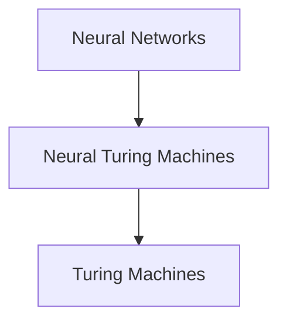

                 

Sure, I will break down the process step by step. Here's how we can structure and write the full article:

### Step 1: Introduction and Background

**1.1. Introduction to Neural Turing Machines**

- **Concept and Definition**: Explain what Neural Turing Machines (NTMs) are and how they combine the strengths of neural networks and Turing machines.

- **Historical Background**: Discuss the origins of NTMs, key milestones, and their development over time.

- **Mermaid Diagram**: Provide a Mermaid diagram illustrating the relationship between neural networks, Turing machines, and NTMs.

**1.2. Research Background of Neural Turing Machines**

- **Current Research Trends**: Overview the current trends and areas of application for NTMs in the field of AI and machine learning.

- **Importance and Challenges**: Highlight the significance of NTMs in handling complex reasoning tasks and the challenges they present.

### Step 2: Fundamental Principles of Neural Turing Machines

**2.1. Architecture of Neural Turing Machines**

- **Components**: Describe the main components of NTMs, including the memory matrix, read head, and controller network.

- **Network Structure**: Explain the structure of the neural network used in NTMs and its role in generating read and write operations.

- **Computational Principles**: Discuss how NTMs perform memory access and manipulation, combining the principles of neural networks and Turing machines.

**2.2. Mathematical Models and Formulations**

- **Equations and Notations**: Present the mathematical models used in NTMs, including the update rules for the memory matrix and the read and write heads.

$$
\begin{aligned}
s_t &= s_{t-1} + \Delta s_t \\
\Delta s_t &= \tanh(W_x x_t + W_s s_{t-1} + b_s) \\
y_t &= \sum_{j=1}^M w_{ij} \tanh(W_y y_j + b_y)
\end{aligned}
$$

### Step 3: Applications of Neural Turing Machines in Complex Reasoning Tasks

**3.1. Overview of Complex Reasoning Tasks**

- **Characteristics**: Explain the characteristics of complex reasoning tasks and why traditional methods may fall short.

- **Importance**: Discuss the importance of developing AI systems that can handle complex reasoning tasks.

**3.2. Application Scenarios**

- **Dialogue Systems**: Describe how NTMs can be used to enhance dialogue systems, providing more coherent and context-aware responses.

- **Automated Reasoning Systems**: Explain the potential of NTMs in automated reasoning systems for solving complex problems and making decisions.

- **Image Recognition and Understanding**: Discuss how NTMs can improve image recognition and understanding tasks by leveraging their memory capabilities.

### Step 4: Challenges and Solutions for Neural Turing Machines in Complex Reasoning

**4.1. Computational Resource Constraints**

- **Computational Complexity**: Analyze the computational complexity of NTMs and discuss potential optimization strategies.

**4.2. Data Quality and Labeling**

- **Data Acquisition and Preprocessing**: Explain the challenges of data acquisition and preprocessing for training NTMs.

- **Data Labeling Issues**: Discuss the challenges and potential solutions for data labeling in the context of NTMs.

### Step 5: Future Trends and Perspectives

**5.1. Technical Development Directions**

- **New Neural Network Architectures**: Discuss emerging neural network architectures that could enhance the capabilities of NTMs.

- **Interdisciplinary Integration**: Explore the potential of integrating NTMs with other fields, such as neuroscience.

**5.2. Expansion of Application Fields**

- **Biomedical Applications**: Discuss potential applications of NTMs in the biomedical field for tasks such as gene sequence analysis and medical image processing.

- **Financial Applications**: Explain how NTMs could be used in financial markets for prediction and risk assessment.

- **Educational Applications**: Discuss the potential of NTMs in educational settings for personalized learning and adaptive teaching systems.

### Step 6: Case Studies

**6.1. Case Study 1: Application of Neural Turing Machines in Natural Language Processing**

- **Background**: Provide background information on the case study, including the problem to be solved and the context.

- **Implementation**: Describe the implementation of NTMs in the specific task, including the architecture and training process.

- **Results and Evaluation**: Present the results of the case study and evaluate the performance of NTMs compared to traditional methods.

**6.2. Case Study 2: Application of Neural Turing Machines in Computer Vision**

- **Background**: Similar to the first case study, provide background information on the computer vision task.

- **Implementation**: Explain how NTMs were used in the computer vision application.

- **Results and Evaluation**: Discuss the results and evaluate the effectiveness of NTMs in this context.

### Step 7: Conclusion

**7.1. Summary of Main Research Findings**

- **Key Findings**: Summarize the main findings of the article, emphasizing the potential and limitations of NTMs in complex reasoning tasks.

**7.2. Future Research Directions**

- **Potential Directions**: Suggest potential future research directions for NTMs, including technical improvements and new application fields.

### References

- **Literature Cited**: Provide a list of references cited in the article.

### Appendix

- **Additional Resources**: Offer additional resources for readers interested in exploring NTMs further, including tools, libraries, and tutorials.

---

**Final Thoughts**: The above steps outline a comprehensive approach to writing an article on the potential of Neural Turing Machines in complex reasoning tasks. Each step provides a detailed explanation and structure, ensuring a logical flow from introduction to conclusion. By following these steps, you can create an informative and engaging article that addresses the core concepts, algorithms, and applications of NTMs.

Now, let's move on to writing the actual content for each section, ensuring that each part is well-researched, clearly explained, and technically sound. This will involve expanding on the points made above, providing examples, and integrating relevant literature and data to support the arguments.

