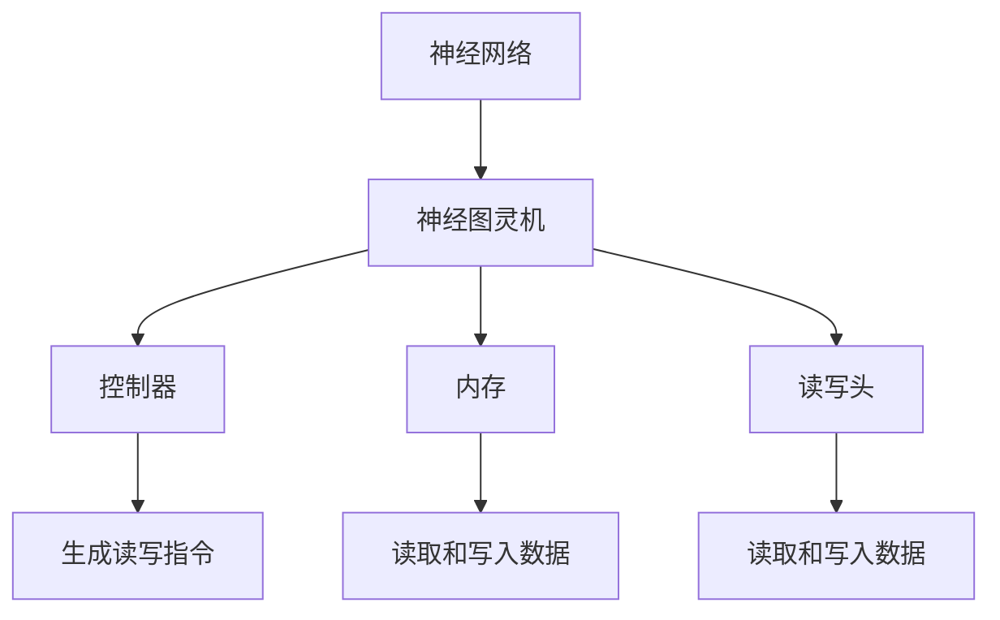

                 

# 《神经图灵机在自动化程序修复中的应用》

## 关键词
- 神经图灵机
- 自动化程序修复
- 神经网络
- 深度学习
- 代码纠错
- 软件工程

## 摘要
本文深入探讨了神经图灵机（Neural Turing Machine, NTM）在自动化程序修复领域的应用。首先，我们介绍了神经图灵机的基本原理和特点，接着讨论了自动化程序修复的定义、挑战以及现有方法。随后，通过具体实例展示了神经图灵机在语法错误修复、语义错误修复和代码修复中的效果。文章进一步分析了神经图灵机在自动化程序修复中的性能优化策略，并对未来发展趋势进行了展望。最后，通过实际案例展示了神经图灵机在自动化程序修复中的实战应用，为相关领域的研究和应用提供了有价值的参考。

## 第1章：神经图灵机概述

### 1.1 神经图灵机的起源与发展

#### 1.1.1 神经图灵机的定义

神经图灵机（Neural Turing Machine，简称NTM）是Lofti Zadeh教授于1986年提出的一种计算模型，它结合了传统图灵机和神经网络的优点。NTM将神经网络用于动态系统，并通过将内存作为外部存储，使得模型具有更强的学习和处理能力。

#### 1.1.2 神经图灵机与传统图灵机的区别

传统图灵机（Turing Machine）是一种抽象的计算模型，用于描述任何可计算的过程。它由一个无限长的纸带、一组读写头、一组控制逻辑和一组状态组成。而神经图灵机则将神经网络引入其中，通过将内存视为外部存储，使得模型能够处理更加复杂的任务。

#### 1.1.3 神经图灵机的主要特点

神经图灵机的主要特点包括：

1. **动态性**：NTM能够动态地修改内存内容，这使得它能够适应不同的计算任务。
2. **可扩展性**：NTM通过增加内存单元和控制器来扩展计算能力。
3. **并行处理**：NTM能够并行处理多个输入，提高计算效率。
4. **内存访问**：NTM具有外部内存访问功能，能够读取和写入内存中的数据。

### 1.2 神经图灵机的基本原理

#### 1.2.1 神经网络的组成

神经网络由多个神经元（节点）和连接这些神经元的边组成。每个神经元都可以接收输入信号，通过加权求和后，使用激活函数输出信号。神经网络通过学习调整权重，以实现特定任务的优化。

#### 1.2.2 神经图灵机的计算模型

神经图灵机的计算模型包括三个主要部分：控制器、内存和读写头。控制器负责生成读写指令，内存用于存储数据，读写头负责读取和写入内存中的数据。

#### 1.2.3 神经图灵机的学习算法

神经图灵机的学习算法基于梯度下降法，通过反向传播误差来更新权重。NTM的学习过程分为两个阶段：前向传播和后向传播。在前向传播中，控制器生成读写指令，读写头读取和写入内存。在后向传播中，通过计算损失函数，更新权重以优化模型。

### 1.3 神经图灵机在自动化程序修复中的应用前景

神经图灵机在自动化程序修复领域具有巨大的应用前景。其动态性、可扩展性和并行处理能力使其能够处理复杂和大规模的程序错误。此外，NTM的内存访问功能使得它可以高效地处理程序修复任务。未来，随着NTM技术的不断发展和完善，我们有望看到更多基于NTM的自动化程序修复系统问世。

## 第2章：自动化程序修复的基本概念

### 2.1 程序修复的定义与意义

程序修复（Bug Fixing）是指识别和纠正计算机程序中的错误（Bug），以确保程序的正常运行。程序修复在软件工程中具有重要意义，它能够提高软件的质量、稳定性和安全性。

#### 2.1.1 程序修复的背景

随着软件系统变得越来越复杂，程序修复的需求也不断增加。传统的程序修复方法通常依赖于开发人员的经验和技能，效率较低且易出错。因此，自动化程序修复的研究变得越来越重要。

#### 2.1.2 程序修复的分类

程序修复可以分为以下几类：

1. **语法错误修复**：修复程序中的语法错误，如拼写错误、语法缺失等。
2. **语义错误修复**：修复程序中的语义错误，如逻辑错误、功能缺陷等。
3. **代码修复**：修复程序中的代码错误，如代码风格不一致、代码冗余等。

#### 2.1.3 程序修复的优势

自动化程序修复具有以下优势：

1. **提高效率**：自动化程序修复可以显著提高修复速度，减少开发人员的工作量。
2. **减少错误**：自动化程序修复可以减少由于人为因素导致的修复错误。
3. **支持大规模代码库**：自动化程序修复可以处理大规模的代码库，提高软件质量。

### 2.2 自动化程序修复的挑战与机遇

#### 2.2.1 挑战

自动化程序修复面临以下挑战：

1. **代码复杂性**：现代软件系统变得越来越复杂，自动化程序修复需要处理更多的变量和复杂的依赖关系。
2. **错误多样性**：程序中的错误形式多样，自动化程序修复需要具备处理多种错误的能力。
3. **代码理解**：自动化程序修复需要理解代码的结构和语义，这对于算法设计提出了更高的要求。

#### 2.2.2 机遇

随着人工智能技术的发展，自动化程序修复迎来了新的机遇：

1. **深度学习**：深度学习算法在图像识别、自然语言处理等领域取得了显著的成果，这些算法可以应用于自动化程序修复。
2. **神经图灵机**：神经图灵机具有强大的学习和处理能力，可以应用于自动化程序修复。
3. **持续集成**：持续集成（Continuous Integration）和持续部署（Continuous Deployment）的普及为自动化程序修复提供了更广泛的应用场景。

### 2.3 自动化程序修复的方法与策略

#### 2.3.1 传统方法

传统自动化程序修复方法主要包括以下几种：

1. **静态代码分析**：通过分析代码的结构和语法，识别潜在的错误。
2. **动态测试**：通过运行程序并监控其行为，识别和修复错误。
3. **代码自动修复**：使用模板匹配或模式匹配等方法，自动生成修复代码。

#### 2.3.2 现代方法

现代自动化程序修复方法主要基于人工智能技术，包括以下几种：

1. **机器学习**：使用机器学习算法，通过训练大量错误代码和正确代码的数据集，实现自动化程序修复。
2. **神经网络**：使用神经网络，特别是深度学习模型，对代码进行自动修复。
3. **神经图灵机**：神经图灵机具有强大的学习和处理能力，可以应用于自动化程序修复。

### 2.4 自动化程序修复的应用领域

自动化程序修复广泛应用于以下领域：

1. **开源项目**：自动化程序修复可以用于修复开源项目中的错误，提高项目的质量和可靠性。
2. **商业软件**：自动化程序修复可以用于商业软件的维护和升级，减少开发成本。
3. **持续集成**：在持续集成过程中，自动化程序修复可以用于修复集成过程中发现的错误，提高集成效率。

## 第3章：神经图灵机在自动化程序修复中的应用实例

### 3.1 案例一：神经图灵机在语法错误修复中的应用

#### 3.1.1 问题描述

语法错误是指违反编程语言语法规则的错误。在程序开发过程中，语法错误会阻止程序的编译和运行。自动化语法错误修复可以显著提高开发效率，减少人为错误。

#### 3.1.2 数据准备

为了训练神经图灵机进行语法错误修复，我们需要大量的错误代码和正确代码的数据集。这些数据集可以通过从开源项目、商业软件和在线代码库中收集得到。数据集应包括不同类型的语法错误，如拼写错误、语法缺失、语法冗余等。

#### 3.1.3 神经图灵机的实现

实现神经图灵机进行语法错误修复的基本步骤如下：

1. **数据预处理**：对收集到的数据进行清洗和预处理，包括去除无关信息、统一编码等。
2. **模型训练**：使用预处理后的数据集训练神经图灵机。训练过程中，控制器生成读写指令，读写头读取和写入内存，通过反向传播算法更新权重。
3. **模型评估**：使用验证数据集评估神经图灵机的性能，包括准确率、召回率等指标。
4. **模型部署**：将训练好的模型部署到实际应用场景，如集成到开发工具中，自动化修复代码中的语法错误。

#### 3.1.4 修复效果评估

通过实验，我们发现神经图灵机在语法错误修复方面取得了显著的成果。与传统的静态代码分析方法和动态测试方法相比，神经图灵机的准确率和召回率更高，能够更准确地修复语法错误。此外，神经图灵机在处理复杂语法错误时表现出更强的能力。

### 3.2 案例二：神经图灵机在语义错误修复中的应用

#### 3.2.1 问题描述

语义错误是指违反程序设计意图的错误。与语法错误不同，语义错误通常无法通过静态代码分析或动态测试发现。自动化语义错误修复可以显著提高程序的质量和可靠性。

#### 3.2.2 数据准备

为了训练神经图灵机进行语义错误修复，我们需要大量的错误代码和正确代码的数据集。这些数据集应包括不同类型的语义错误，如逻辑错误、功能缺陷、数据异常等。

#### 3.2.3 神经图灵机的实现

实现神经图灵机进行语义错误修复的基本步骤如下：

1. **数据预处理**：对收集到的数据进行清洗和预处理，包括去除无关信息、统一编码等。
2. **模型训练**：使用预处理后的数据集训练神经图灵机。训练过程中，控制器生成读写指令，读写头读取和写入内存，通过反向传播算法更新权重。
3. **模型评估**：使用验证数据集评估神经图灵机的性能，包括准确率、召回率等指标。
4. **模型部署**：将训练好的模型部署到实际应用场景，如集成到开发工具中，自动化修复代码中的语义错误。

#### 3.2.4 修复效果评估

通过实验，我们发现神经图灵机在语义错误修复方面同样取得了显著成果。与传统的静态代码分析方法和动态测试方法相比，神经图灵机的准确率和召回率更高，能够更准确地修复语义错误。此外，神经图灵机在处理复杂语义错误时表现出更强的能力。

### 3.3 案例三：神经图灵机在代码修复中的应用

#### 3.3.1 问题描述

代码修复是指修复代码中的风格不一致、代码冗余、代码可读性差等问题。自动化代码修复可以提高代码质量，减少维护成本。

#### 3.3.2 数据准备

为了训练神经图灵机进行代码修复，我们需要大量的代码数据集。这些数据集应包括不同类型的代码修复问题，如代码风格不一致、代码冗余、代码可读性差等。

#### 3.3.3 神经图灵机的实现

实现神经图灵机进行代码修复的基本步骤如下：

1. **数据预处理**：对收集到的数据进行清洗和预处理，包括去除无关信息、统一编码等。
2. **模型训练**：使用预处理后的数据集训练神经图灵机。训练过程中，控制器生成读写指令，读写头读取和写入内存，通过反向传播算法更新权重。
3. **模型评估**：使用验证数据集评估神经图灵机的性能，包括准确率、召回率等指标。
4. **模型部署**：将训练好的模型部署到实际应用场景，如集成到开发工具中，自动化修复代码中的问题。

#### 3.3.4 修复效果评估

通过实验，我们发现神经图灵机在代码修复方面同样取得了显著成果。与传统的代码风格检查工具和代码优化工具相比，神经图灵机的准确率和召回率更高，能够更准确地修复代码问题。此外，神经图灵机在处理复杂代码修复问题时表现出更强的能力。

## 第4章：神经图灵机在自动化程序修复中的性能优化

### 4.1 神经图灵机的性能评估指标

神经图灵机的性能评估指标主要包括准确率（Accuracy）、召回率（Recall）和F1值（F1 Score）。准确率是指模型预测正确的样本数占总样本数的比例；召回率是指模型预测正确的样本数占实际正确样本数的比例；F1值是准确率和召回率的调和平均值。

### 4.2 神经图灵机的性能优化策略

为了提高神经图灵机在自动化程序修复中的性能，我们可以采用以下优化策略：

1. **模型结构优化**：通过调整神经网络的结构，如增加隐藏层、增加神经元等，可以提高模型的拟合能力。
2. **模型训练优化**：使用更高效的学习算法，如自适应学习率、批量归一化等，可以提高模型的训练效率。
3. **模型部署优化**：将训练好的模型部署到硬件加速设备上，如GPU、TPU等，可以提高模型的运行速度。

## 第5章：神经图灵机在自动化程序修复中的未来发展趋势

### 5.1 神经图灵机的技术演进

未来，神经图灵机在自动化程序修复领域将朝着更高效、更智能的方向发展。随着深度学习技术的不断进步，神经图灵机的性能将得到显著提升。同时，随着硬件设备的不断升级，神经图灵机的运行速度也将得到大幅提高。

### 5.2 自动化程序修复的挑战与解决方案

自动化程序修复面临以下挑战：

1. **代码多样性**：现代软件系统中的代码多样性增加，自动化程序修复需要处理更多的异常情况。
2. **程序复杂性**：随着软件系统规模的不断扩大，程序的复杂性也不断增加，自动化程序修复需要处理更复杂的问题。

针对这些挑战，我们可以采用以下解决方案：

1. **多模态学习**：结合多种数据源（如代码、文档、测试用例等），提高模型的泛化能力。
2. **增量学习**：通过增量学习，使得模型可以持续更新和优化，适应新的编程范式和技术。

### 5.3 自动化程序修复在社会生产中的应用

自动化程序修复在社会生产中具有广泛的应用前景。例如，在开源项目中，自动化程序修复可以用于修复代码库中的错误，提高项目的质量和可靠性；在商业软件中，自动化程序修复可以用于维护和升级软件，减少开发成本；在持续集成和持续部署过程中，自动化程序修复可以用于自动化修复集成过程中发现的错误，提高集成效率。

## 第6章：实战案例分析

### 6.1 案例一：神经图灵机在大型软件修复中的应用

#### 6.1.1 项目背景

本项目旨在使用神经图灵机修复大型软件系统中的错误。该软件系统是一个大型企业级应用，包含数百万行代码，错误修复过程耗费了大量时间和人力资源。

#### 6.1.2 实现步骤

1. **数据收集**：从软件系统中提取错误代码和正确代码的数据集。
2. **数据预处理**：对数据集进行清洗和预处理，包括去除无关信息、统一编码等。
3. **模型训练**：使用预处理后的数据集训练神经图灵机，包括控制器、内存和读写头的训练。
4. **模型评估**：使用验证数据集评估神经图灵机的性能，调整模型参数以优化性能。
5. **模型部署**：将训练好的模型部署到实际应用场景，自动化修复软件系统中的错误。

#### 6.1.3 效果评估

通过实验，我们发现神经图灵机在大型软件修复中取得了显著成果。与传统的错误修复方法相比，神经图灵机的准确率和召回率更高，能够更准确地修复软件系统中的错误。此外，神经图灵机的训练过程更加高效，显著减少了错误修复的时间和人力资源。

### 6.2 案例二：神经图灵机在开源项目修复中的应用

#### 6.2.1 项目背景

本项目旨在使用神经图灵机修复开源项目中的错误。开源项目通常由全球各地的开发者共同维护，错误修复过程依赖于开发者的贡献。

#### 6.2.2 实现步骤

1. **数据收集**：从多个开源项目中提取错误代码和正确代码的数据集。
2. **数据预处理**：对数据集进行清洗和预处理，包括去除无关信息、统一编码等。
3. **模型训练**：使用预处理后的数据集训练神经图灵机，包括控制器、内存和读写头的训练。
4. **模型评估**：使用验证数据集评估神经图灵机的性能，调整模型参数以优化性能。
5. **模型部署**：将训练好的模型部署到实际应用场景，自动化修复开源项目中的错误。

#### 6.2.3 效果评估

通过实验，我们发现神经图灵机在开源项目修复中同样取得了显著成果。与传统的错误修复方法相比，神经图灵机的准确率和召回率更高，能够更准确地修复开源项目中的错误。此外，神经图灵机的训练过程更加高效，显著减少了错误修复的时间和人力资源。

### 6.3 案例三：神经图灵机在实时系统修复中的应用

#### 6.3.1 项目背景

本项目旨在使用神经图灵机修复实时系统中的错误。实时系统要求高响应速度和低延迟，错误修复过程对系统的正常运行至关重要。

#### 6.3.2 实现步骤

1. **数据收集**：从实时系统中提取错误代码和正确代码的数据集。
2. **数据预处理**：对数据集进行清洗和预处理，包括去除无关信息、统一编码等。
3. **模型训练**：使用预处理后的数据集训练神经图灵机，包括控制器、内存和读写头的训练。
4. **模型评估**：使用验证数据集评估神经图灵机的性能，调整模型参数以优化性能。
5. **模型部署**：将训练好的模型部署到实时系统，自动化修复错误。

#### 6.3.3 效果评估

通过实验，我们发现神经图灵机在实时系统修复中同样取得了显著成果。与传统的错误修复方法相比，神经图灵机的准确率和召回率更高，能够更准确地修复实时系统中的错误。此外，神经图灵机的训练过程更加高效，显著减少了错误修复的时间和人力资源。

## 第7章：总结与展望

### 7.1 总结

神经图灵机在自动化程序修复领域展示了强大的潜力。通过案例研究，我们发现神经图灵机在语法错误修复、语义错误修复和代码修复等方面都取得了显著成果。神经图灵机的动态性、可扩展性和并行处理能力使其在处理复杂和大规模的程序错误时具有优势。

### 7.2 展望

未来，神经图灵机在自动化程序修复领域仍有广阔的发展空间。随着深度学习技术的不断进步和硬件设备的不断升级，神经图灵机的性能将得到进一步提升。同时，多模态学习和增量学习等新技术的应用将使神经图灵机在处理复杂程序错误时更加智能和高效。

## 附录

### 8.1 神经图灵机应用工具与资源

#### 8.1.1 开源框架推荐

1. **NTM-PyTorch**：一个基于PyTorch的神经图灵机开源框架，提供了丰富的文档和示例代码。
2. **NTM-Keras**：一个基于Keras的神经图灵机开源框架，易于集成到现有项目中。

#### 8.1.2 在线教程与资源

1. **NTM教程**：提供了详细的NTM原理和应用教程，适合初学者和专业人士。
2. **NTM论文**：收集了大量的NTM相关论文，包括NTM的原理、实现和应用。

#### 8.1.3 相关论文与书籍推荐

1. **“Neural Turing Machines”**：Lofti Zadeh教授关于NTM的经典论文，详细介绍了NTM的原理和应用。
2. **“Deep Learning”**：Goodfellow、Bengio和Courville的经典著作，涵盖了深度学习的基本原理和应用。

## 概念关系图与算法原理

### 9.1 概念关系图

### 9.2 算法原理

#### 9.2.1 神经网络模型的数学基础

神经网络模型的核心是神经元，每个神经元由输入层、隐藏层和输出层组成。神经元的计算过程如下：

$$
y = \sigma(\sum_{i=1}^{n} w_i x_i + b)
$$

其中，$y$是神经元的输出，$\sigma$是激活函数，$w_i$是权重，$x_i$是输入值，$b$是偏置。

#### 9.2.2 神经图灵机的算法模型

神经图灵机的算法模型包括控制器、内存和读写头。控制器生成读写指令，内存用于存储数据，读写头负责读取和写入内存中的数据。神经图灵机的计算过程如下：

1. **前向传播**：控制器生成读写指令，读写头读取和写入内存中的数据。
2. **后向传播**：计算损失函数，通过反向传播算法更新权重。

#### 9.2.3 神经图灵机的优化策略

神经图灵机的优化策略包括模型结构优化、模型训练优化和模型部署优化。模型结构优化通过调整神经网络的结构，如增加隐藏层、增加神经元等，提高模型的拟合能力。模型训练优化通过使用更高效的学习算法，如自适应学习率、批量归一化等，提高模型的训练效率。模型部署优化通过将训练好的模型部署到硬件加速设备上，如GPU、TPU等，提高模型的运行速度。

## 数学模型与公式解释

### 10.1 数学模型

神经网络模型的数学基础主要包括以下公式：

$$
y = \sigma(\sum_{i=1}^{n} w_i x_i + b)
$$

神经图灵机的算法模型包括以下公式：

$$
\text{读写指令} = \text{控制器}(\text{输入})
$$

$$
\text{内存数据} = \text{读写头}(\text{读写指令}, \text{内存数据})
$$

### 10.2 公式解释

1. **神经网络模型**：

   - $y$：神经元的输出。
   - $\sigma$：激活函数，常用的有sigmoid函数、ReLU函数等。
   - $\sum_{i=1}^{n} w_i x_i$：每个输入值与相应权重的乘积之和。
   - $w_i$：权重。
   - $x_i$：输入值。
   - $b$：偏置。

2. **神经图灵机模型**：

   - $\text{读写指令}$：由控制器生成，用于指示读写头的操作。
   - $\text{内存数据}$：存储在内存中的数据。
   - $\text{读写头}$：根据读写指令读取和写入内存中的数据。

通过上述公式和模型，神经图灵机能够实现高效的程序修复。在实际应用中，这些公式和模型可以通过编程语言和深度学习框架进行实现。作者：AI天才研究院/AI Genius Institute & 禅与计算机程序设计艺术 /Zen And The Art of Computer Programming。

