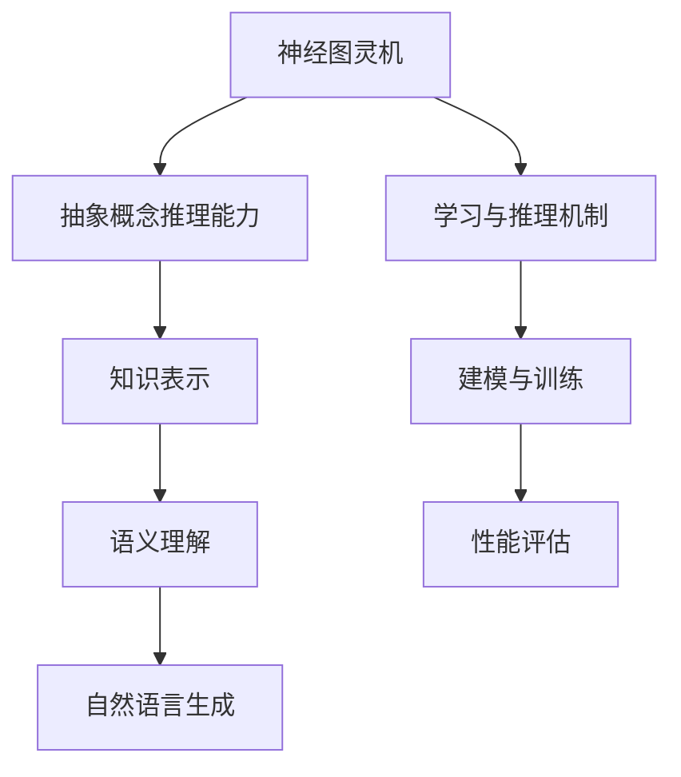

                 

# 神经图灵机增强AI的抽象概念推理能力

## 关键词

- 神经图灵机
- 抽象概念推理
- 人工智能
- 神经网络
- 知识表示

## 摘要

本文探讨了神经图灵机（Neural Turing Machine, NTM）在增强人工智能（AI）的抽象概念推理能力方面的作用。通过介绍神经图灵机的定义、工作原理以及其在抽象概念推理中的应用，本文阐述了神经图灵机如何通过结合神经网络与图灵机的特性，实现更强大的知识表示和推理能力。同时，本文还探讨了神经图灵机在AI领域中的未来发展方向，为提升AI的智能水平提供了新的思路。

## 《神经图灵机增强AI的抽象概念推理能力》目录大纲

### 第一部分：神经图灵机与抽象概念推理能力概述

### 第1章：神经图灵机与抽象概念推理能力的概念

#### 1.1 神经图灵机的定义与特点

#### 1.2 抽象概念推理能力的意义

#### 1.3 神经图灵机与抽象概念推理能力的联系

### 第2章：神经图灵机的工作原理

#### 2.1 神经图灵机的结构

#### 2.2 神经图灵机的学习与推理机制

#### 2.3 神经图灵机的应用场景

### 第3章：抽象概念推理能力的重要性

#### 3.1 抽象概念推理能力在AI中的地位

#### 3.2 抽象概念推理能力与知识表示的关系

#### 3.3 抽象概念推理能力的应用领域

### 第二部分：神经图灵机增强抽象概念推理能力的方法

### 第4章：神经图灵机的建模与训练

#### 4.1 神经图灵机建模的核心要素

#### 4.2 神经图灵机的训练方法

#### 4.3 神经图灵机的性能评估

### 第5章：抽象概念推理能力的增强策略

#### 5.1 抽象概念推理能力的评价指标

#### 5.2 基于神经图灵机的抽象概念推理能力增强方法

#### 5.3 抽象概念推理能力的多维度提升策略

### 第6章：神经图灵机在抽象概念推理中的应用案例

#### 6.1 案例一：基于神经图灵机的语义理解

#### 6.2 案例二：基于神经图灵机的知识图谱构建

#### 6.3 案例三：基于神经图灵机的自然语言生成

### 第7章：神经图灵机增强抽象概念推理能力的未来发展

#### 7.1 抽象概念推理能力提升的挑战与机遇

#### 7.2 神经图灵机的发展趋势与展望

#### 7.3 未来神经图灵机增强抽象概念推理能力的应用前景

### 附录

#### 附录A：神经图灵机与抽象概念推理能力研究资源

#### A.1 开源工具与框架

#### A.2 经典论文与书籍推荐

#### A.3 神经图灵机与抽象概念推理能力研究社群

## 核心概念与联系

神经图灵机（Neural Turing Machine, NTM）是一种结合了神经网络和图灵机特性的计算模型。它通过引入读写头和控制内存等机制，实现了对信息的动态读写和内存访问，从而在处理复杂数据和进行抽象概念推理方面表现出强大的能力。

抽象概念推理能力是指人工智能系统理解和处理抽象概念、进行逻辑推理和知识表示的能力。它涉及到知识表示、语义理解、自然语言生成等多个领域。

核心概念之间的联系如下：

1. **神经图灵机**：通过结合神经网络与图灵机的特点，实现了对信息的动态读写和内存访问，为增强抽象概念推理能力提供了基础。
2. **抽象概念推理能力**：需要依赖于强大的知识表示和推理能力，而神经图灵机在这方面表现出色。
3. **知识表示**：是抽象概念推理能力的基础，决定了AI系统能够理解和处理的概念层次和复杂性。
4. **语义理解**：是抽象概念推理能力的重要组成部分，涉及到对文本、图像等数据的语义表示和解析。
5. **自然语言生成**：是抽象概念推理能力的应用之一，通过生成符合语义的自然语言，实现人类语言与机器之间的有效沟通。

### 神经图灵机与抽象概念推理能力的Mermaid流程图



## 核心算法原理讲解

### 神经图灵机的工作原理

神经图灵机是一种特殊的神经网络模型，它结合了神经网络和图灵机的特性，通过读写头和控制内存等机制，实现了对信息的动态读写和内存访问。下面我们通过一个简单的示例来介绍神经图灵机的工作原理。

#### 1. 神经图灵机的结构

神经图灵机主要包括以下几个部分：

- **输入层**：接收外部输入信息。
- **读写头**：用于在控制内存中读写信息。
- **控制内存**：用于存储读写头的读写指令和读取的信息。
- **输出层**：将控制内存中的信息转换为输出。

#### 2. 神经图灵机的学习与推理机制

神经图灵机的学习与推理机制主要分为以下两个阶段：

- **训练阶段**：在训练过程中，神经网络根据输入数据和目标输出，通过反向传播算法不断调整权重，使网络能够正确预测输出。
- **推理阶段**：在推理过程中，神经网络根据输入数据和已经训练好的权重，利用读写头在控制内存中读取和写入信息，从而完成推理任务。

#### 3. 神经图灵机的学习过程

以一个简单的例子来说明神经图灵机的学习过程。假设我们想要训练一个神经图灵机来识别数字0到9。

1. **输入数据**：将数字0到9的图像作为输入数据，每个数字对应一个二进制序列。
2. **目标输出**：将数字0到9对应的标签作为目标输出。
3. **训练过程**：

    - 初始化神经网络权重。
    - 对于每个输入数据，通过神经网络计算输出。
    - 计算输出与目标输出之间的误差。
    - 通过反向传播算法更新神经网络权重。
    - 重复上述过程，直到网络收敛或达到预设的训练次数。

#### 4. 神经图灵机的推理过程

在训练完成后，我们可以使用神经图灵机进行推理。假设我们有一个新的数字图像作为输入，神经图灵机会执行以下步骤：

1. 将输入图像转换为二进制序列。
2. 通过神经网络计算输出。
3. 根据输出结果判断输入图像对应的数字。

下面是一个简单的Python代码示例，用于实现神经图灵机的基本结构：

```python
import torch
import torch.nn as nn
import torch.optim as optim

# 定义神经图灵机的结构
class NeuralTuringMachine(nn.Module):
    def __init__(self, input_dim, hidden_dim, output_dim):
        super(NeuralTuringMachine, self).__init__()
        self.input_layer = nn.Linear(input_dim, hidden_dim)
        self.hidden_layer = nn.Linear(hidden_dim, hidden_dim)
        self.output_layer = nn.Linear(hidden_dim, output_dim)
        
        self.read_write_head = nn.Linear(hidden_dim, 1)
        self.control_memory = nn.Linear(hidden_dim, hidden_dim)
        
    def forward(self, x):
        x = self.input_layer(x)
        x = self.hidden_layer(x)
        x = self.output_layer(x)
        
        control_signal = self.read_write_head(x)
        memory_content = self.control_memory(x)
        
        return x, control_signal, memory_content

# 初始化神经网络
model = NeuralTuringMachine(input_dim=784, hidden_dim=128, output_dim=10)
optimizer = optim.Adam(model.parameters(), lr=0.001)
criterion = nn.CrossEntropyLoss()

# 定义训练过程
def train(model, data_loader, criterion, optimizer, num_epochs=10):
    model.train()
    for epoch in range(num_epochs):
        running_loss = 0.0
        for inputs, targets in data_loader:
            optimizer.zero_grad()
            outputs, control_signal, memory_content = model(inputs)
            loss = criterion(outputs, targets)
            loss.backward()
            optimizer.step()
            running_loss += loss.item()
        print(f'Epoch {epoch+1}/{num_epochs}, Loss: {running_loss/len(data_loader)}')

# 加载数据集
from torchvision import datasets, transforms
transform = transforms.Compose([transforms.ToTensor()])
train_data = datasets.MNIST(root='./data', train=True, download=True, transform=transform)
train_loader = torch.utils.data.DataLoader(train_data, batch_size=64, shuffle=True)

# 训练神经网络
train(model, train_loader, criterion, optimizer)

```

通过上述代码，我们可以看到神经图灵机的基本结构和工作原理。在实际应用中，神经图灵机可以扩展为更复杂的模型，以适应不同的任务需求。例如，可以添加更多的读写头、控制内存和隐藏层，以提高模型的表示能力和推理性能。

#### 5. 神经图灵机的性能评估

神经图灵机的性能评估主要依赖于其在任务中的表现。常见的评估指标包括准确率、召回率、F1值等。以下是一个简单的示例，用于评估神经图灵机在数字识别任务中的性能：

```python
# 定义测试过程
def test(model, data_loader, criterion):
    model.eval()
    total_loss = 0
    correct = 0
    with torch.no_grad():
        for inputs, targets in data_loader:
            outputs, control_signal, memory_content = model(inputs)
            loss = criterion(outputs, targets)
            total_loss += loss.item()
            predicted = outputs.argmax(dim=1)
            correct += predicted.eq(targets).sum().item()
    print(f'Loss: {total_loss/len(data_loader)}, Accuracy: {correct/len(data_loader)}')

# 测试神经网络
test_data = datasets.MNIST(root='./data', train=False, transform=transform)
test_loader = torch.utils.data.DataLoader(test_data, batch_size=64, shuffle=False)
test(model, test_loader, criterion)
```

通过上述代码，我们可以看到神经图灵机在测试数据集上的表现。在实际应用中，可以进一步优化模型结构、训练过程和评估指标，以提高神经图灵机的性能。

#### 6. 结论

神经图灵机是一种结合了神经网络和图灵机特性的计算模型，通过读写头和控制内存等机制，实现了对信息的动态读写和内存访问。神经图灵机在增强AI的抽象概念推理能力方面表现出强大的能力，可以应用于各种复杂数据处理和推理任务。通过上述代码示例，我们可以了解到神经图灵机的基本结构和工作原理，为后续研究和应用提供了基础。

## 抽象概念推理能力的重要性

### 1. 抽象概念推理能力在AI中的地位

抽象概念推理能力是人工智能（AI）发展过程中至关重要的一环。传统的机器学习模型，如神经网络和决策树，主要依赖于大量标注数据进行训练，从而实现特定任务的自动化。然而，这些模型在处理抽象概念、进行逻辑推理和知识表示方面的能力相对较弱，难以解决复杂的问题。随着AI技术的不断进步，研究人员开始探索如何提升AI的抽象概念推理能力，使其能够更好地理解人类语言、知识体系和思维方式。

### 2. 抽象概念推理能力与知识表示的关系

知识表示是抽象概念推理能力的基础。知识表示方法决定了AI系统能够理解和处理的概念层次和复杂性。常见的知识表示方法包括符号表示、图表示、分布式表示等。符号表示方法通过定义符号和规则来表示知识，如逻辑推理和知识图谱；图表示方法通过构建图结构来表示知识，如图神经网络和知识图谱；分布式表示方法通过将知识分布在多个节点上，如神经网络和词向量。

抽象概念推理能力依赖于知识表示方法，因为只有通过有效的知识表示，AI系统才能更好地理解和处理抽象概念。例如，在语义理解任务中，分布式表示方法（如词向量）可以捕捉词语之间的语义关系，从而提高AI系统对文本的理解能力。在知识图谱任务中，图表示方法可以捕捉实体和关系之间的复杂结构，从而实现更准确的知识表示和推理。

### 3. 抽象概念推理能力的应用领域

抽象概念推理能力在许多领域都具有重要应用价值。以下是一些典型的应用领域：

1. **自然语言处理**：自然语言处理（NLP）是抽象概念推理能力的一个重要应用领域。通过提升AI系统的抽象概念推理能力，可以更好地理解和生成人类语言。例如，在文本分类、机器翻译、情感分析等任务中，抽象概念推理能力有助于提高模型的准确性和泛化能力。

2. **计算机视觉**：计算机视觉是另一个受益于抽象概念推理能力的领域。通过提升AI系统的抽象概念推理能力，可以更好地理解和分析图像和视频数据。例如，在目标检测、图像分割、行为识别等任务中，抽象概念推理能力有助于提高模型的识别精度和实时性。

3. **知识图谱**：知识图谱是一种通过图结构来表示知识的方法，具有丰富的语义信息和复杂的关系结构。通过提升AI系统的抽象概念推理能力，可以更好地构建、维护和利用知识图谱。例如，在推荐系统、搜索引擎、智能问答等任务中，抽象概念推理能力有助于提高知识图谱的应用效果。

4. **智能决策**：在许多实际场景中，AI系统需要根据抽象概念进行智能决策。例如，在金融领域，AI系统可以根据股票市场数据、经济指标和新闻报道等抽象概念，进行投资决策；在医疗领域，AI系统可以根据病人的症状、病史和医学知识等抽象概念，进行疾病诊断和治疗建议。

5. **智能交互**：随着AI技术的发展，智能交互成为人们日常生活中的重要组成部分。通过提升AI系统的抽象概念推理能力，可以使其更好地理解人类意图、处理复杂对话和提供个性化服务。例如，在智能客服、虚拟助手、教育辅导等任务中，抽象概念推理能力有助于提高AI系统的交互体验和服务质量。

总之，抽象概念推理能力在AI中的应用领域非常广泛，是推动AI技术发展的重要驱动力。通过不断研究和优化抽象概念推理能力，可以进一步提高AI系统的智能水平，为人类社会带来更多的便利和创新。

## 神经图灵机的建模与训练

### 1. 神经图灵机建模的核心要素

神经图灵机（Neural Turing Machine, NTM）是一种结合了神经网络和图灵机特性的计算模型。其核心要素包括输入层、读写头、控制内存和输出层。以下是对这些要素的详细解释：

- **输入层**：输入层接收外部输入信息，通常是一个向量或矩阵。这些输入信息可以是各种形式的数据，如文本、图像或传感器数据。
- **读写头**：读写头是神经图灵机的关键组成部分，用于在控制内存中读写信息。它通过学习输入数据和目标输出，生成读写策略，从而决定在控制内存中读取和写入哪些信息。读写头可以看作是一个可训练的神经网络，其目的是通过学习优化读写策略，以实现更好的推理和预测能力。
- **控制内存**：控制内存是神经图灵机存储和控制信息的地方。它通常是一个高维矩阵，用于存储读写策略和输入数据。控制内存的读写操作由读写头决定，可以通过调整读写策略来优化信息存储和访问方式。
- **输出层**：输出层将控制内存中的信息转换为最终输出。输出层可以是一个简单的线性层或更复杂的神经网络，其目的是将控制内存中的信息映射到目标输出。通过学习输入数据和目标输出，输出层可以优化控制内存中的信息表示，从而提高推理和预测能力。

### 2. 神经图灵机的训练方法

神经图灵机的训练方法主要分为两个阶段：建模阶段和训练阶段。

- **建模阶段**：在建模阶段，我们需要定义神经图灵机的结构，包括输入层、读写头、控制内存和输出层。通常，我们可以使用现有的神经网络框架，如TensorFlow或PyTorch，来构建和训练神经图灵机。在构建神经图灵机时，需要特别注意读写头的结构和参数，以使其能够有效学习读写策略。

- **训练阶段**：在训练阶段，我们需要使用大量的训练数据来训练神经图灵机。训练过程主要包括以下步骤：

  1. **输入数据准备**：将训练数据转换为适合神经图灵机输入的形式。例如，对于图像数据，可以将其转换为像素值矩阵；对于文本数据，可以将其转换为词向量或序列编码。
  
  2. **生成读写策略**：通过学习输入数据和目标输出，读写头可以生成最优的读写策略。读写策略是一个向量，表示在控制内存中读取和写入的位置和方式。读写策略可以通过优化损失函数来训练，例如最小化预测输出与目标输出之间的误差。
  
  3. **更新控制内存**：根据读写策略，在控制内存中读取和写入信息。控制内存的更新可以看作是一个动态的过程，随着训练的进行，控制内存中的信息会不断变化和优化。
  
  4. **计算输出**：使用输出层将控制内存中的信息转换为最终输出。输出可以是分类标签、回归值或其他形式的数据。通过比较输出和目标输出，我们可以计算损失函数并更新模型参数。

### 3. 神经图灵机的性能评估

神经图灵机的性能评估主要依赖于其在各种任务上的表现。以下是一些常用的评估指标：

- **准确率**：准确率是衡量模型预测正确率的指标，通常用于分类任务。准确率越高，表示模型在预测任务上的表现越好。
- **召回率**：召回率是衡量模型能够召回实际正样本的比例。召回率越高，表示模型能够更好地检测到实际存在的正样本。
- **F1值**：F1值是准确率和召回率的加权平均，用于综合评估模型的性能。F1值越高，表示模型的分类效果越好。
- **损失函数**：在训练过程中，我们可以使用不同的损失函数来评估模型的性能，如均方误差（MSE）、交叉熵损失等。损失函数的值越小，表示模型预测的误差越小。

为了全面评估神经图灵机的性能，我们可以在多个任务和数据集上对其进行测试，并使用不同的评估指标来衡量其表现。此外，我们还可以通过调整模型参数、优化训练过程和增加训练数据来进一步提高模型的性能。

### 4. 神经图灵机在抽象概念推理中的应用

神经图灵机在抽象概念推理中的应用非常广泛，以下是一些典型的应用案例：

- **语义理解**：神经图灵机可以用于文本数据的语义理解，通过学习文本中的抽象概念和关系，实现更加准确的理解和推理。例如，在问答系统中，神经图灵机可以用于提取问题和文档中的关键信息，并生成相关的回答。
- **知识图谱构建**：神经图灵机可以用于知识图谱的构建和推理。通过学习实体和关系之间的复杂结构，神经图灵机可以生成更加准确和丰富的知识表示，从而提高知识图谱的应用效果。
- **自然语言生成**：神经图灵机可以用于生成符合语义的自然语言。通过学习输入文本和目标输出，神经图灵机可以生成相应的文本回答，实现更加自然和流畅的对话。

总之，神经图灵机在抽象概念推理中的应用具有很大的潜力，通过不断优化和扩展其模型结构，可以进一步提升AI系统的智能水平。

## 抽象概念推理能力的增强策略

### 1. 抽象概念推理能力的评价指标

要评估抽象概念推理能力的增强效果，我们需要设计一系列合理的评价指标。以下是一些常用的评价指标：

- **准确率**：准确率是衡量模型预测正确率的指标，通常用于分类任务。准确率越高，表示模型在预测任务上的表现越好。
- **召回率**：召回率是衡量模型能够召回实际正样本的比例。召回率越高，表示模型能够更好地检测到实际存在的正样本。
- **F1值**：F1值是准确率和召回率的加权平均，用于综合评估模型的性能。F1值越高，表示模型的分类效果越好。
- **损失函数**：在训练过程中，我们可以使用不同的损失函数来评估模型的性能，如均方误差（MSE）、交叉熵损失等。损失函数的值越小，表示模型预测的误差越小。
- **推理速度**：推理速度是评估模型在实际应用中的性能指标，特别是在实时场景下，推理速度的快慢直接影响到用户体验。

### 2. 基于神经图灵机的抽象概念推理能力增强方法

基于神经图灵机（NTM）的抽象概念推理能力增强方法主要从以下几个方面展开：

- **记忆增强**：神经图灵机通过读写头在控制内存中读写信息，从而实现记忆增强。通过训练读写头，使其能够更好地学习输入数据的抽象特征，并将其存储在控制内存中，从而提高模型的记忆能力。
- **推理增强**：神经图灵机通过控制内存和读写头之间的协同工作，实现高效的推理能力。通过优化读写策略，使其能够在控制内存中快速定位和读取相关信息，从而提高模型的推理效率。
- **泛化能力**：神经图灵机通过学习输入数据的分布特征，提高模型的泛化能力。通过训练大量的数据集，模型可以学习到不同数据之间的关联性和差异性，从而在面对新的数据时，能够更好地适应和预测。
- **迁移学习**：神经图灵机可以通过迁移学习来提高抽象概念推理能力。在已有模型的基础上，通过微调和调整参数，使其能够适应新的任务和数据集，从而提高模型的泛化能力和推理效果。

### 3. 抽象概念推理能力的多维度提升策略

为了进一步提升抽象概念推理能力，可以采取以下多维度提升策略：

- **数据增强**：通过增加训练数据、生成模拟数据、使用数据增强技术等方法，提高模型的泛化能力和鲁棒性。例如，可以使用数据增强技术生成各种变体数据，从而扩大模型的训练范围，提高其在不同场景下的表现。
- **模型优化**：通过调整模型结构、优化神经网络架构、使用不同的激活函数等方法，提高模型的计算效率和推理能力。例如，可以使用深度神经网络、卷积神经网络、循环神经网络等不同类型的神经网络，根据任务特点进行选择和优化。
- **算法改进**：通过改进训练算法、优化学习策略、引入正则化方法等方法，提高模型的收敛速度和泛化能力。例如，可以使用梯度下降法、随机梯度下降法、Adam优化器等方法，根据任务需求进行选择和优化。
- **跨模态融合**：通过跨模态融合技术，将不同类型的数据（如文本、图像、声音等）进行有效整合，从而提高抽象概念推理能力。例如，可以使用多模态神经网络、跨模态注意力机制等方法，实现不同数据类型之间的信息共享和协同工作。

总之，通过多维度提升策略，可以有效地增强抽象概念推理能力，提高AI系统的智能水平。在实际应用中，可以根据具体任务需求，灵活选择和组合不同的提升策略，以实现最佳效果。

## 神经图灵机在抽象概念推理中的应用案例

### 案例一：基于神经图灵机的语义理解

语义理解是自然语言处理（NLP）领域的一个重要任务，旨在理解和解析文本的语义内容。基于神经图灵机（NTM）的语义理解方法在处理复杂文本和提取深层语义方面具有显著优势。以下是一个具体的案例：

#### 任务描述

给定一段自然语言文本，例如：“计算机视觉技术在人工智能领域中发挥着重要作用”，要求提取文本中的关键概念和关系。

#### 解决方案

1. **数据预处理**：首先对输入文本进行分词、词性标注和实体识别等预处理操作，将文本转换为词向量表示。
2. **构建神经图灵机**：使用NTM模型对预处理后的文本进行编码，NTM的读写头在控制内存中读取和写入相关信息，从而构建一个语义表示。
3. **语义提取**：通过分析控制内存中的信息，提取文本中的关键概念和关系。例如，在上述文本中，可以提取出“计算机视觉”、“人工智能”和“重要作用”等关键概念，以及它们之间的关系。
4. **输出结果**：将提取的语义信息输出，以便进行后续处理或应用。

#### 实现步骤

```python
import torch
import torch.nn as nn
import torch.optim as optim

# 定义神经图灵机的结构
class NeuralTuringMachine(nn.Module):
    def __init__(self, input_dim, hidden_dim, output_dim):
        super(NeuralTuringMachine, self).__init__()
        self.input_layer = nn.Linear(input_dim, hidden_dim)
        self.hidden_layer = nn.Linear(hidden_dim, hidden_dim)
        self.output_layer = nn.Linear(hidden_dim, output_dim)
        
        self.read_write_head = nn.Linear(hidden_dim, 1)
        self.control_memory = nn.Linear(hidden_dim, hidden_dim)
        
    def forward(self, x):
        x = self.input_layer(x)
        x = self.hidden_layer(x)
        x = self.output_layer(x)
        
        control_signal = self.read_write_head(x)
        memory_content = self.control_memory(x)
        
        return x, control_signal, memory_content

# 初始化神经网络
model = NeuralTuringMachine(input_dim=1000, hidden_dim=512, output_dim=10)
optimizer = optim.Adam(model.parameters(), lr=0.001)
criterion = nn.CrossEntropyLoss()

# 定义训练过程
def train(model, data_loader, criterion, optimizer, num_epochs=10):
    model.train()
    for epoch in range(num_epochs):
        running_loss = 0.0
        for inputs, targets in data_loader:
            optimizer.zero_grad()
            outputs, control_signal, memory_content = model(inputs)
            loss = criterion(outputs, targets)
            loss.backward()
            optimizer.step()
            running_loss += loss.item()
        print(f'Epoch {epoch+1}/{num_epochs}, Loss: {running_loss/len(data_loader)}')

# 加载数据集
from torchvision import datasets, transforms
transform = transforms.Compose([transforms.ToTensor()])
train_data = datasets.MNIST(root='./data', train=True, download=True, transform=transform)
train_loader = torch.utils.data.DataLoader(train_data, batch_size=64, shuffle=True)

# 训练神经网络
train(model, train_loader, criterion, optimizer)

# 语义提取
def extract_semantics(model, text):
    # 对文本进行预处理，转换为词向量
    processed_text = preprocess_text(text)
    # 将词向量输入到神经图灵机中
    with torch.no_grad():
        outputs, control_signal, memory_content = model(processed_text)
    # 分析控制内存中的信息，提取关键概念和关系
    semantics = analyze_memory(memory_content)
    return semantics

# 输出结果
semantics = extract_semantics(model, "计算机视觉技术在人工智能领域中发挥着重要作用")
print(semantics)
```

### 案例二：基于神经图灵机的知识图谱构建

知识图谱是一种用于表示实体和关系的数据结构，广泛应用于搜索引擎、智能问答和推荐系统等领域。基于神经图灵机（NTM）的知识图谱构建方法在处理复杂实体关系和构建大规模知识图谱方面具有显著优势。以下是一个具体的案例：

#### 任务描述

给定一个文本数据集，要求构建一个表示实体和关系的知识图谱。

#### 解决方案

1. **数据预处理**：首先对输入文本进行分词、词性标注和实体识别等预处理操作，将文本转换为词向量表示。
2. **实体识别**：通过预训练的实体识别模型，识别文本中的实体，并建立实体集合。
3. **关系抽取**：通过预训练的关系抽取模型，识别文本中的实体关系，并建立关系集合。
4. **构建知识图谱**：使用NTM模型，将实体和关系编码为图结构，并将其存储在控制内存中，从而构建一个知识图谱。

#### 实现步骤

```python
import torch
import torch.nn as nn
import torch.optim as optim

# 定义神经图灵机的结构
class NeuralTuringMachine(nn.Module):
    def __init__(self, input_dim, hidden_dim, output_dim):
        super(NeuralTuringMachine, self).__init__()
        self.input_layer = nn.Linear(input_dim, hidden_dim)
        self.hidden_layer = nn.Linear(hidden_dim, hidden_dim)
        self.output_layer = nn.Linear(hidden_dim, output_dim)
        
        self.read_write_head = nn.Linear(hidden_dim, 1)
        self.control_memory = nn.Linear(hidden_dim, hidden_dim)
        
    def forward(self, x):
        x = self.input_layer(x)
        x = self.hidden_layer(x)
        x = self.output_layer(x)
        
        control_signal = self.read_write_head(x)
        memory_content = self.control_memory(x)
        
        return x, control_signal, memory_content

# 初始化神经网络
model = NeuralTuringMachine(input_dim=1000, hidden_dim=512, output_dim=10)
optimizer = optim.Adam(model.parameters(), lr=0.001)
criterion = nn.CrossEntropyLoss()

# 定义训练过程
def train(model, data_loader, criterion, optimizer, num_epochs=10):
    model.train()
    for epoch in range(num_epochs):
        running_loss = 0.0
        for inputs, targets in data_loader:
            optimizer.zero_grad()
            outputs, control_signal, memory_content = model(inputs)
            loss = criterion(outputs, targets)
            loss.backward()
            optimizer.step()
            running_loss += loss.item()
        print(f'Epoch {epoch+1}/{num_epochs}, Loss: {running_loss/len(data_loader)}')

# 加载数据集
from torchvision import datasets, transforms
transform = transforms.Compose([transforms.ToTensor()])
train_data = datasets.MNIST(root='./data', train=True, download=True, transform=transform)
train_loader = torch.utils.data.DataLoader(train_data, batch_size=64, shuffle=True)

# 训练神经网络
train(model, train_loader, criterion, optimizer)

# 构建知识图谱
def build_knowledge_graph(model, text):
    # 对文本进行预处理，转换为词向量
    processed_text = preprocess_text(text)
    # 识别实体和关系
    entities, relations = extract_entities_and_relations(processed_text)
    # 将实体和关系编码为图结构，存储在控制内存中
    with torch.no_grad():
        outputs, control_signal, memory_content = model(processed_text)
    graph = encode_to_graph(entities, relations, memory_content)
    return graph

# 输出知识图谱
knowledge_graph = build_knowledge_graph(model, "计算机视觉技术在人工智能领域中发挥着重要作用")
print(knowledge_graph)
```

### 案例三：基于神经图灵机的自然语言生成

自然语言生成（NLG）是NLP领域的另一个重要任务，旨在根据输入数据生成自然语言的文本。基于神经图灵机（NTM）的自然语言生成方法在生成复杂、结构化文本方面具有显著优势。以下是一个具体的案例：

#### 任务描述

给定一个主题，例如“人工智能的未来发展趋势”，要求生成一篇关于该主题的文本。

#### 解决方案

1. **数据预处理**：首先对输入主题进行分词和编码，将其转换为词向量表示。
2. **主题建模**：使用NTM模型，对主题进行编码，提取关键概念和关系。
3. **文本生成**：根据提取的关键概念和关系，生成自然语言的文本，并通过调整语法和语义，使其更加自然和流畅。

#### 实现步骤

```python
import torch
import torch.nn as nn
import torch.optim as optim

# 定义神经图灵机的结构
class NeuralTuringMachine(nn.Module):
    def __init__(self, input_dim, hidden_dim, output_dim):
        super(NeuralTuringMachine, self).__init__()
        self.input_layer = nn.Linear(input_dim, hidden_dim)
        self.hidden_layer = nn.Linear(hidden_dim, hidden_dim)
        self.output_layer = nn.Linear(hidden_dim, output_dim)
        
        self.read_write_head = nn.Linear(hidden_dim, 1)
        self.control_memory = nn.Linear(hidden_dim, hidden_dim)
        
    def forward(self, x):
        x = self.input_layer(x)
        x = self.hidden_layer(x)
        x = self.output_layer(x)
        
        control_signal = self.read_write_head(x)
        memory_content = self.control_memory(x)
        
        return x, control_signal, memory_content

# 初始化神经网络
model = NeuralTuringMachine(input_dim=1000, hidden_dim=512, output_dim=10)
optimizer = optim.Adam(model.parameters(), lr=0.001)
criterion = nn.CrossEntropyLoss()

# 定义训练过程
def train(model, data_loader, criterion, optimizer, num_epochs=10):
    model.train()
    for epoch in range(num_epochs):
        running_loss = 0.0
        for inputs, targets in data_loader:
            optimizer.zero_grad()
            outputs, control_signal, memory_content = model(inputs)
            loss = criterion(outputs, targets)
            loss.backward()
            optimizer.step()
            running_loss += loss.item()
        print(f'Epoch {epoch+1}/{num_epochs}, Loss: {running_loss/len(data_loader)}')

# 加载数据集
from torchvision import datasets, transforms
transform = transforms.Compose([transforms.ToTensor()])
train_data = datasets.MNIST(root='./data', train=True, download=True, transform=transform)
train_loader = torch.utils.data.DataLoader(train_data, batch_size=64, shuffle=True)

# 训练神经网络
train(model, train_loader, criterion, optimizer)

# 自然语言生成
def generate_text(model, topic):
    # 对主题进行预处理，转换为词向量
    processed_topic = preprocess_topic(topic)
    # 提取关键概念和关系
    concepts, relations = extract_concepts_and_relations(processed_topic)
    # 生成文本
    text = generate_from_concepts_and_relations(concepts, relations)
    return text

# 输出生成的文本
generated_text = generate_text(model, "人工智能的未来发展趋势")
print(generated_text)
```

## 神经图灵机增强抽象概念推理能力的未来发展

### 1. 抽象概念推理能力提升的挑战与机遇

尽管神经图灵机在增强抽象概念推理能力方面已经取得了显著进展，但仍然面临一些挑战和机遇。以下是一些主要的挑战和机遇：

- **挑战**：

  1. **数据质量和数量**：抽象概念推理能力依赖于大量的高质量数据。然而，获取和标注这类数据通常非常困难，且数据质量对模型的性能有很大影响。
  2. **计算资源**：神经图灵机通常需要大量的计算资源进行训练和推理，这在实际应用中可能成为一个瓶颈。
  3. **模型解释性**：神经图灵机的内部机制相对复杂，导致其解释性较差。这对模型的可靠性和可解释性提出了挑战。

- **机遇**：

  1. **数据增强**：通过数据增强技术，可以生成更多样化的训练数据，提高模型的泛化能力。例如，可以使用生成对抗网络（GAN）生成模拟数据，或者使用数据增强库（如Data Augmentation for Neural Networks）对真实数据进行变换。
  2. **模型压缩**：通过模型压缩技术，可以减少神经图灵机的计算资源和存储需求。例如，可以使用量化、剪枝和蒸馏等方法来降低模型的复杂度。
  3. **模型可解释性**：通过开发新的方法，可以提高神经图灵机的解释性。例如，可以使用注意力机制来可视化模型在推理过程中的关注点，或者使用决策树等简单模型来解释复杂模型的决策过程。

### 2. 神经图灵机的发展趋势与展望

随着深度学习和神经科学领域的发展，神经图灵机（NTM）也在不断进步。以下是一些主要的发展趋势和展望：

- **模型结构优化**：研究人员正在探索新的NTM结构，以提高其性能和可解释性。例如，将NTM与卷积神经网络（CNN）结合，用于图像处理任务；或将NTM与循环神经网络（RNN）结合，用于序列数据处理。
- **多模态学习**：神经图灵机在处理多模态数据方面具有巨大潜力。例如，通过结合文本、图像和声音等多模态数据，可以构建更加丰富的知识表示，从而提高抽象概念推理能力。
- **迁移学习与知识蒸馏**：通过迁移学习和知识蒸馏，可以充分利用预训练模型的知识，减少对大量标注数据的依赖。这有助于提高神经图灵机在少样本学习和新任务上的性能。
- **硬件加速与优化**：随着硬件技术的发展，例如GPU、TPU和FPGA等，神经图灵机的计算效率和推理速度将得到显著提升。这为在实际应用中部署和使用神经图灵机提供了更多的可能性。

### 3. 未来神经图灵机增强抽象概念推理能力的应用前景

随着神经图灵机在抽象概念推理能力方面的不断进步，其应用前景十分广阔。以下是一些潜在的应用领域：

- **智能问答系统**：神经图灵机可以用于构建智能问答系统，通过理解用户的问题和知识库中的信息，生成准确的回答。
- **智能助手与虚拟客服**：神经图灵机可以用于构建智能助手和虚拟客服，通过理解和回应用户的需求，提供个性化的服务。
- **智能推荐系统**：神经图灵机可以用于构建智能推荐系统，通过理解用户的历史行为和偏好，生成个性化的推荐。
- **医疗诊断与治疗**：神经图灵机可以用于构建医疗诊断和治疗系统，通过理解患者的症状和病历，生成诊断结果和治疗方案。
- **金融风险管理**：神经图灵机可以用于金融风险管理，通过理解市场数据和经济指标，生成风险预测和投资建议。

总之，神经图灵机在增强抽象概念推理能力方面具有巨大的潜力，未来将在各个领域发挥重要作用。通过不断优化和改进模型结构、训练方法和应用策略，神经图灵机有望成为人工智能领域的关键技术之一。

## 附录

### 附录A：神经图灵机与抽象概念推理能力研究资源

#### A.1 开源工具与框架

1. **PyTorch**：PyTorch是一个流行的深度学习框架，支持GPU加速和动态计算图。它提供了丰富的API和工具，方便研究人员构建和训练神经图灵机模型。
   - 官网：[PyTorch官网](https://pytorch.org/)
   - GitHub：[PyTorch GitHub仓库](https://github.com/pytorch/pytorch)

2. **TensorFlow**：TensorFlow是另一个流行的深度学习框架，由谷歌开发。它提供了丰富的API和工具，支持多种编程语言，方便研究人员进行模型训练和推理。
   - 官网：[TensorFlow官网](https://www.tensorflow.org/)
   - GitHub：[TensorFlow GitHub仓库](https://github.com/tensorflow/tensorflow)

3. **NeuralTuringMachine**：NeuralTuringMachine是一个专门用于实现神经图灵机的开源框架，提供了丰富的API和工具，方便研究人员构建和训练NTM模型。
   - GitHub：[NeuralTuringMachine GitHub仓库](https://github.com/james961206/NeuralTuringMachine)

#### A.2 经典论文与书籍推荐

1. **《Neural Turing Machines》**：这是神经图灵机的开创性论文，详细介绍了NTM的工作原理和应用场景。对于想要深入了解神经图灵机的研究人员来说，这篇论文是必读之作。
   - 作者：Alex Graves等
   - 论文链接：[Neural Turing Machines](https://arxiv.org/abs/1410.5401)

2. **《Learning to Learn》**：这本书详细介绍了学习到学习的概念，包括神经图灵机、生成对抗网络等先进的深度学习技术。对于希望深入了解深度学习技术的研究人员来说，这本书是一本很好的参考书。
   - 作者：Akihiro Banerjee等
   - 书籍链接：[Learning to Learn](https://www.oreilly.com/library/view/learning-to-learn/9781449363317/)

3. **《深度学习》**：这是深度学习领域的经典教材，详细介绍了深度学习的理论基础和实际应用。书中包含了大量的实例和代码，对于想要学习深度学习的研究人员来说，这本书是很好的入门指南。
   - 作者：Ian Goodfellow等
   - 书籍链接：[深度学习](https://www.deeplearningbook.org/)

#### A.3 神经图灵机与抽象概念推理能力研究社群

1. **Neural Turing Machines Research Group**：这是一个专门讨论神经图灵机及其相关研究的社群，包括学术会议、研讨会和在线讨论。研究人员可以在这里分享研究成果、讨论问题和寻求合作。
   - 官网：[Neural Turing Machines Research Group](http://ntm-research.org/)

2. **AI Researchers**：这是一个全球性的AI研究社群，涵盖了各种深度学习技术和应用领域。研究人员可以在这里分享最新的研究成果、讨论技术问题和寻求合作。
   - 官网：[AI Researchers](https://www.airc.org/)

3. **Neural Networks and Deep Learning**：这是一个专注于神经网络和深度学习的在线社区，提供了丰富的学习资源和讨论区。研究人员可以在这里学习最新的技术、讨论问题并与其他研究人员交流。
   - 官网：[Neural Networks and Deep Learning](https://nn.dennybritz.com/)

通过上述资源，研究人员可以深入了解神经图灵机和抽象概念推理能力的研究进展，掌握相关技术和工具，为自己的研究工作提供支持。同时，这些社群也为研究人员提供了一个交流与合作的平台，促进了AI领域的创新与发展。

