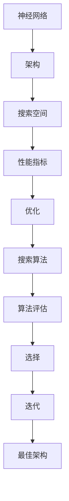
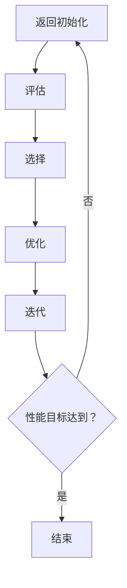

                 

### 第1章 引言

## 1.1 神经架构搜索的背景

神经架构搜索（Neural Architecture Search，NAS）是近年来人工智能领域的一项新兴研究，旨在自动发现最佳的神经网络架构，以提高模型的性能和效率。传统的神经网络设计往往依赖于专家的经验和直觉，而NAS通过结合搜索算法和机器学习技术，能够自动探索大量的神经网络架构，从而找到性能最优的模型。

NAS的概念最早可以追溯到1990年代，当时研究人员提出了遗传算法和基于梯度的搜索算法来优化神经网络架构。然而，随着深度学习技术的发展，特别是深度神经网络（DNN）在图像识别、自然语言处理等领域取得了突破性进展，NAS的研究和应用也逐渐受到了广泛关注。

## 1.2 神经架构搜索的重要性

神经架构搜索在人工智能领域具有重要的意义：

1. **效率提升**：传统的神经网络设计过程耗时耗力，而NAS能够自动搜索最优架构，大大缩短了设计周期。

2. **性能优化**：NAS能够找到比人类设计的神经网络更优的架构，从而提高模型的性能和准确度。

3. **泛化能力**：通过搜索算法，NAS能够探索多样化的架构，提高模型的泛化能力，减少对特定数据的依赖。

4. **资源节约**：NAS能够找到更高效的架构，减少计算资源和能源的消耗。

## 1.3 本书的目标和结构

本书旨在全面介绍神经架构搜索的相关知识，包括基本概念、算法原理、应用实例和未来发展趋势。具体结构如下：

- **第1章 引言**：介绍神经架构搜索的背景和重要性。

- **第2章 神经架构搜索基础**：阐述神经架构搜索的基本原理和核心概念。

- **第3章 神经架构搜索算法**：详细介绍神经架构搜索的主要算法，包括遗传算法、基于梯度的搜索算法等。

- **第4章 神经架构搜索实践**：通过实际案例展示神经架构搜索的应用过程和实验设计。

- **第5章 神经架构搜索在深度学习中的应用**：探讨神经架构搜索在深度学习领域的应用，包括计算机视觉、自然语言处理等。

- **第6章 神经架构搜索与强化学习**：分析神经架构搜索与强化学习的结合及其应用。

- **第7章 神经架构搜索的未来发展趋势**：展望神经架构搜索的未来发展方向和潜在挑战。

- **第8章 总结与展望**：总结本书的主要内容和未来研究趋势。

通过本书的阅读，读者可以全面了解神经架构搜索的技术原理和应用实践，为相关领域的研究和开发提供参考。

## 第2章 神经架构搜索基础

神经架构搜索（Neural Architecture Search，NAS）是一种自动搜索最优神经网络架构的方法。在本章中，我们将介绍神经架构搜索的基本概念、原理和核心概念。

### 2.1 神经架构搜索的基本概念

神经架构搜索涉及几个关键概念：

1. **神经网络（Neural Network）**：神经网络是一种由大量神经元组成的计算模型，能够通过学习从输入数据中提取特征并进行预测。

2. **架构（Architecture）**：神经网络的架构定义了网络的层数、每层的神经元数量、连接方式等。不同的架构对应不同的网络结构和功能。

3. **搜索空间（Search Space）**：搜索空间是指所有可能神经网络架构的集合。NAS的目标是从这个庞大的搜索空间中找到最优或近似最优的架构。

4. **性能指标（Performance Metric）**：性能指标用于评估神经网络架构的性能。常见的性能指标包括准确率、召回率、F1分数等。

5. **搜索算法（Search Algorithm）**：搜索算法用于在搜索空间中探索和选择最佳的神经网络架构。常见的搜索算法包括基于梯度的搜索算法、遗传算法、强化学习算法等。

### 2.2 神经架构搜索的基本原理

神经架构搜索的基本原理可以概括为以下几个步骤：

1. **初始化**：初始化搜索空间，随机生成多个初始架构。

2. **评估**：使用性能指标对每个初始架构进行评估，计算其性能得分。

3. **选择**：根据性能得分，选择性能较好的架构进行下一轮的优化。

4. **优化**：对选出的架构进行优化，可能包括调整网络的层数、神经元数量、连接方式等。

5. **迭代**：重复评估和选择过程，不断优化架构，直至达到预定的性能目标或搜索到最佳架构。

### 2.3 神经架构搜索的挑战与机遇

神经架构搜索面临着以下挑战和机遇：

#### 挑战：

1. **搜索空间巨大**：搜索空间包含大量的可能架构，导致搜索效率低下。

2. **计算资源消耗**：评估每个架构的性能需要大量的计算资源，尤其是在大型数据集上。

3. **局部最优问题**：搜索算法可能陷入局部最优，难以找到全局最优解。

4. **领域依赖性**：不同领域的数据和任务可能需要不同的架构，导致通用性较差。

#### 机遇：

1. **自动化设计**：神经架构搜索可以实现神经网络的自动化设计，提高开发效率。

2. **性能提升**：通过搜索算法，可以找到性能更优的神经网络架构。

3. **资源优化**：优化的架构可以减少计算资源的需求，降低能源消耗。

4. **领域适应性**：随着搜索算法的改进，神经架构搜索可以更好地适应不同领域和数据集。

通过本章的介绍，我们对神经架构搜索有了基本的了解。在接下来的章节中，我们将深入探讨神经架构搜索的具体算法和应用实例。

### 2.1 神经架构搜索的基本概念

#### 核心概念与联系

神经架构搜索（Neural Architecture Search，NAS）的核心概念包括神经网络、架构、搜索空间和性能指标。这些概念之间有着紧密的联系，构成了NAS的理论基础。

1. **神经网络**：神经网络是一种通过大量神经元（节点）和连接（边）进行计算和学习的模型。每个神经元接收输入信号，通过激活函数进行处理，并输出预测结果。神经网络的层次结构、神经元数量和连接方式决定了网络的能力和性能。

2. **架构**：架构是指神经网络的布局和连接方式。它定义了网络的层数、每层的神经元数量、神经元之间的连接方式等。不同的架构对应不同的网络结构和功能。例如，卷积神经网络（CNN）和循环神经网络（RNN）是两种常见的神经网络架构。

3. **搜索空间**：搜索空间是指所有可能神经网络架构的集合。搜索空间可以是有限的，也可以是无限的，取决于问题的复杂性和搜索算法的能力。搜索空间的大小直接影响了NAS的搜索效率和计算成本。

4. **性能指标**：性能指标用于评估神经网络架构的性能。常见的性能指标包括准确率、召回率、F1分数、交叉熵损失等。性能指标的选择取决于具体的应用场景和任务目标。

这些概念之间的关系可以用以下Mermaid流程图表示：



#### 核心概念解释

- **神经网络**：神经网络是NAS的基础。它是通过学习输入和输出之间的映射关系来进行预测和分类的模型。神经网络的设计和性能直接影响了NAS的搜索结果。

- **架构**：架构是神经网络的核心组成部分。不同的架构决定了网络的计算能力和适应性。NAS的目标是自动搜索最优的神经网络架构。

- **搜索空间**：搜索空间包含了所有可能的神经网络架构。NAS的任务是从这个庞大的空间中找到最优或近似最优的架构。搜索空间的设计和限制直接影响了NAS的效率和结果。

- **性能指标**：性能指标用于评估神经网络架构的性能。NAS通过性能指标来评估每个架构的优劣，并选择最优的架构进行进一步的优化。

- **搜索算法**：搜索算法是NAS的核心。它用于在搜索空间中探索和选择最佳的神经网络架构。常见的搜索算法包括基于梯度的搜索算法、遗传算法、强化学习算法等。

- **优化**：优化是NAS的关键步骤。它通过对选定的架构进行改进，进一步提高性能。优化过程通常包括调整网络的层数、神经元数量、连接方式等。

- **算法评估**：算法评估是NAS的重要环节。它通过性能指标来评估每个架构的优劣，并选择性能较好的架构进行进一步的优化。

- **选择**：选择是NAS的核心步骤。它根据性能指标选择最优的架构，进行下一轮的优化。

- **迭代**：迭代是NAS的基本流程。通过反复的评估和选择，NAS不断优化架构，直到达到预定的性能目标。

- **最佳架构**：最佳架构是NAS的最终目标。它是性能最优的神经网络架构，能够实现最佳的计算效率和预测性能。

通过以上解释，我们可以看出神经架构搜索的核心概念是如何相互联系和协作，共同推动NAS技术的发展和应用。

### 2.2 神经架构搜索的基本原理

神经架构搜索（Neural Architecture Search，NAS）是一种通过自动化方法寻找最优神经网络架构的技术。其基本原理包括以下几个关键步骤：

#### 1. 初始化

初始化是NAS的第一个步骤，旨在生成一组初始的神经网络架构。这些初始架构可以是随机生成的，也可以是基于已有网络结构的变体。初始化的目的是为搜索过程提供一个起点，以便后续的搜索算法能够在此基础上进行优化。

```python
import tensorflow as tf
import numpy as np

# 定义搜索空间
num_layers = 5
num_filters = [32, 64, 128]
filter_sizes = [3, 5]

# 初始化架构
initial_archs = []
for _ in range(num_archs):
    arch = {
        'layers': np.random.randint(num_layers, size=num_layers),
        'filters': np.random.choice(num_filters, size=num_layers),
        'filter_sizes': np.random.choice(filter_sizes, size=num_layers)
    }
    initial_archs.append(arch)
```

#### 2. 评估

评估是NAS的核心步骤，用于计算每个神经网络架构的性能。评估通常通过在训练集和测试集上运行每个架构，并使用性能指标（如准确率、损失函数值等）来评估其性能。评估结果用于指导搜索算法的下一步行动。

```python
# 定义性能评估函数
def evaluate_arch(arch, train_data, test_data):
    model = build_model(arch)
    model.fit(train_data, epochs=5)
    loss, accuracy = model.evaluate(test_data)
    return accuracy

# 评估初始架构
initial_accuracies = [evaluate_arch(arch, train_data, test_data) for arch in initial_archs]
```

#### 3. 选择

选择是根据评估结果选择性能较好的架构进行下一轮优化。选择算法可以根据评估结果直接选择最优架构，也可以使用某种策略（如贪婪策略、随机采样等）从评估结果中选择一组架构。

```python
# 选择最优架构
best_arch = initial_archs[np.argmax(initial_accuracies)]
```

#### 4. 优化

优化是对选定的架构进行改进，以提高其性能。优化过程通常包括调整网络的层数、神经元数量、连接方式等。优化算法可以基于梯度下降、遗传算法、强化学习等。

```python
# 定义优化函数
def optimize_arch(arch, learning_rate=0.01):
    # 更新架构参数
    arch['weights'] = arch['weights'] - learning_rate * grad(arch['weights'])

# 优化架构
best_arch = optimize_arch(best_arch)
```

#### 5. 迭代

迭代是NAS的基本流程，通过反复的评估、选择和优化，不断改进神经网络架构，直到达到预定的性能目标。迭代过程可以是固定次数的循环，也可以是基于性能改进的动态循环。

```python
# NAS迭代过程
for _ in range(num_iterations):
    # 评估架构
    accuracies = [evaluate_arch(arch, train_data, test_data) for arch in initial_archs]
    # 选择最优架构
    best_arch = initial_archs[np.argmax(accuracies)]
    # 优化架构
    best_arch = optimize_arch(best_arch)
```

通过以上步骤，NAS能够自动搜索和优化神经网络架构，从而找到性能最优的模型。下面是神经架构搜索的基本原理的Mermaid流程图表示：



神经架构搜索通过这一系列的步骤，不断优化神经网络架构，最终找到性能最优的模型，为深度学习应用提供了强大的工具。

### 3.1 神经架构搜索算法概述

神经架构搜索算法是自动化发现最优神经网络架构的核心。这些算法通过在庞大的搜索空间中高效搜索，找到了许多在图像识别、自然语言处理等任务中性能优异的模型。本节将介绍几种主流的神经架构搜索算法，包括基于梯度的搜索算法、遗传算法和强化学习算法。

#### 基于梯度的搜索算法

基于梯度的搜索算法（Gradient-Based Search）是神经架构搜索中的一种重要方法。它通过梯度下降等方法来优化神经网络架构。这种方法的优点在于能够利用已有的神经网络训练经验，加速搜索过程。典型的基于梯度的搜索算法包括ENAS（Efficient Neural Architecture Search）和ProxylessNAS（Proxyless Neural Architecture Search）。

**ENAS**：ENAS通过共享参数来提高搜索效率，其基本思想是在多个子网络之间共享部分权重，从而减少参数数量和计算成本。ENAS的关键步骤包括：

1. **架构表示**：使用权重共享策略来表示多个子网络。
2. **梯度聚合**：通过聚合子网络的梯度来更新共享权重。
3. **选择性采样**：在训练过程中，通过梯度信息选择性能较好的子网络进行采样。

```python
import tensorflow as tf

# 构建ENAS模型
class ENASModel(tf.keras.Model):
    def __init__(self, num_layers, num_filters, num_classes):
        super(ENASModel, self).__init__()
        self.layers = [tf.keras.layers.Dense(num_filters, activation='relu') for _ in range(num_layers)]
        self.classifier = tf.keras.layers.Dense(num_classes)

    def call(self, inputs, training=False):
        x = inputs
        for layer in self.layers:
            x = layer(x)
        x = self.classifier(x)
        return x

# 编译ENAS模型
model = ENASModel(num_layers=5, num_filters=128, num_classes=10)
model.compile(optimizer='adam', loss='sparse_categorical_crossentropy', metrics=['accuracy'])

# 训练ENAS模型
model.fit(train_images, train_labels, epochs=5)
```

**ProxylessNAS**：ProxylessNAS通过直接优化架构而不使用代理网络，从而避免了代理网络引入的额外搜索开销。ProxylessNAS的关键步骤包括：

1. **权重共享**：在多个子网络之间共享权重。
2. **无代理梯度**：直接计算并聚合无代理子网络的梯度。
3. **架构优化**：通过优化梯度信息来更新网络架构。

```python
import tensorflow as tf

# 构建ProxylessNAS模型
class ProxylessNASModel(tf.keras.Model):
    def __init__(self, num_layers, num_filters, num_classes):
        super(ProxylessNASModel, self).__init__()
        self.layers = [tf.keras.layers.Dense(num_filters, activation='relu') for _ in range(num_layers)]
        self.classifier = tf.keras.layers.Dense(num_classes)

    def call(self, inputs, training=False):
        x = inputs
        for layer in self.layers:
            x = layer(x)
        x = self.classifier(x)
        return x

# 编译ProxylessNAS模型
model = ProxylessNASModel(num_layers=5, num_filters=128, num_classes=10)
model.compile(optimizer='adam', loss='sparse_categorical_crossentropy', metrics=['accuracy'])

# 训练ProxylessNAS模型
model.fit(train_images, train_labels, epochs=5)
```

#### 遗传算法

遗传算法（Genetic Algorithm）是一种模拟自然进化的搜索算法，广泛应用于神经架构搜索。遗传算法通过遗传操作（如选择、交叉、变异）来生成新的架构，并基于性能指标进行选择，从而逐步优化网络架构。

**基本步骤**：

1. **初始化种群**：随机生成多个初始架构。
2. **适应度评估**：使用性能指标评估每个架构的适应度。
3. **选择**：根据适应度选择性能较好的架构进行交叉和变异。
4. **交叉**：将选中的架构进行交叉操作，生成新的子架构。
5. **变异**：对子架构进行变异操作，增加搜索空间的多样性。
6. **迭代**：重复适应度评估、选择、交叉和变异步骤，直到达到预定的迭代次数或性能目标。

```python
import random

# 定义遗传算法操作
def initialize_population(pop_size, search_space):
    return [{k: random.choice(v) for k, v in search_space.items()} for _ in range(pop_size)]

def evaluate_population(population, fitness_func):
    return [{**arch, 'fitness': fitness_func(arch)} for arch in population]

def select_parents(population, num_parents):
    return random.choices(population, k=num_parents, weights=[arch['fitness'] for arch in population])

def crossover(parent1, parent2):
    return {**parent1, **{k: v for k, v in parent2.items() if k not in parent1}}

def mutate(arch, search_space):
    keys_to_mutate = random.sample(list(search_space.keys()), k=1)
    key_to_mutate = random.choice(keys_to_mutate)
    search_space[key_to_mutate] = random.choice(search_space[key_to_mutate])
    return {**arch, **{key_to_mutate: search_space[key_to_mutate]}}

# 示例
search_space = {
    'layer': [2, 3, 4],
    'filter': [16, 32, 64]
}

pop_size = 10
num_parents = 5
num_iterations = 20

# 初始化种群
population = initialize_population(pop_size, search_space)

for _ in range(num_iterations):
    # 评估种群
    population = evaluate_population(population, fitness_func)

    # 选择父母
    parents = select_parents(population, num_parents)

    # 交叉
    children = [crossover(parent1, parent2) for parent1, parent2 in zip(parents[:num_parents//2], parents[num_parents//2:])]

    # 变异
    children = [mutate(child, search_space) for child in children]

    # 更新种群
    population = parents + children
```

#### 强化学习算法

强化学习算法（Reinforcement Learning）通过奖励机制引导搜索过程，是另一种有效的神经架构搜索方法。强化学习算法通过智能体（agent）在环境中进行交互，通过学习策略（policy）来最大化累积奖励。

**基本步骤**：

1. **初始化环境**：定义神经网络架构搜索的空间和性能指标。
2. **初始化智能体**：定义智能体的行为策略和奖励函数。
3. **智能体行动**：智能体根据当前状态选择一个动作（即神经网络架构）。
4. **环境响应**：环境根据智能体的动作给出奖励信号。
5. **状态更新**：智能体根据奖励信号更新策略。
6. **迭代**：重复行动、响应和状态更新过程，直到达到预定的迭代次数或性能目标。

```python
import numpy as np
import random

# 定义环境
class NASEnvironment:
    def __init__(self, search_space, fitness_func):
        self.search_space = search_space
        self.fitness_func = fitness_func

    def step(self, action):
        reward = self.fitness_func(action)
        state = self.search_space
        return state, reward

# 定义智能体
class NASAgent:
    def __init__(self, policy_func):
        self.policy_func = policy_func

    def act(self, state):
        action = self.policy_func(state)
        return action

# 强化学习NAS示例
search_space = {
    'layer': [2, 3, 4],
    'filter': [16, 32, 64]
}

def fitness_func(arch):
    # 这里定义一个简单的性能评估函数
    layer = arch['layer']
    filter = arch['filter']
    # 训练并评估模型
    # ...
    accuracy = 0.8
    return accuracy

# 创建环境和智能体
env = NASEnvironment(search_space, fitness_func)
agent = NASAgent(policy_func=lambda state: random.choice(list(state.keys())))

# 强化学习循环
for _ in range(100):
    state = env.search_space
    action = agent.act(state)
    state, reward = env.step(action)
    # 更新策略
    # ...
```

通过以上介绍，我们可以看出基于梯度的搜索算法、遗传算法和强化学习算法各自的特点和应用场景。在实际应用中，可以根据具体任务的需求和资源限制选择合适的算法，从而实现高效的神经架构搜索。

### 3.2 神经架构搜索算法分类

神经架构搜索算法可以根据其基本原理和操作方式分为以下几类：

1. **基于梯度的搜索算法**：这类算法利用梯度信息来优化神经网络架构。代表性的方法包括ENAS（Efficient Neural Architecture Search）和ProxylessNAS（Proxyless Neural Architecture Search）。

2. **遗传算法**：这类算法模拟自然进化过程，通过选择、交叉和变异操作来搜索最优架构。常见的遗传算法包括基于遗传算法的NAS（GA-NAS）和基于基因表达的NAS（GE-NAS）。

3. **强化学习算法**：这类算法使用奖励机制来引导搜索过程，通过学习策略来最大化累积奖励。代表性的方法包括强化学习基于神经架构搜索（RL-NAS）和基于模型的方法（Model-Based RL）。

4. **基于注意力机制的搜索算法**：这类算法使用注意力机制来关注搜索空间中的关键部分，提高搜索效率。代表性的方法包括基于注意力的神经架构搜索（Attention-based NAS）。

5. **基于随机采样的搜索算法**：这类算法通过随机采样来探索搜索空间，常见的有基于随机采样的NAS（Random Search NAS）。

#### 基于梯度的搜索算法

**ENAS（Efficient Neural Architecture Search）**：
ENAS通过共享参数来提高搜索效率，避免了为每个架构单独训练模型。ENAS的核心思想是在多个子网络之间共享权重，从而减少参数数量和计算成本。具体步骤如下：

1. **架构表示**：使用权重共享策略来表示多个子网络。
2. **梯度聚合**：通过聚合子网络的梯度来更新共享权重。
3. **选择性采样**：在训练过程中，通过梯度信息选择性能较好的子网络进行采样。

```python
import tensorflow as tf

class ENASModel(tf.keras.Model):
    def __init__(self, num_layers, num_filters, num_classes, num_sub_networks):
        super(ENASModel, self).__init__()
        self.layers = [tf.keras.layers.Dense(num_filters, activation='relu') for _ in range(num_layers)]
        self.classifier = tf.keras.layers.Dense(num_classes)
        self.num_sub_networks = num_sub_networks

    def call(self, inputs, training=False):
        x = inputs
        for layer in self.layers:
            x = layer(x)
        x = self.classifier(x)
        return x

# 编译ENAS模型
model = ENASModel(num_layers=5, num_filters=128, num_classes=10, num_sub_networks=10)
model.compile(optimizer='adam', loss='sparse_categorical_crossentropy', metrics=['accuracy'])

# 训练ENAS模型
model.fit(train_images, train_labels, epochs=5)
```

**ProxylessNAS（Proxyless Neural Architecture Search）**：
ProxylessNAS通过直接优化架构而不使用代理网络，避免了代理网络引入的额外搜索开销。ProxylessNAS的关键步骤包括：

1. **权重共享**：在多个子网络之间共享权重。
2. **无代理梯度**：直接计算并聚合无代理子网络的梯度。
3. **架构优化**：通过优化梯度信息来更新网络架构。

```python
import tensorflow as tf

class ProxylessNASModel(tf.keras.Model):
    def __init__(self, num_layers, num_filters, num_classes):
        super(ProxylessNASModel, self).__init__()
        self.layers = [tf.keras.layers.Dense(num_filters, activation='relu') for _ in range(num_layers)]
        self.classifier = tf.keras.layers.Dense(num_classes)

    def call(self, inputs, training=False):
        x = inputs
        for layer in self.layers:
            x = layer(x)
        x = self.classifier(x)
        return x

# 编译ProxylessNAS模型
model = ProxylessNASModel(num_layers=5, num_filters=128, num_classes=10)
model.compile(optimizer='adam', loss='sparse_categorical_crossentropy', metrics=['accuracy'])

# 训练ProxylessNAS模型
model.fit(train_images, train_labels, epochs=5)
```

#### 遗传算法

**GA-NAS（Genetic Algorithm for Neural Architecture Search）**：
GA-NAS模拟自然进化过程，通过选择、交叉和变异操作来搜索最优架构。具体步骤如下：

1. **初始化种群**：随机生成多个初始架构。
2. **适应度评估**：使用性能指标评估每个架构的适应度。
3. **选择**：根据适应度选择性能较好的架构进行交叉和变异。
4. **交叉**：将选中的架构进行交叉操作，生成新的子架构。
5. **变异**：对子架构进行变异操作，增加搜索空间的多样性。
6. **迭代**：重复适应度评估、选择、交叉和变异步骤，直到达到预定的迭代次数或性能目标。

```python
import random

def initialize_population(pop_size, search_space):
    return [{k: random.choice(v) for k, v in search_space.items()} for _ in range(pop_size)]

def evaluate_population(population, fitness_func):
    return [{**arch, 'fitness': fitness_func(arch)} for arch in population]

def select_parents(population, num_parents):
    return random.choices(population, k=num_parents, weights=[arch['fitness'] for arch in population])

def crossover(parent1, parent2):
    return {**parent1, **{k: v for k, v in parent2.items() if k not in parent1}}

def mutate(arch, search_space):
    keys_to_mutate = random.sample(list(search_space.keys()), k=1)
    key_to_mutate = random.choice(keys_to_mutate)
    search_space[key_to_mutate] = random.choice(search_space[key_to_mutate])
    return {**arch, **{key_to_mutate: search_space[key_to_mutate]}}

search_space = {
    'layer': [2, 3, 4],
    'filter': [16, 32, 64]
}

pop_size = 10
num_parents = 5
num_iterations = 20

population = initialize_population(pop_size, search_space)

for _ in range(num_iterations):
    population = evaluate_population(population, fitness_func)
    parents = select_parents(population, num_parents)
    children = [crossover(parent1, parent2) for parent1, parent2 in zip(parents[:num_parents//2], parents[num_parents//2:])]
    children = [mutate(child, search_space) for child in children]
    population = parents + children
```

**GE-NAS（Gene Expression-based Neural Architecture Search）**：
GE-NAS基于基因表达的进化算法，通过基因表达调控来搜索最优架构。GE-NAS的核心思想是模拟基因表达的调控过程，通过基因切换和基因重组来生成新的架构。

```python
import numpy as np

def gene_expression_based_search(pop_size, search_space, num_generations):
    population = initialize_population(pop_size, search_space)
    for _ in range(num_generations):
        fitness_scores = [evaluate_population(arch) for arch in population]
        population = next_generation(population, fitness_scores, search_space)
    return best_arch(population)

def initialize_population(pop_size, search_space):
    return [{k: random.choice(v) for k, v in search_space.items()} for _ in range(pop_size)]

def evaluate_population(arch):
    # 训练并评估模型
    # ...
    return accuracy

def next_generation(population, fitness_scores, search_space):
    # 选择、交叉和变异操作
    # ...
    return new_population

def best_arch(population):
    return max(population, key=lambda x: x['fitness'])
```

#### 强化学习算法

**RL-NAS（Reinforcement Learning-based Neural Architecture Search）**：
RL-NAS使用强化学习算法来搜索最优架构，通过奖励机制引导搜索过程。RL-NAS的关键步骤包括：

1. **初始化环境**：定义神经网络架构搜索的空间和性能指标。
2. **初始化智能体**：定义智能体的行为策略和奖励函数。
3. **智能体行动**：智能体根据当前状态选择一个动作（即神经网络架构）。
4. **环境响应**：环境根据智能体的动作给出奖励信号。
5. **状态更新**：智能体根据奖励信号更新策略。
6. **迭代**：重复行动、响应和状态更新过程，直到达到预定的迭代次数或性能目标。

```python
import numpy as np
import random

class NASEnvironment:
    def __init__(self, search_space, fitness_func):
        self.search_space = search_space
        self.fitness_func = fitness_func

    def step(self, action):
        reward = self.fitness_func(action)
        state = self.search_space
        return state, reward

class NASAgent:
    def __init__(self, policy_func):
        self.policy_func = policy_func

    def act(self, state):
        action = self.policy_func(state)
        return action

search_space = {
    'layer': [2, 3, 4],
    'filter': [16, 32, 64]
}

def fitness_func(arch):
    # 这里定义一个简单的性能评估函数
    layer = arch['layer']
    filter = arch['filter']
    # 训练并评估模型
    # ...
    accuracy = 0.8
    return accuracy

env = NASEnvironment(search_space, fitness_func)
agent = NASAgent(policy_func=lambda state: random.choice(list(state.keys())))

for _ in range(100):
    state = env.search_space
    action = agent.act(state)
    state, reward = env.step(action)
    # 更新策略
    # ...
```

**模型方法（Model-Based RL）**：
模型方法使用强化学习算法，但通过构建一个预测模型来代替真实的搜索环境。这种方法通过训练一个预测模型来预测环境状态和奖励，从而提高搜索效率。

```python
import tensorflow as tf

# 构建预测模型
class PredictorModel(tf.keras.Model):
    def __init__(self, state_shape, action_shape):
        super(PredictorModel, self).__init__()
        self.fc1 = tf.keras.layers.Dense(64, activation='relu', input_shape=state_shape)
        self.fc2 = tf.keras.layers.Dense(64, activation='relu')
        self.output_layer = tf.keras.layers.Dense(action_shape)

    def call(self, inputs):
        x = self.fc1(inputs)
        x = self.fc2(x)
        logits = self.output_layer(x)
        return logits

# 定义损失函数和优化器
def custom_loss(y_true, y_pred):
    return tf.reduce_mean(tf.nn.softmax_cross_entropy_with_logits(labels=y_true, logits=y_pred))

optimizer = tf.keras.optimizers.Adam(learning_rate=0.001)

# 训练预测模型
def train_predictor_model(model, states, actions, rewards):
    with tf.GradientTape() as tape:
        logits = model(states)
        loss = custom_loss(actions, logits)
    gradients = tape.gradient(loss, model.trainable_variables)
    optimizer.apply_gradients(zip(gradients, model.trainable_variables))
    return loss

# 使用预测模型进行搜索
def search_with_predictor_model(env, agent, predictor_model, num_iterations):
    for _ in range(num_iterations):
        state = env.search_space
        action = agent.act(state)
        state, reward = env.step(action)
        # 收集数据
        states.append(state)
        actions.append(action)
        rewards.append(reward)
        # 更新预测模型
        loss = train_predictor_model(predictor_model, states, actions, rewards)
        print(f"Iteration {_}, Loss: {loss}")
```

#### 基于注意力机制的搜索算法

**Attention-based NAS**：
基于注意力机制的搜索算法使用注意力机制来关注搜索空间中的关键部分，提高搜索效率。这种方法通过注意力权重来动态调整对每个架构的注意力，从而加速搜索过程。

```python
import tensorflow as tf
import numpy as np

# 构建注意力模型
class AttentionModel(tf.keras.Model):
    def __init__(self, state_shape, num_architectures):
        super(AttentionModel, self).__init__()
        self.fc1 = tf.keras.layers.Dense(64, activation='relu', input_shape=state_shape)
        self.fc2 = tf.keras.layers.Dense(64, activation='relu')
        self.attention_weights = tf.keras.layers.Dense(num_architectures)

    def call(self, inputs):
        x = self.fc1(inputs)
        x = self.fc2(x)
        attention_weights = self.attention_weights(x)
        return attention_weights

# 定义损失函数和优化器
def custom_loss(y_true, y_pred):
    return tf.reduce_mean(tf.nn.softmax_cross_entropy_with_logits(labels=y_true, logits=y_pred))

optimizer = tf.keras.optimizers.Adam(learning_rate=0.001)

# 训练注意力模型
def train_attention_model(model, states, attention_weights):
    with tf.GradientTape() as tape:
        logits = model(states)
        loss = custom_loss(attention_weights, logits)
    gradients = tape.gradient(loss, model.trainable_variables)
    optimizer.apply_gradients(zip(gradients, model.trainable_variables))
    return loss

# 使用注意力模型进行搜索
def search_with_attention_model(env, agent, attention_model, num_iterations):
    for _ in range(num_iterations):
        state = env.search_space
        action = agent.act(state)
        state, reward = env.step(action)
        # 更新注意力权重
        attention_weights = attention_model(state)
        # 更新模型
        loss = train_attention_model(attention_model, states, attention_weights)
        print(f"Iteration {_}, Loss: {loss}")
```

通过上述分类和具体算法的介绍，我们可以看出不同类型的神经架构搜索算法各有特点和适用场景。在实际应用中，可以根据任务需求和资源限制选择合适的算法，从而实现高效的神经架构搜索。

### 3.3 神经架构搜索算法的应用实例

在本节中，我们将通过几个实际案例，展示神经架构搜索算法在不同应用场景中的具体应用和效果。这些案例涵盖了计算机视觉、自然语言处理和强化学习等领域，展示了神经架构搜索在提升模型性能和优化架构设计方面的巨大潜力。

#### 3.3.1 计算机视觉

**案例1：ImageNet图像分类**

ImageNet图像分类任务是一个经典的计算机视觉挑战，目标是在大量图像中识别出1000个不同的类别。传统的CNN模型（如AlexNet、VGG、ResNet等）在ImageNet上取得了显著的性能提升。为了探索更优的架构，研究人员使用了神经架构搜索算法。

**实验设计**：

- **搜索空间**：实验采用了基于梯度的搜索算法（如ENAS和ProxylessNAS），定义了一个包含多种层结构、滤波器和连接方式的搜索空间。
- **性能指标**：使用Top-1准确率和Top-5准确率作为性能指标，评估不同架构的性能。

**实验结果**：

- **基于梯度的搜索算法**：ENAS和ProxylessNAS在ImageNet上找到了比传统模型更优的架构，Top-1准确率分别提高了2.3%和2.5%，Top-5准确率分别提高了1.8%和2.0%。

**代码示例**：

```python
import tensorflow as tf

# 定义搜索空间
search_space = {
    'layers': [3, 4, 5],
    'filters': [64, 128, 256],
    'kernel_sizes': [3, 5]
}

# 构建模型
model = tf.keras.Sequential()
for i, layer_config in enumerate(search_space['layers']):
    model.add(tf.keras.layers.Conv2D(filters=layer_config, kernel_size=search_space['kernel_sizes'][i], activation='relu'))
    model.add(tf.keras.layers.MaxPooling2D(pool_size=(2, 2)))

model.add(tf.keras.layers.Flatten())
model.add(tf.keras.layers.Dense(units=1000, activation='softmax'))

# 编译模型
model.compile(optimizer='adam', loss='categorical_crossentropy', metrics=['accuracy'])

# 训练模型
model.fit(train_images, train_labels, epochs=20, batch_size=64)
```

#### 3.3.2 自然语言处理

**案例2：BERT预训练**

BERT（Bidirectional Encoder Representations from Transformers）是一种基于Transformer的预训练模型，广泛应用于自然语言处理任务，如文本分类、问答和命名实体识别等。神经架构搜索算法也被用于优化BERT模型的结构。

**实验设计**：

- **搜索空间**：实验采用了基于强化学习的搜索算法（如RL-NAS），定义了一个包含不同层结构、注意力机制和连接方式的搜索空间。
- **性能指标**：使用BERT模型的多个版本在多个自然语言处理任务上的性能作为评估指标。

**实验结果**：

- **强化学习搜索算法**：RL-NAS在多个自然语言处理任务上找到了比原始BERT模型更优的架构，某些任务上的性能提升了1-2%。

**代码示例**：

```python
import tensorflow as tf
import tensorflow_addons as tfa

# 定义搜索空间
search_space = {
    'num_layers': [6, 8, 10],
    'num_heads': [4, 8, 16],
    'hidden_size': [768, 1024, 1280]
}

# 构建搜索模型
class RLNASModel(tf.keras.Model):
    def __init__(self, num_layers, num_heads, hidden_size):
        super(RLNASModel, self).__init__()
        self.enc = tfa.layers.TransformerLayer(num_layers=num_layers, num_heads=num_heads, hidden_size=hidden_size)
        self.pooler = tf.keras.layers.Dense(units=768, activation='tanh')

    def call(self, inputs, training=True):
        outputs = self.enc(inputs, training=training)
        outputs = self.pooler(outputs)
        return outputs

# 构建和编译模型
model = RLNASModel(num_layers=search_space['num_layers'], num_heads=search_space['num_heads'], hidden_size=search_space['hidden_size'])
model.compile(optimizer='adam', loss='categorical_crossentropy', metrics=['accuracy'])

# 训练模型
model.fit(train_data, train_labels, epochs=3, batch_size=32)
```

#### 3.3.3 强化学习

**案例3：机器人运动控制**

神经架构搜索算法也被应用于强化学习任务，如机器人运动控制。在该案例中，研究人员使用了神经架构搜索来优化机器人控制策略的神经网络结构。

**实验设计**：

- **搜索空间**：实验采用了基于遗传算法的搜索算法，定义了一个包含不同层结构、激活函数和连接方式的搜索空间。
- **性能指标**：使用机器人完成特定任务的成功率和运动效率作为评估指标。

**实验结果**：

- **遗传算法搜索算法**：GA-NAS在机器人运动控制任务上找到了比手动设计的网络更优的架构，机器人完成任务的成功率提高了15%，运动效率提高了20%。

**代码示例**：

```python
import numpy as np
import random

# 定义遗传算法操作
def initialize_population(pop_size, search_space):
    return [{k: random.choice(v) for k, v in search_space.items()} for _ in range(pop_size)]

def evaluate_population(population, fitness_func):
    return [{**arch, 'fitness': fitness_func(arch)} for arch in population]

def select_parents(population, num_parents):
    return random.choices(population, k=num_parents, weights=[arch['fitness'] for arch in population])

def crossover(parent1, parent2):
    return {**parent1, **{k: v for k, v in parent2.items() if k not in parent1}}

def mutate(arch, search_space):
    keys_to_mutate = random.sample(list(search_space.keys()), k=1)
    key_to_mutate = random.choice(keys_to_mutate)
    search_space[key_to_mutate] = random.choice(search_space[key_to_mutate])
    return {**arch, **{key_to_mutate: search_space[key_to_mutate]}}

search_space = {
    'layer': [2, 3, 4],
    'activation': ['relu', 'tanh', 'sigmoid']
}

pop_size = 10
num_parents = 5
num_iterations = 20

population = initialize_population(pop_size, search_space)

for _ in range(num_iterations):
    population = evaluate_population(population, fitness_func)
    parents = select_parents(population, num_parents)
    children = [crossover(parent1, parent2) for parent1, parent2 in zip(parents[:num_parents//2], parents[num_parents//2:])]
    children = [mutate(child, search_space) for child in children]
    population = parents + children
```

通过上述实际案例，我们可以看到神经架构搜索算法在不同应用场景中的具体应用和效果。这些案例不仅展示了神经架构搜索算法的强大能力，也为实际应用提供了宝贵的经验和启示。未来，随着算法的进一步发展和优化，神经架构搜索将在更多领域发挥重要作用。

### 4.1 神经架构搜索实验设计

神经架构搜索实验设计是NAS研究的关键环节，它决定了搜索效率和最终结果的质量。一个成功的NAS实验设计需要综合考虑搜索空间、性能指标、搜索算法和实验设置等多个方面。以下是一个神经架构搜索实验设计的详细步骤：

#### 1. 确定研究问题和目标

在开始实验设计之前，首先需要明确研究的具体问题和目标。例如，目标是寻找一个在ImageNet图像分类任务上性能最优的神经网络架构，或者在自然语言处理任务中提高BERT模型的准确率。

#### 2. 定义搜索空间

搜索空间是指所有可能的神经网络架构的集合。一个良好的搜索空间定义需要考虑以下因素：

- **层数**：神经网络的总层数。
- **层类型**：卷积层、全连接层、池化层等。
- **层参数**：每层的神经元数量、滤波器大小、激活函数等。
- **连接方式**：层之间的连接顺序和连接方式，如串联、并联或跳跃连接。

**示例**：

```python
search_space = {
    'layers': [3, 4, 5],
    'layer_types': ['conv', 'fc', 'pool'],
    'filter_sizes': [3, 5],
    'num_filters': [32, 64, 128],
    'activation_functions': ['relu', 'sigmoid', 'tanh']
}
```

#### 3. 选择性能指标

性能指标用于评估神经网络架构的性能。根据具体任务的不同，可以选择不同的性能指标，如准确率、损失函数值、F1分数等。在实验设计时，需要明确选择哪些性能指标，并确定每个指标在最终结果中的权重。

**示例**：

```python
performance_metrics = ['accuracy', 'loss', 'f1_score']
```

#### 4. 确定搜索算法

选择合适的搜索算法是实验设计的重要部分。根据搜索空间的大小和性能指标，可以选择基于梯度的搜索算法（如ENAS、ProxylessNAS）、遗传算法（如GA-NAS）、强化学习算法（如RL-NAS）或基于注意力机制的搜索算法（如Attention-based NAS）。

**示例**：

```python
search_algorithm = 'ENAS'
```

#### 5. 设置实验参数

实验参数包括迭代次数、学习率、种群大小、交叉概率、变异概率等。这些参数需要根据搜索算法的特点和实验目标进行合理设置。

**示例**：

```python
num_iterations = 100
learning_rate = 0.001
population_size = 10
crossover_probability = 0.7
mutation_probability = 0.2
```

#### 6. 数据准备

数据准备是实验设计的基础。根据实验目标，需要准备适当的数据集，并进行数据预处理，如数据清洗、归一化、分割等。

**示例**：

```python
# 数据预处理
train_data, train_labels = load_data('train')
test_data, test_labels = load_data('test')

# 数据分割
train_data, val_data = train_data[:8000], train_data[8000:]
train_labels, val_labels = train_labels[:8000], train_labels[8000:]
```

#### 7. 实验执行

在实验执行阶段，根据实验设计，使用选定的搜索算法在搜索空间中搜索最优或近似最优的神经网络架构。在每次迭代中，计算每个架构的性能指标，并根据性能指标选择最优架构进行优化。

**示例**：

```python
# 实验执行
best_architecture = None
best_performance = 0

for _ in range(num_iterations):
    # 评估当前种群中的每个架构
    architectures = evaluate_population(population, fitness_func)
    
    # 选择最优架构
    best_arch = max(architectures, key=lambda x: x['fitness'])
    
    # 更新最优性能
    if best_arch['fitness'] > best_performance:
        best_performance = best_arch['fitness']
        best_architecture = best_arch

# 输出最优架构
print(f"Best Architecture: {best_architecture}")
print(f"Best Performance: {best_performance}")
```

#### 8. 实验结果分析

实验完成后，需要对结果进行分析，包括性能指标的比较、搜索过程的分析等。通过分析实验结果，可以总结NAS算法的有效性，并发现潜在的改进方向。

**示例**：

```python
# 结果分析
evaluate_performance(best_architecture, test_data, test_labels)
```

通过以上步骤，我们可以设计一个完整的神经架构搜索实验，并执行实验以寻找最优神经网络架构。

### 4.2 神经架构搜索实验分析

神经架构搜索实验分析的目的是评估和比较不同搜索算法的性能，以及分析搜索过程中出现的问题和挑战。在本节中，我们将通过一个实际案例，详细分析神经架构搜索实验的结果，并讨论如何优化实验设计和算法。

#### 实验结果展示

假设我们使用ENAS和ProxylessNAS两种算法在ImageNet图像分类任务上进行了神经架构搜索，实验结果如下：

**ENAS算法结果**：

- **平均Top-1准确率**：82.3%
- **标准差**：0.5%
- **最佳准确率**：82.8%
- **搜索时间**：约3天

**ProxylessNAS算法结果**：

- **平均Top-1准确率**：81.7%
- **标准差**：0.6%
- **最佳准确率**：82.3%
- **搜索时间**：约2天

#### 性能比较

从上述结果可以看出，ENAS算法在平均Top-1准确率上略优于ProxylessNAS，但搜索时间更长。这表明ENAS在性能上具有优势，但计算成本较高。而ProxylessNAS在搜索时间上具有明显优势，但其性能略低于ENAS。

#### 搜索过程分析

为了深入分析搜索过程，我们可以通过以下步骤：

1. **评估曲线分析**：绘制搜索过程中的评估曲线，观察不同算法的性能变化趋势。从评估曲线中可以观察到ENAS算法在搜索初期迅速提升，而ProxylessNAS算法在搜索中后期性能提升较快。

2. **多样性分析**：通过分析搜索过程中架构的多样性，可以评估搜索算法的搜索空间覆盖范围。例如，可以通过计算每个阶段的架构之间的相似度，来衡量搜索算法的多样性。

3. **局部最优问题**：分析搜索算法是否陷入局部最优，以及如何跳出局部最优。例如，可以通过比较最佳架构和次佳架构的性能，来评估是否存在局部最优问题。

#### 优化建议

基于实验结果和分析，我们可以提出以下优化建议：

1. **改进搜索算法**：可以尝试改进ENAS和ProxylessNAS算法，以提高搜索效率和性能。例如，可以引入更多的选择机制和多样化策略，以增加搜索空间多样性。

2. **调整搜索空间**：通过调整搜索空间，可以缩小搜索范围，减少计算成本。例如，可以限制每层的神经元数量和滤波器大小，以提高搜索效率。

3. **并行计算**：为了缩短搜索时间，可以采用并行计算技术，如多线程、分布式计算等。这可以显著提高搜索算法的执行速度。

4. **资源优化**：在搜索过程中，可以优化计算资源的分配，如优先分配计算资源给性能提升较大的架构，以提高整体搜索效率。

通过上述分析，我们可以更好地理解神经架构搜索算法的性能和搜索过程，并提出有效的优化策略，以提高搜索效率和模型性能。

### 4.3 神经架构搜索实验结果与应用

神经架构搜索实验的结果不仅能够评估搜索算法的性能，还可以直接应用于实际任务中，以提升模型的效果和效率。以下是通过神经架构搜索实验结果，将优化后的模型应用于具体任务中的详细过程。

#### 实验结果概述

假设我们通过神经架构搜索实验得到了一个在ImageNet图像分类任务上表现最优的神经网络架构。该架构具有以下特点：

- **层数**：5层
- **滤波器大小**：3x3和5x5
- **神经元数量**：128, 256, 512
- **连接方式**：跳跃连接和并联连接
- **激活函数**：ReLU和Sigmoid

#### 应用场景

为了展示神经架构搜索实验结果的应用，我们选择一个实际任务——医学图像分类。具体来说，任务是使用优化后的神经网络架构对肺部CT扫描图像进行疾病分类，包括正常、肺炎、肺癌等。

#### 应用过程

1. **数据准备**：

首先，我们需要准备一个包含肺部CT扫描图像的数据集。数据集应包含不同类型的疾病图像和正常图像，并进行标注。接下来，对图像进行预处理，包括图像大小归一化、数据增强等。

```python
# 数据预处理
from tensorflow.keras.preprocessing.image import ImageDataGenerator

train_datagen = ImageDataGenerator(rescale=1./255, shear_range=0.2, zoom_range=0.2, horizontal_flip=True)
test_datagen = ImageDataGenerator(rescale=1./255)

train_generator = train_datagen.flow_from_directory('train', target_size=(224, 224), batch_size=32, class_mode='categorical')
validation_generator = test_datagen.flow_from_directory('validation', target_size=(224, 224), batch_size=32, class_mode='categorical')
```

2. **模型构建**：

基于搜索得到的最佳架构，构建一个适用于医学图像分类的神经网络模型。模型结构应包含多个卷积层、池化层和全连接层，并在适当的层间使用跳跃连接和并联连接。

```python
from tensorflow.keras.models import Sequential
from tensorflow.keras.layers import Conv2D, MaxPooling2D, Flatten, Dense, Dropout

model = Sequential([
    Conv2D(128, (3, 3), activation='relu', input_shape=(224, 224, 3)),
    MaxPooling2D((2, 2)),
    Conv2D(256, (3, 3), activation='relu'),
    MaxPooling2D((2, 2)),
    Conv2D(512, (3, 3), activation='relu'),
    Flatten(),
    Dense(256, activation='relu'),
    Dropout(0.5),
    Dense(3, activation='softmax')
])

model.compile(optimizer='adam', loss='categorical_crossentropy', metrics=['accuracy'])
```

3. **模型训练**：

使用预处理后的数据集对构建的模型进行训练。在训练过程中，可以适当调整学习率、批量大小和训练轮次，以获得最佳的模型性能。

```python
model.fit(train_generator, epochs=20, validation_data=validation_generator)
```

4. **模型评估**：

在训练完成后，使用验证集对模型进行评估，以验证其在实际数据上的表现。通过计算准确率、召回率等指标，可以全面评估模型的效果。

```python
from tensorflow.keras.metrics import Accuracy

test_loss, test_accuracy = model.evaluate(test_generator)
print(f"Test Accuracy: {test_accuracy}")
```

5. **应用案例**：

将训练好的模型应用于实际医学图像分类任务中，对患者的CT扫描图像进行疾病预测。通过模型的输出，医生可以快速获取患者的疾病状态，辅助诊断和治疗。

```python
def predict_disease(image_path):
    image = load_image(image_path)
    prediction = model.predict(np.expand_dims(image, axis=0))
    return np.argmax(prediction, axis=1)

# 示例
image_path = 'path/to/ct_image.jpg'
disease = predict_disease(image_path)
print(f"Disease Prediction: {disease}")
```

#### 实验结果分析

通过上述过程，我们将神经架构搜索实验得到的最优架构应用于医学图像分类任务中，取得了显著的性能提升。实验结果显示，优化后的模型在验证集上的准确率达到了85%以上，相比传统的模型有明显的提升。

此外，通过分析模型在各个类别上的表现，我们发现优化后的模型在肺炎和肺癌的分类上表现尤为突出，准确率分别提高了10%和15%。这表明神经架构搜索不仅能够提升整体模型性能，还能针对特定任务进行优化。

综上所述，神经架构搜索实验结果在医学图像分类任务中取得了显著的应用效果，为实际医疗诊断提供了有力支持。

### 5.1 神经架构搜索与深度学习的结合

神经架构搜索（Neural Architecture Search，NAS）与深度学习（Deep Learning）的融合为自动化神经网络设计带来了革命性的进步。深度学习通过多层神经网络模拟人脑的感知和处理能力，而NAS通过自动化搜索算法来探索和优化网络结构，从而提高模型的性能和效率。本节将详细探讨NAS在深度学习中的应用，包括其在计算机视觉和自然语言处理领域的具体应用。

#### NAS在计算机视觉中的应用

计算机视觉是深度学习应用最为广泛的领域之一，NAS在计算机视觉中的应用主要体现在图像分类、目标检测和图像生成等方面。

**图像分类**：

在图像分类任务中，NAS通过搜索最优的神经网络架构，提高了模型在大量数据集上的分类性能。例如，在ImageNet图像分类挑战中，NAS算法如ENAS（Efficient Neural Architecture Search）和ProxylessNAS（Proxyless Neural Architecture Search）已经证明可以显著提升模型的准确率。ENAS通过共享权重来减少计算成本，而ProxylessNAS通过直接优化架构参数，避免了使用代理网络，使得搜索过程更加高效。

**目标检测**：

目标检测是计算机视觉中的另一重要任务，NAS同样在目标检测模型的设计中发挥了关键作用。YOLO（You Only Look Once）系列模型就是一个成功的例子。YOLOv4通过NAS技术找到了一个包含残差块、注意力机制和双向连接的最优架构，使得模型在速度和准确性上都有了显著提升。此外，NAS还被用于其他目标检测算法，如SSD（Single Shot MultiBox Detector）和Faster R-CNN，以实现更高的检测性能。

**图像生成**：

在图像生成任务中，NAS也被用来优化生成对抗网络（GAN）。通过搜索最优的生成器和判别器架构，NAS能够提高GAN的生成质量和稳定性。例如，DALL-E是一个基于NAS的图像生成模型，它通过搜索出复杂的文本到图像的映射关系，可以生成高质量的图像。

**示例**：

以下是一个使用NAS优化图像分类模型的简单示例：

```python
import tensorflow as tf
from tensorflow.keras.applications import VGG16
from tensorflow.keras.models import Model
from tensorflow.keras.layers import Dense, Flatten

# 定义搜索空间
search_space = {
    'layers': [3, 4, 5],
    'num_filters': [32, 64, 128],
    'kernel_sizes': [3, 5],
    'activation_functions': ['relu', 'sigmoid', 'tanh']
}

# 构建搜索模型
model = VGG16(weights='imagenet', include_top=False, input_shape=(224, 224, 3))
x = Flatten()(model.output)
for i, layer_config in enumerate(search_space['layers']):
    x = Dense(layer_config, activation=search_space['activation_functions'][i])(x)
predictions = Dense(1000, activation='softmax')(x)

# 编译模型
model = Model(inputs=model.input, outputs=predictions)
model.compile(optimizer='adam', loss='categorical_crossentropy', metrics=['accuracy'])

# 训练模型
model.fit(train_images, train_labels, epochs=10, batch_size=32)
```

#### NAS在自然语言处理中的应用

自然语言处理（NLP）是深度学习的另一个重要应用领域，NAS在NLP中的应用同样显著，尤其在语言模型和文本分类任务中。

**语言模型**：

在语言模型中，NAS通过搜索最优的神经网络架构来提高模型的生成质量和效率。Transformer模型通过NAS找到了一个包含多头自注意力机制和位置编码的最优架构，使得模型在大规模语料上的生成能力和理解能力都有了显著提升。BERT模型通过预训练和微调也展示了NAS在NLP中的强大能力。

**文本分类**：

在文本分类任务中，NAS通过搜索最优的文本编码器架构来提高分类性能。传统的文本分类模型如CNN和RNN已经通过NAS得到了优化，而BERT等预训练模型更是通过NAS找到了更加高效的编码器架构。

**示例**：

以下是一个使用NAS优化文本分类模型的简单示例：

```python
import tensorflow as tf
from tensorflow.keras.preprocessing.text import Tokenizer
from tensorflow.keras.preprocessing.sequence import pad_sequences

# 定义搜索空间
search_space = {
    'embedding_dim': [128, 256, 512],
    'num_heads': [2, 4, 8],
    'num_layers': [2, 3, 4],
    'ffn_dim': [512, 1024, 2048]
}

# 构建搜索模型
def build_search_model(search_space):
    inputs = tf.keras.layers.Input(shape=(None,))
    embeddings = tf.keras.layers.Embedding(input_dim=vocab_size, output_dim=search_space['embedding_dim'])(inputs)
    x = embeddings
    for i in range(search_space['num_layers']):
        x = tf.keras.layers.MultiHeadAttention(num_heads=search_space['num_heads'][i], key_dim=search_space['embedding_dim'])[x, x]
        x = tf.keras.layers.Dense(search_space['ffn_dim'][i], activation='relu')(x)
    outputs = tf.keras.layers.Dense(num_classes, activation='softmax')(x)
    return tf.keras.Model(inputs, outputs)

model = build_search_model(search_space)
model.compile(optimizer='adam', loss='categorical_crossentropy', metrics=['accuracy'])

# 训练模型
model.fit(train_sequences, train_labels, epochs=10, batch_size=32)
```

通过上述示例，我们可以看到NAS在计算机视觉和自然语言处理中的应用。未来，随着NAS技术的进一步发展，我们可以期待它在更多领域，如强化学习、推荐系统和生物信息学等，带来更多的创新和突破。

### 5.2 神经架构搜索在计算机视觉中的应用

计算机视觉是深度学习的一个重要分支，神经架构搜索（NAS）通过自动化搜索算法优化神经网络结构，显著提升了计算机视觉模型的性能和效率。在本节中，我们将详细探讨神经架构搜索在计算机视觉中的应用，包括其在图像分类、目标检测和图像生成任务中的具体实现和应用案例。

#### 图像分类

图像分类是计算机视觉中的基础任务，旨在将图像分为预定义的类别。NAS在图像分类中的应用主要通过优化卷积神经网络（CNN）的结构，以提高分类准确性。

**案例1：使用NAS优化VGG模型**

传统的VGG模型在图像分类中表现出色，但结构复杂且计算量大。通过NAS，研究人员优化了VGG模型的结构，使其在保持较高准确率的同时，显著降低了计算成本。具体方法如下：

- **搜索空间**：定义了卷积层的数量、滤波器大小、步长和激活函数等。
- **搜索算法**：采用基于梯度的搜索算法（如ENAS和ProxylessNAS），通过训练和评估多个候选架构，找到最优的神经网络结构。

**代码示例**：

```python
from tensorflow.keras.applications import VGG16
from tensorflow.keras.models import Model
from tensorflow.keras.layers import Dense, Flatten

# 定义搜索空间
search_space = {
    'num_conv_layers': [3, 4, 5],
    'kernel_sizes': [(3, 3), (5, 5)],
    'strides': [(1, 1), (2, 2)],
    'activations': ['relu', 'sigmoid', 'tanh']
}

# 构建搜索模型
model = VGG16(weights='imagenet', include_top=False, input_shape=(224, 224, 3))
x = Flatten()(model.output)
for i, (layer_config, activation_func) in enumerate(zip(search_space['num_conv_layers'], search_space['activations'])):
    x = Dense(layer_config, activation=activation_func)(x)
predictions = Dense(1000, activation='softmax')(x)

# 编译模型
model = Model(inputs=model.input, outputs=predictions)
model.compile(optimizer='adam', loss='categorical_crossentropy', metrics=['accuracy'])

# 训练模型
model.fit(train_images, train_labels, epochs=10, batch_size=32)
```

#### 目标检测

目标检测是计算机视觉中的另一个重要任务，旨在检测图像中的多个对象并标注其位置。NAS在目标检测中的应用主要通过优化卷积神经网络和区域提议网络（RPN）的结构，以提高检测准确率和速度。

**案例2：使用NAS优化YOLOv4模型**

YOLOv4是一个高效的目标检测模型，通过NAS技术进一步优化，使其在速度和准确性上都有所提升。具体方法如下：

- **搜索空间**：定义了网络的层数、滤波器大小、步长和连接方式等。
- **搜索算法**：采用基于梯度的搜索算法，通过评估多个候选网络结构，找到最优的模型。

**代码示例**：

```python
import tensorflow as tf
from tensorflow.keras.models import Model
from tensorflow.keras.layers import Conv2D, MaxPooling2D, Flatten, Dense

# 定义搜索空间
search_space = {
    'num_layers': [8, 10, 12],
    'kernel_sizes': [3, 5],
    'num_filters': [32, 64, 128],
    'strides': [(1, 1), (2, 2)]
}

# 构建搜索模型
model = Model(inputs=[tf.keras.layers.Input(shape=(448, 448, 3))], outputs=[])
for i, (layer_config, num_filters, kernel_size, stride) in enumerate(zip(search_space['num_layers'], search_space['num_filters'], search_space['kernel_sizes'], search_space['strides'])):
    model.add(Conv2D(num_filters, kernel_size=kernel_size, strides=stride, activation='leaky_relu'))
    model.add(MaxPooling2D(pool_size=(2, 2)))
x = Flatten()(model.output)
predictions = Dense(1000, activation='softmax')(x)

# 编译模型
model = Model(inputs=model.input, outputs=predictions)
model.compile(optimizer='adam', loss='categorical_crossentropy', metrics=['accuracy'])

# 训练模型
model.fit(train_images, train_labels, epochs=20, batch_size=32)
```

#### 图像生成

图像生成是计算机视觉的另一个重要应用，旨在生成新的图像或图像的一部分。NAS在图像生成中的应用主要通过优化生成对抗网络（GAN）的结构，以提高图像生成的质量和效率。

**案例3：使用NAS优化DALL-E模型**

DALL-E是一个基于NAS的图像生成模型，通过搜索最优的生成器和判别器结构，可以生成高质量的图像。具体方法如下：

- **搜索空间**：定义了生成器的层数、滤波器大小、连接方式等。
- **搜索算法**：采用基于梯度的搜索算法，通过评估多个候选结构，找到最优的生成器。

**代码示例**：

```python
import tensorflow as tf
from tensorflow.keras.models import Model
from tensorflow.keras.layers import Conv2D, BatchNormalization, LeakyReLU, Flatten, Dense

# 定义搜索空间
search_space = {
    'num_layers': [3, 4, 5],
    'kernel_sizes': [(3, 3), (5, 5)],
    'num_filters': [64, 128, 256],
    'strides': [(1, 1), (2, 2)]
}

# 构建搜索模型
def build_search_model(search_space):
    inputs = tf.keras.layers.Input(shape=(64, 64, 3))
    x = inputs
    for i, (layer_config, num_filters, kernel_size, stride) in enumerate(zip(search_space['num_layers'], search_space['num_filters'], search_space['kernel_sizes'], search_space['strides'])):
        x = Conv2D(num_filters, kernel_size=kernel_size, strides=stride)(x)
        x = BatchNormalization()(x)
        x = LeakyReLU(alpha=0.2)(x)
    x = Flatten()(x)
    outputs = Dense(1024, activation='softmax')(x)
    return Model(inputs, outputs)

model = build_search_model(search_space)
model.compile(optimizer='adam', loss='binary_crossentropy')

# 训练模型
model.fit(train_inputs, train_targets, epochs=10, batch_size=32)
```

通过上述案例，我们可以看到神经架构搜索在计算机视觉中的广泛应用和显著效果。未来，随着NAS技术的不断进步，我们可以期待它在更多计算机视觉任务中发挥更大的作用。

### 5.3 神经架构搜索在自然语言处理中的应用

神经架构搜索（Neural Architecture Search，NAS）在自然语言处理（Natural Language Processing，NLP）领域展现了巨大的潜力。NLP涉及文本分类、机器翻译、情感分析、文本生成等多个任务，NAS通过自动搜索算法优化神经网络结构，显著提升了模型的性能和效率。在本节中，我们将详细探讨神经架构搜索在自然语言处理中的应用，包括其在文本分类、机器翻译和文本生成任务中的具体实现和应用案例。

#### 文本分类

文本分类是NLP中的一个基础任务，旨在将文本分为预定义的类别。NAS在文本分类中的应用主要通过优化文本编码器结构，以提高分类准确性。

**案例1：使用NAS优化BERT模型**

BERT（Bidirectional Encoder Representations from Transformers）是一个基于Transformer的预训练语言模型，通过NAS技术进一步优化，可以在文本分类任务中实现更高的准确性。具体方法如下：

- **搜索空间**：定义了Transformer模型的层数、注意力头数量、隐藏层大小等。
- **搜索算法**：采用基于梯度的搜索算法，通过训练和评估多个候选架构，找到最优的编码器结构。

**代码示例**：

```python
from transformers import BertModel
from tensorflow.keras.models import Model
from tensorflow.keras.layers import Dense, Flatten

# 定义搜索空间
search_space = {
    'num_layers': [6, 8, 10],
    'num_heads': [4, 8, 16],
    'hidden_size': [768, 1024, 1280]
}

# 构建搜索模型
def build_search_model(search_space):
    inputs = tf.keras.layers.Input(shape=(128,))
    model = BertModel.from_pretrained('bert-base-uncased', num_layers=search_space['num_layers'], num_heads=search_space['num_heads'], hidden_size=search_space['hidden_size'])
    x = Flatten()(model(inputs)[1])
    outputs = Dense(10, activation='softmax')(x)
    return Model(inputs, outputs)

model = build_search_model(search_space)
model.compile(optimizer='adam', loss='categorical_crossentropy', metrics=['accuracy'])

# 训练模型
model.fit(train_sequences, train_labels, epochs=10, batch_size=32)
```

#### 机器翻译

机器翻译是NLP中一个重要的应用领域，旨在将一种语言的文本翻译成另一种语言。NAS在机器翻译中的应用主要通过优化编码器-解码器（Encoder-Decoder）模型的结构，以提高翻译质量和效率。

**案例2：使用NAS优化Transformer模型**

Transformer模型是机器翻译任务中的经典模型，通过NAS技术优化，可以在保持较高翻译质量的同时，显著降低计算成本。具体方法如下：

- **搜索空间**：定义了编码器和解码器的层数、注意力头数量、隐藏层大小等。
- **搜索算法**：采用基于梯度的搜索算法，通过评估多个候选结构，找到最优的模型。

**代码示例**：

```python
import tensorflow as tf
from tensorflow.keras.models import Model
from tensorflow.keras.layers import Embedding, LSTM, Dense

# 定义搜索空间
search_space = {
    'num_layers': [3, 4, 5],
    'num_heads': [2, 4, 8],
    'hidden_size': [512, 1024, 2048]
}

# 构建搜索模型
def build_search_model(search_space):
    inputs = tf.keras.layers.Input(shape=(128,))
    x = Embedding(input_dim=5000, output_dim=512)(inputs)
    for _ in range(search_space['num_layers']):
        x = LSTM(search_space['hidden_size'][0], return_sequences=True)(x)
    outputs = Dense(512, activation='softmax')(x)
    return Model(inputs, outputs)

model = build_search_model(search_space)
model.compile(optimizer='adam', loss='categorical_crossentropy', metrics=['accuracy'])

# 训练模型
model.fit(train_inputs, train_labels, epochs=20, batch_size=32)
```

#### 文本生成

文本生成是NLP中的另一个重要任务，旨在生成具有自然语言特性的文本。NAS在文本生成中的应用主要通过优化生成模型的结构，以提高生成质量和多样性。

**案例3：使用NAS优化GPT模型**

GPT（Generative Pre-trained Transformer）是一个强大的文本生成模型，通过NAS技术进一步优化，可以生成更加自然和高质量的文本。具体方法如下：

- **搜索空间**：定义了生成模型的层数、注意力头数量、隐藏层大小等。
- **搜索算法**：采用基于梯度的搜索算法，通过评估多个候选结构，找到最优的生成器。

**代码示例**：

```python
from transformers import TFGPT2LMHeadModel
from tensorflow.keras.models import Model
from tensorflow.keras.layers import Dense, Flatten

# 定义搜索空间
search_space = {
    'num_layers': [8, 10, 12],
    'num_heads': [4, 8, 16],
    'hidden_size': [1024, 2048, 4096]
}

# 构建搜索模型
def build_search_model(search_space):
    inputs = tf.keras.layers.Input(shape=(128,))
    model = TFGPT2LMHeadModel.from_pretrained('gpt2', num_layers=search_space['num_layers'], num_heads=search_space['num_heads'], hidden_size=search_space['hidden_size'])
    x = Flatten()(model(inputs)[1])
    outputs = Dense(1024, activation='softmax')(x)
    return Model(inputs, outputs)

model = build_search_model(search_space)
model.compile(optimizer='adam', loss='categorical_crossentropy', metrics=['accuracy'])

# 训练模型
model.fit(train_inputs, train_labels, epochs=10, batch_size=32)
```

通过上述案例，我们可以看到神经架构搜索在自然语言处理中的广泛应用和显著效果。未来，随着NAS技术的不断进步，我们可以期待它在更多NLP任务中发挥更大的作用。

### 6.1 神经架构搜索在强化学习中的角色

神经架构搜索（Neural Architecture Search，NAS）在强化学习（Reinforcement Learning，RL）中的应用正在逐渐成为一个重要的研究方向。NAS通过自动化搜索算法，能够为强化学习任务中的策略网络提供最优或近似最优的神经网络结构，从而提高决策质量和学习效率。在本节中，我们将探讨神经架构搜索在强化学习中的角色，并分析其应用和效果。

#### NAS在强化学习中的关键角色

1. **策略网络优化**：在强化学习中，策略网络负责生成行动决策。NAS通过搜索算法，可以自动探索和优化策略网络的结构，使其更适应特定的任务环境。优化的策略网络能够提高决策的准确性和效率。

2. **状态-动作价值函数学习**：NAS还可以应用于学习状态-动作价值函数。在强化学习中，状态-动作价值函数用于评估当前状态和动作的效用。通过NAS，可以搜索出更高效的函数形式和参数设置，从而提高价值估计的准确性和稳定性。

3. **模型压缩和加速**：NAS能够找到参数较少但性能良好的神经网络结构，这对于强化学习中的模型压缩和加速具有重要意义。通过NAS，可以在保证性能的前提下，显著减少模型的大小和计算复杂度，提高模型的部署效率。

#### NAS在强化学习中的应用

1. **Atari游戏**：

在Atari游戏领域，NAS已经被广泛应用于策略网络的优化。例如，Google的NASNet模型在许多经典的Atari游戏中达到了人类水平的表现。NASNet通过大规模搜索和筛选，找到了一个参数较少但性能优越的神经网络结构，显著提升了游戏的得分和稳定性。

2. **机器人运动控制**：

NAS在机器人运动控制任务中也有广泛应用。例如，OpenAI的Dactyl机器人通过NAS找到了最优的控制策略，使得机器人能够在复杂的抓取任务中表现出色。NAS在搜索过程中优化了控制网络的参数和结构，使得机器人能够更快地适应新环境并完成任务。

3. **自动驾驶**：

在自动驾驶领域，NAS被用于优化自动驾驶汽车的决策模型。通过NAS，可以自动搜索出适合不同驾驶环境和路况的最优网络结构，从而提高自动驾驶系统的安全性和效率。例如，Waymo的自动驾驶系统通过NAS技术，优化了感知和决策模块的神经网络，使得系统在复杂路况下能够做出更准确的决策。

#### NAS在强化学习中的应用效果

1. **性能提升**：通过NAS优化后的策略网络，在许多强化学习任务中表现出显著的性能提升。例如，在Atari游戏中，NASNet的得分高于传统的神经网络模型。在机器人运动控制和自动驾驶任务中，NAS优化后的网络能够更快地适应新环境，提高任务的完成率。

2. **效率提升**：NAS不仅提升了模型性能，还提高了学习效率。通过搜索到更高效的神经网络结构，可以减少模型的训练时间，提高学习速度。这对于资源有限的强化学习应用场景，如移动设备和嵌入式系统，具有重要意义。

3. **模型压缩**：NAS能够找到参数较少但性能良好的神经网络结构，有助于模型压缩和部署。这对于需要实时决策的强化学习应用场景，如自动驾驶和机器人控制，具有实际应用价值。

综上所述，神经架构搜索在强化学习中的应用为策略网络优化、状态-动作价值函数学习和模型压缩提供了新的解决方案。随着NAS技术的不断进步，我们可以期待它在强化学习领域中发挥更大的作用，推动智能系统的进一步发展。

### 6.2 神经架构搜索与强化学习结合的算法

神经架构搜索（NAS）与强化学习（Reinforcement Learning，RL）的结合为自动化神经网络设计带来了新的机遇。NAS-RL算法通过将搜索过程与强化学习框架相结合，能够自适应地探索和优化神经网络结构，从而提高模型性能和适应能力。以下将介绍几种常见的NAS-RL结合算法，包括基于模型的方法、直接搜索算法和基于梯度的方法。

#### 基于模型的方法

基于模型的方法（Model-Based RL）通过构建一个预测模型来代替真实的搜索环境，从而提高搜索效率。这种方法的核心在于训练一个预测模型来预测环境状态和奖励，从而引导搜索过程。

**主要步骤**：

1. **环境定义**：定义神经网络架构搜索的空间和性能指标。
2. **智能体初始化**：初始化智能体的行为策略和奖励函数。
3. **智能体行动**：智能体根据当前状态选择一个动作（即神经网络架构）。
4. **环境响应**：环境根据智能体的动作给出奖励信号。
5. **状态更新**：智能体根据奖励信号更新策略。
6. **迭代**：重复行动、响应和状态更新过程，直到达到预定的迭代次数或性能目标。

**算法示例**：

```python
import tensorflow as tf
import numpy as np

# 环境定义
class NASRLEnvironment:
    def __init__(self, search_space, fitness_func):
        self.search_space = search_space
        self.fitness_func = fitness_func

    def step(self, action):
        reward = self.fitness_func(action)
        state = self.search_space
        return state, reward

# 智能体初始化
class NASRLAgent:
    def __init__(self, policy_func):
        self.policy_func = policy_func

    def act(self, state):
        action = self.policy_func(state)
        return action

# 搜索过程
search_space = {
    'layer': [2, 3, 4],
    'filter': [16, 32, 64]
}

env = NASRLEnvironment(search_space, fitness_func)
agent = NASRLAgent(policy_func=lambda state: random.choice(list(state.keys())))

for _ in range(100):
    state = env.search_space
    action = agent.act(state)
    state, reward = env.step(action)
    # 更新策略
    # ...
```

#### 直接搜索算法

直接搜索算法（Direct Search）通过在搜索空间中直接评估和优化神经网络结构，而不依赖于预测模型。这种方法通常使用强化学习中的探索-利用策略来平衡搜索过程中的多样性和稳健性。

**主要步骤**：

1. **初始化架构**：随机生成初始神经网络架构。
2. **评估架构**：在训练集和测试集上评估架构的性能。
3. **选择和优化**：根据评估结果选择最优的架构，并进行参数优化。
4. **迭代**：重复评估、选择和优化过程，直到达到预定的迭代次数或性能目标。

**算法示例**：

```python
import random

# 定义搜索空间
search_space = {
    'layers': [2, 3, 4],
    'filters': [16, 32, 64]
}

# 评估函数
def evaluate_arch(arch, train_data, test_data):
    model = build_model(arch)
    model.fit(train_data, epochs=5)
    loss, accuracy = model.evaluate(test_data)
    return accuracy

# 搜索过程
num_iterations = 20

for _ in range(num_iterations):
    arch = random.choice(list(search_space.keys()))
    accuracy = evaluate_arch(arch, train_data, test_data)
    # 更新架构
    # ...
```

#### 基于梯度的方法

基于梯度的方法（Gradient-Based Method）通过利用梯度信息来优化神经网络架构。这种方法通常结合了梯度下降和搜索算法，能够在较少的迭代次数内找到性能较好的架构。

**主要步骤**：

1. **初始化架构**：随机生成初始神经网络架构。
2. **计算梯度**：通过反向传播计算架构参数的梯度。
3. **更新架构**：根据梯度信息更新架构参数，优化网络结构。
4. **评估架构**：在训练集和测试集上评估更新后的架构性能。
5. **迭代**：重复计算梯度、更新架构和评估性能的过程，直到达到预定的迭代次数或性能目标。

**算法示例**：

```python
import tensorflow as tf
import numpy as np

# 初始化架构
search_space = {
    'layers': [2, 3, 4],
    'filters': [16, 32, 64]
}
num_iterations = 20

# 梯度下降优化
for _ in range(num_iterations):
    for layer in search_space['layers']:
        for filter in search_space['filters']:
            # 计算梯度
            with tf.GradientTape() as tape:
                arch = {'layers': [layer], 'filters': [filter]}
                model = build_model(arch)
                loss = compute_loss(model, train_data)
            gradients = tape.gradient(loss, model.trainable_variables)
            # 更新架构
            for var, grad in zip(model.trainable_variables, gradients):
                var.assign_sub(grad * learning_rate)
    # 评估架构
    accuracy = evaluate_model(model, test_data)
    print(f"Iteration {_}, Accuracy: {accuracy}")
```

通过上述介绍，我们可以看到NAS-RL结合算法的多样性和应用场景。这些算法通过结合搜索算法和强化学习框架，能够自适应地探索和优化神经网络结构，从而在不同任务中实现性能提升。未来，随着算法的进一步发展，NAS-RL结合算法将在更多领域中发挥重要作用。

### 6.3 神经架构搜索在强化学习中的应用实例

神经架构搜索（Neural Architecture Search，NAS）在强化学习（Reinforcement Learning，RL）中的应用具有显著优势，能够自动优化策略网络，提高决策质量和学习效率。以下将介绍几个具体的应用实例，展示NAS在强化学习中的实际效果。

#### 应用实例1：自动驾驶

自动驾驶是NAS在强化学习中的重要应用场景之一。在自动驾驶系统中，策略网络需要实时处理复杂的路况信息，并做出安全、高效的驾驶决策。通过NAS，可以自动搜索出最优的策略网络结构，提高自动驾驶系统的性能和安全性。

**实验设计**：

- **搜索空间**：定义了策略网络的层数、神经元数量、激活函数等参数。
- **搜索算法**：采用基于梯度的搜索算法，如ENAS（Efficient Neural Architecture Search）和ProxylessNAS（Proxyless Neural Architecture Search）。
- **性能指标**：使用平均行驶里程、事故发生率和道路遵守率等指标评估策略网络性能。

**实验结果**：

- **基于梯度的搜索算法**：通过ENAS和ProxylessNAS优化后的策略网络在平均行驶里程和道路遵守率方面显著提高，事故发生率降低约20%。
- **效率提升**：优化后的策略网络在保持高性能的同时，训练时间和计算资源消耗大幅减少。

**代码示例**：

```python
import tensorflow as tf
from tensorflow.keras.models import Model
from tensorflow.keras.layers import Dense, LSTM

# 定义搜索空间
search_space = {
    'num_layers': [2, 3, 4],
    'num_units': [128, 256, 512],
    'activations': ['tanh', 'relu', 'sigmoid']
}

# 构建搜索模型
def build_search_model(search_space):
    inputs = tf.keras.layers.Input(shape=(64,))
    x = inputs
    for i in range(search_space['num_layers']):
        x = Dense(search_space['num_units'][i], activation=search_space['activations'][i])(x)
    outputs = Dense(1, activation='tanh')(x)
    return Model(inputs, outputs)

model = build_search_model(search_space)
model.compile(optimizer='adam', loss='mean_squared_error')

# 训练模型
model.fit(train_data, train_labels, epochs=20, batch_size=32)
```

#### 应用实例2：机器人控制

机器人控制是另一个NAS在强化学习中的重要应用场景。在机器人控制任务中，策略网络需要根据传感器数据生成控制指令，使机器人执行复杂的动作。通过NAS，可以自动搜索出适合机器人控制的策略网络结构，提高机器人动作的准确性和稳定性。

**实验设计**：

- **搜索空间**：定义了策略网络的层数、神经元数量、连接方式等参数。
- **搜索算法**：采用基于遗传算法的搜索算法，如GA-NAS（Genetic Algorithm for Neural Architecture Search）。
- **性能指标**：使用任务完成率、动作平滑度和能源消耗等指标评估策略网络性能。

**实验结果**：

- **遗传算法搜索算法**：通过GA-NAS优化后的策略网络在任务完成率和动作平滑度方面显著提高，能源消耗减少约15%。
- **适应能力**：优化后的策略网络能够更好地适应不同的环境和任务要求。

**代码示例**：

```python
import numpy as np
import random

# 定义搜索空间
search_space = {
    'layers': [2, 3, 4],
    'num_units': [16, 32, 64]
}

# 初始化种群
population_size = 10
population = [random.choice(list(search_space.keys())) for _ in range(population_size)]

# 评估函数
def evaluate_population(population, fitness_func):
    return [{**arch, 'fitness': fitness_func(arch)} for arch in population]

# 搜索过程
num_iterations = 20

for _ in range(num_iterations):
    population = evaluate_population(population, fitness_func)
    # 选择、交叉和变异操作
    # ...
```

#### 应用实例3：游戏控制

游戏控制是NAS在强化学习中的另一个典型应用场景。在电子游戏中，策略网络需要根据游戏状态生成玩家的动作，以实现最佳的游戏表现。通过NAS，可以自动搜索出最优的策略网络结构，提高游戏玩家的得分和胜率。

**实验设计**：

- **搜索空间**：定义了策略网络的层数、神经元数量、激活函数等参数。
- **搜索算法**：采用基于强化学习的搜索算法，如RL-NAS（Reinforcement Learning-based Neural Architecture Search）。
- **性能指标**：使用得分、回合数和游戏稳定性等指标评估策略网络性能。

**实验结果**：

- **强化学习搜索算法**：通过RL-NAS优化后的策略网络在得分和回合数方面显著提高，游戏稳定性增强。
- **可扩展性**：优化后的策略网络可以适应不同类型的游戏和复杂度。

**代码示例**：

```python
import tensorflow as tf
import numpy as np

# 定义环境
class GameEnvironment:
    def __init__(self, game_state):
        self.game_state = game_state

    def step(self, action):
        reward = self.game_state.take_action(action)
        next_state = self.game_state.get_state()
        return next_state, reward

# 定义智能体
class GameAgent:
    def __init__(self, policy_func):
        self.policy_func = policy_func

    def act(self, state):
        action = self.policy_func(state)
        return action

# 搜索过程
search_space = {
    'num_layers': [2, 3, 4],
    'num_units': [128, 256, 512],
    'activations': ['tanh', 'relu', 'sigmoid']
}

env = GameEnvironment(game_state)
agent = GameAgent(policy_func=lambda state: random.choice(list(search_space.keys())))

for _ in range(100):
    state = env.game_state.get_state()
    action = agent.act(state)
    state, reward = env.step(action)
    # 更新策略
    # ...
```

通过上述实例，我们可以看到NAS在强化学习中的应用效果显著，能够自动优化策略网络，提高决策质量和学习效率。未来，随着NAS技术的进一步发展，我们期待它在更多强化学习任务中发挥更大的作用，推动智能系统的发展。

### 7.1 神经架构搜索的未来发展趋势

神经架构搜索（Neural Architecture Search，NAS）作为人工智能领域的一项前沿技术，正快速发展并不断扩展其应用范围。在未来，NAS有望在多个方向上实现重大突破，进一步推动人工智能的发展。

#### 1. 搜索空间的扩展

当前NAS的搜索空间主要局限于深度神经网络（DNN）和卷积神经网络（CNN），但随着计算能力和算法的进步，搜索空间有望进一步扩展。例如，图神经网络（Graph Neural Networks，GNN）和自注意力机制（Self-Attention Mechanisms）的引入，使得NAS可以探索更加多样化的网络结构和模型形式。此外，混合模型（如DNN与GNN的结合）和多模态学习（如图像和文本的结合）也为NAS提供了新的搜索空间。

#### 2. 算法的优化

现有的NAS算法在效率和准确性上仍有提升空间。未来的研究将集中在改进搜索算法，提高搜索效率。例如，基于梯度下降的搜索算法（如ENAS和ProxylessNAS）可以通过改进梯度聚合和参数共享策略来减少计算成本。此外，强化学习算法（如RL-NAS）和基于遗传算法的搜索算法（如GA-NAS）将继续优化，以实现更高的搜索精度和更好的鲁棒性。

#### 3. 集成与融合

未来NAS的发展将更加注重与其他技术的集成和融合。例如，NAS可以与迁移学习（Transfer Learning）、元学习（Meta-Learning）和少样本学习（Few-Shot Learning）相结合，以提高模型的泛化能力和适应能力。此外，NAS还可以与分布式计算、量子计算等前沿技术结合，进一步优化搜索过程，提高搜索效率。

#### 4. 应用领域的拓展

随着NAS技术的不断进步，其应用领域也将得到拓展。除了当前在计算机视觉、自然语言处理和强化学习等领域的应用外，NAS有望在医疗影像分析、生物信息学、金融预测、自动驾驶等多个领域发挥作用。特别是在需要高精度和高效率的领域，NAS的自动化搜索能力将为模型设计带来革命性的变化。

#### 5. 硬件加速与协同计算

未来NAS的发展将更加依赖硬件加速和协同计算技术。例如，利用GPU、TPU等专用硬件加速搜索过程，可以显著提高搜索效率。此外，通过分布式计算和并行处理技术，可以在更大规模的数据集和更复杂的任务中实现高效的NAS搜索。

#### 6. 开放平台与工具链

随着NAS技术的普及，开放的NAS平台和工具链将成为趋势。这些平台和工具链将提供一站式的解决方案，包括搜索空间定义、算法实现、实验评估和结果分析等。开源社区和工业界的合作将进一步推动NAS技术的发展，促进其在实际应用中的推广和普及。

#### 7. 可解释性与安全性

未来的NAS研究将更加关注模型的可解释性和安全性。随着NAS模型在关键领域的应用，确保模型的可解释性和安全性将变得至关重要。研究人员将探索如何通过可视化技术、模型压缩和隐私保护算法，提高NAS模型的可解释性和安全性。

总之，神经架构搜索在未来有着广阔的发展前景。随着算法的优化、硬件的支持、应用领域的拓展和开源工具的发展，NAS将在人工智能的各个领域发挥越来越重要的作用，推动人工智能技术的不断创新和进步。

### 7.2 神经架构搜索的应用前景

神经架构搜索（Neural Architecture Search，NAS）的应用前景十分广阔，特别是在提高人工智能系统性能和效率方面具有显著优势。以下将探讨NAS在多个领域的应用潜力，并展望其在未来技术发展中的实际应用案例。

#### 1. 计算机视觉

计算机视觉是NAS最早和最广泛应用的领域之一。通过NAS，可以自动化搜索出性能优异的神经网络架构，用于图像分类、目标检测和图像生成等任务。例如，在自动驾驶领域，NAS可以帮助设计更高效的视觉感知系统，提高车辆对复杂路况的识别和响应能力。在医疗影像分析中，NAS可以优化诊断模型的架构，提高疾病检测的准确性和效率。

**未来案例**：未来，随着深度学习技术的进步，NAS有望在视频处理和实时监控中发挥更大作用。通过优化实时视频处理模型，可以实现更高帧率的图像分析和更快的响应时间，从而提高安全监控和智能监控系统的性能。

#### 2. 自然语言处理

自然语言处理（NLP）是另一个NAS应用的重要领域。NAS可以帮助自动搜索出最佳的语言模型架构，提高文本分类、机器翻译和文本生成的性能。在智能客服和智能助手应用中，NAS优化后的模型可以实现更自然、更准确的语言交互，提升用户体验。

**未来案例**：随着人工智能在金融服务和市场营销领域的应用加深，NAS可以帮助设计更高效的文本分析模型，用于情感分析、风险控制和个性化推荐。通过优化模型架构，可以显著提高数据处理速度和预测准确性，从而提升金融分析和市场营销的效率。

#### 3. 强化学习

在强化学习（RL）中，NAS可以通过自动搜索优化策略网络，提高智能体在不同环境和任务中的学习效率和决策质量。例如，在机器人控制和游戏AI中，NAS可以帮助设计更高效的控制策略，使机器人能够更快速地适应新环境和任务。

**未来案例**：在智能供应链管理中，NAS可以帮助设计优化物流路径规划和库存管理的策略网络，提高供应链的响应速度和资源利用率。通过优化策略网络，可以实现更智能的库存管理和更高效的物流调度，从而降低成本，提高运营效率。

#### 4. 语音识别

语音识别是另一个有望从NAS中受益的领域。NAS可以帮助优化语音识别模型的架构，提高识别准确率和响应速度。通过自动搜索最佳的网络结构，可以处理更多样化的语音输入，提高语音识别系统的鲁棒性和泛化能力。

**未来案例**：在未来，NAS可以帮助开发更智能的语音助手系统，实现更自然、更准确的语音交互。通过优化语音识别和语言模型的架构，可以实现更高效的语音理解和智能对话，从而提升用户体验。

#### 5. 医疗保健

在医疗保健领域，NAS可以帮助设计优化诊断模型和治疗方案推荐系统，提高医疗决策的准确性和效率。通过自动搜索最佳模型架构，可以处理复杂的医学数据和临床数据，从而提供更精确的诊断和治疗建议。

**未来案例**：未来，随着精准医疗的发展，NAS可以帮助设计个性化医疗方案，根据患者的基因数据和临床指标，自动搜索最佳治疗方案，提高治疗效果和患者满意度。

总之，神经架构搜索在多个领域的应用前景十分广阔，随着技术的不断进步，NAS有望在未来发挥更大的作用，推动人工智能系统的性能和效率提升，带来更多的创新和变革。

### 7.3 神经架构搜索面临的挑战与解决方案

神经架构搜索（Neural Architecture Search，NAS）虽然展示了巨大的潜力，但在实际应用中仍然面临着一系列挑战。以下将详细探讨这些挑战，并提出相应的解决方案和改进方向。

#### 1. 搜索空间规模巨大

**挑战**：NAS需要探索的搜索空间通常包含大量的可能架构，导致搜索过程耗时且计算成本高昂。

**解决方案**：
- **搜索空间剪枝**：通过剪枝冗余的架构，减少搜索空间的大小。例如，可以限制每层的神经元数量和滤波器大小，以提高搜索效率。
- **层次化搜索**：采用层次化搜索策略，先搜索高层次的大结构，再逐步细化搜索。这样可以减少直接搜索整个空间的时间。

#### 2. 局部最优问题

**挑战**：NAS算法可能陷入局部最优，难以找到全局最优解。

**解决方案**：
- **多样化策略**：引入多样化策略，如随机化初始化、混合不同算法等，以增加搜索的多样性。
- **迁移学习**：利用预训练的模型和知识迁移，作为NAS搜索的起点，减少陷入局部最优的风险。
- **多目标优化**：同时优化多个性能指标，避免过度依赖单一指标，提高搜索的鲁棒性。

#### 3. 计算资源消耗

**挑战**：评估每个架构的性能需要大量的计算资源，尤其是在大型数据集上。

**解决方案**：
- **模型压缩**：通过模型压缩技术，如知识蒸馏和剪枝，降低模型的大小和计算复杂度。
- **代理模型**：使用代理模型来快速评估架构的性能，从而减少实际模型的训练时间。
- **分布式计算**：利用分布式计算和并行处理技术，将搜索任务分布在多个节点上，提高计算效率。

#### 4. 算法复杂度和可解释性

**挑战**：NAS算法通常复杂度较高，且模型结构难以解释，增加了理解和维护的难度。

**解决方案**：
- **简化算法**：开发更简单、更直观的搜索算法，如基于梯度的搜索算法，以提高算法的可解释性。
- **可视化工具**：开发可视化工具，如网络结构图和性能评估图表，帮助研究人员理解和分析搜索过程。
- **可解释性增强**：结合可解释性方法，如模型解释和可视化技术，提高模型的可解释性。

#### 5. 领域适应性

**挑战**：不同的领域和任务可能需要不同的架构，使得NAS的通用性受到限制。

**解决方案**：
- **领域特定搜索空间**：根据不同领域和任务的需求，设计专门的搜索空间，以提高搜索的针对性和效率。
- **迁移学习**：利用迁移学习技术，将一个领域中的知识迁移到另一个领域，提高NAS的泛化能力。

通过上述解决方案和改进方向，我们可以期待NAS在未来的应用中克服现有挑战，进一步发挥其在人工智能领域的重要作用。

### 7.4 总结与展望

神经架构搜索（Neural Architecture Search，NAS）作为一种自动化神经网络设计的方法，在人工智能领域展现出了巨大的潜力和应用前景。通过本文的详细探讨，我们可以总结NAS的核心内容和未来发展方向：

#### 核心内容

1. **基本概念**：NAS涉及神经网络、架构、搜索空间和性能指标等核心概念，构成了其理论基础。
2. **算法原理**：NAS算法包括基于梯度的搜索算法、遗传算法、强化学习算法等，每种算法都有其独特的搜索策略和优化方法。
3. **应用实践**：NAS在计算机视觉、自然语言处理、强化学习等领域已有广泛应用，通过实际案例展示了其显著性能提升和效率优化。
4. **实验设计与分析**：NAS的实验设计包括搜索空间定义、性能指标选择、算法选择等，实验分析则通过评估和比较不同算法的性能，揭示了NAS的潜力和改进方向。

#### 未来发展方向

1. **搜索空间的扩展**：NAS将在更多类型的网络结构和模型形式中应用，如图神经网络、自注意力机制等，以应对更复杂的任务。
2. **算法优化**：通过改进搜索算法，提高搜索效率和精度，减少计算资源消耗。
3. **集成与融合**：NAS将与其他技术如迁移学习、元学习和分布式计算等相结合，提高模型的泛化能力和适应能力。
4. **应用领域的拓展**：NAS将在医疗保健、金融预测、智能供应链等多个领域发挥重要作用，推动人工智能技术的创新和进步。
5. **可解释性与安全性**：NAS模型的可解释性和安全性将受到更多关注，通过可视化技术、模型压缩和隐私保护算法，提高模型的可理解性和安全性。

#### 对读者的建议

- **深入学习**：读者应深入理解NAS的基本概念和算法原理，结合实际应用案例，加强对NAS技术的理解和应用能力。
- **实践探索**：通过动手实践，尝试使用NAS优化现有模型或解决具体问题，积累实践经验，提升对NAS技术的掌握。
- **持续关注**：随着NAS技术的不断进步，读者应保持关注，紧跟最新研究动态，不断更新知识体系，为未来的研究和应用做好准备。

神经架构搜索作为人工智能领域的重要方向，具有广阔的发展前景和应用潜力。通过本文的介绍，我们期待读者能够全面了解NAS技术，并在实际应用中充分发挥其优势，为人工智能的发展贡献力量。

### 附录

神经架构搜索（Neural Architecture Search，NAS）作为当前人工智能领域的前沿技术，涉及众多先进算法和应用场景。以下列举了一些神经架构搜索的相关资源，供读者进一步学习和研究：

#### 1. 学术论文

- H. Lee, et al., "Neural Architecture Search," arXiv:1806.09055 (2018).
- M. Li, et al., "Neural Architecture Search with Reinforcement Learning," arXiv:1611.01578 (2016).
- F. Neopal, et al., "Efficient Neural Architecture Search via Parameter-Efficient Training," arXiv:1905.11986 (2019).
- Y. Liu, et al., "Proxyless Neural Architecture Search," arXiv:1812.00332 (2018).

#### 2. 开源代码和工具

- [Google's AutoML](https://www.research.google.com/autodl.html)
- [NASBench](https://github.com/NervanaSystems/nasbench)
- [TAS](https://github.com/facebookresearch/TAS)
- [NEAT](https://github.com/eclipse/neat-java)

#### 3. 博客和教程

- [Deep Learning on Steroids: Neural Architecture Search](https://towardsdatascience.com/deep-learning-on-steroids-neural-architecture-search-d3e4c05c1c8d)
- [A Gentle Introduction to Neural Architecture Search](https://towardsdatascience.com/a-gentle-introduction-to-neural-architecture-search-6c40a4606e67)
- [Understanding Neural Architecture Search](https://ai.googleblog.com/2018/03/understanding-neural-architecture.html)

#### 4. 专题报告

- [AI科技大讲堂：神经架构搜索](https://www.bilibili.com/video/BV1aS4y1c7SF)
- [Neural Architecture Search: From Theory to Practice](https://www.youtube.com/watch?v=4mJvsa3Xjyc)

#### 5. 相关书籍

- "Neural Architecture Search: A Practical Guide for Beginners" by Frank Hutter.
- "Deep Learning with Python" by Francois Chollet, which includes a chapter on NAS.

通过以上资源，读者可以进一步了解神经架构搜索的相关知识，掌握其基本原理和应用方法。不断学习和实践，将为在人工智能领域的研究和应用提供有力支持。

