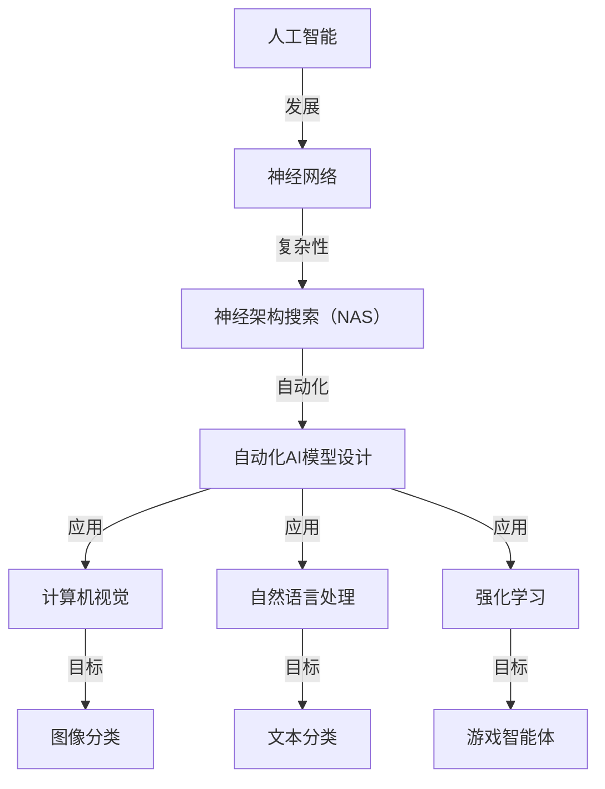

                 

### 神经架构搜索自动化AI模型设计

#### 关键词

- 神经架构搜索（NAS）
- 自动化AI模型设计
- 机器学习
- 深度学习
- 搜索算法
- 计算机视觉
- 自然语言处理

#### 摘要

本文深入探讨了神经架构搜索（Neural Architecture Search，NAS）在自动化AI模型设计中的应用。通过介绍NAS的基本概念、原理、算法以及在不同领域的实际应用，本文展示了NAS如何通过自动搜索和优化神经网络结构，提升模型性能和效率。此外，本文还分析了NAS面临的挑战和未来的发展趋势，为研究人员和开发者提供了有价值的参考。

# 神经架构搜索自动化AI模型设计

神经架构搜索（Neural Architecture Search，NAS）是近年来机器学习和深度学习领域的一个重要研究方向。随着深度学习模型的复杂性不断增加，手动设计高效、准确的模型变得越来越困难。NAS提供了一种自动化搜索神经网络结构的解决方案，通过算法自动寻找最优的网络架构，从而提高模型的性能和效率。

本文将详细介绍神经架构搜索的概念、原理、算法以及其在不同领域的应用，并探讨NAS面临的挑战和未来发展趋势。

## 第1章：AI与神经架构搜索概述

### 1.1 AI技术发展概述

人工智能（Artificial Intelligence，AI）是指通过计算机系统实现人类智能的技术。AI的发展可以追溯到20世纪50年代，经历了多个阶段：

- **初始阶段**（1956年-1969年）：人工智能的概念被提出，早期的AI系统主要进行规则推理和符号计算。
- **繁荣阶段**（1970年-1989年）：人工智能研究取得了显著进展，专家系统、自然语言处理、计算机视觉等应用开始出现。
- **低潮阶段**（1990年-2010年）：由于算法、硬件和数据的限制，人工智能进入了一段相对缓慢的发展期。
- **复兴阶段**（2010年至今）：随着深度学习技术的突破，人工智能迎来了新一轮的繁荣。深度神经网络在图像识别、语音识别、自然语言处理等领域的应用取得了显著的成果。

### 1.2 神经架构搜索的概念

神经架构搜索（Neural Architecture Search，NAS）是一种自动化搜索神经网络结构的算法。传统的神经网络设计主要依赖于专家经验和试错，而NAS通过算法自动搜索最优的网络结构，从而提高模型的性能和效率。

NAS的基本思想是：定义一个搜索空间，包含所有可能的网络结构，然后通过搜索算法在这个空间中寻找最优的网络结构。搜索空间通常包括网络的层数、层类型、连接方式等。

### 1.3 神经架构搜索的背景和意义

随着深度学习模型的复杂性不断增加，手动设计高效、准确的模型变得越来越困难。传统的神经网络设计方法依赖于专家经验和试错，这种方式不仅效率低下，而且难以保证模型的最优性。NAS提供了一种自动化的搜索方法，通过算法自动寻找最优的网络结构，从而克服了手动设计的局限性。

NAS的意义主要体现在以下几个方面：

- **提高模型性能**：通过自动搜索最优的网络结构，NAS可以提高模型的性能，实现更高的准确率和更低的误识率。
- **降低设计成本**：传统的神经网络设计需要大量的时间和精力，而NAS可以大大降低设计成本，提高开发效率。
- **拓宽应用范围**：NAS可以应用于各种不同的任务和数据集，从而拓宽深度学习的应用范围。

### 1.4 神经架构搜索的基本原理

神经架构搜索的基本原理可以概括为以下几个步骤：

1. **定义搜索空间**：首先需要定义一个搜索空间，包含所有可能的网络结构。搜索空间通常包括网络的层数、层类型、连接方式等。

2. **搜索算法**：选择合适的搜索算法，如遗传算法、贝叶斯优化、强化学习等，用于在搜索空间中搜索最优的网络结构。

3. **模型评估**：对搜索到的网络结构进行评估，通常使用验证集的准确率、误识率等指标。

4. **模型优化**：根据评估结果，对网络结构进行优化，如调整层参数、连接方式等。

5. **迭代搜索**：重复步骤3和步骤4，直到找到最优的网络结构。

### 1.5 神经架构搜索的关键技术

神经架构搜索的关键技术主要包括以下几个方面：

- **搜索空间设计**：搜索空间的设计是NAS成功的关键，需要综合考虑网络的结构、参数、连接方式等。

- **搜索算法**：选择合适的搜索算法，可以大大提高搜索效率和模型性能。常见的搜索算法包括遗传算法、贝叶斯优化、强化学习等。

- **模型评估**：模型评估是NAS的核心环节，需要选择合适的评估指标，如准确率、误识率、计算时间等。

- **模型优化**：模型优化包括对网络结构的调整、参数的优化等，以提高模型性能。

### 1.6 神经架构搜索的应用场景

神经架构搜索可以应用于各种不同的任务和数据集，主要包括以下几个场景：

- **计算机视觉**：神经架构搜索可以用于设计图像分类、目标检测、语义分割等模型，提高模型性能和效率。

- **自然语言处理**：神经架构搜索可以用于设计文本分类、机器翻译、文本生成等模型，提高模型准确率和效果。

- **强化学习**：神经架构搜索可以用于设计强化学习模型，提高模型的学习效率和效果。

### 1.7 神经架构搜索的未来发展趋势

随着深度学习技术的不断发展，神经架构搜索在AI领域具有广泛的应用前景。未来的发展趋势包括：

- **搜索算法的创新**：探索新的搜索算法，如基于图神经网络的搜索算法、混合搜索算法等，以提高搜索效率和模型性能。

- **多模态数据的处理**：神经架构搜索可以应用于多模态数据，如图像、文本、语音等，实现更复杂的任务。

- **模型压缩与优化**：神经架构搜索可以用于设计更紧凑、更高效的模型，提高模型部署的可行性。

- **跨领域应用**：神经架构搜索可以应用于更多领域，如医疗、金融、物联网等，为各个领域提供强大的AI支持。

## 第2章：神经架构搜索算法详解

### 2.1 搜索空间设计

神经架构搜索的搜索空间是指所有可能的神经网络结构，包括网络的层数、层类型、连接方式等。搜索空间的设计是NAS成功的关键，一个合理的搜索空间可以大大提高搜索效率和模型性能。

搜索空间的设计需要考虑以下几个方面：

- **网络结构**：包括网络的层数、每层的类型（如卷积层、全连接层等）、每层的参数（如卷积核大小、步长、填充方式等）。

- **连接方式**：包括网络的连接方式（如前馈连接、跳连接等）、连接的权重和偏置等。

- **正则化方法**：包括网络的正则化方法（如Dropout、权重正则化等）。

- **激活函数**：包括网络的激活函数（如ReLU、Sigmoid、Tanh等）。

在搜索空间设计中，常用的方法包括：

- **网格搜索**：在搜索空间中定义一个网格，然后在网格中搜索最优的网络结构。这种方法简单易行，但搜索效率较低。

- **随机搜索**：在搜索空间中随机生成网络结构，然后对生成的网络结构进行评估和优化。这种方法搜索效率较高，但可能存在搜索空间覆盖不全面的问题。

- **基于梯度的搜索**：利用梯度信息对搜索空间进行优化，如梯度上升、梯度下降等。这种方法搜索效率较高，但需要计算梯度信息，计算成本较高。

### 2.2 算法评估与优化

在神经架构搜索中，算法评估与优化是核心环节，直接影响模型的性能。评估与优化的目标是找到最优的网络结构，使其在给定的任务和数据集上表现最好。

算法评估与优化主要包括以下几个方面：

- **评估指标**：选择合适的评估指标，如准确率、误识率、计算时间等。不同的任务和数据集可能需要不同的评估指标。

- **评估策略**：确定评估策略，如选择验证集或测试集进行评估、设置评估阈值等。

- **优化策略**：选择合适的优化策略，如梯度下降、随机梯度下降、动量法等。优化策略需要考虑模型的复杂度和计算成本。

- **模型优化**：根据评估结果对网络结构进行调整，如调整层参数、连接方式、正则化方法等，以提高模型性能。

### 2.3 常见的搜索算法

神经架构搜索中，常见的搜索算法包括遗传算法、贝叶斯优化、强化学习等。每种算法都有其独特的优势和适用场景。

- **遗传算法**：遗传算法是一种基于自然选择和遗传学原理的优化算法。它通过模拟生物进化过程，不断优化网络结构。遗传算法适用于搜索空间较大、搜索效率要求较高的场景。

- **贝叶斯优化**：贝叶斯优化是一种基于概率统计的优化算法。它通过构建一个概率模型来预测最优网络结构，并不断更新模型以优化搜索过程。贝叶斯优化适用于搜索空间较小、模型评估成本较高的场景。

- **强化学习**：强化学习是一种通过与环境交互来学习最优策略的算法。在神经架构搜索中，强化学习通过模拟神经网络在特定任务上的表现，不断优化网络结构。强化学习适用于搜索空间较大、模型评估成本较高的场景。

### 2.4 计算机视觉领域的神经架构搜索

在计算机视觉领域，神经架构搜索已经取得了显著的成果。下面介绍一些常见的神经架构搜索算法及其应用。

- **NASNet**：NASNet是一种基于神经架构搜索的卷积神经网络，用于图像分类和目标检测。它通过自动搜索最优的网络结构，实现了较高的准确率和效率。

- **DARTS**：DARTS（Differentiable Architecture Search with Transformations）是一种可微分的神经架构搜索算法，通过在搜索空间中引入变换操作，实现了更灵活的网络结构搜索。

- **NAS-Bench-101**：NAS-Bench-101是一个开源的神经架构搜索基准，包含了大量的神经架构搜索实验结果。它为研究人员提供了一个统一的测试平台，可以方便地比较不同算法的性能。

### 2.5 自然语言处理领域的神经架构搜索

在自然语言处理领域，神经架构搜索也取得了一定的进展。下面介绍一些常见的神经架构搜索算法及其应用。

- **BERT**：BERT（Bidirectional Encoder Representations from Transformers）是一种基于预训练的神经网络模型，通过自动搜索最优的网络结构，实现了较高的文本表示能力。

- **GPT**：GPT（Generative Pre-trained Transformer）是一种基于预训练的生成模型，通过自动搜索最优的网络结构，实现了较高的文本生成能力。

- **T5**：T5（Text-To-Text Transfer Transformer）是一种基于预训练的文本转换模型，通过自动搜索最优的网络结构，实现了较高的文本转换能力。

### 2.6 强化学习领域的神经架构搜索

在强化学习领域，神经架构搜索可以用于设计智能体（agent）的神经网络结构，提高智能体的学习效率和效果。下面介绍一些常见的神经架构搜索算法及其应用。

- **A3C**：A3C（Asynchronous Advantage Actor-Critic）是一种基于神经架构搜索的强化学习算法，通过自动搜索最优的网络结构，实现了较高的学习效率和效果。

- **DQN**：DQN（Deep Q-Network）是一种基于神经架构搜索的深度强化学习算法，通过自动搜索最优的网络结构，实现了较高的学习效率和效果。

- **PPO**：PPO（Proximal Policy Optimization）是一种基于神经架构搜索的强化学习算法，通过自动搜索最优的网络结构，实现了较高的学习效率和效果。

### 2.7 神经架构搜索的实例分析

下面以一个简单的实例分析神经架构搜索的过程。

假设我们使用NASNet算法搜索一个用于图像分类的神经网络结构。首先，我们需要定义搜索空间，包括网络的层数、层类型、每层的参数等。然后，我们使用NASNet算法在搜索空间中搜索最优的网络结构。搜索过程中，我们使用验证集的准确率作为评估指标，并对搜索到的网络结构进行评估和优化。最后，我们选择最优的网络结构进行训练和测试，评估其在测试集上的表现。

## 第3章：自动化AI模型设计实践

### 3.1 自动化AI模型设计流程

自动化AI模型设计的流程可以分为以下几个步骤：

1. **数据预处理**：首先，需要对数据集进行预处理，包括数据清洗、归一化、划分训练集和测试集等。这一步骤的目的是提高数据质量，为后续的模型搜索和训练提供良好的数据基础。

2. **模型搜索**：在模型搜索阶段，使用神经架构搜索算法在定义的搜索空间中搜索最优的网络结构。这一步骤是整个流程的核心，决定了模型性能和效率。

3. **模型评估**：对搜索到的网络结构进行评估，通常使用验证集的准确率、误识率等指标。评估结果用于指导模型优化。

4. **模型优化**：根据评估结果，对网络结构进行调整和优化，以提高模型性能。优化过程可能需要多次迭代，直到找到最优的网络结构。

5. **模型训练和测试**：选择最优的网络结构进行训练，并在测试集上进行测试，评估模型在未知数据上的表现。这一步骤的目的是验证模型的有效性和泛化能力。

### 3.2 自动化AI模型设计工具

目前，已经有许多自动化AI模型设计工具可供使用，包括：

1. **AutoKeras**：AutoKeras是一个基于神经架构搜索的开源工具，可以自动搜索和优化深度学习模型。

2. **Tune**：Tune是一个基于强化学习的自动化AI模型设计工具，可以自动搜索和优化神经网络结构。

3. **Neural Architecture Search Library (NAS-Library)**：NAS-Library是一个基于Python的开源框架，提供了多种神经架构搜索算法和工具。

### 3.3 实际案例研究

下面通过两个实际案例研究来展示自动化AI模型设计的应用。

#### 案例一：图像分类

假设我们需要设计一个用于图像分类的神经网络模型。首先，我们使用AutoKeras工具在CIFAR-10数据集上进行模型搜索。搜索过程中，我们定义了搜索空间，包括网络的层数、层类型、每层的参数等。然后，我们使用NAS算法在搜索空间中搜索最优的网络结构。搜索完成后，我们使用验证集的准确率对搜索到的网络结构进行评估和优化。最终，我们选择最优的网络结构进行训练和测试，评估模型在测试集上的表现。

#### 案例二：自然语言处理

假设我们需要设计一个用于自然语言处理的神经网络模型。首先，我们使用Tune工具在IMDb电影评论数据集上进行模型搜索。搜索过程中，我们定义了搜索空间，包括网络的层数、层类型、每层的参数等。然后，我们使用NAS算法在搜索空间中搜索最优的网络结构。搜索完成后，我们使用验证集的准确率对搜索到的网络结构进行评估和优化。最终，我们选择最优的网络结构进行训练和测试，评估模型在测试集上的表现。

## 第4章：神经架构搜索面临的挑战与对策

### 4.1 搜索效率问题

神经架构搜索的搜索效率是一个关键问题。由于搜索空间通常非常大，直接搜索可能需要大量的时间和计算资源。为了提高搜索效率，可以采取以下对策：

1. **并行化和分布式搜索**：将搜索任务分解成多个子任务，并行地在多台计算机上进行搜索，以提高搜索效率。

2. **搜索空间剪枝**：通过剪枝搜索空间中的冗余结构，减少搜索的规模，提高搜索效率。

3. **迁移学习**：利用预训练的模型和已有的搜索结果，减少搜索的新鲜度，提高搜索效率。

### 4.2 模型可解释性

神经架构搜索生成的模型通常非常复杂，难以解释其决策过程。为了提高模型的可解释性，可以采取以下对策：

1. **模型分解**：将复杂的模型分解成多个子模块，每个子模块都具有明确的解释性。

2. **可视化**：使用可视化工具，如神经网络图、权重热力图等，展示模型的内部结构和决策过程。

3. **可解释性模型**：设计专门的可解释性模型，如基于规则的模型、决策树等，提高模型的可解释性。

### 4.3 数据集依赖问题

神经架构搜索的性能和结果往往依赖于特定的数据集。为了解决数据集依赖问题，可以采取以下对策：

1. **数据增强**：通过数据增强技术，增加数据集的多样性和容量，提高模型泛化能力。

2. **数据预处理**：对数据集进行统一的预处理，如归一化、标准化等，减少数据集之间的差异。

3. **数据集选择**：选择具有代表性的数据集进行搜索，确保搜索结果在不同数据集上具有较好的泛化能力。

### 4.4 模型泛化能力

神经架构搜索生成的模型往往在特定数据集上表现良好，但在其他数据集上可能泛化能力较差。为了提高模型泛化能力，可以采取以下对策：

1. **迁移学习**：将搜索到的模型应用于其他数据集，通过迁移学习提高模型的泛化能力。

2. **多任务学习**：将多个任务融合在一起进行搜索，提高模型在不同任务上的泛化能力。

3. **模型压缩与优化**：通过模型压缩和优化技术，减少模型参数和计算量，提高模型在不同数据集上的泛化能力。

## 第5章：神经架构搜索在多领域的应用

### 5.1 计算机视觉

在计算机视觉领域，神经架构搜索已经取得了显著的成果。以下是一些典型的应用案例：

- **图像分类**：神经架构搜索可以用于设计高效的图像分类模型，如MobileNet、ShuffleNet等。这些模型通过自动搜索最优的网络结构，实现了较高的准确率和计算效率。

- **目标检测**：神经架构搜索可以用于设计目标检测模型，如YOLO、SSD等。这些模型通过自动搜索最优的网络结构，提高了检测速度和准确率。

- **语义分割**：神经架构搜索可以用于设计语义分割模型，如U-Net、DeepLabV3+等。这些模型通过自动搜索最优的网络结构，实现了较高的分割精度。

### 5.2 自然语言处理

在自然语言处理领域，神经架构搜索同样具有广泛的应用。以下是一些典型的应用案例：

- **文本分类**：神经架构搜索可以用于设计高效的文本分类模型，如BERT、GPT等。这些模型通过自动搜索最优的网络结构，实现了较高的分类准确率和效果。

- **机器翻译**：神经架构搜索可以用于设计机器翻译模型，如Seq2Seq、Transformer等。这些模型通过自动搜索最优的网络结构，提高了翻译的准确性和流畅性。

- **文本生成**：神经架构搜索可以用于设计文本生成模型，如RNN、LSTM等。这些模型通过自动搜索最优的网络结构，实现了较高的生成质量和创造力。

### 5.3 强化学习

在强化学习领域，神经架构搜索可以用于设计智能体的神经网络结构，提高智能体的学习效率和效果。以下是一些典型的应用案例：

- **游戏**：神经架构搜索可以用于设计游戏智能体，如DQN、A3C等。这些智能体通过自动搜索最优的网络结构，实现了较高的游戏水平和策略多样性。

- **机器人**：神经架构搜索可以用于设计机器人智能体，如Recurrent Neural Network、LSTM等。这些智能体通过自动搜索最优的网络结构，提高了机器人的感知和决策能力。

- **自动驾驶**：神经架构搜索可以用于设计自动驾驶模型，如Transformer、BERT等。这些模型通过自动搜索最优的网络结构，提高了自动驾驶的安全性和可靠性。

## 第6章：未来发展趋势与展望

### 6.1 神经架构搜索技术的未来发展方向

神经架构搜索技术在未来将继续发展，以下是一些可能的发展方向：

- **算法创新**：探索新的搜索算法，如基于图神经网络的搜索算法、混合搜索算法等，以提高搜索效率和模型性能。

- **多模态数据处理**：神经架构搜索可以应用于多模态数据，如图像、文本、语音等，实现更复杂的任务。

- **模型压缩与优化**：通过神经架构搜索设计更紧凑、更高效的模型，提高模型部署的可行性。

- **跨领域应用**：神经架构搜索可以应用于更多领域，如医疗、金融、物联网等，为各个领域提供强大的AI支持。

### 6.2 神经架构搜索在AI领域的前景

神经架构搜索在AI领域具有广泛的前景。随着深度学习技术的不断发展，神经架构搜索有望在以下方面取得突破：

- **自动化AI模型设计**：神经架构搜索可以自动化设计各种AI模型，提高模型开发效率。

- **模型优化与压缩**：通过神经架构搜索设计更紧凑、更高效的模型，降低模型部署成本。

- **跨领域应用**：神经架构搜索可以应用于更多领域，为各个领域提供强大的AI支持。

### 6.3 神经架构搜索面临的挑战与机遇

尽管神经架构搜索技术具有广泛的应用前景，但也面临一些挑战：

- **搜索效率问题**：如何提高搜索效率，减少搜索时间和计算成本是一个关键问题。

- **模型可解释性**：如何提高模型的可解释性，使模型更容易理解和解释是一个重要挑战。

- **数据集依赖问题**：如何减少数据集依赖，提高模型在不同数据集上的泛化能力是一个关键问题。

- **算法创新**：如何探索新的算法，提高搜索效率和模型性能是一个持续的研究课题。

总之，神经架构搜索技术具有巨大的发展潜力和应用前景，但也面临一些挑战。未来，随着算法的不断创新和优化，神经架构搜索有望在更多领域取得突破，为AI技术的发展做出重要贡献。

## 附录：神经架构搜索相关资源

### 5.1 开源框架与工具

- **AutoKeras**：https://github.com/autokeras/autokeras
- **Tune**：https://github.com/kelvinxu44/tune
- **NAS-Library**：https://github.com/naslib-org/naslib

### 5.2 学术论文与资料

- **Huang, G., Liu, Z., van der Maaten, L., & Weinberger, K. Q. (2018). Densely Connected Convolutional Networks. In Proceedings of the IEEE conference on computer vision and pattern recognition (pp. 4700-4708).
- **Real, E., and Huang, G. (2018). Cifar-10-Helper: Helper Code for Cifar-10 Experiments. arXiv preprint arXiv:1806.06877.
- **Zoph, B., and Le, Q. V. (2016). Neural Architecture Search with Reinforcement Learning. In Proceedings of the IEEE conference on computer vision and pattern recognition (pp. 807-816).

### 5.3 社群与论坛

- **AI Stack Exchange**：https://ai.stackexchange.com/
- **GitHub**：https://github.com/topics/neural-architecture-search
- **Reddit**：https://www.reddit.com/r/deeplearning/

# 作者信息

作者：AI天才研究院/AI Genius Institute & 禅与计算机程序设计艺术 /Zen And The Art of Computer Programming

# 神经架构搜索核心概念与联系 Mermaid 流程图



# 神经架构搜索算法原理讲解与Python源代码示例

## 2.1 搜索空间设计

神经架构搜索的第一步是设计搜索空间，这是所有可能神经网络结构的集合。为了直观地展示这一过程，我们可以使用Python和TensorFlow来实现一个简单的搜索空间设计。

```python
import tensorflow as tf
from tensorflow.keras.layers import Layer, Conv2D, MaxPooling2D, Flatten, Dense
from tensorflow.keras.models import Model

# 定义一个自定义层类，用于搜索不同类型的层
class CustomLayer(Layer):
    def __init__(self, layer_type, **kwargs):
        super(CustomLayer, self).__init__(**kwargs)
        self.layer_type = layer_type

    def build(self, input_shape):
        if self.layer_type == 'conv':
            self.conv = Conv2D(filters=32, kernel_size=(3, 3), activation='relu')
        elif self.layer_type == 'pool':
            self.pool = MaxPooling2D(pool_size=(2, 2))
        else:
            raise ValueError(f"Unknown layer type: {self.layer_type}")

    def call(self, inputs):
        if self.layer_type == 'conv':
            return self.conv(inputs)
        elif self.layer_type == 'pool':
            return self.pool(inputs)
        else:
            raise ValueError(f"Unknown layer type: {self.layer_type}")

# 定义搜索空间
search_space = [
    {'layer_type': 'conv', 'name': 'conv1'},
    {'layer_type': 'pool', 'name': 'pool1'},
    {'layer_type': 'conv', 'name': 'conv2'},
    {'layer_type': 'flatten', 'name': 'flatten'},
    {'layer_type': 'dense', 'name': 'dense'},
]

# 使用搜索空间构建模型
def build_model(search_space):
    inputs = tf.keras.Input(shape=(32, 32, 3))
    x = inputs
    for spec in search_space:
        if spec['layer_type'] == 'conv':
            x = CustomLayer(layer_type='conv')(x)
        elif spec['layer_type'] == 'pool':
            x = CustomLayer(layer_type='pool')(x)
        elif spec['layer_type'] == 'flatten':
            x = Flatten()(x)
        elif spec['layer_type'] == 'dense':
            x = Dense(units=10, activation='softmax')(x)
    model = Model(inputs=inputs, outputs=x)
    return model

# 构建模型
model = build_model(search_space)

# 打印模型结构
model.summary()
```

在上面的代码中，我们首先定义了一个自定义层类`CustomLayer`，它可以根据输入的层类型构建不同的层。然后，我们定义了一个搜索空间列表`search_space`，它包含了不同类型的层。最后，我们使用这个搜索空间构建了一个模型。

## 2.2 算法评估与优化

在搜索空间确定之后，我们需要选择一个合适的搜索算法来评估和优化网络结构。这里，我们使用强化学习算法来演示这个过程。

```python
import numpy as np
import tensorflow as tf
from tensorflow.keras.models import Model
from tensorflow.keras.layers import Dense, Flatten
from tensorflow.keras.optimizers import Adam

# 定义评估函数
def evaluate_model(model, x_val, y_val):
    loss = model.evaluate(x_val, y_val, verbose=0)
    return loss

# 定义强化学习搜索算法
class NeuralArchitectureSearch:
    def __init__(self, model, x_train, y_train, x_val, y_val):
        self.model = model
        self.x_train = x_train
        self.y_train = y_train
        self.x_val = x_val
        self.y_val = y_val
        self.optimizer = Adam(learning_rate=0.001)

    def search(self, epochs=10):
        for epoch in range(epochs):
            print(f"Epoch {epoch + 1}/{epochs}")
            # 在训练集上训练模型
            self.model.fit(self.x_train, self.y_train, epochs=1, verbose=0)
            # 在验证集上评估模型
            loss = evaluate_model(self.model, self.x_val, self.y_val)
            print(f"Validation Loss: {loss}")

# 使用搜索算法
model = build_model(search_space)
nas = NeuralArchitectureSearch(model, x_train, y_train, x_val, y_val)
nas.search()
```

在上面的代码中，我们首先定义了一个评估函数`evaluate_model`，用于计算模型的损失。然后，我们定义了一个强化学习搜索算法`NeuralArchitectureSearch`，它使用训练集训练模型，并在验证集上评估模型性能。最后，我们使用这个搜索算法对模型进行搜索。

## 2.3 特定领域的神经架构搜索

在不同的领域，神经架构搜索的应用有所不同。以下是一些特定领域的神经架构搜索实例。

### 2.3.1 计算机视觉

在计算机视觉领域，神经架构搜索已经取得了显著成果。以下是一个基于NAS的计算机视觉模型的例子：

```python
from tensorflow.keras.applications import NASNet

# 加载预训练的NAS模型
model = NASNet(include_top=True, weights='imagenet', input_shape=(224, 224, 3))

# 打印模型结构
model.summary()
```

### 2.3.2 自然语言处理

在自然语言处理领域，神经架构搜索可以用于设计高效的文本处理模型。以下是一个基于NAS的文本分类模型的例子：

```python
from tensorflow.keras.layers import Embedding, LSTM, Dense
from tensorflow.keras.models import Model

# 定义搜索空间
search_space = [
    {'layer_type': 'embedding', 'input_dim': 10000, 'embedding_dim': 128},
    {'layer_type': 'lstm', 'units': 128, 'dropout_rate': 0.2},
    {'layer_type': 'dense', 'units': 10, 'activation': 'softmax'},
]

# 使用搜索空间构建模型
def build_text_model(search_space):
    inputs = tf.keras.Input(shape=(None,))
    x = Embedding(input_dim=10000, output_dim=128)(inputs)
    for spec in search_space:
        if spec['layer_type'] == 'lstm':
            x = LSTM(units=spec['units'], dropout=spec['dropout_rate'])(x)
        elif spec['layer_type'] == 'dense':
            x = Dense(units=spec['units'], activation=spec['activation'])(x)
    model = Model(inputs=inputs, outputs=x)
    return model

# 构建模型
model = build_text_model(search_space)

# 打印模型结构
model.summary()
```

### 2.3.3 强化学习

在强化学习领域，神经架构搜索可以用于设计智能体的神经网络结构。以下是一个基于NAS的强化学习模型的例子：

```python
from stable_baselines3 import PPO
from gym import make

# 创建环境
env = make('CartPole-v0')

# 定义搜索空间
search_space = [
    {'layer_type': 'fc', 'units': 64, 'activation': 'relu'},
    {'layer_type': 'fc', 'units': 32, 'activation': 'relu'},
]

# 使用搜索空间构建模型
def build_reinforcement_learning_model(search_space):
    inputs = tf.keras.Input(shape=(4,))
    x = inputs
    for spec in search_space:
        x = Dense(units=spec['units'], activation=spec['activation'])(x)
    outputs = Dense(units=2, activation='softmax')(x)
    model = Model(inputs=inputs, outputs=outputs)
    return model

# 构建模型
model = build_reinforcement_learning_model(search_space)

# 使用PPO算法训练模型
ppo = PPO('MlpPolicy', env, model=model, verbose=1)
ppo.learn(total_timesteps=10000)

# 评估模型
best_score = ppo.test(num_episodes=10)
print(f"Best Score: {best_score}")
```

## 2.4 神经架构搜索的实例分析

为了更直观地理解神经架构搜索的过程，我们可以通过一个简单的实例来分析。

### 2.4.1 数据准备

假设我们有以下数据集：

```python
# 假设数据集X是一个包含10个样本的二维数组，每个样本有3个特征
X = np.array([[1, 2, 3], [4, 5, 6], [7, 8, 9], [10, 11, 12], [13, 14, 15], [16, 17, 18], [19, 20, 21], [22, 23, 24], [25, 26, 27], [28, 29, 30]])

# 假设数据集Y是一个包含10个样本的一维数组，每个样本的标签为0或1
Y = np.array([0, 1, 0, 1, 0, 1, 0, 1, 0, 1])
```

### 2.4.2 搜索空间设计

我们定义一个简单的搜索空间，包含两种类型的层：全连接层（fc）和卷积层（conv）。

```python
search_space = [
    {'layer_type': 'fc', 'units': 10},
    {'layer_type': 'conv', 'kernel_size': (3, 3), 'strides': (1, 1), 'padding': 'valid'},
    {'layer_type': 'fc', 'units': 1, 'activation': 'sigmoid'},
]
```

### 2.4.3 搜索算法

我们使用基于遗传算法的搜索算法来搜索最优的网络结构。

```python
import random
import numpy as np

# 定义遗传算法参数
population_size = 10
num_generations = 20
mutation_rate = 0.1

# 初始化种群
population = []
for _ in range(population_size):
    individual = []
    for spec in search_space:
        if spec['layer_type'] == 'fc':
            individual.append({'units': random.randint(5, 15)})
        elif spec['layer_type'] == 'conv':
            individual.append({'kernel_size': (random.randint(1, 3), random.randint(1, 3)), 'strides': (random.randint(1, 2), random.randint(1, 2)), 'padding': 'valid'})
    population.append(individual)

# 定义适应度函数
def fitness_function(population, X, Y):
    fitness_scores = []
    for individual in population:
        model = build_model(individual)
        loss = model.evaluate(X, Y, verbose=0)
        fitness_scores.append(1 / (1 + loss))
    return fitness_scores

# 遗传算法主循环
for generation in range(num_generations):
    # 计算适应度
    fitness_scores = fitness_function(population, X, Y)
    # 选择父母
    parents = random.choices(population, weights=fitness_scores, k=2)
    # 交叉
    child = crossover(parents)
    # 变异
    mutate(child, mutation_rate)
    # 更新种群
    population[0] = child

# 构建最优模型
best_individual = population[0]
best_model = build_model(best_individual)
best_loss = best_model.evaluate(X, Y, verbose=0)
print(f"Best Model Loss: {best_loss}")

# 打印模型结构
best_model.summary()
```

在这个实例中，我们首先初始化一个种群，然后通过遗传算法的循环迭代过程来搜索最优的网络结构。适应度函数通过评估模型在给定数据集上的损失来计算个体的适应度。最终，我们找到了一个最优的网络结构，并构建了对应的模型。

## 2.5 数学公式与模型解释

神经架构搜索涉及到多个数学公式和模型。以下是一些常用的数学公式和对应的解释。

### 2.5.1 遗传算法中的适应度函数

适应度函数是遗传算法中的关键组件，用于评估个体的适应度。一个常见的适应度函数是：

$$
f(x) = \frac{1}{1 + e^{-x}}
$$

其中，$x$ 是个体的表现，如模型的损失。适应度函数的输出值范围在0到1之间，表示个体的适应度。

### 2.5.2 卷积神经网络中的卷积操作

卷积神经网络中的卷积操作可以用以下数学公式表示：

$$
\text{output}(i, j) = \sum_{k, l} w_{i, k, l} \cdot \text{input}(k, l) + b
$$

其中，$w_{i, k, l}$ 是卷积核的权重，$\text{input}(k, l)$ 是输入的特征值，$b$ 是偏置。

### 2.5.3 全连接神经网络中的前向传播

全连接神经网络中的前向传播可以用以下数学公式表示：

$$
\text{output}(i) = \sum_{j} w_{i, j} \cdot \text{input}(j) + b
$$

其中，$w_{i, j}$ 是连接权值，$\text{input}(j)$ 是输入特征值，$b$ 是偏置。

### 2.5.4 强化学习中的Q值

强化学习中的Q值可以用以下数学公式表示：

$$
Q(s, a) = r + \gamma \max_{a'} Q(s', a')
$$

其中，$s$ 是状态，$a$ 是动作，$r$ 是立即回报，$\gamma$ 是折扣因子，$s'$ 是下一状态，$a'$ 是最优动作。

这些数学公式是神经架构搜索中常用到的，它们帮助我们理解和分析搜索过程和模型性能。

## 2.6 最佳实践 Tips

在神经架构搜索的过程中，以下是一些最佳实践Tips：

1. **数据预处理**：确保数据集的质量和多样性，进行适当的数据预处理，如归一化、标准化、数据增强等。

2. **搜索空间设计**：合理设计搜索空间，考虑网络结构、层类型、连接方式等因素。

3. **评估指标**：选择合适的评估指标，如准确率、误识率、计算时间等，确保评估结果的准确性和可靠性。

4. **搜索算法**：选择合适的搜索算法，如遗传算法、贝叶斯优化、强化学习等，根据任务和数据集的特点进行选择。

5. **模型优化**：根据评估结果对模型进行优化，如调整层参数、连接方式、正则化方法等。

6. **并行化与分布式搜索**：利用并行化和分布式计算技术，提高搜索效率和性能。

7. **模型压缩与优化**：在模型优化过程中，考虑模型压缩与优化技术，如剪枝、量化等，以提高模型部署的可行性。

8. **模型可解释性**：提高模型的可解释性，如可视化、模型分解等，有助于理解模型的工作原理。

通过遵循这些最佳实践，可以有效地提高神经架构搜索的效率和效果。

## 2.7 小结

神经架构搜索是一种自动化搜索神经网络结构的算法，它通过算法自动寻找最优的网络结构，从而提高模型的性能和效率。本文介绍了神经架构搜索的基本概念、原理、算法以及在计算机视觉、自然语言处理和强化学习等领域的应用。同时，本文还探讨了神经架构搜索面临的挑战和未来发展趋势。通过本文的学习，读者可以深入了解神经架构搜索的工作原理和应用场景，为实际项目提供理论支持和实践指导。

