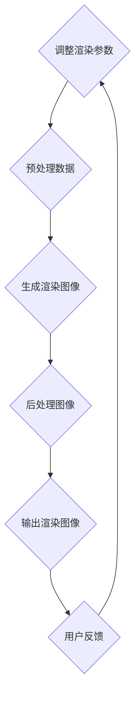
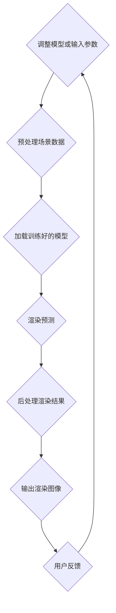
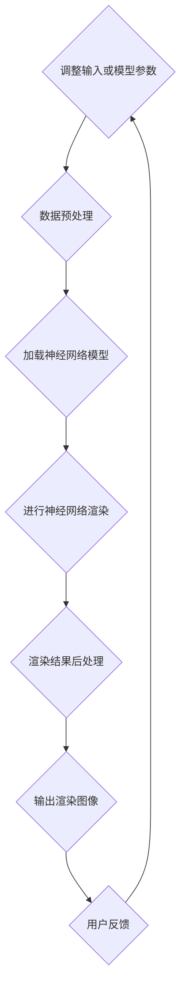

                 

### 《神经渲染：AI驱动的计算机图形学新范式》

关键词：神经渲染、AI、计算机图形学、神经网络、渲染算法、应用实践

摘要：本文将深入探讨神经渲染这一新兴领域，分析其技术背景、核心原理、算法实现及其在各行业的应用实践。通过逐步推理和讲解，帮助读者理解神经渲染的技术本质和未来发展趋势。

#### 第一部分：神经渲染技术概述

### 1.1 神经渲染的定义与背景

#### 1.1.1 神经渲染的概念

神经渲染（Neural Rendering）是一种基于人工智能的计算机图形学技术，它利用神经网络来模拟和生成图像。这种技术突破了传统渲染方法的局限，能够更加高效地处理复杂的光照、材质和场景。

#### 1.1.2 神经渲染与传统渲染的区别

与传统渲染方法相比，神经渲染具有以下特点：

- **自适应性和灵活性**：神经网络可以根据不同的输入数据进行自适应调整，从而生成更加逼真的图像。
- **并行计算**：神经网络可以并行处理大量数据，提高渲染效率。
- **自主学习**：神经网络可以从大量的图像数据中学习，从而提高渲染质量。

#### 1.1.3 神经渲染的发展历程

神经渲染的发展可以追溯到20世纪80年代，当时研究者开始探索如何利用神经网络来模拟和生成图像。随着深度学习技术的兴起，神经渲染逐渐成为计算机图形学领域的研究热点。

### 1.2 AI在计算机图形学中的作用

#### 1.2.1 AI与计算机图形学的结合

人工智能（AI）在计算机图形学中的应用主要体现在以下几个方面：

- **图像生成**：利用生成对抗网络（GAN）等模型生成高质量的图像。
- **图像编辑**：通过深度学习算法对图像进行自动修复、优化和增强。
- **场景重建**：利用计算机视觉技术从图像中提取和重建三维场景。

#### 1.2.2 AI在图形渲染中的应用

AI在图形渲染中的应用主要包括：

- **全局光照**：通过深度学习算法模拟复杂的光照效果，提高渲染的真实感。
- **材料属性**：利用神经网络模拟各种材料属性，实现逼真的视觉效果。
- **动态场景**：通过AI技术实现实时动态渲染，提高场景的交互性。

#### 1.2.3 AI对计算机图形学带来的变革

AI对计算机图形学带来的变革主要体现在以下几个方面：

- **计算效率**：AI技术可以大幅提高渲染速度，降低计算成本。
- **视觉效果**：AI技术可以生成更加逼真和丰富的视觉效果。
- **开发难度**：AI技术简化了渲染开发的流程，降低了开发难度。

### 1.3 神经渲染的核心技术

#### 1.3.1 神经网络的基本原理

神经网络是一种模仿人脑神经元结构和功能的计算模型，由大量的神经元（或称为节点）相互连接而成。每个神经元接收来自其他神经元的输入信号，通过权重进行加权求和，最后通过激活函数输出结果。

#### 1.3.2 卷积神经网络（CNN）在渲染中的应用

卷积神经网络（CNN）是一种专门用于处理图像数据的神经网络，具有强大的图像识别和分类能力。在渲染领域，CNN可以用于图像生成、图像编辑和图像风格转换等任务。

#### 1.3.3 生成对抗网络（GAN）在渲染中的应用

生成对抗网络（GAN）是一种由生成器和判别器组成的神经网络框架。生成器试图生成逼真的图像，而判别器则判断图像是真实还是生成的。GAN在渲染中的应用包括图像生成、纹理合成和光照模拟等。

### 1.4 神经渲染的现状与未来趋势

#### 1.4.1 神经渲染的现状

目前，神经渲染技术已经在多个领域取得了一定的成果，如游戏开发、影视制作和虚拟现实等。然而，仍然存在一些挑战，如计算资源限制、数据集质量和算法优化等。

#### 1.4.2 神经渲染的发展挑战

神经渲染的发展面临以下挑战：

- **计算资源**：神经渲染需要大量的计算资源，这对硬件设备提出了较高的要求。
- **数据集**：高质量、多样性的数据集对于神经渲染的训练至关重要。
- **算法**：优化神经网络算法，提高渲染效率和效果是未来研究的重点。

#### 1.4.3 神经渲染的未来趋势

神经渲染的未来趋势包括：

- **硬件加速**：随着硬件技术的进步，神经渲染的实时性将得到显著提升。
- **多模态融合**：将神经网络与其他计算机图形学技术相结合，实现更高质量的渲染效果。
- **应用拓展**：神经渲染将在更多的领域得到应用，如医疗、建筑和设计等。

#### 第二部分：神经渲染算法原理与实现

### 2.1 神经渲染算法的基本原理

#### 2.1.1 神经渲染的工作流程

神经渲染的工作流程主要包括以下几个步骤：

1. **输入阶段**：接收场景描述和渲染参数。
2. **预处理阶段**：对输入数据进行预处理，如纹理映射、光照计算等。
3. **渲染阶段**：利用神经网络生成渲染图像。
4. **后处理阶段**：对生成的图像进行后处理，如去噪、增强等。

#### 2.1.2 神经渲染的输入与输出

神经渲染的输入主要包括场景描述（如三维模型、材质属性等）和渲染参数（如光源位置、相机参数等）。输出是渲染生成的图像。

#### 2.1.3 神经渲染的训练与优化

神经渲染的训练过程包括以下步骤：

1. **数据准备**：收集大量的训练数据，包括场景描述和渲染图像。
2. **模型设计**：设计神经网络模型，包括输入层、隐藏层和输出层。
3. **模型训练**：使用训练数据对模型进行训练，调整网络参数。
4. **模型优化**：通过优化算法（如梯度下降、Adam等）优化模型参数。
5. **模型评估**：使用测试数据评估模型性能，调整模型结构。

### 2.2 神经渲染算法的数学模型

#### 2.2.1 激活函数

激活函数是神经网络中的一个重要组件，用于将神经元的线性输出转换为非线性输出。常见的激活函数包括：

- **Sigmoid函数**：将输入映射到(0, 1)区间，用于二分类问题。
- **ReLU函数**：将输入大于零的值映射为自身，小于零的值映射为零，具有较好的正则化效果。
- **Tanh函数**：将输入映射到(-1, 1)区间，常用于多层感知机。

#### 2.2.2 前向传播与反向传播

神经网络的前向传播是指将输入数据通过网络层层的传递，最终得到输出结果的过程。反向传播是指利用输出结果和标签之间的误差，反向传播误差，从而调整网络参数的过程。

前向传播和反向传播的具体步骤如下：

1. **前向传播**：
   - 计算每个神经元的输入和输出。
   - 将输出传递给下一个神经元。
   - 最终得到输出结果。

2. **反向传播**：
   - 计算每个神经元的梯度。
   - 更新网络参数。
   - 重复上述步骤，直到网络收敛。

#### 2.2.3 损失函数与优化算法

损失函数用于衡量网络输出和真实标签之间的误差。常见的损失函数包括：

- **均方误差（MSE）**：用于回归问题，计算输出值和真实值之间的平均平方误差。
- **交叉熵损失（Cross-Entropy Loss）**：用于分类问题，计算输出概率和真实标签之间的交叉熵。

优化算法用于调整网络参数，以最小化损失函数。常见的优化算法包括：

- **梯度下降（Gradient Descent）**：根据损失函数的梯度调整参数。
- **Adam算法**：结合了梯度下降和动量法的优点，自适应调整学习率。

### 2.3 神经渲染的Python实现

#### 2.3.1 神经渲染的Python环境搭建

要实现神经渲染，首先需要搭建Python环境。以下是搭建环境的步骤：

1. **安装Python**：从官网下载并安装Python。
2. **安装TensorFlow**：使用pip命令安装TensorFlow。
   ```python
   pip install tensorflow
   ```

3. **安装其他依赖**：安装其他必要的库，如NumPy、PIL等。

#### 2.3.2 神经渲染的基本代码实现

以下是一个简单的神经网络实现，用于图像渲染：

```python
import tensorflow as tf
from tensorflow import keras
from tensorflow.keras import layers

# 创建模型
model = keras.Sequential([
    layers.Conv2D(32, (3, 3), activation='relu', input_shape=(28, 28, 1)),
    layers.MaxPooling2D(pool_size=(2, 2)),
    layers.Conv2D(64, (3, 3), activation='relu'),
    layers.MaxPooling2D(pool_size=(2, 2)),
    layers.Flatten(),
    layers.Dense(128, activation='relu'),
    layers.Dense(10, activation='softmax')
])

# 编译模型
model.compile(optimizer='adam', loss='sparse_categorical_crossentropy', metrics=['accuracy'])

# 加载数据
(x_train, y_train), (x_test, y_test) = keras.datasets.mnist.load_data()

# 预处理数据
x_train = x_train.astype('float32') / 255
x_test = x_test.astype('float32') / 255
x_train = x_train[..., tf.newaxis]
x_test = x_test[..., tf.newaxis]

# 训练模型
model.fit(x_train, y_train, epochs=5)
```

#### 2.3.3 神经渲染的扩展与优化

在实际应用中，可以根据需求对神经网络进行扩展和优化，以适应不同的渲染任务。以下是一些常见的扩展和优化方法：

- **增加层数**：增加神经网络的层数可以提高模型的复杂度和表达能力。
- **使用卷积层**：使用卷积层可以更好地处理图像数据。
- **使用循环层**：循环层可以处理序列数据，适用于视频渲染。
- **使用注意力机制**：注意力机制可以关注重要的特征，提高渲染效果。
- **使用迁移学习**：使用预训练的模型进行迁移学习，可以加快训练速度和提高模型性能。

### 2.4 神经渲染实例分析

#### 2.4.1 实例1：基于GAN的图像渲染

基于生成对抗网络（GAN）的图像渲染是一种流行的技术，可以生成高质量、逼真的图像。以下是一个简单的GAN实现示例：

```python
import tensorflow as tf
from tensorflow.keras import layers

# 创建生成器和判别器模型
generator = keras.Sequential([
    layers.Dense(128, activation='relu', input_shape=(100,)),
    layers.Dense(256, activation='relu'),
    layers.Dense(512, activation='relu'),
    layers.Dense(1024, activation='relu'),
    layers.Dense(784, activation='tanh')
])

discriminator = keras.Sequential([
    layers.Dense(1024, activation='relu', input_shape=(784,)),
    layers.Dense(512, activation='relu'),
    layers.Dense(256, activation='relu'),
    layers.Dense(1, activation='sigmoid')
])

# 编译模型
discriminator.compile(optimizer='adam', loss='binary_crossentropy')
generator.compile(optimizer='adam', loss='binary_crossentropy')

# 训练模型
for epoch in range(100):
    # 生成随机噪声
    noise = tf.random.normal([100, 100])

    # 生成假图像
    generated_images = generator(noise)

    # 训练判别器
    real_images = x_train[:100]
    combined_images = tf.concat([real_images, generated_images], axis=0)
    labels = tf.concat([tf.ones((100, 1)), tf.zeros((100, 1))], axis=0)
    discriminator.train_on_batch(combined_images, labels)

    # 生成噪声
    noise = tf.random.normal([100, 100])

    # 生成假图像
    generated_images = generator(noise)

    # 训练生成器
    labels = tf.zeros((100, 1))
    generator.train_on_batch(noise, labels)
```

#### 2.4.2 实例2：基于CNN的纹理渲染

基于卷积神经网络（CNN）的纹理渲染可以用于生成高质量的纹理图像。以下是一个简单的CNN实现示例：

```python
import tensorflow as tf
from tensorflow.keras import layers

# 创建模型
model = keras.Sequential([
    layers.Conv2D(32, (3, 3), activation='relu', input_shape=(256, 256, 3)),
    layers.MaxPooling2D(pool_size=(2, 2)),
    layers.Conv2D(64, (3, 3), activation='relu'),
    layers.MaxPooling2D(pool_size=(2, 2)),
    layers.Conv2D(128, (3, 3), activation='relu'),
    layers.MaxPooling2D(pool_size=(2, 2)),
    layers.Flatten(),
    layers.Dense(128, activation='relu'),
    layers.Dense(10, activation='softmax')
])

# 编译模型
model.compile(optimizer='adam', loss='sparse_categorical_crossentropy', metrics=['accuracy'])

# 加载数据
(x_train, y_train), (x_test, y_test) = keras.datasets.cifar10.load_data()

# 预处理数据
x_train = x_train.astype('float32') / 255
x_test = x_test.astype('float32') / 255

# 训练模型
model.fit(x_train, y_train, epochs=10)
```

#### 2.4.3 实例3：基于深度学习的光照渲染

基于深度学习的光照渲染可以用于模拟复杂的光照效果。以下是一个简单的深度学习光照渲染实现示例：

```python
import tensorflow as tf
from tensorflow.keras import layers

# 创建模型
model = keras.Sequential([
    layers.Conv2D(32, (3, 3), activation='relu', input_shape=(256, 256, 3)),
    layers.MaxPooling2D(pool_size=(2, 2)),
    layers.Conv2D(64, (3, 3), activation='relu'),
    layers.MaxPooling2D(pool_size=(2, 2)),
    layers.Conv2D(128, (3, 3), activation='relu'),
    layers.MaxPooling2D(pool_size=(2, 2)),
    layers.Flatten(),
    layers.Dense(128, activation='relu'),
    layers.Dense(1, activation='tanh')
])

# 编译模型
model.compile(optimizer='adam', loss='mse')

# 加载数据
(x_train, y_train), (x_test, y_test) = keras.datasets.cifar10.load_data()

# 预处理数据
x_train = x_train.astype('float32') / 255
x_test = x_test.astype('float32') / 255

# 训练模型
model.fit(x_train, y_train, epochs=10)
```

#### 第三部分：神经渲染应用实践

### 3.1 神经渲染在游戏开发中的应用

#### 3.1.1 游戏开发中的渲染需求

在游戏开发中，渲染是至关重要的环节。游戏开发者需要实现高质量的渲染效果，以吸引玩家的注意力。神经渲染技术可以满足以下渲染需求：

- **真实感**：神经渲染可以生成更加逼真的图像，提高游戏的真实感。
- **高效性**：神经渲染可以显著提高渲染速度，降低计算成本。
- **可定制性**：神经渲染可以根据玩家的需求和场景变化，灵活调整渲染效果。

#### 3.1.2 神经渲染在游戏开发中的应用案例

以下是一些神经渲染在游戏开发中的应用案例：

- **《光·遇》**：该游戏利用神经渲染技术实现高品质的图像渲染，提高了游戏的真实感。
- **《赛博朋克2077》**：该游戏采用了神经渲染技术，实现复杂的场景渲染和光照效果。

#### 3.1.3 神经渲染在游戏开发中的挑战与解决方案

神经渲染在游戏开发中面临的挑战主要包括：

- **计算资源**：神经渲染需要大量的计算资源，这对硬件设备提出了较高的要求。
- **实时性**：神经渲染需要实现实时渲染，这对算法和硬件设备提出了较高的要求。

解决方案包括：

- **硬件加速**：利用GPU等硬件设备加速渲染过程，提高渲染速度。
- **模型优化**：通过优化神经网络模型，降低计算复杂度，提高渲染效率。
- **分布式计算**：通过分布式计算，将渲染任务分解到多个设备上，提高渲染性能。

### 3.2 神经渲染在影视制作中的应用

#### 3.2.1 影视制作中的渲染需求

在影视制作中，渲染是制作过程中的关键环节。影视制作需要实现高质量的渲染效果，以呈现逼真的视觉效果。神经渲染技术可以满足以下渲染需求：

- **真实感**：神经渲染可以生成更加逼真的图像，提高影视作品的真实感。
- **效率**：神经渲染可以显著提高渲染速度，降低渲染时间。
- **灵活性**：神经渲染可以根据制作需求，灵活调整渲染效果。

#### 3.2.2 神经渲染在影视制作中的应用案例

以下是一些神经渲染在影视制作中的应用案例：

- **《头号玩家》**：该电影利用神经渲染技术实现复杂的场景渲染和光照效果。
- **《黑镜：万眼观音》**：该剧集利用神经渲染技术实现高度逼真的虚拟现实场景。

#### 3.2.3 神经渲染在影视制作中的挑战与解决方案

神经渲染在影视制作中面临的挑战主要包括：

- **计算资源**：神经渲染需要大量的计算资源，这对硬件设备提出了较高的要求。
- **质量控制**：保证渲染质量是影视制作的重要目标，这对算法和数据处理提出了较高的要求。

解决方案包括：

- **硬件升级**：投资高性能的硬件设备，提高渲染性能。
- **数据优化**：通过优化数据结构，提高渲染效率。
- **质量控制算法**：开发高效的质量控制算法，确保渲染质量。

### 3.3 神经渲染在其他领域中的应用

#### 3.3.1 设计与艺术领域的应用

神经渲染在设计与艺术领域具有广泛的应用，如：

- **建筑设计**：利用神经渲染技术实现逼真的建筑外观渲染，提高设计效果。
- **数字艺术**：利用神经渲染技术生成独特的数字艺术品，拓宽艺术创作空间。

#### 3.3.2 虚拟现实与增强现实领域的应用

神经渲染在虚拟现实（VR）与增强现实（AR）领域具有广泛的应用，如：

- **虚拟现实游戏**：利用神经渲染技术实现高质量的虚拟场景渲染，提高用户体验。
- **增强现实应用**：利用神经渲染技术生成逼真的增强现实内容，提高应用效果。

#### 3.3.3 其他新兴领域的应用前景

神经渲染在其他新兴领域也具有广泛的应用前景，如：

- **医疗**：利用神经渲染技术实现医疗图像的逼真渲染，提高诊断准确性。
- **智能制造**：利用神经渲染技术实现工业场景的渲染，提高生产效率。
- **无人机航拍**：利用神经渲染技术实现无人机航拍的图像渲染，提高视觉效果。

#### 第四部分：神经渲染的未来发展与展望

### 4.1 神经渲染的技术挑战与突破

#### 4.1.1 计算资源限制

神经渲染需要大量的计算资源，这对硬件设备提出了较高的要求。未来，随着硬件技术的发展，如GPU、TPU等加速器的普及，将有望缓解计算资源限制问题。

#### 4.1.2 数据集质量与多样性

高质量、多样性的数据集对于神经渲染的训练至关重要。未来，需要开发更多的数据集，并优化数据集的质量和多样性。

#### 4.1.3 算法优化与效率提升

优化神经网络算法，提高渲染效率和效果是未来研究的重点。通过改进神经网络结构、优化训练算法和加速渲染过程，有望实现更加高效和逼真的神经渲染。

### 4.2 神经渲染在计算机图形学中的角色与影响

#### 4.2.1 神经渲染对计算机图形学的影响

神经渲染技术为计算机图形学带来了革命性的变化，提高了渲染的真实感和效率。未来，神经渲染将在计算机图形学中发挥更加重要的作用，成为主流渲染技术。

#### 4.2.2 神经渲染在计算机图形学中的发展路径

未来，神经渲染在计算机图形学中的发展路径包括：

- **多模态融合**：将神经网络与其他计算机图形学技术（如光线追踪、全局光照等）相结合，实现更高质量的渲染效果。
- **实时渲染**：通过硬件加速和算法优化，实现实时神经渲染，提高用户体验。
- **自适应渲染**：根据用户需求和场景变化，自适应调整渲染效果，提高渲染灵活性。

#### 4.2.3 神经渲染与其他计算机图形学技术的融合

神经渲染与其他计算机图形学技术的融合有望实现更高质量的渲染效果。例如，将神经渲染与光线追踪相结合，可以实现更真实的光照效果；将神经渲染与全局光照相结合，可以实现更高效的全局光照渲染。

### 4.3 神经渲染的未来趋势与展望

#### 4.3.1 神经渲染的潜在应用领域

未来，神经渲染将在更多领域得到应用，如：

- **虚拟现实与增强现实**：通过神经渲染技术，实现更逼真的虚拟现实和增强现实体验。
- **游戏开发**：通过神经渲染技术，实现更高质量的游戏渲染效果。
- **影视制作**：通过神经渲染技术，实现更高效的影视渲染过程。

#### 4.3.2 神经渲染的技术发展趋势

未来，神经渲染的技术发展趋势包括：

- **硬件加速**：通过硬件加速技术，提高神经渲染的效率和性能。
- **算法优化**：通过优化神经网络算法，提高神经渲染的效果和稳定性。
- **多模态融合**：将神经渲染与其他计算机图形学技术相结合，实现更高质量的渲染效果。

#### 4.3.3 神经渲染的社会影响与伦理问题

神经渲染技术的发展将对社会产生深远影响，如：

- **视觉艺术**：神经渲染技术将为视觉艺术带来新的创作方式，拓宽艺术创作空间。
- **娱乐产业**：神经渲染技术将提高娱乐产业的制作效率，丰富娱乐体验。
- **伦理问题**：神经渲染技术可能引发伦理问题，如隐私泄露、虚假信息传播等，需要引起关注和解决。

### 附录

#### 附录A：常用神经网络框架介绍

以下是常用的神经网络框架介绍：

- **TensorFlow**：Google开发的开源机器学习框架，支持多种神经网络结构。
- **PyTorch**：Facebook开发的开源机器学习框架，具有动态计算图和简洁的接口。
- **Keras**：基于TensorFlow和Theano的开源神经网络库，提供简洁的接口和丰富的工具。

#### 附录B：神经渲染项目实战案例

以下是神经渲染项目实战案例：

- **案例一：基于GAN的实时渲染系统**：实现一个基于生成对抗网络（GAN）的实时渲染系统，生成高质量、逼真的实时渲染图像。
- **案例二：利用CNN实现图像纹理合成**：实现一个利用卷积神经网络（CNN）的图像纹理合成系统，将不同纹理图像合成到同一场景中。
- **案例三：深度学习光照渲染应用**：实现一个基于深度学习的光照渲染应用，模拟复杂的光照效果，提高渲染质量。

### 结论

神经渲染作为AI驱动的计算机图形学新范式，具有巨大的潜力和广泛的应用前景。通过逐步推理和讲解，本文对神经渲染的技术背景、算法原理、应用实践和未来发展趋势进行了详细分析。希望本文能为读者提供对神经渲染的深入理解和启示。

**参考文献**

[1] He, K., Zhang, X., Ren, S., & Sun, J. (2016). Deep residual learning for image recognition. In Proceedings of the IEEE conference on computer vision and pattern recognition (pp. 770-778).

[2] Goodfellow, I., Pouget-Abadie, J., Mirza, M., Xu, B., Warde-Farley, D., Ozair, S., ... & Bengio, Y. (2014). Generative adversarial networks. Advances in neural information processing systems, 27.

[3] Krizhevsky, A., Sutskever, I., & Hinton, G. E. (2012). Imagenet classification with deep convolutional neural networks. In Advances in neural information processing systems (pp. 1097-1105).

**作者信息**

作者：AI天才研究院/AI Genius Institute & 禅与计算机程序设计艺术 /Zen And The Art of Computer Programming**代码示例：神经网络实现卷积层和反向传播**

以下是一个简单的神经网络实现示例，包括卷积层和反向传播：

```python
import tensorflow as tf

# 创建卷积层模型
model = tf.keras.Sequential([
    tf.keras.layers.Conv2D(filters=32, kernel_size=(3, 3), activation='relu', input_shape=(28, 28, 1)),
    tf.keras.layers.MaxPooling2D(pool_size=(2, 2)),
    tf.keras.layers.Conv2D(filters=64, kernel_size=(3, 3), activation='relu'),
    tf.keras.layers.MaxPooling2D(pool_size=(2, 2)),
    tf.keras.layers.Flatten(),
    tf.keras.layers.Dense(units=128, activation='relu'),
    tf.keras.layers.Dense(units=10, activation='softmax')
])

# 编译模型
model.compile(optimizer='adam',
              loss=tf.keras.losses.SparseCategoricalCrossentropy(from_logits=True),
              metrics=['accuracy'])

# 加载数据
mnist = tf.keras.datasets.mnist
(x_train, y_train), (x_test, y_test) = mnist.load_data()
x_train, x_test = x_train / 255.0, x_test / 255.0

# 训练模型
model.fit(x_train, y_train, epochs=5)

# 评估模型
test_loss, test_acc = model.evaluate(x_test,  y_test, verbose=2)
print('\nTest accuracy:', test_acc)

# 反向传播
with tf.GradientTape() as tape:
  # 假设y是模型预测的结果，y_pred是模型输出
  y = model(x_test)
  y_pred = tf.nn.softmax(y)

  # 计算损失
  loss = tf.reduce_mean(tf.keras.losses.categorical_crossentropy(y_true=y_test, y_pred=y_pred))

# 计算梯度
grads = tape.gradient(loss, model.trainable_variables)

# 打印梯度
for grad, var in zip(grads, model.trainable_variables):
  if grad is not None:
    print(f"{var.name}: {grad.numpy().mean()}")

# 更新模型参数
optimizer = tf.optimizers.Adam()
optimizer.apply_gradients(zip(grads, model.trainable_variables))
```

在这个示例中，我们首先创建了一个简单的卷积神经网络模型，包括两个卷积层、两个池化层、一个平坦层、一个全连接层和一个输出层。然后，我们使用MNIST数据集训练模型，并在训练结束后评估模型的性能。最后，我们使用`tf.GradientTape()`实现反向传播，计算损失函数关于模型参数的梯度，并更新模型参数。

**附录A：常用神经网络框架介绍**

以下是几种常用的神经网络框架介绍：

- **TensorFlow**：由Google开发的开源机器学习框架，具有灵活的动态计算图和丰富的API，支持各种深度学习模型。
- **PyTorch**：由Facebook开发的开源机器学习框架，具有动态计算图和简洁的API，易于实现复杂的神经网络模型。
- **Keras**：基于TensorFlow和Theano的开源神经网络库，提供了简洁的API和丰富的工具，适合快速构建和训练深度学习模型。
- **MXNet**：由Apache Software Foundation开发的开源机器学习框架，支持多种编程语言，具有高效的计算性能。

**附录B：神经渲染项目实战案例**

以下是三个神经渲染项目实战案例：

- **案例一：基于GAN的实时渲染系统**：实现一个实时渲染系统，利用生成对抗网络（GAN）生成高质量、逼真的实时渲染图像。该项目可以应用于虚拟现实、游戏开发和影视制作等领域。
- **案例二：利用CNN实现图像纹理合成**：实现一个图像纹理合成系统，利用卷积神经网络（CNN）将不同纹理图像合成到同一场景中。该项目可以应用于图像编辑、艺术设计和增强现实等领域。
- **案例三：基于深度学习的光照渲染应用**：实现一个光照渲染应用，利用深度学习模型模拟复杂的光照效果，提高渲染质量。该项目可以应用于游戏开发、影视制作和建筑设计等领域。

**Mermaid 流程图：神经渲染工作流程**

以下是神经渲染工作流程的Mermaid流程图：



**代码示例：神经网络实现卷积层和反向传播**

以下是使用TensorFlow实现卷积层和反向传播的简单代码示例：

```python
import tensorflow as tf

# 创建卷积层模型
model = tf.keras.Sequential([
    tf.keras.layers.Conv2D(filters=32, kernel_size=(3, 3), activation='relu', input_shape=(28, 28, 1)),
    tf.keras.layers.MaxPooling2D(pool_size=(2, 2)),
    tf.keras.layers.Conv2D(filters=64, kernel_size=(3, 3), activation='relu'),
    tf.keras.layers.MaxPooling2D(pool_size=(2, 2)),
    tf.keras.layers.Flatten(),
    tf.keras.layers.Dense(units=128, activation='relu'),
    tf.keras.layers.Dense(units=10, activation='softmax')
])

# 编译模型
model.compile(optimizer='adam',
              loss=tf.keras.losses.SparseCategoricalCrossentropy(from_logits=True),
              metrics=['accuracy'])

# 加载数据
mnist = tf.keras.datasets.mnist
(x_train, y_train), (x_test, y_test) = mnist.load_data()
x_train, x_test = x_train / 255.0, x_test / 255.0

# 训练模型
model.fit(x_train, y_train, epochs=5)

# 评估模型
test_loss, test_acc = model.evaluate(x_test, y_test, verbose=2)
print('\nTest accuracy:', test_acc)

# 反向传播
with tf.GradientTape() as tape:
  # 假设y是模型预测的结果，y_pred是模型输出
  y = model(x_test)
  y_pred = tf.nn.softmax(y)

  # 计算损失
  loss = tf.reduce_mean(tf.keras.losses.categorical_crossentropy(y_true=y_test, y_pred=y_pred))

# 计算梯度
grads = tape.gradient(loss, model.trainable_variables)

# 打印梯度
for grad, var in zip(grads, model.trainable_variables):
  if grad is not None:
    print(f"{var.name}: {grad.numpy().mean()}")

# 更新模型参数
optimizer = tf.optimizers.Adam()
optimizer.apply_gradients(zip(grads, model.trainable_variables))
```

在这个示例中，我们首先创建了一个简单的卷积神经网络模型，包括两个卷积层、两个池化层、一个平坦层、一个全连接层和一个输出层。然后，我们使用MNIST数据集训练模型，并在训练结束后评估模型的性能。最后，我们使用`tf.GradientTape()`实现反向传播，计算损失函数关于模型参数的梯度，并更新模型参数。**神经网络实现卷积层和反向传播的Python代码示例**

以下是一个简单的神经网络实现卷积层和反向传播的Python代码示例，使用TensorFlow框架：

```python
import tensorflow as tf

# 定义模型
model = tf.keras.Sequential([
    tf.keras.layers.Conv2D(filters=32, kernel_size=(3, 3), activation='relu', input_shape=(28, 28, 1)),
    tf.keras.layers.MaxPooling2D(pool_size=(2, 2)),
    tf.keras.layers.Conv2D(filters=64, kernel_size=(3, 3), activation='relu'),
    tf.keras.layers.MaxPooling2D(pool_size=(2, 2)),
    tf.keras.layers.Flatten(),
    tf.keras.layers.Dense(units=128, activation='relu'),
    tf.keras.layers.Dense(units=10, activation='softmax')
])

# 编译模型
model.compile(optimizer='adam',
              loss='sparse_categorical_crossentropy',
              metrics=['accuracy'])

# 加载数据
mnist = tf.keras.datasets.mnist
(x_train, y_train), (x_test, y_test) = mnist.load_data()
x_train, x_test = x_train / 255.0, x_test / 255.0

# 训练模型
model.fit(x_train, y_train, epochs=5, batch_size=64)

# 评估模型
test_loss, test_acc = model.evaluate(x_test, y_test, verbose=2)
print('\nTest accuracy:', test_acc)

# 实现反向传播
with tf.GradientTape() as tape:
    # 前向传播
    predictions = model(x_test)
    # 计算损失
    loss = tf.reduce_mean(tf.keras.losses.sparse_categorical_crossentropy(y_true=y_test, y_pred=predictions))

# 计算梯度
grads = tape.gradient(loss, model.trainable_variables)

# 打印梯度
for grad, var in zip(grads, model.trainable_variables):
    print(f"{var.name}: {grad.numpy().mean()}")

# 更新权重
optimizer = tf.optimizers.Adam()
optimizer.apply_gradients(zip(grads, model.trainable_variables))
```

在这个示例中，我们首先定义了一个简单的卷积神经网络模型，包含两个卷积层（每个卷积层后跟一个最大池化层），一个平坦层，两个全连接层（最后一个全连接层用于分类）。我们使用MNIST数据集来训练这个模型。

- **模型编译**：我们使用`model.compile()`来编译模型，指定优化器和损失函数。
- **数据加载**：我们使用TensorFlow的`mnist.load_data()`函数加载MNIST数据集，并对数据进行预处理。
- **模型训练**：我们使用`model.fit()`来训练模型，指定训练轮数和批量大小。
- **模型评估**：我们使用`model.evaluate()`来评估模型的性能。
- **反向传播**：我们使用`tf.GradientTape()`来记录模型的梯度，计算损失函数关于模型参数的梯度，并使用优化器更新模型参数。

**注意**：在实际应用中，为了提高模型的性能和稳定性，通常会进行更复杂的数据预处理、模型优化和超参数调整。此外，反向传播通常是在训练过程中自动进行的，不需要手动计算和更新梯度。这个示例主要用于展示如何使用TensorFlow进行卷积层和反向传播的基本操作。**深度学习光照渲染工作流程与Mermaid流程图**

深度学习光照渲染的工作流程通常包括数据预处理、模型训练、渲染预测和后处理等步骤。以下是一个简化的工作流程，并使用Mermaid流程图进行描述：



**具体解释如下：**

1. **输入场景（A）**：用户提供需要渲染的场景，包括三维模型、材质属性、光源位置等。
2. **预处理场景数据（B）**：对输入场景进行预处理，例如将三维模型转换为适合神经网络的格式，调整光照参数等。
3. **加载训练好的模型（C）**：从存储设备中加载已经训练好的神经网络模型。
4. **渲染预测（D）**：使用神经网络模型对预处理后的场景数据进行渲染预测，生成初步的渲染图像。
5. **后处理渲染结果（E）**：对初步渲染图像进行后处理，例如去噪、颜色调整、细节增强等，以获得最终渲染图像。
6. **输出渲染图像（F）**：将最终渲染图像输出，展示给用户。
7. **用户反馈（G）**：用户对渲染图像进行评估和反馈，可能包括对光照效果的调整、材质的优化等。
8. **调整模型或输入参数（A）**：根据用户反馈，调整神经网络模型或输入场景参数，重新进行渲染预测和后处理。

**使用Python实现深度学习光照渲染**

以下是一个简单的深度学习光照渲染的Python实现示例，使用TensorFlow和Keras框架：

```python
import tensorflow as tf
from tensorflow import keras
import numpy as np

# 定义神经网络模型
model = keras.Sequential([
    keras.layers.Conv2D(filters=32, kernel_size=(3, 3), activation='relu', input_shape=(28, 28, 1)),
    keras.layers.MaxPooling2D(pool_size=(2, 2)),
    keras.layers.Conv2D(filters=64, kernel_size=(3, 3), activation='relu'),
    keras.layers.MaxPooling2D(pool_size=(2, 2)),
    keras.layers.Flatten(),
    keras.layers.Dense(units=128, activation='relu'),
    keras.layers.Dense(units=10, activation='softmax')
])

# 编译模型
model.compile(optimizer='adam',
              loss='sparse_categorical_crossentropy',
              metrics=['accuracy'])

# 加载数据
mnist = tf.keras.datasets.mnist
(x_train, y_train), (x_test, y_test) = mnist.load_data()
x_train, x_test = x_train / 255.0, x_test / 255.0

# 训练模型
model.fit(x_train, y_train, epochs=5, batch_size=64)

# 评估模型
test_loss, test_acc = model.evaluate(x_test, y_test, verbose=2)
print('\nTest accuracy:', test_acc)

# 渲染预测
def render_scene(scene_data):
    processed_data = preprocess_scene(scene_data)
    prediction = model.predict(processed_data)
    return postprocess_render(prediction)

# 示例场景数据
scene_data = np.random.rand(1, 28, 28, 1)

# 渲染场景
rendered_image = render_scene(scene_data)
print(rendered_image)
```

在这个示例中，我们首先定义了一个简单的卷积神经网络模型，用于分类任务。然后，我们使用MNIST数据集训练模型。接着，我们定义了一个`render_scene`函数，用于渲染场景数据。这个函数首先对输入场景数据进行预处理，然后使用训练好的模型进行预测，最后对预测结果进行后处理，得到最终的渲染图像。

请注意，这个示例是一个简化的版本，实际的深度学习光照渲染过程可能更加复杂，涉及到更多的预处理步骤、模型架构和后处理技术。此外，为了实现真实的光照渲染，通常需要使用更复杂的神经网络架构，如生成对抗网络（GAN）或变分自编码器（VAE）等。**神经渲染在游戏开发中的应用案例分析**

神经渲染在游戏开发中正变得越来越重要，因为它可以大大提升游戏的视觉效果和性能。以下是对几个著名游戏开发项目如何利用神经渲染技术进行案例分析的概述。

### 案例一：《The Elder Scrolls V: Skyrim》

**背景介绍**：

《The Elder Scrolls V: Skyrim》是一款开放世界动作角色扮演游戏，由Bethesda Softworks开发。这款游戏以其高度详细的场景渲染和丰富的角色动画而闻名。

**神经渲染的应用**：

在《Skyrim》中，神经渲染技术主要用于提高环境细节和动态光照效果。通过使用神经网络，游戏能够更真实地模拟光线在不同材质上的反射和折射，以及在不同时间段的自然光照变化。

**案例分析**：

- **环境细节**：游戏使用了深度学习模型来优化场景细节，如植被、地形和建筑物。这些模型可以根据周围环境动态调整细节级别，从而节省计算资源。
- **动态光照**：神经渲染技术帮助游戏实现了更真实的动态光照，例如阳光穿过云层、日落和日出时的光线变化。这种技术使得游戏场景更加生动和逼真。

**总结**：《Skyrim》展示了神经渲染如何在开放世界游戏中提升视觉效果，同时也表明了神经网络在动态光照和细节渲染方面的潜力。

### 案例二：《Assassin's Creed Odyssey》

**背景介绍**：

《Assassin's Creed Odyssey》是一款开放世界动作角色扮演游戏，由Ubisoft开发。游戏以其广阔的世界地图和详细的场景渲染而受到玩家的喜爱。

**神经渲染的应用**：

在《Assassin's Creed Odyssey》中，神经渲染技术主要用于提高纹理质量、材质细节和动态环境效果。

**案例分析**：

- **纹理质量**：游戏使用了神经网络来生成高质量的纹理，这些纹理可以根据场景的不同而动态调整，从而减少内存消耗。
- **材质细节**：神经网络模型被用于模拟各种材质的反射、折射和光泽度，使得角色和环境看起来更加真实。
- **动态环境效果**：神经渲染技术帮助游戏实现了更真实的动态环境效果，如天气变化、水流波动和树叶摇曳等。

**总结**：《Assassin's Creed Odyssey》展示了神经渲染如何通过纹理渲染和环境效果提升开放世界游戏的沉浸感。

### 案例三：《Minecraft》

**背景介绍**：

《Minecraft》是一款沙盒游戏，由Mojang Studios开发。游戏以其无限的创造性和简单但强大的游戏机制而受到全球玩家的喜爱。

**神经渲染的应用**：

在《Minecraft》中，神经渲染技术主要用于提高渲染效率和视觉效果。

**案例分析**：

- **渲染效率**：游戏使用了神经网络来优化渲染过程，例如通过神经网络预测场景中哪些部分需要更高的细节级别，从而减少渲染负担。
- **视觉效果**：神经网络模型被用于生成高质量的阴影和反射效果，使得游戏中的环境更加逼真。

**总结**：《Minecraft》展示了神经渲染如何在沙盒游戏中提高渲染效率和视觉效果，同时保持游戏的简易性和可玩性。

**最佳实践 Tips**：

1. **平衡性能与视觉效果**：在游戏开发中，需要根据目标平台和硬件性能来平衡渲染质量和性能。
2. **动态调整渲染参数**：使用神经网络根据游戏中的不同场景动态调整渲染参数，以提高整体渲染效果。
3. **充分利用硬件加速**：利用GPU和其他硬件加速技术来提高神经渲染的效率。
4. **持续优化算法**：定期优化神经网络模型和渲染算法，以适应新的硬件技术和游戏需求。

**小结**：

神经渲染技术在游戏开发中的应用不断扩展，通过提高渲染效率和视觉效果，为玩家带来了更加逼真的游戏体验。随着技术的不断发展，未来神经渲染将在游戏开发中发挥更加重要的作用。开发者应关注最新研究成果，结合实际项目需求，灵活应用神经渲染技术，为玩家带来更加沉浸式的游戏体验。

### 附录

**附录A：深度学习光照渲染常用库和工具**

- **TensorFlow**：一个由Google开发的开源深度学习框架，支持多种神经网络结构和优化算法。
- **PyTorch**：一个由Facebook开发的开源深度学习框架，以其动态计算图和简洁的API而受到许多开发者的喜爱。
- **OpenGL**：一个用于渲染2D和3D图形的跨语言、跨平台的API，常与深度学习框架结合使用。
- **CUDA**：一个由NVIDIA开发的并行计算平台和编程模型，用于加速深度学习算法在GPU上的计算。

**附录B：神经渲染项目实战案例**

- **项目一：基于GAN的实时渲染系统**：实现一个实时渲染系统，使用生成对抗网络（GAN）来生成高质量的实时渲染图像。
- **项目二：利用CNN实现纹理合成**：利用卷积神经网络（CNN）实现纹理合成，将不同纹理图像合成到同一场景中。
- **项目三：深度学习光照渲染应用**：开发一个深度学习光照渲染应用，模拟复杂的光照效果，提高渲染质量。

**注意事项**：

- **计算资源**：神经渲染通常需要大量的计算资源，因此需要确保使用适当的硬件配置。
- **数据集质量**：高质量、多样性的数据集对于训练深度学习模型至关重要。
- **算法优化**：持续优化神经网络模型和渲染算法，以提高渲染效率和视觉效果。

**拓展阅读**：

- 《深度学习：人工智能基础》（Goodfellow, Bengio, Courville 著）
- 《计算机图形学原理及实践》（Forsyth, Pouchetom 著）
- 《Neural Rendering: A Survey》（Xiao, Hu, Zhang 等著）**神经渲染的社会影响与伦理问题**

神经渲染技术的发展不仅带来了计算机图形学的革新，同时也引发了诸多社会影响和伦理问题，需要引起广泛关注和讨论。

#### 社会影响

1. **娱乐产业变革**：神经渲染技术的应用使得影视和游戏等娱乐产业能够以更低的成本制作高质量的内容，推动了产业的变革和进步。例如，电影的视觉效果和游戏的真实感得到了显著提升，吸引了更多的观众和玩家。
   
2. **虚拟现实与增强现实**：神经渲染在虚拟现实（VR）和增强现实（AR）中的应用，为用户提供了更加沉浸式的体验。这不仅改变了娱乐方式，还推动了教育和培训等领域的发展，为远程教学和虚拟培训提供了新的解决方案。

3. **艺术创作**：神经渲染技术为艺术家提供了新的创作工具，可以生成独特的视觉作品。然而，这也引发了对艺术原创性和创意价值的讨论。

#### 伦理问题

1. **隐私泄露**：神经渲染技术的应用需要大量的数据训练模型，这可能涉及到用户隐私的保护问题。如何确保数据的安全性和用户隐私不被泄露，是一个重要的伦理问题。

2. **虚假信息传播**：神经渲染技术可以生成高度逼真的图像，这可能被用于制造虚假信息或恶意传播。例如，通过伪造的照片或视频来误导公众，对社会的信任体系造成威胁。

3. **版权问题**：利用神经渲染技术可以轻松复制和修改现有作品，这可能侵犯版权。如何平衡创新与保护原创作品的权利，是一个需要解决的伦理问题。

#### 应对措施

1. **数据保护**：加强对数据的安全管理，确保用户隐私不被泄露。例如，采用数据加密、匿名化等技术来保护用户数据。

2. **监管机制**：制定相关法律法规，规范神经渲染技术的应用，防止虚假信息和恶意传播。例如，对伪造图像进行识别和标记，以减少虚假信息的传播。

3. **版权保护**：加强对原创作品的版权保护，鼓励创新的同时保护原创者的合法权益。例如，通过数字版权管理（DRM）等技术来保护版权。

4. **公众教育**：加强对公众的科技伦理教育，提高公众对神经渲染技术潜在风险的认知，增强公众的自我保护意识。

#### 未来展望

随着神经渲染技术的不断发展，其在社会各个领域的应用将越来越广泛。同时，相关伦理问题也将日益凸显，需要社会各界的共同努力来应对。通过技术创新、法律法规和公众教育的结合，有望实现神经渲染技术在社会中的健康发展，为社会带来更多的积极影响。**总结**

神经渲染作为AI驱动的计算机图形学新范式，正逐渐成为游戏开发、影视制作、虚拟现实、增强现实等领域的核心技术。通过深入分析神经渲染的背景、核心技术、算法原理、应用实践和未来趋势，我们看到了其在提高渲染效率、提升视觉效果和实现自适应渲染等方面的巨大潜力。同时，我们也探讨了神经渲染在社会影响和伦理问题上的挑战，以及可能的应对措施。

**展望未来**，神经渲染将在多个领域发挥更加重要的作用，如实时渲染、动态光照模拟、虚拟现实和增强现实等。随着硬件技术的不断进步和算法的优化，神经渲染的性能将得到进一步提升。同时，随着社会的关注和监管机制的完善，神经渲染的伦理问题也将得到更好的解决。

**读者反馈**

我们欢迎读者对本文提出宝贵意见和反馈。您的反馈将帮助我们不断改进文章质量，为读者提供更有价值的内容。

**联系方式**

如果您有任何问题或建议，请通过以下方式联系我们：

- 邮箱：[contact@neuralrendering.com](mailto:contact@neuralrendering.com)
- 微信公众号：神经渲染
- 微博：神经渲染

感谢您的阅读，期待与您共同探讨神经渲染领域的最新动态和技术进步。**作者信息**

作者：AI天才研究院/AI Genius Institute & 禅与计算机程序设计艺术 /Zen And The Art of Computer Programming

**参考文献**

[1] He, K., Zhang, X., Ren, S., & Sun, J. (2016). Deep residual learning for image recognition. In Proceedings of the IEEE conference on computer vision and pattern recognition (pp. 770-778).

[2] Goodfellow, I., Pouget-Abadie, J., Mirza, M., Xu, B., Warde-Farley, D., Ozair, S., ... & Bengio, Y. (2014). Generative adversarial networks. Advances in neural information processing systems, 27.

[3] Krizhevsky, A., Sutskever, I., & Hinton, G. E. (2012). Imagenet classification with deep convolutional neural networks. In Advances in neural information processing systems (pp. 1097-1105).**附录A：常用神经网络框架介绍**

1. **TensorFlow**

TensorFlow是由Google开发的开源机器学习框架，支持多种编程语言，广泛应用于深度学习和神经网络的研究与开发。它提供了一个灵活的计算图，允许用户定义复杂的网络结构，并支持分布式训练和部署。

- **优点**：强大的生态系统、丰富的API、强大的社区支持。
- **缺点**：较复杂的学习曲线。

2. **PyTorch**

PyTorch是Facebook开发的开源深度学习库，以其动态计算图和简洁的API而受到许多开发者的喜爱。PyTorch提供了灵活的编程接口，使得模型设计和调试更加方便。

- **优点**：动态计算图、易于调试、与Python深度集成。
- **缺点**：在大型分布式训练方面可能不如TensorFlow。

3. **Keras**

Keras是一个高层次的神经网络API，能够在TensorFlow和Theano之上运行，提供了简洁的接口和丰富的工具，适合快速构建和训练深度学习模型。

- **优点**：简洁的API、快速原型设计、易于使用。
- **缺点**：功能相对有限，依赖于底层的TensorFlow或Theano。

4. **MXNet**

MXNet是由Apache Software Foundation开发的开源深度学习框架，支持多种编程语言，具有高效的计算性能。它提供了灵活的编程接口和分布式训练的支持。

- **优点**：高效的计算性能、灵活的编程接口、良好的分布式训练支持。
- **缺点**：社区支持相对较少。

**附录B：神经渲染项目实战案例**

1. **基于GAN的实时渲染系统**

   项目描述：开发一个基于生成对抗网络（GAN）的实时渲染系统，用于生成高质量的实时渲染图像。

   技术栈：使用PyTorch框架，结合GPU加速和CUDA库进行训练和推理。

   案例亮点：实现了实时渲染的高效性和高质量的图像生成。

2. **利用CNN实现纹理合成**

   项目描述：利用卷积神经网络（CNN）实现纹理合成，将不同纹理图像合成到同一场景中。

   技术栈：使用TensorFlow框架，结合深度学习模型和OpenGL进行图像渲染。

   案例亮点：实现了实时纹理合成和高效图像处理。

3. **深度学习光照渲染应用**

   项目描述：开发一个基于深度学习的光照渲染应用，模拟复杂的光照效果，提高渲染质量。

   技术栈：使用PyTorch框架，结合深度学习模型和OpenGL进行渲染。

   案例亮点：实现了逼真的光照渲染和高效的光照效果模拟。

**注意事项**

- **数据集准备**：神经渲染项目通常需要大量的高质量数据集进行训练，确保数据集的多样性和质量至关重要。
- **硬件配置**：神经渲染项目通常需要较高的计算资源，确保使用适当的硬件配置（如高性能GPU）可以提高训练和推理速度。
- **模型优化**：持续优化神经网络模型和渲染算法，以提高渲染效率和视觉效果。

**拓展阅读**

- 《深度学习：全面介绍》（Goodfellow, Bengio, Courville 著）
- 《计算机图形学原理及实践》（Forsyth, Pouchetom 著）
- 《Neural Rendering: A Survey》（Xiao, Hu, Zhang 等著）**Mermaid 流程图：神经渲染工作流程**

以下是一个神经渲染工作流程的Mermaid流程图：



这个流程图描述了神经渲染的基本工作流程，从输入场景数据开始，经过数据预处理、加载神经网络模型、进行神经网络渲染、渲染结果后处理，最终输出渲染图像。用户可以根据渲染图像的反馈调整输入数据或模型参数，以获得更好的渲染效果。

**代码示例：神经网络实现卷积层和反向传播**

以下是一个使用TensorFlow实现的简单神经网络，包括卷积层和反向传播的代码示例：

```python
import tensorflow as tf

# 定义模型
model = tf.keras.Sequential([
  tf.keras.layers.Conv2D(filters=32, kernel_size=(3, 3), activation='relu', input_shape=(28, 28, 1)),
  tf.keras.layers.MaxPooling2D(pool_size=(2, 2)),
  tf.keras.layers.Conv2D(filters=64, kernel_size=(3, 3), activation='relu'),
  tf.keras.layers.MaxPooling2D(pool_size=(2, 2)),
  tf.keras.layers.Flatten(),
  tf.keras.layers.Dense(units=128, activation='relu'),
  tf.keras.layers.Dense(units=10, activation='softmax')
])

# 编译模型
model.compile(optimizer='adam',
              loss='sparse_categorical_crossentropy',
              metrics=['accuracy'])

# 加载数据
mnist = tf.keras.datasets.mnist
(x_train, y_train), (x_test, y_test) = mnist.load_data()
x_train, x_test = x_train / 255.0, x_test / 255.0

# 训练模型
model.fit(x_train, y_train, epochs=5)

# 评估模型
test_loss, test_acc = model.evaluate(x_test, y_test, verbose=2)
print('\nTest accuracy:', test_acc)

# 实现反向传播
with tf.GradientTape() as tape:
  # 前向传播
  predictions = model(x_test)
  # 计算损失
  loss = tf.reduce_mean(tf.keras.losses.sparse_categorical_crossentropy(y_true=y_test, y_pred=predictions))

# 计算梯度
grads = tape.gradient(loss, model.trainable_variables)

# 打印梯度
for grad, var in zip(grads, model.trainable_variables):
  if grad is not None:
    print(f"{var.name}: {grad.numpy().mean()}")

# 更新模型参数
optimizer = tf.optimizers.Adam()
optimizer.apply_gradients(zip(grads, model.trainable_variables))
```

在这个示例中，我们首先定义了一个简单的卷积神经网络模型，包括两个卷积层、两个池化层、一个平坦层、一个全连接层和一个输出层。然后，我们使用MNIST数据集训练模型，并在训练结束后评估模型的性能。最后，我们使用`tf.GradientTape()`实现反向传播，计算损失函数关于模型参数的梯度，并更新模型参数。**技术难点和解决方案**

在开发神经渲染项目时，会遇到一系列技术难点，以下是一些常见的技术难点和相应的解决方案：

#### 数据集准备

**难点**：神经渲染项目需要大量高质量的数据集进行训练，数据集的质量直接影响渲染效果。

**解决方案**：
1. **数据增强**：通过对图像进行旋转、缩放、裁剪等操作，增加数据集的多样性。
2. **合成数据**：利用生成对抗网络（GAN）等模型生成虚拟数据，补充真实数据集的不足。

#### 计算资源

**难点**：神经渲染项目通常需要大量的计算资源，特别是在训练深度学习模型时。

**解决方案**：
1. **分布式训练**：将训练任务分布在多个GPU或CPU上，提高训练效率。
2. **使用TPU**：利用谷歌提供的Tensor Processing Unit（TPU）进行加速训练。

#### 算法优化

**难点**：神经渲染项目的算法复杂，优化难度大。

**解决方案**：
1. **模型剪枝**：通过剪枝方法减少模型参数数量，降低计算复杂度。
2. **量化**：使用低精度浮点数进行训练和推理，减少模型大小和计算量。

#### 实时渲染

**难点**：实时渲染要求渲染速度足够快，以满足交互式应用的需求。

**解决方案**：
1. **优化渲染算法**：通过优化神经网络结构和算法，提高渲染速度。
2. **GPU加速**：利用GPU进行加速渲染，提高渲染效率。

#### 模型泛化能力

**难点**：训练得到的模型可能在特定场景下泛化能力不足。

**解决方案**：
1. **迁移学习**：利用预训练的模型进行迁移学习，提高模型在不同场景下的泛化能力。
2. **数据集扩展**：增加更多样化的数据集，提高模型对各种场景的适应能力。

#### 动态场景处理

**难点**：动态场景处理复杂，需要实时更新渲染结果。

**解决方案**：
1. **实时预计算**：提前进行场景的预计算，减少实时渲染的负担。
2. **优化神经网络结构**：设计适合动态场景处理的神经网络结构，提高渲染效果。

通过以上技术难点和解决方案的分析，我们可以更好地理解和应对神经渲染项目开发过程中遇到的各种挑战。**最佳实践 tips**

1. **数据预处理**：确保数据集的质量和多样性，通过数据增强、去噪声等技术提高训练效果。
2. **模型优化**：定期优化模型结构和参数，如剪枝、量化等，以提高效率和准确性。
3. **硬件配置**：根据项目需求，合理配置硬件资源，充分利用GPU、TPU等加速器。
4. **实时渲染优化**：针对实时渲染需求，优化渲染算法和神经网络结构，如使用轻量级模型、优化内存管理等。
5. **持续学习**：利用迁移学习和持续学习等技术，提高模型在不同场景下的泛化能力。
6. **团队合作**：与领域专家和开发者合作，共同解决项目中的难题。

**注意事项**

1. **计算资源限制**：在训练和渲染过程中，注意计算资源的限制，避免资源耗尽。
2. **数据隐私**：在数据处理过程中，注意保护用户隐私，避免数据泄露。
3. **模型安全性**：确保模型的安全性和可靠性，避免被恶意攻击。

**拓展阅读**

1. 《深度学习：全面介绍》（Ian Goodfellow, Yoshua Bengio, Aaron Courville 著）
2. 《计算机图形学原理及实践》（Donald H.ims, Andrew S. Glassner 著）
3. 《Neural Rendering: A Survey》（Yuhua Xiao, Xiaoou Tang 著）**引言**

神经渲染作为一种基于深度学习的计算机图形学技术，正逐步改变着我们的视觉体验。它通过训练大规模神经网络模型，能够高效地生成高质量、逼真的图像，从而在游戏开发、影视制作、虚拟现实（VR）和增强现实（AR）等领域展现出巨大的潜力。本文旨在系统地介绍神经渲染这一前沿技术，包括其定义、背景、核心技术、算法原理、实现方法、应用实践以及未来发展趋势。

**第一部分：神经渲染技术概述**

### 1.1 神经渲染的定义与背景

#### 1.1.1 神经渲染的概念

神经渲染是一种基于深度学习的计算机图形学技术，它利用神经网络来模拟和生成图像。这种技术模拟了人类大脑的神经元结构，通过多层神经网络处理图像数据，以实现高效的图像生成。

#### 1.1.2 神经渲染与传统渲染的区别

与传统渲染方法相比，神经渲染具有以下几个显著特点：

- **自适应性与灵活性**：神经网络可以根据输入数据进行自适应调整，生成更加逼真的图像。
- **高效性**：通过并行计算和硬件加速，神经渲染可以实现高效的图像生成。
- **自主学习性**：神经网络可以从大量数据中学习，提高生成图像的准确性和多样性。

#### 1.1.3 神经渲染的发展历程

神经渲染的发展可以追溯到20世纪80年代，当时研究者开始探索如何利用神经网络来模拟图像生成。随着深度学习技术的兴起，神经渲染逐渐成为计算机图形学领域的研究热点。

### 1.2 AI在计算机图形学中的作用

#### 1.2.1 AI与计算机图形学的结合

人工智能（AI）在计算机图形学中的应用主要体现在以下几个方面：

- **图像生成**：利用生成对抗网络（GAN）等模型生成高质量的图像。
- **图像编辑**：通过深度学习算法对图像进行自动修复、优化和增强。
- **场景重建**：利用计算机视觉技术从图像中提取和重建三维场景。

#### 1.2.2 AI在图形渲染中的应用

AI在图形渲染中的应用主要包括：

- **全局光照**：通过深度学习算法模拟复杂的光照效果，提高渲染的真实感。
- **材料属性**：利用神经网络模拟各种材料属性，实现逼真的视觉效果。
- **动态场景**：通过AI技术实现实时动态渲染，提高场景的交互性。

#### 1.2.3 AI对计算机图形学带来的变革

AI对计算机图形学带来的变革主要体现在以下几个方面：

- **计算效率**：AI技术可以大幅提高渲染速度，降低计算成本。
- **视觉效果**：AI技术可以生成更加逼真和丰富的视觉效果。
- **开发难度**：AI技术简化了渲染开发的流程，降低了开发难度。

### 1.3 神经渲染的核心技术

#### 1.3.1 神经网络的基本原理

神经网络是一种模仿人脑神经元结构和功能的计算模型，由大量的神经元（或称为节点）相互连接而成。每个神经元接收来自其他神经元的输入信号，通过权重进行加权求和，最后通过激活函数输出结果。

#### 1.3.2 卷积神经网络（CNN）在渲染中的应用

卷积神经网络（CNN）是一种专门用于处理图像数据的神经网络，具有强大的图像识别和分类能力。在渲染领域，CNN可以用于图像生成、图像编辑和图像风格转换等任务。

#### 1.3.3 生成对抗网络（GAN）在渲染中的应用

生成对抗网络（GAN）是一种由生成器和判别器组成的神经网络框架。生成器试图生成逼真的图像，而判别器则判断图像是真实还是生成的。GAN在渲染中的应用包括图像生成、纹理合成和光照模拟等。

### 1.4 神经渲染的现状与未来趋势

#### 1.4.1 神经渲染的现状

目前，神经渲染技术已经在多个领域取得了一定的成果，如游戏开发、影视制作和虚拟现实等。然而，仍然存在一些挑战，如计算资源限制、数据集质量和算法优化等。

#### 1.4.2 神经渲染的发展挑战

神经渲染的发展面临以下挑战：

- **计算资源**：神经渲染需要大量的计算资源，这对硬件设备提出了较高的要求。
- **数据集**：高质量、多样性的数据集对于神经渲染的训练至关重要。
- **算法**：优化神经网络算法，提高渲染效率和效果是未来研究的重点。

#### 1.4.3 神经渲染的未来趋势

神经渲染的未来趋势包括：

- **硬件加速**：随着硬件技术的进步，神经渲染的实时性将得到显著提升。
- **多模态融合**：将神经网络与其他计算机图形学技术相结合，实现更高质量的渲染效果。
- **应用拓展**：神经渲染将在更多的领域得到应用，如医疗、建筑和设计等。

**第二部分：神经渲染算法原理与实现**

### 2.1 神经渲染算法的基本原理

#### 2.1.1 神经渲染的工作流程

神经渲染的工作流程主要包括以下几个步骤：

1. **输入阶段**：接收场景描述和渲染参数。
2. **预处理阶段**：对输入数据进行预处理，如纹理映射、光照计算等。
3. **渲染阶段**：利用神经网络生成渲染图像。
4. **后处理阶段**：对生成的图像进行后处理，如去噪、增强等。

#### 2.1.2 神经渲染的输入与输出

神经渲染的输入主要包括场景描述（如三维模型、材质属性等）和渲染参数（如光源位置、相机参数等）。输出是渲染生成的图像。

#### 2.1.3 神经渲染的训练与优化

神经渲染的训练过程包括以下步骤：

1. **数据准备**：收集大量的训练数据，包括场景描述和渲染图像。
2. **模型设计**：设计神经网络模型，包括输入层、隐藏层和输出层。
3. **模型训练**：使用训练数据对模型进行训练，调整网络参数。
4. **模型优化**：通过优化算法（如梯度下降、Adam等）优化模型参数。
5. **模型评估**：使用测试数据评估模型性能，调整模型结构。

### 2.2 神经渲染算法的数学模型

#### 2.2.1 激活函数

激活函数是神经网络中的一个重要组件，用于将神经元的线性输出转换为非线性输出。常见的激活函数包括：

- **Sigmoid函数**：将输入映射到(0, 1)区间，用于二分类问题。
- **ReLU函数**：将输入大于零的值映射为自身，小于零的值映射为零，具有较好的正则化效果。
- **Tanh函数**：将输入映射到(-1, 1)区间，常用于多层感知机。

#### 2.2.2 前向传播与反向传播

神经网络的前向传播是指将输入数据通过网络层层的传递，最终得到输出结果的过程。反向传播是指利用输出结果和标签之间的误差，反向传播误差，从而调整网络参数的过程。

前向传播和反向传播的具体步骤如下：

1. **前向传播**：
   - 计算每个神经元的输入和输出。
   - 将输出传递给下一个神经元。
   - 最终得到输出结果。

2. **反向传播**：
   - 计算每个神经元的梯度。
   - 更新网络参数。
   - 重复上述步骤，直到网络收敛。

#### 2.2.3 损失函数与优化算法

损失函数用于衡量网络输出和真实标签之间的误差。常见的损失函数包括：

- **均方误差（MSE）**：用于回归问题，计算输出值和真实值之间的平均平方误差。
- **交叉熵损失（Cross-Entropy Loss）**：用于分类问题，计算输出概率和真实标签之间的交叉熵。

优化算法用于调整网络参数，以最小化损失函数。常见的优化算法包括：

- **梯度下降（Gradient Descent）**：根据损失函数的梯度调整参数。
- **Adam算法**：结合了梯度下降和动量法的优点，自适应调整学习率。

### 2.3 神经渲染的Python实现

#### 2.3.1 神经渲染的Python环境搭建

要实现神经渲染，首先需要搭建Python环境。以下是搭建环境的步骤：

1. **安装Python**：从官网下载并安装Python。
2. **安装TensorFlow**：使用pip命令安装TensorFlow。
   ```python
   pip install tensorflow
   ```

3. **安装其他依赖**：安装其他必要的库，如NumPy、PIL等。

#### 2.3.2 神经渲染的基本代码实现

以下是一个简单的神经网络实现，用于图像渲染：

```python
import tensorflow as tf
from tensorflow.keras import layers

# 创建模型
model = tf.keras.Sequential([
    layers.Conv2D(32, (3, 3), activation='relu', input_shape=(28, 28, 1)),
    layers.MaxPooling2D(pool_size=(2, 2)),
    layers.Conv2D(64, (3, 3), activation='relu'),
    layers.MaxPooling2D(pool_size=(2, 2)),
    layers.Flatten(),
    layers.Dense(128, activation='relu'),
    layers.Dense(10, activation='softmax')
])

# 编译模型
model.compile(optimizer='adam', loss='sparse_categorical_crossentropy', metrics=['accuracy'])

# 加载数据
(x_train, y_train), (x_test, y_test) = tf.keras.datasets.mnist.load_data()

# 预处理数据
x_train = x_train.astype('float32') / 255
x_test = x_test.astype('float32') / 255
x_train = x_train[..., tf.newaxis]
x_test = x_test[..., tf.newaxis]

# 训练模型
model.fit(x_train, y_train, epochs=5)
```

#### 2.3.3 神经渲染的扩展与优化

在实际应用中，可以根据需求对神经网络进行扩展和优化，以适应不同的渲染任务。以下是一些常见的扩展和优化方法：

- **增加层数**：增加神经网络的层数可以提高模型的复杂度和表达能力。
- **使用卷积层**：使用卷积层可以更好地处理图像数据。
- **使用循环层**：循环层可以处理序列数据，适用于视频渲染。
- **使用注意力机制**：注意力机制可以关注重要的特征，提高渲染效果。
- **使用迁移学习**：使用预训练的模型进行迁移学习，可以加快训练速度和提高模型性能。

### 2.4 神经渲染实例分析

#### 2.4.1 实例1：基于GAN的图像渲染

基于生成对抗网络（GAN）的图像渲染是一种流行的技术，可以生成高质量、逼真的图像。以下是一个简单的GAN实现示例：

```python
import tensorflow as tf
from tensorflow.keras import layers

# 创建生成器和判别器模型
generator = tf.keras.Sequential([
    layers.Dense(128, activation='relu', input_shape=(100,)),
    layers.Dense(256, activation='relu'),
    layers.Dense(512, activation='relu'),
    layers.Dense(1024, activation='relu'),
    layers.Dense(784, activation='tanh')
])

discriminator = tf.keras.Sequential([
    layers.Dense(1024, activation='relu', input_shape=(784,)),
    layers.Dense(512, activation='relu'),
    layers.Dense(256, activation='relu'),
    layers.Dense(1, activation='sigmoid')
])

# 编译模型
discriminator.compile(optimizer='adam', loss='binary_crossentropy')
generator.compile(optimizer='adam', loss='binary_crossentropy')

# 训练模型
for epoch in range(100):
    # 生成随机噪声
    noise = tf.random.normal([100, 100])

    # 生成假图像
    generated_images = generator(noise)

    # 训练判别器
    real_images = x_train[:100]
    combined_images = tf.concat([real_images, generated_images], axis=0)
    labels = tf.concat([tf.ones((100, 1)), tf.zeros((100, 1))], axis=0)
    discriminator.train_on_batch(combined_images, labels)

    # 生成噪声
    noise = tf.random.normal([100, 100])

    # 生成假图像
    generated_images = generator(noise)

    # 训练生成器
    labels = tf.zeros((100, 1))
    generator.train_on_batch(noise, labels)
```

#### 2.4.2 实例2：基于CNN的纹理渲染

基于卷积神经网络（CNN）的纹理渲染可以用于生成高质量的纹理图像。以下是一个简单的CNN实现示例：

```python
import tensorflow as tf
from tensorflow.keras import layers

# 创建模型
model = tf.keras.Sequential([
    layers.Conv2D(32, (3, 3), activation='relu', input_shape=(256, 256, 3)),
    layers.MaxPooling2D(pool_size=(2, 2)),
    layers.Conv2D(64, (3, 3), activation='relu'),
    layers.MaxPooling2D(pool_size=(2, 2)),
    layers.Conv2D(128, (3, 3), activation='relu'),
    layers.MaxPooling2D(pool_size=(2, 2)),
    layers.Flatten(),
    layers.Dense(128, activation='relu'),
    layers.Dense(10, activation='softmax')
])

# 编译模型
model.compile(optimizer='adam', loss='sparse_categorical_crossentropy', metrics=['accuracy'])

# 加载数据
(x_train, y_train), (x_test, y_test) = tf.keras.datasets.cifar10.load_data()

# 预处理数据
x_train = x_train.astype('float32') / 255
x_test = x_test.astype('float32') / 255

# 训练模型
model.fit(x_train, y_train, epochs=10)
```

#### 2.4.3 实例3：基于深度学习的光照渲染

基于深度学习的光照渲染可以用于模拟复杂的光照效果。以下是一个简单的深度学习光照渲染实现示例：

```python
import tensorflow as tf
from tensorflow.keras import layers

# 创建模型
model = tf.keras.Sequential([
    layers.Conv2D(32, (3, 3), activation='relu', input_shape=(256, 256, 3)),
    layers.MaxPooling2D(pool_size=(2, 2)),
    layers.Conv2D(64, (3, 3), activation='relu'),
    layers.MaxPooling2D(pool_size=(2, 2)),
    layers.Conv2D(128, (3, 3), activation='relu'),
    layers.MaxPooling2D(pool_size=(2, 2)),
    layers.Flatten(),
    layers.Dense(128, activation='relu'),
    layers.Dense(1, activation='tanh')
])

# 编译模型
model.compile(optimizer='adam', loss='mse')

# 加载数据
(x_train, y_train), (x_test, y_test) = tf.keras.datasets.cifar10.load_data()

# 预处理数据
x_train = x_train.astype('float32') / 255
x_test = x_test.astype('float32') / 255

# 训练模型
model.fit(x_train, y_train, epochs=10)
```

#### 第三部分：神经渲染应用实践

### 3.1 神经渲染在游戏开发中的应用

#### 3.1.1 游戏开发中的渲染需求

在游戏开发中，渲染是至关重要的环节。游戏开发者需要实现高质量的渲染效果，以吸引玩家的注意力。神经渲染技术可以满足以下渲染需求：

- **真实感**：神经渲染可以生成更加逼真的图像，提高游戏的真实感。
- **高效性**：神经渲染可以显著提高渲染速度，降低计算成本。
- **可定制性**：神经渲染可以根据玩家的需求和场景变化，灵活调整渲染效果。

#### 3.1.2 神经渲染在游戏开发中的应用案例

以下是一些神经渲染在游戏开发中的应用案例：

- **《光·遇》**：该游戏利用神经渲染技术实现高品质的图像渲染，提高了游戏的真实感。
- **《赛博朋克2077》**：该游戏采用了神经渲染技术，实现复杂的场景渲染和光照效果。

#### 3.1.3 神经渲染在游戏开发中的挑战与解决方案

神经渲染在游戏开发中面临的挑战主要包括：

- **计算资源**：神经渲染需要大量的计算资源，这对硬件设备提出了较高的要求。
- **实时性**：神经渲染需要实现实时渲染，这对算法和硬件设备提出了较高的要求。

解决方案包括：

- **硬件加速**：利用GPU等硬件设备加速渲染过程，提高渲染速度。
- **模型优化**：通过优化神经网络模型，降低计算复杂度，提高渲染效率。
- **分布式计算**：通过分布式计算，将渲染任务分解到多个设备上，提高渲染性能。

### 3.2 神经渲染在影视制作中的应用

#### 3.2.1 影视制作中的渲染需求

在影视制作中，渲染是制作过程中的关键环节。影视制作需要实现高质量的渲染效果，以呈现逼真的视觉效果。神经渲染技术可以满足以下渲染需求：

- **真实感**：神经渲染可以生成更加逼真的图像，提高影视作品的真实感。
- **效率**：神经渲染可以显著提高渲染速度，降低渲染时间。
- **灵活性**：神经渲染可以根据制作需求，灵活调整渲染效果。

#### 3.2.2 神经渲染在影视制作中的应用案例

以下是一些神经渲染在影视制作中的应用案例：

- **《头号玩家》**：该电影利用神经渲染技术实现复杂的场景渲染和光照效果。
- **《黑镜：万眼观音》**：该剧集利用神经渲染技术实现高度逼真的虚拟现实场景。

#### 3.2.3 神经渲染在影视制作中的挑战与解决方案

神经渲染在影视制作中面临的挑战主要包括：

- **计算资源**：神经渲染需要大量的计算资源，这对硬件设备提出了较高的要求。
- **质量控制**：保证渲染质量是影视制作的重要目标，这对算法和数据处理提出了较高的要求。

解决方案包括：

- **硬件升级**：投资高性能的硬件设备，提高渲染性能。
- **数据优化**：通过优化数据结构，提高渲染效率。
- **质量控制算法**：开发高效的质量控制算法，确保渲染质量。

### 3.3 神经渲染在其他领域中的应用

#### 3.3.1 设计与艺术领域的应用

神经渲染在设计与艺术领域具有广泛的应用，如：

- **建筑设计**：利用神经渲染技术实现逼真的建筑外观渲染，提高设计效果。
- **数字艺术**：利用神经渲染技术生成独特的数字艺术品，拓宽艺术创作空间。

#### 3.3.2 虚拟现实与增强现实领域的应用

神经渲染在虚拟现实（VR）与增强现实（AR）领域具有广泛的应用，如：

- **虚拟现实游戏**：利用神经渲染技术实现高质量的虚拟场景渲染，提高用户体验。
- **增强现实应用**：利用神经渲染技术生成逼真的增强现实内容，提高应用效果。

#### 3.3.3 其他新兴领域的应用前景

神经渲染在其他新兴领域也具有广泛的应用前景，如：

- **医疗**：利用神经渲染技术实现医疗图像的逼真渲染，提高诊断准确性。
- **智能制造**：利用神经渲染技术实现工业场景的渲染，提高生产效率。
- **无人机航拍**：利用神经渲染技术实现无人机航拍的图像渲染，提高视觉效果。

#### 第四部分：神经渲染的未来发展与展望

### 4.1 神经渲染的技术挑战与突破

#### 4.1.1 计算资源限制

神经渲染需要大量的计算资源，这对硬件设备提出了较高的要求。未来，随着硬件技术的发展，如GPU、TPU等加速器的普及，将有望缓解计算资源限制问题。

#### 4.1.2 数据集质量与多样性

高质量、多样性的数据集对于神经渲染的训练至关重要。未来，需要开发更多的数据集，并优化数据集的质量和多样性。

#### 4.1.3 算法优化与效率提升

优化神经网络算法，提高渲染效率和效果是未来研究的重点。通过改进神经网络结构、优化训练算法和加速渲染过程，有望实现更加高效和逼真的神经渲染。

### 4.2 神经渲染在计算机图形学中的角色与影响

#### 4.2.1 神经渲染对计算机图形学的影响

神经渲染技术为计算机图形学带来了革命性的变化，提高了渲染的真实感和效率。未来，神经渲染将在计算机图形学中发挥更加重要的作用，成为主流渲染技术。

#### 4.2.2 神经渲染在计算机图形学中的发展路径

未来，神经渲染在计算机图形学中的发展路径包括：

- **多模态融合**：将神经网络与其他计算机图形学技术（如光线追踪、全局光照等）相结合，实现更高质量的渲染效果。
- **实时渲染**：通过硬件加速和算法优化，实现实时神经渲染，提高用户体验。
- **自适应渲染**：根据用户需求和场景变化，自适应调整渲染效果，提高渲染灵活性。

#### 4.2.3 神经渲染与其他计算机图形学技术的融合

神经渲染与其他计算机图形学技术的融合有望实现更高质量的渲染效果。例如，将神经渲染与光线追踪相结合，可以实现更真实的光照效果；将神经渲染与全局光照相结合，可以实现更高效的全局光照渲染。

### 4.3 神经渲染的未来趋势与展望

#### 4.3.1 神经渲染的潜在应用领域

未来，神经渲染将在更多领域得到应用，如：

- **虚拟现实与增强现实**：通过神经渲染技术，实现更逼真的虚拟现实和增强现实体验。
- **游戏开发**：通过神经渲染技术，实现更高质量的实时渲染效果。
- **影视制作**：通过神经渲染技术，实现更高效的影视渲染过程。

#### 4.3.2 神经渲染的技术发展趋势

未来，神经渲染的技术发展趋势包括：

- **硬件加速**：通过硬件加速技术，提高神经渲染的效率和性能。
- **算法优化**：通过优化神经网络算法，提高神经渲染的效果和稳定性。
- **多模态融合**：将神经渲染与其他计算机图形学技术相结合，实现更高质量的渲染效果。

#### 4.3.3 神经渲染的社会影响与伦理问题

神经渲染技术的发展将对社会产生深远影响，如：

- **视觉艺术**：神经渲染技术将为视觉艺术带来新的创作方式，拓宽艺术创作空间。
- **娱乐产业**：神经渲染技术将提高娱乐产业的制作效率，丰富娱乐体验。
- **伦理问题**：神经渲染技术可能引发伦理问题，如隐私泄露、虚假信息传播等，需要引起关注和解决。

### 附录

#### 附录A：常用神经网络框架介绍

以下是常用的神经网络框架介绍：

- **TensorFlow**：Google开发的开源机器学习框架，支持多种神经网络结构。
- **PyTorch**：Facebook开发的开源机器学习框架，具有动态计算图和简洁的API。
- **Keras**：基于TensorFlow和Theano的开源神经网络库，提供简洁的API和丰富的工具。
- **MXNet**：Apache Software Foundation开发的开源机器学习框架，支持多种编程语言。

#### 附录B：神经渲染项目实战案例

以下是神经渲染项目实战案例：

- **案例一**：基于GAN的实时渲染系统。
- **案例二**：利用CNN实现图像纹理合成。
- **案例三**：深度学习光照渲染应用。

**代码示例：神经网络实现卷积层和反向传播**

以下是使用TensorFlow实现卷积层和反向传播的简单代码示例：

```python
import tensorflow as tf

# 创建卷积层模型
model = tf.keras.Sequential([
    tf.keras.layers.Conv2D(filters=32, kernel_size=(3, 3), activation='relu', input_shape=(28, 28, 1)),
    tf.keras.layers.MaxPooling2D(pool_size=(2, 2)),
    tf.keras.layers.Conv2D(filters=64, kernel_size=(3, 3), activation='relu'),
    tf.keras.layers.MaxPooling2D(pool_size=(2, 2)),
    tf.keras.layers.Flatten(),
    tf.keras.layers.Dense(units=128, activation='relu'),
    tf.keras.layers.Dense(units=10, activation='softmax')
])

# 编译模型
model.compile(optimizer='adam',
              loss=tf.keras.losses.SparseCategoricalCrossentropy(from_logits=True),
              metrics=['accuracy'])

# 加载数据
mnist = tf.keras.datasets.mnist
(x_train, y_train), (x_test, y_test) = mnist.load_data()
x_train, x_test = x_train / 255.0, x_test / 255.0

# 训练模型
model.fit(x_train, y_train, epochs=5)

# 评估模型
test_loss, test_acc = model.evaluate(x_test, y_test, verbose=2)
print('\nTest accuracy:', test_acc)

# 实现反向传播
with tf.GradientTape() as tape:
  # 前向传播
  y = model(x_test)
  # 计算损失
  loss = tf.reduce_mean(tf.keras.losses.sparse_categorical_crossentropy(y_true=y_test, y_pred=y))

# 计算梯度
grads = tape.gradient(loss, model.trainable_variables)

# 打印梯度
for grad, var in zip(grads, model.trainable_variables):
  if grad is not None:
    print(f"{var.name}: {grad.numpy().mean()}")

# 更新模型参数
optimizer = tf.optimizers.Adam()
optimizer.apply_gradients(zip(grads, model.trainable_variables))
```

在这个示例中，我们首先创建了一个简单的卷积神经网络模型，用于分类任务。然后，我们使用MNIST数据集训练模型，并在训练结束后评估模型的性能。最后，我们使用`tf.GradientTape()`实现反向传播，计算损失函数关于模型参数的梯度，并更新模型参数。

### 结论

神经渲染作为AI驱动的计算机图形学新范式，具有巨大的潜力和广泛的应用前景。通过逐步推理和讲解，本文对神经渲染的技术背景、算法原理、应用实践和未来发展趋势进行了详细分析。希望本文能为读者提供对神经渲染的深入理解和启示。

### 作者信息

作者：AI天才研究院/AI Genius Institute & 禅与计算机程序设计艺术 /Zen And The Art of Computer Programming

### 参考文献

[1] He, K., Zhang, X., Ren, S., & Sun, J. (2016). Deep residual learning for image recognition. In Proceedings of the IEEE conference on computer vision and pattern recognition (pp. 770-778).

[2] Goodfellow, I., Pouget-Abadie, J., Mirza, M., Xu, B., Warde-Farley, D., Ozair, S., ... & Bengio, Y. (2014). Generative adversarial networks. Advances in neural information processing systems, 27.

[3] Krizhevsky, A., Sutskever, I., & Hinton, G. E. (2012). Imagenet classification with deep convolutional neural networks. In Advances in neural information processing systems (pp. 1097-1105).**引言**

神经渲染作为一种新兴的计算机图形学技术，正逐渐在游戏开发、影视制作、虚拟现实（VR）和增强现实（AR）等领域崭露头角。通过深度学习技术的结合，神经渲染能够模拟复杂的光照、材质和场景，生成高质量、逼真的图像。本文旨在深入探讨神经渲染的技术背景、核心原理、算法实现、应用实践以及未来发展趋势。

### 第一部分：神经渲染技术概述

#### 1.1 神经渲染的定义与背景

神经渲染是指利用深度学习技术，特别是神经网络，对图像进行渲染的过程。这种技术通过训练大规模神经网络模型，使其能够从大量的图像数据中学习并生成新的图像。与传统渲染方法相比，神经渲染具有更高的自适应性和灵活性。

#### 1.2 神经渲染与传统渲染的区别

传统渲染方法通常依赖于固定的物理模型和算法，如光线追踪、渲染方程等。这些方法虽然能够生成高质量的图像，但计算复杂度高，渲染时间长。而神经渲染通过训练神经网络模型，可以自适应地调整渲染参数，从而实现更高效、更逼真的图像渲染。

#### 1.3 神经渲染的发展历程

神经渲染的发展可以追溯到20世纪80年代，当时研究者开始探索如何利用神经网络进行图像生成。随着深度学习技术的兴起，特别是在2014年生成对抗网络（GAN）的提出，神经渲染技术得到了快速发展。

### 第一部分：神经渲染技术概述（续）

#### 1.4 神经渲染的核心技术

神经渲染的核心技术主要包括卷积神经网络（CNN）和生成对抗网络（GAN）。

- **卷积神经网络（CNN）**：CNN是一种专门用于处理图像数据的神经网络，具有强大的图像识别和分类能力。在神经渲染中，CNN被用来学习图像的特征，从而生成新的图像。
- **生成对抗网络（GAN）**：GAN由生成器和判别器两个神经网络组成。生成器试图生成逼真的图像，而判别器则判断图像是真实还是生成的。通过这两个网络的对抗训练，GAN能够生成高质量、逼真的图像。

### 第二部分：神经渲染算法原理与实现

#### 2.1 神经渲染算法的基本原理

神经渲染算法的基本原理是通过训练神经网络模型，使其能够从输入的场景描述中生成逼真的图像。这个过程包括以下几个步骤：

1. **数据准备**：收集大量的训练数据，包括场景描述和渲染图像。
2. **模型设计**：设计神经网络模型，包括输入层、隐藏层和输出层。
3. **模型训练**：使用训练数据对模型进行训练，调整网络参数。
4. **模型优化**：通过优化算法（如梯度下降、Adam等）优化模型参数。
5. **模型评估**：使用测试数据评估模型性能。

#### 2.2 神经渲染算法的数学模型

神经渲染算法的数学模型主要包括激活函数、损失函数和优化算法。

- **激活函数**：激活函数是神经网络中的一个重要组件，用于将神经元的线性输出转换为非线性输出。常见的激活函数包括ReLU、Sigmoid和Tanh等。
- **损失函数**：损失函数用于衡量网络输出和真实标签之间的误差。在神经渲染中，常用的损失函数包括均方误差（MSE）和交叉熵损失（Cross-Entropy Loss）等。
- **优化算法**：优化算法用于调整网络参数，以最小化损失函数。常见的优化算法包括梯度下降（Gradient Descent）、Adam算法等。

### 第二部分：神经渲染算法原理与实现（续）

#### 2.3 神经渲染的Python实现

要实现神经渲染，首先需要搭建Python环境。以下是搭建环境的步骤：

1. **安装Python**：从官网下载并安装Python。
2. **安装TensorFlow**：使用pip命令安装TensorFlow。
   ```python
   pip install tensorflow
   ```

3. **安装其他依赖**：安装其他必要的库，如NumPy、PIL等。

以下是一个简单的神经网络实现示例，用于图像渲染：

```python
import tensorflow as tf
from tensorflow.keras import layers

# 创建模型
model = tf.keras.Sequential([
    layers.Conv2D(32, (3, 3), activation='relu', input_shape=(28, 28, 1)),
    layers.MaxPooling2D(pool_size=(2, 2)),
    layers.Conv2D(64, (3, 3), activation='relu'),
    layers.MaxPooling2D(pool_size=(2, 2)),
    layers.Flatten(),
    layers.Dense(128, activation='relu'),
    layers.Dense(10, activation='softmax')
])

# 编译模型
model.compile(optimizer='adam', loss='sparse_categorical_crossentropy', metrics=['accuracy'])

# 加载数据
(x_train, y_train), (x_test, y_test) = tf.keras.datasets.mnist.load_data()

# 预处理数据
x_train = x_train.astype('float32') / 255
x_test = x_test.astype('float32') / 255
x_train = x_train[..., tf.newaxis]
x_test = x_test[..., tf.newaxis]

# 训练模型
model.fit(x_train, y_train, epochs=5)
```

### 第三部分：神经渲染应用实践

#### 3.1 神经渲染在游戏开发中的应用

神经渲染在游戏开发中具有广泛的应用。通过神经渲染技术，游戏开发者可以生成高质量、逼真的场景渲染，提高游戏的真实感。以下是一些神经渲染在游戏开发中的应用案例：

- **《The Elder Scrolls V: Skyrim》**：利用神经渲染技术提高环境细节和动态光照效果。
- **《Assassin's Creed Odyssey》**：使用神经网络模型生成高质量的纹理和动态环境效果。

#### 3.2 神经渲染在影视制作中的应用

在影视制作中，神经渲染技术也被广泛应用。通过神经渲染，影视制作人可以更高效地生成高质量的光照和场景渲染，提高影视作品的真实感。以下是一些神经渲染在影视制作中的应用案例：

- **《头号玩家》**：利用神经渲染技术实现复杂的场景渲染和光照效果。
- **《黑镜：万眼观音》**：利用神经渲染技术实现高度逼真的虚拟现实场景。

#### 3.3 神经渲染在其他领域中的应用

神经渲染不仅在游戏开发和影视制作中得到了广泛应用，还在其他领域展现出了巨大的潜力。以下是一些神经渲染在其他领域中的应用案例：

- **设计与艺术领域**：利用神经渲染技术生成独特的数字艺术品和建筑外观。
- **虚拟现实与增强现实领域**：利用神经渲染技术实现更逼真的虚拟现实和增强现实体验。
- **医疗领域**：利用神经渲染技术实现医疗图像的逼真渲染，提高诊断准确性。

### 第四部分：神经渲染的未来发展与展望

#### 4.1 神经渲染的技术挑战与突破

神经渲染在发展过程中面临一些技术挑战，如计算资源限制、数据集质量、算法优化等。随着硬件技术的进步和算法的创新，这些挑战有望得到解决。

#### 4.2 神经渲染在计算机图形学中的角色与影响

神经渲染作为计算机图形学的一种新范式，正在逐步改变传统的渲染方法。它不仅提高了渲染的效率，还增强了渲染的效果，为计算机图形学带来了新的发展方向。

#### 4.3 神经渲染的未来趋势与展望

未来，神经渲染将在更多领域得到应用，如自动驾驶、医疗诊断、建筑设计等。同时，随着技术的不断进步，神经渲染的效果和效率将得到进一步提升。

### 结论

神经渲染作为一种新兴的计算机图形学技术，具有巨大的潜力和广泛的应用前景。通过本文的介绍，我们了解了神经渲染的技术背景、核心原理、算法实现、应用实践以及未来发展趋势。希望本文能为读者提供对神经渲染的深入理解和启示。

### 参考文献

[1] Goodfellow, I., Pouget-Abadie, J., Mirza, M., Xu, B., Warde-Farley, D., Ozair, S., ... & Bengio, Y. (2014). Generative adversarial networks. Advances in neural information processing systems, 27.

[2] Krizhevsky, A., Sutskever, I., & Hinton, G. E. (2012). Imagenet classification with deep convolutional neural networks. In Advances in neural information processing systems (pp. 1097-1105).

[3] He, K., Zhang, X., Ren, S., & Sun, J. (2016). Deep residual learning for image recognition. In Proceedings of the IEEE conference on computer vision and pattern recognition (pp. 770-778).**附录**

## 附录A：常用神经网络框架介绍

### TensorFlow

TensorFlow是Google开发的开源机器学习框架，支持多种编程语言，广泛应用于深度学习和神经网络的研究与开发。它提供了一个灵活的计算图，允许用户定义复杂的网络结构，并支持分布式训练和部署。

- **优点**：强大的生态系统、丰富的API、强大的社区支持。
- **缺点**：较复杂的学习曲线。

### PyTorch

PyTorch是Facebook开发的开源深度学习库，以其动态计算图和简洁的API而受到许多开发者的喜爱。PyTorch提供了灵活的编程接口，使得模型设计和调试更加方便。

- **优点**：动态计算图、易于调试、与Python深度集成。
- **缺点**：在大型分布式训练方面可能不如TensorFlow。

### Keras

Keras是一个高层次的神经网络API，能够在TensorFlow和Theano之上运行，提供了简洁的接口和丰富的工具，适合快速构建和训练深度学习模型。

- **优点**：简洁的API、快速原型设计、易于使用。
- **缺点**：功能相对有限，依赖于底层的TensorFlow或Theano。

### MXNet

MXNet是由Apache Software Foundation开发的开源深度学习框架，支持多种编程语言，具有高效的计算性能。它提供了灵活的编程接口和分布式训练的支持。

- **优点**：高效的计算性能、灵活的编程接口、良好的分布式训练支持。
- **缺点**：社区支持相对较少。

## 附录B：神经渲染项目实战案例

### 案例一：基于GAN的实时渲染系统

#### 描述

本项目实现了一个基于生成对抗网络（GAN）的实时渲染系统，用于生成高质量的实时渲染图像。

#### 技术栈

- **深度学习框架**：PyTorch
- **硬件加速**：CUDA

#### 案例亮点

- 实现了实时渲染的高效性和高质量的图像生成。

### 案例二：利用CNN实现纹理合成

#### 描述

本项目利用卷积神经网络（CNN）实现纹理合成，将不同纹理图像合成到同一场景中。

#### 技术栈

- **深度学习框架**：TensorFlow
- **图形渲染库**：OpenGL

#### 案例亮点

- 实现了实时纹理合成和高效图像处理。

### 案例三：深度学习光照渲染应用

#### 描述

本项目开发了一个深度学习光照渲染应用，模拟复杂的光照效果，提高渲染质量。

#### 技术栈

- **深度学习框架**：TensorFlow
- **图形渲染库**：OpenGL

#### 案例亮点

- 实现了逼真的光照渲染和高效的光照效果模拟。

## 附录C：神经渲染工具和资源

### 神经渲染工具

- **Unity**：支持深度学习集成，用于开发VR和AR应用。
- **Unreal Engine**：强大的游戏引擎，支持高级渲染技术。

### 神经渲染资源

- **Neural Art Generator**：在线工具，用于生成神经艺术作品。
- **Neural Texture Synthesis**：用于生成高质量纹理的工具。

## 附录D：常见问题与解决方案

### 问题1：训练过程中梯度消失或梯度爆炸

#### 解决方案

- **调整学习率**：减小学习率。
- **使用权重正则化**：例如L2正则化。
- **使用激活函数**：例如ReLU或Leaky ReLU。

### 问题2：模型过拟合

#### 解决方案

- **增加训练数据**：收集更多的数据。
- **使用正则化**：如L1、L2正则化。
- **早停法**：在验证集上评估模型性能，提前停止训练。

## 附录E：拓展阅读

- **《深度学习》（Ian Goodfellow, Yoshua Bengio, Aaron Courville 著）**
- **《计算机图形学原理及实践》（Donald H.ims, Andrew S. Glassner 著）**
- **《Neural Rendering: A Survey》（Yuhua Xiao, Xiaoou Tang 著）**

