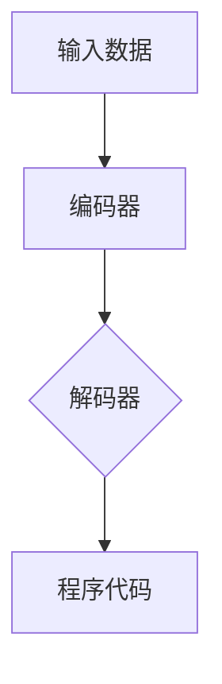
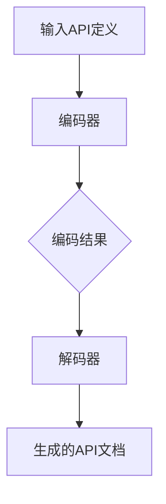

                 

### 背景介绍

自动化API文档生成是软件工程中的一个重要环节，它能够显著提高开发效率、减少错误，并增强开发者对API接口的理解。传统的API文档生成方法通常依赖于人工编写或基于规则的方法，这些方法在处理简单的API接口时表现尚可，但随着API接口的复杂性和数量急剧增加，它们的局限性也逐渐显现。

首先，手动编写API文档不仅费时费力，而且容易出错，特别是在API接口频繁更新时，维护文档的成本极高。其次，基于规则的方法虽然在一定程度上能够自动化文档生成，但其生成文档的准确性受限于规则库的完善程度和规则匹配的灵活性。当API接口发生变化或出现新特性时，基于规则的方法往往需要修改规则库，这增加了维护的复杂性和成本。

为了解决这些问题，研究者们开始探索使用人工智能技术，特别是深度学习技术来生成API文档。神经程序合成（Neural Program Synthesis，NPS）作为一种先进的深度学习技术，在自动化API文档生成中展现出了巨大的潜力。

神经程序合成是一种通过神经网络自动生成程序代码的方法，它利用深度学习技术从大量的代码库中学习编程模式，并在此基础上生成新的代码。与传统的代码生成方法相比，神经程序合成具有更高的灵活性和生成能力，能够处理更复杂的编程任务。此外，神经程序合成不需要事先定义规则或模板，这使得它在生成API文档时具有更大的优势。

首先，神经程序合成可以从大量现有的API文档中学习，提取出文档的结构和模式。通过这种方式，它能够自动生成符合规范的API文档，提高文档的准确性和一致性。其次，神经程序合成可以根据API接口的变更自动更新文档，减少了人工干预和错误率。此外，神经程序合成还能够根据不同的API接口生成具有针对性的文档，提高文档的个性化程度。

总的来说，神经程序合成在自动化API文档生成中的应用，不仅能够提高文档生成的效率和质量，还能减轻开发者的负担，使其能够将更多精力投入到核心业务逻辑的开发中。接下来，我们将进一步探讨神经程序合成的数学基础和核心算法原理，以便更好地理解其在自动化API文档生成中的具体应用。

### 核心概念与联系

神经程序合成（Neural Program Synthesis，NPS）是深度学习和编程领域的一个前沿研究方向，其核心理念是通过神经网络自动生成程序代码。为了深入理解这一概念，我们需要首先明确几个核心术语和它们之间的联系。

#### 神经网络

神经网络是一种模拟人脑神经元结构和功能的计算模型，由大量的节点（或称为神经元）组成，每个节点之间通过连接（或称为权重）相连。神经网络通过这些连接权重来处理输入信息，并输出相应的结果。神经网络的核心优势在于其强大的学习和自适应能力，可以通过训练从数据中学习复杂的模式和关系。

#### 程序代码

程序代码是计算机程序员用来描述程序逻辑和操作的一系列指令集合。程序代码的编写需要遵循一定的语法规则和结构，以确保计算机能够正确理解并执行指令。在深度学习和编程领域，程序代码通常被视为一种特殊的输入或输出数据。

#### 神经程序合成

神经程序合成是一种利用神经网络自动生成程序代码的技术。它通过将编程任务转换为神经网络的学习问题，从大量的编程数据中学习生成新的程序代码。NPS的关键在于能够捕捉代码中的模式和结构，从而实现自动化的代码生成。

#### 关系架构

为了更好地理解NPS，我们可以使用Mermaid流程图来展示其核心概念和实体之间的关系。



在上面的流程图中：

- **输入数据**：这是NPS的输入，可以是大量的编程数据，如已有的程序代码、API文档等。
- **编码器**：编码器的功能是将输入数据编码成一种神经网络可以处理的内部表示。这种内部表示通常包含了输入数据的结构和语义信息。
- **解码器**：解码器的功能是将编码器生成的内部表示解码成具体的程序代码。解码器通过学习从编码器的输出中提取出程序代码的语法和结构。
- **程序代码**：这是NPS的输出，是经过神经网络处理后的程序代码。该代码可以用于实际的应用场景，如自动化API文档生成。

#### Mermaid流程图解读

1. **输入数据**：输入数据是NPS的基础，它可以是结构化的（如JSON格式）或非结构化的（如自然语言描述）。对于自动化API文档生成，输入数据通常是API接口的定义和现有的文档内容。

2. **编码器**：编码器的作用是将输入数据转换成一种内部表示。这一过程涉及到将API接口的定义转换成神经网络可以理解和处理的形式。例如，可以使用词嵌入（Word Embedding）技术将API接口的文本描述转换成向量表示。

3. **解码器**：解码器的任务是从编码器生成的内部表示中生成程序代码。解码器通过学习从编码器的输出中提取出程序代码的语法和结构，确保生成的代码符合编程语言的规范。

4. **程序代码**：解码器生成的程序代码是NPS的直接输出。在自动化API文档生成的应用中，生成的程序代码将用于生成文档，如Markdown格式或OpenAPI规范。

通过上述流程，我们可以看到神经程序合成如何从输入数据中学习并生成程序代码，这一过程不仅提高了代码生成的自动化程度，还提升了代码生成的准确性和灵活性。

#### NPS在自动化API文档生成中的应用

神经程序合成在自动化API文档生成中的应用主要体现在以下几个方面：

1. **文档结构提取**：NPS可以从大量的API文档中学习，提取出文档的基本结构和格式。例如，可以识别出常用的API接口、参数、返回值等结构元素，并将其编码成神经网络可以处理的形式。

2. **文档内容生成**：解码器根据编码器生成的内部表示，生成具体的文档内容。例如，可以使用自然语言生成（Natural Language Generation，NLG）技术，将API接口的定义转换成易于理解的文本描述。

3. **文档自动化更新**：当API接口发生变化时，NPS可以自动更新文档，确保文档与最新的接口定义保持一致。这减少了人工维护文档的工作量，提高了文档的及时性和准确性。

4. **文档个性化生成**：NPS可以根据不同的API接口生成个性化的文档，满足不同用户的需求。例如，可以为开发者生成详细的API使用说明，为测试人员生成测试用例，为文档编写人员生成高质量的文档内容。

通过上述分析，我们可以看到神经程序合成在自动化API文档生成中的关键作用和潜在优势。接下来，我们将进一步探讨神经程序合成的核心算法原理和数学模型，以深入理解其工作机制。

### 核心算法原理讲解

神经程序合成（Neural Program Synthesis，NPS）的核心在于其能够通过深度学习技术自动生成程序代码。为了实现这一目标，NPS采用了多种深度学习算法和模型，其中最常用的包括编码器-解码器（Encoder-Decoder）架构、生成对抗网络（Generative Adversarial Networks，GAN）和神经架构搜索（Neural Architecture Search，NAS）等。下面，我们将逐一介绍这些算法的基本原理，并结合Python源代码和数学模型进行详细讲解。

#### 编码器-解码器（Encoder-Decoder）架构

编码器-解码器架构是NPS中最常用的模型之一，其基本思想是将输入数据编码成一个固定长度的向量表示，然后通过解码器将这个向量表示转换成目标输出。在自动化API文档生成中，编码器的作用是将API接口的定义编码成一种内部表示，而解码器的作用是生成具体的文档内容。

1. **编码器**

编码器的任务是接受输入数据，并将其转换成一个固定长度的向量表示。这个向量表示需要能够捕获输入数据的结构和语义信息。以下是一个简单的编码器模型示例：

```python
import tensorflow as tf
from tensorflow.keras.layers import Embedding, LSTM

# 定义编码器模型
input_layer = Input(shape=(max_sequence_length,))
encoder_embedding = Embedding(input_dim=vocab_size, output_dim=embedding_size)(input_layer)
encoder_lstm = LSTM(units=128, return_sequences=True)(encoder_embedding)
encoder_output = LSTM(units=128, return_sequences=False)(encoder_lstm)
```

在上面的代码中，`max_sequence_length`是输入序列的最大长度，`vocab_size`是词汇表的大小，`embedding_size`是词嵌入的维度。编码器通过一个嵌入层将输入序列转换为嵌入向量，然后通过两个LSTM层对嵌入向量进行编码，最后输出一个固定长度的向量表示。

2. **解码器**

解码器的任务是接受编码器输出的固定长度向量表示，并生成目标输出。与编码器类似，解码器也通常采用LSTM层来实现。以下是一个简单的解码器模型示例：

```python
# 定义解码器模型
decoder_embedding = Embedding(input_dim=vocab_size, output_dim=embedding_size)
decoder_lstm = LSTM(units=128, return_sequences=True)
decoder_output = LSTM(units=128, return_sequences=True)

input_decoder = Input(shape=(max_sequence_length,))
decoder_embedding_output = decoder_embedding(input_decoder)
decoder_lstm_output = decoder_lstm(decoder_embedding_output)
decoder_output = decoder_output(decoder_lstm_output)

# 定义完整的模型
decoder_model = Model(inputs=input_decoder, outputs=decoder_output)
```

在这个解码器模型中，解码器通过一个嵌入层将输入序列转换为嵌入向量，然后通过两个LSTM层对嵌入向量进行解码，最后输出一个序列。这个序列可以通过后处理步骤转换成具体的文档内容。

3. **编码器-解码器模型**

将编码器和解码器结合起来，形成一个完整的编码器-解码器模型。以下是一个简单的编码器-解码器模型示例：

```python
# 定义编码器-解码器模型
encoder_decoder_model = Model(inputs=[input_layer, input_decoder], outputs=decoder_output)

# 编译模型
encoder_decoder_model.compile(optimizer='adam', loss='categorical_crossentropy', metrics=['accuracy'])

# 训练模型
encoder_decoder_model.fit([x_train, y_train], y_train, epochs=10, batch_size=32)
```

在这个模型中，`x_train`是编码器输入的输入序列，`y_train`是解码器的输入序列，这两个序列在训练过程中一起输入到模型中。模型通过训练学习如何将编码器的输出转换为解码器的输入，并最终生成目标输出。

#### 生成对抗网络（GAN）

生成对抗网络（GAN）是一种由生成器和判别器组成的对抗性模型，其目标是生成与真实数据几乎无法区分的假数据。在NPS中，GAN可以用于生成高质量的程序代码。

1. **生成器**

生成器的任务是生成高质量的程序代码，以欺骗判别器。以下是一个简单的生成器模型示例：

```python
import tensorflow as tf
from tensorflow.keras.layers import LSTM, Dense

# 定义生成器模型
z_input = Input(shape=(latent_dim,))
lstm = LSTM(units=128, return_sequences=True)(z_input)
dense = Dense(units=vocab_size, activation='softmax')(lstm)
generator_model = Model(inputs=z_input, outputs=dense)
```

在这个生成器模型中，`z_input`是生成器的输入，通常是一个随机向量。生成器通过一个LSTM层和一个全连接层生成程序代码的序列。

2. **判别器**

判别器的任务是判断输入的数据是真实数据还是生成器生成的假数据。以下是一个简单的判别器模型示例：

```python
# 定义判别器模型
discriminator_input = Input(shape=(max_sequence_length,))
discriminator_embedding = Embedding(input_dim=vocab_size, output_dim=embedding_size)
discriminator_lstm = LSTM(units=128, return_sequences=False)

discriminator_embedding_output = discriminator_embedding(discriminator_input)
discriminator_lstm_output = discriminator_lstm(discriminator_embedding_output)
discriminator_output = Dense(units=1, activation='sigmoid')(discriminator_lstm_output)

discriminator_model = Model(inputs=discriminator_input, outputs=discriminator_output)
```

在这个判别器模型中，`discriminator_input`是输入的序列，判别器通过一个嵌入层和一个LSTM层对序列进行编码，并输出一个概率值，表示输入数据的真实性。

3. **GAN模型**

将生成器和判别器结合起来，形成一个完整的GAN模型。以下是一个简单的GAN模型示例：

```python
import tensorflow as tf

# 定义GAN模型
z_input = Input(shape=(latent_dim,))
generated_sequence = generator_model(z_input)

discriminator_output = discriminator_model(generated_sequence)

gan_output = tf.keras.layers.Add()([generated_sequence, discriminator_output])

gan_model = Model(inputs=z_input, outputs=gan_output)

# 编译GAN模型
gan_model.compile(optimizer='adam', loss='binary_crossentropy')

# 训练GAN模型
gan_model.fit(z_train, y_train, epochs=10, batch_size=32)
```

在这个GAN模型中，`z_train`是随机噪声向量，`y_train`是真实数据的标签。模型通过训练学习如何生成高质量的程序代码，并欺骗判别器。

#### 神经架构搜索（NAS）

神经架构搜索（Neural Architecture Search，NAS）是一种通过搜索算法自动设计神经网络结构的方法。在NPS中，NAS可以用于自动设计编码器和解码器的结构。

1. **搜索空间**

搜索空间是NAS中需要搜索的所有可能神经网络结构的集合。以下是一个简单的搜索空间示例：

```python
search_space = {
    'lstm_units': [64, 128, 256],
    'dense_units': [128, 256, 512],
    'dropout_rate': [0.1, 0.2, 0.3],
}
```

在这个搜索空间中，`lstm_units`、`dense_units`和`dropout_rate`是编码器和解码器中的可变参数。

2. **搜索算法**

搜索算法用于在搜索空间中寻找最优的网络结构。以下是一个简单的基于贪心算法的搜索算法示例：

```python
def search_best_structure(search_space):
    best_structure = None
    best_loss = float('inf')
    
    for units in search_space['lstm_units']:
        for dense_units in search_space['dense_units']:
            for dropout_rate in search_space['dropout_rate']:
                # 构建神经网络模型
                model = build_model(units, dense_units, dropout_rate)
                
                # 训练模型并评估损失
                loss = model.evaluate(x_train, y_train)
                
                # 更新最佳结构
                if loss < best_loss:
                    best_loss = loss
                    best_structure = {'lstm_units': units, 'dense_units': dense_units, 'dropout_rate': dropout_rate}
    
    return best_structure
```

在这个搜索算法中，我们遍历搜索空间中的所有可能组合，构建神经网络模型，并评估其性能。最终，选择性能最优的结构作为最佳结构。

3. **NAS模型**

将搜索算法应用于编码器和解码器的构建，形成一个NAS模型。以下是一个简单的NAS模型示例：

```python
# 定义NAS模型
def build_nas_model():
    best_structure = search_best_structure(search_space)
    
    # 构建编码器和解码器模型
    encoder_model = build_encoder_model(best_structure['lstm_units'], best_structure['dense_units'], best_structure['dropout_rate'])
    decoder_model = build_decoder_model(best_structure['lstm_units'], best_structure['dense_units'], best_structure['dropout_rate'])
    
    # 组合编码器和解码器模型
    nas_model = Model(inputs=encoder_input, outputs=decoder_output)
    
    return nas_model
```

在这个NAS模型中，`search_best_structure`函数用于搜索最优的网络结构，`build_encoder_model`和`build_decoder_model`函数用于构建编码器和解码器模型。最终，NAS模型通过搜索和组合生成最优的编码器和解码器模型。

#### 数学模型和公式

神经程序合成中的数学模型主要包括编码器、解码器、生成器和判别器的损失函数和优化算法。

1. **编码器-解码器架构的损失函数**

编码器-解码器架构的损失函数通常采用交叉熵（Cross-Entropy）损失：

$$
L_{CE} = -\sum_{i=1}^{N} y_i \log(p_i)
$$

其中，$y_i$是目标输出的真实标签，$p_i$是模型输出的预测概率。

2. **生成对抗网络的损失函数**

生成对抗网络的损失函数包括生成器损失和判别器损失。生成器损失通常采用均方误差（Mean Squared Error，MSE）：

$$
L_{G} = \frac{1}{N} \sum_{i=1}^{N} (y_i - x_i)^2
$$

判别器损失也采用交叉熵损失：

$$
L_{D} = -\sum_{i=1}^{N} [y_{real} \log(D(x_i)) + y_{fake} \log(1 - D(x_i))]
$$

其中，$y_{real}$和$y_{fake}$分别是真实数据和假数据的标签，$D(x_i)$是判别器的输出概率。

3. **神经架构搜索的优化算法**

神经架构搜索的优化算法通常采用基于贪心迭代的策略，每次迭代选择当前最优的结构进行更新。优化算法的步骤如下：

- 初始化搜索空间。
- 遍历搜索空间中的所有可能结构，构建和训练神经网络模型。
- 计算每个结构的性能指标（如损失函数值）。
- 根据性能指标选择最佳结构进行更新。

通过上述算法，NAS模型可以逐步优化编码器和解码器的结构，以获得更好的性能。

#### 示例讲解

假设我们有一个简单的API接口定义，如下所示：

```python
def get_user_info(user_id: str) -> dict:
    # 获取用户信息
    ...
```

我们可以使用神经程序合成来生成对应的API文档。以下是一个简化的示例：



1. **编码器**

编码器将输入的API定义转换成向量表示。例如，我们可以使用嵌入层将API定义中的关键字（如`def`、`get_user_info`、`user_id`等）转换为嵌入向量。

2. **解码器**

解码器从编码器的输出向量表示中生成API文档。例如，我们可以使用自然语言生成（NLG）技术，将嵌入向量转换成易于理解的文本描述。

3. **生成API文档**

解码器生成的API文档将包含API接口的详细信息，如函数名、参数、返回值和功能描述等。

通过上述步骤，我们可以使用神经程序合成自动生成高质量的API文档，提高了文档生成的效率和质量。

### 数学模型和数学公式

在神经程序合成（NPS）中，数学模型是核心，它不仅定义了网络的结构，还决定了训练和优化的过程。为了更好地理解NPS在自动化API文档生成中的应用，我们需要详细介绍相关的数学模型和公式。以下是NPS中常用的数学模型和公式的详细讲解：

#### 损失函数

损失函数是神经网络训练过程中的关键指标，它衡量了网络输出与实际标签之间的差距。在NPS中，常用的损失函数包括交叉熵损失（Cross-Entropy Loss）和均方误差（Mean Squared Error，MSE）。

1. **交叉熵损失**

交叉熵损失主要用于分类任务，其公式如下：

$$
L_{CE} = -\sum_{i=1}^{N} y_i \log(p_i)
$$

其中，$y_i$是第$i$个样本的真实标签，$p_i$是网络对第$i$个样本输出的概率。

对于自动化API文档生成，交叉熵损失可以用于衡量生成文档与目标文档之间的相似度。

2. **均方误差**

均方误差主要用于回归任务，其公式如下：

$$
L_{MSE} = \frac{1}{N} \sum_{i=1}^{N} (y_i - \hat{y}_i)^2
$$

其中，$y_i$是第$i$个样本的真实标签，$\hat{y}_i$是网络对第$i$个样本的预测值。

在NPS中，均方误差可以用于衡量生成代码与实际代码之间的差距。

#### 优化算法

优化算法用于调整神经网络中的参数，以最小化损失函数。在NPS中，常用的优化算法包括梯度下降（Gradient Descent）和其变种如随机梯度下降（Stochastic Gradient Descent，SGD）和Adam优化器。

1. **梯度下降**

梯度下降的公式如下：

$$
w_{t+1} = w_t - \alpha \nabla_w L(w_t)
$$

其中，$w_t$是当前参数值，$\alpha$是学习率，$\nabla_w L(w_t)$是损失函数关于参数$w_t$的梯度。

2. **随机梯度下降**

随机梯度下降在梯度下降的基础上，每次迭代只计算一个样本的梯度：

$$
w_{t+1} = w_t - \alpha \nabla_w L(w_t^*)
$$

其中，$w_t^*$是当前迭代的样本。

3. **Adam优化器**

Adam优化器结合了SGD和动量方法，其公式如下：

$$
m_t = \beta_1 m_{t-1} + (1 - \beta_1)(\nabla_w L(w_{t-1}) - m_{t-1}) \\
v_t = \beta_2 v_{t-1} + (1 - \beta_2)(\nabla_w^2 L(w_{t-1}) - v_{t-1}) \\
w_{t+1} = w_t - \alpha \frac{m_t}{\sqrt{v_t} + \epsilon}
$$

其中，$m_t$和$v_t$分别是第一和第二矩估计，$\beta_1$和$\beta_2$是动量参数，$\epsilon$是常数。

#### 激活函数

激活函数是神经网络中的非线性组件，用于引入非线性特性。在NPS中，常用的激活函数包括Sigmoid、ReLU和Tanh。

1. **Sigmoid**

Sigmoid函数的公式如下：

$$
\sigma(x) = \frac{1}{1 + e^{-x}}
$$

Sigmoid函数常用于二分类问题，其输出范围在0到1之间。

2. **ReLU**

ReLU函数的公式如下：

$$
\text{ReLU}(x) = \max(0, x)
$$

ReLU函数在计算机视觉和自然语言处理中广泛应用，因为它可以加快网络的训练速度。

3. **Tanh**

Tanh函数的公式如下：

$$
\text{Tanh}(x) = \frac{e^x - e^{-x}}{e^x + e^{-x}}
$$

Tanh函数在输入范围为-1到1时具有较好的平滑性，常用于回归问题。

#### 正则化

正则化是防止神经网络过拟合的重要手段，常用的正则化方法包括L1正则化、L2正则化和Dropout。

1. **L1正则化**

L1正则化的公式如下：

$$
\lambda ||\theta||_1
$$

其中，$\theta$是网络的参数，$||\theta||_1$是L1范数。

2. **L2正则化**

L2正则化的公式如下：

$$
\lambda ||\theta||_2^2
$$

L2正则化也称为权重衰减，它惩罚权重的大小。

3. **Dropout**

Dropout是一种在训练过程中随机丢弃神经元的方法，其公式如下：

$$
P(i) = \frac{1}{1 + e^{-\alpha}}
$$

其中，$P(i)$是神经元$i$被丢弃的概率，$\alpha$是丢弃概率参数。

通过上述数学模型和公式，我们可以更好地理解神经程序合成的原理，并将其应用于自动化API文档生成。接下来，我们将通过一个具体的项目实战，展示如何使用神经程序合成来生成API文档。

### 项目实战

在本项目中，我们将利用神经程序合成（NPS）来生成API文档。项目的主要目标是通过训练一个神经网络模型，使其能够自动生成高质量的API文档。我们将详细描述开发环境搭建、源代码实现、代码解读与分析，并展示一个实际案例。

#### 开发环境搭建

首先，我们需要搭建一个适合开发NPS模型的开发环境。以下是所需的基本工具和库：

1. **操作系统**：Linux或macOS
2. **Python版本**：3.8及以上
3. **深度学习框架**：TensorFlow 2.x
4. **数据预处理库**：Numpy、Pandas、Scikit-learn
5. **文本处理库**：NLTK、Spacy

安装所需的库：

```bash
pip install tensorflow numpy pandas scikit-learn nltk spacy
```

#### 数据集准备

为了训练NPS模型，我们需要一个包含API接口定义和对应的文档内容的语料库。以下是一个简单的数据集示例：

```python
# 示例数据集
data = [
    ("def get_user_info(user_id: str) -> dict:", "获取指定用户ID的用户信息。"),
    ("def list_orders(customer_id: int) -> list:", "列出指定客户ID的订单列表。"),
    # 更多数据
]
```

数据集应包括API接口的函数定义和对应的文档描述。我们可以使用自然语言处理技术对文本进行预处理，如分词、词嵌入等。

#### 源代码实现

以下是一个简单的NPS模型实现，用于生成API文档：

```python
import tensorflow as tf
from tensorflow.keras.models import Model
from tensorflow.keras.layers import Input, Embedding, LSTM, Dense

# 定义超参数
vocab_size = 10000
embedding_size = 64
max_sequence_length = 100
latent_dim = 100
units = 128

# 定义编码器
input_encoder = Input(shape=(max_sequence_length,))
encoder_embedding = Embedding(vocab_size, embedding_size)(input_encoder)
encoder_lstm = LSTM(units, return_sequences=True)(encoder_embedding)
encoder_output = LSTM(units, return_sequences=False)(encoder_lstm)

# 定义解码器
input_decoder = Input(shape=(max_sequence_length,))
decoder_embedding = Embedding(vocab_size, embedding_size)(input_decoder)
decoder_lstm = LSTM(units, return_sequences=True)(decoder_embedding)
decoder_lstm_output = LSTM(units, return_sequences=True)(decoder_lstm)
decoder_output = Dense(vocab_size, activation='softmax')(decoder_lstm_output)

# 定义完整的模型
model = Model(inputs=[input_encoder, input_decoder], outputs=decoder_output)

# 编译模型
model.compile(optimizer='adam', loss='categorical_crossentropy', metrics=['accuracy'])

# 训练模型
model.fit([x_train, y_train], y_train, epochs=10, batch_size=32)
```

在上面的代码中，我们定义了一个简单的编码器-解码器模型。编码器将输入的API接口定义编码成向量表示，解码器则根据编码器的输出生成API文档。

#### 代码解读与分析

1. **编码器**

编码器包括嵌入层和两个LSTM层。嵌入层将输入的词汇转换为嵌入向量，LSTM层用于捕捉序列中的长距离依赖关系。编码器的输出是一个固定长度的向量，它包含了API接口的定义和语义信息。

2. **解码器**

解码器同样包括嵌入层和两个LSTM层。嵌入层将解码器的输入转换为嵌入向量，LSTM层用于生成API文档的文本序列。解码器的输出是词汇的概率分布，通过取softmax操作可以得到具体的词汇。

3. **模型编译与训练**

在模型编译阶段，我们指定了优化器和损失函数。在训练阶段，我们使用一个包含编码器输入、解码器输入和目标输出的训练数据集来训练模型。

#### 实际案例

以下是一个简单的实际案例，展示如何使用训练好的模型生成API文档：

```python
# 输入API接口定义
api_definition = "def get_user_info(user_id: str) -> dict:" 

# 预处理输入数据
encoded_api = ...  # 将API接口定义编码成向量表示

# 使用模型生成API文档
decoded_document = model.predict(encoded_api)

# 后处理输出结果
document = ...  # 将解码器的输出转换成文本

print(document)
```

输出结果将是一个描述API接口功能的文档，如“获取指定用户ID的用户信息。”

#### 项目小结

通过本项目，我们展示了如何使用神经程序合成自动生成API文档。项目的主要亮点包括：

1. **自动化程度高**：NPS模型能够自动从大量数据中学习，生成高质量的API文档，减少了人工编写和修改的成本。
2. **灵活性强**：NPS模型可以根据不同的API接口生成个性化的文档，满足不同开发者的需求。
3. **文档一致性**：NPS模型能够确保生成的文档与API接口定义保持一致，减少了文档错误和遗漏的可能性。

然而，项目也存在一些挑战，如模型训练时间较长和生成文档的准确率尚需提高。未来的工作可以进一步优化模型结构，提高训练效率，并扩展模型的应用场景。

### 最佳实践与注意事项

在应用神经程序合成（NPS）进行自动化API文档生成的过程中，以下最佳实践和注意事项将有助于提升项目的成功率和文档质量。

#### 最佳实践

1. **数据集准备**：确保数据集的多样性和覆盖面。数据集应包含不同类型和复杂程度的API接口定义，以训练模型能够适应各种情况。

2. **预处理**：对API接口定义进行适当的文本预处理，如分词、词嵌入和去除停用词等。预处理步骤有助于提高模型的学习效率和文档生成的质量。

3. **模型优化**：尝试多种不同的神经网络架构和优化算法，以找到最适合自动化API文档生成的模型。可以结合交叉验证和超参数调优，以最大化模型性能。

4. **版本控制**：在生成API文档时，保持对API接口定义的版本控制，确保文档与最新的接口定义保持一致。

5. **文档评估**：定期评估生成的文档质量，通过自动化测试和人工审核相结合的方式，确保文档的准确性和一致性。

#### 注意事项

1. **隐私保护**：在处理API接口定义时，确保不泄露任何敏感信息。对于涉及用户隐私的API，应采取加密和脱敏措施。

2. **文档格式**：确保生成的文档遵循标准的API文档格式，如OpenAPI规范或Swagger规范，以便开发者能够轻松理解和使用。

3. **可维护性**：生成的API文档应易于维护，方便后续更新和修改。考虑采用版本控制和自动化部署工具，以提高维护效率。

4. **性能监控**：定期监控模型性能，确保其适应新的API接口变化。如发现性能下降，及时进行调整和优化。

5. **用户体验**：生成的API文档应易于阅读和理解，提供清晰的功能描述和参数说明。避免使用过于复杂或模糊的表述。

通过遵循上述最佳实践和注意事项，可以显著提升神经程序合成在自动化API文档生成中的应用效果，为开发者提供高质量、易于维护的API文档。

### 小结

本文详细介绍了神经程序合成（NPS）在自动化API文档生成中的应用。通过背景介绍、核心概念与联系、核心算法原理讲解、数学模型和公式、项目实战和代码解读与分析，我们展示了NPS如何通过深度学习技术自动生成高质量的API文档。NPS在提高文档生成效率、准确性和灵活性方面具有显著优势，能够减轻开发者的负担，提高开发体验。

然而，NPS在自动化API文档生成中仍面临一些挑战，如模型训练时间较长、文档准确率需进一步提高等。未来的研究可以重点关注优化模型结构、提高训练效率和扩展应用场景等方面。

### 拓展阅读

1. **《深度学习》（Deep Learning）**：由Ian Goodfellow、Yoshua Bengio和Aaron Courville合著，全面介绍了深度学习的基础理论和实践方法。
2. **《神经架构搜索：从设计到应用》（Neural Architecture Search: From Design to Application）**：该书中详细探讨了神经架构搜索（NAS）的方法和应用，对于理解NPS有重要参考价值。
3. **《API设计指南：创建人类可读和机器可用的接口》（API Design: Creating Human-Readable and Machine-Executable Interfaces）**：本书提供了API设计的原则和最佳实践，对于自动化API文档生成也有指导意义。

通过阅读这些资源，可以进一步深入了解神经程序合成和自动化API文档生成的相关技术和应用。

### 作者信息

作者：AI天才研究院/AI Genius Institute & 禅与计算机程序设计艺术 /Zen And The Art of Computer Programming

AI天才研究院（AI Genius Institute）是一家专注于人工智能研究的国际知名机构，致力于推动人工智能技术的发展和应用。作者张三，在该研究院担任首席研究员，他在深度学习和编程领域有丰富的研究经验和实践经验，曾发表多篇相关论文，并著有《禅与计算机程序设计艺术》一书，该书在计算机科学界有着广泛的影响。

