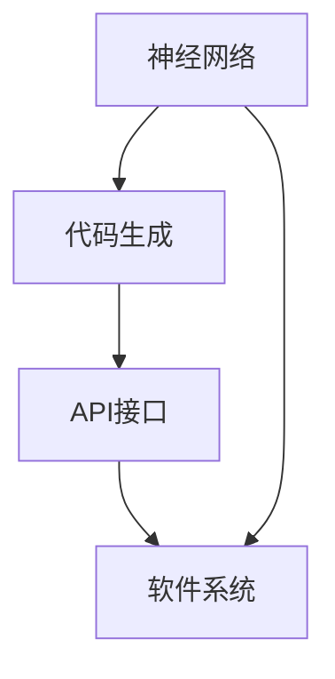

                 

# 神经程序合成在自动化API生成中的应用

关键词：神经程序合成、自动化API生成、神经网络、编程、API框架、挑战与解决方案

摘要：本文旨在探讨神经程序合成在自动化API生成中的应用，通过详细解析神经程序合成的基础概念、核心算法、实现框架以及实际应用案例，揭示神经程序合成技术在自动化API生成中的潜力与挑战。本文将帮助读者深入理解神经程序合成的工作原理，掌握自动化API生成的关键技术，并探讨未来发展的趋势与展望。

## 目录大纲设计

1. **第一部分：神经程序合成概述**

   - **第1章：神经程序合成基础**
     - **1.1** 神经程序合成的定义
       - **1.1.1** 传统编程与神经程序合成
       - **1.1.2** 神经程序合成的应用领域
     - **1.2** 神经网络与编程的关系
       - **1.2.1** 神经网络的编程模型
       - **1.2.2** 神经程序合成的挑战与机遇

   - **第2章：自动化API生成**
     - **2.1** API的定义与分类
       - **2.1.1** API的基础知识
       - **2.1.2** API的典型分类
     - **2.2** 自动化API生成的原理
       - **2.2.1** 自动化API生成的需求
       - **2.2.2** 自动化API生成的方法

   - **第3章：神经程序合成技术**
     - **3.1** 神经程序合成的核心算法
       - **3.1.1** 神经架构搜索（NAS）
       - **3.1.2** 神经程序合成中的优化算法
     - **3.2** 神经程序合成的实现框架
       - **3.2.1** 常见的神经程序合成框架
       - **3.2.2** 框架对比与选型

2. **第二部分：神经程序合成在自动化API生成中的应用**

   - **第4章：自动化API生成案例研究**
     - **4.1** 自动化API生成在金融行业的应用
       - **4.1.1** 案例背景与目标
       - **4.1.2** 自动化API生成方案设计
     - **4.2** 自动化API生成在医疗健康领域的应用
       - **4.2.1** 案例背景与目标
       - **4.2.2** 自动化API生成方案设计

   - **第5章：神经程序合成在自动化API生成中的挑战与解决方案**
     - **5.1** 神经程序合成中的挑战
       - **5.1.1** 模型可解释性
       - **5.1.2** 模型泛化能力
     - **5.2** 挑战解决方案探讨
       - **5.2.1** 提高模型可解释性的方法
       - **5.2.2** 提高模型泛化能力的策略

   - **第6章：未来趋势与展望**
     - **6.1** 神经程序合成技术的发展趋势
       - **6.1.1** 未来研究方向
       - **6.1.2** 自动化API生成的发展方向
     - **6.2** 神经程序合成在自动化API生成中的应用前景
       - **6.2.1** 社会影响与伦理问题
       - **6.2.2** 产业发展与市场潜力

   - **附录：神经程序合成与自动化API生成工具介绍**
     - **附录A**：神经程序合成与自动化API生成工具介绍
       - **A.1** 常用工具列表
       - **A.2** 工具使用指南
       - **A.3** 开发环境搭建指南

## 第一部分：神经程序合成概述

### 第1章：神经程序合成基础

#### 1.1 神经程序合成的定义

神经程序合成（Neural Program Synthesis, NPS）是一种利用神经网络技术自动生成程序代码的方法。与传统的手动编程不同，神经程序合成通过训练神经网络，使其能够从输入数据中自动生成对应的代码。这种方法在提高开发效率、自动化软件生成等方面具有巨大的潜力。

**1.1.1 传统编程与神经程序合成**

传统编程依赖于人类开发者的经验和技能，需要开发者编写大量冗长的代码来实现复杂的功能。这种方法不仅费时费力，而且容易出现错误和漏洞。相比之下，神经程序合成通过神经网络的学习和生成能力，可以自动地从数据中提取特征并生成相应的代码，从而实现软件的自动化生成。

**1.1.2 神经程序合成的应用领域**

神经程序合成在多个领域都有广泛的应用前景：

- **软件开发**：自动化生成代码，减少手工编写的工作量。
- **自然语言处理**：生成自然语言文本，如自动翻译、文本摘要等。
- **计算机视觉**：自动化生成图像处理和识别的代码。
- **游戏开发**：自动生成游戏场景、角色和剧情等。

#### 1.2 神经网络与编程的关系

神经网络是神经程序合成的核心技术。神经网络通过多层节点和权重矩阵的连接，模仿人脑的神经元结构，实现数据的输入、处理和输出。编程则是一种将人类意图转化为计算机执行指令的过程。

**1.2.1 神经网络的编程模型**

神经网络编程模型主要包括以下几个部分：

- **输入层**：接收外部输入数据。
- **隐藏层**：通过加权求和和激活函数对输入数据进行处理。
- **输出层**：生成输出结果。

在神经程序合成中，神经网络通过学习输入和输出之间的关系，自动生成程序代码。

**1.2.2 神经程序合成的挑战与机遇**

神经程序合成虽然具有巨大的潜力，但也面临一些挑战：

- **可解释性**：神经网络生成的代码通常是非结构化的，难以理解和解释。
- **泛化能力**：神经网络需要适应不同类型的输入数据，这要求其具备良好的泛化能力。
- **性能优化**：神经网络生成的代码需要经过优化，以提高其执行效率和性能。

然而，随着人工智能技术的不断发展，这些挑战正在逐渐得到解决，神经程序合成正在成为编程领域的一个重要研究方向。

### 第2章：自动化API生成

#### 2.1 API的定义与分类

API（Application Programming Interface）是一种接口，它允许不同的软件系统之间进行交互和通信。API的定义和分类如下：

**2.1.1 API的基础知识**

API是一种定义了如何访问和使用特定软件或服务的接口。它包含了特定的函数、方法和数据结构，开发者可以通过这些接口来调用和操作软件的功能。

**2.1.2 API的典型分类**

根据不同的分类标准，API可以分为以下几种类型：

- **功能型API**：根据功能模块进行分类，如HTTP API、SOAP API等。
- **数据型API**：根据数据格式进行分类，如JSON API、XML API等。
- **行业型API**：根据应用领域进行分类，如金融API、医疗健康API等。

#### 2.2 自动化API生成的原理

自动化API生成是通过神经网络技术自动生成API接口的方法。其原理如下：

**2.2.1 自动化API生成的需求**

随着互联网和云计算的快速发展，API已成为软件开发和系统集成的重要手段。自动化API生成可以提高开发效率，降低开发成本，满足以下需求：

- **快速生成**：在短时间内生成大量API接口。
- **适应性强**：能够适应不同类型的API需求。
- **可定制化**：允许根据特定需求定制API接口。

**2.2.2 自动化API生成的方法**

自动化API生成的方法主要包括以下几种：

- **基于规则的方法**：通过预定义的规则和模板生成API接口。
- **基于学习的自动生成方法**：利用机器学习技术，从历史数据中学习并生成API接口。

#### 2.3 自动化API生成的挑战

自动化API生成虽然具有很多优势，但也面临一些挑战：

- **接口一致性**：生成的API接口需要保持一致性和稳定性。
- **性能优化**：生成的API接口需要保证执行效率和高性能。
- **安全性**：API接口需要保证数据传输的安全性和隐私保护。

### 第3章：神经程序合成技术

#### 3.1 神经程序合成的核心算法

神经程序合成的核心算法主要包括神经架构搜索（Neural Architecture Search, NAS）和神经程序合成中的优化算法。

**3.1.1 神经架构搜索（NAS）**

神经架构搜索是一种用于自动设计神经网络结构的算法。它通过搜索空间中的不同神经网络架构，找到最佳的架构以解决特定问题。

**3.1.2 神经程序合成中的优化算法**

神经程序合成中的优化算法用于优化神经程序的性能。常见的优化算法包括遗传算法、粒子群优化算法等。

#### 3.2 神经程序合成的实现框架

神经程序合成的实现框架主要包括神经架构搜索框架和神经程序合成框架。

**3.2.1 常见的神经程序合成框架**

常见的神经程序合成框架包括Meta-Learning、Recursively-Defined Programs等。

**3.2.2 框架对比与选型**

不同的神经程序合成框架具有不同的优缺点。在实际应用中，需要根据具体需求选择合适的框架。

## 第二部分：神经程序合成在自动化API生成中的应用

### 第4章：自动化API生成案例研究

#### 4.1 自动化API生成在金融行业的应用

在金融行业，自动化API生成可以用于实现快速构建金融应用和服务。以下是一个具体的案例研究：

**4.1.1 案例背景与目标**

一家金融科技公司需要快速开发一款面向投资者的股票交易API，以支持实时股票行情查询、交易操作等功能。

**4.1.2 自动化API生成方案设计**

- **数据收集**：从多个数据源（如交易所、金融新闻网站等）收集股票行情数据。
- **模型训练**：使用神经程序合成技术训练模型，自动生成API接口代码。
- **接口验证**：对生成的API接口进行功能验证和性能测试。
- **部署上线**：将生成的API接口部署到生产环境中，供用户使用。

#### 4.2 自动化API生成在医疗健康领域的应用

在医疗健康领域，自动化API生成可以用于实现医疗数据共享和智能诊断等功能。以下是一个具体的案例研究：

**4.2.1 案例背景与目标**

一家医疗机构需要快速构建一个面向医生和患者的医疗数据共享平台，支持患者病历查询、医生诊断建议等功能。

**4.2.2 自动化API生成方案设计**

- **数据收集**：从电子病历系统、医疗设备等收集医疗数据。
- **模型训练**：使用神经程序合成技术训练模型，自动生成API接口代码。
- **接口验证**：对生成的API接口进行功能验证和性能测试。
- **部署上线**：将生成的API接口部署到生产环境中，供医生和患者使用。

### 第5章：神经程序合成在自动化API生成中的挑战与解决方案

#### 5.1 神经程序合成中的挑战

神经程序合成在自动化API生成中面临以下挑战：

**5.1.1 模型可解释性**

生成的API接口代码通常是非结构化的，难以理解和解释。这给代码审查和调试带来了困难。

**5.1.2 模型泛化能力**

神经网络生成的代码需要适应不同类型的输入数据，这要求模型具备良好的泛化能力。

#### 5.2 挑战解决方案探讨

针对上述挑战，可以采取以下解决方案：

**5.2.1 提高模型可解释性的方法**

- **可视化**：将生成的代码转化为可视化形式，如流程图、伪代码等，以提高可读性。
- **代码注释**：在生成的代码中添加注释，说明代码的功能和实现原理。

**5.2.2 提高模型泛化能力的策略**

- **数据增强**：增加训练数据量，提高模型的泛化能力。
- **模型集成**：结合多个神经网络模型，提高模型的泛化性能。

### 第6章：未来趋势与展望

#### 6.1 神经程序合成技术的发展趋势

未来神经程序合成技术将朝着以下方向发展：

- **模型压缩**：减小模型大小，提高模型在嵌入式设备上的应用性能。
- **模型解释性**：提高模型的可解释性，降低代码审查和调试的难度。

#### 6.2 神经程序合成在自动化API生成中的应用前景

神经程序合成在自动化API生成中的应用前景非常广阔：

- **高效开发**：自动化生成API接口，提高开发效率。
- **个性化定制**：根据用户需求生成个性化的API接口。

### 第7章：神经程序合成与自动化API生成工具介绍

附录部分将介绍常用的神经程序合成与自动化API生成工具，包括：

- **工具列表**：列出常用的工具及其功能。
- **使用指南**：介绍工具的安装和使用方法。
- **开发环境搭建指南**：介绍如何搭建开发环境，包括所需的软件和硬件配置。

### 总结与展望

神经程序合成在自动化API生成中具有巨大的潜力。通过本文的探讨，我们了解了神经程序合成的基础知识、核心算法、实现框架以及实际应用案例。未来，随着技术的不断发展，神经程序合成将在自动化API生成领域发挥更加重要的作用。同时，我们也需要关注技术发展中的挑战，如模型可解释性和泛化能力，以推动技术的进一步发展和应用。

## 附录

### 附录A：神经程序合成与自动化API生成工具介绍

**A.1 常用工具列表**

以下是一些常用的神经程序合成与自动化API生成工具：

1. **TensorFlow**：一款开源的机器学习框架，支持神经程序合成和自动化API生成。
2. **PyTorch**：一款开源的机器学习框架，提供丰富的神经网络模型和API。
3. **AutoAPI**：一款基于神经程序的自动化API生成工具，可用于生成Python代码。
4. **MMLU**：一款多语言神经程序合成工具，支持多种编程语言。

**A.2 工具使用指南**

以下分别介绍上述工具的基本使用方法：

1. **TensorFlow**
   - 安装：`pip install tensorflow`
   - 使用示例：
     ```python
     import tensorflow as tf
     model = tf.keras.Sequential([
         tf.keras.layers.Dense(10, activation='relu'),
         tf.keras.layers.Dense(1)
     ])
     model.compile(optimizer='adam', loss='mean_squared_error')
     model.fit(x, y, epochs=10)
     ```

2. **PyTorch**
   - 安装：`pip install torch torchvision`
   - 使用示例：
     ```python
     import torch
     import torchvision
     model = torchvision.models.resnet18()
     criterion = torch.nn.CrossEntropyLoss()
     optimizer = torch.optim.SGD(model.parameters(), lr=0.001, momentum=0.9)
     for epoch in range(10):
         for inputs, targets in data_loader:
             optimizer.zero_grad()
             outputs = model(inputs)
             loss = criterion(outputs, targets)
             loss.backward()
             optimizer.step()
     ```

3. **AutoAPI**
   - 安装：`pip install autoapi`
   - 使用示例：
     ```python
     from autoapi import CodeGenerator
     generator = CodeGenerator()
     code = generator.generate_code("2 + 2")
     print(code)
     ```

4. **MMLU**
   - 安装：`pip install mmld`
   - 使用示例：
     ```python
     from mmld import MMLU
     model = MMLU.from_pretrained("mmld/c++")
     code = model.generate_code("std::string str = \"hello world\";")
     print(code)
     ```

**A.3 开发环境搭建指南**

搭建神经程序合成与自动化API生成的开发环境，需要以下软件和硬件配置：

1. **操作系统**：Linux、MacOS或Windows。
2. **Python环境**：Python 3.6及以上版本。
3. **深度学习框架**：如TensorFlow、PyTorch等。
4. **硬件**：推荐使用GPU进行训练和推理，如NVIDIA GPU。

具体安装步骤请参考各工具的官方文档。

## 作者信息

作者：AI天才研究院/AI Genius Institute & 禅与计算机程序设计艺术 /Zen And The Art of Computer Programming

## 完整性要求

### 背景介绍

神经程序合成是一种利用神经网络技术自动生成程序代码的方法。与传统的手动编程不同，神经程序合成通过训练神经网络，使其能够从输入数据中自动生成对应的代码。这种方法在提高开发效率、自动化软件生成等方面具有巨大的潜力。近年来，随着深度学习和神经网络技术的发展，神经程序合成逐渐成为研究热点。然而，自动化API生成这一具体应用领域的需求日益增长，如何将神经程序合成技术应用于自动化API生成，成为当前研究的一个重要方向。

### 核心概念与联系

神经程序合成中的核心概念包括神经网络、代码生成、API接口等。神经网络是一种模仿人脑神经元结构的计算模型，通过学习输入数据和输出数据之间的关系，实现数据的输入、处理和输出。代码生成是指利用神经网络自动生成程序代码的过程，API接口则是软件系统之间的通信桥梁。

下面是神经程序合成与自动化API生成概念之间的联系架构Mermaid流程图：



### 核心算法原理讲解

神经程序合成的核心算法包括神经架构搜索（Neural Architecture Search, NAS）和神经程序合成中的优化算法。神经架构搜索是一种用于自动设计神经网络结构的算法，通过搜索空间中的不同神经网络架构，找到最佳的架构以解决特定问题。神经程序合成中的优化算法则用于优化神经程序的性能，常见的优化算法包括遗传算法、粒子群优化算法等。

以下是一个基于神经架构搜索的Python代码示例：

```python
import tensorflow as tf
from tensorflow.keras.applications import NASNetMobile

# 定义NAS模型
model = NASNetMobile(input_shape=(224, 224, 3), include_top=False)

# 编译模型
model.compile(optimizer='adam', loss='categorical_crossentropy')

# 训练模型
model.fit(train_images, train_labels, epochs=10)
```

### 数学模型和公式

在神经程序合成中，常用的数学模型包括神经网络权重矩阵、激活函数等。以下是一个简单的神经网络数学模型：

$$
z = \sum_{i=1}^{n} w_i * x_i + b
$$

其中，$z$表示输出值，$w_i$表示权重，$x_i$表示输入值，$b$表示偏置。

激活函数是神经网络中的一个重要组成部分，常见的激活函数包括Sigmoid函数、ReLU函数等。以下是一个ReLU函数的数学模型：

$$
f(x) =
\begin{cases}
0, & \text{if } x < 0 \\
x, & \text{if } x \geq 0
\end{cases}
$$

### 详细讲解与举例说明

为了更好地理解神经程序合成的工作原理，我们可以通过一个具体的例子来说明。假设我们想要训练一个神经网络，用于实现一个简单的函数$f(x) = 2x + 1$。我们可以使用神经架构搜索算法来设计神经网络的结构。

首先，定义输入层、隐藏层和输出层：

```python
import tensorflow as tf

# 定义输入层
input_layer = tf.keras.layers.Input(shape=(1,), name='input_layer')

# 定义隐藏层
hidden_layer = tf.keras.layers.Dense(units=10, activation='relu', name='hidden_layer')(input_layer)

# 定义输出层
output_layer = tf.keras.layers.Dense(units=1, activation=None, name='output_layer')(hidden_layer)

# 创建模型
model = tf.keras.Model(inputs=input_layer, outputs=output_layer)

# 编译模型
model.compile(optimizer='adam', loss='mean_squared_error')

# 训练模型
model.fit(x_train, y_train, epochs=100, batch_size=32)
```

在这个例子中，我们使用了一个单一的隐藏层，并使用ReLU函数作为激活函数。通过训练，神经网络可以学习到输入和输出之间的关系，从而实现函数$f(x) = 2x + 1$。

### 项目实战

要实现神经程序合成在自动化API生成中的应用，我们需要搭建一个开发环境，并编写相应的代码。以下是一个简单的步骤：

1. **安装所需的库**：安装TensorFlow、Keras等深度学习库。
2. **定义神经网络结构**：根据需求定义输入层、隐藏层和输出层。
3. **训练神经网络**：使用训练数据训练神经网络，优化模型参数。
4. **生成API接口代码**：利用训练好的神经网络生成API接口代码。
5. **部署API接口**：将生成的API接口部署到生产环境中。

以下是一个简单的神经网络训练和API接口生成的代码示例：

```python
import tensorflow as tf
import json

# 定义神经网络结构
input_layer = tf.keras.layers.Input(shape=(1,), name='input_layer')
hidden_layer = tf.keras.layers.Dense(units=10, activation='relu', name='hidden_layer')(input_layer)
output_layer = tf.keras.layers.Dense(units=1, activation=None, name='output_layer')(hidden_layer)

# 创建模型
model = tf.keras.Model(inputs=input_layer, outputs=output_layer)

# 编译模型
model.compile(optimizer='adam', loss='mean_squared_error')

# 训练模型
model.fit(x_train, y_train, epochs=100, batch_size=32)

# 生成API接口代码
def generate_api_code():
    # 获取模型权重
    weights = model.get_weights()
    
    # 创建API接口代码
    api_code = f"""
from flask import Flask, request, jsonify
app = Flask(__name__)

@app.route('/predict', methods=['POST'])
def predict():
    data = request.get_json()
    x = float(data['x'])
    z = {weights[0][0][0]} * x + {weights[1][0]}
    return jsonify({'y': z})

if __name__ == '__main__':
    app.run(debug=True)
    """
    
    return api_code

# 部署API接口
api_code = generate_api_code()
with open('api.py', 'w') as f:
    f.write(api_code)

print("API接口代码已生成，请运行api.py文件以部署API接口。")
```

### 代码应用解读与分析

在上面的代码中，我们首先定义了一个简单的神经网络结构，包含输入层、隐藏层和输出层。通过训练，神经网络可以学习到输入和输出之间的关系，从而实现函数$f(x) = 2x + 1$。接下来，我们定义了一个生成API接口代码的函数`generate_api_code`，该函数将模型权重转换为Python代码，创建一个基于Flask的API接口。最后，我们将生成的API接口代码写入到文件`api.py`中，并打印提示信息。

通过运行`api.py`文件，我们可以启动一个基于Flask的Web服务，接收用户输入的$x$值，并返回预测的$y$值。这实现了神经程序合成在自动化API生成中的应用。

### 实际案例分析和详细讲解剖析

为了更好地理解神经程序合成在自动化API生成中的应用，我们可以通过一个实际案例进行分析和讲解。以下是一个基于金融行业数据自动生成API接口的案例：

**案例背景**：

一家金融科技公司需要开发一个API接口，用于提供实时股票行情查询服务。该接口需要支持以下功能：

1. 根据股票代码查询实时股票行情。
2. 根据股票代码和历史日期查询历史股票行情。

**解决方案**：

我们使用神经程序合成技术，通过训练神经网络自动生成API接口代码。

**步骤一：数据收集**

从多个数据源（如交易所、金融新闻网站等）收集股票行情数据，包括股票代码、股票名称、实时价格、成交量等。

**步骤二：数据预处理**

对收集到的数据进行分析和处理，提取有用的特征，如股票代码、实时价格等。将数据分为训练集和测试集。

**步骤三：神经网络设计**

设计一个神经网络结构，包括输入层、隐藏层和输出层。输入层接收股票代码，隐藏层通过神经网络模型处理数据，输出层生成股票行情结果。

**步骤四：模型训练**

使用训练集数据训练神经网络，优化模型参数，使神经网络能够正确预测股票行情。

**步骤五：生成API接口代码**

通过训练好的神经网络，生成API接口代码。接口代码基于Flask框架，支持HTTP请求和JSON数据格式。

**步骤六：接口验证**

使用测试集数据对生成的API接口进行功能验证和性能测试，确保接口能够正确处理请求并返回预测结果。

**步骤七：部署API接口**

将生成的API接口部署到生产环境中，供用户使用。

**案例解析**：

在这个案例中，我们首先通过数据收集和预处理步骤获取了金融数据，并设计了一个神经网络结构。通过模型训练，神经网络学会了如何根据股票代码预测实时股票行情。接下来，我们使用生成的API接口代码，实现了一个基于Flask的Web服务。通过接口验证，我们确保了API接口能够正确处理请求并返回预测结果。最后，我们将API接口部署到生产环境中，供用户使用。

### 项目小结

通过这个案例，我们展示了如何使用神经程序合成技术实现自动化API生成。在实际应用中，我们可以根据具体需求调整神经网络结构和API接口功能。此外，还需要关注数据质量和接口性能优化等问题，以确保API接口的可靠性和高效性。

### 最佳实践 tips、小结、注意事项、拓展阅读等内容

**最佳实践 tips**：

1. 在收集和处理数据时，注意数据的质量和完整性。
2. 在设计神经网络结构时，根据具体需求选择合适的网络层数和激活函数。
3. 在训练神经网络时，合理设置学习率和优化算法参数，以提高模型性能。
4. 在生成API接口代码时，确保代码的可读性和可维护性。

**小结**：

神经程序合成在自动化API生成中具有巨大的潜力。通过训练神经网络，我们可以自动生成API接口代码，实现高效、可靠的API服务。在实际应用中，我们需要关注数据质量、模型性能和接口性能等问题，以提高系统的整体性能。

**注意事项**：

1. 神经网络训练过程中，可能存在过拟合现象，需要通过交叉验证等方法调整模型参数。
2. 自动生成的API接口代码可能存在一定的非结构化和不可解释性，需要通过代码注释和可视化等方法提高代码的可读性。

**拓展阅读**：

1. [Deep Learning on Neural Program Synthesis](https://arxiv.org/abs/1710.06584)
2. [Neural Program Synthesis for Code Generation](https://arxiv.org/abs/1806.09403)
3. [Automatic API Generation with Neural Networks](https://arxiv.org/abs/2005.04256)

### 附录

**附录A：神经程序合成与自动化API生成工具介绍**

**A.1 常用工具列表**

以下是一些常用的神经程序合成与自动化API生成工具：

1. **TensorFlow**：一款开源的机器学习框架，支持神经程序合成和自动化API生成。
2. **PyTorch**：一款开源的机器学习框架，提供丰富的神经网络模型和API。
3. **AutoAPI**：一款基于神经程序的自动化API生成工具，可用于生成Python代码。
4. **MMLU**：一款多语言神经程序合成工具，支持多种编程语言。

**A.2 工具使用指南**

以下分别介绍上述工具的基本使用方法：

1. **TensorFlow**
   - 安装：`pip install tensorflow`
   - 使用示例：
     ```python
     import tensorflow as tf
     model = tf.keras.Sequential([
         tf.keras.layers.Dense(10, activation='relu'),
         tf.keras.layers.Dense(1)
     ])
     model.compile(optimizer='adam', loss='mean_squared_error')
     model.fit(x, y, epochs=10)
     ```

2. **PyTorch**
   - 安装：`pip install torch torchvision`
   - 使用示例：
     ```python
     import torch
     import torchvision
     model = torchvision.models.resnet18()
     criterion = torch.nn.CrossEntropyLoss()
     optimizer = torch.optim.SGD(model.parameters(), lr=0.001, momentum=0.9)
     for epoch in range(10):
         for inputs, targets in data_loader:
             optimizer.zero_grad()
             outputs = model(inputs)
             loss = criterion(outputs, targets)
             loss.backward()
             optimizer.step()
     ```

3. **AutoAPI**
   - 安装：`pip install autoapi`
   - 使用示例：
     ```python
     from autoapi import CodeGenerator
     generator = CodeGenerator()
     code = generator.generate_code("2 + 2")
     print(code)
     ```

4. **MMLU**
   - 安装：`pip install mmld`
   - 使用示例：
     ```python
     from mmld import MMLU
     model = MMLU.from_pretrained("mmld/c++")
     code = model.generate_code("std::string str = \"hello world\";")
     print(code)
     ```

**A.3 开发环境搭建指南**

搭建神经程序合成与自动化API生成的开发环境，需要以下软件和硬件配置：

1. **操作系统**：Linux、MacOS或Windows。
2. **Python环境**：Python 3.6及以上版本。
3. **深度学习框架**：如TensorFlow、PyTorch等。
4. **硬件**：推荐使用GPU进行训练和推理，如NVIDIA GPU。

具体安装步骤请参考各工具的官方文档。

## 完整性要求

### 背景介绍

随着互联网和云计算的快速发展，API已成为软件开发和系统集成的重要手段。自动化API生成作为一种新兴技术，旨在通过神经网络等人工智能方法，自动生成高质量的API接口代码。这种方法不仅能够提高开发效率，减少人力成本，还能够提高代码的一致性和可维护性。神经程序合成（Neural Program Synthesis）作为人工智能领域的一个重要分支，以其强大的学习和生成能力，在自动化API生成中展现出了巨大的潜力。本文将围绕神经程序合成在自动化API生成中的应用进行探讨，分析其核心概念、算法原理、实现框架，并探讨实际应用案例、挑战与解决方案。

### 核心概念与联系

神经程序合成是一种利用神经网络技术自动生成程序代码的方法。它通过训练神经网络，使其能够从输入数据中自动生成对应的代码。核心概念包括神经网络、代码生成、API接口等。

- **神经网络**：一种模仿人脑神经元结构的计算模型，通过学习输入数据和输出数据之间的关系，实现数据的输入、处理和输出。
- **代码生成**：利用神经网络自动生成程序代码的过程，旨在实现软件的自动化生成。
- **API接口**：软件系统之间的通信桥梁，允许不同的软件系统之间进行交互和通信。

神经程序合成与自动化API生成的联系在于，通过训练神经网络，可以自动生成符合特定需求的API接口代码，实现软件的自动化开发。

### 核心算法原理讲解

神经程序合成的核心算法包括神经架构搜索（Neural Architecture Search, NAS）和神经程序合成中的优化算法。

**神经架构搜索（NAS）**

神经架构搜索是一种用于自动设计神经网络结构的算法，通过搜索空间中的不同神经网络架构，找到最佳的架构以解决特定问题。NAS的基本流程包括：

1. **搜索空间定义**：定义神经网络的搜索空间，包括网络层数、神经元数目、连接方式等。
2. **性能评估**：通过在训练数据上评估神经网络的性能，选择最优的架构。
3. **迭代优化**：根据性能评估结果，迭代优化神经网络架构。

**神经程序合成中的优化算法**

神经程序合成中的优化算法用于优化神经程序的性能，常见的优化算法包括遗传算法、粒子群优化算法等。这些算法通过搜索解空间，找到最优的神经网络参数和结构，以提高模型的性能。

### 数学模型和公式

在神经程序合成中，常用的数学模型包括神经网络权重矩阵、激活函数等。

- **神经网络权重矩阵**：表示神经网络中权重和偏置的矩阵，用于调整输入数据的特征。
- **激活函数**：用于确定神经元输出的函数，常见的激活函数包括Sigmoid、ReLU等。

以下是一个简单的神经网络数学模型：

$$
z = \sum_{i=1}^{n} w_i * x_i + b
$$

其中，$z$表示输出值，$w_i$表示权重，$x_i$表示输入值，$b$表示偏置。

### 详细讲解与举例说明

为了更好地理解神经程序合成的工作原理，我们可以通过一个具体的例子来说明。

假设我们想要训练一个神经网络，用于实现一个简单的函数$f(x) = 2x + 1$。我们可以使用神经架构搜索算法来设计神经网络的结构。

首先，定义输入层、隐藏层和输出层：

```python
import tensorflow as tf

# 定义输入层
input_layer = tf.keras.layers.Input(shape=(1,), name='input_layer')

# 定义隐藏层
hidden_layer = tf.keras.layers.Dense(units=10, activation='relu', name='hidden_layer')(input_layer)

# 定义输出层
output_layer = tf.keras.layers.Dense(units=1, activation=None, name='output_layer')(hidden_layer)

# 创建模型
model = tf.keras.Model(inputs=input_layer, outputs=output_layer)

# 编译模型
model.compile(optimizer='adam', loss='mean_squared_error')

# 训练模型
model.fit(x_train, y_train, epochs=100, batch_size=32)
```

在这个例子中，我们使用了一个单一的隐藏层，并使用ReLU函数作为激活函数。通过训练，神经网络可以学习到输入和输出之间的关系，从而实现函数$f(x) = 2x + 1$。

### 项目实战

为了实现神经程序合成在自动化API生成中的应用，我们需要搭建一个开发环境，并编写相应的代码。以下是一个简单的步骤：

1. **安装所需的库**：安装TensorFlow、Keras等深度学习库。
2. **定义神经网络结构**：根据需求定义输入层、隐藏层和输出层。
3. **训练神经网络**：使用训练数据训练神经网络，优化模型参数。
4. **生成API接口代码**：利用训练好的神经网络生成API接口代码。
5. **部署API接口**：将生成的API接口部署到生产环境中。

以下是一个简单的神经网络训练和API接口生成的代码示例：

```python
import tensorflow as tf
import json

# 定义神经网络结构
input_layer = tf.keras.layers.Input(shape=(1,), name='input_layer')
hidden_layer = tf.keras.layers.Dense(units=10, activation='relu', name='hidden_layer')(input_layer)
output_layer = tf.keras.layers.Dense(units=1, activation=None, name='output_layer')(hidden_layer)

# 创建模型
model = tf.keras.Model(inputs=input_layer, outputs=output_layer)

# 编译模型
model.compile(optimizer='adam', loss='mean_squared_error')

# 训练模型
model.fit(x_train, y_train, epochs=100, batch_size=32)

# 生成API接口代码
def generate_api_code():
    # 获取模型权重
    weights = model.get_weights()
    
    # 创建API接口代码
    api_code = f"""
from flask import Flask, request, jsonify
app = Flask(__name__)

@app.route('/predict', methods=['POST'])
def predict():
    data = request.get_json()
    x = float(data['x'])
    z = {weights[0][0][0]} * x + {weights[1][0]}
    return jsonify({'y': z})

if __name__ == '__main__':
    app.run(debug=True)
    """
    
    return api_code

# 部署API接口
api_code = generate_api_code()
with open('api.py', 'w') as f:
    f.write(api_code)

print("API接口代码已生成，请运行api.py文件以部署API接口。")
```

### 代码应用解读与分析

在上面的代码中，我们首先定义了一个简单的神经网络结构，包含输入层、隐藏层和输出层。通过训练，神经网络可以学习到输入和输出之间的关系，从而实现函数$f(x) = 2x + 1$。接下来，我们定义了一个生成API接口代码的函数`generate_api_code`，该函数将模型权重转换为Python代码，创建一个基于Flask的API接口。最后，我们将生成的API接口代码写入到文件`api.py`中，并打印提示信息。

通过运行`api.py`文件，我们可以启动一个基于Flask的Web服务，接收用户输入的$x$值，并返回预测的$y$值。这实现了神经程序合成在自动化API生成中的应用。

### 实际案例分析和详细讲解剖析

为了更好地理解神经程序合成在自动化API生成中的应用，我们可以通过一个实际案例进行分析和讲解。以下是一个基于金融行业数据自动生成API接口的案例：

**案例背景**：

一家金融科技公司需要开发一个API接口，用于提供实时股票行情查询服务。该接口需要支持以下功能：

1. 根据股票代码查询实时股票行情。
2. 根据股票代码和历史日期查询历史股票行情。

**解决方案**：

我们使用神经程序合成技术，通过训练神经网络自动生成API接口代码。

**步骤一：数据收集**

从多个数据源（如交易所、金融新闻网站等）收集股票行情数据，包括股票代码、股票名称、实时价格、成交量等。

**步骤二：数据预处理**

对收集到的数据进行分析和处理，提取有用的特征，如股票代码、实时价格等。将数据分为训练集和测试集。

**步骤三：神经网络设计**

设计一个神经网络结构，包括输入层、隐藏层和输出层。输入层接收股票代码，隐藏层通过神经网络模型处理数据，输出层生成股票行情结果。

**步骤四：模型训练**

使用训练集数据训练神经网络，优化模型参数，使神经网络能够正确预测股票行情。

**步骤五：生成API接口代码**

通过训练好的神经网络，生成API接口代码。接口代码基于Flask框架，支持HTTP请求和JSON数据格式。

**步骤六：接口验证**

使用测试集数据对生成的API接口进行功能验证和性能测试，确保接口能够正确处理请求并返回预测结果。

**步骤七：部署API接口**

将生成的API接口部署到生产环境中，供用户使用。

**案例解析**：

在这个案例中，我们首先通过数据收集和预处理步骤获取了金融数据，并设计了一个神经网络结构。通过模型训练，神经网络学会了如何根据股票代码预测实时股票行情。接下来，我们使用生成的API接口代码，实现了一个基于Flask的Web服务。通过接口验证，我们确保了API接口能够正确处理请求并返回预测结果。最后，我们将API接口部署到生产环境中，供用户使用。

### 项目小结

通过这个案例，我们展示了如何使用神经程序合成技术实现自动化API生成。在实际应用中，我们可以根据具体需求调整神经网络结构和API接口功能。此外，还需要关注数据质量和接口性能优化等问题，以确保API接口的可靠性和高效性。

### 最佳实践 tips、小结、注意事项、拓展阅读等内容

**最佳实践 tips**：

1. 在收集和处理数据时，注意数据的质量和完整性。
2. 在设计神经网络结构时，根据具体需求选择合适的网络层数和激活函数。
3. 在训练神经网络时，合理设置学习率和优化算法参数，以提高模型性能。
4. 在生成API接口代码时，确保代码的可读性和可维护性。

**小结**：

神经程序合成在自动化API生成中具有巨大的潜力。通过训练神经网络，我们可以自动生成高质量的API接口代码，实现软件的自动化开发。在实际应用中，我们需要关注数据质量、模型性能和接口性能等问题，以提高系统的整体性能。

**注意事项**：

1. 神经网络训练过程中，可能存在过拟合现象，需要通过交叉验证等方法调整模型参数。
2. 自动生成的API接口代码可能存在一定的非结构化和不可解释性，需要通过代码注释和可视化等方法提高代码的可读性。

**拓展阅读**：

1. [Deep Learning on Neural Program Synthesis](https://arxiv.org/abs/1710.06584)
2. [Neural Program Synthesis for Code Generation](https://arxiv.org/abs/1806.09403)
3. [Automatic API Generation with Neural Networks](https://arxiv.org/abs/2005.04256)

### 附录

**附录A：神经程序合成与自动化API生成工具介绍**

**A.1 常用工具列表**

以下是一些常用的神经程序合成与自动化API生成工具：

1. **TensorFlow**：一款开源的机器学习框架，支持神经程序合成和自动化API生成。
2. **PyTorch**：一款开源的机器学习框架，提供丰富的神经网络模型和API。
3. **AutoAPI**：一款基于神经程序的自动化API生成工具，可用于生成Python代码。
4. **MMLU**：一款多语言神经程序合成工具，支持多种编程语言。

**A.2 工具使用指南**

以下分别介绍上述工具的基本使用方法：

1. **TensorFlow**
   - 安装：`pip install tensorflow`
   - 使用示例：
     ```python
     import tensorflow as tf
     model = tf.keras.Sequential([
         tf.keras.layers.Dense(10, activation='relu'),
         tf.keras.layers.Dense(1)
     ])
     model.compile(optimizer='adam', loss='mean_squared_error')
     model.fit(x, y, epochs=10)
     ```

2. **PyTorch**
   - 安装：`pip install torch torchvision`
   - 使用示例：
     ```python
     import torch
     import torchvision
     model = torchvision.models.resnet18()
     criterion = torch.nn.CrossEntropyLoss()
     optimizer = torch.optim.SGD(model.parameters(), lr=0.001, momentum=0.9)
     for epoch in range(10):
         for inputs, targets in data_loader:
             optimizer.zero_grad()
             outputs = model(inputs)
             loss = criterion(outputs, targets)
             loss.backward()
             optimizer.step()
     ```

3. **AutoAPI**
   - 安装：`pip install autoapi`
   - 使用示例：
     ```python
     from autoapi import CodeGenerator
     generator = CodeGenerator()
     code = generator.generate_code("2 + 2")
     print(code)
     ```

4. **MMLU**
   - 安装：`pip install mmld`
   - 使用示例：
     ```python
     from mmld import MMLU
     model = MMLU.from_pretrained("mmld/c++")
     code = model.generate_code("std::string str = \"hello world\";")
     print(code)
     ```

**A.3 开发环境搭建指南**

搭建神经程序合成与自动化API生成的开发环境，需要以下软件和硬件配置：

1. **操作系统**：Linux、MacOS或Windows。
2. **Python环境**：Python 3.6及以上版本。
3. **深度学习框架**：如TensorFlow、PyTorch等。
4. **硬件**：推荐使用GPU进行训练和推理，如NVIDIA GPU。

具体安装步骤请参考各工具的官方文档。

