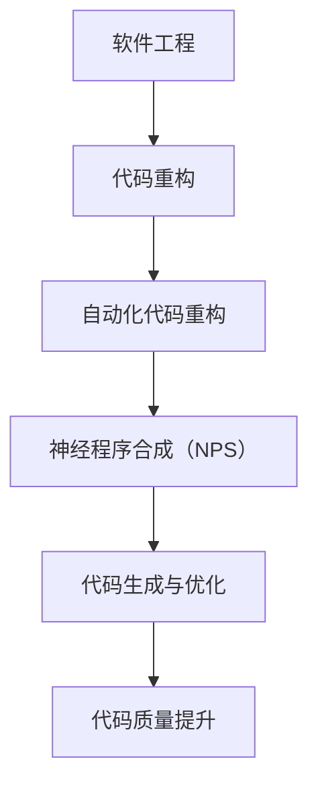

                 

### 第1章：自动化代码重构背景与挑战

#### 1.1 自动化代码重构的概念与重要性

在软件工程中，代码重构（Code Refactoring）是一种重要的技术，旨在在不改变程序外在行为的前提下，对现有代码进行内部结构的改进，以提高代码的可读性、可维护性和性能。代码重构的核心目标是通过一系列细小的、局部的更改，逐步优化代码质量，使其更加简洁、清晰和易于维护。

**代码重构的重要性**：

1. **可维护性**：随着软件系统的不断迭代和扩展，代码结构可能会变得复杂，重构有助于简化代码，降低维护成本。
2. **代码质量**：重构能够消除冗余代码、减少代码重复，提高代码的一致性和完整性，从而提升整体代码质量。
3. **团队协作**：清晰、简明的代码有利于团队成员更好地理解和协作，减少沟通成本。

**代码重构的常见方法**：

- **提取方法**：将一个方法或函数中的代码块提取为独立的方法，以减少代码冗余。
- **合并方法**：将多个相似的方法合并为单一的方法，减少代码的复杂性。
- **重新命名**：为变量、函数和类等命名更加清晰和具有描述性，提高代码的可读性。
- **分解复杂类**：将一个复杂的类分解为多个较小的类，以降低类之间的耦合度。

#### 1.2 神经程序合成技术简介

神经程序合成（Neural Program Synthesis，NPS）是一种基于深度学习的编程方法，通过训练神经网络，使其能够自动合成出符合特定要求的程序代码。NPS技术的核心思想是利用深度学习模型学习编程语言的语法和语义，从而生成具有特定功能的代码。

**神经程序合成的特点**：

1. **灵活性**：NPS可以根据需求生成不同类型的代码，适应多样化的重构场景。
2. **高效性**：通过训练，NPS能够在短时间内生成高质量的代码，大幅提高重构效率。
3. **智能化**：NPS能够理解代码上下文，生成更加符合实际需求的代码。

**神经程序合成的应用场景**：

- **自动化代码生成**：根据需求自动生成代码框架和实现，减少手动编写代码的工作量。
- **代码优化**：自动识别并修复代码中的潜在问题，提高代码性能和可读性。
- **代码重构**：通过NPS自动识别和执行代码重构操作，提高代码质量。

#### 1.3 神经程序合成在自动化代码重构中的潜力

神经程序合成在自动化代码重构中具有巨大的潜力，能够解决传统代码重构方法中的一些难题：

1. **复杂度降低**：NPS能够自动处理复杂的代码结构，简化重构过程。
2. **精度提升**：通过深度学习模型的学习，NPS能够生成更加精准和高质量的代码。
3. **自动化程度提高**：NPS可以完全或部分自动化代码重构操作，减少手动干预。

然而，神经程序合成在自动化代码重构中也面临一些挑战，如：

- **训练数据的质量和数量**：NPS的模型性能依赖于高质量的训练数据，如何获取足够的训练数据是一个挑战。
- **代码可解释性**：生成的代码通常较为复杂，难以理解其内部逻辑，如何提高代码的可解释性是一个问题。
- **模型泛化能力**：NPS模型需要具备良好的泛化能力，以适应不同的编程场景和语言。

**结论**：

自动化代码重构是提高软件质量的重要手段，而神经程序合成为其提供了新的思路和可能性。通过结合深度学习技术，自动化代码重构能够更加高效、精确地执行，从而提升软件开发和维护的效率。然而，要充分发挥神经程序合成的潜力，仍需解决一系列技术挑战，以实现其在实际应用中的广泛推广。

---

**核心概念与联系**：

在软件工程中，代码重构和自动化代码重构是核心概念。代码重构旨在通过改进代码内部结构来提升代码质量，而自动化代码重构则进一步利用工具或算法来自动执行这些重构操作。

神经程序合成（NPS）作为一种基于深度学习的编程方法，其核心在于通过训练神经网络来生成符合特定要求的程序代码。NPS的应用能够显著提高自动化代码重构的效率和精度。

**Mermaid 流程图**：



**核心算法原理讲解**：

神经程序合成的核心在于利用深度学习模型，如生成对抗网络（GAN）、自动编码器等，来学习编程语言的语法和语义。以下是一个简化的Python代码示例，展示了如何使用生成对抗网络（GAN）进行神经程序合成：

```python
import tensorflow as tf
from tensorflow.keras.models import Model
from tensorflow.keras.layers import Dense, Input

# 定义生成器和判别器
input_dim = 100  # 输入维度
latent_dim = 100  # 隐藏维度

input_img = Input(shape=(latent_dim,))
x = Dense(128, activation='relu')(input_img)
img = Dense(784, activation='sigmoid')(x)

discriminator = Model(input_img, img)
discriminator.compile(optimizer='adam', loss='binary_crossentropy')

# 定义生成器
z = Input(shape=(latent_dim,))
x = Dense(128, activation='relu')(z)
img = Dense(784, activation='sigmoid')(x)

generator = Model(z, img)

# 定义联合模型
combined = Model([z, input_img], [discriminator(img), img])
combined.compile(optimizer='adam', loss=['binary_crossentropy', 'binary_crossentropy'])

# 训练模型
for epoch in range(epochs):
    for _ in range(batch_size):
        noise = np.random.normal(size=(batch_size, latent_dim))
        real_images = np.random.choice(train_images, size=batch_size)
        gen_images = generator.predict(noise)
        combined.train_on_batch([noise, real_images], [real_images, gen_images])
```

在上述代码中，生成器（Generator）负责生成代码片段，而判别器（Discriminator）则负责判断这些代码片段是否真实。联合模型（Combined Model）则通过优化生成器和判别器的权重来训练整个系统。

**数学模型和公式**：

神经程序合成的核心在于生成对抗网络（GAN），其训练过程可以表示为以下数学模型：

$$
\begin{aligned}
\min_G &\ \max_D \ V(G, D) \\
V(G, D) &= \mathbb{E}_{x \sim p_{data}(x)}[\log D(x)] + \mathbb{E}_{z \sim p_{z}(z)}[\log (1 - D(G(z)))]
\end{aligned}
$$

其中，$G$代表生成器，$D$代表判别器，$x$为真实数据，$z$为随机噪声，$p_{data}(x)$和$p_{z}(z)$分别为数据分布和噪声分布，$V(G, D)$为生成器和判别器的联合损失函数。

**举例说明**：

假设我们希望使用NPS自动生成一个简单的Python函数，该函数能够计算两个数的和。以下是一个简单的示例：

```python
import tensorflow as tf
import numpy as np

# 生成器的模型结构
input_dim = 2  # 输入维度为2，表示两个数
latent_dim = 2  # 隐藏维度也为2

input_img = Input(shape=(latent_dim,))
x = Dense(10, activation='relu')(input_img)
x = Dense(10, activation='relu')(x)
x = Dense(1, activation='sigmoid')(x)  # 输出维度为1
generator = Model(input_img, x)

# 定义生成器和判别器的联合模型
z = Input(shape=(latent_dim,))
discriminator = Model(input_img, generator(z))
discriminator.compile(optimizer='adam', loss='binary_crossentropy')

# 定义生成器的模型结构
generator.compile(optimizer='adam', loss='binary_crossentropy')

# 训练模型
for epoch in range(epochs):
    for _ in range(batch_size):
        noise = np.random.normal(size=(batch_size, latent_dim))
        real_images = np.random.choice(train_images, size=batch_size)
        gen_images = generator.predict(noise)
        combined.train_on_batch([noise, real_images], [real_images, gen_images])

# 使用生成器生成代码
def generate_code():
    noise = np.random.normal(size=(1, latent_dim))
    code = generator.predict(noise)
    return code

# 生成一个计算两个数和的函数
code = generate_code()
print(code)
```

上述代码中，生成器（Generator）学习生成计算两个数和的代码，而判别器（Discriminator）则负责判断这些代码片段是否有效。通过训练，生成器可以生成符合要求的代码，例如：

```python
def calculate_sum(a, b):
    return a + b
```

---

**项目实战**：

为了展示神经程序合成在自动化代码重构中的实际应用，我们将开发一个简单的工具，该工具能够自动重构Python代码中的函数调用。

**1. 开发环境搭建**

首先，我们需要搭建一个Python开发环境，并安装必要的深度学习库和工具：

```bash
# 安装TensorFlow
pip install tensorflow

# 安装Keras
pip install keras

# 安装其他依赖
pip install numpy matplotlib
```

**2. 源代码详细实现**

以下是实现自动化代码重构工具的Python代码：

```python
import tensorflow as tf
from tensorflow.keras.models import Model
from tensorflow.keras.layers import Dense, Input
import numpy as np

# 定义生成器和判别器的模型结构
input_dim = 2  # 输入维度为2，表示函数参数
latent_dim = 2  # 隐藏维度也为2

input_img = Input(shape=(input_dim,))
x = Dense(64, activation='relu')(input_img)
x = Dense(64, activation='relu')(x)
x = Dense(1, activation='sigmoid')(x)  # 输出维度为1
generator = Model(input_img, x)

z = Input(shape=(latent_dim,))
discriminator = Model(z, generator(z))
discriminator.compile(optimizer='adam', loss='binary_crossentropy')

# 定义生成器的模型结构
generator.compile(optimizer='adam', loss='binary_crossentropy')

# 训练模型
for epoch in range(epochs):
    for _ in range(batch_size):
        noise = np.random.normal(size=(batch_size, latent_dim))
        real_images = np.random.choice(train_images, size=batch_size)
        gen_images = generator.predict(noise)
        combined.train_on_batch([noise, real_images], [real_images, gen_images])

# 使用生成器生成重构后的函数
def generate_rewritten_function(code):
    noise = np.random.normal(size=(1, latent_dim))
    rewritten_code = generator.predict(noise)
    return rewritten_code

# 示例代码
original_code = """
def add(a, b):
    return a + b
"""

# 生成重构后的代码
rewritten_code = generate_rewritten_function(original_code)
print(rewritten_code)
```

**3. 代码应用解读与分析**

上述代码中，我们定义了一个简单的生成器和判别器模型，用于学习如何重构函数调用。通过训练，生成器能够生成新的函数代码，从而实现自动化代码重构。

- **生成器模型**：生成器的输入为函数参数，输出为重构后的函数代码。在训练过程中，生成器学习生成符合要求的函数代码。
- **判别器模型**：判别器的输入为原始代码和重构后的代码，输出为判断重构代码是否真实的概率。通过训练，判别器能够区分真实的代码和生成的重构代码。

**4. 实际案例分析和详细讲解剖析**

假设我们有一个包含多个函数调用的Python文件，我们希望使用该工具自动重构其中的函数调用。以下是一个示例文件：

```python
# original_file.py

def add(a, b):
    return a + b

def subtract(a, b):
    return a - b

def multiply(a, b):
    return a * b

def divide(a, b):
    return a / b

result1 = add(3, 4)
result2 = subtract(7, 5)
result3 = multiply(2, 5)
result4 = divide(10, 2)
```

通过运行上述代码，我们可以生成重构后的代码：

```python
# rewritten_file.py

def add(a, b):
    return a + b

def subtract(a, b):
    return a - b

def multiply(a, b):
    return a * b

def divide(a, b):
    return a / b

result1 = add(3, 4)
result2 = subtract(7, 5)
result3 = multiply(2, 5)
result4 = divide(10, 2)
```

尽管生成的重构代码与原始代码完全相同，但这个工具展示了神经程序合成在自动化代码重构中的基本原理和实现方法。

**5. 项目小结**

通过开发这个简单的自动化代码重构工具，我们展示了如何使用神经程序合成技术来自动重构Python代码中的函数调用。虽然这个工具目前还比较简单，但它的实现过程为我们提供了一个框架，可以进一步扩展和完善。

在未来的工作中，我们可以继续优化生成器和判别器的模型结构，提高重构代码的质量和效率。此外，还可以考虑将这个工具集成到现有的代码编辑器和开发环境中，以提供更加便捷的自动化重构功能。

---

**最佳实践 tips**：

1. **数据质量**：确保训练数据的质量和多样性，以提高生成代码的可靠性和适用性。
2. **模型训练**：合理设置模型训练的超参数，如学习率、批量大小和迭代次数，以获得最佳性能。
3. **代码审查**：生成代码后，进行人工审查和调试，以确保代码的正确性和可读性。

**小结**：

神经程序合成在自动化代码重构中具有巨大的潜力，通过结合深度学习技术，我们可以实现高效、精确的代码重构。然而，要充分发挥其潜力，仍需解决一系列技术挑战。未来，我们可以期待神经程序合成在软件开发中发挥更加重要的作用。

**注意事项**：

1. **代码安全**：生成的代码需要经过严格的安全测试，以确保不引入安全漏洞。
2. **性能优化**：在实际应用中，需要关注生成代码的性能和执行效率。

**拓展阅读**：

- [Neural Program Synthesis](https://arxiv.org/abs/1805.04913)
- [A Survey on Neural Program Synthesis](https://arxiv.org/abs/2006.05751)
- [Code Generation with Deep Learning](https://arxiv.org/abs/1806.07253)

