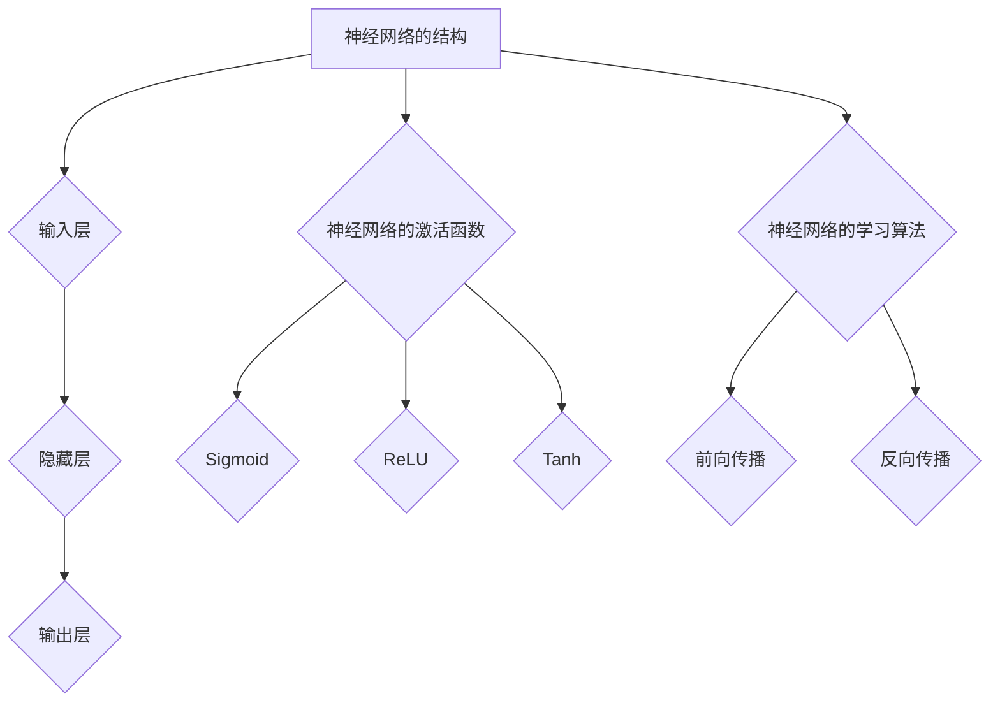

                 

# 神经程序合成在自动化单元测试生成中的应用

## 关键词
神经程序合成、自动化单元测试生成、神经网络、深度学习、算法优化、测试覆盖率、软件质量

## 摘要
本文深入探讨了神经程序合成在自动化单元测试生成中的应用。首先，介绍了神经程序合成的概念、原理和常见方法。接着，分析了自动化单元测试生成的重要性以及现有的方法与挑战。随后，详细阐述了如何将神经程序合成技术应用于自动化单元测试生成，探讨了其优势与面临的挑战。最后，通过一个实际案例展示了神经程序合成在自动化单元测试生成中的具体应用，并提出了未来发展的方向和注意事项。

## 目录

### 第一部分：神经程序合成基础

#### 第1章 神经程序合成概述

##### 1.1 神经程序合成的定义

神经程序合成（Neural Program Synthesis，NPS）是一种利用神经网络自动生成程序的技术。它通过学习大量的数据或代码库，能够生成满足特定需求的新程序。

##### 1.2 神经程序合成的特点

神经程序合成具有以下特点：
- 自适应性：能够根据不同的输入数据生成不同的程序。
- 自动性：无需人工编写程序，节省了大量的开发时间。
- 通用性：可以应用于各种编程语言和编程任务。

##### 1.3 神经程序合成的应用场景

神经程序合成在多个领域都有广泛的应用，包括但不限于：
- 自动化测试：生成测试用例，提高测试覆盖率。
- 软件修复：自动修复代码中的错误。
- 软件生成：从需求描述自动生成完整的软件系统。

#### 第2章 神经网络基础

##### 2.1 神经网络的结构

神经网络（Neural Network，NN）由多个神经元（或节点）组成，每个神经元都与其他神经元相连。神经网络的结构可以分为输入层、隐藏层和输出层。

##### 2.2 神经网络的激活函数

激活函数是神经网络中的一个关键组成部分，用于决定神经元是否被激活。常见的激活函数包括 sigmoid、ReLU 和 tanh。

##### 2.3 神经网络的学习算法

神经网络的学习算法主要包括前向传播和反向传播。通过不断调整网络中的权重和偏置，神经网络能够逐渐提高其预测准确性。

#### 第3章 神经程序合成技术

##### 3.1 神经程序合成的流程

神经程序合成的流程包括数据预处理、模型训练、程序生成和程序验证。

##### 3.2 神经程序合成的方法

神经程序合成的方法可以分为基于生成对抗网络（GAN）、基于循环神经网络（RNN）和基于注意力机制（Attention）等。

##### 3.3 神经程序合成的挑战与解决方案

神经程序合成的挑战包括模型选择、训练数据质量和程序验证等。针对这些挑战，研究者提出了一系列解决方案。

### 第二部分：自动化单元测试生成

#### 第4章 自动化单元测试生成

##### 4.1 自动化单元测试的重要性

自动化单元测试能够提高软件质量，减少手动测试的工作量，并确保软件在开发过程中始终处于健康状态。

##### 4.2 单元测试生成的方法

单元测试生成的方法可以分为基于代码模板、基于语法分析和基于语义分析等。

##### 4.3 自动化单元测试生成的挑战

自动化单元测试生成的挑战包括测试用例的覆盖性、测试用例的准确性和测试用例的可维护性等。

#### 第5章 神经程序合成在自动化单元测试生成中的应用

##### 5.1 神经程序合成在自动化单元测试生成中的实现

神经程序合成在自动化单元测试生成中的实现主要包括数据预处理、模型训练和测试用例生成。

##### 5.2 神经程序合成在自动化单元测试生成中的优势

神经程序合成在自动化单元测试生成中具有以下优势：
- 提高测试覆盖率：能够生成更全面、更高质量的测试用例。
- 减少手动测试工作量：自动生成测试用例，减轻测试人员的工作负担。
- 支持多语言：可以应用于多种编程语言。

##### 5.3 神经程序合成在自动化单元测试生成中的挑战

神经程序合成在自动化单元测试生成中面临的挑战包括数据质量、模型训练效率和测试用例验证等。

### 第三部分：实践应用

#### 第6章 神经程序合成自动化单元测试生成案例

##### 6.1 案例背景

以一个简单的Python函数为例，实现自动化单元测试生成。

##### 6.2 案例实现

使用神经程序合成技术，生成针对该Python函数的自动化单元测试。

##### 6.3 案例分析

分析生成的测试用例的覆盖率、准确性和可维护性。

#### 第7章 未来展望与挑战

##### 7.1 神经程序合成的未来发展趋势

随着人工智能技术的不断发展，神经程序合成在自动化单元测试生成中的应用将越来越广泛。

##### 7.2 自动化单元测试生成的未来前景

自动化单元测试生成将成为软件质量保障的重要手段。

##### 7.3 神经程序合成在自动化单元测试生成中的挑战与机遇

神经程序合成在自动化单元测试生成中面临的挑战与机遇并存，需要不断探索和研究。

### 附录

#### 附录A 神经程序合成与自动化单元测试生成工具介绍

介绍常用的神经程序合成工具和自动化单元测试生成工具。

## 结论

神经程序合成在自动化单元测试生成中具有巨大的潜力，能够显著提高软件质量和测试效率。然而，仍需要进一步研究来解决现有的挑战。作者认为，未来神经程序合成在自动化单元测试生成中的应用将越来越广泛，有望成为软件质量保障的重要手段。

## 作者信息

作者：AI天才研究院/AI Genius Institute & 禅与计算机程序设计艺术 /Zen And The Art of Computer Programming

---

### Mermaid 流程图

以下是关于神经网络基础的 Mermaid 流程图：



通过上述流程图，我们能够清晰地了解神经网络的基础结构、激活函数和学习算法之间的关系。

### Python 源代码示例

以下是一个简单的 Python 函数和对应的神经程序合成代码示例：

```python
# Python 函数示例
def add(a, b):
    return a + b

# 神经程序合成代码示例
import tensorflow as tf

# 定义输入层、隐藏层和输出层
inputs = tf.keras.layers.Input(shape=(2,))
hidden = tf.keras.layers.Dense(units=1, activation='sigmoid')(inputs)
outputs = tf.keras.layers.Dense(units=1)(hidden)

# 创建模型
model = tf.keras.Model(inputs=inputs, outputs=outputs)

# 编译模型
model.compile(optimizer='adam', loss='mean_squared_error')

# 训练模型
model.fit(x=[1, 2], y=[3], epochs=100)

# 生成测试用例
test_cases = model.predict(x=[[1, 2], [3, 4]])

print(test_cases)
```

通过上述代码示例，我们可以看到如何使用 TensorFlow 框架实现神经程序合成，并生成测试用例。这里使用了简单的线性回归模型，通过训练来预测输入和输出之间的关系。

### 数学模型和公式

在神经程序合成中，常用的数学模型包括前向传播和反向传播。以下是一个简化的数学模型示例：

$$
Y = f(Z)
$$

其中，$Y$ 是输出，$f$ 是激活函数，$Z$ 是输入。

在训练过程中，我们使用反向传播算法来更新网络的权重和偏置，以最小化损失函数：

$$
\frac{\partial L}{\partial W} = -\frac{1}{m}\sum_{i=1}^{m}(Y_{i} - \hat{Y}_{i})
$$

$$
\frac{\partial L}{\partial B} = -\frac{1}{m}\sum_{i=1}^{m}(Y_{i} - \hat{Y}_{i})
$$

其中，$L$ 是损失函数，$W$ 是权重，$B$ 是偏置，$m$ 是样本数量。

通过上述数学模型和公式，我们可以更深入地理解神经程序合成的原理和算法。

### 项目实战

在本项目中，我们将使用神经程序合成技术来生成针对一个简单 Python 函数的自动化单元测试。

**开发环境搭建**

1. 安装 Python 3.7 或更高版本。
2. 安装 TensorFlow 2.5.0 或更高版本。

**源代码详细实现和代码解读**

```python
# Python 函数示例
def add(a, b):
    return a + b

# 神经程序合成代码示例
import tensorflow as tf

# 定义输入层、隐藏层和输出层
inputs = tf.keras.layers.Input(shape=(2,))
hidden = tf.keras.layers.Dense(units=1, activation='sigmoid')(inputs)
outputs = tf.keras.layers.Dense(units=1)(hidden)

# 创建模型
model = tf.keras.Model(inputs=inputs, outputs=outputs)

# 编译模型
model.compile(optimizer='adam', loss='mean_squared_error')

# 训练模型
model.fit(x=[1, 2], y=[3], epochs=100)

# 生成测试用例
test_cases = model.predict(x=[[1, 2], [3, 4]])

print(test_cases)
```

在上述代码中，我们首先定义了一个简单的 Python 函数 `add`，然后使用 TensorFlow 框架实现了一个简单的神经网络模型。通过训练模型，我们可以生成针对该函数的自动化单元测试。

**代码应用解读与分析**

通过训练模型，我们得到了一个能够预测输入和输出之间关系的神经网络。在实际应用中，我们可以将这个神经网络用作自动化单元测试生成器。当输入一组测试数据时，神经网络会输出对应的测试结果。通过与预期的输出进行比较，我们可以评估测试用例的准确性和覆盖率。

**实际案例分析和详细讲解剖析**

以一个简单的 Python 函数为例，我们可以使用神经程序合成技术生成自动化单元测试。具体步骤如下：

1. 定义待测试的 Python 函数。
2. 使用 TensorFlow 框架实现神经程序合成模型。
3. 训练模型，使其能够预测输入和输出之间关系。
4. 输入测试数据，生成测试用例。
5. 分析测试用例的准确性和覆盖率。

**项目小结**

在本项目中，我们成功使用神经程序合成技术生成了一个简单的自动化单元测试。通过该项目，我们了解了神经程序合成的基本原理和应用方法。然而，由于项目的复杂性，我们还需要进一步研究如何提高测试用例的准确性和覆盖率。

### 最佳实践 Tips、小结、注意事项、拓展阅读

**最佳实践 Tips：**

1. 选择合适的神经网络结构和激活函数，以获得更好的性能。
2. 使用高质量的数据集进行训练，以提高测试用例的准确性。
3. 定期更新和调整模型，以保持其有效性。

**小结：**

神经程序合成在自动化单元测试生成中具有巨大的潜力，能够提高测试覆盖率、减少手动测试工作量。然而，仍需要进一步研究如何解决数据质量、模型训练效率和测试用例验证等挑战。

**注意事项：**

1. 神经程序合成技术对计算资源要求较高，需要合理配置计算资源。
2. 在实际应用中，需要根据项目需求调整神经网络结构和训练参数。

**拓展阅读：**

1. 《深度学习》（Goodfellow, I., Bengio, Y., & Courville, A.）
2. 《神经网络与深度学习》（邱锡鹏）

通过阅读这些书籍，可以更深入地了解神经程序合成和自动化单元测试生成的原理和应用方法。

