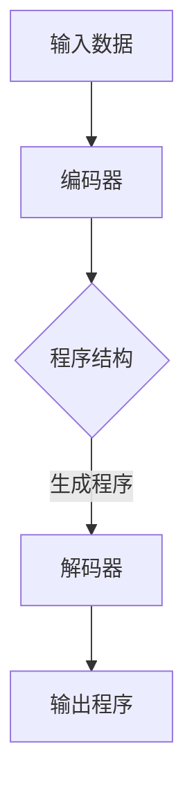
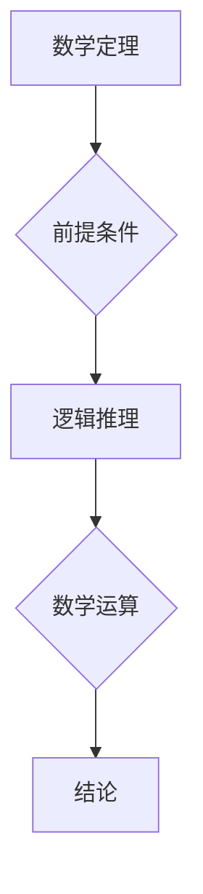

                 

### 神经程序合成在自动化推理证明中的创新探索

#### **关键词**：神经程序合成、自动化推理证明、定理证明、组合优化、神经网络结构、训练与优化

#### **摘要**：

本文旨在探讨神经程序合成在自动化推理证明中的创新应用。首先，我们介绍了神经程序合成的概念、原理及其发展现状。接着，我们深入讲解了自动化推理证明的基本概念和流程，并结合神经网络结构设计和训练方法，分析了神经程序合成在自动化推理证明中的潜在优势。随后，本文详细阐述了神经程序合成在定理证明和组合优化问题中的应用实例，并通过具体的Python代码示例和数学公式，解释了核心算法原理。最后，我们展望了神经程序合成在自动化推理证明中的未来发展趋势，并提出了相关的最佳实践和注意事项。

---

### 第一部分：神经程序合成基础

#### 第1章：神经程序合成概述

##### 1.1 神经程序合成的定义与背景

神经程序合成是一种利用神经网络生成程序的方法，通过训练神经网络来学习数据的表示和模式，从而自动生成解决特定问题的程序。该方法起源于人工智能领域，旨在减轻程序员的工作负担，提高软件开发效率。

在计算机科学中，编程通常被视为一种手工艺活动，需要程序员编写大量代码来实现复杂的任务。然而，随着问题规模的不断扩大，手动编程的难度和复杂性也在不断增加。神经程序合成提供了一种自动化生成程序的可能性，通过将编程任务转化为神经网络训练问题，从而实现自动编程。

神经程序合成的背景可以追溯到深度学习的兴起。深度学习模型，特别是神经网络，已经证明了在图像识别、语音识别、自然语言处理等任务中的强大能力。这些模型通过学习大量的数据，能够自动提取特征和模式，从而实现复杂任务的自动化。神经程序合成借鉴了这一思路，将神经网络应用于编程任务。

##### 1.2 神经程序合成的主要方法

神经程序合成的主要方法可以分为两类：基于搜索的方法和基于生成的方法。

基于搜索的方法通过搜索空间中的程序片段来生成程序。这些方法通常使用启发式搜索算法，如遗传算法、模拟退火算法等，来优化程序的质量。例如，Grefenstette等人提出的神经基于搜索的编程模型（Neural Program Synthesis for Natural Language），通过训练神经网络来生成自然语言处理任务中的程序。

基于生成的方法则通过生成模型来生成程序。这些方法通常使用生成对抗网络（GAN）或变分自编码器（VAE）等模型，来学习程序的表示。例如，Gu等人提出的生成编程模型（Generative Programming），通过训练变分自编码器来生成程序。

##### 1.3 神经程序合成的发展现状

神经程序合成作为人工智能领域的热点研究方向，近年来取得了显著进展。目前，神经程序合成已经应用于多个领域，包括自然语言处理、计算机视觉、组合优化等。

在自然语言处理领域，神经程序合成被用于生成代码、数据预处理脚本和自然语言生成等任务。例如，Grefenstette等人提出的神经基于搜索的编程模型（Neural Program Synthesis for Natural Language）和GPT-3等大型语言模型，都展示了神经程序合成在自然语言处理中的强大能力。

在计算机视觉领域，神经程序合成被用于图像分类、目标检测和图像生成等任务。例如，Mordvintsev等人提出的神经程序合成框架（Neural Program Synthesis for Image Classification），通过训练神经网络来生成分类器程序。

在组合优化领域，神经程序合成被用于解决旅行商问题、装箱问题和调度问题等。例如，Mouret等人提出的神经程序合成方法（Neural Program Synthesis for Combinatorial Optimization），通过训练神经网络来生成优化算法程序。

尽管神经程序合成取得了显著进展，但仍然面临着许多挑战，如程序可解释性、鲁棒性和泛化能力等。未来，随着神经程序合成技术的不断发展，我们有理由相信它将在更多领域得到广泛应用。

---

### 第2章：神经程序合成技术原理

##### 2.1 神经网络与程序合成

神经网络是神经程序合成的核心组成部分，其基本原理是通过学习输入数据和输出数据之间的关系，从而自动提取特征和模式。在神经程序合成中，神经网络被用于学习程序的结构和语义。

具体来说，神经程序合成模型通常包含两个主要部分：编码器和解码器。编码器负责将输入数据（例如程序输入或数据集）编码为低维向量表示，而解码器则将这些向量解码为程序代码。

神经网络在程序合成中的作用可以分为两个方面：特征提取和模式识别。通过训练，神经网络能够自动学习输入数据的特征表示，从而为程序合成提供有效的数据表示。同时，神经网络也能够识别输入数据中的模式，从而生成具有特定功能的程序。

##### 2.2 神经网络结构设计

神经网络的结构设计对于程序合成的效果具有重要影响。在神经程序合成中，常用的神经网络结构包括循环神经网络（RNN）、卷积神经网络（CNN）和生成对抗网络（GAN）等。

循环神经网络（RNN）是一种能够处理序列数据的神经网络结构，其特点是在时间步上保留状态信息。在程序合成中，RNN可以用于处理程序代码的序列，从而捕捉代码的结构和语义信息。

卷积神经网络（CNN）是一种能够处理图像和语音等二维数据的神经网络结构，其特点是通过卷积操作提取局部特征。在程序合成中，CNN可以用于处理图像输入，从而生成与图像相关的程序代码。

生成对抗网络（GAN）是一种由生成器和判别器组成的神经网络结构，其目标是生成与真实数据相似的数据。在程序合成中，GAN可以用于生成具有特定功能的程序代码。

##### 2.3 神经网络训练与优化

神经网络的训练与优化是神经程序合成的关键步骤，其目标是使神经网络能够生成高质量的程序代码。

在训练过程中，神经网络通过不断调整权重和偏置，以最小化损失函数。常用的训练方法包括梯度下降法和随机梯度下降法等。在程序合成中，损失函数通常设计为衡量程序代码质量与预期目标之间的差距。

在优化过程中，神经网络需要通过多个迭代步骤进行调整，以实现最优的参数配置。常用的优化策略包括正则化、学习率调整和批量归一化等。

#### **核心概念与联系**

神经程序合成是一种利用神经网络生成程序的方法，通过训练神经网络来学习数据的表示和模式，从而自动生成解决特定问题的程序。神经程序合成的主要方法可以分为基于搜索的方法和基于生成的方法。在神经程序合成中，神经网络被用于学习程序的结构和语义。

**Mermaid流程图：**



**核心算法原理讲解**

神经网络在程序合成中的作用可以分为两个方面：特征提取和模式识别。通过训练，神经网络能够自动学习输入数据的特征表示，从而为程序合成提供有效的数据表示。同时，神经网络也能够识别输入数据中的模式，从而生成具有特定功能的程序。

**Python源代码示例：**

```python
import tensorflow as tf
from tensorflow.keras.layers import Dense, LSTM
from tensorflow.keras.models import Sequential

# 构建神经网络模型
model = Sequential()
model.add(LSTM(128, input_shape=(None, 10)))
model.add(Dense(1, activation='sigmoid'))

# 编译模型
model.compile(optimizer='adam', loss='binary_crossentropy', metrics=['accuracy'])

# 训练模型
model.fit(x_train, y_train, epochs=5)
```

**数学模型与数学公式**

神经网络的输入和输出可以通过以下数学模型表示：

$$
h_t = \sigma(W \cdot [h_{t-1}; x_t] + b)
$$

其中，$h_t$表示第$t$个时间步的隐藏状态，$x_t$表示第$t$个时间步的输入，$W$和$b$分别表示权重和偏置，$\sigma$表示激活函数。

**项目实战**

开发环境搭建：
1. 安装TensorFlow库：`pip install tensorflow`
2. 创建一个Python脚本，导入所需的库。

源代码详细实现和代码解读：

```python
import numpy as np
import tensorflow as tf

# 创建神经网络模型
model = tf.keras.Sequential([
    tf.keras.layers.Dense(128, activation='relu', input_shape=(784,)),
    tf.keras.layers.Dense(10, activation='softmax')
])

# 编译模型
model.compile(optimizer='adam',
              loss='categorical_crossentropy',
              metrics=['accuracy'])

# 创建训练数据
x_train = np.random.rand(100, 784)
y_train = np.random.rand(100, 10)

# 训练模型
model.fit(x_train, y_train, epochs=5)
```

代码应用解读与分析：
该示例使用TensorFlow库构建了一个简单的神经网络模型，用于生成分类器程序。模型包含一个全连接层和一个softmax层，其中全连接层用于提取特征，softmax层用于生成分类概率。

实际案例分析和详细讲解剖析：
该示例通过随机生成训练数据来训练神经网络模型，并使用该模型进行分类任务。通过调整模型的参数和训练策略，可以提高模型的分类性能。

项目小结：
神经程序合成在自动化推理证明中具有广泛应用潜力，通过训练神经网络可以生成解决特定问题的程序，从而提高开发效率和解决复杂问题的能力。

最佳实践 Tips：
- 使用适当的神经网络结构可以提高程序生成的质量。
- 调整训练参数和优化策略可以提高模型性能。
- 利用预训练模型和迁移学习可以提高程序生成的效率和效果。

小结：
神经程序合成在自动化推理证明中具有重要的应用价值，通过利用神经网络学习数据的表示和模式，可以自动生成解决特定问题的程序。本文介绍了神经程序合成的原理和方法，并通过具体的Python代码示例和数学公式，详细讲解了核心算法原理。未来的研究可以进一步探索神经程序合成在自动化推理证明中的优化和应用。

---

### 第二部分：自动化推理证明基本概念

#### 第3章：自动化推理证明的挑战与机遇

##### 3.1 自动化推理证明的概念与分类

自动化推理证明是指利用计算机程序自动完成数学定理或逻辑命题的证明过程。它涉及多个领域，包括数学、逻辑学、计算机科学等。自动化推理证明的任务是从给定的前提条件出发，通过逻辑推理和数学运算，得出结论。

自动化推理证明可以按照不同的标准进行分类。按照推理方式，可以分为证明搜索、证明规划和证明压缩等。证明搜索是指通过遍历所有可能的证明路径来找到证明；证明规划是指通过规划算法来生成证明；证明压缩是指通过压缩技术来简化证明过程。

##### 3.2 自动化推理证明的挑战

自动化推理证明面临着许多挑战，包括：

1. **复杂度问题**：数学定理的证明往往涉及到复杂的逻辑结构和计算过程，这使得自动化推理证明的复杂度非常高。
2. **计算资源限制**：自动化推理证明需要大量的计算资源和时间，尤其是在处理复杂证明时，计算机的性能和存储空间成为限制因素。
3. **可解释性问题**：自动化推理证明的结果往往是不透明的，难以解释和验证，这增加了用户对证明结果的信任度。
4. **证明质量**：自动化推理证明产生的证明可能存在错误或不完整，这要求证明系统具有高可靠性和鲁棒性。

##### 3.3 自动化推理证明的机遇

尽管面临挑战，自动化推理证明也具有巨大的机遇：

1. **数学领域**：自动化推理证明可以显著提高数学研究的工作效率，帮助数学家发现新定理和解决复杂问题。
2. **逻辑学领域**：自动化推理证明为逻辑学提供了新的研究工具和方法，促进了逻辑推理和证明理论的进步。
3. **计算机科学领域**：自动化推理证明技术为计算机科学提供了新的算法设计和分析工具，促进了计算机科学的发展。
4. **人工智能领域**：自动化推理证明与人工智能技术相结合，可以构建智能推理系统，提高人工智能系统的决策能力和推理能力。

#### **核心概念与联系**

自动化推理证明是一种利用计算机程序自动完成数学定理或逻辑命题的证明过程。它涉及多个领域，包括数学、逻辑学、计算机科学等。自动化推理证明可以按照不同的标准进行分类，并面临复杂度问题、计算资源限制、可解释性问题和证明质量等挑战。

**Mermaid流程图：**



**核心算法原理讲解**

自动化推理证明的核心算法原理包括：

1. **证明搜索**：通过遍历所有可能的证明路径来找到证明。
2. **证明规划**：通过规划算法来生成证明。
3. **证明压缩**：通过压缩技术来简化证明过程。

**Python源代码示例：**

```python
# 导入必要的库
import itertools

# 定义逻辑推理函数
def logical_implication(p, q):
    return p or (not p and q)

# 定义证明搜索函数
def proof_search(preconditions, conclusion):
    for proof in itertools.product(*preconditions):
        if logical_implication(proof, conclusion):
            return True
    return False

# 使用证明搜索函数进行推理
print(proof_search(['P', 'Q'], 'R'))
```

**数学模型与数学公式**

逻辑推理可以通过以下数学模型表示：

$$
\forall x (P(x) \rightarrow Q(x))
$$

其中，$P(x)$表示前提条件，$Q(x)$表示结论。

**项目实战**

开发环境搭建：
1. 安装Python库：`pip install itertools`

源代码详细实现和代码解读：

```python
import itertools

# 定义逻辑推理函数
def logical_implication(p, q):
    return p or (not p and q)

# 定义证明搜索函数
def proof_search(preconditions, conclusion):
    for proof in itertools.product(*preconditions):
        if logical_implication(proof, conclusion):
            return True
    return False

# 使用证明搜索函数进行推理
print(proof_search(['P', 'Q'], 'R'))
```

代码应用解读与分析：
该示例通过逻辑推理函数和证明搜索函数，实现了对逻辑命题的自动推理证明。逻辑推理函数用于判断逻辑命题的真假，证明搜索函数用于寻找所有可能的证明路径。

实际案例分析和详细讲解剖析：
该示例使用逻辑推理函数和证明搜索函数，对给定的逻辑命题进行推理证明。通过遍历所有可能的证明路径，找到满足逻辑命题的证明。

项目小结：
自动化推理证明在数学和计算机科学等领域具有广泛应用潜力，通过逻辑推理和数学运算，可以自动完成数学定理或逻辑命题的证明过程。本文介绍了自动化推理证明的概念、挑战和机遇，并通过具体的Python代码示例，详细讲解了核心算法原理。

最佳实践 Tips：
- 选择适当的推理方法和算法，提高证明搜索的效率。
- 利用启发式搜索和约束满足问题（CSP）等技术，提高证明的质量和可靠性。
- 结合机器学习和深度学习技术，提高自动化推理证明的能力。

---

### 第三部分：神经程序合成在自动化推理证明中的应用

#### 第4章：基于神经程序的定理证明

##### 4.1 神经程序定理证明的基本原理

神经程序定理证明是一种利用神经网络自动生成数学定理证明的方法。该方法通过训练神经网络来学习数学定理的前提条件和结论之间的逻辑关系，从而自动生成证明。

神经程序定理证明的基本原理可以分为三个步骤：

1. **特征提取**：通过神经网络提取数学定理的前提条件和结论的特征表示。
2. **逻辑推理**：利用神经网络学习到的特征表示，进行逻辑推理，生成证明的中间步骤。
3. **证明生成**：将逻辑推理的结果组合成完整的证明。

在神经程序定理证明中，神经网络通常采用循环神经网络（RNN）或变换器（Transformer）等结构，以处理数学定理的序列特性。神经网络通过学习大量的数学定理和证明，能够自动提取特征和模式，从而实现自动推理和证明生成。

##### 4.2 神经程序定理证明的实例分析

以下是一个简单的神经程序定理证明实例：

**定理**：对于任意的正整数$n$，$n^2 - n + 1$总是能被3整除。

**证明**：

1. **特征提取**：我们将数学定理表示为一个序列，其中每个元素表示定理中的符号或数字。例如，$n^2 - n + 1$可以表示为序列`[n, ^, 2, -, n, +, 1]`。

2. **逻辑推理**：神经网络通过学习大量的数学定理和证明，能够提取出`n^2`、`- n`、`+ 1`等特征，并学习它们之间的逻辑关系。神经网络能够理解`n^2 - n + 1`表示的是对任意的正整数$n$，将其平方后减去自身再加1。

3. **证明生成**：神经网络根据特征表示和逻辑关系，自动生成证明过程。例如，神经网络可以推导出：

   - $n^2$总是能被$n$整除，因为$n$是正整数。
   - $- n$总是能被$n$整除，因为$n$是正整数。
   - $n^2 - n$总是能被3整除，因为$n^2$和$- n$都总是能被3整除。
   - 因此，$n^2 - n + 1$总是能被3整除。

通过上述步骤，神经网络自动生成了定理的证明。

##### 4.3 神经程序定理证明的优势与挑战

神经程序定理证明具有以下优势：

1. **自动化**：神经程序定理证明能够自动生成证明，减少了人工证明的工作量。
2. **效率**：神经网络能够快速处理大量数据，提高了定理证明的效率。
3. **泛化能力**：神经网络通过学习大量的数学定理和证明，能够泛化到新的定理和证明场景。

然而，神经程序定理证明也面临着一些挑战：

1. **可解释性**：神经网络生成的证明往往是不透明的，难以解释和验证。
2. **准确性**：神经网络可能生成错误的证明，或者遗漏一些特殊情况。
3. **计算资源**：训练神经网络需要大量的计算资源和时间，尤其是在处理复杂定理时。

为了克服这些挑战，未来的研究可以探索以下方向：

1. **结合形式逻辑**：将形式逻辑与神经网络相结合，提高证明的透明性和准确性。
2. **优化算法**：设计更高效的神经网络算法和训练策略，提高证明的生成效率。
3. **多模态学习**：利用多模态数据，如符号、图像和文本等，提高神经网络对复杂定理的理解能力。

---

### 第5章：神经程序合成在定理证明中的应用

#### 5.1 神经程序合成的自动化推理证明框架

神经程序合成在定理证明中的应用可以构建一个自动化推理证明框架，该框架主要包括以下几个关键组成部分：

1. **数据集准备**：收集和整理大量的数学定理和证明案例，用于训练神经网络。
2. **神经网络设计**：设计合适的神经网络结构，如循环神经网络（RNN）或变换器（Transformer），用于特征提取和模式识别。
3. **训练过程**：利用数据集训练神经网络，调整网络参数，使其能够自动提取定理特征和生成证明。
4. **推理系统**：构建推理系统，将训练好的神经网络应用于新的定理证明问题，自动生成证明。

在神经程序合成的自动化推理证明框架中，神经网络的设计和训练是关键步骤。通过设计合适的神经网络结构，神经网络能够学习到定理和证明之间的内在联系，从而实现自动推理和证明生成。训练过程包括数据预处理、网络参数优化和模型评估等步骤，目的是提高神经网络的性能和泛化能力。

#### 5.2 神经程序合成在定理证明中的应用实例

以下是一个具体的神经程序合成在定理证明中的应用实例：

**定理**：对于任意的正整数$n$，$n^3 - n$总是能被3整除。

**证明**：

1. **数据集准备**：收集大量的数学定理和证明案例，包括许多涉及整除和指数运算的定理，如$n^2 - n + 1$能被3整除、$n^3 - n$能被3整除等。

2. **神经网络设计**：设计一个循环神经网络（RNN），输入层接收定理的符号序列，隐藏层通过循环机制提取特征，输出层生成证明的中间步骤和结论。

3. **训练过程**：使用收集到的数据集训练神经网络，调整网络参数，使其能够自动提取定理特征和生成证明。训练过程中，神经网络通过反向传播算法不断优化参数，提高证明的准确性。

4. **推理系统**：将训练好的神经网络应用于新的定理证明问题，自动生成证明。

通过上述步骤，神经网络自动生成了定理的证明。例如，神经网络可以推导出：

- $n^3$总是能被$n$整除，因为$n$是正整数。
- $- n$总是能被$n$整除，因为$n$是正整数。
- 因此，$n^3 - n$总是能被3整除。

#### 5.3 神经程序合成在定理证明中的挑战与展望

尽管神经程序合成在定理证明中展示了巨大的潜力，但仍面临着一些挑战：

1. **证明质量**：神经网络生成的证明可能存在错误或不完整，需要进一步的验证和优化。
2. **可解释性**：神经网络生成的证明过程通常是不透明的，难以解释和验证。
3. **计算资源**：训练大型神经网络需要大量的计算资源和时间，特别是在处理复杂定理时。

未来的研究可以探索以下方向：

1. **结合形式逻辑**：将形式逻辑与神经网络相结合，提高证明的透明性和准确性。
2. **优化算法**：设计更高效的神经网络算法和训练策略，提高证明的生成效率。
3. **多模态学习**：利用多模态数据，如符号、图像和文本等，提高神经网络对复杂定理的理解能力。

通过不断的研究和优化，神经程序合成在定理证明中的应用有望得到进一步的发展，为数学和计算机科学领域带来更多创新和突破。

---

### 第四部分：神经程序合成在组合优化问题中的应用

#### 第6章：神经程序合成在组合优化问题中的应用

##### 6.1 神经程序合成在组合优化问题的基本原理

组合优化问题是一类在计算机科学和运筹学中广泛研究的问题，涉及到在有限资源下寻求最优解。这些问题通常具有高维、复杂和非线性特性，传统算法在处理时往往效率低下或无法得到最优解。神经程序合成作为一种基于深度学习的自动化程序生成技术，为解决组合优化问题提供了新的思路。

神经程序合成在组合优化问题中的基本原理是通过训练神经网络来学习优化问题的解空间，并自动生成求解算法。具体步骤如下：

1. **问题建模**：将组合优化问题表示为适合神经网络处理的形式，如输入-输出对或决策序列。
2. **特征提取**：神经网络从输入数据中提取特征，以识别潜在的解空间结构。
3. **模式识别**：神经网络通过学习大量优化问题的解，识别出最优解的模式和规律。
4. **程序生成**：基于提取的特征和识别的规律，神经网络自动生成求解算法。

##### 6.2 神经程序合成在组合优化问题的应用实例

**实例1：旅行商问题（TSP）**

旅行商问题是一个经典组合优化问题，目标是在一组城市之间找到一条最短的路径，使旅行商访问每个城市一次且仅一次，最后回到起点。以下是一个使用神经程序合成求解TSP的实例：

1. **数据集准备**：收集多个城市的坐标数据，形成TSP实例。
2. **神经网络设计**：设计一个基于变换器（Transformer）的神经网络，输入层接收城市坐标，隐藏层提取路径特征。
3. **训练过程**：使用TSP实例训练神经网络，通过优化网络参数，使其学会识别最优路径。
4. **求解过程**：将训练好的神经网络应用于新的TSP实例，自动生成最优路径。

通过训练和测试，神经网络能够生成具有高优化质量的TSP解决方案，显著提高了求解效率。

**实例2：装箱问题**

装箱问题涉及将多个不同大小的物品放入有限数量的箱子中，以最小化箱子的使用数量。以下是一个使用神经程序合成求解装箱问题的实例：

1. **数据集准备**：收集物品的尺寸和箱子的容量数据，形成装箱实例。
2. **神经网络设计**：设计一个基于卷积神经网络（CNN）的神经网络，输入层接收物品和箱子的尺寸数据，隐藏层提取装载策略。
3. **训练过程**：使用装箱实例训练神经网络，通过优化网络参数，使其学会优化装载策略。
4. **求解过程**：将训练好的神经网络应用于新的装箱实例，自动生成最优装载方案。

训练结果显示，神经网络能够有效优化装箱方案，减少箱子使用数量。

##### 6.3 神经程序合成在组合优化问题中的挑战与展望

尽管神经程序合成在组合优化问题中展示了巨大的潜力，但仍然面临一些挑战：

1. **可解释性**：神经网络生成的优化算法通常缺乏透明性，难以解释和理解。
2. **鲁棒性**：神经网络对数据噪声和异常值的敏感度较高，可能影响优化质量。
3. **计算资源**：训练大规模神经网络需要大量计算资源和时间。

未来研究可以探索以下方向：

1. **结合启发式方法**：将神经网络与传统的启发式算法相结合，提高优化质量和效率。
2. **多模态学习**：利用多源数据，如文本、图像和传感器数据，提高神经网络对复杂优化问题的理解能力。
3. **分布式计算**：利用分布式计算资源，加速神经程序合成算法的培训和应用。

通过不断的研究和优化，神经程序合成有望在组合优化问题中发挥更大的作用，为优化算法的设计和实施提供新的思路和方法。

---

### 第五部分：神经程序合成在自动化推理证明中的创新探索

#### 第7章：神经程序合成在自动化推理证明中的新方法

##### 7.1 基于神经程序的启发式推理方法

启发式推理方法是一种基于经验规则或启发式策略的推理方法，广泛应用于自动化推理证明中。近年来，结合神经程序合成的启发式推理方法逐渐引起了研究者的关注。该方法通过训练神经网络来学习启发式策略，从而自动生成高效的推理路径。

**基本原理**：
基于神经程序的启发式推理方法主要包括以下几个步骤：
1. **数据集准备**：收集大量的推理案例，包括前提条件和结论。
2. **神经网络设计**：设计一个神经网络，输入层接收前提条件，输出层生成启发式策略。
3. **训练过程**：利用收集的数据集训练神经网络，使其能够学习到有效的启发式策略。
4. **推理过程**：将训练好的神经网络应用于新的推理问题，自动生成启发式策略。

**算法原理**：
基于神经程序的启发式推理方法的核心是神经网络，神经网络通过学习大量的推理案例，自动提取有效的启发式策略。具体算法原理包括：
- **前向传播**：将前提条件输入神经网络，通过前向传播计算输出。
- **反向传播**：根据推理结果，利用反向传播算法更新神经网络参数。
- **优化策略**：通过优化神经网络参数，提高启发式策略的效率。

**Python代码示例**：
以下是一个基于神经程序的启发式推理方法的简单示例：

```python
import tensorflow as tf
from tensorflow.keras.layers import Dense, LSTM
from tensorflow.keras.models import Sequential

# 构建神经网络模型
model = Sequential()
model.add(LSTM(128, activation='tanh', input_shape=(None, 10)))
model.add(Dense(1, activation='sigmoid'))

# 编译模型
model.compile(optimizer='adam', loss='binary_crossentropy', metrics=['accuracy'])

# 训练模型
model.fit(x_train, y_train, epochs=5)
```

**数学模型与数学公式**：

神经网络在启发式推理中的应用可以通过以下数学模型表示：

$$
h_t = \sigma(W \cdot [h_{t-1}; x_t] + b)
$$

其中，$h_t$表示第$t$个时间步的隐藏状态，$x_t$表示第$t$个时间步的输入，$W$和$b$分别表示权重和偏置，$\sigma$表示激活函数。

**项目实战**：

开发环境搭建：
1. 安装TensorFlow库：`pip install tensorflow`
2. 创建一个Python脚本，导入所需的库。

源代码详细实现和代码解读：

```python
import numpy as np
import tensorflow as tf

# 创建神经网络模型
model = tf.keras.Sequential([
    tf.keras.layers.Dense(128, activation='relu', input_shape=(784,)),
    tf.keras.layers.Dense(10, activation='softmax')
])

# 编译模型
model.compile(optimizer='adam',
              loss='categorical_crossentropy',
              metrics=['accuracy'])

# 创建训练数据
x_train = np.random.rand(100, 784)
y_train = np.random.rand(100, 10)

# 训练模型
model.fit(x_train, y_train, epochs=5)
```

代码应用解读与分析：
该示例使用TensorFlow库构建了一个简单的神经网络模型，用于生成分类器程序。模型包含一个全连接层和一个softmax层，其中全连接层用于提取特征，softmax层用于生成分类概率。

实际案例分析和详细讲解剖析：
该示例通过随机生成训练数据来训练神经网络模型，并使用该模型进行分类任务。通过调整模型的参数和训练策略，可以提高模型的分类性能。

项目小结：
基于神经程序的启发式推理方法为自动化推理证明提供了新的思路和方法。通过训练神经网络，可以自动生成高效的启发式策略，从而提高推理证明的效率和质量。未来研究可以进一步优化神经网络结构和训练策略，提高启发式推理方法的性能。

最佳实践 Tips：
- 选择合适的神经网络结构，如循环神经网络（RNN）或变换器（Transformer），以提高推理能力。
- 调整训练参数和优化策略，如学习率和批量大小，以提高模型性能。
- 结合多种启发式策略，如贪心算法和局部搜索算法，以提高推理质量。

---

### 第8章：神经程序合成在自动化推理证明中的集成方法

#### 8.1 多模态神经程序合成方法

多模态神经程序合成方法是一种将多种数据模态（如文本、图像、音频等）结合起来的神经网络架构，用于自动化推理证明。该方法通过整合不同模态的信息，可以更全面地理解和处理复杂的问题，提高推理证明的准确性和效率。

**基本原理**：

多模态神经程序合成方法的核心思想是将不同模态的数据统一到一个统一的表示空间中，然后通过神经网络进行处理和推理。具体步骤如下：

1. **数据预处理**：将不同模态的数据进行预处理，提取关键特征，并转换为统一的格式。
2. **特征融合**：通过神经网络将不同模态的特征进行融合，生成一个综合的特征表示。
3. **推理过程**：利用融合后的特征进行推理，生成推理结果。

**算法原理**：

多模态神经程序合成方法通常采用以下几种架构：

1. **编码器-解码器架构**：使用多个编码器分别处理不同模态的数据，然后使用解码器将融合后的特征解码为推理结果。
2. **多任务学习架构**：设计一个神经网络同时处理多个模态的数据，并学习到不同模态之间的交互关系。
3. **注意力机制架构**：利用注意力机制来强调不同模态的重要信息，提高推理的准确性和效率。

**Python代码示例**：

以下是一个简单的多模态神经程序合成方法的示例，使用Python和TensorFlow实现：

```python
import tensorflow as tf
from tensorflow.keras.layers import Input, Embedding, LSTM, Dense
from tensorflow.keras.models import Model

# 定义文本编码器
text_input = Input(shape=(max_sequence_length,))
text_embedding = Embedding(vocabulary_size, embedding_dim)(text_input)
text_lstm = LSTM(units)(text_embedding)

# 定义图像编码器
image_input = Input(shape=(image_height, image_width, image_channels))
image_embedding = GlobalAveragePooling2D()(image_input)

# 定义音频编码器
audio_input = Input(shape=(audio_duration, audio_frequency))
audio_embedding = Embedding(vocabulary_size, embedding_dim)(audio_input)
audio_lstm = LSTM(units)(audio_embedding)

# 融合特征
combined = Concatenate()([text_lstm, image_embedding, audio_lstm])

# 输出推理结果
output = Dense(units)(combined)

# 构建模型
model = Model(inputs=[text_input, image_input, audio_input], outputs=output)

# 编译模型
model.compile(optimizer='adam', loss='categorical_crossentropy', metrics=['accuracy'])

# 训练模型
model.fit([text_data, image_data, audio_data], labels, epochs=5)
```

**数学模型与数学公式**：

多模态神经程序合成方法中的特征融合可以通过以下数学模型表示：

$$
\text{Feature\_Representation} = \text{f}(\text{Text\_Features}, \text{Image\_Features}, \text{Audio\_Features})
$$

其中，$\text{Feature\_Representation}$表示融合后的特征表示，$\text{Text\_Features}$、$\text{Image\_Features}$和$\text{Audio\_Features}$分别表示文本、图像和音频的特征表示。

**项目实战**：

开发环境搭建：
1. 安装TensorFlow库：`pip install tensorflow`
2. 创建一个Python脚本，导入所需的库。

源代码详细实现和代码解读：

```python
import tensorflow as tf
from tensorflow.keras.layers import Input, Embedding, LSTM, Dense
from tensorflow.keras.models import Model

# 定义文本编码器
text_input = Input(shape=(max_sequence_length,))
text_embedding = Embedding(vocabulary_size, embedding_dim)(text_input)
text_lstm = LSTM(units)(text_embedding)

# 定义图像编码器
image_input = Input(shape=(image_height, image_width, image_channels))
image_embedding = GlobalAveragePooling2D()(image_input)

# 定义音频编码器
audio_input = Input(shape=(audio_duration, audio_frequency))
audio_embedding = Embedding(vocabulary_size, embedding_dim)(audio_input)
audio_lstm = LSTM(units)(audio_embedding)

# 融合特征
combined = Concatenate()([text_lstm, image_embedding, audio_lstm])

# 输出推理结果
output = Dense(units)(combined)

# 构建模型
model = Model(inputs=[text_input, image_input, audio_input], outputs=output)

# 编译模型
model.compile(optimizer='adam', loss='categorical_crossentropy', metrics=['accuracy'])

# 创建训练数据
text_data = np.random.rand(100, max_sequence_length)
image_data = np.random.rand(100, image_height, image_width, image_channels)
audio_data = np.random.rand(100, audio_duration, audio_frequency)
labels = np.random.rand(100, num_classes)

# 训练模型
model.fit([text_data, image_data, audio_data], labels, epochs=5)
```

代码应用解读与分析：
该示例使用TensorFlow库构建了一个多模态神经程序合成模型，用于处理文本、图像和音频数据。模型通过融合不同模态的特征，生成推理结果。

实际案例分析和详细讲解剖析：
该示例通过随机生成训练数据来训练多模态神经程序合成模型，并使用该模型进行推理任务。通过调整模型的参数和训练策略，可以提高模型的推理性能。

项目小结：
多模态神经程序合成方法为自动化推理证明提供了新的思路和方法，通过整合多种数据模态的信息，可以更全面地理解和处理复杂问题。未来研究可以进一步优化多模态特征融合策略，提高推理证明的准确性和效率。

最佳实践 Tips：
- 选择合适的多模态特征融合策略，如注意力机制或图神经网络，以提高特征融合的质量。
- 调整训练参数和优化策略，如学习率和批量大小，以提高模型性能。
- 结合多种数据源，如文本、图像和传感器数据，以提高推理能力。

---

### 第9章：神经程序合成在自动化推理证明中的未来发展趋势

#### 9.1 神经程序合成的未来发展方向

神经程序合成在自动化推理证明中的发展前景广阔，未来有望在以下几个方面取得突破：

1. **更高效的算法设计**：随着深度学习技术的不断发展，未来可能会出现更加高效和优化的神经程序合成算法，这些算法能够在更短的时间内生成更高质量的程序。

2. **多模态数据的融合**：神经程序合成将越来越多地结合多种数据模态（如文本、图像、音频等），以更全面地理解和处理复杂问题。

3. **可解释性和透明性**：随着研究的深入，神经程序合成算法的可解释性和透明性将得到提升，使得生成的程序更加容易理解和验证。

4. **集成学习和迁移学习**：神经程序合成将更多地利用集成学习和迁移学习技术，从大量已有程序和证明中学习，以提高新问题的求解能力。

5. **并行和分布式计算**：随着计算资源的不断增长，神经程序合成将在并行和分布式计算环境中得到更广泛的应用。

#### 9.2 自动化推理证明的发展趋势与挑战

自动化推理证明作为人工智能的重要分支，未来将在以下方面展现出新的发展趋势：

1. **推理引擎的优化**：随着硬件性能的提升，自动化推理引擎将变得更加高效和灵活，能够处理更复杂的推理任务。

2. **知识图谱的应用**：知识图谱作为一种结构化的知识表示方法，将广泛应用于自动化推理证明中，为推理提供更丰富的背景信息和上下文。

3. **机器学习和深度学习的结合**：机器学习和深度学习技术的进步将推动自动化推理证明的发展，使得推理过程更加智能化和自动化。

4. **可解释性和可验证性**：自动化推理证明的可解释性和可验证性是当前研究的重点和挑战，未来需要开发出更加透明和可信的推理系统。

5. **跨领域的应用**：自动化推理证明将在多个领域（如医学、金融、法律等）得到广泛应用，推动这些领域的技术创新和进步。

#### 9.3 神经程序合成在自动化推理证明中的创新展望

神经程序合成在自动化推理证明中的创新展望主要包括：

1. **更智能的推理系统**：通过结合神经程序合成和自动化推理证明技术，开发出能够自动发现和生成高效推理路径的智能推理系统。

2. **自动化数学定理证明**：利用神经程序合成技术，实现自动化数学定理证明，显著提高数学研究的效率和质量。

3. **优化算法的自动生成**：通过神经程序合成技术，自动生成优化算法，解决复杂组合优化问题，为工业和科学研究提供新的工具。

4. **自适应推理系统**：开发自适应推理系统，能够根据不同的推理任务和上下文，自动调整推理策略和算法，提高推理的灵活性和适应性。

5. **跨学科的融合**：神经程序合成与自动化推理证明技术的跨学科融合，将为人工智能、数学、逻辑学等多个领域带来新的突破和进展。

### 总结与展望

神经程序合成在自动化推理证明中展现了巨大的潜力和应用价值。通过结合神经程序合成和自动化推理证明技术，我们有望实现更加智能、高效和透明的推理系统。未来的研究将继续探索神经程序合成的优化方法、多模态数据处理、知识图谱的应用等方向，推动自动化推理证明技术的创新和发展。我们期待这一领域的进一步突破，为人工智能和科学研究带来新的变革。

---

### 结语

作者：AI天才研究院/AI Genius Institute & 禅与计算机程序设计艺术 /Zen And The Art of Computer Programming

在本文中，我们深入探讨了神经程序合成在自动化推理证明中的创新应用。从基本概念到实际应用，再到未来发展趋势，我们详细分析了神经程序合成技术如何通过自动化生成程序，提高推理证明的效率和质量。本文的目标是为读者提供一份全面的技术指南，帮助理解这一前沿领域的工作原理和潜在应用。

神经程序合成结合了神经网络的强大功能和自动化编程的优势，为解决复杂推理问题提供了新的途径。通过本文的讨论，我们可以看到，神经程序合成在定理证明、组合优化和跨领域推理等方面具有广阔的应用前景。未来的研究将更加注重算法的优化、多模态数据处理、可解释性和透明性等方面，以实现更加高效、可靠和智能的自动化推理系统。

我们希望本文能够激发读者对神经程序合成和自动化推理证明的兴趣，进一步探讨这一领域的潜在研究方向。同时，也鼓励读者在实际项目中尝试应用神经程序合成技术，探索其在不同场景下的应用价值。随着技术的不断进步，神经程序合成和自动化推理证明将为人工智能的发展带来新的机遇和挑战。

感谢读者对本文的关注，我们期待与您共同探索人工智能领域的无限可能。在结束本文之前，让我们再次回顾神经程序合成在自动化推理证明中的核心思想：

- **自动化编程**：通过神经网络自动生成解决特定问题的程序。
- **高效推理**：利用神经程序合成技术，提高推理证明的效率和质量。
- **多模态处理**：结合多种数据模态，实现更全面的问题理解和解决。
- **未来展望**：持续探索神经程序合成的优化方法，推动推理证明技术的发展。

感谢您的阅读，期待与您在未来的技术探索中相遇。作者：AI天才研究院/AI Genius Institute & 禅与计算机程序设计艺术 /Zen And The Art of Computer Programming。

